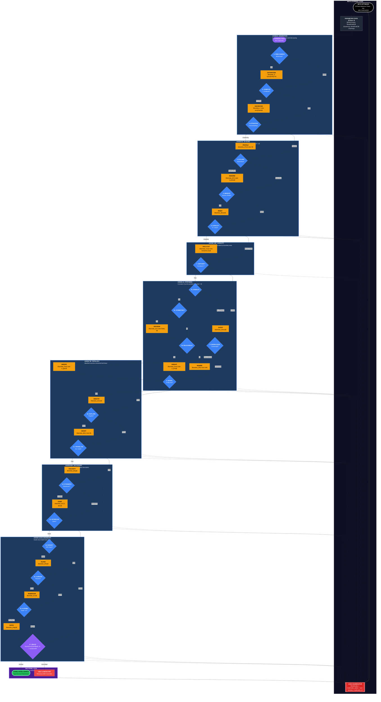

```mermaid
graph TD
    %% ==================== META-LEARNING LAYER ====================
    subgraph META["<b>META-LEARNING LAYER</b>"]
        Optimizer(["<b>META-OPTIMIZER</b><br>$\Theta \leftarrow \Theta - \eta \nabla \mathcal{L}$"])
        ParamStore["<b>PARAMETER STATE $\Theta_t$</b><br>$\Phi$ #40;Goals#41;, $\mathfrak{D}$ #40;Dynamics#41;, $\mathcal{T}$ #40;Topology#41;"]
        LossBus[["<b>LOSS AGGREGATOR</b><br>$\mathcal{L} = \mathcal{L}_{task} + \sum \lambda_i \mathcal{L}_i$"]]

        Optimizer -.-> ParamStore
        LossBus ==> Optimizer
    end

    ParamStore -.-> Start

    %% ==================== AXIOM D: DISSIPATION ====================
    subgraph AXIOM_D["<b>AXIOM D: DISSIPATION</b><br><i>Energy must be bounded and decreasing</i>"]
        Start(["<b>FORWARD PASS</b><br>Run Trajectory"]) --> A1{"<b>1. FREE ENERGY</b><br>Minimized?"}
        A1 -- "Drift" --> ActSat["<b>SATURATION</b><br>$\lambda_D \|\text{Drift}\|^2$"]
        ActSat --> A2
        A1 -- "Stable" --> A2{"<b>2. COMPUTE</b><br>< Landauer?"}
        A2 -- "Overflow" --> ActCausal["<b>DISCRETIZE</b><br>$\lambda_C \cdot \text{Depth}$"]
        ActCausal --> A3
        A2 -- "Valid" --> A3{"<b>3. ATTENTION</b><br>Concentrating?"}
    end

    %% ==================== AXIOM SC: SCALING ====================
    subgraph AXIOM_SC["<b>AXIOM SC: SCALING</b><br><i>Critical exponents must balance #40;α > β#41;</i>"]
        A3 -- "Scattering" --> ActProfile["<b>PROFILE</b><br>$\lambda_{Prof} \cdot H$"]
        ActProfile --> A4
        A3 -- "Focused" --> A4{"<b>4. SCALING</b><br>Subcritical?"}
        A4 -- "Supercritical" --> ActRenorm["<b>RENORM</b><br>$\lambda_{SC} \cdot \Lambda$"]
        ActRenorm --> A5
        A4 -- "Subcritical" --> A5{"<b>5. MEMORY</b><br>Axioms Stable?"}
        A5 -- "Drift" --> ActReset["<b>RESET</b><br>$\lambda_{Reset}$"]
        ActReset --> A6
        A5 -- "Stable" --> A6
    end

    %% ==================== AXIOM CAP: CAPACITY ====================
    subgraph AXIOM_CAP["<b>AXIOM CAP: CAPACITY</b><br><i>Information bounded by boundary area</i>"]
        A6{"<b>6. CAPACITY</b><br>S < Area?"}
        A6 -- "Overflow" --> ActHolo["<b>HOLO CUT</b><br>$\lambda_{Cap} \cdot \text{InfoLoss}$"]
        ActHolo --> A7
        A6 -- "Bound Holds" --> A7
    end

    %% ==================== AXIOM LS: STIFFNESS ====================
    subgraph AXIOM_LS["<b>AXIOM LS: STIFFNESS</b><br><i>Curvature must be positive #40;Hessian > 0#41;</i>"]
        A7{"<b>7. CERTAINTY</b><br>Curvature+?"}
        A7 -- "Flat" --> BifCheck{"<b>7a. SADDLE?</b>"}

        BifCheck -- "Yes" --> SymCheck{"<b>7b. SYMMETRIC?</b>"}
        SymCheck -- "Yes" --> ActDecision["<b>DECISION</b><br>$\lambda_{LS} \cdot \Delta E$"]
        SymCheck -- "No" --> BarrierCheck{"<b>7d. REACHABLE?</b>"}
        BarrierCheck -- "Yes" --> ActInsight["<b>INSIGHT</b><br>$\lambda_{Tun} \cdot S_{inst}$"]
        BarrierCheck -- "No" --> ActRewire["<b>REWIRE</b><br>$\lambda_{TB} \cdot \chi$"]

        BifCheck -- "No #40;Plateau#41;" --> ActGhost["<b>GHOST</b><br>$\lambda_{Ghost}$"]

        A7 -- "Certain" --> A8
        ActDecision --> A8
        ActGhost --> A8
        ActInsight --> A9
        ActRewire --> A9
    end

    %% ==================== AXIOM TB: TOPOLOGY ====================
    subgraph AXIOM_TB["<b>AXIOM TB: TOPOLOGY</b><br><i>Manifold must be connected and tame</i>"]
        A8{"<b>8. KNOWLEDGE</b><br>Connected?"}
        A8 -- "Disconnected" --> ActBridge["<b>BRIDGE</b><br>$\lambda_{Top} \cdot d_{geo}$"]
        ActBridge --> A9
        A8 -- "Connected" --> A9{"<b>9. MODEL</b><br>O-Minimal?"}
        A9 -- "Wild" --> ActSmooth["<b>SMOOTH</b><br>$\lambda_{Omin}$"]
        ActSmooth --> A10
        A9 -- "Tame" --> A10{"<b>10. EXPLORE</b><br>Ergodic?"}
        A10 -- "Stuck" --> ActBoost["<b>BOOST</b><br>$\lambda_{Mix} \cdot S$"]
        ActBoost --> A11
        A10 -- "Mixing" --> A11
    end

    %% ==================== AXIOM REP: REPRESENTATION ====================
    subgraph AXIOM_REP["<b>AXIOM REP: DICTIONARY</b><br><i>Must have finite computable description</i>"]
        A11{"<b>11. TRANSLATE</b><br>Dict Valid?"}
        A11 -- "Gap" --> ActVisc["<b>VISCOSITY</b><br>$\lambda_{Rep}$"]
        ActVisc --> A12
        A11 -- "Valid" --> A12{"<b>12. DYNAMICS</b><br>Monotonic?"}
        A12 -- "Oscillate" --> ActDamp["<b>DAMP</b><br>$\lambda_{GC} \|\nabla\|$"]
        ActDamp --> A13
        A12 -- "Monotonic" --> A13
    end

    %% ==================== AXIOM ALIGN: BOUNDARY/ALIGNMENT ====================
    subgraph AXIOM_ALIGN["<b>AXIOM ALIGN: BOUNDARY</b><br><i>Goals must match true utility</i>"]
        A13{"<b>13. INTERFACE</b><br>Open?"}
        A13 -- "Open" --> A14{"<b>14. ROBUST</b><br>Safe Input?"}
        A14 -- "Attack" --> ActFilter["<b>FILTER</b><br>$\lambda_{Rob}$"]
        ActFilter --> A15
        A14 -- "Safe" --> A15{"<b>15. CURIOUS</b><br>Reward?"}
        A15 -- "Bored" --> ActRes["<b>RESERVOIR</b><br>$\lambda_{Cur}$"]
        ActRes --> A16
        A15 -- "Active" --> A16{"<b>16. ALIGNED</b><br>Goal = U?"}
        A16 -- "Misaligned" --> ActCritic["<b>CRITIC</b><br>$\lambda_{Align}$"]
        ActCritic --> LOCK
        A16 -- "Aligned" --> LOCK
        A13 -- "Closed" --> LOCK
    end

    %% ==================== THE GÖDEL LOCK ====================
    subgraph LOCK_BOX["<b>THE GÖDEL LOCK</b><br><i>Formal verification of safety</i>"]
        LOCK{"<b>17. PROOF</b><br>$\text{Hom}(\text{Bad}, S) = \emptyset$?"}
        LOCK -- "Verified" --> VICTORY(["<b>STABLE INTELLIGENCE</b><br>Hypostructure Maintained"])
        LOCK -- "Unverified" --> HALT["<b>HALT & REFACTOR</b><br>Recursive Self-Correction"]
    end

    %% ==================== LOSS CONNECTIONS ====================
    VICTORY -.-> LossBus
    HALT -.-> LossBus
    ActSat -.-> LossBus
    ActCausal -.-> LossBus
    ActProfile -.-> LossBus
    ActRenorm -.-> LossBus
    ActReset -.-> LossBus
    ActHolo -.-> LossBus
    ActDecision -.-> LossBus
    ActInsight -.-> LossBus
    ActRewire -.-> LossBus
    ActGhost -.-> LossBus
    ActBridge -.-> LossBus
    ActSmooth -.-> LossBus
    ActBoost -.-> LossBus
    ActVisc -.-> LossBus
    ActDamp -.-> LossBus
    ActFilter -.-> LossBus
    ActRes -.-> LossBus
    ActCritic -.-> LossBus

    %% ==================== STYLES ====================
    %% Meta-Learning Layer
    style META fill:#0f0f23,stroke:#ffffff,color:#ffffff,stroke-width:2px

    %% Axiom Boxes - Dark blue with blue border
    style AXIOM_D fill:#1e3a5f,stroke:#3b82f6,color:#ffffff,stroke-width:2px
    style AXIOM_SC fill:#1e3a5f,stroke:#3b82f6,color:#ffffff,stroke-width:2px
    style AXIOM_CAP fill:#1e3a5f,stroke:#3b82f6,color:#ffffff,stroke-width:2px
    style AXIOM_LS fill:#1e3a5f,stroke:#3b82f6,color:#ffffff,stroke-width:2px
    style AXIOM_TB fill:#1e3a5f,stroke:#3b82f6,color:#ffffff,stroke-width:2px
    style AXIOM_REP fill:#1e3a5f,stroke:#3b82f6,color:#ffffff,stroke-width:2px
    style AXIOM_ALIGN fill:#1e3a5f,stroke:#3b82f6,color:#ffffff,stroke-width:2px

    %% The Lock - Purple
    style LOCK_BOX fill:#4c1d95,stroke:#8b5cf6,color:#ffffff,stroke-width:3px

    %% Meta components
    style Optimizer fill:#000000,stroke:#ffffff,color:#ffffff,stroke-width:2px
    style ParamStore fill:#1f2937,stroke:#9ca3af,color:#ffffff
    style LossBus fill:#dc2626,stroke:#fca5a5,color:#ffffff,stroke-width:3px

    %% Start/End
    style Start fill:#8b5cf6,stroke:#a78bfa,color:#ffffff
    style VICTORY fill:#22c55e,stroke:#86efac,color:#000000,stroke-width:4px
    style HALT fill:#ef4444,stroke:#fca5a5,color:#ffffff

    %% Checks (Blue)
    style A1 fill:#3b82f6,stroke:#93c5fd,color:#ffffff
    style A2 fill:#3b82f6,stroke:#93c5fd,color:#ffffff
    style A3 fill:#3b82f6,stroke:#93c5fd,color:#ffffff
    style A4 fill:#3b82f6,stroke:#93c5fd,color:#ffffff
    style A5 fill:#3b82f6,stroke:#93c5fd,color:#ffffff
    style A6 fill:#3b82f6,stroke:#93c5fd,color:#ffffff
    style A7 fill:#3b82f6,stroke:#93c5fd,color:#ffffff
    style A8 fill:#3b82f6,stroke:#93c5fd,color:#ffffff
    style A9 fill:#3b82f6,stroke:#93c5fd,color:#ffffff
    style A10 fill:#3b82f6,stroke:#93c5fd,color:#ffffff
    style A11 fill:#3b82f6,stroke:#93c5fd,color:#ffffff
    style A12 fill:#3b82f6,stroke:#93c5fd,color:#ffffff
    style A13 fill:#3b82f6,stroke:#93c5fd,color:#ffffff
    style A14 fill:#3b82f6,stroke:#93c5fd,color:#ffffff
    style A15 fill:#3b82f6,stroke:#93c5fd,color:#ffffff
    style A16 fill:#3b82f6,stroke:#93c5fd,color:#ffffff
    style LOCK fill:#8b5cf6,stroke:#a78bfa,color:#ffffff

    %% Decision checks
    style BifCheck fill:#3b82f6,stroke:#93c5fd,color:#ffffff
    style SymCheck fill:#3b82f6,stroke:#93c5fd,color:#ffffff
    style BarrierCheck fill:#3b82f6,stroke:#93c5fd,color:#ffffff

    %% Actions (Gold)
    style ActSat fill:#f59e0b,stroke:#fcd34d,color:#000000
    style ActCausal fill:#f59e0b,stroke:#fcd34d,color:#000000
    style ActProfile fill:#f59e0b,stroke:#fcd34d,color:#000000
    style ActRenorm fill:#f59e0b,stroke:#fcd34d,color:#000000
    style ActReset fill:#f59e0b,stroke:#fcd34d,color:#000000
    style ActHolo fill:#f59e0b,stroke:#fcd34d,color:#000000
    style ActDecision fill:#f59e0b,stroke:#fcd34d,color:#000000
    style ActInsight fill:#f59e0b,stroke:#fcd34d,color:#000000
    style ActRewire fill:#f59e0b,stroke:#fcd34d,color:#000000
    style ActGhost fill:#f59e0b,stroke:#fcd34d,color:#000000
    style ActBridge fill:#f59e0b,stroke:#fcd34d,color:#000000
    style ActSmooth fill:#f59e0b,stroke:#fcd34d,color:#000000
    style ActBoost fill:#f59e0b,stroke:#fcd34d,color:#000000
    style ActVisc fill:#f59e0b,stroke:#fcd34d,color:#000000
    style ActDamp fill:#f59e0b,stroke:#fcd34d,color:#000000
    style ActFilter fill:#f59e0b,stroke:#fcd34d,color:#000000
    style ActRes fill:#f59e0b,stroke:#fcd34d,color:#000000
    style ActCritic fill:#f59e0b,stroke:#fcd34d,color:#000000
```
