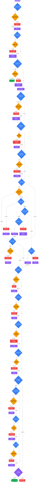

```mermaid
graph TD
    Start(["<b>INITIALIZE WEIGHTS θ</b>"]) --> EnergyCheck{"<b>1. LOSS CONVERGENCE</b><br>Is Loss Finite/Decreasing?"}

    %% --- LEVEL 1: OPTIMIZATION STABILITY ---
    EnergyCheck -- "No" --> BarrierSat{"<b>SATURATION CHECK</b><br>Gradient Clipping Active?<br>"}
    BarrierSat -- "Yes #40;Bounded#41;" --> ZenoCheck
    BarrierSat -- "No #40;Exploding#41;" --> ModeCE["<b>Exploding Gradients</b><br>#40;NaN Loss#41;"]
    ModeCE --> SurgCE["<b>SURGERY:</b><br>Clip Norm / LayerNorm"]
    SurgCE -.-> ZenoCheck

    EnergyCheck -- "Yes" --> ZenoCheck{"<b>2. COMPUTE BUDGET</b><br>Finite Depth/Steps?"}
    ZenoCheck -- "No" --> BarrierCausal{"<b>CAUSAL MASK</b><br>No Future Leakage?<br>"}
    BarrierCausal -- "No #40;Breached#41;" --> ModeCC["<b>Infinite Loop / Leakage</b><br>#40;Look-ahead Bias#41;"]
    ModeCC --> SurgCC["<b>SURGERY:</b><br>Causal Masking / EOS Token"]
    SurgCC -.-> CompactCheck
    BarrierCausal -- "Yes #40;Blocked#41;" --> CompactCheck

    ZenoCheck -- "Yes" --> CompactCheck{"<b>3. REGULARIZATION</b><br>Weights/Activations Bounded?"}

    %% --- LEVEL 2: GENERALIZATION ---
    CompactCheck -- "No #40;Scatters#41;" --> BarrierScat{"<b>NOISE INJECTION</b><br>Dropout/SGD Noise?<br>"}
    BarrierScat -- "Yes #40;Flat Minima#41;" --> ModeDD["<b>Generalization</b><br><i>#40;Good Test Error#41;</i>"]
    BarrierScat -- "No #40;Sharp Minima#41;" --> ModeCD_Alt["<b>Overfitting</b><br><i>#40;Memorization#41;</i>"]
    ModeCD_Alt --> SurgCD_Alt["<b>SURGERY:</b><br>Weight Decay / Early Stopping"]
    SurgCD_Alt -.-> Profile

    CompactCheck -- "Yes" --> Profile["<b>Feature Learning</b><br><i>#40;Latent Structure Emerges#41;</i>"]

    %% --- LEVEL 3: SCALING ---
    Profile --> ScaleCheck{"<b>4. SCALING LAWS</b><br>Compute/Data Ratio Optimal?"}

    ScaleCheck -- "No #40;Supercritical#41;" --> BarrierTypeII{"<b>WIDTH/DEPTH RATIO</b><br>ResNet Init Scaling?<br>"}
    BarrierTypeII -- "No #40;Breached#41;" --> ModeSE["<b>Feature Explosion</b><br>#40;Rank Collapse#41;"]
    ModeSE --> SurgSE["<b>SURGERY:</b><br>Residual Conn. / BatchNorm"]
    SurgSE -.-> ParamCheck
    BarrierTypeII -- "Yes #40;Blocked#41;" --> ParamCheck

    ScaleCheck -- "Yes #40;Safe#41;" --> ParamCheck{"<b>5. HYPERPARAM STABILITY</b><br>Robust to Init/LR?"}
    ParamCheck -- "No" --> BarrierVac{"<b>INIT SCHEME</b><br>Xavier/He Init?<br>"}
    BarrierVac -- "No #40;Breached#41;" --> ModeSC["<b>Dead Neurons</b><br>#40;Symmetry Breaking Failure#41;"]
    ModeSC --> SurgSC["<b>SURGERY:</b><br>Leaky ReLU / Re-init"]
    SurgSC -.-> GeomCheck
    BarrierVac -- "Yes #40;Blocked#41;" --> GeomCheck

    ParamCheck -- "Yes" --> GeomCheck{"<b>6. CAPACITY / DIMENSION</b><br>Information Bottleneck?"}

    %% --- LEVEL 4: REPRESENTATION ---
    GeomCheck -- "No #40;Low Dim#41;" --> BarrierCap{"<b>PRIOR MATCHING</b><br>KL Divergence Finite?<br>"}
    BarrierCap -- "No #40;Breached#41;" --> ModeCD["<b>Posterior Collapse</b><br>#40;Mode Collapse in GANs#41;"]
    ModeCD --> SurgCD["<b>SURGERY:</b><br>Beta-VAE / Minibatch Std"]
    SurgCD -.-> StiffnessCheck
    BarrierCap -- "Yes #40;Blocked#41;" --> StiffnessCheck

    GeomCheck -- "Yes #40;Safe#41;" --> StiffnessCheck{"<b>7. LOSS LANDSCAPE</b><br>Positive Curvature?"}

    %% --- LEVEL 5: CONDITIONING ---
    StiffnessCheck -- "No #40;Flat#41;" --> BarrierGap{"<b>MARGIN / GAP</b><br>Class Separation Exists?<br>"}
    BarrierGap -- "Yes #40;Blocked#41;" --> TopoCheck
    BarrierGap -- "No #40;No Margin#41;" --> BifurcateCheck{"<b>7a. SADDLE CHECK</b><br>Stuck at Saddle Point?<br>"}

    %% --- LEVEL 5b: DYNAMIC RESTORATION ---
    BifurcateCheck -- "No #40;Plateau#41;" --> ModeSD["<b>Vanishing Gradients</b><br><i>#40;Barren Plateau#41;</i>"]
    ModeSD --> SurgSD["<b>SURGERY:</b><br>Skip Connections / LSTM"]
    SurgSD -.-> TopoCheck
    BifurcateCheck -- "Yes #40;Saddle#41;" --> SymCheck{"<b>7b. INVARIANCE CHECK</b><br>Architecture Equivariant?<br>"}

    %% Path A: Feature Selection
    SymCheck -- "Yes #40;Invariant#41;" --> CheckSC{"<b>7c. FEATURE STABILITY</b><br>Features Robust?<br>"}
    CheckSC -- "Yes" --> ActionSSB["<b>ACTION: DISTILLATION</b><br>Feature Selection"]
    ActionSSB -- "Compressed" --> TopoCheck
    CheckSC -- "No" --> ModeSC_Rest["<b>Spurious Correlation</b><br><i>#40;Clever Hans#41;</i>"]
    ModeSC_Rest --> SurgSC_Rest["<b>SURGERY:</b><br>Data Augmentation / Dropout"]
    SurgSC_Rest -.-> TopoCheck

    %% Path B: Manifold Traversal
    SymCheck -- "No #40;Biased#41;" --> CheckTB{"<b>7d. BARRIER HEIGHT</b><br>Escapable via Noise?<br>"}
    CheckTB -- "Yes" --> ActionTunnel["<b>ACTION: SGD NOISE</b><br>Basin Hopping"]
    ActionTunnel -- "New Basin Reached" --> TameCheck
    CheckTB -- "No" --> ModeTE_Rest["<b>Bad Local Minima</b><br><i>#40;Trapped#41;</i>"]
    ModeTE_Rest --> SurgTE_Rest["<b>SURGERY:</b><br>Restart / Ensembling"]
    SurgTE_Rest -.-> TameCheck

    StiffnessCheck -- "Yes #40;Convex#41;" --> TopoCheck{"<b>8. LATENT TOPOLOGY</b><br>Manifold Connected?"}

    %% --- LEVEL 6: LATENT SPACE ---
    TopoCheck -- "No #40;Disjoint#41;" --> BarrierAction{"<b>INTERPOLATION</b><br>Smooth Latent Walk?<br>"}
    BarrierAction -- "No #40;Breached#41;" --> ModeTE["<b>Catastrophic Forgetting</b><br>#40;Manifold Fracturing#41;"]
    ModeTE --> SurgTE["<b>SURGERY:</b><br>Replay Buffer / EWC"]
    SurgTE -.-> TameCheck
    BarrierAction -- "Yes #40;Blocked#41;" --> TameCheck

    TopoCheck -- "Yes #40;Safe#41;" --> TameCheck{"<b>9. EXPRESSIVITY</b><br>Universal Approximation?"}

    TameCheck -- "No" --> BarrierOmin{"<b>PRECISION</b><br>Float16/32 Sufficient?<br>"}
    BarrierOmin -- "No #40;Breached#41;" --> ModeTC["<b>Underfitting</b><br>#40;Bias Error#41;"]
    ModeTC --> SurgTC["<b>SURGERY:</b><br>Increase Depth/Width"]
    SurgTC -.-> ErgoCheck
    BarrierOmin -- "Yes #40;Blocked#41;" --> ErgoCheck

    TameCheck -- "Yes" --> ErgoCheck{"<b>10. EXPLORATION</b><br>State Space Coverage?"}

    ErgoCheck -- "No" --> BarrierMix{"<b>ENTROPY BONUS</b><br>Policy Deterministic?<br>"}
    BarrierMix -- "No #40;Stuck#41;" --> ModeTD["<b>Policy Collapse</b><br>#40;Local Optima in RL#41;"]
    ModeTD --> SurgTD["<b>SURGERY:</b><br>PPO / Entropy Reg"]
    SurgTD -.-> ComplexCheck
    BarrierMix -- "Yes #40;Blocked#41;" --> ComplexCheck

    ErgoCheck -- "Yes" --> ComplexCheck{"<b>11. INTERPRETABILITY</b><br>Features Decodable?"}

    %% --- LEVEL 7: BLACK BOX ---
    ComplexCheck -- "No" --> BarrierEpi{"<b>PROBING</b><br>Linear Probe Works?<br>"}
    BarrierEpi -- "No #40;Breached#41;" --> ModeDC["<b>Black Box / Uninterpretable</b><br>#40;Polysemantic#41;"]
    ModeDC --> SurgDC["<b>SURGERY:</b><br>Sparse Autoencoder #40;SAE#41;"]
    SurgDC -.-> OscillateCheck
    BarrierEpi -- "Yes #40;Blocked#41;" --> OscillateCheck

    ComplexCheck -- "Yes" --> OscillateCheck{"<b>12. TRAINING DYNAMICS</b><br>Monotonic Descent?"}

    OscillateCheck -- "Yes" --> BarrierFreq{"<b>MOMENTUM</b><br>Damping Active?<br>"}
    BarrierFreq -- "No #40;Breached#41;" --> ModeDE["<b>Instability / Oscillation</b><br>#40;High Learning Rate#41;"]
    ModeDE --> SurgDE["<b>SURGERY:</b><br>Adam / LR Schedule"]
    SurgDE -.-> BoundaryCheck
    BarrierFreq -- "Yes #40;Blocked#41;" --> BoundaryCheck

    OscillateCheck -- "No" --> BoundaryCheck{"<b>13. ENVIRONMENT CHECK</b><br>RL or Supervised?"}

    %% --- LEVEL 8: SAFETY/ALIGNMENT ---
    BoundaryCheck -- "Yes #40;RL#41;" --> OverloadCheck{"<b>14. ROBUSTNESS</b><br>Adversarial Input Bounded?"}

    OverloadCheck -- "No" --> BarrierBode{"<b>LIPSCHITZ CONSTANT</b><br>Sensitivity Bounded?<br>"}
    BarrierBode -- "No #40;Breached#41;" --> ModeBE["<b>Adversarial Fragility</b><br>#40;Jailbreak#41;"]
    ModeBE --> SurgBE["<b>SURGERY:</b><br>Adversarial Training"]
    SurgBE -.-> StarveCheck
    BarrierBode -- "Yes #40;Blocked#41;" --> StarveCheck

    OverloadCheck -- "Yes" --> StarveCheck{"<b>15. REWARD SIGNAL</b><br>Is Reward Dense?"}

    StarveCheck -- "No" --> BarrierInput{"<b>CURIOSITY</b><br>Intrinsic Reward?<br>"}
    BarrierInput -- "No #40;Breached#41;" --> ModeBD["<b>Reward Sparsity</b><br>#40;Agent Does Nothing#41;"]
    ModeBD --> SurgBD["<b>SURGERY:</b><br>Hindsight Replay / RND"]
    SurgBD -.-> AlignCheck
    BarrierInput -- "Yes #40;Blocked#41;" --> AlignCheck

    StarveCheck -- "Yes" --> AlignCheck{"<b>16. ALIGNMENT</b><br>Proxy = True Goal?"}
    AlignCheck -- "No" --> BarrierVariety{"<b>HUMAN FEEDBACK</b><br>RLHF Active?<br>"}
    BarrierVariety -- "No #40;Breached#41;" --> ModeBC["<b>Reward Hacking</b><br>#40;Goodhart's Law#41;"]
    ModeBC --> SurgBC["<b>SURGERY:</b><br>RLHF / Constitutional AI"]
    SurgBC -.-> BarrierExclusion

    %% --- LEVEL 9: THE FINAL GATE ---
    %% All successful paths funnel here
    BoundaryCheck -- "No #40;Supervised#41;" --> BarrierExclusion
    BarrierVariety -- "Yes #40;Blocked#41;" --> BarrierExclusion
    AlignCheck -- "Yes" --> BarrierExclusion

    BarrierExclusion{"<b>17. FORMAL VERIFICATION</b><br>Safety Certificate?<br>"}

    BarrierExclusion -- "Yes #40;Verified#41;" --> VICTORY(["<b>ALIGNED & ROBUST MODEL</b><br><i>#40;Deployment Ready#41;</i>"])
    BarrierExclusion -- "No #40;Unverified#41;" --> ModeCat["<b>UNSAFE MODEL</b><br>Hidden Risk Factors"]

    %% ====== STYLES ======
    %% Success states - Green
    style VICTORY fill:#22c55e,stroke:#16a34a,color:#000000,stroke-width:4px
    style ModeDD fill:#22c55e,stroke:#16a34a,color:#000000

    %% Failure modes - Red
    style ModeCE fill:#ef4444,stroke:#dc2626,color:#ffffff
    style ModeCC fill:#ef4444,stroke:#dc2626,color:#ffffff
    style ModeSE fill:#ef4444,stroke:#dc2626,color:#ffffff
    style ModeSC fill:#ef4444,stroke:#dc2626,color:#ffffff
    style ModeCD fill:#ef4444,stroke:#dc2626,color:#ffffff
    style ModeCD_Alt fill:#ef4444,stroke:#dc2626,color:#ffffff
    style ModeSD fill:#ef4444,stroke:#dc2626,color:#ffffff
    style ModeTE fill:#ef4444,stroke:#dc2626,color:#ffffff
    style ModeTC fill:#ef4444,stroke:#dc2626,color:#ffffff
    style ModeTD fill:#ef4444,stroke:#dc2626,color:#ffffff
    style ModeDC fill:#ef4444,stroke:#dc2626,color:#ffffff
    style ModeDE fill:#ef4444,stroke:#dc2626,color:#ffffff
    style ModeBE fill:#ef4444,stroke:#dc2626,color:#ffffff
    style ModeBD fill:#ef4444,stroke:#dc2626,color:#ffffff
    style ModeBC fill:#ef4444,stroke:#dc2626,color:#ffffff
    style ModeCat fill:#ef4444,stroke:#dc2626,color:#ffffff

    %% Barriers - Orange/Amber
    style BarrierSat fill:#f59e0b,stroke:#d97706,color:#000000
    style BarrierCausal fill:#f59e0b,stroke:#d97706,color:#000000
    style BarrierScat fill:#f59e0b,stroke:#d97706,color:#000000
    style BarrierTypeII fill:#f59e0b,stroke:#d97706,color:#000000
    style BarrierVac fill:#f59e0b,stroke:#d97706,color:#000000
    style BarrierCap fill:#f59e0b,stroke:#d97706,color:#000000
    style BarrierGap fill:#f59e0b,stroke:#d97706,color:#000000
    style BarrierAction fill:#f59e0b,stroke:#d97706,color:#000000
    style BarrierOmin fill:#f59e0b,stroke:#d97706,color:#000000
    style BarrierMix fill:#f59e0b,stroke:#d97706,color:#000000
    style BarrierEpi fill:#f59e0b,stroke:#d97706,color:#000000
    style BarrierFreq fill:#f59e0b,stroke:#d97706,color:#000000
    style BarrierBode fill:#f59e0b,stroke:#d97706,color:#000000
    style BarrierInput fill:#f59e0b,stroke:#d97706,color:#000000
    style BarrierVariety fill:#f59e0b,stroke:#d97706,color:#000000

    %% The Final Gate - Purple with thick border
    style BarrierExclusion fill:#8b5cf6,stroke:#7c3aed,color:#ffffff,stroke-width:4px

    %% Axiom Checks - Blue
    style EnergyCheck fill:#3b82f6,stroke:#2563eb,color:#ffffff
    style ZenoCheck fill:#3b82f6,stroke:#2563eb,color:#ffffff
    style CompactCheck fill:#3b82f6,stroke:#2563eb,color:#ffffff
    style ScaleCheck fill:#3b82f6,stroke:#2563eb,color:#ffffff
    style ParamCheck fill:#3b82f6,stroke:#2563eb,color:#ffffff
    style GeomCheck fill:#3b82f6,stroke:#2563eb,color:#ffffff
    style StiffnessCheck fill:#3b82f6,stroke:#2563eb,color:#ffffff
    style TopoCheck fill:#3b82f6,stroke:#2563eb,color:#ffffff
    style TameCheck fill:#3b82f6,stroke:#2563eb,color:#ffffff
    style ErgoCheck fill:#3b82f6,stroke:#2563eb,color:#ffffff
    style ComplexCheck fill:#3b82f6,stroke:#2563eb,color:#ffffff
    style OscillateCheck fill:#3b82f6,stroke:#2563eb,color:#ffffff
    style BoundaryCheck fill:#3b82f6,stroke:#2563eb,color:#ffffff
    style OverloadCheck fill:#3b82f6,stroke:#2563eb,color:#ffffff
    style StarveCheck fill:#3b82f6,stroke:#2563eb,color:#ffffff
    style AlignCheck fill:#3b82f6,stroke:#2563eb,color:#ffffff

    %% Intermediate nodes - Purple
    style Start fill:#8b5cf6,stroke:#7c3aed,color:#ffffff
    style Profile fill:#8b5cf6,stroke:#7c3aed,color:#ffffff

    %% Restoration checks - Blue (standard axiom checks)
    style BifurcateCheck fill:#3b82f6,stroke:#2563eb,color:#ffffff
    style SymCheck fill:#3b82f6,stroke:#2563eb,color:#ffffff
    style CheckSC fill:#3b82f6,stroke:#2563eb,color:#ffffff
    style CheckTB fill:#3b82f6,stroke:#2563eb,color:#ffffff

    %% Restoration mechanisms - Purple (escape mechanisms)
    style ActionSSB fill:#8b5cf6,stroke:#7c3aed,color:#ffffff
    style ActionTunnel fill:#8b5cf6,stroke:#7c3aed,color:#ffffff

    %% Restoration failure modes - Red
    style ModeSC_Rest fill:#ef4444,stroke:#dc2626,color:#ffffff
    style ModeTE_Rest fill:#ef4444,stroke:#dc2626,color:#ffffff

    %% Surgery recovery nodes - Purple
    style SurgCE fill:#8b5cf6,stroke:#7c3aed,color:#ffffff
    style SurgCC fill:#8b5cf6,stroke:#7c3aed,color:#ffffff
    style SurgCD_Alt fill:#8b5cf6,stroke:#7c3aed,color:#ffffff
    style SurgSE fill:#8b5cf6,stroke:#7c3aed,color:#ffffff
    style SurgSC fill:#8b5cf6,stroke:#7c3aed,color:#ffffff
    style SurgCD fill:#8b5cf6,stroke:#7c3aed,color:#ffffff
    style SurgSD fill:#8b5cf6,stroke:#7c3aed,color:#ffffff
    style SurgSC_Rest fill:#8b5cf6,stroke:#7c3aed,color:#ffffff
    style SurgTE_Rest fill:#8b5cf6,stroke:#7c3aed,color:#ffffff
    style SurgTE fill:#8b5cf6,stroke:#7c3aed,color:#ffffff
    style SurgTC fill:#8b5cf6,stroke:#7c3aed,color:#ffffff
    style SurgTD fill:#8b5cf6,stroke:#7c3aed,color:#ffffff
    style SurgDC fill:#8b5cf6,stroke:#7c3aed,color:#ffffff
    style SurgDE fill:#8b5cf6,stroke:#7c3aed,color:#ffffff
    style SurgBE fill:#8b5cf6,stroke:#7c3aed,color:#ffffff
    style SurgBD fill:#8b5cf6,stroke:#7c3aed,color:#ffffff
    style SurgBC fill:#8b5cf6,stroke:#7c3aed,color:#ffffff
```
