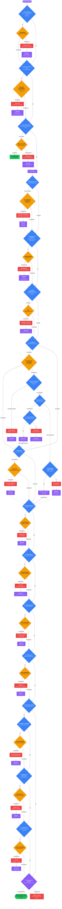

```mermaid
graph TD
    Start(["<b>MODULI PROBLEM</b>"]) --> EnergyCheck{"<b>1. BOUNDEDNESS</b><br>Family in Bounded Hilbert Scheme?<br><i>#40;Matsusaka#41;</i>"}

    %% --- LEVEL 1: PROPERNESS ---
    EnergyCheck -- "No" --> BarrierSat{"<b>NOETHERIAN</b><br>Finite Type over Base?<br>"}
    BarrierSat -- "Yes #40;Blocked#41;" --> ZenoCheck
    BarrierSat -- "No #40;Breached#41;" --> ModeCE["<b>Unbounded Family</b><br>#40;Escapes Hilbert Scheme#41;"]
    ModeCE --> SurgCE["<b>SURGERY:</b><br>Compactification<br><i>#40;Deligne-Mumford#41;</i>"]
    SurgCE -.-> ZenoCheck

    EnergyCheck -- "Yes" --> ZenoCheck{"<b>2. LOCALLY OF FINITE TYPE</b><br>Finite Presentation?"}
    ZenoCheck -- "No" --> BarrierCausal{"<b>VALUATIVE PROPERNESS</b><br>Satisfies Valuative Criterion?<br>"}
    BarrierCausal -- "No #40;Breached#41;" --> ModeCC["<b>Non-Proper</b><br>#40;Fails Existence of Limits#41;"]
    ModeCC --> SurgCC["<b>SURGERY:</b><br>Spreading Out<br><i>#40;Finite Field Reduction#41;</i>"]
    SurgCC -.-> CompactCheck
    BarrierCausal -- "Yes #40;Blocked#41;" --> CompactCheck

    ZenoCheck -- "Yes" --> CompactCheck{"<b>3. STABLE REDUCTION</b><br>Limit Exists over Punctured Disk?"}

    %% --- LEVEL 2: LIMITS ---
    CompactCheck -- "No #40;Scatters#41;" --> BarrierScat{"<b>FIBER STRUCTURE</b><br>Mori Fiber Space?<br>"}
    BarrierScat -- "Yes #40;Benign#41;" --> ModeDD["<b>Mori Fiber Space</b><br><i>#40;Fano Fibration#41;</i>"]
    BarrierScat -- "No #40;Pathological#41;" --> ModeCD_Alt["<b>Bad Reduction</b><br><i>#40;Non-Semistable Fiber#41;</i>"]
    ModeCD_Alt --> SurgCD_Alt["<b>SURGERY:</b><br>Semistable Reduction<br><i>#40;de Jong#41;</i>"]
    SurgCD_Alt -.-> Profile

    CompactCheck -- "Yes" --> Profile["<b>Central Fiber X<sub>0</sub></b>"]

    %% --- LEVEL 3: SINGULARITIES ---
    Profile --> ScaleCheck{"<b>4. SINGULARITY TYPE</b><br>Canonical Singularities?"}

    ScaleCheck -- "No #40;Log-General#41;" --> BarrierTypeII{"<b>LOG-CANONICAL THRESHOLD</b><br>lct#40;X,D#41; > 0?<br>"}
    BarrierTypeII -- "No #40;Breached#41;" --> ModeSE["<b>Non-Canonical Singularity</b><br>#40;Worse than Log-Canonical#41;"]
    ModeSE --> SurgSE["<b>SURGERY:</b><br>Resolution<br><i>#40;Hironaka#41;</i>"]
    SurgSE -.-> ParamCheck
    BarrierTypeII -- "Yes #40;Blocked#41;" --> ParamCheck

    ScaleCheck -- "Yes #40;Safe#41;" --> ParamCheck{"<b>5. OPENNESS OF VERSALITY</b><br>Property Open under Deformation?"}
    ParamCheck -- "No" --> BarrierVac{"<b>SEPARATEDNESS</b><br>Unique Limits?<br>"}
    BarrierVac -- "No #40;Breached#41;" --> ModeSC["<b>Non-Separated</b><br>#40;Double Point Pathology#41;"]
    ModeSC --> SurgSC["<b>SURGERY:</b><br>Blow-up<br><i>#40;Hausdorffification#41;</i>"]
    SurgSC -.-> GeomCheck
    BarrierVac -- "Yes #40;Blocked#41;" --> GeomCheck

    ParamCheck -- "Yes" --> GeomCheck{"<b>6. PURE DIMENSIONALITY</b><br>Equidimensional / Cohen-Macaulay?"}

    %% --- LEVEL 4: SCHEME THEORY ---
    GeomCheck -- "No #40;Impure#41;" --> BarrierCap{"<b>PURITY</b><br>Sheaf Torsion-Free?<br>"}
    BarrierCap -- "No #40;Breached#41;" --> ModeCD["<b>Embedded Component</b><br>#40;Non-Reduced Structure#41;"]
    ModeCD --> SurgCD["<b>SURGERY:</b><br>Primary Decomposition"]
    SurgCD -.-> StiffnessCheck
    BarrierCap -- "Yes #40;Blocked#41;" --> StiffnessCheck

    GeomCheck -- "Yes #40;Safe#41;" --> StiffnessCheck{"<b>7. K-STABILITY</b><br>Hilbert-Mumford Criterion?"}

    %% --- LEVEL 5: GIT ---
    StiffnessCheck -- "No #40;Unstable#41;" --> BarrierGap{"<b>AUTOMORPHISM FINITENESS</b><br>Finite Stabilizer?<br>"}
    BarrierGap -- "Yes #40;Blocked#41;" --> TopoCheck
    BarrierGap -- "No #40;Infinite Aut#41;" --> BifurcateCheck{"<b>7a. WALL-CROSSING</b><br>Bridgeland Stability Changes?<br>"}

    %% --- LEVEL 5b: MMP RESTORATION ---
    BifurcateCheck -- "No #40;Strictly Unstable#41;" --> ModeSD["<b>Strictly Unstable</b><br><i>#40;Empty GIT Quotient#41;</i>"]
    ModeSD --> SurgSD["<b>SURGERY:</b><br>Kirwan Blow-up"]
    SurgSD -.-> TopoCheck
    BifurcateCheck -- "Yes #40;Polystable#41;" --> SymCheck{"<b>7b. REDUCTIVITY</b><br>Group G Reductive?<br>"}

    %% Path A: GIT Variation
    SymCheck -- "Yes #40;Reductive#41;" --> CheckSC{"<b>7c. VARIATION OF GIT</b><br>New Linearization Exists?<br>"}
    CheckSC -- "Yes" --> ActionSSB["<b>ACTION: VGIT</b><br>Thaddeus Flip"]
    ActionSSB -- "New Chamber Reached" --> TopoCheck
    CheckSC -- "No" --> ModeSC_Rest["<b>Bad Quotient</b><br><i>#40;Stacky Obstruction#41;</i>"]
    ModeSC_Rest --> SurgSC_Rest["<b>SURGERY:</b><br>Stacky Quotient #40;[X/G]#41;"]
    SurgSC_Rest -.-> TopoCheck

    %% Path B: Birational Geometry
    SymCheck -- "No #40;Non-Reductive#41;" --> CheckTB{"<b>7d. BIRATIONAL CONTRACTION</b><br>Flip/Flop Exists?<br>"}
    CheckTB -- "Yes" --> ActionTunnel["<b>ACTION: FLIP/FLOP</b><br>MMP Step"]
    ActionTunnel -- "Canonical Model" --> TameCheck
    CheckTB -- "No" --> ModeTE_Rest["<b>Non-Algebraic</b><br><i>#40;Beyond GAGA#41;</i>"]
    ModeTE_Rest --> SurgTE_Rest["<b>SURGERY:</b><br>Algebraization<br><i>#40;Artin Approx.#41;</i>"]
    SurgTE_Rest -.-> TameCheck

    StiffnessCheck -- "Yes #40;Stable#41;" --> TopoCheck{"<b>8. MONODROMY</b><br>Local System Trivial?"}

    %% --- LEVEL 6: HODGE THEORY ---
    TopoCheck -- "No #40;Non-Trivial#41;" --> BarrierAction{"<b>PERIOD MAP</b><br>Finite Monodromy Image?<br>"}
    BarrierAction -- "No #40;Breached#41;" --> ModeTE["<b>Non-Trivial Monodromy</b><br>#40;Picard-Lefschetz#41;"]
    ModeTE --> SurgTE["<b>SURGERY:</b><br>Base Change"]
    SurgTE -.-> TameCheck
    BarrierAction -- "Yes #40;Blocked#41;" --> TameCheck

    TopoCheck -- "Yes #40;Trivial#41;" --> TameCheck{"<b>9. CONSTRUCTIBILITY</b><br>Stratifiable / Definable?"}

    TameCheck -- "No" --> BarrierOmin{"<b>GAGA PRINCIPLE</b><br>Algebraic Structure?<br>"}
    BarrierOmin -- "No #40;Breached#41;" --> ModeTC["<b>Transcendental</b><br>#40;Wild Analytic#41;"]
    ModeTC --> SurgTC["<b>SURGERY:</b><br>Algebraization"]
    SurgTC -.-> ErgoCheck
    BarrierOmin -- "Yes #40;Blocked#41;" --> ErgoCheck

    TameCheck -- "Yes" --> ErgoCheck{"<b>10. IRREDUCIBILITY</b><br>Moduli Space Connected?"}

    ErgoCheck -- "No" --> BarrierMix{"<b>CONNECTEDNESS</b><br>Fulton-Hansen Applies?<br>"}
    BarrierMix -- "No #40;Breached#41;" --> ModeTD["<b>Reducible</b><br>#40;Multiple Components#41;"]
    ModeTD --> SurgTD["<b>SURGERY:</b><br>Component Normalization"]
    SurgTD -.-> ComplexCheck
    BarrierMix -- "Yes #40;Blocked#41;" --> ComplexCheck

    ErgoCheck -- "Yes" --> ComplexCheck{"<b>11. REPRESENTABILITY</b><br>Functor a Scheme?"}

    %% --- LEVEL 7: STACKS ---
    ComplexCheck -- "No" --> BarrierEpi{"<b>STACK STRUCTURE</b><br>DM or Artin Stack?<br>"}
    BarrierEpi -- "No #40;Breached#41;" --> ModeDC["<b>Non-Representable</b><br>#40;Bad Functor#41;"]
    ModeDC --> SurgDC["<b>SURGERY:</b><br>Stackification"]
    SurgDC -.-> OscillateCheck
    BarrierEpi -- "Yes #40;Blocked#41;" --> OscillateCheck

    ComplexCheck -- "Yes" --> OscillateCheck{"<b>12. PROJECTIVITY</b><br>Ample Line Bundle Exists?"}

    OscillateCheck -- "Yes" --> BarrierFreq{"<b>NAKAI-MOISHEZON</b><br>Numerically Positive?<br>"}
    BarrierFreq -- "No #40;Breached#41;" --> ModeDE["<b>Moishezon</b><br>#40;Non-Projective Algebraic#41;"]
    ModeDE --> SurgDE["<b>SURGERY:</b><br>Chow Lemma"]
    SurgDE -.-> BoundaryCheck
    BarrierFreq -- "Yes #40;Blocked#41;" --> BoundaryCheck

    OscillateCheck -- "No" --> BoundaryCheck{"<b>13. BOUNDARY DIVISOR</b><br>Compactification Exists?"}

    %% --- LEVEL 8: COMPACTIFICATION ---
    BoundaryCheck -- "Yes" --> OverloadCheck{"<b>14. NORMAL CROSSINGS</b><br>Boundary Divisor NCD?"}

    OverloadCheck -- "No" --> BarrierBode{"<b>LOG SMOOTHNESS</b><br>Log Structure Regular?<br>"}
    BarrierBode -- "No #40;Breached#41;" --> ModeBE["<b>Non-Toroidal Boundary</b><br>#40;Bad Compactification#41;"]
    ModeBE --> SurgBE["<b>SURGERY:</b><br>Toroidal Blow-up"]
    SurgBE -.-> StarveCheck
    BarrierBode -- "Yes #40;Blocked#41;" --> StarveCheck

    OverloadCheck -- "Yes" --> StarveCheck{"<b>15. POSITIVITY AT BOUNDARY</b><br>Stable Limits Exist?"}

    StarveCheck -- "No" --> BarrierInput{"<b>SEMI-STABILITY</b><br>Boundary Points Stable?<br>"}
    BarrierInput -- "No #40;Breached#41;" --> ModeBD["<b>Unstable Limit</b><br>#40;Boundary Instability#41;"]
    ModeBD --> SurgBD["<b>SURGERY:</b><br>Minimal Model"]
    SurgBD -.-> AlignCheck
    BarrierInput -- "Yes #40;Blocked#41;" --> AlignCheck

    StarveCheck -- "Yes" --> AlignCheck{"<b>16. ADJUNCTION</b><br>Canonical Bundle Well-Behaved?"}
    AlignCheck -- "No" --> BarrierVariety{"<b>KODAIRA DIMENSION</b><br>$\\kappa \\geq 0$?<br>"}
    BarrierVariety -- "No #40;Breached#41;" --> ModeBC["<b>Uniruled</b><br>#40;$\\kappa = -\\infty$#41;"]
    ModeBC --> SurgBC["<b>SURGERY:</b><br>Canonical Model"]
    SurgBC -.-> BarrierExclusion

    %% --- LEVEL 9: THE FINAL GATE ---
    %% All successful paths funnel here
    BoundaryCheck -- "No" --> BarrierExclusion
    BarrierVariety -- "Yes #40;Blocked#41;" --> BarrierExclusion
    AlignCheck -- "Yes" --> BarrierExclusion

    BarrierExclusion{"<b>17. OBSTRUCTION THEORY</b><br>$H^2#40;\\mathcal{T}_X#41; = 0$?<br>"}

    BarrierExclusion -- "Yes #40;Unobstructed#41;" --> VICTORY(["<b>SMOOTH MODULI SPACE</b><br><i>#40;Representable, Proper, Smooth#41;</i>"])
    BarrierExclusion -- "No #40;Obstructed#41;" --> ModeCat["<b>SINGULAR MODULI</b><br>Virtual Fundamental Class Required"]

    %% ====== STYLES ======
    %% Success states - Green
    style VICTORY fill:#22c55e,stroke:#16a34a,color:#000000,stroke-width:4px
    style ModeDD fill:#22c55e,stroke:#16a34a,color:#000000

    %% Failure modes - Red
    style ModeCE fill:#ef4444,stroke:#dc2626,color:#ffffff
    style ModeCC fill:#ef4444,stroke:#dc2626,color:#ffffff
    style ModeSE fill:#ef4444,stroke:#dc2626,color:#ffffff
    style ModeSC fill:#ef4444,stroke:#dc2626,color:#ffffff
    style ModeCD fill:#ef4444,stroke:#dc2626,color:#ffffff
    style ModeCD_Alt fill:#ef4444,stroke:#dc2626,color:#ffffff
    style ModeSD fill:#ef4444,stroke:#dc2626,color:#ffffff
    style ModeTE fill:#ef4444,stroke:#dc2626,color:#ffffff
    style ModeTC fill:#ef4444,stroke:#dc2626,color:#ffffff
    style ModeTD fill:#ef4444,stroke:#dc2626,color:#ffffff
    style ModeDC fill:#ef4444,stroke:#dc2626,color:#ffffff
    style ModeDE fill:#ef4444,stroke:#dc2626,color:#ffffff
    style ModeBE fill:#ef4444,stroke:#dc2626,color:#ffffff
    style ModeBD fill:#ef4444,stroke:#dc2626,color:#ffffff
    style ModeBC fill:#ef4444,stroke:#dc2626,color:#ffffff
    style ModeCat fill:#ef4444,stroke:#dc2626,color:#ffffff

    %% Barriers - Orange/Amber
    style BarrierSat fill:#f59e0b,stroke:#d97706,color:#000000
    style BarrierCausal fill:#f59e0b,stroke:#d97706,color:#000000
    style BarrierScat fill:#f59e0b,stroke:#d97706,color:#000000
    style BarrierTypeII fill:#f59e0b,stroke:#d97706,color:#000000
    style BarrierVac fill:#f59e0b,stroke:#d97706,color:#000000
    style BarrierCap fill:#f59e0b,stroke:#d97706,color:#000000
    style BarrierGap fill:#f59e0b,stroke:#d97706,color:#000000
    style BarrierAction fill:#f59e0b,stroke:#d97706,color:#000000
    style BarrierOmin fill:#f59e0b,stroke:#d97706,color:#000000
    style BarrierMix fill:#f59e0b,stroke:#d97706,color:#000000
    style BarrierEpi fill:#f59e0b,stroke:#d97706,color:#000000
    style BarrierFreq fill:#f59e0b,stroke:#d97706,color:#000000
    style BarrierBode fill:#f59e0b,stroke:#d97706,color:#000000
    style BarrierInput fill:#f59e0b,stroke:#d97706,color:#000000
    style BarrierVariety fill:#f59e0b,stroke:#d97706,color:#000000

    %% The Final Gate - Purple with thick border
    style BarrierExclusion fill:#8b5cf6,stroke:#7c3aed,color:#ffffff,stroke-width:4px

    %% Axiom Checks - Blue
    style EnergyCheck fill:#3b82f6,stroke:#2563eb,color:#ffffff
    style ZenoCheck fill:#3b82f6,stroke:#2563eb,color:#ffffff
    style CompactCheck fill:#3b82f6,stroke:#2563eb,color:#ffffff
    style ScaleCheck fill:#3b82f6,stroke:#2563eb,color:#ffffff
    style ParamCheck fill:#3b82f6,stroke:#2563eb,color:#ffffff
    style GeomCheck fill:#3b82f6,stroke:#2563eb,color:#ffffff
    style StiffnessCheck fill:#3b82f6,stroke:#2563eb,color:#ffffff
    style TopoCheck fill:#3b82f6,stroke:#2563eb,color:#ffffff
    style TameCheck fill:#3b82f6,stroke:#2563eb,color:#ffffff
    style ErgoCheck fill:#3b82f6,stroke:#2563eb,color:#ffffff
    style ComplexCheck fill:#3b82f6,stroke:#2563eb,color:#ffffff
    style OscillateCheck fill:#3b82f6,stroke:#2563eb,color:#ffffff
    style BoundaryCheck fill:#3b82f6,stroke:#2563eb,color:#ffffff
    style OverloadCheck fill:#3b82f6,stroke:#2563eb,color:#ffffff
    style StarveCheck fill:#3b82f6,stroke:#2563eb,color:#ffffff
    style AlignCheck fill:#3b82f6,stroke:#2563eb,color:#ffffff

    %% Intermediate nodes - Purple
    style Start fill:#8b5cf6,stroke:#7c3aed,color:#ffffff
    style Profile fill:#8b5cf6,stroke:#7c3aed,color:#ffffff

    %% Restoration checks - Blue (standard axiom checks)
    style BifurcateCheck fill:#3b82f6,stroke:#2563eb,color:#ffffff
    style SymCheck fill:#3b82f6,stroke:#2563eb,color:#ffffff
    style CheckSC fill:#3b82f6,stroke:#2563eb,color:#ffffff
    style CheckTB fill:#3b82f6,stroke:#2563eb,color:#ffffff

    %% Restoration mechanisms - Purple (escape mechanisms)
    style ActionSSB fill:#8b5cf6,stroke:#7c3aed,color:#ffffff
    style ActionTunnel fill:#8b5cf6,stroke:#7c3aed,color:#ffffff

    %% Restoration failure modes - Red
    style ModeSC_Rest fill:#ef4444,stroke:#dc2626,color:#ffffff
    style ModeTE_Rest fill:#ef4444,stroke:#dc2626,color:#ffffff

    %% Surgery recovery nodes - Purple
    style SurgCE fill:#8b5cf6,stroke:#7c3aed,color:#ffffff
    style SurgCC fill:#8b5cf6,stroke:#7c3aed,color:#ffffff
    style SurgCD_Alt fill:#8b5cf6,stroke:#7c3aed,color:#ffffff
    style SurgSE fill:#8b5cf6,stroke:#7c3aed,color:#ffffff
    style SurgSC fill:#8b5cf6,stroke:#7c3aed,color:#ffffff
    style SurgCD fill:#8b5cf6,stroke:#7c3aed,color:#ffffff
    style SurgSD fill:#8b5cf6,stroke:#7c3aed,color:#ffffff
    style SurgSC_Rest fill:#8b5cf6,stroke:#7c3aed,color:#ffffff
    style SurgTE_Rest fill:#8b5cf6,stroke:#7c3aed,color:#ffffff
    style SurgTE fill:#8b5cf6,stroke:#7c3aed,color:#ffffff
    style SurgTC fill:#8b5cf6,stroke:#7c3aed,color:#ffffff
    style SurgTD fill:#8b5cf6,stroke:#7c3aed,color:#ffffff
    style SurgDC fill:#8b5cf6,stroke:#7c3aed,color:#ffffff
    style SurgDE fill:#8b5cf6,stroke:#7c3aed,color:#ffffff
    style SurgBE fill:#8b5cf6,stroke:#7c3aed,color:#ffffff
    style SurgBD fill:#8b5cf6,stroke:#7c3aed,color:#ffffff
    style SurgBC fill:#8b5cf6,stroke:#7c3aed,color:#ffffff
```
