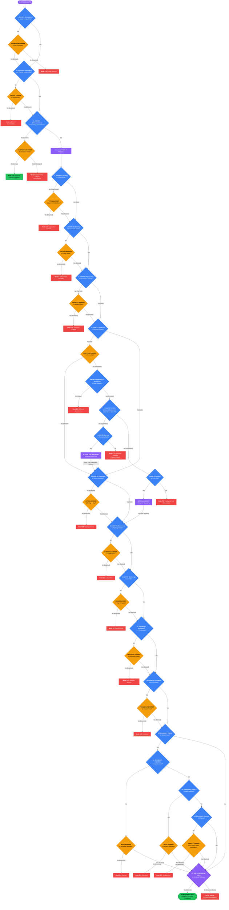

```mermaid
graph TD
    Start(["<b>START DIAGNOSTIC</b>"]) --> EnergyCheck{"<b>1. AXIOM D #40;Dissipation#41;</b><br>Is Global Energy Finite?"}

    %% --- LEVEL 1: CONSERVATION ---
    EnergyCheck -- "No" --> BarrierSat{"<b>SATURATION BARRIER</b><br>Is Drift Controlled?<br>"}
    BarrierSat -- "Yes #40;Blocked#41;" --> ZenoCheck
    BarrierSat -- "No #40;Breached#41;" --> ModeCE["<b>Mode C.E</b>: Energy Blow-Up"]

    EnergyCheck -- "Yes" --> ZenoCheck{"<b>2. AXIOM REC #40;Recovery#41;</b><br>Are Discrete Events Finite?"}
    ZenoCheck -- "No" --> BarrierCausal{"<b>CAUSAL CENSOR</b><br>Is Depth Finite?<br>"}
    BarrierCausal -- "No #40;Breached#41;" --> ModeCC["<b>Mode C.C</b>: Event Accumulation"]
    BarrierCausal -- "Yes #40;Blocked#41;" --> CompactCheck

    ZenoCheck -- "Yes" --> CompactCheck{"<b>3. AXIOM C #40;Compactness#41;</b><br>Does Energy Concentrate?"}

    %% --- LEVEL 2: DUALITY ---
    CompactCheck -- "No #40;Scatters#41;" --> BarrierScat{"<b>SCATTERING BARRIER</b><br>Is Interaction Finite?<br>"}
    BarrierScat -- "Yes #40;Benign#41;" --> ModeDD["<b>Mode D.D</b>: Dispersion<br><i>#40;Global Existence#41;</i>"]
    BarrierScat -- "No #40;Pathological#41;" --> ModeCD_Alt["<b>Mode C.D</b>: Geometric Collapse<br><i>#40;Via Escape#41;</i>"]

    CompactCheck -- "Yes" --> Profile["<b>Canonical Profile V Emerges</b>"]

    %% --- LEVEL 3: SYMMETRY ---
    Profile --> ScaleCheck{"<b>4. AXIOM SC #40;Scaling#41;</b><br>Is it Subcritical?"}

    ScaleCheck -- "No #40;Supercritical#41;" --> BarrierTypeII{"<b>TYPE II BARRIER</b><br>Is Renorm Cost Infinite?<br>"}
    BarrierTypeII -- "No #40;Breached#41;" --> ModeSE["<b>Mode S.E</b>: Supercritical Cascade"]
    BarrierTypeII -- "Yes #40;Blocked#41;" --> ParamCheck

    ScaleCheck -- "Yes #40;Safe#41;" --> ParamCheck{"<b>5. AXIOM SC #40;Stability#41;</b><br>Are Constants Stable?"}
    ParamCheck -- "No" --> BarrierVac{"<b>VACUUM BARRIER</b><br>Is Phase Stable?<br>"}
    BarrierVac -- "No #40;Breached#41;" --> ModeSC["<b>Mode S.C</b>: Parameter Instability"]
    BarrierVac -- "Yes #40;Blocked#41;" --> GeomCheck

    ParamCheck -- "Yes" --> GeomCheck{"<b>6. AXIOM CAP #40;Capacity#41;</b><br>Is Dimension > Critical?"}

    %% --- LEVEL 4: GEOMETRY ---
    GeomCheck -- "No #40;Too Thin#41;" --> BarrierCap{"<b>CAPACITY BARRIER</b><br>Is Measure Zero?<br>"}
    BarrierCap -- "No #40;Breached#41;" --> ModeCD["<b>Mode C.D</b>: Geometric Collapse"]
    BarrierCap -- "Yes #40;Blocked#41;" --> StiffnessCheck

    GeomCheck -- "Yes #40;Safe#41;" --> StiffnessCheck{"<b>7. AXIOM LS #40;Stiffness#41;</b><br>Is Hessian Positive?"}

    %% --- LEVEL 5: STIFFNESS ---
    StiffnessCheck -- "No #40;Flat#41;" --> BarrierGap{"<b>SPECTRAL BARRIER</b><br>Is there a Gap?<br>"}
    BarrierGap -- "Yes #40;Blocked#41;" --> TopoCheck
    BarrierGap -- "No #40;Stagnation#41;" --> BifurcateCheck{"<b>BIFURCATION CHECK #40;Axiom LS#41;</b><br>Is State Unstable?<br>"}

    %% --- LEVEL 5b: DYNAMIC RESTORATION (Deterministic) ---
    BifurcateCheck -- "No #40;Stable#41;" --> ModeSD["<b>Mode S.D</b>: Stiffness Breakdown"]
    BifurcateCheck -- "Yes #40;Unstable#41;" --> SymCheck{"<b>SYMMETRY CHECK</b><br>Is Vacuum Degenerate?<br><i>#40;Does Group G exist?#41;</i>"}

    %% Path A: Symmetry Breaking (Governed by Axiom SC)
    SymCheck -- "Yes #40;Symmetric#41;" --> CheckSC{"<b>AXIOM SC #40;Param#41;</b><br>Are Constants Stable?<br>"}
    CheckSC -- "Yes" --> ActionSSB["<b>ACTION: SYM. BREAKING</b><br>Generates Mass Gap"]
    ActionSSB -- "Mass Gap Guarantees Stiffness" --> TopoCheck
    CheckSC -- "No" --> ModeSC_Rest["<b>Mode S.C</b>: Parameter Instability<br><i>#40;Vacuum Decay#41;</i>"]

    %% Path B: Surgery (Governed by Axiom TB)
    SymCheck -- "No #40;Asymmetric#41;" --> CheckTB{"<b>AXIOM TB #40;Action#41;</b><br>Is Cost Finite?<br>"}
    CheckTB -- "Yes" --> ActionSurgery["<b>ACTION: SURGERY</b><br>Dissipates Singularity"]
    ActionSurgery -- "Re-verify Topology" --> TameCheck
    CheckTB -- "No" --> ModeTE_Rest["<b>Mode T.E</b>: Topological Twist<br><i>#40;Metastasis#41;</i>"]

    StiffnessCheck -- "Yes #40;Safe#41;" --> TopoCheck{"<b>8. AXIOM TB #40;Topology#41;</b><br>Is Sector Accessible?"}

    %% --- LEVEL 6: TOPOLOGY ---
    TopoCheck -- "No #40;Protected#41;" --> BarrierAction{"<b>ACTION BARRIER</b><br>Is Energy < Gap?<br>"}
    BarrierAction -- "No #40;Breached#41;" --> ModeTE["<b>Mode T.E</b>: Topological Twist"]
    BarrierAction -- "Yes #40;Blocked#41;" --> TameCheck

    TopoCheck -- "Yes #40;Safe#41;" --> TameCheck{"<b>9. AXIOM TB #40;Tameness#41;</b><br>Is Topology Simple?"}

    TameCheck -- "No" --> BarrierOmin{"<b>O-MINIMAL BARRIER</b><br>Is it Definable?<br>"}
    BarrierOmin -- "No #40;Breached#41;" --> ModeTC["<b>Mode T.C</b>: Labyrinthine"]
    BarrierOmin -- "Yes #40;Blocked#41;" --> ErgoCheck

    TameCheck -- "Yes" --> ErgoCheck{"<b>10. AXIOM TB #40;Mixing#41;</b><br>Does it Mix?"}

    ErgoCheck -- "No" --> BarrierMix{"<b>MIXING BARRIER</b><br>Is Trap Escapable?<br>"}
    BarrierMix -- "No #40;Breached#41;" --> ModeTD["<b>Mode T.D</b>: Glassy Freeze"]
    BarrierMix -- "Yes #40;Blocked#41;" --> ComplexCheck

    ErgoCheck -- "Yes" --> ComplexCheck{"<b>11. AXIOM REP #40;Dictionary#41;</b><br>Is it Computable?"}

    %% --- LEVEL 7: COMPLEXITY ---
    ComplexCheck -- "No" --> BarrierEpi{"<b>EPISTEMIC BARRIER</b><br>Is Description Finite?<br>"}
    BarrierEpi -- "No #40;Breached#41;" --> ModeDC["<b>Mode D.C</b>: Semantic Horizon"]
    BarrierEpi -- "Yes #40;Blocked#41;" --> OscillateCheck

    ComplexCheck -- "Yes" --> OscillateCheck{"<b>12. AXIOM GC #40;Gradient#41;</b><br>Does it Oscillate?"}

    OscillateCheck -- "Yes" --> BarrierFreq{"<b>FREQUENCY BARRIER</b><br>Is Integral Finite?<br>"}
    BarrierFreq -- "No #40;Breached#41;" --> ModeDE["<b>Mode D.E</b>: Oscillatory"]
    BarrierFreq -- "Yes #40;Blocked#41;" --> BoundaryCheck

    OscillateCheck -- "No" --> BoundaryCheck{"<b>13. BOUNDARY CHECK</b><br>Is System Open?"}

    %% --- LEVEL 8: BOUNDARY ---
    BoundaryCheck -- "Yes" --> OverloadCheck{"<b>14. BOUNDARY: CONTROL</b><br>Is Input Bounded?"}

    OverloadCheck -- "Yes" --> BarrierBode{"<b>BODE BARRIER</b><br>Is Sensitivity Bounded?<br>"}
    BarrierBode -- "No #40;Breached#41;" --> ModeBE["<b>Mode B.E</b>: Injection"]

    OverloadCheck -- "No" --> StarveCheck{"<b>15. BOUNDARY: SUPPLY</b><br>Is Input Sufficient?"}
    StarveCheck -- "Yes" --> BarrierInput{"<b>INPUT BARRIER</b><br>Is Reserve Sufficient?<br>"}
    BarrierInput -- "No #40;Breached#41;" --> ModeBD["<b>Mode B.D</b>: Starvation"]

    StarveCheck -- "No" --> AlignCheck{"<b>16. BOUNDARY: GAUGE</b><br>Is it Aligned?"}
    AlignCheck -- "No" --> BarrierVariety{"<b>VARIETY BARRIER</b><br>Does Control Match Disturbance?<br>"}
    BarrierVariety -- "No #40;Breached#41;" --> ModeBC["<b>Mode B.C</b>: Misalignment"]

    %% --- LEVEL 9: THE FINAL GATE ---
    %% All successful paths funnel here
    BoundaryCheck -- "No" --> BarrierExclusion
    BarrierBode -- "Yes #40;Blocked#41;" --> BarrierExclusion
    BarrierInput -- "Yes #40;Blocked#41;" --> BarrierExclusion
    BarrierVariety -- "Yes #40;Blocked#41;" --> BarrierExclusion
    AlignCheck -- "Yes" --> BarrierExclusion

    BarrierExclusion{"<b>17. THE CATEGORICAL LOCK</b><br>Is Hom#40;Bad, S#41; Empty?<br>"}

    BarrierExclusion -- "Yes #40;Blocked#41;" --> VICTORY(["<b>GLOBAL REGULARITY</b><br><i>#40;Structural Exclusion Confirmed#41;</i>"])
    BarrierExclusion -- "No #40;Morphism Exists#41;" --> ModeCat["<b>FATAL ERROR</b><br>Structural Inconsistency"]

    %% ====== STYLES ======
    %% Success states - Green
    style VICTORY fill:#22c55e,stroke:#16a34a,color:#000000,stroke-width:4px
    style ModeDD fill:#22c55e,stroke:#16a34a,color:#000000

    %% Failure modes - Red
    style ModeCE fill:#ef4444,stroke:#dc2626,color:#ffffff
    style ModeCC fill:#ef4444,stroke:#dc2626,color:#ffffff
    style ModeSE fill:#ef4444,stroke:#dc2626,color:#ffffff
    style ModeSC fill:#ef4444,stroke:#dc2626,color:#ffffff
    style ModeCD fill:#ef4444,stroke:#dc2626,color:#ffffff
    style ModeCD_Alt fill:#ef4444,stroke:#dc2626,color:#ffffff
    style ModeSD fill:#ef4444,stroke:#dc2626,color:#ffffff
    style ModeTE fill:#ef4444,stroke:#dc2626,color:#ffffff
    style ModeTC fill:#ef4444,stroke:#dc2626,color:#ffffff
    style ModeTD fill:#ef4444,stroke:#dc2626,color:#ffffff
    style ModeDC fill:#ef4444,stroke:#dc2626,color:#ffffff
    style ModeDE fill:#ef4444,stroke:#dc2626,color:#ffffff
    style ModeBE fill:#ef4444,stroke:#dc2626,color:#ffffff
    style ModeBD fill:#ef4444,stroke:#dc2626,color:#ffffff
    style ModeBC fill:#ef4444,stroke:#dc2626,color:#ffffff
    style ModeCat fill:#ef4444,stroke:#dc2626,color:#ffffff

    %% Barriers - Orange/Amber
    style BarrierSat fill:#f59e0b,stroke:#d97706,color:#000000
    style BarrierCausal fill:#f59e0b,stroke:#d97706,color:#000000
    style BarrierScat fill:#f59e0b,stroke:#d97706,color:#000000
    style BarrierTypeII fill:#f59e0b,stroke:#d97706,color:#000000
    style BarrierVac fill:#f59e0b,stroke:#d97706,color:#000000
    style BarrierCap fill:#f59e0b,stroke:#d97706,color:#000000
    style BarrierGap fill:#f59e0b,stroke:#d97706,color:#000000
    style BarrierAction fill:#f59e0b,stroke:#d97706,color:#000000
    style BarrierOmin fill:#f59e0b,stroke:#d97706,color:#000000
    style BarrierMix fill:#f59e0b,stroke:#d97706,color:#000000
    style BarrierEpi fill:#f59e0b,stroke:#d97706,color:#000000
    style BarrierFreq fill:#f59e0b,stroke:#d97706,color:#000000
    style BarrierBode fill:#f59e0b,stroke:#d97706,color:#000000
    style BarrierInput fill:#f59e0b,stroke:#d97706,color:#000000
    style BarrierVariety fill:#f59e0b,stroke:#d97706,color:#000000

    %% The Final Gate - Purple with thick border
    style BarrierExclusion fill:#8b5cf6,stroke:#7c3aed,color:#ffffff,stroke-width:4px

    %% Axiom Checks - Blue
    style EnergyCheck fill:#3b82f6,stroke:#2563eb,color:#ffffff
    style ZenoCheck fill:#3b82f6,stroke:#2563eb,color:#ffffff
    style CompactCheck fill:#3b82f6,stroke:#2563eb,color:#ffffff
    style ScaleCheck fill:#3b82f6,stroke:#2563eb,color:#ffffff
    style ParamCheck fill:#3b82f6,stroke:#2563eb,color:#ffffff
    style GeomCheck fill:#3b82f6,stroke:#2563eb,color:#ffffff
    style StiffnessCheck fill:#3b82f6,stroke:#2563eb,color:#ffffff
    style TopoCheck fill:#3b82f6,stroke:#2563eb,color:#ffffff
    style TameCheck fill:#3b82f6,stroke:#2563eb,color:#ffffff
    style ErgoCheck fill:#3b82f6,stroke:#2563eb,color:#ffffff
    style ComplexCheck fill:#3b82f6,stroke:#2563eb,color:#ffffff
    style OscillateCheck fill:#3b82f6,stroke:#2563eb,color:#ffffff
    style BoundaryCheck fill:#3b82f6,stroke:#2563eb,color:#ffffff
    style OverloadCheck fill:#3b82f6,stroke:#2563eb,color:#ffffff
    style StarveCheck fill:#3b82f6,stroke:#2563eb,color:#ffffff
    style AlignCheck fill:#3b82f6,stroke:#2563eb,color:#ffffff

    %% Intermediate nodes - Purple
    style Start fill:#8b5cf6,stroke:#7c3aed,color:#ffffff
    style Profile fill:#8b5cf6,stroke:#7c3aed,color:#ffffff

    %% Restoration checks - Blue (standard axiom checks)
    style BifurcateCheck fill:#3b82f6,stroke:#2563eb,color:#ffffff
    style SymCheck fill:#3b82f6,stroke:#2563eb,color:#ffffff
    style CheckSC fill:#3b82f6,stroke:#2563eb,color:#ffffff
    style CheckTB fill:#3b82f6,stroke:#2563eb,color:#ffffff

    %% Restoration mechanisms - Purple (escape mechanisms)
    style ActionSSB fill:#8b5cf6,stroke:#7c3aed,color:#ffffff
    style ActionSurgery fill:#8b5cf6,stroke:#7c3aed,color:#ffffff

    %% Restoration failure modes - Red
    style ModeSC_Rest fill:#ef4444,stroke:#dc2626,color:#ffffff
    style ModeTE_Rest fill:#ef4444,stroke:#dc2626,color:#ffffff
```
