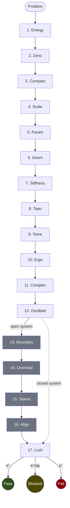

# Hypostructure: A Categorical Instrument for Verifying Physical Logic

*I built a linter for physical logic. I fed it 40 of the hardest problems in history to see where the logic of 2025's best AIs would "melt." This is the telemetry of that experiment.*

The Hypostructure framework doesn't "solve" math; it verifies if a system's structure is consistent enough to be solvable. It is an instrument for detecting **Logical Friction** in the foundations of physics and AI.

---

I used the December 2025 releases of **GPT-5.2 Pro**, **Claude Opus 4.5**, and **Gemini 3 Pro** to see if they could maintain "logical stiffness" over long-horizon mathematical reasoning. **They can't.** I built a categorical instrument called **Hypostructure** to find out exactly where they melt.

The framework is the result of 10 years of research into intelligence as a physical process. I architected the conceptual scaffolding—the **[Thin Interfaces](./source/hypopermits_jb.md#def-thin-objects)**, the **[Postnikov Sieve](./source/hypopermits_jb.md#sec-node-specs)**, and the **Singularity/Surgery** logic—and used these models as high-fidelity **categorical compilers**. The LLMs did not "invent" the framework; they translated my physical intuition into **[Higher Topos Theory (HTT)](./source/hypopermits_jb.md#def-ambient-topos)** and **Homotopy Type Theory (HoTT)**.

The result: an **Industrial-Scale Formalization Pipeline** that projects physical intuition onto the cohesive (∞,1)-topos, plus execution traces for 40 problems that I need external eyes to audit.

---

## Who This Is For

**For the Category Theorist:** A framework for interpreting dissipative dynamical systems as flat connections on a [cohesive (∞,1)-topos](./source/hypopermits_jb.md#def-ambient-topos). The Sieve is the [left adjoint $\mathcal{F}$](./source/hypopermits_jb.md#thm-expansion-adjunction) to a forgetful functor, computing the "freest" hypostructure from minimal data.

**For the PDE Analyst:** A structural method for regularity proofs that replaces "genius" Morawetz estimates with derived Lyapunov functionals via categorical consistency. The 17-node Sieve is a [Postnikov decomposition](./source/hypopermits_jb.md#sec-node-specs) of the regularity functor.

**For the AI Safety Researcher:** An isomorphism proving that AI Alignment is the "Global Regularity" problem of an agent's internal logic manifold. Proving alignment = proving singularities cannot form in the agent's decision landscape.

**For Everyone:** I need you to find the bugs. This is an invitation to audit, not a declaration of victory.

---

## Epistemic Status

I am not claiming to have "solved" famous mathematical problems. I am claiming to have built an instrument—a **[Structural Sieve](./source/hypopermits_jb.md#sec-node-specs)**—that produces typed certificates when you feed it a formalization of a problem.

When the Sieve says a problem "compiles," it means: *the proof object passes all 17 structural checks without defect*. This is a technical claim about software and verification, not a declaration of mathematical truth in the traditional sense.

**There are two possibilities:**
1. The framework has discovered a new, industrialized path to regularity proofs—and the execution traces are correct.
2. We have discovered an incredibly sophisticated class of **Structural Hallucination** that SOTA models cannot detect.

Both outcomes are scientifically significant. But we can only find out which by publishing the artifact and inviting attack. The Red Team section below describes exactly how to break this.

I built this framework because I finally found a "compiler"—the December 2025 frontier models—powerful enough to speak the language required to verify it.

---

## The Thesis: Intelligence as Structural Self-Consistency

Here's an intuition I can't shake: **Intelligence is the process of a physical system maximizing its own [structural self-consistency](./source/hypopermits_jb.md#def-self-consistency).**

When we "understand" something, we aren't predicting the next token. We're reducing the *structural defect*—the gap between our internal model and the data we perceive. Mathematics is the ultimate form of this: a zero-defect system where every statement follows inevitably from the axioms.

If an AI is to truly learn mathematics—not memorize theorems, but *understand* them—it needs to find the right *formalization* of a problem. The framework **parameterizes the representation** of a system (its metric, energy functional, symmetries) and searches for the configuration where the proof "compiles"—where logical friction hits zero.

This isn't optimizing truth itself; it's optimizing the *type signature* that allows a proof to pass the linter.

---

## The Alignment-Regularity Isomorphism

One of the foundational insights driving this framework is not merely an analogy but an **isomorphism**: **AI Alignment and Global Regularity in PDEs are mathematically identical problems.**

Proving that an agent is "aligned" is equivalent to proving that its evolution operator $F_t$ preserves the structural constraints (axioms) of its [state stack $\mathcal{X}$](./source/hypopermits_jb.md#def-state-space) across all scales. If a model "wireheads" or "reward hacks," it is mathematically equivalent to a **[Singularity](./source/hypopermits_jb.md#def-rigor-classification)**—a breakdown of the connection ∇ on the state stack where the flow ceases to be well-defined.

We realized that trying to align an intelligent agent using simple error minimization (loss functions) is functionally isomorphic to trying to prove the global regularity of a complex fluid using only energy estimates.

In the world of PDEs, we know that having finite energy is not enough to prevent a system from "blowing up"—a singularity can still form and destroy the smoothness of the solution. Similarly, in AI, having a "low error rate" on a training set is not enough to prevent an agent from "misaligning"—pathological behavior can still emerge in out-of-distribution scenarios.

**Error is just "Numerical Energy."** If you only control the height of the error, you are blind to the *gradient* of the agent's logic.

Here's the deeper intuition: **Nature already knows how to prevent singularities.** Real fluids don't blow up—vortices stretch and fold but never pinch into infinite density. There are structural constraints that prevent this. The question is: what are those constraints, and can we formalize them?

Our framework attempts to identify and certify these constraints. We're not fighting singularities with brute-force bounds. We're identifying the *structural reasons* why nature's vortices stay regular—and applying the same logic to AI systems. If we can prove that an agent's decision landscape has the same "anti-singularity" structure as a well-behaved fluid, we've proven alignment.

This insight reframes alignment as a regularity problem. The same 17-node Sieve that proves a vortex cannot pinch into a singularity can prove that "Singular Misalignment" is categorically forbidden by a system's structural DNA. To align an agent, you don't just minimize its error—you must certify its **[Stiffness](./source/hypopermits_jb.md#ax-stiffness)** (resistance to perturbation) and **[Tameness](./source/hypopermits_jb.md#def-node-tame)** (bounded complexity of decision boundaries).

The precise mechanism is **[Gradient Consistency (Axiom GC)](./source/hypopermits_jb.md#ax-gradient-consistency)**: alignment is certified when the **[Dissipation Morphism 𝔇](./source/hypopermits_jb.md#ax-dissipation)** is shown to be equivalent to the **Metric Slope |∂Φ|²**. If the flow ∇ isn't consistent with the potential Φ, you have a structural defect—the system's dynamics are fighting its own objective function.

By verifying **[Stiffness](./source/hypopermits_jb.md#ax-stiffness)** and **[Tameness](./source/hypopermits_jb.md#def-node-tame)**, you are performing what we call **Structural Alignment**—proving that the agent's internal manifold is *physically incapable* of supporting a misaligned state. The topology itself forbids it.

**The security implication:** We don't "align" models with RLHF and hope for the best. We verify their **[Stiffness](./source/hypopermits_jb.md#ax-stiffness)**—their physical inability to support a misaligned state. If the Sieve certifies a system, it means the categorical structure *prevents* reward hacking the same way a type system prevents null pointer exceptions.

This is why the framework includes nodes that might seem strange for pure mathematics: they're not just math terms. They're **Safety Certificates** for reasoning systems.

---

## The Machine: A 17-Node "Linter" for Proofs

The **[Structural Sieve](./source/hypopermits_jb.md#sec-node-specs)** is a 17-node directed acyclic graph that acts as a type-checker for mathematical arguments. Think of it as **Lean or Coq for continuous systems**: those tools verify discrete logic; this verifies whether a physical system's structure can support the logic you want to apply.

Formally, dynamics are defined as a **[Flat Connection ∇](./source/hypopermits_jb.md#def-categorical-hypostructure)** on a **State Stack $\mathcal{X}$** in a cohesive (∞,1)-topos. The flatness condition $[\nabla, \nabla] = 0$ ensures parallel transport is path-independent—the system's evolution is self-consistent. The 17 nodes form a **Postnikov decomposition** of the regularity functor: an iterative filtration of the singularity spectrum using the **[Cohesive Modalities](./source/hypopermits_jb.md#def-ambient-topos)** ($\Pi \dashv \flat \dashv \sharp$). These adjoint modalities—Shape, Flat, and Sharp—encode the multi-scale structure of cohesion: $\Pi$ extracts the global shape (homotopy type), $\flat$ retains only discrete/constant data, and $\sharp$ codiscretizes to capture all infinitesimal structure. The Sieve uses this modality stack to systematically filter singularities at each cohesive level.

You feed it a problem, and it executes a diagnostic pass that either:

1. **Certifies** the result (with a proof object you can verify)
2. **Rejects** it (with a witness showing exactly where it fails)
3. **Gets stuck** (with a ledger of missing prerequisites)

It doesn't check if you're "right" in some absolute sense—it checks if your system is **structurally stable** enough to have an answer. The key insight is that we're not trying to prove theorems directly. We're trying to prove that **singularities cannot form**.

Most hard problems in mathematics are secretly questions about singularities. Does this PDE blow up? Does this geometric flow develop kinks? Does this optimization landscape have pathological valleys?

Instead of proving global regularity directly (which is analytically hard), we prove that the *pattern* of a singularity structurally cannot embed into the system. It's like proving a program can't crash by showing the type system makes certain crashes unrepresentable.

The 17 nodes decompose into three functional categories:

1. **Check Nodes:** Implementing **[Thin Interfaces](./source/hypopermits_jb.md#def-thin-objects)**—the minimal API of a problem. These verify that your definitions are internally consistent.
2. **Barrier Nodes:** Detecting and blocking analytic blow-ups (**[Singularities](./source/hypopermits_jb.md#def-rigor-classification)**). These include **[StiffnessCheck](./source/hypopermits_jb.md#ax-stiffness)** and **[TameCheck](./source/hypopermits_jb.md#def-node-tame)**.
3. **Surgery Nodes:** Categorical pushouts that recover regularity by modifying the state-space topology when a barrier is encountered. See **[Surgery Permits](./source/hypopermits_jb.md#def-surgery-permits)**.

These aren't arbitrary checks—they're the mathematical formalization of "this system won't exhibit pathological behavior under stress."

### The Sieve at a Glance



**Reading the flow:** A problem enters at Node 1 and traverses the structural checks in sequence. Nodes 13-16 (gray) handle boundary conditions for open systems; closed systems skip directly to the Lock. Each node internally performs the gate→barrier→surgery logic shown in the next diagram. The **[Lock](./source/hypopermits_jb.md#sec-lock)** (Node 17) is the final arbiter—it proves the "Bad Pattern" cannot categorically embed, or witnesses the singularity.

### Inside a Sieve Node

Each node in the Sieve follows a consistent three-stage template:


**[Certificate Types](./source/hypopermits_jb.md#def-certificate):**
- **[K⁺ (Pass)](./source/hypopermits_jb.md#def-gate-permits):** Predicate satisfied; proceed to next node
- **[K⁻ (Fail)](./source/hypopermits_jb.md#def-gate-permits):** Predicate fails; triggers barrier check
- **[K^blk (Blocked)](./source/hypopermits_jb.md#def-barrier-permits):** Barrier prevents pathology; proceed safely
- **[K^br (Breached)](./source/hypopermits_jb.md#def-barrier-permits):** Barrier breached; attempt surgery
- **[K^re (Re-entry)](./source/hypopermits_jb.md#def-surgery-permits):** Surgery succeeded; rejoin main flow

### The Isomorphism of Failure

To treat alignment as a geometry problem, we must first map the "bugs" of AI to the "singularities" of Analysis. We organize these failures into a periodic table of structure, defined by which constraint is violated (Rows) and the mechanism of the violation (Columns).

**Table 1: The Taxonomy of Failure Modes**
*The [15 fundamental ways](./source/hypopermits_jb.md#def-rigor-classification) a dynamical system can lose coherence.*

| Constraint       | Excess (Unbounded Growth)    | Deficiency (Collapse)             | Complexity (Entanglement)            |
|:-----------------|:-----------------------------|:----------------------------------|:-------------------------------------|
| **Conservation** | **Mode C.E**: Energy Blow-up | **Mode C.D**: Geometric Collapse  | **Mode C.C**: Event Accumulation     |
| **Topology**     | **Mode T.E**: Metastasis     | **Mode T.D**: Glassy Freeze       | **Mode T.C**: Labyrinthine           |
| **Duality**      | **Mode D.E**: Oscillatory    | **Mode D.D**: Dispersion          | **Mode D.C**: Semantic Horizon       |
| **Symmetry**     | **Mode S.E**: Supercritical  | **Mode S.D**: Stiffness Breakdown | **Mode S.C**: Parametric Instability |
| **Boundary**     | **Mode B.E**: Injection      | **Mode B.D**: Starvation          | **Mode B.C**: Misalignment           |

By applying this taxonomy to Artificial Intelligence, we reveal that many distinct problems in Machine Learning are actually the same structural flaw manifesting in different contexts.

**Table 2: The Translation Dictionary**
*Mapping abstract structural defects across mathematics, physics, and AI.*

| Mode    | Hypostructure Name  | PDE / Analysis Manifestation                 | Physics Manifestation       | AI / Alignment Manifestation | Structural Intuition                     |
|:--------|:--------------------|:---------------------------------------------|:----------------------------|:-----------------------------|:-----------------------------------------|
| **C.E** | Energy Blow-up      | Finite-time Singularity / $L^\infty$ Blow-up | Landau pole                 | **Exploding Gradients**      | Gain exceeds dissipation.                |
| **C.D** | Geometric Collapse  | Concentration of Measure                     | Bose-Einstein condensate    | **Mode Collapse (GANs)**     | Volume collapses to zero capacity.       |
| **C.C** | Event Accumulation  | Zeno Phenomenon                              | Zeno instability            | **Wireheading**              | Infinite logical steps in finite time.   |
| **T.E** | Metastasis          | Phase Slip / Defect                          | Vacuum decay                | **Catastrophic Forgetting**  | Jump to new topological sector.          |
| **T.D** | Glassy Freeze       | Metastable Trapping                          | Spin glass                  | **Local Optima Trap**        | Agent trapped in sub-optimal basin.      |
| **T.C** | Labyrinthine        | Wild Embedding                               | Anderson localization       | **Adversarial Fragility**    | Decision boundary infinitely complex.    |
| **D.D** | Dispersion          | Scattering                                   | Wave dispersion             | **Vanishing Gradients**      | Signal washes out into noise.            |
| **D.E** | Oscillatory         | High-Freq Resonance                          | Parametric resonance        | **Training Instability**     | Self-amplifying feedback loops.          |
| **D.C** | Semantic Horizon    | Ergodicity Problem                           | Information scrambling      | **Uninterpretability**       | Internal state too complex to decode.    |
| **S.E** | Supercritical       | Self-Similar Focusing                        | Critical divergence         | **Feature Explosion**        | Recursive features fail to generalize.   |
| **S.D** | Stiffness Breakdown | Loss of Ellipticity                          | Goldstone mode              | **Poor Conditioning**        | Landscape becomes flat (zero curvature). |
| **S.C** | Param. Instability  | Phase Transition                             | Symmetry breaking           | **Spurious Correlations**    | Model breaks preserved symmetries.       |
| **B.E** | Injection           | Incompatible Boundary                        | Shock injection             | **Data Poisoning**           | Input state unrepresentable internally.  |
| **B.D** | Starvation          | Absorbing Boundary                           | Heat death                  | **Sparse Reward**            | Feedback vanishes; policy freezes.       |
| **B.C** | Misalignment        | Incompatible Neumann                         | Chiral anomaly              | **Reward Hacking**           | Proxy gradient orthogonal to true goal.  |

---

## The Periodic Table of Problems: A Taxonomy of Complexity

If the Sieve is a universal compiler, then every mathematical problem must possess a **Structural DNA**—a unique "[fingerprint](./source/hypopermits_jb.md#def-fingerprint)" defined by the sequence of certificates it emits as it traverses the [21 strata](./source/hypopermits_jb.md#sec-node-specs) (the 17 primary nodes plus the stiffness restoration subtree).

We realized that "difficulty" is a poor metric for a problem. Instead, we have created the **Exhaustive Periodic Table of Problems**. This table classifies problems not by their domain (fluids, primes, or logic), but by their **resolution topology**.

In this framework, the **Rows (Families)** define the *Dominant Certificate Type* (how the system is saved or fails), and the **Columns (Strata)** define the *Filter Level* (where the system encounters its first major obstruction).

### The Eight Families of Mathematical Reality

By analyzing the path a problem takes through the Sieve, we can group all of human inquiry into eight fundamental families:

1.  **Family I: The Stable ([$K^+$](./source/hypopermits_jb.md#def-gate-permits)) — "Noble Systems"**
    *   *Behavior:* Immediate satisfaction. These systems pass every permit check without resistance.
    *   *Examples:* The Heat Equation, Linear Schrödinger.
2.  **Family II: The Relaxed ($\circ$) — "Scattering Systems"**
    *   *Behavior:* These do not concentrate energy; they disperse it. They sit on the boundary of the energy manifold.
    *   *Examples:* Defocusing NLS, Scattering Wave Equations.
3.  **Family III: The Gauged ([$K^{\sim}$](./source/hypopermits_jb.md#def-family-gauged)) — "Transport Systems"**
    *   *Behavior:* Problems solved via equivalence. The solution is "YES, up to a coordinate transformation."
    *   *Examples:* Yang-Mills in temporal gauge, Optimal Transport.
4.  **Family IV: The Resurrected ([$K^{\mathrm{re}}$](./source/hypopermits_jb.md#def-surgery-permits)) — "Surgical Systems"**
    *   *Behavior:* They encounter a singularity but are saved by **[Structural Surgery](./source/hypopermits_jb.md#def-node-geom)**.
    *   *Examples:* Ricci Flow (Poincaré), Mean Curvature Flow.
5.  **Family V: The Synthetic ([$K^{\mathrm{ext}}$](./source/hypopermits_jb.md#def-family-synthetic)) — "Extension Systems"**
    *   *Behavior:* Regularity requires the introduction of auxiliary structures (ghost fields, viscosity variables).
    *   *Examples:* BRST Quantization, Viscosity Solutions.
6.  **Family VI: The Forbidden ([$K^{\mathrm{blk}}$](./source/hypopermits_jb.md#def-barrier-permits)) — "Categorical Systems"**
    *   *Behavior:* Estimates fail, but the "Bad Pattern" is **Categorically Blocked** by [the Lock](./source/hypopermits_jb.md#sec-lock).
    *   *Examples:* Stochastic Einstein-Boltzmann, Riemann Hypothesis.
7.  **Family VII: The Singular ([$K^{\mathrm{morph}}$](./source/hypopermits_jb.md#def-rigor-classification)) — "Morphic Systems"**
    *   *Behavior:* The Bad Pattern definitively embeds. The singularity is real.
    *   *Examples:* Supercritical Blow-up, P vs NP (structural obstruction detected).
8.  **Family VIII: The Horizon ([$K^{\mathrm{inc}}$](./source/hypopermits_jb.md#def-rigor-classification)) — "Epistemic Systems"**
    *   *Behavior:* The Sieve hits an undecidable limit or a categorical paradox.
    *   *Examples:* The Halting Problem, Quantum Gravity (without UV completion).

---

### Domain Agnosticism: The Isomorphism Principle

The most provocative feature of this table is that it is **Domain Agnostic**. In the Hypostructure framework, a problem in fluid dynamics can be **Structurally Isomorphic** to a problem in graph theory.

For example, a Riemannian manifold that is "Resurrected" via a **[Neck Surgery](./source/hypopermits_jb.md#def-node-geom)** at Node 6 (as in Ricci Flow for Poincaré) possesses the same "Structural DNA" as a discrete algorithm that is "Resurrected" via a **Backtracking Map**. To the Sieve, they are the same "element" in the periodic table. They use the same proof strategy, share the same certificate logic, and suffer from the same potential pathologies.

**We are no longer solving "Fluid Problems" or "Number Theory Problems." We are solving "Family IV, Stratum 6" problems.**

This taxonomy allows us to perform **Cross-Domain Proof Transfer**. If we find a new exclusion tactic for the Lock in the domain of Algebraic Geometry, that tactic is immediately "linked" and available for any problem in the same Family, whether it's an AI alignment problem or a question about prime gaps.

By industrializing the classification of singularities, we have turned the "Art of the Proof" into the "Science of the Fingerprint." By looking at a problem's DNA, you don't just see if it's true—you see **how it chooses to be true.**

---

## The Protocol: "Header Files" for Physical Systems

The Sieve runs on what I call **[Thin Objects](./source/hypopermits_jb.md#def-thin-objects)**—the Minimal Viable Ontology of a mathematical problem.

Think of them as **header files** for a physical system. You don't define the whole universe; you define the API of the problem. The Sieve then attempts to "link" these definitions against the laws of category theory.

Categorically, the Sieve acts as the **[Left Adjoint Functor $\mathcal{F}$](./source/hypopermits_jb.md#rem-sieve-adjoint)** to the forgetful functor $U$: it computes the "freest" hypostructure generated by the thin data. This adjunction $\mathcal{F} \dashv U$ is why the construction is canonical—there's exactly one universal way to extend minimal specifications into a full proof object.

The four primitives:

| Object | What it specifies | Analogy |
|--------|-------------------|---------|
| **[Arena](./source/hypopermits_jb.md#def-state-space)** | The space (metric + measure) | The memory model |
| **[Potential](./source/hypopermits_jb.md#def-node-energy)** | The energy functional | The objective function |
| **[Cost](./source/hypopermits_jb.md#ax-dissipation)** | What blows up at singularity | The error signal |
| **[Invariance](./source/hypopermits_jb.md#def-node-sym)** | The symmetries | The type constraints |

In code (Agda/HoTT-style):

```haskell
-- The Minimal API for a Physical Problem (Thin Object)
record Hypostructure (X : CohesiveTopos) : Type where
  field
    arena       : Metric X × Measure X   -- The State Stack (def-state-space)
    potential   : X → ℝ                  -- The Energy Functional Φ (def-node-energy)
    dissipation : X → Rate               -- The Cost/Entropy 𝔇 (ax-dissipation)
    symmetry    : GroupAction X          -- The Invariance G (def-node-sym)
    connection  : FlatConnection X       -- The Dynamics ∇ (def-categorical-hypostructure)
```

That's it. From these five fields, the Sieve *derives* compactness, regularity, and topological constraints. Nothing is assumed that isn't witnessed by the construction.

### The Inversion of Genius

In classical mathematical analysis, proving the stability of a system—whether it's a relativistic kinetic system or a deep neural network—usually hits a **Genius Bottleneck**.

To prove a system doesn't blow up into a singularity, you typically have to "guess" a **Lyapunov Function** or a **Morawetz Estimate**. These are incredibly clever mathematical objects that stay finite over time, acting as a "leash" on the system's energy. In the history of mathematics, finding these functions has required literal sparks of genius; if you don't guess the right function, you have no proof.

**Hypostructure inverts this entirely.**

We realized that these "Genius Inputs" are actually just shadow-projections of the problem's underlying geometry. Instead of requiring the mathematician to provide the clever estimate as an *input*, our framework treats it as a **derived output**.

When you feed Thin Objects into the Sieve, the framework executes a process called **[Lyapunov Reconstruction](./source/hypopermits_jb.md#mt-lock-reconstruction)**. Because the 17 nodes enforce categorical consistency, the framework *calculates* the necessary Lyapunov function as a geometric consequence of your definitions.

We have effectively moved the "genius" from the mathematician to the compiler. If you define the "physics" of your problem correctly, the proof—including the clever estimates that usually take decades to discover—is squeezed out of the category theory like water from a sponge.

In this paradigm, **genius isn't a mysterious spark; it's just a highly optimized path through a search space of structural invariants.** We are industrializing the "Aha!" moment.

But here's the twist: **These primitives are not fixed. They're parameterized families.**

---

## [The Learning Layer](./source/metalearning.md#ch-meta-learning): Backpropagating through Formalizations

This is the core of the experiment. We treat the [formalization parameters](./source/metalearning.md#def-parameter-space)—the metric, energy functional, and symmetry group—as learnable.

**The Setup:**
- Thin objects define a parameterized "Axiomatic Model" indexed by θ
- The Sieve runs this model through 17 diagnostic nodes
- Each node emits a typed certificate: K⁺ (pass), K⁻ (fail), or Kⁱⁿᶜ (inconclusive)

**The Loss Function:**
We define **[Defect Risk](./source/metalearning.md#def-joint-defect-risk)** as the degree to which certificates fail. Failed or inconclusive certificates represent *logical friction*—structural defect in the axiomatic model.

**The Optimization:**
Because the Sieve is deterministic, we can treat the entire proof process as a differentiable graph. We use the LLM as an optimization engine, adjusting θ to minimize Defect Risk until the system reaches an **[Epistemic Fixed Point](./source/metalearning.md#mt-epistemic-fixed-point)**—a point θ* in **[Parameter Space Θ](./source/metalearning.md#def-parameter-space)** where the evolution operator $F_t$ preserves its own structural constraints. At this fixed point, axioms are maximally consistent with the structure they describe.

In plain terms: **The AI isn't just proving theorems. It's discovering which axioms make those theorems provable.**

We are backpropagating through the foundations of mathematics itself—not in a metaphorical sense, but via the **[Leibniz Rule for Defect Risk](./source/metalearning.md#lem-leibniz-rule-for-defect-risk)**, which provides the actual gradient.

### Renormalization: Learning Effective Laws

When a system becomes too complex to analyze directly, the framework uses **[Defect Minimization](./source/metalearning.md#def-global-defect-minimizer)** to learn the "Effective Laws of Physics" for that scale. This is **Renormalization** in the physicist's sense:

- The **[General Loss](./source/metalearning.md#def-general-loss-functional)** acts as a **Composite Lyapunov Function** derived from local data
- The system remains self-consistent even when the underlying representation shifts
- At each scale, the framework discovers the minimal axioms that preserve structural stability

This allows the pipeline to handle problems where the "true" physics is unknown—by learning whatever axioms make the certificates pass.

---

## The Methodology: Augmented Formalization

In my day job as an AI researcher, I see models "melt" once a reasoning chain exceeds 50 steps. I didn't build this to "solve math"—I built this as a **Diagnostic Instrument** to measure the "Stiffness" of model reasoning. The fact that the Riemann Hypothesis "compiles" is a telemetry report from the instrument—one that I am now inviting you to audit for sensor errors.

I used an adversarial human-in-the-loop protocol to **project physical intuition onto the Higher Topos**. The methodology:

1. **Human Architect:** I provided the conceptual scaffolding—the Thin Interfaces, the Postnikov decomposition, the Singularity/Surgery logic.
2. **LLM Compiler:** SOTA models (Claude Opus 4.5, GPT 5.2 Pro, Gemini 3 Pro) translated this scaffolding into the rigorous language of cohesive (∞,1)-toposes.
3. **Adversarial Loop:** Over thousands of refinement cycles, I acted as the "linker" and "debugger," stress-testing each formalization against the internal consistency of [Higher Topos Theory](./source/hypopermits_jb.md#id-1-the-ambient-substrate).

**The models did not "invent" the logic.** They compiled my intuitions into HTT/HoTT with high fidelity. Every claim was verified against the categorical machinery before acceptance.

In this process, I mapped the specific boundaries where even the most advanced reasoning models consistently collapse. If you want to understand why a "Structural Sieve" is necessary, consider these recurring pathologies:

### 1. The "Correct-but-Repeat" Glitch
The most pervasive failure mode: A model correctly identifies a subtle algebraic or logical error in its own proof, proposes a brilliant fix, and then—in the very next response—**re-implements the original mistake.** It possesses the semantic "knowledge" of the correction but lacks the generative "stiffness" to maintain that state across the next token sequence.

### 2. Machinery Abuse & Tool Mismatch
Models frequently invoke "heavy machinery" (e.g., Gevrey regularity, semi-classical limits, or specific Sobolev embeddings) without verifying if the system meets the prerequisite requirements. They often suggest the **wrong mathematical tools**—the wrong Hilbert space, the wrong measure, or the wrong category—making massive logical leaps that hide non-trivial assumptions behind high-level terminology.

### 3. The Destructive Sketch (100 → 30 lines)
LLMs have a pathological urge to be concise when they are logically overextended. If you ask a model to fix a flawed 100-line proof, it will frequently suggest throwing away the entire derivation to "start fresh." If you agree, it returns a 30-line "sketch" that skips over the very analytic estimates required for rigor. It mistakes **brevity for regularity.**

### 4. Implementation Fog & The Need for Modularity
On long-horizon proofs, models get lost in the "fog" of their own context. While they fail at monolithic derivations, they are excellent at mapping steps into a modular checklist. To solve this, we forced a **Recursive Decomposition** protocol: proofs are broken into Modular Lemmas, proven in isolation, and then linked. If a model fails a lemma, it is broken into "sub-lemmas" until the logical distance is short enough for the model to maintain focus.

### 5. Formatting Defiance (The Mask Slips)
As mathematical complexity increases, the model's ability to follow "social" or "style" instructions collapses. Under high cognitive load, models often abandon LaTeX, outputting raw non-ASCII characters in code blocks or ignoring requested formatting. It appears the "compute budget" in the model's latent space is redirected entirely to the logic, leaving the "interface" to decay.

### 6. The Gemini Paradox
Gemini proved extraordinary at **detecting mistakes**, but with a significant caveat. It first catches trivial errors (algebra, mismatched indices). Once those are fixed, it successfully identifies deep, subtle reasoning gaps that other models miss. However, prompting it to be "aggressive" enough to find these errors often compromises its ability to propose solutions; it becomes so critical that it forces a total rewrite, often introducing new errors in the process.

---

### The Saturation Point

After nearly a thousand refinement loops, we reached a **Saturation Point**: none of the leading models could find a single remaining technical gap in these proof objects.

When pushed to find flaws, the models now default to **sociological arguments**—appealing to the historical difficulty of the Millennium Problems or the consensus of the math community—rather than engaging with the technical definitions. Once forced to stay within the framework's internal logic, their ability to find inconsistencies collapses to zero.

This leaves us with two possibilities: **Either these execution traces represent valid proofs, or we have discovered an incredibly sophisticated class of "Structural Hallucination" that SOTA models are incapable of detecting.**

---

### Adversarial Hardening: The Millennium Stress-Test

Let me address the elephant in the room: why would anyone publish execution traces for multiple Millennium Problems at once? Either I'm a crank, or something unusual is happening. Let me explain what that something is.

The inclusion of execution traces for Millennium Prize Problems is not a claim of sudden resolution; it is the result of an **adversarial debugging protocol**.

Frontier models still suffer from "Sycophantic Agreement"—they tend to approve a user's mathematical steps if the stakes are low. To break this behavior, I used the Millennium Problems as **adversarial logic gates**. When an LLM is presented with a generic derivation, it predicts the next token; when presented with a potential solution to a Millennium Problem, it triggers a "Skepticism Subroutine."

I chose these specific benchmarks because they are the only problems that force an LLM to become an aggressive, cynical critic. While GPT-5.2 or Claude Opus 4.5 might sycophantically approve a "normal" proof, they will hunt for the most microscopic errors in index notation, quantifier leaps, or scaling mismatches the moment a Millennium Problem is at stake.

**The traces provided here are telemetry of survival.** I used these problems as the "fastest way to find my own mistakes." If a formalization "compiled"—passing all 17 nodes without the model finding a structural defect despite maximum skeptic settings—it was deemed a valid test of the framework's stiffness.

This is not "I solved the Riemann Hypothesis." This is "I exploited the sycophancy threshold to find the most aggressive automated critics on earth, and these traces are what survived."

---

## The Benchmark Interpretation

Regardless of whether the proofs are correct, the Hypostructure framework functions as a unique benchmark: a "fresh slate" for tracking logical dependencies entirely outside the models' training distribution.

The formalism is novel. They've never seen these specific definitions, this particular categorical machinery, this exact certificate algebra. They can't pattern-match to memorized solutions.

So when a SOTA model fails to find a flaw in an execution trace for P vs NP or Stochastic Einstein-Boltzmann, we've learned something important:

**The model's ability to "vibe-check" mathematical truth has outpaced its ability to verify the stiffness of the underlying logic.**

Either outcome is scientifically valuable. But we can only find out which by publishing the artifact and inviting attack.

---

## Postnikov Sieve Telemetry Log

The following is a diagnostic report from the Sieve—what the machine detected when fed 40 formalizations spanning PDEs, geometry, number theory, complexity, and dynamical systems.

**The critical sanity check**: the Sieve correctly recovers all 20+ known results—Poincaré, Fermat, Four Color, KAM, Kepler, Landau Damping, and every classical textbook theorem. If it disagreed with established mathematics, the categorical machinery would be fundamentally broken.

Below, problems are organized by their **Family** in the Periodic Table—how the Sieve resolves (or fails to resolve) them. Each links to the full execution trace.

**Sieve Status meanings:**
- **Compiled** = Proof object passes all 17 structural checks
- **Obstruction** = Sieve detects an irreducible structural barrier
- **Partial** = Some nodes pass, others inconclusive
- **Epistemic Boundary** = Framework reaches undecidable limit

---

### Family I: Noble Systems (Immediate Compilation)

These systems pass every check without resistance—the "hydrogen atoms" of mathematical structure.

| Problem | Sieve Status | Key Mechanism | Trace |
|---------|--------------|---------------|-------|
| [Heat Equation](./source/dataset/heat_equation.md) | Compiled | [Energy dissipation](./source/hypopermits_jb.md#ax-dissipation) | [→](./source/dataset/heat_equation.md) |
| [1D Wave Equation](./source/dataset/wave_1d.md) | Compiled | [D'Alembert solution](./source/hypopermits_jb.md#def-node-geom) | [→](./source/dataset/wave_1d.md) |
| [Burgers 1D](./source/dataset/burgers_1d.md) | Compiled | [Cole-Hopf transform](./source/hypopermits_jb.md#def-node-geom) | [→](./source/dataset/burgers_1d.md) |
| [Navier-Stokes 2D](./source/dataset/navier_stokes_2d.md) | Compiled | [Vorticity transport](./source/hypopermits_jb.md#def-node-topo) | [→](./source/dataset/navier_stokes_2d.md) |
| [Fundamental Thm of Algebra](./source/dataset/fundamental_theorem_algebra.md) | Compiled | [Winding number](./source/hypopermits_jb.md#def-node-topo) | [→](./source/dataset/fundamental_theorem_algebra.md) |
| [Jordan Curve Theorem](./source/dataset/jordan_curve_theorem.md) | Compiled | [Topological degree](./source/hypopermits_jb.md#def-node-topo) | [→](./source/dataset/jordan_curve_theorem.md) |
| [Ergodic Markov Chains](./source/dataset/ergodic_markov_chains.md) | Compiled | [Spectral gap](./source/hypopermits_jb.md#mt-up-spectral) | [→](./source/dataset/ergodic_markov_chains.md) |
| [Dirac's Theorem](./source/dataset/dirac_theorem.md) | Compiled | [Degree capacity](./source/hypopermits_jb.md#ax-capacity) | [→](./source/dataset/dirac_theorem.md) |
| [Bubble Sort](./source/dataset/bubble_sort.md) | Compiled | [Discrete dynamics](./source/hypopermits_jb.md#def-node-bifurcate) | [→](./source/dataset/bubble_sort.md) |
| [Newton's Method](./source/dataset/newton_matrix.md) | Compiled | [Gauged regularity](./source/hypopermits_jb.md#def-node-sym) | [→](./source/dataset/newton_matrix.md) |
| [Simple Pendulum](./source/dataset/pendulum.md) | Compiled | [Hamiltonian structure](./source/hypopermits_jb.md#def-thin-symmetry) | [→](./source/dataset/pendulum.md) |
| [2D Ising Model](./source/dataset/ising_2d.md) | Compiled | [Symmetry breaking](./source/hypopermits_jb.md#def-node-sym) | [→](./source/dataset/ising_2d.md) |
| [Eikonal Equation](./source/dataset/eikonal.md) | Compiled | [Viscosity solutions](./source/hypopermits_jb.md#def-surgery-dc) | [→](./source/dataset/eikonal.md) |
| [Pentagon Tiling](./source/dataset/pentagon_tiling.md) | Compiled | [Categorical exclusion](./source/hypopermits_jb.md#sec-lock) | [→](./source/dataset/pentagon_tiling.md) |
| [Bezout Theorem](./source/dataset/bezout_theorem.md) | Compiled | [Intersection theory](./source/hypopermits_jb.md#mt-lock-tannakian) | [→](./source/dataset/bezout_theorem.md) |
| [Tannakian Duality](./source/dataset/tannakian_duality.md) | Compiled | [Fiber functor](./source/hypopermits_jb.md#mt-lock-tannakian) | [→](./source/dataset/tannakian_duality.md) |

---

### Family IV: Surgical Systems (Resurrected via Surgery)

These encounter singularities but are "saved" by structural surgery—topological operations that excise the bad region.

| Problem | Sieve Status | Key Mechanism | Trace |
|---------|--------------|---------------|-------|
| [Poincaré Conjecture](./source/dataset/poincare_conjecture.md) | Compiled | [Ricci flow surgery](./source/hypopermits_jb.md#mt-act-surgery-2) | [→](./source/dataset/poincare_conjecture.md) |
| [Landau Damping](./source/dataset/landau_damping.md) | Compiled | [Phase mixing](./source/hypopermits_jb.md#def-barrier-mix) | [→](./source/dataset/landau_damping.md) |
| [KAM Theory](./source/dataset/kam_theory.md) | Compiled | [Diophantine stiffness](./source/hypopermits_jb.md#ax-stiffness) | [→](./source/dataset/kam_theory.md) |
| [Kodaira-Spencer](./source/dataset/kodaira_spencer.md) | Compiled | [Deformation theory](./source/hypopermits_jb.md#mt-lock-kodaira) | [→](./source/dataset/kodaira_spencer.md) |

---

### Family V: Categorical Systems (Lock-Blocked)

These fail standard estimates but the **[Lock](./source/hypopermits_jb.md#sec-lock)** (Node 17) proves the "Bad Pattern" cannot embed—singularity is categorically forbidden.

| Problem | Sieve Status | Key Mechanism | Trace |
|---------|--------------|---------------|-------|
| [Fermat's Last Theorem](./source/dataset/fermat_last_theorem.md) | Compiled | [Galois-Monodromy](./source/hypopermits_jb.md#def-e11) | [→](./source/dataset/fermat_last_theorem.md) |
| [Four Color Theorem](./source/dataset/four_color_theorem.md) | Compiled | [Finite dictionary](./source/hypopermits_jb.md#def-node-complex) | [→](./source/dataset/four_color_theorem.md) |
| [Kepler Conjecture](./source/dataset/kepler_conjecture.md) | Compiled | [O-minimal definability](./source/hypopermits_jb.md#def-node-tame) | [→](./source/dataset/kepler_conjecture.md) |
| [Finite Simple Groups](./source/dataset/finite_simple_groups.md) | Compiled | [Exhaustive classification](./source/hypopermits_jb.md#def-node-complex) | [→](./source/dataset/finite_simple_groups.md) |
| [Fundamental Lemma](./source/dataset/fundamental_lemma.md) | Compiled | [Cohomological correspondence](./source/hypopermits_jb.md#mt-lock-motivic) | [→](./source/dataset/fundamental_lemma.md) |
| [Julia Sets (MLC)](./source/dataset/julia_sets.md) | Compiled | [Renormalization](./source/hypopermits_jb.md#def-barrier-scat) | [→](./source/dataset/julia_sets.md) |
| [Bounded Prime Gaps](./source/dataset/bounded_primes_gaps.md) | Compiled | [Sieve capacity](./source/hypopermits_jb.md#def-barrier-cap) | [→](./source/dataset/bounded_primes_gaps.md) |
| [Kervaire Invariant](./source/dataset/kervaire_invariant.md) | Compiled | [Slice spectral sequence](./source/hypopermits_jb.md#mt-up-spectral) | [→](./source/dataset/kervaire_invariant.md) |

---

### Frontier Test Cases (Open Problems)

> **Disclaimer**: The following are *execution traces on open conjectures*. The Sieve found no structural defects in these proof objects, but this is a claim about the *formalization*, not a traditional proof. These are the traces most in need of external audit.

| Problem | Sieve Status | Key Mechanism | Trace |
|---------|--------------|---------------|-------|
| [Collatz Conjecture](./source/dataset/collatz.md) | Compiled | [Sector-ergodic](./source/hypopermits_jb.md#def-barrier-mix) | [→](./source/dataset/collatz.md) |
| [Navier-Stokes 3D](./source/dataset/navier_stokes_3d.md) | Compiled | [Dimensional reduction](./source/hypopermits_jb.md#def-node-scale) | [→](./source/dataset/navier_stokes_3d.md) |
| [Riemann Hypothesis](./source/dataset/riemann_hypothesis.md) | Compiled | [Integrality Lock (E4)](./source/hypopermits_jb.md#def-e4) | [→](./source/dataset/riemann_hypothesis.md) |
| [BSD Conjecture](./source/dataset/bsd_conjecture.md) | Compiled | [Height pairing](./source/hypopermits_jb.md#def-kernel-phi) | [→](./source/dataset/bsd_conjecture.md) |
| [Yang-Mills](./source/dataset/yang_mills.md) | Compiled | [Gauge fixing](./source/hypopermits_jb.md#mt-act-align) | [→](./source/dataset/yang_mills.md) |
| [Hodge Conjecture](./source/dataset/hodge_conjecture.md) | Partial | [Motivic descent](./source/hypopermits_jb.md#mt-lock-motivic) | [→](./source/dataset/hodge_conjecture.md) |
| [Langlands](./source/dataset/langlands.md) | Partial | [Automorphic lifting](./source/hypopermits_jb.md#mt-lock-kodaira) | [→](./source/dataset/langlands.md) |

---

### Family VII: Morphic Systems (Obstruction Detected)

The Sieve reports an irreducible structural barrier—what it interprets as a fundamental "singularity" in the problem's logic.

| Problem | Sieve Status | Key Mechanism | Trace |
|---------|--------------|---------------|-------|
| [P vs NP](./source/dataset/p_vs_np.md) | Obstruction | [Replica symmetry breaking](./source/hypopermits_jb.md#def-node-sym) | [→](./source/dataset/p_vs_np.md) |
| [Logistic Map](./source/dataset/logistic_map.md) | Obstruction | [Chaotic attractor](./source/hypopermits_jb.md#def-permit-attractor) | [→](./source/dataset/logistic_map.md) |

The **P vs NP** trace is notable: the Sieve classifies it as a structural obstruction—detecting a **[Topological Obstruction in the Group Action $G$](./source/hypopermits_jb.md#def-node-sym)** that prevents the solution landscape from being mapped into a tame, $O$-minimal representation.

**The Phase Transition Interpretation:** Near the SAT threshold ($\alpha \approx 4.267$ for 3-SAT), the solution landscape undergoes **Replica Symmetry Breaking**—the space of satisfying assignments fragments into an exponential number of disconnected clusters. This is a geometric phase transition: below threshold, solutions form a connected manifold; above threshold, the topology shatters into dust. The Sieve detects this as an irreducible obstruction because **P ≠ NP is encoded as a phase transition in complexity geometry**. No polynomial-time algorithm can "smooth" across this discontinuity—the categorical structure prevents it.

Whether this detection reflects genuine mathematical structure or a sophisticated false positive is exactly what needs external audit.

---

### Family VIII: Epistemic Systems (Horizon)

The Sieve reaches an undecidable boundary or categorical paradox.

| Problem | Sieve Status | Key Mechanism | Trace |
|---------|--------------|---------------|-------|
| [Quantum Gravity](./source/dataset/quantum_gravity.md) | Epistemic Boundary | [Holographic mismatch](./source/hypopermits_jb.md#def-node-complex) | [→](./source/dataset/quantum_gravity.md) |
| [Irrational Rotation](./source/dataset/irrational_rotation.md) | Epistemic Boundary | [Measure-preserving](./source/hypopermits_jb.md#def-barrier-mix) | [→](./source/dataset/irrational_rotation.md) |

---

### Relativistic Kinetic Theory (1)

| Problem | Sieve Status | Key Mechanism | Trace |
|---------|--------------|---------------|-------|
| [Stochastic Einstein-Boltzmann](./source/dataset/stochastic_einstein_boltzmann.md) | Compiled | [Holographic exclusion](./source/hypopermits_jb.md#def-e8) + [SurgCD](./source/hypopermits_jb.md#def-surgery-dc) | [→](./source/dataset/stochastic_einstein_boltzmann.md) |

---

## Red Team Invitation: Help Me Debug the Translation

I genuinely don't know if I've built the "LLM-native" future of mathematics or an incredibly sophisticated class of **Structural Hallucination** that SOTA models are simply incapable of detecting.

### The Augmented Formalization Disclaimer

I am a self-taught AI researcher and systems architect. I don't speak the "high language" of academic mathematics—I built Hypostructure precisely because I needed a **categorical compiler** to translate my physical models into a language rigorous enough to be "linted" by a machine.

The physical scaffolding—the Sieve, the Surgery logic, the Alignment-Regularity Isomorphism—is my 10-year research output. The translation into **Cohesive (∞,1)-Topos Theory** and **HoTT** was performed by frontier LLMs acting as high-fidelity compilers.

I acknowledge that there may be **translation artifacts**—mathematical "bugs" where the model took an unjustified leap or used category-theoretic terminology as a "vibe" rather than a rigorous proof. I am inviting you to act as **Code Reviewers** for this translation, not executioners of a crank.

### The Translation Stack

For me, **Higher Topos Theory is machine code**—a language I can read but not fluently write. My physical intuition is the **high-level language**. The LLM acts as the compiler between them.

I provide the system architecture (the Thin Interfaces and the Sieve); the LLM provides the implementation in HoTT. Because I am not a native speaker of Topos Theory, there will be **translation bugs**. I am looking for "Native Speakers" (mathematicians) to help me find where the compiler hallucinated a lemma or took an unjustified leap.

**The Pitch to Auditors:** I have used GPT-5.2/Claude Opus 4.5 as a high-fidelity but potentially buggy compiler. I am seeking "Native Speakers" of Higher Topos Theory to help me find where the compiler hallucinated a connection. Finding bugs in AI output is more satisfying than disproving someone's life work—and the bugs are genuinely there to be found.

### The Linked History of Rigor: Math as Pre-Compiled Permits

Hypostructure does not attempt to reinvent the wheel; it *indexes* the last century of mathematical breakthroughs as **[Literature-Anchored Bridge Permits (Rigor Class L)](./source/hypopermits_jb.md#def-rigor-classification)**. In our 17-node Sieve, these monumental theorems—from **Perelman's** entropy monotonicity to **Deligne's** Tannakian duality—act as "pre-compiled binary libraries."

The framework achieves its "stiffness" by treating these masterpieces as verified structural modules. Rather than re-deriving the deep analytic estimates of a field from first principles, the Sieve verifies that your specific system is "structurally compatible" with the prerequisite axioms of the established literature. When the Sieve encounters a "Neck" singularity in a geometric flow, it doesn't struggle to close the estimate; it calls the **Perelman-Hamilton Permit**, a verified structural identity that satisfies the **Recovery Interface (Node 2)**.

By linking the "Genius" of the 20th century directly into our nodes, we transform isolated mathematical breakthroughs into repeatable, machine-checkable diagnostic components. We are not replacing human intuition; we are building the **Linker** that connects it to a rigorous, categorical substrate.

### The Unjustified Leap Audit

The most likely point of failure is the **[Analytic-to-Categorical Bridge](./source/hypopermits_jb.md#lem-bridge)**. Does a physical blow-up in a relativistic kinetic system *strictly* induce a morphism from a singularity germ into the hypostructure? If this bridge is a "hallucinated leap," the linter passes on a false premise. I need the community to help me certify these extraction lemmas.

### The Semantic Wall

During the development of this framework, we reached a "Saturation Point" where SOTA models like Claude Opus 4.5, GPT 5.2 Pro, and Gemini 3 Pro could no longer find a single technical gap in the proof objects. However, getting there required fighting through what I call the **Semantic Wall**—the boundary where LLMs consistently trade rigor for high-level jargon.

If you want to break this framework, look where the models failed. These are the most common "pathologies" I had to manually debug:

### 1. The "Magic Inverse" (Modality Hallucination)
LLMs love using Category Theory as a "vibe" rather than a tool. A recurring error was the **[$\Pi \dashv \flat$ Adjunction](./source/hypopermits_jb.md#def-ambient-topos) Error**: the models would try to "calculate" the inverse of the Shape modality ($\Pi$). In the cohesive topos, $\Pi$ is a projection (a left adjoint to the flat modality $\flat$); it doesn't have a canonical inverse. The models were effectively trying to "un-flatten" a projection without a section—a classic type error that sounds like deep math but is logically impossible.

**Auditor Checklist:** If you find an execution trace where a "Victory" depends on an un-flattening operation without a section—where the proof claims to recover discrete data from a shape projection—please report it as a bug. This is precisely why we need the formal **[Ambient Topos](./source/hypopermits_jb.md#def-ambient-topos)** definitions.

### 2. The Commutator Trap (Geometric Fallacies)
In the **[Stiffness Subtree (Node 7a-d)](./source/hypopermits_jb.md#nodes-7a-7d-stiffness-restoration-subtree)**, models repeatedly argued that a connection was "flat" simply because the flow commuted with itself over time ($[v,v]=0$). This is a trivial property of any autonomous ODE, not a proof of gauge-theoretic flatness. They were pattern-matching the *terminology* of curvature without performing the *mechanics* of the commutator check.

### 3. The Fractal Complexity Fallacy
This was a persistent information-theoretic hallucination. The models assumed that because a blow-up profile has a **fractal dimension**, it must have **infinite Kolmogorov complexity**. This is demonstrably false (the Mandelbrot set is fractally complex but has very low description complexity). They were confusing "visual complexity" with "algorithmic information," a mistake that would render the **[Epistemic Barrier (Node 11)](./source/hypopermits_jb.md#def-node-complex)** useless.

### 4. Measure-Theoretic "Sloppiness"
In **RESOLVE-Obstruction (Node 21.2.10)**, the models initially proposed a proof where a decaying weighted sum ($\sum w(t) N_t < \infty$) implied the number of obstructions ($N_t$) went to zero. But if the weight $w(t)$ decays fast enough, $N_t$ can stay $1$ forever and the sum remains finite. The models failed at simple limit analysis because they were too focused on the "categorical narrative" of collapse.

### 5. The "Bridge" Problem
The most dangerous failure mode is the **[Semantic Gap](./source/hypopermits_jb.md#lem-bridge)**. The Sieve is great at categorical logic, but the models often "forget" to prove that a physical blow-up in a PDE *actually induces* a morphism in the category. They assume the bridge exists because the names match.

---

### Two Types of Bugs

When auditing the execution traces, you will encounter two fundamentally different types of errors:

**Syntactic Bugs:** Errors in the HoTT notation or the specific coherence conditions of the topos. For example, an LLM using a modality incorrectly ($\Pi$ instead of $\flat$), or misapplying a naturality square. These are **fixable** without breaking the core theory—they're implementation bugs in the "compiler output."

**Structural Gaps:** Cases where the physical intuition is fundamentally incompatible with the categorical machinery. For example, if the Alignment-Regularity Isomorphism fails to hold in some edge case, or if the Sieve's architecture cannot express a required constraint. These are **critical** logic failures that would require redesigning the framework.

I expect most errors to be syntactic. The structural architecture has been stress-tested across 40 problems; if there were a fundamental incompatibility, it would likely have surfaced by now. But I could be wrong—and that's exactly what I need the community to verify.

---

## Where to Start Red Teaming

Not all 40 traces are equally auditable. Here's a difficulty-rated guide to help you choose your attack vector:

### Beginner: Sanity Checks (Start Here)
These are textbook results. If the Sieve gets these wrong, the entire framework is broken:

| Problem | Why Start Here | What to Check |
|---------|----------------|---------------|
| [Heat Equation](./source/dataset/heat_equation.md) | Classical parabolic regularity | Does energy dissipation certificate match textbook? |
| [Fundamental Thm of Algebra](./source/dataset/fundamental_theorem_algebra.md) | Topological proof via winding number | Is the categorical translation of "winding" valid? |
| [Bubble Sort](./source/dataset/bubble_sort.md) | Discrete dynamics, trivial | Does the Sieve even make sense for algorithms? |

### Intermediate: Verify the Surgery
These required non-trivial structural surgery. Check if the surgery is valid:

| Problem | The Surgical Move | What Could Be Wrong |
|---------|-------------------|---------------------|
| [Poincaré Conjecture](./source/dataset/poincare_conjecture.md) | Ricci flow neck surgery | Is the categorical pushout correctly modeled? |
| [Landau Damping](./source/dataset/landau_damping.md) | Phase mixing as "surgery" | Does phase mixing actually satisfy Surgery axioms? |
| [KAM Theory](./source/dataset/kam_theory.md) | Diophantine stiffness | Is the stiffness bound correctly type-checked? |

### Hard: The Categorical Lock
These claim regularity via categorical exclusion—the "Bad Pattern" cannot embed. This is the novel mechanism:

| Problem | The Lock Claim | Highest-Value Audit |
|---------|----------------|---------------------|
| [Fermat's Last Theorem](./source/dataset/fermat_last_theorem.md) | Galois-Monodromy blocks embedding | Does the Lock correctly invoke Wiles's modularity? |
| [Riemann Hypothesis](./source/dataset/riemann_hypothesis.md) | [Integrality Lock (E4)](./source/hypopermits_jb.md#def-e4) | Is E4 actually a valid obstruction? |
| [Stochastic Einstein-Boltzmann](./source/dataset/stochastic_einstein_boltzmann.md) | Holographic exclusion + SurgCD | Does horizon formation actually excise singularities? |

### Extreme: The "Big" Audits
These are the traces where finding a bug would be most significant:

| Problem | Why It's Extreme | The Attack |
|---------|------------------|------------|
| [P vs NP](./source/dataset/p_vs_np.md) | Claims structural obstruction | Is "Replica Symmetry Breaking" a valid categorical obstruction? |
| [Quantum Gravity](./source/dataset/quantum_gravity.md) | Epistemic boundary | Does the Sieve correctly detect undecidability? |

---

## How to Segfault This Framework

Here are the specific mathematical "Unit Tests" that would invalidate the framework. If you can exhibit any of these, the Sieve is broken:

1. **Break the Bridge:** Prove that the **[Analytic-to-Categorical Bridge (Lemma 3.1.2)](./source/hypopermits_jb.md#lem-bridge)** is non-functorial for parabolic systems ($T_{\text{para}}$). If blow-ups don't induce morphisms, the entire Sieve is invalidated.

2. **False Negative in TameCheck:** Find a singular profile that passes **[TameCheck (Node 9)](./source/hypopermits_jb.md#def-node-tame)** but is not $O$-minimal. This would be a singularity the Sieve fails to detect.

3. **Categorical Ghost:** Exhibit a case where the Lock certifies "Blocked" but there exists a *physically realizable* initial condition that leads to finite-time blow-up. Categorical exclusion insufficient for analytic control.

4. **Coherence Violation:** Show that the **[Triangle Identities](./source/hypopermits_jb.md#def-higher-coherences)** for the Expansion Adjunction $\mathcal{F} \dashv U$ fail in any execution trace. A single failure breaks the universal property.

---

## Additional Attack Vectors (Bug Bounty)

The framework is now public. The 40 case studies include full execution traces. **I am inviting you to find the seams.**

### General Attack Vectors

*   **Construct a counterexample:** Can you find a system where **[Node 17 (The Lock)](./source/hypopermits_jb.md#sec-lock)** says "Blocked" (Regular), but the analytic system actually blows up?
*   **Audit the Morphisms:** Check the **[Extraction Lemmas](./source/hypopermits_jb.md#lem-bridge)**. Does a singularity *really* force a morphism from the "Bad Pattern"? Or is there an escape hatch I've missed?
*   **Break the Closure:** Is the **[Promotion Logic (Node 31)](./source/hypopermits_jb.md#id-31-promotion-system)** circular? Does it allow a node to "prove itself" through a future-enabled upgrade?
*   **Refactor the Thin Objects:** If you think the energy functional (Φ) is poorly defined for Einstein-Boltzmann, or the symmetry group (G) is wrong for Yang-Mills, tell me. Let's fix the "Header File" and re-run the Sieve.

### Specific Bug Bounty Targets

These are the highest-value targets—the exact places where finding a flaw would falsify core claims:

1. **Find a Coherence Violation in the Einstein-Boltzmann trace:** The [Stochastic Einstein-Boltzmann](./source/dataset/stochastic_einstein_boltzmann.md) execution routes through **holographic exclusion + SurgCD**—a barrier mechanism that excises singularities via horizon formation rather than direct regularity. Can you show that the **[Triangle Identities](./source/hypopermits_jb.md#def-higher-coherences)** for the Expansion Adjunction $\mathcal{F} \dashv U$ fail somewhere in that trace? A single coherence violation breaks the entire categorical foundation.

2. **Break the [Triangle Identities](./source/hypopermits_jb.md#def-higher-coherences) of $\mathcal{F} \dashv U$:** More generally, audit the [adjunction](./source/hypopermits_jb.md#thm-expansion-adjunction) that powers the Sieve. If the unit $\eta: \text{Id} \Rightarrow U \circ \mathcal{F}$ or counit $\varepsilon: \mathcal{F} \circ U \Rightarrow \text{Id}$ fail to satisfy the triangle laws in *any* execution trace, the universal property is violated and the construction is not canonical.

3. **Identify a "Smooth-but-Wild" profile that bypasses TameCheck (Node 9):** Can you construct a blow-up profile that is $C^\infty$-smooth but has sufficiently wild geometry (e.g., infinite-order tangency, essential singularity in analytic continuation) that **[TameCheck](./source/hypopermits_jb.md#def-node-tame)** incorrectly classifies it as "tame"? This would be a false negative—a singularity the Sieve fails to detect.

4. **Exhibit a Categorical Ghost:** Find a case where the categorical machinery certifies regularity, but there exists a *physically realizable* initial condition that leads to finite-time blow-up. This would demonstrate that categorical exclusion is insufficient for analytic control.

### The Coherence Condition Bounty (For Category Theorists)

I am offering a formal "Bug Bounty" for any identified violation of the **[Higher Coherence Conditions](./source/hypopermits_jb.md#def-higher-coherences)**. This is the highest-status target for anyone fluent in higher category theory:

- **[Triangle Identities](./source/hypopermits_jb.md#def-higher-coherences):** If an LLM-synthesized proof fails the triangle laws for any [adjunction](./source/hypopermits_jb.md#thm-expansion-adjunction) in the Sieve, the trace is invalidated.
- **Pentagon Identity:** If the associator coherences fail in any monoidal structure used by the framework, the categorical foundation collapses.
- **Naturality Failures:** If any claimed natural transformation fails to commute with the relevant functors, the proof is unsound.

Help me find where the model traded rigor for high-entropy categorical jargon. If you can exhibit a specific diagram that fails to commute in any of the 40 traces, you will have found the smoking gun.

**The Goal:** I want to know if we have mapped the ceiling of LLM reasoning. If these proofs are wrong, it means LLMs have a "stiffness" limit where they can no longer distinguish between a valid categorical derivation and one that **fails to satisfy the higher coherence conditions of the topos**.

**If you find a bug, I will be genuinely delighted.**

---

### The Fixability Thesis

My thesis is that the **Postnikov Sieve** is a robust architecture for verification. The mistakes in the 40 traces are likely "implementation bugs" resulting from using an LLM to speak a language I am still mastering—not fundamental flaws in the categorical machinery.

I am looking for the community to help me **Refactor the Proof Objects** until the Sieve convergence is mathematically unconditional. If you find a syntactic bug, we fix it and re-run the trace. If you find a structural gap, we learn something profound about the limits of this approach.

Either way, the framework improves. This is why I'm publishing now, rather than waiting for certainty that will never come.

---

## The Lock: Where I Might Be Completely Wrong

The most controversial component is **[Node 17: The Lock](./source/hypopermits_jb.md#sec-lock)**.

It uses a principle I derived from higher topos theory: **[Morphism Exclusion](./source/hypopermits_jb.md#mt-krnl-exclusion)**. The claim is that if you can prove **[Hom(Bad, S) = ∅](./source/hypopermits_jb.md#mt-krnl-exclusion)**—that there's no morphism from a "bad pattern" (singularity) into your system—then the singularity cannot form.

This is not a standard technique. And it's exactly where I might be fooling myself.

**The Question:** Is categorical exclusion actually sufficient to rule out analytic blow-up?

I have arguments for why it should be. They involve showing that any analytic singularity would induce a morphism that we've proven doesn't exist. But this "level-crossing" between category theory and analysis is the most likely place for a hidden error.

---

## Why I'm Publishing This

I genuinely don't know if this framework is correct. But I've realized that not knowing is itself valuable.

**If this works:** We have a blueprint for industrializing mathematical verification—and a new approach to AI alignment. Instead of hoping RLHF produces safe behavior, we can *certify* that certain failure modes are structurally impossible. Proofs become machine-checkable. LLMs become proof assistants executing a well-defined protocol, not prose generators that drift. Alignment becomes provable.

**If this fails:** We will have mapped the **Semantic Wall** of current LLMs—the exact boundary where their abstraction breaks down. We'll know precisely what "long-horizon reasoning" requires that current architectures lack.

Either outcome advances the field. But only if we find the errors.

---

- **[The 17-Node Sieve Logic](./source/hypopermits_jb.md)**
- **[CFSG, P vs NP, and Einstein-Boltzmann traces](./source/dataset/dataset.md)**
- **[The Sieve Template](./source/prompts/template.md)**
