The PDE proof scheme has a single local proof-step structure. Every
node, regardless of its position in the proof-dependency diagram, has the same PDE
proof step form:

$$
\boxed{
\text{Check} ;\longrightarrow; \text{Estimate} ;\longrightarrow; \text{PDE Failure Scenario} ;\longrightarrow; \text{Refinement} ;\longrightarrow; \text{successor proof step}.
}
$$

The auxiliary proof context records verified conclusions. It does not appear as
a proof-dependency node. The PDE proof scheme is built from local tests,
PDE estimates, failure scenarios, and refinement steps. Each predicate
evaluation produces typed verified conclusions, and inconclusive outputs are recorded
explicitly as verified conclusions. Every node specification separates the
tested PDE proposition, the estimate step, the failure scenario, and the
refinement transition rule.

Before the first node is evaluated, the PDE problem must be supplied through a
precise entry package. This package is the only input allowed at the initial
node.

---

# 1. PDE thin interface and initial data package

The initial object $H_0$ is not merely an informal PDE statement. It is the
instantiated **PDE thin interface**: the minimal analytic package required to
start the local proof scheme at `D_E`. A PDE problem may enter the diagram only
after this package has been specified.

Formally, a PDE thin interface is a tuple

$$
\mathcal I_{\mathrm{PDE}}
=
\bigl(
\mathcal P,\Omega,I,\mathcal U,\mathcal D,\mathcal A,\mathcal T,
\mathcal E,\mathcal C,\mathcal S,\mathcal B,\mathcal R,\mathcal L,\mathcal Z
\bigr).
$$

The initial input is

$$
H_0 := \mathcal I_{\mathrm{PDE}},
\qquad
\Gamma_0 := \Gamma(\mathcal I_{\mathrm{PDE}}),
$$

and the entry condition is

$$
\boxed{
\Gamma_0 \text{ is admissible input for } D_E.
}
$$

Equivalently, every symbol used by the first energy check and every later
local proof step must be supplied by $\Gamma_0$ or produced by an earlier
node.

## Components of the PDE thin interface

### Equation and weak formulation

The component $\mathcal P$ specifies the PDE in a form suitable for estimates
and compactness:

$$
\mathcal P(u)=f
\quad\text{on } I\times\Omega,
$$

together with the distributional, weak, strong, variational, entropy,
viscosity, renormalized, or problem-specific formulation in which the equation
will be used. It must identify:

* the unknown $u$ and any auxiliary unknowns such as pressure, multipliers,
  potentials, constraints, gauges, or Lagrange multipliers;
* the principal operator and lower-order terms;
* forcing, source, drift, constraint, and coupling terms;
* the class of test functions or variations;
* the identities, inequalities, or variational statements that define a
  solution.

The formulation must be stable under the localizations, limits, rescalings,
and changes of variables used later in the proof.

### Domain, time interval, and geometry

The pair $(\Omega,I)$ specifies the spatial domain or manifold, the analysis
time interval, and the local charts in which estimates will be made. The
interface must record:

* whether the problem is posed on the whole space, a bounded domain, an
  exterior domain, a manifold, a periodic domain, or a local coordinate chart;
* boundary regularity and boundary decomposition, if a boundary is present;
* the time orientation and whether $I$ is finite, infinite, ancient, terminal,
  or local;
* admissible subdomains, cylinders, balls, boundary charts, and cutoff
  functions;
* the metric, volume form, connection, or coordinate structure needed for
  integration by parts and compactness.

### Unknowns, solution class, and admissibility

The component $\mathcal U$ specifies the solution class and admissibility
notion. It must state the function spaces in which $u$ and all auxiliary
unknowns live, for example

$$
u\in X(I;\Omega),\qquad
\partial_t u\in Y(I;\Omega),\qquad
\mathcal P(u)\in Z(I;\Omega),
$$

with the appropriate weak, strong, energy, entropy, viscosity, variational,
suitable, renormalized, or problem-specific interpretation. The admissibility
component $\mathcal A$ must specify:

* the data class;
* the solution class;
* the admissible approximation class, if approximations are used;
* the admissible limit class;
* compatibility of the solution class with localization, rescaling, trace,
  compactness, and passage to the limit.

If a node later changes the admissibility class, that change must be recorded
as a verified refinement, not as an implicit change of problem.

### Initial, boundary, exterior, and forcing data

The component $\mathcal D$ records all prescribed data:

$$
\mathcal D=(u_0,g,f,h,\ldots),
$$

including initial data, terminal data, boundary data, exterior data, forcing,
source terms, constraints, and compatibility conditions. The interface must
state:

* the topology and norm bounds of each datum;
* compatibility between initial and boundary data;
* compatibility between forcing and the solution class;
* whether data are local, global, time-dependent, rough, measure-valued, or
  distributional;
* which estimates are allowed to depend on which data norms.

### Topologies and convergence modes

The component $\mathcal T$ specifies all topologies used for compactness,
profile extraction, and endpoint passage:

$$
\mathcal T
=
\{\text{weak},\text{ weak-*},\text{ strong},\text{ local strong},
\text{ measure},\text{ distributional},\text{ trace},\text{ frequency-localized}\}.
$$

It must identify:

* the topology for solution sequences;
* the topology for nonlinear terms;
* the topology for defect measures or residuals;
* the topology for boundary traces;
* the convergence mode preserved by rescaling and localization;
* lower-semicontinuity statements and compact embeddings available at entry.

### Energy, entropy, coercive, and monotonicity structures

The component $\mathcal E$ provides the quantities used by the first node
`D_E` and by later estimates:

$$
E(u),\quad
\mathcal H(u),\quad
\Phi(u),\quad
\mathcal M(u),\quad
\mathcal D(u).
$$

Depending on the PDE, these may be energy, entropy, action, coercive norm,
monotonicity quantity, dissipation, Lyapunov functional, or a local energy
density. The interface must state:

* the domain of each functional;
* the exact identity or inequality it satisfies;
* coercive terms and error terms;
* flux, boundary, forcing, and lower-order contributions;
* the constants and data norms controlling the estimate;
* the topology in which the estimate is stable.

The first node `D_E` is allowed to ask only whether one of these declared
coercive quantities escapes its declared bound on the current analysis window.

### Continuation and regularity criteria

The component $\mathcal C$ records the local continuation, regularity, or
breakdown criteria available for the solution class. It must specify a
criterion of the form

$$
\|u\|_{\mathcal X(I_0\times\Omega_0)}<\infty
\quad\Longrightarrow\quad
\text{continuation or regularity on a larger admissible region},
$$

or the corresponding contrapositive. The interface must identify:

* the continuation norm or critical quantity;
* the local region on which it is measured;
* the solution class in which the criterion is valid;
* whether the criterion is scale-invariant, subcritical, supercritical, or
  endpoint;
* the precise obstruction produced when the criterion fails.

This component is what lets `PS0` convert non-continuation into a named local
analytic obstruction.

### Scaling, localization, gauge, and frequency structure

The component $\mathcal S$ records the transformations allowed in the profile
analysis:

$$
(t,x,u)\mapsto
(\tilde t,\tilde x,\tilde u),
$$

including scaling, translation, modulation, gauge transforms, Galilean or
Lorentz transforms, rotations, frequency projections, Littlewood--Paley
decompositions, and local coordinate changes when applicable. The interface
must specify:

* admissible centers and scales;
* invariant or critical quantities;
* how the PDE transforms under the allowed changes of variables;
* how data, boundary conditions, forcing, and constraints transform;
* which gauges or modulation conditions are allowed;
* whether frequency envelopes or dyadic decompositions are part of the
  analysis.

### Boundary and external-coupling interface

The component $\mathcal B$ records whether boundary or external-coupling
analysis is active. It must specify:

* boundary conditions and trace spaces;
* trace, extension, and boundary regularity estimates;
* exterior forcing, input, control, or coupling terms;
* compatibility between boundary data and the solution class;
* whether the boundary branch is applicable or non-applicable.

This component is what determines the `Bound_partial`, `Bound_B`, and
`Bound_Sigma` path after the profile case decomposition.

### Defect vocabulary and residual structures

The component $\mathcal R$ declares the defect channels that the proof will
audit. At minimum it must state which of the following are relevant:

* weak convergence or measure-valued defects;
* stress, Reynolds, or commutator defects;
* constraint, multiplier, pressure, or gauge defects;
* boundary or interface defects;
* oscillation, frequency-envelope, or high-frequency defects;
* problem-specific residual terms.

For each channel, the interface must provide the ambient distribution space,
the expected vanishing or absorption statement, and the estimate or compactness
theorem that would certify absence, control, or refinement of the defect.

### Endpoint theorem library

The component $\mathcal L$ records the endpoint theorems available to close
branches:

* Liouville theorems;
* rigidity theorems;
* unique continuation or backward uniqueness results;
* epsilon-regularity theorems;
* compactness contradictions;
* monotonicity or virial exclusions;
* construction or realization theorems when singular behavior is being studied.

Each endpoint theorem must be stated with its exact hypotheses: solution
class, topology, domain, boundary conditions, decay or integrability,
normalization, defect status, and conclusion. The endpoint nodes may use only
theorems recorded in this library or theorems produced by a prior refinement.

### Verified-conclusion format

The component $\mathcal Z$ fixes the format of verified conclusions passed
between nodes. Each verified conclusion must contain:

* node identifier;
* proposition evaluated;
* YES, NO, or INC status;
* theorem, estimate, identity, compactness statement, or witness justifying the
  status;
* data added to $\Gamma$;
* successor or exceptional transition;
* any progress measure required by a refinement.

Thus the initial context is

$$
\Gamma_0
=
\Gamma(
\mathcal P,\Omega,I,\mathcal U,\mathcal D,\mathcal A,\mathcal T,
\mathcal E,\mathcal C,\mathcal S,\mathcal B,\mathcal R,\mathcal L,\mathcal Z
).
$$

## Entry admissibility for $D_E$

The entry condition for the first node is:

$$
\Gamma_0 \vdash
\bigl(
u,\Omega,I,\mathcal U,\mathcal D,E,\mathcal T,\mathcal C,\mathcal S,
\mathcal B,\mathcal R,\mathcal L
\bigr)
$$

with enough precision to evaluate the energy-escape predicate. Concretely,
$H_0$ must provide:

1. a PDE formulation and solution class in which the local energy or coercive
   estimate is meaningful;
2. an analysis window $I_0\subset I$ and spatial region or chart
   $\Omega_0\subset\Omega$;
3. an energy, entropy, action, or coercive functional $E$ with a declared
   domain;
4. data bounds and compatibility assumptions controlling the constants in the
   first estimate;
5. the topology in which approximations, weak limits, and lower-semicontinuity
   are justified;
6. enough localization, boundary, and forcing information to write the local
   energy identity or inequality;
7. the continuation or profile-extraction context needed by `C_mu` and the
   successor profile-classification steps if `D_E` and `Rec_N` succeed.

If any of these items is missing, the proof does not silently enter `D_E`.
Instead the missing item is recorded as an entry-interface gap
$K_{H_0}^{\rm inc}$.

The initial transition is therefore

$$
\boxed{
H_0=\mathcal I_{\mathrm{PDE}}
\quad\Longrightarrow\quad
\Gamma_0 \text{ enters } D_E.
}
$$

---

# 2. Main integration diagram

Profile resolution begins after $C_\mu$ because $C_\mu$ is the verified
concentration-profile criterion. The
profile-resolution case analysis produces $K_{\mathrm{Prof}}^+$,
$K_{\mathrm{Germ}}^+$, $K_{\mathrm{init}}^+$, and
$K_{\mathrm{ProfileCaseDecomp}}^+$ before the final exclusion step produces
structural exclusion.

The profile-resolution case analysis is **exhaustive**. Each node passes
to its declared successor after an unobstructed, controlled, or refined outcome.
Endpoint and final-exclusion nodes are reached only after the intervening
profile, scale, localization, defect, endpoint, and case-decomposition checks have completed,
unless a verified terminal, non-applicability, or auxiliary-problem conclusion is
emitted.

```mermaid
flowchart TD
    H0["H0<br/>instantiated PDE thin interface"]

    DE{"D_E<br/>energy escape obstruction?"}
    REC{"Rec_N<br/>rescaling-time accumulation obstruction?"}
    CMU{"C_mu<br/>concentration profile missing?"}

    BOUND{"Bound_partial<br/>open-boundary scope?"}
    OVER{"Bound_B<br/>excess forcing obstruction?"}
    STARVE{"Bound_Sigma<br/>input insufficiency obstruction?"}
    ALIGN{"GC_T<br/>misalignment obstruction?"}
    EXCL{"FinalExcl<br/>singular-profile realization set nonempty?"}

    BSAT["Energy a priori estimate"]
    BCAUSAL["Rescaling-time separation estimate"]
    BSCAT["Scattering / no-profile criterion"]
    BSCOPE["Boundary-scope criterion"]
    BBODE["Boundary sensitivity estimate"]
    BINPUT["Input sufficiency estimate"]
    BVARIETY["Alignment robustness estimate"]
    EXCL_EST["Final exclusion estimates"]

    MCE["Failure C.E<br/>energy blow-up"]
    MCC["Failure C.C<br/>rescaling-time accumulation"]
    MCDSCAT["Failure C.D<br/>concentration escape"]
    MBE["Failure B.E<br/>sensitivity explosion"]
    MBD["Failure B.D<br/>insufficient input data"]
    MBC["Failure B.C<br/>comparison-functional mismatch"]
    MLOCK["Failure FinalExclusion-Open<br/>singular-profile realization present"]

    PS0{"PS0<br/>Continuation-failure check"}
    PS1{"PS1<br/>Local concentration check"}
    PS2{"PS2<br/>Center check"}
    PS3{"PS3<br/>Scale check"}
    PS4{"PS4<br/>Gauge / parameter check"}
    PS5{"PS5<br/>Renormalized-equation check"}
    PS6{"PS6<br/>Profile-limit check"}
    PS7{"PS7<br/>Admissibility / sector check"}
    PS8{"PS8<br/>Activity check"}
    PS9{"PS9<br/>Type I check"}
    PS10{"PS10<br/>Type II check"}
    PS11{"PS11<br/>Scale-cascade check"}
    PS12{"PS12<br/>Stationary check"}
    PS13{"PS13<br/>Compact-orbit check"}
    PS14{"PS14<br/>Terminal check"}
    PS15{"PS15<br/>Tightness check"}
    PS16{"PS16<br/>Radiation check"}
    PS17{"PS17<br/>Rough-core / capacity check"}
    PS18{"PS18<br/>Multicenter check"}
    PS19{"PS19<br/>Infinite-packet check"}
    PS20{"PS20<br/>Interaction-defect check"}
    PS21{"PS21<br/>Smallness check"}
    PS22{"PS22<br/>Stationary critical-norm check"}
    PS23{"PS23<br/>Profile-symmetry tag check"}
    PS24{"PS24<br/>Relative-equilibrium check"}
    PS25{"PS25<br/>Bifurcation-direction check<br/>bifurcation direction missing?"}
    PS26{"PS26<br/>Symmetry-action check<br/>profile symmetry acts nontrivially?"}
    PS27{"PS27<br/>Symmetry-breaking stability check<br/>symmetry-broken branch unstable?"}
    PS28{"PS28<br/>Transition-action check<br/>connecting action infinite?"}
    PS29{"PS29<br/>Missing Lyapunov-structure check"}
    PS30{"PS30<br/>Defect-vector incomplete check"}
    PS31{"PS31<br/>Endpoint-hypotheses mismatch check"}
    PS32{"PS32<br/>Endpoint-exclusion failure check"}
    PS33{"PS33<br/>Endpoint-realization check"}
    PS34{"PS34<br/>Residual-complement defect check"}
    PS35{"PS35<br/>Case-decomposition incompleteness check"}

    BPS0["Estimate_PS0"]
    BPS1["Estimate_PS1"]
    BPS2["Estimate_PS2"]
    BPS3["Estimate_PS3"]
    BPS4["Estimate_PS4"]
    BPS5["Estimate_PS5"]
    BPS6["Estimate_PS6"]
    BPS7["Estimate_PS7"]
    BPS8["Estimate_PS8"]
    BPS9["Estimate_PS9"]
    BPS10["Estimate_PS10"]
    BPS11["Estimate_PS11"]
    BPS12["Estimate_PS12"]
    BPS13["Estimate_PS13"]
    BPS14["Estimate_PS14"]
    BPS15["Estimate_PS15"]
    BPS16["Estimate_PS16"]
    BPS17["Estimate_PS17"]
    BPS18["Estimate_PS18"]
    BPS19["Estimate_PS19"]
    BPS20["Estimate_PS20"]
    BPS21["Estimate_PS21"]
    BPS22["Estimate_PS22"]
    BPS23["Estimate_PS23"]
    BPS24["Estimate_PS24"]
    BPS25["Estimate_PS25<br/>Bifurcation normal form"]
    BPS26["Estimate_PS26<br/>Symmetry detection / quotient"]
    BPS27["Estimate_PS27<br/>symmetry-breaking stability control"]
    BPS28["Estimate_PS28<br/>Instanton action control"]
    BPS29["Estimate_PS29"]
    BPS30["Estimate_PS30"]
    BPS31["Estimate_PS31"]
    BPS32["Estimate_PS32"]
    BPS33["Estimate_PS33"]
    BPS34["Estimate_PS34"]
    BPS35["Estimate_PS35"]

    MPS0["Failure WP<br/>continuation-criterion failure"]
    MPS1["Failure C.D<br/>concentration-defect failure"]
    MPS2["Failure C.D-center<br/>center escape"]
    MPS3["Failure S.E-scale<br/>scale-selection failure"]
    MPS4["Failure G.D<br/>gauge or parameter drift"]
    MPS5["Failure D.F<br/>renormalized-equation defect"]
    MPS6["Failure C_mu-rough<br/>compactness failure"]
    MPS7["Failure A.D<br/>admissibility / sector defect"]
    MPS8["Failure C.V<br/>vanishing extraction"]
    MPS9["Failure S.E-I<br/>Type I branch"]
    MPS10["Failure S.E-II<br/>Type II branch"]
    MPS11["Failure S.E-cascade<br/>scale cascade"]
    MPS12["Failure T.D-stat<br/>stationary branch"]
    MPS13["Failure T.D-orbit<br/>compact orbit"]
    MPS14["Failure T.D-terminal<br/>terminal orbit"]
    MPS15["Failure C.D-tight<br/>tight branch"]
    MPS16["Failure D.E-rad<br/>radiation branch"]
    MPS17["Failure C.D-rough<br/>rough/capacity core"]
    MPS18["Failure C.D-center<br/>multicenter branch"]
    MPS19["Failure C.D-packet<br/>infinite packet"]
    MPS20["Failure C.D-split<br/>no-splitting failure"]
    MPS21["Failure S.D-small<br/>small branch"]
    MPS22["Failure S.D-statcrit<br/>stationary critical-norm"]
    MPS23["Failure G.D-sym<br/>symmetry branch"]
    MPS24["Failure G.D-rel<br/>relative equilibrium"]
    MPS25["Failure S.D-bif<br/>bifurcation unresolved"]
    MPS26["Failure G.D-symvac<br/>undetected profile symmetry"]
    MPS27["Failure S.C<br/>symmetry-broken branch instability"]
    MPS28["Failure T.E<br/>infinite connecting action"]
    MPS29["Failure S.D-lyap<br/>Lyapunov/stiffness failure"]
    MPS30["Failure D.F<br/>unclassified defect"]
    MPS31["Failure E.H<br/>endpoint mismatch"]
    MPS32["Failure E.X<br/>no exclusion theorem"]
    MPS33["Failure E.R<br/>attainability unresolved"]
    MPS34["Failure T.C-res<br/>residual not defined"]
    MPS35["Failure ProfileCaseDecomp<br/>case decomposition incomplete"]

    SCE["RefineEnergySat<br/>renormalize energy / saturation"]
    SCC["RefineTimeSeparation<br/>rescaling-time subsequence extraction / local time refinement"]
    SCDSCAT["RefineScat<br/>profile extraction / scattering refinement"]
    SBE["RefineBoundaryForcing<br/>regularize high-forcing boundary regime"]
    SBD["RefineInput<br/>input-data completion"]
    SBC["RefineComparisonFunctional<br/>refine auxiliary comparison-functional family"]
    SLOCK["RefineFinalExcl<br/>refine final exclusion step / exclusion argument list"]

    SPS0["Refine_PS0<br/>refine continuation criterion"]
    SPS1["Refine_PS1<br/>concentration-compactness extraction"]
    SPS2["Refine_PS2<br/>active-window recentering"]
    SPS3["Refine_PS3<br/>dyadic scale refinement"]
    SPS4["Refine_PS4<br/>canonical gauge slice"]
    SPS5["Refine_PS5<br/>add defect variables or refine gauge"]
    SPS6["Refine_PS6<br/>profile decomposition"]
    SPS7["Refine_PS7<br/>admissible solution class"]
    SPS8["Refine_PS8<br/>active scale reselection"]
    SPS9["Refine_PS9<br/>rate-envelope refinement"]
    SPS10["Refine_PS10<br/>renormalized rate extraction"]
    SPS11["Refine_PS11<br/>scale-space stratification"]
    SPS12["Refine_PS12<br/>time-translation hull"]
    SPS13["Refine_PS13<br/>invariant-hull extraction"]
    SPS14["Refine_PS14<br/>terminal time-shift extraction"]
    SPS15["Refine_PS15<br/>tail decomposition"]
    SPS16["Refine_PS16<br/>radiation profile extraction"]
    SPS17["Refine_PS17<br/>rough-core exclusion"]
    SPS18["Refine_PS18<br/>dominant concentration-frame extraction"]
    SPS19["Refine_PS19<br/>scale / center exhaustion"]
    SPS20["Refine_PS20<br/>extract secondary profile frame"]
    SPS21["Refine_PS21<br/>smallness threshold refinement"]
    SPS22["Refine_PS22<br/>critical-norm profile decomposition"]
    SPS23["Refine_PS23<br/>symmetry quotient / slice"]
    SPS24["Refine_PS24<br/>co-moving-frame reduction"]
    SPS25["Refine_PS25<br/>Lyapunov-Schmidt / normal-form analysis"]
    SPS26["Refine_PS26<br/>symmetry quotient refinement"]
    SPS27["Symmetry-breaking reduction / Refine_PS27<br/>symmetry breaking to mass gap"]
    SPS28["FiniteActionRefinement / Refine_PS28<br/>sector transition"]
    SPS29["Refine_PS29<br/>hull-local Lyapunov construction"]
    SPS30["Refine_PS30<br/>add defect-measure stratum"]
    SPS31["Refine_PS31<br/>add missing endpoint hypothesis"]
    SPS32["Refine_PS32<br/>create endpoint condition"]
    SPS33["Refine_PS33<br/>attainability or manifold analysis"]
    SPS34["Refine_PS34<br/>define residual complement"]
    SPS35["Refine_PS35<br/>add missing case stratum"]

    BLOW_UP["Terminal realization<br/>singularity or blow-up output"]
    STRUCT["K_StructReg_T^+"]
    CONT["Continuation criterion"]
    REG["K_Reg_T^+ or regularity or realization output"]

    H0 -- "admissible entry data" --> DE

    DE -- "NO: obstruction absent" --> REC
    DE -- "YES/INC obstruction" --> BSAT
    BSAT -- "controlled" --> REC
    BSAT -- "failed" --> MCE
    MCE -- "refinement required" --> SCE
    SCE -. "refinement conclusion" .-> REC

    REC -- "NO: obstruction absent" --> CMU
    REC -- "YES/INC obstruction" --> BCAUSAL
    BCAUSAL -- "controlled" --> CMU
    BCAUSAL -- "failed" --> MCC
    MCC -- "refinement required" --> SCC
    SCC -. "refinement conclusion" .-> CMU

    CMU -- "NO: verified profile" --> PS0
    CMU -- "YES/INC obstruction:<br/>profile missing" --> BSCAT
    BSCAT -- "regular / controlled" --> BOUND
    BSCAT -- "uncontrolled" --> MCDSCAT
    MCDSCAT -- "refinement required" --> SCDSCAT
    SCDSCAT -. "refinement conclusion" .-> PS0

    PS0 -- "YES/INC obstruction" --> BPS0
    BPS0 -- "controlled" --> PS1
    BPS0 -- "failed" --> MPS0
    MPS0 -- "refinement required" --> SPS0
    SPS0 -. "refinement conclusion" .-> PS1
    PS0 -- "NO: obstruction absent" --> PS1

    PS1 -- "YES/INC obstruction" --> BPS1
    BPS1 -- "controlled" --> PS2
    BPS1 -- "failed" --> MPS1
    MPS1 -- "refinement required" --> SPS1
    SPS1 -. "refinement conclusion" .-> PS2
    PS1 -- "NO: obstruction absent" --> PS2

    PS2 -- "YES/INC obstruction" --> BPS2
    BPS2 -- "controlled" --> PS3
    BPS2 -- "failed" --> MPS2
    MPS2 -- "refinement required" --> SPS2
    SPS2 -. "refinement conclusion" .-> PS3
    PS2 -- "NO: obstruction absent" --> PS3

    PS3 -- "YES/INC obstruction" --> BPS3
    BPS3 -- "controlled" --> PS4
    BPS3 -- "failed" --> MPS3
    MPS3 -- "refinement required" --> SPS3
    SPS3 -. "refinement conclusion" .-> PS4
    PS3 -- "NO: obstruction absent" --> PS4

    PS4 -- "YES/INC obstruction" --> BPS4
    BPS4 -- "controlled" --> PS5
    BPS4 -- "failed" --> MPS4
    MPS4 -- "refinement required" --> SPS4
    SPS4 -. "refinement conclusion" .-> PS5
    PS4 -- "NO: obstruction absent" --> PS5

    PS5 -- "YES/INC obstruction" --> BPS5
    BPS5 -- "controlled" --> PS6
    BPS5 -- "failed" --> MPS5
    MPS5 -- "refinement required" --> SPS5
    SPS5 -. "refinement conclusion" .-> PS6
    PS5 -- "NO: obstruction absent" --> PS6

    PS6 -- "YES/INC obstruction" --> BPS6
    BPS6 -- "controlled" --> PS7
    BPS6 -- "failed" --> MPS6
    MPS6 -- "refinement required" --> SPS6
    SPS6 -. "refinement conclusion" .-> PS7
    PS6 -- "NO: obstruction absent" --> PS7

    PS7 -- "YES/INC obstruction" --> BPS7
    BPS7 -- "controlled" --> PS8
    BPS7 -- "failed" --> MPS7
    MPS7 -- "refinement required" --> SPS7
    SPS7 -. "refinement conclusion" .-> PS8
    PS7 -- "NO: obstruction absent" --> PS8

    PS8 -- "YES/INC obstruction" --> BPS8
    BPS8 -- "controlled" --> PS9
    BPS8 -- "failed" --> MPS8
    MPS8 -- "refinement required" --> SPS8
    SPS8 -. "refinement conclusion" .-> PS9
    PS8 -- "NO: obstruction absent" --> PS9

    PS9 -- "YES/INC obstruction" --> BPS9
    BPS9 -- "controlled" --> PS10
    BPS9 -- "failed" --> MPS9
    MPS9 -- "refinement required" --> SPS9
    SPS9 -. "refinement conclusion" .-> PS10
    PS9 -- "NO: obstruction absent" --> PS10

    PS10 -- "YES/INC obstruction" --> BPS10
    BPS10 -- "controlled" --> PS11
    BPS10 -- "failed" --> MPS10
    MPS10 -- "refinement required" --> SPS10
    SPS10 -. "refinement conclusion" .-> PS11
    PS10 -- "NO: obstruction absent" --> PS11

    PS11 -- "YES/INC obstruction" --> BPS11
    BPS11 -- "controlled" --> PS12
    BPS11 -- "failed" --> MPS11
    MPS11 -- "refinement required" --> SPS11
    SPS11 -. "refinement conclusion" .-> PS12
    PS11 -- "NO: obstruction absent" --> PS12

    PS12 -- "YES/INC obstruction" --> BPS12
    BPS12 -- "controlled" --> PS13
    BPS12 -- "failed" --> MPS12
    MPS12 -- "refinement required" --> SPS12
    SPS12 -. "refinement conclusion" .-> PS13
    PS12 -- "NO: obstruction absent" --> PS13

    PS13 -- "YES/INC obstruction" --> BPS13
    BPS13 -- "controlled" --> PS14
    BPS13 -- "failed" --> MPS13
    MPS13 -- "refinement required" --> SPS13
    SPS13 -. "refinement conclusion" .-> PS14
    PS13 -- "NO: obstruction absent" --> PS14

    PS14 -- "YES/INC obstruction" --> BPS14
    BPS14 -- "controlled" --> PS15
    BPS14 -- "failed" --> MPS14
    MPS14 -- "refinement required" --> SPS14
    SPS14 -. "refinement conclusion" .-> PS15
    PS14 -- "NO: obstruction absent" --> PS15

    PS15 -- "YES/INC obstruction" --> BPS15
    BPS15 -- "controlled" --> PS16
    BPS15 -- "failed" --> MPS15
    MPS15 -- "refinement required" --> SPS15
    SPS15 -. "refinement conclusion" .-> PS16
    PS15 -- "NO: obstruction absent" --> PS16

    PS16 -- "YES/INC obstruction" --> BPS16
    BPS16 -- "controlled" --> PS17
    BPS16 -- "failed" --> MPS16
    MPS16 -- "refinement required" --> SPS16
    SPS16 -. "refinement conclusion" .-> PS17
    PS16 -- "NO: obstruction absent" --> PS17

    PS17 -- "YES/INC obstruction" --> BPS17
    BPS17 -- "controlled" --> PS18
    BPS17 -- "failed" --> MPS17
    MPS17 -- "refinement required" --> SPS17
    SPS17 -. "refinement conclusion" .-> PS18
    PS17 -- "NO: obstruction absent" --> PS18

    PS18 -- "YES/INC obstruction" --> BPS18
    BPS18 -- "controlled" --> PS19
    BPS18 -- "failed" --> MPS18
    MPS18 -- "refinement required" --> SPS18
    SPS18 -. "refinement conclusion" .-> PS19
    PS18 -- "NO: obstruction absent" --> PS19

    PS19 -- "YES/INC obstruction" --> BPS19
    BPS19 -- "controlled" --> PS20
    BPS19 -- "failed" --> MPS19
    MPS19 -- "refinement required" --> SPS19
    SPS19 -. "refinement conclusion" .-> PS20
    PS19 -- "NO: obstruction absent" --> PS20

    PS20 -- "YES/INC obstruction" --> BPS20
    BPS20 -- "controlled" --> PS21
    BPS20 -- "failed" --> MPS20
    MPS20 -- "refinement required" --> SPS20
    SPS20 -. "refinement conclusion" .-> PS21
    PS20 -- "NO: obstruction absent" --> PS21

    PS21 -- "YES/INC obstruction" --> BPS21
    BPS21 -- "controlled" --> PS22
    BPS21 -- "failed" --> MPS21
    MPS21 -- "refinement required" --> SPS21
    SPS21 -. "refinement conclusion" .-> PS22
    PS21 -- "NO: obstruction absent" --> PS22

    PS22 -- "YES/INC obstruction" --> BPS22
    BPS22 -- "controlled" --> PS23
    BPS22 -- "failed" --> MPS22
    MPS22 -- "refinement required" --> SPS22
    SPS22 -. "refinement conclusion" .-> PS23
    PS22 -- "NO: obstruction absent" --> PS23

    PS23 -- "YES/INC obstruction" --> BPS23
    BPS23 -- "controlled" --> PS24
    BPS23 -- "failed" --> MPS23
    MPS23 -- "refinement required" --> SPS23
    SPS23 -. "refinement conclusion" .-> PS24
    PS23 -- "NO: obstruction absent" --> PS24

    PS24 -- "YES/INC obstruction" --> BPS24
    BPS24 -- "controlled" --> PS25
    BPS24 -- "failed" --> MPS24
    MPS24 -- "refinement required" --> SPS24
    SPS24 -. "refinement conclusion" .-> PS25
    PS24 -- "NO: obstruction absent" --> PS25

    PS25 -- "NO: unstable bifurcation verified" --> PS26
    PS25 -- "YES/INC obstruction" --> BPS25
    BPS25 -- "controlled by higher-order stiffness" --> PS29
    BPS25 -- "failed" --> MPS25
    MPS25 -- "refinement required" --> SPS25
    SPS25 -. "refinement conclusion" .-> PS29

    PS26 -- "YES/INC obstruction" --> BPS26
    PS26 -- "NO: no symmetry" --> PS28
    BPS26 -- "controlled by quotient verified conclusion" --> PS27
    BPS26 -- "failed" --> MPS26
    MPS26 -- "refinement required" --> SPS26
    SPS26 -. "refinement conclusion" .-> PS27

    PS27 -- "NO: controlled reduced branch" --> PS29
    PS27 -- "YES/INC obstruction" --> BPS27
    BPS27 -- "controlled by coercive-gap verified conclusion" --> PS29
    BPS27 -- "failed" --> MPS27
    MPS27 -- "refinement required" --> SPS27
    SPS27 -. "coercive refinement conclusion" .-> PS29

    PS28 -- "NO: finite connecting action" --> PS29
    PS28 -- "YES/INC obstruction" --> BPS28
    BPS28 -- "controlled by sector-transition verified conclusion" --> PS29
    BPS28 -- "failed" --> MPS28
    MPS28 -- "refinement required" --> SPS28
    SPS28 -. "sector refinement conclusion" .-> PS29

    PS29 -- "YES/INC obstruction" --> BPS29
    BPS29 -- "controlled" --> PS30
    BPS29 -- "failed" --> MPS29
    MPS29 -- "refinement required" --> SPS29
    SPS29 -. "refinement conclusion" .-> PS30
    PS29 -- "NO: obstruction absent" --> PS30

    PS30 -- "YES/INC obstruction" --> BPS30
    BPS30 -- "controlled" --> PS31
    BPS30 -- "failed" --> MPS30
    MPS30 -- "refinement required" --> SPS30
    SPS30 -. "refinement conclusion" .-> PS31
    PS30 -- "NO: obstruction absent" --> PS31

    PS31 -- "YES/INC obstruction" --> BPS31
    BPS31 -- "controlled" --> PS32
    BPS31 -- "failed" --> MPS31
    MPS31 -- "refinement required" --> SPS31
    SPS31 -. "refinement conclusion" .-> PS32
    PS31 -- "NO: obstruction absent" --> PS32

    PS32 -- "YES/INC obstruction" --> BPS32
    BPS32 -- "controlled" --> PS33
    BPS32 -- "failed" --> MPS32
    MPS32 -- "refinement required" --> SPS32
    SPS32 -. "refinement conclusion" .-> PS33
    PS32 -- "NO: obstruction absent" --> PS33

    PS33 -- "YES/INC obstruction" --> BPS33
    BPS33 -. "terminal realization verified conclusion" .-> BLOW_UP
    BPS33 -- "controlled" --> PS34
    BPS33 -- "failed" --> MPS33
    MPS33 -- "refinement required" --> SPS33
    SPS33 -. "refinement conclusion" .-> PS34
    PS33 -- "NO: obstruction absent" --> PS34

    PS34 -- "YES/INC obstruction" --> BPS34
    BPS34 -- "controlled" --> PS35
    BPS34 -- "failed" --> MPS34
    MPS34 -- "refinement required" --> SPS34
    SPS34 -. "refinement conclusion" .-> PS35
    PS34 -- "NO: obstruction absent" --> PS35

    PS35 -- "YES/INC obstruction" --> BPS35
    BPS35 -- "controlled" --> BOUND
    BPS35 -- "failed" --> MPS35
    MPS35 -- "refinement required" --> SPS35
    SPS35 -. "refinement conclusion" .-> BOUND

    PS35 -- "NO: case decomposition complete<br/>K_ProfileCaseDecomp^+ verified singular-profile case decomposition" --> BOUND

    BOUND -- "NO: closed / no obstruction" --> EXCL
    BOUND -- "YES/INC scope obstruction" --> BSCOPE
    BSCOPE -- "boundary scope verified" --> OVER
    BSCOPE -- "closed scope verified" --> EXCL
    OVER -- "NO: obstruction absent" --> STARVE
    OVER -- "YES/INC obstruction" --> BBODE
    BBODE -- "controlled" --> STARVE
    BBODE -- "failed" --> MBE
    MBE -- "refinement required" --> SBE
    SBE -. "refinement conclusion" .-> STARVE
    STARVE -- "NO: obstruction absent" --> ALIGN
    STARVE -- "YES/INC obstruction" --> BINPUT
    BINPUT -- "controlled" --> ALIGN
    BINPUT -- "failed" --> MBD
    MBD -- "refinement required" --> SBD
    SBD -. "refinement conclusion" .-> ALIGN
    ALIGN -- "NO: obstruction absent" --> EXCL
    ALIGN -- "YES/INC obstruction" --> BVARIETY
    BVARIETY -- "controlled" --> EXCL
    BVARIETY -- "failed" --> MBC
    MBC -- "refinement required" --> SBC
    SBC -. "refinement conclusion" .-> EXCL

    EXCL -- "NO: singular-profile set empty / excluded" --> STRUCT
    EXCL -- "YES/INC obstruction" --> EXCL_EST
    EXCL_EST -- "controlled / singular-profile set empty" --> STRUCT
    EXCL_EST -- "failed" --> MLOCK
    MLOCK -- "refinement required" --> SLOCK
    SLOCK -. "final-exclusion refinement conclusion" .-> STRUCT
    STRUCT -- "structural regularity verified conclusion" --> CONT
    CONT -- "continuation upgrade" --> REG

    classDef source fill:#e0f2fe,stroke:#0284c7,color:#111827;
    classDef check fill:#3b82f6,stroke:#1d4ed8,color:#ffffff;
    classDef estimate fill:#f97316,stroke:#c2410c,color:#ffffff;
    classDef failure fill:#ef4444,stroke:#b91c1c,color:#ffffff;
    classDef refinement fill:#9333ea,stroke:#6b21a8,color:#ffffff;
    classDef terminal fill:#fef3c7,stroke:#d97706,color:#111827;

    class H0 source;
    class DE,REC,CMU,BOUND,OVER,STARVE,ALIGN,EXCL check;
    class BSAT,BCAUSAL,BSCAT,BSCOPE,BBODE,BINPUT,BVARIETY,EXCL_EST estimate;
    class BPS0,BPS1,BPS2,BPS3,BPS4,BPS5,BPS6,BPS7,BPS8,BPS9,BPS10,BPS11,BPS12,BPS13,BPS14,BPS15,BPS16,BPS17,BPS18,BPS19,BPS20,BPS21,BPS22,BPS23,BPS24,BPS25,BPS26,BPS27,BPS28,BPS29,BPS30,BPS31,BPS32,BPS33,BPS34,BPS35 estimate;
    class MCE,MCC,MCDSCAT,MBE,MBD,MBC,MLOCK failure;
    class MPS0,MPS1,MPS2,MPS3,MPS4,MPS5,MPS6,MPS7,MPS8,MPS9,MPS10,MPS11,MPS12,MPS13,MPS14,MPS15,MPS16,MPS17,MPS18,MPS19,MPS20,MPS21,MPS22,MPS23,MPS24,MPS25,MPS26,MPS27,MPS28,MPS29,MPS30,MPS31,MPS32,MPS33,MPS34,MPS35 failure;
    class SCE,SCC,SCDSCAT,SBE,SBD,SBC,SLOCK refinement;
    class SPS0,SPS1,SPS2,SPS3,SPS4,SPS5,SPS6,SPS7,SPS8,SPS9,SPS10,SPS11,SPS12,SPS13,SPS14,SPS15,SPS16,SPS17,SPS18,SPS19,SPS20,SPS21,SPS22,SPS23,SPS24,SPS25,SPS26,SPS27,SPS28,SPS29,SPS30,SPS31,SPS32,SPS33,SPS34,SPS35 refinement;
    class PS0,PS1,PS2,PS3,PS4,PS5,PS6,PS7,PS8,PS9,PS10,PS11,PS12,PS13,PS14,PS15,PS16,PS17,PS18,PS19,PS20,PS21,PS22,PS23,PS24,PS25,PS26,PS27,PS28,PS29,PS30,PS31,PS32,PS33,PS34,PS35 check;
    class BLOW_UP,STRUCT,CONT,REG terminal;
```

---

# 3. Universal local structure for every PDE proof step

Every PDE proof step must be specified by the same detailed template. The point
of the template is to keep each node single-proposition: one node checks one logical
proposition in PDE terms, then records the verified conclusions that justify the next
transition.

The node is a local PDE proof step. The standard polarity convention is:

$$
\boxed{\text{YES means a PDE obstruction and passes to the estimate.}}
$$

Every check predicate is phrased as an obstruction proposition. An
unobstructed, absent, verified, or non-applicability outcome is recorded on the NO edge.
In the diagrams, "obstruction" means an uncontrolled branch, missing estimate,
or possible singular mechanism.

1. a check of a single proposition,
2. an estimate attempt if the check reports YES/obstruction or incompleteness,
3. a named PDE failure scenario if the estimate fails,
4. a refinement attempt with a verified transition to the successor, terminal, non-applicability,
   auxiliary-problem, or unresolved outcome.

The default nonterminal transition is always the declared successor node
$\operatorname{succ}(N)$, not the local case analysis endpoint. The endpoint is reached
only when $N$ is the final applicable node, or when a verified terminal,
non-applicable, or auxiliary-problem conclusion says that continuing to the successor
would not be a valid PDE reduction.

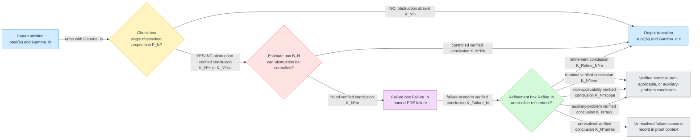

## Node specification template

Use the following template for every PDE proof step.

```text
Node ID:
  Stable proof-dependency identifier, for example D_E, PS17, or FinalExcl.

Display name:
  Short mathematical name used in diagrams.

PDE role:
  What PDE question this node answers.
  Name the analytic object being tested: solution sequence, blow-up profile,
  rescaled flow, measure, stress tensor, constraint multiplier, boundary trace, frequency
  envelope, Lyapunov functional, compactness witness, or rigidity witness.
  State whether the node is proving an estimate, excluding a PDE obstruction,
  verifying compactness, detecting a defect, normalizing a profile, or
  identifying a singularity mechanism.

Position in the proof-dependency diagram:
  Input node(s):
    pred(N), including alternate entries if the node can be reached from more
    than one predecessor.
  Output node:
    succ(N), the default successor after unobstructed, controlled, or refined outcomes.
  Endpoint transition:
    Allowed only if N is the final applicable node, or if the node emits a
    terminal, non-applicability, or auxiliary-problem verified conclusion.
  Local case analysis type:
    EXHAUSTIVE_CASE_ANALYSIS by default.
    ORDERED_DISJOINT_CASE_SPLIT only when the classes are explicitly mutually exclusive.

Logical proposition checked:
  P_N :=
    One yes/no/inc obstruction proposition.
  Polarity convention:
    YES means obstruction and passes to B_N.
    NO means the obstruction is absent, already controlled or verified, or non-applicable, and passes to
    succ(N), unless the node explicitly emits a non-applicability verified conclusion.
  Single-proposition test:
    If the proposition actually contains independent checks, split the node.
    A node may reference definitions, but it may not bundle unrelated PDE
    decisions into one implicit conjunction.

Inputs:
  Gamma_in:
    Context, hypotheses, prior verified conclusions, normalized variables, scales,
    compactness class, and witness objects available when the node begins.
  H0 objects used directly:
    List each named component of H0 used at this node: equation/formulation,
    domain/time/geometry, solution class, data, admissibility class, topology,
    energy or coercive structure, continuation criterion, scaling/localization
    structure, boundary/coupling interface, defect vocabulary, endpoint theorem
    library, and verified-conclusion format. State what each component supplies
    in PDE terms.
  Required prior verified conclusions:
    List each verified conclusion from earlier nodes that this node uses.
    The node may not use an object introduced by a later node or by an
    implicit convention.
  Node-local objects:
    List any local objects created inside the node before they are verified,
    such as a candidate measure, scale, gauge, profile, trace, defect,
    endpoint package, or comparison functional.
  Witness data:
    Data the check may inspect, such as bounds, defect measures, profiles,
    traces, spectra, monotonicity quantities, or residuals.
  Explicit lemma objects:
    A concise list of the mathematical entities required to prove the node's
    local lemma. This must name the actual PDE objects, not only their role:
    solutions or approximants, profiles, limits, scales, gauges, operators,
    measures, traces, residuals, functionals, constants, hypotheses, and
    theorem statements.

Check box C_N:
  PDE task:
    Explain how the logical proposition P_N is tested in PDE language.
    Name the estimate, compactness argument, identity, monotonicity formula,
    contradiction argument, rigidity theorem, or counterexample witness used.
  Outputs:
    K_N^+:
      Verified conclusion for the YES/obstruction branch, with data and the justifying
      theorem, estimate, or witness.
    K_N^-:
      Verified conclusion for the NO/obstruction-absent branch, with data and the
      justifying theorem, estimate, or witness.
    K_N^inc:
      Verified conclusion that the node is incomplete or undecided, including the
      missing hypothesis, unresolved estimate, or insufficient witness.
  Transition:
    NO/obstruction-absent transition goes to succ(N).
    YES/obstruction or INC goes to the estimate box B_N.

PDE implementation and verification subsection:
  Heading used in filled nodes:
    "#### Implementation and verification in PDE terms"

  Purpose:
    This subsection translates the node into the exact local PDE lemma,
    estimate, compactness statement, and recovery construction that a PDE
    expert must prove in order to validate the node. Every check is local to
    the current analysis window, localization region, profile scale, boundary
    chart, frequency range, or compactness regime carried by Gamma_in. No node
    should require a global theorem unless its input context explicitly
    declares the global problem as the current analysis window.

  Analytic setting and unknowns:
    State the PDE class, unknowns, domain or local chart, time interval,
    boundary or exterior data, solution class, normalization, scale, and
    topology relevant to this node.

  Standing assumptions:
    List the hypotheses available before the node is evaluated: prior estimates,
    conservation or monotonicity information, compactness class, admissibility
    hypotheses, boundary compatibility, structural assumptions, and verified
    conclusions inherited from predecessor nodes.

  Objects inspected:
    List the concrete PDE objects available at the node: solution sequences,
    weak or strong limits, profiles, concentration measures, defect measures,
    traces, residuals, frequency envelopes, Lyapunov quantities, comparison
    objects, or compactness witnesses.

  Dependency ledger:
    State precisely which inspected objects come directly from H_0 and which
    come from predecessor nodes. If an object is transformed, localized,
    rescaled, gauged, restricted to a boundary chart, or passed to a limit,
    name the predecessor verified conclusion that authorizes that operation.

  Local obstruction predicate:
    Rewrite P_N as one explicit obstruction statement in PDE language. The
    statement must be decidable from Gamma_in and must not bundle independent
    PDE questions. State clearly what YES, NO, and INC mean.

  Local lemma to prove:
    State the exact lemma needed to evaluate the check. The lemma should name
    the hypotheses, topology, uniform constants, limiting operation, and
    conclusion that produces K_N^+, K_N^-, or K_N^inc.

  Specific estimate or compactness statement:
    Identify the concrete analytical assertion: an a priori bound, coercive
    estimate, interpolation estimate, trace estimate, commutator estimate,
    monotonicity inequality, compactness theorem, profile decomposition,
    defect-measure exclusion, rigidity theorem, perturbative continuation
    criterion, or localization lemma. State what quantity is controlled on the
    current analysis window or local PDE object, what parameters the estimate is
    uniform in, and what failure of the statement means. The estimate is local
    to this node unless the node explicitly declares a global interval or global
    object as its input.

  Practical verification steps:
    Give the proof workflow for this node: restrict to the current window,
    localize or rescale if needed, normalize parameters, apply inherited
    estimates, test the predicate, prove the decisive local estimate or
    compactness statement, record constants and topologies, and update the proof
    context.

  YES certificate K_N^+:
    Record the obstruction witness and the mathematical statement proving that
    P_N holds, such as an escaping sequence, concentration measure, singular or defective limit,
    failed estimate, unresolved trace, or defect object.

  NO certificate K_N^-:
    Record the estimate, convergence statement, identity, construction,
    compactness theorem, or rigidity theorem proving that P_N is false.

  INC certificate K_N^inc:
    Record the exact missing hypothesis, bound, topology, compactness theorem,
    trace theorem, limiting argument, or structural input preventing a decision.

  A priori estimate or exclusion test:
    Specify the theorem applied after K_N^+ or K_N^inc. It must decide whether
    the apparent obstruction is controlled or non-singular under the current hypotheses. State the
    inputs, the estimate or exclusion result, the controlled certificate
    K_N^blk, and the failed-estimate certificate K_N^br.

  Failure-scenario data:
    If the estimate or exclusion test fails, state the PDE obstruction that has
    been isolated and the minimal witness data needed to define it: singular
    sequence, limiting profile, concentration measure, defect measure,
    boundary trace failure, compactness loss, scale cascade, or failed
    coercive estimate.

  Recovery or refinement construction:
    State the recovery lemma needed after the failure scenario. It must specify
    what PDE object is refined, localized, renormalized, decomposed, augmented,
    or replaced by an auxiliary object; which estimate is restored; which prior
    conclusions are preserved or updated; which constants/domains/topologies
    change; and which progress measure prevents infinite refinement.

  Re-entry and output requirements:
    State the successor succ(N), the data added to Gamma_out, the conditions
    under which K_Refine_N^re is valid, and any terminal, non-applicability, or
    auxiliary-problem conclusions. Unobstructed, controlled, and refined
    outcomes route to succ(N).

  Minimal lemma checklist:
    The filled node must identify:
      - the predicate lemma deciding P_N up to YES/NO/INC;
      - the decisive estimate or compactness statement;
      - the a priori estimate or exclusion theorem for apparent obstructions;
      - the failed-estimate obstruction statement;
      - the recovery/refinement theorem restoring admissibility for succ(N);
      - the data contained in every certificate emitted by the node;
      - the progress measure for any repeated refinement;
      - the proof that Gamma_out is admissible for succ(N).

Estimate box B_N:
  Trigger:
    Entered only from K_N^+ or K_N^inc.
  Estimate proposition Q_N:
    The precise PDE estimate or theorem that controls the detected obstruction without
    altering the object being analyzed.
  PDE task:
    Explain the control or exclusion mechanism: a priori estimate, coercivity, exclusion
    theorem, conservation law, compatibility condition, gauge absorption,
    compactness upgrade, or localization argument.
  Outputs:
    K_N^blk:
      Controlled verified conclusion. It records the theorem or estimate that neutralizes
      the obstruction and the resulting context that can be passed to succ(N).
    K_N^br:
      Failed-estimate verified conclusion. It records exactly why the estimate failed and which
      PDE failure scenario is forced.
  Transition:
    K_N^blk passes to succ(N).
    K_N^br passes to Failure_N.

Failure-scenario box Failure_N:
  Failure-scenario name:
    Canonical singularity or failure label produced by this node.
  PDE interpretation:
    Explain what the failed estimate means analytically: blow-up, loss of
    compactness, concentration, oscillation, boundary failure, symmetry break,
    defect channel, non-rigidity, or residual singular class.
  Output:
    K_Failure_N:
      Failure-scenario verified conclusion. It names the failure scenario, records the witness, records the
      failed estimate, and declares the refinement target.
  Transition:
    K_Failure_N passes to Refine_N.

Refinement box Refine_N:
  Refinement action:
    The concrete PDE modification or refinement attempted: renormalization,
    profile extraction, gauge transformation, localization, envelope refinement,
    defect discharge, compactness upgrade, branch split, or auxiliary rescaled problem.
  Refinement proposition R_N:
    The precise admissibility statement for the refinement.
  Postcondition:
    What must be true after refinement for the argument to continue.
  Progress measure:
    A well-founded quantity that decreases or a finite budget that is
    consumed, so repeated refinement cannot loop without progress.
  Outputs:
    K_Refine_N^re:
      Refinement transition verified conclusion. It records the refinement, postcondition, progress
      measure, and the successor succ(N).
    K_N^term:
      Terminal verified conclusion. It proves that the argument has reached a terminal
      singularity scenario.
    K_N^scope:
      Non-applicability verified conclusion. It proves that remaining checks are not
      applicable to the input object.
    K_N^aux:
      Auxiliary-problem verified conclusion. It identifies the auxiliary PDE object,
      inherited hypotheses, and progress measure.
    K_N^unres:
      Unresolved verified conclusion. It records that the failure scenario remains open, together
      with the exact missing theorem, estimate, or construction.
  Transition:
    K_Refine_N^re passes to succ(N).
    K_N^term, K_N^scope, and K_N^aux transition to the verified conclusion target.
    K_N^unres is recorded in the proof context and is not recorded as a successful conclusion.

Output context:
  Gamma_out:
    The resulting context passed to succ(N).
  Verified-conclusion vector entry:
    The entry c_N recorded in the local case analysis verified conclusion vector.
  Proof context entries:
    Every verified conclusion emitted by the node, including failed attempts, with
    names, data, references to justifying theorems or estimates, and transition
    decisions.
```

Rendered certificate notation used by this template:

* Check certificates: $K_N^+$, $K_N^-$, and $K_N^{\rm inc}$.
* Estimate certificates: $K_N^{\rm blk}$ and $K_N^{\rm br}$.
* Failure-scenario certificate: $K_{\mathrm{Failure}N}$.
* Refinement and exceptional certificates:
  $K_{\mathrm{Refine}N}^{\rm re}$, $K_N^{\rm term}$,
  $K_N^{\rm scope}$, $K_N^{\rm aux}$, and $K_N^{\rm unres}$.
* Routing notation: $\operatorname{pred}(N)$ is the predecessor set,
  $\operatorname{succ}(N)$ is the declared successor, $\Gamma_{\rm in}$ is the
  incoming proof context, and $\Gamma_{\rm out}$ is the outgoing proof context.

## Rules for filling the template

1. The logical proposition $P_N$ must be a single PDE proposition. If a box
   checks several independent facts, split it into several first-class nodes.
2. The obstruction polarity must be explicit. For singularity checks, the standard
   convention is that YES means obstruction, and this document uses that convention
   for every PDE proof step.
3. Every node must record its input node(s), default successor, and exceptional
   terminal, non-applicability, or auxiliary-problem transitions.
4. Every verified conclusion emitted by the node must be named and explained. The
   verified conclusion description must include data, mathematical justification,
   context effect, and next step.
5. The PDE role must be concrete. Do not say only "checks regularity"; say what
   estimate, compactness statement, defect exclusion, normalization, rigidity
   statement, or singularity mechanism is being tested.
6. Every filled node must include an `Explicit lemma objects` entry immediately
   after `Inputs`, naming the mathematical objects needed to prove the local
   lemma.
7. Estimate boxes control or exclude a specific obstruction; they are not generic refinement boxes.
8. Refinement boxes must state a postcondition and a progress measure.
9. Unobstructed, controlled, and refined outcomes transition to $\operatorname{succ}(N)$.
   Transition to the endpoint is allowed only for the final applicable node or for
   a verified terminal, non-applicability, or auxiliary-problem exception.
10. The proof context records verified conclusions; it is not a proof-dependency node. It records emitted verified conclusions and failed
   attempts, while the PDE proof step remains the check, estimate, failure-scenario, and refinement
   structure.

---

# 4. Node-role overview

The node catalog follows the same order as the main integration diagram. Every
node is a first-class PDE proof step with the same
check, estimate, failure-scenario, and refinement structure. The section classes below are expository
headings, not transition vertices.

| Section | Nodes | PDE role in the traversal | Default output |
| --- | --- | --- | --- |
| Core entry and coarse compactness | `D_E`, `Rec_N`, `C_mu` | Establish energy control, local finiteness of rescaling times, and the profile or no-profile branch. | `PS0` or `Bound_partial` |
| Profile setup and normalization | `PS0`--`PS8` | Convert continuation failure into a normalized, admissible, active PDE profile. | `PS9` |
| Scale-law case analysis | `PS9`--`PS11` | Classify Type I, Type II, and scale-cascade behavior. | `PS12` |
| Orbit-type case analysis | `PS12`--`PS14` | Classify stationary, compact-orbit, and terminal orbit behavior. | `PS15` |
| Localization case analysis | `PS15`--`PS17` | Check tightness, radiation, and rough-core/capacity obstructions. | `PS18` |
| Splitting and packet case analysis | `PS18`--`PS20` | Check multicenter, finite-packet, and terminal-decoupling mechanisms. | `PS21` |
| Structural case analysis | `PS21`--`PS29` | Check smallness, stationary critical-norm, symmetry, relative equilibrium, structural reduction, and Lyapunov structure. | `PS30` |
| Defect closure | `PS30` | Verify that the defect verified conclusion vector is complete. | `PS31` |
| Endpoint and case-decomposition closure | `PS31`--`PS35` | Match endpoint hypotheses, apply endpoint exclusion or realization, define residual complement, and verify case decomposition completeness. | `Bound_partial` |
| Boundary, control, and final exclusion step | `Bound_partial`, `Bound_B`, `Bound_Sigma`, `GC_T`, `FinalExcl` | Resolve boundary scope, input excess forcing and input insufficiency, alignment, and final singular-profile realization set-exclusion. | structural regularity or realization output |

The detailed entries below preserve this order. Within each section, an unobstructed,
controlled, or refined outcome passes to the declared successor named
in the node template.

---

# 5. PDE object-dependency ledger

Every node may use only two kinds of objects:

1. objects supplied by the initial PDE thin interface $H_0$;
2. objects produced by predecessor nodes and recorded as verified conclusions in
   $\Gamma$.

The following ledger makes those dependencies explicit. The notation
$\mathcal P,\Omega,I,\mathcal U,\mathcal D,\mathcal A,\mathcal T,\mathcal E,
\mathcal C,\mathcal S,\mathcal B,\mathcal R,\mathcal L,\mathcal Z$ refers to
the components of $H_0$ defined in Section 1.

| Node | Objects used directly from $H_0$ | Required predecessor objects | Objects produced or updated |
| --- | --- | --- | --- |
| `D_E` | $\mathcal P$ for the PDE identity or inequality; $\Omega,I$ for the analysis region; $\mathcal U,\mathcal A$ for the solution class; $\mathcal D$ for data bounds; $\mathcal T$ for lower-semicontinuity and approximation topology; $\mathcal E$ for the selected energy, entropy, action, or coercive functional; $\mathcal Z$ for verified-conclusion format. | Entry admissibility $\Gamma_0=\Gamma(H_0)$ and no prior analytic node. | Local energy-control certificate $K_{D_E}^{-}$, energy-escape witness $K_{D_E}^{+}$, entry or estimate gap $K_{D_E}^{\rm inc}$, or refined energy context for `Rec_N`. |
| `Rec_N` | $\Omega,I$ for time windows and local subregions; $\mathcal U,\mathcal A$ for the solution class; $\mathcal D$ for data-dependent constants; $\mathcal T$ for compactness of selected times; $\mathcal E$ for inherited energy bounds; $\mathcal C$ for continuation or trigger thresholds; $\mathcal S$ for admissible rescalings and time normalizations; $\mathcal Z$ for recorded conclusions. | Energy control or controlled energy refinement from `D_E`. | Finite or separated rescaling-time set, selected-time rule, event-accumulation witness, and the context passed to `C_mu`. |
| `C_mu` | $\mathcal P$ for the equation used by compactness; $\Omega,I$ for local regions; $\mathcal U,\mathcal A$ for admissible limits; $\mathcal D$ for data bounds; $\mathcal T$ for weak, strong, measure, and profile convergence; $\mathcal E$ for tightness bounds; $\mathcal C$ for no-profile continuation criteria; $\mathcal S$ for concentration frames; $\mathcal R$ for candidate defect channels; $\mathcal Z$ for certificates. | Energy control from `D_E` and finite selected-time structure from `Rec_N`. | Certified profile package entering `PS0`, or benign no-profile certificate entering `Bound_partial`, or concentration-escape refinement data. |
| `PS0` | $\mathcal P$ for the local PDE; $\mathcal U,\mathcal A$ for the solution and continuation class; $\mathcal T$ for convergence and limiting topology; $\mathcal C$ for the continuation or regularity criterion; $\mathcal S$ for localization or rescaling variables; $\mathcal Z$ for certificates. | Profile package from `C_mu`, plus energy and selected-time control from `D_E` and `Rec_N`. | Continuation-failure witness, continuation bridge status, and normalized obstruction context for `PS1`. |
| `PS1` | $\Omega,I$ for local cylinders; $\mathcal T$ for measure and local-strong convergence; $\mathcal E$ for local mass or energy thresholds; $\mathcal S$ for admissible concentration frames; $\mathcal R$ for measure-defect vocabulary. | Continuation-failure context from `PS0` and profile package from `C_mu`. | Local concentration measure, concentration window, non-concentration certificate, or concentration-defect data for `PS2`. |
| `PS2` | $\Omega,I$ for admissible centers and charts; $\mathcal T$ for convergence of centers; $\mathcal E$ for localized lower bounds; $\mathcal S$ for translations, chart changes, and center normalizations. | Concentration window and measure from `PS1`. | Selected center sequence or center frame, center-escape witness, and recentered context for `PS3`. |
| `PS3` | $\mathcal S$ for scaling, dyadic, frequency, and localization structure; $\mathcal E$ for scale-sensitive critical quantities; $\mathcal T$ for scale-limit convergence; $\mathcal C$ for scale-critical thresholds. | Center frame from `PS2` and concentration data from `PS1`. | Selected scale sequence, dyadic window, frequency envelope, scale-selection failure witness, and scaled context for `PS4`. |
| `PS4` | $\mathcal P$ for transformed equations; $\mathcal U,\mathcal A$ for admissible parameterized solutions; $\mathcal T$ for convergence after gauge or modulation; $\mathcal S$ for gauge, modulation, symmetry, and coordinate parameters. | Center and scale data from `PS2` and `PS3`. | Canonical gauge or modulation slice, parameter bounds, drift witness, and normalized context for `PS5`. |
| `PS5` | $\mathcal P$ for the equation under rescaling or gauge; $\mathcal D$ for transformed data and forcing; $\mathcal A$ for admissible transformed objects; $\mathcal T$ for distributional passage to the limit; $\mathcal S$ for transformation rules; $\mathcal B$ for transformed boundary or coupling terms; $\mathcal R$ for residual terms. | Normalized center, scale, and gauge data from `PS2`--`PS4`. | Renormalized PDE, residual equation, transformed forcing and boundary data, equation-defect witness, and context for `PS6`. |
| `PS6` | $\mathcal U,\mathcal A$ for admissible limits; $\mathcal T$ for compactness and convergence; $\mathcal E$ for uniform bounds; $\mathcal S$ for normalized frames; $\mathcal R$ for defect measures. | Renormalized equation from `PS5` and normalized profile sequence from `PS1`--`PS4`. | Profile limit, compactness certificate, defect witness, and limit context for `PS7`. |
| `PS7` | $\mathcal P$ for the limiting equation; $\mathcal U,\mathcal A$ for solution and limit admissibility; $\mathcal D$ for inherited data compatibility; $\mathcal B$ for boundary compatibility; $\mathcal T$ for trace and limit topology. | Profile limit from `PS6` and renormalized equation from `PS5`. | Admissibility-inheritance certificate, sector or class refinement, non-admissibility witness, and context for `PS8`. |
| `PS8` | $\mathcal E$ for nontriviality or activity thresholds; $\mathcal C$ for continuation-relevant activity criteria; $\mathcal T$ for nonvanishing topology; $\mathcal S$ for scale and frame normalization. | Admissible profile from `PS7`, profile limit from `PS6`, and concentration witness from `PS1`. | Active-profile witness, vanishing witness, activity threshold data, and context for `PS9`. |
| `PS9` | $\mathcal S$ for scale law and rate normalization; $\mathcal E$ for critical quantities; $\mathcal C$ for Type I continuation or regularity thresholds; $\mathcal T$ for rate-limit topology; $\mathcal L$ for endpoint consequences of Type I bounds. | Active profile from `PS8` and selected scale from `PS3`. | Type I status, Type I rate bound or failure witness, and rate context for `PS10`. |
| `PS10` | $\mathcal S$ for alternative scale laws; $\mathcal E$ for critical norms and rate functionals; $\mathcal C$ for Type II threshold criteria; $\mathcal T$ for limiting rate topology; $\mathcal L$ for endpoint consequences of Type II bounds. | Type I status from `PS9`, active profile from `PS8`, and scale data from `PS3`. | Type II status, renormalized rate envelope, Type II failure witness, and context for `PS11`. |
| `PS11` | $\mathcal S$ for multiscale, dyadic, and frequency decompositions; $\mathcal E$ for scale-localized quantities; $\mathcal T$ for multiscale convergence; $\mathcal R$ for cascade or frequency defects. | Type I and Type II rate data from `PS9` and `PS10`. | Scale-cascade certificate, scale-space stratification, cascade witness, and context for `PS12`. |
| `PS12` | $\mathcal P$ for the renormalized flow; $\mathcal U$ for solution regularity; $\mathcal S$ for renormalized time and symmetries; $\mathcal T$ for time-translation limits; $\mathcal L$ for stationary rigidity candidates. | Scale-law context from `PS11` and renormalized equation from `PS5`. | Stationary or nonstationary status, time-translation hull, stationary-profile witness, and context for `PS13`. |
| `PS13` | $\mathcal S$ for orbit parameters; $\mathcal T$ for compactness of the orbit hull; $\mathcal E$ for orbit bounds; $\mathcal L$ for compact-dynamics rigidity. | Renormalized trajectory or stationary-context data from `PS12`. | Compact-orbit certificate, invariant hull, compactness failure witness, and context for `PS14`. |
| `PS14` | $\Omega,I$ for terminal-time geometry; $\mathcal S$ for terminal rescaling; $\mathcal T$ for terminal limits; $\mathcal C$ for continuation past terminal time; $\mathcal L$ for terminal profile theorems. | Orbit or hull data from `PS13` and renormalized flow data from `PS12`. | Terminal or nonterminal orbit status, terminal time-shift profile, and context for `PS15`. |
| `PS15` | $\Omega$ for spatial localization; $\mathcal E$ for tail quantities; $\mathcal T$ for tightness topology; $\mathcal S$ for localized frames; $\mathcal R$ for tail or measure defects. | Profile or terminal context from `PS14`, plus profile limit from `PS6`. | Tightness certificate, tail decomposition, tightness failure witness, and context for `PS16`. |
| `PS16` | $\mathcal P$ for radiation equations; $\mathcal E$ for radiative energy or flux; $\mathcal T$ for weak radiation limits; $\mathcal S$ for outgoing or frequency-localized frames; $\mathcal R$ for radiation defects. | Tightness and tail data from `PS15`. | Radiation profile, absence of radiation, radiative-defect witness, and context for `PS17`. |
| `PS17` | $\Omega$ for capacity or rough-core localization; $\mathcal T$ for trace, capacity, and local convergence; $\mathcal E$ for local energy near rough sets; $\mathcal C$ for local regularity criteria; $\mathcal L$ for capacity or removability theorems. | Localization and radiation status from `PS15` and `PS16`. | Rough-core or capacity status, removability certificate, rough-core witness, and context for `PS18`. |
| `PS18` | $\mathcal S$ for multicenter frames; $\mathcal T$ for orthogonality and profile convergence; $\mathcal E$ for localized mass or energy separation; $\mathcal R$ for interaction defects. | Localized core data from `PS17` and center data from `PS2`. | Multicenter decomposition, dominant frame, multicenter failure witness, and context for `PS19`. |
| `PS19` | $\mathcal S$ for packet indexing and scale-center ordering; $\mathcal T$ for packet compactness; $\mathcal E$ for packet energy accounting; $\mathcal R$ for packet residuals. | Multicenter decomposition from `PS18`. | Finite-packet certificate, packet exhaustion, infinite-packet witness, and context for `PS20`. |
| `PS20` | $\mathcal P$ for nonlinear interaction terms; $\mathcal E$ for energy decoupling; $\mathcal T$ for weak interaction limits; $\mathcal S$ for orthogonal frames; $\mathcal R$ for interaction or commutator defects. | Packet decomposition from `PS19` and profile data from `PS6`. | Terminal decoupling certificate, secondary profile frame, interaction-defect witness, and context for `PS21`. |
| `PS21` | $\mathcal E$ for critical norm or smallness threshold; $\mathcal C$ for perturbative continuation; $\mathcal T$ for stability topology; $\mathcal L$ for small-data regularity or scattering results. | Decoupled profile or interaction status from `PS20`. | Smallness status, perturbative control certificate, threshold ambiguity witness, and context for `PS22`. |
| `PS22` | $\mathcal E$ for critical norm; $\mathcal C$ for stationary critical-norm criteria; $\mathcal S$ for stationary scaling; $\mathcal T$ for limiting topology; $\mathcal L$ for stationary rigidity. | Smallness status from `PS21` and stationary/orbit data from `PS12`--`PS13`. | Stationary critical-norm status, critical profile decomposition, and context for `PS23`. |
| `PS23` | $\mathcal P$ for invariances of the equation; $\mathcal U,\mathcal A$ for admissible group actions; $\mathcal S$ for symmetry groups, quotients, and slices; $\mathcal T$ for convergence modulo symmetry; $\mathcal L$ for symmetry rigidity. | Critical-norm or structural branch data from `PS22`. | Profile-symmetry tag, quotient or slice data, symmetry witness, and context for `PS24`. |
| `PS24` | $\mathcal P$ for co-moving or symmetry-reduced equations; $\mathcal S$ for relative-equilibrium transformations; $\mathcal T$ for recurrent or orbit convergence; $\mathcal L$ for relative-equilibrium rigidity. | Symmetry tag and quotient data from `PS23`. | Relative-equilibrium status, co-moving-frame reduction, and context for `PS25`. |
| `PS25` | $\mathcal P$ for the linearized or normal-form equation; $\mathcal U,\mathcal A$ for differentiability of solution manifolds; $\mathcal T$ for spectral and bifurcation topology; $\mathcal L$ for bifurcation, Fredholm, or Lyapunov-Schmidt theorems. | Relative-equilibrium or degenerate branch data from `PS24`. | Bifurcation-direction status, kernel and normal-form data, and context for `PS26`. |
| `PS26` | $\mathcal P$ for invariance of the degenerate branch; $\mathcal S$ for group action and quotient; $\mathcal T$ for quotient topology; $\mathcal L$ for symmetry-action or slice theorems. | Bifurcation manifold and kernel data from `PS25`. | Symmetry-action status, quotient refinement, hidden-symmetry witness, and context for `PS27`. |
| `PS27` | $\mathcal P$ for reduced dynamics; $\mathcal E$ for mass-gap or stability energy; $\mathcal S$ for symmetry-broken coordinates; $\mathcal T$ for stability topology; $\mathcal L$ for stability or instability theorems. | Symmetry-action and quotient data from `PS26`. | Symmetry-breaking stability status, mass-gap data, and context for `PS29`. |
| `PS28` | $\mathcal E$ for action, energy, or transition functional; $\mathcal S$ for sector or connecting-orbit parameters; $\mathcal T$ for convergence of transitions; $\mathcal L$ for finite-action or transition-rigidity results. | No-symmetry sector data from `PS26`. | Transition-action status, finite-action refinement, infinite-action witness, and context for `PS29`. |
| `PS29` | $\mathcal E$ for Lyapunov, monotonicity, or stiffness functionals; $\mathcal C$ for stability consequences; $\mathcal S$ for hull-local coordinates; $\mathcal T$ for compact-hull topology; $\mathcal L$ for Lyapunov or spectral rigidity results. | Case-reduced branch data from `PS25`, `PS27`, or `PS28`, plus orbit data from `PS13`. | Lyapunov-structure certificate, stiffness failure witness, hull-local functional, and context for `PS30`. |
| `PS30` | $\mathcal P$ for equations generating residuals; $\mathcal U,\mathcal A$ for admissible defect variables; $\mathcal T$ for distributional, measure, trace, and frequency convergence; $\mathcal B$ for boundary/interface defects; $\mathcal S$ for frequency and gauge defects; $\mathcal R$ for the declared defect vocabulary; $\mathcal Z$ for the defect vector format. | Renormalized equation from `PS5`, profile limit from `PS6`, and structural context from `PS29`. | Complete defect vector, unresolved defect channel, added defect stratum, and context for `PS31`. |
| `PS31` | $\mathcal L$ for endpoint theorem hypotheses; $\mathcal U,\mathcal A$ for solution class compatibility; $\mathcal T$ for convergence required by endpoint theorems; $\mathcal B$ for boundary hypotheses; $\mathcal D$ for data hypotheses; $\mathcal R$ for defect-free assumptions. | Defect vector from `PS30` and profile or branch data from `PS9`--`PS29`. | Endpoint-hypothesis package, mismatch witness, added endpoint hypothesis, and context for `PS32`. |
| `PS32` | $\mathcal L$ for exclusion theorems; $\mathcal P$ for the endpoint equation; $\mathcal U$ for theorem solution class; $\mathcal T$ for endpoint topology; $\mathcal E,\mathcal C$ for bounds or continuation consequences. | Matched endpoint package from `PS31`. | Endpoint-exclusion status, missing-exclusion witness, additional endpoint condition, and context for `PS33`. |
| `PS33` | $\mathcal L$ for realization or construction theorems; $\mathcal D$ for admissible data for constructed objects; $\mathcal U,\mathcal A$ for construction class; $\mathcal T$ for convergence of constructed families; $\mathcal S$ for modulation or manifold parameters. | Endpoint-exclusion status from `PS32` and endpoint package from `PS31`. | Realization or non-realization status, attainability witness, stable/unstable manifold data, and context for `PS34`. |
| `PS34` | $\mathcal L$ for branch taxonomy; $\mathcal R$ for residual defect vocabulary; $\mathcal T$ for complement topology; $\mathcal Z$ for verified case entries. | Endpoint statuses from `PS31`--`PS33`, defect vector from `PS30`, and branch data from `PS9`--`PS29`. | Residual-complement definition, residual ambiguity witness, and context for `PS35`. |
| `PS35` | $\mathcal L$ for endpoint statuses and branch theorems; $\mathcal R$ for residual and defect channels; $\mathcal S$ for branch parameters; $\mathcal T$ for branch topology; $\mathcal Z$ for case-vector format. | Branch statuses from `PS9`--`PS34`, including defect and endpoint vectors. | Complete profile-case decomposition $K_{\mathrm{ProfileCaseDecomp}}^+$, missing-case witness, and context for `Bound_partial`. |
| `Bound_partial` | $\Omega,\mathcal B$ for boundary geometry and boundary-scope applicability; $\mathcal D$ for boundary or exterior data; $\mathcal U,\mathcal A$ for trace-admissible solution classes; $\mathcal T$ for trace topology; $\mathcal L$ for boundary regularity or non-applicability theorems. | Profile-case decomposition from `PS35`, or benign no-profile certificate from `C_mu`. | Boundary-scope status, boundary non-applicability certificate, open-boundary witness, and context for `Bound_B`. |
| `Bound_B` | $\mathcal B$ for boundary or exterior forcing structure; $\mathcal D$ for forcing and boundary-data norms; $\mathcal E$ for boundary energy or flux terms; $\mathcal T$ for trace and forcing topology; $\mathcal C$ for continuation sensitivity to boundary forcing. | Boundary-scope status from `Bound_partial`. | Excess-forcing status, controlled boundary forcing, forcing-overload witness, and context for `Bound_Sigma`. |
| `Bound_Sigma` | $\mathcal B$ for input or coupling channels; $\mathcal D$ for available input data; $\mathcal U,\mathcal A$ for admissible response class; $\mathcal T$ for input convergence; $\mathcal C$ for continuation or control criteria. | Boundary and forcing status from `Bound_partial` and `Bound_B`. | Input-sufficiency status, missing-input witness, input completion data, and context for `GC_T`. |
| `GC_T` | $\mathcal P$ for the PDE objective; $\mathcal E$ for comparison or Lyapunov functionals; $\mathcal C$ for continuation target; $\mathcal S$ for alignment parameters; $\mathcal T$ for comparison topology; $\mathcal L$ for alignment or robustness lemmas. | Input-sufficiency status from `Bound_Sigma`, boundary context from `Bound_partial`, and profile-case context from `PS35`. | Alignment certificate, comparison-functional mismatch witness, refined comparison functional, and context for `FinalExcl`. |
| `FinalExcl` | $\mathcal L$ for final exclusion, rigidity, realization, or continuation theorems; $\mathcal C$ for the target regularity or continuation conclusion; $\mathcal E$ for final bounds; $\mathcal T$ for endpoint topology; $\mathcal U,\mathcal A$ for theorem solution class; $\mathcal D,\mathcal B$ for data and boundary hypotheses; $\mathcal R$ for defect-free assumptions; $\mathcal Z$ for final verified-conclusion format. | Alignment certificate from `GC_T`, boundary and input statuses from `Bound_partial`--`Bound_Sigma`, profile-case decomposition from `PS35`, endpoint statuses from `PS31`--`PS33`, and defect vector from `PS30`. | Structural regularity certificate, continuation output, certified singular realization, or unresolved final-exclusion statement. |

This table is part of the node contract. If a detailed node description uses an
object not listed here, the description must either add that object to the
appropriate $H_0$ component, cite the predecessor verified conclusion that
produces it, or split the node so the object is produced by an earlier explicit
proof step.

---

# 6. Core entry and coarse compactness nodes

## D_E — Energy escape check

**Single check:** Is there energy or coercive-bound escape on the analysis window?

**Filled node template**

- **PDE role:** This node tests the basic a priori energy or coercive-bound control for
  the PDE instance before any concentration extraction or profile classification
  can be justified.
  It rules out uncontrolled escape of the energy functional on the time window.
- **Proof-dependency position:** Input node is `H0`, the instantiated PDE thin
  interface;
  default output node is `Rec_N`.
- **Logical proposition:** $P_{D_E}$: the selected energy or coercive functional
  escapes every verified bound on the analysis window. YES or INC is obstruction;
  NO means the energy bound is verified.
- **Inputs:** $\Gamma_{\rm in}$ contains the PDE thin-interface data, time window,
  energy functional, admissible class, initial data bounds, and any conserved
  or monotone quantities already available.
- **Explicit lemma objects:** The local solution or approximation family
  $u^\varepsilon$ on $I_0\times\Omega_0$, the coercive functional $E$ or
  local energy density $e(u)$, the data norms from $\mathcal D$, flux,
  forcing, boundary, and lower-order terms in the local energy identity, the
  topology used for lower-semicontinuity, and the constants that the estimate
  is allowed to depend on.
- **Check box:** Test for failure of the energy inequality, conservation law,
  or coercive estimate. Output $K_{D_E}^{+}$ for witnessed energy
  escape, $K_{D_E}^{-}$ for a verified bound, and $K_{D_E}^{\rm inc}$ when the
  estimate or functional domain is incomplete.

#### Implementation and verification in PDE terms

##### Analytic setting and unknowns

Fix the solution object $u$ on the analysis time interval $I$ and spatial
domain or local chart $\Omega$. The node uses the solution class declared in
$\Gamma_{\rm in}$, the admissible initial or boundary data, and a chosen
energy, entropy, action, or coercive functional $E$ whose boundedness is needed
before any concentration extraction or profile classification can be justified.

##### Standing assumptions

The incoming context must specify the weak, strong, variational, entropy, or
renormalized sense in which $u$ solves the PDE; the interval $I$ on which the
argument is being run; the domain of definition of $E$; the data bounds
available at the initial, terminal, or boundary part of the problem; and any
conservation, dissipation, monotonicity, coercivity, or lower-semicontinuity
principle already proved upstream.

##### Objects inspected

Inspect the trajectory $t\mapsto u(t)$, the functional values $E(u(t))$, any
localized energy densities used to define $E$, flux or boundary contribution
terms, approximation sequences, weak limits, and residual terms that enter the
energy identity or inequality.

##### Local obstruction predicate

The predicate $P_{D_E}$ is the single statement that the selected coercive
functional escapes every bound allowed by $\Gamma_{\rm in}$ on the analysis
window. YES means there is a certified escaping sequence or time sequence. NO
means the declared energy bound is proved. INC means the available PDE
hypotheses do not decide whether the functional is controlled.

##### Local lemma to prove

Prove the local energy-control lemma for the current analysis window: under
the assumptions recorded in $\Gamma_{\rm in}$, either
$\sup_{t\in I}E(u(t))\le C(\Gamma_{\rm in})$ with all constants independent of
the limiting, approximation, localization, or rescaling parameters used at this
node, or there exist admissible times, states, or approximating solutions along
which $E$ leaves every such bound on that same window. If
neither conclusion follows from the stated hypotheses, the lemma must identify
the missing coercivity, identity, compactness, boundary-flux control, or
functional-domain statement.

##### Specific estimate or compactness statement to verify

The decisive estimate is an a priori bound for the chosen coercive functional
on the current analysis window $I$, uniform with respect to the limiting,
approximation, localization, or rescaling parameters used at this node. The
bound may include the flux, forcing, lower-order, boundary, or error terms that
belong to the declared PDE class. The proof must state the topology in which
the estimate is stable, the constants controlled by the local data, and the
terms absorbed by coercivity, monotonicity, or compactness. It is not a global
energy theorem unless $\Gamma_{\rm in}$ explicitly declares the global interval
as the current window.

##### Practical verification steps

Choose the correct representative or approximation of $u$ on the current
window, write the local energy identity or inequality in the admissible weak
sense, justify all limiting operations, estimate forcing and boundary terms,
close the coercive bound, and record the constant $C(\Gamma_{\rm in})$. If the
estimate cannot be closed, extract the sequence of times or approximants
witnessing escape on this window and record the failed term.

##### Certificate contents

$K_{D_E}^{-}$ contains the proved bound for $E$, the interval $I$, the
functional domain, the constants, and the estimates used to close the bound.
$K_{D_E}^{+}$ contains the escaping sequence, the diverging functional values,
and the term or mechanism responsible for the failed bound.
$K_{D_E}^{\rm inc}$ contains the exact missing PDE input, such as a coercivity
lemma, flux estimate, weak lower-semicontinuity statement, conservation law,
monotonicity formula, or admissibility of $E(u(t))$.

##### A priori estimate or exclusion test

After $K_{D_E}^{+}$ or $K_{D_E}^{\rm inc}$, the node tests whether saturation,
renormalization, drift control, or an equivalent coercive functional gives a
usable bound without changing the main PDE object. A controlled outcome
$K_{D_E}^{\rm blk}$ must specify the replacement estimate and show that the
successor can use it exactly as an energy bound. A failed outcome
$K_{D_E}^{\rm br}$ records why no such estimate is available.

##### Failure-scenario data

If the estimate fails, the failure scenario is energy or coercive-bound
blow-up. The witness must include the time or approximation sequence, the
functional values, the unresolved flux/forcing/boundary contribution if
present, and the precise reason the energy space is no longer compact or
coercive enough for the next stage.

##### Recovery or refinement construction

The recovery lemma must construct a refined energy scale, saturated functional,
renormalized quantity, or auxiliary energy variable for which a replacement
a priori bound is proved. It must state which part of the original context is
preserved, which constants change, which topology is now used, and why the
refinement has made progress rather than merely renaming the same escape.

##### Re-entry and output requirements

The default successor is `Rec_N`. The output context $\Gamma_{\rm out}$ must
contain either the original energy bound, a controlled replacement bound, or a
refined energy scale with its admissibility proof. Terminal,
non-applicability, auxiliary-problem, or unresolved conclusions must state why
`Rec_N`, `C_mu`, and their successor profile-classification checks can or
cannot be applied.

##### Minimal lemma checklist

To validate `D_E`, one must provide the energy-control lemma, the precise
energy or coercive estimate, the saturation/renormalization estimate for
apparent escape, the statement defining genuine energy blow-up, the recovery
lemma for a refined energy quantity, and the data required by
$K_{D_E}^{-}$, $K_{D_E}^{+}$, $K_{D_E}^{\rm inc}$,
$K_{D_E}^{\rm blk}$, $K_{D_E}^{\rm br}$, and
$K_{\mathrm{Refine}D_E}^{\rm re}$.

- **Estimate box:** `EnergyBoundEstimate` asks whether saturation, renormalization, or
  drift controls the energy escape without changing the main object.
  It emits $K_{D_E}^{\rm blk}$ if the escape is neutralized and
  $K_{D_E}^{\rm br}$ if energy blow-up remains.
- **Failure scenario and refinement:** Failure scenario `C.E` records energy blow-up as a
  concentration or coercive-bound failure. `RefineEnergySat` renormalizes the energy scale
  or adds a saturation variable and emits $K_{\mathrm{Refine}D_E}^{\rm re}$
  when the refined context can enter `Rec_N`.
- **Exceptional verified conclusions:** $K_{D_E}^{\rm term}$ records a terminal
  verified energy blow-up, $K_{D_E}^{\rm scope}$ proves `Rec_N`, `C_mu`, and
  successor profile-classification checks are not applicable, $K_{D_E}^{\rm aux}$ starts a renormalized auxiliary problem, and
  $K_{D_E}^{\rm unres}$ records the missing energy estimate.
- **Output context:** $\Gamma_{\rm out}$ contains the usable energy bound or
  refined energy scale and the proof context entry $c_{D_E}$.

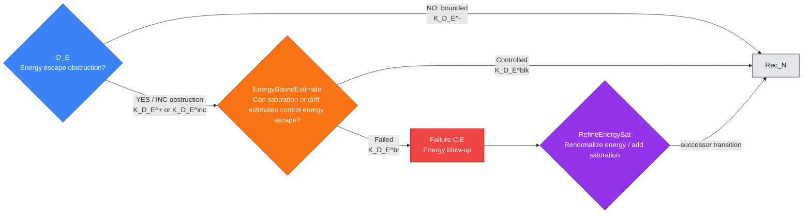

---

## Rec_N — Rescaling-time accumulation check

**Single check:** Is there rescaling-time accumulation obstruction?

**Filled node template**

- **PDE role:** This node checks that the solution-analysis sequence does not accumulate
  infinitely many rescaling times in a bounded interval.
  In PDE terms it verifies local finiteness of the concentration or rescaling times.
- **Proof-dependency position:** Input node is `D_E`; default output node is `C_mu`.
- **Logical proposition:** $P_{\mathrm{Rec}_N}$: the sequence of rescaling times has
  accumulation in a bounded analysis interval, or local finiteness is
  unverified. YES or INC is obstruction; NO means local finiteness of rescaling times is
  verified.
- **Inputs:** $\Gamma_{\rm in}$ contains the energy-controlled solution family, rescaling
  times, rescaling triggers, temporal ordering, and any lower bounds on rescaling-time
  separation.
- **Explicit lemma objects:** The selected time set $\mathcal T\subset I_0$,
  compact subintervals $J\Subset I_0$, associated scales $\lambda(t)$ or
  normalization parameters, the trigger functional $\Theta(u,t)$, the local
  energy bound inherited from `D_E`, and the separation, monotonicity, or
  compactness quantity used to rule out accumulation.
- **Check box:** Test for rescaling-time accumulation by a separation estimate, temporal
  monotonicity, or compactness of admissible auxiliary sequence data. Output
  $K_{\mathrm{Rec}_N}^{+}$ for rescaling-time accumulation obstruction, $K_{\mathrm{Rec}_N}^{-}$ for local
  finiteness, or $K_{\mathrm{Rec}_N}^{\rm inc}$.

#### Implementation and verification in PDE terms

##### Analytic setting and unknowns

Fix the energy-controlled solution family from `D_E` on the analysis interval
$I$. The node studies the selected rescaling times, concentration times,
renormalization times, or profile-extraction times associated with $u$. The
relevant PDE objects are the normalized solutions around those times, their
scales, the trigger quantities used to select them, and the topology in which
successive rescaled objects are compared.

##### Standing assumptions

The incoming context must contain the a priori energy or coercive bound from
`D_E`, the rule selecting rescaling times, the scale or normalization attached
to each selected time, and any monotonicity, separation, nondegeneracy,
compactness, or trigger-threshold estimate already available. The selection
rule must be stable under the weak or strong topology used for the solution
family.

##### Objects inspected

Inspect the ordered set of selected times $\mathcal T$, the associated scales
or normalization parameters, the quantities that trigger rescaling, localized
energy or compactness data near each selected time, and any limiting sequence
of selected times inside compact subintervals of $I$.

##### Local obstruction predicate

The predicate $P_{\mathrm{Rec}_N}$ is the single statement that the selected
rescaling times accumulate in a bounded analysis interval, or that local
finiteness cannot be certified. YES means an accumulating sequence of selected
times is witnessed. NO means every compact subinterval contains only finitely
many selected times, or an equivalent quantitative separation estimate holds.
INC means the selection rule or separation estimate is not strong enough to
decide local finiteness.

##### Local lemma to prove

Prove the rescaling-time local finiteness lemma on the current analysis
window: under the energy-controlled context and the declared selection rule,
for every compact subinterval
$J\Subset I$ the set $\mathcal T\cap J$ is finite, or the selected times satisfy
a quantitative lower-separation estimate in the normalized variables. If this
cannot be proved, exhibit an accumulating subsequence with its scales and
trigger data, or identify the missing temporal monotonicity, compactness, or
nondegeneracy statement.

##### Specific estimate or compactness statement to verify

The decisive statement is local to the current time window: either a separation
estimate between consecutive selected times in that window, a monotonicity
formula that prevents infinite triggering in compact subintervals, a compactness
argument showing that repeated triggering would contradict the inherited local
energy bound, or a scale-selection lemma extracting a locally finite subsequence
without losing the needed PDE information.

##### Practical verification steps

Order the selected times inside the current window, normalize the solution near
each time, compare successive normalized objects, apply the inherited local
energy bound and trigger threshold, and prove that either consecutive times are
separated or only finitely many triggers can occur in each compact subinterval.
If an accumulation remains possible, record the accumulating subsequence,
limiting time, scales, and trigger quantities.

##### Certificate contents

$K_{\mathrm{Rec}_N}^{-}$ contains the local finiteness or separation estimate,
the compact subinterval class on which it holds, the selected-time rule, and
the constants. $K_{\mathrm{Rec}_N}^{+}$ contains an accumulating subsequence,
the limiting time, the associated scales, and the trigger data proving that
the obstruction is real. $K_{\mathrm{Rec}_N}^{\rm inc}$ contains the missing
separation, monotonicity, compactness, or trigger-threshold theorem.

##### A priori estimate or exclusion test

After $K_{\mathrm{Rec}_N}^{+}$ or $K_{\mathrm{Rec}_N}^{\rm inc}$, the node
tests whether temporal separation, time reparametrization, a refined selection
rule, or extraction of a locally finite subsequence controls the apparent
accumulation. A controlled outcome $K_{\mathrm{Rec}_N}^{\rm blk}$ must prove
that the successor receives a locally finite rescaling-time set. A failed
outcome $K_{\mathrm{Rec}_N}^{\rm br}$ records why accumulation cannot be
excluded under the current hypotheses.

##### Failure-scenario data

If the estimate fails, the failure scenario is rescaling-time accumulation.
The witness must include the limiting time, the accumulating selected times,
their scales, the trigger quantities, and the reason this accumulation prevents
the construction of a well-ordered profile or concentration analysis.

##### Recovery or refinement construction

The recovery lemma must extract a locally finite subsequence, refine the time
scale, modify the trigger threshold, or pass to an auxiliary time-rescaled
problem while preserving the energy-controlled information needed by `C_mu`.
It must state the inherited bounds, the discarded or merged time data, the new
selection rule, and the progress measure that prevents repeated refinement from
recreating the same accumulation.

##### Re-entry and output requirements

The default successor is `C_mu`. The output context $\Gamma_{\rm out}$ must
contain a locally finite selected-time set or a refined time scale, together
with the proof that concentration measures and profile extraction can be
formulated on that time set. Terminal, non-applicability, auxiliary-problem,
or unresolved conclusions must state why the concentration-profile check can
or cannot be applied.

##### Minimal lemma checklist

To validate `Rec_N`, one must provide the local finiteness lemma, the temporal
separation or compactness estimate, the exclusion theorem for apparent
accumulation, the statement defining genuine rescaling-time accumulation, the
recovery lemma for a refined time scale or locally finite subsequence, and the
data required by $K_{\mathrm{Rec}_N}^{-}$,
$K_{\mathrm{Rec}_N}^{+}$, $K_{\mathrm{Rec}_N}^{\rm inc}$,
$K_{\mathrm{Rec}_N}^{\rm blk}$, $K_{\mathrm{Rec}_N}^{\rm br}$, and
$K_{\mathrm{Refine}\mathrm{Rec}_N}^{\rm re}$.

- **Estimate box:** `RescalingTimeSeparationEstimate` asks whether temporal separation, time
  reparametrization, or rescaling-time extraction controls the accumulation. It emits
  $K_{\mathrm{Rec}_N}^{\rm blk}$ or $K_{\mathrm{Rec}_N}^{\rm br}$.
- **Failure scenario and refinement:** Failure scenario `C.C` records rescaling-time accumulation.
  `RefineTimeSeparation` extracts a locally finite rescaling-time subsequence or refines the time scale and
  emits $K_{\mathrm{Refine}\mathrm{Rec}_N}^{\rm re}$ to enter `C_mu`.
- **Exceptional verified conclusions:** $K_{\mathrm{Rec}_N}^{\rm term}$ closes a
  terminal rescaling-time accumulation singularity, $K_{\mathrm{Rec}_N}^{\rm scope}$ proves
  `C_mu` and successor profile checks are not applicable, $K_{\mathrm{Rec}_N}^{\rm aux}$ starts a
  time-rescaled auxiliary problem, and $K_{\mathrm{Rec}_N}^{\rm unres}$ records the unresolved local
  finiteness condition.
- **Output context:** $\Gamma_{\rm out}$ records local finiteness of rescaling times or
  the refined time scale and proof context entry $c_{\mathrm{Rec}_N}$.

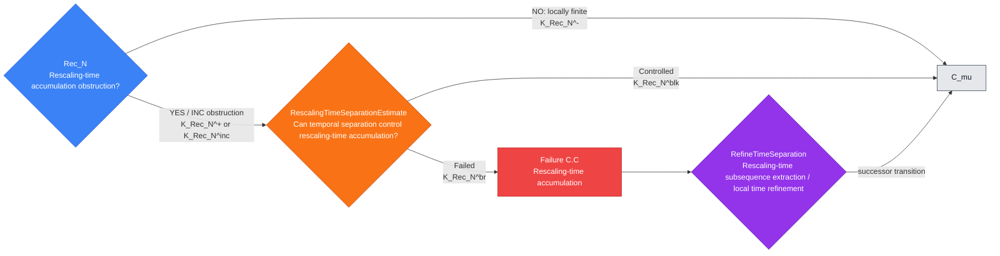

---

## C_mu — Concentration-profile check

**Single check:** Is the concentration-profile data missing or unverified?

**Filled node template**

- **PDE role:** This node decides whether the energy-controlled solution family has a
  verified concentration profile that enters the profile classification. It is
  the transition from coarse compactness to the single-proposition singular-profile case analysis.
- **Proof-dependency position:** Input node is `Rec_N`; profile output node is `PS0`.
  A verified no-profile branch passes to `Bound_partial` because the
  profile local case analysis is then not applicable.
- **Logical proposition:** $P_{C_\mu}$: the concentration measure, profile, or
  compactness witness needed for the profile classification is missing or unverified.
  YES or INC invokes the no-profile estimate; NO enters the profile case analysis.
- **Inputs:** $\Gamma_{\rm in}$ contains bounded energy, local finiteness of rescaling times,
  candidate concentration measures, weak limits, profile witnesses, and
  compactness/scattering criteria.
- **Explicit lemma objects:** The bounded solution sequence $u_n$, weak or
  local-strong limits, localized energy or critical-norm measures $\mu_n$,
  candidate concentration measure $\mu$, profile frames
  $(t_n,x_n,\lambda_n)$, tightness moduli, defect measures, and the no-profile
  continuation or scattering criterion supplied by $\mathcal C$.
- **Check box:** Apply concentration compactness, tightness of measures, or
  profile extraction to test for missing profile data. Output
  $K_{C_\mu}^{+}$ for missing/unverified profile data, $K_{C_\mu}^{-}$ for a
  verified nontrivial profile, or $K_{C_\mu}^{\rm inc}$.

#### Implementation and verification in PDE terms

##### Analytic setting and unknowns

Work with the energy-controlled solution family from `Rec_N`, the selected
time set, and the compactness topology in which concentration profiles are to
be extracted. The objects are admissible solutions or approximating solutions
on the current analysis window, together with candidate weak limits and
concentration measures.

##### Standing assumptions

Use the local energy control and rescaling-time finiteness already recorded in
$\Gamma_{\rm in}$. The topology must be strong enough to discuss tightness,
weak convergence, defect measures, and profile extraction; the solution class
must be stable under the localizations and rescalings used to define the
candidate profile.

##### Objects inspected

Inspect weak limits, localized energy or critical-norm measures, candidate
profile parameters, tightness moduli, no-profile criteria, and any residual or
defect measures left by the compactness passage.

##### Local obstruction predicate

$P_{C_\mu}$ states that the concentration measure, profile, or compactness
witness needed to enter the profile classification is missing or unverified. YES
means the required profile package is absent or undecided. NO means a
nontrivial profile package has been certified.

##### Local lemma to prove

Prove the concentration-profile dichotomy lemma: the energy-controlled family
either admits a nontrivial concentration measure, profile, or compactness
witness with the required convergence data, or satisfies the declared
no-profile criterion. The lemma must also identify the exact compactness or
tightness statement missing in the inconclusive case.

##### Specific estimate or compactness statement to verify

Verify tightness or concentration compactness in the topology declared for the
profile module. The decisive assertion is either extraction of a nonzero
profile with quantified convergence and nontriviality, or a no-profile estimate
strong enough to pass to the boundary/final-exclusion route.

##### Practical verification steps

Localize the family, normalize any selected scales and centers already present,
extract subsequences, test tightness of the relevant measures, identify the
nontrivial limiting object, and record the convergence modes. If no profile is
present, verify the no-profile criterion rather than terminating without a theorem.

##### Certificate contents

$K_{C_\mu}^{-}$ contains the extracted profile, convergence topology,
nontriviality lower bound, and any concentration measure. $K_{C_\mu}^{+}$
contains the failure of profile extraction or the absence of required profile
data. $K_{C_\mu}^{\rm inc}$ names the missing tightness, compactness, or
profile-decomposition theorem.

##### A priori estimate or exclusion test

After $K_{C_\mu}^{+}$ or $K_{C_\mu}^{\rm inc}$, prove that the no-profile
alternative is dispersive, regular, or otherwise non-singular for the
chosen PDE class. A controlled outcome must state the no-profile theorem and
the successor data it provides for `Bound_partial`; a failed outcome records
concentration escape.

##### Failure-scenario data

If the no-profile estimate fails, record the concentration escape witness: the
sequence, topology, lost compactness, missing tightness, and the measure or
profile data that could not be constructed.

##### Recovery or refinement construction

The recovery lemma must refine the profile extraction, strengthen tightness,
or pass to an auxiliary profile problem while preserving energy control and
local finiteness of rescaling times. It must return a profile package
admissible for `PS0` or justify a verified no-profile alternative.

##### Re-entry and output requirements

The profile successor is `PS0`; a verified no-profile branch passes to
`Bound_partial`. The output context must contain either the profile data needed
by `PS0` or the no-profile verified conclusion needed by the boundary/final-exclusion
route.

##### Minimal lemma checklist

Provide the concentration-profile dichotomy, tightness or profile-decomposition
estimate, no-profile exclusion theorem, concentration-escape obstruction
statement, recovery/refinement lemma, and the data in $K_{C_\mu}^{-}$,
$K_{C_\mu}^{+}$, $K_{C_\mu}^{\rm inc}$, $K_{C_\mu}^{\rm blk}$,
$K_{C_\mu}^{\rm br}$, and $K_{\mathrm{Refine}C_\mu}^{\rm re}$.

- **Estimate box:** `NoProfileCriterion` asks whether no-profile behavior is
  scattering, dispersive, regular, or otherwise non-singular. It emits
  $K_{C_\mu}^{\rm ben}$ or
  $K_{C_\mu}^{\rm blk}$ for a controlled no-profile branch, and
  $K_{C_\mu}^{\rm br}$ for concentration escape.
- **Failure scenario and refinement:** Failure scenario `C.D` records concentration escape.
  `RefineScat` performs profile extraction or scattering refinement and emits
  $K_{\mathrm{Refine}C_\mu}^{\rm re}$ to enter `PS0`.
- **Exceptional verified conclusions:** $K_{C_\mu}^{\rm term}$ records a terminal
  compactness singularity, $K_{C_\mu}^{\rm scope}$ declares the profile case analysis
  inapplicable, $K_{C_\mu}^{\rm aux}$ starts an auxiliary profile-extraction problem,
  and $K_{C_\mu}^{\rm unres}$ records the missing compactness theorem.
- **Output context:** $\Gamma_{\rm out}$ records either the verified profile
  data for `PS0` or the verified no-profile conclusion for the boundary/final exclusion step
  transition.

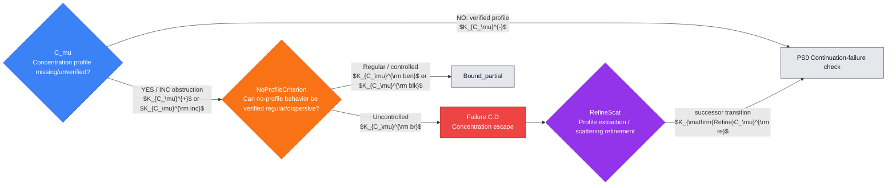

---

# 7. Profile setup and normalization nodes

These nodes turn the verified concentration profile into a normalized PDE
object that the case-analysis checks can use. They verify the continuation
criterion, local concentration, center, scale, gauge, renormalized equation,
profile limit, admissibility inheritance, and nontrivial activity.

## PS0 — Continuation-failure check

**Single check:** Does the continuation criterion fail to produce a verified continuation obstruction?

**Filled node template**

- **PDE role:** This node connects the PDE continuation criterion to the PDE proof scheme:
  if a solution cannot be continued, the failure must produce a mathematically
  named continuation obstruction rather than an unjustified termination.
- **Proof-dependency position:** Input node is `C_mu`; default output node is `PS1`.
- **Logical proposition:** $P_{\mathrm{PS0}}$: the selected continuation
  criterion fails to produce a verified continuation obstruction in the profile context. YES
  or INC is obstruction; NO is the verified continuation implication.
- **Inputs:** $\Gamma_{\rm in}$ contains the candidate maximal solution,
  continuation norm, blow-up time/window, and the profile witness from
  `C_mu`.
- **Explicit lemma objects:** The candidate solution $u$ on its maximal local
  interval $I_{\max}$, the continuation norm $\|u\|_{\mathcal X}$, the local
  existence/stability constants, the endpoint or blow-up window, the profile
  witness from `C_mu`, and the precise continuation theorem or
  contrapositive criterion from $\mathcal C$.
- **Check box:** Test for failure of the continuation theorem or
  contrapositive blow-up criterion. Output $K_{\mathrm{PS0}}^{+}$ for continuation-criterion
  failure, $K_{\mathrm{PS0}}^{-}$ for a verified continuation-obstruction implication, or
  $K_{\mathrm{PS0}}^{\rm inc}$.

#### Implementation and verification in PDE terms

##### Analytic setting and unknowns

Fix the candidate maximal or limiting solution in the admissible solution
class, together with the profile data inherited from `C_mu`. The relevant
objects are the continuation norm, the local existence topology, the maximal
time or continuation window, and the compactness or blow-up criterion attached
to the PDE class.

##### Standing assumptions

Assume the profile package has been certified and that the solution class has a
local well-posedness or continuation statement formulated in the same topology.
The incoming context must identify the continuation norm, admissibility class,
and stability hypotheses needed to apply the continuation theorem.

##### Objects inspected

Inspect the maximal solution, continuation norm, endpoint time window, profile
witness, local existence constants, stability estimates, and any compactness or
blow-up criterion used in the contrapositive continuation argument.

##### Local obstruction predicate

$P_{\mathrm{PS0}}$ states that the selected continuation criterion fails to
produce a verified continuation obstruction in the profile context. YES means
the criterion does not apply or is undecided. NO means failure of continuation has
been converted into the declared obstruction.

##### Local lemma to prove

Prove the continuation-reduction lemma: under the solution-class assumptions,
non-continuation across the selected window implies the declared blow-up norm,
compactness failure, or profile-producing criterion. If the implication cannot
be proved, identify the missing local theory, stability estimate, or endpoint
control.

##### Specific estimate or compactness statement to verify

Verify the continuation estimate in the solution topology: boundedness of the
continuation norm and admissibility data must imply extension, while failure of
extension yields the obstruction used by the profile classification. The constants
must be controlled by the local data and the certified profile context.

##### Practical verification steps

State the local existence theorem, check that the candidate solution satisfies
its hypotheses, apply the continuation criterion on the selected window, and
take the contrapositive. Record the exact norm or compactness quantity that
must blow up or fail.

##### Certificate contents

$K_{\mathrm{PS0}}^{-}$ contains the continuation theorem or contrapositive and
the obstruction quantity it produces. $K_{\mathrm{PS0}}^{+}$ contains the
maximal solution or limiting sequence for which the criterion does not produce
a usable obstruction. $K_{\mathrm{PS0}}^{\rm inc}$ records the missing
well-posedness, stability, endpoint, or admissibility hypothesis.

##### A priori estimate or exclusion test

After an obstructed or inconclusive check, test whether a weaker continuation
criterion, localized continuation theorem, or refined solution class supplies
the missing implication. The controlled outcome must restore a usable
continuation obstruction for `PS1`.

##### Failure-scenario data

The failure scenario is a continuation-criterion gap. Record the solution
class, endpoint window, missing extension theorem, failed stability estimate,
and the profile data that cannot yet be justified from non-continuation.

##### Recovery or refinement construction

The recovery lemma must refine the solution class, replace the continuation
norm, localize the criterion, or formulate an auxiliary continuation problem so
that non-continuation again produces the obstruction required by `PS1`.

##### Re-entry and output requirements

The successor is `PS1`. The output context must contain a verified
continuation-obstruction implication, including its norm, interval, topology,
and dependence on the incoming profile data.

##### Minimal lemma checklist

Provide the continuation-reduction lemma, the local continuation estimate, the
alternate-continuation exclusion theorem, the continuation-gap obstruction
statement, the refinement lemma, and the data in $K_{\mathrm{PS0}}^{-}$,
$K_{\mathrm{PS0}}^{+}$, $K_{\mathrm{PS0}}^{\rm inc}$,
$K_{\mathrm{PS0}}^{\rm blk}$, $K_{\mathrm{PS0}}^{\rm br}$, and
$K_{\mathrm{RefinePS0}}^{\rm re}$.

- **Estimate box:** `Estimate_PS0` asks whether an alternate continuation
  theorem, weaker solution class, or localized criterion supplies the missing
  continuation implication. It emits $K_{\mathrm{PS0}}^{\rm blk}$ or
  $K_{\mathrm{PS0}}^{\rm br}$.
- **Failure scenario and refinement:** Failure scenario `WP` records continuation-criterion failure.
  `Refine_PS0` refines the solution class or continuation criterion and emits
  $K_{\mathrm{RefinePS0}}^{\rm re}$ to enter `PS1`.
- **Exceptional verified conclusions:** $K_{\mathrm{PS0}}^{\rm term}$ closes a
  terminal well-posedness obstruction, $K_{\mathrm{PS0}}^{\rm scope}$ removes
  `PS1` and successor profile checks, $K_{\mathrm{PS0}}^{\rm aux}$ starts an auxiliary
  continuation problem, and $K_{\mathrm{PS0}}^{\rm unres}$ records the
  missing continuation theorem.
- **Output context:** $\Gamma_{\rm out}$ records the continuation-obstruction verified conclusion
  and the proof context entry $c_{\mathrm{PS0}}$.

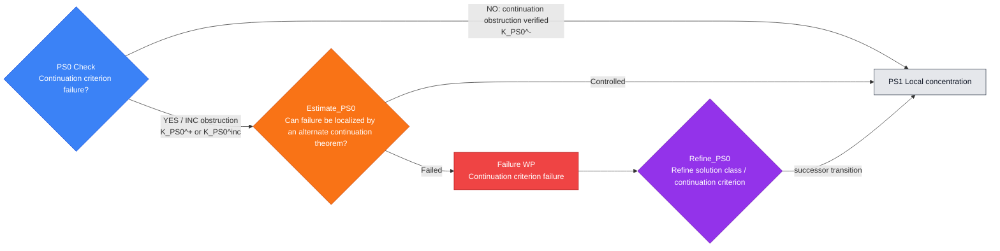

---

## PS1 — Local concentration check

**Single check:** Is localized critical concentration missing?

**Filled node template**

- **PDE role:** This node turns an abstract continuation obstruction into localized critical
  concentration, the PDE object that can be centered, rescaled, and analyzed.
- **Proof-dependency position:** Input node is `PS0`; default output node is `PS2`.
- **Logical proposition:** $P_{\mathrm{PS1}}$: the continuation obstruction fails to produce
  localized concentration at the critical scale or critical norm. YES or INC is
  obstruction; NO is the unobstructed extraction.
- **Inputs:** $\Gamma_{\rm in}$ contains the continuation-obstruction verified conclusion,
  localization windows, critical norm or energy density, and candidate
  concentration measures.
- **Explicit lemma objects:** The localized solution sequence $u_n$, critical
  density $q(u_n)$ or local energy density $e(u_n)$, admissible balls,
  cylinders, sectors, or charts $Q_r(z)$, threshold $\varepsilon_0$, cutoff
  functions, candidate measures $\mu_n$, and the inverse or
  epsilon-regularity statement that converts no-concentration into regularity.
- **Check box:** Use concentration compactness, inverse estimates, or epsilon
  regularity contrapositions to test whether critical concentration is missing.
  Output $K_{\mathrm{PS1}}^{+}$ for missing concentration,
  $K_{\mathrm{PS1}}^{-}$ for localized concentration, or
  $K_{\mathrm{PS1}}^{\rm inc}$.

#### Implementation and verification in PDE terms

##### Analytic setting and unknowns

Work with the continuation obstruction from `PS0`, the active solution or
solution sequence, and the critical quantity dictated by the PDE scaling or
continuation criterion. The admissible regions are balls, cylinders, sectors,
charts, or other localization windows compatible with the equation.

##### Standing assumptions

Assume the continuation obstruction is certified and that the relevant critical
quantity is defined on localized regions. The incoming context must include
localization tools, cutoff stability, and any epsilon-regularity,
inverse-estimate, or concentration-compactness principle available for the PDE
class.

##### Objects inspected

Inspect localized energy or critical-norm densities, candidate concentration
measures, active windows, cutoff errors, inverse-estimate quantities, and
threshold constants.

##### Local obstruction predicate

$P_{\mathrm{PS1}}$ states that the continuation obstruction does not yield
localized concentration at the critical scale or norm. YES means the local
lower bound is missing or undecided. NO means a localized concentration witness
has been obtained.

##### Local lemma to prove

Prove the local concentration lemma: the continuation obstruction forces an
admissible localization window on which the critical quantity exceeds a fixed
positive threshold. If no such window can be found, identify the missing
inverse theorem, epsilon-regularity contrapositive, or localization estimate.

##### Specific estimate or compactness statement to verify

Verify the inverse estimate or contrapositive regularity statement that turns
failure of continuation into localized concentration. The estimate must control
cutoff errors and show that absence of local concentration implies the regular,
dispersive, or perturbative alternative relevant to the PDE.

##### Practical verification steps

Cover the current analysis region by admissible windows, apply the inverse or
epsilon-regularity contrapositive, select a window where the critical quantity
is bounded below, and record its center, scale, threshold, and topology.

##### Certificate contents

$K_{\mathrm{PS1}}^{-}$ contains the selected localization window and lower
bound. $K_{\mathrm{PS1}}^{+}$ records the failure to produce such a window.
$K_{\mathrm{PS1}}^{\rm inc}$ records the missing inverse estimate,
epsilon-regularity theorem, or localization stability.

##### A priori estimate or exclusion test

After an obstructed or inconclusive check, test whether no-concentration
implies regularity, scattering, dispersion, compactness, or another
non-singular alternative. A controlled outcome must provide the theorem and estimates needed
to proceed; a failed outcome records a concentration-defect obstruction.

##### Failure-scenario data

Record the missing concentration witness, the failed inverse estimate, the
critical quantity, and the localization scale at which the continuation
obstruction cannot be represented.

##### Recovery or refinement construction

The recovery lemma must perform concentration-compactness extraction, refine
the localization cover, or choose a stronger critical quantity so that a
localized witness is available for `PS2`.

##### Re-entry and output requirements

The successor is `PS2`. The output context must contain a localized critical
concentration window with center candidates, scale candidates, threshold, and
the estimates justifying its persistence under subsequences.

##### Minimal lemma checklist

Provide the local concentration lemma, the inverse or epsilon-regularity
estimate, the no-concentration exclusion theorem, the concentration-defect
statement, the extraction/refinement lemma, and the data in
$K_{\mathrm{PS1}}^{-}$, $K_{\mathrm{PS1}}^{+}$,
$K_{\mathrm{PS1}}^{\rm inc}$, $K_{\mathrm{PS1}}^{\rm blk}$,
$K_{\mathrm{PS1}}^{\rm br}$, and $K_{\mathrm{RefinePS1}}^{\rm re}$.

- **Estimate box:** `Estimate_PS1` asks whether no-concentration implies
  scattering, dispersion, or regularity. It emits $K_{\mathrm{PS1}}^{\rm blk}$
  or $K_{\mathrm{PS1}}^{\rm br}$.
- **Failure scenario and refinement:** Failure scenario `C.D` records a concentration-defect
  failure. `Refine_PS1` performs concentration-compactness extraction and emits
  $K_{\mathrm{RefinePS1}}^{\rm re}$ to enter `PS2`.
- **Exceptional verified conclusions:** $K_{\mathrm{PS1}}^{\rm term}$ records a
  terminal concentration obstruction, $K_{\mathrm{PS1}}^{\rm scope}$ proves
  profile localization is not applicable, $K_{\mathrm{PS1}}^{\rm aux}$ opens a
  auxiliary extraction, and $K_{\mathrm{PS1}}^{\rm unres}$ records the missing
  inverse/localization estimate.
- **Output context:** $\Gamma_{\rm out}$ contains the localized critical
  concentration witness and proof context entry $c_{\mathrm{PS1}}$.

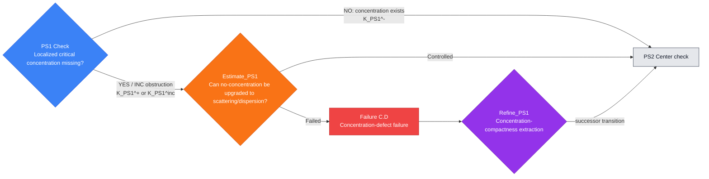

---

## PS2 — Center check

**Single check:** Is the concentration center missing?

**Filled node template**

- **PDE role:** This node selects the spatial or spacetime center of the active
  concentration so successor scale and profile-limit nodes can work in a
  selected moving frame.
- **Proof-dependency position:** Input node is `PS1`; default output node is `PS3`.
- **Logical proposition:** $P_{\mathrm{PS2}}$: no verified concentration
  center $z_n$ has been selected for the active window. YES or INC is obstruction;
  NO means the center is selected.
- **Inputs:** $\Gamma_{\rm in}$ contains the localized concentration measure,
  active window, candidate centers, barycenters, and localization radii.
- **Explicit lemma objects:** The concentration measure $\mu$ or densities
  $\mu_n$, supports of the active windows, candidate centers $z_n$, barycenter
  or maximal-density selection rule, localization radii $r_n$, admissible
  coordinate or boundary charts, and tail estimates outside centered
  neighborhoods.
- **Check box:** Test whether center selection by maximal density, barycenter,
  active concentration-frame selection, or compactness of concentration
  supports has failed. Output
  $K_{\mathrm{PS2}}^{+}$ for missing center, $K_{\mathrm{PS2}}^{-}$ for a
  selected center, or $K_{\mathrm{PS2}}^{\rm inc}$.

#### Implementation and verification in PDE terms

##### Analytic setting and unknowns

Use the localized concentration witness from `PS1` and the spatial or
spacetime geometry of the PDE. The node selects centers $z_n$ for the active
windows so that subsequent rescaling and profile extraction are performed in a
fixed moving frame.

##### Standing assumptions

Assume a localized lower bound for the critical quantity and enough compactness
or tightness to compare translated windows. The admissible center set, metric,
boundary charts if any, and localization radii must be specified.

##### Objects inspected

Inspect concentration supports, barycenters, maximal-density points, active
windows, tail estimates, boundary distances, and translated local coordinates.

##### Local obstruction predicate

$P_{\mathrm{PS2}}$ states that no verified concentration center has been
selected. YES means all candidate center selections fail or concentration
escapes the admissible coordinate system. NO means centers $z_n$ have been
certified.

##### Local lemma to prove

Prove the center-selection lemma: from the localized concentration witness,
construct centers $z_n$ such that translated windows retain the concentration
threshold and tail mass outside admissible neighborhoods is controlled. In the
inconclusive case, identify the missing support compactness, barycenter
estimate, boundary-chart control, or localization stability.

##### Specific estimate or compactness statement to verify

Verify tightness of the localized measure after translation, or a maximal
density/barycenter estimate that selects centers without losing the critical
lower bound. The estimate must distinguish genuine center escape from a
poorly chosen coordinate frame.

##### Practical verification steps

Choose candidate centers from maximal density, barycenter, or active-frame
selection; translate the local variables; check that the concentration
threshold survives; estimate residual tails; and record the coordinate changes.

##### Certificate contents

$K_{\mathrm{PS2}}^{-}$ contains $z_n$, the translated variables, retained
lower bounds, and tail estimates. $K_{\mathrm{PS2}}^{+}$ records center escape
or failure of all admissible candidates. $K_{\mathrm{PS2}}^{\rm inc}$ records
the missing centering, tightness, or boundary-chart lemma.

##### A priori estimate or exclusion test

After an obstructed or inconclusive check, test whether barycenter selection,
maximal active-window selection, or recentering estimates recover an admissible
center. A controlled outcome must provide center data usable by `PS3`.

##### Failure-scenario data

Record the escaping center sequence, lost concentration mass, failed tail
bound, and the coordinate or boundary obstruction preventing a stable center.

##### Recovery or refinement construction

The recovery lemma must recenter by an active window, change charts, refine the
localization radius, or pass to a subsequence so that the concentration witness
is represented in centered variables.

##### Re-entry and output requirements

The successor is `PS3`. The output context must contain centers $z_n$,
translated domains or charts, retained concentration bounds, and tail controls.

##### Minimal lemma checklist

Provide the center-selection lemma, tightness or barycenter estimate, center
recovery estimate, center-escape obstruction statement, recentering refinement
lemma, and the data in $K_{\mathrm{PS2}}^{-}$,
$K_{\mathrm{PS2}}^{+}$, $K_{\mathrm{PS2}}^{\rm inc}$,
$K_{\mathrm{PS2}}^{\rm blk}$, $K_{\mathrm{PS2}}^{\rm br}$, and
$K_{\mathrm{RefinePS2}}^{\rm re}$.

- **Estimate box:** `Estimate_PS2` asks whether barycenter selection or
  active-window recentering recovers a center. It emits
  $K_{\mathrm{PS2}}^{\rm blk}$ or $K_{\mathrm{PS2}}^{\rm br}$.
- **Failure scenario and refinement:** Failure scenario `C.D-center` records center escape.
  `Refine_PS2` recenters by an active concentration window and emits
  $K_{\mathrm{RefinePS2}}^{\rm re}$ to enter `PS3`.
- **Exceptional verified conclusions:** $K_{\mathrm{PS2}}^{\rm term}$ closes a
  terminal center-escape singularity, $K_{\mathrm{PS2}}^{\rm scope}$ proves
  centering is inapplicable, $K_{\mathrm{PS2}}^{\rm aux}$ starts an auxiliary
  concentration-frame problem, and $K_{\mathrm{PS2}}^{\rm unres}$ records the
  missing centering theorem.
- **Output context:** $\Gamma_{\rm out}$ records $z_n$, the recentered
  variables, and proof context entry $c_{\mathrm{PS2}}$.

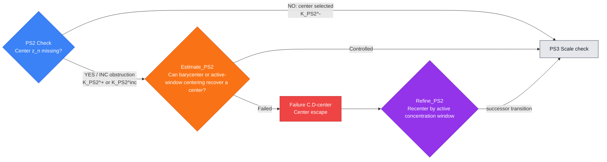

---

## PS3 — Scale check

**Single check:** Is the concentration scale missing?

**Filled node template**

- **PDE role:** This node selects the active concentration scale so the profile
  can be renormalized. It is the single scale-selection proposition.
- **Proof-dependency position:** Input node is `PS2`; default output node is `PS4`.
- **Logical proposition:** $P_{\mathrm{PS3}}$: no verified concentration
  scale $\lambda_n$ has been selected for the active center/window. YES or INC
  is obstruction; NO means the scale is selected.
- **Inputs:** $\Gamma_{\rm in}$ contains the center, concentration density,
  critical thresholds, dyadic windows, and scaling law of the PDE.
- **Explicit lemma objects:** The centered windows $Q_r(z_n)$, concentration
  densities or critical norms on those windows, admissible scales
  $\lambda_n>0$, threshold-crossing functions, dyadic annuli or frequency
  projections when used, intrinsic scaling exponents, and the estimates showing
  that rescaled objects remain in the declared solution class.
- **Check box:** Test whether selection of $\lambda_n$ by threshold crossing,
  critical mass capture, intrinsic scaling, or frequency localization has
  failed. Output $K_{\mathrm{PS3}}^{+}$ for missing scale,
  $K_{\mathrm{PS3}}^{-}$ for a selected scale, or $K_{\mathrm{PS3}}^{\rm inc}$.

#### Implementation and verification in PDE terms

##### Analytic setting and unknowns

Use the centered concentration windows from `PS2`, the intrinsic scaling of the
PDE, and the critical quantity used to normalize profiles. The node selects
positive scales $\lambda_n$ compatible with the equation, domain geometry, and
local compactness topology.

##### Standing assumptions

Assume centers have been selected and the concentration threshold persists in
centered variables. The incoming context must specify the scaling law, critical
normalization, admissible scale range, and any frequency or spatial
localization estimates used to select $\lambda_n$.

##### Objects inspected

Inspect scale-dependent localized norms, threshold functions, frequency
envelopes, intrinsic radii, concentration measures, and monotonicity or
doubling quantities.

##### Local obstruction predicate

$P_{\mathrm{PS3}}$ states that no verified concentration scale has been
selected. YES means all admissible scale choices fail or the scale escapes
without normalization. NO means a scale sequence $\lambda_n$ has been certified.

##### Local lemma to prove

Prove the scale-selection lemma: construct $\lambda_n>0$ so that a normalized
critical quantity is fixed, bounded below, or lies in a compact range after
centering. If this cannot be done, identify the missing scaling law, threshold
crossing, monotonicity, or frequency-localization estimate.

##### Specific estimate or compactness statement to verify

Verify the threshold-crossing, doubling, or frequency-localization statement
that produces a stable scale. The estimate must ensure that the rescaled
objects remain admissible and that the selected scale captures the active
concentration.

##### Practical verification steps

Evaluate the critical quantity as a function of scale, use monotonicity or
continuity in scale to select $\lambda_n$, normalize the variables, and record
scale-relative upper and lower bounds.

##### Certificate contents

$K_{\mathrm{PS3}}^{-}$ contains $\lambda_n$, the normalized variables,
threshold identity or inequality, and scale-relative bounds.
$K_{\mathrm{PS3}}^{+}$ contains scale escape or failure of all scale choices.
$K_{\mathrm{PS3}}^{\rm inc}$ records the missing scale-selection theorem.

##### A priori estimate or exclusion test

After an obstructed or inconclusive check, test whether dyadic refinement,
threshold reselection, or frequency-envelope control supplies an admissible
scale. A controlled outcome must produce scale data usable by `PS4`.

##### Failure-scenario data

Record the failed scale sequence, lost normalization, unresolved scale range,
and the critical quantity that cannot be stabilized.

##### Recovery or refinement construction

The recovery lemma must refine the dyadic scale, alter the threshold, use a
frequency envelope, or pass to an auxiliary scale-selection problem while
preserving the centered concentration witness.

##### Re-entry and output requirements

The successor is `PS4`. The output context must contain selected scales,
rescaled variables, normalization bounds, and admissibility of the rescaled
domains or charts.

##### Minimal lemma checklist

Provide the scale-selection lemma, threshold or frequency estimate,
scale-recovery theorem, scale-escape obstruction statement, refinement lemma,
and the data in $K_{\mathrm{PS3}}^{-}$, $K_{\mathrm{PS3}}^{+}$,
$K_{\mathrm{PS3}}^{\rm inc}$, $K_{\mathrm{PS3}}^{\rm blk}$,
$K_{\mathrm{PS3}}^{\rm br}$, and $K_{\mathrm{RefinePS3}}^{\rm re}$.

- **Estimate box:** `Estimate_PS3` asks whether dyadic refinement or threshold
  reselection supplies the missing scale. It emits
  $K_{\mathrm{PS3}}^{\rm blk}$ or $K_{\mathrm{PS3}}^{\rm br}$.
- **Failure scenario and refinement:** Failure scenario `S.E-scale` records scale-selection
  failure. `Refine_PS3` performs threshold reselection or dyadic refinement and
  emits $K_{\mathrm{RefinePS3}}^{\rm re}$ to enter `PS4`.
- **Exceptional verified conclusions:** $K_{\mathrm{PS3}}^{\rm term}$ closes a
  terminal scale singularity, $K_{\mathrm{PS3}}^{\rm scope}$ proves scaling
  is not applicable, $K_{\mathrm{PS3}}^{\rm aux}$ starts an auxiliary scaling
  problem, and $K_{\mathrm{PS3}}^{\rm unres}$ records the missing scale
  selection estimate.
- **Output context:** $\Gamma_{\rm out}$ records $\lambda_n$, normalized
  coordinates, and proof context entry $c_{\mathrm{PS3}}$.

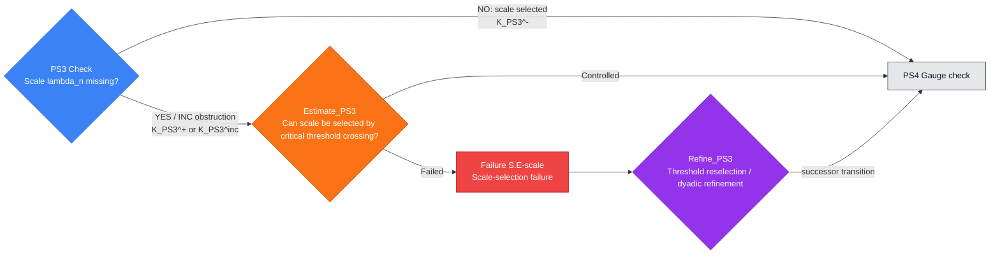

---

## PS4 — Gauge check

**Single check:** Is there gauge/modulation drift?

**Filled node template**

- **PDE role:** This node selects modulation, phase, translation,
  multiplier, or other gauge freedoms so that the normalized profile is not
  drifting in a symmetry direction.
- **Proof-dependency position:** Input node is `PS3`; default output node is `PS5`.
- **Logical proposition:** $P_{\mathrm{PS4}}$: the normalized profile has
  unfixed gauge or modulation drift. YES or INC is obstruction; NO means a canonical
  gauge or modulation slice is selected.
- **Inputs:** $\Gamma_{\rm in}$ contains the center, scale, symmetry group,
  modulation parameters, orthogonality conditions, and quotient variables.
- **Explicit lemma objects:** The normalized sequence after centering and
  scaling, the symmetry or gauge group $G$, modulation parameters $a_n$,
  infinitesimal generators, orthogonality conditions defining a slice,
  quotient metric or distance to the slice, and all terms introduced in the
  PDE by differentiating or changing these parameters.
- **Check box:** Test for failure of a slice theorem, modulation lemma,
  multiplier or gauge normalization, or orthogonality condition. Output
  $K_{\mathrm{PS4}}^{+}$ for gauge drift, $K_{\mathrm{PS4}}^{-}$ for selected
  gauge, or $K_{\mathrm{PS4}}^{\rm inc}$.

#### Implementation and verification in PDE terms

##### Analytic setting and unknowns

Use the centered and rescaled profile sequence from `PS3`, together with the
symmetry, modulation, phase, multiplier, or gauge variables relevant to the
PDE. The goal is to choose a canonical representative of the normalized
profile in the quotient by these degrees of freedom.

##### Standing assumptions

Assume the center and scale are fixed and that the symmetry action preserves
the solution class and transformed equation. The incoming context must specify
orthogonality conditions, constraint equations, nondegeneracy hypotheses, and
regularity of the modulation map.

##### Objects inspected

Inspect modulation parameters, phase or gauge functions, orthogonality
functionals, constraint residuals, linearized tangent directions, and quotient
norms measuring drift.

##### Local obstruction predicate

$P_{\mathrm{PS4}}$ states that the normalized profile has unfixed gauge or
modulation drift. YES means a drift mode remains or the slice equations fail.
NO means a canonical slice or modulation has been selected.

##### Local lemma to prove

Prove the modulation or slice lemma: after centering and scaling, choose the
symmetry parameters so the normalized objects satisfy the declared
orthogonality, quotient, or constraint conditions with controlled parameters.
If this cannot be done, identify the missing nondegeneracy, differentiability,
or slice theorem.

##### Specific estimate or compactness statement to verify

Verify the implicit-function, coercivity, or slice estimate controlling
symmetry parameters by the distance to the reference manifold. The estimate
must control the drift terms introduced in the transformed PDE.

##### Practical verification steps

Write the modulation equations, verify invertibility or transversality of the
linearized constraints, solve for the parameters, substitute them into the
normalized variables, and record the orthogonality identities and parameter
bounds.

##### Certificate contents

$K_{\mathrm{PS4}}^{-}$ contains the selected parameters, normalized variables,
orthogonality identities, and parameter estimates. $K_{\mathrm{PS4}}^{+}$
contains an unremoved drift mode or failed slice equation.
$K_{\mathrm{PS4}}^{\rm inc}$ records the missing nondegeneracy, regularity, or
slice theorem.

##### A priori estimate or exclusion test

After an obstructed or inconclusive check, test whether quotienting by the
symmetry group, changing the slice, or strengthening orthogonality controls the
drift. A controlled outcome must deliver variables admissible for deriving the
renormalized equation in `PS5`.

##### Failure-scenario data

Record the drifting parameter, failed orthogonality condition, tangent
direction, and the term it creates in the normalized PDE.

##### Recovery or refinement construction

The recovery lemma must impose a canonical slice, refine the quotient, add a
modulation equation, or pass to an auxiliary quotient problem while preserving
the centered and scaled profile data.

##### Re-entry and output requirements

The successor is `PS5`. The output context must contain gauge-normalized
variables, parameter bounds, and all extra terms induced by the chosen
normalization.

##### Minimal lemma checklist

Provide the modulation/slice lemma, parameter-control estimate, quotient
exclusion theorem, gauge-drift obstruction statement, slice-refinement lemma,
and the data in $K_{\mathrm{PS4}}^{-}$, $K_{\mathrm{PS4}}^{+}$,
$K_{\mathrm{PS4}}^{\rm inc}$, $K_{\mathrm{PS4}}^{\rm blk}$,
$K_{\mathrm{PS4}}^{\rm br}$, and $K_{\mathrm{RefinePS4}}^{\rm re}$.

- **Estimate box:** `Estimate_PS4` asks whether slice refinement or quotienting
  by symmetry controls the gauge drift. It emits $K_{\mathrm{PS4}}^{\rm blk}$
  or $K_{\mathrm{PS4}}^{\rm br}$.
- **Failure scenario and refinement:** Failure scenario `G.D` records gauge drift. `Refine_PS4`
  imposes a canonical slice or symmetry quotient and emits
  $K_{\mathrm{RefinePS4}}^{\rm re}$ to enter `PS5`.
- **Exceptional verified conclusions:** $K_{\mathrm{PS4}}^{\rm term}$ records a
  terminal gauge obstruction, $K_{\mathrm{PS4}}^{\rm scope}$ proves gauge
  fixing is irrelevant, $K_{\mathrm{PS4}}^{\rm aux}$ starts an auxiliary
  quotient problem, and $K_{\mathrm{PS4}}^{\rm unres}$ records the missing slice
  theorem.
- **Output context:** $\Gamma_{\rm out}$ records the gauge-normalized variables
  and proof context entry $c_{\mathrm{PS4}}$.

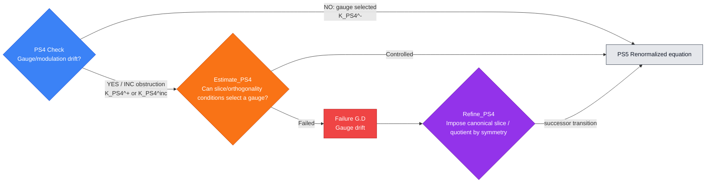

---

## PS5 — Renormalized-equation check

**Single check:** Does the renormalized equation fail to close?

**Filled node template**

- **PDE role:** This node checks that the centered, scaled, gauge-normalized
  sequence still satisfies a closed PDE rather than an equation with implicit
  forcing, multiplier, or defect terms.
- **Proof-dependency position:** Input node is `PS4`; default output node is `PS6`.
- **Logical proposition:** $P_{\mathrm{PS5}}$: the normalized sequence fails
  to obey a closed renormalized equation in the declared variables. YES or INC
  is obstruction; NO means the equation closes.
- **Inputs:** $\Gamma_{\rm in}$ contains normalized variables, scaling
  identities, transformed operators, multiplier or gauge terms, and weak-form
  residuals.
- **Explicit lemma objects:** The normalized unknowns $v_n$, transformed
  operators $\mathcal P_n$, transformed coefficients and data, admissible test
  functions, commutators, multiplier or gauge terms, residual distributions
  $R_n$, boundary or forcing contributions after transformation, and the
  topology in which each term is passed to the limit.
- **Check box:** Derive the renormalized PDE and test for unclosed transformed
  terms. Output $K_{\mathrm{PS5}}^{+}$ for closure failure,
  $K_{\mathrm{PS5}}^{-}$ for a closed equation, or $K_{\mathrm{PS5}}^{\rm inc}$.

#### Implementation and verification in PDE terms

##### Analytic setting and unknowns

Use the centered, scaled, and gauge-normalized sequence from `PS4`. The node
derives the PDE satisfied by the normalized variables, including transformed
operators, coefficients, multipliers, commutators, and residual terms.

##### Standing assumptions

Assume the original PDE holds in the declared weak, strong, variational,
entropy, or renormalized sense and that the transformations used in `PS2`--`PS4`
are admissible for that formulation. Chain rules, change-of-variable formulas,
and convergence of transformed coefficients must be available or explicitly
recorded as missing.

##### Objects inspected

Inspect the transformed unknowns, weak formulations, test functions,
commutators, multiplier terms, coefficient limits, residuals, and defect terms
generated by centering, scaling, and gauge normalization.

##### Local obstruction predicate

$P_{\mathrm{PS5}}$ states that the normalized sequence fails to satisfy a
closed renormalized equation. YES means an unabsorbed residual, forcing,
multiplier, or commutator remains. NO means the renormalized equation closes.

##### Local lemma to prove

Prove the renormalized-equation closure lemma: the normalized sequence
satisfies a closed weak or strong PDE in the declared variables, with every
residual term either shown to vanish, controlled by an existing estimate, or
promoted to a named defect variable. If closure cannot be proved, identify the
missing transformation identity or limiting argument.

##### Specific estimate or compactness statement to verify

Verify residual convergence, commutator bounds, coefficient convergence, and
validity of the transformed weak formulation. The estimate must show that the
normalized equation is valid for the profile-limit extraction in `PS6`.

##### Practical verification steps

Transform the PDE, test against admissible functions, track all scaling and
modulation terms, estimate commutators and residuals, pass to limits allowed by
the current topology, and write the closed renormalized equation.

##### Certificate contents

$K_{\mathrm{PS5}}^{-}$ contains the closed renormalized PDE, weak formulation,
residual estimates, and transformed coefficient data. $K_{\mathrm{PS5}}^{+}$
contains the unclosed residual or defect term. $K_{\mathrm{PS5}}^{\rm inc}$
records the missing chain rule, commutator estimate, coefficient convergence,
or weak passage to the limit.

##### A priori estimate or exclusion test

After an obstructed or inconclusive check, test whether the missing term can be
absorbed into gauge, multiplier, commutator, lower-order forcing, or a declared
defect variable. A controlled outcome must produce a closed equation usable by
`PS6`.

##### Failure-scenario data

Record the unclosed term, its scaling, topology, distributional action, and why
it prevents the normalized sequence from being governed by the expected PDE.

##### Recovery or refinement construction

The recovery lemma must add defect variables, refine the gauge, strengthen the
commutator estimate, or pass to an auxiliary equation whose closure and
progress measure are explicit.

##### Re-entry and output requirements

The successor is `PS6`. The output context must contain the closed
renormalized equation, the formulation in which it holds, and all named
residual or defect variables.

##### Minimal lemma checklist

Provide the equation-closure lemma, transformed-residual estimates, absorption
or defect-variable theorem, renormalized-equation failure statement, refinement
lemma, and the data in $K_{\mathrm{PS5}}^{-}$,
$K_{\mathrm{PS5}}^{+}$, $K_{\mathrm{PS5}}^{\rm inc}$,
$K_{\mathrm{PS5}}^{\rm blk}$, $K_{\mathrm{PS5}}^{\rm br}$, and
$K_{\mathrm{RefinePS5}}^{\rm re}$.

- **Estimate box:** `Estimate_PS5` asks whether missing terms can be absorbed
  into gauge, multiplier, commutator, or declared defect variables. It emits
  $K_{\mathrm{PS5}}^{\rm blk}$ or $K_{\mathrm{PS5}}^{\rm br}$.
- **Failure scenario and refinement:** Failure scenario `D.F` records a renormalized-equation
  defect. `Refine_PS5` adds defect variables or refines the gauge and emits
  $K_{\mathrm{RefinePS5}}^{\rm re}$ to enter `PS6`.
- **Exceptional verified conclusions:** $K_{\mathrm{PS5}}^{\rm term}$ records a
  terminal equation-closure failure, $K_{\mathrm{PS5}}^{\rm scope}$ proves that
  no closed profile equation is available, $K_{\mathrm{PS5}}^{\rm aux}$
  starts an auxiliary equation with extra variables, and $K_{\mathrm{PS5}}^{\rm unres}$
  records the missing transformation identity.
- **Output context:** $\Gamma_{\rm out}$ records the closed renormalized PDE
  and proof context entry $c_{\mathrm{PS5}}$.

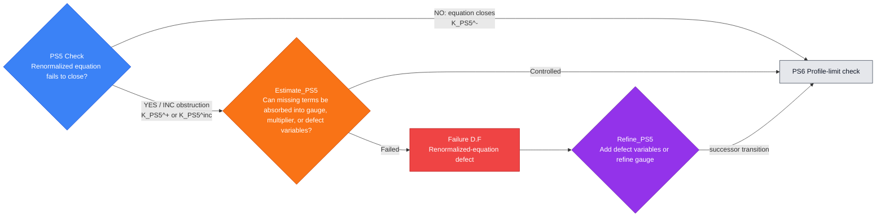

---

## PS6 — Profile-limit check

**Single check:** Is the subsequential profile limit missing?

**Filled node template**

- **PDE role:** This node extracts a subsequential profile limit from the
  normalized sequence. It is the compactness step that turns a singular sequence
  into an object whose limiting behavior can be analyzed.
- **Proof-dependency position:** Input node is `PS5`; default output node is `PS7`.
- **Logical proposition:** $P_{\mathrm{PS6}}$: the normalized sequence lacks a
  subsequential limit in the declared topology. YES or INC is obstruction; NO means
  a profile limit exists.
- **Inputs:** $\Gamma_{\rm in}$ contains uniform bounds, closed renormalized
  equation, compactness topology, symmetry quotient, and possible defect
  measures.
- **Explicit lemma objects:** The normalized sequence $v_n$, uniform local
  bounds, time-regularity bounds, tightness data, compact embeddings, quotient
  or symmetry-fixed variables, subsequence labels, candidate profile limit
  $V$, defect measures, and nonlinear quantities whose convergence must be
  justified.
- **Check box:** Test whether Rellich compactness, Aubin-Lions,
  concentration compactness, weak compactness, or profile decomposition fails
  to produce a limit. Output $K_{\mathrm{PS6}}^{+}$ for missing limit,
  $K_{\mathrm{PS6}}^{-}$ for an extracted limit, or $K_{\mathrm{PS6}}^{\rm inc}$.

#### Implementation and verification in PDE terms

##### Analytic setting and unknowns

Use the normalized sequence satisfying the closed equation from `PS5`. The
node extracts a subsequential profile limit in the weak, strong, local,
measure-valued, or quotient topology appropriate for the PDE class.

##### Standing assumptions

Assume uniform bounds and a closed normalized equation are available. The
incoming context must specify compact embeddings, time-regularity estimates,
tightness conditions, boundary-chart compactness if needed, and the defect
objects allowed by the proof scheme.

##### Objects inspected

Inspect subsequences, weak limits, strong local limits, defect measures,
tightness moduli, time-regularity bounds, coefficient limits, and topology of
convergence.

##### Local obstruction predicate

$P_{\mathrm{PS6}}$ states that the normalized sequence lacks a subsequential
profile limit in the declared topology. YES means compactness is lost beyond
the allowed defect variables. NO means a profile limit is extracted.

##### Local lemma to prove

Prove the profile-limit compactness lemma: from the uniform bounds and closed
normalized equation, extract a subsequence converging to a limit in the
declared topology, modulo already fixed symmetries and named defect objects.
If this fails, identify the missing embedding, time-regularity estimate,
tightness theorem, or defect-measure extraction.

##### Specific estimate or compactness statement to verify

Verify the compactness mechanism: Rellich-type compactness, weak compactness,
Aubin-Lions-type time compactness, concentration compactness, tightness, or a
profile decomposition. The statement must identify the convergence topology and
the nonlinear quantities that pass to the limit.

##### Practical verification steps

Apply the uniform estimates, extract subsequences, pass to weak or strong
limits, identify any defect measures, verify convergence of the equation, and
record all topologies and subsequence labels.

##### Certificate contents

$K_{\mathrm{PS6}}^{-}$ contains the subsequence, profile limit, convergence
topologies, and defect variables if any. $K_{\mathrm{PS6}}^{+}$ contains the
loss-of-compactness witness. $K_{\mathrm{PS6}}^{\rm inc}$ records the missing
compactness or tightness theorem.

##### A priori estimate or exclusion test

After an obstructed or inconclusive check, test whether compactness can be
recovered modulo symmetry, by profile decomposition, or through explicit
defect-measure extraction. A controlled outcome must produce a limit object
admissible for `PS7`.

##### Failure-scenario data

Record the noncompact sequence, topology of failure, escaping mass or
oscillation, and the absent defect object or compactness theorem.

##### Recovery or refinement construction

The recovery lemma must perform profile decomposition, introduce defect
measures, refine tightness, or pass to an auxiliary compactness problem while
preserving the closed normalized equation.

##### Re-entry and output requirements

The successor is `PS7`. The output context must contain the profile limit,
convergence data, allowed defects, and enough information to test admissibility
inheritance.

##### Minimal lemma checklist

Provide the compactness lemma, convergence estimate, compactness-recovery
theorem, compactness-failure obstruction statement, profile-decomposition or
defect-extraction lemma, and the data in $K_{\mathrm{PS6}}^{-}$,
$K_{\mathrm{PS6}}^{+}$, $K_{\mathrm{PS6}}^{\rm inc}$,
$K_{\mathrm{PS6}}^{\rm blk}$, $K_{\mathrm{PS6}}^{\rm br}$, and
$K_{\mathrm{RefinePS6}}^{\rm re}$.

- **Estimate box:** `Estimate_PS6` asks whether compactness can be recovered
  modulo symmetry or by extracting defect measures. It emits
  $K_{\mathrm{PS6}}^{\rm blk}$ or $K_{\mathrm{PS6}}^{\rm br}$.
- **Failure scenario and refinement:** Failure scenario `C_mu-rough` records compactness failure.
  `Refine_PS6` performs profile decomposition or defect-measure extraction and
  emits $K_{\mathrm{RefinePS6}}^{\rm re}$ to enter `PS7`.
- **Exceptional verified conclusions:** $K_{\mathrm{PS6}}^{\rm term}$ records a
  terminal compactness obstruction, $K_{\mathrm{PS6}}^{\rm scope}$ proves no
  limit object is available, $K_{\mathrm{PS6}}^{\rm aux}$ opens an auxiliary
  profile, and $K_{\mathrm{PS6}}^{\rm unres}$ records the missing compactness
  theorem.
- **Output context:** $\Gamma_{\rm out}$ records the profile limit, topology,
  convergence verified conclusions, and proof context entry $c_{\mathrm{PS6}}$.

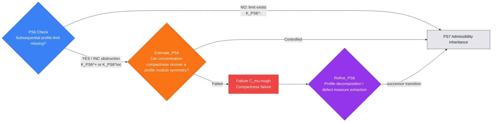

---

## PS7 — Admissibility-inheritance check

**Single check:** Does the limit fail admissibility inheritance?

**Filled node template**

- **PDE role:** This node verifies that the extracted limit remains in the
  declared admissible solution class, such as an energy, entropy, viscosity,
  weak, renormalized, or problem-specific admissibility class.
- **Proof-dependency position:** Input node is `PS6`; default output node is `PS8`.
- **Logical proposition:** $P_{\mathrm{PS7}}$: the profile limit fails to
  inherit the declared admissibility conditions. YES or INC is obstruction; NO means
  admissibility is inherited.
- **Inputs:** $\Gamma_{\rm in}$ contains the profile limit, convergence mode,
  energy/entropy inequalities, boundary or sector conditions, and weak-form
  identities.
- **Explicit lemma objects:** The profile limit $V$, approximating sequence
  $v_n$, weak formulation identities, local energy, entropy, viscosity, or
  variational inequalities, nonlinear terms requiring convergence, boundary
  traces, sector or constraint conditions, and lower-semicontinuity statements
  needed to pass admissibility to the limit.
- **Check box:** Test whether inequalities, local energy conditions, entropy
  inequalities, sector constraints, and weak formulations fail to pass to the
  limit. Output $K_{\mathrm{PS7}}^{+}$ for admissibility defect,
  $K_{\mathrm{PS7}}^{-}$ for inherited admissibility, or
  $K_{\mathrm{PS7}}^{\rm inc}$.

#### Implementation and verification in PDE terms

##### Analytic setting and unknowns

Use the profile limit and convergence data from `PS6`. The node verifies that
the limit belongs to the declared admissible class: weak, energy, entropy,
viscosity, variational, renormalized, suitable, or other PDE-specific class.

##### Standing assumptions

Assume the approximating sequence is admissible and the convergence topology is
known. The incoming context must identify all inequalities, weak formulations,
trace conditions, boundary conditions, and structural constraints that define
admissibility.

##### Objects inspected

Inspect weak formulations, local inequalities, entropy or energy inequalities,
traces, boundary terms, nonlinear terms, defect measures, and lower
semicontinuity inputs.

##### Local obstruction predicate

$P_{\mathrm{PS7}}$ states that the profile limit fails to inherit the declared
admissibility conditions. YES means an admissibility condition fails or is not
justified. NO means the limit is admissible.

##### Local lemma to prove

Prove the admissibility-inheritance lemma: the convergence from `PS6` is
strong enough to pass all required formulations, inequalities, traces, and
constraints to the limit. If not, identify the missing topology, trace theorem,
lower-semicontinuity statement, or nonlinear convergence lemma.

##### Specific estimate or compactness statement to verify

Verify lower semicontinuity of coercive quantities, convergence of nonlinear
terms, stability of weak formulations, and passage of boundary or trace data to
the limit.

##### Practical verification steps

Test the approximate equations against admissible functions, pass each term to
the limit, apply lower semicontinuity to inequalities, verify trace convergence,
and record all inherited constraints.

##### Certificate contents

$K_{\mathrm{PS7}}^{-}$ contains the admissible limit class and all inherited
formulations or inequalities. $K_{\mathrm{PS7}}^{+}$ contains the failed
admissibility condition. $K_{\mathrm{PS7}}^{\rm inc}$ records the missing
passage-to-limit theorem.

##### A priori estimate or exclusion test

After an obstructed or inconclusive check, test whether a weaker but valid
formulation, renormalized formulation, entropy condition, or augmented
admissible class restores the limit as a usable PDE object.

##### Failure-scenario data

Record the failed inequality, weak formulation, trace, or nonlinear term and
why the current topology cannot pass it to the limit.

##### Recovery or refinement construction

The recovery lemma must refine the solution class, add defect terms, strengthen
convergence, or pass to an admissible formulation preserving the profile limit
and enabling `PS8`.

##### Re-entry and output requirements

The successor is `PS8`. The output context must contain the admissible profile,
its PDE formulation, inequalities, boundary/trace status, and any named
defects.

##### Minimal lemma checklist

Provide the admissibility-inheritance lemma, lower-semicontinuity and nonlinear
convergence estimates, admissibility-recovery theorem, inadmissibility
obstruction statement, refinement lemma, and the data in
$K_{\mathrm{PS7}}^{-}$, $K_{\mathrm{PS7}}^{+}$,
$K_{\mathrm{PS7}}^{\rm inc}$, $K_{\mathrm{PS7}}^{\rm blk}$,
$K_{\mathrm{PS7}}^{\rm br}$, and $K_{\mathrm{RefinePS7}}^{\rm re}$.

- **Estimate box:** `Estimate_PS7` asks whether admissibility can be restored by
  a weak, renormalized, entropy, viscosity, or suitable formulation. It emits
  $K_{\mathrm{PS7}}^{\rm blk}$ or $K_{\mathrm{PS7}}^{\rm br}$.
- **Failure scenario and refinement:** Failure scenario `A.D` records an admissibility defect.
  `Refine_PS7` passes to the correct admissible solution class and emits
  $K_{\mathrm{RefinePS7}}^{\rm re}$ to enter `PS8`.
- **Exceptional verified conclusions:** $K_{\mathrm{PS7}}^{\rm term}$ records a
  terminal inadmissible profile, $K_{\mathrm{PS7}}^{\rm scope}$ proves the
  class condition is not applicable, $K_{\mathrm{PS7}}^{\rm aux}$ starts an
  auxiliary admissibility problem, and $K_{\mathrm{PS7}}^{\rm unres}$ records the
  missing lower-semicontinuity or passage-to-limit theorem.
- **Output context:** $\Gamma_{\rm out}$ records the admissible profile class
  and proof context entry $c_{\mathrm{PS7}}$.

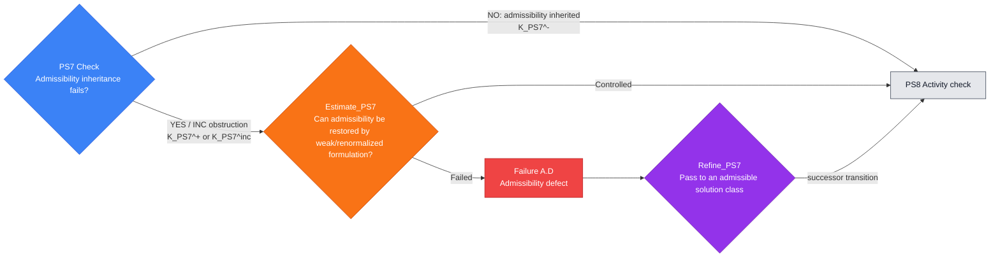

---

## PS8 — Activity check

**Single check:** Is the extracted profile trivial or inactive?

**Filled node template**

- **PDE role:** This node checks that the extracted profile carries nonzero
  activity, critical norm, energy, or another problem-specific
  quantity. It prevents the case analysis from assigning a case to a vanishing artifact.
- **Proof-dependency position:** Input node is `PS7`; default output node is `PS9`.
- **Logical proposition:** $P_{\mathrm{PS8}}$: the extracted profile is
  trivial, vanishing, or inactive in the declared critical quantity. YES or INC
  is obstruction; NO means the profile is active.
- **Inputs:** $\Gamma_{\rm in}$ contains the admissible profile, activity
  functional, critical threshold, normalization, and nonvanishing witness.
- **Explicit lemma objects:** The admissible profile $V$, activity functional
  $A(V)$ or critical norm, normalization inherited from `PS3`--`PS4`,
  threshold $\eta>0$, localized lower-bound witness, lower-semicontinuity or
  nonvanishing estimate, and any vanishing criterion that would make the
  profile irrelevant.
- **Check box:** Test for vanishing despite normalization, lower
  semicontinuity, or active-window mass capture. Output $K_{\mathrm{PS8}}^{+}$
  for vanishing/inactivity, $K_{\mathrm{PS8}}^{-}$ for active nontriviality, or
  $K_{\mathrm{PS8}}^{\rm inc}$.

#### Implementation and verification in PDE terms

##### Analytic setting and unknowns

Use the admissible profile from `PS7` and the critical activity quantity
selected for the PDE class. The purpose is to distinguish a genuine active
profile from a vanishing artifact of extraction.

##### Standing assumptions

Assume the profile is admissible and normalized by the preceding center, scale,
and gauge choices. The incoming context must specify the critical quantity,
nontriviality threshold, and any conservation or lower-semicontinuity inputs
used to pass the normalization to the limit.

##### Objects inspected

Inspect activity functionals, critical norms, localized measures, invariant
quantities, normalization identities, and lower bounds inherited from the
concentration witness.

##### Local obstruction predicate

$P_{\mathrm{PS8}}$ states that the extracted profile is trivial, vanishing, or
inactive in the declared critical quantity. YES means the profile carries no
usable activity. NO means a positive lower bound has been certified.

##### Local lemma to prove

Prove the nontriviality lemma: the admissible profile has a positive amount of
the declared critical quantity after normalization. If this fails, identify
whether the loss is genuine vanishing or a missing lower-semicontinuity,
normalization, or conservation argument.

##### Specific estimate or compactness statement to verify

Verify the lower-bound passage from the normalized sequence to the profile
limit. The estimate may be a lower-semicontinuity result, strong convergence of
the activity density, conservation of an invariant, or a nonvanishing
compactness lemma.

##### Practical verification steps

Evaluate the critical quantity on the normalized sequence, pass the lower
bound to the limit, rule out cancellation or escape, and record the positive
threshold for the profile.

##### Certificate contents

$K_{\mathrm{PS8}}^{-}$ contains the activity lower bound, normalization, and
critical quantity. $K_{\mathrm{PS8}}^{+}$ contains the vanishing or triviality
witness. $K_{\mathrm{PS8}}^{\rm inc}$ records the missing lower-semicontinuity,
normalization, or conservation input.

##### A priori estimate or exclusion test

After an obstructed or inconclusive check, test whether vanishing implies the
regular, dispersive, scattering, or non-singular alternative relevant to the PDE.
A controlled outcome must either close that branch or provide an active
replacement profile.

##### Failure-scenario data

Record the vanished quantity, lost normalization, convergence mode, and why the
current profile cannot carry the singular behavior.

##### Recovery or refinement construction

The recovery lemma must reselect the active scale or window, refine the
profile extraction, or pass to an auxiliary active component with a certified
nonzero activity measure.

##### Re-entry and output requirements

The successor is `PS9`. The output context must contain an admissible active
profile, its critical lower bound, and the normalization data used by the
scale-law checks.

##### Minimal lemma checklist

Provide the nontriviality lemma, lower-bound passage estimate, vanishing
exclusion theorem, vanishing-extraction obstruction statement, active-window
refinement lemma, and the data in $K_{\mathrm{PS8}}^{-}$,
$K_{\mathrm{PS8}}^{+}$, $K_{\mathrm{PS8}}^{\rm inc}$,
$K_{\mathrm{PS8}}^{\rm blk}$, $K_{\mathrm{PS8}}^{\rm br}$, and
$K_{\mathrm{RefinePS8}}^{\rm re}$.

- **Estimate box:** `Estimate_PS8` asks whether vanishing implies regularity,
  scattering, or non-singular dispersion. It emits $K_{\mathrm{PS8}}^{\rm blk}$
  or $K_{\mathrm{PS8}}^{\rm br}$.
- **Failure scenario and refinement:** Failure scenario `C.V` records vanishing extraction.
  `Refine_PS8` reselects the active scale/window and emits
  $K_{\mathrm{RefinePS8}}^{\rm re}$ to enter `PS9`.
- **Exceptional verified conclusions:** $K_{\mathrm{PS8}}^{\rm term}$ records a
  terminal vanishing contradiction, $K_{\mathrm{PS8}}^{\rm scope}$ proves
  activity is inapplicable, $K_{\mathrm{PS8}}^{\rm aux}$ starts an auxiliary
  active-window extraction, and $K_{\mathrm{PS8}}^{\rm unres}$ records the
  missing nonvanishing estimate.
- **Output context:** $\Gamma_{\rm out}$ records the active profile and
  proof context entry $c_{\mathrm{PS8}}$.

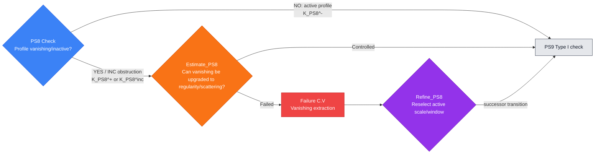

---

# 8. Scale-law case-analysis steps

These nodes assign the active profile to scale-law regimes. The case analysis is ordered
but exhaustive: Type I behavior, Type II behavior, and scale-cascade behavior
are each verified before the transition enters orbit-type analysis.

## PS9 — Type I check

**Single check:** Is the active profile Type I?

**Filled node template**

- **PDE role:** This node checks whether the active profile has Type I scaling
  behavior, meaning the blow-up or concentration rate is controlled by the
  natural dimensional rate of the PDE.
- **Proof-dependency position:** Input node is `PS8`; default output node is `PS10`.
- **Logical proposition:** $P_{\mathrm{PS9}}$: the active profile satisfies
  the declared Type I rate bound. YES or INC is a scale-law obstruction branch for
  the case analysis; NO records absence and proceeds.
- **Inputs:** $\Gamma_{\rm in}$ contains the active profile, scale
  $\lambda_n$, critical norm, rate functional, and Type I threshold.
- **Explicit lemma objects:** The active profile $V$, scale sequence
  $\lambda_n$, rate functional $\mathcal R_I(V,\lambda_n)$, critical norm or
  energy quantity, Type I threshold constant, scale-invariant monotonicity
  quantities, and rate envelope used to compare the profile with the natural
  dimensional rate.
- **Check box:** Compare the profile against the natural scaling rate using
  rate envelopes, monotonicity quantities, or blow-up criteria. Output
  $K_{\mathrm{PS9}}^{+}$, $K_{\mathrm{PS9}}^{-}$, or
  $K_{\mathrm{PS9}}^{\rm inc}$.

#### Implementation and verification in PDE terms

##### Analytic setting and unknowns

Use the active normalized profile from `PS8`, its selected scale
$\lambda_n$, and the rate functional dictated by the PDE scaling. The node
checks the local rate law of the profile in the normalized variables.

##### Standing assumptions

Assume the profile is admissible and active, with center, scale, gauge, and
renormalized equation already fixed. The incoming context must specify the
critical norm or energy quantity, the dimensional rate, and any monotonicity or
rate-envelope estimates used to compare the profile with Type I scaling.

##### Objects inspected

Inspect $\lambda_n$, the rate functional, critical norms on the selected
window, scale-invariant quantities, monotonicity quantities, and rate envelopes.

##### Local obstruction predicate

$P_{\mathrm{PS9}}$ states that the active profile satisfies the declared Type I
rate bound. YES records the Type I branch as a possible singular regime. NO
means the Type I rate condition is quantitatively absent.

##### Local lemma to prove

Prove the Type I rate lemma: the normalized profile either satisfies the
dimensionally natural rate bound with constants controlled by $\Gamma_{\rm in}$
or violates that rate in a quantified way. The inconclusive case must identify
the missing rate estimate, monotonicity input, or scale normalization.

##### Specific estimate or compactness statement to verify

Verify the scale-invariant upper bound or rate-envelope estimate defining the
Type I branch. The statement must be stable under the profile convergence and
must identify the constants and norms used in the branch certificate.

##### Practical verification steps

Compute the rate functional in normalized variables, compare it with the Type I
threshold, use inherited monotonicity or scale bounds, and record whether the
profile satisfies or violates the rate inequality.

##### Certificate contents

$K_{\mathrm{PS9}}^{+}$ contains the Type I rate bound, constants, scale
sequence, and norm. $K_{\mathrm{PS9}}^{-}$ contains the quantified failure of
the Type I condition. $K_{\mathrm{PS9}}^{\rm inc}$ records the missing rate
control or normalization.

##### A priori estimate or exclusion test

After a YES or INC outcome, test whether Type I regularity, rigidity, or an
improved estimate excludes the branch. A controlled outcome records the
exclusion theorem; a failed outcome records an unresolved Type I singular
branch.

##### Failure-scenario data

Record the Type I profile, rate constants, scale data, and the missing
regularity or rigidity theorem needed to exclude it.

##### Recovery or refinement construction

The recovery lemma refines the rate envelope, sharpens the Type I threshold,
or passes to an auxiliary rate problem while preserving the active profile data.

##### Re-entry and output requirements

The successor is `PS10`. The output context records the Type I branch status
as absent, controlled, refined, terminal, or unresolved.

##### Minimal lemma checklist

Provide the Type I rate lemma, rate-envelope estimate, Type I exclusion or
rigidity theorem, unresolved-Type-I obstruction statement, rate-refinement
lemma, and the data in $K_{\mathrm{PS9}}^{+}$,
$K_{\mathrm{PS9}}^{-}$, $K_{\mathrm{PS9}}^{\rm inc}$,
$K_{\mathrm{PS9}}^{\rm blk}$, $K_{\mathrm{PS9}}^{\rm br}$, and
$K_{\mathrm{RefinePS9}}^{\rm re}$.

- **Estimate box:** `Estimate_PS9` asks whether the Type I branch can be excluded
  by a Type I regularity, rigidity, or refinement theorem. It emits
  $K_{\mathrm{PS9}}^{\rm blk}$ or $K_{\mathrm{PS9}}^{\rm br}$.
- **Failure scenario and refinement:** Failure scenario `S.E-I` records a Type I rate branch not
  yet excluded by regularity or rigidity. `Refine_PS9` refines the rate envelope
  and emits
  $K_{\mathrm{RefinePS9}}^{\rm re}$ to enter `PS10`.
- **Exceptional verified conclusions:** $K_{\mathrm{PS9}}^{\rm term}$ records a
  terminal Type I singularity, $K_{\mathrm{PS9}}^{\rm scope}$ proves `PS10`
  and `PS11` scale-law checks are not applicable, $K_{\mathrm{PS9}}^{\rm aux}$ starts an
  auxiliary rate analysis, and $K_{\mathrm{PS9}}^{\rm unres}$ records the missing
  Type I theorem.
- **Output context:** $\Gamma_{\rm out}$ records the Type I absent/controlled/
  refined status and proof context entry $c_{\mathrm{PS9}}$.

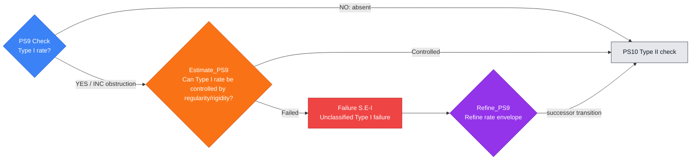

---

## PS10 — Type II check

**Single check:** Is the active profile Type II?

**Filled node template**

- **PDE role:** This node checks whether the profile concentrates at a rate
  stronger or less dimensionally controlled than Type I, i.e. a Type II
  mechanism.
- **Proof-dependency position:** Input node is `PS9`; default output node is `PS11`.
- **Logical proposition:** $P_{\mathrm{PS10}}$: the active profile satisfies
  the declared Type II rate condition. YES or INC is obstruction; NO records absence.
- **Inputs:** $\Gamma_{\rm in}$ contains the active profile, Type I status,
  refined scale law, critical norm, and supercritical/subcritical rate
  witnesses.
- **Explicit lemma objects:** The active profile $V$, Type I status from
  `PS9`, non-Type-I rate witness, refined scale law, modulation or scale
  derivative variables, critical norm concentration data, Type II rate
  envelope, and the topology in which rate separation is measured.
- **Check box:** Test the profile against Type II rate envelopes, modulation
  equations, or critical norm concentration. Output $K_{\mathrm{PS10}}^{+}$,
  $K_{\mathrm{PS10}}^{-}$, or $K_{\mathrm{PS10}}^{\rm inc}$.

#### Implementation and verification in PDE terms

##### Analytic setting and unknowns

Use the active profile and the Type I status from `PS9`. The node tests whether
the remaining rate data define a Type II branch: concentration not controlled
by the dimensional Type I rate in the declared topology.

##### Standing assumptions

Assume the Type I check has produced a branch status and that the active
profile carries rate data, modulation parameters, and critical norms. The
incoming context must specify the Type II criterion and the topology in which
rate comparisons are valid.

##### Objects inspected

Inspect non-Type-I rate witnesses, modulation equations, scale derivatives,
critical-norm concentration, rate envelopes, and any limiting rate profiles.

##### Local obstruction predicate

$P_{\mathrm{PS10}}$ states that the active profile satisfies the declared Type
II rate condition. YES records the Type II branch. NO means the Type II rate
condition is excluded.

##### Local lemma to prove

Prove the Type II rate lemma: after the Type I status is fixed, the rate data
either satisfy the Type II criterion or fail it quantitatively. The
inconclusive case must identify the missing modulation, critical-norm, or
rate-envelope theorem.

##### Specific estimate or compactness statement to verify

Verify the non-Type-I rate estimate, rate separation, or critical-norm
concentration statement defining Type II behavior. The assertion must specify
the norm, scale parameter, and limiting operation involved.

##### Practical verification steps

Compare the rate functional against the Type I threshold, analyze modulation or
scale evolution, isolate any non-Type-I concentration, and record the rate
witness or exclusion estimate.

##### Certificate contents

$K_{\mathrm{PS10}}^{+}$ contains the Type II rate witness and profile data.
$K_{\mathrm{PS10}}^{-}$ contains the rate exclusion estimate.
$K_{\mathrm{PS10}}^{\rm inc}$ records the missing modulation or rate theorem.

##### A priori estimate or exclusion test

After a YES or INC outcome, test whether Type II compactness, rigidity,
rate-improvement, or perturbative estimates control the branch. A failed
outcome records an unresolved Type II singular mechanism.

##### Failure-scenario data

Record the Type II profile, non-Type-I rate witness, modulation data, and the
missing theorem needed to classify or exclude the branch.

##### Recovery or refinement construction

The recovery lemma extracts a renormalized rate, refines modulation variables,
or stratifies the Type II branch so that the scale-cascade check can proceed.

##### Re-entry and output requirements

The successor is `PS11`. The output context records the Type II branch status
and the rate data needed to test cascades.

##### Minimal lemma checklist

Provide the Type II rate lemma, rate-separation estimate, Type II exclusion or
rigidity theorem, unresolved-Type-II obstruction statement, renormalized-rate
refinement lemma, and the data in $K_{\mathrm{PS10}}^{+}$,
$K_{\mathrm{PS10}}^{-}$, $K_{\mathrm{PS10}}^{\rm inc}$,
$K_{\mathrm{PS10}}^{\rm blk}$, $K_{\mathrm{PS10}}^{\rm br}$, and
$K_{\mathrm{RefinePS10}}^{\rm re}$.

- **Estimate box:** `Estimate_PS10` asks whether a Type II exclusion, rigidity,
  compactness, or rate-improvement theorem controls the branch. It emits
  $K_{\mathrm{PS10}}^{\rm blk}$ or $K_{\mathrm{PS10}}^{\rm br}$.
- **Failure scenario and refinement:** Failure scenario `S.E-II` records a Type II rate branch not
  yet controlled by compactness or rigidity. `Refine_PS10` performs renormalized
  rate extraction and emits
  $K_{\mathrm{RefinePS10}}^{\rm re}$ to enter `PS11`.
- **Exceptional verified conclusions:** $K_{\mathrm{PS10}}^{\rm term}$ records a
  terminal Type II singularity, $K_{\mathrm{PS10}}^{\rm scope}$ declares non-applicability for
  the `PS11` scale-cascade check, $K_{\mathrm{PS10}}^{\rm aux}$ starts an auxiliary rate
  problem, and $K_{\mathrm{PS10}}^{\rm unres}$ records the missing Type II
  classification theorem.
- **Output context:** $\Gamma_{\rm out}$ records the Type II verified conclusion
  status and proof context entry $c_{\mathrm{PS10}}$.

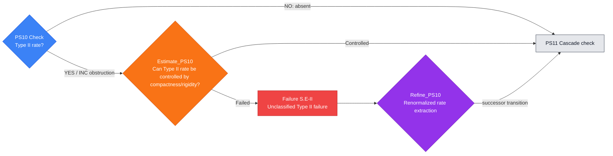

---

## PS11 — Scale-cascade check

**Single check:** Is there an infinite scale cascade?

**Filled node template**

- **PDE role:** This node checks whether the active profile decomposes through
  infinitely many scales rather than a finite or single-scale structure.
- **Proof-dependency position:** Input node is `PS10`; default output node is `PS12`.
- **Logical proposition:** $P_{\mathrm{PS11}}$: the profile has an infinite
  scale cascade. YES or INC is obstruction; NO records absence.
- **Inputs:** $\Gamma_{\rm in}$ contains the scale sequence, frequency
  envelopes, profile packets, orthogonality data, and earlier Type I/II
  status.
- **Explicit lemma objects:** The ordered scale family
  $\{\lambda_{n,j}\}$, dyadic or frequency envelopes, profile packets
  $V^{(j)}$, scale-separation ratios, orthogonality relations, summability
  bounds for active quantities, and the Type I/Type II branch certificates
  inherited from `PS9` and `PS10`.
- **Check box:** Test for infinitely many active scales using profile
  decomposition, scale orthogonality, envelope mass, or bubble-tree criteria.
  Output $K_{\mathrm{PS11}}^{+}$, $K_{\mathrm{PS11}}^{-}$, or
  $K_{\mathrm{PS11}}^{\rm inc}$.

#### Implementation and verification in PDE terms

##### Analytic setting and unknowns

Use the active profile, scale sequence, and Type I/II branch data. The node
checks whether the singular behavior requires infinitely many active scales.

##### Standing assumptions

Assume scale-law status from `PS9` and `PS10` has been recorded. The incoming
context must include scale orthogonality, profile decomposition data, frequency
or spatial envelopes, and finite energy or critical-norm control.

##### Objects inspected

Inspect active scale sets, pairwise scale ratios, profile packets, envelope
mass, orthogonality relations, summability estimates, and bubble-tree data.

##### Local obstruction predicate

$P_{\mathrm{PS11}}$ states that the profile has an infinite scale cascade. YES
means infinitely many separated scales contribute nontrivially. NO means the
active scale set is finite or summable in the required sense.

##### Local lemma to prove

Prove the finite-scale decomposition lemma: after prior scale-law checks, the
active scale set is finite, or an infinite cascade is witnessed by pairwise
separated scales with nontrivial contributions. The inconclusive case names the
missing profile decomposition, scale-separation, or envelope summability
theorem.

##### Specific estimate or compactness statement to verify

Verify scale orthogonality, summability of profile contributions, or finite
energy exclusion of infinitely many active packets. The estimate must identify
which norm or measure is additive or almost orthogonal across scales.

##### Practical verification steps

List active scales, test pairwise separation, estimate profile contributions,
apply orthogonality or summability, and either bound the number of active scales
or record the cascade.

##### Certificate contents

$K_{\mathrm{PS11}}^{+}$ contains the cascade scale sequence and nontrivial
contributions. $K_{\mathrm{PS11}}^{-}$ contains finite-scale, summability, or
orthogonality data. $K_{\mathrm{PS11}}^{\rm inc}$ records the missing scale
decomposition theorem.

##### A priori estimate or exclusion test

After a YES or INC outcome, test whether finite energy, monotonicity,
orthogonality, or envelope summability controls the cascade. A controlled
outcome must leave a finite or summable scale structure for `PS12`.

##### Failure-scenario data

Record the cascade scales, their contribution sizes, failed summability, and
why the case decomposition lacks a finite scale description.

##### Recovery or refinement construction

The recovery lemma stratifies scale space, separates packets, introduces a
finite scale budget, or passes to an auxiliary cascade branch with a progress
measure.

##### Re-entry and output requirements

The successor is `PS12`. The output context records the scale-cascade status,
finite scale strata, or controlled cascade data.

##### Minimal lemma checklist

Provide the finite-scale decomposition lemma, orthogonality/summability
estimate, cascade-control theorem, cascade obstruction statement,
scale-stratification refinement lemma, and the data in
$K_{\mathrm{PS11}}^{+}$, $K_{\mathrm{PS11}}^{-}$,
$K_{\mathrm{PS11}}^{\rm inc}$, $K_{\mathrm{PS11}}^{\rm blk}$,
$K_{\mathrm{PS11}}^{\rm br}$, and $K_{\mathrm{RefinePS11}}^{\rm re}$.

- **Estimate box:** `Estimate_PS11` asks whether scale separation, finite
  energy, monotonicity, or envelope summability excludes the cascade. It emits
  $K_{\mathrm{PS11}}^{\rm blk}$ or $K_{\mathrm{PS11}}^{\rm br}$.
- **Failure scenario and refinement:** Failure scenario `S.E-cascade` records scale-case-decomposition
  incompleteness. `Refine_PS11` stratifies scale space and emits
  $K_{\mathrm{RefinePS11}}^{\rm re}$ to enter `PS12`.
- **Exceptional verified conclusions:** $K_{\mathrm{PS11}}^{\rm term}$ records a
  terminal scale-cascade singularity, $K_{\mathrm{PS11}}^{\rm scope}$ declares non-applicability for
  orbit checks, $K_{\mathrm{PS11}}^{\rm aux}$ starts an auxiliary scale branch,
  and $K_{\mathrm{PS11}}^{\rm unres}$ records the missing cascade compactness
  theorem.
- **Output context:** $\Gamma_{\rm out}$ records the scale-cascade status and
  proof context entry $c_{\mathrm{PS11}}$.

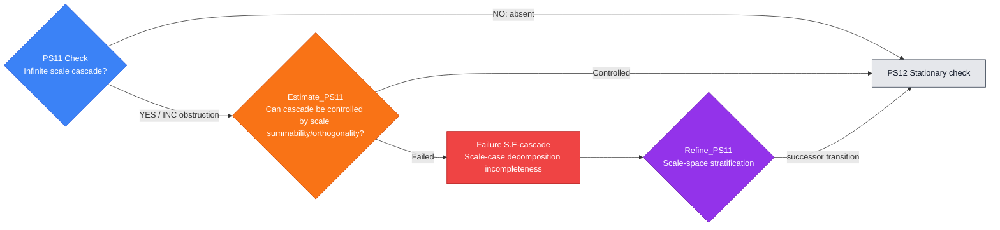

---

# 9. Orbit-type case-analysis steps

These nodes identify the compactness and recurrence type of the normalized
profile orbit: stationary, compact modulo symmetries, or terminal.

## PS12 — Stationary check

**Single check:** Is the profile stationary in renormalized time?

**Filled node template**

- **PDE role:** This node checks whether the renormalized profile is stationary
  in the rescaled time variable, reducing the branch to an elliptic or steady
  PDE problem.
- **Proof-dependency position:** Input node is `PS11`; default output node is `PS13`.
- **Logical proposition:** $P_{\mathrm{PS12}}$: the renormalized profile is
  stationary. YES or INC is obstruction; NO records absence.
- **Inputs:** $\Gamma_{\rm in}$ contains the renormalized equation, profile
  trajectory, time-derivative estimates, and steady-state residual.
- **Explicit lemma objects:** The renormalized trajectory $V(s)$, its weak
  time derivative $\partial_s V$, the renormalized equation, steady residual
  $\mathcal P_{\rm ren}(V)$, admissible time test functions, time-translation
  differences, and the topology in which stationarity is tested.
- **Check box:** Test stationarity by vanishing renormalized time derivative,
  invariance of the hull, or equality to a steady solution. Output
  $K_{\mathrm{PS12}}^{+}$, $K_{\mathrm{PS12}}^{-}$, or
  $K_{\mathrm{PS12}}^{\rm inc}$.

#### Implementation and verification in PDE terms

##### Analytic setting and unknowns

Use the normalized profile trajectory after scale-law classification. The node
tests stationarity in renormalized time and, when stationarity holds, reduces
the branch to a steady or elliptic PDE problem.

##### Standing assumptions

Assume the renormalized equation and admissible profile trajectory are defined.
The incoming context must specify the time variable, weak derivative
structure, steady residual, and topology in which time-independence is tested.

##### Objects inspected

Inspect renormalized time derivatives, steady residuals, weak formulations,
time-translation differences, invariant quantities, and regularity needed to
differentiate or compare time slices.

##### Local obstruction predicate

$P_{\mathrm{PS12}}$ states that the profile is stationary in renormalized time.
YES records the stationary branch. NO records a nonstationary evolution
witness.

##### Local lemma to prove

Prove the stationarity lemma: the profile either has vanishing renormalized
time derivative or satisfies an equivalent steady weak formulation, or this
stationarity statement fails. The inconclusive case identifies missing
time-regularity, compactness, or weak differentiation input.

##### Specific estimate or compactness statement to verify

Verify the equivalence between vanishing time derivative, time-translation
invariance, and the steady weak formulation in the declared topology. If
stationarity is false, produce a quantitative time-evolution witness.

##### Practical verification steps

Test the renormalized equation against time-dependent and time-independent
functions, estimate time differences, pass to weak derivatives if needed, and
record the steady residual or nonstationary witness.

##### Certificate contents

$K_{\mathrm{PS12}}^{+}$ contains the steady formulation, vanishing derivative,
or invariant trajectory. $K_{\mathrm{PS12}}^{-}$ contains the nonzero
time-evolution witness. $K_{\mathrm{PS12}}^{\rm inc}$ records the missing
time-regularity or steady-limit theorem.

##### A priori estimate or exclusion test

After a YES or INC outcome, test whether Liouville, Pohozaev, elliptic
regularity, monotonicity, or steady rigidity excludes or controls the
stationary branch.

##### Failure-scenario data

Record the steady profile, elliptic or steady equation, unresolved rigidity
gap, and any missing decay or integrability hypotheses.

##### Recovery or refinement construction

The recovery lemma extracts a time-translation hull, strengthens the steady
formulation, or passes to an auxiliary steady problem while preserving profile
admissibility.

##### Re-entry and output requirements

The successor is `PS13`. The output context records stationarity status,
steady equation data if present, and the rigidity/exclusion result if
controlled.

##### Minimal lemma checklist

Provide the stationarity lemma, time-derivative/steady formulation estimate,
steady exclusion theorem, stationary obstruction statement, hull-refinement
lemma, and the data in $K_{\mathrm{PS12}}^{+}$,
$K_{\mathrm{PS12}}^{-}$, $K_{\mathrm{PS12}}^{\rm inc}$,
$K_{\mathrm{PS12}}^{\rm blk}$, $K_{\mathrm{PS12}}^{\rm br}$, and
$K_{\mathrm{RefinePS12}}^{\rm re}$.

- **Estimate box:** `Estimate_PS12` asks whether stationary profiles are excluded
  or refined by Liouville, Pohozaev, elliptic regularity, or steady rigidity
  theorems. It emits $K_{\mathrm{PS12}}^{\rm blk}$ or
  $K_{\mathrm{PS12}}^{\rm br}$.
- **Failure scenario and refinement:** Failure scenario `T.D-stat` records a stationary profile not
  yet ruled out by Liouville, Pohozaev, or steady rigidity. `Refine_PS12` takes a
  time-translation hull and emits
  $K_{\mathrm{RefinePS12}}^{\rm re}$ to enter `PS13`.
- **Exceptional verified conclusions:** $K_{\mathrm{PS12}}^{\rm term}$ records a
  terminal stationary singularity, $K_{\mathrm{PS12}}^{\rm scope}$ declares non-applicability for
  `PS13` and `PS14` orbit checks, $K_{\mathrm{PS12}}^{\rm aux}$ opens a steady auxiliary
  problem, and $K_{\mathrm{PS12}}^{\rm unres}$ records the missing stationary
  rigidity theorem.
- **Output context:** $\Gamma_{\rm out}$ records stationarity status and
  proof context entry $c_{\mathrm{PS12}}$.

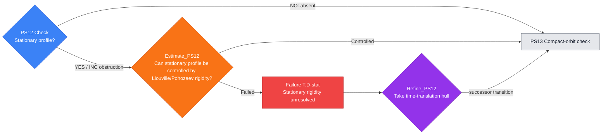

---

## PS13 — Compact-orbit check

**Single check:** Is the time-translation orbit precompact?

**Filled node template**

- **PDE role:** This node checks whether the profile trajectory is precompact
  under time translation, the compact ancient-solution scenario used in many
  rigidity arguments.
- **Proof-dependency position:** Input node is `PS12`; default output node is `PS14`.
- **Logical proposition:** $P_{\mathrm{PS13}}$: the time-translation orbit of
  the profile is precompact in the declared topology. YES or INC is obstruction; NO
  records absence.
- **Inputs:** $\Gamma_{\rm in}$ contains the profile trajectory,
  renormalized equation, topology, compactness modulus, and recurrence
  witnesses.
- **Explicit lemma objects:** The time-translation orbit
  $\{V(s+\tau):\tau\in\mathbb R\}$, the metric or topology of the trajectory
  space, compactness modulus, recurrence sequences, tightness and
  equicontinuity bounds, candidate compact hull, and noncompactness witnesses.
- **Check box:** Test precompactness using hull compactness, asymptotic
  compactness, invariant-measure compactness, or recurrence estimates. Output
  $K_{\mathrm{PS13}}^{+}$, $K_{\mathrm{PS13}}^{-}$, or
  $K_{\mathrm{PS13}}^{\rm inc}$.

#### Implementation and verification in PDE terms

##### Analytic setting and unknowns

Use the renormalized profile trajectory and topology fixed by the earlier
profile construction. The node tests compactness of the time-translation orbit
or hull.

##### Standing assumptions

Assume the profile is admissible and the renormalized equation controls its
time evolution. The incoming context must provide the topology for the orbit,
compactness modulus, recurrence notion, and any asymptotic compactness or
invariant-measure tools.

##### Objects inspected

Inspect time translates, trajectory hulls, recurrence sequences, compactness
moduli, tightness estimates, invariant measures, and noncompactness witnesses.

##### Local obstruction predicate

$P_{\mathrm{PS13}}$ states that the time-translation orbit is precompact in
the declared topology. YES records the compact-orbit branch. NO means
precompactness fails with a quantified witness.

##### Local lemma to prove

Prove the compact-orbit lemma: the renormalized trajectory is precompact under
time translation, or precompactness fails through escape, oscillation, or loss
of tightness. The inconclusive case identifies the missing compactness modulus,
asymptotic compactness estimate, or invariant-measure construction.

##### Specific estimate or compactness statement to verify

Verify total boundedness of the orbit in the declared topology, usually by
uniform bounds, tightness, equicontinuity, asymptotic compactness, or a compact
embedding for time translates.

##### Practical verification steps

Take arbitrary time-translation sequences, extract subsequences, test
convergence in the orbit topology, construct the compact hull if possible, and
record recurrence or noncompactness data.

##### Certificate contents

$K_{\mathrm{PS13}}^{+}$ contains the compact hull, topology, and recurrence
data. $K_{\mathrm{PS13}}^{-}$ contains the noncompactness witness.
$K_{\mathrm{PS13}}^{\rm inc}$ records the missing compactness or
invariant-measure theorem.

##### A priori estimate or exclusion test

After a YES or INC outcome, test whether monotonicity, rigidity, invariant
measure arguments, or compact-hull exclusion controls the compact-orbit branch.

##### Failure-scenario data

Record the compact hull or failed compactness modulus, recurrence data, and the
rigidity theorem missing for the compact orbit.

##### Recovery or refinement construction

The recovery lemma extracts an invariant hull, strengthens orbit compactness,
or passes to an auxiliary compact-dynamics problem with a progress measure.

##### Re-entry and output requirements

The successor is `PS14`. The output context records compact-orbit status, hull
data if present, and noncompactness or rigidity information.

##### Minimal lemma checklist

Provide the compact-orbit lemma, orbit compactness estimate,
compact-orbit exclusion theorem, compactness-failure obstruction statement,
hull-extraction refinement lemma, and the data in
$K_{\mathrm{PS13}}^{+}$, $K_{\mathrm{PS13}}^{-}$,
$K_{\mathrm{PS13}}^{\rm inc}$, $K_{\mathrm{PS13}}^{\rm blk}$,
$K_{\mathrm{PS13}}^{\rm br}$, and $K_{\mathrm{RefinePS13}}^{\rm re}$.

- **Estimate box:** `Estimate_PS13` asks whether compact orbits are excluded by
  rigidity, monotonicity, or invariant-measure arguments. It emits
  $K_{\mathrm{PS13}}^{\rm blk}$ or $K_{\mathrm{PS13}}^{\rm br}$.
- **Failure scenario and refinement:** Failure scenario `T.D-orbit` records orbit compactness
  failure. `Refine_PS13` extracts an invariant hull and emits
  $K_{\mathrm{RefinePS13}}^{\rm re}$ to enter `PS14`.
- **Exceptional verified conclusions:** $K_{\mathrm{PS13}}^{\rm term}$ records a
  terminal compact-orbit branch, $K_{\mathrm{PS13}}^{\rm scope}$ declares non-applicability for
  the `PS14` terminal-orbit check, $K_{\mathrm{PS13}}^{\rm aux}$ starts an auxiliary compactness-hull
  problem, and $K_{\mathrm{PS13}}^{\rm unres}$ records the missing orbit
  compactness theorem.
- **Output context:** $\Gamma_{\rm out}$ records compact-orbit status and
  proof context entry $c_{\mathrm{PS13}}$.

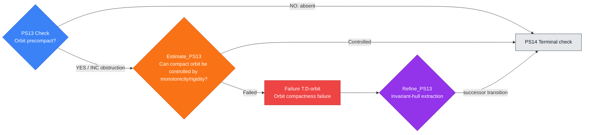

---

## PS14 — Terminal check

**Single check:** Is the profile terminal or heteroclinic?

**Filled node template**

- **PDE role:** This node checks whether the profile is terminal,
  heteroclinic, or asymptotically connects distinguished invariant objects.
- **Proof-dependency position:** Input node is `PS13`; default output node is `PS15`.
- **Logical proposition:** $P_{\mathrm{PS14}}$: the profile is terminal or
  heteroclinic in renormalized time. YES or INC is obstruction; NO records absence.
- **Inputs:** $\Gamma_{\rm in}$ contains the orbit/hull, alpha- and
  omega-limit candidates, Lyapunov data, and time-shift limits.
- **Explicit lemma objects:** The compact or noncompact orbit hull,
  $\alpha$- and $\omega$-limit sets, time-shift sequences $\tau_n^\pm$,
  limiting profiles, Lyapunov or monotonicity functional, heteroclinic or
  terminal candidates, and the topology for convergence to terminal states.
- **Check box:** Test for terminal or heteroclinic behavior by time-shift
  compactness, invariant-set analysis, and limiting profiles. Output
  $K_{\mathrm{PS14}}^{+}$, $K_{\mathrm{PS14}}^{-}$, or
  $K_{\mathrm{PS14}}^{\rm inc}$.

#### Implementation and verification in PDE terms

##### Analytic setting and unknowns

Use the profile trajectory after stationarity and compact-orbit checks. The
node examines time-shift limits, alpha- and omega-limit sets, and possible
connections between invariant objects.

##### Standing assumptions

Assume the renormalized trajectory and its admissible topology are fixed. The
incoming context must specify time-shift compactness, invariant-set definitions,
Lyapunov or monotonicity data, and asymptotic uniqueness hypotheses if used.

##### Objects inspected

Inspect forward and backward time-shift sequences, limiting profiles,
invariant sets, Lyapunov limits, heteroclinic candidates, and convergence
modes.

##### Local obstruction predicate

$P_{\mathrm{PS14}}$ states that the profile is terminal or heteroclinic in
renormalized time. YES records a terminal/connecting branch. NO records absence
of such limiting structure.

##### Local lemma to prove

Prove the terminal-orbit lemma: time-shift limits either converge to terminal
invariant objects, connect invariant sets, or fail to have terminal or
heteroclinic structure. The inconclusive case identifies missing time-shift
compactness, invariant-set identification, or asymptotic uniqueness.

##### Specific estimate or compactness statement to verify

Verify convergence of selected time shifts, identification of limit sets, and
compatibility with the renormalized PDE. If a connection is claimed, prove the
limit objects and the convergence mode at each temporal end.

##### Practical verification steps

Extract time shifts, pass to limiting profiles, identify invariant objects,
evaluate Lyapunov or monotonicity quantities, and record whether the trajectory
terminates or connects distinct limiting regimes.

##### Certificate contents

$K_{\mathrm{PS14}}^{+}$ contains limiting objects, convergence modes, and
connection data. $K_{\mathrm{PS14}}^{-}$ contains the absence of terminal or
connecting limits. $K_{\mathrm{PS14}}^{\rm inc}$ records the missing
time-shift or invariant-set theorem.

##### A priori estimate or exclusion test

After a YES or INC outcome, test whether terminal branches are excluded by
rigidity, monotonicity, endpoint theorems, or asymptotic uniqueness.

##### Failure-scenario data

Record terminal limit candidates, connection data, missing rigidity, and any
unresolved asymptotic compactness.

##### Recovery or refinement construction

The recovery lemma extracts terminal objects by time shifts, refines the
invariant set, or passes to an auxiliary terminal-orbit problem with explicit
progress.

##### Re-entry and output requirements

The successor is `PS15`. The output context records terminal-orbit status and
the limiting objects or absence certificate needed by localization checks.

##### Minimal lemma checklist

Provide the terminal-orbit lemma, time-shift compactness estimate, terminal
branch exclusion theorem, terminal-orbit obstruction statement, time-shift
refinement lemma, and the data in $K_{\mathrm{PS14}}^{+}$,
$K_{\mathrm{PS14}}^{-}$, $K_{\mathrm{PS14}}^{\rm inc}$,
$K_{\mathrm{PS14}}^{\rm blk}$, $K_{\mathrm{PS14}}^{\rm br}$, and
$K_{\mathrm{RefinePS14}}^{\rm re}$.

- **Estimate box:** `Estimate_PS14` asks whether terminal branches are excluded
  by rigidity, monotonicity, or endpoint theorems. It emits
  $K_{\mathrm{PS14}}^{\rm blk}$ or $K_{\mathrm{PS14}}^{\rm br}$.
- **Failure scenario and refinement:** Failure scenario `T.D-terminal` records terminal-orbit
  failure. `Refine_PS14` extracts terminal objects by time shifts and emits
  $K_{\mathrm{RefinePS14}}^{\rm re}$ to enter `PS15`.
- **Exceptional verified conclusions:** $K_{\mathrm{PS14}}^{\rm term}$ records a
  verified terminal orbit, $K_{\mathrm{PS14}}^{\rm scope}$ declares non-applicability for
  `PS15` through `PS17` localization checks, $K_{\mathrm{PS14}}^{\rm aux}$ starts an auxiliary terminal-orbit
  problem, and $K_{\mathrm{PS14}}^{\rm unres}$ records the missing
  heteroclinic analysis.
- **Output context:** $\Gamma_{\rm out}$ records terminal and heteroclinic status
  and proof context entry $c_{\mathrm{PS14}}$.

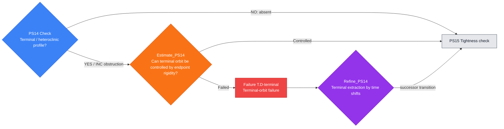

---

# 10. Localization case-analysis steps

These nodes check whether the normalized profile is spatially and
frequency-locally tight enough for packet and structural analysis.

## PS15 — Tightness check

**Single check:** Is the active mass tight?

**Filled node template**

- **PDE role:** This node checks whether the active quantity remains spatially
  tight instead of leaking to infinity. Tightness is a localization branch that
  must be verified or excluded.
- **Proof-dependency position:** Input node is `PS14`; default output node is `PS16`.
- **Logical proposition:** $P_{\mathrm{PS15}}$: the active mass, energy, or
  critical density is tight in the selected frame. YES or INC is obstruction for
  this branch case analysis; NO records absence.
- **Inputs:** $\Gamma_{\rm in}$ contains active densities, localization
  radii, tail bounds, center/scale data, and compactness topology.
- **Explicit lemma objects:** The active density $q(V)$ or localized energy
  density, center and scale frame, cutoff functions $\chi_R$, tail quantities
  outside $B_R$ or admissible charts, concentration functions, localization
  radii, compactness topology, and a tightness modulus or persistent-tail
  witness.
- **Check box:** Test tightness by tail estimates, concentration functions, or
  compactness of localized measures. Output $K_{\mathrm{PS15}}^{+}$,
  $K_{\mathrm{PS15}}^{-}$, or $K_{\mathrm{PS15}}^{\rm inc}$.

#### Implementation and verification in PDE terms

##### Analytic setting and unknowns

Use the active profile after orbit-type checks and the selected center/scale
frame. The node tests whether the active quantity is tight in physical,
spacetime, frequency, or chart-local variables.

##### Standing assumptions

Assume the profile is admissible and active, with localization data inherited
from the preceding nodes. The incoming context must specify cutoff stability,
tail norms, localization radii, concentration functions, and the topology in
which tightness is tested.

##### Objects inspected

Inspect localized critical densities, tails outside large regions, cutoff
errors, concentration functions, compact localized measures, and tightness
moduli.

##### Local obstruction predicate

$P_{\mathrm{PS15}}$ states that the active quantity is tight in the selected
frame. YES records the tight branch. NO records a persistent tail or absence of
tightness in this branch convention.

##### Local lemma to prove

Prove the tightness lemma: for every tolerance, there is a localization radius
outside of which the declared active quantity is small, or tightness fails by a
quantified tail. The inconclusive case identifies the missing tail estimate,
localization compactness, or concentration-function bound.

##### Specific estimate or compactness statement to verify

Verify the tail estimate defining tightness, with uniform cutoff control and a
clear limiting order for radius, subsequence, and localization parameters.

##### Practical verification steps

Choose cutoffs in the selected frame, estimate the active quantity outside
large localized sets, pass to the required limits, and record either the
tightness modulus or persistent tail witness.

##### Certificate contents

$K_{\mathrm{PS15}}^{+}$ contains the tightness modulus and localized compact
measure. $K_{\mathrm{PS15}}^{-}$ contains the tail witness or absence status.
$K_{\mathrm{PS15}}^{\rm inc}$ records the missing tail, cutoff, or
concentration-function estimate.

##### A priori estimate or exclusion test

After a YES or INC outcome, test whether tail decomposition, virial or
monotonicity estimates, or localization upgrades control the tight branch.

##### Failure-scenario data

Record the localization radius, tail quantity, failed compactness or cutoff
bound, and the unresolved tight profile component.

##### Recovery or refinement construction

The recovery lemma decomposes the tail, changes localization scale, separates
compact and exterior components, or passes to an auxiliary tail problem.

##### Re-entry and output requirements

The successor is `PS16`. The output context records tightness status, tail
estimates, and any compact/exterior decomposition.

##### Minimal lemma checklist

Provide the tightness lemma, tail estimate, tight-branch control theorem,
tightness-failure statement, tail-decomposition refinement lemma, and the data
in $K_{\mathrm{PS15}}^{+}$, $K_{\mathrm{PS15}}^{-}$,
$K_{\mathrm{PS15}}^{\rm inc}$, $K_{\mathrm{PS15}}^{\rm blk}$,
$K_{\mathrm{PS15}}^{\rm br}$, and $K_{\mathrm{RefinePS15}}^{\rm re}$.

- **Estimate box:** `Estimate_PS15` asks whether the tight branch is excluded or
  refined by tail decomposition, virial or monotonicity estimates, or localization
  upgrades. It emits $K_{\mathrm{PS15}}^{\rm blk}$ or
  $K_{\mathrm{PS15}}^{\rm br}$.
- **Failure scenario and refinement:** Failure scenario `C.D-tight` records tightness failure.
  `Refine_PS15` performs tail decomposition and emits
  $K_{\mathrm{RefinePS15}}^{\rm re}$ to enter `PS16`.
- **Exceptional verified conclusions:** $K_{\mathrm{PS15}}^{\rm term}$ records a
  terminal tight localized singularity, $K_{\mathrm{PS15}}^{\rm scope}$
  declares non-applicability for localization checks, $K_{\mathrm{PS15}}^{\rm aux}$ starts an auxiliary
  tail problem, and $K_{\mathrm{PS15}}^{\rm unres}$ records the missing tail
  estimate.
- **Output context:** $\Gamma_{\rm out}$ records tightness status and proof context
  entry $c_{\mathrm{PS15}}$.

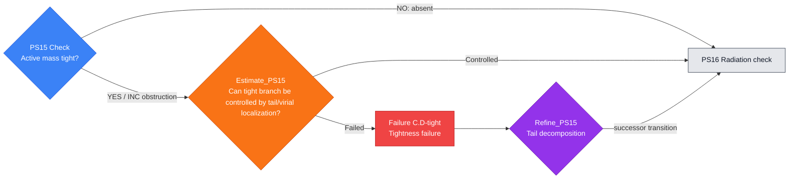

---

## PS16 — Radiation check

**Single check:** Is there radiative tail mass?

**Filled node template**

- **PDE role:** This node checks whether energy or critical mass escapes as a
  radiative tail, a dispersive component that can coexist with a core.
- **Proof-dependency position:** Input node is `PS15`; default output node is `PS17`.
- **Logical proposition:** $P_{\mathrm{PS16}}$: the profile has radiative
  tail mass. YES or INC is obstruction; NO records absence.
- **Inputs:** $\Gamma_{\rm in}$ contains tail measures, radiation profiles,
  dispersive norms, flux identities, and localization complements.
- **Explicit lemma objects:** Exterior tails of the profile, radiation profile
  candidates $V_{\rm rad}$, flux or channel-of-energy quantities, dispersive or
  scattering norms, incoming/outgoing decompositions when available, localized
  complements of the core, and estimates controlling core-radiation
  interactions.
- **Check box:** Test radiative tails by channel-of-energy, flux, scattering,
  or dispersive estimates. Output $K_{\mathrm{PS16}}^{+}$,
  $K_{\mathrm{PS16}}^{-}$, or $K_{\mathrm{PS16}}^{\rm inc}$.

#### Implementation and verification in PDE terms

##### Analytic setting and unknowns

Use the localization data from `PS15`. The node tests for a radiative,
dispersive, outgoing, incoming, or asymptotically negligible component of the
profile in the topology appropriate to the PDE.

##### Standing assumptions

Assume tail quantities are defined and that the PDE class provides propagation,
flux, channel, or dispersive estimates suitable for separating radiation from
the active core.

##### Objects inspected

Inspect exterior norms, fluxes, radiative profiles, channel quantities,
localized complements, propagation estimates, and compact core remainders.

##### Local obstruction predicate

$P_{\mathrm{PS16}}$ states that radiative tail mass is present. YES records a
radiation branch. NO means no such tail remains in the declared topology.

##### Local lemma to prove

Prove the radiation separation lemma: the localized profile either has a
nonzero radiative tail measured by flux, channel, or exterior norm, or that
tail vanishes or is absorbed. The inconclusive case identifies the missing
channel estimate, dispersive bound, or profile separation theorem.

##### Specific estimate or compactness statement to verify

Verify the radiation estimate: flux decay, channel lower bound, dispersive
control, exterior smallness, or asymptotic decomposition into radiative and
compact components.

##### Practical verification steps

Split the profile into core and exterior pieces, apply propagation or
dispersive estimates to the exterior, control interactions with the core, and
record the tail lower bound or vanishing estimate.

##### Certificate contents

$K_{\mathrm{PS16}}^{+}$ contains the radiative tail profile, lower bound, and
flux/channel data. $K_{\mathrm{PS16}}^{-}$ contains vanishing flux or exterior
control. $K_{\mathrm{PS16}}^{\rm inc}$ records the missing dispersive or
channel estimate.

##### A priori estimate or exclusion test

After a YES or INC outcome, test whether radiation is excluded, absorbed,
scattering, or separated by a radiation estimate or profile extraction.

##### Failure-scenario data

Record the uncontrolled tail, failed flux/channel estimate, dispersive norm,
and interaction with the remaining core.

##### Recovery or refinement construction

The recovery lemma extracts a radiation profile, refines the core-tail
decomposition, or separates radiation by an auxiliary dispersive problem.

##### Re-entry and output requirements

The successor is `PS17`. The output context records radiation status and the
localized non-radiative core to be tested for roughness.

##### Minimal lemma checklist

Provide the radiation separation lemma, flux/channel/dispersive estimate,
radiation-control theorem, radiative-tail obstruction statement,
radiation-profile refinement lemma, and the data in
$K_{\mathrm{PS16}}^{+}$, $K_{\mathrm{PS16}}^{-}$,
$K_{\mathrm{PS16}}^{\rm inc}$, $K_{\mathrm{PS16}}^{\rm blk}$,
$K_{\mathrm{PS16}}^{\rm br}$, and $K_{\mathrm{RefinePS16}}^{\rm re}$.

- **Estimate box:** `Estimate_PS16` asks whether radiation is excluded, absorbed,
  or separated by radiation estimates or profile extraction. It emits
  $K_{\mathrm{PS16}}^{\rm blk}$ or $K_{\mathrm{PS16}}^{\rm br}$.
- **Failure scenario and refinement:** Failure scenario `D.E-rad` records a radiative tail not yet
  separated by flux, channel-of-energy, or scattering estimates. `Refine_PS16`
  extracts the radiation profile and emits
  $K_{\mathrm{RefinePS16}}^{\rm re}$ to enter `PS17`.
- **Exceptional verified conclusions:** $K_{\mathrm{PS16}}^{\rm term}$ records a
  terminal radiation branch, $K_{\mathrm{PS16}}^{\rm scope}$ declares non-applicability for the core
  case analysis, $K_{\mathrm{PS16}}^{\rm aux}$ starts a radiation auxiliary rescaled problem, and
  $K_{\mathrm{PS16}}^{\rm unres}$ records the missing radiation estimate.
- **Output context:** $\Gamma_{\rm out}$ records radiation status and proof context
  entry $c_{\mathrm{PS16}}$.

```mermaid
flowchart LR
    C{"PS16 Check<br/>Radiative tail mass?"}
    C -- "NO: absent" --> N["PS17 Rough-core check"]
    C -- "YES / INC obstruction" --> B{"Estimate_PS16<br/>Can radiative tail be separated by flux/scattering estimates?"}
    B -- "Controlled" --> N
    B -- "Failed" --> M["Failure D.E-rad<br/>Radiation separation unresolved"]
    M --> S{"Refine_PS16<br/>Radiation profile extraction"}
    S -- "successor transition" --> N

    classDef check fill:#3b82f6,stroke:#1d4ed8,color:#ffffff;
    classDef estimate fill:#f97316,stroke:#c2410c,color:#ffffff;
    classDef failure fill:#ef4444,stroke:#b91c1c,color:#ffffff;
    classDef refinement fill:#9333ea,stroke:#6b21a8,color:#ffffff;
    classDef next fill:#e5e7eb,stroke:#374151,color:#111827;
    classDef terminal fill:#fef3c7,stroke:#d97706,color:#111827;

    class C check;
    class B estimate;
    class M failure;
    class S refinement;
    class N next;
```

---

## PS17 — Rough-core check

**Single check:** Does local compactness or suitability fail?

**Filled node template**

- **PDE role:** This node checks rough-core obstruction: failure of local
  compactness, local regularity, suitability, or capacity control in the core.
- **Proof-dependency position:** Input node is `PS16`; default output node is `PS18`.
- **Logical proposition:** $P_{\mathrm{PS17}}$: the core has a rough
  compactness/suitability failure. YES or INC is obstruction; NO records absence.
- **Inputs:** $\Gamma_{\rm in}$ contains local energy, capacity estimates,
  suitability inequalities, compactness witnesses, and core localization.
- **Explicit lemma objects:** The localized core $V_{\rm core}$, local energy
  or suitability inequality, candidate singular set or rough set, capacity
  $\operatorname{Cap}(\cdot)$ or Hausdorff-content estimates, epsilon-regularity
  constants, trace or compactness witnesses, and cutoffs adapted to the core.
- **Check box:** Test rough-core failure by epsilon regularity, capacity
  bounds, local energy inequalities, or compactness criteria. Output
  $K_{\mathrm{PS17}}^{+}$, $K_{\mathrm{PS17}}^{-}$, or
  $K_{\mathrm{PS17}}^{\rm inc}$.

#### Implementation and verification in PDE terms

##### Analytic setting and unknowns

Use the localized non-radiative core from `PS16`. The node tests for rough
core behavior: failure of local compactness, local regularity, suitability, or
capacity control.

##### Standing assumptions

Assume radiation has been separated or controlled and that the remaining core
is represented in admissible local coordinates. The incoming context must
specify local energy or regularity quantities, capacity criteria, trace
conditions, and epsilon-regularity or compactness theorems.

##### Objects inspected

Inspect local norms, capacity quantities, singular measures, local energy or
entropy inequalities, traces, compactness witnesses, and oscillation indicators.

##### Local obstruction predicate

$P_{\mathrm{PS17}}$ states that the core has a rough compactness or
suitability failure. YES records the rough-core branch. NO means the local
criterion is controlled or the obstruction is absent.

##### Local lemma to prove

Prove the local core-regularity lemma: on the selected core, the compactness,
suitability, capacity, or local regularity criterion either holds uniformly or
fails at a specified point, scale, or window. The inconclusive case identifies
the missing local inequality, capacity bound, or compact embedding.

##### Specific estimate or compactness statement to verify

Verify the local regularity or capacity criterion and its contrapositive. The
estimate must show that absence of the rough-core witness gives regularity or
compactness in the active core.

##### Practical verification steps

Localize around the core, compute the regularity or capacity quantity, compare
with the threshold, apply the local criterion, and record the rough witness or
regularity certificate.

##### Certificate contents

$K_{\mathrm{PS17}}^{+}$ contains the rough core witness and failed local
criterion. $K_{\mathrm{PS17}}^{-}$ contains the epsilon-regularity, capacity,
or compactness estimate. $K_{\mathrm{PS17}}^{\rm inc}$ records the missing
local theorem.

##### A priori estimate or exclusion test

After a YES or INC outcome, test whether local regularity, capacity control,
or rough-core exclusion estimates remove the obstruction.

##### Failure-scenario data

Record the rough-core location, scale, failed local criterion, singular
measure or capacity data, and missing estimate.

##### Recovery or refinement construction

The recovery lemma refines the core localization, proves rough-core exclusion,
or extracts a smaller core with a well-founded progress measure.

##### Re-entry and output requirements

The successor is `PS18`. The output context records rough-core status and the
localized data needed for center-splitting analysis.

##### Minimal lemma checklist

Provide the local core-regularity lemma, capacity/local compactness estimate,
rough-core exclusion theorem, rough-core obstruction statement,
core-refinement lemma, and the data in $K_{\mathrm{PS17}}^{+}$,
$K_{\mathrm{PS17}}^{-}$, $K_{\mathrm{PS17}}^{\rm inc}$,
$K_{\mathrm{PS17}}^{\rm blk}$, $K_{\mathrm{PS17}}^{\rm br}$, and
$K_{\mathrm{RefinePS17}}^{\rm re}$.

- **Estimate box:** `Estimate_PS17` asks whether local regularity or rough-core
  exclusion controls the obstruction. It emits $K_{\mathrm{PS17}}^{\rm blk}$
  or $K_{\mathrm{PS17}}^{\rm br}$.
- **Failure scenario and refinement:** Failure scenario `C.D-rough` records rough-core obstruction.
  `Refine_PS17` applies local regularity or rough-core exclusion and emits
  $K_{\mathrm{RefinePS17}}^{\rm re}$ to enter `PS18`.
- **Exceptional verified conclusions:** $K_{\mathrm{PS17}}^{\rm term}$ records a
  terminal rough-core singularity, $K_{\mathrm{PS17}}^{\rm scope}$ declares non-applicability for
  splitting checks, $K_{\mathrm{PS17}}^{\rm aux}$ starts a localized core
  auxiliary problem, and $K_{\mathrm{PS17}}^{\rm unres}$ records the missing
  local compactness theorem.
- **Output context:** $\Gamma_{\rm out}$ records rough-core status and proof context
  entry $c_{\mathrm{PS17}}$.

```mermaid
flowchart LR
    C{"PS17 Check<br/>Rough-core failure?"}
    C -- "NO: absent" --> N["PS18 Multicenter check"]
    C -- "YES / INC obstruction" --> B{"Estimate_PS17<br/>Can rough core be controlled by epsilon-regularity/capacity?"}
    B -- "Controlled" --> N
    B -- "Failed" --> M["Failure C.D-rough<br/>Rough-core obstruction"]
    M --> S{"Refine_PS17<br/>Local regularity / rough-core exclusion"}
    S -- "successor transition" --> N

    classDef check fill:#3b82f6,stroke:#1d4ed8,color:#ffffff;
    classDef estimate fill:#f97316,stroke:#c2410c,color:#ffffff;
    classDef failure fill:#ef4444,stroke:#b91c1c,color:#ffffff;
    classDef refinement fill:#9333ea,stroke:#6b21a8,color:#ffffff;
    classDef next fill:#e5e7eb,stroke:#374151,color:#111827;
    classDef terminal fill:#fef3c7,stroke:#d97706,color:#111827;

    class C check;
    class B estimate;
    class M failure;
    class S refinement;
    class N next;
```

---

# 11. Splitting and packet case-analysis steps

These nodes decide whether the profile remains a single effective object or
has to be represented by a multicenter or finite-packet structure.

## PS18 — Multicenter check

**Single check:** Is there more than one active center?

**Filled node template**

- **PDE role:** This node checks whether the active profile has multiple
  centers, which force a packet or multiprofile decomposition.
- **Proof-dependency position:** Input node is `PS17`; default output node is `PS19`.
- **Logical proposition:** $P_{\mathrm{PS18}}$: there is more than one active
  center. YES or INC is obstruction; NO records absence.
- **Inputs:** $\Gamma_{\rm in}$ contains center candidates, activity
  measures, separation scales, orthogonality data, and concentration-frame
  witnesses.
- **Explicit lemma objects:** Candidate centers $z_n^{(j)}$, associated
  scales $\lambda_n^{(j)}$, localized activity contributions, separation
  distances, orthogonality or decoupling relations, concentration frames,
  interaction errors, and residual activity away from selected centers.
- **Check box:** Test multicenter structure by concentration functions,
  maximal separated families, or bubble-tree extraction. Output
  $K_{\mathrm{PS18}}^{+}$, $K_{\mathrm{PS18}}^{-}$, or
  $K_{\mathrm{PS18}}^{\rm inc}$.

#### Implementation and verification in PDE terms

##### Analytic setting and unknowns

Use the localized active profile after rough-core analysis. The node tests
whether more than one separated concentration center carries nontrivial
activity.

##### Standing assumptions

Assume localization, center/scale data, and active quantity bounds are
available. The incoming context must specify the separation metric, activity
threshold, orthogonality relation, and concentration-frame extraction theorem.

##### Objects inspected

Inspect candidate centers, localized activity around each center, separation
scales, profile frames, interaction errors, and residual activity outside the
dominant center.

##### Local obstruction predicate

$P_{\mathrm{PS18}}$ states that there is more than one active center. YES
records multicenter behavior. NO means all activity is represented by one
center up to the declared tolerance.

##### Local lemma to prove

Prove the multicenter decomposition lemma: the active concentration set either
contains at least two separated centers with nontrivial contributions, or a
single center controls all active mass. The inconclusive case names the missing
separation, quantization, or concentration-frame extraction theorem.

##### Specific estimate or compactness statement to verify

Verify center separation and orthogonality of localized contributions, together
with a lower bound for every active center and a tail bound away from the
selected centers.

##### Practical verification steps

Search outside the dominant center, select secondary centers if present,
estimate their localized activity, prove separation and interaction control,
and record the center list or single-center certificate.

##### Certificate contents

$K_{\mathrm{PS18}}^{+}$ contains separated centers, activity lower bounds, and
orthogonality data. $K_{\mathrm{PS18}}^{-}$ contains single-center control.
$K_{\mathrm{PS18}}^{\rm inc}$ records the missing separation or frame theorem.

##### A priori estimate or exclusion test

After a YES or INC outcome, test whether dominant-frame extraction, decoupling,
or center-separation estimates resolve the multicenter branch.

##### Failure-scenario data

Record unresolved centers, failed separation or decoupling, interaction terms,
and missing quantization.

##### Recovery or refinement construction

The recovery lemma extracts dominant concentration frames, separates secondary
centers, or stratifies center families with a finite progress measure.

##### Re-entry and output requirements

The successor is `PS19`. The output context records center multiplicity,
separation, activity contributions, and orthogonality estimates.

##### Minimal lemma checklist

Provide the multicenter decomposition lemma, center separation/orthogonality
estimate, multicenter-control theorem, center-ambiguity obstruction statement,
frame-extraction refinement lemma, and the data in
$K_{\mathrm{PS18}}^{+}$, $K_{\mathrm{PS18}}^{-}$,
$K_{\mathrm{PS18}}^{\rm inc}$, $K_{\mathrm{PS18}}^{\rm blk}$,
$K_{\mathrm{PS18}}^{\rm br}$, and $K_{\mathrm{RefinePS18}}^{\rm re}$.

- **Estimate box:** `Estimate_PS18` asks whether multicenter behavior can be
  resolved by dominant concentration-frame extraction and center-separation
  verified conclusions. It emits
  $K_{\mathrm{PS18}}^{\rm blk}$ or $K_{\mathrm{PS18}}^{\rm br}$.
- **Failure scenario and refinement:** Failure scenario `C.D-center` records unresolved center
  ambiguity. `Refine_PS18` extracts dominant concentration frames and emits
  $K_{\mathrm{RefinePS18}}^{\rm re}$ to enter `PS19`.
- **Exceptional verified conclusions:** $K_{\mathrm{PS18}}^{\rm term}$ records a
  terminal multicenter singularity, $K_{\mathrm{PS18}}^{\rm scope}$ declares non-applicability for
  packet checks, $K_{\mathrm{PS18}}^{\rm aux}$ starts an auxiliary center-selection problem, and
  $K_{\mathrm{PS18}}^{\rm unres}$ records the missing center separation
  theorem.
- **Output context:** $\Gamma_{\rm out}$ records multicenter status and
  proof context entry $c_{\mathrm{PS18}}$.

```mermaid
flowchart LR
    C{"PS18 Check<br/>Multiple active centers?"}
    C -- "NO: absent" --> N["PS19 Finite-packet check"]
    C -- "YES / INC obstruction" --> B{"Estimate_PS18<br/>Can multicenter branch be resolved by concentration-frame extraction?"}
    B -- "Controlled" --> N
    B -- "Failed" --> M["Failure C.D-center<br/>Unresolved center ambiguity"]
    M --> S{"Refine_PS18<br/>Dominant concentration-frame extraction"}
    S -- "successor transition" --> N

    classDef check fill:#3b82f6,stroke:#1d4ed8,color:#ffffff;
    classDef estimate fill:#f97316,stroke:#c2410c,color:#ffffff;
    classDef failure fill:#ef4444,stroke:#b91c1c,color:#ffffff;
    classDef refinement fill:#9333ea,stroke:#6b21a8,color:#ffffff;
    classDef next fill:#e5e7eb,stroke:#374151,color:#111827;
    classDef terminal fill:#fef3c7,stroke:#d97706,color:#111827;

    class C check;
    class B estimate;
    class M failure;
    class S refinement;
    class N next;
```

---

## PS19 — Finite-packet check

**Single check:** Is the active packet infinite or unverified?

**Filled node template**

- **PDE role:** This node checks whether the active packet decomposition has
  finitely many significant components, so that later decoupling is a finite
  calculation rather than an uncontrolled infinite packet.
- **Proof-dependency position:** Input node is `PS18`; default output node is `PS20`.
- **Logical proposition:** $P_{\mathrm{PS19}}$: the active packet is infinite
  or its finiteness is unverified. YES or INC is obstruction; NO means the active
  packet is finite.
- **Inputs:** $\Gamma_{\rm in}$ contains extracted centers/scales, packet
  amplitudes, orthogonality relations, summability bounds, and residual mass.
- **Explicit lemma objects:** The packet list
  $\{(z_n^{(j)},\lambda_n^{(j)},V^{(j)})\}$, packet amplitudes or masses,
  quantization threshold, orthogonality matrix or frame separation relations,
  summability bound, residual mass, and an exhaustion order for significant
  packets.
- **Check box:** Test for failure of finiteness using energy quantization,
  critical mass lower bounds, profile orthogonality, or scale/center
  exhaustion. Output $K_{\mathrm{PS19}}^{+}$ for infinite/unverified packet,
  $K_{\mathrm{PS19}}^{-}$ for finite packet, or $K_{\mathrm{PS19}}^{\rm inc}$.

#### Implementation and verification in PDE terms

##### Analytic setting and unknowns

Use the center decomposition from `PS18`. The node tests whether the active
packet decomposition has finitely many significant components.

##### Standing assumptions

Assume packet candidates, centers, scales, orthogonality data, and an active
quantity bound are available. The incoming context must specify packet
quantization, summability, and exhaustion criteria.

##### Objects inspected

Inspect packet amplitudes, localized norms, center/scale labels,
orthogonality errors, residual mass, and summability tails.

##### Local obstruction predicate

$P_{\mathrm{PS19}}$ states that the active packet is infinite or its finiteness
is unverified. YES records an infinite or unexhausted packet family. NO means a
finite packet list is certified.

##### Local lemma to prove

Prove the finite-packet lemma: every nontrivial packet carries a uniform
quantum of the declared active quantity, so only finitely many packets remain
under the available bound, or an infinite packet is explicitly witnessed. The
inconclusive case identifies the missing lower quantum, orthogonality, or
exhaustion argument.

##### Specific estimate or compactness statement to verify

Verify packet quantization and summability: localized packet contributions are
almost orthogonal and their total is controlled by the inherited bound.

##### Practical verification steps

Order packets by contribution, prove a lower quantum for significant packets,
sum the contributions using orthogonality, control the residual, and record the
finite list or infinite sequence.

##### Certificate contents

$K_{\mathrm{PS19}}^{+}$ contains infinite or unexhausted packet data.
$K_{\mathrm{PS19}}^{-}$ contains the finite packet list, quantization, and
summability estimates. $K_{\mathrm{PS19}}^{\rm inc}$ records the missing
packet theorem.

##### A priori estimate or exclusion test

After a YES or INC outcome, test whether energy quantization, summability, and
scale/center exhaustion control the apparent infinite packet.

##### Failure-scenario data

Record the infinite packet candidates, nontrivial lower bounds, failed
summability, and exhaustion gap.

##### Recovery or refinement construction

The recovery lemma performs scale/center exhaustion, groups packets into
controlled clusters, or imposes a finite packet budget.

##### Re-entry and output requirements

The successor is `PS20`. The output context records finite packet data or a
controlled packet refinement for terminal decoupling.

##### Minimal lemma checklist

Provide the finite-packet lemma, quantization/summability estimate,
infinite-packet control theorem, packet obstruction statement, exhaustion
refinement lemma, and the data in $K_{\mathrm{PS19}}^{+}$,
$K_{\mathrm{PS19}}^{-}$, $K_{\mathrm{PS19}}^{\rm inc}$,
$K_{\mathrm{PS19}}^{\rm blk}$, $K_{\mathrm{PS19}}^{\rm br}$, and
$K_{\mathrm{RefinePS19}}^{\rm re}$.

- **Estimate box:** `Estimate_PS19` asks whether an apparent infinite packet is
  controlled by energy quantization, summability, and scale/center exhaustion. It
  emits
  $K_{\mathrm{PS19}}^{\rm blk}$ or $K_{\mathrm{PS19}}^{\rm br}$.
- **Failure scenario and refinement:** Failure scenario `C.D-packet` records an infinite active
  packet. `Refine_PS19` performs scale/center exhaustion and emits
  $K_{\mathrm{RefinePS19}}^{\rm re}$ to enter `PS20`.
- **Exceptional verified conclusions:** $K_{\mathrm{PS19}}^{\rm term}$ records a
  terminal infinite-packet singularity, $K_{\mathrm{PS19}}^{\rm scope}$
  declares non-applicability for decoupling checks, $K_{\mathrm{PS19}}^{\rm aux}$ starts an auxiliary
  packet-decomposition problem, and $K_{\mathrm{PS19}}^{\rm unres}$ records the missing
  quantization or summability theorem.
- **Output context:** $\Gamma_{\rm out}$ records packet finiteness and proof context
  entry $c_{\mathrm{PS19}}$.

```mermaid
flowchart LR
    C{"PS19 Check<br/>Infinite active packet?"}
    C -- "NO: finite packet<br/>K_PS19^-" --> N["PS20 Terminal-decoupling check"]
    C -- "YES / INC obstruction<br/>K_PS19^+ or K_PS19^inc" --> B{"Estimate_PS19<br/>Can infinite packet be controlled by quantization/exhaustion?"}
    B -- "Controlled" --> N
    B -- "Failed" --> M["Failure C.D-packet<br/>Infinite active packet"]
    M --> S{"Refine_PS19<br/>Scale/center exhaustion"}
    S -- "successor transition" --> N

    classDef check fill:#3b82f6,stroke:#1d4ed8,color:#ffffff;
    classDef estimate fill:#f97316,stroke:#c2410c,color:#ffffff;
    classDef failure fill:#ef4444,stroke:#b91c1c,color:#ffffff;
    classDef refinement fill:#9333ea,stroke:#6b21a8,color:#ffffff;
    classDef next fill:#e5e7eb,stroke:#374151,color:#111827;
    classDef terminal fill:#fef3c7,stroke:#d97706,color:#111827;

    class C check;
    class B estimate;
    class M failure;
    class S refinement;
    class N next;
```

---

## PS20 — Terminal-decoupling check

**Single check:** Is there a terminal nonlinear interaction defect?

**Filled node template**

- **PDE role:** This node checks the nonlinear decoupling needed to treat
  separated packets as independent at the terminal scale. It is the local
  finite-packet decoupling mechanism.
- **Proof-dependency position:** Input node is `PS19`; default output node is `PS21`.
- **Logical proposition:** $P_{\mathrm{PS20}}$: nonlinear interactions among
  separated packets fail to vanish locally in the declared topology. YES or INC
  is obstruction; NO means terminal nonlinear decoupling holds.
- **Inputs:** $\Gamma_{\rm in}$ contains finite packet data, separation
  scales, nonlinear interaction terms, multiplier or gauge couplings, and residuals.
- **Explicit lemma objects:** The finite packet family $V^{(1)},\ldots,V^{(N)}$,
  separation parameters, nonlinear cross terms
  $\mathcal N(\sum_j V^{(j)})-\sum_j\mathcal N(V^{(j)})$, bilinear or
  multilinear estimates, commutator terms, multiplier or gauge couplings,
  residuals, and the decoupling identity to be proved.
- **Check box:** Test for non-vanishing cross terms by bilinear estimates,
  local energy decoupling, commutator bounds, or profile decomposition
  identities. Output $K_{\mathrm{PS20}}^{+}$ for interaction defect,
  $K_{\mathrm{PS20}}^{-}$ for terminal decoupling, or
  $K_{\mathrm{PS20}}^{\rm inc}$.

#### Implementation and verification in PDE terms

##### Analytic setting and unknowns

Use the finite packet data from `PS19`. The node tests whether separated
packets decouple nonlinearly at the terminal scale in the topology required by
the structural checks.

##### Standing assumptions

Assume packet centers, scales, amplitudes, and orthogonality relations are
known. The incoming context must specify the nonlinear interaction terms,
commutators, residual couplings, and local topology in which cross terms should
vanish.

##### Objects inspected

Inspect pairwise nonlinear interactions, commutators, multiplier couplings,
gauge couplings, residuals, packet overlaps, and decoupling identities.

##### Local obstruction predicate

$P_{\mathrm{PS20}}$ states that nonlinear interactions among separated packets
fail to vanish locally. YES records an interaction defect. NO means terminal
decoupling holds.

##### Local lemma to prove

Prove the terminal decoupling lemma: for the finite packet list, all cross
interactions, commutators, and residual couplings vanish in the declared
topology or are absorbed by named variables. The inconclusive case records the
missing bilinear estimate, orthogonality, or residual-control theorem.

##### Specific estimate or compactness statement to verify

Verify bilinear, multilinear, commutator, or local energy decoupling estimates
showing that cross terms tend to zero or are controlled by declared defects.

##### Practical verification steps

Expand the nonlinear terms on the packet decomposition, estimate pairwise
interactions using separation and orthogonality, control residuals, and record
the convergence-to-zero or absorption identity.

##### Certificate contents

$K_{\mathrm{PS20}}^{+}$ contains the nonvanishing interaction term and packet
witnesses. $K_{\mathrm{PS20}}^{-}$ contains the decoupling identity or
convergence estimate. $K_{\mathrm{PS20}}^{\rm inc}$ records the missing
interaction theorem.

##### A priori estimate or exclusion test

After a YES or INC outcome, test whether the interaction defect can be absorbed
into multiplier, gauge, defect variables, or a secondary profile frame.

##### Failure-scenario data

Record the interacting packets, failed cross-term estimate, residual coupling,
and the topology in which decoupling fails.

##### Recovery or refinement construction

The recovery lemma refines the packet decomposition, extracts a secondary
profile frame, or adds a named interaction variable with a progress measure.

##### Re-entry and output requirements

The successor is `PS21`. The output context records terminal decoupling or the
controlled interaction variables needed by structural checks.

##### Minimal lemma checklist

Provide the terminal decoupling lemma, bilinear/commutator estimate,
interaction-absorption theorem, interaction-defect statement, packet-refinement
lemma, and the data in $K_{\mathrm{PS20}}^{+}$,
$K_{\mathrm{PS20}}^{-}$, $K_{\mathrm{PS20}}^{\rm inc}$,
$K_{\mathrm{PS20}}^{\rm blk}$, $K_{\mathrm{PS20}}^{\rm br}$, and
$K_{\mathrm{RefinePS20}}^{\rm re}$.

- **Estimate box:** `Estimate_PS20` asks whether the interaction defect can be
  absorbed into a multiplier, gauge, or secondary profile frame. It emits
  $K_{\mathrm{PS20}}^{\rm blk}$ or $K_{\mathrm{PS20}}^{\rm br}$.
- **Failure scenario and refinement:** Failure scenario `C.D-split` records no-splitting failure.
  `Refine_PS20` refines the packet or extracts a secondary profile frame and emits
  $K_{\mathrm{RefinePS20}}^{\rm re}$ to enter `PS21`.
- **Exceptional verified conclusions:** $K_{\mathrm{PS20}}^{\rm term}$ records a
  terminal interacting-packet singularity, $K_{\mathrm{PS20}}^{\rm scope}$
  declares non-applicability for structural checks, $K_{\mathrm{PS20}}^{\rm aux}$ starts an auxiliary
  packet interaction problem, and $K_{\mathrm{PS20}}^{\rm unres}$ records
  the missing decoupling estimate.
- **Output context:** $\Gamma_{\rm out}$ records terminal decoupling and
  proof context entry $c_{\mathrm{PS20}}$.

```mermaid
flowchart LR
    C{"PS20 Check<br/>Terminal interaction defect?"}
    C -- "NO: decoupling holds<br/>K_PS20^-" --> N["PS21 Smallness check"]
    C -- "YES / INC obstruction<br/>K_PS20^+ or K_PS20^inc" --> B{"Estimate_PS20<br/>Can interaction defect be absorbed into multiplier or gauge variables?"}
    B -- "Controlled" --> N
    B -- "Failed" --> M["Failure C.D-split<br/>No-splitting failure"]
    M --> S{"Refine_PS20<br/>Refine packet / extract secondary profile frame"}
    S -- "successor transition" --> N

    classDef check fill:#3b82f6,stroke:#1d4ed8,color:#ffffff;
    classDef estimate fill:#f97316,stroke:#c2410c,color:#ffffff;
    classDef failure fill:#ef4444,stroke:#b91c1c,color:#ffffff;
    classDef refinement fill:#9333ea,stroke:#6b21a8,color:#ffffff;
    classDef next fill:#e5e7eb,stroke:#374151,color:#111827;
    classDef terminal fill:#fef3c7,stroke:#d97706,color:#111827;

    class C check;
    class B estimate;
    class M failure;
    class S refinement;
    class N next;
```

This node records the finite-packet decoupling mechanism needed for residual
closure.

---

# 12. Structural case-analysis steps

These nodes identify the analytic and dynamical structure of the active
profile or compactness hull before defect closure is attempted.

## PS21 — Smallness check

**Single check:** Is the profile perturbatively small?

**Filled node template**

- **PDE role:** This node checks whether the profile belongs to a perturbative
  small-data regime. In a regularity proof this branch either is
  excluded as singular or converted into a regular or scattering branch.
- **Proof-dependency position:** Input node is `PS20`; default output node is `PS22`.
- **Logical proposition:** $P_{\mathrm{PS21}}$: the profile is
  perturbatively small in the declared critical norm. YES or INC is obstruction for
  the singular-profile case analysis; NO records absence.
- **Inputs:** $\Gamma_{\rm in}$ contains the profile, critical norm,
  smallness threshold, perturbation theory, and stability constants.
- **Explicit lemma objects:** The decoupled profile $V$, critical or
  perturbative norm $\|V\|_{X_c}$, small-data threshold $\delta$, local
  perturbation norm, nonlinear remainder terms, bootstrap constants, stability
  estimates, and the theorem converting smallness into regularity, scattering,
  or continuation.
- **Check box:** Test smallness by critical norm bounds, bootstrap estimates,
  or perturbative stability lemmas. Output $K_{\mathrm{PS21}}^{+}$,
  $K_{\mathrm{PS21}}^{-}$, or $K_{\mathrm{PS21}}^{\rm inc}$.

#### Implementation and verification in PDE terms

##### Analytic setting and unknowns

Use the decoupled active profile from `PS20` and the critical norm or
perturbative control norm for the PDE. The node tests whether the profile lies
inside the small-data regime.

##### Standing assumptions

Assume terminal decoupling is available and the critical norm, smallness
threshold, perturbative constants, and stability theorem are defined in
$\Gamma_{\rm in}$.

##### Objects inspected

Inspect the critical norm of the profile, perturbative solution norm,
bootstrap constants, stability remainders, and comparison between local and
global-in-window norms.

##### Local obstruction predicate

$P_{\mathrm{PS21}}$ states that the profile is perturbatively small. YES
records a small-data branch requiring closure or exclusion. NO means the
profile is not small in the declared norm.

##### Local lemma to prove

Prove the perturbative smallness lemma: the profile norm is below the
small-data threshold and the perturbative bootstrap closes, or smallness fails
quantitatively. The inconclusive case names the missing perturbative theorem,
stability constant, or norm comparison.

##### Specific estimate or compactness statement to verify

Verify the small-data a priori estimate and perturbative stability inequality
in the critical topology, including control of residuals and constants.

##### Practical verification steps

Compute the critical norm, compare it with the threshold, insert the profile
into the perturbative estimate, close the bootstrap if possible, and record the
norm gap otherwise.

##### Certificate contents

$K_{\mathrm{PS21}}^{+}$ contains the smallness bound and closed perturbative
estimate. $K_{\mathrm{PS21}}^{-}$ contains the failed threshold inequality.
$K_{\mathrm{PS21}}^{\rm inc}$ records the missing perturbative input.

##### A priori estimate or exclusion test

After a YES or INC outcome, test whether small-data regularity, scattering,
stability, or threshold refinement controls the branch.

##### Failure-scenario data

Record the ambiguous threshold, profile norm, failed stability constant, and
unclosed perturbative estimate.

##### Recovery or refinement construction

The recovery lemma refines the threshold, strengthens the stability norm, or
passes to an auxiliary perturbative problem while preserving profile data.

##### Re-entry and output requirements

The successor is `PS22`. The output context records smallness status and the
perturbative estimates or threshold failure.

##### Minimal lemma checklist

Provide the smallness lemma, perturbative stability estimate, small-branch
control theorem, threshold-ambiguity obstruction statement, threshold
refinement lemma, and the data in $K_{\mathrm{PS21}}^{+}$,
$K_{\mathrm{PS21}}^{-}$, $K_{\mathrm{PS21}}^{\rm inc}$,
$K_{\mathrm{PS21}}^{\rm blk}$, $K_{\mathrm{PS21}}^{\rm br}$, and
$K_{\mathrm{RefinePS21}}^{\rm re}$.

- **Estimate box:** `Estimate_PS21` asks whether the small branch is excluded or
  refined by small-data regularity, scattering, or threshold refinement. It
  emits $K_{\mathrm{PS21}}^{\rm blk}$ or $K_{\mathrm{PS21}}^{\rm br}$.
- **Failure scenario and refinement:** Failure scenario `S.D-small` records smallness-threshold
  ambiguity. `Refine_PS21` refines the threshold and emits
  $K_{\mathrm{RefinePS21}}^{\rm re}$ to enter `PS22`.
- **Exceptional verified conclusions:** $K_{\mathrm{PS21}}^{\rm term}$ records a
  terminal small-branch conclusion, $K_{\mathrm{PS21}}^{\rm scope}$
  declares non-applicability for structural checks, $K_{\mathrm{PS21}}^{\rm aux}$ starts a
  perturbative auxiliary problem, and $K_{\mathrm{PS21}}^{\rm unres}$ records
  the missing small-data theorem.
- **Output context:** $\Gamma_{\rm out}$ records smallness status and proof context
  entry $c_{\mathrm{PS21}}$.

```mermaid
flowchart LR
    C{"PS21 Check<br/>Perturbatively small?"}
    C -- "NO: absent" --> N["PS22 Stationary critical-norm check"]
    C -- "YES / INC obstruction" --> B{"Estimate_PS21<br/>Can small branch be closed by small-data regularity?"}
    B -- "Controlled" --> N
    B -- "Failed" --> M["Failure S.D-small<br/>Smallness threshold ambiguity"]
    M --> S{"Refine_PS21<br/>Threshold refinement"}
    S -- "successor transition" --> N

    classDef check fill:#3b82f6,stroke:#1d4ed8,color:#ffffff;
    classDef estimate fill:#f97316,stroke:#c2410c,color:#ffffff;
    classDef failure fill:#ef4444,stroke:#b91c1c,color:#ffffff;
    classDef refinement fill:#9333ea,stroke:#6b21a8,color:#ffffff;
    classDef next fill:#e5e7eb,stroke:#374151,color:#111827;
    classDef terminal fill:#fef3c7,stroke:#d97706,color:#111827;

    class C check;
    class B estimate;
    class M failure;
    class S refinement;
    class N next;
```

---

## PS22 — Stationary critical-norm check

**Single check:** Is the stationary profile controlled in the critical norm?

**Filled node template**

- **PDE role:** This node checks the stationary-critical branch: a stationary
  profile whose critical norm is controlled but not yet excluded or realized.
- **Proof-dependency position:** Input node is `PS21`; default output node is `PS23`.
- **Logical proposition:** $P_{\mathrm{PS22}}$: the profile is stationary and
  controlled in the critical norm. YES or INC is obstruction; NO records absence.
- **Inputs:** $\Gamma_{\rm in}$ contains stationarity status, critical norm
  bounds, elliptic/steady equations, and rigidity hypotheses.
- **Explicit lemma objects:** The stationary or steady candidate $V$, the
  steady PDE or elliptic equation, critical norm $\|V\|_{X_c}$, elliptic or
  variational estimates, decay or integrability assumptions, rigidity
  hypotheses, and any Pohozaev, monotonicity, or Liouville identities required
  to close the branch.
- **Check box:** Verify stationary structure plus critical-norm control using
  steady estimates, compactness of the stationary hull, or norm identities.
  Output $K_{\mathrm{PS22}}^{+}$, $K_{\mathrm{PS22}}^{-}$, or
  $K_{\mathrm{PS22}}^{\rm inc}$.

#### Implementation and verification in PDE terms

##### Analytic setting and unknowns

Use the profile after smallness analysis, together with any stationarity status
and the critical norm relevant to steady or elliptic reductions.

##### Standing assumptions

Assume the steady formulation, if present, is defined in the admissible profile
class. The incoming context must specify the critical norm, steady residual,
rigidity hypotheses, and compactness or elliptic estimates.

##### Objects inspected

Inspect the steady equation, critical norm, stationary residual, elliptic
estimates, compactness of stationary profiles, and rigidity hypotheses.

##### Local obstruction predicate

$P_{\mathrm{PS22}}$ states that the profile is stationary and controlled in the
critical norm. YES records this branch. NO means stationarity or norm control
fails.

##### Local lemma to prove

Prove the stationary critical-norm lemma: the profile is stationary in the
declared sense and its critical norm is controlled, or one of these statements
fails. The inconclusive case identifies the missing steady estimate, norm
identity, or rigidity hypothesis.

##### Specific estimate or compactness statement to verify

Verify the critical-norm bound for the steady profile and the elliptic,
variational, or rigidity estimates that make the branch well-defined.

##### Practical verification steps

Check stationarity, evaluate the critical norm, apply steady estimates, verify
compactness or rigidity assumptions, and record the branch or its exclusion.

##### Certificate contents

$K_{\mathrm{PS22}}^{+}$ contains stationarity and critical-norm control.
$K_{\mathrm{PS22}}^{-}$ contains failed stationarity or norm-control data.
$K_{\mathrm{PS22}}^{\rm inc}$ records the missing steady estimate or rigidity
input.

##### A priori estimate or exclusion test

After a YES or INC outcome, test whether Liouville, elliptic regularity, or
steady rigidity excludes or controls the stationary critical-norm branch.

##### Failure-scenario data

Record the stationary profile, norm bound, steady equation, and missing
rigidity or elliptic estimate.

##### Recovery or refinement construction

The recovery lemma performs critical-norm profile decomposition, strengthens
the steady formulation, or starts an auxiliary steady problem.

##### Re-entry and output requirements

The successor is `PS23`. The output context records stationary critical-norm
status and the estimates needed for symmetry analysis.

##### Minimal lemma checklist

Provide the stationary critical-norm lemma, steady critical-norm estimate,
Liouville/rigidity theorem, stationary-critical obstruction statement,
critical-norm refinement lemma, and the data in $K_{\mathrm{PS22}}^{+}$,
$K_{\mathrm{PS22}}^{-}$, $K_{\mathrm{PS22}}^{\rm inc}$,
$K_{\mathrm{PS22}}^{\rm blk}$, $K_{\mathrm{PS22}}^{\rm br}$, and
$K_{\mathrm{RefinePS22}}^{\rm re}$.

- **Estimate box:** `Estimate_PS22` asks whether stationary critical-norm
  profiles are excluded by Liouville, elliptic regularity, or rigidity
  theorems. It emits $K_{\mathrm{PS22}}^{\rm blk}$ or
  $K_{\mathrm{PS22}}^{\rm br}$.
- **Failure scenario and refinement:** Failure scenario `S.D-statcrit` records stationary
  critical-norm failure. `Refine_PS22` performs critical-norm profile
  decomposition and emits $K_{\mathrm{RefinePS22}}^{\rm re}$ to enter `PS23`.
- **Exceptional verified conclusions:** $K_{\mathrm{PS22}}^{\rm term}$ records a
  terminal stationary critical-norm singularity, $K_{\mathrm{PS22}}^{\rm scope}$
  declares non-applicability for symmetry checks, $K_{\mathrm{PS22}}^{\rm aux}$ starts a steady
  auxiliary problem, and $K_{\mathrm{PS22}}^{\rm unres}$ records the missing
  stationary rigidity theorem.
- **Output context:** $\Gamma_{\rm out}$ records stationary critical-norm
  status and proof context entry $c_{\mathrm{PS22}}$.

```mermaid
flowchart LR
    C{"PS22 Check<br/>Stationary + critical norm controlled?"}
    C -- "NO: absent" --> N["PS23 Symmetry check"]
    C -- "YES / INC obstruction" --> B{"Estimate_PS22<br/>Can stationary critical branch be controlled by Liouville rigidity?"}
    B -- "Controlled" --> N
    B -- "Failed" --> M["Failure S.D-statcrit<br/>Stationary critical-norm failure"]
    M --> S{"Refine_PS22<br/>Critical-norm profile decomposition"}
    S -- "successor transition" --> N

    classDef check fill:#3b82f6,stroke:#1d4ed8,color:#ffffff;
    classDef estimate fill:#f97316,stroke:#c2410c,color:#ffffff;
    classDef failure fill:#ef4444,stroke:#b91c1c,color:#ffffff;
    classDef refinement fill:#9333ea,stroke:#6b21a8,color:#ffffff;
    classDef next fill:#e5e7eb,stroke:#374151,color:#111827;
    classDef terminal fill:#fef3c7,stroke:#d97706,color:#111827;

    class C check;
    class B estimate;
    class M failure;
    class S refinement;
    class N next;
```

---

## PS23 — Symmetry check

**Single check:** Does the profile have a nontrivial continuous symmetry?

**Filled node template**

- **PDE role:** This node checks whether the profile lies on a nontrivial
  continuous-symmetry branch, such as translation, rotation, scaling, phase,
  kinematic, or gauge symmetry.
- **Proof-dependency position:** Input node is `PS22`; default output node is `PS24`.
- **Logical proposition:** $P_{\mathrm{PS23}}$: the profile has a nontrivial
  continuous symmetry. YES or INC is obstruction; NO records absence.
- **Inputs:** $\Gamma_{\rm in}$ contains the profile, symmetry group,
  infinitesimal generators, conserved quantities, quotient data, and slice
  conditions.
- **Explicit lemma objects:** The profile $V$, Lie group or symmetry group
  $G$, group action on the solution class, infinitesimal generators $X_a$,
  invariance equations, conserved quantities, orbit map $g\mapsto g\cdot V$,
  quotient variables, and slice or orthogonality conditions.
- **Check box:** Detect symmetry by invariance equations, infinitesimal
  generator kernels, modulation identities, or group-orbit tests. Output
  $K_{\mathrm{PS23}}^{+}$, $K_{\mathrm{PS23}}^{-}$, or
  $K_{\mathrm{PS23}}^{\rm inc}$.

#### Implementation and verification in PDE terms

##### Analytic setting and unknowns

Use the active profile and the candidate continuous symmetry group for the PDE:
translations, rotations, scalings, phases, gauge actions, or other admissible
group actions.

##### Standing assumptions

Assume the group action preserves the PDE formulation and admissible class.
The incoming context must specify infinitesimal generators, quotient variables,
slice conditions, and regularity needed to evaluate the action.

##### Objects inspected

Inspect orbit maps, generators, invariance identities, conserved quantities,
modulation parameters, slice residuals, and transversality tests.

##### Local obstruction predicate

$P_{\mathrm{PS23}}$ states that the profile has a nontrivial continuous
symmetry. YES records a symmetry branch. NO means non-invariance or triviality
is certified.

##### Local lemma to prove

Prove the symmetry detection lemma: the profile is invariant under a
nontrivial continuous action, equivalently satisfies the generator or orbit
condition, or no such symmetry is present. The inconclusive case identifies
missing generator regularity, quotient construction, or modulation identity.

##### Specific estimate or compactness statement to verify

Verify the invariance equation or generator identity in the profile topology,
or prove a transversality/non-invariance estimate excluding symmetry.

##### Practical verification steps

Apply the group action to the profile, compute generator residuals, test slice
conditions, and record the symmetry group and invariance identity or its
failure.

##### Certificate contents

$K_{\mathrm{PS23}}^{+}$ contains the group, generator, orbit data, and
invariance identity. $K_{\mathrm{PS23}}^{-}$ contains non-invariance or
transversality data. $K_{\mathrm{PS23}}^{\rm inc}$ records the missing quotient
or generator theorem.

##### A priori estimate or exclusion test

After a YES or INC outcome, test whether quotienting, slice decomposition, or
symmetry rigidity controls the branch.

##### Failure-scenario data

Record the unresolved symmetry, quotient failure, slice obstruction, and
missing rigidity or regularity input.

##### Recovery or refinement construction

The recovery lemma imposes a symmetry quotient, canonical slice, or auxiliary
quotient problem that preserves profile admissibility.

##### Re-entry and output requirements

The successor is `PS24`. The output context records symmetry status, quotient
data, and slice conditions for relative-equilibrium analysis.

##### Minimal lemma checklist

Provide the symmetry detection lemma, generator/invariance estimate,
symmetry-control theorem, quotient obstruction statement, quotient/slice
refinement lemma, and the data in $K_{\mathrm{PS23}}^{+}$,
$K_{\mathrm{PS23}}^{-}$, $K_{\mathrm{PS23}}^{\rm inc}$,
$K_{\mathrm{PS23}}^{\rm blk}$, $K_{\mathrm{PS23}}^{\rm br}$, and
$K_{\mathrm{RefinePS23}}^{\rm re}$.

- **Estimate box:** `Estimate_PS23` asks whether the symmetry branch is excluded
  or refined by quotienting, slice decomposition, or symmetry rigidity. It
  emits $K_{\mathrm{PS23}}^{\rm blk}$ or $K_{\mathrm{PS23}}^{\rm br}$.
- **Failure scenario and refinement:** Failure scenario `G.D-sym` records an unresolved symmetry
  quotient or slice obstruction. `Refine_PS23` quotients or slices the symmetry
  and emits
  $K_{\mathrm{RefinePS23}}^{\rm re}$ to enter `PS24`.
- **Exceptional verified conclusions:** $K_{\mathrm{PS23}}^{\rm term}$ records a
  terminal symmetric branch, $K_{\mathrm{PS23}}^{\rm scope}$ declares non-applicability for relative
  equilibrium checks, $K_{\mathrm{PS23}}^{\rm aux}$ starts an auxiliary quotient
  problem, and $K_{\mathrm{PS23}}^{\rm unres}$ records the missing symmetry
  detection theorem.
- **Output context:** $\Gamma_{\rm out}$ records symmetry status and proof context
  entry $c_{\mathrm{PS23}}$.

```mermaid
flowchart LR
    C{"PS23 Check<br/>Continuous symmetry present?"}
    C -- "NO: absent" --> N["PS24 Relative-equilibrium check"]
    C -- "YES / INC obstruction" --> B{"Estimate_PS23<br/>Can symmetry branch be quotiented by slice/rigidity?"}
    B -- "Controlled" --> N
    B -- "Failed" --> M["Failure G.D-sym<br/>Symmetry quotient unresolved"]
    M --> S{"Refine_PS23<br/>Symmetry quotient / slice decomposition"}
    S -- "successor transition" --> N

    classDef check fill:#3b82f6,stroke:#1d4ed8,color:#ffffff;
    classDef estimate fill:#f97316,stroke:#c2410c,color:#ffffff;
    classDef failure fill:#ef4444,stroke:#b91c1c,color:#ffffff;
    classDef refinement fill:#9333ea,stroke:#6b21a8,color:#ffffff;
    classDef next fill:#e5e7eb,stroke:#374151,color:#111827;
    classDef terminal fill:#fef3c7,stroke:#d97706,color:#111827;

    class C check;
    class B estimate;
    class M failure;
    class S refinement;
    class N next;
```

---

## PS24 — Relative-equilibrium check

**Single check:** Is the profile a relative equilibrium under a symmetry flow?

**Filled node template**

- **PDE role:** This node checks whether the profile is steady only after
  moving along a symmetry flow, i.e. a traveling, rotating, modulated, or
  gauge-moving relative equilibrium.
- **Proof-dependency position:** Input node is `PS23`; default output node is `PS25`.
- **Logical proposition:** $P_{\mathrm{PS24}}$: the profile is a relative
  equilibrium under a declared symmetry flow. YES or INC is obstruction; NO records
  absence.
- **Inputs:** $\Gamma_{\rm in}$ contains the symmetry generators, profile
  trajectory, co-moving frame candidates, conserved quantities, and modulation
  speeds.
- **Explicit lemma objects:** The profile trajectory $V(s)$, symmetry
  generators $X_a$, co-moving-frame parameters $a(s)$, modulation speeds
  $\dot a(s)$, residual $\partial_sV-X_{\dot a}V$, conserved quantities,
  reduced steady equation, and estimates showing whether the motion is purely
  along a symmetry orbit.
- **Check box:** Test whether the evolution equals a symmetry generator action
  plus a stationary residual. Output $K_{\mathrm{PS24}}^{+}$,
  $K_{\mathrm{PS24}}^{-}$, or $K_{\mathrm{PS24}}^{\rm inc}$.

#### Implementation and verification in PDE terms

##### Analytic setting and unknowns

Use the profile and symmetry data from `PS23`. The node tests whether the
profile becomes stationary after moving along a declared symmetry flow.

##### Standing assumptions

Assume the symmetry generator and co-moving variables are defined in the
profile topology. The incoming context must specify modulation speeds,
generator regularity, co-moving compactness, and residual equations.

##### Objects inspected

Inspect co-moving frames, generator actions, modulation speeds, stationary
residuals, conserved quantities, and profile trajectories modulo symmetry.

##### Local obstruction predicate

$P_{\mathrm{PS24}}$ states that the profile is a relative equilibrium under a
symmetry flow. YES records the relative-equilibrium branch. NO means every
admissible co-moving reduction fails.

##### Local lemma to prove

Prove the relative-equilibrium lemma: after subtracting the symmetry flow, the
profile is stationary with zero residual, or the co-moving residual is nonzero.
The inconclusive case identifies the missing modulation equation, generator
regularity, or co-moving compactness theorem.

##### Specific estimate or compactness statement to verify

Verify the co-moving reduction identity and residual estimate linking the time
evolution to the symmetry generator plus a stationary profile.

##### Practical verification steps

Choose candidate speeds or modulation parameters, transform to the co-moving
frame, compute the residual, and test whether the residual vanishes in the
declared topology.

##### Certificate contents

$K_{\mathrm{PS24}}^{+}$ contains the generator, speed, co-moving frame, and
stationary residual identity. $K_{\mathrm{PS24}}^{-}$ contains failure of all
admissible reductions. $K_{\mathrm{PS24}}^{\rm inc}$ records the missing
modulation or co-moving compactness theorem.

##### A priori estimate or exclusion test

After a YES or INC outcome, test whether co-moving rigidity, quotient estimates,
or relative-equilibrium classification controls the branch.

##### Failure-scenario data

Record the unresolved co-moving frame, residual, generator, modulation speed,
and missing rigidity theorem.

##### Recovery or refinement construction

The recovery lemma reduces to a co-moving frame, refines modulation equations,
or opens an auxiliary relative-equilibrium problem.

##### Re-entry and output requirements

The successor is `PS25`. The output context records relative-equilibrium status
and co-moving data for bifurcation analysis.

##### Minimal lemma checklist

Provide the relative-equilibrium lemma, co-moving residual estimate,
co-moving rigidity theorem, relative-equilibrium obstruction statement,
co-moving refinement lemma, and the data in $K_{\mathrm{PS24}}^{+}$,
$K_{\mathrm{PS24}}^{-}$, $K_{\mathrm{PS24}}^{\rm inc}$,
$K_{\mathrm{PS24}}^{\rm blk}$, $K_{\mathrm{PS24}}^{\rm br}$, and
$K_{\mathrm{RefinePS24}}^{\rm re}$.

- **Estimate box:** `Estimate_PS24` asks whether relative equilibria are reduced
  by a co-moving frame and then controlled by rigidity in that frame. It emits
  $K_{\mathrm{PS24}}^{\rm blk}$ or $K_{\mathrm{PS24}}^{\rm br}$.
- **Failure scenario and refinement:** Failure scenario `G.D-rel` records an unresolved
  relative-equilibrium reduction. `Refine_PS24` reduces to a co-moving frame and
  emits
  $K_{\mathrm{RefinePS24}}^{\rm re}$ to enter `PS25`.
- **Exceptional verified conclusions:** $K_{\mathrm{PS24}}^{\rm term}$ records a
  terminal relative equilibrium, $K_{\mathrm{PS24}}^{\rm scope}$ declares non-applicability for the
  structural-reduction branch, $K_{\mathrm{PS24}}^{\rm aux}$ starts a co-moving
  auxiliary problem, and $K_{\mathrm{PS24}}^{\rm unres}$ records the missing
  relative-equilibrium theorem.
- **Output context:** $\Gamma_{\rm out}$ records relative-equilibrium status
  and proof context entry $c_{\mathrm{PS24}}$.

```mermaid
flowchart LR
    C{"PS24 Check<br/>Relative equilibrium?"}
    C -- "NO: absent" --> N["PS25 Bifurcation-direction check"]
    C -- "YES / INC obstruction" --> B{"Estimate_PS24<br/>Can relative equilibrium be reduced by co-moving rigidity?"}
    B -- "Controlled" --> N
    B -- "Failed" --> M["Failure G.D-rel<br/>Co-moving rigidity unresolved"]
    M --> S{"Refine_PS24<br/>Co-moving-frame reduction"}
    S -- "successor transition" --> N

    classDef check fill:#3b82f6,stroke:#1d4ed8,color:#ffffff;
    classDef estimate fill:#f97316,stroke:#c2410c,color:#ffffff;
    classDef failure fill:#ef4444,stroke:#b91c1c,color:#ffffff;
    classDef refinement fill:#9333ea,stroke:#6b21a8,color:#ffffff;
    classDef next fill:#e5e7eb,stroke:#374151,color:#111827;
    classDef terminal fill:#fef3c7,stroke:#d97706,color:#111827;

    class C check;
    class B estimate;
    class M failure;
    class S refinement;
    class N next;
```

---

## PS25 — Bifurcation-direction check

**Single check:** Is the bifurcation direction missing or unverified?

**Filled node template**

- **PDE role:** This node asks whether the degenerate PDE profile has a genuine
  dynamical bifurcation direction in the linearized or modulation dynamics. It
  is the single instability proposition before transition to the
  symmetry and sector-transition checks.
- **Proof-dependency position:** Input node is `PS24`. NO passes to `PS26`;
  YES/INC enters `Estimate_PS25`; controlled or refined flat-direction outcomes
  transition to `PS29`.
- **Logical proposition:** $P_{\mathrm{PS25}}$: the linearized or normal-form
  dynamics lacks a verified unstable/bifurcating direction. YES or INC is
  obstruction because the degenerate flat direction has not been assigned to a resolved case; NO is a
  decisive bifurcation branch.
- **Inputs:** $\Gamma_{\rm in}$ contains the profile, linearized operator,
  Hessian or stiffness form, spectral data, center manifold variables, and
  nonlinear normal-form coefficients.
- **Explicit lemma objects:** The profile $V$, linearized operator
  $L_V$, Hessian or second variation $D^2\mathcal F(V)$, kernel and spectral
  projections, Fredholm data, center-manifold coordinates, bifurcation
  parameters, and nonlinear normal-form coefficients controlling the degenerate
  direction.
- **Check box:** Test whether spectral instability, negative mode, kernel
  crossing, bifurcation data, or normal-form instability is missing.
  Output $K_{\mathrm{PS25}}^{+}$ for missing bifurcation direction,
  $K_{\mathrm{PS25}}^{-}$ for verified bifurcation, or
  $K_{\mathrm{PS25}}^{\rm inc}$.

#### Implementation and verification in PDE terms

##### Analytic setting and unknowns

Use the relative-equilibrium or structural profile from `PS24`, its linearized
operator, and the finite-dimensional reduction or normal-form coordinates used
to detect degenerate directions.

##### Standing assumptions

Assume the profile manifold, linearized operator, spectral problem, and
nonlinear remainder are defined in compatible function spaces. The incoming
context must specify domains, adjoints if needed, transversality conditions,
and differentiability of the reduced dynamics.

##### Objects inspected

Inspect the linearized operator, kernel, generalized kernel, negative modes,
crossing eigenvalues, Hessian or stiffness forms, center variables, and
normal-form coefficients.

##### Local obstruction predicate

$P_{\mathrm{PS25}}$ states that the linearized or normal-form dynamics lacks a
verified unstable, kernel-crossing, or bifurcating direction. YES means the
direction is missing or transversality is unverified. NO means the bifurcation
direction is certified.

##### Local lemma to prove

Prove the bifurcation direction lemma: the reduced dynamics has a verified
unstable, kernel-crossing, or bifurcating direction satisfying transversality
and nonlinear compatibility, or this direction is absent or missing. The
inconclusive case identifies the missing spectral theorem, differentiability,
or finite-dimensional reduction.

##### Specific estimate or compactness statement to verify

Verify spectral isolation, coercivity on the complement, transversality of the
crossing, and control of nonlinear remainders in the normal-form reduction.

##### Practical verification steps

Define the linearized operator and domain, compute kernel or unstable modes,
project the PDE onto center variables, estimate the remainder, and record
normal-form coefficients or missing spectral data.

##### Certificate contents

$K_{\mathrm{PS25}}^{-}$ contains the verified mode, spectral data, and
normal-form coefficients. $K_{\mathrm{PS25}}^{+}$ contains the missing
direction or failed transversality. $K_{\mathrm{PS25}}^{\rm inc}$ records the
missing spectral or reduction theorem.

##### A priori estimate or exclusion test

After a YES or INC outcome, test whether higher-order stiffness, coercivity on
the center manifold, or a refined normal form resolves the flat direction.

##### Failure-scenario data

Record the unresolved kernel, missing mode, failed transversality, and
normal-form term that prevents classification.

##### Recovery or refinement construction

The recovery lemma performs Lyapunov-Schmidt reduction, center-manifold
reduction, or PDE normal-form analysis with explicit control of remainders and
progress toward `PS29`.

##### Re-entry and output requirements

The NO branch passes to `PS26` with verified bifurcation data. Controlled or
refined flat-direction outcomes pass to `PS29`. The output context records
spectral and normal-form data or the refined flat-direction certificate.

##### Minimal lemma checklist

Provide the bifurcation direction lemma, spectral/transversality estimate,
higher-order stiffness theorem, bifurcation obstruction statement,
normal-form refinement lemma, and the data in $K_{\mathrm{PS25}}^{-}$,
$K_{\mathrm{PS25}}^{+}$, $K_{\mathrm{PS25}}^{\rm inc}$,
$K_{\mathrm{PS25}}^{\rm blk}$, $K_{\mathrm{PS25}}^{\rm br}$, and
$K_{\mathrm{RefinePS25}}^{\rm re}$.

- **Estimate box:** `Estimate_PS25` asks whether higher-order stiffness or
  coercivity verifies the flat direction without entering the bifurcation
  branch. It emits $K_{\mathrm{PS25}}^{\rm blk}$ or
  $K_{\mathrm{PS25}}^{\rm br}$.
- **Failure scenario and refinement:** Failure scenario `S.D-bif` records unresolved bifurcation.
  `Refine_PS25` performs Lyapunov-Schmidt reduction, center-manifold reduction,
  or PDE normal-form analysis and emits $K_{\mathrm{RefinePS25}}^{\rm re}$ to
  enter `PS29`.
- **Exceptional verified conclusions:** $K_{\mathrm{PS25}}^{\rm term}$ records a
  terminal bifurcation singularity, $K_{\mathrm{PS25}}^{\rm scope}$ proves
  structural-reduction checks are inapplicable, $K_{\mathrm{PS25}}^{\rm aux}$ starts
  an auxiliary normal-form problem, and $K_{\mathrm{PS25}}^{\rm unres}$ records
  the missing instability theorem.
- **Output context:** $\Gamma_{\rm out}$ records bifurcation status, normal
  form data, and proof context entry $c_{\mathrm{PS25}}$.

```mermaid
flowchart LR
    C{"PS25 Check<br/>Bifurcation direction missing?"}
    C -- "NO: unstable bifurcation verified<br/>K_PS25^-" --> N["PS26 Symmetry-action check"]
    C -- "YES / INC obstruction<br/>K_PS25^+ or K_PS25^inc" --> B{"Estimate_PS25<br/>Can higher-order stiffness verify the flat direction?"}
    B -- "Controlled" --> L["PS29 Lyapunov-structure check"]
    B -- "Failed" --> M["Failure S.D-bif<br/>Bifurcation unresolved"]
    M --> S{"Refine_PS25<br/>Lyapunov-Schmidt / normal-form analysis"}
    S -- "successor transition" --> L

    classDef check fill:#3b82f6,stroke:#1d4ed8,color:#ffffff;
    classDef estimate fill:#f97316,stroke:#c2410c,color:#ffffff;
    classDef failure fill:#ef4444,stroke:#b91c1c,color:#ffffff;
    classDef refinement fill:#9333ea,stroke:#6b21a8,color:#ffffff;
    classDef next fill:#e5e7eb,stroke:#374151,color:#111827;
    classDef terminal fill:#fef3c7,stroke:#d97706,color:#111827;

    class C check;
    class B estimate;
    class M failure;
    class S refinement;
    class N,L next;
```

---

## PS26 — Symmetry-action check

**Single check:** Does a symmetry group act nontrivially on the degenerate profile manifold?

**Filled node template**

- **PDE role:** This node decides whether the bifurcating degenerate PDE
  profile is governed by a nontrivial symmetry action on the profile manifold,
  or transitions to finite-action sector-transition analysis.
- **Proof-dependency position:** Input node is `PS25`. YES/INC enters `Estimate_PS26`; NO
  passes to `PS28`; controlled or refined outcomes transition to `PS27`.
- **Logical proposition:** $P_{\mathrm{PS26}}$: a symmetry group acts
  nontrivially on the degenerate profile manifold. YES or INC is obstruction and
  enters the quotient estimate; NO passes to sector-transition analysis.
- **Inputs:** $\Gamma_{\rm in}$ contains bifurcation data, profile-manifold
  family, candidate symmetry group, action map, quotient variables, and
  infinitesimal generators.
- **Explicit lemma objects:** The local profile manifold $\mathcal M$,
  bifurcation parameters, candidate group $G$, action map
  $\Phi:G\times\mathcal M\to\mathcal M$, stabilizer and orbit dimensions,
  infinitesimal generators, invariant tensors or constraints, quotient map,
  and slice coordinates.
- **Check box:** Test nontrivial action by group-orbit maps, generator action,
  invariant tensors, or slice coordinates. Output $K_{\mathrm{PS26}}^{+}$
  for symmetry present, $K_{\mathrm{PS26}}^{-}$ for no symmetry, and
  $K_{\mathrm{PS26}}^{\rm inc}$ for undetected symmetry status.

#### Implementation and verification in PDE terms

##### Analytic setting and unknowns

Use the bifurcation data from `PS25` and the candidate symmetry group acting on
the degenerate profile manifold.

##### Standing assumptions

Assume the profile manifold and group action are defined with enough regularity
to evaluate orbit maps and infinitesimal generators. The incoming context must
specify quotient variables, slices, and differentiability assumptions.

##### Objects inspected

Inspect group orbits, infinitesimal generators, orbit displacements, invariant
tensors, slice residuals, and quotient coordinates.

##### Local obstruction predicate

$P_{\mathrm{PS26}}$ states that a symmetry group acts nontrivially on the
degenerate profile manifold. YES records a symmetry-action branch. NO means
the action is trivial or absent.

##### Local lemma to prove

Prove the symmetry-action lemma: the candidate group acts nontrivially through
a well-defined orbit map or generator, or the action is trivial on the relevant
branch. The inconclusive case identifies the missing slice, quotient
regularity, or differentiability of the action.

##### Specific estimate or compactness statement to verify

Verify nonzero generator action or orbit displacement in the profile topology,
and control quotient/slice errors introduced by the action.

##### Practical verification steps

Compute the orbit map, differentiate to obtain generators when legitimate,
test whether the displacement is nonzero modulo the slice, and record the
quotient variables.

##### Certificate contents

$K_{\mathrm{PS26}}^{+}$ contains the group, nonzero generator or orbit
displacement, and quotient data. $K_{\mathrm{PS26}}^{-}$ contains trivial
action or absence data. $K_{\mathrm{PS26}}^{\rm inc}$ records missing quotient
regularity or differentiability.

##### A priori estimate or exclusion test

After a YES or INC outcome, test whether quotient or slice refinement detects
and controls the symmetry action.

##### Failure-scenario data

Record the implicit symmetry, failed quotient construction, missing slice
regularity, and unresolved generator action.

##### Recovery or refinement construction

The recovery lemma refines the symmetry quotient, constructs a slice, or passes
to an auxiliary quotient problem leading to `PS27`.

##### Re-entry and output requirements

YES/controlled/refined symmetry-action data pass to `PS27`; NO passes to
`PS28`. The output context records the quotient status and symmetry action.

##### Minimal lemma checklist

Provide the symmetry-action lemma, orbit/generator estimate, quotient-control
theorem, implicit-symmetry obstruction statement, quotient-refinement lemma,
and the data in $K_{\mathrm{PS26}}^{+}$,
$K_{\mathrm{PS26}}^{-}$, $K_{\mathrm{PS26}}^{\rm inc}$,
$K_{\mathrm{PS26}}^{\rm blk}$, $K_{\mathrm{PS26}}^{\rm br}$, and
$K_{\mathrm{RefinePS26}}^{\rm re}$.

- **Estimate box:** `Estimate_PS26` asks whether quotient or slice refinement
  detects the symmetry action. It emits $K_{\mathrm{PS26}}^{\rm blk}$ or
  $K_{\mathrm{PS26}}^{\rm br}$.
- **Failure scenario and refinement:** Failure scenario `G.D-symvac` records implicit profile
  symmetry. `Refine_PS26` refines the symmetry quotient and emits
  $K_{\mathrm{RefinePS26}}^{\rm re}$ to enter `PS27`.
- **Exceptional verified conclusions:** $K_{\mathrm{PS26}}^{\rm term}$ records a
  terminal implicit-symmetry obstruction, $K_{\mathrm{PS26}}^{\rm scope}$
  declares non-applicability for structural-reduction branches, $K_{\mathrm{PS26}}^{\rm aux}$ starts an
  auxiliary quotient problem, and $K_{\mathrm{PS26}}^{\rm unres}$ records the
  missing symmetry-action theorem.
- **Output context:** $\Gamma_{\rm out}$ records the symmetry-action status
  and proof context entry $c_{\mathrm{PS26}}$.

```mermaid
flowchart LR
    C{"PS26 Check<br/>Profile symmetry acts nontrivially?"}
    SSB["PS27 Symmetry-breaking stability check"]
    C -- "YES / INC obstruction<br/>K_PS26^+ or K_PS26^inc" --> B{"Estimate_PS26<br/>Can the symmetry action be detected after quotient/slice refinement?"}
    C -- "NO: no symmetry" --> TB["PS28 Transition-action check"]
    B -- "Controlled" --> SSB
    B -- "Failed" --> M["Failure G.D-symvac<br/>Undetected profile symmetry"]
    M --> U{"Refine_PS26<br/>Symmetry quotient refinement"}
    U -- "successor transition" --> SSB

    classDef check fill:#3b82f6,stroke:#1d4ed8,color:#ffffff;
    classDef estimate fill:#f97316,stroke:#c2410c,color:#ffffff;
    classDef failure fill:#ef4444,stroke:#b91c1c,color:#ffffff;
    classDef refinement fill:#9333ea,stroke:#6b21a8,color:#ffffff;
    classDef next fill:#e5e7eb,stroke:#374151,color:#111827;
    classDef terminal fill:#fef3c7,stroke:#d97706,color:#111827;

    class C check;
    class B estimate;
    class M failure;
    class U refinement;
    class SSB,TB next;
```

---

## PS27 — Symmetry-breaking stability check

**Single check:** Is the symmetry-broken branch unstable?

**Filled node template**

- **PDE role:** This node handles the symmetry-present branch by checking
  whether the symmetry-broken PDE branch remains coercive and spectrally
  stable after quotienting or slicing.
- **Proof-dependency position:** Input node is `PS26`; default output node is
  `PS29`.
- **Logical proposition:** $P_{\mathrm{PS27}}$: the symmetry-broken branch
  parameters leave the verified coercivity and stability bounds. YES or INC is
  obstruction; NO means the reduced branch is stable enough to pass to `PS29`.
- **Inputs:** $\Gamma_{\rm in}$ contains symmetry-action data, branch
  parameters, spectral-gap/coercivity estimates, reduced coordinates, and
  stability thresholds.
- **Explicit lemma objects:** The symmetry-reduced branch, branch parameter
  $b$, reduced coordinates, constrained Hessian, spectral gap, coercivity
  constants, modulation equations, stability threshold, mass-gap or energy-gap
  quantity, and perturbations tangent and transverse to the reduced branch.
- **Check box:** Test for failure of coercivity, spectral gap, constrained
  Hessian bounds, or modulation stability. Output $K_{\mathrm{PS27}}^{+}$ for
  instability, $K_{\mathrm{PS27}}^{-}$ for a controlled reduced branch, or
  $K_{\mathrm{PS27}}^{\rm inc}$.

#### Implementation and verification in PDE terms

##### Analytic setting and unknowns

Use the symmetry-action branch from `PS26` and the reduced profile variables
obtained after quotienting by the symmetry.

##### Standing assumptions

Assume the quotient or slice is defined and that the reduced branch has a
linearized operator, constrained Hessian, or coercive quadratic form. The
incoming context must specify stability thresholds and modulation controls.

##### Objects inspected

Inspect reduced branch parameters, constrained quadratic forms, spectral gaps,
coercivity constants, unstable directions, and modulation residuals.

##### Local obstruction predicate

$P_{\mathrm{PS27}}$ states that the symmetry-broken branch parameters leave
the verified coercivity and stability bounds. YES records instability. NO
means the reduced branch is controlled.

##### Local lemma to prove

Prove the symmetry-breaking stability lemma: after quotienting, the reduced
branch satisfies the declared coercivity, spectral-gap, or stability estimate,
or has a verified direction escaping coercive control. The inconclusive case identifies the
missing spectral-gap, coercivity, or branch-regularity theorem.

##### Specific estimate or compactness statement to verify

Verify coercivity of the reduced quadratic form on the constrained complement,
control of modulation parameters, and stability of the nonlinear branch.

##### Practical verification steps

Project away symmetry directions, compute the constrained second variation or
linearized spectrum, estimate nonlinear remainders, and record the gap or
unstable mode escaping coercive control.

##### Certificate contents

$K_{\mathrm{PS27}}^{-}$ contains the coercive form, constants, and modulation
control. $K_{\mathrm{PS27}}^{+}$ contains the unstable direction or failed gap.
$K_{\mathrm{PS27}}^{\rm inc}$ records the missing spectral or branch theorem.

##### A priori estimate or exclusion test

After a YES or INC outcome, test whether the coercive gap controls loss of
coercive control along the symmetry-broken branch.

##### Failure-scenario data

Record the unstable direction, failed spectral gap, branch parameter, and
uncontrolled nonlinear term.

##### Recovery or refinement construction

The recovery lemma passes to the coercive reduced branch, refines modulation
coordinates, or isolates a mass-gap/energy-gap mechanism.

##### Re-entry and output requirements

The successor is `PS29`. The output context records symmetry-broken stability
or instability data, the quotient or slice variables, and the reduced
coercivity constants.

##### Minimal lemma checklist

Provide the symmetry-breaking stability lemma, spectral-gap/coercivity
estimate, coercivity-control theorem, instability obstruction statement,
reduced-branch refinement lemma, and the data in $K_{\mathrm{PS27}}^{-}$,
$K_{\mathrm{PS27}}^{+}$, $K_{\mathrm{PS27}}^{\rm inc}$,
$K_{\mathrm{PS27}}^{\rm blk}$, $K_{\mathrm{PS27}}^{\rm br}$, and
$K_{\mathrm{RefinePS27}}^{\rm re}$.

- **Estimate box:** `Estimate_PS27` asks whether the coercive gap controls loss
  of coercive control along the symmetry-broken branch. It emits $K_{\mathrm{PS27}}^{\rm blk}$ or
  $K_{\mathrm{PS27}}^{\rm br}$.
- **Failure scenario and refinement:** Failure scenario `S.C` records instability of the
  symmetry-broken branch. `Symmetry-breaking reduction / Refine_PS27` passes to the coercive
  reduced branch and emits $K_{\mathrm{RefinePS27}}^{\rm re}$ to enter `PS29`.
- **Exceptional verified conclusions:** $K_{\mathrm{PS27}}^{\rm term}$ records a
  terminal symmetry-breaking singularity, $K_{\mathrm{PS27}}^{\rm scope}$
  proves the Lyapunov check is inapplicable, $K_{\mathrm{PS27}}^{\rm aux}$
  starts a broken-phase auxiliary problem, and $K_{\mathrm{PS27}}^{\rm unres}$
  records the missing coercivity or spectral-gap theorem.
- **Output context:** $\Gamma_{\rm out}$ records symmetry-broken branch
  stability, coercive-gap data, and proof context entry $c_{\mathrm{PS27}}$.

```mermaid
flowchart LR
    C{"PS27 Check<br/>Symmetry-broken branch unstable?"}
    C -- "NO: controlled reduced branch<br/>K_PS27^-" --> N["PS29 Lyapunov-structure check"]
    C -- "YES / INC obstruction<br/>K_PS27^+ or K_PS27^inc" --> B{"Estimate_PS27<br/>Can coercive gap control loss of coercivity?"}
    B -- "Controlled" --> N
    B -- "Failed" --> M["Failure S.C<br/>Symmetry-broken branch instability"]
    M --> A{"Symmetry-breaking reduction / Refine_PS27<br/>Coercive symmetry-broken reduction"}
    A -- "coercive successor transition" --> N

    classDef check fill:#3b82f6,stroke:#1d4ed8,color:#ffffff;
    classDef estimate fill:#f97316,stroke:#c2410c,color:#ffffff;
    classDef failure fill:#ef4444,stroke:#b91c1c,color:#ffffff;
    classDef refinement fill:#9333ea,stroke:#6b21a8,color:#ffffff;
    classDef next fill:#e5e7eb,stroke:#374151,color:#111827;
    classDef terminal fill:#fef3c7,stroke:#d97706,color:#111827;

    class C check;
    class B estimate;
    class M failure;
    class A refinement;
    class N next;
```

---

## PS28 — Transition-action check

**Single check:** Is the connecting action infinite or unverified?

**Filled node template**

- **PDE role:** This node handles the no-symmetry sector-transition branch by
  asking whether a finite-action connecting orbit or sector transition is
  available for the PDE variational/action functional.
- **Proof-dependency position:** Input node is `PS26`; default output node is
  `PS29`.
- **Logical proposition:** $P_{\mathrm{PS28}}$: the connecting or sector
  transition action is infinite or unverified. YES or INC is obstruction; NO
  means a finite-action transition is certified and passes to `PS29`.
- **Inputs:** $\Gamma_{\rm in}$ contains sector labels, transition path,
  action functional, connecting-orbit candidates, and boundary conditions.
- **Explicit lemma objects:** Sector labels or asymptotic states, admissible
  transition paths $\gamma$, action or energy functional
  $\mathcal A[\gamma]$, connecting-orbit candidates, endpoint conditions,
  boundary or matching conditions, compactness class for paths, and lower
  semicontinuity or coercivity estimates for the action.
- **Check box:** Estimate the action of a transition path or connecting orbit
  and test for failure of finiteness. Output $K_{\mathrm{PS28}}^{+}$ for
  infinite/unverified action, $K_{\mathrm{PS28}}^{-}$ for finite action, or
  $K_{\mathrm{PS28}}^{\rm inc}$.

#### Implementation and verification in PDE terms

##### Analytic setting and unknowns

Use the no-symmetry branch from `PS26`, the sector labels, and the action or
energy functional governing transitions between sectors or invariant objects.

##### Standing assumptions

Assume admissible transition paths or connecting orbits are defined, with
endpoint compatibility and an action functional lower semicontinuous in the
chosen topology. The incoming context must specify coercivity and compactness
needed for finite-action control.

##### Objects inspected

Inspect transition paths, connecting orbits, sector endpoints, action density,
coercive terms, boundary contributions, and lower-semicontinuity data.

##### Local obstruction predicate

$P_{\mathrm{PS28}}$ states that the connecting or sector-transition action is
infinite or unverified. YES records an action obstruction. NO means finite
action is certified.

##### Local lemma to prove

Prove the finite-action transition lemma: an admissible connecting path or
orbit has finite action with the declared endpoints, or every available
candidate has infinite or unverified action. The inconclusive case identifies
the missing coercivity, compactness, or lower-semicontinuity theorem.

##### Specific estimate or compactness statement to verify

Verify the action bound for the transition path, including coercive control,
endpoint compatibility, and stability under the limiting process.

##### Practical verification steps

Construct or select an admissible transition path, compute the action, estimate
coercive and boundary terms, verify endpoint conditions, and record the finite
bound or divergence.

##### Certificate contents

$K_{\mathrm{PS28}}^{-}$ contains the transition path, action bound, and
endpoint compatibility. $K_{\mathrm{PS28}}^{+}$ contains divergence or
nonverification of the action. $K_{\mathrm{PS28}}^{\rm inc}$ records the
missing action estimate.

##### A priori estimate or exclusion test

After a YES or INC outcome, test whether sector-transition control bounds the
action or replaces the path by a finite-action representative.

##### Failure-scenario data

Record the sector labels, failed action bound, divergent contribution, and
missing compactness or lower-semicontinuity theorem.

##### Recovery or refinement construction

The recovery lemma constructs a finite-action transition, refines sectors, or
passes to an auxiliary variational problem with explicit progress.

##### Re-entry and output requirements

The successor is `PS29`. The output context records sector-transition status,
the finite-action path or obstruction, action bounds, and endpoint
compatibility.

##### Minimal lemma checklist

Provide the finite-action transition lemma, action/coercivity estimate,
sector-transition control theorem, action-obstruction statement,
finite-action refinement lemma, and the data in $K_{\mathrm{PS28}}^{-}$,
$K_{\mathrm{PS28}}^{+}$, $K_{\mathrm{PS28}}^{\rm inc}$,
$K_{\mathrm{PS28}}^{\rm blk}$, $K_{\mathrm{PS28}}^{\rm br}$, and
$K_{\mathrm{RefinePS28}}^{\rm re}$.

- **Estimate box:** `Estimate_PS28` asks whether sector-transition control bounds
  the action. It emits $K_{\mathrm{PS28}}^{\rm blk}$ or
  $K_{\mathrm{PS28}}^{\rm br}$.
- **Failure scenario and refinement:** Failure scenario `T.E` records an infinite or unresolved
  connecting-orbit action. `FiniteActionRefinement / Refine_PS28` performs the finite-action
  sector transition and emits $K_{\mathrm{RefinePS28}}^{\rm re}$ to enter
  `PS29`.
- **Exceptional verified conclusions:** $K_{\mathrm{PS28}}^{\rm term}$ records a
  terminal sector-transition singularity, $K_{\mathrm{PS28}}^{\rm scope}$
  proves the Lyapunov check is inapplicable, $K_{\mathrm{PS28}}^{\rm aux}$
  starts an auxiliary sector problem, and $K_{\mathrm{PS28}}^{\rm unres}$ records
  the missing action estimate.
- **Output context:** $\Gamma_{\rm out}$ records sector-transition action status,
  sector transition data, and proof context entry $c_{\mathrm{PS28}}$.

```mermaid
flowchart LR
    C{"PS28 Check<br/>Connecting action infinite?"}
    C -- "NO: finite connecting action<br/>K_PS28^-" --> N["PS29 Lyapunov-structure check"]
    C -- "YES / INC obstruction<br/>K_PS28^+ or K_PS28^inc" --> B{"Estimate_PS28<br/>Can sector-transition control bound the action?"}
    B -- "Controlled" --> N
    B -- "Failed" --> M["Failure T.E<br/>Infinite connecting action"]
    M --> A{"FiniteActionRefinement / Refine_PS28<br/>Finite-action sector transition"}
    A -- "sector successor transition" --> N

    classDef check fill:#3b82f6,stroke:#1d4ed8,color:#ffffff;
    classDef estimate fill:#f97316,stroke:#c2410c,color:#ffffff;
    classDef failure fill:#ef4444,stroke:#b91c1c,color:#ffffff;
    classDef refinement fill:#9333ea,stroke:#6b21a8,color:#ffffff;
    classDef next fill:#e5e7eb,stroke:#374151,color:#111827;
    classDef terminal fill:#fef3c7,stroke:#d97706,color:#111827;

    class C check;
    class B estimate;
    class M failure;
    class A refinement;
    class N next;
```

---

## PS29 — Lyapunov-structure check

**Single check:** Is the local Lyapunov/monotonicity structure missing?

**Filled node template**

- **PDE role:** This node checks whether the case-reduced invariant set has a local
  Lyapunov, monotonicity, entropy, or invariant-measure rigidity structure that
  can drive the final exclusion or realization argument.
- **Proof-dependency position:** Input nodes are `PS25`, `PS27`, and `PS28`; default output
  node is `PS30`.
- **Logical proposition:** $P_{\mathrm{PS29}}$: no valid local
  Lyapunov/monotonicity functional is verified on the case-reduced invariant set. YES or
  INC is obstruction; NO means the structure is valid.
- **Inputs:** $\Gamma_{\rm in}$ contains the restored branch and compactness hull, local
  dynamics, candidate functional, dissipation identity, invariant-measure data,
  and stiffness information.
- **Explicit lemma objects:** The compact hull or invariant set
  $\mathcal K$, local flow or semiflow, candidate Lyapunov, entropy,
  monotonicity, or stiffness functional $\mathcal L$, dissipation
  $\mathcal D_{\mathcal L}$, invariant measures, recurrence data, stiffness
  form, and the identity or inequality proving monotonicity on the hull.
- **Check box:** Test for absence of a local monotonicity formula, entropy
  inequality, Lyapunov decrease, or invariant-measure rigidity statement.
  Output $K_{\mathrm{PS29}}^{+}$ for missing structure,
  $K_{\mathrm{PS29}}^{-}$ for a valid structure, or
  $K_{\mathrm{PS29}}^{\rm inc}$.

#### Implementation and verification in PDE terms

##### Analytic setting and unknowns

Use the case-reduced branch from `PS25`, `PS27`, or `PS28`, together with its
compactness hull or invariant set. The node tests for a local Lyapunov,
monotonicity, entropy, or invariant-measure rigidity structure.

##### Standing assumptions

Assume the restored branch is represented by admissible PDE objects and local
dynamics on the hull. The incoming context must specify the candidate
functional, dissipation identity, differentiability class, invariant measures,
and stiffness or rigidity hypotheses.

##### Objects inspected

Inspect candidate functionals, dissipation terms, monotonicity identities,
entropy inequalities, invariant measures, hull compactness, and rigidity
conditions.

##### Local obstruction predicate

$P_{\mathrm{PS29}}$ states that no valid local Lyapunov or monotonicity
functional is verified on the case-reduced invariant set. YES means the
structure is missing or undecided. NO means the structure is valid.

##### Local lemma to prove

Prove the local Lyapunov or monotonicity lemma: on the case-reduced invariant
set there is a functional or rigidity principle with a signed dissipation
identity strong enough for defect checks, or no such structure is verified. The
inconclusive case identifies missing hull compactness, differentiability, or
invariant-measure theory.

##### Specific estimate or compactness statement to verify

Verify the dissipation inequality, monotonicity formula, entropy inequality, or
invariant-measure rigidity statement on the hull, including all terms generated
by the restored branch variables.

##### Practical verification steps

Define the functional on the hull, prove it is well-defined and differentiable
along admissible trajectories, compute the dissipation, control error terms,
and record the signed identity or rigidity substitute.

##### Certificate contents

$K_{\mathrm{PS29}}^{-}$ contains the functional, monotonicity inequality,
dissipation term, and invariant-set hypotheses. $K_{\mathrm{PS29}}^{+}$
contains the missing functional or failed dissipation identity.
$K_{\mathrm{PS29}}^{\rm inc}$ records the missing compactness,
differentiability, or invariant-measure theorem.

##### A priori estimate or exclusion test

After a YES or INC outcome, test whether invariant-measure rigidity, entropy
methods, or a localized monotonicity formula can replace the missing Lyapunov
functional.

##### Failure-scenario data

Record the missing functional, failed dissipation term, hull compactness gap,
and unresolved rigidity principle.

##### Recovery or refinement construction

The recovery lemma constructs a hull-local functional, passes to an invariant
measure, refines the restored branch, or adds auxiliary variables with a
well-founded progress measure.

##### Re-entry and output requirements

The successor is `PS30`. The output context records Lyapunov, monotonicity,
entropy, or invariant-measure data strong enough to audit defects.

##### Minimal lemma checklist

Provide the Lyapunov/monotonicity lemma, dissipation or invariant-measure
estimate, surrogate rigidity theorem, gradient-structure obstruction statement,
functional-construction refinement lemma, and the data in
$K_{\mathrm{PS29}}^{-}$, $K_{\mathrm{PS29}}^{+}$,
$K_{\mathrm{PS29}}^{\rm inc}$, $K_{\mathrm{PS29}}^{\rm blk}$,
$K_{\mathrm{PS29}}^{\rm br}$, and $K_{\mathrm{RefinePS29}}^{\rm re}$.

- **Estimate box:** `Estimate_PS29` asks whether invariant-measure rigidity can
  serve as the verified surrogate for a missing Lyapunov functional. It emits
  $K_{\mathrm{PS29}}^{\rm blk}$ or $K_{\mathrm{PS29}}^{\rm br}$.
- **Failure scenario and refinement:** Failure scenario `S.D-lyap` records gradient-structure
  failure. `Refine_PS29` constructs a hull-local Lyapunov functional or passes to
  an invariant measure and emits $K_{\mathrm{RefinePS29}}^{\rm re}$ to enter
  `PS30`.
- **Exceptional verified conclusions:** $K_{\mathrm{PS29}}^{\rm term}$ records a
  terminal Lyapunov/rigidity branch, $K_{\mathrm{PS29}}^{\rm scope}$ declares non-applicability for
  defect checks, $K_{\mathrm{PS29}}^{\rm aux}$ starts an auxiliary compactness-hull problem,
  and $K_{\mathrm{PS29}}^{\rm unres}$ records the missing monotonicity or
  invariant-measure theorem.
- **Output context:** $\Gamma_{\rm out}$ records the hull-local
  Lyapunov/rigidity data and proof context entry $c_{\mathrm{PS29}}$.

```mermaid
flowchart LR
    C{"PS29 Check<br/>Lyapunov/monotonicity missing?"}
    C -- "NO: structure valid<br/>K_PS29^-" --> N["PS30 Defect-free check"]
    C -- "YES / INC obstruction<br/>K_PS29^+ or K_PS29^inc" --> B{"Estimate_PS29<br/>Can missing Lyapunov be replaced by invariant-measure rigidity?"}
    B -- "Controlled" --> N
    B -- "Failed" --> M["Failure S.D-lyap<br/>Gradient-structure failure"]
    M --> S{"Refine_PS29<br/>Construct hull-local Lyapunov / pass to invariant measure"}
    S -- "successor transition" --> N

    classDef check fill:#3b82f6,stroke:#1d4ed8,color:#ffffff;
    classDef estimate fill:#f97316,stroke:#c2410c,color:#ffffff;
    classDef failure fill:#ef4444,stroke:#b91c1c,color:#ffffff;
    classDef refinement fill:#9333ea,stroke:#6b21a8,color:#ffffff;
    classDef next fill:#e5e7eb,stroke:#374151,color:#111827;
    classDef terminal fill:#fef3c7,stroke:#d97706,color:#111827;

    class C check;
    class B estimate;
    class M failure;
    class S refinement;
    class N next;
```

This node is **hull-local**, not global. That keeps the monotonicity condition
attached to the active compactness hull.

---

# 13. Defect closure node

This node is the join point for the detailed defect local case analysis. It checks the
single proposition that the defect verified conclusion vector is complete before any
endpoint theorem is matched.

## PS30 — Defect-free check

**Single check:** Is the defect verified conclusion vector incomplete or unresolved?

**Filled node template**

- **PDE role:** This node is the closure check for the detailed defect
  local case analysis before endpoint theorems are applied. The actual PDE defect
  tests are one-channel nodes such as multiplier defect, stress or commutator defect,
  boundary defect, or frequency defect; PS30 checks the single join proposition
  that the resulting defect verified conclusion vector has no unresolved entry.
- **Proof-dependency position:** Input node is `PS29`; default output node is `PS31`.
- **Logical proposition:** $P_{\mathrm{PS30}}$: the defect verified conclusion vector
  is incomplete, or some declared defect channel is unresolved. YES or INC is
  obstruction; NO means every declared channel is verified absent, controlled,
  refined, terminal, non-applicable.
- **Inputs:** $\Gamma_{\rm in}$ contains the profile and compactness hull, weak limits,
  defect measures, stress or commutator residuals, multiplier defects,
  boundary traces, frequency envelopes, and the channel verified conclusions produced
  by the detailed defect local case analysis.
- **Explicit lemma objects:** The profile $V$, compactness hull, weak and
  distributional limits, defect vector entries, measure-valued defects,
  stress, Reynolds, or commutator residuals, multiplier, pressure, constraint,
  or gauge defects, boundary/interface traces, frequency envelopes, and the
  estimates certifying each channel as absent, controlled, refined, terminal,
  non-applicable, or unresolved.
- **Check box:** Verify the defect vector entry-by-entry without recombining
  the channels: weak convergence defects, stress or commutator defects,
  multiplier defects, trace defects, and frequency-envelope defects
  must each already have a verified conclusion. Output $K_{\mathrm{PS30}}^{+}$ for an
  incomplete/unresolved vector, $K_{\mathrm{PS30}}^{-}$ for a complete vector,
  or $K_{\mathrm{PS30}}^{\rm inc}$.

#### Implementation and verification in PDE terms

##### Analytic setting and unknowns

Use the profile, compactness hull, weak limits, and defect-channel outputs
available after `PS29`. The node does not retest every defect; it verifies that
the defect conclusion vector is complete.

##### Standing assumptions

Assume the detailed defect checks have been run channel by channel, with
declared channels for weak convergence defects, stress or commutator defects,
multiplier defects, trace or boundary defects, frequency-envelope defects, and
any PDE-specific defect family.

##### Objects inspected

Inspect defect measures, commutator residuals, multiplier terms, traces,
frequency envelopes, weak-limit errors, and the recorded certificate for each
declared channel.

##### Local obstruction predicate

$P_{\mathrm{PS30}}$ states that the defect conclusion vector is incomplete or
some declared defect channel is unresolved. YES means at least one channel is
missing or unresolved. NO means every channel has exactly one verified status.

##### Local lemma to prove

Prove the defect-vector completeness lemma: every declared defect channel has
one recorded status, with a formula proving absence, control, refinement,
terminal status, or non-applicability. The inconclusive case identifies the
missing defect measure, commutator estimate, trace theorem, multiplier
absorption, or frequency-envelope result.

##### Specific estimate or compactness statement to verify

Verify that every defect-channel certificate is backed by the relevant PDE
estimate: strong convergence, defect-measure identity, commutator estimate,
trace theorem, multiplier absorption, or frequency-envelope bound.

##### Practical verification steps

List declared channels, check each channel has a certificate, verify the PDE
formula attached to each certificate, identify unresolved entries, and assemble
the defect vector in the declared order.

##### Certificate contents

$K_{\mathrm{PS30}}^{-}$ contains the complete defect vector and channel
formulas. $K_{\mathrm{PS30}}^{+}$ contains unresolved channels and missing
witnesses. $K_{\mathrm{PS30}}^{\rm inc}$ records the missing defect theorem.

##### A priori estimate or exclusion test

After a YES or INC outcome, test whether the missing entry can be promoted to
a named defect stratum with a valid certificate and declared successor
transition.

##### Failure-scenario data

Record the unclassified defect channel, its witness or missing witness, the
failed estimate, and the proposed defect variable or stratum.

##### Recovery or refinement construction

The recovery lemma adds or refines exactly one defect variable or stratum,
proves its certificate, and reassembles the defect vector with a progress
measure preventing indefinite channel addition.

##### Re-entry and output requirements

The successor is `PS31`. The output context records the complete defect vector
and the PDE formulas that justify each channel status.

##### Minimal lemma checklist

Provide the defect-vector completeness lemma, per-channel defect estimates,
defect-stratum promotion theorem, unclassified-defect obstruction statement,
single-channel refinement lemma, and the data in $K_{\mathrm{PS30}}^{-}$,
$K_{\mathrm{PS30}}^{+}$, $K_{\mathrm{PS30}}^{\rm inc}$,
$K_{\mathrm{PS30}}^{\rm blk}$, $K_{\mathrm{PS30}}^{\rm br}$, and
$K_{\mathrm{RefinePS30}}^{\rm re}$.

- **Estimate box:** `Estimate_PS30` asks whether a missing or unresolved defect
  entry can be promoted to a named defect stratum with a valid verified conclusion. It
  emits $K_{\mathrm{PS30}}^{\rm blk}$ or $K_{\mathrm{PS30}}^{\rm br}$.
- **Failure scenario and refinement:** Failure scenario `D.F` records an unclassified defect
  channel. `Refine_PS30` adds or refines exactly one defect variable or
  defect-measure stratum, then emits $K_{\mathrm{RefinePS30}}^{\rm re}$ to
  enter `PS31`.
- **Exceptional verified conclusions:** $K_{\mathrm{PS30}}^{\rm term}$ records a
  terminal unresolved defect singularity, $K_{\mathrm{PS30}}^{\rm scope}$
  proves endpoint checks are not applicable, $K_{\mathrm{PS30}}^{\rm aux}$
  starts an auxiliary defect case analysis, and $K_{\mathrm{PS30}}^{\rm unres}$ records
  the missing defect theorem.
- **Output context:** $\Gamma_{\rm out}$ records the complete defect
  verified conclusion vector and proof context entry $c_{\mathrm{PS30}}$.

```mermaid
flowchart LR
    C{"PS30 Check<br/>Defect vector incomplete?"}
    C -- "NO: vector complete<br/>K_PS30^-" --> N["PS31 Endpoint hypotheses"]
    C -- "YES / INC obstruction<br/>K_PS30^+ or K_PS30^inc" --> B{"Estimate_PS30<br/>Can missing defect entry become a named stratum?"}
    B -- "Controlled" --> N
    B -- "Failed" --> M["Failure D.F<br/>Unclassified defect"]
    M --> S{"Refine_PS30<br/>Add or refine one defect stratum"}
    S -- "successor transition" --> N

    classDef check fill:#3b82f6,stroke:#1d4ed8,color:#ffffff;
    classDef estimate fill:#f97316,stroke:#c2410c,color:#ffffff;
    classDef failure fill:#ef4444,stroke:#b91c1c,color:#ffffff;
    classDef refinement fill:#9333ea,stroke:#6b21a8,color:#ffffff;
    classDef next fill:#e5e7eb,stroke:#374151,color:#111827;
    classDef terminal fill:#fef3c7,stroke:#d97706,color:#111827;

    class C check;
    class B estimate;
    class M failure;
    class S refinement;
    class N next;
```

The detailed defect case analysis upstream performs one defect-family check at a time.
For example:

$\text{multiplier defect absent?}$

then separately

$\text{stress or commutator defect absent?}$

then separately

$\text{boundary defect absent?}$

PS30 only verifies that these channel verified conclusions form a complete defect
vector; it does not recombine the channels into one PDE test.

---

# 14. Endpoint and case-decomposition closure nodes

These nodes close the selected singular-profile branch against endpoint PDE
theorems. They first match hypotheses, then record exclusion or realization,
then define the residual complement and verify that the case decomposition is
complete.

## PS31 — Endpoint-hypotheses check

**Single check:** Do the selected endpoint theorem hypotheses mismatch?

**Filled node template**

- **PDE role:** This node verifies that the selected endpoint theorem applies
  with exactly the hypotheses supplied by the PDE proof scheme. It prevents importing a
  Liouville, rigidity, regularity, or blow-up theorem with mismatched
  assumptions.
- **Proof-dependency position:** Input node is `PS30`; default output node is `PS32`.
- **Logical proposition:** $P_{\mathrm{PS31}}$: the endpoint theorem
  hypotheses fail to match the verified branch exactly. YES or INC is obstruction;
  NO means the hypotheses match.
- **Inputs:** $\Gamma_{\rm in}$ contains the selected branch, defect
  vector, solution class, topology, boundary conditions, norm bounds, and the
  candidate endpoint theorem statement.
- **Explicit lemma objects:** The selected branch object, endpoint theorem
  $T_{\rm end}$, its hypothesis list, solution class, domain and boundary
  hypotheses, topology, norm bounds, decay or integrability assumptions,
  defect-free or defect-refined entries, and the branch certificates that must
  match the theorem one by one.
- **Check box:** Compare theorem hypotheses against available verified conclusions
  one-by-one and test for mismatches in regularity class, domain, boundary,
  decay, symmetry, norm, or equation form. Output $K_{\mathrm{PS31}}^{+}$ for
  mismatch, $K_{\mathrm{PS31}}^{-}$ for exact match, or
  $K_{\mathrm{PS31}}^{\rm inc}$.

#### Implementation and verification in PDE terms

##### Analytic setting and unknowns

Use the selected branch after defect closure and the candidate endpoint theorem
that is meant to exclude, classify, or realize that branch.

##### Standing assumptions

Assume the defect vector is complete and the branch data are fully specified.
The incoming context must state the solution class, topology, domain, boundary
conditions, decay or integrability hypotheses, norm bounds, and equation form
required by the endpoint theorem.

##### Objects inspected

Inspect theorem hypotheses, verified branch certificates, defect statuses,
solution spaces, trace conditions, compactness assumptions, and norm bounds.

##### Local obstruction predicate

$P_{\mathrm{PS31}}$ states that the endpoint theorem hypotheses fail to match
the verified branch exactly. YES records a mismatch. NO means every hypothesis
has a matching verified entry.

##### Local lemma to prove

Prove the endpoint hypothesis-matching lemma: every hypothesis of the selected
endpoint theorem is present in $\Gamma_{\rm in}$ with the same topology,
domain, boundary condition, norm, and solution class, or a specific mismatch
is identified. The inconclusive case records the missing upgrade, trace,
localization, or compactness theorem needed to decide the match.

##### Specific estimate or compactness statement to verify

Verify any hypothesis upgrade needed for the theorem: regularity bootstrap,
trace theorem, localization theorem, compactness upgrade, decay estimate, or
norm embedding.

##### Practical verification steps

List endpoint hypotheses one by one, map each hypothesis to a certificate in
$\Gamma_{\rm in}$, check equality of spaces and domains, record mismatches, and
prove any needed upgrade separately.

##### Certificate contents

$K_{\mathrm{PS31}}^{-}$ contains the complete hypothesis map.
$K_{\mathrm{PS31}}^{+}$ contains the mismatched or missing hypothesis.
$K_{\mathrm{PS31}}^{\rm inc}$ records the undecided upgrade or trace theorem.

##### A priori estimate or exclusion test

After a YES or INC outcome, test whether the missing hypothesis follows from
an upgrade theorem, localization, trace theorem, compactness upgrade, or
bootstrap.

##### Failure-scenario data

Record the endpoint theorem, failed hypothesis, missing space or topology, and
the branch data obstructed by the mismatch.

##### Recovery or refinement construction

The recovery lemma adds the missing hypothesis as an explicit auxiliary check, refines
the branch, narrows the theorem class, or starts an auxiliary theorem-matching
problem.

##### Re-entry and output requirements

The successor is `PS32`. The output context records exact theorem-hypothesis
matching or a refined branch/theorem interface.

##### Minimal lemma checklist

Provide the hypothesis-matching lemma, all needed upgrade/trace estimates,
hypothesis-control theorem, endpoint-mismatch obstruction statement,
interface-refinement lemma, and the data in $K_{\mathrm{PS31}}^{-}$,
$K_{\mathrm{PS31}}^{+}$, $K_{\mathrm{PS31}}^{\rm inc}$,
$K_{\mathrm{PS31}}^{\rm blk}$, $K_{\mathrm{PS31}}^{\rm br}$, and
$K_{\mathrm{RefinePS31}}^{\rm re}$.

- **Estimate box:** `Estimate_PS31` asks whether missing hypotheses can be
  obtained by an upgrade theorem, localization, trace theorem, compactness
  upgrade, or bootstrap. It emits $K_{\mathrm{PS31}}^{\rm blk}$ or
  $K_{\mathrm{PS31}}^{\rm br}$.
- **Failure scenario and refinement:** Failure scenario `E.H` records endpoint mismatch.
  `Refine_PS31` adds the missing hypothesis as an explicit auxiliary check or refines
  the branch and emits $K_{\mathrm{RefinePS31}}^{\rm re}$ to enter `PS32`.
- **Exceptional verified conclusions:** $K_{\mathrm{PS31}}^{\rm term}$ records a
  terminal endpoint-hypothesis failure, $K_{\mathrm{PS31}}^{\rm scope}$
  proves the selected endpoint theorem is inapplicable, $K_{\mathrm{PS31}}^{\rm aux}$
  starts an auxiliary theorem-matching problem, and $K_{\mathrm{PS31}}^{\rm unres}$
  records the missing hypothesis upgrade.
- **Output context:** $\Gamma_{\rm out}$ records theorem-hypothesis matching
  and proof context entry $c_{\mathrm{PS31}}$.

```mermaid
flowchart LR
    C{"PS31 Check<br/>Endpoint hypotheses mismatch?"}
    C -- "NO: hypotheses match<br/>K_PS31^-" --> N["PS32 Endpoint-exclusion check"]
    C -- "YES / INC obstruction<br/>K_PS31^+ or K_PS31^inc" --> B{"Estimate_PS31<br/>Can hypotheses be obtained by an upgrade theorem?"}
    B -- "Controlled" --> N
    B -- "Failed" --> M["Failure E.H<br/>Endpoint mismatch"]
    M --> S{"Refine_PS31<br/>Add missing hypothesis as explicit auxiliary check / refine branch"}
    S -- "successor transition" --> N

    classDef check fill:#3b82f6,stroke:#1d4ed8,color:#ffffff;
    classDef estimate fill:#f97316,stroke:#c2410c,color:#ffffff;
    classDef failure fill:#ef4444,stroke:#b91c1c,color:#ffffff;
    classDef refinement fill:#9333ea,stroke:#6b21a8,color:#ffffff;
    classDef next fill:#e5e7eb,stroke:#374151,color:#111827;
    classDef terminal fill:#fef3c7,stroke:#d97706,color:#111827;

    class C check;
    class B estimate;
    class M failure;
    class S refinement;
    class N next;
```

This condition is essential: it prevents using a Liouville theorem, rigidity theorem,
or local regularity theorem with nearly matching but insufficient assumptions.

---

## PS32 — Endpoint-exclusion check

**Single check:** Does the endpoint theorem fail to exclude this branch?

**Filled node template**

- **PDE role:** This node applies the matched endpoint theorem to decide
  whether the selected singular-profile branch is empty or impossible.
- **Proof-dependency position:** Input node is `PS31`; default output node is `PS33`.
- **Logical proposition:** $P_{\mathrm{PS32}}$: the endpoint theorem fails to
  prove the selected branch empty. YES or INC is obstruction; NO means the branch is
  excluded.
- **Inputs:** $\Gamma_{\rm in}$ contains matched theorem hypotheses, the
  branch verified conclusion vector, endpoint theorem, and all defect-free/defect-
  refined verified conclusions.
- **Explicit lemma objects:** The matched endpoint theorem, the branch
  verified-conclusion vector, endpoint solution or profile object, defect
  vector, conservation, monotonicity, rigidity, unique-continuation, or compactness
  quantities used by the theorem, and the contradiction or exclusion conclusion
  to be derived.
- **Check box:** Execute the Liouville, rigidity, local regularity, backward
  uniqueness, monotonicity, or compactness contradiction theorem and test
  whether it fails to exclude the branch. Output $K_{\mathrm{PS32}}^{+}$ for
  non-exclusion, $K_{\mathrm{PS32}}^{-}$ for exclusion, or
  $K_{\mathrm{PS32}}^{\rm inc}$.

#### Implementation and verification in PDE terms

##### Analytic setting and unknowns

Use the matched endpoint theorem and the selected singular-profile branch from
`PS31`. The node applies the theorem to determine whether the branch is empty
or impossible.

##### Standing assumptions

Assume every endpoint hypothesis has been matched exactly. The incoming context
must specify the branch data, theorem statement, solution class, defect status,
and any contradiction, rigidity, uniqueness, or compactness argument used.

##### Objects inspected

Inspect endpoint theorem conclusions, branch predicates, profile data,
defect-free or defect-refined statuses, conserved quantities, monotonicity
formulas, and uniqueness or rigidity hypotheses.

##### Local obstruction predicate

$P_{\mathrm{PS32}}$ states that the endpoint theorem fails to prove the branch
empty. YES means the branch is not excluded by the matched endpoint theorem. NO means
the branch is excluded.

##### Local lemma to prove

Prove the endpoint exclusion lemma: under the matched hypotheses, the selected
singular-profile branch is empty, contradictory, or impossible in the declared
solution class. The inconclusive case identifies the missing endpoint theorem,
compactness input, uniqueness statement, or regularity upgrade.

##### Specific estimate or compactness statement to verify

Verify the theorem application: rigidity identity, Liouville theorem, backward
or unique continuation argument, local regularity theorem, monotonicity
contradiction, or compactness contradiction.

##### Practical verification steps

Insert the branch data into the theorem, check all hypotheses already matched
in `PS31`, execute the contradiction or rigidity proof, and record whether the
branch is empty.

##### Certificate contents

$K_{\mathrm{PS32}}^{-}$ contains the exclusion theorem and contradiction.
$K_{\mathrm{PS32}}^{+}$ contains the non-excluded branch. $K_{\mathrm{PS32}}^{\rm inc}$
records the missing endpoint theorem or theorem input.

##### A priori estimate or exclusion test

After a YES or INC outcome, test whether the branch should transition to
realization analysis rather than being closed without proof.

##### Failure-scenario data

Record the branch, failed exclusion theorem, missing condition, and whether the
branch remains a candidate realization.

##### Recovery or refinement construction

The recovery lemma refines the branch, creates an endpoint condition, proves an
additional exclusion theorem, or routes the branch to realization analysis.

##### Re-entry and output requirements

The successor is `PS33`. The output context records exclusion status and any
candidate branch that remains for realization.

##### Minimal lemma checklist

Provide the endpoint exclusion lemma, theorem-application estimate,
realization-routing theorem, non-exclusion obstruction statement, branch
refinement lemma, and the data in $K_{\mathrm{PS32}}^{-}$,
$K_{\mathrm{PS32}}^{+}$, $K_{\mathrm{PS32}}^{\rm inc}$,
$K_{\mathrm{PS32}}^{\rm blk}$, $K_{\mathrm{PS32}}^{\rm br}$, and
$K_{\mathrm{RefinePS32}}^{\rm re}$.

- **Estimate box:** `Estimate_PS32` asks whether a non-excluded branch can be
  transitioned to realization analysis rather than closed without proof. It emits
  $K_{\mathrm{PS32}}^{\rm blk}$ or $K_{\mathrm{PS32}}^{\rm br}$.
- **Failure scenario and refinement:** Failure scenario `E.X` records absence of an exclusion
  theorem. `Refine_PS32` refines the branch or creates an endpoint condition and
  emits $K_{\mathrm{RefinePS32}}^{\rm re}$ to enter `PS33`.
- **Exceptional verified conclusions:** $K_{\mathrm{PS32}}^{\rm term}$ records a
  terminal excluded branch, $K_{\mathrm{PS32}}^{\rm scope}$ declares non-applicability for
  realization checks, $K_{\mathrm{PS32}}^{\rm aux}$ starts an auxiliary endpoint
  proof, and $K_{\mathrm{PS32}}^{\rm unres}$ records the missing exclusion
  theorem.
- **Output context:** $\Gamma_{\rm out}$ records endpoint exclusion status
  and proof context entry $c_{\mathrm{PS32}}$.

```mermaid
flowchart LR
    C{"PS32 Check<br/>Endpoint exclusion fails?"}
    C -- "NO: branch excluded<br/>K_PS32^-" --> N["PS33 Endpoint-realization check"]
    C -- "YES / INC obstruction<br/>K_PS32^+ or K_PS32^inc" --> B{"Estimate_PS32<br/>Can branch transition to realization check instead?"}
    B -- "Controlled" --> N
    B -- "Failed" --> M["Failure E.X<br/>No exclusion theorem"]
    M --> S{"Refine_PS32<br/>Refine branch or create endpoint condition"}
    S -- "successor transition" --> N

    classDef check fill:#3b82f6,stroke:#1d4ed8,color:#ffffff;
    classDef estimate fill:#f97316,stroke:#c2410c,color:#ffffff;
    classDef failure fill:#ef4444,stroke:#b91c1c,color:#ffffff;
    classDef refinement fill:#9333ea,stroke:#6b21a8,color:#ffffff;
    classDef next fill:#e5e7eb,stroke:#374151,color:#111827;
    classDef terminal fill:#fef3c7,stroke:#d97706,color:#111827;

    class C check;
    class B estimate;
    class M failure;
    class S refinement;
    class N next;
```

For a regularity proof, the desired outcome is NO at this check for every
branch, because NO means the matched endpoint theorem excludes the branch.

---

## PS33 — Endpoint-realization check

**Single check:** Is there a theorem realizing this branch as an actual blow-up/singularity?

**Filled node template**

- **PDE role:** This node distinguishes regularity-oriented exclusion from
  blow-up-oriented realization. It asks whether the selected branch is
  dynamically attainable by actual PDE solutions.
- **Proof-dependency position:** Input node is `PS32`; default nonterminal output node is
  `PS34`; verified realization may transition to singularity or blow-up output.
- **Logical proposition:** $P_{\mathrm{PS33}}$: there is a theorem realizing
  this branch as an actual blow-up or singularity. YES or INC is obstruction
  for a regularity or exclusion proof and terminal evidence or unresolved
  evidence for a blow-up scenario; NO is the verified non-realization
  conclusion needed for the successor case-decomposition step.
- **Inputs:** $\Gamma_{\rm in}$ contains endpoint status, branch data,
  construction theorem candidates, stability/instability manifolds, and
  initial-data compatibility.
- **Explicit lemma objects:** The endpoint branch data, construction or
  realization theorem, initial-data map, admissible data class, stable or
  unstable manifold, modulation or gluing parameters, perturbation estimates,
  convergence topology for constructed solutions, and compatibility conditions
  at initial, boundary, or asymptotic states.
- **Check box:** Test attainability by construction, stable or unstable manifold,
  gluing, perturbation, or counterexample theorems. Output
  $K_{\mathrm{PS33}}^{+}$, $K_{\mathrm{PS33}}^{-}$, or
  $K_{\mathrm{PS33}}^{\rm inc}$.

#### Implementation and verification in PDE terms

##### Analytic setting and unknowns

Use the endpoint branch status from `PS32`. The node tests whether the branch
is dynamically attainable by actual admissible PDE solutions.

##### Standing assumptions

Assume the branch is either non-excluded or being evaluated for realization.
The incoming context must specify initial or boundary data classes, stability
or instability manifolds, construction parameters, convergence topology, and
compatibility with the original PDE problem.

##### Objects inspected

Inspect construction theorems, gluing data, perturbative parameters,
stable/unstable manifolds, initial-data maps, solution families, and limiting
profiles.

##### Local obstruction predicate

$P_{\mathrm{PS33}}$ states that there is a theorem realizing the branch as an
actual singularity or blow-up. YES records realizability. INC records a
missing realization or non-realization theorem. NO records non-realization or
absence of a construction.

##### Local lemma to prove

Prove the realization lemma: the selected branch is attained by an admissible
solution family with the declared data and convergence, or no such realization
is available. The inconclusive case records the missing construction,
stability, manifold, or perturbation argument.

##### Specific estimate or compactness statement to verify

Verify the construction estimates: existence of the realizing family,
stability or instability control, convergence to the branch profile, and
compatibility with initial, boundary, and admissibility constraints.

##### Practical verification steps

Choose construction data, solve or quote the local construction theorem,
control perturbative errors, verify convergence to the branch, and record
whether the realized family exists.

##### Certificate contents

$K_{\mathrm{PS33}}^{+}$ contains the realization theorem, solution family, and
parameters. $K_{\mathrm{PS33}}^{-}$ contains a non-realization theorem or
obstruction. $K_{\mathrm{PS33}}^{\rm inc}$ records the missing construction or
stability theorem.

##### A priori estimate or exclusion test

After a YES or INC outcome, test whether realization can still be excluded, or
whether it is a terminal realized singularity for a realization problem.

##### Failure-scenario data

Record the unresolved attainability mechanism, construction gap, stability
manifold data, and compatibility conditions.

##### Recovery or refinement construction

The recovery lemma performs stable/unstable manifold analysis, attainability
analysis, gluing refinement, or construction-parameter refinement.

##### Re-entry and output requirements

The default nonterminal successor is `PS34`; a verified realization may route
to the singularity or blow-up output. The output context records realization
status and construction data.

##### Minimal lemma checklist

Provide the realization lemma, construction/stability estimates,
realization-exclusion theorem, attainability obstruction statement,
construction-refinement lemma, and the data in $K_{\mathrm{PS33}}^{+}$,
$K_{\mathrm{PS33}}^{-}$, $K_{\mathrm{PS33}}^{\rm inc}$,
$K_{\mathrm{PS33}}^{\rm blk}$, $K_{\mathrm{PS33}}^{\rm br}$, and
$K_{\mathrm{RefinePS33}}^{\rm re}$.

- **Estimate box:** `Estimate_PS33` asks whether realization can be excluded or,
  in a blow-up problem, verified terminal. It emits
  $K_{\mathrm{PS33}}^{\rm blk}$, $K_{\mathrm{PS33}}^{\rm term}$, or
  $K_{\mathrm{PS33}}^{\rm br}$.
- **Failure scenario and refinement:** Failure scenario `E.R` records unresolved attainability.
  `Refine_PS33` performs stable or unstable manifold or attainability analysis and
  emits $K_{\mathrm{RefinePS33}}^{\rm re}$ to enter `PS34`.
- **Exceptional verified conclusions:** $K_{\mathrm{PS33}}^{\rm term}$ records a
  verified realized singularity, $K_{\mathrm{PS33}}^{\rm scope}$ proves
  residual checks are not applicable, $K_{\mathrm{PS33}}^{\rm aux}$ starts an
  auxiliary construction problem, and $K_{\mathrm{PS33}}^{\rm unres}$ records
  the missing realization or non-realization theorem.
- **Output context:** $\Gamma_{\rm out}$ records realization status and
  proof context entry $c_{\mathrm{PS33}}$.

```mermaid
flowchart LR
    C{"PS33 Check<br/>Branch dynamically realized?"}
    C -- "YES/INC obstruction if goal is regularity<br/>K_PS33^+ or K_PS33^inc" --> B
    C -- "NO: obstruction absent" --> N["PS34 Residual-complement check"]
    B{"Estimate_PS33<br/>Can realization be excluded, or verified terminal for blow-up?"}
    B -- "Controlled" --> N
    B -. "Terminal realization verified conclusion" .-> T["Singularity / blow-up output"]
    B -- "Failed" --> M["Failure E.R<br/>Attainability unresolved"]
    M --> S{"Refine_PS33<br/>Stable/unstable manifold or attainability analysis"}
    S -- "successor transition" --> N

    classDef check fill:#3b82f6,stroke:#1d4ed8,color:#ffffff;
    classDef estimate fill:#f97316,stroke:#c2410c,color:#ffffff;
    classDef failure fill:#ef4444,stroke:#b91c1c,color:#ffffff;
    classDef refinement fill:#9333ea,stroke:#6b21a8,color:#ffffff;
    classDef next fill:#e5e7eb,stroke:#374151,color:#111827;
    classDef terminal fill:#fef3c7,stroke:#d97706,color:#111827;

    class C check;
    class B estimate;
    class M failure;
    class S refinement;
    class N next;
    class T terminal;
```

This convention lets the same PDE proof scheme serve both regularity and
realization problems.

---

## PS34 — Residual-complement check

**Single check:** Is the residual complement ill-defined?

**Filled node template**

- **PDE role:** This node verifies that the residual singular class is a literal
  ordered complement of all earlier selected branches, not merely a leftover
  residual label.
- **Proof-dependency position:** Input node is `PS33`; default output node is `PS35`.
- **Logical proposition:** $P_{\mathrm{PS34}}$: the residual class fails to
  equal the exact complement of all earlier branch predicates inside the
  singular-profile space. YES or INC is obstruction; NO means the residual complement is
  well-defined.
- **Inputs:** $\Gamma_{\rm in}$ contains the ordered branch predicates,
  singular-profile space, branch verified conclusions, realization and exclusion statuses, and
  set-theoretic complement definition.
- **Explicit lemma objects:** The normalized singular-profile space
  $\mathcal X_{\rm sing}$, ordered predicates $\mathcal B_1,\ldots,\mathcal B_N$,
  prior branch certificates, realization and exclusion statuses, subtraction
  convention, residual set formula, and the topology in which membership and
  complement operations are defined.
- **Check box:** Test for failure of ordered subtraction, disjointness
  conventions, coverage of prior branches, or the exact formula for the
  residual set. Output $K_{\mathrm{PS34}}^{+}$ for ill-defined residual,
  $K_{\mathrm{PS34}}^{-}$ for exact complement, or
  $K_{\mathrm{PS34}}^{\rm inc}$.

#### Implementation and verification in PDE terms

##### Analytic setting and unknowns

Use the normalized singular-profile space and all branch predicates evaluated
through `PS33`. The node defines the residual class as a precise complement,
not as an informal leftover.

##### Standing assumptions

Assume the ambient singular-profile space, ordered branch predicates, endpoint
statuses, and realization/exclusion statuses are all recorded. The incoming
context must specify the order of subtraction and the meaning of
non-applicable branches.

##### Objects inspected

Inspect branch predicates, overlaps, disjointness proofs, residual formulas,
ambient profile space definitions, and branch membership certificates.

##### Local obstruction predicate

$P_{\mathrm{PS34}}$ states that the residual class fails to equal the exact
complement of all earlier branch predicates. YES records ambiguity, overlap,
or missing predicate. NO records the exact complement.

##### Local lemma to prove

Prove the residual complement lemma: inside the normalized singular-profile
space, the residual class equals the complement of the ordered union of all
earlier declared branch predicates. The inconclusive case identifies the
missing branch predicate, disjointness proof, or ambient-space definition.

##### Specific estimate or compactness statement to verify

Verify the set-theoretic branch identity together with the PDE meaning of each
predicate: membership must be decidable by the recorded estimates, and overlaps
must be resolved by ordered subtraction.

##### Practical verification steps

List branch predicates, form the ordered union, subtract it from the ambient
space, check overlaps and non-applicable branches, and record the residual
formula.

##### Certificate contents

$K_{\mathrm{PS34}}^{-}$ contains the exact complement identity.
$K_{\mathrm{PS34}}^{+}$ contains ambiguity, overlap, or missing predicate data.
$K_{\mathrm{PS34}}^{\rm inc}$ records the missing disjointness or ambient-space
definition.

##### A priori estimate or exclusion test

After a YES or INC outcome, test whether ordered subtraction, predicate
refinement, or ambient-space refinement defines the residual correctly.

##### Failure-scenario data

Record the ambiguous branch, overlap, missing predicate, or undefined ambient
space preventing residual formation.

##### Recovery or refinement construction

The recovery lemma defines ordered predicates, refines the ambient space, or
adds the missing complement stratum with a proof of progress.

##### Re-entry and output requirements

The successor is `PS35`. The output context records the residual complement
and ordered branch decomposition.

##### Minimal lemma checklist

Provide the residual complement lemma, branch membership/disjointness proofs,
residual-refinement theorem, ill-defined-residual obstruction statement,
complement-refinement lemma, and the data in $K_{\mathrm{PS34}}^{-}$,
$K_{\mathrm{PS34}}^{+}$, $K_{\mathrm{PS34}}^{\rm inc}$,
$K_{\mathrm{PS34}}^{\rm blk}$, $K_{\mathrm{PS34}}^{\rm br}$, and
$K_{\mathrm{RefinePS34}}^{\rm re}$.

- **Estimate box:** `Estimate_PS34` asks whether residual definition can be
  refined by ordered subtraction or predicate refinement. It emits
  $K_{\mathrm{PS34}}^{\rm blk}$ or $K_{\mathrm{PS34}}^{\rm br}$.
- **Failure scenario and refinement:** Failure scenario `T.C-res` records an ill-defined residual.
  `Refine_PS34` defines ordered predicates and complement residual, emitting
  $K_{\mathrm{RefinePS34}}^{\rm re}$ to enter `PS35`.
- **Exceptional verified conclusions:** $K_{\mathrm{PS34}}^{\rm term}$ records a
  terminal residual class, $K_{\mathrm{PS34}}^{\rm scope}$ declares non-applicability for case-decomposition
  completion, $K_{\mathrm{PS34}}^{\rm aux}$ starts a residual-definition
  auxiliary problem, and $K_{\mathrm{PS34}}^{\rm unres}$ records the missing
  complement proof.
- **Output context:** $\Gamma_{\rm out}$ records the residual complement and
  proof context entry $c_{\mathrm{PS34}}$.

```mermaid
flowchart LR
    C{"PS34 Check<br/>Residual complement ill-defined?"}
    C -- "NO: exact complement<br/>K_PS34^-" --> N["PS35 Case-decomposition completeness check"]
    C -- "YES / INC obstruction<br/>K_PS34^+ or K_PS34^inc" --> B{"Estimate_PS34<br/>Can residual be refined by ordered subtraction?"}
    B -- "Controlled" --> N
    B -- "Failed" --> M["Failure T.C-res<br/>Residual not well-defined"]
    M --> S{"Refine_PS34<br/>Define ordered predicates and complement residual"}
    S -- "successor transition" --> N

    classDef check fill:#3b82f6,stroke:#1d4ed8,color:#ffffff;
    classDef estimate fill:#f97316,stroke:#c2410c,color:#ffffff;
    classDef failure fill:#ef4444,stroke:#b91c1c,color:#ffffff;
    classDef refinement fill:#9333ea,stroke:#6b21a8,color:#ffffff;
    classDef next fill:#e5e7eb,stroke:#374151,color:#111827;
    classDef terminal fill:#fef3c7,stroke:#d97706,color:#111827;

    class C check;
    class B estimate;
    class M failure;
    class S refinement;
    class N next;
```

The final residual is a literal complement:

$$
\mathcal B_{\mathrm{res}}
=
\mathcal B_{\mathrm{singular}}
\setminus
\bigcup_{j=1}^{N}\mathcal B_j.
$$

---

## PS35 — Case-decomposition completeness check

**Single check:** Is the case decomposition incomplete?

**Filled node template**

- **PDE role:** This node verifies that the case decomposition covers the entire
  normalized singular-profile space before the argument enters the boundary-scope and
  final exclusion step transition.
- **Proof-dependency position:** Input node is `PS34`; default output node is
  `Bound_partial`.
- **Logical proposition:** $P_{\mathrm{PS35}}$: the singular-profile case decomposition
  fails to exhaust the normalized singular-profile space. YES or INC is obstruction; NO
  means the case decomposition is complete.
- **Inputs:** $\Gamma_{\rm in}$ contains the full branch verified conclusion vector,
  residual complement, endpoint statuses, singular-profile space, and case-decomposition
  indexing map.
- **Explicit lemma objects:** The full branch vector $(c_1,\ldots,c_N)$,
  singular-profile space $\mathcal X_{\rm sing}$, residual complement,
  endpoint statuses, branch-indexing map, representative normalized singular
  profile, disjointness certificates, and the coverage identity proving that
  every admissible singular profile lies in a branch or the residual complement.
- **Check box:** Test whether some normalized singular profile fails to lie in an
  ordered branch or the residual complement. Output $K_{\mathrm{PS35}}^{+}$ for
  incompleteness, $K_{\mathrm{PS35}}^{-}$ for completeness, also recorded as
  $K_{\mathrm{ProfileCaseDecomp}}^{+}$, or $K_{\mathrm{PS35}}^{\rm inc}$.

#### Implementation and verification in PDE terms

##### Analytic setting and unknowns

Use the branch predicates and residual complement from `PS34`. The node verifies
that the singular-profile case decomposition covers the whole normalized
singular-profile space.

##### Standing assumptions

Assume the ambient singular-profile space is defined, every branch predicate is
ordered, and non-applicable branches have certified status. The incoming
context must specify branch assignment rules and residual membership.

##### Objects inspected

Inspect all branch predicates, residual complement, non-applicability
certificates, endpoint statuses, profile membership tests, and overlap
resolution rules.

##### Local obstruction predicate

$P_{\mathrm{PS35}}$ states that the case decomposition fails to exhaust the
normalized singular-profile space. YES records a missing case or overlap. NO
means the decomposition is complete.

##### Local lemma to prove

Prove the case-decomposition coverage lemma: every admissible normalized
singular profile lies in exactly one declared ordered branch or in the residual
complement after non-applicable branches have been removed. The inconclusive
case records the missing exhaustion, disjointness, residual, or
non-applicability proof.

##### Specific estimate or compactness statement to verify

Verify coverage of the ambient singular-profile space by branch predicates
using the PDE estimates defining each predicate and the residual complement
identity from `PS34`.

##### Practical verification steps

Take an arbitrary admissible normalized singular profile, evaluate branch
predicates in order, apply ordered subtraction, assign the residual if no
branch applies, and check uniqueness of the assignment.

##### Certificate contents

$K_{\mathrm{PS35}}^{-}$ and $K_{\mathrm{ProfileCaseDecomp}}^{+}$ contain the
covering statement, branch assignment rule, and residual identity.
$K_{\mathrm{PS35}}^{+}$ contains a profile outside the decomposition or an
unresolved overlap. $K_{\mathrm{PS35}}^{\rm inc}$ records the missing coverage
proof.

##### A priori estimate or exclusion test

After a YES or INC outcome, test whether incompleteness can be refined by
adding the residual complement or a missing stratum.

##### Failure-scenario data

Record the unclassified profile, overlapping predicates, missing stratum, or
failed non-applicability proof.

##### Recovery or refinement construction

The recovery lemma adds a missing stratum, refines the singular-profile space,
or updates the residual complement with a finite progress measure.

##### Re-entry and output requirements

The successor is `Bound_partial`. The output context must contain
$K_{\mathrm{ProfileCaseDecomp}}^{+}$ and the completed case-decomposition
vector.

##### Minimal lemma checklist

Provide the coverage lemma, branch membership estimates, incompleteness-control
theorem, case-decomposition obstruction statement, stratum-refinement lemma,
and the data in $K_{\mathrm{PS35}}^{-}$,
$K_{\mathrm{ProfileCaseDecomp}}^{+}$, $K_{\mathrm{PS35}}^{+}$,
$K_{\mathrm{PS35}}^{\rm inc}$, $K_{\mathrm{PS35}}^{\rm blk}$,
$K_{\mathrm{PS35}}^{\rm br}$, and $K_{\mathrm{RefinePS35}}^{\rm re}$.

- **Estimate box:** `Estimate_PS35` asks whether incompleteness can be refined
  by adding the residual complement or a missing stratum. It emits
  $K_{\mathrm{PS35}}^{\rm blk}$ or $K_{\mathrm{PS35}}^{\rm br}$.
- **Failure scenario and refinement:** Failure scenario `ProfileCaseDecomp` records case decomposition incompleteness.
  `Refine_PS35` adds a missing stratum or refines the singular-profile space and emits
  $K_{\mathrm{RefinePS35}}^{\rm re}$ to enter `Bound_partial`.
- **Exceptional verified conclusions:** $K_{\mathrm{PS35}}^{\rm term}$ records a
  terminal completed case decomposition, $K_{\mathrm{PS35}}^{\rm scope}$ declares non-applicability for
  boundary checks, $K_{\mathrm{PS35}}^{\rm aux}$ starts an auxiliary case-decomposition
  refinement, and $K_{\mathrm{PS35}}^{\rm unres}$ records the missing
  exhaustiveness proof.
- **Output context:** $\Gamma_{\rm out}$ records $K_{\mathrm{ProfileCaseDecomp}}^{+}$,
  the completed case decomposition, and proof context entry $c_{\mathrm{PS35}}$.

```mermaid
flowchart LR
    C{"PS35 Check<br/>Singular-profile case decomposition incomplete?"}
    C -- "NO: case decomposition complete<br/>K_PS35^- = K_ProfileCaseDecomp^+" --> N["Bound_partial"]
    C -- "YES / INC obstruction<br/>K_PS35^+ or K_PS35^inc" --> B{"Estimate_PS35<br/>Can incompleteness be refined by adding residual complement?"}
    B -- "Controlled" --> N
    B -- "Failed" --> M["Failure ProfileCaseDecomp<br/>Case-decomposition incompleteness"]
    M --> S{"Refine_PS35<br/>Add missing stratum / refine singular-profile space"}
    S -- "successor transition" --> N

    classDef check fill:#3b82f6,stroke:#1d4ed8,color:#ffffff;
    classDef estimate fill:#f97316,stroke:#c2410c,color:#ffffff;
    classDef failure fill:#ef4444,stroke:#b91c1c,color:#ffffff;
    classDef refinement fill:#9333ea,stroke:#6b21a8,color:#ffffff;
    classDef next fill:#e5e7eb,stroke:#374151,color:#111827;
    classDef terminal fill:#fef3c7,stroke:#d97706,color:#111827;

    class C check;
    class B estimate;
    class M failure;
    class S refinement;
    class N next;
```

This node produces the formal $K_{\mathrm{ProfileCaseDecomp}}^+$ input needed by the final exclusion step transition.

---

# 15. Boundary, input, and final exclusion steps

These nodes are evaluated after the profile case decomposition is complete, or after a verified
no-profile branch. They verify whether boundary analysis is in scope,
check excess boundary forcing and input sufficiency, verify alignment of the
auxiliary comparison functional with the PDE objective, and apply the final PDE
exclusion step.

## Bound_partial — Boundary-scope check

**Single check:** Is open-boundary or external-coupling scope active?

**Filled node template**

- **PDE role:** This node is a scope test for boundary or external-coupling
  analysis. It decides whether boundary-input checks are applicable for the
  active PDE and domain.
- **Proof-dependency position:** Input node is `PS35` or the verified no-profile transition from
  `C_mu`; NO output goes directly to `FinalExcl`, and YES/INC output enters the
  boundary-scope estimate before `Bound_B`.
- **Logical proposition:** $P_{\mathrm{Bound}_\partial}$: the system has
  open boundary scope or external coupling. YES or INC is obstruction/scope that
  must be verified by the estimate before the boundary analysis branch is evaluated; NO means
  the boundary analysis branch is non-applicable.
- **Inputs:** $\Gamma_{\rm in}$ contains the domain, boundary conditions,
  external forcing or coupling data, case decomposition verified conclusion, and profile
  status.
- **Explicit lemma objects:** The spatial domain $\Omega$, boundary
  $\partial\Omega$ and its decomposition, trace spaces, boundary or exterior
  data, boundary conditions, forcing or coupling operators, profile-case
  certificate, no-profile certificate when applicable, and the theorem deciding
  whether boundary analysis is active or non-applicable.
- **Check box:** Inspect whether the PDE is posed on a closed domain, whole
  space, periodic box, or an open or externally coupled domain. Output
  $K_{\mathrm{Bound}_\partial}^{+}$ for boundary scope,
  $K_{\mathrm{Bound}_\partial}^{-}$ for closed or no-boundary scope, and
  $K_{\mathrm{Bound}_\partial}^{\rm inc}$ if the domain and coupling data are
  incomplete.

#### Implementation and verification in PDE terms

##### Analytic setting and unknowns

Use the completed profile case decomposition or verified no-profile route,
together with the original PDE domain, boundary conditions, exterior data, and
coupling terms.

##### Standing assumptions

Assume the PDE problem data identify the domain class and admissible boundary
or exterior conditions. The incoming context must specify trace spaces,
extension operators, forcing support, and compatibility conditions if boundary
analysis is in scope.

##### Objects inspected

Inspect the domain, boundary charts, trace data, exterior forcing, coupling
terms, boundary conditions, extension operators, and domain-exhaustion data.

##### Local obstruction predicate

$P_{\mathrm{Bound}_\partial}$ states that open-boundary or external-coupling
scope is active. YES means boundary analysis is applicable and must be
verified. NO means the boundary branch is non-applicable.

##### Local lemma to prove

Prove the boundary-scope lemma: the domain, trace spaces, exterior data, and
coupling terms either activate a boundary analysis branch or are absent for
the current PDE setting. The inconclusive case identifies missing domain,
trace, extension, or compatibility data.

##### Specific estimate or compactness statement to verify

Verify the trace and extension estimates needed to decide scope, including
compatibility of boundary data with the solution class and estimates needed by
`Bound_B` and `Bound_Sigma`.

##### Practical verification steps

Classify the domain, list boundary and exterior terms, check trace spaces and
compatibility, decide whether boundary estimates are needed, and record the
scope transition.

##### Certificate contents

$K_{\mathrm{Bound}_\partial}^{+}$ contains active boundary/coupling data and
trace topology. $K_{\mathrm{Bound}_\partial}^{-}$ or
$K_{\mathrm{Bound}_\partial}^{\rm scope}$ contains closed/no-boundary scope.
$K_{\mathrm{Bound}_\partial}^{\rm inc}$ records missing scope data.

##### A priori estimate or exclusion test

After an inconclusive or active-scope obstruction, test whether domain
exhaustion, trace extension, compatibility data, or forcing support verifies
closed scope or active boundary scope.

##### Failure-scenario data

Record incomplete domain data, inconsistent boundary model, missing trace
space, or unresolved coupling term.

##### Recovery or refinement construction

The recovery lemma adds the trace space, extension operator, boundary
condition, exterior forcing model, or auxiliary boundary problem needed to
decide scope.

##### Re-entry and output requirements

Closed or no-boundary scope passes to `FinalExcl`; active boundary scope passes
to `Bound_B`. The output context records whether the boundary branch is active.

##### Minimal lemma checklist

Provide the boundary-scope lemma, trace/extension estimates, scope-control
criterion, boundary-model obstruction statement, scope-refinement lemma, and
the data in $K_{\mathrm{Bound}_\partial}^{+}$,
$K_{\mathrm{Bound}_\partial}^{-}$,
$K_{\mathrm{Bound}_\partial}^{\rm inc}$,
$K_{\mathrm{Bound}_\partial}^{\rm blk}$,
$K_{\mathrm{Bound}_\partial}^{\rm br}$, and
$K_{\mathrm{Refine}\mathrm{Bound}_\partial}^{\rm re}$.

- **Estimate box:** `BoundaryScopeCriterion` is entered from active-scope or
  inconclusive boundary-scope outcomes. It asks whether domain
  exhaustion, trace extension, compatibility data, or forcing support can
  verify either closed or no-boundary scope or active boundary scope. It emits
  $K_{\mathrm{Bound}_\partial}^{\rm blk}$ when the scope is verified and
  $K_{\mathrm{Bound}_\partial}^{\rm br}$ when the boundary model remains
  ambiguous.
- **Failure scenario and refinement:** Failure scenario `B.Scope` records an incomplete or
  inconsistent boundary/coupling model. `RefineBoundaryScope` adds the missing
  trace space, extension operator, boundary condition, or external-coupling
  model and emits $K_{\mathrm{Refine}\mathrm{Bound}_\partial}^{\rm re}$ to
  enter the appropriate successor.
- **Exceptional verified conclusions:** $K_{\mathrm{Bound}_\partial}^{\rm term}$
  records a terminal invalid boundary model,
  $K_{\mathrm{Bound}_\partial}^{\rm scope}$ skips `Bound_B`, `Bound_Sigma`,
  and `GC_T`, $K_{\mathrm{Bound}_\partial}^{\rm aux}$ starts a boundary
  auxiliary problem, and $K_{\mathrm{Bound}_\partial}^{\rm unres}$
  records the missing scope data.
- **Output context:** $\Gamma_{\rm out}$ records whether the boundary analysis
  branch is active and proof context entry $c_{\mathrm{Bound}_\partial}$.

```mermaid
flowchart LR
    C{"Bound_partial<br/>Open boundary scope active?"}
    C -- "NO: closed scope<br/>K_Bound_partial^scope" --> N["Final exclusion step"]
    C -- "YES / INC obstruction<br/>K_Bound_partial^+ or K_Bound_partial^inc" --> B{"BoundaryScopeCriterion<br/>Can domain and trace data verify scope?"}
    B -- "Closed scope verified" --> N
    B -- "Boundary scope verified" --> BND["Bound_B"]
    B -- "Failed" --> M["Failure B.Scope<br/>Boundary model incomplete"]
    M --> S{"RefineBoundaryScope<br/>Add trace / boundary model"}
    S -- "scope-model successor transition" --> C

    classDef check fill:#3b82f6,stroke:#1d4ed8,color:#ffffff;
    classDef estimate fill:#f97316,stroke:#c2410c,color:#ffffff;
    classDef failure fill:#ef4444,stroke:#b91c1c,color:#ffffff;
    classDef refinement fill:#9333ea,stroke:#6b21a8,color:#ffffff;
    classDef next fill:#e5e7eb,stroke:#374151,color:#111827;

    class C check;
    class B estimate;
    class M failure;
    class S refinement;
    class N,BND next;
```

This node is a scope test rather than a refinement step: if no boundary or external
coupling is present, the boundary analysis branch is not applicable and the argument
proceeds to the final exclusion step. If boundary scope is present, `Bound_B`, `Bound_Sigma`,
and `GC_T` are evaluated.

---

## Bound_B — Excess-forcing check

**Single check:** Is there boundary or input excess forcing obstruction?

**Filled node template**

- **PDE role:** This node checks whether boundary input, external forcing, or
  coupling amplitude is bounded enough to avoid a boundary-driven singularity.
- **Proof-dependency position:** Input node is `Bound_partial`; default output node is
  `Bound_Sigma`.
- **Logical proposition:** $P_{\mathrm{Bound}_B}$: the boundary or external input
  exceeds the required trace or control norm, or boundedness is unverified.
  YES or INC is obstruction; NO means the input is bounded.
- **Inputs:** $\Gamma_{\rm in}$ contains active boundary scope, trace data,
  input functions, forcing norms, transfer or sensitivity estimates, and
  compatibility conditions.
- **Explicit lemma objects:** Active boundary charts, trace functions,
  boundary data $g$, forcing or input functions $f,h$, trace and forcing
  norms, boundary flux terms, transfer or sensitivity operator, compatibility
  conditions, and maximal regularity, trace, or energy estimates controlling
  boundary forcing.
- **Check box:** Test for excess forcing by energy estimates, maximal regularity,
  trace or sensitivity bounds, or boundary coercivity. Output
  $K_{\mathrm{Bound}_B}^{+}$ for excess forcing, $K_{\mathrm{Bound}_B}^{-}$ for
  bounded input, or $K_{\mathrm{Bound}_B}^{\rm inc}$.

#### Implementation and verification in PDE terms

##### Analytic setting and unknowns

Use the active boundary or coupling branch from `Bound_partial`. The node tests
whether boundary input, external forcing, or coupling amplitude exceeds the
norms allowed by the PDE estimates.

##### Standing assumptions

Assume trace spaces and boundary scope are verified. The incoming context must
specify input functions, forcing norms, sensitivity estimates, compatibility
conditions, and any maximal regularity or energy estimates involving boundary
terms.

##### Objects inspected

Inspect boundary traces, forcing functions, exterior inputs, coupling kernels,
sensitivity operators, trace norms, and boundary energy fluxes.

##### Local obstruction predicate

$P_{\mathrm{Bound}_B}$ states that boundary or external input exceeds the
required trace/control norm, or boundedness is unverified. YES records excess
forcing. NO means the input is bounded.

##### Local lemma to prove

Prove the boundary-input boundedness lemma: active boundary, exterior, or input
data satisfy the trace, forcing, and sensitivity bounds required by the PDE
estimates, or exceed them. The inconclusive case records the missing trace
estimate, forcing norm, or sensitivity bound.

##### Specific estimate or compactness statement to verify

Verify the boundary forcing estimate in the solution topology: trace
inequalities, maximal regularity, energy flux control, or sensitivity bounds
that absorb the input into the PDE estimate.

##### Practical verification steps

Compute input norms, apply trace and sensitivity estimates, check compatibility
with boundary conditions, absorb boundary terms into the energy or regularity
estimate, and record constants.

##### Certificate contents

$K_{\mathrm{Bound}_B}^{-}$ contains the input estimate and compatibility
constants. $K_{\mathrm{Bound}_B}^{+}$ contains the excess norm or sensitivity
quantity. $K_{\mathrm{Bound}_B}^{\rm inc}$ records missing input estimates.

##### A priori estimate or exclusion test

After a YES or INC outcome, test whether sharper sensitivity estimates or
regularized boundary forcing control the excess.

##### Failure-scenario data

Record the excessive input term, failed trace/sensitivity estimate, boundary
region, and resulting PDE estimate that cannot close.

##### Recovery or refinement construction

The recovery lemma regularizes high-forcing boundary regimes, changes the
input norm, localizes forcing, or opens an auxiliary boundary problem.

##### Re-entry and output requirements

The successor is `Bound_Sigma`. The output context records bounded input or a
refined boundary sensitivity estimate.

##### Minimal lemma checklist

Provide the boundary-input boundedness lemma, trace/sensitivity estimate,
excess-forcing control theorem, sensitivity-explosion obstruction statement,
boundary-forcing refinement lemma, and the data in
$K_{\mathrm{Bound}_B}^{-}$, $K_{\mathrm{Bound}_B}^{+}$,
$K_{\mathrm{Bound}_B}^{\rm inc}$, $K_{\mathrm{Bound}_B}^{\rm blk}$,
$K_{\mathrm{Bound}_B}^{\rm br}$, and
$K_{\mathrm{Refine}\mathrm{Bound}_B}^{\rm re}$.

- **Estimate box:** `BoundarySensitivityEstimate` asks whether sensitivity estimates control
  excess forcing. It emits $K_{\mathrm{Bound}_B}^{\rm blk}$ or
  $K_{\mathrm{Bound}_B}^{\rm br}$.
- **Failure scenario and refinement:** Failure scenario `B.E` records sensitivity explosion.
  `RefineBoundaryForcing / RefineBE` regularizes the high-forcing boundary regime and
  emits $K_{\mathrm{Refine}\mathrm{Bound}_B}^{\rm re}$ to enter
  `Bound_Sigma`.
- **Exceptional verified conclusions:** $K_{\mathrm{Bound}_B}^{\rm term}$ records a
  terminal boundary excess forcing, $K_{\mathrm{Bound}_B}^{\rm scope}$ declares non-applicability for
  `Bound_Sigma` and `GC_T`, $K_{\mathrm{Bound}_B}^{\rm aux}$ starts a boundary
  auxiliary problem, and $K_{\mathrm{Bound}_B}^{\rm unres}$ records the missing
  input estimate.
- **Output context:** $\Gamma_{\rm out}$ records bounded input or refined
  boundary sensitivity and proof context entry $c_{\mathrm{Bound}_B}$.

```mermaid
flowchart LR
    C{"Bound_B<br/>Input excess forcing obstruction?"}
    C -- "NO: input bounded<br/>K_Bound_B^-" --> N["Bound_Sigma"]
    C -- "YES / INC obstruction<br/>K_Bound_B^+ or K_Bound_B^inc" --> B{"BoundarySensitivityEstimate<br/>Can sensitivity bounds control excess forcing?"}
    B -- "Controlled<br/>K_Bound_B^blk" --> N
    B -- "Failed<br/>K_Bound_B^br" --> M["Failure B.E<br/>Sensitivity explosion"]
    M --> S{"RefineBoundaryForcing / RefineBE<br/>Regularize high-forcing boundary regime"}
    S -- "successor transition" --> N

    classDef check fill:#3b82f6,stroke:#1d4ed8,color:#ffffff;
    classDef estimate fill:#f97316,stroke:#c2410c,color:#ffffff;
    classDef failure fill:#ef4444,stroke:#b91c1c,color:#ffffff;
    classDef refinement fill:#9333ea,stroke:#6b21a8,color:#ffffff;
    classDef next fill:#e5e7eb,stroke:#374151,color:#111827;

    class C check;
    class B estimate;
    class M failure;
    class S refinement;
    class N next;
```

---

## Bound_Sigma — Input-sufficiency check

**Single check:** Is there boundary or input insufficiency obstruction?

**Filled node template**

- **PDE role:** This node checks whether the boundary or input data are
  sufficient for the PDE estimates and auxiliary comparison functional to maintain
  the intended constraints.
- **Proof-dependency position:** Input node is `Bound_B`; default output node is `GC_T`.
- **Logical proposition:** $P_{\mathrm{Bound}_\Sigma}$: the boundary or input
  supply is insufficient in the declared reserve, flux, or control norm. YES or
  INC is obstruction; NO means supply is sufficient.
- **Inputs:** $\Gamma_{\rm in}$ contains input reserves, flux constraints,
  buffer variables, forcing support, controllability data, and compatibility
  with prior excess forcing bounds.
- **Explicit lemma objects:** Input or coupling supply $\sigma$, reserve or
  buffer variables, flux constraints, support of forcing or controls,
  controllability or observability operators, lower supply bounds, compatibility
  with the `Bound_B` forcing estimates, and the norm in which input sufficiency
  is measured.
- **Check box:** Test for failure of lower supply bounds, reserve estimates,
  controllability, or boundary flux sufficiency. Output
  $K_{\mathrm{Bound}_\Sigma}^{+}$ for input insufficiency,
  $K_{\mathrm{Bound}_\Sigma}^{-}$ for sufficient supply, or
  $K_{\mathrm{Bound}_\Sigma}^{\rm inc}$.

#### Implementation and verification in PDE terms

##### Analytic setting and unknowns

Use the bounded boundary/input data from `Bound_B`. The node tests whether
those data are sufficient, not merely bounded, for the `GC_T` comparison or
control argument.

##### Standing assumptions

Assume excess forcing has been controlled. The incoming context must specify
reserve quantities, lower flux bounds, controllability inputs, buffer
variables, support conditions, and compatibility with incoming forcing bounds.

##### Objects inspected

Inspect reserves, fluxes, lower-bound functionals, controllability operators,
buffer variables, support sets, and compatibility inequalities.

##### Local obstruction predicate

$P_{\mathrm{Bound}_\Sigma}$ states that boundary or input supply is
insufficient in the declared reserve, flux, or control norm. YES records
insufficiency. NO means supply is sufficient.

##### Local lemma to prove

Prove the input-sufficiency lemma: boundary or control data provide the
reserve, flux, or lower-bound estimates required by the `GC_T` comparison
argument, or supply is insufficient. The inconclusive case records the missing
controllability, flux, or reserve theorem.

##### Specific estimate or compactness statement to verify

Verify lower supply, controllability, reserve, or flux estimates that ensure
the comparison functional has enough input to enforce the desired constraint.

##### Practical verification steps

Compute reserve and flux quantities, compare them with required lower bounds,
check compatibility with excess-forcing control, and record the sufficiency or
deficit.

##### Certificate contents

$K_{\mathrm{Bound}_\Sigma}^{-}$ contains the sufficient input inequality and
compatibility data. $K_{\mathrm{Bound}_\Sigma}^{+}$ contains the failed lower
bound or reserve. $K_{\mathrm{Bound}_\Sigma}^{\rm inc}$ records missing supply
estimates.

##### A priori estimate or exclusion test

After a YES or INC outcome, test whether reserve, buffer, or rebalanced input
estimates control the insufficiency.

##### Failure-scenario data

Record the insufficient input channel, failed lower bound, missing
controllability, and `GC_T` comparison estimate that cannot close.

##### Recovery or refinement construction

The recovery lemma completes input data, rebalances reserves, modifies support,
or starts an auxiliary input problem.

##### Re-entry and output requirements

The successor is `GC_T`. The output context records sufficient input or
refined reserve data.

##### Minimal lemma checklist

Provide the input-sufficiency lemma, reserve/flux/controllability estimate,
insufficiency-control theorem, insufficient-input obstruction statement,
input-refinement lemma, and the data in
$K_{\mathrm{Bound}_\Sigma}^{-}$,
$K_{\mathrm{Bound}_\Sigma}^{+}$,
$K_{\mathrm{Bound}_\Sigma}^{\rm inc}$,
$K_{\mathrm{Bound}_\Sigma}^{\rm blk}$,
$K_{\mathrm{Bound}_\Sigma}^{\rm br}$, and
$K_{\mathrm{Refine}\mathrm{Bound}_\Sigma}^{\rm re}$.

- **Estimate box:** `InputSufficiencyEstimate` asks whether reserve or buffer estimates control
  input insufficiency. It emits $K_{\mathrm{Bound}_\Sigma}^{\rm blk}$ or
  $K_{\mathrm{Bound}_\Sigma}^{\rm br}$.
- **Failure scenario and refinement:** Failure scenario `B.D` records insufficient input data.
  `RefineInput / RefineBD` completes or rebalances the input data and emits
  $K_{\mathrm{Refine}\mathrm{Bound}_\Sigma}^{\rm re}$ to enter `GC_T`.
- **Exceptional verified conclusions:** $K_{\mathrm{Bound}_\Sigma}^{\rm term}$
  records terminal input insufficiency, $K_{\mathrm{Bound}_\Sigma}^{\rm scope}$
  declares non-applicability for alignment checks, $K_{\mathrm{Bound}_\Sigma}^{\rm aux}$ starts an
  input auxiliary problem, and $K_{\mathrm{Bound}_\Sigma}^{\rm unres}$ records
  the missing reserve estimate.
- **Output context:** $\Gamma_{\rm out}$ records sufficient input or refined
  reserves and proof context entry $c_{\mathrm{Bound}_\Sigma}$.

```mermaid
flowchart LR
    C{"Bound_Sigma<br/>Input insufficiency obstruction?"}
    C -- "NO: input sufficient<br/>K_Bound_Sigma^-" --> N["GC_T"]
    C -- "YES / INC obstruction<br/>K_Bound_Sigma^+ or K_Bound_Sigma^inc" --> B{"InputSufficiencyEstimate<br/>Can reserve or buffer estimates control input insufficiency?"}
    B -- "Controlled<br/>K_Bound_Sigma^blk" --> N
    B -- "Failed<br/>K_Bound_Sigma^br" --> M["Failure B.D<br/>Insufficient input data"]
    M --> S{"RefineInput / RefineBD<br/>Input-data completion"}
    S -- "successor transition" --> N

    classDef check fill:#3b82f6,stroke:#1d4ed8,color:#ffffff;
    classDef estimate fill:#f97316,stroke:#c2410c,color:#ffffff;
    classDef failure fill:#ef4444,stroke:#b91c1c,color:#ffffff;
    classDef refinement fill:#9333ea,stroke:#6b21a8,color:#ffffff;
    classDef next fill:#e5e7eb,stroke:#374151,color:#111827;

    class C check;
    class B estimate;
    class M failure;
    class S refinement;
    class N next;
```

---

## GC_T — Alignment check

**Single check:** Is the auxiliary comparison functional misaligned with the target PDE property?

**Filled node template**

- **PDE role:** This node checks that the auxiliary comparison functional, closure
  condition, or comparison quantity remains aligned with the target PDE property and
  does not select an irrelevant branch.
- **Proof-dependency position:** Input node is `Bound_Sigma`; default output node is
  `FinalExcl`.
- **Logical proposition:** $P_{GC_T}$: the auxiliary comparison functional is
  misaligned with the true comparison functional or PDE property. YES or INC is
  obstruction; NO means the auxiliary comparison functional is aligned.
- **Inputs:** $\Gamma_{\rm in}$ contains the auxiliary comparison functional,
  comparison functional, constraints, admissible perturbations, boundary input status, and
  comparison inequalities.
- **Explicit lemma objects:** The auxiliary comparison functional
  $\mathcal G$, the target PDE functional or property $\mathcal F$, admissible
  perturbations, constraints, first variations or gradients, comparison
  inequalities, boundary and input statuses, and the constants proving that the
  auxiliary functional controls the actual PDE objective.
- **Check box:** Test for misalignment by variational comparison, consistency
  of comparison functionals, coercive comparison bounds, or auxiliary comparison-functional verification. Output
  $K_{GC_T}^{+}$ for misalignment, $K_{GC_T}^{-}$ for alignment, or
  $K_{GC_T}^{\rm inc}$.

#### Implementation and verification in PDE terms

##### Analytic setting and unknowns

Use the boundary/input verified context from `Bound_Sigma` and the auxiliary
comparison functional intended to represent the target PDE property.

##### Standing assumptions

Assume boundary and input checks are resolved. The incoming context must
specify the target PDE property, comparison functional, auxiliary functional,
admissible perturbations, null directions, topology, and coercivity class.

##### Objects inspected

Inspect comparison inequalities, variational derivatives, null spaces,
coercivity constants, admissible perturbation classes, and alignment residuals.

##### Local obstruction predicate

$P_{GC_T}$ states that the auxiliary comparison functional is misaligned with
the target PDE property. YES records mismatch. NO means alignment is certified.

##### Local lemma to prove

Prove the comparison alignment lemma: the auxiliary comparison functional has
the same sign, coercivity, admissible perturbations, and null directions as the
target PDE property on the current class. The inconclusive case records the
missing variational identity, coercivity estimate, or perturbation class.

##### Specific estimate or compactness statement to verify

Verify comparison inequalities and equivalence constants between the auxiliary
functional and the target property, including control of kernels and admissible
variations.

##### Practical verification steps

Compute first and second variations or comparison identities, identify null
directions, prove coercivity/equivalence on the admissible class, and record
alignment constants.

##### Certificate contents

$K_{GC_T}^{-}$ contains comparison inequalities and equivalence constants.
$K_{GC_T}^{+}$ contains mismatch in sign, kernel, topology, or variations.
$K_{GC_T}^{\rm inc}$ records missing variational or coercivity input.

##### A priori estimate or exclusion test

After a YES or INC outcome, test whether an enlarged family of auxiliary
comparison functionals controls the mismatch.

##### Failure-scenario data

Record the mismatched functional, failed coercivity, wrong null direction, or
invalid perturbation class.

##### Recovery or refinement construction

The recovery lemma refines the auxiliary comparison-functional family,
modifies admissible perturbations, or starts an auxiliary comparison problem.

##### Re-entry and output requirements

The successor is `FinalExcl`. The output context records aligned comparison
data and constants usable by final exclusion.

##### Minimal lemma checklist

Provide the comparison alignment lemma, comparison/coercivity estimates,
alignment-robustness theorem, mismatch obstruction statement,
comparison-functional refinement lemma, and the data in $K_{GC_T}^{-}$,
$K_{GC_T}^{+}$, $K_{GC_T}^{\rm inc}$, $K_{GC_T}^{\rm blk}$,
$K_{GC_T}^{\rm br}$, and $K_{\mathrm{Refine}GC_T}^{\rm re}$.

- **Estimate box:** `AlignmentRobustnessEstimate` asks whether an enlarged
  family of auxiliary comparison functionals controls the mismatch. It emits $K_{GC_T}^{\rm blk}$ or
  $K_{GC_T}^{\rm br}$.
- **Failure scenario and refinement:** Failure scenario `B.C` records comparison-functional mismatch.
  `RefineComparisonFunctional / RefineBC` refines the auxiliary comparison-functional family and emits
  $K_{\mathrm{Refine}GC_T}^{\rm re}$ to enter `FinalExcl`.
- **Exceptional verified conclusions:** $K_{GC_T}^{\rm term}$ records terminal
  misalignment, $K_{GC_T}^{\rm scope}$ declares non-applicability for the final exclusion step transition,
  $K_{GC_T}^{\rm aux}$ starts an auxiliary comparison-functional problem, and
  $K_{GC_T}^{\rm unres}$ records the missing alignment proof.
- **Output context:** $\Gamma_{\rm out}$ records aligned constraint and comparison data
  and proof context entry $c_{GC_T}$.

```mermaid
flowchart LR
    C{"GC_T<br/>Comparison-functional misalignment obstruction?"}
    C -- "NO: comparison functional aligned<br/>K_GC_T^-" --> N["Final exclusion step"]
    C -- "YES / INC obstruction<br/>K_GC_T^+ or K_GC_T^inc" --> B{"AlignmentRobustnessEstimate<br/>Can auxiliary comparison functionals control mismatch?"}
    B -- "Controlled<br/>K_GC_T^blk" --> N
    B -- "Failed<br/>K_GC_T^br" --> M["Failure B.C<br/>Comparison-functional mismatch"]
    M --> S{"RefineComparisonFunctional / RefineBC<br/>Refine auxiliary comparison-functional family"}
    S -- "successor transition" --> N

    classDef check fill:#3b82f6,stroke:#1d4ed8,color:#ffffff;
    classDef estimate fill:#f97316,stroke:#c2410c,color:#ffffff;
    classDef failure fill:#ef4444,stroke:#b91c1c,color:#ffffff;
    classDef refinement fill:#9333ea,stroke:#6b21a8,color:#ffffff;
    classDef next fill:#e5e7eb,stroke:#374151,color:#111827;

    class C check;
    class B estimate;
    class M failure;
    class S refinement;
    class N next;
```

---

## FinalExcl — Singular-profile exclusion step

**Single check:** Does a singular-profile realization set exist or remain undecided?

**Filled node template**

- **PDE role:** This node is the final exclusion step. It asks whether the completed
  singular-profile case decomposition admits any realization inside the PDE problem.
  Emptiness of the singular-profile realization set is the final structural
  exclusion verified conclusion.
- **Proof-dependency position:** Input nodes are `Bound_partial` on closed or no-boundary
  scope and `GC_T` on active boundary scope; terminal output is
  $K_{\mathrm{StructReg}_T}^{+}$, then $K_{\mathrm{Reg}_T}^{+}$ or a
  realization output.
- **Logical proposition:** $P_{\mathrm{FinalExcl}}$: the singular-profile realization set
  $\mathcal R_{\rm singular}(H_{\rm singular},H)$ contains a singular-profile realization or
  remains undecided for the verified singular-profile case decomposition. YES or INC is obstruction;
  NO means emptiness of $\mathcal R_{\rm singular}(H_{\rm singular},H)$ is verified.
- **Inputs:** $\Gamma_{\rm in}$ contains $K_{\mathrm{ProfileCaseDecomp}}^{+}$, boundary
  and alignment verified conclusions, the singular-profile case decomposition, PDE problem,
  realization definitions, and the E1--E13 PDE exclusion estimates.
- **Explicit lemma objects:** The singular-profile realization set
  $\mathcal R_{\rm singular}$, the full case-decomposition certificate
  $K_{\mathrm{ProfileCaseDecomp}}^{+}$, endpoint, defect, boundary, input, and
  alignment certificates, the PDE data from $H_0$, realization definitions,
  exclusion estimates E1--E13, rigidity or continuation theorems, and the
  obstruction-matching map used to prove emptiness or exhibit realization.
- **Check box:** Test for nonempty singular-profile realization set by obstruction
  matching, rigidity, conservation laws, scaling incompatibility, boundary
  incompatibility, or endpoint exclusion arguments. Output
  $K_{\mathrm{FinalExcl}}^{+}$ for a
  witnessed or undecided singular-profile realization, $K_{\mathrm{FinalExcl}}^{-}$ or
  $K_{\mathrm{FinalExcl}}^{\rm blk}$ for emptiness of the realization set, and
  $K_{\mathrm{FinalExcl}}^{\rm inc}$ for undecided singular-profile realization set status.

#### Implementation and verification in PDE terms

##### Analytic setting and unknowns

Use the completed singular-profile case decomposition, boundary/input status,
alignment data, and the original PDE problem. The node tests whether any
singular-profile realization remains possible.

##### Standing assumptions

Assume $K_{\mathrm{ProfileCaseDecomp}}^{+}$ is present and all boundary,
input, and comparison-functional checks are resolved. The incoming context must
specify the singular-profile realization set, reconstruction map, PDE
compatibility conditions, and branch-by-branch exclusion estimates.

##### Objects inspected

Inspect branch predicates, endpoint exclusions, realization definitions,
reconstruction data, conservation laws, scaling constraints, boundary
compatibility, comparison inequalities, and exclusion estimates E1--E13.

##### Local obstruction predicate

$P_{\mathrm{FinalExcl}}$ states that the singular-profile realization set is
nonempty or undecided. YES records a witnessed or unresolved singular-profile
realization. NO means the realization set is empty.

##### Local lemma to prove

Prove the final exclusion lemma: for every branch in the completed
singular-profile case decomposition, the corresponding realization set is empty
under the verified hypotheses, or a realization witness remains. The
inconclusive case identifies the missing exclusion estimate, endpoint theorem,
reconstruction argument, or compatibility condition.

##### Specific estimate or compactness statement to verify

Verify the branch-by-branch exclusion estimates: rigidity, conservation-law
contradiction, scaling incompatibility, boundary incompatibility, comparison
functional contradiction, endpoint theorem, or reconstruction obstruction.

##### Practical verification steps

Iterate over the completed branch vector, apply the corresponding exclusion
estimate to each branch, verify compatibility with boundary and comparison
data, assemble the empty-realization proof, and record any branch that remains
unresolved.

##### Certificate contents

$K_{\mathrm{FinalExcl}}^{-}$ or $K_{\mathrm{FinalExcl}}^{\rm blk}$ contains
emptiness of the realization set and the branch-by-branch exclusions.
$K_{\mathrm{FinalExcl}}^{+}$ contains a witnessed or unresolved singular-profile
realization. $K_{\mathrm{FinalExcl}}^{\rm inc}$ records the missing final
exclusion estimate.

##### A priori estimate or exclusion test

After a YES or INC outcome, test whether the E1--E13 exclusion estimates,
reconstruction incompatibility, or refined obstruction list proves emptiness of
the realization set.

##### Failure-scenario data

Record the unresolved branch, candidate realization data, missing exclusion theorem,
failed reconstruction contradiction, and unresolved compatibility condition.

##### Recovery or refinement construction

The recovery lemma refines the final exclusion list, strengthens the
reconstruction argument, adds a missing branch obstruction, or records a
terminal realized singular-profile when appropriate.

##### Re-entry and output requirements

The successful terminal output is $K_{\mathrm{StructReg}_T}^{+}$, followed by
the continuation criterion producing $K_{\mathrm{Reg}_T}^{+}$ or a realization
output. The output context records structural exclusion or the realized
singular-profile branch.

##### Minimal lemma checklist

Provide the final exclusion lemma, branch-by-branch exclusion estimates,
realization-set emptiness theorem, unresolved-realization obstruction statement,
final-exclusion refinement lemma, and the data in
$K_{\mathrm{FinalExcl}}^{-}$, $K_{\mathrm{FinalExcl}}^{+}$,
$K_{\mathrm{FinalExcl}}^{\rm inc}$,
$K_{\mathrm{FinalExcl}}^{\rm blk}$,
$K_{\mathrm{FinalExcl}}^{\rm br}$, and
$K_{\mathrm{RefineFinalExcl}}^{\rm re}$.

- **Estimate box:** `Final exclusion estimates` asks whether E1--E13 can prove
  emptiness of the singular-profile realization set after the direct check is
  missing or inconclusive. It emits $K_{\mathrm{FinalExcl}}^{\rm blk}$ or
  $K_{\mathrm{FinalExcl}}^{\rm br}$.
- **Failure scenario and refinement:** Failure scenario `FinalExclusion-Open`
  records a singular-profile realization or undecided realization set. `RefineFinalExcl`
  refines the obstruction list or reconstruction argument and emits
  $K_{\mathrm{RefineFinalExcl}}^{\rm re}$ or a final-exclusion refinement verified conclusion
  leading to $K_{\mathrm{StructReg}_T}^{+}$.
- **Exceptional verified conclusions:** $K_{\mathrm{FinalExcl}}^{\rm term}$ records a
  verified realized singular-profile, $K_{\mathrm{FinalExcl}}^{\rm scope}$ proves
  no further final-exclusion estimates are applicable,
  $K_{\mathrm{FinalExcl}}^{\rm aux}$ starts an auxiliary obstruction-refinement problem, and
  $K_{\mathrm{FinalExcl}}^{\rm unres}$ records the missing exclusion argument.
- **Output context:** $\Gamma_{\rm out}$ records structural exclusion,
  $K_{\mathrm{StructReg}_T}^{+}$, and the final regularity or realization
  transition.

```mermaid
flowchart LR
    C{"FinalExcl<br/>Singular-profile realization set exists or undecided?"}
    C -- "NO: singular-profile set empty<br/>K_FinalExcl^-" --> N["K_StructReg_T^+"]
    C -- "YES / INC obstruction<br/>K_FinalExcl^+ or K_FinalExcl^inc" --> B{"Final exclusion estimates<br/>Can E1-E13 prove the realization set is empty?"}
    B -- "Controlled<br/>K_FinalExcl^blk" --> N
    B -- "Failed<br/>K_FinalExcl^br" --> M["Failure FinalExclusion-Open<br/>Singular-profile realization set or undecided singular-profile realization set"]
    M --> S{"RefineFinalExcl<br/>Refine exclusion argument list / reconstruction"}
    S -- "final-exclusion refinement verified conclusion" --> N
    N -- "continuation criterion" --> R["K_Reg_T^+ or realization output"]

    classDef check fill:#3b82f6,stroke:#1d4ed8,color:#ffffff;
    classDef estimate fill:#f97316,stroke:#c2410c,color:#ffffff;
    classDef failure fill:#ef4444,stroke:#b91c1c,color:#ffffff;
    classDef refinement fill:#9333ea,stroke:#6b21a8,color:#ffffff;
    classDef next fill:#e5e7eb,stroke:#374151,color:#111827;
    classDef terminal fill:#fef3c7,stroke:#d97706,color:#111827;

    class C check;
    class B estimate;
    class M failure;
    class S refinement;
    class N,R terminal;
```

---

# 16. Singularity scenario table

The labels C.E, C.D, D.D, D.E, S.E, S.D, etc. are **failure families**, not final
singularity classes.

A final singularity scenario is recorded as a case trace:

$$
\text{Failure family}
+
\text{profile node where failure occurred}
+
\text{estimate outcome}
+
\text{refinement outcome}.
$$

For example:

$\texttt{S.E / PS10 / Estimate failed / Refine\_PS10}$

means:

> scaling family, Type II rate branch unresolved, estimate could not control, rate extraction refinement required.

Example Type I residual case trace:

$\texttt{C.D / PS18 singleton / PS20 no-splitting / PS34 residual complement / PS32 excluded}.$

---

# 17. Reusable algorithm

Algorithm:

```text
For each problem type T:

1. Start the PDE proof scheme at `D_E`, then pass through `Rec_N` and `C_mu`.
2. If `C_mu` verifies a profile, enter the profile-resolution case analysis.
3. Each node has:
   Check -> Estimate -> PDE Failure Scenario -> Refinement -> forward transition.
4. Case-analysis nodes use PDE estimates to verify unobstructed transition to the next check.
5. Residual classes are always created by ordered subtraction.
6. Endpoint nodes decide:
   excluded,
   realized,
   or residual after refinement.
7. Case-decomposition completeness produces K_ProfileCaseDecomp^+.
8. `FinalExcl` is evaluated only after K_ProfileCaseDecomp^+ is present.
9. The continuation criterion upgrades structural exclusion to analytic regularity.
```

The main rule is:

$$
\boxed{
\text{No composite node. No implicit proof context node. No ill-defined residual.}
}
$$

Every node is:

$$
\boxed{
\text{one predicate, one estimate, one PDE failure scenario, one refinement transition.}
}
$$

This gives a concise and rigorous general PDE proof scheme.

---

# 18. Detailed scale local case analysis

Each scale node checks **one scale property**. These nodes are not merged into a
single scale case split.

**Local case analysis type:** `EXHAUSTIVE_CASE_ANALYSIS`. Controlled and refined
obstruction outcomes transition to the next scale check; the orbit local case analysis is reached
only after the residual check completes or a verified terminal, non-applicability, or auxiliary-problem
conclusion applies.

```mermaid
flowchart TD
    T1{"SC-I Check:<br/>Type I envelope?"}
    B1["EstimateTypeI:<br/>Type I exclusion theorem?"]
    M1["Failure S.E-TypeI:<br/>Type I profile survives"]
    S1["RefineTypeI:<br/>Type I state-space stratification"]

    T2{"SC-II Check:<br/>Type II envelope?"}
    B2["EstimateTypeII:<br/>Type II exclusion theorem?"]
    M2["Failure S.E-TypeII:<br/>Type II profile survives"]
    S2["RefineTypeII:<br/>Type II state-space stratification"]

    T3{"SC-Cas Check:<br/>scale cascade?"}
    B3["EstimateCascade:<br/>cascade exclusion theorem?"]
    M3["Failure S.E-Cascade:<br/>scale cascade"]
    S3["RefineCascade:<br/>cascade profile decomposition"]

    R{"SC-Res Check:<br/>scale residual complement nonempty?"}
    B4["EstimateScaleResidual:<br/>can residual be refined?"]
    M4["Failure S.E-Residual:<br/>unclassified scale law"]
    S4["RefineScaleResidual:<br/>add scale predicate"]

    NEXT["Orbit local case analysis"]

    T1 -- "YES/INC obstruction" --> B1
    T1 -- "NO: obstruction absent" --> T2
    B1 -- "Controlled" --> T2
    B1 -- "Failed" --> M1 --> S1 --> T2

    T2 -- "YES/INC obstruction" --> B2
    T2 -- "NO: obstruction absent" --> T3
    B2 -- "Controlled" --> T3
    B2 -- "Failed" --> M2 --> S2 --> T3

    T3 -- "YES/INC obstruction" --> B3
    T3 -- "NO: obstruction absent" --> R
    B3 -- "Controlled" --> R
    B3 -- "Failed" --> M3 --> S3 --> R

    R -- "YES/INC obstruction" --> B4
    R -- "NO: obstruction absent" --> NEXT
    B4 -- "Controlled" --> NEXT
    B4 -- "Failed" --> M4 --> S4 --> NEXT

    classDef check fill:#3b82f6,stroke:#1d4ed8,color:#ffffff;
    classDef estimate fill:#f97316,stroke:#c2410c,color:#ffffff;
    classDef failure fill:#ef4444,stroke:#b91c1c,color:#ffffff;
    classDef refinement fill:#9333ea,stroke:#6b21a8,color:#ffffff;
    classDef next fill:#e5e7eb,stroke:#374151,color:#111827;

    class T1,T2,T3,R check;
    class B1,B2,B3,B4 estimate;
    class M1,M2,M3,M4 failure;
    class S1,S2,S3,S4 refinement;
    class NEXT next;
```

The final residual node is a complement node, not an undefined residual class. Formally,

$$
\mathcal B_{\mathrm{scale,res}}
=
\mathcal B_{\mathrm{singular}}
\setminus
(\mathcal B_{\mathrm{I}}\cup \mathcal B_{\mathrm{II}}\cup \mathcal B_{\mathrm{cas}}).
$$

---

# 19. Detailed orbit local case analysis

Each node checks one orbit property.

**Local case analysis type:** `EXHAUSTIVE_CASE_ANALYSIS`. Controlled and refined
orbit obstructions transition to the next orbit check; localization begins only after the
residual orbit check completes or an explicit exception verified conclusion is emitted.

```mermaid
flowchart TD
    O1{"Orb-Stat Check:<br/>stationary?"}
    B1["EstimateStationary:<br/>stationary Liouville theorem?"]
    M1["Failure T.D-Stationary:<br/>stationary singular profile"]
    S1["RefineStationary:<br/>stationary rigidity / elliptic reduction"]

    O2{"Orb-RelEq Check:<br/>relative equilibrium?"}
    B2["EstimateRelEq:<br/>relative-equilibrium Liouville?"]
    M2["Failure T.D-RelEq:<br/>gauged recurrent profile"]
    S2["RefineRelEq:<br/>co-moving gauge reduction"]

    O3{"Orb-Periodic Check:<br/>periodic or relative periodic?"}
    B3["EstimatePeriodic:<br/>periodic rigidity theorem?"]
    M3["Failure T.D-Periodic:<br/>time-cycle singular profile"]
    S3["RefinePeriodic:<br/>Poincare / Floquet reduction"]

    O4{"Orb-Compact Check:<br/>precompact orbit?"}
    B4["EstimateCompactOrbit:<br/>compact-hull rigidity?"]
    M4["Failure T.D-CompactHull:<br/>compact recurrent singular profile"]
    S4["RefineCompactOrbit:<br/>invariant-measure / Lyapunov reduction"]

    O5{"Orb-Terminal Check:<br/>terminal / heteroclinic?"}
    B5["EstimateTerminal:<br/>terminal endpoint theorem?"]
    M5["Failure T.D-Terminal:<br/>terminal singular component"]
    S5["RefineTerminal:<br/>terminal state-space exhaustion"]

    R{"Orb-Res Check:<br/>orbit residual complement?"}
    B6["EstimateOrbitResidual:<br/>can orbit type be refined?"]
    M6["Failure T.D-Residual:<br/>unclassified orbit"]
    S6["RefineOrbitResidual:<br/>add orbit predicate"]

    NEXT["Localization local case analysis"]

    O1 -- "YES/INC obstruction" --> B1
    O1 -- "NO: obstruction absent" --> O2
    B1 -- "Controlled" --> O2
    B1 -- "Failed" --> M1 --> S1 --> O2

    O2 -- "YES/INC obstruction" --> B2
    O2 -- "NO: obstruction absent" --> O3
    B2 -- "Controlled" --> O3
    B2 -- "Failed" --> M2 --> S2 --> O3

    O3 -- "YES/INC obstruction" --> B3
    O3 -- "NO: obstruction absent" --> O4
    B3 -- "Controlled" --> O4
    B3 -- "Failed" --> M3 --> S3 --> O4

    O4 -- "YES/INC obstruction" --> B4
    O4 -- "NO: obstruction absent" --> O5
    B4 -- "Controlled" --> O5
    B4 -- "Failed" --> M4 --> S4 --> O5

    O5 -- "YES/INC obstruction" --> B5
    O5 -- "NO: obstruction absent" --> R
    B5 -- "Controlled" --> R
    B5 -- "Failed" --> M5 --> S5 --> R

    R -- "YES/INC obstruction" --> B6
    R -- "NO: obstruction absent" --> NEXT
    B6 -- "Controlled" --> NEXT
    B6 -- "Failed" --> M6 --> S6 --> NEXT

    classDef check fill:#3b82f6,stroke:#1d4ed8,color:#ffffff;
    classDef estimate fill:#f97316,stroke:#c2410c,color:#ffffff;
    classDef failure fill:#ef4444,stroke:#b91c1c,color:#ffffff;
    classDef refinement fill:#9333ea,stroke:#6b21a8,color:#ffffff;
    classDef next fill:#e5e7eb,stroke:#374151,color:#111827;

    class O1,O2,O3,O4,O5,R check;
    class B1,B2,B3,B4,B5,B6 estimate;
    class M1,M2,M3,M4,M5,M6 failure;
    class S1,S2,S3,S4,S5,S6 refinement;
    class NEXT next;
```

---

# 20. Detailed localization local case analysis

Each node checks one localization property.

**Local case analysis type:** `EXHAUSTIVE_CASE_ANALYSIS`. Controlled and refined
localization obstructions transition to the next localization check; the splitting
local case analysis is reached only after the residual check completes or a verified
exception applies.

```mermaid
flowchart TD
    L1{"Loc-Compact Check:<br/>compact active concentration component?"}
    B1["EstimateCompactCarrier:<br/>compact-component rigidity?"]
    M1["Failure C.D-CompactCarrier:<br/>compact active singular component"]
    S1["RefineCompactCarrier:<br/>minimal element / hull extraction"]

    L2{"Loc-Tight Check:<br/>tight profile?"}
    B2["EstimateTight:<br/>tight Liouville theorem?"]
    M2["Failure C.D-Tight:<br/>tight singular profile"]
    S2["RefineTight:<br/>tight-class rigidity"]

    L3{"Loc-Exterior Check:<br/>exterior component?"}
    B3["EstimateExterior:<br/>exterior regularity theorem?"]
    M3["Failure C.D-Exterior:<br/>exterior active concentration component"]
    S3["RefineExterior:<br/>exterior localization / decay"]

    L4{"Loc-Radiative Check:<br/>radiative tail?"}
    B4["EstimateRadiation:<br/>radiation discharge theorem?"]
    M4["Failure D.E-Radiation:<br/>radiative singular tail"]
    S4["RefineRadiation:<br/>radiation channel decomposition"]

    L5{"Loc-Rough Check:<br/>rough-core failure?"}
    B5["EstimateRough:<br/>rough-core exclusion theorem?"]
    M5["Failure C.D-Rough:<br/>rough terminal core"]
    S5["RefineRough:<br/>local regularity / rough-core refinement"]

    R{"Loc-Res Check:<br/>localization residual complement?"}
    B6["EstimateLocResidual:<br/>can localization be refined?"]
    M6["Failure C.D-Residual:<br/>unclassified localization"]
    S6["RefineLocResidual:<br/>add localization predicate"]

    NEXT["Splitting local case analysis"]

    L1 -- "YES/INC obstruction" --> B1
    L1 -- "NO: obstruction absent" --> L2
    B1 -- "Controlled" --> L2
    B1 -- "Failed" --> M1 --> S1 --> L2

    L2 -- "YES/INC obstruction" --> B2
    L2 -- "NO: obstruction absent" --> L3
    B2 -- "Controlled" --> L3
    B2 -- "Failed" --> M2 --> S2 --> L3

    L3 -- "YES/INC obstruction" --> B3
    L3 -- "NO: obstruction absent" --> L4
    B3 -- "Controlled" --> L4
    B3 -- "Failed" --> M3 --> S3 --> L4

    L4 -- "YES/INC obstruction" --> B4
    L4 -- "NO: obstruction absent" --> L5
    B4 -- "Controlled" --> L5
    B4 -- "Failed" --> M4 --> S4 --> L5

    L5 -- "YES/INC obstruction" --> B5
    L5 -- "NO: obstruction absent" --> R
    B5 -- "Controlled" --> R
    B5 -- "Failed" --> M5 --> S5 --> R

    R -- "YES/INC obstruction" --> B6
    R -- "NO: obstruction absent" --> NEXT
    B6 -- "Controlled" --> NEXT
    B6 -- "Failed" --> M6 --> S6 --> NEXT

    classDef check fill:#3b82f6,stroke:#1d4ed8,color:#ffffff;
    classDef estimate fill:#f97316,stroke:#c2410c,color:#ffffff;
    classDef failure fill:#ef4444,stroke:#b91c1c,color:#ffffff;
    classDef refinement fill:#9333ea,stroke:#6b21a8,color:#ffffff;
    classDef next fill:#e5e7eb,stroke:#374151,color:#111827;

    class L1,L2,L3,L4,L5,R check;
    class B1,B2,B3,B4,B5,B6 estimate;
    class M1,M2,M3,M4,M5,M6 failure;
    class S1,S2,S3,S4,S5,S6 refinement;
    class NEXT next;
```

---

# 21. Detailed splitting / packet local case analysis

This section gives the abstract finite-packet decoupling local case analysis.

**Local case analysis type:** `EXHAUSTIVE_CASE_ANALYSIS`. Controlled and refined
packet obstructions transition to the next packet check. The secondary-profile-frame refinement is a
verified auxiliary case analysis only if it augments the packet vocabulary with a progress
measure; otherwise it follows the successor transition shown below.

```mermaid
flowchart TD
    S0{"Split-Single Check:<br/>singleton active concentration component?"}
    B0["EstimateSingleton:<br/>single-profile endpoint theorem?"]
    M0["Failure C.D-Singleton:<br/>indecomposable singleton component"]
    U0["RefineSingleton:<br/>single-profile endpoint Liouville"]

    S1{"Split-Finite Check:<br/>finite active packet?"}
    B1["EstimateFinitePacket:<br/>finite no-splitting theorem?"]
    M1["Failure C.D-FinitePacket:<br/>finite multibubble"]
    U1["RefineFinitePacket:<br/>terminal nonlinear decoupling"]

    S2{"Split-Decouple Check:<br/>cross-interaction defect present?"}
    B2["EstimateDecouple:<br/>interaction-decoupling theorem?"]
    M2["Failure D.D-CoupledPacket:<br/>non-decoupled profiles"]
    U2["RefineDecouple:<br/>multiplier, gauge, or cross-term refinement"]

    S3{"Split-SecondaryFrame Check:<br/>secondary profile frame remains?"}
    B3["EstimateSecondaryFrame:<br/>maximality theorem?"]
    M3["Failure C.D-SecondaryProfile:<br/>unextracted active profile"]
    U3["RefineSecondaryFrame:<br/>augment packet and auxiliary case analysis"]

    S4{"Split-Infinite Check:<br/>infinite active packet?"}
    B4["EstimateInfinitePacket:<br/>cascade exclusion theorem?"]
    M4["Failure S.E-InfinitePacket:<br/>infinite profile cascade"]
    U4["RefineInfinitePacket:<br/>cascade/tower decomposition"]

    R{"Split-Res Check:<br/>splitting residual complement?"}
    B5["EstimateSplitResidual:<br/>can packet type be refined?"]
    M5["Failure C.D-SplitResidual:<br/>unclassified splitting"]
    U5["RefineSplitResidual:<br/>add packet predicate"]

    NEXT["Structure local case analysis"]

    S0 -- "YES/INC obstruction" --> B0
    S0 -- "NO: obstruction absent" --> S1
    B0 -- "Controlled" --> S1
    B0 -- "Failed" --> M0 --> U0 --> S1

    S1 -- "YES/INC obstruction" --> B1
    S1 -- "NO: obstruction absent" --> S2
    B1 -- "Controlled" --> S2
    B1 -- "Failed" --> M1 --> U1 --> S2

    S2 -- "YES/INC obstruction" --> B2
    S2 -- "NO: obstruction absent" --> S3
    B2 -- "Controlled" --> S3
    B2 -- "Failed" --> M2 --> U2 --> S3

    S3 -- "YES/INC obstruction" --> B3
    S3 -- "NO: obstruction absent" --> S4
    B3 -- "Controlled" --> S4
    B3 -- "Failed" --> M3 --> U3 --> S4

    S4 -- "YES/INC obstruction" --> B4
    S4 -- "NO: obstruction absent" --> R
    B4 -- "Controlled" --> R
    B4 -- "Failed" --> M4 --> U4 --> R

    R -- "YES/INC obstruction" --> B5
    R -- "NO: obstruction absent" --> NEXT
    B5 -- "Controlled" --> NEXT
    B5 -- "Failed" --> M5 --> U5 --> NEXT

    classDef check fill:#3b82f6,stroke:#1d4ed8,color:#ffffff;
    classDef estimate fill:#f97316,stroke:#c2410c,color:#ffffff;
    classDef failure fill:#ef4444,stroke:#b91c1c,color:#ffffff;
    classDef refinement fill:#9333ea,stroke:#6b21a8,color:#ffffff;
    classDef next fill:#e5e7eb,stroke:#374151,color:#111827;

    class S0,S1,S2,S3,S4,R check;
    class B0,B1,B2,B3,B4,B5 estimate;
    class M0,M1,M2,M3,M4,M5 failure;
    class U0,U1,U2,U3,U4,U5 refinement;
    class NEXT next;
```

The terminal finite-packet decoupling mechanism is recorded here.

---

# 22. Detailed structure local case analysis

The structure local case analysis uses named structural branches.

**Local case analysis type:** `EXHAUSTIVE_CASE_ANALYSIS`. Controlled and refined
structure obstructions transition to the next structure check; the defect local case analysis is
entered only after the residual structure check completes or an explicit
exception verified conclusion is emitted.

```mermaid
flowchart TD
    A{"Struct-Small Check:<br/>small branch?"}
    BA["EstimateSmall:<br/>perturbative exclusion?"]
    MA["Failure S.D-Small:<br/>small singular profile"]
    SA["RefineSmall:<br/>coercive perturbative closure"]

    B{"Struct-StatCrit Check:<br/>stationary critical-norm branch?"}
    BB["EstimateStatCrit:<br/>stationary critical-norm Liouville?"]
    MB["Failure T.D-StationaryCrit:<br/>stationary critical profile"]
    SB["RefineStatCrit:<br/>elliptic Liouville reduction"]

    C{"Struct-Fast Check:<br/>fast-decay branch?"}
    BC["EstimateFast:<br/>weighted Liouville theorem?"]
    MC["Failure C.D-Fast:<br/>fast-decay singular profile"]
    SCG["RefineFast:<br/>weighted identity / decay bootstrap"]

    D{"Struct-Sym Check:<br/>continuous symmetry branch?"}
    BD["EstimateSym:<br/>symmetry Liouville theorem?"]
    MD["Failure S.D-Symmetry:<br/>symmetric residual profile"]
    SD["RefineSym:<br/>quotient by symmetry / reduced PDE"]

    E{"Struct-RelEq Check:<br/>rotational or gauged relative equilibrium?"}
    BE["EstimateRelEq:<br/>gauged Liouville theorem?"]
    ME["Failure S.D-RelativeEq:<br/>gauged stationary profile"]
    SE["RefineRelEq:<br/>co-rotating / co-moving reduction"]

    F{"Struct-DegBranch Check:<br/>degenerate stationary branch?"}
    BF["DegenerateBranchEstimate:<br/>attainability obstruction?"]
    MF["Failure S.D-DegenerateBranch:<br/>bifurcating stationary branch"]
    SF["DegenerateBranchRefinement:<br/>terminal stratification / active concentration component exclusion"]

    G{"Struct-Lyap Check:<br/>local Lyapunov structure applies?"}
    BG["EstimateLyap:<br/>strict Lyapunov / invariant-measure rigidity?"]
    MG["Failure S.D-LyapFail:<br/>compact hull without Lyapunov closure"]
    SG["RefineLyap:<br/>construct local hull Lyapunov"]

    R{"Struct-Res Check:<br/>structure residual complement?"}
    BR["EstimateStructResidual:<br/>can residual be refined?"]
    MR["Failure Horizon-Residual:<br/>unstructured singular profile"]
    SR["RefineStructResidual:<br/>add structural predicate"]

    NEXT["Defect local case analysis"]

    A -- "YES/INC obstruction" --> BA
    A -- "NO: obstruction absent" --> B
    BA -- "Controlled" --> B
    BA -- "Failed" --> MA --> SA --> B

    B -- "YES/INC obstruction" --> BB
    B -- "NO: obstruction absent" --> C
    BB -- "Controlled" --> C
    BB -- "Failed" --> MB --> SB --> C

    C -- "YES/INC obstruction" --> BC
    C -- "NO: obstruction absent" --> D
    BC -- "Controlled" --> D
    BC -- "Failed" --> MC --> SCG --> D

    D -- "YES/INC obstruction" --> BD
    D -- "NO: obstruction absent" --> E
    BD -- "Controlled" --> E
    BD -- "Failed" --> MD --> SD --> E

    E -- "YES/INC obstruction" --> BE
    E -- "NO: obstruction absent" --> F
    BE -- "Controlled" --> F
    BE -- "Failed" --> ME --> SE --> F

    F -- "YES/INC obstruction" --> BF
    F -- "NO: obstruction absent" --> G
    BF -- "Controlled" --> G
    BF -- "Failed" --> MF --> SF --> G

    G -- "YES/INC obstruction" --> BG
    G -- "NO: obstruction absent" --> R
    BG -- "Controlled" --> R
    BG -- "Failed" --> MG --> SG --> R

    R -- "YES/INC obstruction" --> BR
    R -- "NO: obstruction absent" --> NEXT
    BR -- "Controlled" --> NEXT
    BR -- "Failed" --> MR --> SR --> NEXT

    classDef check fill:#3b82f6,stroke:#1d4ed8,color:#ffffff;
    classDef estimate fill:#f97316,stroke:#c2410c,color:#ffffff;
    classDef failure fill:#ef4444,stroke:#b91c1c,color:#ffffff;
    classDef refinement fill:#9333ea,stroke:#6b21a8,color:#ffffff;
    classDef next fill:#e5e7eb,stroke:#374151,color:#111827;

    class A,B,C,D,E,F,G,R check;
    class BA,BB,BC,BD,BE,BF,BG,BR estimate;
    class MA,MB,MC,MD,ME,MF,MG,MR failure;
    class SA,SB,SCG,SD,SE,SF,SG,SR refinement;
    class NEXT next;
```

This structure records the following generic branches:

* small branch,
* stationary critical-norm branch,
* fast-decay branch,
* structured or symmetric branch,
* rotational relative-equilibrium branch,
* degenerate stationary-hull branch,
* local Lyapunov or compactness-hull branch,
* final residual complement.

The final residual is again defined by subtraction, not by intuition.

---

# 23. Detailed defect local case analysis

Each node asks whether a specific defect channel is present.

**Local case analysis type:** `EXHAUSTIVE_CASE_ANALYSIS`. Defect channels can coexist, so a
controlled or refined defect passes to the next defect check. The endpoint
local case analysis is reached only after the defect-closure node completes, unless a
terminal, non-applicability, or auxiliary-problem verified conclusion applies.

```mermaid
flowchart TD
    D1{"Def-Measure Check:<br/>measure defect present?"}
    B1["EstimateMeasureDefect:<br/>defect-measure exclusion?"]
    M1["Failure D.D-Measure:<br/>measure-valued singular limit"]
    S1["RefineMeasureDefect:<br/>defect discharge / concentration refinement"]

    D2{"Def-Stress Check:<br/>stress or commutator defect present?"}
    B2["EstimateStressDefect:<br/>stress-defect exclusion theorem?"]
    M2["Failure D.D-Stress:<br/>stress-defective profile"]
    S2["RefineStressDefect:<br/>commutator / compensated compactness"]

    D3{"Def-Multiplier Check:<br/>constraint or multiplier defect present?"}
    B3["EstimateMultiplierDefect:<br/>constraint or gauge absorption?"]
    M3["Failure D.D-Multiplier:<br/>multiplier-defective profile"]
    S3["RefineMultiplierDefect:<br/>local gauge / constraint absorption"]

    D4{"Def-Boundary Check:<br/>boundary or interface defect present?"}
    B4["EstimateBoundaryDefect:<br/>boundary compatibility theorem?"]
    M4["Failure B.E-BoundaryDefect:<br/>singular boundary trace"]
    S4["RefineBoundaryDefect:<br/>boundary layer / trace refinement"]

    D5{"Def-Frequency Check:<br/>high-frequency defect present?"}
    B5["EstimateFrequencyDefect:<br/>frequency-envelope theorem?"]
    M5["Failure D.E-Frequency:<br/>frequency cascade"]
    S5["RefineFrequencyDefect:<br/>Littlewood-Paley / envelope refinement"]

    D6{"Def-Closure Check:<br/>declared defect vector incomplete?"}
    B6["EstimateDefectClosure:<br/>can defect-closure status be verified?"]
    M6["Failure D.D-UnknownDefect:<br/>unidentified defect"]
    S6["RefineUnknownDefect:<br/>add defect channel"]

    NEXT["Endpoint local case analysis"]

    D1 -- "YES/INC obstruction" --> B1
    D1 -- "NO: obstruction absent" --> D2
    B1 -- "Controlled" --> D2
    B1 -- "Failed" --> M1 --> S1 --> D2

    D2 -- "YES/INC obstruction" --> B2
    D2 -- "NO: obstruction absent" --> D3
    B2 -- "Controlled" --> D3
    B2 -- "Failed" --> M2 --> S2 --> D3

    D3 -- "YES/INC obstruction" --> B3
    D3 -- "NO: obstruction absent" --> D4
    B3 -- "Controlled" --> D4
    B3 -- "Failed" --> M3 --> S3 --> D4

    D4 -- "YES/INC obstruction" --> B4
    D4 -- "NO: obstruction absent" --> D5
    B4 -- "Controlled" --> D5
    B4 -- "Failed" --> M4 --> S4 --> D5

    D5 -- "YES/INC obstruction" --> B5
    D5 -- "NO: obstruction absent" --> D6
    B5 -- "Controlled" --> D6
    B5 -- "Failed" --> M5 --> S5 --> D6

    D6 -- "YES/INC obstruction" --> B6
    D6 -- "NO: obstruction absent" --> NEXT
    B6 -- "Controlled" --> NEXT
    B6 -- "Failed" --> M6 --> S6 --> D1

    classDef check fill:#3b82f6,stroke:#1d4ed8,color:#ffffff;
    classDef estimate fill:#f97316,stroke:#c2410c,color:#ffffff;
    classDef failure fill:#ef4444,stroke:#b91c1c,color:#ffffff;
    classDef refinement fill:#9333ea,stroke:#6b21a8,color:#ffffff;
    classDef next fill:#e5e7eb,stroke:#374151,color:#111827;

    class D1,D2,D3,D4,D5,D6 check;
    class B1,B2,B3,B4,B5,B6 estimate;
    class M1,M2,M3,M4,M5,M6 failure;
    class S1,S2,S3,S4,S5,S6 refinement;
    class NEXT next;
```

---

# 24. Detailed endpoint theorem local case analysis

This prevents applying an endpoint theorem whose hypotheses match only at a formal level.

**Local case analysis type:** `EXHAUSTIVE_CASE_ANALYSIS`. Endpoint checks are still local
PDE conditions: a controlled or refined endpoint gap passes to the next endpoint
check, and the case-decomposition analysis is reached only after the endpoint conditions
have been checked or an explicit terminal, non-applicability, or auxiliary-problem verified conclusion applies.

```mermaid
flowchart TD
    E1{"End-ExclExists Check:<br/>exclusion theorem missing?"}
    B1["EstimateNoExclusion:<br/>can exclusion be derived from available endpoint hypotheses?"]
    M1["Failure Endpoint-MissingExclusion:<br/>unclosed branch"]
    S1["RefineEndpointExclusion:<br/>prove branch rigidity theorem"]

    E2{"End-HypMatch Check:<br/>hypothesis mismatch present?"}
    B2["EstimateHypMatch:<br/>can interface be strengthened or branch narrowed?"]
    M2["Failure Endpoint-Mismatch:<br/>hypothesis gap"]
    S2["RefineHypMatch:<br/>add interface lemma / narrow class"]

    E3{"End-Conclusion Check:<br/>endpoint conclusion too weak?"}
    B3["EstimateConclusion:<br/>can theorem conclusion be upgraded?"]
    M3["Failure Endpoint-WeakConclusion:<br/>insufficient endpoint"]
    S3["RefineConclusion:<br/>upgrade theorem / add corollary"]

    E4{"End-Realization Check:<br/>realization theorem exists?"}
    B4["EstimateRealization:<br/>can dynamical attainability be proved?"]
    M4["Failure Blow-up Attainability:<br/>candidate singular profile"]
    S4["RefineRealization:<br/>stable manifold / modulation proof"]

    NEXT["Case-decomposition analysis"]

    E1 -- "YES/INC obstruction" --> B1
    E1 -- "NO: obstruction absent" --> E2
    B1 -- "Controlled" --> E2
    B1 -- "Failed" --> M1 --> S1 --> E2

    E2 -- "YES/INC obstruction" --> B2
    E2 -- "NO: obstruction absent" --> E3
    B2 -- "Controlled" --> E3
    B2 -- "Failed" --> M2 --> S2 --> E3

    E3 -- "YES/INC obstruction" --> B3
    E3 -- "NO: obstruction absent" --> E4
    B3 -- "Controlled" --> E4
    B3 -- "Failed" --> M3 --> S3 --> E4

    E4 -- "YES/INC obstruction if goal is regularity" --> B4
    E4 -- "NO: obstruction absent" --> NEXT
    B4 -- "Controlled" --> NEXT
    B4 -- "Failed" --> M4 --> S4 --> NEXT

    classDef check fill:#3b82f6,stroke:#1d4ed8,color:#ffffff;
    classDef estimate fill:#f97316,stroke:#c2410c,color:#ffffff;
    classDef failure fill:#ef4444,stroke:#b91c1c,color:#ffffff;
    classDef refinement fill:#9333ea,stroke:#6b21a8,color:#ffffff;
    classDef next fill:#e5e7eb,stroke:#374151,color:#111827;

    class E1,E2,E3,E4 check;
    class B1,B2,B3,B4 estimate;
    class M1,M2,M3,M4 failure;
    class S1,S2,S3,S4 refinement;
    class NEXT next;
```

For a regularity proof, a realizable singular branch is an obstruction. For a blow-up proof, that same branch becomes the desired conclusion.

---

# 25. Detailed case-decomposition and residual-complement local case analysis

The case-decomposition stage must also be resolved into single-proposition checks.

**Local case analysis type:** `EXHAUSTIVE_CASE_ANALYSIS`. A local case-decomposition refinement passes to the
next case-decomposition check. Sending a branch to the endpoint analysis is a
verified auxiliary-problem action, not the default exit from case-decomposition analysis.

```mermaid
flowchart TD
    L1{"Case-SingSpace Check:<br/>singular-profile space undefined?"}
    B1["EstimateSingSpace:<br/>can singular-profile space be constructed from the profile classification?"]
    M1["Failure ProfileCaseDecomp-NoSingSpace:<br/>undefined singular profile space"]
    S1["RefineSingSpace:<br/>define normalized singular-profile space"]

    L2{"Case-Order Check:<br/>ordered predicate list missing?"}
    B2["EstimateOrder:<br/>can predicates be ordered by precedence?"]
    M2["Failure ProfileCaseDecomp-NoOrder:<br/>overlapping unranked branches"]
    S2["RefineOrder:<br/>add ordered subtraction convention"]

    L3{"Case-Complement Check:<br/>residual complement ill-defined?"}
    B3["EstimateComplement:<br/>can residual be made literal complement?"]
    M3["Failure ProfileCaseDecomp-ResidualAmbiguous:<br/>ill-defined residual"]
    S3["RefineComplement:<br/>define residual by set subtraction"]

    L4{"Case-Disjoint Check:<br/>branch overlap ambiguity present?"}
    B4["EstimateDisjoint:<br/>can disjointness be forced by subtraction?"]
    M4["Failure ProfileCaseDecomp-Overlap:<br/>ambiguous branch membership"]
    S4["RefineDisjoint:<br/>successive subtraction"]

    L5{"Case-Status Check:<br/>branch endpoint status missing?"}
    B5["EndpointStatusEstimate:<br/>can missing branch transition to endpoint case analysis?"]
    M5["Failure ProfileCaseDecomp-Incomplete:<br/>branch without endpoint"]
    S5["EndpointStatusRefinement:<br/>transition branch to endpoint local case analysis"]

    NEXT["Final exclusion step"]

    L1 -- "YES/INC obstruction" --> B1
    L1 -- "NO: obstruction absent" --> L2
    B1 -- "Controlled" --> L2
    B1 -- "Failed" --> M1 --> S1 --> L2

    L2 -- "YES/INC obstruction" --> B2
    L2 -- "NO: obstruction absent" --> L3
    B2 -- "Controlled" --> L3
    B2 -- "Failed" --> M2 --> S2 --> L3

    L3 -- "YES/INC obstruction" --> B3
    L3 -- "NO: obstruction absent" --> L4
    B3 -- "Controlled" --> L4
    B3 -- "Failed" --> M3 --> S3 --> L4

    L4 -- "YES/INC obstruction" --> B4
    L4 -- "NO: obstruction absent" --> L5
    B4 -- "Controlled" --> L5
    B4 -- "Failed" --> M4 --> S4 --> L5

    L5 -- "YES/INC obstruction" --> B5
    L5 -- "NO: obstruction absent" --> NEXT
    B5 -- "Controlled" --> NEXT
    B5 -- "Failed" --> M5 --> S5 --> L5

    classDef check fill:#3b82f6,stroke:#1d4ed8,color:#ffffff;
    classDef estimate fill:#f97316,stroke:#c2410c,color:#ffffff;
    classDef failure fill:#ef4444,stroke:#b91c1c,color:#ffffff;
    classDef refinement fill:#9333ea,stroke:#6b21a8,color:#ffffff;
    classDef next fill:#e5e7eb,stroke:#374151,color:#111827;

    class L1,L2,L3,L4,L5 check;
    class B1,B2,B3,B4,B5 estimate;
    class M1,M2,M3,M4,M5 failure;
    class S1,S2,S3,S4,S5 refinement;
    class NEXT next;
```

The rigorous partition rule is:

$$
\mathcal B_1:=\mathcal B_T\cap P_1,
$$

$$
\mathcal B_j:=
(\mathcal B_T\cap P_j)\setminus
\bigcup_{i<j}\mathcal B_i,
$$

$$
\mathcal B_{\mathrm{res}}
:=
\mathcal B_T\setminus
\bigcup_{j=1}^N\mathcal B_j.
$$

This ensures that the case decomposition is exhaustive by construction.

---

# 26. Profile-resolution case analysis

The profile-resolution case analysis is not a single case-split node. It is a
PDE case analysis whose factors are themselves sequences of PDE proof steps.

Canonical names:

> **Profile-resolution PDE case analysis**

or

> **Singular-profile resolution PDE case analysis**

Formal definition:

$$
\mathsf{Resolve}_T
=
\mathsf{Extract}_T
\circ
\mathsf{Scale}_T
\circ
\mathsf{Orbit}_T
\circ
\mathsf{Localize}_T
\circ
\mathsf{Split}_T
\circ
\mathsf{Structure}_T
\circ
\mathsf{Defect}_T
\circ
\mathsf{Endpoint}_T
\circ
\mathsf{CaseDecomp}_T.
$$

Each factor is itself a sequence of PDE proof steps, not a single
case split.

---

# 27. Specification rule

Every node must be specified like this:

```text
Node ID:
  PDE-X.y

Local case analysis type:
  EXHAUSTIVE_CASE_ANALYSIS by default. Use ORDERED_DISJOINT_CASE_SPLIT only when classes are
  explicitly mutually exclusive by ordered subtraction.

Analytic interface:
  one input-output interface only, or a named pair if unavoidable.

Check predicate:
  exactly one proposition P_X.

Polarity convention:
  YES means obstruction; NO means the obstruction is absent; INC means unresolved obstruction.

Successor:
  The next single-proposition check in the same local case analysis, succ(X).

YES verified conclusion:
  K_X^+ with witness data.

NO verified conclusion:
  K_X^- with witness data.

INC verified conclusion:
  K_X^{inc} with the missing hypothesis or unresolved estimate.

Estimate:
  B_X, triggered only by the declared obstruction outcome.

Estimate controlled:
  K_X^{blk}; passes to succ(X).

Estimate failed:
  K_X^{br}; activates exactly one PDE failure scenario M_X.

Failure scenario:
  one named PDE failure scenario or terminal singularity scenario.

Refinement:
  Refine_X.

Refinement input:
  K_X^{br} plus admissibility data.

Refinement action:
  one transformation.

Refinement postcondition:
  K_{RefineX}^{re}.

Default transition:
  succ(X).

Endpoint transition:
  Allowed only if X is the final node of the local case analysis, or if X emits a
  verified terminal, non-applicability, or auxiliary-problem verified conclusion.

Progress:
  Type A finite budget or Type B well-founded decrease.
```

For an exhaustive local case analysis $M=(N_1,\ldots,N_k)$, the endpoint receives a
verified conclusion vector rather than a single branch label:

$$
\mathrm{Case}_M(x)=(c_1,\ldots,c_k),
$$

where each $c_i$ records the result for $N_i$, for example absent,
present-controlled, present-refined, present-unresolved, or not-applicable.

**Theorem (Exhaustive local case analysis coverage).** Let

$$
M=(N_1,\ldots,N_k)
$$

be an exhaustive local case analysis. Suppose each node $N_i$ has a single check
predicate $P_i$, an estimate $B_i$, a PDE failure scenario $M_i$, and a refinement
$\mathrm{Refine}_i$. Assume that each unobstructed, controlled-estimate, or
refinement-transition verified conclusion transitions either to $N_{i+1}$ or to
a verified terminal, non-applicability, or auxiliary-problem conclusion. Then every completed nonterminal argument
of $M$ produces a verified conclusion vector

$$
(c_1,\ldots,c_k)
$$

with one entry for every applicable node of $M$. In particular, the endpoint of
$M$ is reached only after all applicable checks have been evaluated or
proved non-applicable.

**Proof.** Proceed by induction on $i$. For $i=1$, the node $N_1$ either
returns an unobstructed, controlled-estimate, refinement-transition, or verified
terminal, non-applicability, or auxiliary-problem conclusion. In the first
three cases, the transition hypothesis sends the argument to $N_2$, and the context
contains a verified conclusion for $P_1$. In the terminal cases, the argument is closed with
an explicit verified conclusion.

Assume the claim after $N_i$. At $N_{i+1}$, the same local proof-step specification produces a
verified conclusion for $P_{i+1}$ or a verified terminal, non-applicability, or auxiliary-problem outcome. If
nonterminal, the transition hypothesis sends the argument to $N_{i+2}$. Thus after
$N_{i+1}$, the context contains verified conclusions for all applicable predicates
$P_1,\ldots,P_{i+1}$. The claim follows by induction.

That is the same local test, estimate, and refinement format used by every node in the PDE proof scheme.

---

# 28. Structural invariant

The PDE proof scheme satisfies the following invariant:

* No node performs case selection, endpoint-theorem application, and transition all at once.
* Every node checks one proposition.
* Every obstruction outcome passes through an estimate.
* Every failed estimate produces one named PDE failure scenario.
* Every PDE failure scenario has a refinement step or a terminal-status rule.
* The proof context is the collection of verified conclusions in $\Gamma$; it is not a proof-dependency node.

Every completed traversal through the profile-resolution PDE case analysis has
the same abstract form: singular behavior gives concentration, concentration
gives a normalized profile, the profile passes through
scale, orbit, localization, splitting, structure, and defect nodes, every obstructed
branch is controlled by a PDE theorem or refined by a refinement, the case
decomposition becomes complete, the final exclusion step controls the
singular-profile realization set, and the continuation criterion upgrades
structural exclusion to analytic regularity.
