You are right. The extension should **not** introduce large composite “smart nodes.” Each added node should have the same Hypostructure architecture as the existing Sieve:

[
\boxed{
\text{Check} ;\longrightarrow; \text{Barrier} ;\longrightarrow; \text{Singularity Mode} ;\longrightarrow; \text{Surgery} ;\longrightarrow; \text{forward re-entry}.
}
]

The obligation ledger is only a **meta-record** attached to certificates. It should not appear as a DAG node. This is consistent with the existing formalism: the Sieve is built from gate, barrier, and surgery nodes, each predicate evaluation produces typed certificates, and inconclusive outputs are recorded as certificates rather than silent failures.  The current node specs also already separate gate predicates, barrier fallback, and surgery re-entry contracts. 

Below is the corrected design.

---

# 1. Main integration diagram

The new PDE/profile extension should be inserted after current Node 3 (C_\mu), because (C_\mu) is already the certified concentration/profile entry point. It should feed the library/Lock route used in the Navier–Stokes proof, where the profile module produces (K_{\mathrm{Prof}}^+), (K_{\mathrm{Germ}}^+), (K_{\mathrm{init}}^+), (K_{\mathrm{CatLib}}^+), and then the Lock produces structural exclusion. 

```mermaid
flowchart TD
    H0["Current H0<br/>Substrate / PDE instance"]
    DE["Current Node 1: D_E<br/>Energy"]
    REC["Current Node 2: Rec_N<br/>Event finiteness"]
    CMU["Current Node 3: C_mu<br/>Concentration profile?"]
    SC["Current Node 4: SC_lambda<br/>Scaling"]
    PARAM["Current Node 5: SC_partial c<br/>Parameters"]
    CAP["Current Node 6: Cap_H<br/>Capacity"]
    LS["Current Node 7: LS_sigma<br/>Stiffness"]
    TBPI["Current Node 8: TB_pi<br/>Topology"]
    TBO["Current Node 9: TB_O<br/>Tameness"]
    TBRHO["Current Node 10: TB_rho<br/>Mixing / recurrence"]
    REP["Current Node 11: RepDesc_K<br/>Description"]
    GC["Current Node 12: GC_nabla<br/>Oscillation / gradient"]
    BOUND["Current Node 13: Bound_partial<br/>Boundary"]
    LOCK["Current Node 17: Cat_Hom<br/>Lock"]

    PS0["PS0<br/>Continuation-failure check"]
    PS1["PS1<br/>Local concentration check"]
    PS2["PS2<br/>Center check"]
    PS3["PS3<br/>Scale check"]
    PS4["PS4<br/>Gauge check"]
    PS5["PS5<br/>Renormalized-equation check"]
    PS6["PS6<br/>Profile-limit check"]
    PS7["PS7<br/>Admissibility inheritance check"]
    PS8["PS8<br/>Activity check"]

    PS9["PS9<br/>Type I check"]
    PS10["PS10<br/>Type II check"]
    PS11["PS11<br/>Scale-cascade check"]

    PS12["PS12<br/>Stationary check"]
    PS13["PS13<br/>Compact-orbit check"]
    PS14["PS14<br/>Terminal check"]

    PS15["PS15<br/>Tightness check"]
    PS16["PS16<br/>Radiation check"]
    PS17["PS17<br/>Rough-core check"]

    PS18["PS18<br/>Multicenter check"]
    PS19["PS19<br/>Finite-packet check"]
    PS20["PS20<br/>Terminal-decoupling check"]

    PS21["PS21<br/>Smallness check"]
    PS22["PS22<br/>Stationary critical-norm check"]
    PS23["PS23<br/>Symmetry check"]
    PS24["PS24<br/>Relative-equilibrium check"]
    PS25["PS25<br/>Degenerate-branch check"]
    PS26["PS26<br/>Lyapunov-structure check"]

    PS27["PS27<br/>Defect-free check"]
    PS28["PS28<br/>Endpoint-hypotheses check"]
    PS29["PS29<br/>Endpoint-exclusion check"]
    PS30["PS30<br/>Endpoint-realization check"]
    PS31["PS31<br/>Residual-complement check"]
    PS32["PS32<br/>Library-completeness check"]

    H0 --> DE --> REC --> CMU

    CMU -- "YES: K_Cmu^+" --> PS0
    CMU -- "NO" --> CMU_B["Current BarrierScat"]

    PS0 --> PS1 --> PS2 --> PS3 --> PS4 --> PS5 --> PS6 --> PS7 --> PS8
    PS8 --> PS9 --> PS10 --> PS11
    PS11 --> PS12 --> PS13 --> PS14
    PS14 --> PS15 --> PS16 --> PS17
    PS17 --> PS18 --> PS19 --> PS20
    PS20 --> PS21 --> PS22 --> PS23 --> PS24 --> PS25 --> PS26
    PS26 --> PS27 --> PS28 --> PS29 --> PS30 --> PS31 --> PS32 --> LOCK

    SC -. "scale permit" .-> PS3
    SC -. "rate data" .-> PS9
    SC -. "rate data" .-> PS10
    SC -. "cascade data" .-> PS11

    PARAM -. "parameter/gauge data" .-> PS4
    CAP -. "local size/capacity data" .-> PS1
    CAP -. "roughness/capacity data" .-> PS17

    LS -. "stiffness data" .-> PS25
    LS -. "Lyapunov data" .-> PS26

    TBPI -. "sector data" .-> PS7
    TBO -. "tameness data" .-> PS31
    TBRHO -. "compact orbit / recurrence data" .-> PS13
    REP -. "finite description data" .-> PS32
    GC -. "defect / oscillation data" .-> PS27
    BOUND -. "boundary defect data" .-> PS27

    PS32 -- "K_CatLib^+" --> LOCK
    LOCK --> STRUCT["K_StructReg_T^+"]
    STRUCT --> CONT["Continuation bridge"]
    CONT --> REG["K_Reg_T^+ or blowup/realization output"]

    classDef current fill:#dbeafe,stroke:#2563eb,color:#111827;
    classDef ps fill:#dcfce7,stroke:#16a34a,color:#111827;
    classDef terminal fill:#fef3c7,stroke:#d97706,color:#111827;

    class H0,DE,REC,CMU,SC,PARAM,CAP,LS,TBPI,TBO,TBRHO,REP,GC,BOUND,LOCK current;
    class PS0,PS1,PS2,PS3,PS4,PS5,PS6,PS7,PS8,PS9,PS10,PS11,PS12,PS13,PS14,PS15,PS16,PS17,PS18,PS19,PS20,PS21,PS22,PS23,PS24,PS25,PS26,PS27,PS28,PS29,PS30,PS31,PS32 ps;
    class STRUCT,CONT,REG terminal;
```

---

# 2. Universal architecture for every added node

Every added node has the same four-part structure.

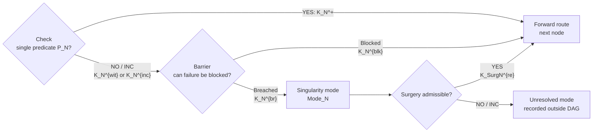

The ledger records (K_N^{\mathrm{inc}}), (K_N^{\mathrm{br}}), and (K_{\mathrm{Surg}N}^{\mathrm{re}}), but the ledger is not a node. The DAG node itself is only the check/barrier/mode/surgery package.

---

# 3. Atomized new nodes

## PS0 — Continuation-failure check

**Single check:** Does failure of the continuation criterion imply a bad event?

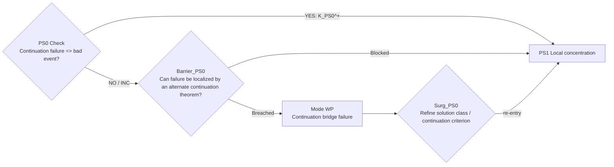

---

## PS1 — Local concentration check

**Single check:** Does the bad event produce a localized critical concentration?

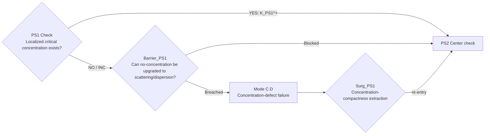

---

## PS2 — Center check

**Single check:** Is a concentration center selected?

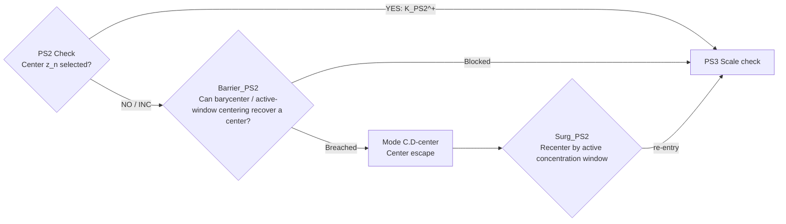

---

## PS3 — Scale check

**Single check:** Is a concentration scale selected?

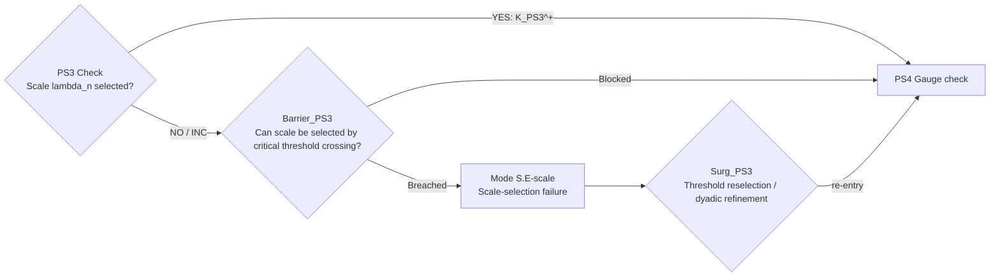

---

## PS4 — Gauge check

**Single check:** Is the symmetry/gauge fixed?

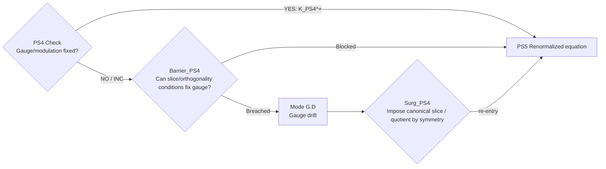

---

## PS5 — Renormalized-equation check

**Single check:** Does the normalized sequence satisfy a closed renormalized equation?

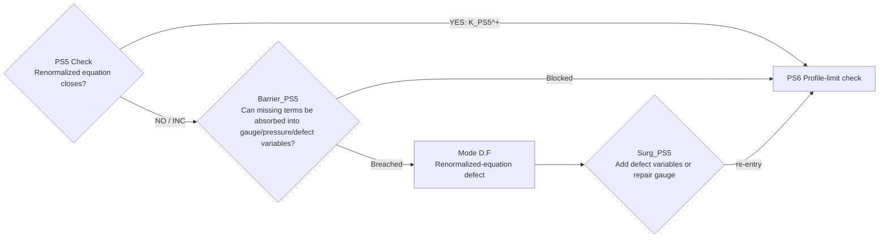

---

## PS6 — Profile-limit check

**Single check:** Does the normalized sequence have a subsequential limit?

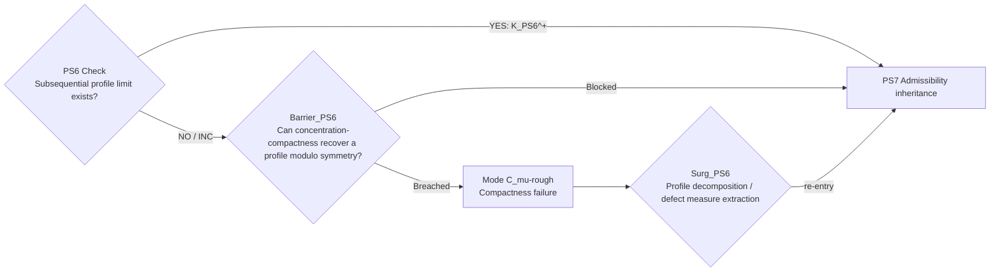

---

## PS7 — Admissibility-inheritance check

**Single check:** Does the limit inherit the admissible solution class?

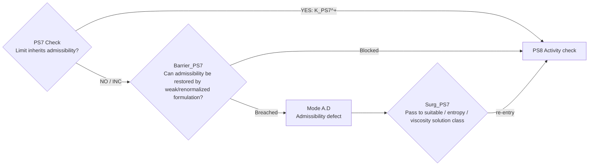

---

## PS8 — Activity check

**Single check:** Is the extracted profile nontrivial or active?

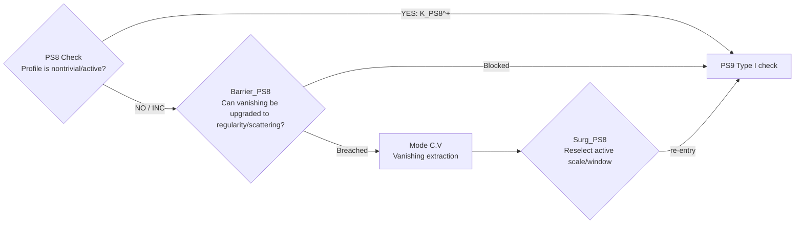

---

# 4. Scale-law nodes

## PS9 — Type I check

**Single check:** Is the active profile Type I?

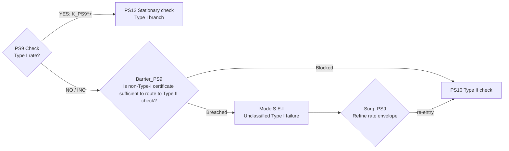

---

## PS10 — Type II check

**Single check:** Is the active profile Type II?

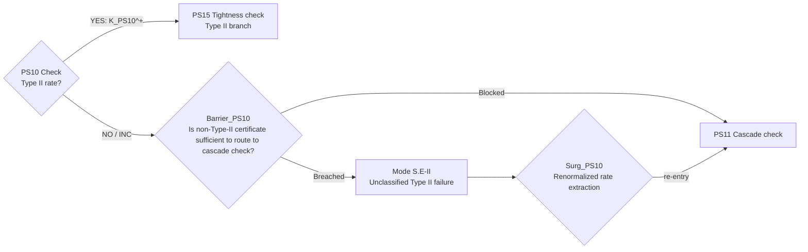

---

## PS11 — Scale-cascade check

**Single check:** Is there an infinite scale cascade?

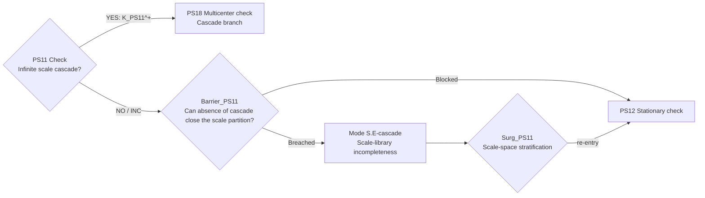

---

# 5. Orbit-type nodes

## PS12 — Stationary check

**Single check:** Is the profile stationary in renormalized time?

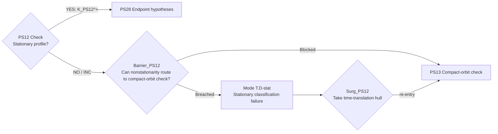

---

## PS13 — Compact-orbit check

**Single check:** Is the time-translation orbit precompact?

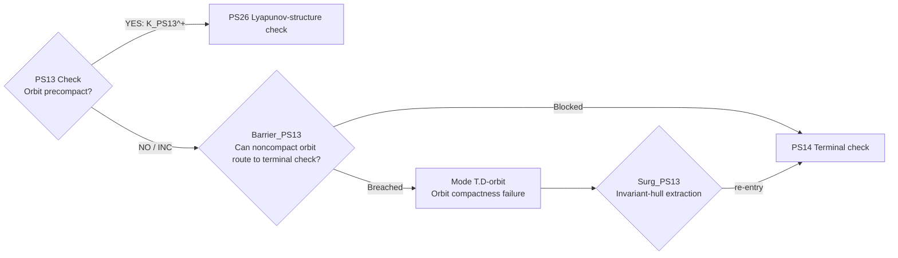

---

## PS14 — Terminal check

**Single check:** Is the profile terminal or heteroclinic?

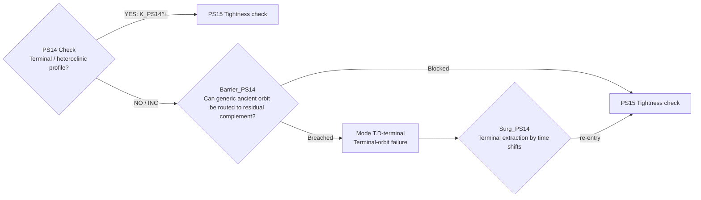

---

# 6. Localization nodes

## PS15 — Tightness check

**Single check:** Is the active mass tight?

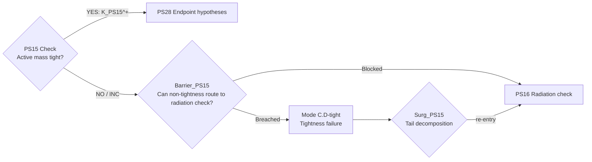

---

## PS16 — Radiation check

**Single check:** Is there radiative tail mass?

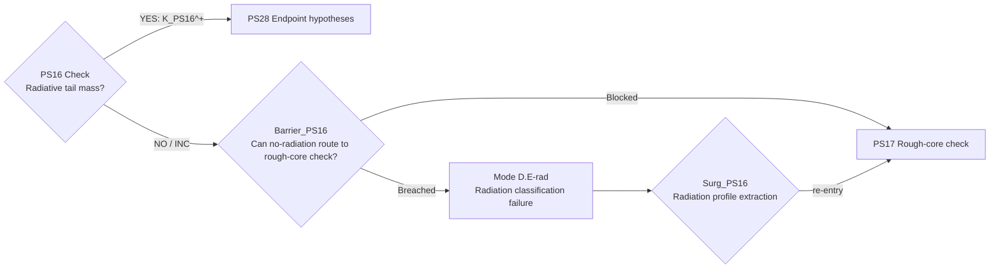

---

## PS17 — Rough-core check

**Single check:** Does local compactness or suitability fail?

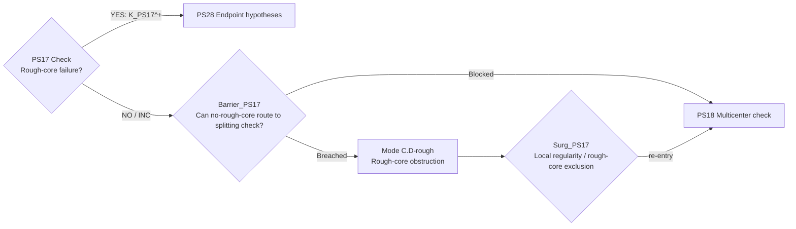

---

# 7. Splitting nodes

## PS18 — Multicenter check

**Single check:** Is there more than one active center?

```mermaid
flowchart LR
    C{"PS18 Check<br/>Multiple active centers?"}
    C -- "YES: K_PS18^+" --> N["PS19 Finite-packet check"]
    C -- "NO / INC" --> B{"Barrier_PS18<br/>Can singleton carrier route to structure checks?"}
    B -- "Blocked" --> N2["PS21 Smallness check"]
    B -- "Breached" --> M["Mode C.D-center<br/>Hidden center ambiguity"]
    M --> S{"Surg_PS18<br/>Maximal active-camera extraction"}
    S -- "re-entry" --> N
```

---

## PS19 — Finite-packet check

**Single check:** Is the active packet finite?

```mermaid
flowchart LR
    C{"PS19 Check<br/>Finite active packet?"}
    C -- "YES: K_PS19^+" --> N["PS20 Terminal-decoupling check"]
    C -- "NO / INC" --> B{"Barrier_PS19<br/>Can infinite packet route to cascade branch?"}
    B -- "Blocked" --> N2["PS11 Cascade check"]
    B -- "Breached" --> M["Mode C.D-packet<br/>Infinite active packet"]
    M --> S{"Surg_PS19<br/>Scale/center exhaustion"}
    S -- "re-entry" --> N2
```

---

## PS20 — Terminal-decoupling check

**Single check:** Do separated packet interactions vanish locally?

```mermaid
flowchart LR
    C{"PS20 Check<br/>Terminal nonlinear decoupling holds?"}
    C -- "YES: K_PS20^+" --> N["PS28 Endpoint hypotheses"]
    C -- "NO / INC" --> B{"Barrier_PS20<br/>Can interaction defect be absorbed into pressure/gauge?"}
    B -- "Blocked" --> N
    B -- "Breached" --> M["Mode C.D-split<br/>No-splitting failure"]
    M --> S{"Surg_PS20<br/>Refine packet / add hidden camera"}
    S -- "re-entry" --> N
```

This is the abstract version of the no-multibubble/no-splitting mechanism used in your Navier–Stokes residual closure.

---

# 8. Structural nodes

## PS21 — Smallness check

**Single check:** Is the profile perturbatively small?

```mermaid
flowchart LR
    C{"PS21 Check<br/>Perturbatively small?"}
    C -- "YES: K_PS21^+" --> N["PS28 Endpoint hypotheses"]
    C -- "NO / INC" --> B{"Barrier_PS21<br/>Can non-smallness route to stationary critical-norm check?"}
    B -- "Blocked" --> N2["PS22 Stationary critical-norm check"]
    B -- "Breached" --> M["Mode S.D-small<br/>Smallness threshold ambiguity"]
    M --> S{"Surg_PS21<br/>Threshold refinement"}
    S -- "re-entry" --> N2
```

---

## PS22 — Stationary critical-norm check

**Single check:** Is the stationary profile controlled in the critical norm?

```mermaid
flowchart LR
    C{"PS22 Check<br/>Stationary + critical norm controlled?"}
    C -- "YES: K_PS22^+" --> N["PS28 Endpoint hypotheses"]
    C -- "NO / INC" --> B{"Barrier_PS22<br/>Can failure route to symmetry check?"}
    B -- "Blocked" --> N2["PS23 Symmetry check"]
    B -- "Breached" --> M["Mode S.D-statcrit<br/>Stationary critical-norm failure"]
    M --> S{"Surg_PS22<br/>Critical-norm profile decomposition"}
    S -- "re-entry" --> N2
```

---

## PS23 — Symmetry check

**Single check:** Does the profile have a nontrivial continuous symmetry?

```mermaid
flowchart LR
    C{"PS23 Check<br/>Continuous symmetry present?"}
    C -- "YES: K_PS23^+" --> N["PS28 Endpoint hypotheses"]
    C -- "NO / INC" --> B{"Barrier_PS23<br/>Can asymmetry route to relative-equilibrium check?"}
    B -- "Blocked" --> N2["PS24 Relative-equilibrium check"]
    B -- "Breached" --> M["Mode G.D-sym<br/>Symmetry classification failure"]
    M --> S{"Surg_PS23<br/>Symmetry quotient / slice decomposition"}
    S -- "re-entry" --> N2
```

---

## PS24 — Relative-equilibrium check

**Single check:** Is the profile a relative equilibrium under a symmetry flow?

```mermaid
flowchart LR
    C{"PS24 Check<br/>Relative equilibrium?"}
    C -- "YES: K_PS24^+" --> N["PS28 Endpoint hypotheses"]
    C -- "NO / INC" --> B{"Barrier_PS24<br/>Can failure route to degenerate-branch check?"}
    B -- "Blocked" --> N2["PS25 Degenerate-branch check"]
    B -- "Breached" --> M["Mode G.D-rel<br/>Relative-equilibrium classification failure"]
    M --> S{"Surg_PS24<br/>Co-moving-frame reduction"}
    S -- "re-entry" --> N2
```

---

## PS25 — Degenerate-branch check

**Single check:** Does the profile lie on a degenerate stationary branch?

```mermaid
flowchart LR
    C{"PS25 Check<br/>Degenerate stationary branch?"}
    C -- "YES: K_PS25^+" --> N["PS28 Endpoint hypotheses"]
    C -- "NO / INC" --> B{"Barrier_PS25<br/>Can non-branch profiles route to Lyapunov check?"}
    B -- "Blocked" --> N2["PS26 Lyapunov-structure check"]
    B -- "Breached" --> M["Mode S.D-branch<br/>Bifurcation obstruction"]
    M --> S{"Surg_PS25<br/>Stationary-hull stratification"}
    S -- "re-entry" --> N2
```

---

## PS26 — Lyapunov-structure check

**Single check:** Is there a valid local Lyapunov/monotonicity functional on the relevant hull?

```mermaid
flowchart LR
    C{"PS26 Check<br/>Local Lyapunov/monotonicity structure valid?"}
    C -- "YES: K_PS26^+" --> N["PS28 Endpoint hypotheses"]
    C -- "NO / INC" --> B{"Barrier_PS26<br/>Can missing Lyapunov be replaced by invariant-measure rigidity?"}
    B -- "Blocked" --> N
    B -- "Breached" --> M["Mode S.D-lyap<br/>Gradient-structure failure"]
    M --> S{"Surg_PS26<br/>Construct hull-local Lyapunov / pass to invariant measure"}
    S -- "re-entry" --> N
```

This node should be **hull-local**, not global. That keeps it compatible with your Navier–Stokes strategy.

---

# 9. Defect and endpoint nodes

## PS27 — Defect-free check

**Single check:** Are all declared compactness/constraint defects absent?

```mermaid
flowchart LR
    C{"PS27 Check<br/>Declared defects absent?"}
    C -- "YES: K_PS27^+" --> N["PS28 Endpoint hypotheses"]
    C -- "NO / INC" --> B{"Barrier_PS27<br/>Can defect be promoted to a named defect stratum?"}
    B -- "Blocked" --> N
    B -- "Breached" --> M["Mode D.F<br/>Unclassified defect"]
    M --> S{"Surg_PS27<br/>Add defect variable / defect-measure stratum"}
    S -- "re-entry" --> N
```

This node must check one chosen defect family at a time in implementation. For example:

[
\text{pressure defect absent?}
]

then separately

[
\text{Reynolds/stress defect absent?}
]

then separately

[
\text{boundary defect absent?}
]

Do not bundle them in code.

---

## PS28 — Endpoint-hypotheses check

**Single check:** Do the hypotheses of the selected endpoint theorem match exactly?

```mermaid
flowchart LR
    C{"PS28 Check<br/>Endpoint theorem hypotheses match exactly?"}
    C -- "YES: K_PS28^+" --> N["PS29 Endpoint-exclusion check"]
    C -- "NO / INC" --> B{"Barrier_PS28<br/>Can hypotheses be obtained by an upgrade theorem?"}
    B -- "Blocked" --> N
    B -- "Breached" --> M["Mode E.H<br/>Endpoint mismatch"]
    M --> S{"Surg_PS28<br/>Add missing hypothesis as explicit subnode / refine branch"}
    S -- "re-entry" --> N
```

This is critical. It prevents importing a Liouville theorem, rigidity theorem, or local regularity theorem with almost-but-not-quite matching assumptions.

---

## PS29 — Endpoint-exclusion check

**Single check:** Does the endpoint theorem exclude this branch?

```mermaid
flowchart LR
    C{"PS29 Check<br/>Endpoint theorem proves branch empty?"}
    C -- "YES: K_PS29^+" --> N["PS31 Residual-complement check"]
    C -- "NO / INC" --> B{"Barrier_PS29<br/>Can branch be routed to realization check instead?"}
    B -- "Blocked" --> N2["PS30 Endpoint-realization check"]
    B -- "Breached" --> M["Mode E.X<br/>No exclusion theorem"]
    M --> S{"Surg_PS29<br/>Refine branch or create new endpoint obligation"}
    S -- "re-entry" --> N2
```

For a regularity proof, this node should be YES for every branch.

---

## PS30 — Endpoint-realization check

**Single check:** Is there a theorem realizing this branch as actual blowup/singularity?

```mermaid
flowchart LR
    C{"PS30 Check<br/>Branch dynamically realized?"}
    C -- "YES: K_PS30^+" --> N["Singularity / blowup output"]
    C -- "NO / INC" --> B{"Barrier_PS30<br/>Can non-realization route to residual complement?"}
    B -- "Blocked" --> N2["PS31 Residual-complement check"]
    B -- "Breached" --> M["Mode E.R<br/>Attainability unresolved"]
    M --> S{"Surg_PS30<br/>Stable/unstable manifold or attainability analysis"}
    S -- "re-entry" --> N2
```

This is what makes the same Sieve useful for both regularity and blowup problems.

---

## PS31 — Residual-complement check

**Single check:** Is the residual class defined as the complement of all earlier branches?

```mermaid
flowchart LR
    C{"PS31 Check<br/>Residual defined as exact complement?"}
    C -- "YES: K_PS31^+" --> N["PS32 Library-completeness check"]
    C -- "NO / INC" --> B{"Barrier_PS31<br/>Can residual be repaired by ordered subtraction?"}
    B -- "Blocked" --> N
    B -- "Breached" --> M["Mode T.C-res<br/>Residual not well-defined"]
    M --> S{"Surg_PS31<br/>Define ordered predicates and complement residual"}
    S -- "re-entry" --> N
```

This is the most important formal repair from your Navier–Stokes residual stratification. The final residual must be a literal complement:

[
\mathcal B_{\mathrm{res}}
=========================

\mathcal B_{\mathrm{bad}}
\setminus
\bigcup_{j=1}^{N}\mathcal B_j.
]

---

## PS32 — Library-completeness check

**Single check:** Does the branch library exhaust the normalized bad-profile space?

```mermaid
flowchart LR
    C{"PS32 Check<br/>Bad-profile library complete?"}
    C -- "YES: K_PS32^+ = K_CatLib^+" --> N["Current Node 17: Cat_Hom Lock"]
    C -- "NO / INC" --> B{"Barrier_PS32<br/>Can incompleteness be repaired by adding residual complement?"}
    B -- "Blocked" --> N
    B -- "Breached" --> M["Mode CatLib<br/>Library incompleteness"]
    M --> S{"Surg_PS32<br/>Add missing stratum / refine bad-object space"}
    S -- "re-entry" --> N
```

This node produces the formal (K_{\mathrm{CatLib}}^+) input needed by the Lock route.

---

# 10. How this changes the singularity classification table

The old labels C.E, C.D, D.D, D.E, S.E, S.D, etc. should remain **mode families**, not final singularity classes.

A final singularity subtype should now be recorded as a path:

[
\text{Mode family}
+
\text{profile node where failure occurred}
+
\text{barrier outcome}
+
\text{surgery outcome}.
]

For example:

[
\texttt{S.E / PS10 / Barrier breached / Surg_PS10}
]

means:

> scaling family, Type II classification failure, barrier could not block, rate extraction surgery required.

A Navier–Stokes Type I residual branch might become:

[
\texttt{C.D / PS18 singleton / PS20 no-splitting / PS31 residual complement / PS29 excluded}.
]

That is far more precise than saying merely “R4” or “D.D.”

---

# 11. The corrected reusable algorithm

The algorithm should be:

```text
For each problem type T:

1. Run the current Sieve until C_mu.
2. If C_mu is YES, enter the Profile-Singularity Extension.
3. Each extension node has:
   Check -> Barrier -> Singularity Mode -> Surgery -> forward route.
4. Classification nodes use NO barriers to certify safe routing to the next classifier.
5. Residual classes are always created by ordered subtraction.
6. Endpoint nodes decide:
   excluded,
   realized,
   or residual after surgery/refinement.
7. Library-completeness produces K_CatLib^+.
8. Cat_Hom Lock runs only after K_CatLib^+ is present.
9. The continuation bridge upgrades structural exclusion to analytic regularity.
```

The main rule is:

[
\boxed{
\text{No composite node. No hidden ledger node. No informal residual.}
}
]

Every node is:

[
\boxed{
\text{one predicate, one barrier, one singularity mode, one surgery route.}
}
]

This gives you a much cleaner and more rigorous general PDE Sieve.


Correct. The extension should **not** introduce large composite classifier nodes. It should introduce **new Hypostructure-style nodes**, and every new node must have the same internal architecture:

[
\boxed{
\text{Check}
;\longrightarrow;
\text{Barrier}
;\longrightarrow;
\text{Singularity Mode}
;\longrightarrow;
\text{Surgery}
;\longrightarrow;
\text{Re-entry / next node}.
}
]

The ledger should remain a meta-object attached to the certificate context (\Gamma), not a vertex of the DAG. That is consistent with the existing formalism: gate nodes have a predicate, YES/NO certificates, context update, and routing; barrier nodes have triggers, pre-certificates, blocked/breached outcomes, and next-node routing; surgery nodes have inputs, action, postcondition, re-entry target, and progress measure.

Below is the corrected atomized design.

---

# 1. Uniform architecture for every new node

Every new PDE/profile node should be a **micro-sieve** of this form.

```mermaid
flowchart LR
    C{"Check P_X?"}

    C -- "safe certificate" --> N["Next node"]

    C -- "danger certificate<br/>or INC" --> B["Barrier B_X"]

    B -- "Blocked<br/>K_X^blk" --> N

    B -- "Breached<br/>K_X^br" --> M["Singularity Mode M_X"]

    M --> S["Surgery Surg_X"]

    S -- "re-entry certificate<br/>K_SurgX^re" --> N

    classDef check fill:#3b82f6,stroke:#1d4ed8,color:#ffffff;
    classDef barrier fill:#f97316,stroke:#c2410c,color:#ffffff;
    classDef mode fill:#ef4444,stroke:#b91c1c,color:#ffffff;
    classDef surgery fill:#9333ea,stroke:#6b21a8,color:#ffffff;
    classDef next fill:#e5e7eb,stroke:#374151,color:#111827;

    class C check;
    class B barrier;
    class M mode;
    class S surgery;
    class N next;
```

Important refinement:

* Some checks have **NO as the danger outcome**, like EnergyCheck.
* Some checks have **YES as the danger outcome**, like OscillateCheck in the current Sieve, where detecting oscillation routes to the frequency barrier. 
* Therefore each node must declare its **danger polarity**:
  [
  \operatorname{Danger}(X)\in{\mathrm{YES},\mathrm{NO},\mathrm{INC}}.
  ]

The structure is always the same; only the danger polarity changes.

---

# 2. Main integration diagram

The new PDE profile-sieve should attach to the current Sieve at (C_\mu), (SC_\lambda), (Cap_H), (LS_\sigma), (TB_\pi), (TB_O), (RepDesc_K), (GC_\nabla), and finally (Cat_{\mathrm{Hom}}).

```mermaid
flowchart TD
    H0["Current substrate / H0"]
    DE["Current Node 1: D_E<br/>energy"]
    REC["Current Node 2: Rec_N<br/>event finiteness"]
    CMU["Current Node 3: C_mu<br/>compactness / concentration"]
    SC["Current Node 4: SC_lambda<br/>scaling"]
    PARAM["Current Node 5: SC_partial c<br/>parameters"]
    CAP["Current Node 6: Cap_H<br/>capacity"]
    LS["Current Node 7: LS_sigma<br/>stiffness"]
    TBPI["Current Node 8: TB_pi<br/>topological sector"]
    TBO["Current Node 9: TB_O<br/>tameness"]
    TBRHO["Current Node 10: TB_rho<br/>recurrence / mixing"]
    REP["Current Node 11: RepDesc_K<br/>finite description"]
    GC["Current Node 12: GC_nabla<br/>oscillation / gradient"]
    BOUND["Current Boundary nodes<br/>Bound_partial etc."]
    CATSING["Current Singularity module<br/>Cat_Sing / profile library"]
    LOCK["Current Node 17: Cat_Hom<br/>Lock"]

    N0["New N0: BreakdownBridge"]
    N1["New N1: CriticalDefect"]
    N2["New N2: Normalization"]
    N3["New N3: GaugeSlice"]
    N4["New N4: CompactProfile"]
    N5["New N5: LimitEquation"]
    N6["New N6: Activity"]
    SCALE["New scale micro-sieve"]
    ORBIT["New orbit micro-sieve"]
    LOCAL["New localization micro-sieve"]
    SPLIT["New splitting micro-sieve"]
    STRUCT["New structure micro-sieve"]
    DEFECT["New defect micro-sieve"]
    ENDPOINT["New endpoint micro-sieve"]
    LIB["New library-completeness micro-sieve"]

    H0 --> DE --> REC --> CMU

    H0 --> N0
    CMU -- "K_C_mu^+" --> N1
    DE -. "critical quantity data" .-> N1
    SC -. "scaling action" .-> N2
    PARAM -. "parameters / gauges" .-> N2
    N0 --> N1 --> N2 --> N3 --> N4 --> N5 --> N6

    CMU -. "compactness data" .-> N4
    REP -. "description data" .-> N4
    SC -. "scale data" .-> SCALE
    N6 --> SCALE --> ORBIT --> LOCAL --> SPLIT --> STRUCT --> DEFECT --> ENDPOINT --> LIB --> CATSING --> LOCK

    TBRHO -. "recurrence data" .-> ORBIT
    CAP -. "capacity data" .-> LOCAL
    CMU -. "profile packet data" .-> SPLIT
    LS -. "stiffness data" .-> STRUCT
    TBPI -. "sector data" .-> STRUCT
    TBO -. "tameness data" .-> STRUCT
    GC -. "oscillation / defect data" .-> DEFECT
    BOUND -. "boundary status" .-> ENDPOINT
    REP -. "finite library data" .-> LIB

    LOCK --> REGUP["Continuation upgrade<br/>StructReg + WP => Reg"]

    classDef current fill:#dbeafe,stroke:#2563eb,color:#111827;
    classDef new fill:#dcfce7,stroke:#16a34a,color:#111827;
    classDef lock fill:#fef3c7,stroke:#d97706,color:#111827;

    class H0,DE,REC,CMU,SC,PARAM,CAP,LS,TBPI,TBO,TBRHO,REP,GC,BOUND,CATSING,LOCK current;
    class N0,N1,N2,N3,N4,N5,N6,SCALE,ORBIT,LOCAL,SPLIT,STRUCT,DEFECT,ENDPOINT,LIB new;
    class REGUP lock;
```

For Navier–Stokes, this matches the proof-object pattern: (K_{C_\mu}^+) and (K_{\mathrm{Prof}_{NS}}^+) produce germ, initiality, and library certificates; the Lock then gives structural exclusion; only after that does the continuation bridge upgrade structural exclusion to analytic regularity. 

---

# 3. Core profile-extraction nodes

These are not classifiers. Each checks one proposition.

## N0. BreakdownBridge

**Single check:** Does failure of continuation produce a bad event?

```mermaid
flowchart LR
    C{"N0 Check:<br/>Does breakdown imply a bad event?"}
    B["BarrierBridge:<br/>Can a backend continuation criterion be supplied?"]
    M["Mode D.C-Bridge:<br/>untyped breakdown"]
    S["SurgBridge:<br/>add / prove continuation criterion"]
    N["N1 CriticalDefect"]

    C -- "YES: K_WP-br^+" --> N
    C -- "NO/INC" --> B
    B -- "Blocked" --> N
    B -- "Breached" --> M --> S --> N
```

## N1. CriticalDefect

**Single check:** Does the bad event force a scale-critical defect?

```mermaid
flowchart LR
    C{"N1 Check:<br/>bad event => critical defect?"}
    B["BarrierDefect:<br/>can defect be recovered from energy/capacity?"]
    M["Mode C.D-Defect:<br/>unmeasured concentration"]
    S["SurgDefect:<br/>derive local concentration theorem"]
    N["N2 Normalization"]

    C -- "YES: K_Defect^+" --> N
    C -- "NO/INC" --> B
    B -- "Blocked" --> N
    B -- "Breached" --> M --> S --> N
```

## N2. Normalization

**Single check:** Is a normalization tuple fixed?

[
(x_n,t_n,\lambda_n,g_n).
]

```mermaid
flowchart LR
    C{"N2 Check:<br/>normalization tuple exists?"}
    B["BarrierNorm:<br/>can center/scale be selected by compactness?"]
    M["Mode S.C-Norm:<br/>normalization drift"]
    S["SurgNorm:<br/>choose canonical center-scale rule"]
    N["N3 GaugeSlice"]

    C -- "YES: K_Norm^+" --> N
    C -- "NO/INC" --> B
    B -- "Blocked" --> N
    B -- "Breached" --> M --> S --> N
```

## N3. GaugeSlice

**Single check:** Is there a gauge/modulation slice?

```mermaid
flowchart LR
    C{"N3 Check:<br/>gauge slice fixed?"}
    B["BarrierGauge:<br/>can symmetry quotient be repaired?"]
    M["Mode S.D-Gauge:<br/>unfixed modulation"]
    S["SurgGauge:<br/>orthogonality / slice condition"]
    N["N4 CompactProfile"]

    C -- "YES: K_Gauge^+" --> N
    C -- "NO/INC" --> B
    B -- "Blocked" --> N
    B -- "Breached" --> M --> S --> N
```

## N4. CompactProfile

**Single check:** Does the normalized sequence have a compact subsequence?

```mermaid
flowchart LR
    C{"N4 Check:<br/>compact subsequence exists?"}
    B["BarrierCompact:<br/>can concentration-compactness recover a profile?"]
    M["Mode C.D-Compact:<br/>loss of compactness"]
    S["SurgCompact:<br/>profile decomposition / quotient by symmetries"]
    N["N5 LimitEquation"]

    C -- "YES: K_ProfileCompact^+" --> N
    C -- "NO/INC" --> B
    B -- "Blocked" --> N
    B -- "Breached" --> M --> S --> N
```

## N5. LimitEquation

**Single check:** Does the limit solve the renormalized equation?

```mermaid
flowchart LR
    C{"N5 Check:<br/>limit solves renormalized equation?"}
    B["BarrierEquation:<br/>can weak formulation / pressure / constraint pass to limit?"]
    M["Mode D.D-Equation:<br/>defective limit equation"]
    S["SurgEquation:<br/>defect measure or pressure-gauge repair"]
    N["N6 Activity"]

    C -- "YES: K_LimEq^+" --> N
    C -- "NO/INC" --> B
    B -- "Blocked" --> N
    B -- "Breached" --> M --> S --> N
```

## N6. Activity

**Single check:** Is the profile nontrivial/active?

```mermaid
flowchart LR
    C{"N6 Check:<br/>profile is active/nonzero?"}
    B["BarrierActivity:<br/>can nontriviality be recovered from concentration?"]
    M["Mode C.D-Vanish:<br/>vanishing profile"]
    S["SurgActivity:<br/>recentering / lower-bound extraction"]
    N["Scale micro-sieve"]

    C -- "YES: K_Active^+" --> N
    C -- "NO/INC" --> B
    B -- "Blocked" --> N
    B -- "Breached" --> M --> S --> N
```

---

# 4. Scale micro-sieve

Each scale node checks **one scale property**. These nodes should not be merged into one “scale classifier.”

```mermaid
flowchart TD
    T1{"SC-I Check:<br/>Type I envelope?"}
    B1["BarrierTypeI:<br/>Type I exclusion theorem?"]
    M1["Mode S.E-TypeI:<br/>Type I profile survives"]
    S1["SurgTypeI:<br/>Type I state-space stratification"]

    T2{"SC-II Check:<br/>Type II envelope?"}
    B2["BarrierTypeII:<br/>Type II exclusion theorem?"]
    M2["Mode S.E-TypeII:<br/>Type II profile survives"]
    S2["SurgTypeII:<br/>Type II state-space stratification"]

    T3{"SC-Cas Check:<br/>scale cascade?"}
    B3["BarrierCascade:<br/>cascade exclusion theorem?"]
    M3["Mode S.E-Cascade:<br/>scale cascade"]
    S3["SurgCascade:<br/>cascade profile decomposition"]

    R{"SC-Res Check:<br/>scale residual complement nonempty?"}
    B4["BarrierScaleResidual:<br/>can residual be refined?"]
    M4["Mode S.E-Residual:<br/>unclassified scale law"]
    S4["SurgScaleResidual:<br/>add new scale predicate"]

    NEXT["Orbit micro-sieve"]

    T1 -- "YES/INC danger" --> B1
    T1 -- "NO" --> T2
    B1 -- "Blocked" --> NEXT
    B1 -- "Breached" --> M1 --> S1 --> NEXT

    T2 -- "YES/INC danger" --> B2
    T2 -- "NO" --> T3
    B2 -- "Blocked" --> NEXT
    B2 -- "Breached" --> M2 --> S2 --> NEXT

    T3 -- "YES/INC danger" --> B3
    T3 -- "NO" --> R
    B3 -- "Blocked" --> NEXT
    B3 -- "Breached" --> M3 --> S3 --> NEXT

    R -- "YES/INC danger" --> B4
    R -- "NO" --> NEXT
    B4 -- "Blocked" --> NEXT
    B4 -- "Breached" --> M4 --> S4 --> NEXT
```

The final residual node is a complement node, not an informal “unknown.” Formally,

[
\mathcal B_{\mathrm{scale,res}}
===============================

\mathcal B_{\mathrm{bad}}
\setminus
(\mathcal B_{\mathrm{I}}\cup \mathcal B_{\mathrm{II}}\cup \mathcal B_{\mathrm{cas}}).
]

---

# 5. Orbit micro-sieve

Each node checks one orbit property.

```mermaid
flowchart TD
    O1{"Orb-Stat Check:<br/>stationary?"}
    B1["BarrierStationary:<br/>stationary Liouville theorem?"]
    M1["Mode T.D-Stationary:<br/>stationary bad profile"]
    S1["SurgStationary:<br/>stationary rigidity / elliptic reduction"]

    O2{"Orb-RelEq Check:<br/>relative equilibrium?"}
    B2["BarrierRelEq:<br/>relative-equilibrium Liouville?"]
    M2["Mode T.D-RelEq:<br/>gauged recurrent profile"]
    S2["SurgRelEq:<br/>co-moving gauge reduction"]

    O3{"Orb-Periodic Check:<br/>periodic or relative periodic?"}
    B3["BarrierPeriodic:<br/>periodic rigidity theorem?"]
    M3["Mode T.D-Periodic:<br/>time-cycle bad profile"]
    S3["SurgPeriodic:<br/>Poincare / Floquet reduction"]

    O4{"Orb-Compact Check:<br/>precompact orbit?"}
    B4["BarrierCompactOrbit:<br/>compact-hull rigidity?"]
    M4["Mode T.D-CompactHull:<br/>compact recurrent bad profile"]
    S4["SurgCompactOrbit:<br/>invariant-measure / Lyapunov reduction"]

    O5{"Orb-Terminal Check:<br/>terminal / heteroclinic?"}
    B5["BarrierTerminal:<br/>terminal endpoint theorem?"]
    M5["Mode T.D-Terminal:<br/>terminal bad carrier"]
    S5["SurgTerminal:<br/>terminal state-space exhaustion"]

    R{"Orb-Res Check:<br/>orbit residual complement?"}
    B6["BarrierOrbitResidual:<br/>can orbit type be refined?"]
    M6["Mode T.D-Residual:<br/>unclassified orbit"]
    S6["SurgOrbitResidual:<br/>add orbit predicate"]

    NEXT["Localization micro-sieve"]

    O1 -- "YES/INC danger" --> B1
    O1 -- "NO" --> O2
    B1 -- "Blocked" --> NEXT
    B1 -- "Breached" --> M1 --> S1 --> NEXT

    O2 -- "YES/INC danger" --> B2
    O2 -- "NO" --> O3
    B2 -- "Blocked" --> NEXT
    B2 -- "Breached" --> M2 --> S2 --> NEXT

    O3 -- "YES/INC danger" --> B3
    O3 -- "NO" --> O4
    B3 -- "Blocked" --> NEXT
    B3 -- "Breached" --> M3 --> S3 --> NEXT

    O4 -- "YES/INC danger" --> B4
    O4 -- "NO" --> O5
    B4 -- "Blocked" --> NEXT
    B4 -- "Breached" --> M4 --> S4 --> NEXT

    O5 -- "YES/INC danger" --> B5
    O5 -- "NO" --> R
    B5 -- "Blocked" --> NEXT
    B5 -- "Breached" --> M5 --> S5 --> NEXT

    R -- "YES/INC danger" --> B6
    R -- "NO" --> NEXT
    B6 -- "Blocked" --> NEXT
    B6 -- "Breached" --> M6 --> S6 --> NEXT
```

---

# 6. Localization micro-sieve

Each node checks one localization property.

```mermaid
flowchart TD
    L1{"Loc-Compact Check:<br/>compact active carrier?"}
    B1["BarrierCompactCarrier:<br/>compact-carrier rigidity?"]
    M1["Mode C.D-CompactCarrier:<br/>compact active bad carrier"]
    S1["SurgCompactCarrier:<br/>minimal element / hull extraction"]

    L2{"Loc-Tight Check:<br/>tight profile?"}
    B2["BarrierTight:<br/>tight Liouville theorem?"]
    M2["Mode C.D-Tight:<br/>tight bad profile"]
    S2["SurgTight:<br/>tight-class rigidity"]

    L3{"Loc-Exterior Check:<br/>exterior carrier?"}
    B3["BarrierExterior:<br/>exterior regularity theorem?"]
    M3["Mode C.D-Exterior:<br/>exterior active carrier"]
    S3["SurgExterior:<br/>exterior localization / decay"]

    L4{"Loc-Radiative Check:<br/>radiative tail?"}
    B4["BarrierRadiation:<br/>radiation discharge theorem?"]
    M4["Mode D.E-Radiation:<br/>radiative bad tail"]
    S4["SurgRadiation:<br/>radiation channel decomposition"]

    L5{"Loc-Rough Check:<br/>rough-core failure?"}
    B5["BarrierRough:<br/>rough-core exclusion theorem?"]
    M5["Mode C.D-Rough:<br/>rough terminal core"]
    S5["SurgRough:<br/>local regularity / rough-core refinement"]

    R{"Loc-Res Check:<br/>localization residual complement?"}
    B6["BarrierLocResidual:<br/>can localization be refined?"]
    M6["Mode C.D-Residual:<br/>unclassified localization"]
    S6["SurgLocResidual:<br/>add localization predicate"]

    NEXT["Splitting micro-sieve"]

    L1 -- "YES/INC danger" --> B1
    L1 -- "NO" --> L2
    B1 -- "Blocked" --> NEXT
    B1 -- "Breached" --> M1 --> S1 --> NEXT

    L2 -- "YES/INC danger" --> B2
    L2 -- "NO" --> L3
    B2 -- "Blocked" --> NEXT
    B2 -- "Breached" --> M2 --> S2 --> NEXT

    L3 -- "YES/INC danger" --> B3
    L3 -- "NO" --> L4
    B3 -- "Blocked" --> NEXT
    B3 -- "Breached" --> M3 --> S3 --> NEXT

    L4 -- "YES/INC danger" --> B4
    L4 -- "NO" --> L5
    B4 -- "Blocked" --> NEXT
    B4 -- "Breached" --> M4 --> S4 --> NEXT

    L5 -- "YES/INC danger" --> B5
    L5 -- "NO" --> R
    B5 -- "Blocked" --> NEXT
    B5 -- "Breached" --> M5 --> S5 --> NEXT

    R -- "YES/INC danger" --> B6
    R -- "NO" --> NEXT
    B6 -- "Blocked" --> NEXT
    B6 -- "Breached" --> M6 --> S6 --> NEXT
```

---

# 7. Splitting / packet micro-sieve

This is the abstract form of the no-multibubble logic from your Navier–Stokes proof.

```mermaid
flowchart TD
    S0{"Split-Single Check:<br/>singleton active carrier?"}
    B0["BarrierSingleton:<br/>atomic endpoint theorem?"]
    M0["Mode C.D-Atomic:<br/>indecomposable singleton carrier"]
    U0["SurgSingleton:<br/>atomicity + endpoint Liouville"]

    S1{"Split-Finite Check:<br/>finite active packet?"}
    B1["BarrierFinitePacket:<br/>finite no-splitting theorem?"]
    M1["Mode C.D-FinitePacket:<br/>finite multibubble"]
    U1["SurgFinitePacket:<br/>terminal nonlinear decoupling"]

    S2{"Split-Decouple Check:<br/>cross-interactions vanish?"}
    B2["BarrierDecouple:<br/>interaction-decoupling theorem?"]
    M2["Mode D.D-CoupledPacket:<br/>non-decoupled profiles"]
    U2["SurgDecouple:<br/>pressure/gauge/cross-term repair"]

    S3{"Split-Hidden Check:<br/>hidden active camera remains?"}
    B3["BarrierHidden:<br/>maximality theorem?"]
    M3["Mode C.D-HiddenCamera:<br/>unextracted active profile"]
    U3["SurgHidden:<br/>augment packet and restart"]

    S4{"Split-Infinite Check:<br/>infinite active packet?"}
    B4["BarrierInfinitePacket:<br/>cascade exclusion theorem?"]
    M4["Mode S.E-InfinitePacket:<br/>infinite profile cascade"]
    U4["SurgInfinitePacket:<br/>cascade/tower decomposition"]

    R{"Split-Res Check:<br/>splitting residual complement?"}
    B5["BarrierSplitResidual:<br/>can packet type be refined?"]
    M5["Mode C.D-SplitResidual:<br/>unclassified splitting"]
    U5["SurgSplitResidual:<br/>add packet predicate"]

    NEXT["Structure micro-sieve"]

    S0 -- "YES/INC danger" --> B0
    S0 -- "NO" --> S1
    B0 -- "Blocked" --> NEXT
    B0 -- "Breached" --> M0 --> U0 --> NEXT

    S1 -- "YES/INC danger" --> B1
    S1 -- "NO" --> S2
    B1 -- "Blocked" --> NEXT
    B1 -- "Breached" --> M1 --> U1 --> NEXT

    S2 -- "NO/INC danger" --> B2
    S2 -- "YES" --> S3
    B2 -- "Blocked" --> NEXT
    B2 -- "Breached" --> M2 --> U2 --> NEXT

    S3 -- "YES/INC danger" --> B3
    S3 -- "NO" --> S4
    B3 -- "Blocked" --> NEXT
    B3 -- "Breached" --> M3 --> U3 --> NEXT

    S4 -- "YES/INC danger" --> B4
    S4 -- "NO" --> R
    B4 -- "Blocked" --> NEXT
    B4 -- "Breached" --> M4 --> U4 --> NEXT

    R -- "YES/INC danger" --> B5
    R -- "NO" --> NEXT
    B5 -- "Blocked" --> NEXT
    B5 -- "Breached" --> M5 --> U5 --> NEXT
```

For Navier–Stokes, this is where the terminal finite-packet/no-splitting mechanism lives.

---

# 8. Structure micro-sieve

This is where former labels like (R1,R2,R3,R4) should be replaced by structural names.

```mermaid
flowchart TD
    A{"Struct-Small Check:<br/>small-amplitude branch?"}
    BA["BarrierSmall:<br/>perturbative exclusion?"]
    MA["Mode S.D-Small:<br/>small bad profile"]
    SA["SurgSmall:<br/>OU/coercive perturbative closure"]

    B{"Struct-StatCrit Check:<br/>stationary critical-norm branch?"}
    BB["BarrierStatCrit:<br/>stationary critical-norm Liouville?"]
    MB["Mode T.D-StationaryCrit:<br/>stationary critical profile"]
    SB["SurgStatCrit:<br/>elliptic Liouville reduction"]

    C{"Struct-Fast Check:<br/>fast-decay branch?"}
    BC["BarrierFast:<br/>weighted Liouville theorem?"]
    MC["Mode C.D-Fast:<br/>fast-decay bad profile"]
    SCG["SurgFast:<br/>weighted identity / decay bootstrap"]

    D{"Struct-Sym Check:<br/>continuous symmetry branch?"}
    BD["BarrierSym:<br/>symmetry Liouville theorem?"]
    MD["Mode S.D-Symmetry:<br/>symmetric residual profile"]
    SD["SurgSym:<br/>quotient by symmetry / reduced PDE"]

    E{"Struct-RelEq Check:<br/>rotational or gauged relative equilibrium?"}
    BE["BarrierRelEq:<br/>gauged Liouville theorem?"]
    ME["Mode S.D-RelativeEq:<br/>gauged stationary profile"]
    SE["SurgRelEq:<br/>co-rotating / co-moving reduction"]

    F{"Struct-DegBranch Check:<br/>degenerate stationary branch?"}
    BF["BarrierDegBranch:<br/>attainability obstruction?"]
    MF["Mode S.D-DegenerateBranch:<br/>bifurcating stationary branch"]
    SF["SurgDegBranch:<br/>terminal stratification / active carrier exclusion"]

    G{"Struct-Lyap Check:<br/>local Lyapunov structure applies?"}
    BG["BarrierLyap:<br/>strict Lyapunov / invariant-measure rigidity?"]
    MG["Mode S.D-LyapFail:<br/>compact hull without Lyapunov closure"]
    SG["SurgLyap:<br/>construct local hull Lyapunov"]

    R{"Struct-Res Check:<br/>structure residual complement?"}
    BR["BarrierStructResidual:<br/>can residual be refined?"]
    MR["Mode Horizon-Residual:<br/>unstructured bad profile"]
    SR["SurgStructResidual:<br/>add new structural predicate"]

    NEXT["Defect micro-sieve"]

    A -- "YES/INC danger" --> BA
    A -- "NO" --> B
    BA -- "Blocked" --> NEXT
    BA -- "Breached" --> MA --> SA --> NEXT

    B -- "YES/INC danger" --> BB
    B -- "NO" --> C
    BB -- "Blocked" --> NEXT
    BB -- "Breached" --> MB --> SB --> NEXT

    C -- "YES/INC danger" --> BC
    C -- "NO" --> D
    BC -- "Blocked" --> NEXT
    BC -- "Breached" --> MC --> SCG --> NEXT

    D -- "YES/INC danger" --> BD
    D -- "NO" --> E
    BD -- "Blocked" --> NEXT
    BD -- "Breached" --> MD --> SD --> NEXT

    E -- "YES/INC danger" --> BE
    E -- "NO" --> F
    BE -- "Blocked" --> NEXT
    BE -- "Breached" --> ME --> SE --> NEXT

    F -- "YES/INC danger" --> BF
    F -- "NO" --> G
    BF -- "Blocked" --> NEXT
    BF -- "Breached" --> MF --> SF --> NEXT

    G -- "YES/INC danger" --> BG
    G -- "NO" --> R
    BG -- "Blocked" --> NEXT
    BG -- "Breached" --> MG --> SG --> NEXT

    R -- "YES/INC danger" --> BR
    R -- "NO" --> NEXT
    BR -- "Blocked" --> NEXT
    BR -- "Breached" --> MR --> SR --> NEXT
```

For your Navier–Stokes Type I series, this structure corresponds to:

* small-amplitude branch,
* stationary (L^3)/critical-norm branch,
* fast-decay branch,
* structured/symmetric branch,
* rotational relative-equilibrium branch,
* degenerate stationary-hull branch,
* local Lyapunov/hull branch,
* final residual complement.

The final residual is again defined by subtraction, not by intuition.

---

# 9. Defect micro-sieve

Each node asks whether a specific defect channel is present.

```mermaid
flowchart TD
    D1{"Def-Measure Check:<br/>measure defect present?"}
    B1["BarrierMeasureDefect:<br/>defect-measure exclusion?"]
    M1["Mode D.D-Measure:<br/>measure-valued bad limit"]
    S1["SurgMeasureDefect:<br/>defect discharge / concentration recovery"]

    D2{"Def-Stress Check:<br/>stress/Reynolds defect present?"}
    B2["BarrierStressDefect:<br/>no-Reynolds theorem?"]
    M2["Mode D.D-Stress:<br/>Reynolds-defective profile"]
    S2["SurgStressDefect:<br/>commutator / compensated compactness"]

    D3{"Def-Pressure Check:<br/>pressure/multiplier defect present?"}
    B3["BarrierPressureDefect:<br/>pressure gauge absorption?"]
    M3["Mode D.D-Pressure:<br/>pressure-defective profile"]
    S3["SurgPressureDefect:<br/>local gauge / harmonic absorption"]

    D4{"Def-Boundary Check:<br/>boundary/interface defect present?"}
    B4["BarrierBoundaryDefect:<br/>boundary compatibility theorem?"]
    M4["Mode B.E-BoundaryDefect:<br/>bad boundary trace"]
    S4["SurgBoundaryDefect:<br/>boundary layer / trace repair"]

    D5{"Def-Frequency Check:<br/>high-frequency defect present?"}
    B5["BarrierFrequencyDefect:<br/>frequency-envelope theorem?"]
    M5["Mode D.E-Frequency:<br/>frequency cascade"]
    S5["SurgFrequencyDefect:<br/>Littlewood-Paley / envelope refinement"]

    D6{"Def-Clean Check:<br/>all declared defects absent?"}
    B6["BarrierCleanDefect:<br/>can clean-limit status be certified?"]
    M6["Mode D.D-UnknownDefect:<br/>unidentified defect"]
    S6["SurgUnknownDefect:<br/>add defect channel"]

    NEXT["Endpoint micro-sieve"]

    D1 -- "YES/INC danger" --> B1
    D1 -- "NO" --> D2
    B1 -- "Blocked" --> NEXT
    B1 -- "Breached" --> M1 --> S1 --> NEXT

    D2 -- "YES/INC danger" --> B2
    D2 -- "NO" --> D3
    B2 -- "Blocked" --> NEXT
    B2 -- "Breached" --> M2 --> S2 --> NEXT

    D3 -- "YES/INC danger" --> B3
    D3 -- "NO" --> D4
    B3 -- "Blocked" --> NEXT
    B3 -- "Breached" --> M3 --> S3 --> NEXT

    D4 -- "YES/INC danger" --> B4
    D4 -- "NO" --> D5
    B4 -- "Blocked" --> NEXT
    B4 -- "Breached" --> M4 --> S4 --> NEXT

    D5 -- "YES/INC danger" --> B5
    D5 -- "NO" --> D6
    B5 -- "Blocked" --> NEXT
    B5 -- "Breached" --> M5 --> S5 --> NEXT

    D6 -- "YES" --> NEXT
    D6 -- "NO/INC danger" --> B6
    B6 -- "Blocked" --> NEXT
    B6 -- "Breached" --> M6 --> S6 --> NEXT
```

---

# 10. Endpoint theorem micro-sieve

This prevents the common mistake of using an endpoint theorem whose hypotheses only “morally” match.

```mermaid
flowchart TD
    E1{"End-ExclExists Check:<br/>exclusion theorem exists?"}
    B1["BarrierNoExclusion:<br/>can exclusion be derived from existing package?"]
    M1["Mode Endpoint-MissingExclusion:<br/>unclosed branch"]
    S1["SurgEndpointExclusion:<br/>prove branch rigidity theorem"]

    E2{"End-HypMatch Check:<br/>hypotheses match exactly?"}
    B2["BarrierHypMatch:<br/>can interface be strengthened or branch narrowed?"]
    M2["Mode Endpoint-Mismatch:<br/>hypothesis gap"]
    S2["SurgHypMatch:<br/>add interface lemma / narrow class"]

    E3{"End-Conclusion Check:<br/>conclusion proves emptiness or realization?"}
    B3["BarrierConclusion:<br/>can theorem conclusion be upgraded?"]
    M3["Mode Endpoint-WeakConclusion:<br/>insufficient endpoint"]
    S3["SurgConclusion:<br/>upgrade theorem / add corollary"]

    E4{"End-Realization Check:<br/>realization theorem exists?"}
    B4["BarrierRealization:<br/>can dynamic attainability be proved?"]
    M4["Mode Blowup-Attainability:<br/>candidate bad profile"]
    S4["SurgRealization:<br/>stable manifold / modulation proof"]

    NEXT["Library micro-sieve"]

    E1 -- "YES" --> E2
    E1 -- "NO/INC danger" --> B1
    B1 -- "Blocked" --> E2
    B1 -- "Breached" --> M1 --> S1 --> E2

    E2 -- "YES" --> E3
    E2 -- "NO/INC danger" --> B2
    B2 -- "Blocked" --> E3
    B2 -- "Breached" --> M2 --> S2 --> E3

    E3 -- "YES" --> NEXT
    E3 -- "NO/INC danger" --> B3
    B3 -- "Blocked" --> NEXT
    B3 -- "Breached" --> M3 --> S3 --> NEXT

    E4 -- "YES danger if goal is regularity" --> B4
    E4 -- "NO" --> NEXT
    B4 -- "Blocked" --> NEXT
    B4 -- "Breached" --> M4 --> S4 --> NEXT
```

For a regularity proof, a realized bad branch is dangerous. For a blowup proof, that same branch becomes the desired output.

---

# 11. Library and residual-complement micro-sieve

The library stage must also be atomized.

```mermaid
flowchart TD
    L1{"Lib-BadSpace Check:<br/>bad-profile space B_T defined?"}
    B1["BarrierBadSpace:<br/>can bad space be constructed from profile module?"]
    M1["Mode CatLib-NoBadSpace:<br/>undefined bad object space"]
    S1["SurgBadSpace:<br/>define normalized bad-object space"]

    L2{"Lib-Order Check:<br/>ordered predicate list declared?"}
    B2["BarrierOrder:<br/>can predicates be ordered by precedence?"]
    M2["Mode CatLib-NoOrder:<br/>overlapping unranked branches"]
    S2["SurgOrder:<br/>add ordered subtraction convention"]

    L3{"Lib-Complement Check:<br/>residual defined as complement?"}
    B3["BarrierComplement:<br/>can residual be made literal complement?"]
    M3["Mode CatLib-ResidualAmbiguous:<br/>informal residual"]
    S3["SurgComplement:<br/>define residual by set subtraction"]

    L4{"Lib-Disjoint Check:<br/>disjoint-union proof recorded?"}
    B4["BarrierDisjoint:<br/>can disjointness be forced by subtraction?"]
    M4["Mode CatLib-Overlap:<br/>ambiguous branch membership"]
    S4["SurgDisjoint:<br/>successive subtraction"]

    L5{"Lib-Status Check:<br/>each branch has endpoint status?"}
    B5["BarrierStatus:<br/>can missing branch be routed to endpoint sieve?"]
    M5["Mode CatLib-Incomplete:<br/>branch without endpoint"]
    S5["SurgStatus:<br/>return branch to endpoint micro-sieve"]

    NEXT["Current Cat_Sing / Cat_Hom Lock"]

    L1 -- "YES" --> L2
    L1 -- "NO/INC danger" --> B1
    B1 -- "Blocked" --> L2
    B1 -- "Breached" --> M1 --> S1 --> L2

    L2 -- "YES" --> L3
    L2 -- "NO/INC danger" --> B2
    B2 -- "Blocked" --> L3
    B2 -- "Breached" --> M2 --> S2 --> L3

    L3 -- "YES" --> L4
    L3 -- "NO/INC danger" --> B3
    B3 -- "Blocked" --> L4
    B3 -- "Breached" --> M3 --> S3 --> L4

    L4 -- "YES" --> L5
    L4 -- "NO/INC danger" --> B4
    B4 -- "Blocked" --> L5
    B4 -- "Breached" --> M4 --> S4 --> L5

    L5 -- "YES" --> NEXT
    L5 -- "NO/INC danger" --> B5
    B5 -- "Blocked" --> NEXT
    B5 -- "Breached" --> M5 --> S5 --> L5
```

The rigorous partition rule is:

[
\mathcal B_1:=\mathcal B_T\cap P_1,
]

[
\mathcal B_j:=
(\mathcal B_T\cap P_j)\setminus
\bigcup_{i<j}\mathcal B_i,
]

[
\mathcal B_{\mathrm{res}}
:=
\mathcal B_T\setminus
\bigcup_{j=1}^N\mathcal B_j.
]

This ensures that the classification is exhaustive by construction.

---

# 12. Corrected naming of the extension

I would not call the new layer a “classifier node.” That sounds too broad.

Use:

> **Profile-resolution sub-sieve**

or

> **Bad-object resolution sub-sieve**

Formal definition:

[
\mathsf{Resolve}_T
==================

\mathsf{Extract}_T
\circ
\mathsf{Scale}_T
\circ
\mathsf{Orbit}_T
\circ
\mathsf{Localize}_T
\circ
\mathsf{Split}_T
\circ
\mathsf{Structure}_T
\circ
\mathsf{Defect}_T
\circ
\mathsf{Endpoint}_T
\circ
\mathsf{Library}_T.
]

But each factor is itself a sequence of Hypostructure-style nodes, not a single classifier.

---

# 13. The corrected rule for implementation

Every new node must be specified like this:

```text
Node ID:
  PDE-X.y

Interface:
  one interface only, or a named pair if unavoidable.

Check predicate:
  exactly one proposition P_X.

Danger polarity:
  YES-danger, NO-danger, or INC-danger.

YES certificate:
  K_X^+ with witness payload.

NO certificate:
  K_X^{wit} or K_X^{inc}.

Barrier:
  B_X, triggered only by the declared danger outcome.

Barrier blocked:
  K_X^{blk}; routes to next node.

Barrier breached:
  K_X^{br}; activates exactly one singularity mode M_X.

Singularity mode:
  one named singularity subtype.

Surgery:
  Surg_X.

Surgery input:
  K_X^{br} plus admissibility data.

Surgery action:
  one transformation.

Surgery postcondition:
  K_{SurgX}^{re}.

Re-entry:
  named next node.

Progress:
  Type A bounded resource or Type B well-founded decrease.
```

That is the exact analogue of the existing gate/barrier/surgery format.

---

# 14. What this fixes

This version fixes the issue you pointed out:

* No node does “classification + endpoint theorem + routing” all at once.
* Every node checks one proposition.
* Every danger outcome passes through a barrier.
* Every breached barrier produces one specific singularity mode.
* Every singularity mode has a surgery or re-entry protocol.
* The ledger is only a meta-record attached to certificates in (\Gamma), never a DAG node.

The Navier–Stokes proof then becomes one certified traversal through this expanded profile-resolution sub-sieve: singularity gives concentration, concentration gives a normalized profile, the profile is routed through scale/orbit/localization/splitting/structure/defect nodes, every dangerous branch is blocked by a PDE theorem or repaired by a refinement surgery, the library becomes complete, the Lock blocks the bad-pattern Hom-set, and the continuation bridge upgrades structural exclusion to analytic regularity.
