You are right. The extension should **not** introduce large composite “smart nodes.” Each added node should have the same Hypostructure architecture as the existing Sieve:

[
\boxed{
\text{Check} ;\longrightarrow; \text{Barrier} ;\longrightarrow; \text{Singularity Mode} ;\longrightarrow; \text{Surgery} ;\longrightarrow; \text{forward re-entry}.
}
]

The obligation ledger is only a **meta-record** attached to certificates. It should not appear as a DAG node. This is consistent with the existing formalism: the Sieve is built from gate, barrier, and surgery nodes, each predicate evaluation produces typed certificates, and inconclusive outputs are recorded as certificates rather than silent failures.  The current node specs also already separate gate predicates, barrier fallback, and surgery re-entry contracts. 

Below is the corrected design.

---

# 1. Main integration diagram

The new PDE/profile extension should be inserted after current Node 3 (C_\mu), because (C_\mu) is already the certified concentration/profile entry point. It should feed the library/Lock route used in the Navier–Stokes proof, where the profile module produces (K_{\mathrm{Prof}}^+), (K_{\mathrm{Germ}}^+), (K_{\mathrm{init}}^+), (K_{\mathrm{CatLib}}^+), and then the Lock produces structural exclusion. 

The profile-sieve route shown here is a **full-pass audit route**. The current
Sieve still runs through its ordinary current-node chain, while the PS extension
opens from the certified concentration/profile point and produces the
library-completeness package consumed by the Lock. Each PS node routes to its
declared successor after a safe, blocked, or repaired outcome. Endpoint and Lock
nodes are reached only after the intervening profile, classification, defect,
endpoint, and library checks have completed, unless a certified
terminal/prune/spawn exception is emitted.

```mermaid
flowchart TD
    H0["Current H0<br/>Substrate / PDE instance"]

    DE{"Current Node 1: D_E<br/>energy escape danger?"}
    REC{"Current Node 2: Rec_N<br/>Zeno/event accumulation danger?"}
    CMU{"Current Node 3: C_mu<br/>concentration-profile danger?"}

    BOUND{"Current Node 13: Bound_partial<br/>open-boundary scope?"}
    OVER{"Current Node 14: Bound_B<br/>overload danger?"}
    STARVE{"Current Node 15: Bound_Sigma<br/>starvation danger?"}
    ALIGN{"Current Node 16: GC_T<br/>misalignment danger?"}
    LOCK{"Current Node 17: Cat_Hom<br/>bad-pattern morphism exists?"}

    BSAT["BarrierSat"]
    BCAUSAL["BarrierCausal"]
    BSCAT["BarrierScat"]
    BBODE["BarrierBode"]
    BINPUT["BarrierInput"]
    BVARIETY["BarrierVariety"]

    MCE["Mode C.E<br/>energy blow-up"]
    MCC["Mode C.C<br/>event accumulation"]
    MCDSCAT["Mode C.D<br/>concentration escape"]
    MBE["Mode B.E<br/>sensitivity explosion"]
    MBD["Mode B.D<br/>resource depletion"]
    MBC["Mode B.C<br/>control deficit"]
    MLOCK["Mode Lock-Open<br/>bad morphism present"]

    PS0{"PS0<br/>Continuation-failure check"}
    PS1{"PS1<br/>Local concentration check"}
    PS2{"PS2<br/>Center check"}
    PS3{"PS3<br/>Scale check<br/>(replaces old Node 4)"}
    PS4{"PS4<br/>Gauge / parameter check<br/>(replaces old Node 5 role)"}
    PS5{"PS5<br/>Renormalized-equation check"}
    PS6{"PS6<br/>Profile-limit check"}
    PS7{"PS7<br/>Admissibility / sector check<br/>(replaces old Node 8 role)"}
    PS8{"PS8<br/>Activity check"}
    PS9{"PS9<br/>Type I check"}
    PS10{"PS10<br/>Type II check"}
    PS11{"PS11<br/>Scale-cascade check"}
    PS12{"PS12<br/>Stationary check"}
    PS13{"PS13<br/>Compact-orbit check<br/>(replaces old Node 10 role)"}
    PS14{"PS14<br/>Terminal check"}
    PS15{"PS15<br/>Tightness check"}
    PS16{"PS16<br/>Radiation check"}
    PS17{"PS17<br/>Rough-core / capacity check<br/>(replaces old Node 6 role)"}
    PS18{"PS18<br/>Multicenter check"}
    PS19{"PS19<br/>Finite-packet check"}
    PS20{"PS20<br/>Terminal-decoupling check"}
    PS21{"PS21<br/>Smallness check"}
    PS22{"PS22<br/>Stationary critical-norm check"}
    PS23{"PS23<br/>Profile-symmetry tag check"}
    PS24{"PS24<br/>Relative-equilibrium check"}
    PS25{"PS25 / old 7a<br/>BifurcateCheck<br/>dynamically unstable?"}
    PS26{"PS26 / old 7b<br/>SymCheck<br/>profile symmetry acts nontrivially?"}
    PS27{"PS27 / old 7c<br/>CheckSSB<br/>broken-phase parameters stable?"}
    PS28{"PS28 / old 7d<br/>CheckTB<br/>tunneling action finite?"}
    PS29{"PS29<br/>Lyapunov-structure check<br/>(replaces old Node 7 stiffness role)"}
    PS30{"PS30<br/>Defect-free check<br/>(replaces old Node 12 + boundary-defect role)"}
    PS31{"PS31<br/>Endpoint-hypotheses check"}
    PS32{"PS32<br/>Endpoint-exclusion check"}
    PS33{"PS33<br/>Endpoint-realization check"}
    PS34{"PS34<br/>Residual-complement check<br/>(replaces old Node 9 tameness/complement role)"}
    PS35{"PS35<br/>Library-completeness check<br/>(replaces old Node 11 library role)"}

    BPS0["Barrier_PS0"]
    BPS1["Barrier_PS1"]
    BPS2["Barrier_PS2"]
    BPS3["Barrier_PS3"]
    BPS4["Barrier_PS4"]
    BPS5["Barrier_PS5"]
    BPS6["Barrier_PS6"]
    BPS7["Barrier_PS7"]
    BPS8["Barrier_PS8"]
    BPS9["Barrier_PS9"]
    BPS10["Barrier_PS10"]
    BPS11["Barrier_PS11"]
    BPS12["Barrier_PS12"]
    BPS13["Barrier_PS13"]
    BPS14["Barrier_PS14"]
    BPS15["Barrier_PS15"]
    BPS16["Barrier_PS16"]
    BPS17["Barrier_PS17"]
    BPS18["Barrier_PS18"]
    BPS19["Barrier_PS19"]
    BPS20["Barrier_PS20"]
    BPS21["Barrier_PS21"]
    BPS22["Barrier_PS22"]
    BPS23["Barrier_PS23"]
    BPS24["Barrier_PS24"]
    BPS25["Barrier_PS25<br/>Bifurcation normal form"]
    BPS26["Barrier_PS26<br/>Symmetry detection / quotient"]
    BPS27["Barrier_PS27<br/>SSB stability control"]
    BPS28["Barrier_PS28<br/>Instanton action control"]
    BPS29["Barrier_PS29"]
    BPS30["Barrier_PS30"]
    BPS31["Barrier_PS31"]
    BPS32["Barrier_PS32"]
    BPS33["Barrier_PS33"]
    BPS34["Barrier_PS34"]
    BPS35["Barrier_PS35"]

    MPS0["Mode WP<br/>continuation bridge failure"]
    MPS1["Mode C.D<br/>concentration-defect failure"]
    MPS2["Mode C.D-center<br/>center escape"]
    MPS3["Mode S.E-scale<br/>scale-selection failure"]
    MPS4["Mode G.D<br/>gauge / parameter drift"]
    MPS5["Mode D.F<br/>renormalized-equation defect"]
    MPS6["Mode C_mu-rough<br/>compactness failure"]
    MPS7["Mode A.D<br/>admissibility / sector defect"]
    MPS8["Mode C.V<br/>vanishing extraction"]
    MPS9["Mode S.E-I<br/>Type I branch"]
    MPS10["Mode S.E-II<br/>Type II branch"]
    MPS11["Mode S.E-cascade<br/>scale cascade"]
    MPS12["Mode T.D-stat<br/>stationary branch"]
    MPS13["Mode T.D-orbit<br/>compact orbit"]
    MPS14["Mode T.D-terminal<br/>terminal orbit"]
    MPS15["Mode C.D-tight<br/>tight branch"]
    MPS16["Mode D.E-rad<br/>radiation branch"]
    MPS17["Mode C.D-rough<br/>rough/capacity core"]
    MPS18["Mode C.D-center<br/>multicenter branch"]
    MPS19["Mode C.D-packet<br/>infinite packet"]
    MPS20["Mode C.D-split<br/>no-splitting failure"]
    MPS21["Mode S.D-small<br/>small branch"]
    MPS22["Mode S.D-statcrit<br/>stationary critical-norm"]
    MPS23["Mode G.D-sym<br/>symmetry branch"]
    MPS24["Mode G.D-rel<br/>relative equilibrium"]
    MPS25["Mode S.D-bif<br/>bifurcation unresolved"]
    MPS26["Mode G.D-symvac<br/>hidden profile symmetry"]
    MPS27["Mode S.C<br/>symmetry-broken branch instability"]
    MPS28["Mode T.E<br/>infinite connecting action"]
    MPS29["Mode S.D-lyap<br/>Lyapunov/stiffness failure"]
    MPS30["Mode D.F<br/>unclassified defect"]
    MPS31["Mode E.H<br/>endpoint mismatch"]
    MPS32["Mode E.X<br/>no exclusion theorem"]
    MPS33["Mode E.R<br/>attainability unresolved"]
    MPS34["Mode T.C-res<br/>residual not defined"]
    MPS35["Mode CatLib<br/>library incomplete"]

    SCE["SurgEnergySat<br/>renormalize energy / saturation"]
    SCC["SurgCausal<br/>event thinning / causal compactification"]
    SCDSCAT["SurgScat<br/>profile extraction / scattering repair"]
    SBE["SurgBode<br/>desensitize overloaded boundary"]
    SBD["SurgInput<br/>resource replenishment"]
    SBC["SurgVariety<br/>controller augmentation"]
    SLOCK["SurgLock<br/>refine lock / obstruction library"]

    SPS0["Surg_PS0<br/>refine continuation criterion"]
    SPS1["Surg_PS1<br/>concentration-compactness extraction"]
    SPS2["Surg_PS2<br/>active-window recentering"]
    SPS3["Surg_PS3<br/>dyadic scale refinement"]
    SPS4["Surg_PS4<br/>canonical gauge slice"]
    SPS5["Surg_PS5<br/>add defect variables / repair gauge"]
    SPS6["Surg_PS6<br/>profile decomposition"]
    SPS7["Surg_PS7<br/>suitable / entropy solution class"]
    SPS8["Surg_PS8<br/>active scale reselection"]
    SPS9["Surg_PS9<br/>rate-envelope refinement"]
    SPS10["Surg_PS10<br/>renormalized rate extraction"]
    SPS11["Surg_PS11<br/>scale-space stratification"]
    SPS12["Surg_PS12<br/>time-translation hull"]
    SPS13["Surg_PS13<br/>invariant-hull extraction"]
    SPS14["Surg_PS14<br/>terminal time-shift extraction"]
    SPS15["Surg_PS15<br/>tail decomposition"]
    SPS16["Surg_PS16<br/>radiation profile extraction"]
    SPS17["Surg_PS17<br/>rough-core exclusion"]
    SPS18["Surg_PS18<br/>maximal active camera"]
    SPS19["Surg_PS19<br/>scale / center exhaustion"]
    SPS20["Surg_PS20<br/>add hidden camera"]
    SPS21["Surg_PS21<br/>smallness threshold refinement"]
    SPS22["Surg_PS22<br/>critical-norm profile decomposition"]
    SPS23["Surg_PS23<br/>symmetry quotient / slice"]
    SPS24["Surg_PS24<br/>co-moving-frame reduction"]
    SPS25["Surg_PS25<br/>Lyapunov-Schmidt / normal-form analysis"]
    SPS26["Surg_PS26<br/>symmetry quotient refinement"]
    SPS27["ActionSSB / Surg_PS27<br/>symmetry breaking to mass gap"]
    SPS28["ActionTunnel / Surg_PS28<br/>sector transition"]
    SPS29["Surg_PS29<br/>hull-local Lyapunov construction"]
    SPS30["Surg_PS30<br/>add defect-measure stratum"]
    SPS31["Surg_PS31<br/>add missing endpoint hypothesis"]
    SPS32["Surg_PS32<br/>create endpoint obligation"]
    SPS33["Surg_PS33<br/>attainability / manifold analysis"]
    SPS34["Surg_PS34<br/>define residual complement"]
    SPS35["Surg_PS35<br/>add missing library stratum"]

    BLOWUP["Terminal realization<br/>singularity / blowup output"]
    STRUCT["K_StructReg_T^+"]
    CONT["Continuation bridge"]
    REG["K_Reg_T^+ or blowup/realization output"]

    H0 -- "instantiate current sieve" --> DE

    DE -- "NO: safe" --> REC
    DE -- "YES danger" --> BSAT
    BSAT -- "blocked" --> REC
    BSAT -- "breached" --> MCE
    MCE -- "surgery required" --> SCE
    SCE -. "re-entry certificate" .-> REC

    REC -- "NO: safe" --> CMU
    REC -- "YES danger" --> BCAUSAL
    BCAUSAL -- "blocked" --> CMU
    BCAUSAL -- "breached" --> MCC
    MCC -- "surgery required" --> SCC
    SCC -. "re-entry certificate" .-> CMU

    CMU -- "YES danger:<br/>profile present" --> PS0
    CMU -- "NO fallback" --> BSCAT
    BSCAT -- "benign / blocked" --> BOUND
    BSCAT -- "pathological" --> MCDSCAT
    MCDSCAT -- "surgery required" --> SCDSCAT
    SCDSCAT -. "re-entry certificate" .-> PS0

    PS0 -- "danger/INC" --> BPS0
    BPS0 -- "blocked" --> PS1
    BPS0 -- "breached" --> MPS0
    MPS0 -- "surgery required" --> SPS0
    SPS0 -. "re-entry certificate" .-> PS1
    PS0 -- "safe certificate" --> PS1

    PS1 -- "danger/INC" --> BPS1
    BPS1 -- "blocked" --> PS2
    BPS1 -- "breached" --> MPS1
    MPS1 -- "surgery required" --> SPS1
    SPS1 -. "re-entry certificate" .-> PS2
    PS1 -- "safe certificate" --> PS2

    PS2 -- "danger/INC" --> BPS2
    BPS2 -- "blocked" --> PS3
    BPS2 -- "breached" --> MPS2
    MPS2 -- "surgery required" --> SPS2
    SPS2 -. "re-entry certificate" .-> PS3
    PS2 -- "safe certificate" --> PS3

    PS3 -- "danger/INC" --> BPS3
    BPS3 -- "blocked" --> PS4
    BPS3 -- "breached" --> MPS3
    MPS3 -- "surgery required" --> SPS3
    SPS3 -. "re-entry certificate" .-> PS4
    PS3 -- "safe certificate" --> PS4

    PS4 -- "danger/INC" --> BPS4
    BPS4 -- "blocked" --> PS5
    BPS4 -- "breached" --> MPS4
    MPS4 -- "surgery required" --> SPS4
    SPS4 -. "re-entry certificate" .-> PS5
    PS4 -- "safe certificate" --> PS5

    PS5 -- "danger/INC" --> BPS5
    BPS5 -- "blocked" --> PS6
    BPS5 -- "breached" --> MPS5
    MPS5 -- "surgery required" --> SPS5
    SPS5 -. "re-entry certificate" .-> PS6
    PS5 -- "safe certificate" --> PS6

    PS6 -- "danger/INC" --> BPS6
    BPS6 -- "blocked" --> PS7
    BPS6 -- "breached" --> MPS6
    MPS6 -- "surgery required" --> SPS6
    SPS6 -. "re-entry certificate" .-> PS7
    PS6 -- "safe certificate" --> PS7

    PS7 -- "danger/INC" --> BPS7
    BPS7 -- "blocked" --> PS8
    BPS7 -- "breached" --> MPS7
    MPS7 -- "surgery required" --> SPS7
    SPS7 -. "re-entry certificate" .-> PS8
    PS7 -- "safe certificate" --> PS8

    PS8 -- "danger/INC" --> BPS8
    BPS8 -- "blocked" --> PS9
    BPS8 -- "breached" --> MPS8
    MPS8 -- "surgery required" --> SPS8
    SPS8 -. "re-entry certificate" .-> PS9
    PS8 -- "safe certificate" --> PS9

    PS9 -- "YES danger" --> BPS9
    BPS9 -- "blocked" --> PS10
    BPS9 -- "breached" --> MPS9
    MPS9 -- "surgery required" --> SPS9
    SPS9 -. "re-entry certificate" .-> PS10
    PS9 -- "NO safe" --> PS10

    PS10 -- "YES danger" --> BPS10
    BPS10 -- "blocked" --> PS11
    BPS10 -- "breached" --> MPS10
    MPS10 -- "surgery required" --> SPS10
    SPS10 -. "re-entry certificate" .-> PS11
    PS10 -- "NO safe" --> PS11

    PS11 -- "YES danger" --> BPS11
    BPS11 -- "blocked" --> PS12
    BPS11 -- "breached" --> MPS11
    MPS11 -- "surgery required" --> SPS11
    SPS11 -. "re-entry certificate" .-> PS12
    PS11 -- "NO safe" --> PS12

    PS12 -- "YES danger" --> BPS12
    BPS12 -- "blocked" --> PS13
    BPS12 -- "breached" --> MPS12
    MPS12 -- "surgery required" --> SPS12
    SPS12 -. "re-entry certificate" .-> PS13
    PS12 -- "NO safe" --> PS13

    PS13 -- "YES danger" --> BPS13
    BPS13 -- "blocked" --> PS14
    BPS13 -- "breached" --> MPS13
    MPS13 -- "surgery required" --> SPS13
    SPS13 -. "re-entry certificate" .-> PS14
    PS13 -- "NO safe" --> PS14

    PS14 -- "YES danger" --> BPS14
    BPS14 -- "blocked" --> PS15
    BPS14 -- "breached" --> MPS14
    MPS14 -- "surgery required" --> SPS14
    SPS14 -. "re-entry certificate" .-> PS15
    PS14 -- "NO safe" --> PS15

    PS15 -- "YES danger" --> BPS15
    BPS15 -- "blocked" --> PS16
    BPS15 -- "breached" --> MPS15
    MPS15 -- "surgery required" --> SPS15
    SPS15 -. "re-entry certificate" .-> PS16
    PS15 -- "NO safe" --> PS16

    PS16 -- "YES danger" --> BPS16
    BPS16 -- "blocked" --> PS17
    BPS16 -- "breached" --> MPS16
    MPS16 -- "surgery required" --> SPS16
    SPS16 -. "re-entry certificate" .-> PS17
    PS16 -- "NO safe" --> PS17

    PS17 -- "YES danger" --> BPS17
    BPS17 -- "blocked" --> PS18
    BPS17 -- "breached" --> MPS17
    MPS17 -- "surgery required" --> SPS17
    SPS17 -. "re-entry certificate" .-> PS18
    PS17 -- "NO safe" --> PS18

    PS18 -- "YES danger" --> BPS18
    BPS18 -- "blocked" --> PS19
    BPS18 -- "breached" --> MPS18
    MPS18 -- "surgery required" --> SPS18
    SPS18 -. "re-entry certificate" .-> PS19
    PS18 -- "NO safe" --> PS19

    PS19 -- "NO/INC danger" --> BPS19
    BPS19 -- "blocked" --> PS20
    BPS19 -- "breached" --> MPS19
    MPS19 -- "surgery required" --> SPS19
    SPS19 -. "re-entry certificate" .-> PS20
    PS19 -- "YES safe" --> PS20

    PS20 -- "NO/INC danger" --> BPS20
    BPS20 -- "blocked" --> PS21
    BPS20 -- "breached" --> MPS20
    MPS20 -- "surgery required" --> SPS20
    SPS20 -. "re-entry certificate" .-> PS21
    PS20 -- "YES safe" --> PS21

    PS21 -- "YES danger" --> BPS21
    BPS21 -- "blocked" --> PS22
    BPS21 -- "breached" --> MPS21
    MPS21 -- "surgery required" --> SPS21
    SPS21 -. "re-entry certificate" .-> PS22
    PS21 -- "NO safe" --> PS22

    PS22 -- "YES danger" --> BPS22
    BPS22 -- "blocked" --> PS23
    BPS22 -- "breached" --> MPS22
    MPS22 -- "surgery required" --> SPS22
    SPS22 -. "re-entry certificate" .-> PS23
    PS22 -- "NO safe" --> PS23

    PS23 -- "YES danger" --> BPS23
    BPS23 -- "blocked" --> PS24
    BPS23 -- "breached" --> MPS23
    MPS23 -- "surgery required" --> SPS23
    SPS23 -. "re-entry certificate" .-> PS24
    PS23 -- "NO safe" --> PS24

    PS24 -- "YES danger" --> BPS24
    BPS24 -- "blocked" --> PS25
    BPS24 -- "breached" --> MPS24
    MPS24 -- "surgery required" --> SPS24
    SPS24 -. "re-entry certificate" .-> PS25
    PS24 -- "NO safe" --> PS25

    PS25 -- "YES: unstable bifurcation" --> PS26
    PS25 -- "NO/INC danger" --> BPS25
    BPS25 -- "blocked by higher-order stiffness" --> PS29
    BPS25 -- "breached" --> MPS25
    MPS25 -- "surgery required" --> SPS25
    SPS25 -. "re-entry certificate" .-> PS29

    PS26 -- "YES: symmetry present" --> PS27
    PS26 -- "NO: no symmetry" --> PS28
    PS26 -- "INC danger" --> BPS26
    BPS26 -- "blocked by quotient certificate" --> PS27
    BPS26 -- "breached" --> MPS26
    MPS26 -- "surgery required" --> SPS26
    SPS26 -. "re-entry certificate" .-> PS27

    PS27 -- "YES: controlled reduced branch" --> SPS27
    PS27 -- "NO/INC danger" --> BPS27
    BPS27 -- "blocked by coercive-gap certificate" --> PS29
    BPS27 -- "breached" --> MPS27
    MPS27 -- "surgery required" --> SPS27
    SPS27 -. "coercive re-entry certificate" .-> PS29

    PS28 -- "YES: finite connecting action" --> SPS28
    PS28 -- "NO/INC danger" --> BPS28
    BPS28 -- "blocked by sector-transition certificate" --> PS29
    BPS28 -- "breached" --> MPS28
    MPS28 -- "surgery required" --> SPS28
    SPS28 -. "sector re-entry certificate" .-> PS29

    PS29 -- "NO/INC danger" --> BPS29
    BPS29 -- "blocked" --> PS30
    BPS29 -- "breached" --> MPS29
    MPS29 -- "surgery required" --> SPS29
    SPS29 -. "re-entry certificate" .-> PS30
    PS29 -- "YES safe" --> PS30

    PS30 -- "NO/INC danger" --> BPS30
    BPS30 -- "blocked" --> PS31
    BPS30 -- "breached" --> MPS30
    MPS30 -- "surgery required" --> SPS30
    SPS30 -. "re-entry certificate" .-> PS31
    PS30 -- "YES safe" --> PS31

    PS31 -- "NO/INC danger" --> BPS31
    BPS31 -- "blocked" --> PS32
    BPS31 -- "breached" --> MPS31
    MPS31 -- "surgery required" --> SPS31
    SPS31 -. "re-entry certificate" .-> PS32
    PS31 -- "YES safe" --> PS32

    PS32 -- "NO/INC danger" --> BPS32
    BPS32 -- "blocked" --> PS33
    BPS32 -- "breached" --> MPS32
    MPS32 -- "surgery required" --> SPS32
    SPS32 -. "re-entry certificate" .-> PS33
    PS32 -- "YES safe" --> PS33

    PS33 -. "YES terminal certificate" .-> BLOWUP
    PS33 -- "YES danger" --> BPS33
    BPS33 -- "blocked" --> PS34
    BPS33 -- "breached" --> MPS33
    MPS33 -- "surgery required" --> SPS33
    SPS33 -. "re-entry certificate" .-> PS34
    PS33 -- "NO safe" --> PS34

    PS34 -- "NO/INC danger" --> BPS34
    BPS34 -- "blocked" --> PS35
    BPS34 -- "breached" --> MPS34
    MPS34 -- "surgery required" --> SPS34
    SPS34 -. "re-entry certificate" .-> PS35
    PS34 -- "YES safe" --> PS35

    PS35 -- "NO/INC danger" --> BPS35
    BPS35 -- "blocked" --> BOUND
    BPS35 -- "breached" --> MPS35
    MPS35 -- "surgery required" --> SPS35
    SPS35 -. "re-entry certificate" .-> BOUND

    PS35 -- "K_CatLib^+<br/>certified bad-profile library" --> BOUND

    BOUND -- "NO: closed / safe" --> LOCK
    BOUND -- "YES scope" --> OVER
    OVER -- "NO: safe" --> STARVE
    OVER -- "YES danger" --> BBODE
    BBODE -- "blocked" --> STARVE
    BBODE -- "breached" --> MBE
    MBE -- "surgery required" --> SBE
    SBE -. "re-entry certificate" .-> STARVE
    STARVE -- "NO: safe" --> ALIGN
    STARVE -- "YES danger" --> BINPUT
    BINPUT -- "blocked" --> ALIGN
    BINPUT -- "breached" --> MBD
    MBD -- "surgery required" --> SBD
    SBD -. "re-entry certificate" .-> ALIGN
    ALIGN -- "NO: safe" --> LOCK
    ALIGN -- "YES danger" --> BVARIETY
    BVARIETY -- "blocked" --> LOCK
    BVARIETY -- "breached" --> MBC
    MBC -- "surgery required" --> SBC
    SBC -. "re-entry certificate" .-> LOCK

    LOCK -- "NO: blocked / excluded" --> STRUCT
    LOCK -- "YES danger" --> MLOCK
    MLOCK -- "surgery required" --> SLOCK
    SLOCK -. "lock repair certificate" .-> STRUCT
    STRUCT -- "structural regularity certificate" --> CONT
    CONT -- "continuation upgrade" --> REG

    classDef current fill:#dbeafe,stroke:#2563eb,color:#111827;
    classDef check fill:#3b82f6,stroke:#1d4ed8,color:#ffffff;
    classDef barrier fill:#f97316,stroke:#c2410c,color:#ffffff;
    classDef mode fill:#ef4444,stroke:#b91c1c,color:#ffffff;
    classDef surgery fill:#9333ea,stroke:#6b21a8,color:#ffffff;
    classDef terminal fill:#fef3c7,stroke:#d97706,color:#111827;

    class H0 current;
    class DE,REC,CMU,BOUND,OVER,STARVE,ALIGN,LOCK current;
    class BSAT,BCAUSAL,BSCAT,BBODE,BINPUT,BVARIETY barrier;
    class BPS0,BPS1,BPS2,BPS3,BPS4,BPS5,BPS6,BPS7,BPS8,BPS9,BPS10,BPS11,BPS12,BPS13,BPS14,BPS15,BPS16,BPS17,BPS18,BPS19,BPS20,BPS21,BPS22,BPS23,BPS24,BPS25,BPS26,BPS27,BPS28,BPS29,BPS30,BPS31,BPS32,BPS33,BPS34,BPS35 barrier;
    class MCE,MCC,MCDSCAT,MBE,MBD,MBC,MLOCK mode;
    class MPS0,MPS1,MPS2,MPS3,MPS4,MPS5,MPS6,MPS7,MPS8,MPS9,MPS10,MPS11,MPS12,MPS13,MPS14,MPS15,MPS16,MPS17,MPS18,MPS19,MPS20,MPS21,MPS22,MPS23,MPS24,MPS25,MPS26,MPS27,MPS28,MPS29,MPS30,MPS31,MPS32,MPS33,MPS34,MPS35 mode;
    class SCE,SCC,SCDSCAT,SBE,SBD,SBC,SLOCK surgery;
    class SPS0,SPS1,SPS2,SPS3,SPS4,SPS5,SPS6,SPS7,SPS8,SPS9,SPS10,SPS11,SPS12,SPS13,SPS14,SPS15,SPS16,SPS17,SPS18,SPS19,SPS20,SPS21,SPS22,SPS23,SPS24,SPS25,SPS26,SPS27,SPS28,SPS29,SPS30,SPS31,SPS32,SPS33,SPS34,SPS35 surgery;
    class PS0,PS1,PS2,PS3,PS4,PS5,PS6,PS7,PS8,PS9,PS10,PS11,PS12,PS13,PS14,PS15,PS16,PS17,PS18,PS19,PS20,PS21,PS22,PS23,PS24,PS25,PS26,PS27,PS28,PS29,PS30,PS31,PS32,PS33,PS34,PS35 check;
    class BLOWUP,STRUCT,CONT,REG terminal;
```

---

# 2. Universal architecture for every execution node

Every current or added execution node must be specified by the same detailed
template. The point of the template is to keep each node atomized: one node
checks one logical proposition in PDE terms, then records the certificates
that justify the next route.

The node is not merely a diagram box. It is a local PDE decision package:

1. a check of a single proposition,
2. a barrier attempt if the check reports danger or incompleteness,
3. a named singularity mode if the barrier is breached,
4. a surgery attempt with a certified re-entry, terminal, prune, spawn, or
   unresolved outcome.

The default nonterminal route is always the declared successor node
$\operatorname{succ}(N)$, not the micro-sieve endpoint. The endpoint is reached
only when the current node is the final meaningful node, or when a certified
terminal/prune/spawn policy says that continuing to the successor is not the
right mathematical operation.

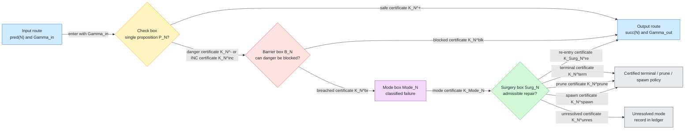

## Node specification template

Use the following template for every execution node.

```text
Node ID:
  Stable DAG identifier, for example PS17 or Current Node 6.

Display name:
  Short mathematical name used in diagrams.

PDE role:
  What PDE question this node answers.
  Name the analytic object being tested: solution sequence, blow-up profile,
  rescaled flow, measure, stress tensor, pressure, boundary trace, frequency
  envelope, Lyapunov functional, compactness witness, or rigidity witness.
  State whether the node is proving an estimate, excluding a pathology,
  certifying compactness, detecting a defect, normalizing a profile, or
  classifying a singularity mechanism.

Position in the DAG:
  Input node(s):
    pred(N), including alternate entries if the node can be reached from more
    than one predecessor.
  Output node:
    succ(N), the default successor after safe, blocked, or repaired outcomes.
  Endpoint route:
    Allowed only if N is the final meaningful node, or if the node emits a
    terminal, prune, or spawn certificate.
  Micro-sieve mode:
    FULL_PASS_AUDIT by default.
    ORDERED_PARTITION only when the classes are explicitly mutually exclusive.

Logical proposition checked:
  P_N :=
    One single yes/no/inc proposition.
  Danger polarity:
    State whether YES means danger or YES means safe.
    In the main integration diagram we use YES danger for singularity checks.
  Atomicity test:
    If the proposition secretly contains independent checks, split the node.
    A node may reference definitions, but it may not bundle unrelated PDE
    decisions into one hidden conjunction.

Inputs:
  Gamma_in:
    Context, hypotheses, prior certificates, normalized variables, scales,
    compactness class, and witness objects available when the node begins.
  Required prior certificates:
    List each certificate from earlier nodes that this node uses.
  Witness data:
    Data the check may inspect, such as bounds, defect measures, profiles,
    traces, spectra, monotonicity quantities, or residuals.

Check box C_N:
  PDE task:
    Explain how the logical proposition P_N is tested in PDE language.
    Name the estimate, compactness argument, identity, monotonicity formula,
    contradiction argument, rigidity theorem, or counterexample witness used.
  Outputs:
    K_N^+:
      Certificate for the safe/affirmative branch, with payload and verifier.
    K_N^-:
      Certificate for the danger/negative branch, with payload and verifier.
    K_N^inc:
      Certificate that the node is incomplete or undecided, including the
      missing hypothesis, unresolved estimate, or insufficient witness.
  Routing:
    Safe route goes to succ(N).
    Danger or INC goes to the barrier box B_N.

Barrier box B_N:
  Trigger:
    Entered only from K_N^- or K_N^inc.
  Barrier proposition Q_N:
    The precise PDE statement that would block the detected danger without
    changing the object being analyzed.
  PDE task:
    Explain the blocking mechanism: a priori estimate, coercivity, exclusion
    theorem, conservation law, compatibility condition, gauge absorption,
    compactness upgrade, or localization argument.
  Outputs:
    K_N^blk:
      Blocked certificate. It records the theorem or estimate that neutralizes
      the danger and the updated context that can be passed to succ(N).
    K_N^br:
      Breach certificate. It records exactly why the barrier failed and which
      singularity mode is now forced.
  Routing:
    K_N^blk routes to succ(N).
    K_N^br routes to Mode_N.

Mode box Mode_N:
  Mode name:
    Canonical singularity or failure label produced by this node.
  PDE interpretation:
    Explain what the breached barrier means analytically: blow-up, loss of
    compactness, concentration, oscillation, boundary failure, symmetry break,
    defect channel, non-rigidity, or residual bad class.
  Output:
    K_Mode_N:
      Mode certificate. It names the mode, records the witness, records the
      failed barrier, and declares the surgery target.
  Routing:
    K_Mode_N routes to Surg_N.

Surgery box Surg_N:
  Repair action:
    The concrete PDE modification or refinement attempted: renormalization,
    profile extraction, gauge change, localization, envelope refinement,
    defect discharge, compactness upgrade, branch split, or child epoch.
  Surgery proposition R_N:
    The precise admissibility statement for the repair.
  Postcondition:
    What must be true after surgery for the run to continue.
  Progress measure:
    A well-founded quantity that decreases or a bounded resource that is
    consumed, so repeated surgery cannot loop without progress.
  Outputs:
    K_Surg_N^re:
      Re-entry certificate. It records the repair, postcondition, progress
      measure, and the successor succ(N).
    K_N^term:
      Terminal certificate. It proves that the run has reached a classified
      terminal singularity.
    K_N^prune:
      Scope-prune certificate. It proves that remaining checks are not
      meaningful for the current object.
    K_N^spawn:
      Child-spawn certificate. It identifies the derived object, child epoch,
      inherited context, and parent-to-child progress measure.
    K_N^unres:
      Unresolved certificate. It records that the mode remains open, together
      with the exact missing theorem, estimate, or construction.
  Routing:
    K_Surg_N^re routes to succ(N).
    K_N^term, K_N^prune, and K_N^spawn route to the certified policy target.
    K_N^unres is recorded in the ledger and does not masquerade as success.

Output context:
  Gamma_out:
    The updated context passed to succ(N).
  Certificate vector update:
    The entry c_N added to the micro-sieve certificate vector.
  Ledger entries:
    Every certificate emitted by the node, including failed attempts, with
    names, payloads, verifier references, and routing decisions.
```

## Rules for filling the template

1. The logical proposition $P_N$ must be a single PDE proposition. If a box
   checks several independent facts, split it into several first-class nodes.
2. The danger polarity must be explicit. For singularity checks, the standard
   convention is that YES means danger.
3. Every node must record its input node(s), default successor, and exceptional
   terminal/prune/spawn routes.
4. Every certificate emitted by the node must be named and explained. The
   certificate description must include payload, verifier, context update, and
   route.
5. The PDE role must be concrete. Do not say only "checks regularity"; say what
   estimate, compactness statement, defect exclusion, normalization, rigidity
   statement, or singularity mechanism is being tested.
6. Barrier boxes block a specific danger; they are not generic recovery boxes.
7. Surgery boxes must state a postcondition and a progress measure.
8. Safe, blocked, and repaired outcomes route to $\operatorname{succ}(N)$.
   Routing to the endpoint is allowed only for the final meaningful node or for
   a certified terminal/prune/spawn exception.
9. The ledger is not a DAG node. It records emitted certificates and failed
   attempts, while the execution node remains the check/barrier/mode/surgery
   package.

---

# 3. Atomized execution nodes in integration order

This catalog follows the same order as the main integration diagram. Current
nodes that are still live in the DAG are written in the same format as the
new PS nodes. Old current nodes whose role is replaced by PS nodes are not
listed as independent execution nodes; their replacement is named in the PS
node title.

## Current Node 1 — EnergyCheck (`D_E`)

**Single check:** Is the height/energy functional bounded on the analysis window?

**Filled node template**

- **PDE role:** This node tests the basic a priori energy/height control for
  the PDE instance before any concentration or profile analysis is meaningful.
  It rules out uncontrolled escape of the energy functional on the time window.
- **DAG position:** Input node is the initial substrate/PDE instance `H0`;
  default output node is Current Node 2 (`Rec_N`).
- **Logical proposition:** $P_{D_E}$: the selected energy or height
  functional is finite and uniformly bounded on the analysis window. YES is
  safe; NO or INC is danger.
- **Inputs:** $\Gamma_{\rm in}$ contains the PDE instance, time window,
  energy functional, admissible class, initial data bounds, and any conserved
  or monotone quantities already available.
- **Check box:** Prove the energy inequality, conservation law, or coercive
  height estimate. Output $K_{D_E}^{+}$ for a verified bound,
  $K_{D_E}^{-}$ for a witnessed energy escape, and $K_{D_E}^{\rm inc}$
  when the estimate or functional domain is incomplete.
- **Barrier box:** `BarrierSat` asks whether saturation, renormalization, or
  drift control blocks the energy escape without changing the main object.
  It emits $K_{D_E}^{\rm blk}$ if the escape is neutralized and
  $K_{D_E}^{\rm br}$ if energy blow-up remains.
- **Mode and surgery boxes:** Mode `C.E` records energy blow-up as a
  concentration/height failure. `SurgEnergySat` renormalizes the energy scale
  or adds a saturation variable and emits $K_{\mathrm{Surg}D_E}^{\rm re}$
  when the repaired context can enter `Rec_N`.
- **Exceptional certificates:** $K_{D_E}^{\rm term}$ records a terminal
  certified energy blow-up, $K_{D_E}^{\rm prune}$ proves later checks are not
  meaningful, $K_{D_E}^{\rm spawn}$ starts a renormalized child epoch, and
  $K_{D_E}^{\rm unres}$ records the missing energy estimate.
- **Output context:** $\Gamma_{\rm out}$ contains the usable energy bound or
  repaired energy scale and the ledger entry $c_{D_E}$.

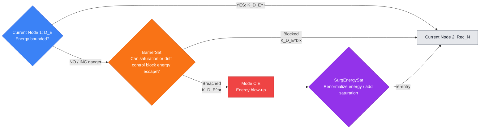

---

## Current Node 2 — ZenoCheck (`Rec_N`)

**Single check:** Are discrete events finite on every bounded analysis interval?

**Filled node template**

- **PDE role:** This node checks that the execution does not accumulate
  infinitely many rescalings, events, or restart times in a bounded interval.
  In PDE terms it prevents a Zeno failure of the analysis clock.
- **DAG position:** Input node is `D_E`; default output node is Current Node 3
  (`C_mu`).
- **Logical proposition:** $P_{\mathrm{Rec}_N}$: the event schedule is
  locally finite on every bounded analysis interval. YES is safe; NO or INC is
  danger.
- **Inputs:** $\Gamma_{\rm in}$ contains the energy-controlled run, event
  times, rescaling triggers, causal ordering, and any lower bounds on event
  separation.
- **Check box:** Prove local finiteness by a separation estimate, causal
  monotonicity, or compactness of admissible restart data. Output
  $K_{\mathrm{Rec}_N}^{+}$, $K_{\mathrm{Rec}_N}^{-}$, or
  $K_{\mathrm{Rec}_N}^{\rm inc}$.
- **Barrier box:** `BarrierCausal` asks whether causal censorship, time
  reparametrization, or event thinning blocks the accumulation. It emits
  $K_{\mathrm{Rec}_N}^{\rm blk}$ or $K_{\mathrm{Rec}_N}^{\rm br}$.
- **Mode and surgery boxes:** Mode `C.C` records event accumulation.
  `SurgCausal` thins the event sequence or compactifies the causal clock and
  emits $K_{\mathrm{Surg}\mathrm{Rec}_N}^{\rm re}$ to enter `C_mu`.
- **Exceptional certificates:** $K_{\mathrm{Rec}_N}^{\rm term}$ closes a
  terminal Zeno singularity, $K_{\mathrm{Rec}_N}^{\rm prune}$ removes
  meaningless downstream checks, $K_{\mathrm{Rec}_N}^{\rm spawn}$ starts a
  child clock, and $K_{\mathrm{Rec}_N}^{\rm unres}$ records the open causal
  finiteness obligation.
- **Output context:** $\Gamma_{\rm out}$ records local event finiteness or
  the repaired event clock and ledger entry $c_{\mathrm{Rec}_N}$.

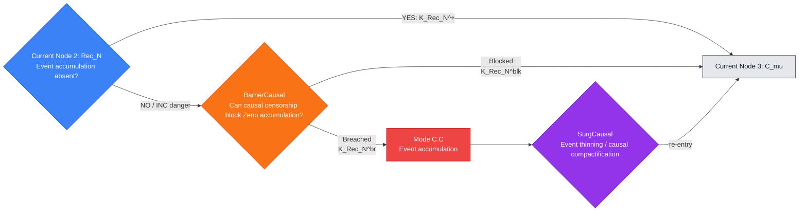

---

## Current Node 3 — CompactCheck (`C_mu`)

**Single check:** Is a certified concentration/profile present?

**Filled node template**

- **PDE role:** This node decides whether the energy-controlled run has a
  certified concentration profile that should enter the profile Sieve. It is
  the bridge from coarse compactness to the atomized bad-profile audit.
- **DAG position:** Input node is `Rec_N`; profile output node is `PS0`.
  A certified benign no-profile branch routes to Current Node 13
  (`Bound_partial`) because the profile micro-sieve is then not meaningful.
- **Logical proposition:** $P_{C_\mu}$: a concentration measure, profile, or
  compactness witness is present and certified. YES enters the profile audit;
  NO or INC invokes the no-profile barrier.
- **Inputs:** $\Gamma_{\rm in}$ contains bounded energy, event finiteness,
  candidate concentration measures, weak limits, profile witnesses, and
  compactness/scattering criteria.
- **Check box:** Apply concentration compactness, tightness of measures, or
  profile extraction to decide whether a nontrivial profile is present. Output
  $K_{C_\mu}^{+}$, $K_{C_\mu}^{-}$, or $K_{C_\mu}^{\rm inc}$.
- **Barrier box:** `BarrierScat` asks whether no-profile behavior is benign,
  scattering, dispersive, or regular. It emits $K_{C_\mu}^{\rm ben}$ or
  $K_{C_\mu}^{\rm blk}$ for a harmless no-profile branch, and
  $K_{C_\mu}^{\rm br}$ for concentration escape.
- **Mode and surgery boxes:** Mode `C.D` records concentration escape.
  `SurgScat` performs profile extraction or scattering repair and emits
  $K_{\mathrm{Surg}C_\mu}^{\rm re}$ to enter `PS0`.
- **Exceptional certificates:** $K_{C_\mu}^{\rm term}$ records a terminal
  compactness singularity, $K_{C_\mu}^{\rm prune}$ declares the profile audit
  inapplicable, $K_{C_\mu}^{\rm spawn}$ starts a child profile extraction,
  and $K_{C_\mu}^{\rm unres}$ records the missing compactness theorem.
- **Output context:** $\Gamma_{\rm out}$ records either the certified profile
  package for `PS0` or the benign no-profile certificate for the boundary/Lock
  route.

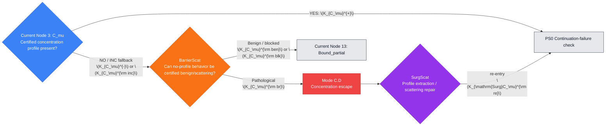

---

## Substituted current nodes 4--12

Current Nodes 4--12 are not repeated as live execution vertices in this
extension. Their roles are atomized into the PS sequence below. This keeps the
DAG fully granular without running an old node and its replacement in parallel.

| Original current node | Replacement in the integrated DAG |
| --- | --- |
| Current Node 4: `SC_lambda` scaling | `PS3`, plus scale audit nodes `PS9`--`PS11` |
| Current Node 5: `SC_partial c` parameters | `PS4` |
| Current Node 6: `Cap_H` capacity | `PS17` |
| Current Node 7: `LS_sigma` stiffness | `PS25`--`PS28` restoration subtree plus `PS29` |
| Current Node 8: `TB_pi` topological sector | `PS7` |
| Current Node 9: `TB_O` tameness/complement | `PS34` |
| Current Node 10: `TB_rho` recurrence / compact orbit | `PS13` |
| Current Node 11: `RepDesc_K` finite description | `PS35` |
| Current Node 12: `GC_nabla` oscillation / defect | `PS30` |

---

## PS0 — Continuation-failure check

**Single check:** Does failure of the continuation criterion imply a bad event?

**Filled node template**

- **PDE role:** This node connects the PDE continuation criterion to the Sieve:
  if a solution cannot be continued, the failure must produce a mathematically
  named bad event rather than an undefined stop.
- **DAG position:** Input node is `C_mu`; default output node is `PS1`.
- **Logical proposition:** $P_{\mathrm{PS0}}$: failure of the selected
  continuation criterion implies a certified bad event in the profile context.
  YES is the safe bridge; NO or INC is danger.
- **Inputs:** $\Gamma_{\rm in}$ contains the candidate maximal solution,
  continuation norm, blow-up time/window, and the profile witness from
  `C_mu`.
- **Check box:** Prove the continuation theorem or contrapositive blow-up
  criterion. Output $K_{\mathrm{PS0}}^{+}$, $K_{\mathrm{PS0}}^{-}$, or
  $K_{\mathrm{PS0}}^{\rm inc}$.
- **Barrier box:** `Barrier_PS0` asks whether an alternate continuation
  theorem, weaker solution class, or localized criterion supplies the missing
  bridge. It emits $K_{\mathrm{PS0}}^{\rm blk}$ or
  $K_{\mathrm{PS0}}^{\rm br}$.
- **Mode and surgery boxes:** Mode `WP` records continuation bridge failure.
  `Surg_PS0` refines the solution class or continuation criterion and emits
  $K_{\mathrm{SurgPS0}}^{\rm re}$ to enter `PS1`.
- **Exceptional certificates:** $K_{\mathrm{PS0}}^{\rm term}$ closes a
  terminal well-posedness obstruction, $K_{\mathrm{PS0}}^{\rm prune}$ removes
  downstream profile checks, $K_{\mathrm{PS0}}^{\rm spawn}$ starts a child
  continuation problem, and $K_{\mathrm{PS0}}^{\rm unres}$ records the
  missing continuation theorem.
- **Output context:** $\Gamma_{\rm out}$ records the bad-event certificate
  and the ledger entry $c_{\mathrm{PS0}}$.

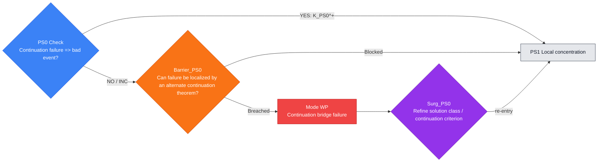

---

## PS1 — Local concentration check

**Single check:** Does the bad event produce a localized critical concentration?

**Filled node template**

- **PDE role:** This node turns an abstract bad event into localized critical
  concentration, the PDE object that can be centered, rescaled, and analyzed.
- **DAG position:** Input node is `PS0`; default output node is `PS2`.
- **Logical proposition:** $P_{\mathrm{PS1}}$: the bad event produces a
  localized concentration at the critical scale or critical norm. YES is the
  safe extraction; NO or INC is danger.
- **Inputs:** $\Gamma_{\rm in}$ contains the bad-event certificate,
  localization windows, critical norm or energy density, and candidate
  concentration measures.
- **Check box:** Use concentration compactness, inverse estimates, or epsilon
  regularity contrapositions to locate critical concentration. Output
  $K_{\mathrm{PS1}}^{+}$, $K_{\mathrm{PS1}}^{-}$, or
  $K_{\mathrm{PS1}}^{\rm inc}$.
- **Barrier box:** `Barrier_PS1` asks whether no-concentration implies
  scattering, dispersion, or regularity. It emits $K_{\mathrm{PS1}}^{\rm blk}$
  or $K_{\mathrm{PS1}}^{\rm br}$.
- **Mode and surgery boxes:** Mode `C.D` records a concentration-defect
  failure. `Surg_PS1` performs concentration-compactness extraction and emits
  $K_{\mathrm{SurgPS1}}^{\rm re}$ to enter `PS2`.
- **Exceptional certificates:** $K_{\mathrm{PS1}}^{\rm term}$ records a
  terminal concentration obstruction, $K_{\mathrm{PS1}}^{\rm prune}$ proves
  profile localization is meaningless, $K_{\mathrm{PS1}}^{\rm spawn}$ opens a
  child extraction, and $K_{\mathrm{PS1}}^{\rm unres}$ records the missing
  inverse/localization estimate.
- **Output context:** $\Gamma_{\rm out}$ contains the localized critical
  concentration witness and ledger entry $c_{\mathrm{PS1}}$.

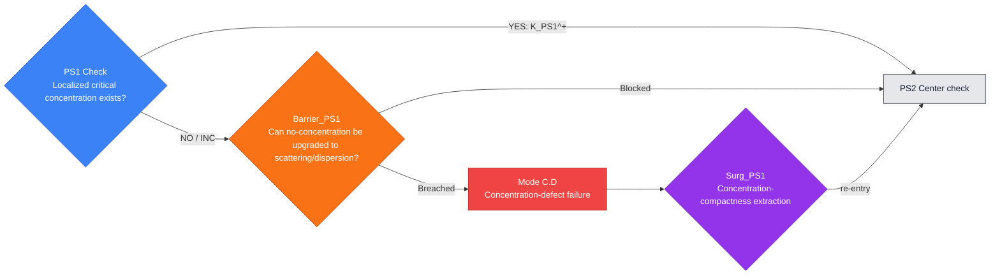

---

## PS2 — Center check

**Single check:** Is a concentration center selected?

**Filled node template**

- **PDE role:** This node selects the spatial or spacetime center of the active
  concentration so later nodes can work in a fixed moving frame.
- **DAG position:** Input node is `PS1`; default output node is `PS3`.
- **Logical proposition:** $P_{\mathrm{PS2}}$: there exists a certified
  concentration center $z_n$ for the active window. YES is safe; NO or INC is
  danger.
- **Inputs:** $\Gamma_{\rm in}$ contains the localized concentration measure,
  active window, candidate centers, barycenters, and localization radii.
- **Check box:** Select a center by maximal density, barycenter, active camera,
  or compactness of concentration supports. Output $K_{\mathrm{PS2}}^{+}$,
  $K_{\mathrm{PS2}}^{-}$, or $K_{\mathrm{PS2}}^{\rm inc}$.
- **Barrier box:** `Barrier_PS2` asks whether barycenter selection or
  active-window recentering recovers a center. It emits
  $K_{\mathrm{PS2}}^{\rm blk}$ or $K_{\mathrm{PS2}}^{\rm br}$.
- **Mode and surgery boxes:** Mode `C.D-center` records center escape.
  `Surg_PS2` recenters by an active concentration window and emits
  $K_{\mathrm{SurgPS2}}^{\rm re}$ to enter `PS3`.
- **Exceptional certificates:** $K_{\mathrm{PS2}}^{\rm term}$ closes a
  terminal center-escape singularity, $K_{\mathrm{PS2}}^{\rm prune}$ proves
  centering is inapplicable, $K_{\mathrm{PS2}}^{\rm spawn}$ starts a child
  camera, and $K_{\mathrm{PS2}}^{\rm unres}$ records the missing centering
  theorem.
- **Output context:** $\Gamma_{\rm out}$ records $z_n$, the recentered
  variables, and ledger entry $c_{\mathrm{PS2}}$.

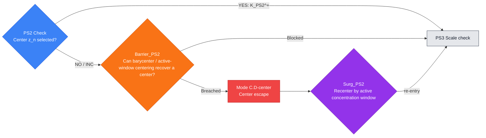

---

## PS3 — Scale check

**Single check:** Is a concentration scale selected?

**Filled node template**

- **PDE role:** This node selects the active concentration scale so the profile
  can be renormalized. It replaces the old coarse scaling node with an atomic
  scale-selection proposition.
- **DAG position:** Input node is `PS2`; default output node is `PS4`.
- **Logical proposition:** $P_{\mathrm{PS3}}$: there exists a certified
  concentration scale $\lambda_n$ for the active center/window. YES is safe;
  NO or INC is danger.
- **Inputs:** $\Gamma_{\rm in}$ contains the center, concentration density,
  critical thresholds, dyadic windows, and scaling law of the PDE.
- **Check box:** Select $\lambda_n$ by threshold crossing, critical mass
  capture, parabolic scaling, or frequency localization. Output
  $K_{\mathrm{PS3}}^{+}$, $K_{\mathrm{PS3}}^{-}$, or
  $K_{\mathrm{PS3}}^{\rm inc}$.
- **Barrier box:** `Barrier_PS3` asks whether dyadic refinement or threshold
  reselection supplies the missing scale. It emits
  $K_{\mathrm{PS3}}^{\rm blk}$ or $K_{\mathrm{PS3}}^{\rm br}$.
- **Mode and surgery boxes:** Mode `S.E-scale` records scale-selection
  failure. `Surg_PS3` performs threshold reselection or dyadic refinement and
  emits $K_{\mathrm{SurgPS3}}^{\rm re}$ to enter `PS4`.
- **Exceptional certificates:** $K_{\mathrm{PS3}}^{\rm term}$ closes a
  terminal scale singularity, $K_{\mathrm{PS3}}^{\rm prune}$ proves scaling
  is not meaningful, $K_{\mathrm{PS3}}^{\rm spawn}$ starts a child scale
  epoch, and $K_{\mathrm{PS3}}^{\rm unres}$ records the missing scale
  selection estimate.
- **Output context:** $\Gamma_{\rm out}$ records $\lambda_n$, normalized
  coordinates, and ledger entry $c_{\mathrm{PS3}}$.

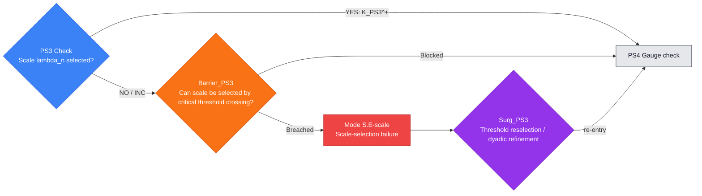

---

## PS4 — Gauge check

**Single check:** Is the symmetry/gauge fixed?

**Filled node template**

- **PDE role:** This node fixes modulation, phase, Galilean, translation,
  pressure, or other gauge freedoms so that the normalized profile is not
  drifting in a symmetry direction.
- **DAG position:** Input node is `PS3`; default output node is `PS5`.
- **Logical proposition:** $P_{\mathrm{PS4}}$: a canonical gauge or
  modulation slice is fixed for the normalized profile. YES is safe; NO or INC
  is danger.
- **Inputs:** $\Gamma_{\rm in}$ contains the center, scale, symmetry group,
  modulation parameters, orthogonality conditions, and quotient variables.
- **Check box:** Prove a slice theorem, modulation lemma, pressure gauge
  normalization, or orthogonality condition. Output $K_{\mathrm{PS4}}^{+}$,
  $K_{\mathrm{PS4}}^{-}$, or $K_{\mathrm{PS4}}^{\rm inc}$.
- **Barrier box:** `Barrier_PS4` asks whether slice refinement or quotienting
  by symmetry fixes the gauge drift. It emits $K_{\mathrm{PS4}}^{\rm blk}$
  or $K_{\mathrm{PS4}}^{\rm br}$.
- **Mode and surgery boxes:** Mode `G.D` records gauge drift. `Surg_PS4`
  imposes a canonical slice or symmetry quotient and emits
  $K_{\mathrm{SurgPS4}}^{\rm re}$ to enter `PS5`.
- **Exceptional certificates:** $K_{\mathrm{PS4}}^{\rm term}$ records a
  terminal gauge obstruction, $K_{\mathrm{PS4}}^{\rm prune}$ proves gauge
  fixing is irrelevant, $K_{\mathrm{PS4}}^{\rm spawn}$ starts a quotient
  child problem, and $K_{\mathrm{PS4}}^{\rm unres}$ records the missing slice
  theorem.
- **Output context:** $\Gamma_{\rm out}$ records the gauge-fixed variables
  and ledger entry $c_{\mathrm{PS4}}$.

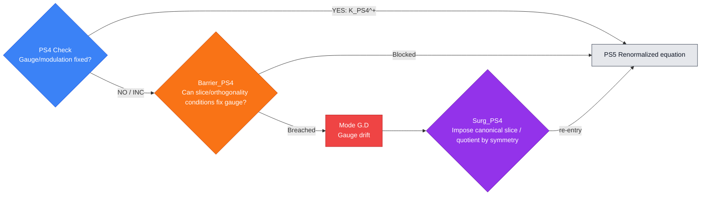

---

## PS5 — Renormalized-equation check

**Single check:** Does the normalized sequence satisfy a closed renormalized equation?

**Filled node template**

- **PDE role:** This node checks that the centered, scaled, gauge-fixed
  sequence still satisfies a closed PDE rather than an equation with hidden
  forcing, pressure, or defect terms.
- **DAG position:** Input node is `PS4`; default output node is `PS6`.
- **Logical proposition:** $P_{\mathrm{PS5}}$: the normalized sequence obeys
  a closed renormalized equation in the declared variables. YES is safe; NO or
  INC is danger.
- **Inputs:** $\Gamma_{\rm in}$ contains normalized variables, scaling
  identities, transformed operators, pressure/gauge terms, and weak-form
  residuals.
- **Check box:** Derive the renormalized PDE and verify closure of all
  transformed terms. Output $K_{\mathrm{PS5}}^{+}$,
  $K_{\mathrm{PS5}}^{-}$, or $K_{\mathrm{PS5}}^{\rm inc}$.
- **Barrier box:** `Barrier_PS5` asks whether missing terms can be absorbed
  into gauge, pressure, commutator, or declared defect variables. It emits
  $K_{\mathrm{PS5}}^{\rm blk}$ or $K_{\mathrm{PS5}}^{\rm br}$.
- **Mode and surgery boxes:** Mode `D.F` records a renormalized-equation
  defect. `Surg_PS5` adds defect variables or repairs the gauge and emits
  $K_{\mathrm{SurgPS5}}^{\rm re}$ to enter `PS6`.
- **Exceptional certificates:** $K_{\mathrm{PS5}}^{\rm term}$ records a
  terminal equation-closure failure, $K_{\mathrm{PS5}}^{\rm prune}$ proves no
  closed profile equation should be asked, $K_{\mathrm{PS5}}^{\rm spawn}$
  starts a child equation with extra variables, and $K_{\mathrm{PS5}}^{\rm unres}$
  records the missing transformation identity.
- **Output context:** $\Gamma_{\rm out}$ records the closed renormalized PDE
  and ledger entry $c_{\mathrm{PS5}}$.

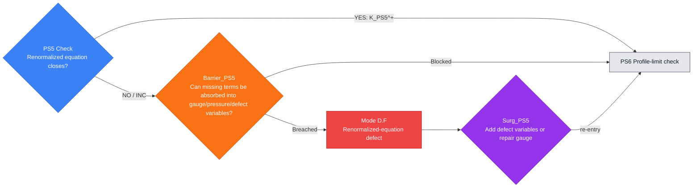

---

## PS6 — Profile-limit check

**Single check:** Does the normalized sequence have a subsequential limit?

**Filled node template**

- **PDE role:** This node extracts a subsequential profile limit from the
  normalized sequence. It is the compactness step that turns a bad sequence
  into an object that can be classified.
- **DAG position:** Input node is `PS5`; default output node is `PS7`.
- **Logical proposition:** $P_{\mathrm{PS6}}$: the normalized sequence has a
  subsequential limit in the declared topology. YES is safe; NO or INC is
  danger.
- **Inputs:** $\Gamma_{\rm in}$ contains uniform bounds, closed renormalized
  equation, compactness topology, symmetry quotient, and possible defect
  measures.
- **Check box:** Apply Rellich compactness, Aubin-Lions, concentration
  compactness, weak compactness, or profile decomposition. Output
  $K_{\mathrm{PS6}}^{+}$, $K_{\mathrm{PS6}}^{-}$, or
  $K_{\mathrm{PS6}}^{\rm inc}$.
- **Barrier box:** `Barrier_PS6` asks whether compactness can be recovered
  modulo symmetry or by extracting defect measures. It emits
  $K_{\mathrm{PS6}}^{\rm blk}$ or $K_{\mathrm{PS6}}^{\rm br}$.
- **Mode and surgery boxes:** Mode `C_mu-rough` records compactness failure.
  `Surg_PS6` performs profile decomposition or defect-measure extraction and
  emits $K_{\mathrm{SurgPS6}}^{\rm re}$ to enter `PS7`.
- **Exceptional certificates:** $K_{\mathrm{PS6}}^{\rm term}$ records a
  terminal compactness obstruction, $K_{\mathrm{PS6}}^{\rm prune}$ proves no
  limit object is meaningful, $K_{\mathrm{PS6}}^{\rm spawn}$ opens a child
  profile, and $K_{\mathrm{PS6}}^{\rm unres}$ records the missing compactness
  theorem.
- **Output context:** $\Gamma_{\rm out}$ records the profile limit, topology,
  convergence certificates, and ledger entry $c_{\mathrm{PS6}}$.

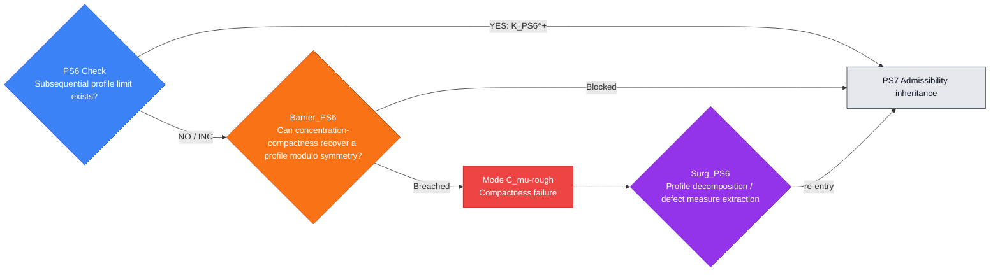

---

## PS7 — Admissibility-inheritance check

**Single check:** Does the limit inherit the admissible solution class?

**Filled node template**

- **PDE role:** This node verifies that the extracted limit remains in the
  admissible PDE class: suitable, entropy, Leray, viscosity, weak, or another
  declared class appropriate to the problem.
- **DAG position:** Input node is `PS6`; default output node is `PS8`.
- **Logical proposition:** $P_{\mathrm{PS7}}$: the profile limit inherits the
  declared admissibility conditions. YES is safe; NO or INC is danger.
- **Inputs:** $\Gamma_{\rm in}$ contains the profile limit, convergence mode,
  energy/entropy inequalities, boundary or sector conditions, and weak-form
  identities.
- **Check box:** Pass inequalities, local energy conditions, entropy
  inequalities, sector constraints, and weak formulations to the limit. Output
  $K_{\mathrm{PS7}}^{+}$, $K_{\mathrm{PS7}}^{-}$, or
  $K_{\mathrm{PS7}}^{\rm inc}$.
- **Barrier box:** `Barrier_PS7` asks whether admissibility can be restored by
  a weak, renormalized, entropy, viscosity, or suitable formulation. It emits
  $K_{\mathrm{PS7}}^{\rm blk}$ or $K_{\mathrm{PS7}}^{\rm br}$.
- **Mode and surgery boxes:** Mode `A.D` records an admissibility defect.
  `Surg_PS7` passes to the correct admissible solution class and emits
  $K_{\mathrm{SurgPS7}}^{\rm re}$ to enter `PS8`.
- **Exceptional certificates:** $K_{\mathrm{PS7}}^{\rm term}$ records a
  terminal inadmissible profile, $K_{\mathrm{PS7}}^{\rm prune}$ proves the
  class condition is not meaningful, $K_{\mathrm{PS7}}^{\rm spawn}$ starts a
  child admissibility problem, and $K_{\mathrm{PS7}}^{\rm unres}$ records the
  missing lower-semicontinuity or passage-to-limit theorem.
- **Output context:** $\Gamma_{\rm out}$ records the admissible profile class
  and ledger entry $c_{\mathrm{PS7}}$.

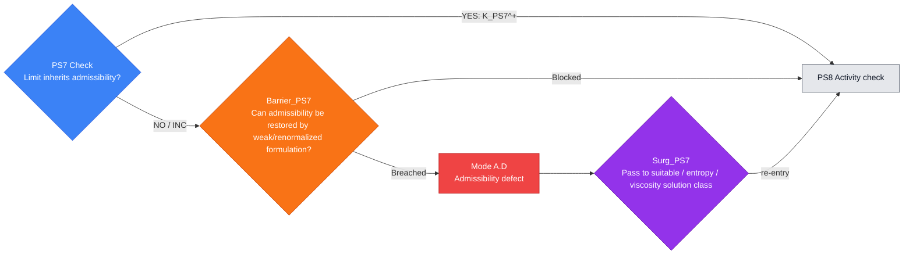

---

## PS8 — Activity check

**Single check:** Is the extracted profile nontrivial or active?

**Filled node template**

- **PDE role:** This node checks that the extracted profile carries nonzero
  activity, critical norm, energy, enstrophy, or another problem-specific
  quantity. It prevents the audit from classifying a vanishing artifact.
- **DAG position:** Input node is `PS7`; default output node is `PS9`.
- **Logical proposition:** $P_{\mathrm{PS8}}$: the extracted profile is
  nontrivial or active in the declared critical quantity. YES is safe; NO or
  INC is danger.
- **Inputs:** $\Gamma_{\rm in}$ contains the admissible profile, activity
  functional, critical threshold, normalization, and nonvanishing witness.
- **Check box:** Prove nonvanishing by normalization, lower semicontinuity, or
  active-window mass capture. Output $K_{\mathrm{PS8}}^{+}$,
  $K_{\mathrm{PS8}}^{-}$, or $K_{\mathrm{PS8}}^{\rm inc}$.
- **Barrier box:** `Barrier_PS8` asks whether vanishing implies regularity,
  scattering, or harmless dispersion. It emits $K_{\mathrm{PS8}}^{\rm blk}$
  or $K_{\mathrm{PS8}}^{\rm br}$.
- **Mode and surgery boxes:** Mode `C.V` records vanishing extraction.
  `Surg_PS8` reselects the active scale/window and emits
  $K_{\mathrm{SurgPS8}}^{\rm re}$ to enter `PS9`.
- **Exceptional certificates:** $K_{\mathrm{PS8}}^{\rm term}$ records a
  terminal vanishing contradiction, $K_{\mathrm{PS8}}^{\rm prune}$ proves
  activity is inapplicable, $K_{\mathrm{PS8}}^{\rm spawn}$ starts a child
  active-window extraction, and $K_{\mathrm{PS8}}^{\rm unres}$ records the
  missing nonvanishing estimate.
- **Output context:** $\Gamma_{\rm out}$ records the active profile and
  ledger entry $c_{\mathrm{PS8}}$.


---

# 4. Scale-law nodes

## PS9 — Type I check

**Single check:** Is the active profile Type I?

**Filled node template**

- **PDE role:** This node audits whether the active profile has Type I scaling
  behavior, meaning the blow-up or concentration rate is controlled by the
  natural dimensional rate of the PDE.
- **DAG position:** Input node is `PS8`; default output node is `PS10`.
- **Logical proposition:** $P_{\mathrm{PS9}}$: the active profile satisfies
  the declared Type I rate bound. YES or INC is a classified danger branch for
  the audit; NO records absence and proceeds.
- **Inputs:** $\Gamma_{\rm in}$ contains the active profile, scale
  $\lambda_n$, critical norm, rate functional, and Type I threshold.
- **Check box:** Compare the profile against the natural scaling rate using
  rate envelopes, monotonicity quantities, or blow-up criteria. Output
  $K_{\mathrm{PS9}}^{+}$, $K_{\mathrm{PS9}}^{-}$, or
  $K_{\mathrm{PS9}}^{\rm inc}$.
- **Barrier box:** `Barrier_PS9` asks whether the Type I branch can be excluded
  by a Type I regularity, rigidity, or refinement theorem. It emits
  $K_{\mathrm{PS9}}^{\rm blk}$ or $K_{\mathrm{PS9}}^{\rm br}$.
- **Mode and surgery boxes:** Mode `S.E-I` records a Type I rate branch not
  yet excluded by regularity or rigidity. `Surg_PS9` refines the rate envelope
  and emits
  $K_{\mathrm{SurgPS9}}^{\rm re}$ to enter `PS10`.
- **Exceptional certificates:** $K_{\mathrm{PS9}}^{\rm term}$ records a
  terminal Type I singularity, $K_{\mathrm{PS9}}^{\rm prune}$ proves later
  scale-law checks are meaningless, $K_{\mathrm{PS9}}^{\rm spawn}$ starts a
  child rate analysis, and $K_{\mathrm{PS9}}^{\rm unres}$ records the missing
  Type I theorem.
- **Output context:** $\Gamma_{\rm out}$ records the Type I absent/blocked/
  repaired status and ledger entry $c_{\mathrm{PS9}}$.

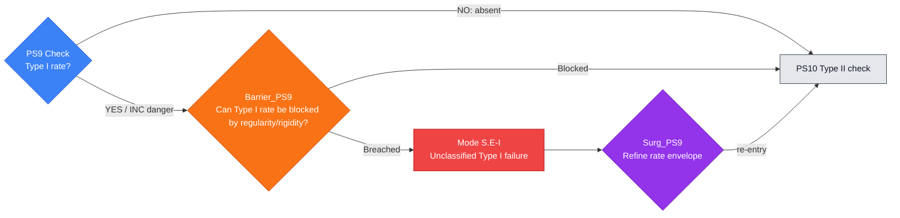

---

## PS10 — Type II check

**Single check:** Is the active profile Type II?

**Filled node template**

- **PDE role:** This node audits whether the profile concentrates at a rate
  stronger or less dimensionally controlled than Type I, i.e. a Type II
  mechanism.
- **DAG position:** Input node is `PS9`; default output node is `PS11`.
- **Logical proposition:** $P_{\mathrm{PS10}}$: the active profile satisfies
  the declared Type II rate condition. YES or INC is danger; NO records absence.
- **Inputs:** $\Gamma_{\rm in}$ contains the active profile, Type I status,
  refined scale law, critical norm, and supercritical/subcritical rate
  witnesses.
- **Check box:** Test the profile against Type II rate envelopes, modulation
  equations, or critical norm concentration. Output $K_{\mathrm{PS10}}^{+}$,
  $K_{\mathrm{PS10}}^{-}$, or $K_{\mathrm{PS10}}^{\rm inc}$.
- **Barrier box:** `Barrier_PS10` asks whether a Type II exclusion, rigidity,
  compactness, or rate-improvement theorem blocks the branch. It emits
  $K_{\mathrm{PS10}}^{\rm blk}$ or $K_{\mathrm{PS10}}^{\rm br}$.
- **Mode and surgery boxes:** Mode `S.E-II` records a Type II rate branch not
  yet controlled by compactness or rigidity. `Surg_PS10` performs renormalized
  rate extraction and emits
  $K_{\mathrm{SurgPS10}}^{\rm re}$ to enter `PS11`.
- **Exceptional certificates:** $K_{\mathrm{PS10}}^{\rm term}$ records a
  terminal Type II singularity, $K_{\mathrm{PS10}}^{\rm prune}$ prunes
  later scale checks, $K_{\mathrm{PS10}}^{\rm spawn}$ starts a child rate
  epoch, and $K_{\mathrm{PS10}}^{\rm unres}$ records the missing Type II
  classification theorem.
- **Output context:** $\Gamma_{\rm out}$ records the Type II certificate
  status and ledger entry $c_{\mathrm{PS10}}$.

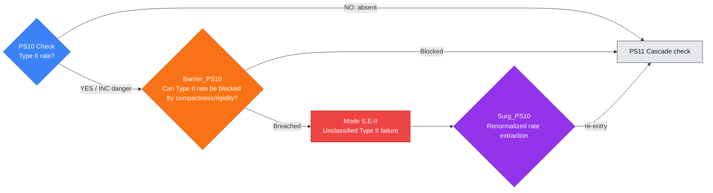

---

## PS11 — Scale-cascade check

**Single check:** Is there an infinite scale cascade?

**Filled node template**

- **PDE role:** This node audits whether the active profile decomposes through
  infinitely many scales rather than a finite or single-scale structure.
- **DAG position:** Input node is `PS10`; default output node is `PS12`.
- **Logical proposition:** $P_{\mathrm{PS11}}$: the profile has an infinite
  scale cascade. YES or INC is danger; NO records absence.
- **Inputs:** $\Gamma_{\rm in}$ contains the scale sequence, frequency
  envelopes, profile packets, orthogonality data, and previous Type I/II
  status.
- **Check box:** Test for infinitely many active scales using profile
  decomposition, scale orthogonality, envelope mass, or bubble-tree criteria.
  Output $K_{\mathrm{PS11}}^{+}$, $K_{\mathrm{PS11}}^{-}$, or
  $K_{\mathrm{PS11}}^{\rm inc}$.
- **Barrier box:** `Barrier_PS11` asks whether scale separation, finite
  energy, monotonicity, or envelope summability excludes the cascade. It emits
  $K_{\mathrm{PS11}}^{\rm blk}$ or $K_{\mathrm{PS11}}^{\rm br}$.
- **Mode and surgery boxes:** Mode `S.E-cascade` records scale-library
  incompleteness. `Surg_PS11` stratifies scale space and emits
  $K_{\mathrm{SurgPS11}}^{\rm re}$ to enter `PS12`.
- **Exceptional certificates:** $K_{\mathrm{PS11}}^{\rm term}$ records a
  terminal scale-cascade singularity, $K_{\mathrm{PS11}}^{\rm prune}$ prunes
  orbit checks, $K_{\mathrm{PS11}}^{\rm spawn}$ starts a child scale branch,
  and $K_{\mathrm{PS11}}^{\rm unres}$ records the missing cascade compactness
  theorem.
- **Output context:** $\Gamma_{\rm out}$ records the scale-cascade status and
  ledger entry $c_{\mathrm{PS11}}$.

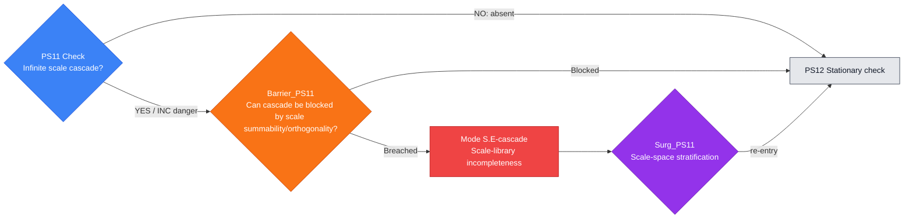

---

# 5. Orbit-type nodes

## PS12 — Stationary check

**Single check:** Is the profile stationary in renormalized time?

**Filled node template**

- **PDE role:** This node audits whether the renormalized profile is stationary
  in the rescaled time variable, reducing the branch to an elliptic or steady
  PDE classification problem.
- **DAG position:** Input node is `PS11`; default output node is `PS13`.
- **Logical proposition:** $P_{\mathrm{PS12}}$: the renormalized profile is
  stationary. YES or INC is danger; NO records absence.
- **Inputs:** $\Gamma_{\rm in}$ contains the renormalized equation, profile
  trajectory, time-derivative estimates, and steady-state residual.
- **Check box:** Test stationarity by vanishing renormalized time derivative,
  invariance of the hull, or equality to a steady solution. Output
  $K_{\mathrm{PS12}}^{+}$, $K_{\mathrm{PS12}}^{-}$, or
  $K_{\mathrm{PS12}}^{\rm inc}$.
- **Barrier box:** `Barrier_PS12` asks whether stationary profiles are excluded
  or repaired by Liouville, Pohozaev, elliptic regularity, or steady rigidity
  theorems. It emits $K_{\mathrm{PS12}}^{\rm blk}$ or
  $K_{\mathrm{PS12}}^{\rm br}$.
- **Mode and surgery boxes:** Mode `T.D-stat` records a stationary profile not
  yet ruled out by Liouville, Pohozaev, or steady rigidity. `Surg_PS12` takes a
  time-translation hull and emits
  $K_{\mathrm{SurgPS12}}^{\rm re}$ to enter `PS13`.
- **Exceptional certificates:** $K_{\mathrm{PS12}}^{\rm term}$ records a
  terminal stationary singularity, $K_{\mathrm{PS12}}^{\rm prune}$ prunes
  later orbit checks, $K_{\mathrm{PS12}}^{\rm spawn}$ opens a steady child
  problem, and $K_{\mathrm{PS12}}^{\rm unres}$ records the missing stationary
  rigidity theorem.
- **Output context:** $\Gamma_{\rm out}$ records stationarity status and
  ledger entry $c_{\mathrm{PS12}}$.

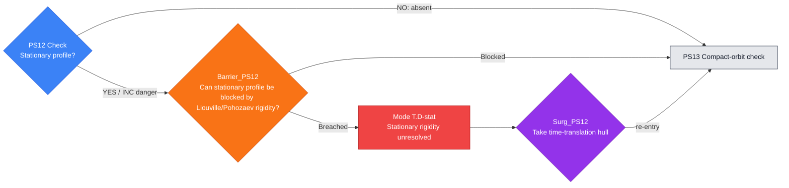

---

## PS13 — Compact-orbit check

**Single check:** Is the time-translation orbit precompact?

**Filled node template**

- **PDE role:** This node audits whether the profile trajectory is precompact
  under time translation, the compact ancient-solution scenario used in many
  rigidity arguments.
- **DAG position:** Input node is `PS12`; default output node is `PS14`.
- **Logical proposition:** $P_{\mathrm{PS13}}$: the time-translation orbit of
  the profile is precompact in the declared topology. YES or INC is danger; NO
  records absence.
- **Inputs:** $\Gamma_{\rm in}$ contains the profile trajectory,
  renormalized equation, topology, compactness modulus, and recurrence
  witnesses.
- **Check box:** Test precompactness using hull compactness, asymptotic
  compactness, invariant-measure compactness, or recurrence estimates. Output
  $K_{\mathrm{PS13}}^{+}$, $K_{\mathrm{PS13}}^{-}$, or
  $K_{\mathrm{PS13}}^{\rm inc}$.
- **Barrier box:** `Barrier_PS13` asks whether compact orbits are excluded by
  rigidity, monotonicity, or invariant-measure arguments. It emits
  $K_{\mathrm{PS13}}^{\rm blk}$ or $K_{\mathrm{PS13}}^{\rm br}$.
- **Mode and surgery boxes:** Mode `T.D-orbit` records orbit compactness
  failure. `Surg_PS13` extracts an invariant hull and emits
  $K_{\mathrm{SurgPS13}}^{\rm re}$ to enter `PS14`.
- **Exceptional certificates:** $K_{\mathrm{PS13}}^{\rm term}$ records a
  terminal compact-orbit branch, $K_{\mathrm{PS13}}^{\rm prune}$ prunes
  later orbit checks, $K_{\mathrm{PS13}}^{\rm spawn}$ starts a hull child
  problem, and $K_{\mathrm{PS13}}^{\rm unres}$ records the missing orbit
  compactness theorem.
- **Output context:** $\Gamma_{\rm out}$ records compact-orbit status and
  ledger entry $c_{\mathrm{PS13}}$.

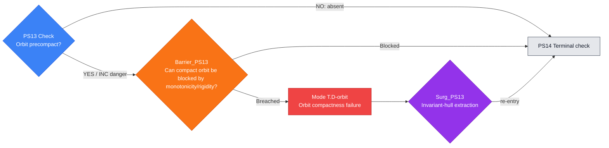

---

## PS14 — Terminal check

**Single check:** Is the profile terminal or heteroclinic?

**Filled node template**

- **PDE role:** This node audits whether the profile is terminal,
  heteroclinic, or asymptotically connects distinguished invariant objects.
- **DAG position:** Input node is `PS13`; default output node is `PS15`.
- **Logical proposition:** $P_{\mathrm{PS14}}$: the profile is terminal or
  heteroclinic in renormalized time. YES or INC is danger; NO records absence.
- **Inputs:** $\Gamma_{\rm in}$ contains the orbit/hull, alpha- and
  omega-limit candidates, Lyapunov data, and time-shift limits.
- **Check box:** Test for terminal or heteroclinic behavior by time-shift
  compactness, invariant-set analysis, and limiting profiles. Output
  $K_{\mathrm{PS14}}^{+}$, $K_{\mathrm{PS14}}^{-}$, or
  $K_{\mathrm{PS14}}^{\rm inc}$.
- **Barrier box:** `Barrier_PS14` asks whether terminal branches are excluded
  by rigidity, monotonicity, or endpoint classification. It emits
  $K_{\mathrm{PS14}}^{\rm blk}$ or $K_{\mathrm{PS14}}^{\rm br}$.
- **Mode and surgery boxes:** Mode `T.D-terminal` records terminal-orbit
  failure. `Surg_PS14` extracts terminal objects by time shifts and emits
  $K_{\mathrm{SurgPS14}}^{\rm re}$ to enter `PS15`.
- **Exceptional certificates:** $K_{\mathrm{PS14}}^{\rm term}$ records a
  certified terminal orbit, $K_{\mathrm{PS14}}^{\rm prune}$ prunes later
  localization checks, $K_{\mathrm{PS14}}^{\rm spawn}$ starts a terminal
  child problem, and $K_{\mathrm{PS14}}^{\rm unres}$ records the missing
  heteroclinic classification.
- **Output context:** $\Gamma_{\rm out}$ records terminal/heteroclinic status
  and ledger entry $c_{\mathrm{PS14}}$.

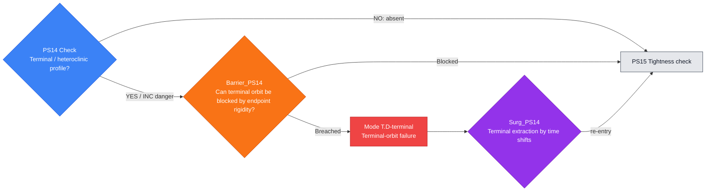

---

# 6. Localization nodes

## PS15 — Tightness check

**Single check:** Is the active mass tight?

**Filled node template**

- **PDE role:** This node audits whether the active quantity remains spatially
  tight instead of leaking to infinity. Tightness is a localization branch that
  must be certified or excluded.
- **DAG position:** Input node is `PS14`; default output node is `PS16`.
- **Logical proposition:** $P_{\mathrm{PS15}}$: the active mass, energy, or
  critical density is tight in the selected frame. YES or INC is danger for
  this branch audit; NO records absence.
- **Inputs:** $\Gamma_{\rm in}$ contains active densities, localization
  radii, tail bounds, center/scale data, and compactness topology.
- **Check box:** Test tightness by tail estimates, concentration functions, or
  compactness of localized measures. Output $K_{\mathrm{PS15}}^{+}$,
  $K_{\mathrm{PS15}}^{-}$, or $K_{\mathrm{PS15}}^{\rm inc}$.
- **Barrier box:** `Barrier_PS15` asks whether the tight branch is excluded or
  repaired by tail decomposition, virial/Morawetz estimates, or localization
  upgrades. It emits $K_{\mathrm{PS15}}^{\rm blk}$ or
  $K_{\mathrm{PS15}}^{\rm br}$.
- **Mode and surgery boxes:** Mode `C.D-tight` records tightness failure.
  `Surg_PS15` performs tail decomposition and emits
  $K_{\mathrm{SurgPS15}}^{\rm re}$ to enter `PS16`.
- **Exceptional certificates:** $K_{\mathrm{PS15}}^{\rm term}$ records a
  terminal tight localized singularity, $K_{\mathrm{PS15}}^{\rm prune}$
  prunes localization checks, $K_{\mathrm{PS15}}^{\rm spawn}$ starts a child
  tail problem, and $K_{\mathrm{PS15}}^{\rm unres}$ records the missing tail
  estimate.
- **Output context:** $\Gamma_{\rm out}$ records tightness status and ledger
  entry $c_{\mathrm{PS15}}$.

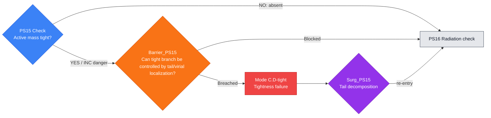

---

## PS16 — Radiation check

**Single check:** Is there radiative tail mass?

**Filled node template**

- **PDE role:** This node audits whether energy or critical mass escapes as a
  radiative tail, a dispersive component that can coexist with a core.
- **DAG position:** Input node is `PS15`; default output node is `PS17`.
- **Logical proposition:** $P_{\mathrm{PS16}}$: the profile has radiative
  tail mass. YES or INC is danger; NO records absence.
- **Inputs:** $\Gamma_{\rm in}$ contains tail measures, radiation profiles,
  dispersive norms, flux identities, and localization complements.
- **Check box:** Test radiative tails by channel-of-energy, flux, scattering,
  or dispersive estimates. Output $K_{\mathrm{PS16}}^{+}$,
  $K_{\mathrm{PS16}}^{-}$, or $K_{\mathrm{PS16}}^{\rm inc}$.
- **Barrier box:** `Barrier_PS16` asks whether radiation is excluded, absorbed,
  or separated by radiation estimates or profile extraction. It emits
  $K_{\mathrm{PS16}}^{\rm blk}$ or $K_{\mathrm{PS16}}^{\rm br}$.
- **Mode and surgery boxes:** Mode `D.E-rad` records a radiative tail not yet
  separated by flux, channel-of-energy, or scattering estimates. `Surg_PS16`
  extracts the radiation profile and emits
  $K_{\mathrm{SurgPS16}}^{\rm re}$ to enter `PS17`.
- **Exceptional certificates:** $K_{\mathrm{PS16}}^{\rm term}$ records a
  terminal radiation branch, $K_{\mathrm{PS16}}^{\rm prune}$ prunes the core
  audit, $K_{\mathrm{PS16}}^{\rm spawn}$ starts a radiation child epoch, and
  $K_{\mathrm{PS16}}^{\rm unres}$ records the missing radiation estimate.
- **Output context:** $\Gamma_{\rm out}$ records radiation status and ledger
  entry $c_{\mathrm{PS16}}$.

```mermaid
flowchart LR
    C{"PS16 Check<br/>Radiative tail mass?"}
    C -- "NO: absent" --> N["PS17 Rough-core check"]
    C -- "YES / INC danger" --> B{"Barrier_PS16<br/>Can radiative tail be separated by flux/scattering estimates?"}
    B -- "Blocked" --> N
    B -- "Breached" --> M["Mode D.E-rad<br/>Radiation separation unresolved"]
    M --> S{"Surg_PS16<br/>Radiation profile extraction"}
    S -- "re-entry" --> N

    classDef check fill:#3b82f6,stroke:#1d4ed8,color:#ffffff;
    classDef barrier fill:#f97316,stroke:#c2410c,color:#ffffff;
    classDef mode fill:#ef4444,stroke:#b91c1c,color:#ffffff;
    classDef surgery fill:#9333ea,stroke:#6b21a8,color:#ffffff;
    classDef next fill:#e5e7eb,stroke:#374151,color:#111827;
    classDef terminal fill:#fef3c7,stroke:#d97706,color:#111827;

    class C check;
    class B barrier;
    class M mode;
    class S surgery;
    class N next;
```

---

## PS17 — Rough-core check

**Single check:** Does local compactness or suitability fail?

**Filled node template**

- **PDE role:** This node audits rough-core obstruction: failure of local
  compactness, local regularity, suitability, or capacity control in the core.
- **DAG position:** Input node is `PS16`; default output node is `PS18`.
- **Logical proposition:** $P_{\mathrm{PS17}}$: the core has a rough
  compactness/suitability failure. YES or INC is danger; NO records absence.
- **Inputs:** $\Gamma_{\rm in}$ contains local energy, capacity estimates,
  suitability inequalities, compactness witnesses, and core localization.
- **Check box:** Test rough-core failure by epsilon regularity, capacity
  bounds, local energy inequalities, or compactness criteria. Output
  $K_{\mathrm{PS17}}^{+}$, $K_{\mathrm{PS17}}^{-}$, or
  $K_{\mathrm{PS17}}^{\rm inc}$.
- **Barrier box:** `Barrier_PS17` asks whether local regularity or rough-core
  exclusion blocks the obstruction. It emits $K_{\mathrm{PS17}}^{\rm blk}$
  or $K_{\mathrm{PS17}}^{\rm br}$.
- **Mode and surgery boxes:** Mode `C.D-rough` records rough-core obstruction.
  `Surg_PS17` applies local regularity or rough-core exclusion and emits
  $K_{\mathrm{SurgPS17}}^{\rm re}$ to enter `PS18`.
- **Exceptional certificates:** $K_{\mathrm{PS17}}^{\rm term}$ records a
  terminal rough-core singularity, $K_{\mathrm{PS17}}^{\rm prune}$ prunes
  splitting checks, $K_{\mathrm{PS17}}^{\rm spawn}$ starts a localized core
  child problem, and $K_{\mathrm{PS17}}^{\rm unres}$ records the missing
  local compactness theorem.
- **Output context:** $\Gamma_{\rm out}$ records rough-core status and ledger
  entry $c_{\mathrm{PS17}}$.

```mermaid
flowchart LR
    C{"PS17 Check<br/>Rough-core failure?"}
    C -- "NO: absent" --> N["PS18 Multicenter check"]
    C -- "YES / INC danger" --> B{"Barrier_PS17<br/>Can rough core be blocked by epsilon-regularity/capacity?"}
    B -- "Blocked" --> N
    B -- "Breached" --> M["Mode C.D-rough<br/>Rough-core obstruction"]
    M --> S{"Surg_PS17<br/>Local regularity / rough-core exclusion"}
    S -- "re-entry" --> N

    classDef check fill:#3b82f6,stroke:#1d4ed8,color:#ffffff;
    classDef barrier fill:#f97316,stroke:#c2410c,color:#ffffff;
    classDef mode fill:#ef4444,stroke:#b91c1c,color:#ffffff;
    classDef surgery fill:#9333ea,stroke:#6b21a8,color:#ffffff;
    classDef next fill:#e5e7eb,stroke:#374151,color:#111827;
    classDef terminal fill:#fef3c7,stroke:#d97706,color:#111827;

    class C check;
    class B barrier;
    class M mode;
    class S surgery;
    class N next;
```

---

# 7. Splitting nodes

## PS18 — Multicenter check

**Single check:** Is there more than one active center?

**Filled node template**

- **PDE role:** This node audits whether the active profile has multiple
  centers, which would force a packet or multi-bubble decomposition.
- **DAG position:** Input node is `PS17`; default output node is `PS19`.
- **Logical proposition:** $P_{\mathrm{PS18}}$: there is more than one active
  center. YES or INC is danger; NO records absence.
- **Inputs:** $\Gamma_{\rm in}$ contains center candidates, activity
  measures, separation scales, orthogonality data, and active-camera
  witnesses.
- **Check box:** Test multicenter structure by concentration functions,
  maximal separated families, or bubble-tree extraction. Output
  $K_{\mathrm{PS18}}^{+}$, $K_{\mathrm{PS18}}^{-}$, or
  $K_{\mathrm{PS18}}^{\rm inc}$.
- **Barrier box:** `Barrier_PS18` asks whether multicenter behavior can be
  resolved by maximal active-camera extraction and center-separation
  certificates. It emits
  $K_{\mathrm{PS18}}^{\rm blk}$ or $K_{\mathrm{PS18}}^{\rm br}$.
- **Mode and surgery boxes:** Mode `C.D-center` records hidden center
  ambiguity. `Surg_PS18` extracts maximal active cameras and emits
  $K_{\mathrm{SurgPS18}}^{\rm re}$ to enter `PS19`.
- **Exceptional certificates:** $K_{\mathrm{PS18}}^{\rm term}$ records a
  terminal multicenter singularity, $K_{\mathrm{PS18}}^{\rm prune}$ prunes
  packet checks, $K_{\mathrm{PS18}}^{\rm spawn}$ starts a child center, and
  $K_{\mathrm{PS18}}^{\rm unres}$ records the missing center separation
  theorem.
- **Output context:** $\Gamma_{\rm out}$ records multicenter status and
  ledger entry $c_{\mathrm{PS18}}$.

```mermaid
flowchart LR
    C{"PS18 Check<br/>Multiple active centers?"}
    C -- "NO: absent" --> N["PS19 Finite-packet check"]
    C -- "YES / INC danger" --> B{"Barrier_PS18<br/>Can multicenter branch be resolved by active-camera extraction?"}
    B -- "Blocked" --> N
    B -- "Breached" --> M["Mode C.D-center<br/>Hidden center ambiguity"]
    M --> S{"Surg_PS18<br/>Maximal active-camera extraction"}
    S -- "re-entry" --> N

    classDef check fill:#3b82f6,stroke:#1d4ed8,color:#ffffff;
    classDef barrier fill:#f97316,stroke:#c2410c,color:#ffffff;
    classDef mode fill:#ef4444,stroke:#b91c1c,color:#ffffff;
    classDef surgery fill:#9333ea,stroke:#6b21a8,color:#ffffff;
    classDef next fill:#e5e7eb,stroke:#374151,color:#111827;
    classDef terminal fill:#fef3c7,stroke:#d97706,color:#111827;

    class C check;
    class B barrier;
    class M mode;
    class S surgery;
    class N next;
```

---

## PS19 — Finite-packet check

**Single check:** Is the active packet finite?

**Filled node template**

- **PDE role:** This node checks whether the active packet decomposition has
  finitely many significant components, so that later decoupling is a finite
  calculation rather than an uncontrolled infinite packet.
- **DAG position:** Input node is `PS18`; default output node is `PS20`.
- **Logical proposition:** $P_{\mathrm{PS19}}$: the active packet is finite.
  YES is safe; NO or INC is danger.
- **Inputs:** $\Gamma_{\rm in}$ contains extracted centers/scales, packet
  amplitudes, orthogonality relations, summability bounds, and residual mass.
- **Check box:** Prove finiteness by energy quantization, critical mass lower
  bounds, profile orthogonality, or scale/center exhaustion. Output
  $K_{\mathrm{PS19}}^{+}$, $K_{\mathrm{PS19}}^{-}$, or
  $K_{\mathrm{PS19}}^{\rm inc}$.
- **Barrier box:** `Barrier_PS19` asks whether an apparent infinite packet is
  blocked by energy quantization, summability, and scale/center exhaustion. It
  emits
  $K_{\mathrm{PS19}}^{\rm blk}$ or $K_{\mathrm{PS19}}^{\rm br}$.
- **Mode and surgery boxes:** Mode `C.D-packet` records an infinite active
  packet. `Surg_PS19` performs scale/center exhaustion and emits
  $K_{\mathrm{SurgPS19}}^{\rm re}$ to enter `PS20`.
- **Exceptional certificates:** $K_{\mathrm{PS19}}^{\rm term}$ records a
  terminal infinite-packet singularity, $K_{\mathrm{PS19}}^{\rm prune}$
  prunes decoupling checks, $K_{\mathrm{PS19}}^{\rm spawn}$ starts a child
  packet, and $K_{\mathrm{PS19}}^{\rm unres}$ records the missing
  quantization or summability theorem.
- **Output context:** $\Gamma_{\rm out}$ records packet finiteness and ledger
  entry $c_{\mathrm{PS19}}$.

```mermaid
flowchart LR
    C{"PS19 Check<br/>Finite active packet?"}
    C -- "YES: K_PS19^+" --> N["PS20 Terminal-decoupling check"]
    C -- "NO / INC danger" --> B{"Barrier_PS19<br/>Can infinite packet be blocked by quantization/exhaustion?"}
    B -- "Blocked" --> N
    B -- "Breached" --> M["Mode C.D-packet<br/>Infinite active packet"]
    M --> S{"Surg_PS19<br/>Scale/center exhaustion"}
    S -- "re-entry" --> N

    classDef check fill:#3b82f6,stroke:#1d4ed8,color:#ffffff;
    classDef barrier fill:#f97316,stroke:#c2410c,color:#ffffff;
    classDef mode fill:#ef4444,stroke:#b91c1c,color:#ffffff;
    classDef surgery fill:#9333ea,stroke:#6b21a8,color:#ffffff;
    classDef next fill:#e5e7eb,stroke:#374151,color:#111827;
    classDef terminal fill:#fef3c7,stroke:#d97706,color:#111827;

    class C check;
    class B barrier;
    class M mode;
    class S surgery;
    class N next;
```

---

## PS20 — Terminal-decoupling check

**Single check:** Do separated packet interactions vanish locally?

**Filled node template**

- **PDE role:** This node checks the nonlinear decoupling needed to treat
  separated packets as independent at the terminal scale. It is the local
  no-multibubble/no-splitting mechanism.
- **DAG position:** Input node is `PS19`; default output node is `PS21`.
- **Logical proposition:** $P_{\mathrm{PS20}}$: nonlinear interactions among
  separated packets vanish locally in the declared topology. YES is safe; NO
  or INC is danger.
- **Inputs:** $\Gamma_{\rm in}$ contains finite packet data, separation
  scales, nonlinear interaction terms, pressure/gauge couplings, and residuals.
- **Check box:** Prove orthogonality and vanishing cross terms by bilinear
  estimates, local energy decoupling, commutator bounds, or profile
  decomposition identities. Output $K_{\mathrm{PS20}}^{+}$,
  $K_{\mathrm{PS20}}^{-}$, or $K_{\mathrm{PS20}}^{\rm inc}$.
- **Barrier box:** `Barrier_PS20` asks whether the interaction defect can be
  absorbed into pressure, gauge, or a hidden camera. It emits
  $K_{\mathrm{PS20}}^{\rm blk}$ or $K_{\mathrm{PS20}}^{\rm br}$.
- **Mode and surgery boxes:** Mode `C.D-split` records no-splitting failure.
  `Surg_PS20` refines the packet or adds a hidden camera and emits
  $K_{\mathrm{SurgPS20}}^{\rm re}$ to enter `PS21`.
- **Exceptional certificates:** $K_{\mathrm{PS20}}^{\rm term}$ records a
  terminal interacting-packet singularity, $K_{\mathrm{PS20}}^{\rm prune}$
  prunes structural checks, $K_{\mathrm{PS20}}^{\rm spawn}$ starts a child
  packet interaction problem, and $K_{\mathrm{PS20}}^{\rm unres}$ records
  the missing decoupling estimate.
- **Output context:** $\Gamma_{\rm out}$ records terminal decoupling and
  ledger entry $c_{\mathrm{PS20}}$.

```mermaid
flowchart LR
    C{"PS20 Check<br/>Terminal nonlinear decoupling holds?"}
    C -- "YES: K_PS20^+" --> N["PS21 Smallness check"]
    C -- "NO / INC" --> B{"Barrier_PS20<br/>Can interaction defect be absorbed into pressure/gauge?"}
    B -- "Blocked" --> N
    B -- "Breached" --> M["Mode C.D-split<br/>No-splitting failure"]
    M --> S{"Surg_PS20<br/>Refine packet / add hidden camera"}
    S -- "re-entry" --> N

    classDef check fill:#3b82f6,stroke:#1d4ed8,color:#ffffff;
    classDef barrier fill:#f97316,stroke:#c2410c,color:#ffffff;
    classDef mode fill:#ef4444,stroke:#b91c1c,color:#ffffff;
    classDef surgery fill:#9333ea,stroke:#6b21a8,color:#ffffff;
    classDef next fill:#e5e7eb,stroke:#374151,color:#111827;
    classDef terminal fill:#fef3c7,stroke:#d97706,color:#111827;

    class C check;
    class B barrier;
    class M mode;
    class S surgery;
    class N next;
```

This is the abstract version of the no-multibubble/no-splitting mechanism used in your Navier–Stokes residual closure.

---

# 8. Structural nodes

## PS21 — Smallness check

**Single check:** Is the profile perturbatively small?

**Filled node template**

- **PDE role:** This node audits whether the profile belongs to a perturbative
  small-data regime. In a regularity proof this branch should either be
  excluded as bad or converted into a harmless regular/scattering branch.
- **DAG position:** Input node is `PS20`; default output node is `PS22`.
- **Logical proposition:** $P_{\mathrm{PS21}}$: the profile is
  perturbatively small in the declared critical norm. YES or INC is danger for
  the bad-profile audit; NO records absence.
- **Inputs:** $\Gamma_{\rm in}$ contains the profile, critical norm,
  smallness threshold, perturbation theory, and stability constants.
- **Check box:** Test smallness by critical norm bounds, bootstrap estimates,
  or perturbative stability lemmas. Output $K_{\mathrm{PS21}}^{+}$,
  $K_{\mathrm{PS21}}^{-}$, or $K_{\mathrm{PS21}}^{\rm inc}$.
- **Barrier box:** `Barrier_PS21` asks whether the small branch is excluded or
  repaired by small-data regularity, scattering, or threshold refinement. It
  emits $K_{\mathrm{PS21}}^{\rm blk}$ or $K_{\mathrm{PS21}}^{\rm br}$.
- **Mode and surgery boxes:** Mode `S.D-small` records smallness-threshold
  ambiguity. `Surg_PS21` refines the threshold and emits
  $K_{\mathrm{SurgPS21}}^{\rm re}$ to enter `PS22`.
- **Exceptional certificates:** $K_{\mathrm{PS21}}^{\rm term}$ records a
  terminal small-branch classification, $K_{\mathrm{PS21}}^{\rm prune}$
  prunes structural checks, $K_{\mathrm{PS21}}^{\rm spawn}$ starts a
  perturbative child problem, and $K_{\mathrm{PS21}}^{\rm unres}$ records
  the missing small-data theorem.
- **Output context:** $\Gamma_{\rm out}$ records smallness status and ledger
  entry $c_{\mathrm{PS21}}$.

```mermaid
flowchart LR
    C{"PS21 Check<br/>Perturbatively small?"}
    C -- "NO: absent" --> N["PS22 Stationary critical-norm check"]
    C -- "YES / INC danger" --> B{"Barrier_PS21<br/>Can small branch be closed by small-data regularity?"}
    B -- "Blocked" --> N
    B -- "Breached" --> M["Mode S.D-small<br/>Smallness threshold ambiguity"]
    M --> S{"Surg_PS21<br/>Threshold refinement"}
    S -- "re-entry" --> N

    classDef check fill:#3b82f6,stroke:#1d4ed8,color:#ffffff;
    classDef barrier fill:#f97316,stroke:#c2410c,color:#ffffff;
    classDef mode fill:#ef4444,stroke:#b91c1c,color:#ffffff;
    classDef surgery fill:#9333ea,stroke:#6b21a8,color:#ffffff;
    classDef next fill:#e5e7eb,stroke:#374151,color:#111827;
    classDef terminal fill:#fef3c7,stroke:#d97706,color:#111827;

    class C check;
    class B barrier;
    class M mode;
    class S surgery;
    class N next;
```

---

## PS22 — Stationary critical-norm check

**Single check:** Is the stationary profile controlled in the critical norm?

**Filled node template**

- **PDE role:** This node audits the stationary-critical branch: a stationary
  profile whose critical norm is controlled but not yet excluded or realized.
- **DAG position:** Input node is `PS21`; default output node is `PS23`.
- **Logical proposition:** $P_{\mathrm{PS22}}$: the profile is stationary and
  controlled in the critical norm. YES or INC is danger; NO records absence.
- **Inputs:** $\Gamma_{\rm in}$ contains stationarity status, critical norm
  bounds, elliptic/steady equations, and rigidity hypotheses.
- **Check box:** Verify stationary structure plus critical-norm control using
  steady estimates, compactness of the stationary hull, or norm identities.
  Output $K_{\mathrm{PS22}}^{+}$, $K_{\mathrm{PS22}}^{-}$, or
  $K_{\mathrm{PS22}}^{\rm inc}$.
- **Barrier box:** `Barrier_PS22` asks whether stationary critical-norm
  profiles are excluded by Liouville, elliptic regularity, or rigidity
  theorems. It emits $K_{\mathrm{PS22}}^{\rm blk}$ or
  $K_{\mathrm{PS22}}^{\rm br}$.
- **Mode and surgery boxes:** Mode `S.D-statcrit` records stationary
  critical-norm failure. `Surg_PS22` performs critical-norm profile
  decomposition and emits $K_{\mathrm{SurgPS22}}^{\rm re}$ to enter `PS23`.
- **Exceptional certificates:** $K_{\mathrm{PS22}}^{\rm term}$ records a
  terminal stationary critical-norm singularity, $K_{\mathrm{PS22}}^{\rm prune}$
  prunes symmetry checks, $K_{\mathrm{PS22}}^{\rm spawn}$ starts a steady
  child problem, and $K_{\mathrm{PS22}}^{\rm unres}$ records the missing
  stationary rigidity theorem.
- **Output context:** $\Gamma_{\rm out}$ records stationary critical-norm
  status and ledger entry $c_{\mathrm{PS22}}$.

```mermaid
flowchart LR
    C{"PS22 Check<br/>Stationary + critical norm controlled?"}
    C -- "NO: absent" --> N["PS23 Symmetry check"]
    C -- "YES / INC danger" --> B{"Barrier_PS22<br/>Can stationary critical branch be blocked by Liouville rigidity?"}
    B -- "Blocked" --> N
    B -- "Breached" --> M["Mode S.D-statcrit<br/>Stationary critical-norm failure"]
    M --> S{"Surg_PS22<br/>Critical-norm profile decomposition"}
    S -- "re-entry" --> N

    classDef check fill:#3b82f6,stroke:#1d4ed8,color:#ffffff;
    classDef barrier fill:#f97316,stroke:#c2410c,color:#ffffff;
    classDef mode fill:#ef4444,stroke:#b91c1c,color:#ffffff;
    classDef surgery fill:#9333ea,stroke:#6b21a8,color:#ffffff;
    classDef next fill:#e5e7eb,stroke:#374151,color:#111827;
    classDef terminal fill:#fef3c7,stroke:#d97706,color:#111827;

    class C check;
    class B barrier;
    class M mode;
    class S surgery;
    class N next;
```

---

## PS23 — Symmetry check

**Single check:** Does the profile have a nontrivial continuous symmetry?

**Filled node template**

- **PDE role:** This node audits whether the profile lies on a nontrivial
  continuous-symmetry branch, such as translation, rotation, scaling, phase,
  Galilean, or gauge symmetry.
- **DAG position:** Input node is `PS22`; default output node is `PS24`.
- **Logical proposition:** $P_{\mathrm{PS23}}$: the profile has a nontrivial
  continuous symmetry. YES or INC is danger; NO records absence.
- **Inputs:** $\Gamma_{\rm in}$ contains the profile, symmetry group,
  infinitesimal generators, conserved quantities, quotient data, and slice
  conditions.
- **Check box:** Detect symmetry by invariance equations, infinitesimal
  generator kernels, modulation identities, or group-orbit tests. Output
  $K_{\mathrm{PS23}}^{+}$, $K_{\mathrm{PS23}}^{-}$, or
  $K_{\mathrm{PS23}}^{\rm inc}$.
- **Barrier box:** `Barrier_PS23` asks whether the symmetry branch is excluded
  or repaired by quotienting, slice decomposition, or symmetry rigidity. It
  emits $K_{\mathrm{PS23}}^{\rm blk}$ or $K_{\mathrm{PS23}}^{\rm br}$.
- **Mode and surgery boxes:** Mode `G.D-sym` records an unresolved symmetry
  quotient or slice obstruction. `Surg_PS23` quotients or slices the symmetry
  and emits
  $K_{\mathrm{SurgPS23}}^{\rm re}$ to enter `PS24`.
- **Exceptional certificates:** $K_{\mathrm{PS23}}^{\rm term}$ records a
  terminal symmetric branch, $K_{\mathrm{PS23}}^{\rm prune}$ prunes relative
  equilibrium checks, $K_{\mathrm{PS23}}^{\rm spawn}$ starts a quotient child
  problem, and $K_{\mathrm{PS23}}^{\rm unres}$ records the missing symmetry
  detection theorem.
- **Output context:** $\Gamma_{\rm out}$ records symmetry status and ledger
  entry $c_{\mathrm{PS23}}$.

```mermaid
flowchart LR
    C{"PS23 Check<br/>Continuous symmetry present?"}
    C -- "NO: absent" --> N["PS24 Relative-equilibrium check"]
    C -- "YES / INC danger" --> B{"Barrier_PS23<br/>Can symmetry branch be quotiented by slice/rigidity?"}
    B -- "Blocked" --> N
    B -- "Breached" --> M["Mode G.D-sym<br/>Symmetry quotient unresolved"]
    M --> S{"Surg_PS23<br/>Symmetry quotient / slice decomposition"}
    S -- "re-entry" --> N

    classDef check fill:#3b82f6,stroke:#1d4ed8,color:#ffffff;
    classDef barrier fill:#f97316,stroke:#c2410c,color:#ffffff;
    classDef mode fill:#ef4444,stroke:#b91c1c,color:#ffffff;
    classDef surgery fill:#9333ea,stroke:#6b21a8,color:#ffffff;
    classDef next fill:#e5e7eb,stroke:#374151,color:#111827;
    classDef terminal fill:#fef3c7,stroke:#d97706,color:#111827;

    class C check;
    class B barrier;
    class M mode;
    class S surgery;
    class N next;
```

---

## PS24 — Relative-equilibrium check

**Single check:** Is the profile a relative equilibrium under a symmetry flow?

**Filled node template**

- **PDE role:** This node audits whether the profile is steady only after
  moving along a symmetry flow, i.e. a traveling, rotating, modulated, or
  gauge-moving relative equilibrium.
- **DAG position:** Input node is `PS23`; default output node is `PS25`.
- **Logical proposition:** $P_{\mathrm{PS24}}$: the profile is a relative
  equilibrium under a declared symmetry flow. YES or INC is danger; NO records
  absence.
- **Inputs:** $\Gamma_{\rm in}$ contains the symmetry generators, profile
  trajectory, co-moving frame candidates, conserved quantities, and modulation
  speeds.
- **Check box:** Test whether the evolution equals a symmetry generator action
  plus a stationary residual. Output $K_{\mathrm{PS24}}^{+}$,
  $K_{\mathrm{PS24}}^{-}$, or $K_{\mathrm{PS24}}^{\rm inc}$.
- **Barrier box:** `Barrier_PS24` asks whether relative equilibria are reduced
  by a co-moving frame and then blocked by rigidity in that frame. It emits
  $K_{\mathrm{PS24}}^{\rm blk}$ or $K_{\mathrm{PS24}}^{\rm br}$.
- **Mode and surgery boxes:** Mode `G.D-rel` records an unresolved
  relative-equilibrium reduction. `Surg_PS24` reduces to a co-moving frame and
  emits
  $K_{\mathrm{SurgPS24}}^{\rm re}$ to enter `PS25`.
- **Exceptional certificates:** $K_{\mathrm{PS24}}^{\rm term}$ records a
  terminal relative equilibrium, $K_{\mathrm{PS24}}^{\rm prune}$ prunes the
  restoration subtree, $K_{\mathrm{PS24}}^{\rm spawn}$ starts a co-moving
  child problem, and $K_{\mathrm{PS24}}^{\rm unres}$ records the missing
  relative-equilibrium theorem.
- **Output context:** $\Gamma_{\rm out}$ records relative-equilibrium status
  and ledger entry $c_{\mathrm{PS24}}$.

```mermaid
flowchart LR
    C{"PS24 Check<br/>Relative equilibrium?"}
    C -- "NO: absent" --> N["PS25 BifurcateCheck"]
    C -- "YES / INC danger" --> B{"Barrier_PS24<br/>Can relative equilibrium be reduced by co-moving rigidity?"}
    B -- "Blocked" --> N
    B -- "Breached" --> M["Mode G.D-rel<br/>Co-moving rigidity unresolved"]
    M --> S{"Surg_PS24<br/>Co-moving-frame reduction"}
    S -- "re-entry" --> N

    classDef check fill:#3b82f6,stroke:#1d4ed8,color:#ffffff;
    classDef barrier fill:#f97316,stroke:#c2410c,color:#ffffff;
    classDef mode fill:#ef4444,stroke:#b91c1c,color:#ffffff;
    classDef surgery fill:#9333ea,stroke:#6b21a8,color:#ffffff;
    classDef next fill:#e5e7eb,stroke:#374151,color:#111827;
    classDef terminal fill:#fef3c7,stroke:#d97706,color:#111827;

    class C check;
    class B barrier;
    class M mode;
    class S surgery;
    class N next;
```

---

## PS25 — BifurcateCheck

**Single check:** Is the current profile dynamically unstable, i.e. does it admit a bifurcation direction?

**Filled node template**

- **PDE role:** This node asks whether the degenerate PDE profile has a genuine
  dynamical bifurcation direction in the linearized or modulation dynamics. It
  replaces the old restoration split by one atomic instability proposition
  before routing to the symmetry/sector-transition restoration subnodes.
- **DAG position:** Input node is `PS24`. YES routes to `PS26`; blocked or
  surgically repaired flat-direction outcomes route to `PS29`.
- **Logical proposition:** $P_{\mathrm{PS25}}$: the linearized or
  normal-form dynamics admits a certified unstable/bifurcating direction. YES
  is a decisive restoration branch; NO or INC is danger because the degenerate
  flat direction has not been classified.
- **Inputs:** $\Gamma_{\rm in}$ contains the profile, linearized operator,
  Hessian or stiffness form, spectral data, center manifold variables, and
  nonlinear normal-form coefficients.
- **Check box:** Test for a bifurcation direction by spectral instability,
  negative mode, kernel crossing, Crandall-Rabinowitz data, or normal-form
  instability. Output $K_{\mathrm{PS25}}^{+}$,
  $K_{\mathrm{PS25}}^{-}$, or $K_{\mathrm{PS25}}^{\rm inc}$.
- **Barrier box:** `Barrier_PS25` asks whether higher-order stiffness or
  coercivity certifies the flat direction without entering the bifurcation
  branch. It emits $K_{\mathrm{PS25}}^{\rm blk}$ or
  $K_{\mathrm{PS25}}^{\rm br}$.
- **Mode and surgery boxes:** Mode `S.D-bif` records unresolved bifurcation.
  `Surg_PS25` performs Lyapunov-Schmidt reduction, center-manifold reduction,
  or PDE normal-form analysis and emits $K_{\mathrm{SurgPS25}}^{\rm re}$ to
  enter `PS29`.
- **Exceptional certificates:** $K_{\mathrm{PS25}}^{\rm term}$ records a
  terminal bifurcation singularity, $K_{\mathrm{PS25}}^{\rm prune}$ proves
  restoration checks are inapplicable, $K_{\mathrm{PS25}}^{\rm spawn}$ starts
  a child normal-form problem, and $K_{\mathrm{PS25}}^{\rm unres}$ records
  the missing instability theorem.
- **Output context:** $\Gamma_{\rm out}$ records bifurcation status, normal
  form data, and ledger entry $c_{\mathrm{PS25}}$.

```mermaid
flowchart LR
    C{"PS25 Check<br/>Dynamically unstable?"}
    C -- "YES: unstable bifurcation" --> N["PS26 SymCheck"]
    C -- "NO / INC danger" --> B{"Barrier_PS25<br/>Can higher-order stiffness certify the flat direction?"}
    B -- "Blocked" --> L["PS29 Lyapunov-structure check"]
    B -- "Breached" --> M["Mode S.D-bif<br/>Bifurcation unresolved"]
    M --> S{"Surg_PS25<br/>Lyapunov-Schmidt / normal-form analysis"}
    S -- "re-entry" --> L

    classDef check fill:#3b82f6,stroke:#1d4ed8,color:#ffffff;
    classDef barrier fill:#f97316,stroke:#c2410c,color:#ffffff;
    classDef mode fill:#ef4444,stroke:#b91c1c,color:#ffffff;
    classDef surgery fill:#9333ea,stroke:#6b21a8,color:#ffffff;
    classDef next fill:#e5e7eb,stroke:#374151,color:#111827;
    classDef terminal fill:#fef3c7,stroke:#d97706,color:#111827;

    class C check;
    class B barrier;
    class M mode;
    class S surgery;
    class N,L next;
```

---

## PS26 — SymCheck

**Single check:** Does a symmetry group act nontrivially on the degenerate profile manifold?

**Filled node template**

- **PDE role:** This node decides whether the bifurcating degenerate PDE
  profile is governed by a nontrivial symmetry action on the profile manifold,
  or instead should be routed to finite-action sector-transition analysis.
- **DAG position:** Input node is `PS25`. YES routes to `PS27`; NO routes to
  `PS28`; INC enters the barrier and repaired outcomes route to `PS27`.
- **Logical proposition:** $P_{\mathrm{PS26}}$: a symmetry group acts
  nontrivially on the degenerate profile manifold. YES and NO are both
  decisive branch certificates; INC is danger.
- **Inputs:** $\Gamma_{\rm in}$ contains bifurcation data, profile-manifold
  family, candidate symmetry group, action map, quotient variables, and
  infinitesimal generators.
- **Check box:** Test nontrivial action by group-orbit maps, generator action,
  invariant tensors, or slice coordinates. Output $K_{\mathrm{PS26}}^{+}$
  for symmetry present, $K_{\mathrm{PS26}}^{-}$ for no symmetry, and
  $K_{\mathrm{PS26}}^{\rm inc}$ for undetected symmetry status.
- **Barrier box:** `Barrier_PS26` asks whether quotient or slice refinement
  detects the symmetry action. It emits $K_{\mathrm{PS26}}^{\rm blk}$ or
  $K_{\mathrm{PS26}}^{\rm br}$.
- **Mode and surgery boxes:** Mode `G.D-symvac` records hidden profile
  symmetry. `Surg_PS26` refines the symmetry quotient and emits
  $K_{\mathrm{SurgPS26}}^{\rm re}$ to enter `PS27`.
- **Exceptional certificates:** $K_{\mathrm{PS26}}^{\rm term}$ records a
  terminal hidden-symmetry obstruction, $K_{\mathrm{PS26}}^{\rm prune}$
  prunes restoration branches, $K_{\mathrm{PS26}}^{\rm spawn}$ starts a
  quotient child problem, and $K_{\mathrm{PS26}}^{\rm unres}$ records the
  missing symmetry-action theorem.
- **Output context:** $\Gamma_{\rm out}$ records the symmetry-action status
  and ledger entry $c_{\mathrm{PS26}}$.

```mermaid
flowchart LR
    C{"PS26 Check<br/>Profile symmetry acts nontrivially?"}
    C -- "YES: symmetry present" --> SSB["PS27 CheckSSB"]
    C -- "NO: no symmetry" --> TB["PS28 CheckTB"]
    C -- "INC danger" --> B{"Barrier_PS26<br/>Can the symmetry action be detected after quotient/slice refinement?"}
    B -- "Blocked" --> SSB
    B -- "Breached" --> M["Mode G.D-symvac<br/>Hidden profile symmetry"]
    M --> U{"Surg_PS26<br/>Symmetry quotient refinement"}
    U -- "re-entry" --> SSB

    classDef check fill:#3b82f6,stroke:#1d4ed8,color:#ffffff;
    classDef barrier fill:#f97316,stroke:#c2410c,color:#ffffff;
    classDef mode fill:#ef4444,stroke:#b91c1c,color:#ffffff;
    classDef surgery fill:#9333ea,stroke:#6b21a8,color:#ffffff;
    classDef next fill:#e5e7eb,stroke:#374151,color:#111827;
    classDef terminal fill:#fef3c7,stroke:#d97706,color:#111827;

    class C check;
    class B barrier;
    class M mode;
    class U surgery;
    class SSB,TB next;
```

---

## PS27 — CheckSSB

**Single check:** Do the broken-phase parameters remain within the certified stability bound?

**Filled node template**

- **PDE role:** This node handles the symmetry-present branch by checking
  whether reduction to a symmetry-broken PDE branch remains coercive and
  spectrally stable.
- **DAG position:** Input node is `PS26`; constructive surgery/action and
  blocked outcomes route to `PS29`.
- **Logical proposition:** $P_{\mathrm{PS27}}$: the symmetry-broken branch
  parameters remain inside the certified coercivity and stability bounds. YES
  triggers the constructive symmetry-breaking action; NO or INC is danger.
- **Inputs:** $\Gamma_{\rm in}$ contains symmetry-action data, branch
  parameters, spectral-gap/coercivity estimates, reduced coordinates, and
  stability thresholds.
- **Check box:** Test the reduced branch by coercivity, spectral gap,
  constrained Hessian bounds, or modulation stability. Output
  $K_{\mathrm{PS27}}^{+}$,
  $K_{\mathrm{PS27}}^{-}$, or $K_{\mathrm{PS27}}^{\rm inc}$.
- **Barrier box:** `Barrier_PS27` asks whether the coercive gap blocks runaway
  along the symmetry-broken branch. It emits $K_{\mathrm{PS27}}^{\rm blk}$ or
  $K_{\mathrm{PS27}}^{\rm br}$.
- **Mode and surgery boxes:** Mode `S.C` records instability of the
  symmetry-broken branch. `ActionSSB / Surg_PS27` passes to the coercive
  reduced branch and emits $K_{\mathrm{SurgPS27}}^{\rm re}$ to enter `PS29`.
- **Exceptional certificates:** $K_{\mathrm{PS27}}^{\rm term}$ records a
  terminal symmetry-breaking singularity, $K_{\mathrm{PS27}}^{\rm prune}$
  proves the Lyapunov check is inapplicable, $K_{\mathrm{PS27}}^{\rm spawn}$
  starts a broken-phase child problem, and $K_{\mathrm{PS27}}^{\rm unres}$
  records the missing coercivity or spectral-gap theorem.
- **Output context:** $\Gamma_{\rm out}$ records symmetry-broken branch
  stability, coercive-gap data, and ledger entry $c_{\mathrm{PS27}}$.

```mermaid
flowchart LR
    C{"PS27 Check<br/>Symmetry-broken branch stable?"}
    C -- "YES: controlled reduced branch" --> A{"ActionSSB / Surg_PS27<br/>Coercive symmetry-broken reduction"}
    C -- "NO / INC danger" --> B{"Barrier_PS27<br/>Can coercive gap block branch runaway?"}
    B -- "Blocked" --> N["PS29 Lyapunov-structure check"]
    B -- "Breached" --> M["Mode S.C<br/>Symmetry-broken branch instability"]
    M --> A
    A -- "coercive re-entry" --> N

    classDef check fill:#3b82f6,stroke:#1d4ed8,color:#ffffff;
    classDef barrier fill:#f97316,stroke:#c2410c,color:#ffffff;
    classDef mode fill:#ef4444,stroke:#b91c1c,color:#ffffff;
    classDef surgery fill:#9333ea,stroke:#6b21a8,color:#ffffff;
    classDef next fill:#e5e7eb,stroke:#374151,color:#111827;
    classDef terminal fill:#fef3c7,stroke:#d97706,color:#111827;

    class C check;
    class B barrier;
    class M mode;
    class A surgery;
    class N next;
```

---

## PS28 — CheckTB

**Single check:** Is the tunneling action finite?

**Filled node template**

- **PDE role:** This node handles the no-symmetry restoration branch by asking
  whether a finite-action connecting orbit or sector transition is available
  for the PDE variational/action functional.
- **DAG position:** Input node is `PS26`; constructive surgery/action and
  blocked outcomes route to `PS29`.
- **Logical proposition:** $P_{\mathrm{PS28}}$: the tunneling or sector
  transition action is finite. YES triggers the constructive transition action;
  NO or INC is danger.
- **Inputs:** $\Gamma_{\rm in}$ contains sector labels, transition path,
  action functional, connecting-orbit candidates, and boundary conditions.
- **Check box:** Estimate the action of a transition path or connecting orbit
  and verify finiteness. Output $K_{\mathrm{PS28}}^{+}$,
  $K_{\mathrm{PS28}}^{-}$, or $K_{\mathrm{PS28}}^{\rm inc}$.
- **Barrier box:** `Barrier_PS28` asks whether sector-transition control bounds
  the action. It emits $K_{\mathrm{PS28}}^{\rm blk}$ or
  $K_{\mathrm{PS28}}^{\rm br}$.
- **Mode and surgery boxes:** Mode `T.E` records an infinite or unresolved
  connecting-orbit action. `ActionTunnel / Surg_PS28` performs the finite-action
  sector transition and emits $K_{\mathrm{SurgPS28}}^{\rm re}$ to enter
  `PS29`.
- **Exceptional certificates:** $K_{\mathrm{PS28}}^{\rm term}$ records a
  terminal sector/tunneling singularity, $K_{\mathrm{PS28}}^{\rm prune}$
  proves the Lyapunov check is inapplicable, $K_{\mathrm{PS28}}^{\rm spawn}$
  starts a child sector problem, and $K_{\mathrm{PS28}}^{\rm unres}$ records
  the missing action estimate.
- **Output context:** $\Gamma_{\rm out}$ records tunneling-action status,
  sector transition data, and ledger entry $c_{\mathrm{PS28}}$.

```mermaid
flowchart LR
    C{"PS28 Check<br/>Connecting action finite?"}
    C -- "YES: finite connecting action" --> A{"ActionTunnel / Surg_PS28<br/>Finite-action sector transition"}
    C -- "NO / INC danger" --> B{"Barrier_PS28<br/>Can sector-transition control bound the action?"}
    B -- "Blocked" --> N["PS29 Lyapunov-structure check"]
    B -- "Breached" --> M["Mode T.E<br/>Infinite connecting action"]
    M --> A
    A -- "sector re-entry" --> N

    classDef check fill:#3b82f6,stroke:#1d4ed8,color:#ffffff;
    classDef barrier fill:#f97316,stroke:#c2410c,color:#ffffff;
    classDef mode fill:#ef4444,stroke:#b91c1c,color:#ffffff;
    classDef surgery fill:#9333ea,stroke:#6b21a8,color:#ffffff;
    classDef next fill:#e5e7eb,stroke:#374151,color:#111827;
    classDef terminal fill:#fef3c7,stroke:#d97706,color:#111827;

    class C check;
    class B barrier;
    class M mode;
    class A surgery;
    class N next;
```

---

## PS29 — Lyapunov-structure check

**Single check:** Is there a valid local Lyapunov/monotonicity functional on the relevant hull?

**Filled node template**

- **PDE role:** This node checks whether the classified hull has a local
  Lyapunov, monotonicity, entropy, or invariant-measure rigidity structure that
  can drive the final exclusion or classification.
- **DAG position:** Input nodes are `PS25`, `PS27`, and `PS28`; default output
  node is `PS30`.
- **Logical proposition:** $P_{\mathrm{PS29}}$: a valid local
  Lyapunov/monotonicity functional exists on the relevant hull. YES is safe;
  NO or INC is danger.
- **Inputs:** $\Gamma_{\rm in}$ contains the restored branch/hull, local
  dynamics, candidate functional, dissipation identity, invariant-measure data,
  and stiffness information.
- **Check box:** Prove a local monotonicity formula, entropy inequality,
  Lyapunov decrease, or invariant-measure rigidity statement. Output
  $K_{\mathrm{PS29}}^{+}$, $K_{\mathrm{PS29}}^{-}$, or
  $K_{\mathrm{PS29}}^{\rm inc}$.
- **Barrier box:** `Barrier_PS29` asks whether invariant-measure rigidity can
  replace a missing Lyapunov functional. It emits
  $K_{\mathrm{PS29}}^{\rm blk}$ or $K_{\mathrm{PS29}}^{\rm br}$.
- **Mode and surgery boxes:** Mode `S.D-lyap` records gradient-structure
  failure. `Surg_PS29` constructs a hull-local Lyapunov functional or passes to
  an invariant measure and emits $K_{\mathrm{SurgPS29}}^{\rm re}$ to enter
  `PS30`.
- **Exceptional certificates:** $K_{\mathrm{PS29}}^{\rm term}$ records a
  terminal Lyapunov/rigidity branch, $K_{\mathrm{PS29}}^{\rm prune}$ prunes
  defect checks, $K_{\mathrm{PS29}}^{\rm spawn}$ starts a hull child problem,
  and $K_{\mathrm{PS29}}^{\rm unres}$ records the missing monotonicity or
  invariant-measure theorem.
- **Output context:** $\Gamma_{\rm out}$ records the hull-local
  Lyapunov/rigidity package and ledger entry $c_{\mathrm{PS29}}$.

```mermaid
flowchart LR
    C{"PS29 Check<br/>Local Lyapunov/monotonicity structure valid?"}
    C -- "YES: K_PS29^+" --> N["PS30 Defect-free check"]
    C -- "NO / INC" --> B{"Barrier_PS29<br/>Can missing Lyapunov be replaced by invariant-measure rigidity?"}
    B -- "Blocked" --> N
    B -- "Breached" --> M["Mode S.D-lyap<br/>Gradient-structure failure"]
    M --> S{"Surg_PS29<br/>Construct hull-local Lyapunov / pass to invariant measure"}
    S -- "re-entry" --> N

    classDef check fill:#3b82f6,stroke:#1d4ed8,color:#ffffff;
    classDef barrier fill:#f97316,stroke:#c2410c,color:#ffffff;
    classDef mode fill:#ef4444,stroke:#b91c1c,color:#ffffff;
    classDef surgery fill:#9333ea,stroke:#6b21a8,color:#ffffff;
    classDef next fill:#e5e7eb,stroke:#374151,color:#111827;
    classDef terminal fill:#fef3c7,stroke:#d97706,color:#111827;

    class C check;
    class B barrier;
    class M mode;
    class S surgery;
    class N next;
```

This node should be **hull-local**, not global. That keeps it compatible with your Navier–Stokes strategy.

---

# 9. Defect and endpoint nodes

## PS30 — Defect-free check

**Single check:** Is the defect certificate vector complete with no unresolved entries?

**Filled node template**

- **PDE role:** This node is the closure check for the detailed defect
  micro-sieve before endpoint theorems are applied. The actual PDE defect
  tests are one-channel nodes such as pressure defect, Reynolds/stress defect,
  boundary defect, or frequency defect; PS30 checks the single join proposition
  that the resulting defect certificate vector has no unresolved entry.
- **DAG position:** Input node is `PS29`; default output node is `PS31`.
- **Logical proposition:** $P_{\mathrm{PS30}}$: the defect certificate vector
  is complete, and each declared defect channel is certified absent, blocked,
  repaired, terminal, pruned, or spawned. YES is safe; NO or INC is danger.
- **Inputs:** $\Gamma_{\rm in}$ contains the profile/hull, weak limits,
  defect measures, Reynolds or stress residuals, pressure multipliers,
  boundary traces, frequency envelopes, and the channel certificates produced
  by the detailed defect micro-sieve.
- **Check box:** Verify the defect vector entry-by-entry without recombining
  the channels: weak convergence defects, commutator/Reynolds stress defects,
  pressure multiplier defects, trace defects, and frequency-envelope defects
  must each already have a certificate. Output $K_{\mathrm{PS30}}^{+}$,
  $K_{\mathrm{PS30}}^{-}$, or $K_{\mathrm{PS30}}^{\rm inc}$.
- **Barrier box:** `Barrier_PS30` asks whether a missing or unresolved defect
  entry can be promoted to a named defect stratum with a valid certificate. It
  emits $K_{\mathrm{PS30}}^{\rm blk}$ or $K_{\mathrm{PS30}}^{\rm br}$.
- **Mode and surgery boxes:** Mode `D.F` records an unclassified defect
  channel. `Surg_PS30` adds or repairs exactly one defect variable or
  defect-measure stratum, then emits $K_{\mathrm{SurgPS30}}^{\rm re}$ to
  enter `PS31`.
- **Exceptional certificates:** $K_{\mathrm{PS30}}^{\rm term}$ records a
  terminal unresolved defect singularity, $K_{\mathrm{PS30}}^{\rm prune}$
  proves endpoint checks are meaningless, $K_{\mathrm{PS30}}^{\rm spawn}$
  starts a child defect audit, and $K_{\mathrm{PS30}}^{\rm unres}$ records
  the missing defect theorem.
- **Output context:** $\Gamma_{\rm out}$ records the complete defect
  certificate vector and ledger entry $c_{\mathrm{PS30}}$.

```mermaid
flowchart LR
    C{"PS30 Check<br/>Defect vector complete?"}
    C -- "YES: K_PS30^+" --> N["PS31 Endpoint hypotheses"]
    C -- "NO / INC" --> B{"Barrier_PS30<br/>Can missing defect entry become a named stratum?"}
    B -- "Blocked" --> N
    B -- "Breached" --> M["Mode D.F<br/>Unclassified defect"]
    M --> S{"Surg_PS30<br/>Add or repair one defect stratum"}
    S -- "re-entry" --> N

    classDef check fill:#3b82f6,stroke:#1d4ed8,color:#ffffff;
    classDef barrier fill:#f97316,stroke:#c2410c,color:#ffffff;
    classDef mode fill:#ef4444,stroke:#b91c1c,color:#ffffff;
    classDef surgery fill:#9333ea,stroke:#6b21a8,color:#ffffff;
    classDef next fill:#e5e7eb,stroke:#374151,color:#111827;
    classDef terminal fill:#fef3c7,stroke:#d97706,color:#111827;

    class C check;
    class B barrier;
    class M mode;
    class S surgery;
    class N next;
```

This node must check one chosen defect family at a time in implementation. For example:

[
\text{pressure defect absent?}
]

then separately

[
\text{Reynolds/stress defect absent?}
]

then separately

[
\text{boundary defect absent?}
]

Do not bundle them in code.

---

## PS31 — Endpoint-hypotheses check

**Single check:** Do the hypotheses of the selected endpoint theorem match exactly?

**Filled node template**

- **PDE role:** This node verifies that the selected endpoint theorem applies
  with exactly the hypotheses supplied by the Sieve. It prevents importing a
  Liouville, rigidity, regularity, or blow-up theorem with mismatched
  assumptions.
- **DAG position:** Input node is `PS30`; default output node is `PS32`.
- **Logical proposition:** $P_{\mathrm{PS31}}$: the endpoint theorem
  hypotheses match the certified branch exactly. YES is safe; NO or INC is
  danger.
- **Inputs:** $\Gamma_{\rm in}$ contains the classified branch, defect
  vector, solution class, topology, boundary conditions, norm bounds, and the
  candidate endpoint theorem statement.
- **Check box:** Compare theorem hypotheses against available certificates
  one-by-one: regularity class, domain, boundary, decay, symmetry, norm, and
  equation form. Output $K_{\mathrm{PS31}}^{+}$,
  $K_{\mathrm{PS31}}^{-}$, or $K_{\mathrm{PS31}}^{\rm inc}$.
- **Barrier box:** `Barrier_PS31` asks whether missing hypotheses can be
  obtained by an upgrade theorem, localization, trace theorem, compactness
  upgrade, or bootstrap. It emits $K_{\mathrm{PS31}}^{\rm blk}$ or
  $K_{\mathrm{PS31}}^{\rm br}$.
- **Mode and surgery boxes:** Mode `E.H` records endpoint mismatch.
  `Surg_PS31` adds the missing hypothesis as an explicit subnode or refines
  the branch and emits $K_{\mathrm{SurgPS31}}^{\rm re}$ to enter `PS32`.
- **Exceptional certificates:** $K_{\mathrm{PS31}}^{\rm term}$ records a
  terminal endpoint-hypothesis failure, $K_{\mathrm{PS31}}^{\rm prune}$
  proves the selected endpoint theorem is inapplicable, $K_{\mathrm{PS31}}^{\rm spawn}$
  starts a child theorem-matching problem, and $K_{\mathrm{PS31}}^{\rm unres}$
  records the missing hypothesis upgrade.
- **Output context:** $\Gamma_{\rm out}$ records theorem-hypothesis matching
  and ledger entry $c_{\mathrm{PS31}}$.

```mermaid
flowchart LR
    C{"PS31 Check<br/>Endpoint theorem hypotheses match exactly?"}
    C -- "YES: K_PS31^+" --> N["PS32 Endpoint-exclusion check"]
    C -- "NO / INC" --> B{"Barrier_PS31<br/>Can hypotheses be obtained by an upgrade theorem?"}
    B -- "Blocked" --> N
    B -- "Breached" --> M["Mode E.H<br/>Endpoint mismatch"]
    M --> S{"Surg_PS31<br/>Add missing hypothesis as explicit subnode / refine branch"}
    S -- "re-entry" --> N

    classDef check fill:#3b82f6,stroke:#1d4ed8,color:#ffffff;
    classDef barrier fill:#f97316,stroke:#c2410c,color:#ffffff;
    classDef mode fill:#ef4444,stroke:#b91c1c,color:#ffffff;
    classDef surgery fill:#9333ea,stroke:#6b21a8,color:#ffffff;
    classDef next fill:#e5e7eb,stroke:#374151,color:#111827;
    classDef terminal fill:#fef3c7,stroke:#d97706,color:#111827;

    class C check;
    class B barrier;
    class M mode;
    class S surgery;
    class N next;
```

This is critical. It prevents importing a Liouville theorem, rigidity theorem, or local regularity theorem with almost-but-not-quite matching assumptions.

---

## PS32 — Endpoint-exclusion check

**Single check:** Does the endpoint theorem exclude this branch?

**Filled node template**

- **PDE role:** This node applies the matched endpoint theorem to decide
  whether the current bad-profile branch is empty or impossible.
- **DAG position:** Input node is `PS31`; default output node is `PS33`.
- **Logical proposition:** $P_{\mathrm{PS32}}$: the endpoint theorem proves
  the current branch empty. YES is safe for a regularity proof; NO or INC is
  danger.
- **Inputs:** $\Gamma_{\rm in}$ contains matched theorem hypotheses, the
  branch certificate vector, endpoint theorem, and all defect-free/defect-
  repaired certificates.
- **Check box:** Execute the Liouville, rigidity, local regularity, backward
  uniqueness, monotonicity, or compactness contradiction theorem. Output
  $K_{\mathrm{PS32}}^{+}$, $K_{\mathrm{PS32}}^{-}$, or
  $K_{\mathrm{PS32}}^{\rm inc}$.
- **Barrier box:** `Barrier_PS32` asks whether a non-excluded branch can be
  routed to realization analysis rather than falsely closed. It emits
  $K_{\mathrm{PS32}}^{\rm blk}$ or $K_{\mathrm{PS32}}^{\rm br}$.
- **Mode and surgery boxes:** Mode `E.X` records absence of an exclusion
  theorem. `Surg_PS32` refines the branch or creates a new endpoint obligation
  and emits $K_{\mathrm{SurgPS32}}^{\rm re}$ to enter `PS33`.
- **Exceptional certificates:** $K_{\mathrm{PS32}}^{\rm term}$ records a
  terminal excluded branch, $K_{\mathrm{PS32}}^{\rm prune}$ prunes
  realization checks, $K_{\mathrm{PS32}}^{\rm spawn}$ starts a child endpoint
  proof, and $K_{\mathrm{PS32}}^{\rm unres}$ records the missing exclusion
  theorem.
- **Output context:** $\Gamma_{\rm out}$ records endpoint exclusion status
  and ledger entry $c_{\mathrm{PS32}}$.

```mermaid
flowchart LR
    C{"PS32 Check<br/>Endpoint theorem proves branch empty?"}
    C -- "YES: K_PS32^+" --> N["PS33 Endpoint-realization check"]
    C -- "NO / INC" --> B{"Barrier_PS32<br/>Can branch be routed to realization check instead?"}
    B -- "Blocked" --> N
    B -- "Breached" --> M["Mode E.X<br/>No exclusion theorem"]
    M --> S{"Surg_PS32<br/>Refine branch or create new endpoint obligation"}
    S -- "re-entry" --> N

    classDef check fill:#3b82f6,stroke:#1d4ed8,color:#ffffff;
    classDef barrier fill:#f97316,stroke:#c2410c,color:#ffffff;
    classDef mode fill:#ef4444,stroke:#b91c1c,color:#ffffff;
    classDef surgery fill:#9333ea,stroke:#6b21a8,color:#ffffff;
    classDef next fill:#e5e7eb,stroke:#374151,color:#111827;
    classDef terminal fill:#fef3c7,stroke:#d97706,color:#111827;

    class C check;
    class B barrier;
    class M mode;
    class S surgery;
    class N next;
```

For a regularity proof, this node should be YES for every branch.

---

## PS33 — Endpoint-realization check

**Single check:** Is there a theorem realizing this branch as actual blowup/singularity?

**Filled node template**

- **PDE role:** This node distinguishes regularity-oriented exclusion from
  blow-up-oriented realization. It asks whether the classified branch is
  dynamically attainable by actual PDE solutions.
- **DAG position:** Input node is `PS32`; default nonterminal output node is
  `PS34`; certified realization may route to singularity/blow-up output.
- **Logical proposition:** $P_{\mathrm{PS33}}$: there is a theorem realizing
  this branch as an actual blow-up or singularity. YES is danger for a
  regularity proof and terminal evidence for a blow-up classification; NO is
  safe for proceeding.
- **Inputs:** $\Gamma_{\rm in}$ contains endpoint status, branch data,
  construction theorem candidates, stability/instability manifolds, and
  initial-data compatibility.
- **Check box:** Test attainability by construction, stable/unstable manifold,
  gluing, perturbation, or counterexample theorems. Output
  $K_{\mathrm{PS33}}^{+}$, $K_{\mathrm{PS33}}^{-}$, or
  $K_{\mathrm{PS33}}^{\rm inc}$.
- **Barrier box:** `Barrier_PS33` asks whether realization can be excluded or,
  in a blow-up problem, certified terminal. It emits
  $K_{\mathrm{PS33}}^{\rm blk}$, $K_{\mathrm{PS33}}^{\rm term}$, or
  $K_{\mathrm{PS33}}^{\rm br}$.
- **Mode and surgery boxes:** Mode `E.R` records unresolved attainability.
  `Surg_PS33` performs stable/unstable manifold or attainability analysis and
  emits $K_{\mathrm{SurgPS33}}^{\rm re}$ to enter `PS34`.
- **Exceptional certificates:** $K_{\mathrm{PS33}}^{\rm term}$ records a
  certified realized singularity, $K_{\mathrm{PS33}}^{\rm prune}$ proves
  residual checks are meaningless, $K_{\mathrm{PS33}}^{\rm spawn}$ starts a
  construction child problem, and $K_{\mathrm{PS33}}^{\rm unres}$ records
  the missing realization or non-realization theorem.
- **Output context:** $\Gamma_{\rm out}$ records realization status and
  ledger entry $c_{\mathrm{PS33}}$.

```mermaid
flowchart LR
    C{"PS33 Check<br/>Branch dynamically realized?"}
    C -- "YES danger if goal is regularity" --> B
    C -- "NO" --> N["PS34 Residual-complement check"]
    B{"Barrier_PS33<br/>Can realization be excluded, or certified terminal for blowup?"}
    B -- "Blocked" --> N
    B -. "Terminal realization certificate" .-> T["Singularity / blowup output"]
    B -- "Breached" --> M["Mode E.R<br/>Attainability unresolved"]
    M --> S{"Surg_PS33<br/>Stable/unstable manifold or attainability analysis"}
    S -- "re-entry" --> N

    classDef check fill:#3b82f6,stroke:#1d4ed8,color:#ffffff;
    classDef barrier fill:#f97316,stroke:#c2410c,color:#ffffff;
    classDef mode fill:#ef4444,stroke:#b91c1c,color:#ffffff;
    classDef surgery fill:#9333ea,stroke:#6b21a8,color:#ffffff;
    classDef next fill:#e5e7eb,stroke:#374151,color:#111827;
    classDef terminal fill:#fef3c7,stroke:#d97706,color:#111827;

    class C check;
    class B barrier;
    class M mode;
    class S surgery;
    class N next;
    class T terminal;
```

This is what makes the same Sieve useful for both regularity and blowup problems.

---

## PS34 — Residual-complement check

**Single check:** Is the residual class defined as the complement of all earlier branches?

**Filled node template**

- **PDE role:** This node verifies that the residual bad class is a literal
  ordered complement of all earlier classified branches, not an informal
  leftover label.
- **DAG position:** Input node is `PS33`; default output node is `PS35`.
- **Logical proposition:** $P_{\mathrm{PS34}}$: the residual class equals the
  exact complement of all earlier branch predicates inside the bad-profile
  space. YES is safe; NO or INC is danger.
- **Inputs:** $\Gamma_{\rm in}$ contains the ordered branch predicates,
  bad-profile space, branch certificates, realization/exclusion statuses, and
  set-theoretic complement definition.
- **Check box:** Verify ordered subtraction, disjointness conventions,
  coverage of prior branches, and the exact formula for the residual set.
  Output $K_{\mathrm{PS34}}^{+}$, $K_{\mathrm{PS34}}^{-}$, or
  $K_{\mathrm{PS34}}^{\rm inc}$.
- **Barrier box:** `Barrier_PS34` asks whether residual definition can be
  repaired by ordered subtraction or predicate refinement. It emits
  $K_{\mathrm{PS34}}^{\rm blk}$ or $K_{\mathrm{PS34}}^{\rm br}$.
- **Mode and surgery boxes:** Mode `T.C-res` records an ill-defined residual.
  `Surg_PS34` defines ordered predicates and complement residual, emitting
  $K_{\mathrm{SurgPS34}}^{\rm re}$ to enter `PS35`.
- **Exceptional certificates:** $K_{\mathrm{PS34}}^{\rm term}$ records a
  terminal residual class, $K_{\mathrm{PS34}}^{\rm prune}$ prunes library
  completion, $K_{\mathrm{PS34}}^{\rm spawn}$ starts a residual-definition
  child problem, and $K_{\mathrm{PS34}}^{\rm unres}$ records the missing
  complement proof.
- **Output context:** $\Gamma_{\rm out}$ records the residual complement and
  ledger entry $c_{\mathrm{PS34}}$.

```mermaid
flowchart LR
    C{"PS34 Check<br/>Residual defined as exact complement?"}
    C -- "YES: K_PS34^+" --> N["PS35 Library-completeness check"]
    C -- "NO / INC" --> B{"Barrier_PS34<br/>Can residual be repaired by ordered subtraction?"}
    B -- "Blocked" --> N
    B -- "Breached" --> M["Mode T.C-res<br/>Residual not well-defined"]
    M --> S{"Surg_PS34<br/>Define ordered predicates and complement residual"}
    S -- "re-entry" --> N

    classDef check fill:#3b82f6,stroke:#1d4ed8,color:#ffffff;
    classDef barrier fill:#f97316,stroke:#c2410c,color:#ffffff;
    classDef mode fill:#ef4444,stroke:#b91c1c,color:#ffffff;
    classDef surgery fill:#9333ea,stroke:#6b21a8,color:#ffffff;
    classDef next fill:#e5e7eb,stroke:#374151,color:#111827;
    classDef terminal fill:#fef3c7,stroke:#d97706,color:#111827;

    class C check;
    class B barrier;
    class M mode;
    class S surgery;
    class N next;
```

This is the most important formal repair from your Navier–Stokes residual stratification. The final residual must be a literal complement:

[
\mathcal B_{\mathrm{res}}
=========================

\mathcal B_{\mathrm{bad}}
\setminus
\bigcup_{j=1}^{N}\mathcal B_j.
]

---

## PS35 — Library-completeness check

**Single check:** Does the branch library exhaust the normalized bad-profile space?

**Filled node template**

- **PDE role:** This node certifies that the branch library covers the entire
  normalized bad-profile space before the run returns to the current boundary
  and Lock route.
- **DAG position:** Input node is `PS34`; default output node is Current Node
  13 (`Bound_partial`).
- **Logical proposition:** $P_{\mathrm{PS35}}$: the bad-profile branch
  library is complete. YES is safe; NO or INC is danger.
- **Inputs:** $\Gamma_{\rm in}$ contains the full branch certificate vector,
  residual complement, endpoint statuses, bad-profile space, and library
  indexing map.
- **Check box:** Prove that every normalized bad profile lies in exactly one
  ordered branch or the residual complement. Output $K_{\mathrm{PS35}}^{+}$,
  also recorded as $K_{\mathrm{CatLib}}^{+}$, plus
  $K_{\mathrm{PS35}}^{-}$ or $K_{\mathrm{PS35}}^{\rm inc}$.
- **Barrier box:** `Barrier_PS35` asks whether incompleteness can be repaired
  by adding the residual complement or a missing stratum. It emits
  $K_{\mathrm{PS35}}^{\rm blk}$ or $K_{\mathrm{PS35}}^{\rm br}$.
- **Mode and surgery boxes:** Mode `CatLib` records library incompleteness.
  `Surg_PS35` adds a missing stratum or refines the bad-object space and emits
  $K_{\mathrm{SurgPS35}}^{\rm re}$ to enter `Bound_partial`.
- **Exceptional certificates:** $K_{\mathrm{PS35}}^{\rm term}$ records a
  terminal library classification, $K_{\mathrm{PS35}}^{\rm prune}$ prunes
  boundary checks, $K_{\mathrm{PS35}}^{\rm spawn}$ starts a child library
  refinement, and $K_{\mathrm{PS35}}^{\rm unres}$ records the missing
  exhaustiveness proof.
- **Output context:** $\Gamma_{\rm out}$ records $K_{\mathrm{CatLib}}^{+}$,
  the completed branch library, and ledger entry $c_{\mathrm{PS35}}$.

```mermaid
flowchart LR
    C{"PS35 Check<br/>Bad-profile library complete?"}
    C -- "YES: K_PS35^+ = K_CatLib^+" --> N["Current Node 13: Bound_partial"]
    C -- "NO / INC" --> B{"Barrier_PS35<br/>Can incompleteness be repaired by adding residual complement?"}
    B -- "Blocked" --> N
    B -- "Breached" --> M["Mode CatLib<br/>Library incompleteness"]
    M --> S{"Surg_PS35<br/>Add missing stratum / refine bad-object space"}
    S -- "re-entry" --> N

    classDef check fill:#3b82f6,stroke:#1d4ed8,color:#ffffff;
    classDef barrier fill:#f97316,stroke:#c2410c,color:#ffffff;
    classDef mode fill:#ef4444,stroke:#b91c1c,color:#ffffff;
    classDef surgery fill:#9333ea,stroke:#6b21a8,color:#ffffff;
    classDef next fill:#e5e7eb,stroke:#374151,color:#111827;
    classDef terminal fill:#fef3c7,stroke:#d97706,color:#111827;

    class C check;
    class B barrier;
    class M mode;
    class S surgery;
    class N next;
```

This node produces the formal (K_{\mathrm{CatLib}}^+) input needed by the Lock route.

---

## Current Node 13 — BoundaryCheck (`Bound_partial`)

**Single check:** Does the system have open-boundary or external coupling scope?

**Filled node template**

- **PDE role:** This node is a scope gate for boundary or external-coupling
  analysis. It decides whether boundary-input checks are meaningful for the
  current PDE/domain.
- **DAG position:** Input node is `PS35` or the benign no-profile route from
  `C_mu`; NO output goes directly to Current Node 17 (`Cat_Hom`), and YES
  output goes to Current Node 14 (`Bound_B`).
- **Logical proposition:** $P_{\mathrm{Bound}_\partial}$: the system has
  open boundary scope or external coupling. YES means evaluate the boundary
  subgraph; NO means the subgraph is non-applicable.
- **Inputs:** $\Gamma_{\rm in}$ contains the domain, boundary conditions,
  external forcing/coupling data, branch library certificate, and profile
  status.
- **Check box:** Inspect whether the PDE is posed on a closed domain, whole
  space, periodic box, or an open/external-coupled domain. Output
  $K_{\mathrm{Bound}_\partial}^{+}$ for boundary scope,
  $K_{\mathrm{Bound}_\partial}^{-}$ for closed/no-boundary scope, and
  $K_{\mathrm{Bound}_\partial}^{\rm inc}$ if the domain/coupling data is
  incomplete.
- **Barrier box:** `BarrierBoundaryScope` is entered only from
  $K_{\mathrm{Bound}_\partial}^{\rm inc}$. It asks whether domain
  exhaustion, trace extension, compatibility data, or forcing support can
  certify either closed/no-boundary scope or active boundary scope. It emits
  $K_{\mathrm{Bound}_\partial}^{\rm blk}$ when the scope is certified and
  $K_{\mathrm{Bound}_\partial}^{\rm br}$ when the boundary model remains
  ambiguous.
- **Mode and surgery boxes:** Mode `B.Scope` records an incomplete or
  inconsistent boundary/coupling model. `SurgBoundaryScope` adds the missing
  trace space, extension operator, boundary condition, or external-coupling
  model and emits $K_{\mathrm{Surg}\mathrm{Bound}_\partial}^{\rm re}$ to
  enter the appropriate successor.
- **Exceptional certificates:** $K_{\mathrm{Bound}_\partial}^{\rm term}$
  records a terminal invalid boundary model, $K_{\mathrm{Bound}_\partial}^{\rm prune}$
  skips Nodes 14--16, $K_{\mathrm{Bound}_\partial}^{\rm spawn}$ starts a
  boundary child problem, and $K_{\mathrm{Bound}_\partial}^{\rm unres}$
  records the missing scope data.
- **Output context:** $\Gamma_{\rm out}$ records whether the boundary
  subgraph is active and ledger entry $c_{\mathrm{Bound}_\partial}$.

```mermaid
flowchart LR
    C{"Current Node 13: Bound_partial<br/>Open boundary scope?"}
    C -- "NO: closed scope<br/>K_Bound_partial^prune" --> N["Current Node 17: Cat_Hom Lock"]
    C -- "YES: boundary scope<br/>K_Bound_partial^+" --> BND["Current Node 14: Bound_B"]
    C -- "INC: scope undecided" --> B{"BarrierBoundaryScope<br/>Can domain/trace data certify scope?"}
    B -- "Closed scope certified" --> N
    B -- "Boundary scope certified" --> BND
    B -- "Breached" --> M["Mode B.Scope<br/>Boundary model incomplete"]
    M --> S{"SurgBoundaryScope<br/>Add trace / boundary model"}
    S -- "scope-model re-entry" --> C

    classDef check fill:#3b82f6,stroke:#1d4ed8,color:#ffffff;
    classDef barrier fill:#f97316,stroke:#c2410c,color:#ffffff;
    classDef mode fill:#ef4444,stroke:#b91c1c,color:#ffffff;
    classDef surgery fill:#9333ea,stroke:#6b21a8,color:#ffffff;
    classDef next fill:#e5e7eb,stroke:#374151,color:#111827;

    class C check;
    class B barrier;
    class M mode;
    class S surgery;
    class N,BND next;
```

This is a scope gate rather than a recovery gate: if no boundary/external
coupling is present, the boundary subgraph is not meaningful and the run
proceeds to the Lock. If boundary scope is present, Nodes 14--16 are evaluated.

---

## Current Node 14 — OverloadCheck (`Bound_B`)

**Single check:** Is the boundary input bounded enough to avoid overload?

**Filled node template**

- **PDE role:** This node checks whether boundary input, external forcing, or
  coupling amplitude is bounded enough to avoid a boundary-driven singularity.
- **DAG position:** Input node is `Bound_partial`; default output node is
  Current Node 15 (`Bound_Sigma`).
- **Logical proposition:** $P_{\mathrm{Bound}_B}$: the boundary/external
  input is bounded in the required trace or control norm. YES is safe; NO or
  INC is danger.
- **Inputs:** $\Gamma_{\rm in}$ contains active boundary scope, trace data,
  input functions, forcing norms, transfer/sensitivity estimates, and
  compatibility conditions.
- **Check box:** Prove trace/input bounds by energy estimates, maximal
  regularity, Bode/sensitivity bounds, or boundary coercivity. Output
  $K_{\mathrm{Bound}_B}^{+}$, $K_{\mathrm{Bound}_B}^{-}$, or
  $K_{\mathrm{Bound}_B}^{\rm inc}$.
- **Barrier box:** `BarrierBode` asks whether sensitivity estimates block
  overload. It emits $K_{\mathrm{Bound}_B}^{\rm blk}$ or
  $K_{\mathrm{Bound}_B}^{\rm br}$.
- **Mode and surgery boxes:** Mode `B.E` records sensitivity explosion.
  `SurgBode / SurgBE` desensitizes or regularizes the overloaded boundary and
  emits $K_{\mathrm{Surg}\mathrm{Bound}_B}^{\rm re}$ to enter
  `Bound_Sigma`.
- **Exceptional certificates:** $K_{\mathrm{Bound}_B}^{\rm term}$ records a
  terminal boundary overload, $K_{\mathrm{Bound}_B}^{\rm prune}$ prunes
  later boundary checks, $K_{\mathrm{Bound}_B}^{\rm spawn}$ starts a boundary
  child problem, and $K_{\mathrm{Bound}_B}^{\rm unres}$ records the missing
  input estimate.
- **Output context:** $\Gamma_{\rm out}$ records bounded input or repaired
  boundary sensitivity and ledger entry $c_{\mathrm{Bound}_B}$.

```mermaid
flowchart LR
    C{"Current Node 14: Bound_B<br/>Input bounded?"}
    C -- "YES: K_Bound_B^+" --> N["Current Node 15: Bound_Sigma"]
    C -- "NO / INC danger" --> B{"BarrierBode<br/>Can sensitivity bounds block overload?"}
    B -- "Blocked<br/>K_Bound_B^blk" --> N
    B -- "Breached<br/>K_Bound_B^br" --> M["Mode B.E<br/>Sensitivity explosion"]
    M --> S{"SurgBode / SurgBE<br/>Desensitize overloaded boundary"}
    S -- "re-entry" --> N

    classDef check fill:#3b82f6,stroke:#1d4ed8,color:#ffffff;
    classDef barrier fill:#f97316,stroke:#c2410c,color:#ffffff;
    classDef mode fill:#ef4444,stroke:#b91c1c,color:#ffffff;
    classDef surgery fill:#9333ea,stroke:#6b21a8,color:#ffffff;
    classDef next fill:#e5e7eb,stroke:#374151,color:#111827;

    class C check;
    class B barrier;
    class M mode;
    class S surgery;
    class N next;
```

---

## Current Node 15 — StarveCheck (`Bound_Sigma`)

**Single check:** Is the boundary/input supply sufficient to avoid starvation?

**Filled node template**

- **PDE role:** This node checks whether the boundary/input supply is
  sufficient for the PDE or controller to maintain the intended constraints,
  avoiding resource depletion or under-actuation.
- **DAG position:** Input node is `Bound_B`; default output node is Current
  Node 16 (`GC_T`).
- **Logical proposition:** $P_{\mathrm{Bound}_\Sigma}$: the boundary/input
  supply is sufficient in the declared reserve, flux, or control norm. YES is
  safe; NO or INC is danger.
- **Inputs:** $\Gamma_{\rm in}$ contains input reserves, flux constraints,
  buffer variables, forcing support, controllability data, and compatibility
  with prior overload bounds.
- **Check box:** Prove lower supply bounds, reserve estimates, controllability,
  or boundary flux sufficiency. Output $K_{\mathrm{Bound}_\Sigma}^{+}$,
  $K_{\mathrm{Bound}_\Sigma}^{-}$, or
  $K_{\mathrm{Bound}_\Sigma}^{\rm inc}$.
- **Barrier box:** `BarrierInput` asks whether reserve or buffer control blocks
  starvation. It emits $K_{\mathrm{Bound}_\Sigma}^{\rm blk}$ or
  $K_{\mathrm{Bound}_\Sigma}^{\rm br}$.
- **Mode and surgery boxes:** Mode `B.D` records resource depletion.
  `SurgInput / SurgBD` replenishes or rebalances the input resource and emits
  $K_{\mathrm{Surg}\mathrm{Bound}_\Sigma}^{\rm re}$ to enter `GC_T`.
- **Exceptional certificates:** $K_{\mathrm{Bound}_\Sigma}^{\rm term}$
  records terminal starvation, $K_{\mathrm{Bound}_\Sigma}^{\rm prune}$
  prunes alignment checks, $K_{\mathrm{Bound}_\Sigma}^{\rm spawn}$ starts an
  input child problem, and $K_{\mathrm{Bound}_\Sigma}^{\rm unres}$ records
  the missing reserve estimate.
- **Output context:** $\Gamma_{\rm out}$ records sufficient input or repaired
  reserves and ledger entry $c_{\mathrm{Bound}_\Sigma}$.

```mermaid
flowchart LR
    C{"Current Node 15: Bound_Sigma<br/>Input sufficient?"}
    C -- "YES: K_Bound_Sigma^+" --> N["Current Node 16: GC_T"]
    C -- "NO / INC danger" --> B{"BarrierInput<br/>Can reserve/buffer control block starvation?"}
    B -- "Blocked<br/>K_Bound_Sigma^blk" --> N
    B -- "Breached<br/>K_Bound_Sigma^br" --> M["Mode B.D<br/>Resource depletion"]
    M --> S{"SurgInput / SurgBD<br/>Resource replenishment"}
    S -- "re-entry" --> N

    classDef check fill:#3b82f6,stroke:#1d4ed8,color:#ffffff;
    classDef barrier fill:#f97316,stroke:#c2410c,color:#ffffff;
    classDef mode fill:#ef4444,stroke:#b91c1c,color:#ffffff;
    classDef surgery fill:#9333ea,stroke:#6b21a8,color:#ffffff;
    classDef next fill:#e5e7eb,stroke:#374151,color:#111827;

    class C check;
    class B barrier;
    class M mode;
    class S surgery;
    class N next;
```

---

## Current Node 16 — AlignCheck (`GC_T`)

**Single check:** Is the controller/proxy objective aligned with the true target?

**Filled node template**

- **PDE role:** This node checks that any controller, proxy objective, closure,
  or numerical/analytic guidance remains aligned with the true PDE target and
  does not steer the proof into an irrelevant branch.
- **DAG position:** Input node is `Bound_Sigma`; default output node is Current
  Node 17 (`Cat_Hom`).
- **Logical proposition:** $P_{GC_T}$: the control/proxy objective is aligned
  with the true target functional or PDE property. YES is safe; NO or INC is
  danger.
- **Inputs:** $\Gamma_{\rm in}$ contains controller/proxy objectives, target
  functional, constraints, admissible controls, boundary input status, and
  comparison inequalities.
- **Check box:** Prove alignment by variational comparison, consistency of
  objectives, coercive target bounds, or controller verification. Output
  $K_{GC_T}^{+}$, $K_{GC_T}^{-}$, or $K_{GC_T}^{\rm inc}$.
- **Barrier box:** `BarrierVariety` asks whether controller variety or proxy
  diversification blocks misalignment. It emits $K_{GC_T}^{\rm blk}$ or
  $K_{GC_T}^{\rm br}$.
- **Mode and surgery boxes:** Mode `B.C` records control deficit.
  `SurgVariety / SurgBC` augments the controller or objective family and emits
  $K_{\mathrm{Surg}GC_T}^{\rm re}$ to enter `Cat_Hom`.
- **Exceptional certificates:** $K_{GC_T}^{\rm term}$ records terminal
  misalignment, $K_{GC_T}^{\rm prune}$ prunes the Lock route,
  $K_{GC_T}^{\rm spawn}$ starts a controller child problem, and
  $K_{GC_T}^{\rm unres}$ records the missing alignment proof.
- **Output context:** $\Gamma_{\rm out}$ records aligned control/proxy data
  and ledger entry $c_{GC_T}$.

```mermaid
flowchart LR
    C{"Current Node 16: GC_T<br/>Control aligned?"}
    C -- "YES: K_GC_T^+" --> N["Current Node 17: Cat_Hom Lock"]
    C -- "NO / INC danger" --> B{"BarrierVariety<br/>Can controller variety block misalignment?"}
    B -- "Blocked<br/>K_GC_T^blk" --> N
    B -- "Breached<br/>K_GC_T^br" --> M["Mode B.C<br/>Control deficit"]
    M --> S{"SurgVariety / SurgBC<br/>Controller augmentation"}
    S -- "re-entry" --> N

    classDef check fill:#3b82f6,stroke:#1d4ed8,color:#ffffff;
    classDef barrier fill:#f97316,stroke:#c2410c,color:#ffffff;
    classDef mode fill:#ef4444,stroke:#b91c1c,color:#ffffff;
    classDef surgery fill:#9333ea,stroke:#6b21a8,color:#ffffff;
    classDef next fill:#e5e7eb,stroke:#374151,color:#111827;

    class C check;
    class B barrier;
    class M mode;
    class S surgery;
    class N next;
```

---

## Current Node 17 — BarrierExclusion / Lock (`Cat_Hom`)

**Single check:** Is the certified bad-pattern Hom-space empty?

**Filled node template**

- **PDE role:** This is the Lock node. It asks whether the completed bad-pattern
  library admits any morphism into the target PDE instance. Hom-emptiness is
  the final structural exclusion certificate.
- **DAG position:** Input nodes are `Bound_partial` on closed/no-boundary
  scope and `GC_T` on active boundary scope; terminal output is
  $K_{\mathrm{StructReg}_T}^{+}$, then $K_{\mathrm{Reg}_T}^{+}$ or a
  realization output.
- **Logical proposition:** $P_{\mathrm{CatHom}}$: the Hom-space
  $\operatorname{Hom}(H_{\rm bad},H)$ is empty for the certified bad-pattern
  library. YES is blocked/excluded; NO or INC is danger.
- **Inputs:** $\Gamma_{\rm in}$ contains $K_{\mathrm{CatLib}}^{+}$, boundary
  and alignment certificates, obstruction library, target PDE instance,
  morphism definitions, and the E1--E13 exclusion tactics.
- **Check box:** Test Hom-emptiness by obstruction matching, functorial
  incompatibility, rigidity, conservation, scaling, boundary, and categorical
  exclusion arguments. Output $K_{\mathrm{CatHom}}^{+}$ or
  $K_{\mathrm{CatHom}}^{\rm blk}$ for emptiness,
  $K_{\mathrm{CatHom}}^{-}$ for a witnessed bad morphism, and
  $K_{\mathrm{CatHom}}^{\rm inc}$ for undecided Hom status.
- **Barrier box:** `BarrierExclusion tactics` asks whether E1--E13 can prove
  Hom-emptiness after the direct check is missing or inconclusive. It emits
  $K_{\mathrm{CatHom}}^{\rm blk}$ or $K_{\mathrm{CatHom}}^{\rm br}$.
- **Mode and surgery boxes:** Mode `Lock-Open` records a bad morphism or
  undecided Hom-space. `SurgLock` refines the obstruction library or
  reconstruction and emits $K_{\mathrm{SurgLock}}^{\rm re}$ or a lock repair
  certificate leading to $K_{\mathrm{StructReg}_T}^{+}$.
- **Exceptional certificates:** $K_{\mathrm{CatHom}}^{\rm term}$ records a
  certified realized bad morphism, $K_{\mathrm{CatHom}}^{\rm prune}$ proves
  no further lock tactics are meaningful, $K_{\mathrm{CatHom}}^{\rm spawn}$
  starts a child obstruction-library refinement, and
  $K_{\mathrm{CatHom}}^{\rm unres}$ records the missing exclusion tactic.
- **Output context:** $\Gamma_{\rm out}$ records structural exclusion,
  $K_{\mathrm{StructReg}_T}^{+}$, and the final regularity or realization
  route.

```mermaid
flowchart LR
    C{"Current Node 17: Cat_Hom<br/>Hom(H_bad,H)=empty?"}
    C -- "YES: blocked / excluded<br/>K_Cat_Hom^blk" --> N["K_StructReg_T^+"]
    C -- "NO / INC danger" --> B{"BarrierExclusion tactics<br/>Can E1-E13 prove Hom-emptiness?"}
    B -- "Blocked<br/>K_Cat_Hom^blk" --> N
    B -- "Breached<br/>K_Cat_Hom^br" --> M["Mode Lock-Open<br/>Bad morphism or undecided Hom"]
    M --> S{"SurgLock<br/>Refine obstruction library / reconstruction"}
    S -- "lock repair certificate" --> N
    N -- "continuation bridge" --> R["K_Reg_T^+ or realization output"]

    classDef check fill:#3b82f6,stroke:#1d4ed8,color:#ffffff;
    classDef barrier fill:#f97316,stroke:#c2410c,color:#ffffff;
    classDef mode fill:#ef4444,stroke:#b91c1c,color:#ffffff;
    classDef surgery fill:#9333ea,stroke:#6b21a8,color:#ffffff;
    classDef next fill:#e5e7eb,stroke:#374151,color:#111827;
    classDef terminal fill:#fef3c7,stroke:#d97706,color:#111827;

    class C check;
    class B barrier;
    class M mode;
    class S surgery;
    class N,R terminal;
```

---

# 10. How this changes the singularity classification table

The old labels C.E, C.D, D.D, D.E, S.E, S.D, etc. should remain **mode families**, not final singularity classes.

A final singularity subtype should now be recorded as a path:

[
\text{Mode family}
+
\text{profile node where failure occurred}
+
\text{barrier outcome}
+
\text{surgery outcome}.
]

For example:

[
\texttt{S.E / PS10 / Barrier breached / Surg_PS10}
]

means:

> scaling family, Type II rate branch unresolved, barrier could not block, rate extraction surgery required.

A Navier–Stokes Type I residual branch might become:

[
\texttt{C.D / PS18 singleton / PS20 no-splitting / PS34 residual complement / PS32 excluded}.
]

That is far more precise than saying merely “R4” or “D.D.”

---

# 11. The corrected reusable algorithm

The algorithm should be:

```text
For each problem type T:

1. Run the current Sieve until C_mu.
2. If C_mu is YES, enter the Profile-Singularity Extension.
3. Each extension node has:
   Check -> Barrier -> Singularity Mode -> Surgery -> forward route.
4. Classification nodes use NO barriers to certify safe routing to the next classifier.
5. Residual classes are always created by ordered subtraction.
6. Endpoint nodes decide:
   excluded,
   realized,
   or residual after surgery/refinement.
7. Library-completeness produces K_CatLib^+.
8. Cat_Hom Lock runs only after K_CatLib^+ is present.
9. The continuation bridge upgrades structural exclusion to analytic regularity.
```

The main rule is:

[
\boxed{
\text{No composite node. No hidden ledger node. No informal residual.}
}
]

Every node is:

[
\boxed{
\text{one predicate, one barrier, one singularity mode, one surgery route.}
}
]

This gives you a much cleaner and more rigorous general PDE Sieve.

---

# 12. Detailed scale micro-sieve

Each scale node checks **one scale property**. These nodes should not be merged into one “scale classifier.”

**Micro-sieve mode:** `FULL_PASS_AUDIT`. Blocked and surgically repaired
danger outcomes route to the next scale check; the orbit micro-sieve is reached
only after the residual check completes or a certified terminal/prune/spawn
policy applies.

```mermaid
flowchart TD
    T1{"SC-I Check:<br/>Type I envelope?"}
    B1["BarrierTypeI:<br/>Type I exclusion theorem?"]
    M1["Mode S.E-TypeI:<br/>Type I profile survives"]
    S1["SurgTypeI:<br/>Type I state-space stratification"]

    T2{"SC-II Check:<br/>Type II envelope?"}
    B2["BarrierTypeII:<br/>Type II exclusion theorem?"]
    M2["Mode S.E-TypeII:<br/>Type II profile survives"]
    S2["SurgTypeII:<br/>Type II state-space stratification"]

    T3{"SC-Cas Check:<br/>scale cascade?"}
    B3["BarrierCascade:<br/>cascade exclusion theorem?"]
    M3["Mode S.E-Cascade:<br/>scale cascade"]
    S3["SurgCascade:<br/>cascade profile decomposition"]

    R{"SC-Res Check:<br/>scale residual complement nonempty?"}
    B4["BarrierScaleResidual:<br/>can residual be refined?"]
    M4["Mode S.E-Residual:<br/>unclassified scale law"]
    S4["SurgScaleResidual:<br/>add new scale predicate"]

    NEXT["Orbit micro-sieve"]

    T1 -- "YES/INC danger" --> B1
    T1 -- "NO" --> T2
    B1 -- "Blocked" --> T2
    B1 -- "Breached" --> M1 --> S1 --> T2

    T2 -- "YES/INC danger" --> B2
    T2 -- "NO" --> T3
    B2 -- "Blocked" --> T3
    B2 -- "Breached" --> M2 --> S2 --> T3

    T3 -- "YES/INC danger" --> B3
    T3 -- "NO" --> R
    B3 -- "Blocked" --> R
    B3 -- "Breached" --> M3 --> S3 --> R

    R -- "YES/INC danger" --> B4
    R -- "NO" --> NEXT
    B4 -- "Blocked" --> NEXT
    B4 -- "Breached" --> M4 --> S4 --> NEXT

    classDef check fill:#3b82f6,stroke:#1d4ed8,color:#ffffff;
    classDef barrier fill:#f97316,stroke:#c2410c,color:#ffffff;
    classDef mode fill:#ef4444,stroke:#b91c1c,color:#ffffff;
    classDef surgery fill:#9333ea,stroke:#6b21a8,color:#ffffff;
    classDef next fill:#e5e7eb,stroke:#374151,color:#111827;

    class T1,T2,T3,R check;
    class B1,B2,B3,B4 barrier;
    class M1,M2,M3,M4 mode;
    class S1,S2,S3,S4 surgery;
    class NEXT next;
```

The final residual node is a complement node, not an informal “unknown.” Formally,

[
\mathcal B_{\mathrm{scale,res}}
===============================

\mathcal B_{\mathrm{bad}}
\setminus
(\mathcal B_{\mathrm{I}}\cup \mathcal B_{\mathrm{II}}\cup \mathcal B_{\mathrm{cas}}).
]

---

# 13. Detailed orbit micro-sieve

Each node checks one orbit property.

**Micro-sieve mode:** `FULL_PASS_AUDIT`. Blocked and surgically repaired
orbit dangers route to the next orbit check; localization begins only after the
residual orbit check completes or an explicit exception certificate is emitted.

```mermaid
flowchart TD
    O1{"Orb-Stat Check:<br/>stationary?"}
    B1["BarrierStationary:<br/>stationary Liouville theorem?"]
    M1["Mode T.D-Stationary:<br/>stationary bad profile"]
    S1["SurgStationary:<br/>stationary rigidity / elliptic reduction"]

    O2{"Orb-RelEq Check:<br/>relative equilibrium?"}
    B2["BarrierRelEq:<br/>relative-equilibrium Liouville?"]
    M2["Mode T.D-RelEq:<br/>gauged recurrent profile"]
    S2["SurgRelEq:<br/>co-moving gauge reduction"]

    O3{"Orb-Periodic Check:<br/>periodic or relative periodic?"}
    B3["BarrierPeriodic:<br/>periodic rigidity theorem?"]
    M3["Mode T.D-Periodic:<br/>time-cycle bad profile"]
    S3["SurgPeriodic:<br/>Poincare / Floquet reduction"]

    O4{"Orb-Compact Check:<br/>precompact orbit?"}
    B4["BarrierCompactOrbit:<br/>compact-hull rigidity?"]
    M4["Mode T.D-CompactHull:<br/>compact recurrent bad profile"]
    S4["SurgCompactOrbit:<br/>invariant-measure / Lyapunov reduction"]

    O5{"Orb-Terminal Check:<br/>terminal / heteroclinic?"}
    B5["BarrierTerminal:<br/>terminal endpoint theorem?"]
    M5["Mode T.D-Terminal:<br/>terminal bad carrier"]
    S5["SurgTerminal:<br/>terminal state-space exhaustion"]

    R{"Orb-Res Check:<br/>orbit residual complement?"}
    B6["BarrierOrbitResidual:<br/>can orbit type be refined?"]
    M6["Mode T.D-Residual:<br/>unclassified orbit"]
    S6["SurgOrbitResidual:<br/>add orbit predicate"]

    NEXT["Localization micro-sieve"]

    O1 -- "YES/INC danger" --> B1
    O1 -- "NO" --> O2
    B1 -- "Blocked" --> O2
    B1 -- "Breached" --> M1 --> S1 --> O2

    O2 -- "YES/INC danger" --> B2
    O2 -- "NO" --> O3
    B2 -- "Blocked" --> O3
    B2 -- "Breached" --> M2 --> S2 --> O3

    O3 -- "YES/INC danger" --> B3
    O3 -- "NO" --> O4
    B3 -- "Blocked" --> O4
    B3 -- "Breached" --> M3 --> S3 --> O4

    O4 -- "YES/INC danger" --> B4
    O4 -- "NO" --> O5
    B4 -- "Blocked" --> O5
    B4 -- "Breached" --> M4 --> S4 --> O5

    O5 -- "YES/INC danger" --> B5
    O5 -- "NO" --> R
    B5 -- "Blocked" --> R
    B5 -- "Breached" --> M5 --> S5 --> R

    R -- "YES/INC danger" --> B6
    R -- "NO" --> NEXT
    B6 -- "Blocked" --> NEXT
    B6 -- "Breached" --> M6 --> S6 --> NEXT

    classDef check fill:#3b82f6,stroke:#1d4ed8,color:#ffffff;
    classDef barrier fill:#f97316,stroke:#c2410c,color:#ffffff;
    classDef mode fill:#ef4444,stroke:#b91c1c,color:#ffffff;
    classDef surgery fill:#9333ea,stroke:#6b21a8,color:#ffffff;
    classDef next fill:#e5e7eb,stroke:#374151,color:#111827;

    class O1,O2,O3,O4,O5,R check;
    class B1,B2,B3,B4,B5,B6 barrier;
    class M1,M2,M3,M4,M5,M6 mode;
    class S1,S2,S3,S4,S5,S6 surgery;
    class NEXT next;
```

---

# 14. Detailed localization micro-sieve

Each node checks one localization property.

**Micro-sieve mode:** `FULL_PASS_AUDIT`. Blocked and surgically repaired
localization dangers route to the next localization check; the splitting
micro-sieve is reached only after the residual check completes or a certified
exception applies.

```mermaid
flowchart TD
    L1{"Loc-Compact Check:<br/>compact active carrier?"}
    B1["BarrierCompactCarrier:<br/>compact-carrier rigidity?"]
    M1["Mode C.D-CompactCarrier:<br/>compact active bad carrier"]
    S1["SurgCompactCarrier:<br/>minimal element / hull extraction"]

    L2{"Loc-Tight Check:<br/>tight profile?"}
    B2["BarrierTight:<br/>tight Liouville theorem?"]
    M2["Mode C.D-Tight:<br/>tight bad profile"]
    S2["SurgTight:<br/>tight-class rigidity"]

    L3{"Loc-Exterior Check:<br/>exterior carrier?"}
    B3["BarrierExterior:<br/>exterior regularity theorem?"]
    M3["Mode C.D-Exterior:<br/>exterior active carrier"]
    S3["SurgExterior:<br/>exterior localization / decay"]

    L4{"Loc-Radiative Check:<br/>radiative tail?"}
    B4["BarrierRadiation:<br/>radiation discharge theorem?"]
    M4["Mode D.E-Radiation:<br/>radiative bad tail"]
    S4["SurgRadiation:<br/>radiation channel decomposition"]

    L5{"Loc-Rough Check:<br/>rough-core failure?"}
    B5["BarrierRough:<br/>rough-core exclusion theorem?"]
    M5["Mode C.D-Rough:<br/>rough terminal core"]
    S5["SurgRough:<br/>local regularity / rough-core refinement"]

    R{"Loc-Res Check:<br/>localization residual complement?"}
    B6["BarrierLocResidual:<br/>can localization be refined?"]
    M6["Mode C.D-Residual:<br/>unclassified localization"]
    S6["SurgLocResidual:<br/>add localization predicate"]

    NEXT["Splitting micro-sieve"]

    L1 -- "YES/INC danger" --> B1
    L1 -- "NO" --> L2
    B1 -- "Blocked" --> L2
    B1 -- "Breached" --> M1 --> S1 --> L2

    L2 -- "YES/INC danger" --> B2
    L2 -- "NO" --> L3
    B2 -- "Blocked" --> L3
    B2 -- "Breached" --> M2 --> S2 --> L3

    L3 -- "YES/INC danger" --> B3
    L3 -- "NO" --> L4
    B3 -- "Blocked" --> L4
    B3 -- "Breached" --> M3 --> S3 --> L4

    L4 -- "YES/INC danger" --> B4
    L4 -- "NO" --> L5
    B4 -- "Blocked" --> L5
    B4 -- "Breached" --> M4 --> S4 --> L5

    L5 -- "YES/INC danger" --> B5
    L5 -- "NO" --> R
    B5 -- "Blocked" --> R
    B5 -- "Breached" --> M5 --> S5 --> R

    R -- "YES/INC danger" --> B6
    R -- "NO" --> NEXT
    B6 -- "Blocked" --> NEXT
    B6 -- "Breached" --> M6 --> S6 --> NEXT

    classDef check fill:#3b82f6,stroke:#1d4ed8,color:#ffffff;
    classDef barrier fill:#f97316,stroke:#c2410c,color:#ffffff;
    classDef mode fill:#ef4444,stroke:#b91c1c,color:#ffffff;
    classDef surgery fill:#9333ea,stroke:#6b21a8,color:#ffffff;
    classDef next fill:#e5e7eb,stroke:#374151,color:#111827;

    class L1,L2,L3,L4,L5,R check;
    class B1,B2,B3,B4,B5,B6 barrier;
    class M1,M2,M3,M4,M5,M6 mode;
    class S1,S2,S3,S4,S5,S6 surgery;
    class NEXT next;
```

---

# 15. Detailed splitting / packet micro-sieve

This is the abstract form of the no-multibubble logic from your Navier–Stokes proof.

**Micro-sieve mode:** `FULL_PASS_AUDIT`. Blocked and surgically repaired
packet dangers route to the next packet check. The hidden-camera surgery is a
certified restart only if it augments the packet vocabulary with a progress
measure; otherwise it follows the successor route shown below.

```mermaid
flowchart TD
    S0{"Split-Single Check:<br/>singleton active carrier?"}
    B0["BarrierSingleton:<br/>atomic endpoint theorem?"]
    M0["Mode C.D-Atomic:<br/>indecomposable singleton carrier"]
    U0["SurgSingleton:<br/>atomicity + endpoint Liouville"]

    S1{"Split-Finite Check:<br/>finite active packet?"}
    B1["BarrierFinitePacket:<br/>finite no-splitting theorem?"]
    M1["Mode C.D-FinitePacket:<br/>finite multibubble"]
    U1["SurgFinitePacket:<br/>terminal nonlinear decoupling"]

    S2{"Split-Decouple Check:<br/>cross-interactions vanish?"}
    B2["BarrierDecouple:<br/>interaction-decoupling theorem?"]
    M2["Mode D.D-CoupledPacket:<br/>non-decoupled profiles"]
    U2["SurgDecouple:<br/>pressure/gauge/cross-term repair"]

    S3{"Split-Hidden Check:<br/>hidden active camera remains?"}
    B3["BarrierHidden:<br/>maximality theorem?"]
    M3["Mode C.D-HiddenCamera:<br/>unextracted active profile"]
    U3["SurgHidden:<br/>augment packet and restart"]

    S4{"Split-Infinite Check:<br/>infinite active packet?"}
    B4["BarrierInfinitePacket:<br/>cascade exclusion theorem?"]
    M4["Mode S.E-InfinitePacket:<br/>infinite profile cascade"]
    U4["SurgInfinitePacket:<br/>cascade/tower decomposition"]

    R{"Split-Res Check:<br/>splitting residual complement?"}
    B5["BarrierSplitResidual:<br/>can packet type be refined?"]
    M5["Mode C.D-SplitResidual:<br/>unclassified splitting"]
    U5["SurgSplitResidual:<br/>add packet predicate"]

    NEXT["Structure micro-sieve"]

    S0 -- "YES/INC danger" --> B0
    S0 -- "NO" --> S1
    B0 -- "Blocked" --> S1
    B0 -- "Breached" --> M0 --> U0 --> S1

    S1 -- "YES/INC danger" --> B1
    S1 -- "NO" --> S2
    B1 -- "Blocked" --> S2
    B1 -- "Breached" --> M1 --> U1 --> S2

    S2 -- "NO/INC danger" --> B2
    S2 -- "YES" --> S3
    B2 -- "Blocked" --> S3
    B2 -- "Breached" --> M2 --> U2 --> S3

    S3 -- "YES/INC danger" --> B3
    S3 -- "NO" --> S4
    B3 -- "Blocked" --> S4
    B3 -- "Breached" --> M3 --> U3 --> S4

    S4 -- "YES/INC danger" --> B4
    S4 -- "NO" --> R
    B4 -- "Blocked" --> R
    B4 -- "Breached" --> M4 --> U4 --> R

    R -- "YES/INC danger" --> B5
    R -- "NO" --> NEXT
    B5 -- "Blocked" --> NEXT
    B5 -- "Breached" --> M5 --> U5 --> NEXT

    classDef check fill:#3b82f6,stroke:#1d4ed8,color:#ffffff;
    classDef barrier fill:#f97316,stroke:#c2410c,color:#ffffff;
    classDef mode fill:#ef4444,stroke:#b91c1c,color:#ffffff;
    classDef surgery fill:#9333ea,stroke:#6b21a8,color:#ffffff;
    classDef next fill:#e5e7eb,stroke:#374151,color:#111827;

    class S0,S1,S2,S3,S4,R check;
    class B0,B1,B2,B3,B4,B5 barrier;
    class M0,M1,M2,M3,M4,M5 mode;
    class U0,U1,U2,U3,U4,U5 surgery;
    class NEXT next;
```

For Navier–Stokes, this is where the terminal finite-packet/no-splitting mechanism lives.

---

# 16. Detailed structure micro-sieve

This is where former labels like (R1,R2,R3,R4) should be replaced by structural names.

**Micro-sieve mode:** `FULL_PASS_AUDIT`. Blocked and surgically repaired
structure dangers route to the next structure check; the defect micro-sieve is
entered only after the residual structure check completes or an explicit
exception certificate is emitted.

```mermaid
flowchart TD
    A{"Struct-Small Check:<br/>small-amplitude branch?"}
    BA["BarrierSmall:<br/>perturbative exclusion?"]
    MA["Mode S.D-Small:<br/>small bad profile"]
    SA["SurgSmall:<br/>OU/coercive perturbative closure"]

    B{"Struct-StatCrit Check:<br/>stationary critical-norm branch?"}
    BB["BarrierStatCrit:<br/>stationary critical-norm Liouville?"]
    MB["Mode T.D-StationaryCrit:<br/>stationary critical profile"]
    SB["SurgStatCrit:<br/>elliptic Liouville reduction"]

    C{"Struct-Fast Check:<br/>fast-decay branch?"}
    BC["BarrierFast:<br/>weighted Liouville theorem?"]
    MC["Mode C.D-Fast:<br/>fast-decay bad profile"]
    SCG["SurgFast:<br/>weighted identity / decay bootstrap"]

    D{"Struct-Sym Check:<br/>continuous symmetry branch?"}
    BD["BarrierSym:<br/>symmetry Liouville theorem?"]
    MD["Mode S.D-Symmetry:<br/>symmetric residual profile"]
    SD["SurgSym:<br/>quotient by symmetry / reduced PDE"]

    E{"Struct-RelEq Check:<br/>rotational or gauged relative equilibrium?"}
    BE["BarrierRelEq:<br/>gauged Liouville theorem?"]
    ME["Mode S.D-RelativeEq:<br/>gauged stationary profile"]
    SE["SurgRelEq:<br/>co-rotating / co-moving reduction"]

    F{"Struct-DegBranch Check:<br/>degenerate stationary branch?"}
    BF["BarrierDegBranch:<br/>attainability obstruction?"]
    MF["Mode S.D-DegenerateBranch:<br/>bifurcating stationary branch"]
    SF["SurgDegBranch:<br/>terminal stratification / active carrier exclusion"]

    G{"Struct-Lyap Check:<br/>local Lyapunov structure applies?"}
    BG["BarrierLyap:<br/>strict Lyapunov / invariant-measure rigidity?"]
    MG["Mode S.D-LyapFail:<br/>compact hull without Lyapunov closure"]
    SG["SurgLyap:<br/>construct local hull Lyapunov"]

    R{"Struct-Res Check:<br/>structure residual complement?"}
    BR["BarrierStructResidual:<br/>can residual be refined?"]
    MR["Mode Horizon-Residual:<br/>unstructured bad profile"]
    SR["SurgStructResidual:<br/>add new structural predicate"]

    NEXT["Defect micro-sieve"]

    A -- "YES/INC danger" --> BA
    A -- "NO" --> B
    BA -- "Blocked" --> B
    BA -- "Breached" --> MA --> SA --> B

    B -- "YES/INC danger" --> BB
    B -- "NO" --> C
    BB -- "Blocked" --> C
    BB -- "Breached" --> MB --> SB --> C

    C -- "YES/INC danger" --> BC
    C -- "NO" --> D
    BC -- "Blocked" --> D
    BC -- "Breached" --> MC --> SCG --> D

    D -- "YES/INC danger" --> BD
    D -- "NO" --> E
    BD -- "Blocked" --> E
    BD -- "Breached" --> MD --> SD --> E

    E -- "YES/INC danger" --> BE
    E -- "NO" --> F
    BE -- "Blocked" --> F
    BE -- "Breached" --> ME --> SE --> F

    F -- "YES/INC danger" --> BF
    F -- "NO" --> G
    BF -- "Blocked" --> G
    BF -- "Breached" --> MF --> SF --> G

    G -- "YES/INC danger" --> BG
    G -- "NO" --> R
    BG -- "Blocked" --> R
    BG -- "Breached" --> MG --> SG --> R

    R -- "YES/INC danger" --> BR
    R -- "NO" --> NEXT
    BR -- "Blocked" --> NEXT
    BR -- "Breached" --> MR --> SR --> NEXT

    classDef check fill:#3b82f6,stroke:#1d4ed8,color:#ffffff;
    classDef barrier fill:#f97316,stroke:#c2410c,color:#ffffff;
    classDef mode fill:#ef4444,stroke:#b91c1c,color:#ffffff;
    classDef surgery fill:#9333ea,stroke:#6b21a8,color:#ffffff;
    classDef next fill:#e5e7eb,stroke:#374151,color:#111827;

    class A,B,C,D,E,F,G,R check;
    class BA,BB,BC,BD,BE,BF,BG,BR barrier;
    class MA,MB,MC,MD,ME,MF,MG,MR mode;
    class SA,SB,SCG,SD,SE,SF,SG,SR surgery;
    class NEXT next;
```

For your Navier–Stokes Type I series, this structure corresponds to:

* small-amplitude branch,
* stationary (L^3)/critical-norm branch,
* fast-decay branch,
* structured/symmetric branch,
* rotational relative-equilibrium branch,
* degenerate stationary-hull branch,
* local Lyapunov/hull branch,
* final residual complement.

The final residual is again defined by subtraction, not by intuition.

---

# 17. Detailed defect micro-sieve

Each node asks whether a specific defect channel is present.

**Micro-sieve mode:** `FULL_PASS_AUDIT`. Defect channels can coexist, so a
blocked or repaired defect routes to the next defect check. The endpoint
micro-sieve is reached only after the clean-status node completes, unless a
terminal, prune, or child-spawn certificate applies.

```mermaid
flowchart TD
    D1{"Def-Measure Check:<br/>measure defect present?"}
    B1["BarrierMeasureDefect:<br/>defect-measure exclusion?"]
    M1["Mode D.D-Measure:<br/>measure-valued bad limit"]
    S1["SurgMeasureDefect:<br/>defect discharge / concentration recovery"]

    D2{"Def-Stress Check:<br/>stress/Reynolds defect present?"}
    B2["BarrierStressDefect:<br/>no-Reynolds theorem?"]
    M2["Mode D.D-Stress:<br/>Reynolds-defective profile"]
    S2["SurgStressDefect:<br/>commutator / compensated compactness"]

    D3{"Def-Pressure Check:<br/>pressure/multiplier defect present?"}
    B3["BarrierPressureDefect:<br/>pressure gauge absorption?"]
    M3["Mode D.D-Pressure:<br/>pressure-defective profile"]
    S3["SurgPressureDefect:<br/>local gauge / harmonic absorption"]

    D4{"Def-Boundary Check:<br/>boundary/interface defect present?"}
    B4["BarrierBoundaryDefect:<br/>boundary compatibility theorem?"]
    M4["Mode B.E-BoundaryDefect:<br/>bad boundary trace"]
    S4["SurgBoundaryDefect:<br/>boundary layer / trace repair"]

    D5{"Def-Frequency Check:<br/>high-frequency defect present?"}
    B5["BarrierFrequencyDefect:<br/>frequency-envelope theorem?"]
    M5["Mode D.E-Frequency:<br/>frequency cascade"]
    S5["SurgFrequencyDefect:<br/>Littlewood-Paley / envelope refinement"]

    D6{"Def-Clean Check:<br/>all declared defects absent?"}
    B6["BarrierCleanDefect:<br/>can clean-limit status be certified?"]
    M6["Mode D.D-UnknownDefect:<br/>unidentified defect"]
    S6["SurgUnknownDefect:<br/>add defect channel"]

    NEXT["Endpoint micro-sieve"]

    D1 -- "YES/INC danger" --> B1
    D1 -- "NO" --> D2
    B1 -- "Blocked" --> D2
    B1 -- "Breached" --> M1 --> S1 --> D2

    D2 -- "YES/INC danger" --> B2
    D2 -- "NO" --> D3
    B2 -- "Blocked" --> D3
    B2 -- "Breached" --> M2 --> S2 --> D3

    D3 -- "YES/INC danger" --> B3
    D3 -- "NO" --> D4
    B3 -- "Blocked" --> D4
    B3 -- "Breached" --> M3 --> S3 --> D4

    D4 -- "YES/INC danger" --> B4
    D4 -- "NO" --> D5
    B4 -- "Blocked" --> D5
    B4 -- "Breached" --> M4 --> S4 --> D5

    D5 -- "YES/INC danger" --> B5
    D5 -- "NO" --> D6
    B5 -- "Blocked" --> D6
    B5 -- "Breached" --> M5 --> S5 --> D6

    D6 -- "YES" --> NEXT
    D6 -- "NO/INC danger" --> B6
    B6 -- "Blocked" --> NEXT
    B6 -- "Breached" --> M6 --> S6 --> D1

    classDef check fill:#3b82f6,stroke:#1d4ed8,color:#ffffff;
    classDef barrier fill:#f97316,stroke:#c2410c,color:#ffffff;
    classDef mode fill:#ef4444,stroke:#b91c1c,color:#ffffff;
    classDef surgery fill:#9333ea,stroke:#6b21a8,color:#ffffff;
    classDef next fill:#e5e7eb,stroke:#374151,color:#111827;

    class D1,D2,D3,D4,D5,D6 check;
    class B1,B2,B3,B4,B5,B6 barrier;
    class M1,M2,M3,M4,M5,M6 mode;
    class S1,S2,S3,S4,S5,S6 surgery;
    class NEXT next;
```

---

# 18. Detailed endpoint theorem micro-sieve

This prevents the common mistake of using an endpoint theorem whose hypotheses only “morally” match.

**Micro-sieve mode:** `FULL_PASS_AUDIT`. Endpoint checks are still local
obligations: a blocked or repaired endpoint gap routes to the next endpoint
check, and the library micro-sieve is reached only after the endpoint package
has been audited or an explicit terminal/prune/spawn certificate applies.

```mermaid
flowchart TD
    E1{"End-ExclExists Check:<br/>exclusion theorem exists?"}
    B1["BarrierNoExclusion:<br/>can exclusion be derived from existing package?"]
    M1["Mode Endpoint-MissingExclusion:<br/>unclosed branch"]
    S1["SurgEndpointExclusion:<br/>prove branch rigidity theorem"]

    E2{"End-HypMatch Check:<br/>hypotheses match exactly?"}
    B2["BarrierHypMatch:<br/>can interface be strengthened or branch narrowed?"]
    M2["Mode Endpoint-Mismatch:<br/>hypothesis gap"]
    S2["SurgHypMatch:<br/>add interface lemma / narrow class"]

    E3{"End-Conclusion Check:<br/>conclusion proves emptiness or realization?"}
    B3["BarrierConclusion:<br/>can theorem conclusion be upgraded?"]
    M3["Mode Endpoint-WeakConclusion:<br/>insufficient endpoint"]
    S3["SurgConclusion:<br/>upgrade theorem / add corollary"]

    E4{"End-Realization Check:<br/>realization theorem exists?"}
    B4["BarrierRealization:<br/>can dynamic attainability be proved?"]
    M4["Mode Blowup-Attainability:<br/>candidate bad profile"]
    S4["SurgRealization:<br/>stable manifold / modulation proof"]

    NEXT["Library micro-sieve"]

    E1 -- "YES" --> E2
    E1 -- "NO/INC danger" --> B1
    B1 -- "Blocked" --> E2
    B1 -- "Breached" --> M1 --> S1 --> E2

    E2 -- "YES" --> E3
    E2 -- "NO/INC danger" --> B2
    B2 -- "Blocked" --> E3
    B2 -- "Breached" --> M2 --> S2 --> E3

    E3 -- "YES" --> E4
    E3 -- "NO/INC danger" --> B3
    B3 -- "Blocked" --> E4
    B3 -- "Breached" --> M3 --> S3 --> E4

    E4 -- "YES danger if goal is regularity" --> B4
    E4 -- "NO" --> NEXT
    B4 -- "Blocked" --> NEXT
    B4 -- "Breached" --> M4 --> S4 --> NEXT

    classDef check fill:#3b82f6,stroke:#1d4ed8,color:#ffffff;
    classDef barrier fill:#f97316,stroke:#c2410c,color:#ffffff;
    classDef mode fill:#ef4444,stroke:#b91c1c,color:#ffffff;
    classDef surgery fill:#9333ea,stroke:#6b21a8,color:#ffffff;
    classDef next fill:#e5e7eb,stroke:#374151,color:#111827;

    class E1,E2,E3,E4 check;
    class B1,B2,B3,B4 barrier;
    class M1,M2,M3,M4 mode;
    class S1,S2,S3,S4 surgery;
    class NEXT next;
```

For a regularity proof, a realized bad branch is dangerous. For a blowup proof, that same branch becomes the desired output.

---

# 19. Detailed library and residual-complement micro-sieve

The library stage must also be atomized.

**Micro-sieve mode:** `FULL_PASS_AUDIT`. A local library repair routes to the
next library check. Returning a branch to the endpoint micro-sieve is a
certified child-scope action, not the default exit from the library audit.

```mermaid
flowchart TD
    L1{"Lib-BadSpace Check:<br/>bad-profile space B_T defined?"}
    B1["BarrierBadSpace:<br/>can bad space be constructed from profile module?"]
    M1["Mode CatLib-NoBadSpace:<br/>undefined bad object space"]
    S1["SurgBadSpace:<br/>define normalized bad-object space"]

    L2{"Lib-Order Check:<br/>ordered predicate list declared?"}
    B2["BarrierOrder:<br/>can predicates be ordered by precedence?"]
    M2["Mode CatLib-NoOrder:<br/>overlapping unranked branches"]
    S2["SurgOrder:<br/>add ordered subtraction convention"]

    L3{"Lib-Complement Check:<br/>residual defined as complement?"}
    B3["BarrierComplement:<br/>can residual be made literal complement?"]
    M3["Mode CatLib-ResidualAmbiguous:<br/>informal residual"]
    S3["SurgComplement:<br/>define residual by set subtraction"]

    L4{"Lib-Disjoint Check:<br/>disjoint-union proof recorded?"}
    B4["BarrierDisjoint:<br/>can disjointness be forced by subtraction?"]
    M4["Mode CatLib-Overlap:<br/>ambiguous branch membership"]
    S4["SurgDisjoint:<br/>successive subtraction"]

    L5{"Lib-Status Check:<br/>each branch has endpoint status?"}
    B5["BarrierStatus:<br/>can missing branch be routed to endpoint sieve?"]
    M5["Mode CatLib-Incomplete:<br/>branch without endpoint"]
    S5["SurgStatus:<br/>return branch to endpoint micro-sieve"]

    NEXT["Current Cat_Sing / Cat_Hom Lock"]

    L1 -- "YES" --> L2
    L1 -- "NO/INC danger" --> B1
    B1 -- "Blocked" --> L2
    B1 -- "Breached" --> M1 --> S1 --> L2

    L2 -- "YES" --> L3
    L2 -- "NO/INC danger" --> B2
    B2 -- "Blocked" --> L3
    B2 -- "Breached" --> M2 --> S2 --> L3

    L3 -- "YES" --> L4
    L3 -- "NO/INC danger" --> B3
    B3 -- "Blocked" --> L4
    B3 -- "Breached" --> M3 --> S3 --> L4

    L4 -- "YES" --> L5
    L4 -- "NO/INC danger" --> B4
    B4 -- "Blocked" --> L5
    B4 -- "Breached" --> M4 --> S4 --> L5

    L5 -- "YES" --> NEXT
    L5 -- "NO/INC danger" --> B5
    B5 -- "Blocked" --> NEXT
    B5 -- "Breached" --> M5 --> S5 --> L5

    classDef check fill:#3b82f6,stroke:#1d4ed8,color:#ffffff;
    classDef barrier fill:#f97316,stroke:#c2410c,color:#ffffff;
    classDef mode fill:#ef4444,stroke:#b91c1c,color:#ffffff;
    classDef surgery fill:#9333ea,stroke:#6b21a8,color:#ffffff;
    classDef next fill:#e5e7eb,stroke:#374151,color:#111827;

    class L1,L2,L3,L4,L5 check;
    class B1,B2,B3,B4,B5 barrier;
    class M1,M2,M3,M4,M5 mode;
    class S1,S2,S3,S4,S5 surgery;
    class NEXT next;
```

The rigorous partition rule is:

[
\mathcal B_1:=\mathcal B_T\cap P_1,
]

[
\mathcal B_j:=
(\mathcal B_T\cap P_j)\setminus
\bigcup_{i<j}\mathcal B_i,
]

[
\mathcal B_{\mathrm{res}}
:=
\mathcal B_T\setminus
\bigcup_{j=1}^N\mathcal B_j.
]

This ensures that the classification is exhaustive by construction.

---

# 20. Corrected naming of the extension

I would not call the new layer a “classifier node.” That sounds too broad.

Use:

> **Profile-resolution sub-sieve**

or

> **Bad-object resolution sub-sieve**

Formal definition:

[
\mathsf{Resolve}_T
==================

\mathsf{Extract}_T
\circ
\mathsf{Scale}_T
\circ
\mathsf{Orbit}_T
\circ
\mathsf{Localize}_T
\circ
\mathsf{Split}_T
\circ
\mathsf{Structure}_T
\circ
\mathsf{Defect}_T
\circ
\mathsf{Endpoint}_T
\circ
\mathsf{Library}_T.
]

But each factor is itself a sequence of Hypostructure-style nodes, not a single classifier.

---

# 21. The corrected rule for implementation

Every new node must be specified like this:

```text
Node ID:
  PDE-X.y

Micro-sieve mode:
  FULL_PASS_AUDIT by default. Use ORDERED_PARTITION only when classes are
  explicitly mutually exclusive by ordered subtraction.

Interface:
  one interface only, or a named pair if unavoidable.

Check predicate:
  exactly one proposition P_X.

Danger polarity:
  YES-danger, NO-danger, or INC-danger.

Successor:
  The next atomic check in the same micro-sieve, succ(X).

YES certificate:
  K_X^+ with witness payload.

NO certificate:
  K_X^{wit} or K_X^{inc}.

Barrier:
  B_X, triggered only by the declared danger outcome.

Barrier blocked:
  K_X^{blk}; routes to succ(X).

Barrier breached:
  K_X^{br}; activates exactly one singularity mode M_X.

Singularity mode:
  one named singularity subtype.

Surgery:
  Surg_X.

Surgery input:
  K_X^{br} plus admissibility data.

Surgery action:
  one transformation.

Surgery postcondition:
  K_{SurgX}^{re}.

Default re-entry:
  succ(X).

Endpoint route:
  Allowed only if X is the final node of the micro-sieve, or if X emits a
  certified terminal, prune, or child-spawn certificate.

Progress:
  Type A bounded resource or Type B well-founded decrease.
```

For a full-pass micro-sieve $M=(N_1,\ldots,N_k)$, the endpoint receives a
certificate vector rather than a first-hit label:

[
\mathrm{DNA}_M(x)=(c_1,\ldots,c_k),
]

where each $c_i$ records the result for $N_i$, for example absent,
present-blocked, present-repaired, present-unresolved, or not-applicable.

```tex
\begin{theorem}[Full-pass micro-sieve coverage]
Let
\[
   M=(N_1,\ldots,N_k)
\]
be a full-pass micro-sieve. Suppose each node $N_i$ has a single check
predicate $P_i$, a barrier $B_i$, a singularity mode $M_i$, and a surgery
$\mathrm{Surg}_i$. Assume that every safe certificate, blocked barrier
certificate, and surgery re-entry certificate routes either to $N_{i+1}$ or
to a certified terminal/prune/spawn policy. Then every completed nonterminal
run of $M$ produces a certificate vector
\[
   (c_1,\ldots,c_k)
\]
with one entry for every meaningful node of $M$. In particular, the endpoint
of $M$ is reached only after all meaningful checks have been evaluated or
certifiably declared non-applicable.
\end{theorem}

\begin{proof}
Proceed by induction on $i$. For $i=1$, the node $N_1$ either returns a
safe certificate, a blocked barrier certificate, a surgery re-entry certificate,
or a certified terminal/prune/spawn certificate. In the first three cases, the
routing hypothesis sends the run to $N_2$, and the context contains a
certificate for $P_1$. In the terminal cases, the run is closed with an
explicit certificate.

Assume the claim after $N_i$. At $N_{i+1}$, the same node contract produces
a certificate for $P_{i+1}$ or a certified terminal/prune/spawn outcome. If
nonterminal, the routing hypothesis sends the run to $N_{i+2}$. Thus after
$N_{i+1}$, the context contains certificates for all meaningful predicates
$P_1,\ldots,P_{i+1}$. The claim follows by induction.
\end{proof}
```

That is the exact analogue of the existing gate/barrier/surgery format.

---

# 22. What this fixes

This version fixes the issue you pointed out:

* No node does “classification + endpoint theorem + routing” all at once.
* Every node checks one proposition.
* Every danger outcome passes through a barrier.
* Every breached barrier produces one specific singularity mode.
* Every singularity mode has a surgery or re-entry protocol.
* The ledger is only a meta-record attached to certificates in (\Gamma), never a DAG node.

The Navier–Stokes proof then becomes one certified traversal through this expanded profile-resolution sub-sieve: singularity gives concentration, concentration gives a normalized profile, the profile is routed through scale/orbit/localization/splitting/structure/defect nodes, every dangerous branch is blocked by a PDE theorem or repaired by a refinement surgery, the library becomes complete, the Lock blocks the bad-pattern Hom-set, and the continuation bridge upgrades structural exclusion to analytic regularity.
