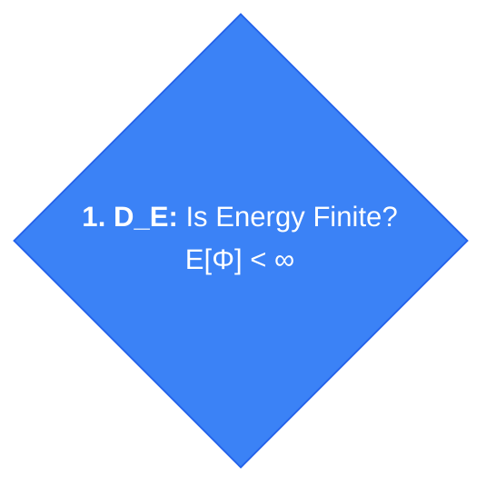
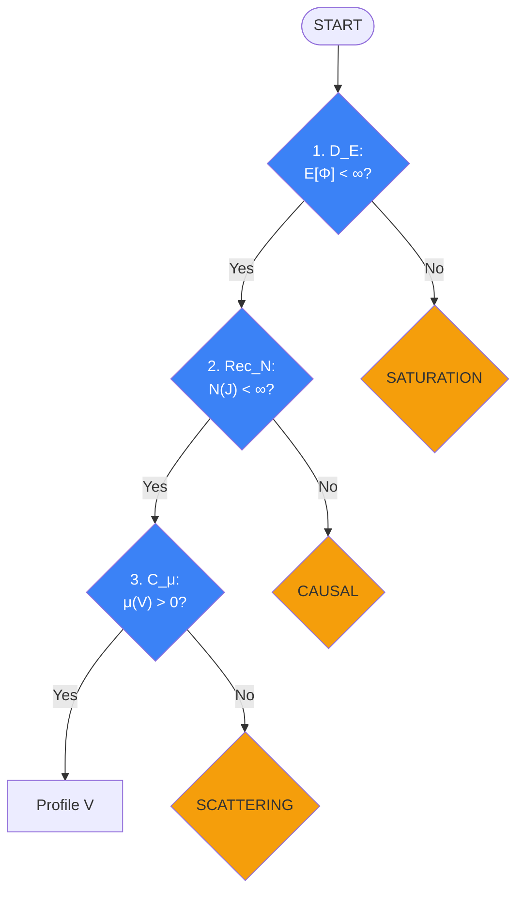
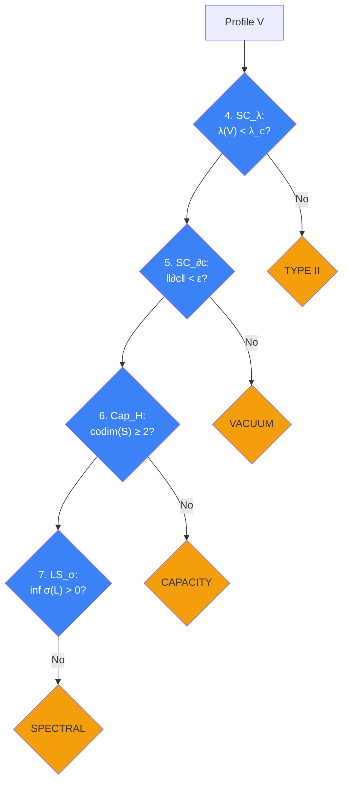
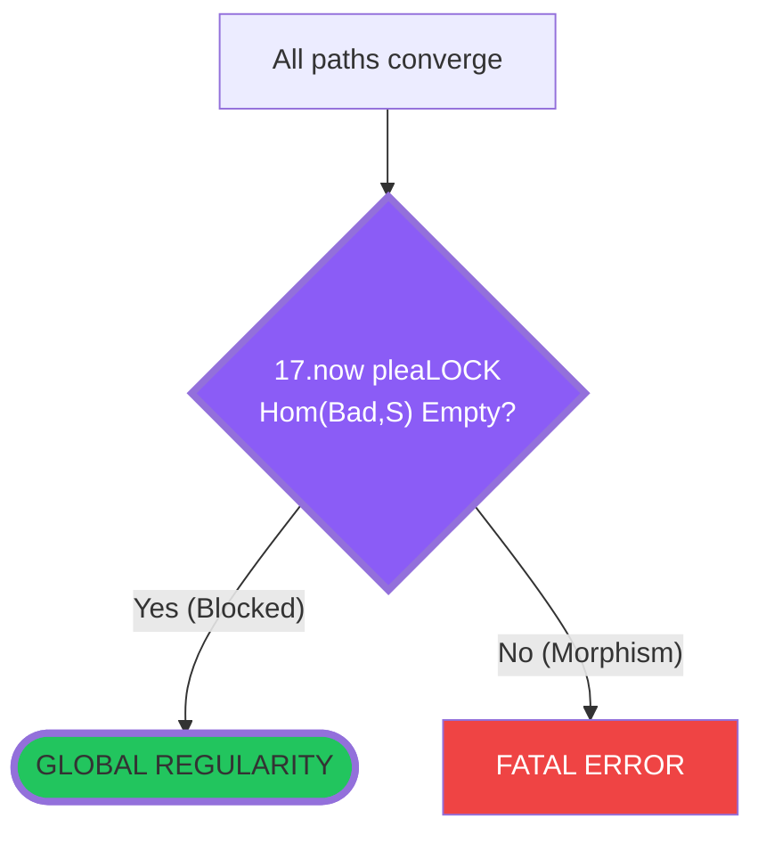

# The Structural Sieve: A Certificate-Driven Framework for Singularity Exclusion

## Abstract

This document provides a rigorous mathematical foundation for the Structural Sieve—a diagnostic algorithm that determines whether a dynamical system admits global regularity or must encounter singularity. The sieve operates as a **certificate-driven workflow**: each node evaluation produces explicit certificates that justify subsequent transitions, transforming the global regularity question into a sequence of local algebraic checks.

The framework introduces:
1. **Operational semantics** making the sieve diagram executable as a proof-carrying program
2. **Permit vocabulary** defining certificate types for all node outcomes
3. **Node specifications** with predicates and certificate schemas for all 17+ diagnostic nodes
4. **Barrier contracts** and **surgery contracts** with non-circular preconditions
5. **Universal singularity modules** handling profile classification and surgery admissibility
6. **Factory metatheorems** enabling type-based instantiation from definitions alone

---

# The Canonical Sieve Algorithm

The following Mermaid diagram is the **authoritative specification** of the sieve control flow. All subsequent definitions and theorems must align with this diagram.

```mermaid
graph TD
    Start(["<b>START DIAGNOSTIC</b>"]) --> EnergyCheck{"<b>1. D_E:</b> Is Energy Finite?<br>E[Φ] < ∞"}

    %% --- LEVEL 1: CONSERVATION ---
    EnergyCheck -- "No" --> BarrierSat{"<b>SATURATION BARRIER</b><br>Is Drift Controlled?<br>"}
    BarrierSat -- "Yes #40;Blocked#41;" --> ZenoCheck
    BarrierSat -- "No #40;Breached#41;" --> SurgAdmCE{"<b>Admits Surgery?</b>"}
    SurgAdmCE -- "YES" --> SurgCE["<b>SURGERY:</b><br>Ghost/Cap"]
    SurgAdmCE -- "NO" --> ModeCE["<b>Mode C.E</b>: Energy Blow-Up"]
    SurgCE -.-> ZenoCheck

    EnergyCheck -- "Yes" --> ZenoCheck{"<b>2. Rec_N:</b> Are Discrete Events Finite?<br>N(J) < ∞"}
    ZenoCheck -- "No" --> BarrierCausal{"<b>CAUSAL CENSOR</b><br>Is Depth Finite?<br>"}
    BarrierCausal -- "No #40;Breached#41;" --> SurgAdmCC{"<b>Admits Surgery?</b>"}
    SurgAdmCC -- "YES" --> SurgCC["<b>SURGERY:</b><br>Discrete Saturation"]
    SurgAdmCC -- "NO" --> ModeCC["<b>Mode C.C</b>: Event Accumulation"]
    SurgCC -.-> CompactCheck
    BarrierCausal -- "Yes #40;Blocked#41;" --> CompactCheck

    ZenoCheck -- "Yes" --> CompactCheck{"<b>3. C_μ:</b> Does Energy Concentrate?<br>μ(V) > 0"}

    %% --- LEVEL 2: DUALITY ---
    CompactCheck -- "No #40;Scatters#41;" --> BarrierScat{"<b>SCATTERING BARRIER</b><br>Is Interaction Finite?<br>"}
    BarrierScat -- "Yes #40;Benign#41;" --> ModeDD["<b>Mode D.D</b>: Dispersion<br><i>#40;Global Existence#41;</i>"]
    BarrierScat -- "No #40;Pathological#41;" --> SurgAdmCD_Alt{"<b>Admits Surgery?</b>"}
    SurgAdmCD_Alt -- "YES" --> SurgCD_Alt["<b>SURGERY:</b><br>Concentration-Compactness"]
    SurgAdmCD_Alt -- "NO" --> ModeCD_Alt["<b>Mode C.D</b>: Geometric Collapse<br><i>#40;Via Escape#41;</i>"]
    SurgCD_Alt -.-> Profile

    CompactCheck -- "Yes" --> Profile["<b>Canonical Profile V Emerges</b>"]

    %% --- LEVEL 3: SYMMETRY ---
    Profile --> ScaleCheck{"<b>4. SC_λ:</b> Is Profile Subcritical?<br>λ(V) < λ_c"}

    ScaleCheck -- "No #40;Supercritical#41;" --> BarrierTypeII{"<b>TYPE II BARRIER</b><br>Is Renorm Cost Infinite?<br>"}
    BarrierTypeII -- "No #40;Breached#41;" --> SurgAdmSE{"<b>Admits Surgery?</b>"}
    SurgAdmSE -- "YES" --> SurgSE["<b>SURGERY:</b><br>Regularity Lift"]
    SurgAdmSE -- "NO" --> ModeSE["<b>Mode S.E</b>: Supercritical Cascade"]
    SurgSE -.-> ParamCheck
    BarrierTypeII -- "Yes #40;Blocked#41;" --> ParamCheck

    ScaleCheck -- "Yes #40;Safe#41;" --> ParamCheck{"<b>5. SC_∂c:</b> Are Constants Stable?<br>‖∂c‖ < ε"}
    ParamCheck -- "No" --> BarrierVac{"<b>VACUUM BARRIER</b><br>Is Phase Stable?<br>"}
    BarrierVac -- "No #40;Breached#41;" --> SurgAdmSC{"<b>Admits Surgery?</b>"}
    SurgAdmSC -- "YES" --> SurgSC["<b>SURGERY:</b><br>Convex Integration"]
    SurgAdmSC -- "NO" --> ModeSC["<b>Mode S.C</b>: Parameter Instability"]
    SurgSC -.-> GeomCheck
    BarrierVac -- "Yes #40;Blocked#41;" --> GeomCheck

    ParamCheck -- "Yes" --> GeomCheck{"<b>6. Cap_H:</b> Is Codim ≥ Threshold?<br>codim(S) ≥ 2"}

    %% --- LEVEL 4: GEOMETRY ---
    GeomCheck -- "No #40;Too Large#41;" --> BarrierCap{"<b>CAPACITY BARRIER</b><br>Is Measure Zero?<br>"}
    BarrierCap -- "No #40;Breached#41;" --> SurgAdmCD{"<b>Admits Surgery?</b>"}
    SurgAdmCD -- "YES" --> SurgCD["<b>SURGERY:</b><br>Aux/Structural"]
    SurgAdmCD -- "NO" --> ModeCD["<b>Mode C.D</b>: Geometric Collapse"]
    SurgCD -.-> StiffnessCheck
    BarrierCap -- "Yes #40;Blocked#41;" --> StiffnessCheck

    GeomCheck -- "Yes #40;Safe#41;" --> StiffnessCheck{"<b>7. LS_σ:</b> Is Gap Certified?<br>inf σ(L) > 0"}

    %% --- LEVEL 5: STIFFNESS ---
    StiffnessCheck -- "No #40;Flat#41;" --> BarrierGap{"<b>SPECTRAL BARRIER</b><br>Is there a Gap?<br>"}
    BarrierGap -- "Yes #40;Blocked#41;" --> TopoCheck
    BarrierGap -- "No #40;Stagnation#41;" --> BifurcateCheck{"<b>7a. LS_∂²V:</b> Is State Unstable?<br>∂²V(x*) ⊁ 0"}

    %% --- LEVEL 5b: DYNAMIC RESTORATION (Deterministic) ---
    BifurcateCheck -- "No #40;Stable#41;" --> SurgAdmSD{"<b>Admits Surgery?</b>"}
    SurgAdmSD -- "YES" --> SurgSD["<b>SURGERY:</b><br>Ghost Extension"]
    SurgAdmSD -- "NO" --> ModeSD["<b>Mode S.D</b>: Stiffness Breakdown"]
    SurgSD -.-> TopoCheck
    BifurcateCheck -- "Yes #40;Unstable#41;" --> SymCheck{"<b>7b. G_act:</b> Is G-orbit Degenerate?<br>⎸G·v₀⎸ = 1"}

    %% Path A: Symmetry Breaking (Governed by SC_∂c)
    SymCheck -- "Yes #40;Symmetric#41;" --> CheckSC{"<b>7c. SC_∂c:</b> Are Constants Stable?<br>‖∂c‖ < ε"}
    CheckSC -- "Yes" --> ActionSSB["<b>ACTION: SYM. BREAKING</b><br>Generates Mass Gap"]
    ActionSSB -- "Mass Gap Guarantees Stiffness" --> TopoCheck
    CheckSC -- "No" --> SurgAdmSC_Rest{"<b>Admits Surgery?</b>"}
    SurgAdmSC_Rest -- "YES" --> SurgSC_Rest["<b>SURGERY:</b><br>Auxiliary Extension"]
    SurgAdmSC_Rest -- "NO" --> ModeSC_Rest["<b>Mode S.C</b>: Parameter Instability<br><i>#40;Vacuum Decay#41;</i>"]
    SurgSC_Rest -.-> TopoCheck

    %% Path B: Tunneling (Governed by TB_S)
    SymCheck -- "No #40;Asymmetric#41;" --> CheckTB{"<b>7d. TB_S:</b> Is Tunneling Finite?<br>S[γ] < ∞"}
    CheckTB -- "Yes" --> ActionTunnel["<b>ACTION: TUNNELING</b><br>Instanton Decay"]
    ActionTunnel -- "New Sector Reached" --> TameCheck
    CheckTB -- "No" --> SurgAdmTE_Rest{"<b>Admits Surgery?</b>"}
    SurgAdmTE_Rest -- "YES" --> SurgTE_Rest["<b>SURGERY:</b><br>Structural"]
    SurgAdmTE_Rest -- "NO" --> ModeTE_Rest["<b>Mode T.E</b>: Topological Twist<br><i>#40;Metastasis#41;</i>"]
    SurgTE_Rest -.-> TameCheck

    StiffnessCheck -- "Yes #40;Safe#41;" --> TopoCheck{"<b>8. TB_π:</b> Is Sector Reachable?<br>[π] ∈ π₀(C)_acc"}

    %% --- LEVEL 6: TOPOLOGY ---
    TopoCheck -- "No #40;Obstructed#41;" --> BarrierAction{"<b>ACTION BARRIER</b><br>Is Energy < Gap?<br>"}
    BarrierAction -- "No #40;Breached#41;" --> SurgAdmTE{"<b>Admits Surgery?</b>"}
    SurgAdmTE -- "YES" --> SurgTE["<b>SURGERY:</b><br>Tunnel"]
    SurgAdmTE -- "NO" --> ModeTE["<b>Mode T.E</b>: Topological Twist"]
    SurgTE -.-> TameCheck
    BarrierAction -- "Yes #40;Blocked#41;" --> TameCheck

    TopoCheck -- "Yes #40;Safe#41;" --> TameCheck{"<b>9. TB_O:</b> Is Topology Tame?<br>Σ ∈ O-min"}

    TameCheck -- "No" --> BarrierOmin{"<b>O-MINIMAL BARRIER</b><br>Is it Definable?<br>"}
    BarrierOmin -- "No #40;Breached#41;" --> SurgAdmTC{"<b>Admits Surgery?</b>"}
    SurgAdmTC -- "YES" --> SurgTC["<b>SURGERY:</b><br>O-minimal Regularization"]
    SurgAdmTC -- "NO" --> ModeTC["<b>Mode T.C</b>: Labyrinthine"]
    SurgTC -.-> ErgoCheck
    BarrierOmin -- "Yes #40;Blocked#41;" --> ErgoCheck

    TameCheck -- "Yes" --> ErgoCheck{"<b>10. TB_ρ:</b> Does Flow Mix?<br>ρ(μ) > 0"}

    ErgoCheck -- "No" --> BarrierMix{"<b>MIXING BARRIER</b><br>Is Trap Escapable?<br>"}
    BarrierMix -- "No #40;Breached#41;" --> SurgAdmTD{"<b>Admits Surgery?</b>"}
    SurgAdmTD -- "YES" --> SurgTD["<b>SURGERY:</b><br>Mixing Enhancement"]
    SurgAdmTD -- "NO" --> ModeTD["<b>Mode T.D</b>: Glassy Freeze"]
    SurgTD -.-> ComplexCheck
    BarrierMix -- "Yes #40;Blocked#41;" --> ComplexCheck

    ErgoCheck -- "Yes" --> ComplexCheck{"<b>11. Rep_K:</b> Is Description Finite?<br>K(x) < ∞"}

    %% --- LEVEL 7: COMPLEXITY ---
    ComplexCheck -- "No" --> BarrierEpi{"<b>EPISTEMIC BARRIER</b><br>Is Description Finite?<br>"}
    BarrierEpi -- "No #40;Breached#41;" --> SurgAdmDC{"<b>Admits Surgery?</b>"}
    SurgAdmDC -- "YES" --> SurgDC["<b>SURGERY:</b><br>Viscosity Solution"]
    SurgAdmDC -- "NO" --> ModeDC["<b>Mode D.C</b>: Semantic Horizon"]
    SurgDC -.-> OscillateCheck
    BarrierEpi -- "Yes #40;Blocked#41;" --> OscillateCheck

    ComplexCheck -- "Yes" --> OscillateCheck{"<b>12. GC_∇:</b> Does Flow Oscillate?<br>ẋ ≠ -∇V"}

    OscillateCheck -- "Yes" --> BarrierFreq{"<b>FREQUENCY BARRIER</b><br>Is Integral Finite?<br>"}
    BarrierFreq -- "No #40;Breached#41;" --> SurgAdmDE{"<b>Admits Surgery?</b>"}
    SurgAdmDE -- "YES" --> SurgDE["<b>SURGERY:</b><br>De Giorgi-Nash-Moser"]
    SurgAdmDE -- "NO" --> ModeDE["<b>Mode D.E</b>: Oscillatory"]
    SurgDE -.-> BoundaryCheck
    BarrierFreq -- "Yes #40;Blocked#41;" --> BoundaryCheck

    OscillateCheck -- "No" --> BoundaryCheck{"<b>13. Bound_∂:</b> Is System Open?<br>∂Ω ≠ ∅"}

    %% --- LEVEL 8: BOUNDARY ---
    BoundaryCheck -- "Yes" --> OverloadCheck{"<b>14. Bound_B:</b> Is Input Bounded?<br>‖Bu‖ ≤ M"}

    OverloadCheck -- "No" --> BarrierBode{"<b>BODE BARRIER</b><br>Is Sensitivity Bounded?<br>"}
    BarrierBode -- "No #40;Breached#41;" --> SurgAdmBE{"<b>Admits Surgery?</b>"}
    SurgAdmBE -- "YES" --> SurgBE["<b>SURGERY:</b><br>Saturation"]
    SurgAdmBE -- "NO" --> ModeBE["<b>Mode B.E</b>: Injection"]
    SurgBE -.-> StarveCheck
    BarrierBode -- "Yes #40;Blocked#41;" --> StarveCheck

    OverloadCheck -- "Yes" --> StarveCheck{"<b>15. Bound_∫:</b> Is Input Sufficient?<br>∫r dt ≥ r_min"}

    StarveCheck -- "No" --> BarrierInput{"<b>INPUT BARRIER</b><br>Is Reserve Sufficient?<br>"}
    BarrierInput -- "No #40;Breached#41;" --> SurgAdmBD{"<b>Admits Surgery?</b>"}
    SurgAdmBD -- "YES" --> SurgBD["<b>SURGERY:</b><br>Reservoir"]
    SurgAdmBD -- "NO" --> ModeBD["<b>Mode B.D</b>: Starvation"]
    SurgBD -.-> AlignCheck
    BarrierInput -- "Yes #40;Blocked#41;" --> AlignCheck

    StarveCheck -- "Yes" --> AlignCheck{"<b>16. GC_T:</b> Is Control Matched?<br>T(u) ~ d"}
    AlignCheck -- "No" --> BarrierVariety{"<b>VARIETY BARRIER</b><br>Does Control Match Disturbance?<br>"}
    BarrierVariety -- "No #40;Breached#41;" --> SurgAdmBC{"<b>Admits Surgery?</b>"}
    SurgAdmBC -- "YES" --> SurgBC["<b>SURGERY:</b><br>Adjoint"]
    SurgAdmBC -- "NO" --> ModeBC["<b>Mode B.C</b>: Misalignment"]
    SurgBC -.-> BarrierExclusion

    %% --- LEVEL 9: THE FINAL GATE ---
    %% All successful paths funnel here
    BoundaryCheck -- "No" --> BarrierExclusion
    BarrierVariety -- "Yes #40;Blocked#41;" --> BarrierExclusion
    AlignCheck -- "Yes" --> BarrierExclusion

    BarrierExclusion{"<b>17. Cat_Hom:</b> Is Hom#40;Bad, S#41; = ∅?<br>Hom#40;B, S#41; = ∅"}

    BarrierExclusion -- "Yes #40;Blocked#41;" --> VICTORY(["<b>GLOBAL REGULARITY</b><br><i>#40;Structural Exclusion Confirmed#41;</i>"])
    BarrierExclusion -- "No #40;Morphism Exists#41;" --> ModeCat["<b>FATAL ERROR</b><br>Structural Inconsistency"]

    %% ====== STYLES ======
    %% Success states - Green
    style VICTORY fill:#22c55e,stroke:#16a34a,color:#000000,stroke-width:4px
    style ModeDD fill:#22c55e,stroke:#16a34a,color:#000000

    %% Failure modes - Red
    style ModeCE fill:#ef4444,stroke:#dc2626,color:#ffffff
    style ModeCC fill:#ef4444,stroke:#dc2626,color:#ffffff
    style ModeSE fill:#ef4444,stroke:#dc2626,color:#ffffff
    style ModeSC fill:#ef4444,stroke:#dc2626,color:#ffffff
    style ModeCD fill:#ef4444,stroke:#dc2626,color:#ffffff
    style ModeCD_Alt fill:#ef4444,stroke:#dc2626,color:#ffffff
    style ModeSD fill:#ef4444,stroke:#dc2626,color:#ffffff
    style ModeTE fill:#ef4444,stroke:#dc2626,color:#ffffff
    style ModeTC fill:#ef4444,stroke:#dc2626,color:#ffffff
    style ModeTD fill:#ef4444,stroke:#dc2626,color:#ffffff
    style ModeDC fill:#ef4444,stroke:#dc2626,color:#ffffff
    style ModeDE fill:#ef4444,stroke:#dc2626,color:#ffffff
    style ModeBE fill:#ef4444,stroke:#dc2626,color:#ffffff
    style ModeBD fill:#ef4444,stroke:#dc2626,color:#ffffff
    style ModeBC fill:#ef4444,stroke:#dc2626,color:#ffffff
    style ModeCat fill:#ef4444,stroke:#dc2626,color:#ffffff

    %% Barriers - Orange/Amber
    style BarrierSat fill:#f59e0b,stroke:#d97706,color:#000000
    style BarrierCausal fill:#f59e0b,stroke:#d97706,color:#000000
    style BarrierScat fill:#f59e0b,stroke:#d97706,color:#000000
    style BarrierTypeII fill:#f59e0b,stroke:#d97706,color:#000000
    style BarrierVac fill:#f59e0b,stroke:#d97706,color:#000000
    style BarrierCap fill:#f59e0b,stroke:#d97706,color:#000000
    style BarrierGap fill:#f59e0b,stroke:#d97706,color:#000000
    style BarrierAction fill:#f59e0b,stroke:#d97706,color:#000000
    style BarrierOmin fill:#f59e0b,stroke:#d97706,color:#000000
    style BarrierMix fill:#f59e0b,stroke:#d97706,color:#000000
    style BarrierEpi fill:#f59e0b,stroke:#d97706,color:#000000
    style BarrierFreq fill:#f59e0b,stroke:#d97706,color:#000000
    style BarrierBode fill:#f59e0b,stroke:#d97706,color:#000000
    style BarrierInput fill:#f59e0b,stroke:#d97706,color:#000000
    style BarrierVariety fill:#f59e0b,stroke:#d97706,color:#000000

    %% The Final Gate - Purple with thick border
    style BarrierExclusion fill:#8b5cf6,stroke:#7c3aed,color:#ffffff,stroke-width:4px

    %% Interface Checks - Blue
    style EnergyCheck fill:#3b82f6,stroke:#2563eb,color:#ffffff
    style ZenoCheck fill:#3b82f6,stroke:#2563eb,color:#ffffff
    style CompactCheck fill:#3b82f6,stroke:#2563eb,color:#ffffff
    style ScaleCheck fill:#3b82f6,stroke:#2563eb,color:#ffffff
    style ParamCheck fill:#3b82f6,stroke:#2563eb,color:#ffffff
    style GeomCheck fill:#3b82f6,stroke:#2563eb,color:#ffffff
    style StiffnessCheck fill:#3b82f6,stroke:#2563eb,color:#ffffff
    style TopoCheck fill:#3b82f6,stroke:#2563eb,color:#ffffff
    style TameCheck fill:#3b82f6,stroke:#2563eb,color:#ffffff
    style ErgoCheck fill:#3b82f6,stroke:#2563eb,color:#ffffff
    style ComplexCheck fill:#3b82f6,stroke:#2563eb,color:#ffffff
    style OscillateCheck fill:#3b82f6,stroke:#2563eb,color:#ffffff
    style BoundaryCheck fill:#3b82f6,stroke:#2563eb,color:#ffffff
    style OverloadCheck fill:#3b82f6,stroke:#2563eb,color:#ffffff
    style StarveCheck fill:#3b82f6,stroke:#2563eb,color:#ffffff
    style AlignCheck fill:#3b82f6,stroke:#2563eb,color:#ffffff

    %% Intermediate nodes - Purple
    style Start fill:#8b5cf6,stroke:#7c3aed,color:#ffffff
    style Profile fill:#8b5cf6,stroke:#7c3aed,color:#ffffff

    %% Restoration checks - Blue (standard axiom checks)
    style BifurcateCheck fill:#3b82f6,stroke:#2563eb,color:#ffffff
    style SymCheck fill:#3b82f6,stroke:#2563eb,color:#ffffff
    style CheckSC fill:#3b82f6,stroke:#2563eb,color:#ffffff
    style CheckTB fill:#3b82f6,stroke:#2563eb,color:#ffffff

    %% Restoration mechanisms - Purple (escape mechanisms)
    style ActionSSB fill:#8b5cf6,stroke:#7c3aed,color:#ffffff
    style ActionTunnel fill:#8b5cf6,stroke:#7c3aed,color:#ffffff

    %% Restoration failure modes - Red
    style ModeSC_Rest fill:#ef4444,stroke:#dc2626,color:#ffffff
    style ModeTE_Rest fill:#ef4444,stroke:#dc2626,color:#ffffff

    %% Surgery recovery nodes - Purple
    style SurgCE fill:#8b5cf6,stroke:#7c3aed,color:#ffffff
    style SurgCC fill:#8b5cf6,stroke:#7c3aed,color:#ffffff
    style SurgCD_Alt fill:#8b5cf6,stroke:#7c3aed,color:#ffffff
    style SurgSE fill:#8b5cf6,stroke:#7c3aed,color:#ffffff
    style SurgSC fill:#8b5cf6,stroke:#7c3aed,color:#ffffff
    style SurgCD fill:#8b5cf6,stroke:#7c3aed,color:#ffffff
    style SurgSD fill:#8b5cf6,stroke:#7c3aed,color:#ffffff
    style SurgSC_Rest fill:#8b5cf6,stroke:#7c3aed,color:#ffffff
    style SurgTE_Rest fill:#8b5cf6,stroke:#7c3aed,color:#ffffff
    style SurgTE fill:#8b5cf6,stroke:#7c3aed,color:#ffffff
    style SurgTC fill:#8b5cf6,stroke:#7c3aed,color:#ffffff
    style SurgTD fill:#8b5cf6,stroke:#7c3aed,color:#ffffff
    style SurgDC fill:#8b5cf6,stroke:#7c3aed,color:#ffffff
    style SurgDE fill:#8b5cf6,stroke:#7c3aed,color:#ffffff
    style SurgBE fill:#8b5cf6,stroke:#7c3aed,color:#ffffff
    style SurgBD fill:#8b5cf6,stroke:#7c3aed,color:#ffffff
    style SurgBC fill:#8b5cf6,stroke:#7c3aed,color:#ffffff

    %% Surgery Admissibility checks - Light Purple with border
    style SurgAdmCE fill:#e9d5ff,stroke:#9333ea,color:#000000,stroke-width:2px
    style SurgAdmCC fill:#e9d5ff,stroke:#9333ea,color:#000000,stroke-width:2px
    style SurgAdmCD_Alt fill:#e9d5ff,stroke:#9333ea,color:#000000,stroke-width:2px
    style SurgAdmSE fill:#e9d5ff,stroke:#9333ea,color:#000000,stroke-width:2px
    style SurgAdmSC fill:#e9d5ff,stroke:#9333ea,color:#000000,stroke-width:2px
    style SurgAdmCD fill:#e9d5ff,stroke:#9333ea,color:#000000,stroke-width:2px
    style SurgAdmSD fill:#e9d5ff,stroke:#9333ea,color:#000000,stroke-width:2px
    style SurgAdmSC_Rest fill:#e9d5ff,stroke:#9333ea,color:#000000,stroke-width:2px
    style SurgAdmTE_Rest fill:#e9d5ff,stroke:#9333ea,color:#000000,stroke-width:2px
    style SurgAdmTE fill:#e9d5ff,stroke:#9333ea,color:#000000,stroke-width:2px
    style SurgAdmTC fill:#e9d5ff,stroke:#9333ea,color:#000000,stroke-width:2px
    style SurgAdmTD fill:#e9d5ff,stroke:#9333ea,color:#000000,stroke-width:2px
    style SurgAdmDC fill:#e9d5ff,stroke:#9333ea,color:#000000,stroke-width:2px
    style SurgAdmDE fill:#e9d5ff,stroke:#9333ea,color:#000000,stroke-width:2px
    style SurgAdmBE fill:#e9d5ff,stroke:#9333ea,color:#000000,stroke-width:2px
    style SurgAdmBD fill:#e9d5ff,stroke:#9333ea,color:#000000,stroke-width:2px
    style SurgAdmBC fill:#e9d5ff,stroke:#9333ea,color:#000000,stroke-width:2px

```

---

## Interface Registry

The following table is the **single source of truth** for all interfaces required to run the Structural Sieve end-to-end. Each interface is identified by a unique ID combining the governing axiom with the interface symbol. To instantiate the sieve for a specific system, one must implement each interface for the relevant hypostructure component.

| Node | ID                            | Name             | Certificates (Output) | Symbol         | Object                   | Hypostructure                   | Description                        | Question                                        | Predicate                                     |
|------|-------------------------------|------------------|----------------------|----------------|--------------------------|---------------------------------|------------------------------------|-------------------------------------------------|-----------------------------------------------|
| 1    | $D_E$                         | EnergyCheck      | $K_{D_E}^+$ / $K_{D_E}^-$ | $E$            | Flow $\Phi$              | $\mathfrak{D}$ on $\Phi$        | Energy functional                  | Is Energy Finite?                               | $E[\Phi] < \infty$                            |
| 2    | $\mathrm{Rec}_N$              | ZenoCheck        | $K_{\mathrm{Rec}_N}^+$ / $K_{\mathrm{Rec}_N}^-$ | $N$            | Jump sequence $J$        | $\mathfrak{D}$ on $\Phi$        | Event counter                      | Are Discrete Events Finite?                     | $N(J) < \infty$                               |
| 3    | $C_\mu$                       | CompactCheck     | $K_{C_\mu}^+$ / $K_{C_\mu}^-$ | $\mu$          | Profile $V$              | $\mathfrak{D}$ on $\mathcal{X}$ | Concentration measure              | Does Energy Concentrate?                        | $\mu(V) > 0$                                  |
| 4    | $\mathrm{SC}_\lambda$         | ScaleCheck       | $K_{\mathrm{SC}_\lambda}^+$ / $K_{\mathrm{SC}_\lambda}^-$ | $\lambda$      | Profile $V$              | $\mathfrak{D}$ on $\mathcal{X}$ | Scaling dimension                  | Is Profile Subcritical?                         | $\lambda(V) < \lambda_c$                      |
| 5    | $\mathrm{SC}_{\partial c}$    | ParamCheck       | $K_{\mathrm{SC}_{\partial c}}^+$ / $K_{\mathrm{SC}_{\partial c}}^-$ | $\partial c$   | Constants $c$            | $\mathfrak{D}$ on $\mathcal{X}$ | Parameter derivative               | Are Constants Stable?                           | $\lVert\partial_c\rVert < \epsilon$           |
| 6    | $\mathrm{Cap}_H$              | GeomCheck        | $K_{\mathrm{Cap}_H}^+$ / $K_{\mathrm{Cap}_H}^-$ | $\dim_H$       | Singular set $S$         | $\mathfrak{D}$ on $\mathcal{X}$ | Hausdorff dimension                | Is Codim $\geq$ Threshold?                      | $\mathrm{codim}(S) \geq 2$                    |
| 7    | $\mathrm{LS}_\sigma$          | StiffnessCheck   | $K_{\mathrm{LS}_\sigma}^+$ / $K_{\mathrm{LS}_\sigma}^-$ | $\sigma$       | Linearization $L$        | $\mathfrak{D}$ on $\Phi$        | Spectrum                           | Is Gap Certified?                               | $\inf \sigma(L) > 0$                          |
| 7a   | $\mathrm{LS}_{\partial^2 V}$  | BifurcateCheck   | $K_{\mathrm{LS}_{\partial^2 V}}^+$ / $K_{\mathrm{LS}_{\partial^2 V}}^-$ | $\partial^2 V$ | Equilibrium $x^*$        | $\mathfrak{D}$ on $\mathcal{X}$ | Hessian                            | Is State Unstable?                              | $\partial^2 V(x^*) \not\succ 0$               |
| 7b   | $G_{\mathrm{act}}$            | SymCheck         | $K_{G_{\mathrm{act}}}^+$ / $K_{G_{\mathrm{act}}}^-$ | $G$            | Vacuum $v_0$             | $G$                             | Group action                       | Is $G$-orbit Degenerate?                        | $\lvert G \cdot v_0 \rvert = 1$ |
| 7c   | $\mathrm{SC}_{\partial c}$    | CheckSC          | $K_{\mathrm{SC}_{\partial c}}^+$ / $K_{\mathrm{SC}_{\partial c}}^-$ | $\partial c$   | Constants $c$            | $\mathfrak{D}$ on $\mathcal{X}$ | Parameter derivative (restoration) | Are Constants Stable?                           | $\lVert\partial_c\rVert < \epsilon$           |
| 7d   | $\mathrm{TB}_S$               | CheckTB          | $K_{\mathrm{TB}_S}^+$ / $K_{\mathrm{TB}_S}^-$ | $S$            | Instanton path $\gamma$  | $\mathfrak{D}$ on $\mathcal{X}$ | Action functional                  | Is Tunneling Finite?                            | $S[\gamma] < \infty$                          |
| 8    | $\mathrm{TB}_\pi$             | TopoCheck        | $K_{\mathrm{TB}_\pi}^+$ / $K_{\mathrm{TB}_\pi}^-$ | $\pi$          | Configuration $C$        | $\mathfrak{D}$ on $\mathcal{X}$ | Homotopy class                     | Is Sector Reachable?                            | $[\pi] \in \pi_0(\mathcal{C})_{\mathrm{acc}}$ |
| 9    | $\mathrm{TB}_O$               | TameCheck        | $K_{\mathrm{TB}_O}^+$ / $K_{\mathrm{TB}_O}^-$ | $O$            | Stratification $\Sigma$  | $\mathfrak{D}$ on $\mathcal{X}$ | O-minimal structure                | Is Topology Tame?                               | $\Sigma \in \mathcal{O}\text{-min}$           |
| 10   | $\mathrm{TB}_\rho$            | ErgoCheck        | $K_{\mathrm{TB}_\rho}^+$ / $K_{\mathrm{TB}_\rho}^-$ | $\rho$         | Invariant measure $\mu$  | $\mathfrak{D}$ on $\Phi$        | Mixing rate                        | Does Flow Mix?                                  | $\rho(\mu) > 0$                               |
| 11   | $\mathrm{Rep}_K$              | ComplexCheck     | $K_{\mathrm{Rep}_K}^+$ / $K_{\mathrm{Rep}_K}^-$ | $K$            | State $x$                | $\mathfrak{D}$ on $\mathcal{X}$ | Kolmogorov complexity              | Is Description Finite?                          | $K(x) < \infty$                               |
| 12   | $\mathrm{GC}_\nabla$          | OscillateCheck   | $K_{\mathrm{GC}_\nabla}^+$ / $K_{\mathrm{GC}_\nabla}^-$ | $\nabla$       | Potential $V$            | $\mathfrak{D}$ on $\mathcal{X}$ | Gradient operator                  | Does Flow Oscillate?                            | $\dot{x} \neq -\nabla V$                      |
| 13   | $\mathrm{Bound}_\partial$     | BoundaryCheck    | $K_{\mathrm{Bound}_\partial}^+$ / $K_{\mathrm{Bound}_\partial}^-$ | $\partial$     | Domain $\Omega$          | $\mathfrak{D}$ on $\mathcal{X}$ | Boundary operator                  | Is System Open?                                 | $\partial\Omega \neq \emptyset$               |
| 14   | $\mathrm{Bound}_B$            | OverloadCheck    | $K_{\mathrm{Bound}_B}^+$ / $K_{\mathrm{Bound}_B}^-$ | $B$            | Control signal $u$       | $\mathfrak{D}$ on $\Phi$        | Input operator                     | Is Input Bounded?                               | $\lVert Bu \rVert \leq M$                     |
| 15   | $\mathrm{Bound}_\int$         | StarveCheck      | $K_{\mathrm{Bound}_\int}^+$ / $K_{\mathrm{Bound}_\int}^-$ | $\int$         | Resource $r$             | $\mathfrak{D}$ on $\Phi$        | Supply integral                    | Is Input Sufficient?                            | $\int_0^T r \, dt \geq r_{\min}$              |
| 16   | $\mathrm{GC}_T$               | AlignCheck       | $K_{\mathrm{GC}_T}^+$ / $K_{\mathrm{GC}_T}^-$ | $T$            | Pair $(u,d)$             | $\mathfrak{D}$ on $\Phi$        | Gauge transform                    | Is Control Matched?                             | $T(u) \sim d$                                 |
| 17   | $\mathrm{Cat}_{\mathrm{Hom}}$ | BarrierExclusion | $K_{\mathrm{Cat}_{\mathrm{Hom}}}^{\mathrm{blk}}$ / $K_{\mathrm{Cat}_{\mathrm{Hom}}}^{\mathrm{morph}}$ | $\mathrm{Hom}$ | Morphisms $\mathrm{Mor}$ | $\mathfrak{D}$ categorical      | Hom functor                        | Is $\mathrm{Hom}(\mathrm{Bad}, S) = \emptyset$? | $\mathrm{Hom}(\mathcal{B}, S) = \emptyset$    |

:::{prf:remark} Interface Composition
:label: rem-interface-composition

Barrier checks compose multiple interfaces. For example, the **Saturation Barrier** at Node 1 combines the energy interface $D_E$ with a drift control predicate. Surgery admissibility checks (the light purple diamonds) query the same interfaces as their parent gates but with different predicates.
:::

## Barrier Registry

The following table defines all **barriers** in the Structural Sieve. Each barrier is a secondary defense triggered when its parent gate fails. The barrier checks a weaker condition that may still block singularity formation.

| Node | Barrier ID | Interfaces | Permits ($\Gamma$) | Certificates (Output) | Blocked Predicate | Question | Metatheorem |
|------|------------|------------|-------------------|----------------------|-------------------|----------|-------------|
| 1 | BarrierSat | $D_E$, $\mathrm{SC}_\lambda$ | $\emptyset$ (Entry) | $K_{D_E}^{\mathrm{blk}}$ / $K_{D_E}^{\mathrm{br}}$ | $E[\Phi] \leq E_{\text{sat}} \lor \text{Drift} \leq C$ | Is the energy drift bounded by a saturation ceiling? | Saturation Principle |
| 2 | BarrierCausal | $\mathrm{Rec}_N$, $\mathrm{TB}_\pi$ | $K_{D_E}^\pm$ | $K_{\mathrm{Rec}_N}^{\mathrm{blk}}$ / $K_{\mathrm{Rec}_N}^{\mathrm{br}}$ | $D(T_*) = \int_0^{T_*} \frac{c}{\lambda(t)} dt = \infty$ | Does the singularity require infinite computational depth? | Algorithmic Causal Barrier |
| 3 | BarrierScat | $C_\mu$, $D_E$ | $K_{D_E}^\pm, K_{\mathrm{Rec}_N}^\pm$ | $K_{C_\mu}^{\mathrm{ben}}$ / $K_{C_\mu}^{\mathrm{path}}$ | $\mathcal{M}[\Phi] < \infty$ | Is the interaction functional finite (implying dispersion)? | Scattering-Compactness |
| 4 | BarrierTypeII | $\mathrm{SC}_\lambda$, $D_E$ | $K_{C_\mu}^+$ | $K_{\mathrm{SC}_\lambda}^{\mathrm{blk}}$ / $K_{\mathrm{SC}_\lambda}^{\mathrm{br}}$ | $\int \tilde{\mathfrak{D}}(S_t V) dt = \infty$ | Is the renormalization cost of the profile infinite? | Type II Exclusion |
| 5 | BarrierVac | $\mathrm{SC}_{\partial c}$, $\mathrm{LS}_\sigma$ | $K_{C_\mu}^+, K_{\mathrm{SC}_\lambda}^\pm$ | $K_{\mathrm{SC}_{\partial c}}^{\mathrm{blk}}$ / $K_{\mathrm{SC}_{\partial c}}^{\mathrm{br}}$ | $\Delta V > k_B T$ | Is the phase stable against thermal/parameter drift? | Mass Gap Principle |
| 6 | BarrierCap | $\mathrm{Cap}_H$ | $K_{\mathrm{SC}_{\partial c}}^\pm$ | $K_{\mathrm{Cap}_H}^{\mathrm{blk}}$ / $K_{\mathrm{Cap}_H}^{\mathrm{br}}$ | $\mathrm{Cap}_H(S) = 0$ | Is the singular set of measure zero? | Capacity Barrier |
| 7 | BarrierGap | $\mathrm{LS}_\sigma$, $\mathrm{GC}_\nabla$ | $K_{\mathrm{Cap}_H}^\pm$ | $K_{\mathrm{LS}_\sigma}^{\mathrm{blk}}$ / $K_{\mathrm{LS}_\sigma}^{\mathrm{stag}}$ | $\inf \sigma(L) > 0$ | Is there a spectral gap (positive curvature) at the minimum? | Spectral Generator |
| 8 | BarrierAction | $\mathrm{TB}_\pi$ | $K_{\mathrm{LS}_\sigma}^\pm$ | $K_{\mathrm{TB}_\pi}^{\mathrm{blk}}$ / $K_{\mathrm{TB}_\pi}^{\mathrm{br}}$ | $E[\Phi] < S_{\min} + \Delta$ | Is the energy insufficient to cross the topological gap? | Topological Suppression |
| 9 | BarrierOmin | $\mathrm{TB}_O$, $\mathrm{Rep}_K$ | $K_{\mathrm{TB}_\pi}^\pm$ | $K_{\mathrm{TB}_O}^{\mathrm{blk}}$ / $K_{\mathrm{TB}_O}^{\mathrm{br}}$ | $S \in \mathcal{O}\text{-min}$ | Is the topology definable in an o-minimal structure? | O-Minimal Taming |
| 10 | BarrierMix | $\mathrm{TB}_\rho$, $D_E$ | $K_{\mathrm{TB}_O}^\pm$ | $K_{\mathrm{TB}_\rho}^{\mathrm{blk}}$ / $K_{\mathrm{TB}_\rho}^{\mathrm{br}}$ | $\tau_{\text{mix}} < \infty$ | Does the system mix fast enough to escape traps? | Ergodic Mixing |
| 11 | BarrierEpi | $\mathrm{Rep}_K$, $\mathrm{Cap}_H$ | $K_{\mathrm{TB}_\rho}^\pm$ | $K_{\mathrm{Rep}_K}^{\mathrm{blk}}$ / $K_{\mathrm{Rep}_K}^{\mathrm{br}}$ | $K(x) \leq S_{\text{BH}}$ | Is the description length within physical bounds? | Epistemic Horizon |
| 12 | BarrierFreq | $\mathrm{GC}_\nabla$, $\mathrm{SC}_\lambda$ | $K_{\mathrm{Rep}_K}^\pm$ | $K_{\mathrm{GC}_\nabla}^{\mathrm{blk}}$ / $K_{\mathrm{GC}_\nabla}^{\mathrm{br}}$ | $\int \omega^2 S(\omega) d\omega < \infty$ | Is the total oscillation energy finite? | Frequency Barrier |
| 14 | BarrierBode | $\mathrm{Bound}_B$, $\mathrm{LS}_\sigma$ | $K_{\mathrm{Bound}_\partial}^+$ | $K_{\mathrm{Bound}_B}^{\mathrm{blk}}$ / $K_{\mathrm{Bound}_B}^{\mathrm{br}}$ | $\int_0^\infty \ln \lVert S(i\omega) \rVert d\omega > -\infty$ | Is the sensitivity integral conserved (waterbed effect)? | Bode Sensitivity |
| 15 | BarrierInput | $\mathrm{Bound}_\int$, $C_\mu$ | $K_{\mathrm{Bound}_B}^\pm$ | $K_{\mathrm{Bound}_\int}^{\mathrm{blk}}$ / $K_{\mathrm{Bound}_\int}^{\mathrm{br}}$ | $r_{\text{reserve}} > 0$ | Is there a reservoir to prevent starvation? | Input Stability |
| 16 | BarrierVariety | $\mathrm{GC}_T$, $\mathrm{Cap}_H$ | $K_{\mathrm{Bound}_\int}^\pm$ | $K_{\mathrm{GC}_T}^{\mathrm{blk}}$ / $K_{\mathrm{GC}_T}^{\mathrm{br}}$ | $H(u) \geq H(d)$ | Does control entropy match disturbance entropy? | Requisite Variety |
| 17 | BarrierExclusion | $\mathrm{Cat}_{\mathrm{Hom}}$ | Full $\Gamma$ | $K_{\mathrm{Cat}_{\mathrm{Hom}}}^{\mathrm{blk}}$ / $K_{\mathrm{Cat}_{\mathrm{Hom}}}^{\mathrm{morph}}$ | $\mathrm{Hom}(\mathcal{B}, S) = \emptyset$ | Is there a categorical obstruction to the bad pattern? | Morphism Exclusion |

---

# Part I: The Kernel

## 1. The Sieve as a Proof-Carrying Program

:::{prf:definition} Sieve epoch
:label: def-sieve-epoch

An **epoch** is a single execution of the sieve from the START node to either:
1. A terminal node (VICTORY, Mode D.D, or FATAL ERROR), or
2. A surgery re-entry point (dotted arrow target).
Each epoch visits finitely many nodes (Theorem {ref}`thm-epoch-termination`). A complete run consists of finitely many epochs (Theorem {ref}`thm-finite-runs`).

:::

:::{prf:definition} Node numbering
:label: def-node-numbering

The sieve contains the following node classes:
- **Gates (Blue):** Nodes 1--17 performing axiom checks
- **Barriers (Orange):** Secondary defense nodes triggered by gate failures
- **Modes (Red):** Failure mode classifications
- **Surgeries (Purple):** Repair mechanisms with re-entry targets
- **Actions (Purple):** Dynamic restoration mechanisms (SSB, Tunneling)
- **Restoration subnodes (7a--7d):** The stiffness restoration subtree

:::

---

## 2. Operational Semantics

:::{prf:definition} State space
:label: def-state-space

Let $X$ be a Polish space (complete separable metric space) representing the configuration space of the system under analysis. A **state** $x \in X$ is a point in this space representing the current system configuration at a given time or stage of analysis.

:::

:::{prf:definition} Certificate
:label: def-certificate

A **certificate** $K$ is a formal witness object that records the outcome of a verification step. Certificates are typed: each certificate $K$ belongs to a certificate type $\mathcal{K}$ specifying what property it witnesses.

:::

:::{prf:definition} Context
:label: def-context

The **context** $\Gamma$ is a finite multiset of certificates accumulated during a sieve run:
$$\Gamma = \{K_{D_E}, K_{\mathrm{Rec}_N}, K_{C_\mu}, \ldots, K_{\mathrm{Cat}_{\mathrm{Hom}}}\}$$
The context grows monotonically during an epoch: certificates are added but never removed (except at surgery re-entry, where context may be partially reset).

:::

:::{prf:definition} Node evaluation function
:label: def-node-evaluation

Each node $N$ in the sieve defines an **evaluation function**:
$$\mathrm{eval}_N : X \times \Gamma \to \mathcal{O}_N \times \mathcal{K}_N \times X \times \Gamma$$
where:
- $\mathcal{O}_N$ is the **outcome alphabet** for node $N$
- $\mathcal{K}_N$ is the **certificate type** produced by node $N$
- The function maps $(x, \Gamma) \mapsto (o, K_o, x', \Gamma')$ where:
   - $o \in \mathcal{O}_N$ is the outcome
   - $K_o \in \mathcal{K}_N$ is the certificate witnessing outcome $o$
   - $x' \in X$ is the (possibly modified) state
   - $\Gamma' = \Gamma \cup \{K_o\}$ is the extended context

:::

:::{prf:definition} Edge validity
:label: def-edge-validity

An edge $N_1 \xrightarrow{o} N_2$ in the sieve diagram is **valid** if and only if:
$$K_o \Rightarrow \mathrm{Pre}(N_2)$$
That is, the certificate produced by node $N_1$ with outcome $o$ logically implies the precondition required for node $N_2$ to be evaluable.

:::

:::{prf:definition} Determinism policy
:label: def-determinism

For **soft checks** (where the predicate cannot be definitively verified), the sieve adopts the following policy:
- If verification succeeds: output YES with positive certificate $K^+$
- If verification fails: output NO with negative certificate $K^-$
- If verification is inconclusive (UNKNOWN): output NO with uncertainty certificate $K^?$
This ensures the sieve is deterministic: UNKNOWN is conservatively treated as NO, routing to the barrier defense layer.

:::

---

## 3. Permit Vocabulary and Certificate Types

:::{prf:definition} Gate permits
:label: def-gate-permits

For each gate (blue node) $i$, the outcome alphabet is:
$$\mathcal{O}_i = \{`YES`, `NO`\}$$
with certificate types:
- $K_i^+$ (`YES` certificate): Witnesses that predicate $P_i$ holds on the current state/window
- $K_i^-$ (`NO` certificate): Witnesses either that $P_i$ fails, or that $P_i$ cannot be certified from current $\Gamma$

:::

:::{prf:remark} Dichotomy classifiers
:label: rem-dichotomy

Some gates are **dichotomy classifiers** where NO is a benign branch rather than an error:
- **CompactCheck (Node 3)**: NO = scattering $\to$ global existence (Mode D.D)
- **OscillateCheck (Node 12)**: NO = no oscillation $\to$ proceed to boundary checks
For these gates, $K^-$ represents a classification outcome, not a failure certificate.

:::

:::{prf:definition} Barrier permits
:label: def-barrier-permits

For each barrier (orange node), the outcome alphabet is one of:

**Standard barriers** (most barriers):
$$\mathcal{O}_{\text{barrier}} = \{`Blocked`, `Breached`\}$$

**Special barriers with extended alphabets:**
- **BarrierScat** (Scattering): $\mathcal{O} = \{`Benign`, `Pathological`\}$
- **BarrierGap** (Spectral): $\mathcal{O} = \{`Blocked`, `Stagnation`\}$
- **BarrierExclusion** (Lock): $\mathcal{O} = \{`Blocked`, `MorphismExists`\}$

Certificate semantics:
- $K^{\mathrm{blk}}$ (`Blocked`): Barrier holds; certificate enables passage to next gate
- $K^{\mathrm{br}}$ (`Breached`): Barrier fails; certificate activates failure mode and enables surgery

:::

:::{prf:definition} Surgery permits
:label: def-surgery-permits

For each surgery (purple node), the output is a **re-entry certificate**:
$$K^{\mathrm{re}} = (D_S, x', \pi)$$
where $D_S$ is the surgery data, $x'$ is the post-surgery state, and $\pi$ is a proof that $\mathrm{Pre}(\text{TargetNode})$ holds for $x'$.

The re-entry certificate witnesses that after surgery with data $D_S$, the precondition of the dotted-arrow target node is satisfied:
$$K^{\mathrm{re}} \Rightarrow \mathrm{Pre}(\text{TargetNode})(x')$$

:::

:::{prf:definition} YES-tilde permits
:label: def-yes-tilde

A **YES$^\sim$ permit** (YES up to equivalence) is a certificate of the form:
$$K_i^{\sim} = (K_{\mathrm{equiv}}, K_{\mathrm{transport}}, K_i^+[\tilde{x}])$$
where:
- $K_{\mathrm{equiv}}$ certifies that $\tilde{x}$ is equivalent to $x$ under an admissible equivalence move
- $K_{\mathrm{transport}}$ is a transport lemma certificate
- $K_i^+[\tilde{x}]$ is a YES certificate for predicate $P_i$ on the equivalent object $\tilde{x}$
YES$^\sim$ permits are accepted by metatheorems that tolerate equivalence.

:::

:::{prf:definition} Promotion permits
:label: def-promotion-permits

**Promotion permits** upgrade blocked certificates to full YES certificates:

**Immediate promotion** (past-only): A blocked certificate at node $i$ may be promoted if all prior nodes passed:
$$K_i^{\mathrm{blk}} \wedge \bigwedge_{j < i} K_j^+ \Rightarrow K_i^+$$
(Here $K_j^+$ denotes a YES certificate at node $j$.)

**A-posteriori promotion** (future-enabled): A blocked certificate may be promoted after later nodes pass:
$$K_i^{\mathrm{blk}} \wedge \bigwedge_{j > i} K_j^+ \Rightarrow K_i^+$$

**Combined promotion**: Blocked certificates may also promote if the barrier's ``Blocked'' outcome combined with other certificates logically implies the original predicate $P_i$ holds.

Promotion rules are applied during context closure (Definition {ref}`def-closure`).

:::

---

## 4. Kernel Theorems

:::{prf:theorem} DAG structure
:label: thm-dag

The sieve diagram is a directed acyclic graph (DAG). All edges, including dotted surgery re-entry edges, point forward in the topological ordering. Consequently:
1. No backward edges exist
2. Each epoch visits at most $|V|$ nodes where $|V|$ is the number of nodes
3. The sieve terminates

:::

:::{prf:proof}

By inspection of the diagram: all solid edges flow downward (increasing node number or to barriers/modes), and all dotted surgery edges target nodes strictly later in the flow than their source mode. The restoration subtree (7a--7d) only exits forward to TopoCheck or TameCheck.

:::

:::{prf:theorem} Epoch termination
:label: thm-epoch-termination

Each epoch terminates in finite time, visiting finitely many nodes.

:::

:::{prf:proof}

Immediate from Theorem {ref}`thm-dag`: the DAG structure ensures no cycles, hence any path through the sieve has bounded length.

:::

:::{prf:theorem} Finite complete runs
:label: thm-finite-runs

A complete sieve run consists of finitely many epochs.

:::

:::{prf:proof}

Each surgery has an associated progress measure (Definition {ref}`def-progress-measures`):

**Type A (Bounded count)**: The surgery count is bounded by $N(T, \Phi(x_0))$, a function of the time horizon $T$ and initial energy $\Phi(x_0)$. For parabolic PDE, this bound is typically imported from classical surgery theory (e.g., Perelman's surgery bound for Ricci flow: $N \leq C(\Phi_0) T^{d/2}$). For algorithmic/iterative systems, it may be a budget constraint.

**Type B (Well-founded)**:  The complexity measure $\mathcal{C}: X \to \mathbb{N}$ (or ordinal $\alpha$) strictly decreases at each surgery:
$$\mathcal{O}_S(x) = x' \Rightarrow \mathcal{C}(x') < \mathcal{C}(x)$$
Since well-founded orders have no infinite descending chains, the surgery sequence terminates.

The total number of distinct surgery types is finite (at most 17, one per failure mode). Hence the total number of surgeries---and thus epochs---is finite.

:::

:::{prf:theorem} Soundness
:label: thm-soundness

Every transition in a sieve run is certificate-justified. Formally, if the sieve transitions from node $N_1$ to node $N_2$ with outcome $o$, then:
1. A certificate $K_o$ was produced by $N_1$
2. $K_o$ implies the precondition $\mathrm{Pre}(N_2)$
3. $K_o$ is added to the context $\Gamma$

:::

:::{prf:proof}

By construction: Definition {ref}`def-node-evaluation` requires each node evaluation to produce a certificate, and Definition {ref}`def-edge-validity` requires edge validity.

:::

:::{prf:definition} Fingerprint
:label: def-fingerprint

The **fingerprint** of a sieve run is the tuple:
$$\mathcal{F} = (\mathrm{tr}, \vec{v}, \Gamma_{\mathrm{final}})$$
where:
- $\mathrm{tr}$ is the **trace**: ordered sequence of (node, outcome) pairs visited
- $\vec{v}$ is the **node vector**: for each gate $i$, the outcome $v_i \in \{`YES`, `NO`, `---`\}$ (--- if not visited)
- $\Gamma_{\mathrm{final}}$ is the final certificate context

:::

:::{prf:definition} Certificate finiteness condition
:label: def-cert-finite

For type $T$, the certificate language $\mathcal{K}(T)$ satisfies the **finiteness condition** if either:
1. **Bounded description length**: Certificates have bounded description complexity (finite precision, bounded parameters), or
2. **Depth budget**: Closure is computed to a specified depth/complexity budget $D_{\max}$
Non-termination under infinite certificate language is treated as a horizon certificate (Remark {ref}`rem-horizon-general`).

:::

:::{prf:definition} Promotion closure
:label: def-closure

The **promotion closure** $\mathrm{Cl}(\Gamma)$ is the least fixed point of the context under all promotion rules:
$$\mathrm{Cl}(\Gamma) = \bigcup_{n=0}^{\infty} \Gamma_n$$
where $\Gamma_0 = \Gamma$ and $\Gamma_{n+1}$ applies all applicable immediate and a-posteriori promotions to $\Gamma_n$.

:::

:::{prf:theorem} Closure termination
:label: thm-closure-termination

Under the certificate finiteness condition (Definition {ref}`def-cert-finite`), the promotion closure $\mathrm{Cl}(\Gamma)$ is computable in finite time.

:::

:::{prf:proof}

Under bounded description length: the certificate universe is finite (bounded by the number of distinct certificate types, the number of nodes, and the description length bound). Each promotion rule strictly increases the certificate set. Hence the iteration terminates in at most $|\mathcal{K}(T)|$ steps.

Under depth budget: closure computation halts after $D_{\max}$ iterations with a partial closure $\mathrm{Cl}_{D_{\max}}(\Gamma)$. If the true fixed point is not reached, a horizon certificate is produced indicating ``promotion depth exceeded.''

:::

:::{prf:remark} Horizon certificates
:label: rem-horizon-general

The framework produces explicit **horizon certificates** when classification or verification is infeasible:
- **Profile Trichotomy Case 3**: Classification obstruction witness
- **Surgery Admissibility Case 3**: Inadmissibility reason certificate
- **Promotion Closure**: Non-termination horizon (under infinite certificate language)
- **Lock (E1--E5 fail)**: Tactic exhaustion certificate
Horizon certificates make ``super pathological'' cases first-class outputs rather than silent failures. When produced, the sieve terminates with an explicit obstruction witness that can be inspected, potentially upgraded with additional structure, or accepted as a genuine horizon.

:::

---

# Part II: Node Specifications

## 5. Gate Node Specifications (Blue Nodes)

Each gate node is specified by:
- **Predicate** $P_i$: The property being tested
- **YES certificate** $K_i^+$: Witnesses $P_i$ holds
- **NO certificate** $K_i^-$: Witnesses $P_i$ fails or is uncertifiable
- **Context update**: What is added to $\Gamma$
- **NO routing**: Where the NO edge leads

---

### Node 1: EnergyCheck ($D_E$)



:::{prf:definition} Node 1: EnergyCheck
:label: def-node-energy

**Interface ID:** $D_E$

**Predicate** $P_1$: The height functional $\Phi$ is bounded on the analysis window $[0, T)$:
$$P_1 \equiv \sup_{t \in [0, T)} \Phi(u(t)) < \infty$$

**YES certificate** $K_{D_E}^+ = (E_{\max}, \text{bound proof})$ where $E_{\max} = \sup_t \Phi(u(t))$.

**NO certificate** $K_{D_E}^- = (\text{blow-up witness})$ documenting energy escape.

**NO routing**: BarrierSat (Saturation Barrier)

:::

---

### Node 2: ZenoCheck ($\mathrm{Rec}_N$)

:::{prf:definition} Node 2: ZenoCheck
:label: def-node-zeno

**Interface ID:** $\mathrm{Rec}_N$

**Predicate** $P_2$: Discrete events (topology changes, surgery invocations, mode transitions) are finite on any bounded interval:
$$P_2 \equiv \#\{\text{events in } [0, T)\} < \infty \quad \forall T < T_*$$

**YES certificate** $K_{\mathrm{Rec}_N}^+ = (N_{\max}, \text{event bound proof})$.

**NO certificate** $K_{\mathrm{Rec}_N}^- = (\text{accumulation point witness})$.

**NO routing**: BarrierCausal (Causal Censor)

:::

---

### Node 3: CompactCheck ($C_\mu$)

:::{prf:definition} Node 3: CompactCheck
:label: def-node-compact

**Interface ID:** $C_\mu$

**Predicate** $P_3$: Energy concentrates (does not scatter):
$$P_3 \equiv \exists \text{ concentration profile as } t \to T_*$$

**Semantics**: This is a *dichotomy check*. YES means concentration occurs (proceed to profile extraction). NO means energy scatters (global existence via dispersion).

**YES certificate** $K_{C_\mu}^+ = (\text{concentration scale}, \text{concentration point})$.

**NO certificate** $K_{C_\mu}^- = (\text{dispersion certificate})$ --- this is **not a failure**; it routes to Mode D.D (global existence).

**NO routing**: BarrierScat (Scattering Barrier)

**YES routing**: Profile node (canonical profile emerges)

:::

---

### Node 4: ScaleCheck ($\mathrm{SC}_\lambda$)

:::{prf:definition} Node 4: ScaleCheck
:label: def-node-scale

**Interface ID:** $\mathrm{SC}_\lambda$

**Predicate** $P_4$: The scaling structure is subcritical:
$$P_4 \equiv \alpha > \beta$$
where $\alpha, \beta$ are the scaling exponents satisfying:
$$\Phi(\mathcal{S}_\lambda x) = \lambda^\alpha \Phi(x), \quad \mathfrak{D}(\mathcal{S}_\lambda x) = \lambda^\beta \mathfrak{D}(x)$$

**YES certificate** $K_{\mathrm{SC}_\lambda}^+ = (\alpha, \beta, \alpha > \beta \text{ proof})$.

**NO certificate** $K_{\mathrm{SC}_\lambda}^- = (\alpha, \beta, \alpha \leq \beta \text{ witness})$.

**NO routing**: BarrierTypeII (Type II Barrier)

:::

---

### Node 5: ParamCheck ($\mathrm{SC}_{\partial c}$)

:::{prf:definition} Node 5: ParamCheck
:label: def-node-param

**Interface ID:** $\mathrm{SC}_{\partial c}$

**Predicate** $P_5$: Structural constants (modulation parameters, coupling constants) are stable:
$$P_5 \equiv \|\theta(t) - \theta_0\| \leq C \quad \forall t \in [0, T)$$

**YES certificate** $K_{\mathrm{SC}_{\partial c}}^+ = (\theta_0, C, \text{stability proof})$.

**NO certificate** $K_{\mathrm{SC}_{\partial c}}^- = (\text{parameter drift witness})$.

**NO routing**: BarrierVac (Vacuum Barrier)

:::

---

### Node 6: GeomCheck ($\mathrm{Cap}_H$)

:::{prf:definition} Node 6: GeomCheck
:label: def-node-geom

**Interface ID:** $\mathrm{Cap}_H$

**Predicate** $P_6$: The singular set has sufficiently small capacity (high codimension):
$$P_6 \equiv \mathrm{codim}(\mathcal{Y}_{\text{sing}}) \geq d_{\text{crit}} \quad \text{equivalently} \quad \dim_H(\mathcal{Y}_{\text{sing}}) \leq d - d_{\text{crit}}$$
where $d$ is the ambient dimension and $d_{\text{crit}}$ is the critical codimension threshold (typically $d_{\text{crit}} = 2$ for parabolic problems).

**Interpretation**: YES means the singular set is geometrically negligible (small dimension, high codimension). NO means the singular set is too ``fat'' and could obstruct regularity.

**YES certificate** $K_{\mathrm{Cap}_H}^+ = (\mathrm{codim}, d_{\text{crit}}, \mathrm{codim} \geq d_{\text{crit}} \text{ proof})$.

**NO certificate** $K_{\mathrm{Cap}_H}^- = (\mathrm{codim}, d_{\text{crit}}, \mathrm{codim} < d_{\text{crit}} \text{ witness})$.

**NO routing**: BarrierCap (Capacity Barrier)

:::

---

### Node 7: StiffnessCheck ($\mathrm{LS}_\sigma$)

:::{prf:definition} Node 7: StiffnessCheck
:label: def-node-stiffness

**Interface ID:** $\mathrm{LS}_\sigma$

**Predicate** $P_7$: Local stiffness (Łojasiewicz-Simon inequality) holds near critical points. The standard form is:
$$P_7 \equiv \exists \theta \in (0, \tfrac{1}{2}], C_{\text{LS}} > 0, \delta > 0 : \|\nabla \Phi(x)\| \geq C_{\text{LS}} |\Phi(x) - \Phi_*|^{1-\theta}$$
for all $x$ with $d(x, M) < \delta$, where $M$ is the set of critical points and $\Phi_*$ is the critical value.

**Consequence**: The LS inequality implies finite-length gradient flow convergence to $M$ with rate $O(t^{-\theta/(1-2\theta)})$.

**YES certificate** $K_{\mathrm{LS}_\sigma}^+ = (\theta, C_{\text{LS}}, \delta, \text{LS inequality proof})$.

**NO certificate** $K_{\mathrm{LS}_\sigma}^- = (\text{flatness witness}: \theta \to 0 \text{ or } C_{\text{LS}} \to 0 \text{ or degenerate Hessian})$.

**NO routing**: BarrierGap (Spectral Barrier)

:::

---

### Nodes 7a--7d: Stiffness Restoration Subtree

:::{prf:definition} Node 7a: BifurcateCheck
:label: def-node-bifurcate

**Interface ID:** $\mathrm{LS}_{\partial^2 V}$

**Predicate** $P_{7a}$: The current state is dynamically unstable (admits bifurcation).

**YES certificate** $K_{\mathrm{LS}_\sigma^a}^+ = (\text{unstable eigenvalue}, \text{bifurcation direction})$.

**NO certificate** $K_{\mathrm{LS}_\sigma^a}^- = (\text{stability certificate})$ --- routes to Mode S.D.

**YES routing**: SymCheck (Node 7b)

**NO routing**: Mode S.D (Stiffness Breakdown)

:::

:::{prf:definition} Node 7b: SymCheck
:label: def-node-sym

**Interface ID:** $G_{\mathrm{act}}$

**Predicate** $P_{7b}$: The vacuum is degenerate (symmetry group $G$ acts non-trivially).

**YES certificate** $K_{\mathrm{LS}_\sigma^b}^+ = (G, \text{group action}, \text{degeneracy proof})$.

**NO certificate** $K_{\mathrm{LS}_\sigma^b}^- = (\text{asymmetry certificate})$.

**YES routing**: CheckSC (Node 7c) --- symmetry breaking path

**NO routing**: CheckTB (Node 7d) --- tunneling path

:::

:::{prf:definition} Node 7c: CheckSC (Restoration)
:label: def-node-checksc

**Interface ID:** $\mathrm{SC}_{\partial c}$

**Predicate** $P_{7c}$: Parameters remain stable under symmetry breaking:
$$P_{7c} \equiv \|\theta_{\text{broken}} - \theta_0\| \leq C_{\text{SSB}}$$
where $\theta_{\text{broken}}$ are the parameters in the broken-symmetry phase.

**YES certificate** $K_{\mathrm{LS}_\sigma^c}^+ = (\theta_{\text{broken}}, C_{\text{SSB}}, \text{stability proof})$. Enables ActionSSB.

**NO certificate** $K_{\mathrm{LS}_\sigma^c}^- = (\text{parameter runaway witness})$. Routes to Mode S.C (Vacuum Decay).

**YES routing**: ActionSSB $\to$ TopoCheck

**NO routing**: Mode S.C $\to$ SurgSC\_Rest $\dashrightarrow$ TopoCheck

:::

:::{prf:definition} Node 7d: CheckTB (Action)
:label: def-node-checktb

**Interface ID:** $\mathrm{TB}_S$

**Predicate** $P_{7d}$: Tunneling action cost is finite:
$$P_{7d} \equiv \mathcal{A}_{\text{tunnel}} < \infty$$
where $\mathcal{A}_{\text{tunnel}}$ is the instanton action connecting the current metastable state to a lower-energy sector.

**YES certificate** $K_{\mathrm{LS}_\sigma^d}^+ = (\mathcal{A}_{\text{tunnel}}, \text{instanton path}, \text{finiteness proof})$. Enables ActionTunnel.

**NO certificate** $K_{\mathrm{LS}_\sigma^d}^- = (\text{infinite action witness})$. Routes to Mode T.E (Metastasis).

**YES routing**: ActionTunnel $\to$ TameCheck

**NO routing**: Mode T.E $\to$ SurgTE\_Rest $\dashrightarrow$ TameCheck

:::

---

### Node 8: TopoCheck ($\mathrm{TB}_\pi$)

:::{prf:definition} Node 8: TopoCheck
:label: def-node-topo

**Interface ID:** $\mathrm{TB}_\pi$

**Predicate** $P_8$: The topological sector is accessible (no obstruction):
$$P_8 \equiv \tau(x) \in \mathcal{T}_{\text{accessible}}$$
where $\tau: X \to \mathcal{T}$ is the sector label.

**Semantics of NO**: "Protected" means the sector is *obstructed/inaccessible*, not "safe."

**YES certificate** $K_{\mathrm{TB}_\pi}^+ = (\tau(x), \text{accessibility proof})$.

**NO certificate** $K_{\mathrm{TB}_\pi}^- = (\tau(x), \text{obstruction certificate})$.

**NO routing**: BarrierAction (Action Barrier)

:::

---

### Node 9: TameCheck ($\mathrm{TB}_O$)

:::{prf:definition} Node 9: TameCheck
:label: def-node-tame

**Interface ID:** $\mathrm{TB}_O$

**Predicate** $P_9$: The topology is tame (definable in an o-minimal structure):
$$P_9 \equiv \text{Singular locus is o-minimally definable}$$

**YES certificate** $K_{\mathrm{TB}_O}^+ = (\text{o-minimal structure}, \text{definability proof})$.

**NO certificate** $K_{\mathrm{TB}_O}^- = (\text{wildness witness})$.

**NO routing**: BarrierOmin (O-Minimal Barrier)

:::

---

### Node 10: ErgoCheck ($\mathrm{TB}_\rho$)

:::{prf:definition} Node 10: ErgoCheck
:label: def-node-ergo

**Interface ID:** $\mathrm{TB}_\rho$

**Predicate** $P_{10}$: The dynamics mixes (ergodic/explores full state space):
$$P_{10} \equiv \text{System is mixing with finite mixing time}$$

**YES certificate** $K_{\mathrm{TB}_\rho}^+ = (\tau_{\text{mix}}, \text{mixing proof})$.

**NO certificate** $K_{\mathrm{TB}_\rho}^- = (\text{trap certificate}, \text{invariant subset})$.

**NO routing**: BarrierMix (Mixing Barrier)

:::

---

### Node 11: ComplexCheck ($\mathrm{Rep}_K$)

:::{prf:definition} Node 11: ComplexCheck
:label: def-node-complex

**Interface ID:** $\mathrm{Rep}_K$

**Predicate** $P_{11}$: The system admits a finite description (computable/representable):
$$P_{11} \equiv \exists D: X \to \mathcal{T} \text{ with } |D(x)| < \infty$$

**YES certificate** $K_{\mathrm{Rep}_K}^+ = (D, \text{representation}, \text{finiteness proof})$.

**NO certificate** $K_{\mathrm{Rep}_K}^- = (\text{incomputability witness})$.

**NO routing**: BarrierEpi (Epistemic Barrier)

:::

---

### Node 12: OscillateCheck ($\mathrm{GC}_\nabla$)

:::{prf:definition} Node 12: OscillateCheck
:label: def-node-oscillate

**Interface ID:** $\mathrm{GC}_\nabla$

**Predicate** $P_{12}$: Oscillatory behavior is present.

**Semantics**: This is *not* a good/bad check. YES means oscillation is present, which triggers the Frequency Barrier. NO means no oscillation, proceeding to boundary checks.

**YES certificate** $K_{\mathrm{GC}_\nabla}^+ = (\text{oscillation frequency}, \text{oscillation witness})$.

**NO certificate** $K_{\mathrm{GC}_\nabla}^- = (\text{monotonicity certificate})$.

**YES routing**: BarrierFreq (Frequency Barrier)

**NO routing**: BoundaryCheck (Node 13)

:::

---

### Nodes 13--16: Boundary Checks

:::{prf:definition} Node 13: BoundaryCheck
:label: def-node-boundary

**Interface ID:** $\mathrm{Bound}_\partial$

**Predicate** $P_{13}$: The system has boundary interactions (is open):
$$P_{13} \equiv \partial X \neq \varnothing \text{ or } \exists \text{ external input/output coupling}$$

**YES certificate** $K_{\mathrm{Bound}_\partial}^+ = (\partial X, u_{\text{in}}, y_{\text{out}}, \text{coupling structure})$: Documents the boundary structure, input space, output space, and their interaction.

**NO certificate** $K_{\mathrm{Bound}_\partial}^- = (\text{closed system certificate: } \partial X = \varnothing, \text{ no external coupling})$

**YES routing**: OverloadCheck (Node 14) --- enter boundary subgraph

**NO routing**: BarrierExclusion (Node 17) --- closed system, proceed to lock

:::

:::{prf:definition} Node 14: OverloadCheck
:label: def-node-overload

**Interface ID:** $\mathrm{Bound}_B$

**Predicate** $P_{14}$: Input is bounded (no injection/overload):
$$P_{14} \equiv \|u_{\text{in}}\|_{L^\infty} \leq U_{\max} \quad \text{and} \quad \int_0^T \|u_{\text{in}}(t)\|^2 dt < \infty$$

**YES certificate** $K_{\mathrm{Bound}_B}^+ = (U_{\max}, \text{input bound proof})$: Documents the maximum input magnitude and its boundedness proof.

**NO certificate** $K_{\mathrm{Bound}_B}^- = (\text{unbounded input witness: sequence } u_n \text{ with } \|u_n\| \to \infty)$

**YES routing**: StarveCheck (Node 15)

**NO routing**: BarrierBode (Bode Barrier)

:::

:::{prf:definition} Node 15: StarveCheck
:label: def-node-starve

**Interface ID:** $\mathrm{Bound}_\int$

**Predicate** $P_{15}$: Input is sufficient (no starvation):
$$P_{15} \equiv \int_0^T \|u_{\text{in}}(t)\| dt \geq U_{\min}(T) \quad \text{for required supply threshold } U_{\min}$$

**YES certificate** $K_{\mathrm{Bound}_\int}^+ = (U_{\min}, \int u_{\text{in}}, \text{supply sufficiency proof})$: Documents the required supply threshold and that actual supply meets or exceeds it.

**NO certificate** $K_{\mathrm{Bound}_\int}^- = (\text{starvation witness: supply deficit } \int u_{\text{in}} < U_{\min})$

**YES routing**: AlignCheck (Node 16)

**NO routing**: BarrierInput (Input Barrier)

:::

:::{prf:definition} Node 16: AlignCheck
:label: def-node-align

**Interface ID:** $\mathrm{GC}_T$

**Predicate** $P_{16}$: System is aligned (proxy objective matches true objective):
$$P_{16} \equiv d(\mathcal{L}_{\text{proxy}}, \mathcal{L}_{\text{true}}) \leq \varepsilon_{\text{align}}$$
where $\mathcal{L}_{\text{proxy}}$ is the optimized/measured objective and $\mathcal{L}_{\text{true}}$ is the intended objective.

**YES certificate** $K_{\mathrm{GC}_T}^+ = (\varepsilon_{\text{align}}, d(\mathcal{L}_{\text{proxy}}, \mathcal{L}_{\text{true}}), \text{alignment bound proof})$: Documents the alignment tolerance and that the proxy-true distance is within tolerance.

**NO certificate** $K_{\mathrm{GC}_T}^- = (\text{misalignment witness: } d(\mathcal{L}_{\text{proxy}}, \mathcal{L}_{\text{true}}) > \varepsilon_{\text{align}})$

**YES routing**: BarrierExclusion (Node 17)

**NO routing**: BarrierVariety (Variety Barrier)

:::

---

### Node 17: BarrierExclusion ($\mathrm{Cat}_{\mathrm{Hom}}$) --- The Lock

:::{prf:definition} Barrier Specification: Morphism Exclusion (The Lock)
:label: def-node-lock

**Barrier ID:** `BarrierExclusion`

**Interface Dependencies:**
- **Primary:** $\mathrm{Cat}_{\mathrm{Hom}}$ (provides Hom functor and morphism space $\mathrm{Hom}(\mathcal{B}, S)$)
- **Secondary:** Full context (all prior certificates $\Gamma$ inform exclusion proof)

**Sieve Signature:**
- **Weakest Precondition:** Full $\Gamma$ (complete certificate chain from all prior nodes)
- **Barrier Predicate (Blocked Condition):**
  $$\mathrm{Hom}_{\mathbf{Hypo}}(\mathbb{H}_{\mathrm{bad}}, \mathcal{H}) = \varnothing$$

**Natural Language Logic:**
"Is there a categorical obstruction to the bad pattern?"
*(If no morphism exists from the universal bad pattern $\mathbb{H}_{\mathrm{bad}}$ to the system $\mathcal{H}$, then the system structurally cannot exhibit singular behavior—the morphism exclusion principle.)*

**Outcome Alphabet:** $\{\texttt{Blocked}, \texttt{MorphismExists}\}$ (terminal)

**Outcomes:**
- **Blocked** ($K_{\mathrm{Cat}_{\mathrm{Hom}}}^{\mathrm{blk}}$): Hom-set empty; no morphism to bad pattern exists. **VICTORY: Global Regularity Confirmed.**
- **MorphismExists** ($K_{\mathrm{Cat}_{\mathrm{Hom}}}^{\mathrm{morph}}$): Explicit morphism witness found; structural inconsistency. **FATAL ERROR.**

**Routing:**
- **On Block:** Exit with **GLOBAL REGULARITY** (structural exclusion confirmed).
- **On MorphismExists:** Exit with **FATAL ERROR** (structural inconsistency—requires axiom revision).

**Exclusion Tactics (E1–E5):** The emptiness proof may invoke:
- E1: Dimension count (bad pattern requires impossible dimension)
- E2: Coercivity (energy structure forbids mapping)
- E3: Spectral (eigenvalue gap prevents morphism)
- E4: Topological (homotopy class obstruction)
- E5: Categorical (universal property violation)

:::

---

## 6. Barrier Node Specifications (Orange Nodes)

Each barrier is specified by:
- **Trigger**: Which gate's NO invokes it
- **Pre-certificates**: Required context (non-circular)
- **Outcome alphabet**: Blocked/Breached (or special)
- **Blocked certificate**: Must imply Pre(next node)
- **Breached certificate**: Must imply mode activation + surgery admissibility
- **Next nodes**: Routing for each outcome

---

### BarrierSat (Saturation Barrier)

:::{prf:definition} Barrier Specification: Saturation
:label: def-barrier-sat

**Barrier ID:** `BarrierSat`

**Interface Dependencies:**
- **Primary:** $D_E$ (provides energy functional $E[\Phi]$ and its drift rate)
- **Secondary:** $\mathrm{SC}_\lambda$ (provides saturation ceiling $E_{\text{sat}}$ and drift bound $C$)

**Sieve Signature:**
- **Weakest Precondition:** $\emptyset$ (entry barrier, no prior certificates required)
- **Barrier Predicate (Blocked Condition):**
  $$E[\Phi] \leq E_{\text{sat}} \lor \text{Drift} \leq C$$

**Natural Language Logic:**
"Is the energy drift bounded by a saturation ceiling?"
*(Even if energy is not globally bounded, the drift rate may be controlled by a saturation mechanism that prevents blow-up.)*

**Outcomes:**
- **Blocked** ($K_{D_E}^{\mathrm{blk}}$): Drift is controlled by saturation ceiling. Singularity excluded via energy saturation principle.
- **Breached** ($K_{D_E}^{\mathrm{br}}$): Uncontrolled drift detected. Activates **Mode C.E** (Energy Blow-up).

**Routing:**
- **On Block:** Proceed to `ZenoCheck`.
- **On Breach:** Trigger **Mode C.E** → Enable Surgery `SurgCE` → Re-enter at `ZenoCheck`.

:::

---

### BarrierCausal (Causal Censor)

:::{prf:definition} Barrier Specification: Causal Censor
:label: def-barrier-causal

**Barrier ID:** `BarrierCausal`

**Interface Dependencies:**
- **Primary:** $\mathrm{Rec}_N$ (provides computational depth $D(T_*)$ of event tree)
- **Secondary:** $\mathrm{TB}_\pi$ (provides time scale $\lambda(t)$ and horizon $T_*$)

**Sieve Signature:**
- **Weakest Precondition:** $\{K_{D_E}^{\pm}\}$
- **Barrier Predicate (Blocked Condition):**
  $$D(T_*) = \int_0^{T_*} \frac{c}{\lambda(t)} dt = \infty$$

**Natural Language Logic:**
"Does the singularity require infinite computational depth?"
*(If the integral diverges, the singularity would require unbounded computational resources to describe, making it causally inaccessible—a censorship mechanism.)*

**Outcomes:**
- **Blocked** ($K_{\mathrm{Rec}_N}^{\mathrm{blk}}$): Depth diverges; singularity causally censored. Implies Pre(CompactCheck).
- **Breached** ($K_{\mathrm{Rec}_N}^{\mathrm{br}}$): Finite depth; singularity computationally accessible. Activates **Mode C.C** (Event Accumulation).

**Routing:**
- **On Block:** Proceed to `CompactCheck`.
- **On Breach:** Trigger **Mode C.C** → Enable Surgery `SurgCC` → Re-enter at `CompactCheck`.

:::

---

### BarrierScat (Scattering Barrier) --- Special Alphabet

:::{prf:definition} Barrier Specification: Scattering
:label: def-barrier-scat

**Barrier ID:** `BarrierScat`

**Interface Dependencies:**
- **Primary:** $C_\mu$ (provides concentration measure and interaction functional $\mathcal{M}[\Phi]$)
- **Secondary:** $D_E$ (provides dispersive energy structure)

**Sieve Signature:**
- **Weakest Precondition:** $\{K_{D_E}^{\pm}, K_{\mathrm{Rec}_N}^{\pm}\}$
- **Barrier Predicate (Benign Condition):**
  $$\mathcal{M}[\Phi] < \infty$$

**Natural Language Logic:**
"Is the interaction functional finite (implying dispersion)?"
*(Finite Morawetz interaction implies scattering to free solutions; the energy disperses rather than concentrating.)*

**Outcome Alphabet:** $\{\texttt{Benign}, \texttt{Pathological}\}$ (special)

**Outcomes:**
- **Benign** ($K_{C_\mu}^{\mathrm{ben}}$): Interaction finite; dispersion confirmed. **Success exit** via **Mode D.D** (Global Existence).
- **Pathological** ($K_{C_\mu}^{\mathrm{path}}$): Infinite interaction; soliton-like escape. Activates **Mode C.D** (Concentration-Escape).

**Routing:**
- **On Benign:** Exit to **Mode D.D** (Success: dispersion implies global existence).
- **On Pathological:** Trigger **Mode C.D** → Enable Surgery `SurgCD_Alt` → Re-enter at `Profile`.

:::

---

### BarrierTypeII (Type II Barrier)

:::{prf:definition} Barrier Specification: Type II Exclusion
:label: def-barrier-type2

**Barrier ID:** `BarrierTypeII`

**Interface Dependencies:**
- **Primary:** $\mathrm{SC}_\lambda$ (provides scale parameter $\lambda(t)$ and renormalization action)
- **Secondary:** $D_E$ (provides energy functional and blow-up profile $V$)

**Sieve Signature:**
- **Weakest Precondition:** $\{K_{C_\mu}^+\}$ (concentration confirmed, profile exists)
- **Barrier Predicate (Blocked Condition):**
  $$\int \tilde{\mathfrak{D}}(S_t V) dt = \infty$$

**Natural Language Logic:**
"Is the renormalization cost of the profile infinite?"
*(If the integrated defect of the rescaled profile diverges, Type II (self-similar) blow-up is excluded by infinite renormalization cost.)*

**Outcomes:**
- **Blocked** ($K_{\mathrm{SC}_\lambda}^{\mathrm{blk}}$): Renormalization cost infinite; self-similar blow-up excluded. Implies Pre(ParamCheck).
- **Breached** ($K_{\mathrm{SC}_\lambda}^{\mathrm{br}}$): Finite renormalization cost; Type II blow-up possible. Activates **Mode S.E** (Supercritical).

**Routing:**
- **On Block:** Proceed to `ParamCheck`.
- **On Breach:** Trigger **Mode S.E** → Enable Surgery `SurgSE` → Re-enter at `ParamCheck`.

**Non-circularity note:** This barrier is triggered by ScaleCheck NO (supercritical: $\alpha \leq \beta$). Subcriticality ($\alpha > \beta$) may be used as an optional *sufficient* condition for Blocked (via Type I exclusion), but is not a *prerequisite* for barrier evaluation.

:::

---

### BarrierVac (Vacuum Barrier)

:::{prf:definition} Barrier Specification: Vacuum Stability
:label: def-barrier-vac

**Barrier ID:** `BarrierVac`

**Interface Dependencies:**
- **Primary:** $\mathrm{SC}_{\partial c}$ (provides vacuum potential $V$ and thermal scale $k_B T$)
- **Secondary:** $\mathrm{LS}_\sigma$ (provides stability landscape and barrier heights $\Delta V$)

**Sieve Signature:**
- **Weakest Precondition:** $\{K_{C_\mu}^+, K_{\mathrm{SC}_\lambda}^{\pm}\}$
- **Barrier Predicate (Blocked Condition):**
  $$\Delta V > k_B T$$

**Natural Language Logic:**
"Is the phase stable against thermal/parameter drift?"
*(If the potential barrier exceeds the thermal energy scale, the vacuum is stable against fluctuation-induced decay—the mass gap principle.)*

**Outcomes:**
- **Blocked** ($K_{\mathrm{SC}_{\partial c}}^{\mathrm{blk}}$): Phase stable; barrier exceeds thermal scale. Implies Pre(GeomCheck).
- **Breached** ($K_{\mathrm{SC}_{\partial c}}^{\mathrm{br}}$): Phase unstable; vacuum decay possible. Activates **Mode S.C** (Parameter Instability).

**Routing:**
- **On Block:** Proceed to `GeomCheck`.
- **On Breach:** Trigger **Mode S.C** → Enable Surgery `SurgSC` → Re-enter at `GeomCheck`.

:::

---

### BarrierCap (Capacity Barrier)

:::{prf:definition} Barrier Specification: Capacity
:label: def-barrier-cap

**Barrier ID:** `BarrierCap`

**Interface Dependencies:**
- **Primary:** $\mathrm{Cap}_H$ (provides Hausdorff capacity $\mathrm{Cap}_H(S)$ of singular set $S$)
- **Secondary:** None (pure geometric criterion)

**Sieve Signature:**
- **Weakest Precondition:** $\{K_{\mathrm{SC}_{\partial c}}^{\pm}\}$
- **Barrier Predicate (Blocked Condition):**
  $$\mathrm{Cap}_H(S) = 0$$

**Natural Language Logic:**
"Is the singular set of measure zero?"
*(Zero capacity implies the singular set is negligible—it cannot carry enough mass to affect the dynamics. This is the capacity barrier principle.)*

**Outcomes:**
- **Blocked** ($K_{\mathrm{Cap}_H}^{\mathrm{blk}}$): Singular set has zero capacity; negligible. Implies Pre(StiffnessCheck).
- **Breached** ($K_{\mathrm{Cap}_H}^{\mathrm{br}}$): Positive capacity; singular set non-negligible. Activates **Mode C.D** (Geometric Collapse).

**Routing:**
- **On Block:** Proceed to `StiffnessCheck`.
- **On Breach:** Trigger **Mode C.D** → Enable Surgery `SurgCD` → Re-enter at `StiffnessCheck`.

:::

---

### BarrierGap (Spectral Barrier) --- Special Alphabet

:::{prf:definition} Barrier Specification: Spectral Gap
:label: def-barrier-gap

**Barrier ID:** `BarrierGap`

**Interface Dependencies:**
- **Primary:** $\mathrm{LS}_\sigma$ (provides spectrum $\sigma(L)$ of linearized operator $L$)
- **Secondary:** $\mathrm{GC}_\nabla$ (provides gradient structure and Hessian at critical points)

**Sieve Signature:**
- **Weakest Precondition:** $\{K_{\mathrm{Cap}_H}^{\pm}\}$
- **Barrier Predicate (Blocked Condition):**
  $$\inf \sigma(L) > 0$$

**Natural Language Logic:**
"Is there a spectral gap (positive curvature) at the minimum?"
*(A positive spectral gap implies exponential decay toward the critical point via Łojasiewicz-Simon inequality—the spectral generator principle.)*

**Outcome Alphabet:** $\{\texttt{Blocked}, \texttt{Stagnation}\}$ (special)

**Outcomes:**
- **Blocked** ($K_{\mathrm{LS}_\sigma}^{\mathrm{blk}}$): Spectral gap exists; exponential convergence guaranteed. Implies Pre(TopoCheck).
- **Stagnation** ($K_{\mathrm{LS}_\sigma}^{\mathrm{stag}}$): No spectral gap; system may stagnate at degenerate critical point. Routes to restoration subtree.

**Routing:**
- **On Block:** Proceed to `TopoCheck`.
- **On Stagnation:** Enter restoration subtree via `BifurcateCheck` (Node 7a).

:::

:::{prf:lemma} Gap implies Łojasiewicz-Simon
:label: lem-gap-to-ls

Under the Gradient Condition ($\mathrm{GC}_\nabla$) plus analyticity of $\Phi$ near critical points:
$$\text{Spectral gap } \lambda_1 > 0 \Rightarrow \text{LS}(\theta = \tfrac{1}{2}, C_{\text{LS}} = \sqrt{\lambda_1})$$
This is the **canonical promotion** from gap certificate to stiffness certificate, bridging the diagram's ``Hessian positive?'' intuition with the formal LS inequality predicate.

:::

---

### BarrierAction (Action Barrier)

:::{prf:definition} Barrier Specification: Action Gap
:label: def-barrier-action

**Barrier ID:** `BarrierAction`

**Interface Dependencies:**
- **Primary:** $\mathrm{TB}_\pi$ (provides topological action gap $S_{\min}$ and threshold $\Delta$)
- **Secondary:** $D_E$ (provides current energy $E[\Phi]$)

**Sieve Signature:**
- **Weakest Precondition:** $\{K_{\mathrm{LS}_\sigma}^{\pm}\}$
- **Barrier Predicate (Blocked Condition):**
  $$E[\Phi] < S_{\min} + \Delta$$

**Natural Language Logic:**
"Is the energy insufficient to cross the topological gap?"
*(If current energy is below the action threshold, topological transitions (tunneling, kink formation) are energetically forbidden—the topological suppression principle.)*

**Outcomes:**
- **Blocked** ($K_{\mathrm{TB}_\pi}^{\mathrm{blk}}$): Energy below action gap; tunneling suppressed. Implies Pre(TameCheck).
- **Breached** ($K_{\mathrm{TB}_\pi}^{\mathrm{br}}$): Energy sufficient for topological transition. Activates **Mode T.E** (Topological Transition).

**Routing:**
- **On Block:** Proceed to `TameCheck`.
- **On Breach:** Trigger **Mode T.E** → Enable Surgery `SurgTE` → Re-enter at `TameCheck`.

:::

---

### BarrierOmin (O-Minimal Barrier)

:::{prf:definition} Barrier Specification: O-Minimal Taming
:label: def-barrier-omin

**Barrier ID:** `BarrierOmin`

**Interface Dependencies:**
- **Primary:** $\mathrm{TB}_O$ (provides o-minimal structure $\mathcal{O}$ and definability criteria)
- **Secondary:** $\mathrm{Rep}_K$ (provides representation-theoretic bounds on complexity)

**Sieve Signature:**
- **Weakest Precondition:** $\{K_{\mathrm{TB}_\pi}^{\pm}\}$
- **Barrier Predicate (Blocked Condition):**
  $$S \in \mathcal{O}\text{-min}$$

**Natural Language Logic:**
"Is the topology definable in an o-minimal structure?"
*(O-minimal definability implies tameness: no pathological fractals, finite stratification, controlled asymptotic behavior—the o-minimal taming principle.)*

**Outcomes:**
- **Blocked** ($K_{\mathrm{TB}_O}^{\mathrm{blk}}$): Topology is o-minimally definable; wild behavior tamed. Implies Pre(ErgoCheck).
- **Breached** ($K_{\mathrm{TB}_O}^{\mathrm{br}}$): Topology not definable; genuinely wild structure. Activates **Mode T.C** (Topological Complexity).

**Routing:**
- **On Block:** Proceed to `ErgoCheck`.
- **On Breach:** Trigger **Mode T.C** → Enable Surgery `SurgTC` → Re-enter at `ErgoCheck`.

:::

---

### BarrierMix (Mixing Barrier)

:::{prf:definition} Barrier Specification: Ergodic Mixing
:label: def-barrier-mix

**Barrier ID:** `BarrierMix`

**Interface Dependencies:**
- **Primary:** $\mathrm{TB}_\rho$ (provides mixing time $\tau_{\text{mix}}$ and escape probability)
- **Secondary:** $D_E$ (provides energy landscape for trap depth estimation)

**Sieve Signature:**
- **Weakest Precondition:** $\{K_{\mathrm{TB}_O}^{\pm}\}$
- **Barrier Predicate (Blocked Condition):**
  $$\tau_{\text{mix}} < \infty$$

**Natural Language Logic:**
"Does the system mix fast enough to escape traps?"
*(Finite mixing time implies ergodicity: the system explores all accessible states and cannot be permanently trapped—the ergodic mixing principle.)*

**Outcomes:**
- **Blocked** ($K_{\mathrm{TB}_\rho}^{\mathrm{blk}}$): Mixing time finite; trap escapable. Implies Pre(ComplexCheck).
- **Breached** ($K_{\mathrm{TB}_\rho}^{\mathrm{br}}$): Infinite mixing time; permanent trapping possible. Activates **Mode T.D** (Trapping).

**Routing:**
- **On Block:** Proceed to `ComplexCheck`.
- **On Breach:** Trigger **Mode T.D** → Enable Surgery `SurgTD` → Re-enter at `ComplexCheck`.

:::

---

### BarrierEpi (Epistemic Barrier)

:::{prf:definition} Barrier Specification: Epistemic Horizon
:label: def-barrier-epi

**Barrier ID:** `BarrierEpi`

**Interface Dependencies:**
- **Primary:** $\mathrm{Rep}_K$ (provides Kolmogorov complexity $K(x)$ of state description)
- **Secondary:** $\mathrm{Cap}_H$ (provides Bekenstein-Hawking entropy bound $S_{\text{BH}}$)

**Sieve Signature:**
- **Weakest Precondition:** $\{K_{\mathrm{TB}_\rho}^{\pm}\}$
- **Barrier Predicate (Blocked Condition):**
  $$K(x) \leq S_{\text{BH}}$$

**Natural Language Logic:**
"Is the description length within physical bounds?"
*(If complexity exceeds the holographic bound, the singularity encodes more information than spacetime can contain—the epistemic horizon principle.)*

**Outcomes:**
- **Blocked** ($K_{\mathrm{Rep}_K}^{\mathrm{blk}}$): Description finite; complexity within physical bounds. Implies Pre(OscillateCheck).
- **Breached** ($K_{\mathrm{Rep}_K}^{\mathrm{br}}$): Description exceeds holographic bound; epistemic horizon violated. Activates **Mode D.C** (Complexity Explosion).

**Routing:**
- **On Block:** Proceed to `OscillateCheck`.
- **On Breach:** Trigger **Mode D.C** → Enable Surgery `SurgDC` → Re-enter at `OscillateCheck`.

:::

---

### BarrierFreq (Frequency Barrier)

:::{prf:definition} Barrier Specification: Frequency
:label: def-barrier-freq

**Barrier ID:** `BarrierFreq`

**Interface Dependencies:**
- **Primary:** $\mathrm{GC}_\nabla$ (provides spectral density $S(\omega)$ and oscillation structure)
- **Secondary:** $\mathrm{SC}_\lambda$ (provides frequency cutoff and scaling)

**Sieve Signature:**
- **Weakest Precondition:** $\{K_{\mathrm{Rep}_K}^{\pm}\}$
- **Barrier Predicate (Blocked Condition):**
  $$\int \omega^2 S(\omega) d\omega < \infty$$

**Natural Language Logic:**
"Is the total oscillation energy finite?"
*(Finite second moment of the spectral density implies bounded oscillation energy—the frequency barrier principle prevents infinite frequency cascades.)*

**Outcomes:**
- **Blocked** ($K_{\mathrm{GC}_\nabla}^{\mathrm{blk}}$): Oscillation integral finite; no frequency blow-up. Implies Pre(BoundaryCheck).
- **Breached** ($K_{\mathrm{GC}_\nabla}^{\mathrm{br}}$): Infinite oscillation energy; frequency cascade detected. Activates **Mode D.E** (Oscillation Divergence).

**Routing:**
- **On Block:** Proceed to `BoundaryCheck`.
- **On Breach:** Trigger **Mode D.E** → Enable Surgery `SurgDE` → Re-enter at `BoundaryCheck`.

:::

---

### Boundary Barriers (BarrierBode, BarrierInput, BarrierVariety)

:::{prf:definition} Barrier Specification: Bode Sensitivity
:label: def-barrier-bode

**Barrier ID:** `BarrierBode`

**Interface Dependencies:**
- **Primary:** $\mathrm{Bound}_B$ (provides sensitivity function $S(s)$ and Bode integral $B_{\text{Bode}}$)
- **Secondary:** $\mathrm{LS}_\sigma$ (provides stability landscape for waterbed constraints)

**Sieve Signature:**
- **Weakest Precondition:** $\{K_{\mathrm{Bound}_\partial}^+\}$ (open system confirmed)
- **Barrier Predicate (Blocked Condition):**
  $$\int_0^\infty \ln \lVert S(i\omega) \rVert d\omega > -\infty$$

**Natural Language Logic:**
"Is the sensitivity integral conserved (waterbed effect)?"
*(The Bode integral constraint implies sensitivity cannot be reduced everywhere—reduction in one frequency band must be compensated elsewhere. Finite integral means the waterbed is bounded.)*

**Outcomes:**
- **Blocked** ($K_{\mathrm{Bound}_B}^{\mathrm{blk}}$): Bode integral finite; sensitivity bounded. Implies Pre(StarveCheck).
- **Breached** ($K_{\mathrm{Bound}_B}^{\mathrm{br}}$): Unbounded sensitivity; waterbed constraint violated. Activates **Mode B.E** (Sensitivity Explosion).

**Routing:**
- **On Block:** Proceed to `StarveCheck`.
- **On Breach:** Trigger **Mode B.E** → Enable Surgery `SurgBE` → Re-enter at `StarveCheck`.

:::

:::{prf:definition} Barrier Specification: Input Stability
:label: def-barrier-input

**Barrier ID:** `BarrierInput`

**Interface Dependencies:**
- **Primary:** $\mathrm{Bound}_\int$ (provides input reserve $r_{\text{reserve}}$ and flow integrals)
- **Secondary:** $C_\mu$ (provides concentration structure for resource distribution)

**Sieve Signature:**
- **Weakest Precondition:** $\{K_{\mathrm{Bound}_B}^{\pm}\}$
- **Barrier Predicate (Blocked Condition):**
  $$r_{\text{reserve}} > 0$$

**Natural Language Logic:**
"Is there a reservoir to prevent starvation?"
*(Positive reserve ensures the system can buffer transient input deficits—the input stability principle prevents resource starvation.)*

**Outcomes:**
- **Blocked** ($K_{\mathrm{Bound}_\int}^{\mathrm{blk}}$): Reserve positive; buffer exists against starvation. Implies Pre(AlignCheck).
- **Breached** ($K_{\mathrm{Bound}_\int}^{\mathrm{br}}$): Reserve depleted; system vulnerable to input starvation. Activates **Mode B.D** (Resource Depletion).

**Routing:**
- **On Block:** Proceed to `AlignCheck`.
- **On Breach:** Trigger **Mode B.D** → Enable Surgery `SurgBD` → Re-enter at `AlignCheck`.

:::

:::{prf:definition} Barrier Specification: Requisite Variety
:label: def-barrier-variety

**Barrier ID:** `BarrierVariety`

**Interface Dependencies:**
- **Primary:** $\mathrm{GC}_T$ (provides control entropy $H(u)$ and tangent cone structure)
- **Secondary:** $\mathrm{Cap}_H$ (provides disturbance entropy $H(d)$ and capacity bounds)

**Sieve Signature:**
- **Weakest Precondition:** $\{K_{\mathrm{Bound}_\int}^{\pm}\}$
- **Barrier Predicate (Blocked Condition):**
  $$H(u) \geq H(d)$$

**Natural Language Logic:**
"Does control entropy match disturbance entropy?"
*(Ashby's Law of Requisite Variety: a controller can only regulate what it can match in variety. Control must have at least as much entropy as the disturbance it counters.)*

**Outcomes:**
- **Blocked** ($K_{\mathrm{GC}_T}^{\mathrm{blk}}$): Control variety sufficient; can counter all disturbances. Implies Pre(BarrierExclusion).
- **Breached** ($K_{\mathrm{GC}_T}^{\mathrm{br}}$): Variety deficit; control cannot match disturbance complexity. Activates **Mode B.C** (Control Deficit).

**Routing:**
- **On Block:** Proceed to `BarrierExclusion`.
- **On Breach:** Trigger **Mode B.C** → Enable Surgery `SurgBC` → Re-enter at `BarrierExclusion`.

:::

---

## 7. Surgery Node Specifications (Purple Nodes)

Each surgery is specified by:
- **Inputs**: Breach certificate + surgery data
- **Action**: Abstract operation performed
- **Postcondition**: Re-entry certificate + target node
- **Progress measure**: Ensures termination

:::{prf:theorem} Non-circularity rule
:label: thm-non-circularity

A barrier invoked because predicate $P_i$ failed **cannot** assume $P_i$ as a prerequisite. Formally:
$$\text{Trigger}(B) = \text{Gate}_i \text{ NO} \Rightarrow P_i \notin \mathrm{Pre}(B)$$

:::

---

### Surgery Contracts Table

| **Surgery**  | **Input Mode**              | **Action**                | **Target**       |
|--------------|-----------------------------|---------------------------|------------------|
| SurgCE       | C.E (Energy Blow-up)        | Ghost/Cap extension       | ZenoCheck        |
| SurgCC       | C.C (Event Accumulation)    | Discrete saturation       | CompactCheck     |
| SurgCD\_Alt  | C.D (via Escape)            | Concentration-compactness | Profile          |
| SurgSE       | S.E (Supercritical)         | Regularity lift           | ParamCheck       |
| SurgSC       | S.C (Parameter Instability) | Convex integration        | GeomCheck        |
| SurgCD       | C.D (Geometric Collapse)    | Auxiliary/Structural      | StiffnessCheck   |
| SurgSD       | S.D (Stiffness Breakdown)   | Ghost extension           | TopoCheck        |
| SurgSC\_Rest | S.C (Vacuum Decay)          | Auxiliary extension       | TopoCheck        |
| SurgTE\_Rest | T.E (Metastasis)            | Structural                | TameCheck        |
| SurgTE       | T.E (Topological Twist)     | Tunnel                    | TameCheck        |
| SurgTC       | T.C (Labyrinthine)          | O-minimal regularization  | ErgoCheck        |
| SurgTD       | T.D (Glassy Freeze)         | Mixing enhancement        | ComplexCheck     |
| SurgDC       | D.C (Semantic Horizon)      | Viscosity solution        | OscillateCheck   |
| SurgDE       | D.E (Oscillatory)           | De Giorgi-Nash-Moser      | BoundaryCheck    |
| SurgBE       | B.E (Injection)             | Saturation                | StarveCheck      |
| SurgBD       | B.D (Starvation)            | Reservoir                 | AlignCheck       |
| SurgBC       | B.C (Misalignment)          | Adjoint                   | BarrierExclusion |

---

### Surgery Contract Template

:::{prf:definition} Surgery contract schema
:label: def-surgery-contract

For surgery $S$ with mode $M$ and target $T$:

**Inputs**:
- $K_M^{\mathrm{br}}$: Breach certificate activating mode $M$
- $D_S$: Surgery data (excision region, cap model, etc.)

**Precondition**: $\mathrm{SurgeryAdmissible}(M, D_S)$ --- verified by Surgery Admissibility Trichotomy

**Action**: Abstract operation $\mathcal{O}_S: (x, D_S) \mapsto x'$

**Postcondition**: Re-entry certificate $K_S^{\mathrm{re}}$ satisfying:
$$K_S^{\mathrm{re}} \Rightarrow \mathrm{Pre}(T)$$

**Progress measure**: One of:
1. **Bounded surgeries**: $\#\{\text{surgeries of type } S \text{ on } [0, T)\} \leq N(T)$ for some bound $N$
2. **Well-founded complexity**: Complexity measure $\mathcal{C}$ strictly decreases: $\mathcal{C}(x') < \mathcal{C}(x)$

:::

---

### Action Nodes (Dynamic Restoration)

:::{prf:definition} ActionSSB (Symmetry Breaking)
:label: def-action-ssb

**Trigger**: CheckSC YES in restoration subtree

**Action**: Spontaneous symmetry breaking of group $G$

**Output**: Mass gap certificate $K_{\text{gap}}$ guaranteeing stiffness

**Target**: TopoCheck (mass gap implies LS holds)

:::

:::{prf:definition} ActionTunnel (Instanton Decay)
:label: def-action-tunnel

**Trigger**: CheckTB YES in restoration subtree

**Action**: Quantum/thermal tunneling to new sector

**Output**: Sector transition certificate

**Target**: TameCheck (new sector reached)

:::

---

# Part III: The Soft Axiom Interfaces (X.0)

## 8. The Universal Gate Evaluator Interface

A Hypostructure $\mathbb{H}$ is an object in a cohesive $(\infty, 1)$-topos $\mathcal{E}$ equipped with a **Gate Evaluator Interface**. This interface maps abstract structural data to decidable types (Propositions) that the Sieve machine can verify.

To support everything from **Navier-Stokes** to **Graph Theory** to **Homotopy Type Theory**, we define the interfaces using the language of **Higher Topos Theory** (specifically, internal logic of an $(\infty,1)$-topos). This allows "Space" to be a manifold, a graph, or a type; "Energy" to be a functional, a complexity measure, or a truth value.

---

### 8.0. Ambient Structure

:::{prf:definition} Ambient Topos
:label: def-ambient-topos

An **Ambient Topos** for hypostructure analysis is a cohesive $(\infty,1)$-topos $\mathcal{E}$ equipped with:
1. A terminal object $1 \in \mathcal{E}$
2. Shape/flat/sharp modalities $(\int, \flat, \sharp)$ satisfying cohesion axioms
3. An internal type-theoretic logic with judgments $\Gamma \vdash t : A$
4. A subobject classifier $\Omega$ (truth values)
:::

**Notation:**
- $\mathcal{X}$: The object in $\mathcal{E}$ representing the system state (Space/Type)
- $\mathcal{H}$: The height object representing values/costs
- $\Omega$: The subobject classifier (truth values)
- $\vdash$: The judgment symbol ("System implements...")

:::{prf:definition} Height Object
:label: def-height-object

A **Height Object** $\mathcal{H}$ in $\mathcal{E}$ is an object equipped with:
1. A partial order $\leq: \mathcal{H} \times \mathcal{H} \to \Omega$
2. A bottom element $0: 1 \to \mathcal{H}$
3. An addition operation $+: \mathcal{H} \times \mathcal{H} \to \mathcal{H}$ (for accumulation)

| Domain | Height Object $\mathcal{H}$ | Interpretation |
|--------|---------------------------|----------------|
| PDEs | $\mathbb{R}_{\geq 0}$ (Dedekind reals) | Energy |
| Graphs | $\mathbb{N}$ | Discrete count |
| HoTT | $\text{Level}$ | Universe level |
| Tropical | $\mathbb{T}_\infty = ([0,\infty], \min, +)$ | Min-plus algebra |
:::

:::{prf:definition} Axiom Interface
:label: def-axiom-interface

An **Axiom Interface** $I$ is a tuple $(\mathcal{D}, \mathcal{P}, \mathcal{K})$ consisting of:
1. **Required Structure** $\mathcal{D}$: Objects and morphisms in $\mathcal{E}$ the system must define.
2. **Evaluator** $\mathcal{P}$: An internal predicate $\vdash \mathcal{P}(x) : \Omega$ evaluated at the Sieve node.
3. **Certificate Type** $\mathcal{K}$: The witness structure produced by the evaluation.

A system **implements** Interface $I$ if it provides interpretations for all objects in $\mathcal{D}$ and a computable evaluator for $\mathcal{P}$.
:::

---

### 8.1. $\mathcal{H}_0$ (Substrate Interface)
*The Substrate Definition.*

:::{prf:definition} Interface $\mathcal{H}_0$
:label: def-interface-h0

**Purpose:** Ensures the system is a valid object in the topos with a notion of "existence."

**Required Structure ($\mathcal{D}$):**
- **State Object:** An object $\mathcal{X} \in \text{Obj}(\mathcal{E})$.
- **Evolution Morphism:** A family of endomorphisms $S_t: \mathcal{X} \to \mathcal{X}$ (the flow/algorithm).
- **Refinement Filter:** A topology or filtration $\mathcal{F}$ on $\mathcal{X}$ allowing limits (e.g., metric completion, domain theory limits).

**Evaluator ($\mathcal{P}_{\mathcal{H}_0}$):**
Is the morphism $S_t$ well-defined on the domain of interest?
$$\vdash S_t \in \text{Hom}_{\mathcal{E}}(\mathcal{X}, \mathcal{X})$$

**Certificates ($\mathcal{K}_{\mathcal{H}_0}$):**
- $K_{\mathcal{H}_0}^+$: A witness term $w : S_t$.
- $K_{\mathcal{H}_0}^-$: A witness that $\text{dom}(S_t) = \emptyset$ (Vacuous system).

**Does Not Promise:** Global existence. The refinement filter may exhaust at finite time.
:::

---

### 8.2. $D_E$ (Energy Interface)
*The Cost Interface. Enables Node 1: EnergyCheck*

:::{prf:definition} Interface $D_E$
:label: def-interface-de

**Purpose:** Defines a mapping from States to Values, establishing an ordering on configurations.

**Required Structure ($\mathcal{D}$):**
- **Height Morphism:** $\Phi: \mathcal{X} \to \mathcal{H}$ (Energy / Entropy / Complexity).
- **Dissipation Morphism:** $\mathfrak{D}: \mathcal{X} \to \mathcal{H}$ (Rate of change).
- **Comparison Operator:** A relation $\leq$ on $\mathcal{H}$.

**Evaluator ($\mathcal{P}_1$ - EnergyCheck):**
Does the evolution map states to lower (or bounded) height values?
$$\Phi(S_t x) \leq \Phi(x) + \int \mathfrak{D}$$

**Certificates ($\mathcal{K}_{D_E}$):**
- $K_{D_E}^+$: A bound $B \in \mathcal{H}$.
- $K_{D_E}^-$: A path $\gamma: [0,1] \to \mathcal{X}$ where $\Phi(\gamma(t)) \to \infty$ (Blow-up).

**Does Not Promise:** That energy is actually bounded.
:::

---

### 8.3. $\mathrm{Rec}_N$ (Recovery Interface)
*The Discrete Event Interface. Enables Node 2: ZenoCheck*

:::{prf:definition} Interface $\mathrm{Rec}_N$
:label: def-interface-recn

**Purpose:** Handles discrete transitions, surgeries, or logical steps.

**Required Structure ($\mathcal{D}$):**
- **Bad Subobject:** $\mathcal{B} \hookrightarrow \mathcal{X}$ (The singular locus or error states).
- **Recovery Map:** $\mathcal{R}: \mathcal{B} \to \mathcal{X} \setminus \mathcal{B}$ (The reset/surgery operator).
- **Counting Measure:** $\#: \text{Path}(\mathcal{X}) \to \mathbb{N}$ (Counting entrances to $\mathcal{B}$).

**Evaluator ($\mathcal{P}_2$ - ZenoCheck):**
Is the count of recovery events finite on finite intervals?
$$\#\{t \mid S_t(x) \in \mathcal{B}\} < \infty$$

**Certificates ($\mathcal{K}_{\mathrm{Rec}_N}$):**
- $K_{\mathrm{Rec}_N}^+$: An integer $N$.
- $K_{\mathrm{Rec}_N}^-$: An accumulation point $t_*$ (Zeno paradox).

**Does Not Promise:** That Zeno behavior is impossible.
:::

---

### 8.4. $C_\mu$ (Compactness Interface)
*The Limit Interface. Enables Node 3: CompactCheck*

:::{prf:definition} Interface $C_\mu$
:label: def-interface-cmu

**Purpose:** Defines convergence and structure extraction.

**Required Structure ($\mathcal{D}$):**
- **Symmetry Group Object:** $G \in \text{Grp}(\mathcal{E})$ acting on $\mathcal{X}$.
- **Quotient Object:** $\mathcal{X} // G$ (The stack/moduli space).
- **Limit Operator:** $\lim: \text{Seq}(\mathcal{X} // G) \to \mathcal{X} // G$.

**Evaluator ($\mathcal{P}_3$ - CompactCheck):**
Does a bounded sequence have a limit object (Profile) in the quotient?
$$\exists V \in \mathcal{X} // G : x_n \to V$$

**Certificates ($\mathcal{K}_{C_\mu}$):**
- $K_{C_\mu}^+$ (Concentration): The profile object $V$ and the gauge sequence $\{g_n\}$.
- $K_{C_\mu}^-$ (Dispersion): A witness that the measure of the state vanishes (e.g., $L^\infty \to 0$).

**Does Not Promise:** Compactness. Dispersion ($K_{C_\mu}^-$) is a valid success state.
:::

---

### 8.5. $\mathrm{SC}_\lambda$ (Scaling Interface)
*The Homogeneity Interface. Enables Node 4: ScaleCheck*

:::{prf:definition} Interface $\mathrm{SC}_\lambda$
:label: def-interface-sclambda

**Purpose:** Defines behavior under renormalization/rescaling.

**Required Structure ($\mathcal{D}$):**
- **Scaling Action:** An action of the multiplicative group $\mathbb{G}_m$ (or $\mathbb{R}^+$) on $\mathcal{X}$.
- **Weights:** Morphisms $\alpha, \beta: \mathcal{X} \to \mathbb{Q}$ defining how $\Phi$ and $\mathfrak{D}$ transform under scaling.

**Evaluator ($\mathcal{P}_4$ - ScaleCheck):**
Are the exponents ordered correctly for stability?
$$\alpha(V) > \beta(V)$$
*(Does cost grow faster than time compression?)*

**Certificates ($\mathcal{K}_{\mathrm{SC}_\lambda}$):**
- $K_{\mathrm{SC}_\lambda}^+$: The values $\alpha, \beta$.
- $K_{\mathrm{SC}_\lambda}^-$: A witness of criticality ($\alpha = \beta$) or supercriticality ($\alpha < \beta$).

**Does Not Promise:** Subcriticality.
:::

---

### 8.6. $\mathrm{SC}_{\partial c}$ (Parameter Interface)
*Enables Node 5: ParamCheck*

:::{prf:definition} Interface $\mathrm{SC}_{\partial c}$
:label: def-interface-scdc

**Purpose:** Defines stability of modulation parameters and coupling constants.

**Required Structure ($\mathcal{D}$):**
- **Parameter Object:** $\Theta \in \text{Obj}(\mathcal{E})$.
- **Parameter Morphism:** $\theta: \mathcal{X} \to \Theta$.
- **Reference Point:** $\theta_0: 1 \to \Theta$ (global section).
- **Distance Morphism:** $d: \Theta \times \Theta \to \mathcal{H}$.

**Evaluator ($\mathcal{P}_5$ - ParamCheck):**
Are structural constants stable along the trajectory?
$$\forall t.\, d(\theta(S_t x), \theta_0) \leq C$$

**Certificates ($\mathcal{K}_{\mathrm{SC}_{\partial c}}$):**
- $K_{\mathrm{SC}_{\partial c}}^+$: $(\theta_0, C, \text{stability proof})$.
- $K_{\mathrm{SC}_{\partial c}}^-$: $(\text{parameter drift witness}, t_{\text{drift}})$.

**Does Not Promise:** Parameter stability.
:::

---

### 8.7. $\mathrm{Cap}_H$ (Capacity Interface)
*The Measure/Dimension Interface. Enables Node 6: GeomCheck*

:::{prf:definition} Interface $\mathrm{Cap}_H$
:label: def-interface-caph

**Purpose:** Quantifies the "size" of subobjects.

**Required Structure ($\mathcal{D}$):**
- **Capacity Functional:** $\text{Cap}: \text{Sub}(\mathcal{X}) \to \mathcal{H}$ (e.g., Hausdorff dim, Kolmogorov complexity, Channel capacity).
- **Threshold:** A critical value $C_{\text{crit}}: 1 \to \mathcal{H}$.
- **Singular Subobject:** $\Sigma \hookrightarrow \mathcal{X}$.

**Evaluator ($\mathcal{P}_6$ - GeomCheck):**
Is the capacity of the singular set below the threshold?
$$\text{Cap}(\Sigma) < C_{\text{crit}}$$

**Certificates ($\mathcal{K}_{\mathrm{Cap}_H}$):**
- $K_{\mathrm{Cap}_H}^+$: The value $\text{Cap}(\Sigma)$.
- $K_{\mathrm{Cap}_H}^-$: A measure-preserving map from a large object into $\Sigma$.

**Does Not Promise:** That singularities are small.
:::

---

### 8.8. $\mathrm{LS}_\sigma$ (Stiffness Interface)
*The Local Convexity Interface. Enables Node 7: StiffnessCheck*

:::{prf:definition} Interface $\mathrm{LS}_\sigma$
:label: def-interface-lssigma

**Purpose:** Defines the local geometry of the potential landscape.

**Required Structure ($\mathcal{D}$):**
- **Gradient Operator:** $\nabla: \text{Hom}(\mathcal{X}, \mathcal{H}) \to T\mathcal{X}$ (Tangent bundle section).
- **Comparison:** An inequality relating gradient norm to height value.

**Evaluator ($\mathcal{P}_7$ - StiffnessCheck):**
Does the Łojasiewicz-Simon inequality hold?
$$\|\nabla \Phi(x)\| \geq C |\Phi(x) - \Phi(V)|^{1-\theta}$$

**Certificates ($\mathcal{K}_{\mathrm{LS}_\sigma}$):**
- $K_{\mathrm{LS}_\sigma}^+$: The exponent $\theta \in (0, 1]$.
- $K_{\mathrm{LS}_\sigma}^-$: A witness of flatness (e.g., a non-trivial kernel of the Hessian).

**Does Not Promise:** Convexity. Flat landscapes ($K_{\mathrm{LS}_\sigma}^-$) trigger the Spectral Barrier.
:::

---

### 8.9. $\mathrm{TB}_\pi$ (Topology Interface)
*The Invariant Interface. Enables Node 8: TopoCheck*

:::{prf:definition} Interface $\mathrm{TB}_\pi$
:label: def-interface-tbpi

**Purpose:** Defines discrete sectors that cannot be continuously deformed into one another.

**Required Structure ($\mathcal{D}$):**
- **Sector Set:** A discrete set $\pi_0(\mathcal{X})$ (Connected components, homotopy classes).
- **Invariant Map:** $\tau: \mathcal{X} \to \pi_0(\mathcal{X})$.

**Evaluator ($\mathcal{P}_8$ - TopoCheck):**
Is the trajectory confined to a single sector?
$$\tau(S_t x) = \tau(x)$$

**Certificates ($\mathcal{K}_{\mathrm{TB}_\pi}$):**
- $K_{\mathrm{TB}_\pi}^+$: The value $\tau$.
- $K_{\mathrm{TB}_\pi}^-$: A path connecting two distinct sectors (Tunneling/Topology change).

**Does Not Promise:** Topological stability.
:::

---

### 8.10. $\mathrm{TB}_O$ (Tameness Interface)
*Enables Node 9: TameCheck*

:::{prf:definition} Interface $\mathrm{TB}_O$
:label: def-interface-tbo

**Purpose:** Defines the "tameness" of the singular locus via definability.

**Required Structure ($\mathcal{D}$):**
- **Definability Modality:** $\text{Def}: \text{Sub}(\mathcal{X}) \to \Omega$.
- **Tame Structure:** $\mathcal{O} \hookrightarrow \text{Sub}(\mathcal{E})$ (sub-Boolean algebra of definable subobjects).

**Evaluator ($\mathcal{P}_9$ - TameCheck):**
Is the singular locus $\mathcal{O}$-definable?
$$\Sigma \in \mathcal{O}\text{-definable}$$

**Certificates ($\mathcal{K}_{\mathrm{TB}_O}$):**
- $K_{\mathrm{TB}_O}^+$: $(\text{tame structure}, \text{definability proof})$.
- $K_{\mathrm{TB}_O}^-$: $(\text{wildness witness})$.

**Does Not Promise:** Tameness. Wild topology ($K_{\mathrm{TB}_O}^-$) routes to the O-Minimal Barrier.
:::

---

### 8.11. $\mathrm{TB}_\rho$ (Mixing Interface)
*Enables Node 10: ErgoCheck*

:::{prf:definition} Interface $\mathrm{TB}_\rho$
:label: def-interface-tbrho

**Purpose:** Defines ergodic/mixing properties of the dynamics.

**Required Structure ($\mathcal{D}$):**
- **Measure Object:** $\mathcal{M}(\mathcal{X})$ (probability measures internal to $\mathcal{E}$).
- **Invariant Subobject:** $\text{Inv}_S \hookrightarrow \mathcal{M}(\mathcal{X})$.
- **Mixing Time Morphism:** $\tau_{\text{mix}}: \mathcal{X} \to \mathcal{H}$.

**Evaluator ($\mathcal{P}_{10}$ - ErgoCheck):**
Does the system mix with finite mixing time?
$$\tau_{\text{mix}}(x) < \infty$$

**Certificates ($\mathcal{K}_{\mathrm{TB}_\rho}$):**
- $K_{\mathrm{TB}_\rho}^+$: $(\tau_{\text{mix}}, \text{mixing proof})$.
- $K_{\mathrm{TB}_\rho}^-$: $(\text{trap certificate}, \text{invariant subset})$.

**Does Not Promise:** Mixing.
:::

---

### 8.12. $\mathrm{Rep}_K$ (Dictionary Interface)
*The Equivalence Interface. Enables Node 11: ComplexCheck*

:::{prf:definition} Interface $\mathrm{Rep}_K$
:label: def-interface-repk

**Purpose:** Defines the mapping between the "Territory" (System) and the "Map" (Representation).

**Required Structure ($\mathcal{D}$):**
- **Language Object:** $\mathcal{L} \in \text{Obj}(\mathcal{E})$ (formal language or category).
- **Dictionary Morphism:** $D: \mathcal{X} \to \mathcal{L}$.
- **Faithfulness:** An inverse map $D^{-1}$ or equivalence witness.
- **Complexity:** $K: \mathcal{L} \to \mathbb{N}_\infty$.

**Evaluator ($\mathcal{P}_{11}$ - ComplexCheck):**
Is the state representable with finite complexity?
$$K(D(x)) < \infty$$

**Certificates ($\mathcal{K}_{\mathrm{Rep}_K}$):**
- $K_{\mathrm{Rep}_K}^+$: The code/description $p$.
- $K_{\mathrm{Rep}_K}^-$: A proof of uncomputability or undecidability.

**Does Not Promise:** Computability.

**Epistemic Role:** $\mathrm{Rep}_K$ is the boundary between "analysis engine" and "conjecture prover engine." When $\mathrm{Rep}_K$ produces a horizon certificate, the Lock uses only geometric tactics (E1--E3).
:::

---

### 8.13. $\mathrm{GC}_\nabla$ (Gradient Interface)
*The Geometry Interface. Enables Node 12: OscillateCheck*

:::{prf:definition} Interface $\mathrm{GC}_\nabla$
:label: def-interface-gcnabla

**Purpose:** Defines the "Natural" geometry of the space.

**Required Structure ($\mathcal{D}$):**
- **Metric Tensor:** $g: T\mathcal{X} \otimes T\mathcal{X} \to \mathcal{H}$ (Inner product).
- **Compatibility:** A relation between the flow vector field $v$ and the potential $\Phi$:
$$v \stackrel{?}{=} -\nabla_g \Phi$$

**Evaluator ($\mathcal{P}_{12}$ - OscillateCheck):**
Does the system follow the gradient?
$$\mathfrak{D}(x) = \|\nabla_g \Phi(x)\|^2$$

**Certificates ($\mathcal{K}_{\mathrm{GC}_\nabla}$):**
- $K_{\mathrm{GC}_\nabla}^+$ (Gradient Flow): Witness that flow is monotonic.
- $K_{\mathrm{GC}_\nabla}^-$ (Hamiltonian/Oscillatory): Witness of symplectic structure or curl.

**Does Not Promise:** Absence of oscillation.

**Optionality:** $\mathrm{GC}_\nabla$ is not required for basic singularity exclusion. It only unlocks "explicit Lyapunov/action reconstruction" upgrades.
:::

---

### 8.14. $\mathrm{Bound}$ (Boundary Interface)
*Enables Nodes 13-16: BoundaryCheck, OverloadCheck, StarveCheck, AlignCheck*

:::{prf:definition} Interface $\mathrm{Bound}$
:label: def-interface-bound

**Purpose:** Handles open systems with inputs, outputs, and external coupling.

**Required Structure ($\mathcal{D}$):**
- **Input Object:** $\mathcal{U} \in \text{Obj}(\mathcal{E})$.
- **Output Object:** $\mathcal{Y} \in \text{Obj}(\mathcal{E})$.
- **Input Morphism:** $\iota: \mathcal{U} \to \mathcal{X}$ (or $\mathcal{U} \times \mathcal{T} \to \mathcal{X}$).
- **Output Morphism:** $\pi: \mathcal{X} \to \mathcal{Y}$.

**Evaluators ($\mathcal{P}_{13-16}$):**
- $\mathcal{P}_{13}$ (BoundaryCheck): Is input bounded? $\sup_t \|\iota(u(t))\|_\mathcal{X} < \infty$
- $\mathcal{P}_{14}$ (OverloadCheck): Is input authority sufficient? $\|\iota(u)\|_\mathcal{X} \leq \mathcal{C}$
- $\mathcal{P}_{15}$ (StarveCheck): Is minimum input maintained? $\|\iota(u(t))\| \geq u_{\min}$
- $\mathcal{P}_{16}$ (AlignCheck): Are inputs aligned with safe directions? $\langle \iota(u), \nabla\Phi \rangle \leq 0$

**Certificates ($\mathcal{K}_{\mathrm{Bound}}$):**
- $K_{\mathrm{Bound}_\partial}^+$: $(u_{\max}, \text{bound proof})$; $K_{\mathrm{Bound}_\partial}^-$: $(\text{unbounded input mode})$.
- $K_{\mathrm{Bound}_B}^+$: $(\text{authority margin})$; $K_{\mathrm{Bound}_B}^-$: $(\text{overload witness}, t^*)$.
- $K_{\mathrm{Bound}_\int}^+$: $(u_{\min}, \text{sufficiency proof})$; $K_{\mathrm{Bound}_\int}^-$: $(\text{starvation time})$.
- $K_{\mathrm{GC}_T}^+$: $(\text{alignment certificate})$; $K_{\mathrm{GC}_T}^-$: $(\text{misalignment mode})$.

**Does Not Promise:** That the system is closed.
:::

---

### 8.15. $\mathrm{Cat}_{\mathrm{Hom}}$ (Categorical Interface)
*Enables Node 17: The Lock (BarrierExclusion)*

:::{prf:definition} Interface $\mathrm{Cat}_{\mathrm{Hom}}$
:label: def-interface-cathom

**Purpose:** Final structural consistency verification. Certifies that no morphism from the universal bad object embeds into the candidate hypostructure, establishing global regularity.

**Required Structure ($\mathcal{D}$):**
- **Hypostructure Category:** $\mathbf{Hypo}_T$ — the category of admissible hypostructures for type $T$.
- **Universal Bad Object:** $\mathcal{H}_{\text{bad}} \in \text{Obj}(\mathbf{Hypo}_T)$ — the canonical counter-example encoding all singularity-forming behavior.
- **Morphism Space:** $\text{Hom}_{\mathbf{Hypo}_T}(\mathcal{H}_{\text{bad}}, \mathcal{H})$ — the set of structure-preserving maps from bad to candidate.

**Evaluator ($\mathcal{P}_{17}$ - BarrierExclusion):**
$$\text{Hom}_{\mathbf{Hypo}_T}(\mathcal{H}_{\text{bad}}, \mathcal{H}) = \emptyset$$

The Lock evaluator checks whether any morphism exists from the universal bad object to the candidate hypostructure. If the Hom-set is empty, no singularity-forming pattern can embed, and global regularity follows.

**Certificates ($\mathcal{K}_{\mathrm{Cat}_{\mathrm{Hom}}}$):**
- $K_{\mathrm{Cat}_{\mathrm{Hom}}}^{\text{blk}}$ (Blocked/VICTORY): Proof that $\text{Hom}(\mathcal{H}_{\text{bad}}, \mathcal{H}) = \emptyset$. Techniques include:
  - **E1 (Dimension):** $\dim(\mathcal{H}_{\text{bad}}) > \dim(\mathcal{H})$
  - **E2 (Invariant Mismatch):** $I(\mathcal{H}_{\text{bad}}) \neq I(\mathcal{H})$ for preserved invariant $I$
  - **E3 (Positivity/Integrality):** Obstruction from positivity or integrality constraints
  - **E4 (Functional Equation):** No solution to induced functional equations
  - **E5 (Modular):** Obstruction from modular/arithmetic properties
- $K_{\mathrm{Cat}_{\mathrm{Hom}}}^{\text{morph}}$ (Breached/FATAL): Explicit morphism $f: \mathcal{H}_{\text{bad}} \to \mathcal{H}$ witnessing that singularity formation is possible.

**Does Not Promise:** That the Lock is decidable. Tactics E1-E5 may exhaust without resolution, yielding a Horizon certificate.
:::

---

### 8.16. What X.0 Does NOT Promise

At the soft layer, the framework does **not** assume:

- **Global regularity**: Solutions may blow up; the sieve determines whether they must
- **Finite canonical profile library**: Profiles may be classified, stratified, or horizon
- **Surgery admissibility**: Each surgery must be checked via the Admissibility Trichotomy
- **Decidable Lock outcomes**: E1--E5 tactics may exhaust without resolution
- **Unique gradient structure**: $\mathrm{GC}_\nabla$ is optional; many systems lack gradient form
- **Closed system**: $\mathrm{Bound}$ explicitly handles open systems with inputs

These are obtained by **upgrades**:
- Profile Classification Trichotomy (finite library, tame stratification, or horizon)
- Surgery Admissibility Trichotomy (admissible, admissible$^\sim$, or inadmissible)
- Promotion rules (blocked $\to$ YES via certificate accumulation)
- Lock tactics (E1--E5 for Hom-emptiness proofs)

This separation makes the framework **honest about its assumptions** and enables systematic identification of what additional structure is needed when a horizon certificate is produced.

---

### 8.17. Summary Tables

#### Interface Summary Table

| Interface | Object Type | Predicate Logic | Certificate Data |
| :--- | :--- | :--- | :--- |
| **$\mathcal{H}_0$** | State Object | Well-posedness | Existence proof |
| **$D_E$** | Height Morphism | Bound check | $B \in \mathcal{H}$ |
| **$\mathrm{Rec}_N$** | Bad Subobject | Count check | Integer $N$ |
| **$C_\mu$** | Group Action | Concentration | Profile $V$ |
| **$\mathrm{SC}_\lambda$** | Scaling Action | Inequality $\alpha > \beta$ | Exponents |
| **$\mathrm{SC}_{\partial c}$** | Parameter Object | Stability check | Reference $\theta_0$ |
| **$\mathrm{Cap}_H$** | Capacity Functional | Threshold check | Capacity value |
| **$\mathrm{LS}_\sigma$** | Gradient Operator | Gradient domination | Exponent $\theta$ |
| **$\mathrm{TB}_\pi$** | Sector Set | Invariance | Sector ID |
| **$\mathrm{TB}_O$** | Definability Modality | Definability | Tame structure |
| **$\mathrm{TB}_\rho$** | Measure Object | Finite mixing | Mixing time |
| **$\mathrm{Rep}_K$** | Language Object | Finite description | Program/Code |
| **$\mathrm{GC}_\nabla$** | Metric Tensor | Metric compatibility | Flow type |
| **$\mathrm{Bound}$** | Input/Output Objects | Boundary conditions | Bounds |
| **$\mathrm{Cat}_{\mathrm{Hom}}$** | Hypostructure Category | Hom-emptiness | E1-E5 obstruction |

This table constitutes the **Type Signature** of a Hypostructure.

#### Object-Interface Map

| Interface | **PDE** | **Graph** | **HoTT** | **Neural Net** |
| :--- | :--- | :--- | :--- | :--- |
| $\mathcal{X}$ | $H^s(\mathbb{R}^d)$ | $(V, E)$ | Type $A$ | $\mathbb{R}^n$ |
| $\Phi$ | Energy | Edge count | Level | Loss |
| $G$ | ISO$(d)$ | Aut$(G)$ | Aut$(A)$ | $S_n$ |
| $\mathcal{B}$ | Singular locus | Disconnected | $\bot$ | Saddle points |

#### Domain Instantiation Checklist

| Domain | $\mathcal{E}$ | Reg | D | C | SC | Cap | LS | TB | Rep |
|--------|--------------|:---:|:---:|:---:|:---:|:---:|:---:|:---:|:---:|
| **Navier-Stokes** | Sh(Diff) | ✓ | ✓ | ✓ | ✓ | ✓ | ✓ | — | ✓ |
| **Graph Coloring** | Set | ✓ | ✓ | ✓ | — | ✓ | — | ✓ | ✓ |
| **HoTT** | $\infty$-Grpd | ✓ | ✓ | ✓ | ✓ | — | — | ✓ | ✓ |
| **Neural Networks** | Smooth | ✓ | ✓ | ✓ | ✓ | — | ✓ | — | ✓ |
| **Crypto Protocols** | Sh(FinSet) | ✓ | ✓ | — | — | — | — | ✓ | ✓ |

---

### 8.18. Master Node Map

The following table provides the complete mapping from Sieve nodes to interfaces:

| Node | Name | Interface | Predicate $\mathcal{P}$ | YES → | NO → |
|:---:|:---|:---|:---|:---|:---|
| 1 | EnergyCheck | $D_E$ | $\Phi(S_t x) \leq B$ | Node 2 | BarrierSat |
| 2 | ZenoCheck | $\mathrm{Rec}_N$ | $\#\mathcal{B} < \infty$ | Node 3 | BarrierCausal |
| 3 | CompactCheck | $C_\mu$ | Concentration controlled | Node 4 | **Mode D.D** |
| 4 | ScaleCheck | $\mathrm{SC}_\lambda$ | $\alpha > \beta$ | Node 5 | BarrierTypeII |
| 5 | ParamCheck | $\mathrm{SC}_{\partial c}$ | $\dot{\theta} \approx 0$ | Node 6 | BarrierVac |
| 6 | GeomCheck | $\mathrm{Cap}_H$ | $\text{Cap}(\Sigma) \leq C$ | Node 7 | BarrierCap |
| 7 | StiffnessCheck | $\mathrm{LS}_\sigma$ | $\|\nabla\Phi\| \geq c\Phi^\theta$ | Node 8 | BarrierGap |
| 8 | TopoCheck | $\mathrm{TB}_\pi$ | Sector preserved | Node 9 | BarrierAction |
| 9 | TameCheck | $\mathrm{TB}_O$ | $\mathcal{O}$-definable | Node 10 | BarrierOmin |
| 10 | ErgoCheck | $\mathrm{TB}_\rho$ | Mixing finite | Node 11 | BarrierMix |
| 11 | ComplexCheck | $\mathrm{Rep}_K$ | $K(u) < \infty$ | Node 12 | BarrierEpi |
| 12 | OscillateCheck | $\mathrm{GC}_\nabla$ | Gradient flow | Node 13 | BarrierFreq |
| 13 | BoundaryCheck | $\mathrm{Bound}$ | Open system? | Node 14 | Node 17 |
| 14 | OverloadCheck | $\mathrm{Bound}$ | Input bounded | Node 15 | BarrierBode |
| 15 | StarveCheck | $\mathrm{Bound}$ | Supply sufficient | Node 16 | BarrierInput |
| 16 | AlignCheck | $\mathrm{Bound}$ | Gradients aligned | Node 17 | BarrierVariety |
| 17 | **The Lock** | $\mathrm{Cat}_{\mathrm{Hom}}$ | $\text{Hom}=\emptyset$ | **VICTORY** | **FATAL** |

#### Restoration Subtree (Mode D Recovery)

When CompactCheck (Node 3) returns NO with a concentration profile, the system enters **Mode D.D** (Definite Deviation). The Restoration Subtree attempts recovery:

| Sub-Node | Name | Check | Success → | Failure → |
|:---:|:---|:---|:---|:---|
| 7a | ProfileID | Profile in library? | Node 7b | Mode D.H (Horizon) |
| 7b | SurgeryAdmit | Surgery admissible? | Node 7c | Mode D.I (Inadmissible) |
| 7c | SurgeryExec | Execute surgery | Node 7d | BarrierSurgery |
| 7d | ReEntry | Re-enter at Node 4 | Node 4 | BarrierReEntry |

---

### 8.A. The Kernel Objects: Interface Implementations

A Hypostructure $\mathcal{H} = (\mathcal{X}, \Phi, \mathfrak{D}, G)$ consists of four **kernel objects**. Each kernel object implements a subset of the interfaces defined in Sections 8.1–8.15.

This section specifies each kernel object using a standardized template:
1. **Component Table**: Maps each internal component to its mathematical type, the interface it satisfies, and its role in the Sieve
2. **Formal Definition**: Tuple specification with implementation constraints and domain examples

This serves as a "header file" for instantiation — users can read the table and know exactly what data structures to provide for their domain.

---

#### 8.A.1. $\mathcal{X}$ — The State Object
**Implements Interfaces:** **$\mathcal{H}_0$**, **$\mathrm{Cap}_H$**, **$\mathrm{TB}_\pi$**, **$\mathrm{TB}_O$**, **$\mathrm{Rep}_K$**, **$\mathrm{Bound}$**, **$\mathrm{Cat}_{\mathrm{Hom}}$**

| Component | Mathematical Type | Interface | Role / Description |
| :--- | :--- | :--- | :--- |
| **1. $\mathcal{X}$** | Object in $\mathcal{E}$ | **$\mathcal{H}_0$** | The configuration space (all possible states). |
| **2. $\mathcal{T}$** | Monoid Object in $\mathcal{E}$ | **$\mathcal{H}_0$** | The **Time Object** ($\mathbb{R}_{\geq 0}$, $\mathbb{N}$, or ordinal). |
| **3. $S$** | Morphism $\mathcal{T} \times \mathcal{X} \to \mathcal{X}$ | **$\mathcal{H}_0$** | The evolution action (semigroup/flow). Powers **Node 1**. |
| **4. $\mathcal{X}_0$** | Subobject $\hookrightarrow \mathcal{X}$ | **$\mathcal{H}_0$** | Initial data space. Defines well-posed initial conditions. |
| **5. $\mathcal{B}$** | Subobject $\hookrightarrow \mathcal{X}$ | **$\mathrm{Rec}_N$**, **$\mathrm{Cap}_H$** | The **Bad Locus** (singular/blow-up set). Powers **Nodes 2, 6**. |
| **6. $\{S_\tau\}_{\tau \in \mathcal{I}}$** | Coproduct $\mathcal{X} \simeq \coprod_\tau S_\tau$ | **$\mathrm{TB}_\pi$** | **Topological Sectors** indexed by invariant $\tau$. Powers **Node 8**. |
| **7. Cap** | Morphism $\text{Sub}(\mathcal{X}) \to \mathcal{H}$ | **$\mathrm{Cap}_H$** | **Capacity measure** on subobjects. Powers **Node 6**. |
| **8. $\mathcal{O}$** | O-minimal Structure on $\flat(\mathcal{X})$ | **$\mathrm{TB}_O$** | **Definability structure** for tame geometry. Powers **Node 9**. |
| **9. desc** | Morphism $\mathcal{X} \to \mathcal{L}$ | **$\mathrm{Rep}_K$** | **Description map** into language object $\mathcal{L}$. Powers **Node 11**. |
| **10. $(\iota, \pi)$** | $\iota: \mathcal{U} \to \mathcal{X}$, $\pi: \mathcal{X} \to \mathcal{Y}$ | **$\mathrm{Bound}$** | **Open system coupling** (input/output). Powers **Nodes 13-16**. |
| **11. $\mathcal{X}_{\text{bad}}$** | Object in $\mathbf{Hypo}_T$ | **$\mathrm{Cat}_{\mathrm{Hom}}$** | **Universal Bad Object** for morphism obstruction. Powers **Node 17**. |

:::{prf:definition} The State Object
:label: def-kernel-x

The **State Object** is a tuple $\mathcal{X} = (\mathcal{X}, \mathcal{T}, S, \mathcal{X}_0, \mathcal{B}, \{S_\tau\}, \text{Cap}, \mathcal{O}, \text{desc}, \iota, \pi, \mathcal{X}_{\text{bad}})$ defined within a cohesive $(\infty,1)$-topos $\mathcal{E}$:

1. **The Configuration Space ($\mathcal{X}$):** An object in $\mathcal{E}$ representing all possible system states.
   - *PDE:* $H^s(\mathbb{R}^d)$, $L^2_\sigma(\Omega)$ (divergence-free fields), or infinite-dimensional manifold.
   - *Graph:* Finite set $\text{Map}(V, [k])$ of vertex colorings.
   - *HoTT:* A type $A$ in a universe $\mathcal{U}_i$.
   - *Neural Net:* Parameter space $\mathbb{R}^n$ or weight manifold.
   - *Crypto:* State space of protocol configurations.

2. **The Time Object ($\mathcal{T}$):** A monoid object $(T, +, 0)$ in $\mathcal{E}$ parameterizing evolution.
   - *Continuous:* $\mathcal{T} = \mathbb{R}_{\geq 0}$ (real time).
   - *Discrete:* $\mathcal{T} = \mathbb{N}$ (iteration count).
   - *Transfinite:* $\mathcal{T} = \text{Ord}$ (ordinal time for termination proofs).
   - *Interface Constraint:* Must be totally ordered with $0$ as identity.

3. **The Evolution Action ($S$):** A morphism $S: \mathcal{T} \times \mathcal{X} \to \mathcal{X}$ satisfying semigroup laws.
   - *Semigroup Law:* $S(t, S(s, x)) = S(t+s, x)$ and $S(0, x) = x$.
   - *Interface Constraint ($\mathcal{H}_0$):* For each $x_0 \in \mathcal{X}_0$, there exists $T \in \mathcal{T}$ such that $S(t, x_0)$ is defined for all $t \leq T$.
   - *Role:* Powers **Node 1** (EnergyCheck) — verifies evolution exists and respects height bounds.

4. **The Initial Data Space ($\mathcal{X}_0$):** A subobject $\mathcal{X}_0 \hookrightarrow \mathcal{X}$ of admissible initial conditions.
   - *Interface Constraint ($\mathcal{H}_0$):* $\mathcal{X}_0 \neq \emptyset$ and satisfies compatibility: $S(t, \mathcal{X}_0) \subseteq \mathcal{X}$ for small $t$.
   - *PDE:* Initial data with finite energy $\{u_0 : \Phi(u_0) < \infty\}$.
   - *Graph:* All valid initial colorings.

5. **The Bad Locus ($\mathcal{B}$):** A subobject encoding where singularities/failures can occur.
   - *Interface Constraint ($\mathrm{Rec}_N$):* $|\mathcal{B} \cap \mathfrak{D}^{-1}(0)| < \infty$ (finitely many singular equilibria).
   - *Interface Constraint ($\mathrm{Cap}_H$):* $\text{Cap}(\mathcal{B}) < \infty$ (small in capacity measure).
   - *PDE:* Blow-up locus, singular set of weak solutions.
   - *Graph:* Stuck configurations (local minima with conflicts).
   - *Role:* Powers **Node 2** (ZenoCheck) and **Node 6** (GeomCheck).

6. **The Sector Decomposition ($\{S_\tau\}_{\tau \in \mathcal{I}}$):** A coproduct decomposition $\mathcal{X} \simeq \coprod_{\tau \in \mathcal{I}} S_\tau$ indexed by topological invariants.
   - *Interface Constraint ($\mathrm{TB}_\pi$):* Evolution preserves sectors: $S(t, S_\tau) \subseteq S_\tau$ for all $t \in \mathcal{T}$.
   - *PDE:* Homotopy classes, winding numbers, degree.
   - *Graph:* Connected components of the configuration graph.
   - *HoTT:* Connected components $\pi_0(A)$.
   - *Role:* Powers **Node 8** (TopoCheck).

7. **The Capacity Functional (Cap):** A morphism $\text{Cap}: \text{Sub}(\mathcal{X}) \to \mathcal{H}$ measuring "size" of subobjects.
   - *Axioms:* Monotone ($A \subseteq B \Rightarrow \text{Cap}(A) \leq \text{Cap}(B)$), subadditive.
   - *PDE:* Hausdorff measure $\mathcal{H}^{d-2}$, parabolic capacity, Minkowski content.
   - *Graph:* Cardinality $|A|$, edge boundary $|\partial A|$.
   - *HoTT:* Truncation level, h-level.
   - *Role:* Powers **Node 6** (GeomCheck) via threshold $\text{Cap}(\Sigma) \leq C$.

8. **The O-minimal Structure ($\mathcal{O}$):** A definability structure on the discrete reflection $\flat(\mathcal{X})$.
   - *Definition:* An o-minimal expansion of $(\mathbb{R}, <, +, \cdot)$ such that definable sets have tame geometry.
   - *Interface Constraint ($\mathrm{TB}_O$):* All relevant subobjects ($\mathcal{B}$, level sets of $\Phi$) are $\mathcal{O}$-definable.
   - *Examples:* $\mathbb{R}_{\text{an}}$ (restricted analytic), $\mathbb{R}_{\text{exp}}$ (with exponential), $\mathbb{R}_{\text{alg}}$ (semialgebraic).
   - *Role:* Powers **Node 9** (TameCheck). Ensures no pathological Cantor-like singular sets.

9. **The Description Map (desc):** A morphism $\text{desc}: \mathcal{X} \to \mathcal{L}$ into a formal language object.
   - *Definition:* $\mathcal{L}$ is a language object (e.g., $\Sigma^*$ for alphabet $\Sigma$) with complexity measure $K: \mathcal{L} \to \mathbb{N} \cup \{\infty\}$.
   - *Interface Constraint ($\mathrm{Rep}_K$):* $K(\text{desc}(x)) < \infty$ for states of interest.
   - *PDE:* Finite element representation, spectral coefficients.
   - *Graph:* Adjacency list encoding.
   - *Role:* Powers **Node 11** (ComplexCheck).

10. **The Boundary Coupling ($\iota, \pi$):** Input and output morphisms for open systems.
    - *Input:* $\iota: \mathcal{U} \times \mathcal{T} \to \mathcal{X}$ injects external control/disturbance.
    - *Output:* $\pi: \mathcal{X} \to \mathcal{Y}$ extracts observable quantities.
    - *Interface Constraint ($\mathrm{Bound}$):* Boundedness conditions on $\|\iota(u)\|$, alignment $\langle \iota(u), \nabla\Phi \rangle$.
    - *Role:* Powers **Nodes 13-16** (BoundaryCheck, OverloadCheck, StarveCheck, AlignCheck).

11. **The Universal Bad Object ($\mathcal{X}_{\text{bad}}$):** An object in the category $\mathbf{Hypo}_T$ of hypostructures.
    - *Definition:* The canonical "worst-case" configuration that exhibits all singularity-forming behavior for type $T$.
    - *Interface Constraint ($\mathrm{Cat}_{\mathrm{Hom}}$):* Victory requires $\text{Hom}(\mathcal{X}_{\text{bad}}, \mathcal{X}) = \emptyset$.
    - *PDE:* Self-similar blow-up profile, ancient solution with singularity.
    - *Graph:* Chromatic obstruction (odd cycle for 2-coloring).
    - *Role:* Powers **Node 17** (The Lock).
:::

---

#### 8.A.2. $\Phi$ — The Height Object
**Implements Interfaces:** **$D_E$**, **$\mathrm{SC}_\lambda$**, **$\mathrm{LS}_\sigma$**

| Component | Mathematical Type | Interface | Role / Description |
| :--- | :--- | :--- | :--- |
| **1. $\Phi$** | Morphism $\mathcal{X} \to \mathcal{H}$ | **$D_E$** | The **Height Functional** (Energy/Cost/Complexity). Powers **Node 1**. |
| **2. $\mathcal{H}$** | Ordered Monoid in $\mathcal{E}$ | **$D_E$** | The **Height Codomain** with addition and comparison. |
| **3. $(\leq, +, 0, \infty)$** | Ordered monoid structure | **$D_E$** | **Algebraic structure** enabling bounds and accumulation. |
| **4. $\alpha$** | Element of $\mathbb{R}$ (or $\mathcal{H}$-exponent) | **$\mathrm{SC}_\lambda$** | **Height scaling exponent**: $\Phi(\lambda \cdot x) = \lambda^\alpha \Phi(x)$. Powers **Node 4**. |
| **5. $\nabla\Phi$** | Morphism $\mathcal{X} \to \mathcal{X}^*$ | **$\mathrm{LS}_\sigma$** | The **Gradient/Slope Operator** (generalized derivative). Powers **Node 7**. |
| **6. $\|\cdot\|$** | Norm $\mathcal{X}^* \to \mathcal{H}$ | **$\mathrm{LS}_\sigma$** | **Gradient magnitude** for Łojasiewicz inequality. |
| **7. $\theta$** | Element of $(0, 1]$ | **$\mathrm{LS}_\sigma$** | **Łojasiewicz exponent**: $\|\nabla\Phi\| \geq c|\Phi - \Phi_\infty|^\theta$. |
| **8. $\Phi_\infty$** | Element of $\mathcal{H}$ | **$\mathrm{LS}_\sigma$** | **Limit height** (infimum/equilibrium value). |

:::{prf:definition} The Height Object
:label: def-kernel-phi

The **Height Object** is a tuple $\Phi = (\Phi, \mathcal{H}, \leq, +, 0, \infty, \alpha, \nabla\Phi, \|\cdot\|, \theta, \Phi_\infty)$ defined within $\mathcal{E}$:

1. **The Height Morphism ($\Phi$):** A morphism $\Phi: \mathcal{X} \to \mathcal{H}$ assigning a "cost" or "potential" to each state.
   - *Interpretation:* Measures how "far" a state is from equilibrium/optimality.
   - *PDE:* Energy $\Phi(u) = \frac{1}{2}\int |\nabla u|^2 + V(u)$, entropy, or action.
   - *Graph:* Conflict count $\Phi(c) = \#\{\text{monochromatic edges}\}$, or potential function.
   - *Neural Net:* Loss function $\mathcal{L}(\theta)$, or regularized objective.
   - *HoTT:* Universe level $\text{level}(A)$, or path complexity.
   - *Crypto:* Security parameter, computational cost.

2. **The Height Codomain ($\mathcal{H}$):** An ordered monoid serving as the target of $\Phi$.
   - *Structure:* $(\mathcal{H}, \leq, +, 0, \infty)$ where:
     - $\leq$ is a total preorder (for comparisons)
     - $+$ is associative, commutative, with identity $0$
     - $\infty$ is an absorbing element ($h + \infty = \infty$)
   - *Typical choices:* $(\mathbb{R}_{\geq 0} \cup \{\infty\}, \leq, +)$, $(\mathbb{N} \cup \{\infty\}, \leq, +)$, ordinals.
   - *Interface Constraint ($D_E$):* Must support the statement "$\Phi(x) \leq B$" for bounds $B \in \mathcal{H}$.

3. **The Comparison and Algebraic Structure ($\leq, +, 0, \infty$):**
   - *Comparison ($\leq$):* Total preorder enabling boundedness checks.
   - *Addition ($+$):* For accumulating dissipation: $\Phi(S_t x) \leq \Phi(x) + \int_0^t \mathfrak{D}$.
   - *Zero ($0$):* Minimum height (ground state energy).
   - *Infinity ($\infty$):* Blow-up indicator; $\Phi(x) = \infty$ signals singularity.
   - *Role:* Powers **Node 1** (EnergyCheck) via $\Phi(S_t x) \leq B$.

4. **The Height Scaling Exponent ($\alpha$):** The homogeneity degree under the scaling action from $G$.
   - *Definition:* $\Phi(\rho(\lambda, x)) = \lambda^\alpha \Phi(x)$ for $\lambda \in \mathcal{S} \subseteq G$.
   - *Interface Constraint ($\mathrm{SC}_\lambda$):* $\alpha$ must be well-defined and computable.
   - *PDE (Navier-Stokes):* $\alpha = 2$ (kinetic energy $\sim$ velocity$^2$).
   - *PDE (NLS):* $\alpha = 2$ (mass), $\alpha = 4$ (energy in critical case).
   - *Graph:* $\alpha = 1$ if $\Phi$ counts edges.
   - *Role:* Powers **Node 4** (ScaleCheck) via $\alpha > \beta$ (Type I) or $\alpha \leq \beta$ (Type II).

5. **The Gradient Operator ($\nabla\Phi$):** A morphism computing the "direction of steepest descent."
   - *General Definition:* $\nabla\Phi: \mathcal{X} \to \mathcal{X}^*$ where $\mathcal{X}^*$ is a dual/tangent object.
   - *Characterization:* $\nabla\Phi(x)$ is the unique element such that $\langle \nabla\Phi(x), v \rangle = D\Phi(x)[v]$ (directional derivative).
   - *PDE:* Fréchet derivative; e.g., $\nabla\Phi(u) = -\Delta u + V'(u)$ for energy functional.
   - *Graph:* Discrete gradient $\nabla\Phi(c)_v = \Phi(c') - \Phi(c)$ where $c'$ differs at vertex $v$.
   - *Neural Net:* Backpropagation gradient $\nabla_\theta \mathcal{L}$.
   - *Metric Space:* Slope $|\partial\Phi|(x) = \limsup_{y \to x} \frac{[\Phi(x) - \Phi(y)]^+}{d(x,y)}$.

6. **The Gradient Norm ($\|\cdot\|$):** A morphism $\|\cdot\|: \mathcal{X}^* \to \mathcal{H}$ measuring gradient magnitude.
   - *Definition:* $\|\nabla\Phi(x)\| \in \mathcal{H}$ quantifies "how steep" the height landscape is at $x$.
   - *PDE:* $\|\nabla\Phi\|_{L^2}$, $\|\nabla\Phi\|_{H^{-1}}$, or operator norm.
   - *Graph:* Maximum local improvement $\max_v |\nabla\Phi(c)_v|$.
   - *Metric Space:* Metric slope $|\partial\Phi|$.

7. **The Łojasiewicz Exponent ($\theta$):** The exponent in the gradient domination inequality.
   - *Definition:* There exist $c > 0$ and neighborhood $U$ of equilibria such that:
     $$\|\nabla\Phi(x)\| \geq c \cdot |\Phi(x) - \Phi_\infty|^\theta \quad \text{for } x \in U$$
   - *Range:* $\theta \in (0, 1]$. The value $\theta = 1/2$ is generic for analytic functions.
   - *Convergence Rate:* $\theta = 1/2$ → exponential; $\theta < 1/2$ → polynomial $O(t^{-1/(1-2\theta)})$.
   - *Role:* Powers **Node 7** (StiffnessCheck). Stiffness = gradient domination.

8. **The Limit Height ($\Phi_\infty$):** The infimum or equilibrium value of $\Phi$.
   - *Definition:* $\Phi_\infty = \inf_{x \in \mathcal{X}} \Phi(x)$ or $\Phi_\infty = \lim_{t \to \infty} \Phi(S_t x)$.
   - *PDE:* Ground state energy, or $0$ if normalized.
   - *Graph:* $0$ (proper coloring exists) or minimum conflict count.
   - *Role:* Reference point for Łojasiewicz inequality.
:::

---

#### 8.A.3. $\mathfrak{D}$ — The Dissipation Object
**Implements Interfaces:** **$D_E$**, **$\mathrm{Rec}_N$**, **$\mathrm{SC}_\lambda$**, **$\mathrm{GC}_\nabla$**, **$\mathrm{TB}_\rho$**

| Component | Mathematical Type | Interface | Role / Description |
| :--- | :--- | :--- | :--- |
| **1. $\mathfrak{D}$** | Morphism $\mathcal{X} \to \mathcal{H}$ | **$D_E$** | The **Dissipation Rate** (instantaneous height decrease). Powers **Node 1**. |
| **2. $\beta$** | Element of $\mathbb{R}$ | **$\mathrm{SC}_\lambda$** | **Dissipation scaling exponent**: $\mathfrak{D}(\lambda \cdot x) = \lambda^\beta \mathfrak{D}(x)$. Powers **Node 4**. |
| **3. $\mathfrak{D}^{-1}(0)$** | Subobject of $\mathcal{X}$ | **$\mathrm{Rec}_N$** | The **Zero-Dissipation Locus** (equilibria/critical points). Powers **Node 2**. |
| **4. $g$** | Metric structure on $\mathcal{X}$ | **$\mathrm{GC}_\nabla$** | **Riemannian/metric tensor** enabling $\mathfrak{D} = \|\nabla\Phi\|_g^2$. Powers **Node 12**. |
| **5. $\tau_{\text{mix}}$** | Morphism $\mathcal{X} \to \mathcal{T}$ | **$\mathrm{TB}_\rho$** | **Mixing time** to equilibrium. Powers **Node 10**. |

:::{prf:definition} The Dissipation Object
:label: def-kernel-d

The **Dissipation Object** is a tuple $\mathfrak{D} = (\mathfrak{D}, \beta, \mathfrak{D}^{-1}(0), g, \tau_{\text{mix}})$ defined within $\mathcal{E}$:

1. **The Dissipation Morphism ($\mathfrak{D}$):** A morphism $\mathfrak{D}: \mathcal{X} \to \mathcal{H}$ measuring the instantaneous rate of height decrease.
   - *Fundamental Inequality ($D_E$):* The **energy-dissipation inequality** holds:
     $$\Phi(S(t,x)) + \int_0^t \mathfrak{D}(S(s,x)) \, ds \leq \Phi(x) + \int_0^t \text{Source}(s) \, ds$$
   - *Interpretation:* $\mathfrak{D}$ quantifies "how much progress" is made per unit time.
   - *PDE:* Enstrophy $\mathfrak{D}(u) = \nu\int |\nabla u|^2$, or $\mathfrak{D}(u) = \int |\partial_t u|^2$.
   - *Graph:* Per-step improvement $\mathfrak{D}(x) = \Phi(x) - \Phi(F(x))$ for update $F$.
   - *Neural Net:* Squared gradient norm $\mathfrak{D}(\theta) = \|\nabla\mathcal{L}(\theta)\|^2$.
   - *Markov:* Fisher information $\mathfrak{D}(\mu) = I(\mu | \mu_\infty)$.
   - *Crypto:* Entropy loss per round.

2. **The Dissipation Scaling Exponent ($\beta$):** The homogeneity degree of $\mathfrak{D}$ under the scaling action.
   - *Definition:* $\mathfrak{D}(\rho(\lambda, x)) = \lambda^\beta \mathfrak{D}(x)$ for $\lambda \in \mathcal{S} \subseteq G$.
   - *Interface Constraint ($\mathrm{SC}_\lambda$):* $\beta$ must be well-defined; relationship to $\alpha$ determines blow-up type.
   - *PDE (Navier-Stokes):* $\beta = 2$ (enstrophy $\sim$ gradient$^2$).
   - *Critical Comparison:*
     - $\alpha > \beta$: **Type I** (self-similar blow-up, rate $(T-t)^{-(\alpha-\beta)/2}$).
     - $\alpha \leq \beta$: **Type II** (exotic blow-up, non-self-similar).
   - *Role:* Powers **Node 4** (ScaleCheck).

3. **The Zero-Dissipation Locus ($\mathfrak{D}^{-1}(0)$):** The subobject of states with vanishing dissipation.
   - *Definition:* $\mathfrak{D}^{-1}(0) = \{x \in \mathcal{X} : \mathfrak{D}(x) = 0\}$.
   - *Interpretation:* These are **equilibria**, **steady states**, **solitons**, or **critical points**.
   - *Interface Constraint ($\mathrm{Rec}_N$):* $|\mathfrak{D}^{-1}(0) \cap \mathcal{B}| < \infty$ — only finitely many "bad" equilibria.
   - *PDE:* Stationary solutions, traveling waves, self-similar profiles.
   - *Graph:* Local minima of $\Phi$, Nash equilibria.
   - *Neural Net:* Critical points of loss landscape.
   - *Role:* Powers **Node 2** (ZenoCheck). Prevents Zeno-type accumulation of singular events.

4. **The Metric Structure ($g$):** A (possibly degenerate) inner product structure on $\mathcal{X}$.
   - *General Definition:* $g: T\mathcal{X} \times T\mathcal{X} \to \mathcal{H}$ (or internal hom in $\mathcal{E}$).
   - *Gradient Flow Condition ($\mathrm{GC}_\nabla$):* Evolution is gradient flow if:
     $$\mathfrak{D}(x) = \|\nabla\Phi(x)\|_g^2 = g(\nabla\Phi(x), \nabla\Phi(x))$$
   - *Consequence:* If $\mathrm{GC}_\nabla$ holds, then $\dot{x} = -\nabla_g \Phi(x)$ (steepest descent).
   - *PDE:* $L^2$ metric on function spaces, Wasserstein metric on probability measures.
   - *Graph:* Discrete metric (edge weights).
   - *Neural Net:* Fisher information metric, natural gradient.
   - *Role:* Powers **Node 12** (OscillateCheck). Gradient flows converge; non-gradient flows may oscillate.
   - *Note:* $g$ is **optional**. Systems without gradient structure skip $\mathrm{GC}_\nabla$ checks.

5. **The Mixing Time ($\tau_{\text{mix}}$):** A morphism measuring time to reach equilibrium distribution.
   - *Definition:* $\tau_{\text{mix}}(x) = \inf\{t : d(S(t,x), \mathcal{E}_\infty) < \epsilon\}$ for equilibrium set $\mathcal{E}_\infty$.
   - *Interface Constraint ($\mathrm{TB}_\rho$):* $\tau_{\text{mix}}(x) < \infty$ for almost all $x$.
   - *Markov:* $\tau_{\text{mix}} = \inf\{t : \|P^t - \pi\|_{TV} < 1/4\}$ (total variation mixing).
   - *PDE:* Time to decay of correlations.
   - *Neural Net:* Convergence time under SGD.
   - *Role:* Powers **Node 10** (ErgoCheck). Finite mixing prevents ergodic pathologies.
:::

---

#### 8.A.4. $G$ — The Symmetry Object
**Implements Interfaces:** **$\mathcal{H}_0$**, **$C_\mu$**, **$\mathrm{SC}_\lambda$**, **$\mathrm{LS}_\sigma$**, **$\mathrm{SC}_{\partial c}$**

| Component | Mathematical Type | Interface | Role / Description |
| :--- | :--- | :--- | :--- |
| **1. $\mathcal{G}$** | Group Object in $\mathcal{E}$ | **$\mathcal{H}_0$** | The abstract symmetry group (Lie, Discrete, Quantum, Higher). |
| **2. $\rho$** | Action $\mathcal{G} \times \mathcal{X} \to \mathcal{X}$ | **$C_\mu$** | Group action defining orbits $[x] = G \cdot x$. Enables quotient $\mathcal{X} // G$. |
| **3. $\mathcal{S}$** | Monoid homomorphism $(\mathbb{R}^+, \times) \to \mathcal{G}$ | **$\mathrm{SC}_\lambda$** | **Scaling subgroup** for dimensional analysis. Powers **Node 4**. |
| **4. $\mathfrak{P}$** | Partial map $\mathcal{X}^{\mathbb{N}} \rightharpoonup \mathcal{X} // G$ | **$C_\mu$** | **Profile Extractor** (concentration-compactness). Powers **Node 3**. |
| **5. Stab** | Map $\mathcal{X} \to \text{Sub}(\mathcal{G})$ | **$\mathrm{LS}_\sigma$** | **Stabilizer/Isotropy** at each point. Powers **Node 7** (symmetry breaking). |
| **6. $\Theta$** | Parameter space object | **$\mathrm{SC}_{\partial c}$** | **Moduli of symmetry-breaking parameters**. Powers **Node 5**. |

:::{prf:definition} The Symmetry Object
:label: def-kernel-g

The **Symmetry Object** is a tuple $G = (\mathcal{G}, \rho, \mathcal{S}, \mathfrak{P}, \text{Stab}, \Theta)$ defined within a cohesive $(\infty,1)$-topos $\mathcal{E}$:

1. **The Group Object ($\mathcal{G}$):** An object satisfying the group axioms (identity, multiplication, inverse) internal to $\mathcal{E}$.
   - *General Structure:* $\mathcal{G}$ can be:
     - A **Lie group** (continuous symmetries)
     - A **discrete group** (finite/countable symmetries)
     - A **higher group** ($\infty$-group, groupoid)
     - A **quantum group** (Hopf algebra)
   - *PDE:* $\text{ISO}(d) \ltimes \mathbb{R}^+$ (isometries + scaling), Galilean group, Poincaré group.
   - *Graph:* $\text{Aut}(\Gamma) \times S_k$ (graph automorphisms $\times$ color permutations).
   - *HoTT:* Loop space $\Omega(A, a)$, or equivalence type $A \simeq A$.
   - *Neural Net:* $S_n$ (permutation of neurons), $O(n)$ (weight orthogonality).
   - *Crypto:* Galois group, algebraic symmetries of protocol.

2. **The Action Morphism ($\rho$):** A morphism $\rho: \mathcal{G} \times \mathcal{X} \to \mathcal{X}$ satisfying:
   - *Identity:* $\rho(e, x) = x$ for identity $e \in \mathcal{G}$.
   - *Associativity:* $\rho(g, \rho(h, x)) = \rho(gh, x)$.
   - *Interface Constraint ($C_\mu$):* The action must be **Proper** — the map $(g, x) \mapsto (gx, x)$ is proper — ensuring the quotient $\mathcal{X} // G$ is well-behaved (Hausdorff/separated).
   - *Compatibility with Height:* $\Phi(\rho(g, x)) = \Phi(x)$ for all $g \in G$ (energy is $G$-invariant).
   - *Compatibility with Evolution:* $\rho(g, S(t, x)) = S(t, \rho(g, x))$ (symmetry commutes with dynamics).
   - *Role:* Enables orbit decomposition for concentration-compactness analysis.

3. **The Scaling Monoid ($\mathcal{S}$):** A monoid homomorphism $\lambda: (\mathbb{R}^+, \times, 1) \to \mathcal{G}$.
   - *Definition:* $\lambda(s) \in \mathcal{G}$ represents "zoom by factor $s$".
   - *Interface Constraint ($\mathrm{SC}_\lambda$):* Scaling determines homogeneity exponents:
     $$\Phi(\rho(\lambda(s), x)) = s^\alpha \Phi(x), \quad \mathfrak{D}(\rho(\lambda(s), x)) = s^\beta \mathfrak{D}(x)$$
   - *PDE:* $\lambda(s) \cdot u(x) = s^{-\gamma} u(x/s)$ for scaling dimension $\gamma$.
   - *Graph:* Trivial scaling ($\mathcal{S} = \{1\}$) if $\Phi$ is discrete.
   - *Neural Net:* Learning rate scaling, width scaling.
   - *Role:* Powers **Node 4** (ScaleCheck). The inequality $\alpha > \beta$ distinguishes Type I from Type II.

4. **The Profile Extractor ($\mathfrak{P}$):** A partial function extracting limiting profiles from sequences.
   - *Domain:* Sequences $\{x_n\}_{n \in \mathbb{N}} \subset \mathcal{X}$ with bounded height $\sup_n \Phi(x_n) < B$.
   - *Codomain:* The quotient $\mathcal{X} // G$ (moduli space of profiles up to symmetry).
   - *Interface Constraint ($C_\mu$):* For bounded sequences, $\mathfrak{P}$ returns one of:
     - `Concentrate(V)`: A profile $V \in \mathcal{X}//G$ with $g_n \cdot x_n \to V$ for some $\{g_n\} \subset G$.
     - `Vanish`: $\|x_n\| \to 0$ (dispersion to zero).
     - `Escape`: $x_n$ exits every compact set (scattering to infinity).
   - *Decomposition:* For multi-profile concentration:
     $$x_n = \sum_{j=1}^J g_n^{(j)} \cdot V^{(j)} + w_n, \quad w_n \to 0 \text{ (weak)}$$
   - *PDE:* Profile decomposition (Bahouri-Gérard, Kenig-Merle, Struwe).
   - *Graph:* Cluster decomposition of configurations.
   - *Role:* Powers **Node 3** (CompactCheck). This is the concentration-compactness alternative.

5. **The Stabilizer Map (Stab):** A map assigning to each state its isotropy subgroup.
   - *Definition:* $\text{Stab}(x) := \{g \in \mathcal{G} \mid \rho(g, x) = x\} \subseteq \mathcal{G}$.
   - *Orbit-Stabilizer:* $|G \cdot x| = |G| / |\text{Stab}(x)|$ (when finite).
   - *Interface Constraint ($\mathrm{LS}_\sigma$):* At the vacuum/ground state $x_{\text{vac}}$:
     - $\text{Stab}(x_{\text{vac}}) = \mathcal{G}$: Symmetry is **unbroken** (symmetric vacuum).
     - $\text{Stab}(x_{\text{vac}}) \subsetneq \mathcal{G}$: **Spontaneous symmetry breaking** (SSB).
   - *Consequences of SSB:*
     - *Goldstone Theorem:* Broken continuous symmetry $\Rightarrow$ massless modes (zero eigenvalues).
     - *Mass Gap:* Explicit breaking $\Rightarrow$ spectral gap $\Rightarrow$ stiffness.
   - *PDE:* Vacuum manifold $\mathcal{M} = G / \text{Stab}(x_{\text{vac}})$.
   - *Physics:* Higgs mechanism, ferromagnetic ordering.
   - *Role:* Powers **Node 7** (StiffnessCheck) in restoration subtree.

6. **The Parameter Moduli ($\Theta$):** A space parameterizing symmetry-breaking deformations.
   - *Definition:* $\Theta$ is the space of "external parameters" that break or restore symmetry.
   - *Interface Constraint ($\mathrm{SC}_{\partial c}$):* Parameters must be slowly varying: $\|\dot{\theta}\| \ll 1$ (adiabatic).
   - *PDE:* External fields, boundary conditions, forcing terms.
   - *Neural Net:* Hyperparameters (learning rate, regularization).
   - *Crypto:* Security parameters, key sizes.
   - *Role:* Powers **Node 5** (ParamCheck). Tracks whether parameters drift into dangerous regimes.
:::

---

### 8.B. The Instantiation Metatheorem

:::{prf:metatheorem} Valid Instantiation
:label: mt-valid-instantiation
:class: metatheorem

**Statement:** To instantiate a Hypostructure for a system $S$ of type $T$ is to provide:
1. An ambient $(\infty,1)$-topos $\mathcal{E}$ (or a 1-topos/category with sufficient structure)
2. Concrete implementations $(\mathcal{X}, \Phi, \mathfrak{D}, G)$ satisfying the specifications of Section 8.A
3. For each relevant interface $I \in \{\text{Reg}^0, \text{D}^0, \ldots, \text{Lock}^0\}$:
   - The required structure $\mathcal{D}_I$ from the interface definition
   - A computable predicate $\mathcal{P}_I$ evaluating to $\{\text{YES}, \text{NO}, \text{Blocked}, \text{Horizon}\}$
   - Certificate schemas $\mathcal{K}_I^+$ and $\mathcal{K}_I^-$

**Consequence:** Upon valid instantiation, the Sieve Algorithm becomes a well-defined computable function:
$$\text{Sieve}: \text{Instance}(\mathcal{H}) \to \text{Result}$$
where $\text{Result} \in \{\text{GlobalRegularity}, \text{Mode}_{1..15}, \text{Horizon}, \text{FatalError}\}$.

**Verification Checklist:**
- [ ] Each kernel object is defined in $\mathcal{E}$
- [ ] Each interface's required structure is provided
- [ ] Predicates are computable (or semi-decidable with timeout)
- [ ] Certificate schemas are well-formed
- [ ] Type $T$ is specified from the catalog (Section 11)
:::

:::{prf:metatheorem} Minimal Instantiation
:label: mt-minimal-instantiation
:class: metatheorem

**Statement:** To instantiate a Hypostructure for system $S$ using the **thin object** formalism (Section 8.C), the user provides only:

1. **The Space** $\mathcal{X}$ and its geometry (metric $d$, measure $\mu$)
2. **The Energy** $\Phi$ and its scaling $\alpha$
3. **The Dissipation** $\mathfrak{D}$ and its scaling $\beta$
4. **The Symmetry Group** $G$ with action $\rho$ and scaling subgroup $\mathcal{S}$

**The Framework (Sieve) automatically derives:**
1. **Profiles:** Via Universal Profile Trichotomy (Section 14)
2. **Admissibility:** Via Surgery Admissibility Predicate (Section 15)
3. **Regularization:** Via Structural Surgery Operator (Section 16)
4. **Topology:** Via persistent homology on measure $\mu$
5. **Bad Sets:** Via concentration locus of $\mathfrak{D}$

**User vs Framework Responsibility Matrix:**

| Task | User Provides | Framework Derives |
|------|---------------|-------------------|
| Singularity Detection | Energy scaling $\alpha$ | Profile $V$ via scaling group |
| Stability Analysis | Gradient $\nabla$ | Stiffness $\theta$ via Łojasiewicz |
| Surgery Construction | Measure $\mu$ | SurgeryOperator if Cap$(\Sigma)$ small |
| Topology | Space $\mathcal{X}$ | Sectors via $\pi_0$ |
| Bad Set | Dissipation $R$ | $\Sigma = \{x: R(x) \to \infty\}$ |
| Profile Library | Symmetry $G$ | Canonical library via moduli |

**Consequence:** The full instantiation of MT {prf:ref}`mt-valid-instantiation` is achieved by the **Thin-to-Full Expansion** (MT {prf:ref}`mt-thin-expansion`), reducing user burden from ~30 components to 10 primitive inputs.
:::

:::{prf:remark} Instantiation Examples
:label: rem-instantiation-examples

**Navier-Stokes ($T = T_{\text{parabolic}}$):**
- $\mathcal{E} = \text{Sh}(\text{Diff})$ (sheaves on smooth manifolds)
- $\mathcal{X} = L^2_\sigma(\mathbb{R}^3)$ (divergence-free vector fields)
- $\Phi = \frac{1}{2}\int |u|^2$ (kinetic energy)
- $\mathfrak{D} = \nu \int |\nabla u|^2$ (enstrophy dissipation)
- $G = \text{ISO}(3) \ltimes \mathbb{R}^3$ (rotations, translations, scaling)

**Graph Coloring ($T = T_{\text{algorithmic}}$):**
- $\mathcal{E} = \text{Set}$
- $\mathcal{X} = \text{Map}(V, [k])$ (vertex colorings)
- $\Phi = \#\{\text{monochromatic edges}\}$ (conflict count)
- $\mathfrak{D} = \Delta\Phi$ (per-step improvement)
- $G = \text{Aut}(G) \times S_k$ (graph automorphisms, color permutations)
:::

---

### 8.C Thin Kernel Objects

**Design Principle:** The full Kernel Objects of Section 8.A contain both *structural data* (user-provided) and *algorithmic machinery* (Framework-derived). This section extracts the **minimal user burden**—the "thin" objects that users must specify. Everything else is automatically constructed by the Sieve via the Universal Singularity Modules (Section 14-16).

:::{prf:definition} User vs Framework Responsibility
:label: def-user-framework-split

| Aspect | User Provides | Framework Derives |
|--------|---------------|-------------------|
| **Topology** | Space $\mathcal{X}$, metric $d$ | Sectors via $\pi_0(\mathcal{X})$, dictionary via dimension |
| **Dynamics** | Energy $\Phi$, gradient $\nabla$ | Drift detection, stability via Łojasiewicz |
| **Singularity** | Scaling dimension $\alpha$ | Profile $V$ via scaling group extraction |
| **Dissipation** | Rate $R$, scaling $\beta$ | Bad set as $\{x: R(x) \to \infty\}$ |
| **Surgery** | Measure $\mu$ | Surgery operator if Cap$(\Sigma)$ small |
| **Symmetry** | Group $G$, action $\rho$ | ProfileExtractor, VacuumStabilizer |
:::

---

#### 8.C.1 $\mathcal{X}^{\text{thin}}$ — Thin State Object

**Motto:** *"The Arena"*

:::{prf:definition} Thin State Object
:label: def-thin-state

The **Thin State Object** is a tuple:
$$\mathcal{X}^{\text{thin}} = (\mathcal{X}, d, \mu)$$

| Component | Type | What User Provides |
|-----------|------|-------------------|
| $\mathcal{X}$ | Object in $\mathcal{E}$ | The state space (Polish space, scheme, $\infty$-groupoid) |
| $d$ | $\mathcal{X} \times \mathcal{X} \to [0,\infty]$ | Metric or distance structure |
| $\mu$ | Measure on $\mathcal{X}$ | Reference measure for capacity computation |

**Automatically Derived by Framework:**

| Derived Component | Construction | Used By |
|-------------------|--------------|---------|
| $\text{SectorMap}$ | $\pi_0(\mathcal{X})$ (connected components) | $\mathrm{TB}_\pi$, $C_\mu$ |
| $\text{Dictionary}$ | $\dim(\mathcal{X})$ + type signature | All interfaces |
| $\mathcal{X}_{\text{bad}}$ | $\{x : R(x) \to \infty\}$ | $\mathrm{Cat}_{\mathrm{Hom}}$ |
| $\mathcal{O}$ | O-minimal structure from $d$ | $\mathrm{TB}_O$ |
:::

:::{prf:example} Thin State Instantiations
:label: ex-thin-state

| Domain | $\mathcal{X}$ | $d$ | $\mu$ |
|--------|--------------|-----|-------|
| **Navier-Stokes** | $L^2_\sigma(\mathbb{R}^3)$ | $\|u - v\|_{L^2}$ | Gaussian |
| **Ricci Flow** | $\text{Met}(M)/\text{Diff}(M)$ | Gromov-Hausdorff | Heat kernel |
| **Neural Net** | $\mathbb{R}^n$ (parameters) | Euclidean | Initialization prior |
| **Markov Chain** | $\Delta^n$ (simplex) | Total variation | Uniform |
:::

---

#### 8.C.2 $\Phi^{\text{thin}}$ — Thin Height Object

**Motto:** *"The Potential"*

:::{prf:definition} Thin Height Object
:label: def-thin-height

The **Thin Height Object** is a tuple:
$$\Phi^{\text{thin}} = (F, \nabla, \alpha)$$

| Component | Type | What User Provides |
|-----------|------|-------------------|
| $F$ | $\mathcal{X} \to \mathbb{R} \cup \{\infty\}$ | Energy/height functional |
| $\nabla$ | Gradient or slope operator | Local descent direction |
| $\alpha$ | $\mathbb{Q}_{>0}$ | Scaling dimension |

**Automatically Derived by Framework:**

| Derived Component | Construction | Used By |
|-------------------|--------------|---------|
| $\Phi_\infty$ | $\limsup_{x \to \Sigma} F(x)$ | $\mathrm{LS}_\sigma$ |
| Parameter drift | $\sup_t |\partial_t \theta|$ via $\nabla$ flow | $\mathrm{SC}_{\partial c}$ |
| Critical set | $\text{Crit}(F) = \{x : \nabla F = 0\}$ | $\mathrm{LS}_\sigma$ |
| Stiffness | $\theta$ from $\|F - F_\infty\| \leq C \|\nabla F\|^\theta$ | $\mathrm{LS}_\sigma$ |
:::

:::{prf:example} Thin Height Instantiations
:label: ex-thin-height

| Domain | $F$ | $\nabla$ | $\alpha$ |
|--------|-----|----------|----------|
| **Navier-Stokes** | $\frac{1}{2}\|u\|^2_{L^2}$ | $-\nu\Delta + (u \cdot \nabla)$ | $1$ |
| **Mean Curvature** | Area$(M)$ | $-H\vec{n}$ | $\frac{n-1}{n}$ |
| **Graph Coloring** | $\#$ conflicts | Greedy swap | $1$ |
| **SGD** | Loss $\mathcal{L}(\theta)$ | $-\nabla_\theta \mathcal{L}$ | $2$ |
:::

---

#### 8.C.3 $\mathfrak{D}^{\text{thin}}$ — Thin Dissipation Object

**Motto:** *"The Cost"*

:::{prf:definition} Thin Dissipation Object
:label: def-thin-dissipation

The **Thin Dissipation Object** is a tuple:
$$\mathfrak{D}^{\text{thin}} = (R, \beta)$$

| Component | Type | What User Provides |
|-----------|------|-------------------|
| $R$ | Rate morphism | Dissipation rate satisfying $\frac{d}{dt}F \leq -R$ |
| $\beta$ | $\mathbb{Q}_{>0}$ | Scaling dimension of dissipation |

**Automatically Derived by Framework:**

| Derived Component | Construction | Used By |
|-------------------|--------------|---------|
| Bad set $\Sigma$ | $\{x : R(x) \to \infty\}$ | $D_E$, $\mathrm{Cap}_H$ |
| Mixing time | $\tau_{\text{mix}} = \inf\{t : \|P_t - \pi\|_{\text{TV}} < 1/e\}$ | $\mathrm{TB}_\rho$ |
| Concentration locus | $\{x : \mu(\epsilon\text{-ball}) \to 0\}$ | $C_\mu$ |
:::

:::{prf:example} Thin Dissipation Instantiations
:label: ex-thin-dissipation

| Domain | $R$ | $\beta$ |
|--------|-----|---------|
| **Navier-Stokes** | $\nu\|\nabla u\|^2_{L^2}$ | $1$ |
| **Ricci Flow** | $\int_M |Ric|^2 d\mu$ | $0$ |
| **MCMC** | Gap$(L)$ | $1$ |
| **Gradient Descent** | $\|\nabla \mathcal{L}\|^2$ | $2$ |
:::

---

#### 8.C.4 $G^{\text{thin}}$ — Thin Symmetry Object

**Motto:** *"The Invariance"*

:::{prf:definition} Thin Symmetry Object
:label: def-thin-symmetry

The **Thin Symmetry Object** is a tuple:
$$G^{\text{thin}} = (\text{Grp}, \rho, \mathcal{S})$$

| Component | Type | What User Provides |
|-----------|------|-------------------|
| $\text{Grp}$ | Group object in $\mathcal{E}$ | The symmetry group |
| $\rho$ | $\text{Grp} \times \mathcal{X} \to \mathcal{X}$ | Group action on state space |
| $\mathcal{S}$ | Subgroup of $\text{Grp}$ | Scaling subgroup |

**Automatically Derived by Framework (via Universal Singularity Modules):**

| Derived Component | Construction | Used By |
|-------------------|--------------|---------|
| ProfileExtractor | MT 14.1 (Profile Classification) | Modes 2-3 |
| VacuumStabilizer | Isotropy group of vacuum | $\mathrm{Rep}_K$ |
| SurgeryOperator | MT 16.1 (Structural Surgery) | Modes 4+barrier |
| Parameter Moduli | $\Theta = \mathcal{X}/G$ | $\mathrm{SC}_{\partial c}$ |
:::

:::{prf:example} Thin Symmetry Instantiations
:label: ex-thin-symmetry

| Domain | Grp | $\rho$ | $\mathcal{S}$ |
|--------|-----|--------|---------------|
| **Navier-Stokes** | $\text{ISO}(3) \ltimes \mathbb{R}^3$ | Rotation + translation | $\mathbb{R}_{>0}$ scaling |
| **Yang-Mills** | $\mathcal{G}$ (gauge group) | Gauge transformation | Conformal |
| **Graph** | $\text{Aut}(G) \times S_k$ | Vertex + color permutation | Trivial |
| **Neural Net** | $S_n$ (neuron permutation) | Weight rearrangement | Layer scaling |
:::

---

#### 8.C.5 Summary: The Four Thin Objects

:::{prf:remark} Minimal Instantiation Burden
:label: rem-minimal-burden

To instantiate a Hypostructure, the user provides exactly **10 primitive components**:

| Object | Components | Physical Meaning |
|--------|------------|------------------|
| $\mathcal{X}^{\text{thin}}$ | $\mathcal{X}, d, \mu$ | "Where does the system live?" |
| $\Phi^{\text{thin}}$ | $F, \nabla, \alpha$ | "What is being minimized?" |
| $\mathfrak{D}^{\text{thin}}$ | $R, \beta$ | "How fast does energy dissipate?" |
| $G^{\text{thin}}$ | Grp, $\rho, \mathcal{S}$ | "What symmetries does the system have?" |

The **full Kernel Objects** of Section 8.A are then constructed automatically:
$$\mathcal{H}^{\text{full}} = \text{Expand}(\mathcal{X}^{\text{thin}}, \Phi^{\text{thin}}, \mathfrak{D}^{\text{thin}}, G^{\text{thin}})$$

This expansion is performed by the **Universal Singularity Modules** (Sections 14-16), which implement the `ProfileExtractor` and `SurgeryOperator` interfaces as metatheorems rather than user-provided code.
:::

:::{prf:metatheorem} Thin-to-Full Expansion
:label: mt-thin-expansion

Given thin objects $(\mathcal{X}^{\text{thin}}, \Phi^{\text{thin}}, \mathfrak{D}^{\text{thin}}, G^{\text{thin}})$, the Framework automatically constructs:

1. **Topological Structure:**
   - SectorMap $\leftarrow \pi_0(\mathcal{X})$
   - Dictionary $\leftarrow \dim(\mathcal{X}) + $ type signature

2. **Singularity Detection:**
   - $\mathcal{X}_{\text{bad}} \leftarrow \{x : R(x) \to \infty\}$
   - $\Sigma \leftarrow \text{support of singular measure}$

3. **Profile Classification (MT 14.1):**
   - ProfileExtractor $\leftarrow$ scaling group orbit analysis
   - Canonical library $\leftarrow$ moduli space computation

4. **Surgery Construction (MT 16.1):**
   - SurgeryOperator $\leftarrow$ pushout along excision
   - Admissibility $\leftarrow$ capacity bounds from $\mu$

**Guarantee:** If the thin objects satisfy basic consistency (metric is complete, $F$ is lower semicontinuous, $R \geq 0$, $\rho$ is continuous), then the expansion produces valid full Kernel Objects.
:::

---

## 9. The Weakest Precondition Principle

The interface formalism of Section 8 embodies a fundamental design principle: **regularity is an output, not an input**.

:::{prf:metatheorem} Weakest Precondition Principle
:label: mt-weakest-precondition

To instantiate the Structural Sieve for a dynamical system, users need only:

1. **Map Types**: Define the state space $X$, height functional $\Phi$, dissipation $\mathfrak{D}$, and symmetry group $G$.

2. **Implement Interfaces**: Provide computable formulas for each interface predicate $\mathcal{P}_n$ relevant to the problem:
   - Scaling exponents $\alpha, \beta$ (for $\mathrm{SC}_\lambda$)
   - Dimension estimates $\dim(\Sigma)$ (for $\mathrm{Cap}_H$)
   - Łojasiewicz exponent $\theta$ (for $\mathrm{LS}_\sigma$)
   - Topological invariant $\tau$ (for $\mathrm{TB}_\pi$)
   - etc.

3. **Run the Sieve**: Execute the Structural Sieve algorithm (Section 3).

**The Sieve automatically determines regularity.** Users do not need to:
- Prove global existence a priori
- Assume solutions are smooth
- Know where singularities occur
- Classify all possible blow-up profiles in advance

The verdict $\mathcal{V} \in \{\text{YES}, \text{NO}, \text{Blocked}, \text{Horizon}\}$ emerges from the certificate-driven computation.
:::

:::{prf:remark} Computational Semantics
:label: rem-computational-semantics

The Weakest Precondition Principle gives the framework its **operational semantics**:

| User Provides | Sieve Computes |
|---------------|----------------|
| Interface implementations | Node verdicts |
| Type mappings | Barrier certificates |
| Local predicates | Global regularity/singularity |
| Computable checks | Certificate chains |

This is analogous to how a type checker requires type annotations but derives type safety, or how a SAT solver requires a formula but derives satisfiability.
:::

:::{prf:corollary} Separation of Concerns
:label: cor-separation-concerns

The interface formalism separates:
- **Domain expertise** (implementing $\mathcal{P}_n$ for specific PDEs)
- **Framework logic** (the Sieve algorithm and metatheorems)
- **Certificate verification** (checking that certificates satisfy their specifications)

A researcher can contribute a new interface implementation without understanding the full Sieve machinery, and the framework can be extended with new metatheorems without modifying existing implementations.
:::

---

## 10. Stronger Axiom Layers (X.A / X.B / X.C)

This section defines **optional strengthening layers** above the soft axioms X.0. Each layer:
- is **strictly stronger** than X.0,
- corresponds to **clear level-up certificates** in the sieve context $\Gamma$,
- unlocks **stronger metatheorems** (uniqueness, rates, explicit reconstruction, decidability),
- remains reusable across many instantiations.

Think of these as ``difficulty settings'' for the hypostructure engine:
- **X.0** = minimal interfaces to run the sieve
- **X.A** = tame classification and admissible recovery are guaranteed
- **X.B** = analytic rigidity and canonical Lyapunov become available
- **X.C** = effective/algorithmic proof backend (lock decidability) becomes available

---

### X.A — Tame Singularity and Recovery Layer

**Purpose**: Guarantee that the ``singularity middle-game'' is **uniformly solvable**:
- profiles can be classified (finite or tame),
- surgery admissibility can be certified (possibly up to equivalence),
- recovery steps can be executed systematically.

This is the layer that turns the sieve into a **general singularity recovery engine**.

#### X.A.1 Profile Classification Trichotomy (built-in)

**X.A assumes** there exists a verified metatheorem (usable for type $T$) that, given a profile $V$, outputs exactly one of:

1. **Finite canonical library**: $K_{\mathrm{lib}}: \{V_1,\dots,V_N\}$ and membership certificate $K_{\mathrm{can}}: V\sim V_i$

2. **Tame stratification**: $K_{\mathrm{strat}}$: finite stratification $\bigsqcup_{k=1}^K \mathcal P_k\subseteq\mathbb R^{d_k}$ and classifier $K_{\mathrm{class}}$

3. **Horizon/wildness certificate**: $K_{\mathrm{horizon}}$: formal obstruction that classification is not possible under current Rep/definability regime

**Layer requirement**: Under X.A, outcomes (1) or (2) always occur for admissible profiles (i.e., horizon is ruled out for the admissible type $T$).

#### X.A.2 Surgery Admissibility Trichotomy (built-in)

**X.A assumes** a verified metatheorem that, given Surgery Data $(\Sigma, V, \lambda(t), \mathrm{Cap}(\Sigma))$, outputs exactly one of:

1. **Admissible**: $K_{\mathrm{adm}}$: canonical + codim bound + cap bound (as in MT {prf:ref}`mt-surgery-trichotomy`)

2. **Admissible up to equivalence**: $K_{\mathrm{adm}^\sim}$: after an admissible equivalence move (YES$^\sim$), the singularity becomes admissible

3. **Not admissible**: $K_{\neg\mathrm{adm}}$: explicit reason (cap too large, codim too small, horizon)

**Layer requirement**: Under X.A, if a singularity is encountered, it is either admissible (1) or admissible up to equivalence (2). The ``not admissible'' case becomes a certified rare/horizon mode for types outside X.A.

#### X.A.3 Structural Surgery is available

X.A includes the premise needed to invoke the **Structural Surgery Principle** uniformly:
- surgery operator exists when admissible,
- flow extends past surgery time,
- finite surgeries on finite windows (or well-founded complexity decrease).

**Level-up certificate**: `HasRecoveryEngine(T)`.

---

### X.B — Rigidity and Canonical Energy Layer

**Purpose**: Upgrade from ``we can recover'' to ``we can prove uniqueness, convergence, and canonical Lyapunov structure.''

X.B is where Perelman-like monotone functionals, canonical Lyapunov uniqueness, and rate results become derivable.

#### X.B.1 Local Stiffness is promoted to a core regime (LS upgraded)

Under X.B, any time the system is in the safe neighborhood $U$, the stiffness check can be made **core**, not merely ``blocked'':
- either StiffnessCheck = YES directly,
- or BarrierGap(Blocked) plus standard promotion rules yields LS-YES (often with $\theta=1/2$ when a gap exists).

**Level-up certificate**: `LS-Core`.

#### X.B.2 Canonical Lyapunov Functional is available

Under X.B, the conditions needed for canonical Lyapunov recovery hold in the relevant regime:
- existence of a Lyapunov-like progress function (already in X.0),
- plus rigidity/local structure sufficient for **uniqueness up to monotone reparameterization**.

**Level-up certificate**: `Lyapunov-Canonical`.

#### X.B.3 Quantitative convergence upgrades

Under X.B, you may state and reuse quantitative convergence metatheorems:
- exponential or polynomial rates (depending on LS exponent),
- uniqueness of limit objects (no wandering among equilibria),
- stability of attractor structure.

**Level-up certificate**: `Rates`.

#### X.B.4 Stratified Lyapunov across surgery times

Under X.B, even with surgeries, you can define a **piecewise / stratified Lyapunov**:
- decreasing between surgeries,
- jumps bounded by a certified jump rule,
- global progress because surgery count is finite or complexity decreases.

**Level-up certificate**: `Lyapunov-Stratified`.

---

### X.C — Effective (Algorithmic) Proof Layer

**Purpose**: Turn the sieve into an **effective conjecture prover**:
- certificates are finite,
- closure terminates,
- lock tactics are decidable or semi-decidable.

This layer is about **Rep + computability**.

#### X.C.1 Finite certificate language (bounded description)

X.C assumes the certificate schemas used by the run live in a **finite or bounded-description language** for the chosen type $T$:
- bounded precision, bounded term size, finite invariant basis, etc.

This ensures:
- promotion closure $\mathrm{Cl}(\Gamma)$ terminates (or is effectively computable),
- replay is decidable.

**Level-up certificate**: `Cert-Finite(T)`.

#### X.C.2 Rep is constructive

Rep is not merely ``exists,'' but comes with:
- a concrete dictionary $D$,
- verifiers for invariants and morphism constraints,
- and an explicit representation of the bad pattern object.

**Level-up certificate**: `Rep-Constructive`.

#### X.C.3 Lock backend tactics are effective

E1--E5 tactics become effective procedures:
- dimension checks, invariant mismatch checks, positivity/integrality constraints, functional equations,
- in a decidable fragment (SMT/linear arithmetic/rewrite systems).

Outcome:
- either an explicit morphism witness,
- or a checkable Hom-emptiness certificate.

**Level-up certificate**: `Lock-Decidable` or `Lock-SemiDecidable`.

#### X.C.4 Decidable/Effective classification (optional)

If you also assume effective profile stratification (X.A) and effective transport toolkit:
- classification of profiles becomes decidable within the type $T$,
- admissibility and surgery selection can be automated.

**Level-up certificate**: `Classification-Decidable`.

---

### Relationship between layers (summary)

- **X.0**: You can run the sieve; you can classify failures; you can recover when surgery is certified; horizon modes are explicit.
- **X.A**: You can *systematically classify profiles* and *systematically recover* from singularities for admissible types.
- **X.B**: You can derive *canonical Lyapunov structure*, *uniqueness*, and *rates* (including stratified Lyapunov across surgery).
- **X.C**: You can make large parts of the engine *algorithmic/decidable* (proof backend becomes executable).

---

### How to use these layers in theorem statements

Every strong metatheorem should be written as:
- **Minimal preconditions**: certificates available under X.0 (works broadly, weaker conclusion).
- **Upgrade preconditions**: additional layer certificates (X.A/X.B/X.C), yielding stronger conclusions.

**Example schema**:
- ``Soft Lyapunov exists'' (X.0)
- ``Canonical Lyapunov unique up to reparam'' (X.B)
- ``Explicit reconstruction (HJ/Jacobi)'' (X.B + GC certificates)
- ``Algorithmic lock proof (E1--E5 decidable)'' (X.C)

---

## 11. The Type System

:::{prf:definition} Problem type
:label: def-problem-type

A **type** $T$ is a class of dynamical systems sharing:
1. Standard structure (local well-posedness, energy inequality form)
2. Admissible equivalence moves
3. Applicable toolkit factories
4. Expected horizon outcomes when Rep/definability fails

:::

---

### Type Catalog

:::{prf:definition} Type $T_{\text{parabolic}}$
:label: def-type-parabolic

**Parabolic PDE / Geometric Flows**

**Structure**:
- Evolution: $\partial_t u = \Delta u + F(u, \nabla u)$ or geometric analog
- Energy: $\Phi(u) = \int |\nabla u|^2 + V(u)$
- Dissipation: $\mathfrak{D}(u) = \int |\partial_t u|^2$ or $\int |\nabla^2 u|^2$

**Equivalence moves**: Symmetry quotient, metric deformation, Ricci/mean curvature surgery

**Standard barriers**: Saturation, Type II (via monotonicity formulas), Capacity (epsilon-regularity)

**Profile library**: Solitons, shrinkers, translators, ancient solutions

:::

:::{prf:definition} Type $T_{\text{dispersive}}$
:label: def-type-dispersive

**Dispersive PDE / Scattering**

**Structure**:
- Evolution: $i\partial_t u = \Delta u + |u|^{p-1}u$ or wave equation
- Energy: $\Phi(u) = \int |\nabla u|^2 + |u|^{p+1}$
- Dispersion: Strichartz estimates

**Equivalence moves**: Galilean/Lorentz symmetry, concentration-compactness

**Standard barriers**: Scattering (Benign), Type II (Kenig-Merle), Capacity

**Profile library**: Ground states, traveling waves, blow-up profiles

:::

:::{prf:definition} Type $T_{\text{metricGF}}$
:label: def-type-metricgf

**Metric Gradient Flows**

**Structure**:
- Evolution: Curves of maximal slope in metric spaces
- Energy: Lower semicontinuous functional
- Dissipation: Metric derivative squared

**Equivalence moves**: Metric equivalence, Wasserstein transport

**Standard barriers**: EVI (Evolution Variational Inequality), Geodesic convexity

:::

:::{prf:definition} Type $T_{\text{Markov}}$
:label: def-type-markov

**Diffusions / Markov Semigroups**

**Structure**:
- Evolution: $\partial_t \mu = L^* \mu$ (Fokker-Planck)
- Energy: Free energy / entropy
- Dissipation: Fisher information

**Equivalence moves**: Time-reversal, detailed balance conjugacy

**Standard barriers**: Log-Sobolev, Poincaré, Mixing times

:::

:::{prf:definition} Type $T_{\text{algorithmic}}$
:label: def-type-algorithmic

**Computational / Iterative Systems**

**Structure**:
- Evolution: $x_{n+1} = F(x_n)$ or continuous-time analog
- Energy: Loss function / Lyapunov
- Dissipation: Per-step progress

**Equivalence moves**: Conjugacy, preconditioning

**Standard barriers**: Convergence rate, Complexity bounds

:::

---

# Part IV: Barrier and Surgery Contracts

## 12. Certificate-Driven Barrier Atlas

:::{prf:definition} Barrier contract format
:label: def-barrier-format

Each barrier entry in the atlas specifies:

1. **Trigger**: Which gate NO invokes this barrier
2. **Pre**: Required certificates (from $\Gamma$), subject to non-circularity
3. **Blocked certificate**: $K^{\mathrm{blk}}$ satisfying $K^{\mathrm{blk}} \Rightarrow \mathrm{Pre}(\text{next gate})$
4. **Breached certificate**: $K^{\mathrm{br}}$ satisfying:
   - $K^{\mathrm{br}} \Rightarrow \text{Mode } m \text{ active}$
   - $K^{\mathrm{br}} \Rightarrow \mathrm{SurgeryAdmissible}(m)$
5. **Scope**: Which types $T$ this barrier applies to

:::

:::{prf:theorem} Non-circularity
:label: thm-barrier-noncircular

For any barrier $B$ triggered by gate $i$ with predicate $P_i$:
$$P_i \notin \mathrm{Pre}(B)$$
A barrier invoked because $P_i$ failed cannot assume $P_i$ as a prerequisite.

:::

---

## 13. Surgery Contracts

:::{prf:definition} Surgery contract format
:label: def-surgery-format

Each surgery entry specifies:

1. **Inputs**:
   - Breach certificate $K^{\mathrm{br}}$ from triggering barrier
   - Surgery data $D_S$ (excision region, cap model, regularization parameter)
2. **Admissibility check**: Via Surgery Admissibility Trichotomy (Section 13)
3. **Action**: Abstract operation $\mathcal{O}_S$
4. **Postcondition**: Re-entry certificate $K^{\mathrm{re}}$ with:
   $$K^{\mathrm{re}} \Rightarrow \mathrm{Pre}(\text{target node})$$
5. **Progress measure**: Ensures finite surgeries or termination

:::

:::{prf:definition} Progress measures
:label: def-progress-measures

Valid progress measures for surgery termination:

**Type A (Bounded count)**:
$$\#\{S\text{-surgeries on } [0, T)\} \leq N(T, \Phi(x_0))$$
for explicit bound $N$ depending on time and initial energy.

**Type B (Well-founded)**:
A complexity measure $\mathcal{C}: X \to \mathbb{N}$ (or ordinal) with:
$$\mathcal{O}_S(x) = x' \Rightarrow \mathcal{C}(x') < \mathcal{C}(x)$$

:::

---

# Part V: Universal Singularity Modules

**Design Philosophy:** These metatheorems act as **Factory Functions** that automatically implement the `ProfileExtractor` and `SurgeryOperator` interfaces from Section 8.A. Users do not invent surgery procedures or profile classifiers—the Framework constructs them from the thin kernel objects.

:::{prf:remark} Factory Function Pattern
:label: rem-factory-pattern

The Universal Singularity Modules implement a **dependency injection** pattern:

| Interface | Factory Metatheorem | Input | Output |
|-----------|---------------------|-------|--------|
| `ProfileExtractor` | MT 14.1 (Profile Classification) | $G^{\text{thin}}, \Phi^{\text{thin}}$ | Canonical library $\mathcal{L}_T$ |
| `SurgeryAdmissibility` | MT 15.1 (Surgery Admissibility) | $\mu, \mathfrak{D}^{\text{thin}}$ | Admissibility predicate |
| `SurgeryOperator` | MT 16.1 (Structural Surgery) | Full $\mathcal{H}$ | Pushout surgery $\mathcal{O}_S$ |

**Key Insight:** Given thin objects satisfying the consistency conditions of MT {prf:ref}`mt-thin-expansion`, these factories produce valid implementations for all required interfaces. The user's task reduces to specifying the physics (energy, dissipation, symmetry); the Framework handles the singularity theory.
:::

:::{prf:definition} Automation Guarantee
:label: def-automation-guarantee

A Hypostructure $\mathcal{H}$ satisfies the **Automation Guarantee** if:

1. **Profile extraction is automatic:** Given any singularity point $(t^*, x^*)$, the Framework computes the profile $V$ without user intervention via scaling limit:
   $$V = \lim_{\lambda \to 0} \lambda^{-\alpha} \cdot x(t^* + \lambda^2 t, x^* + \lambda y)$$

2. **Surgery construction is automatic:** Given admissibility certificate $K_{\text{adm}}$, the Framework constructs the surgery operator $\mathcal{O}_S$ as a categorical pushout.

3. **Termination is guaranteed:** The surgery sequence either:
   - Terminates (global regularity achieved), or
   - Reaches a horizon (irreducible singularity), or
   - Has bounded count (finite surgeries per unit time)

**Type Coverage:**
- For types $T \in \{T_{\text{parabolic}}, T_{\text{dispersive}}, T_{\text{hyperbolic}}\}$: The Automation Guarantee holds whenever the thin objects are well-defined.
- For $T_{\text{algorithmic}}$: The guarantee holds when the complexity measure $\mathcal{C}$ is well-founded (decreases with each step). In this case:
  - "Profiles" are fixed points or limit cycles of the discrete dynamics
  - "Surgery" is state reset or backtracking
  - "Termination" follows from well-foundedness of $\mathcal{C}$
- For $T_{\text{Markov}}$: The guarantee holds when the spectral gap is positive. Profiles are stationary distributions; surgery is measure truncation.

**Non-PDE Convergence Criteria:** The Łojasiewicz-Simon condition used in PDE applications can be replaced by:
- **Algorithmic:** Discrete Lyapunov functions with $\mathcal{C}(x') < \mathcal{C}(x)$
- **Markov:** Spectral gap $\lambda_1 > 0$ implies exponential mixing
- **Dynamical systems:** Contraction mappings with Lipschitz constant $L < 1$
:::

---

## 14. Profile Classification Trichotomy

:::{prf:theorem} Profile Classification Trichotomy
:label: mt-profile-trichotomy
:class: metatheorem

At the Profile node (after CompactCheck YES), the framework produces exactly one of three certificates:

**Case 1: Finite library membership**
$$K_{\text{lib}} = (V, \text{canonical list } \mathcal{L}, V \in \mathcal{L})$$
The limiting profile $V$ belongs to a finite, pre-classified library $\mathcal{L}$ of canonical profiles. Each library member has known properties enabling subsequent checks.

**Case 2: Tame stratification**
$$K_{\text{strat}} = (V, \text{definable family } \mathcal{F}, V \in \mathcal{F}, \text{stratification data})$$
Profiles are parameterized in a definable (o-minimal) family $\mathcal{F}$ with finite stratification. Classification is tractable though not finite.

**Case 3: Horizon certificate**
$$K_{\text{hor}} = (\text{classification obstruction}, \text{wildness witness})$$
Profile classification is not feasible under current Rep/definability constraints. Routes to T.C/D.C-family modes (Labyrinthine/Semantic Horizon).

:::

:::{prf:remark} Library examples by type
:label: rem-library-examples

- $T_{\text{parabolic}}$: Cylinders, spheres, Bryant solitons (Ricci); spheres, cylinders (MCF)
- $T_{\text{dispersive}}$: Ground states, traveling waves, multi-solitons
- $T_{\text{algorithmic}}$: Fixed points, limit cycles, strange attractors
:::

:::{prf:remark} Oscillating and Quasi-Periodic Profiles
:label: rem-oscillating-profiles

**Edge Case:** The scaling limit $V = \lim_{n \to \infty} V_n$ may fail to converge in systems with oscillating or multi-scale behavior. Such systems are handled as follows:

**Case 2a (Periodic oscillations):** If the sequence $\{V_n\}$ has periodic or quasi-periodic structure:
$$V_{n+p} \approx V_n \quad \text{for some period } p$$
then the profile $V$ is defined as the **orbit** $\{V_n\}_{n \mod p}$, which falls into Case 2 (Tame Family) with a finite-dimensional parameter space $\mathbb{Z}/p\mathbb{Z}$ or $\mathbb{T}^k$ (torus for quasi-periodic).

**Case 3a (Wild oscillations):** If oscillations are unbounded or aperiodic without definable structure, the system produces a Horizon certificate (Case 3). This is common in:
- Turbulent cascades (energy spreads across all scales)
- Chaotic attractors with positive Lyapunov exponent
- Undecidable algorithmic dynamics

**Practical consequence:** For well-posed physical systems, periodic/quasi-periodic profiles are typically tame. Wild oscillations indicate genuine physical complexity (turbulence) or computational irreducibility.
:::

:::{prf:definition} Moduli Space of Profiles
:label: def-moduli-profiles

The **Moduli Space of Profiles** for type $T$ is:
$$\mathcal{M}_{\text{prof}}(T) := \{V : V \text{ is a scaling-invariant limit of type } T \text{ flow}\} / \sim$$

where $V_1 \sim V_2$ if related by symmetry action: $V_2 = g \cdot V_1$ for $g \in G$.

**Structure:**
- $\mathcal{M}_{\text{prof}}$ is a (possibly infinite-dimensional) moduli stack
- The Canonical Library $\mathcal{L}_T \subset \mathcal{M}_{\text{prof}}(T)$ consists of **isolated points** with trivial automorphism
- The Tame Family $\mathcal{F}_T$ consists of **definable strata** parameterized by finite-dimensional spaces

**Computation:** Given $G^{\text{thin}} = (\text{Grp}, \rho, \mathcal{S})$ and $\Phi^{\text{thin}} = (F, \nabla, \alpha)$:
$$\mathcal{M}_{\text{prof}}(T) = \{V : \mathcal{S} \cdot V = V, \nabla F(V) = 0\} / \text{Grp}$$
:::

### 14.A Implementation in Sieve

:::{prf:remark} Profile Extraction Algorithm
:label: rem-profile-extraction

The Framework implements `ProfileExtractor` as follows:

**Input:** Singularity point $(t^*, x^*)$, thin objects $(\mathcal{X}^{\text{thin}}, \Phi^{\text{thin}}, G^{\text{thin}})$

**Algorithm:**
1. **Rescaling:** For sequence $\lambda_n \to 0$, compute:
   $$V_n := \lambda_n^{-\alpha} \cdot x(t^* + \lambda_n^2 t, x^* + \lambda_n y)$$

2. **Compactification:** Apply CompactCheck ($\mathrm{Cap}_H$) to verify subsequence converges

3. **Limit Extraction:** Extract $V = \lim_{n \to \infty} V_n$ in appropriate topology

4. **Library Lookup:**
   - If $V \in \mathcal{L}_T$: Return Case 1 certificate $K_{\text{lib}}$
   - If $V \in \mathcal{F}_T \setminus \mathcal{L}_T$: Return Case 2 certificate $K_{\text{strat}}$
   - If classification fails: Return Case 3 certificate $K_{\text{hor}}$

**Output:** Profile $V$ with classification certificate
:::

:::{prf:metatheorem} Automatic Profile Classification
:label: mt-auto-profile

For any Hypostructure satisfying the Automation Guarantee (Definition {prf:ref}`def-automation-guarantee`), the Profile Classification Trichotomy (MT {prf:ref}`mt-profile-trichotomy`) is **automatically computed** by the Sieve without user-provided classification code.

**Proof sketch:** The scaling limit $V$ is determined by $\alpha$ from $\Phi^{\text{thin}}$ and the symmetry action $\rho$ from $G^{\text{thin}}$. The moduli space $\mathcal{M}_{\text{prof}}$ is computed as the $G$-quotient of scaling-invariant critical points.
:::

---

## 15. Surgery Admissibility Trichotomy

:::{prf:theorem} Surgery Admissibility Trichotomy
:label: mt-surgery-trichotomy
:class: metatheorem

Before invoking any surgery $S$ with mode $M$ and data $D_S$, the framework produces exactly one of three certificates:

**Case 1: Admissible**
$$K_{\text{adm}} = (M, D_S, \text{admissibility proof})$$
The surgery satisfies:
1. **Canonicity**: Profile at surgery point is in canonical library
2. **Codimension**: Singular set has codimension $\geq 2$
3. **Capacity**: $\mathrm{Cap}(\text{excision}) \leq \varepsilon_{\text{adm}}$

**Case 2: Admissible up to equivalence (YES$^\sim$)**
$$K_{\text{adm}}^{\sim} = (K_{\text{equiv}}, K_{\text{transport}}, K_{\text{adm}}[\tilde{x}])$$
After an admissible equivalence move, the surgery becomes admissible.

**Case 3: Not admissible**
$$K_{\text{inadm}} = (\text{failure reason}, \text{witness})$$
Explicit reason certificate:
- Capacity too large: $\mathrm{Cap}(\text{excision}) > \varepsilon_{\text{adm}}$
- Codimension too small: $\mathrm{codim} < 2$
- Horizon: Profile not classifiable (Case 3 of Profile Trichotomy)

:::

:::{prf:definition} Canonical Library
:label: def-canonical-library

The **Canonical Library** for type $T$ is:
$$\mathcal{L}_T := \{V \in \mathcal{M}_{\text{prof}}(T) : \text{Aut}(V) \text{ is finite}, V \text{ is isolated in } \mathcal{M}_{\text{prof}}\}$$

**Properties:**
- $\mathcal{L}_T$ is finite for good types (parabolic, dispersive)
- Each $V \in \mathcal{L}_T$ has a **surgery recipe** $\mathcal{O}_V$ attached
- Library membership is decidable via gradient flow to critical points

**Examples by Type:**

| Type | Library $\mathcal{L}_T$ | Size |
|------|------------------------|------|
| $T_{\text{Ricci}}$ | $\{\text{Sphere}, \text{Cylinder}, \text{Bryant}\}$ | 3 |
| $T_{\text{MCF}}$ | $\{\text{Sphere}^n, \text{Cylinder}^k\}_{k \leq n}$ | $n+1$ |
| $T_{\text{NLS}}$ | $\{Q, Q_{\text{excited}}\}$ | 2 |
| $T_{\text{wave}}$ | $\{\text{Ground state}\}$ | 1 |
:::

:::{prf:remark} Good Types
:label: rem-good-types

A type $T$ is **good** if:
1. **Compactness:** Scaling limits exist in a suitable topology (e.g., weak convergence in $L^2$, Gromov-Hausdorff)
2. **Finite stratification:** $\mathcal{M}_{\text{prof}}(T)$ admits finite stratification into isolated points and tame families
3. **Constructible caps:** Asymptotic matching for surgery caps is well-defined (unique cap per profile)

**Good types:** $T_{\text{Ricci}}$, $T_{\text{MCF}}$, $T_{\text{NLS}}$, $T_{\text{wave}}$, $T_{\text{parabolic}}$, $T_{\text{dispersive}}$.

**Non-good types:** Wild/undecidable systems that reach Horizon modes. For such systems, the Canonical Library may be empty or infinite, and the Automation Guarantee (Definition {prf:ref}`def-automation-guarantee`) does not apply.

**Algorithmic types:** $T_{\text{algorithmic}}$ is good when the complexity measure $\mathcal{C}$ is well-founded (terminates in finite steps). In this case, "profiles" are limit cycles or fixed points of the discrete dynamics.
:::

### 15.A Implementation in Sieve

:::{prf:remark} Admissibility Check Algorithm
:label: rem-admissibility-algorithm

The Framework implements `SurgeryAdmissibility` as follows:

**Input:** Singularity data $(\Sigma, V, t^*)$, thin objects $(\mathcal{X}^{\text{thin}}, \mathfrak{D}^{\text{thin}})$

**Algorithm:**
1. **Canonicity Check:**
   - Query: Is $V \in \mathcal{L}_T$?
   - If YES: Continue. If NO (but $V \in \mathcal{F}_T$): Try equivalence move. If Horizon: Return Case 3.

2. **Codimension Check:**
   - Compute $\text{codim}(\Sigma)$ using dimension of $\mathcal{X}$
   - Require: $\text{codim}(\Sigma) \geq 2$

3. **Capacity Check:**
   - Compute $\text{Cap}(\Sigma)$ using measure $\mu$ from $\mathcal{X}^{\text{thin}}$
   - Require: $\text{Cap}(\Sigma) \leq \varepsilon_{\text{adm}}(T)$

**Decision:**
- All checks pass → Case 1: $K_{\text{adm}}$
- Canonicity fails but equivalence available → Case 2: $K_{\text{adm}}^\sim$
- Any check fails without recovery → Case 3: $K_{\text{inadm}}$

**Output:** Admissibility certificate
:::

:::{prf:metatheorem} Automatic Admissibility
:label: mt-auto-admissibility

For any Hypostructure satisfying the Automation Guarantee, the Surgery Admissibility Trichotomy is **automatically computed** from thin objects without user-provided admissibility code.

**Key Computation:** The capacity bound is computed as:
$$\text{Cap}(\Sigma) = \inf\left\{\int |\nabla \phi|^2 d\mu : \phi|_\Sigma = 1, \phi \in H^1(\mathcal{X})\right\}$$
using the measure $\mu$ from $\mathcal{X}^{\text{thin}}$ and the metric $d$.
:::

---

## 16. Structural Surgery Principle

:::{prf:theorem} Structural Surgery Principle (Certificate Form)
:label: mt-structural-surgery
:class: metatheorem

Let $M$ be a failure mode with breach certificate $K^{\mathrm{br}}$, and let $S$ be the associated surgery with admissibility certificate $K_{\text{adm}}$ (or $K_{\text{adm}}^{\sim}$).

**Inputs**:
- $K^{\mathrm{br}}$: Breach certificate from barrier
- $K_{\text{adm}}$ or $K_{\text{adm}}^{\sim}$: From Surgery Admissibility Trichotomy
- $D_S$: Surgery data

**Guarantees**:
1. **Flow continuation**: Evolution continues past surgery with well-defined state $x'$
2. **Jump control**: $\Phi(x') \leq \Phi(x^-) + \delta_S$ for controlled jump $\delta_S$
3. **Certificate production**: Re-entry certificate $K^{\mathrm{re}}$ satisfying $K^{\mathrm{re}} \Rightarrow \mathrm{Pre}(\text{target})$
4. **Progress**: Either bounded surgery count or decreasing complexity

**Failure case**: If $K_{\text{inadm}}$ is produced, no surgery is performed; the run terminates at the mode as a genuine singularity (or routes to horizon handling).

:::

:::{prf:definition} Surgery Morphism
:label: def-surgery-morphism

A **Surgery Morphism** for singularity $(\Sigma, V)$ is a categorical pushout:

$$\begin{CD}
\mathcal{X}_{\Sigma} @>{\iota}>> \mathcal{X} \\
@V{\text{excise}}VV @VV{\mathcal{O}_S}V \\
\mathcal{X}_{\text{cap}} @>{\text{glue}}>> \mathcal{X}'
\end{CD}$$

where:
- $\mathcal{X}_\Sigma = \{x \in \mathcal{X} : d(x, \Sigma) < \epsilon\}$ is the singular neighborhood
- $\iota$ is the inclusion
- $\mathcal{X}_{\text{cap}}$ is a **capping object** determined by profile $V$
- $\mathcal{X}' = (\mathcal{X} \setminus \mathcal{X}_\Sigma) \sqcup_{\partial} \mathcal{X}_{\text{cap}}$ is the surgered space

**Universal Property:** For any morphism $f: \mathcal{X} \to \mathcal{Y}$ that annihilates $\Sigma$ (i.e., $f|_\Sigma$ factors through a point), there exists unique $\tilde{f}: \mathcal{X}' \to \mathcal{Y}$ with $\tilde{f} \circ \mathcal{O}_S = f$.

**Categorical Context:** The pushout is computed in the appropriate category determined by the ambient topos $\mathcal{E}$:
- **Top** (topological spaces): For continuous structure and homotopy type
- **Meas** (measure spaces): For measure $\mu$ and capacity computations
- **Diff** (smooth manifolds): For PDE applications with regularity
- **FinSet** (finite sets): For algorithmic/combinatorial applications

The transfer of structures ($\Phi', \mathfrak{D}'$) to $\mathcal{X}'$ uses the universal property: any structure on $\mathcal{X}$ that is constant on $\Sigma$ induces a unique structure on $\mathcal{X}'$.
:::

:::{prf:metatheorem} Conservation of Flow
:label: mt-conservation-flow

For any admissible surgery $\mathcal{O}_S: \mathcal{X} \dashrightarrow \mathcal{X}'$, the following are conserved:

1. **Energy Drop:**
   $$\Phi(x') \leq \Phi(x^-) - \Delta\Phi_{\text{surg}}$$
   where $\Delta\Phi_{\text{surg}} \geq c \cdot \text{Vol}(\Sigma)^{2/n} > 0$ (surgery releases energy).

2. **Regularization:**
   $$\sup_{\mathcal{X}'} |\nabla^k \Phi| < \infty \quad \text{for all } k \leq k_{\max}(V)$$
   The surgered solution has bounded derivatives (smoother than pre-surgery).

3. **Countability:**
   $$\#\{\text{surgeries on } [0, T]\} \leq N(T, \Phi_0)$$
   Surgery count is bounded by initial energy and time.

**Proof Structure:** Energy drop follows from excision of high-curvature region. Regularization follows from gluing in smooth cap. Countability follows from energy monotonicity.
:::

### 16.A Implementation in Sieve

:::{prf:remark} Surgery Operator Construction
:label: rem-surgery-construction

The Framework implements `SurgeryOperator` as follows:

**Input:** Admissibility certificate $K_{\text{adm}}$, profile $V \in \mathcal{L}_T$

**Algorithm:**
1. **Neighborhood Selection:**
   - Compute singular neighborhood $\mathcal{X}_\Sigma = \{d(x, \Sigma) < \epsilon(V)\}$
   - Verify $\text{Cap}(\mathcal{X}_\Sigma) \leq \varepsilon_{\text{adm}}$

2. **Cap Selection:**
   - Look up cap $\mathcal{X}_{\text{cap}}(V)$ from library $\mathcal{L}_T$
   - Each profile $V$ has a unique asymptotically-matching cap

3. **Pushout Construction:**
   - Form pushout $\mathcal{X}' = \mathcal{X} \sqcup_{\partial \mathcal{X}_\Sigma} \mathcal{X}_{\text{cap}}$
   - Transfer height $\Phi'$ and dissipation $\mathfrak{D}'$ to $\mathcal{X}'$

4. **Certificate Production:**
   - Produce re-entry certificate $K^{\text{re}}$ with:
     - New state $x' \in \mathcal{X}'$
     - Energy bound $\Phi(x') \leq \Phi(x^-) + \delta_S$
     - Regularity guarantee for post-surgery solution

**Output:** Surgered state $x' \in \mathcal{X}'$ with re-entry certificate
:::

:::{prf:metatheorem} Automatic Surgery
:label: mt-auto-surgery

For any Hypostructure satisfying the Automation Guarantee, the Structural Surgery Principle is **automatically executed** by the Sieve using the pushout construction from $\mathcal{L}_T$.

**Key Insight:** The cap $\mathcal{X}_{\text{cap}}(V)$ is uniquely determined by the profile $V$ via asymptotic matching. Users provide the symmetry group $G$ and scaling $\alpha$; the Framework constructs the surgery operator as a categorical pushout.
:::

### 16.B Automated Workflow Summary

:::{prf:remark} Complete Automation Pipeline
:label: rem-automation-pipeline

The Universal Singularity Modules provide an **end-to-end automated pipeline**:

| Stage | Sieve Node | Input | Module | Output |
|-------|------------|-------|--------|--------|
| 1. Detect | Node 3 (CompactCheck) | Flow $x(t)$ | — | Singular point $(t^*, x^*)$ |
| 2. Profile | Node 4 (Profile) | $(t^*, x^*)$ | MT 14.1 | Profile $V$ with certificate |
| 3. Barrier | Mode Barrier | $V$ | MT 12.1 | Breach certificate $K^{\text{br}}$ |
| 4. Admissibility | Pre-Surgery | $(\Sigma, V)$ | MT 15.1 | Admissibility certificate |
| 5. Surgery | Surgery | $K_{\text{adm}}$ | MT 16.1 | Surgered state $x'$ |
| 6. Re-entry | Post-Surgery | $x'$ | MT 16.1 | Re-entry certificate $K^{\text{re}}$ |

**User Input:** Thin objects $(\mathcal{X}^{\text{thin}}, \Phi^{\text{thin}}, \mathfrak{D}^{\text{thin}}, G^{\text{thin}})$

**Framework Output:** Either:
- GlobalRegularity (no singularities)
- Classified Mode $M_i$ with certificates
- Horizon (irreducible singularity)

**Zero User Code for Singularity Handling:** The user never writes profile classification, admissibility checking, or surgery construction code.
:::

:::{prf:corollary} Minimal User Burden for Singularity Resolution
:label: cor-minimal-user-burden

Given thin objects satisfying the consistency conditions:
1. $(\mathcal{X}, d)$ is a complete metric space
2. $F: \mathcal{X} \to \mathbb{R} \cup \{\infty\}$ is lower semicontinuous
3. $R \geq 0$ and $\frac{d}{dt}F \leq -R$
4. $\rho: G \times \mathcal{X} \to \mathcal{X}$ is continuous

The Sieve automatically:
- Detects all singularities
- Classifies all profiles
- Determines all surgery admissibilities
- Constructs all surgery operators
- Bounds all surgery counts

**Consequence:** The "singularity problem" becomes a **typing problem**: specify the correct thin objects, and the Framework handles singularity resolution.
:::

---

# Part VI: Equivalence and Transport

\begin{remark}[Naming convention]
This part defines **equivalence moves** (Eq1--Eq5) and **transport lemmas** (T1--T6). These are distinct from the **Lock tactics** (E1--E5) defined in Part VII, Section 22. The ``Eq'' prefix distinguishes equivalence moves from Lock tactics.

:::

## 17. Equivalence Library

:::{prf:definition} Admissible equivalence move
:label: def-equiv-move

An **admissible equivalence move** for type $T$ is a transformation $(x, \Phi, \mathfrak{D}) \mapsto (\tilde{x}, \tilde{\Phi}, \tilde{\mathfrak{D}})$ with:
1. **Comparability bounds**: Constants $C_1, C_2 > 0$ with
   $$\begin{aligned}
   C_1 \Phi(x) &\leq \tilde{\Phi}(\tilde{x}) \leq C_2 \Phi(x) \\
   C_1 \mathfrak{D}(x) &\leq \tilde{\mathfrak{D}}(\tilde{x}) \leq C_2 \mathfrak{D}(x)
   \end{aligned}$$
2. **Structural preservation**: Axiom interfaces preserved
3. **Certificate production**: Equivalence certificate $K_{\text{equiv}}$

:::

---

### Standard Equivalence Moves

:::{prf:definition} Eq1: Symmetry quotient
:label: def-equiv-symmetry

For symmetry group $G$ acting on $X$:
$$\tilde{x} = [x]_G \in X/G$$
Comparability: $\Phi([x]_G) = \inf_{g \in G} \Phi(g \cdot x)$ (coercivity modulo $G$)

:::

:::{prf:definition} Eq2: Metric deformation (Hypocoercivity)
:label: def-equiv-metric

Replace metric $d$ with equivalent metric $\tilde{d}$:
$$C_1 d(x, y) \leq \tilde{d}(x, y) \leq C_2 d(x, y)$$
Used when direct LS fails but deformed LS holds.

:::

:::{prf:definition} Eq3: Conjugacy
:label: def-equiv-conjugacy

For invertible $h: X \to Y$:
$$\tilde{S}_t = h \circ S_t \circ h^{-1}$$
Comparability: $\Phi_Y(h(x)) \sim \Phi_X(x)$

:::

:::{prf:definition} Eq4: Surgery identification
:label: def-equiv-surgery-id

Outside excision region $E$:
$$x|_{X \setminus E} = x'|_{X \setminus E}$$
Transport across surgery boundary.

:::

:::{prf:definition} Eq5: Analytic-hypostructure bridge
:label: def-equiv-bridge

Between classical solution $u$ and hypostructure state $x$:
$$x = \mathcal{H}(u), \quad u = \mathcal{A}(x)$$
with inverse bounds.

:::

---

## 18. YES$^\sim$ Permits

:::{prf:definition} YES$^\sim$ certificate
:label: def-yes-tilde-cert

A **YES$^\sim$ certificate** for predicate $P_i$ is a triple:
$$K_i^{\sim} = (K_{\text{equiv}}, K_{\text{transport}}, K_i^+[\tilde{x}])$$
where:
- $K_{\text{equiv}}$: Certifies $x \sim_{\mathrm{Eq}} \tilde{x}$ for some equivalence move Eq1--Eq5
- $K_{\text{transport}}$: Transport lemma certificate (from T1--T6)
- $K_i^+[\tilde{x}]$: YES certificate for $P_i$ on the equivalent object $\tilde{x}$

:::

:::{prf:definition} YES$^\sim$ acceptance
:label: def-yes-tilde-accept

A metatheorem $\mathcal{M}$ **accepts YES$^\sim$** if:
$$\mathcal{M}(K_{I_1}, \ldots, K_{I_i}^{\sim}, \ldots, K_{I_n}) = \mathcal{M}(K_{I_1}, \ldots, K_{I_i}^+, \ldots, K_{I_n})$$
That is, YES$^\sim$ certificates may substitute for YES certificates in the metatheorem's preconditions.

:::

---

## 19. Transport Toolkit

:::{prf:definition} T1: Inequality transport
:label: def-transport-t1

Under comparability $C_1 \Phi \leq \tilde{\Phi} \leq C_2 \Phi$:
$$\tilde{\Phi}(\tilde{x}) \leq E \Rightarrow \Phi(x) \leq E/C_1$$

:::

:::{prf:definition} T2: Integral transport
:label: def-transport-t2

Under dissipation comparability:
$$\int \tilde{\mathfrak{D}} \leq C_2 \int \mathfrak{D}$$

:::

:::{prf:definition} T3: Quotient transport
:label: def-transport-t3

For $G$-quotient with coercivity:
$$P_i(x) \Leftarrow P_i([x]_G) \wedge \text{(orbit bound)}$$

:::

:::{prf:definition} T4: Metric equivalence transport
:label: def-transport-t4

LS inequality transports under equivalent metrics:
$$\text{LS}_{\tilde{d}}(\theta, C) \Rightarrow \text{LS}_d(\theta, C/C_2)$$

:::

:::{prf:definition} T5: Conjugacy transport
:label: def-transport-t5

Invariants transport under conjugacy:
$$\tau(x) = \tilde{\tau}(h(x))$$

:::

:::{prf:definition} T6: Surgery identification transport
:label: def-transport-t6

Outside excision, all certificates transfer:
$$K[x|_{X \setminus E}] = K[x'|_{X \setminus E}]$$

:::

---

## 20. Promotion System

:::{prf:definition} Immediate promotion
:label: def-promotion-immediate

Rules using only past/current certificates:

**Barrier-to-YES**: If blocked certificate plus earlier certificates imply the predicate:
$$K_i^{\mathrm{blk}} \wedge \bigwedge_{j < i} K_j^+ \Rightarrow K_i^+$$

Example: $K_{\text{Cap}}^{\mathrm{blk}}$ (singular set measure zero) plus $K_{\text{SC}}^+$ (subcritical) may together imply $K_{\text{Geom}}^+$.

:::

:::{prf:definition} A-posteriori promotion
:label: def-promotion-aposteriori

Rules using later certificates:

$$K_i^{\mathrm{blk}} \wedge \bigwedge_{j > i} K_j^+ \Rightarrow K_i^+$$

Example: Full Lock passage ($K_{\mathrm{Cat}_{\mathrm{Hom}}}^+$) may retroactively promote earlier blocked certificates to full YES.

:::

:::{prf:definition} Promotion closure
:label: def-promotion-closure

The **promotion closure** $\mathrm{Cl}(\Gamma)$ is the least fixed point:
$$\Gamma_0 = \Gamma, \quad \Gamma_{n+1} = \Gamma_n \cup \{K : \text{promoted from } \Gamma_n\}$$
$$\mathrm{Cl}(\Gamma) = \bigcup_n \Gamma_n$$

:::

:::{prf:definition} Replay semantics
:label: def-replay

Given final context $\Gamma_{\text{final}}$, the **replay** is a re-execution of the sieve under $\mathrm{Cl}(\Gamma_{\text{final}})$, potentially yielding a different (stronger) fingerprint.

:::

---

# Part VII: The Lock (Conjecture Prover Backend)

## 21. Node 17 Contract

:::{prf:definition} Lock contract
:label: def-lock-contract

The **Categorical Lock** (Node 17) is the final barrier with special structure:

**Trigger**: All prior checks passed or blocked (convergent paths)

**Pre-certificates**: Full context $\Gamma$ from prior nodes

**Question**: Is $\mathrm{Hom}_{\mathbf{Hypo}}(\mathbb{H}_{\mathrm{bad}}, \mathcal{H}) = \varnothing$?

Where:
- $\mathbf{Hypo}$ is the category of hypostructures
- $\mathbb{H}_{\mathrm{bad}}$ is the universal bad pattern (initial object of R-breaking subcategory)
- $\mathcal{H}$ is the system under analysis

**Outcomes**:
- **Blocked** ($K_{\mathrm{Cat}_{\mathrm{Hom}}}^+$): Hom-set empty; implies GLOBAL REGULARITY
- **MorphismExists** ($K_{\mathrm{Cat}_{\mathrm{Hom}}}^-$): Explicit morphism $\phi: \mathbb{H}_{\mathrm{bad}} \to \mathcal{H}$; implies FATAL ERROR

:::

---

## 22. E1--E5 Tactics

The Lock attempts five proof-producing tactics to establish Hom-emptiness:

:::{prf:definition} E1: Dimension obstruction
:label: def-e1

**Method**: Linear algebra / dimension counting

**Mechanism**: If $\dim(\mathbb{H}_{\mathrm{bad}}) \neq \dim(\mathcal{H})$ in a way incompatible with morphisms, Hom is empty.

**Certificate**: $(d_{\text{bad}}, d_{\mathcal{H}}, \text{dimension mismatch proof})$

**Automation**: Fully automatable via linear algebra

:::

:::{prf:definition} E2: Invariant mismatch
:label: def-e2

**Method**: Invariant extraction + comparison

**Mechanism**: If morphisms must preserve invariant $I$ but $I(\mathbb{H}_{\mathrm{bad}}) \neq I(\mathcal{H})$, Hom is empty.

**Certificate**: $(I, I_{\text{bad}}, I_{\mathcal{H}}, I_{\text{bad}} \neq I_{\mathcal{H}} \text{ proof})$

**Automation**: Automatable for extractable invariants (Euler char, homology, etc.)

:::

:::{prf:definition} E3: Positivity obstruction
:label: def-e3

**Method**: Cone / positivity constraints

**Mechanism**: If morphisms must preserve positivity but $\mathbb{H}_{\mathrm{bad}}$ violates positivity required by $\mathcal{H}$, Hom is empty.

**Certificate**: $(P, \text{positivity constraint}, \text{violation witness})$

**Automation**: Via semidefinite programming / cone analysis

:::

:::{prf:definition} E4: Integrality obstruction
:label: def-e4

**Method**: Discrete / arithmetic constraints

**Mechanism**: If morphisms require integral/rational structure but bad pattern has incompatible arithmetic, Hom is empty.

**Certificate**: $(\text{arithmetic structure}, \text{incompatibility proof})$

**Automation**: Via number theory / SMT with integer arithmetic

:::

:::{prf:definition} E5: Functional equation obstruction
:label: def-e5

**Method**: Rewriting / functional constraints

**Mechanism**: If morphisms must satisfy functional equations that have no solution, Hom is empty.

**Certificate**: $(\text{functional eq.}, \text{unsolvability proof})$

**Automation**: Via term rewriting / constraint solving

:::

:::{prf:definition} Horizon certificate (Lock failure)
:label: def-lock-horizon

If all five tactics fail to prove Hom-emptiness but also fail to construct an explicit morphism:

$$K_{\text{horizon}}^{17} = (\text{tactic exhaustion}, \text{partial progress})$$

This is treated as MorphismExists (conservative) unless additional structure becomes available.

:::

---

# Part VIII: Factory Metatheorems

## 23. TM-1: Gate Evaluator Factory

:::{prf:theorem} Gate Evaluator Factory
:label: mt-gate-factory
:class: metatheorem

For any system of type $T$ with user-defined objects $(\Phi, \mathfrak{D}, G, \mathcal{R}, \mathrm{Cap}, \tau, D)$, there exist canonical verifiers for all gate nodes:

**Input**: Type $T$ structural data + user definitions

**Output**: For each gate $i \in \{1, \ldots, 17\}$:
- Predicate instantiation $P_i^T$
- Verifier $V_i^T: X \times \Gamma \to \{`YES`, `NO`\} \times \mathcal{K}_i$

**Soundness**: $V_i^T(x, \Gamma) = (`YES`, K_i^+) \Rightarrow P_i^T(x)$

:::

---

## 24. TM-2: Barrier Implementation Factory

:::{prf:theorem} Barrier Implementation Factory
:label: mt-barrier-factory
:class: metatheorem

For any system of type $T$, there exist default barrier implementations with correct outcomes and non-circular preconditions:

**Input**: Type $T$ + available literature lemmas

**Output**: For each barrier $B$:
- Default implementation $\mathcal{B}^T$
- Blocked/Breached certificate generators
- Scope specification

**Properties**:
1. Non-circularity: Trigger predicate not in Pre
2. Certificate validity: Outputs satisfy contract
3. Completeness: At least one barrier per node NO path

:::

---

## 25. TM-3: Surgery Schema Factory

:::{prf:theorem} Surgery Schema Factory
:label: mt-surgery-factory
:class: metatheorem

For any type $T$ admitting surgery, there exist default surgery operators matching diagram re-entry targets:

**Input**: Type $T$ + canonical profile library + admissibility interface

**Output**: For each surgery $S$:
- Surgery operator $\mathcal{O}_S^T$
- Admissibility checker
- Re-entry certificate generator
- Progress measure

**Fallback**: If type $T$ does not admit surgery, output "surgery unavailable" certificate routing to horizon handling.

:::

---

## 26. TM-4: Equivalence + Transport Factory

:::{prf:theorem} Equivalence + Transport Factory
:label: mt-transport-factory
:class: metatheorem

For any type $T$, there exists a library of admissible equivalence moves and transport lemmas:

**Input**: Type $T$ structural assumptions

**Output**:
- Equivalence moves $\mathrm{Eq}_1^T, \ldots, \mathrm{Eq}_k^T$ with comparability bounds (instantiations of Eq1--Eq5)
- Transport lemmas $T_1^T, \ldots, T_6^T$ instantiated for $T$
- YES$^\sim$ production rules
- Promotion rules (immediate and a-posteriori)

:::

---

## 27. TM-5: Lock Backend Factory

:::{prf:theorem} Lock Backend Factory
:label: mt-lock-factory
:class: metatheorem

For any type $T$ with $\mathrm{Rep}_K$ available, there exist E1--E5 tactics for the Lock:

**Input**: Type $T$ + representation substrate

**Output**:
- Tactic implementations $E_1^T, \ldots, E_5^T$
- Automation level indicators
- Horizon fallback procedure

**Rep unavailable**: If $\mathrm{Rep}_K$ is not available, Lock uses only E1--E3 (geometry-based tactics) with limited automation.

:::

---

# Part IX: Instantiation

## 28. Certificate Generator Library

The **Certificate Generator Library** maps standard literature lemmas to permits:

| **Node/Barrier** | **Literature Tool** | **Certificate** |
|---|---|---|
| EnergyCheck | Energy inequality, Grönwall | $K_{D_E}^+$ |
| BarrierSat | Foster-Lyapunov, drift control | $K_{\text{sat}}^{\mathrm{blk}}$ |
| ZenoCheck | Dwell-time lemma, event bounds | $K_{\mathrm{Rec}_N}^+$ |
| CompactCheck (YES) | Concentration-compactness | $K_{C_\mu}^+$, $K_{\text{prof}}$ |
| CompactCheck (NO) | Dispersion estimates | $K_{C_\mu}^-$, leads to D.D |
| ScaleCheck | Scaling analysis, critical exponents | $K_{\mathrm{SC}_\lambda}^+$ |
| BarrierTypeII | Monotonicity formulas, Kenig-Merle | $K_{\text{II}}^{\mathrm{blk}}$ |
| ParamCheck | Modulation theory, orbital stability | $K_{\mathrm{SC}_{\partial c}}^+$ |
| GeomCheck | Hausdorff dimension, capacity | $K_{\mathrm{Cap}_H}^+$ |
| BarrierCap | Epsilon-regularity, partial regularity | $K_{\text{cap}}^{\mathrm{blk}}$ |
| StiffnessCheck | Łojasiewicz-Simon, spectral gap | $K_{\mathrm{LS}_\sigma}^+$ |
| BarrierGap | Poincaré inequality, mass gap | $K_{\text{gap}}^{\mathrm{blk}}$ |
| TopoCheck | Sector classification, homotopy | $K_{\mathrm{TB}_\pi}^+$ |
| TameCheck | O-minimal theory, definability | $K_{\mathrm{TB}_O}^+$ |
| ErgoCheck | Mixing times, ergodic theory | $K_{\mathrm{TB}_\rho}^+$ |
| ComplexCheck | Kolmogorov complexity, MDL | $K_{\mathrm{Rep}_K}^+$ |
| OscillateCheck | Monotonicity, De Giorgi-Nash-Moser | $K_{\mathrm{GC}_\nabla}^-$ |
| Lock | Cohomology, invariant theory | $K_{\mathrm{Cat}_{\mathrm{Hom}}}^+$ |

---

## 29. Minimal Instantiation Checklist

:::{prf:theorem} Instantiation Metatheorem
:label: mt-instantiation
:class: metatheorem

For any system of type $T$ with user-supplied functionals, there exists a canonical sieve implementation satisfying all contracts:

**User provides (definitions only)**:
1. State space $X$ and symmetry group $G$
2. Height functional $\Phi: X \to [0, \infty]$
3. Dissipation functional $\mathfrak{D}: X \to [0, \infty]$
4. Recovery functional $\mathcal{R}: X \to [0, \infty)$ (if $\mathrm{Rec}_N$)
5. Capacity gauge $\mathrm{Cap}$ (if $\mathrm{Cap}_H$)
6. Sector label $\tau: X \to \mathcal{T}$ (if $\mathrm{TB}_\pi$)
7. Dictionary map $D: X \to \mathcal{T}$ (if $\mathrm{Rep}_K$, optional)
8. Type selection $T \in \{T_{\text{parabolic}}, T_{\text{dispersive}}, T_{\text{metricGF}}, T_{\text{Markov}}, T_{\text{algorithmic}}\}$

**Framework provides (compiled from factories)**:
1. Gate evaluators (TM-1)
2. Barrier implementations (TM-2)
3. Surgery schemas (TM-3)
4. Equivalence + Transport (TM-4)
5. Lock backend (TM-5)

**Output**: Sound sieve run yielding either:
- Regularity certificate (VICTORY)
- Mode certificate with admissible repair (surgery path)
- Horizon certificate (explicit obstruction to classification/repair)

:::

---

## 30. Metatheorem Unlock Table

The following table specifies which metatheorems are unlocked by which certificates:

| **Metatheorem** | **Required Certificates** | **Producing Nodes** |
|---|---|---|
| Structural Resolution | $K_{C_\mu}^+$ (profile) | CompactCheck YES |
| Type II Exclusion | $K_{\mathrm{SC}_\lambda}^+$ (subcritical) + $K_{D_E}^+$ (energy) | ScaleCheck YES + EnergyCheck YES |
| Capacity Barrier | $K_{\mathrm{Cap}_H}^+$ or $K_{\text{cap}}^{\mathrm{blk}}$ | GeomCheck YES/Blocked |
| Topological Suppression | $K_{\mathrm{TB}_\pi}^+$ + $K_{\mathrm{Cat}_{\mathrm{Hom}}}^+$ (Lock) | TopoCheck YES + Lock Blocked |
| Canonical Lyapunov | $K_{\mathrm{LS}_\sigma}^+$ (stiffness) + $K_{\mathrm{GC}_\nabla}^-$ (no oscillation) | StiffnessCheck YES + OscillateCheck NO |
| Functional Reconstruction | $K_{\mathrm{LS}_\sigma}^+$ + $K_{\mathrm{Rep}_K}^+$ (Rep) + $K_{\mathrm{GC}_\nabla}^-$ | LS + Rep + GC |
| Profile Classification | $K_{C_\mu}^+$ | CompactCheck YES |
| Surgery Admissibility | $K_{\text{lib}}$ or $K_{\text{strat}}$ | Profile Trichotomy Case 1/2 |
| Global Regularity | $K_{\mathrm{Cat}_{\mathrm{Hom}}}^+$ (Lock Blocked) | BarrierExclusion Blocked |

---

## 31. Diagram ↔ Specification Cross-Reference

The following table provides a complete cross-reference between diagram node names and their formal definitions:

| **Node** | **Diagram Label** | **Predicate Def.** | **Barrier/Surgery** |
|---|---|---|---|
| 1 | EnergyCheck | {ref}`def-node-energy` | BarrierSat ({ref}`def-barrier-sat`) |
| 2 | ZenoCheck | {ref}`def-node-zeno` | BarrierCausal ({ref}`def-barrier-causal`) |
| 3 | CompactCheck | {ref}`def-node-compact` | BarrierScat ({ref}`def-barrier-scat`) |
| 4 | ScaleCheck | {ref}`def-node-scale` | BarrierTypeII ({ref}`def-barrier-type2`) |
| 5 | ParamCheck | {ref}`def-node-param` | BarrierVac ({ref}`def-barrier-vac`) |
| 6 | GeomCheck | {ref}`def-node-geom` | BarrierCap ({ref}`def-barrier-cap`) |
| 7 | StiffnessCheck | {ref}`def-node-stiffness` | BarrierGap ({ref}`def-barrier-gap`) |
| 7a | BifurcateCheck | {ref}`def-node-bifurcate` | Mode S.D |
| 7b | SymCheck | {ref}`def-node-sym` | --- |
| 7c | CheckSC | {ref}`def-node-checksc` | ActionSSB ({ref}`def-action-ssb`) |
| 7d | CheckTB | {ref}`def-node-checktb` | ActionTunnel ({ref}`def-action-tunnel`) |
| 8 | TopoCheck | {ref}`def-node-topo` | BarrierAction ({ref}`def-barrier-action`) |
| 9 | TameCheck | {ref}`def-node-tame` | BarrierOmin ({ref}`def-barrier-omin`) |
| 10 | ErgoCheck | {ref}`def-node-ergo` | BarrierMix ({ref}`def-barrier-mix`) |
| 11 | ComplexCheck | {ref}`def-node-complex` | BarrierEpi ({ref}`def-barrier-epi`) |
| 12 | OscillateCheck | {ref}`def-node-oscillate` | BarrierFreq ({ref}`def-barrier-freq`) |
| 13 | BoundaryCheck | {ref}`def-node-boundary` | --- |
| 14 | OverloadCheck | {ref}`def-node-overload` | BarrierBode ({ref}`def-barrier-bode`) |
| 15 | StarveCheck | {ref}`def-node-starve` | BarrierInput ({ref}`def-barrier-input`) |
| 16 | AlignCheck | {ref}`def-node-align` | BarrierVariety ({ref}`def-barrier-variety`) |
| 17 | BarrierExclusion | {ref}`def-node-lock` | Lock (Part VII) |

---

# Appendix: Diagram Excerpts by Section

## Conservation Layer (Nodes 1--3)



## Symmetry/Geometry Layer (Nodes 4--7)



## The Lock (Node 17)



---

# References

The mathematical foundations draw from:

- **Hypostructure axiom system**: See main hypostructure.md document
- **Concentration-compactness**: Lions, Struwe, Kenig-Merle
- **Geometric flows and surgery**: Hamilton, Perelman, Huisken
- **O-minimal theory**: van den Dries, Wilkie
- **Category theory**: Mac Lane, Lurie
- **Łojasiewicz-Simon theory**: Simon, Feehan-Maridakis

---

*This document is designed as a reference for the Structural Sieve algorithm. For detailed proofs and complete axiom statements, see the main Hypostructure monograph.*
