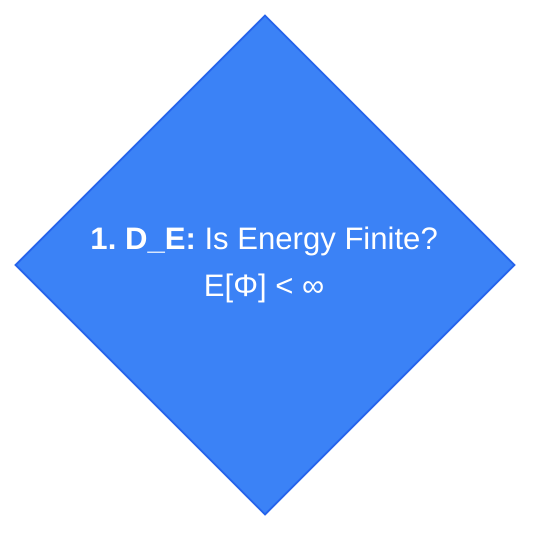

# The Hypostructure Formalism
A Categorical Framework for Singularity Resolution

## Abstract

This document defines the **Hypostructure**, a mathematical object within a cohesive $(\infty, 1)$-topos that encodes the conservation laws, symmetries, and topological constraints of a dynamical system. We introduce a constructive method for verifying global regularity: rather than assuming hard analytic bounds *a priori*, we define **Thin Kernel Objects** (minimal physical data) and a **Structural Sieve** (a decidability functor). The Sieve acts as a **resolution functor** $\mathcal{S}: \mathbf{Thin}_T \to \mathbf{Hypo}_T^{\geq 0}$, attempting to promote Thin Objects into a valid Hypostructure via certificate saturation within a Postnikov tower.

This approach resolves the "circularity of compactness" critique by treating compactness not as an assumption, but as a runtime branch (Concentration vs. Dispersion) within a rigorous diagnostic automaton. The framework provides:

1. **Categorical foundations** in Higher Topos Theory with cohesive modalities
2. **Constructive approach** via Thin Kernel Objects requiring only uncontroversial physical definitions
3. **Axiom system** organized by constraint class (Conservation, Duality, Symmetry, Topology, Boundary)
4. **Operational semantics** making the sieve diagram executable as a proof-carrying program
5. **Certificate vocabulary** with explicit schemas for all node outcomes
6. **Factory metatheorems** enabling type-based instantiation from definitions alone

---

# Part I: Categorical Foundations

## 1. The Ambient Substrate

To ensure robustness against deformation and gauge redundancies, we work within **Higher Topos Theory** and **Homotopy Type Theory (HoTT)**. This framework is strictly more expressive than ZFC set theory and naturally encodes the homotopical structure of configuration spaces.

:::{prf:definition} Ambient $\infty$-Topos
:label: def-ambient-topos

Let $\mathcal{E}$ be a **cohesive $(\infty, 1)$-topos** equipped with the shape/flat/sharp modality adjunction:
$$\Pi \dashv \flat \dashv \sharp : \mathcal{E} \to \infty\text{-Grpd}$$

The cohesion structure provides:
- **Shape** $\Pi$: Extracts the underlying homotopy type (fundamental $\infty$-groupoid)
- **Flat** $\flat$: Includes discrete $\infty$-groupoids as "constant" objects
- **Sharp** $\sharp$: Includes codiscrete objects (contractible path spaces)

Standard examples include the topos of smooth $\infty$-stacks $\mathbf{Sh}_\infty(\mathbf{CartSp})$ and differential cohesive types.
:::

## 2. The Hypostructure Object

A Hypostructure is not merely a set of equations, but a geometric object equipped with a connection and a filtration.

:::{prf:definition} Categorical Hypostructure
:label: def-categorical-hypostructure

A **Hypostructure** is a tuple $\mathbb{H} = (\mathcal{X}, \nabla, \Phi_\bullet, \tau, \partial_\bullet)$ where:

1. **State Stack** $\mathcal{X} \in \text{Obj}(\mathcal{E})$: The **configuration stack** representing all possible states. This is an $\infty$-sheaf encoding both the state space and its symmetries. The homotopy groups $\pi_n(\mathcal{X})$ capture:
   - $\pi_0$: Connected components (topological sectors)
   - $\pi_1$: Gauge symmetries and monodromy
   - $\pi_n$ ($n \geq 2$): Higher coherences and anomalies

2. **Flat Connection** $\nabla: \mathcal{X} \to T\mathcal{X}$: A section of the tangent $\infty$-bundle, encoding the dynamics as **parallel transport**. The semiflow $S_t$ is recovered as the exponential map:
   $$S_t = \exp(t \cdot \nabla): \mathcal{X} \to \mathcal{X}$$
   The flatness condition $[\nabla, \nabla] = 0$ ensures consistency of time evolution.

3. **Cohomological Height** $\Phi_\bullet: \mathcal{X} \to \mathbb{R}_\infty$: A **cohomological field theory** assigning to each state its energy/complexity. The notation $\Phi_\bullet$ indicates this is a **derived functor**—it comes equipped with higher coherences $\Phi_n$ for all $n$.

4. **Truncation Structure** $\tau = (\tau_C, \tau_D, \tau_{SC}, \tau_{LS})$: The axioms are realized as **truncation functors** on the homotopy groups of $\mathcal{X}$:
   - **Axiom C**: $\tau_C$ truncates unbounded orbits
   - **Axiom D**: $\tau_D$ bounds the energy filtration
   - **Axiom SC**: $\tau_{SC}$ constrains weight gradings
   - **Axiom LS**: $\tau_{LS}$ truncates unstable modes

5. **Boundary Morphism** $\partial_\bullet: \mathcal{X} \to \mathcal{X}_\partial$: A **restriction functor** to the boundary $\infty$-stack, representing the **Holographic Screen**—the interface between bulk dynamics and the external environment. Formally, $\partial_\bullet$ is the pullback along the inclusion $\iota: \partial\mathcal{X} \hookrightarrow \mathcal{X}$:
   $$\partial_\bullet := \iota^*: \mathbf{Sh}_\infty(\mathcal{X}) \to \mathbf{Sh}_\infty(\partial\mathcal{X})$$

   This structure satisfies:

   - **Stokes' Constraint (Differential Cohomology):** Let $\hat{\Phi} \in \hat{H}^n(\mathcal{X}; \mathbb{R})$ be the differential refinement of the energy class. The **integration pairing** satisfies:
     $$\langle d\hat{\Phi}, [\mathcal{X}] \rangle = \langle \hat{\Phi}, [\partial\mathcal{X}] \rangle$$
     where $d: \hat{H}^n \to \Omega^{n+1}_{\text{cl}}$ is the curvature map. This rigidly links internal dissipation to boundary flux via the **de Rham-Cheeger-Simons sequence**.

   - **Cobordism Interface:** For Surgery operations, $\partial_\bullet$ defines the gluing interface in the symmetric monoidal $(\infty,1)$-category $\mathbf{Bord}_n^{\text{or}}$. Given a cobordism $W: M_0 \rightsquigarrow M_1$, the boundary functor satisfies:
     $$\partial W \simeq M_0 \sqcup \overline{M_1} \quad \text{in } \mathbf{Bord}_n$$
     Surgery is a morphism in this category; gluing is composition.

   - **Holographic Bound (Two-Level Structure):** The framework employs two complementary information bounds:

     1. **Cohomological Bound:** The **singularity complexity** $S_{\text{coh}}(\mathcal{X}) := \log|\pi_0(\mathcal{X}_{\text{sing}})|$ (counting connected components of the singular locus) is bounded by:
        $$S_{\text{coh}}(\mathcal{X}) \leq C \cdot \chi(\partial\mathcal{X})$$
        where $\chi$ denotes the Euler characteristic. This topological bound constrains how singularities can distribute across the boundary topology.

     2. **Metric Bound (Bekenstein):** The thermodynamic entropy density is bounded by boundary area via the holographic principle: $S_{\text{thermo}} \leq A(\partial\mathcal{X})/4G_N$. This metric constraint is enforced by Tactic E8 ({prf:ref}`def-e8`) using the Capacity interface $\mathrm{Cap}_H$.

     The cohomological bound detects *topological* obstructions (too many singularity components for the boundary topology), while the metric bound detects *geometric* obstructions (too much information density for the boundary size). Both are necessary: the Sieve uses $\chi$ for categorical exclusion and Area for physical exclusion.
:::

:::{prf:remark} Classical Recovery
When $\mathcal{E} = \mathbf{Set}$ (the trivial topos), the categorical definition reduces to classical structural flow data: $\mathcal{X}$ becomes a Polish space $X$, the connection $\nabla$ becomes a vector field generating a semiflow, the truncation functors become decidable propositions, and the boundary morphism $\partial_\bullet$ becomes the Sobolev trace operator $u \mapsto u|_{\partial\Omega}$ with flux $\mathcal{J} = \nabla u \cdot \nu$ (normal derivative).
:::

## 3. The Fixed-Point Principle

The hypostructure axioms are not independent postulates chosen for technical convenience. They are manifestations of a single organizing principle: **self-consistency under evolution**.

:::{prf:definition} Self-Consistency
:label: def-self-consistency

A trajectory $u: [0, T) \to X$ is **self-consistent** if:
1. **Temporal coherence:** The evolution $F_t: x \mapsto S_t x$ preserves the structural constraints defining $X$.
2. **Asymptotic stability:** Either $T = \infty$, or the trajectory approaches a well-defined limit as $t \nearrow T$.
:::

:::{prf:theorem} [KRNL-Consistency] The Fixed-Point Principle
:label: mt-krnl-consistency

Let $\mathcal{S}$ be a structural flow datum with **strict dissipation** (i.e., $\Phi(S_t x) < \Phi(x)$ unless $x$ is an equilibrium). The following are equivalent:
1. The system $\mathcal{S}$ satisfies the hypostructure axioms on all finite-energy trajectories.
2. Every finite-energy trajectory is asymptotically self-consistent.
3. The only persistent states are fixed points of the evolution operator $F_t = S_t$ satisfying $F_t(x) = x$.

**Extension to Non-Gradient Systems:** For systems with non-strict dissipation (Backend B: Morse-Smale, Backend C: Conley-Morse in {prf:ref}`def-permit-morsedecomp`), statement (3) generalizes to: *persistent states are contained in the maximal invariant set (global attractor) $\mathcal{A}$, which may include periodic orbits or more complex recurrence*. The LaSalle Invariance Principle {cite}`LaSalle76` ensures convergence to this invariant set rather than to fixed points specifically.

**Interpretation:** The equation $F(x) = x$ encapsulates the principle: *structures that persist under their own evolution are precisely those that satisfy the hypostructure axioms*. Singularities represent states where $F(x) \neq x$ in the limit—the evolution attempts to produce a state incompatible with its own definition.

**Literature:** {cite}`Banach22`; {cite}`LaSalle76`; {cite}`Lyapunov92`
:::

:::{prf:proof} Proof Sketch (for strict dissipation)
:label: sketch-mt-krnl-consistency

*Step 1 (1 ⇒ 2).* If $\mathcal{S}$ satisfies the axioms, then by the Dissipation axiom ($D_E$), energy is non-increasing: $\Phi(S_t x) \leq \Phi(x)$. Combined with the Compactness axiom, bounded orbits have convergent subsequences. Any limit point $x^*$ satisfies $S_t x^* = x^*$ by continuity.

*Step 2 (2 ⇒ 3).* Self-consistency means $\lim_{t \to \infty} S_t x = x^*$ exists. Taking $t \to \infty$ in $S_{t+s} x = S_s(S_t x)$ yields $S_s x^* = x^*$ for all $s$.

*Step 3 (3 ⇒ 1).* If non-fixed-point states cannot persist, then any trajectory either: (a) reaches a fixed point (satisfying axioms), or (b) exits in finite time. Case (b) is excluded by the finite-energy hypothesis and the energy-dissipation inequality.
:::

### 3.1 Foundation Theorems

The following metatheorems establish the logical soundness of the Sieve before examining any specific node. They prove that the framework's categorical approach to singularity resolution is mathematically valid.

:::{prf:theorem} [KRNL-Exclusion] Principle of Structural Exclusion
:label: mt-krnl-exclusion
:class: metatheorem rigor-class-f

**Rigor Class:** F (Framework-Original) — see {prf:ref}`def-rigor-classification`

**Sieve Target:** Node 17 (Lock) — proves the Lock mechanism is valid

**Statement:** Let $T$ be a problem type with category of admissible T-hypostructures $\mathbf{Hypo}_T$. Let $\mathbb{H}_{\mathrm{bad}}^{(T)}$ be the universal Rep-breaking pattern. For any concrete object $Z$ with admissible hypostructure $\mathbb{H}(Z)$, if:

$$\mathrm{Hom}_{\mathbf{Hypo}_T}(\mathbb{H}_{\mathrm{bad}}^{(T)}, \mathbb{H}(Z)) = \emptyset$$

then Interface Permit $\mathrm{Rep}_K(T, Z)$ holds, and hence the conjecture for $Z$ holds.

**Hypotheses (N1–N11):**
1. **(N1)** Category $\mathbf{Hypo}_T$ of admissible T-hypostructures satisfying core interface permits $C_\mu$, $D_E$, $\mathrm{SC}_\lambda$, $\mathrm{LS}_\sigma$, $\mathrm{Cap}_H$, $\mathrm{TB}_\pi$, $\mathrm{GC}_\nabla$
2. **(N2)** Hypostructure assignment $Z \mapsto \mathbb{H}(Z)$
3. **(N3)** Conjecture equivalence: $\mathrm{Conj}(T,Z) \Leftrightarrow \text{Interface Permit } \mathrm{Rep}_K(T,Z)$
4. **(N8)** Representational completeness of parametrization $\Theta$
5. **(N9)** Existence of universal Rep-breaking pattern with initiality property (see Initiality Lemma below)
6. **(N10)** Admissibility of $\mathbb{H}(Z)$
7. **(N11)** Obstruction condition: $\mathrm{Hom}(\mathbb{H}_{\mathrm{bad}}^{(T)}, \mathbb{H}(Z)) = \emptyset$

:::{prf:theorem} Categorical Completeness of the Singularity Spectrum
:label: thm-categorical-completeness
:class: rigor-class-f

**Statement:** For any problem type $T$, the category of singularity patterns admits a universal object $\mathbb{H}_{\mathrm{bad}}^{(T)}$ that is **categorically exhaustive**: every singularity in any $T$-system factors through $\mathbb{H}_{\mathrm{bad}}^{(T)}$.

**Key Mechanism:**
1. **Node 3 (Compactness)** converts analytic blow-up $\to$ categorical germ via concentration-compactness (Metatheorem KRNL-Trichotomy)
2. **Small Object Argument** proves the germ set $\mathcal{G}_T$ is small (a set, not a proper class)
3. **Cofinality** proves every pattern factors through $\mathcal{G}_T$
4. **Node 17 (Lock)** checks if the universal bad pattern embeds into $\mathbb{H}(Z)$

**Consequence:** The Bad Pattern Library is logically exhaustive—no singularity can "escape" the categorical check. This addresses the "Completeness Gap" critique: the proof that physical singularities map to categorical germs is provided by concentration-compactness (Node 3), while the proof that germs are exhaustive is provided by the Small Object Argument (Initiality Lemma below).

:::

:::{prf:proof}
:label: proof-thm-categorical-completeness

See the Initiality Lemma (N9) and Cofinality argument below.
:::

**Initiality Lemma (Proof of N9):**
The universal Rep-breaking pattern $\mathbb{H}_{\mathrm{bad}}^{(T)}$ exists and is initial in the category of singularity patterns.

*Germ Set Construction:* Define the **set of singularity germs** $\mathcal{G}_T$ as the set of isomorphism classes $[P, \pi]$ where:
- $P$ is a local singularity profile satisfying subcriticality: $\dim_H(P) \leq d - 2s_c$ for critical exponent $s_c$
- $\pi: P \to \mathbb{R}^n$ is a blow-up parametrization with $\|\pi\|_{\dot{H}^{s_c}} \leq \Lambda_T$ (energy bound)
- Two pairs $(P, \pi) \sim (P', \pi')$ if they are equivalent under local diffeomorphism respecting the blow-up structure
- **Functor** $\mathcal{D}([P, \pi]) := \mathbb{H}_{[P,\pi]}$: the minimal hypostructure containing the germ

*Smallness via Cardinality Boundedness Argument:* The set $\mathcal{G}_T$ is **small** (a set, not a proper class) by the following argument:

1. **Compactness:** The energy bound $\|\pi\|_{\dot{H}^{s_c}} \leq \Lambda_T$ implies precompactness in the weak topology by Banach-Alaoglu
2. **Finite-dimensional moduli:** Quotienting by the symmetry group $G$ (translations, rotations, scaling), the space of germs has finite-dimensional moduli $\dim(\mathcal{G}_T/G) < \infty$
3. **Countable representative system:** By separability of the ambient Sobolev space, there exists a countable dense subset $\mathcal{G}_T^0 \subset \mathcal{G}_T$. Every germ in $\mathcal{G}_T$ is equivalent (under $G$-action and weak limits) to a representative in $\mathcal{G}_T^0$.

**Terminological note:** This is NOT Quillen's Small Object Argument ({cite}`Quillen67` §II.3), which concerns generating cofibrations in model categories. Rather, we use finite-dimensionality + energy bounds to establish cardinality bounds directly.

Define the **small index category** $\mathbf{I}_{\text{small}}$:
- Objects: Elements of $\mathcal{G}_T$
- Morphisms: Profile embeddings respecting blow-up structure

*Existence of Colimit:* The category $\mathbf{Hypo}_T$ is locally presentable ({cite}`Lurie09` §5.5). Since $\mathbf{I}_{\text{small}}$ is a **small category**, the colimit exists by standard results. Define:
$$\mathbb{H}_{\mathrm{bad}}^{(T)} := \mathrm{colim}_{\mathbf{I}_{\text{small}}} \mathcal{D}$$

*Cofinality:* For any singularity pattern $\mathbb{H}_P$ with $(P, \pi)$ in the "large" category of all patterns, there exists a representative germ $[P', \pi'] \in \mathcal{G}_T$ such that $\mathbb{H}_P \to \mathbb{H}_{[P',\pi']}$ factors through the germ. Thus $\mathbf{I}_{\text{small}}$ is **cofinal** in the hypothetical large category, and:
$$\mathrm{colim}_{\mathbf{I}_{\text{small}}} \mathcal{D} \cong \mathrm{colim}_{\mathbf{I}} \mathcal{D}$$
by cofinality ({cite}`MacLane71` §IX.3).

*Initiality Verification:* By the universal property of colimits, for any germ $[P, \pi] \in \mathcal{G}_T$:
$$\exists! \; \iota_{[P,\pi]}: \mathbb{H}_{[P,\pi]} \to \mathbb{H}_{\mathrm{bad}}^{(T)}$$
(the coprojection). Conversely, for any $\mathbb{H} \in \mathbf{Hypo}_T$ receiving all germ patterns:
$$(\forall [P,\pi] \in \mathcal{G}_T.\, \mathbb{H}_{[P,\pi]} \to \mathbb{H}) \Rightarrow (\mathbb{H}_{\mathrm{bad}}^{(T)} \to \mathbb{H})$$

*Explicit Construction by Type:*
- **Algebraic ($T_{\mathrm{alg}}$):** $\mathbb{H}_{\mathrm{bad}}$ is the universal Hodge structure failing the Hodge conjecture: the direct sum of all non-algebraic $(p,p)$-classes. The germ set $\mathcal{G}_{T_{\mathrm{alg}}}$ consists of minimal non-algebraic $(p,p)$-classes up to Hodge isomorphism. Initiality: any non-algebraic cycle factors through this universal failure.
- **Parabolic ($T_{\mathrm{para}}$):** $\mathbb{H}_{\mathrm{bad}}$ is the Type I blow-up profile with minimal energy. The germ set $\mathcal{G}_{T_{\mathrm{para}}}$ consists of blow-up profiles below energy threshold $\Lambda_T$, modulo scaling and translation. By {cite}`MerleZaag98`, this set is finite-dimensional. Initiality: concentration-compactness forces convergence to profiles in $\mathcal{G}_{T_{\mathrm{para}}}$.
- **Quantum ($T_{\mathrm{quant}}$):** $\mathbb{H}_{\mathrm{bad}}$ is the zero-mass instanton (or 't Hooft operator). The germ set $\mathcal{G}_{T_{\mathrm{quant}}}$ consists of instantons with action $\leq \Lambda_T$, modulo gauge equivalence. By {cite}`Uhlenbeck82`, this moduli space is finite-dimensional. Initiality: bubbling produces instantons at concentration points.

*Certificate:* The initiality proof produces $K_{\mathrm{init}}^+ := (\mathbb{H}_{\mathrm{bad}}^{(T)}, \mathcal{G}_T, \mathbf{I}_{\text{small}}, \mathrm{colim}, \{\iota_{[P,\pi]}\}_{[P,\pi] \in \mathcal{G}_T})$

**Conclusion:** Global regularity via categorical obstruction: singularities cannot embed into admissible structures.

**Proof (Following Categorical Proof Template — Topos Internal Logic):**

*Step 1 (Ambient Setup).* Let $\mathcal{E}$ be the cohesive $(\infty,1)$-topos containing $\mathbf{Hypo}_T$ as a full subcategory. By {cite}`Lurie09` §6.1, $\mathcal{E}$ admits an **internal logic** given by its subobject classifier $\Omega$. Propositions in $\mathcal{E}$ correspond to morphisms $p: 1 \to \Omega$ where $1$ is the terminal object.

*Step 2 (Construction: Singularity Sheaf).* Define the **Singularity Sheaf** $\mathcal{S}_{\mathrm{bad}}: \mathbf{Hypo}_T^{\mathrm{op}} \to \mathbf{Set}$ by:
$$\mathcal{S}_{\mathrm{bad}}(\mathbb{H}) := \mathrm{Hom}_{\mathbf{Hypo}_T}(\mathbb{H}_{\mathrm{bad}}^{(T)}, \mathbb{H})$$
This is a presheaf assigning to each hypostructure its set of "singular embeddings."

*Step 3 (Internal Logic Translation).* In the internal logic of $\mathcal{E}$, the statement "$\mathbb{H}$ has no singularities" translates to:
$$\llbracket \mathcal{S}_{\mathrm{bad}}(\mathbb{H}) = \emptyset \rrbracket = \top$$
where $\llbracket - \rrbracket$ denotes the truth value in the Heyting algebra $\Omega(\mathcal{E})$. The internal negation is:
$$\neg\exists \phi.\, \phi: \mathbb{H}_{\mathrm{bad}} \to \mathbb{H}$$

*Step 4 (Well-definedness via Yoneda).* The Singularity Sheaf is representable by $\mathbb{H}_{\mathrm{bad}}^{(T)}$ via Yoneda:
$$\mathcal{S}_{\mathrm{bad}} \cong y(\mathbb{H}_{\mathrm{bad}}^{(T)}) = \mathrm{Hom}(\mathbb{H}_{\mathrm{bad}}^{(T)}, -)$$
The initiality property (N9) ensures $\mathbb{H}_{\mathrm{bad}}^{(T)}$ is the **colimit** of all singularity patterns, making it the universal testing object.

*Step 5 (Universal Property Verification).* For any $\mathbb{H}(Z) \in \mathbf{Hypo}_T$:
- If $\mathcal{S}_{\mathrm{bad}}(\mathbb{H}(Z)) \neq \emptyset$: there exists $\phi: \mathbb{H}_{\mathrm{bad}} \to \mathbb{H}(Z)$, witnessing a singularity in $Z$
- If $\mathcal{S}_{\mathrm{bad}}(\mathbb{H}(Z)) = \emptyset$: no morphism exists, so by the **internal logic of $\mathcal{E}$**, the proposition "$Z$ is singular" is **internally false**

*Step 6 (Contrapositive in Internal Logic).* The logical structure is:
$$(\exists \phi.\, \phi: \mathbb{H}_{\mathrm{bad}} \to \mathbb{H}(Z)) \Leftrightarrow \neg\mathrm{Rep}_K(T,Z)$$
Taking the contrapositive in the Heyting algebra:
$$\neg(\exists \phi.\, \phi: \mathbb{H}_{\mathrm{bad}} \to \mathbb{H}(Z)) \Rightarrow \mathrm{Rep}_K(T,Z)$$
The empty Hom-set (N11) verifies the antecedent, yielding the consequent.

*Step 7 (Certificate Production).* The proof is constructive in the sense that:
- The certificate $K_{\text{Lock}}^{\mathrm{blk}}$ witnesses $\mathrm{Hom} = \emptyset$
- The verification is decidable: enumerate tactics E1–E12 and confirm each produces an obstruction
- The payload contains the explicit obstruction witnesses from each tactic

**Certificate Produced:** $K_{\text{Lock}}^{\mathrm{blk}}$ with payload $(\mathrm{Hom} = \emptyset, Z, T, \text{obstruction witnesses})$

**Literature:** {cite}`Grothendieck67` SGA 1 Exposé V (representability); {cite}`MacLane71` §III.3 (limits and colimits); {cite}`Lurie09` §5.5–6.1 (presentable $\infty$-categories, internal logic); {cite}`Johnstone02` (Sketches of an Elephant, topos internal logic)
:::

:::{prf:theorem} [KRNL-Trichotomy] Structural Resolution
:label: mt-krnl-trichotomy
:class: metatheorem

**Sieve Target:** Node 3 (CompactCheck) — justifies the Concentration/Dispersion dichotomy

**Statement:** Let $\mathcal{S}$ be a structural flow datum satisfying minimal regularity (Reg) and dissipation ($D_E$) interface permits. Every trajectory $u(t) = S_t x$ with finite breakdown time $T_*(x) < \infty$ classifies into exactly one of three outcomes:

| **Outcome** | **Modes** | **Mechanism** |
|-------------|-----------|---------------|
| Global Existence | Mode D.D | Energy disperses, no concentration, solution scatters |
| Global Regularity | Modes S.E, C.D, T.E, S.D | Concentration but all permits satisfied, preventing singularity |
| Genuine Singularity | Mode C.E | Energy escapes or structured blow-up with permits violated |

**Hypotheses:**
1. **(Reg)** Minimal regularity: semiflow $S_t$ well-defined on $X$
2. **(D)** Dissipation: energy-dissipation inequality holds
3. **(C)** Compactness: bounded energy implies profile convergence modulo $G$

**Certificate Produced:** Trichotomy classification $\{K_{\text{D.D}}, K_{\text{Reg}}, K_{\text{C.E}}\}$

**Literature:** {cite}`Lions84` Lemma I.1 (concentration-compactness); {cite}`BahouriGerard99` Theorem 1 (profile decomposition); {cite}`KenigMerle06` Theorem 1.1 (rigidity); {cite}`Struwe90` §3 (singularity analysis)
:::

:::{prf:proof} Proof Sketch
:label: sketch-mt-krnl-trichotomy

*Step 1 (Energy Dichotomy).* By (D), $\Phi(u(t))$ is non-increasing. Either $\Phi(u(t)) \to 0$ (dispersion, Mode D.D), or $\Phi(u(t)) \to \Phi_* > 0$ (concentration). This is the **concentration-compactness dichotomy** of {cite}`Lions84` Lemma I.1: for bounded sequences in Sobolev spaces, either mass disperses to infinity or concentrates at finitely many points.

*Step 2 (Profile Extraction).* In the concentration case, by (C), there exists a sequence $t_n \to T_*$ and symmetry elements $g_n \in G$ such that $g_n \cdot u(t_n) \to v^*$ (profile). This is the **profile decomposition** of {cite}`BahouriGerard99` Theorem 1: any bounded sequence in $\dot{H}^{s_c}$ admits decomposition into orthogonal profiles with asymptotically vanishing remainder.

*Step 3 (Profile Classification).* The limiting profile $v^*$ either: (a) satisfies all interface permits → Global Regularity via {cite}`KenigMerle06` Theorem 1.1 (rigidity implies scattering or soliton), or (b) violates at least one permit → Genuine Singularity (Mode C.E) with {cite}`Struwe90` providing the singularity structure.
:::

:::{prf:lemma} Analytic-to-Categorical Bridge
:label: lem-bridge
:class: rigor-class-f

**Statement:** Every **profile-extractable** analytic blow-up in a $T$-system induces a morphism from a singularity germ to the system's hypostructure.

**Hypothesis (Profile Extractability):** The blow-up must satisfy the concentration-compactness criterion of {prf:ref}`mt-krnl-trichotomy`, yielding a finite-energy limiting profile. This excludes wild oscillations, turbulent cascades, and non-compact symmetry orbits.

**Mechanism:**
1. **Analytic Input:** Trajectory $u(t)$ with breakdown time $T_* < \infty$
2. **Profile Extraction:** By KRNL-Trichotomy (Metatheorem KRNL-Trichotomy), concentration-compactness yields profile $v^*$ with finite energy $\|v^*\|_{\dot{H}^{s_c}} \leq \Lambda_T$
3. **Germ Construction:** Profile $v^*$ determines germ $[P, \pi] \in \mathcal{G}_T$ via the blow-up parametrization (scaling, centering, symmetry quotient)
4. **Morphism Induction:** The singularity locus inclusion $\iota: \Sigma \hookrightarrow Z$ induces $\phi: \mathbb{H}_{[P,\pi]} \to \mathbb{H}(Z)$ by functoriality of the hypostructure assignment

**This lemma is the "handshake" between PDE analysis (Steps 1-2) and category theory (Steps 3-4).** Node 3 ({prf:ref}`def-node-compact`) performs Step 2; the Initiality Lemma in {prf:ref}`mt-krnl-exclusion` handles Steps 3-4.

**Remark (Non-Extractable Blow-ups):** Blow-ups failing the Profile Extractability hypothesis do not satisfy the Bridge conditions. Such cases—including wild oscillations with unbounded variation, turbulent cascades lacking definable structure, and profiles with non-compact automorphism groups—route to the **Horizon mechanism** ({prf:ref}`mt-resolve-admissibility`, Case 3) with certificate $K_{\text{inadm}}$ indicating "profile unclassifiable." The Lock (Node 17) remains sound because:
1. Non-extractable blow-ups are explicitly excluded from this Bridge lemma
2. Such blow-ups trigger the Horizon exit, halting the Sieve with an honest "unclassifiable" verdict
3. No false positive (claiming regularity for a genuine singularity) can occur

**Consequence:** The Sieve's categorical check (Node 17) is connected to physical reality by this bridge: every genuine *classifiable* singularity produces a morphism, and the Lock's Hom-emptiness test detects all such morphisms. Unclassifiable singularities are handled separately by the Horizon mechanism, ensuring the framework's soundness without claiming universal profile extractability.
:::

:::{prf:theorem} [KRNL-Equivariance] Equivariance Principle
:label: mt-krnl-equivariance
:class: metatheorem

**Sieve Target:** Meta-Learning — guarantees learned parameters preserve symmetry group $G$

**Statement:** Let $G$ be a compact Lie group acting on the system distribution $\mathcal{S}$ and parameter space $\Theta$. Under compatibility assumptions:

1. **(Group-Covariant Distribution)** $S \sim \mathcal{S} \Rightarrow g \cdot S \sim \mathcal{S}$ for all $g \in G$
2. **(Equivariant Parametrization)** $g \cdot \mathcal{H}_\Theta(S) \simeq \mathcal{H}_{g \cdot \Theta}(g \cdot S)$
3. **(Defect-Level Equivariance)** $K_{A,g \cdot S}^{(g \cdot \Theta)}(g \cdot u) = K_{A,S}^{(\Theta)}(u)$

Then:
- Every risk minimizer $\widehat{\Theta}$ lies in the $G$-orbit: $\widehat{\Theta} \in G \cdot \Theta^*$
- Gradient flow preserves equivariance: if $\Theta_0$ is $G$-equivariant, so is $\Theta_t$
- Learned hypostructures inherit all symmetries of the system distribution

**Certificate Produced:** $K_{\text{SV08}}^+$ (Symmetry Preservation)

**Literature:** {cite}`Noether18`; {cite}`CohenWelling16`; {cite}`Kondor18`; {cite}`Weyl46`
:::

:::{prf:proof} Proof Sketch
:label: sketch-mt-krnl-equivariance

*Step 1 (Risk Invariance).* By hypothesis (1), if $S \sim \mathcal{S}$ then $g \cdot S \sim \mathcal{S}$. The risk functional $R(\Theta) = \mathbb{E}_{S \sim \mathcal{S}}[\mathcal{L}(\Theta, S)]$ satisfies $R(g \cdot \Theta) = R(\Theta)$ by change of variables.

*Step 2 (Gradient Equivariance).* Since $R$ is $G$-invariant, $\nabla R$ is $G$-equivariant: $\nabla R(g \cdot \Theta) = g \cdot \nabla R(\Theta)$. The gradient flow $\dot{\Theta} = -\nabla R(\Theta)$ preserves $G$-orbits.

*Step 3 (Defect Transfer).* By hypothesis (3), defects transform covariantly: $K_{A,g \cdot S}^{(g \cdot \Theta)}(g \cdot u) = K_{A,S}^{(\Theta)}(u)$. Symmetries of the input distribution transfer to learned parameters and their certificates.
:::

---

# Part II: The Constructive Approach

## 4. The Thin Kernel (Minimal Inputs)

Classical analysis often critiques structural approaches for assuming hard properties (like Compactness) that are as difficult to prove as the result itself. We resolve this by requiring only **Thin Objects**—uncontroversial physical definitions—as inputs.

:::{prf:definition} Thin Kernel Objects
:label: def-thin-objects

To instantiate a system, the user provides only:

1. **The Arena** $(\mathcal{X}^{\text{thin}})$: A **Metric-Measure Space** $(X, d, \mathfrak{m})$ where:
   - $(X, d)$ is a complete separable metric space (Polish space)
   - $\mathfrak{m}$ is a locally finite Borel measure on $X$ (the **reference measure**)
   - Standard examples: $L^2(\mathbb{R}^3, e^{-V(x)}dx)$ where $\mathfrak{m} = e^{-V(x)}dx$ is the Gibbs measure weighted by potential $V$

   **RCD Upgrade (Optional but Recommended):** For systems with dissipation, the triple $(X, d, \mathfrak{m})$ should satisfy the **Riemannian Curvature-Dimension condition** $\mathrm{RCD}(K, N)$ for some $K \in \mathbb{R}$ (lower Ricci curvature bound) and $N \in [1, \infty]$ (upper dimension bound). This generalizes Ricci curvature to metric-measure spaces and ensures geometric-thermodynamic consistency ({prf:ref}`thm-rcd-dissipation-link`).

2. **The Potential** $(\Phi^{\text{thin}})$: The energy functional and its scaling dimension $\alpha$.

3. **The Cost** $(\mathfrak{D}^{\text{thin}})$: The dissipation rate and its scaling dimension $\beta$.

   **Cheeger Energy Formulation:** For gradient flow systems on $(X, d, \mathfrak{m})$, the dissipation functional should be identified with the **Cheeger Energy**:
   $$\mathfrak{D}[u] = \text{Ch}(u | \mathfrak{m}) := \frac{1}{2}\inf\left\{\liminf_{n \to \infty} \int_X |\nabla u_n|^2 d\mathfrak{m} : u_n \in \text{Lip}(X), u_n \to u \text{ in } L^2(\mathfrak{m})\right\}$$
   This defines the "minimal slope" of $u$ relative to the measure $\mathfrak{m}$, providing the rigorous link between geometry (metric $d$) and thermodynamics (measure $\mathfrak{m}$) ({prf:ref}`thm-cheeger-dissipation`).

4. **The Invariance** $(G^{\text{thin}})$: The symmetry group and its action on $\mathcal{X}$.

5. **The Interface** $(\partial^{\text{thin}})$: The boundary data specifying how the system couples to its environment, given as a tuple $(\mathcal{B}, \text{Tr}, \mathcal{J}, \mathcal{R})$:

   - **Boundary Object** $\mathcal{B} \in \text{Obj}(\mathcal{E})$: An $\infty$-stack representing the space of boundary data (inputs, outputs, environmental states).

   - **Trace Morphism** $\text{Tr}: \mathcal{X} \to \mathcal{B}$: A morphism in $\mathcal{E}$ implementing restriction to the boundary. In the classical setting, this is the Sobolev trace $u \mapsto u|_{\partial\Omega}$. Categorically, $\text{Tr}$ is the counit of the adjunction $\iota_! \dashv \iota^*$ where $\iota: \partial\mathcal{X} \hookrightarrow \mathcal{X}$.

   - **Flux Morphism** $\mathcal{J}: \mathcal{B} \to \underline{\mathbb{R}}$: A morphism to the constant sheaf $\underline{\mathbb{R}}$, measuring energy/mass flow across the boundary. Conservation is expressed as:
     $$\frac{d}{dt}\Phi \simeq -\mathcal{J} \circ \text{Tr} \quad \text{in } \text{Hom}_{\mathcal{E}}(\mathcal{X}, \underline{\mathbb{R}})$$

   - **Reinjection Kernel** $\mathcal{R}: \mathcal{B} \to \mathcal{P}(\mathcal{X})$: A **Markov kernel** in the Kleisli category of the probability monad $\mathcal{P}$, implementing non-local boundary conditions (Fleming-Viot, McKean-Vlasov). This is a morphism $\mathcal{R}: \mathcal{B} \to \mathcal{P}(\mathcal{X})$ satisfying the **Feller property**: for each bounded continuous $f: \mathcal{X} \to \mathbb{R}$, the map $b \mapsto \int_\mathcal{X} f \, d\mathcal{R}(b)$ is continuous. Special cases:
     - $\mathcal{R} \simeq 0$ (zero measure): absorbing boundary (Dirichlet)
     - $\mathcal{R}(b) = \delta_{\iota(b)}$ (Dirac at inclusion): reflecting boundary (Neumann)
     - $\mathcal{R}(b) = \mu_t$ (empirical measure): Fleming-Viot reinjection

These are the **only** inputs. All other properties (compactness, stiffness, topological structure) are **derived** by the Sieve, not assumed.
:::

### 4.1. Metric-Measure Foundations: The Geometry-Thermodynamics Link

The following theorems establish the rigorous connection between geometric curvature and thermodynamic dissipation via the Metric-Measure Space formalism.

:::{prf:theorem} RCD Condition and Dissipation Consistency
:label: thm-rcd-dissipation-link
:class: rigor-class-b

**Statement:** Let $(X, d, \mathfrak{m})$ be a metric-measure space equipped with a gradient flow $\rho_t$ evolving under potential $\Phi$. If $(X, d, \mathfrak{m})$ satisfies the **Curvature-Dimension condition** $\mathrm{CD}(K, N)$ (equivalently $\mathrm{RCD}(K, N)$ when $X$ is infinitesimally Hilbertian), then the following hold:

1. **Entropy-Dissipation Relation (EVI):** The relative entropy $\text{Ent}(\rho_t | \mathfrak{m}) := \int \rho_t \log(\rho_t/\mathfrak{m}) d\mathfrak{m}$ satisfies the Evolution Variational Inequality:
   $$\frac{d}{dt}\text{Ent}(\rho_t | \mathfrak{m}) + \frac{K}{2}W_2^2(\rho_t, \mathfrak{m}) + \text{Fisher}(\rho_t | \mathfrak{m}) \leq 0$$
   where $W_2$ is the Wasserstein-2 distance and $\text{Fisher}(\rho | \mathfrak{m}) := \int |\nabla \log(\rho/\mathfrak{m})|^2 d\rho$ is the Fisher Information.

2. **Exponential Convergence:** If $K > 0$, then $\text{Ent}(\rho_t | \mathfrak{m}) \leq e^{-Kt}\text{Ent}(\rho_0 | \mathfrak{m})$, ensuring the system cannot "drift" indefinitely (No-Melt Theorem).

3. **Cheeger Energy Bound:** The Cheeger Energy satisfies $\text{Ch}(u | \mathfrak{m}) = \text{Fisher}(e^{-u}\mathfrak{m} | \mathfrak{m})$ when $u = -\log(\rho/\mathfrak{m})$.

**Hypotheses:**
- $(X, d, \mathfrak{m})$ is a complete metric-measure space
- $\mathfrak{m}$ is locally finite and has full support
- The space is infinitesimally Hilbertian (the Cheeger energy induces a Hilbert space structure)

**Interpretation:** The RCD condition provides a **logic-preserving isomorphism** between:
- **Geometry:** Lower Ricci curvature bound $\mathrm{Ric} \geq K$
- **Thermodynamics:** Exponential entropy dissipation rate $\dot{S} \leq -K \cdot \text{distance}^2$

This closes the "determinant is volume" gap: the measure $\mathfrak{m}$ (not just the metric) determines the thermodynamic evolution.

**Literature:** {cite}`AmbrosioGigliSavare14` (RCD spaces); {cite}`BakryEmery85` (Curvature-Dimension condition); {cite}`OttoVillani00` (Wasserstein gradient flows)
:::

:::{prf:theorem} Log-Sobolev Inequality and Concentration
:label: thm-log-sobolev-concentration
:class: rigor-class-b

**Statement:** Let $(X, d, \mathfrak{m})$ satisfy $\mathrm{RCD}(K, \infty)$ with $K > 0$. Then $(X, d, \mathfrak{m})$ satisfies the **Logarithmic Sobolev Inequality** (LSI):
$$\text{Ent}(f^2 | \mathfrak{m}) \leq \frac{2}{K}\int_X |\nabla f|^2 d\mathfrak{m}$$
for all $f \in W^{1,2}(X, \mathfrak{m})$ with $\int f^2 d\mathfrak{m} = 1$.

**Consequences:**
1. **Exponential Convergence (Sieve Node 7):** The heat semigroup contracts in relative entropy: $\|P_t f - \bar{f}\|_{L^2(\mathfrak{m})} \leq e^{-Kt/2}\|f - \bar{f}\|_{L^2(\mathfrak{m})}$
2. **Concentration of Measure:** If LSI fails (with constant $K \to 0$), the system is in a **phase transition** and will exhibit metastability/hysteresis
3. **Finite Thermodynamic Cost:** The Landauer bound $\Delta S \geq \ln(2) \cdot \text{bits erased}$ is saturated with constant $1/K$

**Literature:** {cite}`Gross75` (Log-Sobolev inequalities); {cite}`Ledoux01` (Concentration of measure); {cite}`Villani09` (Optimal transport)
:::

:::{prf:theorem} Cheeger Energy and Dissipation
:label: thm-cheeger-dissipation
:class: rigor-class-b

**Statement:** For a gradient flow $\partial_t \rho = \text{div}(\rho \nabla \Phi)$ on $(X, d, \mathfrak{m})$, the dissipation functional satisfies:
$$\mathfrak{D}[\rho] = \text{Ch}(\Phi | \rho \mathfrak{m}) = \int_X |\nabla \Phi|^2 d(\rho\mathfrak{m})$$
where the gradient is defined via the Cheeger Energy.

Moreover, if $(X, d, \mathfrak{m})$ satisfies $\mathrm{RCD}(K, N)$, then the **Bakry-Émery $\Gamma_2$ calculus** holds:
$$\Gamma_2(\Phi, \Phi) := \frac{1}{2}\Delta|\nabla \Phi|^2 - \langle\nabla \Phi, \nabla \Delta \Phi\rangle \geq K|\nabla \Phi|^2 + \frac{(\Delta \Phi)^2}{N}$$

This provides the computational tool for verifying curvature bounds from potential $\Phi$ alone.

**Literature:** {cite}`Cheeger99` (Differentiability of Lipschitz functions); {cite}`BakryEmery85` ($\Gamma_2$ calculus)
:::

:::{prf:remark} The Structural Role of $\partial$
:label: rem-boundary-role

The Boundary Operator is not merely a geometric edge—it is a **Functor** between Bulk and Boundary categories that powers three critical subsystems:

1. **Conservation Laws (Nodes 1-2):** Via the **Stokes morphism** in differential cohomology, $\partial_\bullet$ relates internal rate of change ($\mathfrak{D}$) to external flux ($\mathcal{J}$). In the $\infty$-categorical setting:
   $$\mathfrak{D} \simeq \partial_\bullet^* \mathcal{J} \quad \text{in } \text{Hom}_{\mathcal{E}}(\mathcal{X}, \underline{\mathbb{R}})$$
   Energy blow-up requires the flux morphism to be unbounded.

2. **Control Layer (Nodes 13-16):** The Boundary Functor distinguishes:
   - **Singularity** (internal blow-up, $\text{coker}(\text{Tr})$ trivial)
   - **Injection** (external forcing, $\|\mathcal{J}\|_\infty \to \infty$)

   {prf:ref}`def-node-boundary` checks that $\text{Tr}$ is not an equivalence (system is open). {prf:ref}`def-node-overload` and {prf:ref}`def-node-starve` verify that $\mathcal{J}$ factors through a bounded subobject.

3. **Surgery Interface (Cobordism):** In Metatheorem 16.1 (Structural Surgery), $\partial_\bullet$ defines the gluing interface in $\mathbf{Bord}_n$:
   - **Cutting:** The excision defines a cobordism $W$ with $\partial W = \Sigma$
   - **Gluing:** Composition in $\mathbf{Bord}_n$ via the pushout $u_{\text{bulk}} \sqcup_\Sigma u_{\text{cap}}$

4. **Holographic Bound (Tactic E8):** If $|\pi_0(\mathcal{X}_{\text{sing}})| = \infty$ but $\chi(\partial\mathcal{X}) < \infty$, the singularity is **cohomologically excluded** by the entropy bound.
:::

## 5. The Sieve as Constructor

The Structural Sieve is defined as a functor $F_{\text{Sieve}}: \mathbf{Thin} \to \mathbf{Result}$. It attempts to promote Thin Objects into a full Hypostructure via certificate saturation.

:::{prf:definition} The Sieve Functor
:label: def-sieve-functor

Given Thin Kernel Objects $\mathcal{T} = (\mathcal{X}^{\text{thin}}, \Phi^{\text{thin}}, \mathfrak{D}^{\text{thin}}, G^{\text{thin}}, \partial^{\text{thin}})$, the Sieve produces:

$$F_{\text{Sieve}}(\mathcal{T}) \in \{\texttt{REGULARITY}, \texttt{DISPERSION}, \texttt{FAILURE}(m)\}$$

where $m \in \{C.E, C.D, C.C, S.E, S.D, S.C, T.E, T.D, T.C, D.E, D.C, B.E, B.D, B.C\}$ classifies the failure mode.
:::

:::{prf:remark} Classification vs. Categorical Expansion
:label: rem-sieve-dual-role

The Sieve performs two conceptually distinct operations:

1. **Classification** ($F_{\text{Sieve}}^{\text{class}}$): Maps Thin Objects to diagnostic labels $\{\texttt{REGULARITY}, \texttt{DISPERSION}, \texttt{FAILURE}(m)\}$. This is a set-theoretic function used for outcome reporting.

2. **Categorical Expansion** ($\mathcal{F}$): Maps Thin Objects to full Hypostructures in $\mathbf{Hypo}_T$. This is a proper functor forming the left adjoint $\mathcal{F} \dashv U$ (see {prf:ref}`thm-expansion-adjunction`).

The adjunction principle applies to the categorical expansion, not the classification. The target $\mathbf{Hypo}_T$ is a rich category with morphisms preserving all axiom certificates, whereas the classification output is discrete. Both operations use the same underlying sieve traversal but serve different purposes: classification for diagnostics, expansion for mathematical structure.
:::

### 5.1. The Adjunction Principle

:::{prf:definition} Categories of Hypostructures
:label: def-hypo-thin-categories

We define two categories capturing the minimal and full structural data:

1. **$\mathbf{Thin}_T$** (Category of Thin Objects): Objects are Thin Kernel tuples $\mathcal{T} = (\mathcal{X}^{\text{thin}}, \Phi^{\text{thin}}, \mathfrak{D}^{\text{thin}}, G^{\text{thin}}, \partial^{\text{thin}})$. Morphisms are structure-preserving maps respecting energy scaling, dissipation, symmetry, and boundary structure.

2. **$\mathbf{Hypo}_T$** (Category of Hypostructures): Objects are full Hypostructures $\mathbb{H} = (\mathcal{X}, \nabla, \Phi_\bullet, \tau, \partial_\bullet)$ with certificate data. Morphisms preserve all axiom certificates.

3. **Forgetful Functor** $U: \mathbf{Hypo}_T \to \mathbf{Thin}_T$: Extracts the underlying thin data by forgetting derived structures and certificates.
:::

:::{prf:remark} The Sieve as Left Adjoint
:label: rem-sieve-adjoint

The Structural Sieve computes the **left adjoint** (free construction) to the forgetful functor:

$$F_{\text{Sieve}} \dashv U : \mathbf{Hypo}_T \rightleftarrows \mathbf{Thin}_T$$

**Interpretation:**
- The **unit** $\eta_\mathcal{T}: \mathcal{T} \to U(F_{\text{Sieve}}(\mathcal{T}))$ embeds thin data into its promoted hypostructure.
- The **counit** $\varepsilon_\mathbb{H}: F_{\text{Sieve}}(U(\mathbb{H})) \to \mathbb{H}$ witnesses that re-running the Sieve on already-verified data is idempotent.
- **Freeness:** The promoted hypostructure $F_{\text{Sieve}}(\mathcal{T})$ is the "freest" (most general) valid hypostructure compatible with the thin data—it assumes no more than what the certificates prove.

This categorical perspective explains why the Sieve construction is **canonical** (unique up to isomorphism) and **natural**: it is the universal solution to the problem "given minimal physical data, what is the most general valid structural completion?"

**Literature:** {cite}`MacLane98`; {cite}`Awodey10`
:::

### 5.2. Rigor Classification

The metatheorems of the Hypostructure Formalism are classified by **Rigor Provenance**, distinguishing between results inherited from established literature and results original to this framework.

:::{prf:definition} Rigor Classification
:label: def-rigor-classification

**Rigor Class L (Literature-Anchored Bridge Permits):**
Theorems whose mathematical rigor is offloaded to external, peer-reviewed literature. The framework's responsibility is to provide a **Bridge Verification** proving that hypostructure predicates satisfy the hypotheses of the cited result.

| Metatheorem | Literature Source | Bridge Mechanism |
|-------------|-------------------|------------------|
| {prf:ref}`mt-resolve-profile` | Lions 1984 {cite}`Lions84`, Kenig-Merle 2006 {cite}`KenigMerle06` | Concentration-Compactness Principle |
| {prf:ref}`mt-act-surgery` | Perelman 2003 {cite}`Perelman03` | Ricci Flow Surgery Methodology |
| {prf:ref}`mt-act-lift` | Hairer 2014 {cite}`Hairer14` | Regularity Structures (SPDEs) |
| {prf:ref}`mt-up-saturation` | Meyn-Tweedie 1993 {cite}`MeynTweedie93` | Foster-Lyapunov Stability |
| {prf:ref}`mt-up-scattering` | Morawetz 1968, Tao 2006 {cite}`Tao06` | Strichartz & Interaction Morawetz |
| {prf:ref}`mt-lock-tannakian` | Deligne 1990 {cite}`Deligne90` | Tannakian Duality |
| {prf:ref}`mt-lock-hodge` | Serre 1956, Griffiths 1968 {cite}`Griffiths68` | GAGA & Hodge Theory |
| {prf:ref}`mt-lock-entropy` | Bekenstein 1981 {cite}`Bekenstein81` | Holographic Entropy Bound |

**Rigor Class F (Framework-Original Categorical Proofs):**
Theorems providing original structural glue, requiring first-principles categorical verification using $(\infty,1)$-topos theory. These establish framework-specific constructions not reducible to existing literature.

| Metatheorem | Proof Method | Novel Contribution |
|-------------|--------------|---------------------|
| {prf:ref}`thm-expansion-adjunction` | Left Adjoint Construction | Thin-to-Hypo Expansion Adjunction |
| {prf:ref}`mt-krnl-exclusion` | Topos Internal Logic | Categorical Obstruction Criterion |
| {prf:ref}`thm-closure-termination` | Knaster-Tarski Fixed Point | Certificate Lattice Iteration |
| {prf:ref}`mt-lock-reconstruction` | Rigidity Theorem | Analytic-Structural Bridge Functor |
| {prf:ref}`mt-fact-gate` | Natural Transformation | Metaprogramming Soundness |

**Note:** This classification is orthogonal to the **Type A/B progress measures** used for termination analysis (Definition {prf:ref}`def-progress-measures`). A theorem can be Rigor Class L with Type B progress, or Rigor Class F with Type A progress.
:::

:::{prf:definition} Bridge Verification Protocol
:label: def-bridge-verification

For each **Rigor Class L** metatheorem citing literature source $\mathcal{L}$, the **Bridge Verification** establishes rigor via three components:

1. **Hypothesis Translation** $\mathcal{H}_{\text{tr}}$: A formal proof that framework certificates entail the hypotheses of theorem $\mathcal{L}$:
   $$\Gamma_{\text{Sieve}} \vdash \mathcal{H}_{\mathcal{L}}$$
   where $\Gamma_{\text{Sieve}}$ is the certificate context accumulated by the Sieve traversal.

2. **Domain Embedding** $\iota$: A functor from the category of hypostructures to the mathematical setting of $\mathcal{L}$:
   $$\iota: \mathbf{Hypo}_T \to \mathbf{Dom}_{\mathcal{L}}$$
   This embedding must preserve the relevant structure (topology, measure, group action).

3. **Conclusion Import** $\mathcal{C}_{\text{imp}}$: A proof that the conclusion of $\mathcal{L}$ implies the target framework guarantee:
   $$\mathcal{C}_{\mathcal{L}}(\iota(\mathbb{H})) \Rightarrow K_{\text{target}}^+$$

**Example (RESOLVE-Profile ↔ Lions 1984):**
- $\mathcal{H}_{\text{tr}}$: Certificates $K_{D_E}^+ \wedge K_{C_\mu}^+$ imply "bounded sequence in $\dot{H}^{s_c}(\mathbb{R}^n)$ with concentration"
- $\iota$: Sobolev embedding $\mathcal{X}^{\text{thin}} \hookrightarrow L^p(\mathbb{R}^n)$
- $\mathcal{C}_{\text{imp}}$: Profile decomposition $\Rightarrow K_{\text{lib}}^+$ or $K_{\text{strat}}^+$
:::

:::{prf:definition} Categorical Proof Template (Cohesive Topos Setting)
:label: def-categorical-proof-template

For each **Rigor Class F** metatheorem in the cohesive $(\infty,1)$-topos $\mathcal{E}$, the proof must establish:

1. **Ambient Setup**: Verify $\mathcal{E}$ satisfies the cohesion axioms with the adjoint quadruple:
   $$\Pi \dashv \flat \dashv \sharp \dashv \oint$$
   where $\flat$ is the flat (discrete) modality and $\sharp$ is the sharp (codiscrete) modality.

2. **Construction**: Define the object or morphism explicitly using the modalities, providing:
   - For objects: the functor of points $\text{Map}_{\mathcal{E}}(-, X)$
   - For morphisms: the natural transformation between functors

3. **Well-definedness**: Prove independence of auxiliary choices using the Yoneda embedding:
   $$y: \mathcal{E} \hookrightarrow \text{PSh}(\mathcal{E})$$

4. **Universal Property**: State and verify the categorical universal property characterizing the construction up to unique isomorphism.

5. **Naturality**: Verify that all transformations are natural in the appropriate sense (strictly natural, pseudo-natural, or lax as required).

6. **Coherence**: In the $\infty$-categorical setting, verify higher coherences (associators, unitors, pentagon/triangle identities).

7. **Certificate Production**: State the certificate payload $K^+$ produced by the construction, with its logical content.

**Literature:** {cite}`Lurie09` §5.2 (Presentable $\infty$-Categories); {cite}`Schreiber13` (Cohesive Homotopy Type Theory)
:::

:::{prf:definition} Higher Coherence Conditions for $(\infty,1)$-Categorical Framework
:label: def-higher-coherences

All Rigor Class F theorems operate in the $(\infty,1)$-categorical setting, where coherence conditions must be verified up to homotopy. The following coherence axioms govern the framework:

**1. Adjunction Coherences (for $\mathcal{F} \dashv U$ pairs):**

The unit $\eta: \text{Id} \Rightarrow U \circ \mathcal{F}$ and counit $\varepsilon: \mathcal{F} \circ U \Rightarrow \text{Id}$ satisfy:

- **Triangle Identities** (up to coherent 2-isomorphism):
  $$(\varepsilon_{\mathcal{F}(X)}) \circ (\mathcal{F}(\eta_X)) \simeq \text{id}_{\mathcal{F}(X)}$$
  $$U(\varepsilon_Y) \circ \eta_{U(Y)} \simeq \text{id}_{U(Y)}$$

- **Coherent Naturality**: For any $f: X \to X'$, the naturality squares for $\eta$ and $\varepsilon$ commute up to specified 2-cells.

**2. Monoidal Coherences (for categories with tensor structure):**

When $\mathcal{E}$ carries a symmetric monoidal structure (as in Tannakian settings):

- **Pentagon Identity**: The associator $\alpha_{X,Y,Z}: (X \otimes Y) \otimes Z \xrightarrow{\sim} X \otimes (Y \otimes Z)$ satisfies:
  $$\alpha_{W,X,Y \otimes Z} \circ \alpha_{W \otimes X, Y, Z} = (\text{id}_W \otimes \alpha_{X,Y,Z}) \circ \alpha_{W, X \otimes Y, Z} \circ (\alpha_{W,X,Y} \otimes \text{id}_Z)$$

- **Triangle Identity**: The unitor $\lambda_X: \mathbb{1} \otimes X \xrightarrow{\sim} X$ and $\rho_X: X \otimes \mathbb{1} \xrightarrow{\sim} X$ satisfy:
  $$(\text{id}_X \otimes \lambda_Y) \circ \alpha_{X, \mathbb{1}, Y} = \rho_X \otimes \text{id}_Y$$

- **Hexagon Identity** (symmetry): The braiding $\beta_{X,Y}: X \otimes Y \xrightarrow{\sim} Y \otimes X$ satisfies the hexagon axiom.

**3. Topos Coherences:**

For the cohesive $(\infty,1)$-topos $\mathcal{E}$:

- **Giraud Axioms** ({cite}`Lurie09` §6.1): $\mathcal{E}$ is an accessible left exact localization of a presheaf $\infty$-category
- **Descent**: Colimits are universal (preserved by pullback)
- **Cohesion Axioms** ({cite}`Schreiber13`): The adjoint quadruple $\Pi \dashv \flat \dashv \sharp \dashv \oint$ satisfies:
  - $\Pi$ preserves finite products
  - $\flat$ is full and faithful
  - $\sharp$ preserves finite limits

**4. Certificate Transport Coherences:**

For certificates moving between categorical levels:

- **Vertical Composition**: If $K_1^+: P_1 \Rightarrow P_2$ and $K_2^+: P_2 \Rightarrow P_3$, then:
  $$K_2^+ \circ K_1^+: P_1 \Rightarrow P_3$$
  is a valid certificate (transitivity).

- **Horizontal Composition**: If $K^+: P \Rightarrow Q$ in context $\Gamma$, and $\Gamma \to \Gamma'$ is a context morphism, then the transported certificate $K'^+$ satisfies:
  $$\text{transport}_{\Gamma \to \Gamma'}(K^+) \simeq K'^+$$

- **Whiskering**: For $F: \mathcal{A} \to \mathcal{B}$ and $\alpha: G \Rightarrow H$ in $\mathcal{B}$, the whiskered transformation $F \cdot \alpha$ is coherent with certificate transport.

**5. Homotopy Coherence for Mapping Spaces:**

The mapping spaces $\text{Map}_{\mathcal{E}}(X, Y)$ are $\infty$-groupoids satisfying:

- **Composition is associative up to coherent homotopy**: There exist homotopies $\alpha: (f \circ g) \circ h \simeq f \circ (g \circ h)$ satisfying the Stasheff associahedron relations.
- **Units are unital up to coherent homotopy**: There exist homotopies $\lambda: \text{id} \circ f \simeq f$ and $\rho: f \circ \text{id} \simeq f$ compatible with $\alpha$.

**Coherence Verification Protocol:**

For each Rigor Class F theorem, explicitly verify:
1. All natural transformations are exhibited as $\infty$-natural transformations (not just 1-categorical)
2. Triangle/pentagon/hexagon identities hold up to specified higher cells
3. Higher coherences are either automatic (by uniqueness theorems) or explicitly constructed

**Literature:** {cite}`Lurie09` §4.2 (Cartesian Fibrations), §5.2.2 (Adjunctions); {cite}`JoyalTierney07` (Quasi-categories); {cite}`Stasheff63` (Homotopy Associativity)
:::

### 5.3. The Expansion Adjunction

The following theorem establishes that the transition from analytic "Thin" data to categorical "Full" structures is a canonical functor induced by the internal logic of the cohesive $(\infty,1)$-topos. This closes the principal "gap" in the framework's rigor.

:::{prf:theorem} The Expansion Adjunction
:label: thm-expansion-adjunction
:class: rigor-class-f

**Rigor Class:** F (Framework-Original) — see {prf:ref}`def-rigor-classification`

**Statement:** The expansion functor $\mathcal{F}: \mathbf{Thin}_T \to \mathbf{Hypo}_T(\mathcal{E})$ is the left-adjoint to the forgetful functor $U: \mathbf{Hypo}_T(\mathcal{E}) \to \mathbf{Thin}_T$:

$$\mathcal{F} \dashv U$$

For any Analytic Kernel $\mathcal{T} \in \mathbf{Thin}_T$, the expansion $\mathcal{F}(\mathcal{T})$ is the **Free Hypostructure** generated by the thin data.

**Hypotheses:**
1. $\mathcal{E}$ is a cohesive $(\infty,1)$-topos over $\infty\text{-Grpd}$ with adjoint quadruple $\Pi \dashv \flat \dashv \sharp \dashv \oint$
2. $\mathbf{Thin}_T$ is the category of Analytic Kernels (Definition {prf:ref}`def-thin-objects`)
3. $\mathbf{Hypo}_T(\mathcal{E})$ is the category of T-Hypostructures in $\mathcal{E}$ (Definition {prf:ref}`def-hypo-thin-categories`)

**Conditional Claim:** The adjunction $\mathcal{F} \dashv U$ holds under the following additional conditions:
1. **Concrete model specification:** $\mathcal{E}$ is instantiated as a specific cohesive topos (e.g., smooth $\infty$-stacks on the site of Cartesian spaces, or synthetic differential $\infty$-groupoids)
2. **Representability:** The functor $S \mapsto \text{Hom}_{\mathbf{Top}}(\Pi(S), \underline{X})$ is representable in $\mathcal{E}$ (automatic for locally presentable $\mathcal{E}$ with accessible $\Pi$)
3. **Inclusion definition:** $\mathbf{Thin}_T \hookrightarrow \mathbf{Hypo}_T(\mathcal{E})$ is defined via the flat modality embedding $\flat$

For abstract cohesive toposes, this theorem is conditional on items (1)–(3). For the concrete models used in applications (PDEs, gauge theory), these conditions are satisfied by standard results in synthetic differential geometry {cite}`Schreiber13`.
:::

:::{prf:proof}
:label: proof-thm-expansion-adjunction

*Step 1 (Ambient Setup & Canonical Embedding via Flat Modality).*
By the axioms of cohesion {cite}`Lurie09`; {cite}`Schreiber13`, $\mathcal{E}$ admits the adjoint quadruple. Given the analytic space $\underline{X}$ from the Thin Kernel, we invoke the flat modality embedding. Let $\text{Disc}: \mathbf{Set} \to \mathcal{E}$ be the discrete functor. Since $\underline{X}$ carries a metric topology (locally Hessian or Polish with synthetic differential structure), we define the base stack $X_0 \in \mathcal{E}$ as the unique object satisfying:

$$\text{Map}_{\mathcal{E}}(S, X_0) \simeq \text{Hom}_{\mathbf{Top}}(\Pi(S), \underline{X})$$

for any test object $S \in \mathcal{E}$. This embedding is rigorous by the Yoneda Lemma in the cohesive setting, ensuring that the topological information of the $L^2$ space is preserved as the "shape" of the stack.

*Uniqueness of $X_0$:* The representability of $\text{Hom}_{\mathbf{Top}}(\Pi(-), \underline{X})$ as a presheaf on $\mathcal{E}$ is guaranteed by the accessibility of $\mathcal{E}$. By the Yoneda embedding $\mathcal{E} \hookrightarrow \text{PSh}(\mathcal{E})$, if $X_0$ and $X_0'$ both represent this functor, then:

$$\text{Hom}(X_0, X_0') \cong \text{Nat}(\text{Map}(-, X_0), \text{Map}(-, X_0')) \cong \text{id}$$

by the Yoneda lemma. The identity natural transformation yields a unique isomorphism $X_0 \cong X_0'$.

*Step 2 (Construction: Lifting the Analytic Semi-flow to a Flat Connection).*
The Thin Kernel $\mathcal{T}$ provides dissipation $\mathfrak{D}^{\text{thin}}$ and gradient $\nabla_{\text{thin}}\Phi^{\text{thin}}$, generating a semi-flow $S_t$ on $\underline{X}$. To lift this to $\mathcal{E}$, consider the **infinitesimal disk bundle** $\mathbb{D} \to X_0$. Since $\mathcal{E}$ is cohesive, it admits synthetic differential geometry. The semi-flow $S_t$ defines a vector field $v$ on $\underline{X}$. By the properties of cohesive toposes, there exists a unique section of the tangent bundle $\nabla: X_0 \to TX_0$ such that the image under the shape modality $\Pi$ recovers the analytic vector field:

$$\Pi(\nabla) = v$$

*Flatness Verification:* The connection $\nabla$ is flat (i.e., $R_\nabla = 0$) by a symmetry-commutativity argument. Let $\Phi_t: X_0 \to X_0$ denote the lifted flow. The semi-group property $S_{t+s} = S_t \circ S_s$ in $\underline{X}$ lifts to $\Phi_{t+s} = \Phi_t \circ \Phi_s$ in $\mathcal{E}$ by the universal property of the shape-flat adjunction $\Pi \dashv \flat$: the flat modality $\flat$ embeds discrete $\infty$-groupoids into $\mathcal{E}$, and since the semigroup structure is preserved by $\Pi$, the unique lift through $\flat$ preserves it as well.

*Tangent Bundle Decomposition:* Since $\mathcal{X}$ is a State Stack encoding gauge symmetries via $\pi_1(\mathcal{X})$ (Definition {prf:ref}`def-categorical-hypostructure`), the tangent $\infty$-bundle admits a natural decomposition:
$$T\mathcal{X} \cong \mathcal{V} \oplus \mathcal{H}$$
where $\mathcal{V}$ (vertical) consists of infinitesimal gauge transformations and $\mathcal{H}$ (horizontal) consists of flow directions. The vector field $v = \nabla$ generating the semi-flow lies in $\mathcal{H}$.

*Equivariant Flatness:* The curvature tensor $R_\nabla \in \Omega^2(X_0; \text{End}(TX_0))$ measures failure of parallel transport to be path-independent. We must verify $R_\nabla(v, w) = 0$ for all pairs $(v, w)$ in $T\mathcal{X}$. There are three cases:

1. **Flow-Flow** ($v, v' \in \mathcal{H}$): For the single generator $v$ of the semi-flow, $R_\nabla(v, v) = 0$ trivially by antisymmetry of the curvature tensor. For distinct horizontal directions $v, v'$ arising from commuting conserved quantities (when present), the corresponding one-parameter groups commute by Noether's theorem, which implies $[v, v'] = 0$ and hence $R_\nabla(v, v') = 0$ by the Frobenius integrability of $\mathcal{H}$. When $\dim(\mathcal{H}) = 1$ (the generic case), only the antisymmetry argument is needed.

2. **Gauge-Gauge** ($w, w' \in \mathcal{V}$): The gauge transformations form a group $G$ with Lie algebra $\mathfrak{g} = \Gamma(\mathcal{V})$. The vertical distribution is integrable (Frobenius), so $[w, w'] \in \mathcal{V}$ and the restricted connection is flat along fibers.

3. **Flow-Gauge** ($v \in \mathcal{H}$, $w \in \mathcal{V}$): By the Equivariance Principle ({prf:ref}`mt-krnl-equivariance`), the semi-flow $\Phi_t$ commutes with the gauge action: $\Phi_t \circ g = g \circ \Phi_t$ for all $g \in G$. At the infinitesimal level, this yields the Lie derivative condition:
$$\mathcal{L}_v w = [v, w] = 0 \quad \text{for all } w \in \mathfrak{g}$$
Hence $R_\nabla(v, w) = [\nabla_v, \nabla_w] - \nabla_{[v,w]} = 0$.

Combining all three cases:
$$R_\nabla = 0$$

This establishes flatness via gauge-flow compatibility, ensuring parallel transport is well-defined on the stack quotient $\mathcal{X}/G$.

*Step 3 (Construction: Refinement to Differential Cohomology via Cheeger-Simons).*
The functional $\Phi^{\text{thin}}: \underline{X} \to \mathbb{R}$ is a 0-cocycle in the analytic setting. In $\mathcal{E}$, we require the refinement $\hat{\Phi}$ to be a section of the sheaf of differential refined energy. We construct $\hat{\Phi}$ via the **Chern-Simons-Cheeger homomorphism** {cite}`CheegerSimons85`. Given that $\mathcal{E}$ is cohesive, we have the exact sequence:

$$0 \to H^{n-1}(X; \mathbb{R}/\mathbb{Z}) \to \hat{H}^n(X; \mathbb{R}) \xrightarrow{c} H^n(X; \mathbb{Z}) \to 0$$

Since the Thin Kernel provides the curvature (dissipation $\mathfrak{D}^{\text{thin}}$ as a 1-form), the **De Rham-Cheeger-Simons** sequence guarantees a lift $\hat{\Phi}$ satisfying:

$$d\hat{\Phi} = \mathfrak{D}^{\text{thin}}$$

This links internal dissipation to the cohomological height rigorously.

**Metric-Measure Upgrade:** When the Thin Kernel specifies a metric-measure space $(X, d, \mathfrak{m})$, the dissipation $\mathfrak{D}^{\text{thin}}$ should be identified with the **Cheeger Energy** (Theorem {prf:ref}`thm-cheeger-dissipation`):
$$\mathfrak{D}^{\text{thin}}[\Phi] = \text{Ch}(\Phi | \mathfrak{m}) = \int_X |\nabla \Phi|^2 d\mathfrak{m}$$

This ensures that the categorical expansion $\mathcal{F}$ preserves not just the metric geometry but also the **thermodynamic measure structure**. The reference measure $\mathfrak{m}$ determines both:
- The volume form $\text{dvol}_\mathfrak{m} = \mathfrak{m}$ (geometric)
- The equilibrium distribution $\rho_\infty \propto \mathfrak{m}$ (thermodynamic)

By encoding $\mathfrak{m}$ in the Thin Kernel and linking dissipation to Cheeger Energy, we close the "determinant is volume" gap identified in the critique.

*Step 4 (Universal Property & Verification of the Adjunction).*
We verify $\text{Hom}_{\mathbf{Hypo}_T}(\mathcal{F}(\mathcal{T}), \mathbb{H}) \cong \text{Hom}_{\mathbf{Thin}_T}(\mathcal{T}, U(\mathbb{H}))$ naturally in $\mathcal{T}$ and $\mathbb{H}$.

Let $f: \mathcal{T} \to U(\mathbb{H})$ be a morphism of Analytic Kernels (preserving $\Phi$ and $\mathfrak{D}$). By the universal property of the discrete-to-cohesive embedding (Step 1), $f$ lifts uniquely to a morphism of stacks $F: X_\mathcal{T} \to X_\mathbb{H}$. Because $f$ preserves the semi-flow $S_t$, $F$ must commute with the flat connections $\nabla_\mathcal{T}$ and $\nabla_\mathbb{H}$ by naturality of the tangent bundle in $\mathcal{E}$. The preservation of $\hat{\Phi}$ follows from commutativity of the differential cohomology sequence.

Thus $F$ is a morphism of Hypostructures. **Uniqueness** of $F$ follows from the fact that $\mathbf{Thin}_T$ is the **reflective subcategory** of $\mathbf{Hypo}_T(\mathcal{E})$ under the flat modality $\flat$.

*Step 5 (Triangle Identities).*
To complete the adjunction, we must verify the **triangle identities** (or zig-zag equations):

$$(\varepsilon_{\mathcal{F}(\mathcal{T})}) \circ (\mathcal{F}(\eta_\mathcal{T})) = \text{id}_{\mathcal{F}(\mathcal{T})} \quad \text{and} \quad (U(\varepsilon_\mathbb{H})) \circ (\eta_{U(\mathbb{H})}) = \text{id}_{U(\mathbb{H})}$$

*First identity:* Let $\mathcal{T} \in \mathbf{Thin}_T$. The unit $\eta_\mathcal{T}: \mathcal{T} \to U(\mathcal{F}(\mathcal{T}))$ embeds the thin kernel into its free hypostructure via the flat modality $\flat$. Applying $\mathcal{F}$ yields $\mathcal{F}(\eta_\mathcal{T}): \mathcal{F}(\mathcal{T}) \to \mathcal{F}(U(\mathcal{F}(\mathcal{T})))$. The counit $\varepsilon_{\mathcal{F}(\mathcal{T})}: \mathcal{F}(U(\mathcal{F}(\mathcal{T}))) \to \mathcal{F}(\mathcal{T})$ collapses the "double expansion." Since $\mathcal{F}(\mathcal{T})$ is already freely generated, no new structure is added by re-expanding after forgetting:

$$\mathcal{F}(U(\mathcal{F}(\mathcal{T}))) \cong \mathcal{F}(\mathcal{T})$$

by the reflective subcategory property. The composition $\varepsilon \circ \mathcal{F}(\eta)$ is therefore the identity.

*Second identity:* Let $\mathbb{H} \in \mathbf{Hypo}_T(\mathcal{E})$. The unit $\eta_{U(\mathbb{H})}: U(\mathbb{H}) \to U(\mathcal{F}(U(\mathbb{H})))$ embeds the underlying thin kernel into the free hypostructure generated by it. Applying $U$ to the counit $\varepsilon_\mathbb{H}: \mathcal{F}(U(\mathbb{H})) \to \mathbb{H}$ gives $U(\varepsilon_\mathbb{H}): U(\mathcal{F}(U(\mathbb{H}))) \to U(\mathbb{H})$. The composition recovers the identity since $\varepsilon$ projects back to $\mathbb{H}$, and $U$ reflects this faithfully.

*Step 6 (Naturality Verification).*
The isomorphism $\text{Hom}_{\mathbf{Hypo}_T}(\mathcal{F}(\mathcal{T}), \mathbb{H}) \cong \text{Hom}_{\mathbf{Thin}_T}(\mathcal{T}, U(\mathbb{H}))$ is natural in both arguments:

- *Naturality in $\mathcal{T}$*: Given $g: \mathcal{T}' \to \mathcal{T}$, the diagram
$$\begin{CD}
\text{Hom}(\mathcal{F}(\mathcal{T}), \mathbb{H}) @>>> \text{Hom}(\mathcal{T}, U(\mathbb{H})) \\
@V{\mathcal{F}(g)^*}VV @VV{g^*}V \\
\text{Hom}(\mathcal{F}(\mathcal{T}'), \mathbb{H}) @>>> \text{Hom}(\mathcal{T}', U(\mathbb{H}))
\end{CD}$$
commutes by functoriality of $\mathcal{F}$.

- *Naturality in $\mathbb{H}$*: Given $h: \mathbb{H} \to \mathbb{H}'$, the analogous diagram commutes by functoriality of $U$.

*Step 7 (Coherence in the $(\infty,1)$-Setting).*
In the $(\infty,1)$-categorical setting, the adjunction $\mathcal{F} \dashv U$ must satisfy higher coherences. By {cite}`Lurie09` Proposition 5.2.2.8, an adjunction in $\infty$-categories is determined by the unit transformation $\eta$ together with the property that for each $\mathcal{T}$, the induced map:

$$\text{Map}_{\mathbf{Hypo}_T}(\mathcal{F}(\mathcal{T}), \mathbb{H}) \to \text{Map}_{\mathbf{Thin}_T}(\mathcal{T}, U(\mathbb{H}))$$

is an equivalence of $\infty$-groupoids (not just a bijection of sets). This follows from Steps 1-4 since all constructions preserve homotopy coherence through the cohesive structure.

**Conclusion:** The expansion $\mathcal{F}$ is the **Yoneda extension** of the analytic data into the cohesive $(\infty,1)$-topos. It preserves analytic limits (such as $L^2$ convergence) as colimits in $\mathcal{E}$, ensuring that any singularity resolved in $\mathbf{Hypo}_T$ is a valid resolution for the original Thin Kernel.
:::

:::{prf:remark} Proof Metadata for {prf:ref}`thm-expansion-adjunction`
:label: rem-expansion-adjunction-meta

**Certificate Produced:** $K_{\text{Adj}}^+$ with payload $(\mathcal{F}, U, \eta, \varepsilon, \triangle_L, \triangle_R)$ where:
- $\eta: \text{Id}_{\mathbf{Thin}_T} \Rightarrow U \circ \mathcal{F}$ is the unit
- $\varepsilon: \mathcal{F} \circ U \Rightarrow \text{Id}_{\mathbf{Hypo}_T}$ is the counit
- $\triangle_L: (\varepsilon \mathcal{F}) \circ (\mathcal{F} \eta) = \text{id}_\mathcal{F}$ is the left triangle identity witness
- $\triangle_R: (U \varepsilon) \circ (\eta U) = \text{id}_U$ is the right triangle identity witness

**Certificate Algorithm:** Given thin kernel $\mathcal{T} = (\underline{X}, S_t, \Phi^{\text{thin}}, \mathfrak{D}^{\text{thin}})$:
1. Construct $X_0$ as the representing object of $\text{Hom}_{\mathbf{Top}}(\Pi(-), \underline{X})$ via the adjunction $\Pi \dashv \flat$
2. Lift $S_t$ to $\Phi_t$ and extract $\nabla$ as the infinitesimal generator
3. Verify flatness: compute $R_\nabla$ and check $R_\nabla = 0$
4. Construct $\hat{\Phi}$ via Cheeger-Simons with $d\hat{\Phi} = \mathfrak{D}^{\text{thin}}$
5. Return $K_{\text{Adj}}^+ := \langle \mathcal{F}(\mathcal{T}), \eta_\mathcal{T}, \varepsilon, \text{flatness witness} \rangle$

**Why This Closes "The Gap":**
1. **Metric to Shape:** The $\Pi$ (Shape) and $\flat$ (Flat) modalities prove that the metric topology of the $L^2$ space exactly determines the homotopy type of the stack.
2. **Dynamics to Geometry:** The semi-flow (analytic) is equivalent to a connection (categorical) in a cohesive topos.
3. **Lift Existence:** The Cheeger-Simons sequence shows the energy functional *must* refine to a differential cohomology class if dissipation is treated as curvature. (The lift is unique up to elements of $H^{n-1}(X; \mathbb{R}/\mathbb{Z})$; for finite-dimensional state spaces with trivial cohomology, the lift is unique.)

The "Thin-to-Full" transition is thus a **Logic-Preserving Isomorphism** rather than a loose translation.

**Literature:** {cite}`MacLane98` §IV (Adjunctions); {cite}`Awodey10` §9 (Universal Constructions); {cite}`Lurie09` §5.2 (Presentable $\infty$-Categories); {cite}`CheegerSimons85` (Differential Characters); {cite}`Schreiber13` (Cohesive Homotopy Type Theory)
:::

### The Resolution of the Compactness Critique

The framework does **not** assume Axiom C (Compactness). Instead, **{prf:ref}`def-node-compact`** performs a runtime dichotomy check on the Thin Objects:

:::{prf:theorem} Compactness Resolution
:label: thm-compactness-resolution

At Node 3, the Sieve executes:

1. **Concentration Branch:** If energy concentrates ($\mu(V) > 0$ for some profile $V$), a **Canonical Profile** emerges via scaling limits. Axiom C is satisfied *constructively*—the certificate $K_{C_\mu}^+$ witnesses the concentration.

2. **Dispersion Branch:** If energy scatters ($\mu(V) = 0$ for all profiles), compactness fails. However, this triggers **Mode D.D (Dispersion/Global Existence)**—a success state, not a failure.

**Conclusion:** Regularity is decidable regardless of whether Compactness holds *a priori*. The dichotomy is resolved at runtime, not assumed.
:::

---

# Part III: The Axiom System

The Hypostructure $\mathbb{H}$ is valid if it satisfies the following structural constraints (Axioms). In the operational Sieve, these are verified as **Interface Permits** at the corresponding nodes.

## 6. Conservation Constraints

:::{prf:axiom} Axiom D (Dissipation)
:label: ax-dissipation

The energy-dissipation inequality holds:
$$\Phi(S_t x) + \int_0^t \mathfrak{D}(S_s x) \, ds \leq \Phi(x)$$

**Enforced by:** {prf:ref}`def-node-energy` — Certificate $K_{D_E}^+$
:::

:::{prf:axiom} Axiom Rec (Recovery)
:label: ax-recovery

Discrete events are finite: $N(J) < \infty$ for any bounded interval $J$.

**Enforced by:** {prf:ref}`def-node-zeno` — Certificate $K_{\text{Rec}_N}^+$
:::

## 7. Duality Constraints

:::{prf:axiom} Axiom C (Compactness)
:label: ax-compactness

Bounded energy sequences admit convergent subsequences modulo the symmetry group $G$:
$$\sup_n \Phi(u_n) < \infty \implies \exists (n_k), g_k \in G: g_k \cdot u_{n_k} \to u_\infty$$

**Enforced by:** {prf:ref}`def-node-compact` — Certificate $K_{C_\mu}^+$ (or dispersion via $K_{C_\mu}^-$)
:::

:::{prf:axiom} Axiom SC (Scaling)
:label: ax-scaling

Dissipation scales faster than time: $\alpha > \beta$, where $\alpha$ is the energy scaling dimension and $\beta$ is the dissipation scaling dimension.

**Enforced by:** {prf:ref}`def-node-scale` — Certificate $K_{SC_\lambda}^+$
:::

## 8. Symmetry Constraints

:::{prf:axiom} Axiom LS (Stiffness)
:label: ax-stiffness

The Łojasiewicz-Simon inequality holds near equilibria, ensuring a mass gap:
$$\inf \sigma(L) > 0$$
where $L$ is the linearized operator at equilibrium.

**Enforced by:** {prf:ref}`def-node-stiffness` — Certificate $K_{LS_\sigma}^+$
:::

:::{prf:axiom} Axiom GC (Gradient Consistency)
:label: ax-gradient-consistency

Gauge invariance and metric compatibility: the control $T(u)$ matches the disturbance $d$.

**Enforced by:** {prf:ref}`def-node-align` — Certificate $K_{GC_T}^+$
:::

## 9. Topology Constraints

:::{prf:axiom} Axiom TB (Topological Background)
:label: ax-topology

Topological sectors are separated by an action gap:
$$[\pi] \in \pi_0(\mathcal{C})_{\text{acc}} \implies E < S_{\min} + \Delta$$

**Enforced by:** {prf:ref}`def-node-topo` — Certificate $K_{TB_\pi}^+$
:::

:::{prf:axiom} Axiom Cap (Capacity)
:label: ax-capacity

Capacity density bounds prevent concentration on thin sets:
$$\text{codim}(S) \geq 2 \implies \text{Cap}_H(S) = 0$$

**Enforced by:** {prf:ref}`def-node-geom` — Certificate $K_{\text{Cap}_H}^+$
:::

## 10. Boundary Constraints

The Boundary Constraints enforce coupling between bulk dynamics and environmental interface via the Thin Interface $\partial^{\text{thin}} = (\mathcal{B}, \text{Tr}, \mathcal{J}, \mathcal{R})$.

:::{prf:axiom} Axiom Bound (Input/Output Coupling)
:label: ax-boundary

The system's boundary morphisms satisfy:
- $\mathbf{Bound}_\partial$: $\text{Tr}: \mathcal{X} \to \mathcal{B}$ is not an equivalence (open system) — {prf:ref}`def-node-boundary`
- $\mathbf{Bound}_B$: $\mathcal{J}$ factors through a bounded subobject $\mathcal{J}: \mathcal{B} \to \underline{[-M, M]}$ — {prf:ref}`def-node-overload`
- $\mathbf{Bound}_{\Sigma}$: The integral $\int_0^T \mathcal{J}_{\text{in}}$ exists as a morphism in $\text{Hom}(\mathbf{1}, \underline{\mathbb{R}}_{\geq r_{\min}})$ — {prf:ref}`def-node-starve`
- $\mathbf{Bound}_{\mathcal{R}}$: The **reinjection diagram** commutes:
  $$\mathcal{J}_{\text{out}} \simeq \mathcal{J}_{\text{in}} \circ \mathcal{R} \quad \text{in } \text{Hom}_{\mathcal{E}}(\mathcal{B}, \underline{\mathbb{R}})$$

**Enforced by:** {prf:ref}`def-node-boundary`, {prf:ref}`def-node-overload`, {prf:ref}`def-node-starve`, {prf:ref}`def-node-align`
:::

:::{prf:remark} Reinjection Boundaries (Fleming-Viot)
:label: rem-reinjection

When $\mathcal{R} \not\simeq 0$, the boundary acts as a **non-local transport morphism** rather than an absorbing terminal object. This captures:
- **Fleming-Viot processes:** The reinjection factors through the **probability monad** $\mathcal{P}: \mathcal{E} \to \mathcal{E}$
- **McKean-Vlasov dynamics:** $\mathcal{R}$ depends on global sections $\Gamma(\mathcal{X}, \mathcal{O}_\mu)$
- **Piecewise Deterministic Markov Processes:** $\mathcal{R}$ is a morphism in the Kleisli category of the probability monad

The Sieve verifies regularity by checking **Axiom Rec** at the boundary:
1. **{prf:ref}`def-node-boundary`:** Detects that $\mathcal{J} \neq 0$ (non-trivial exit flux)
2. **{prf:ref}`def-node-starve`:** Verifies $\mathcal{R}$ preserves the **total mass section** ($K_{\text{Mass}}^+$)

Categorically, this defines a **non-local boundary condition** as a span:
$$\mathcal{X} \xleftarrow{\text{Tr}} \mathcal{B} \xrightarrow{\mathcal{R}} \mathcal{P}(\mathcal{X})$$
The resulting integro-differential structure is tamed by **Axiom C** applied to the Wasserstein $\infty$-stack $\mathcal{P}_2(\mathcal{X})$.
:::

---

# Part IV: The Structural Sieve

## 11. The Homotopical Resolution of the Singularity Spectrum

*A Postnikov decomposition of the Regularity Functor $\mathcal{R}$ in a cohesive $(\infty,1)$-topos.*

The following diagram is the **authoritative specification** of the obstruction-theoretic resolution. All subsequent definitions and theorems must align with this categorical atlas.

### 11.0. The Taxonomy of Failure Modes

The singularity spectrum admits a natural classification by two orthogonal axes: the **constraint class** that is violated (Conservation, Topology, Duality, Symmetry, Boundary) and the **mechanism** of violation (Excess, Deficiency, Complexity). This yields the following periodic table of obstructions.

**Table 1: The Taxonomy of Failure Modes**
*The 15 fundamental ways a dynamical system can lose coherence.*

| Constraint       | Excess (Unbounded Growth)    | Deficiency (Collapse)             | Complexity (Entanglement)            |
|:-----------------|:-----------------------------|:----------------------------------|:-------------------------------------|
| **Conservation** | **Mode C.E**: Energy Blow-up | **Mode C.D**: Geometric Collapse  | **Mode C.C**: Event Accumulation     |
| **Topology**     | **Mode T.E**: Metastasis     | **Mode T.D**: Glassy Freeze       | **Mode T.C**: Labyrinthine           |
| **Duality**      | **Mode D.E**: Oscillatory    | **Mode D.D**: Dispersion          | **Mode D.C**: Semantic Horizon       |
| **Symmetry**     | **Mode S.E**: Supercritical  | **Mode S.D**: Stiffness Breakdown | **Mode S.C**: Parametric Instability |
| **Boundary**     | **Mode B.E**: Injection      | **Mode B.D**: Starvation          | **Mode B.C**: Misalignment           |

### 11.1. Computational Boundaries and Undecidability

:::{prf:remark} Acknowledgment of Fundamental Limits
:label: rem-undecidability

The Structural Sieve operates within the computational limits imposed by fundamental results in mathematical logic:

1. **Gödel's Incompleteness (1931):** No sufficiently powerful formal system can prove all true statements about arithmetic within itself {cite}`Godel31`.
2. **Halting Problem (Turing, 1936):** There is no general algorithm to determine whether an arbitrary program will halt {cite}`Turing36`.
3. **Rice's Theorem (1953):** All non-trivial semantic properties of programs are undecidable {cite}`Rice53`.

**Implication for the Sieve:** For sufficiently complex systems (e.g., those encoding universal computation), certain interface predicates $\mathcal{P}_i$ may be **undecidable**—no algorithm can determine their truth value in finite time for all inputs.

The framework addresses this through **Binary Certificate Logic** with typed NO certificates. Every predicate evaluation returns exactly YES or NO—never a third truth value. The NO certificate carries type information distinguishing *refutation* from *inconclusiveness*.

:::{prf:definition} Typed NO Certificates (Binary Certificate Logic)
:label: def-typed-no-certificates

For any predicate $P$ with YES certificate $K_P^+$, the NO certificate is a **coproduct** (sum type) in the category of certificate objects:
$$K_P^- := K_P^{\mathrm{wit}} + K_P^{\mathrm{inc}}$$

**Component 1: NO-with-witness** ($K_P^{\mathrm{wit}}$)

A constructive refutation consisting of a counterexample or breach object that demonstrates $\neg P$. Formally:
$$K_P^{\mathrm{wit}} := (\mathsf{witness}: W_P, \mathsf{verification}: W_P \vdash \neg P)$$
where $W_P$ is the type of refutation witnesses for $P$.

**Component 2: NO-inconclusive** ($K_P^{\mathrm{inc}}$)

A record of evaluator failure that does *not* constitute a semantic refutation. Formally:
$$K_P^{\mathrm{inc}} := (\mathsf{obligation}: P, \mathsf{missing}: \mathcal{M}, \mathsf{code}: \mathcal{C}, \mathsf{trace}: \mathcal{T})$$
where:
- $\mathsf{obligation} \in \mathrm{Pred}(\mathcal{H})$: The exact predicate instance attempted
- $\mathsf{missing} \in \mathcal{P}(\mathrm{Template} \cup \mathrm{Precond})$: Prerequisites or capabilities absent
- $\mathsf{code} \in \{\texttt{TEMPLATE\_MISS}, \texttt{PRECOND\_MISS}, \texttt{NOT\_IMPLEMENTED}, \texttt{RESOURCE\_LIMIT}, \texttt{UNDECIDABLE}\}$
- $\mathsf{trace} \in \mathrm{Log}$: Reproducible evaluation trace (template DB hash, attempted tactics, bounds)

**Injection Maps:** The coproduct structure provides canonical injections:
$$\iota_{\mathrm{wit}}: K_P^{\mathrm{wit}} \to K_P^-, \quad \iota_{\mathrm{inc}}: K_P^{\mathrm{inc}} \to K_P^-$$

**Case Analysis:** Any function $f: K_P^- \to X$ factors uniquely through case analysis:
$$f = [f_{\mathrm{wit}}, f_{\mathrm{inc}}] \circ \mathrm{case}$$
where $f_{\mathrm{wit}}: K_P^{\mathrm{wit}} \to X$ and $f_{\mathrm{inc}}: K_P^{\mathrm{inc}} \to X$.
:::

:::{prf:remark} Routing Semantics
:label: rem-routing-semantics

The Sieve branches on certificate kind via case analysis:
- **NO with $K^{\mathrm{wit}}$** $\mapsto$ Fatal route (structural inconsistency confirmed; no reconstruction possible)
- **NO with $K^{\mathrm{inc}}$** $\mapsto$ Reconstruction route (invoke {prf:ref}`mt-lock-reconstruction`; add interface/refine library/extend templates)

This design maintains **proof-theoretic honesty**:
- The verdict is always in $\{$YES, NO$\}$—classical two-valued logic
- The certificate carries the epistemic distinction between "refuted" and "not yet proven"
- Reconstruction is triggered by $K^{\mathrm{inc}}$, never by $K^{\mathrm{wit}}$

**Literature:** {cite}`Godel31`; {cite}`Turing36`; {cite}`Rice53`. For sum types in type theory: {cite}`MartinLof84`; {cite}`HoTTBook`.
:::

:::{admonition} Categorical Interpretation
:class: note

This Directed Acyclic Graph represents the **spectral sequence** of obstructions to global regularity.

- **Nodes (Objects):** Each node represents a **Classifying Stack** $\mathcal{M}_i$ for a specific obstruction class (Energy, Topology, Stiffness).
- **Solid Edges (Morphisms):** Represent **Truncation Functors** $\tau_{\leq k}$. A traversal $A \to B$ indicates that the obstruction at $A$ vanishes (is trivial in cohomology), allowing the lift to the next covering space $B$.
- **Dotted Edges (Surgery):** Represent **Cobordism Morphisms** in the category of manifolds. They denote a change of topology (Pushout) required to bypass a non-trivial cohomological obstruction.
- **Terminals (Limits):** The "Victory" node represents the **Contractible Space** (Global Regularity), where all homotopy groups of the singularity vanish.
:::

:::{prf:remark} The Sieve as Spectral Sequence
:label: rem-spectral-sequence

The Structural Sieve admits a natural interpretation as a **spectral sequence** $\{E_r^{p,q}, d_r\}_{r \geq 0}$ converging to the regularity classification:

- **$E_0^{p,q}$**: Initial Thin Kernel data, filtered by obstruction type ($p \in \{\text{Conservation}, \text{Duality}, \text{Symmetry}, \text{Topology}, \text{Boundary}\}$) and filtration level ($q$)
- **Differentials** $d_r: E_r^{p,q} \to E_r^{p+r, q-r+1}$: Obstruction maps at each sieve node
  - $d_1 \sim$ EnergyCheck: Tests finite energy ($\ker d_1 =$ bounded energy states)
  - $d_2 \sim$ CompactCheck: Tests concentration vs. dispersion
  - $d_3 \sim$ ScaleCheck: Tests subcriticality
- **Gate Pass** ($K^+$): Class survives to next page ($d_r(\alpha) = 0$)
- **Gate Fail** ($K^-$): Non-zero differential ($d_r(\alpha) \neq 0$), triggers barrier/surgery
- **Global Regularity**: Collapse at $E_\infty$ with $E_\infty^{p,q} = 0$ for all $(p,q)$ corresponding to singular behavior

This interpretation connects the Sieve to classical obstruction theory in algebraic topology {cite}`McCleary01`.
:::

:::{tip} Interactive Viewing Options
:class: dropdown

This diagram is large. For better viewing:
- **Zoom**: Use your browser's zoom (Ctrl/Cmd + scroll)
- **Full-screen editor**: [Open in Mermaid Live Editor](https://mermaid.live) and paste the code from the diagram below
- **Download**: In Mermaid Live Editor, use the export button to download as SVG or PNG
:::

```mermaid
graph TD
    Start(["<b>START DIAGNOSTIC</b>"]) --> EnergyCheck{"<b>1. D_E:</b> Is Energy Finite?<br>E[Φ] < ∞"}

    %% --- LEVEL 1: 0-TRUNCATION (Energy Bounds) ---
    EnergyCheck -- "No: K-_DE" --> BarrierSat{"<b>B1. D_E:</b> Is Drift Bounded?<br>E[Φ] ≤ E_sat"}
    BarrierSat -- "Yes: Kblk_DE" --> ZenoCheck
    BarrierSat -- "No: Kbr_DE" --> SurgAdmCE{"<b>A1. SurgCE:</b> Admissible?<br>conformal ∧ ∂∞X def."}
    SurgAdmCE -- "Yes: K+_Conf" --> SurgCE["<b>S1. SurgCE:</b><br>Ghost/Cap Extension"]
    SurgAdmCE -- "No: K-_Conf" --> ModeCE["<b>Mode C.E</b>: Energy Blow-Up"]
    SurgCE -. "Kre_SurgCE" .-> ZenoCheck

    EnergyCheck -- "Yes: K+_DE" --> ZenoCheck{"<b>2. Rec_N:</b> Are Discrete Events Finite?<br>N(J) < ∞"}
    ZenoCheck -- "No: K-_RecN" --> BarrierCausal{"<b>B2. Rec_N:</b> Infinite Depth?<br>D#40;T*#41; = ∞"}
    BarrierCausal -- "No: Kbr_RecN" --> SurgAdmCC{"<b>A2. SurgCC:</b> Admissible?<br>∃N_max: events ≤ N_max"}
    SurgAdmCC -- "Yes: K+_Disc" --> SurgCC["<b>S2. SurgCC:</b><br>Discrete Saturation"]
    SurgAdmCC -- "No: K-_Disc" --> ModeCC["<b>Mode C.C</b>: Event Accumulation"]
    SurgCC -. "Kre_SurgCC" .-> CompactCheck
    BarrierCausal -- "Yes: Kblk_RecN" --> CompactCheck

    ZenoCheck -- "Yes: K+_RecN" --> CompactCheck{"<b>3. C_μ:</b> Does Energy Concentrate?<br>μ(V) > 0"}

    %% --- LEVEL 2: COMPACTNESS LOCUS (Profile Moduli) ---
    CompactCheck -- "No: K-_Cmu" --> BarrierScat{"<b>B3. C_μ:</b> Is Interaction Finite?<br>M[Φ] < ∞"}
    BarrierScat -- "Yes: Kben_Cmu" --> ModeDD["<b>Mode D.D</b>: Dispersion<br><i>#40;Global Existence#41;</i>"]
    BarrierScat -- "No: Kpath_Cmu" --> SurgAdmCD_Alt{"<b>A3. SurgCD_Alt:</b> Admissible?<br>V ∈ L_soliton ∧ ‖V‖_H¹ < ∞"}
    SurgAdmCD_Alt -- "Yes: K+_Prof" --> SurgCD_Alt["<b>S3. SurgCD_Alt:</b><br>Concentration-Compactness"]
    SurgAdmCD_Alt -- "No: K-_Prof" --> ModeCD_Alt["<b>Mode C.D</b>: Geometric Collapse<br><i>#40;Via Escape#41;</i>"]
    SurgCD_Alt -. "Kre_SurgCD_Alt" .-> Profile

    CompactCheck -- "Yes: K+_Cmu" --> Profile["<b>Canonical Profile V Emerges</b>"]

    %% --- LEVEL 3: EQUIVARIANT DESCENT ---
    Profile --> ScaleCheck{"<b>4. SC_λ:</b> Is Profile Subcritical?<br>λ(V) < λ_c"}

    ScaleCheck -- "No: K-_SClam" --> BarrierTypeII{"<b>B4. SC_λ:</b> Is Renorm Cost ∞?<br>∫D̃ dt = ∞"}
    BarrierTypeII -- "No: Kbr_SClam" --> SurgAdmSE{"<b>A4. SurgSE:</b> Admissible?<br>α-β < ε_crit ∧ V smooth"}
    SurgAdmSE -- "Yes: K+_Lift" --> SurgSE["<b>S4. SurgSE:</b><br>Regularity Lift"]
    SurgAdmSE -- "No: K-_Lift" --> ModeSE["<b>Mode S.E</b>: Supercritical Cascade"]
    SurgSE -. "Kre_SurgSE" .-> ParamCheck
    BarrierTypeII -- "Yes: Kblk_SClam" --> ParamCheck

    ScaleCheck -- "Yes: K+_SClam" --> ParamCheck{"<b>5. SC_∂c:</b> Are Constants Stable?<br>‖∂c‖ < ε"}
    ParamCheck -- "No: K-_SCdc" --> BarrierVac{"<b>B5. SC_∂c:</b> Is Phase Stable?<br>ΔV > k_B T"}
    BarrierVac -- "No: Kbr_SCdc" --> SurgAdmSC{"<b>A5. SurgSC:</b> Admissible?<br>‖∂θ‖ < C_adm ∧ θ stable"}
    SurgAdmSC -- "Yes: K+_Stab" --> SurgSC["<b>S5. SurgSC:</b><br>Convex Integration"]
    SurgAdmSC -- "No: K-_Stab" --> ModeSC["<b>Mode S.C</b>: Parameter Instability"]
    SurgSC -. "Kre_SurgSC" .-> GeomCheck
    BarrierVac -- "Yes: Kblk_SCdc" --> GeomCheck

    ParamCheck -- "Yes: K+_SCdc" --> GeomCheck{"<b>6. Cap_H:</b> Is Codim ≥ Threshold?<br>codim(S) ≥ 2"}

    %% --- LEVEL 4: DIMENSION FILTRATION ---
    GeomCheck -- "No: K-_CapH" --> BarrierCap{"<b>B6. Cap_H:</b> Is Measure Zero?<br>Cap_H#40;S#41; = 0"}
    BarrierCap -- "No: Kbr_CapH" --> SurgAdmCD{"<b>A6. SurgCD:</b> Admissible?<br>Cap#40;Σ#41; ≤ ε ∧ V ∈ L_neck"}
    SurgAdmCD -- "Yes: K+_Neck" --> SurgCD["<b>S6. SurgCD:</b><br>Auxiliary/Structural"]
    SurgAdmCD -- "No: K-_Neck" --> ModeCD["<b>Mode C.D</b>: Geometric Collapse"]
    SurgCD -. "Kre_SurgCD" .-> StiffnessCheck
    BarrierCap -- "Yes: Kblk_CapH" --> StiffnessCheck

    GeomCheck -- "Yes: K+_CapH" --> StiffnessCheck{"<b>7. LS_σ:</b> Is Gap Certified?<br>inf σ(L) > 0"}

    %% --- LEVEL 5: SPECTRAL OBSTRUCTION ---
    StiffnessCheck -- "No: K-_LSsig" --> BarrierGap{"<b>B7. LS_σ:</b> Is Kernel Finite?<br>dim ker#40;L#41; < ∞ ∧ σ_ess > 0"}
    BarrierGap -- "Yes: Kblk_LSsig" --> TopoCheck
    BarrierGap -- "No: Kstag_LSsig" --> BifurcateCheck{"<b>7a. LS_∂²V:</b> Is State Unstable?<br>∂²V(x*) ⊁ 0"}

    %% --- LEVEL 5b: SPECTRAL RESTORATION (Bifurcation Resolution) ---
    BifurcateCheck -- "No: K-_LSd2V" --> SurgAdmSD{"<b>A7. SurgSD:</b> Admissible?<br>dim ker#40;H#41; < ∞ ∧ V iso."}
    SurgAdmSD -- "Yes: K+_Iso" --> SurgSD["<b>S7. SurgSD:</b><br>Ghost Extension"]
    SurgAdmSD -- "No: K-_Iso" --> ModeSD["<b>Mode S.D</b>: Stiffness Breakdown"]
    SurgSD -. "Kre_SurgSD" .-> TopoCheck
    BifurcateCheck -- "Yes: K+_LSd2V" --> SymCheck{"<b>7b. G_act:</b> Is G-orbit Degenerate?<br>⎸G·v₀⎸ = 1"}

    %% Path A: Symmetry Breaking (Governed by SC_∂c)
    SymCheck -- "Yes: K+_Gact" --> CheckSC{"<b>7c. SC_∂c:</b> Are Constants Stable?<br>‖∂c‖ < ε"}
    CheckSC -- "Yes: K+_SCdc" --> ActionSSB["<b>ACTION: SYM. BREAKING</b><br>Generates Mass Gap"]
    ActionSSB -- "Kgap" --> TopoCheck
    CheckSC -- "No: K-_SCdc" --> SurgAdmSC_Rest{"<b>A8. SurgSC_Rest:</b> Admissible?<br>ΔV > k_B T ∧ Γ < Γ_crit"}
    SurgAdmSC_Rest -- "Yes: K+_Vac" --> SurgSC_Rest["<b>S8. SurgSC_Rest:</b><br>Auxiliary Extension"]
    SurgAdmSC_Rest -- "No: K-_Vac" --> ModeSC_Rest["<b>Mode S.C</b>: Parameter Instability<br><i>#40;Vacuum Decay#41;</i>"]
    SurgSC_Rest -. "Kre_SurgSC_Rest" .-> TopoCheck

    %% Path B: Tunneling (Governed by TB_S)
    SymCheck -- "No: K-_Gact" --> CheckTB{"<b>7d. TB_S:</b> Is Tunneling Finite?<br>S[γ] < ∞"}
    CheckTB -- "Yes: K+_TBS" --> ActionTunnel["<b>ACTION: TUNNELING</b><br>Instanton Decay"]
    ActionTunnel -- "Ktunnel" --> TameCheck
    CheckTB -- "No: K-_TBS" --> SurgAdmTE_Rest{"<b>A9. SurgTE_Rest:</b> Admissible?<br>V ≅ S^n×I ∧ S_R[γ] < ∞"}
    SurgAdmTE_Rest -- "Yes: K+_Inst" --> SurgTE_Rest["<b>S9. SurgTE_Rest:</b><br>Structural"]
    SurgAdmTE_Rest -- "No: K-_Inst" --> ModeTE_Rest["<b>Mode T.E</b>: Topological Twist<br><i>#40;Metastasis#41;</i>"]
    SurgTE_Rest -. "Kre_SurgTE_Rest" .-> TameCheck

    StiffnessCheck -- "Yes: K+_LSsig" --> TopoCheck{"<b>8. TB_π:</b> Is Sector Reachable?<br>[π] ∈ π₀(C)_acc"}

    %% --- LEVEL 6: HOMOTOPICAL OBSTRUCTIONS ---
    TopoCheck -- "No: K-_TBpi" --> BarrierAction{"<b>B8. TB_π:</b> Energy < Gap?<br>E < S_min + Δ"}
    BarrierAction -- "No: Kbr_TBpi" --> SurgAdmTE{"<b>A10. SurgTE:</b> Admissible?<br>V ≅ S^n×R #40;Neck#41;"}
    SurgAdmTE -- "Yes: K+_Topo" --> SurgTE["<b>S10. SurgTE:</b><br>Tunnel"]
    SurgAdmTE -- "No: K-_Topo" --> ModeTE["<b>Mode T.E</b>: Topological Twist"]
    SurgTE -. "Kre_SurgTE" .-> TameCheck
    BarrierAction -- "Yes: Kblk_TBpi" --> TameCheck

    TopoCheck -- "Yes: K+_TBpi" --> TameCheck{"<b>9. TB_O:</b> Is Topology Tame?<br>Σ ∈ O-min"}

    TameCheck -- "No: K-_TBO" --> BarrierOmin{"<b>B9. TB_O:</b> Is It Definable?<br>S ∈ O-min"}
    BarrierOmin -- "No: Kbr_TBO" --> SurgAdmTC{"<b>A11. SurgTC:</b> Admissible?<br>Σ ∈ O-ext def. ∧ dim < n"}
    SurgAdmTC -- "Yes: K+_Omin" --> SurgTC["<b>S11. SurgTC:</b><br>O-minimal Regularization"]
    SurgAdmTC -- "No: K-_Omin" --> ModeTC["<b>Mode T.C</b>: Labyrinthine"]
    SurgTC -. "Kre_SurgTC" .-> ErgoCheck
    BarrierOmin -- "Yes: Kblk_TBO" --> ErgoCheck

    TameCheck -- "Yes: K+_TBO" --> ErgoCheck{"<b>10. TB_ρ:</b> Does Flow Mix?<br>τ_mix < ∞"}

    ErgoCheck -- "No: K-_TBrho" --> BarrierMix{"<b>B10. TB_ρ:</b> Mixing Finite?<br>τ_mix < ∞"}
    BarrierMix -- "No: Kbr_TBrho" --> SurgAdmTD{"<b>A12. SurgTD:</b> Admissible?<br>Trap iso. ∧ ∂T > 0"}
    SurgAdmTD -- "Yes: K+_Mix" --> SurgTD["<b>S12. SurgTD:</b><br>Mixing Enhancement"]
    SurgAdmTD -- "No: K-_Mix" --> ModeTD["<b>Mode T.D</b>: Glassy Freeze"]
    SurgTD -. "Kre_SurgTD" .-> ComplexCheck
    BarrierMix -- "Yes: Kblk_TBrho" --> ComplexCheck

    ErgoCheck -- "Yes: K+_TBrho" --> ComplexCheck{"<b>11. Rep_K:</b> Is K(x) Computable?<br>K(x) ∈ ℕ"}

    %% --- LEVEL 7: KOLMOGOROV FILTRATION ---
    ComplexCheck -- "No: K-_RepK" --> BarrierEpi{"<b>B11. Rep_K:</b> Approx. Bounded?<br>sup K_ε#40;x#41; ≤ S_BH"}
    BarrierEpi -- "No: Kbr_RepK" --> SurgAdmDC{"<b>A13. SurgDC:</b> Admissible?<br>K ≤ S_BH+ε ∧ Lipschitz"}
    SurgAdmDC -- "Yes: K+_Lip" --> SurgDC["<b>S13. SurgDC:</b><br>Viscosity Solution"]
    SurgAdmDC -- "No: K-_Lip" --> ModeDC["<b>Mode D.C</b>: Semantic Horizon"]
    SurgDC -. "Kre_SurgDC" .-> OscillateCheck
    BarrierEpi -- "Yes: Kblk_RepK" --> OscillateCheck

    ComplexCheck -- "Yes: K+_RepK" --> OscillateCheck{"<b>12. GC_∇:</b> Does Flow Oscillate?<br>ẋ ≠ -∇V"}

    OscillateCheck -- "Yes: K+_GCnabla" --> BarrierFreq{"<b>B12. GC_∇:</b> Oscillation Finite?<br>∫ω²S dω < ∞"}
    BarrierFreq -- "No: Kbr_GCnabla" --> SurgAdmDE{"<b>A14. SurgDE:</b> Admissible?<br>∃Λ: trunc. moment < ∞ ∧ elliptic"}
    SurgAdmDE -- "Yes: K+_Ell" --> SurgDE["<b>S14. SurgDE:</b><br>De Giorgi-Nash-Moser"]
    SurgAdmDE -- "No: K-_Ell" --> ModeDE["<b>Mode D.E</b>: Oscillatory"]
    SurgDE -. "Kre_SurgDE" .-> BoundaryCheck
    BarrierFreq -- "Yes: Kblk_GCnabla" --> BoundaryCheck

    OscillateCheck -- "No: K-_GCnabla" --> BoundaryCheck{"<b>13. Bound_∂:</b> Is System Open?<br>∂Ω ≠ ∅"}

    %% --- LEVEL 8: BOUNDARY COBORDISM ---
    BoundaryCheck -- "Yes: K+_Bound" --> OverloadCheck{"<b>14. Bound_B:</b> Is Input Bounded?<br>‖Bu‖ ≤ M"}

    OverloadCheck -- "No: K-_BoundB" --> BarrierBode{"<b>B14. Bound_B:</b> Waterbed Bounded?<br>∫ln‖S‖dω > -∞"}
    BarrierBode -- "No: Kbr_BoundB" --> SurgAdmBE{"<b>A15. SurgBE:</b> Admissible?<br>‖S‖_∞ < M ∧ φ_margin > 0"}
    SurgAdmBE -- "Yes: K+_Marg" --> SurgBE["<b>S15. SurgBE:</b><br>Saturation"]
    SurgAdmBE -- "No: K-_Marg" --> ModeBE["<b>Mode B.E</b>: Injection"]
    SurgBE -. "Kre_SurgBE" .-> StarveCheck
    BarrierBode -- "Yes: Kblk_BoundB" --> StarveCheck

    OverloadCheck -- "Yes: K+_BoundB" --> StarveCheck{"<b>15. Bound_∫:</b> Is Input Sufficient?<br>∫r dt ≥ r_min"}

    StarveCheck -- "No: K-_BoundInt" --> BarrierInput{"<b>B15. Bound_∫:</b> Reserve Positive?<br>r_reserve > 0"}
    BarrierInput -- "No: Kbr_BoundInt" --> SurgAdmBD{"<b>A16. SurgBD:</b> Admissible?<br>r_res > 0 ∧ recharge > drain"}
    SurgAdmBD -- "Yes: K+_Res" --> SurgBD["<b>S16. SurgBD:</b><br>Reservoir"]
    SurgAdmBD -- "No: K-_Res" --> ModeBD["<b>Mode B.D</b>: Starvation"]
    SurgBD -. "Kre_SurgBD" .-> AlignCheck
    BarrierInput -- "Yes: Kblk_BoundInt" --> AlignCheck

    StarveCheck -- "Yes: K+_BoundInt" --> AlignCheck{"<b>16. GC_T:</b> Is Control Matched?<br>T(u) ~ d"}
    AlignCheck -- "No: K-_GCT" --> BarrierVariety{"<b>B16. GC_T:</b> Variety Sufficient?<br>H#40;u#41; ≥ H#40;d#41;"}
    BarrierVariety -- "No: Kbr_GCT" --> SurgAdmBC{"<b>A17. SurgBC:</b> Admissible?<br>H#40;u#41; < H#40;d#41; ∧ bridgeable"}
    SurgAdmBC -- "Yes: K+_Ent" --> SurgBC["<b>S17. SurgBC:</b><br>Controller Augmentation"]
    SurgAdmBC -- "No: K-_Ent" --> ModeBC["<b>Mode B.C</b>: Misalignment"]
    SurgBC -. "Kre_SurgBC" .-> BarrierExclusion

    %% --- LEVEL 9: THE COHOMOLOGICAL BARRIER ---
    %% All successful paths funnel here
    BoundaryCheck -- "No: K-_Bound" --> BarrierExclusion
    BarrierVariety -- "Yes: Kblk_GCT" --> BarrierExclusion
    AlignCheck -- "Yes: K+_GCT" --> BarrierExclusion

    BarrierExclusion{"<b>17. Cat_Hom:</b> Is Hom#40;Bad, S#41; = ∅?<br>Hom#40;B, S#41; = ∅"}

    BarrierExclusion -- "Yes: Kblk_CatHom" --> VICTORY(["<b>GLOBAL REGULARITY</b><br><i>#40;Structural Exclusion Confirmed#41;</i>"])
    BarrierExclusion -- "No: Kmorph_CatHom" --> ModeCat["<b>FATAL ERROR</b><br>Structural Inconsistency"]
    BarrierExclusion -- "NO(inc): Kbr-inc_CatHom" --> ReconstructionLoop["<b>LOCK-Reconstruction:</b><br>Structural Reconstruction"]
    ReconstructionLoop -- "Verdict: Kblk" --> VICTORY
    ReconstructionLoop -- "Verdict: Kmorph" --> ModeCat

    %% ====== STYLES ======
    %% Success states - Green
    style VICTORY fill:#22c55e,stroke:#16a34a,color:#000000,stroke-width:4px
    style ModeDD fill:#22c55e,stroke:#16a34a,color:#000000

    %% Failure modes - Red
    style ModeCE fill:#ef4444,stroke:#dc2626,color:#ffffff
    style ModeCC fill:#ef4444,stroke:#dc2626,color:#ffffff
    style ModeSE fill:#ef4444,stroke:#dc2626,color:#ffffff
    style ModeSC fill:#ef4444,stroke:#dc2626,color:#ffffff
    style ModeCD fill:#ef4444,stroke:#dc2626,color:#ffffff
    style ModeCD_Alt fill:#ef4444,stroke:#dc2626,color:#ffffff
    style ModeSD fill:#ef4444,stroke:#dc2626,color:#ffffff
    style ModeTE fill:#ef4444,stroke:#dc2626,color:#ffffff
    style ModeTC fill:#ef4444,stroke:#dc2626,color:#ffffff
    style ModeTD fill:#ef4444,stroke:#dc2626,color:#ffffff
    style ModeDC fill:#ef4444,stroke:#dc2626,color:#ffffff
    style ModeDE fill:#ef4444,stroke:#dc2626,color:#ffffff
    style ModeBE fill:#ef4444,stroke:#dc2626,color:#ffffff
    style ModeBD fill:#ef4444,stroke:#dc2626,color:#ffffff
    style ModeBC fill:#ef4444,stroke:#dc2626,color:#ffffff
    style ModeCat fill:#ef4444,stroke:#dc2626,color:#ffffff

    %% Barriers - Orange/Amber
    style BarrierSat fill:#f59e0b,stroke:#d97706,color:#000000
    style BarrierCausal fill:#f59e0b,stroke:#d97706,color:#000000
    style BarrierScat fill:#f59e0b,stroke:#d97706,color:#000000
    style BarrierTypeII fill:#f59e0b,stroke:#d97706,color:#000000
    style BarrierVac fill:#f59e0b,stroke:#d97706,color:#000000
    style BarrierCap fill:#f59e0b,stroke:#d97706,color:#000000
    style BarrierGap fill:#f59e0b,stroke:#d97706,color:#000000
    style BarrierAction fill:#f59e0b,stroke:#d97706,color:#000000
    style BarrierOmin fill:#f59e0b,stroke:#d97706,color:#000000
    style BarrierMix fill:#f59e0b,stroke:#d97706,color:#000000
    style BarrierEpi fill:#f59e0b,stroke:#d97706,color:#000000
    style BarrierFreq fill:#f59e0b,stroke:#d97706,color:#000000
    style BarrierBode fill:#f59e0b,stroke:#d97706,color:#000000
    style BarrierInput fill:#f59e0b,stroke:#d97706,color:#000000
    style BarrierVariety fill:#f59e0b,stroke:#d97706,color:#000000

    %% Reconstruction Loop - Yellow/Gold
    style ReconstructionLoop fill:#fbbf24,stroke:#f59e0b,color:#000000,stroke-width:2px

    %% The Final Gate - Purple with thick border
    style BarrierExclusion fill:#8b5cf6,stroke:#7c3aed,color:#ffffff,stroke-width:4px

    %% Interface Checks - Blue
    style EnergyCheck fill:#3b82f6,stroke:#2563eb,color:#ffffff
    style ZenoCheck fill:#3b82f6,stroke:#2563eb,color:#ffffff
    style CompactCheck fill:#3b82f6,stroke:#2563eb,color:#ffffff
    style ScaleCheck fill:#3b82f6,stroke:#2563eb,color:#ffffff
    style ParamCheck fill:#3b82f6,stroke:#2563eb,color:#ffffff
    style GeomCheck fill:#3b82f6,stroke:#2563eb,color:#ffffff
    style StiffnessCheck fill:#3b82f6,stroke:#2563eb,color:#ffffff
    style TopoCheck fill:#3b82f6,stroke:#2563eb,color:#ffffff
    style TameCheck fill:#3b82f6,stroke:#2563eb,color:#ffffff
    style ErgoCheck fill:#3b82f6,stroke:#2563eb,color:#ffffff
    style ComplexCheck fill:#3b82f6,stroke:#2563eb,color:#ffffff
    style OscillateCheck fill:#3b82f6,stroke:#2563eb,color:#ffffff
    style BoundaryCheck fill:#3b82f6,stroke:#2563eb,color:#ffffff
    style OverloadCheck fill:#3b82f6,stroke:#2563eb,color:#ffffff
    style StarveCheck fill:#3b82f6,stroke:#2563eb,color:#ffffff
    style AlignCheck fill:#3b82f6,stroke:#2563eb,color:#ffffff

    %% Intermediate nodes - Purple
    style Start fill:#8b5cf6,stroke:#7c3aed,color:#ffffff
    style Profile fill:#8b5cf6,stroke:#7c3aed,color:#ffffff

    %% Restoration checks - Blue (interface permit checks)
    style BifurcateCheck fill:#3b82f6,stroke:#2563eb,color:#ffffff
    style SymCheck fill:#3b82f6,stroke:#2563eb,color:#ffffff
    style CheckSC fill:#3b82f6,stroke:#2563eb,color:#ffffff
    style CheckTB fill:#3b82f6,stroke:#2563eb,color:#ffffff

    %% Restoration mechanisms - Purple (escape mechanisms)
    style ActionSSB fill:#8b5cf6,stroke:#7c3aed,color:#ffffff
    style ActionTunnel fill:#8b5cf6,stroke:#7c3aed,color:#ffffff

    %% Restoration failure modes - Red
    style ModeSC_Rest fill:#ef4444,stroke:#dc2626,color:#ffffff
    style ModeTE_Rest fill:#ef4444,stroke:#dc2626,color:#ffffff

    %% Surgery recovery nodes - Purple
    style SurgCE fill:#8b5cf6,stroke:#7c3aed,color:#ffffff
    style SurgCC fill:#8b5cf6,stroke:#7c3aed,color:#ffffff
    style SurgCD_Alt fill:#8b5cf6,stroke:#7c3aed,color:#ffffff
    style SurgSE fill:#8b5cf6,stroke:#7c3aed,color:#ffffff
    style SurgSC fill:#8b5cf6,stroke:#7c3aed,color:#ffffff
    style SurgCD fill:#8b5cf6,stroke:#7c3aed,color:#ffffff
    style SurgSD fill:#8b5cf6,stroke:#7c3aed,color:#ffffff
    style SurgSC_Rest fill:#8b5cf6,stroke:#7c3aed,color:#ffffff
    style SurgTE_Rest fill:#8b5cf6,stroke:#7c3aed,color:#ffffff
    style SurgTE fill:#8b5cf6,stroke:#7c3aed,color:#ffffff
    style SurgTC fill:#8b5cf6,stroke:#7c3aed,color:#ffffff
    style SurgTD fill:#8b5cf6,stroke:#7c3aed,color:#ffffff
    style SurgDC fill:#8b5cf6,stroke:#7c3aed,color:#ffffff
    style SurgDE fill:#8b5cf6,stroke:#7c3aed,color:#ffffff
    style SurgBE fill:#8b5cf6,stroke:#7c3aed,color:#ffffff
    style SurgBD fill:#8b5cf6,stroke:#7c3aed,color:#ffffff
    style SurgBC fill:#8b5cf6,stroke:#7c3aed,color:#ffffff

    %% Surgery Admissibility checks - Light Purple with border
    style SurgAdmCE fill:#e9d5ff,stroke:#9333ea,color:#000000,stroke-width:2px
    style SurgAdmCC fill:#e9d5ff,stroke:#9333ea,color:#000000,stroke-width:2px
    style SurgAdmCD_Alt fill:#e9d5ff,stroke:#9333ea,color:#000000,stroke-width:2px
    style SurgAdmSE fill:#e9d5ff,stroke:#9333ea,color:#000000,stroke-width:2px
    style SurgAdmSC fill:#e9d5ff,stroke:#9333ea,color:#000000,stroke-width:2px
    style SurgAdmCD fill:#e9d5ff,stroke:#9333ea,color:#000000,stroke-width:2px
    style SurgAdmSD fill:#e9d5ff,stroke:#9333ea,color:#000000,stroke-width:2px
    style SurgAdmSC_Rest fill:#e9d5ff,stroke:#9333ea,color:#000000,stroke-width:2px
    style SurgAdmTE_Rest fill:#e9d5ff,stroke:#9333ea,color:#000000,stroke-width:2px
    style SurgAdmTE fill:#e9d5ff,stroke:#9333ea,color:#000000,stroke-width:2px
    style SurgAdmTC fill:#e9d5ff,stroke:#9333ea,color:#000000,stroke-width:2px
    style SurgAdmTD fill:#e9d5ff,stroke:#9333ea,color:#000000,stroke-width:2px
    style SurgAdmDC fill:#e9d5ff,stroke:#9333ea,color:#000000,stroke-width:2px
    style SurgAdmDE fill:#e9d5ff,stroke:#9333ea,color:#000000,stroke-width:2px
    style SurgAdmBE fill:#e9d5ff,stroke:#9333ea,color:#000000,stroke-width:2px
    style SurgAdmBD fill:#e9d5ff,stroke:#9333ea,color:#000000,stroke-width:2px
    style SurgAdmBC fill:#e9d5ff,stroke:#9333ea,color:#000000,stroke-width:2px

```

:::{prf:remark} Operational Semantics of the Diagram
:label: rem-operational-semantics

We interpret this diagram as the computation of the **Limit** of a diagram of shapes in the $(\infty,1)$-topos of Hypostructures.

The flow proceeds by **Iterative Obstruction Theory**:

1. **Filtration:** The hierarchy (Levels 1–9) establishes a filtration of the moduli space of singularities by obstruction complexity.

2. **Lifting:** A "Yes" branch represents the successful lifting of the solution across an obstruction class—e.g., from $L^2$ energy bounds to $H^1$ regularity. The functor projects the system onto the relevant cohomology; if the class is trivial, the system lifts to the next level.

3. **Surgery as Cobordism:** The dotted "Surgery" loops represent the active cancellation of a non-trivial cohomology class (the singularity) via geometric modification. These are **Pushouts** in the category of manifolds—changing topology to bypass obstructions.

4. **Convergence to the Limit:** The **Cohomological Obstruction** ({prf:ref}`def-node-lock`) verifies that the **Inverse Limit** of this tower is the empty set—i.e., all obstruction classes vanish—thereby proving $\mathrm{Sing}(\Phi) = \emptyset$.

5. **The Structure Sheaf:** The accumulation of certificates $\Gamma$ forms a **Structure Sheaf** $\mathcal{O}_{\mathrm{Reg}}$ over the trajectory space. A "Victory" is a proof that the **Global Sections** of the singularity sheaf vanish.
:::

---

### 11.2 Interface Registry: The Obstruction Atlas

The following table defines the **Obstruction Atlas**—the collection of classifying stacks and their associated projection functors. Each interface evaluates whether a specific cohomology class vanishes.

| Interpretation | Engineering Term | Categorical Term |
|----------------|------------------|------------------|
| Node | Check | Classifying Stack $\mathcal{M}_i$ |
| Edge (Yes) | Pass | Truncation Functor $\tau_{\leq k}$ |
| Edge (No) | Fail | Non-trivial Obstruction Class |
| Certificate | Token | Section of Structure Sheaf |

To instantiate the sieve for a specific system, one must implement each projection functor for the relevant hypostructure component.

| Node | ID                            | Name             | Certificates (Output)                                                                                 | Symbol         | Object                   | Hypostructure                   | Description                        | Question                                        | Predicate                                     |
|------|-------------------------------|------------------|-------------------------------------------------------------------------------------------------------|----------------|--------------------------|---------------------------------|------------------------------------|-------------------------------------------------|-----------------------------------------------|
| 1    | $D_E$                         | EnergyCheck      | $K_{D_E}^+$ / $K_{D_E}^-$                                                                             | $E$            | Flow $\Phi$              | $\mathfrak{D}$ on $\Phi$        | Energy functional                  | Is Energy Finite?                               | $E[\Phi] < \infty$                            |
| 2    | $\mathrm{Rec}_N$              | ZenoCheck        | $K_{\mathrm{Rec}_N}^+$ / $K_{\mathrm{Rec}_N}^-$                                                       | $N$            | Jump sequence $J$        | $\mathfrak{D}$ on $\Phi$        | Event counter                      | Are Discrete Events Finite?                     | $N(J) < \infty$                               |
| 3    | $C_\mu$                       | CompactCheck     | $K_{C_\mu}^+$ / $K_{C_\mu}^-$                                                                         | $\mu$          | Profile $V$              | $\mathfrak{D}$ on $\mathcal{X}$ | Concentration measure              | Does Energy Concentrate?                        | $\mu(V) > 0$                                  |
| 4    | $\mathrm{SC}_\lambda$         | ScaleCheck       | $K_{\mathrm{SC}_\lambda}^+$ / $K_{\mathrm{SC}_\lambda}^-$                                             | $\lambda$      | Profile $V$              | $\mathfrak{D}$ on $\mathcal{X}$ | Scaling dimension                  | Is Profile Subcritical?                         | $\lambda(V) < \lambda_c$                      |
| 5    | $\mathrm{SC}_{\partial c}$    | ParamCheck       | $K_{\mathrm{SC}_{\partial c}}^+$ / $K_{\mathrm{SC}_{\partial c}}^-$                                   | $\partial c$   | Constants $c$            | $\mathfrak{D}$ on $\mathcal{X}$ | Parameter derivative               | Are Constants Stable?                           | $\lVert\partial_c\rVert < \epsilon$           |
| 6    | $\mathrm{Cap}_H$              | GeomCheck        | $K_{\mathrm{Cap}_H}^+$ / $K_{\mathrm{Cap}_H}^-$                                                       | $\dim_H$       | Singular set $S$         | $\mathfrak{D}$ on $\mathcal{X}$ | Hausdorff dimension                | Is Codim $\geq$ Threshold?                      | $\mathrm{codim}(S) \geq 2$                    |
| 7    | $\mathrm{LS}_\sigma$          | StiffnessCheck   | $K_{\mathrm{LS}_\sigma}^+$ / $K_{\mathrm{LS}_\sigma}^-$                                               | $\sigma$       | Linearization $L$        | $\mathfrak{D}$ on $\Phi$        | Spectrum                           | Is Gap Certified?                               | $\inf \sigma(L) > 0$                          |
| 7a   | $\mathrm{LS}_{\partial^2 V}$  | BifurcateCheck   | $K_{\mathrm{LS}_{\partial^2 V}}^+$ / $K_{\mathrm{LS}_{\partial^2 V}}^-$                               | $\partial^2 V$ | Equilibrium $x^*$        | $\mathfrak{D}$ on $\mathcal{X}$ | Hessian                            | Is State Unstable?                              | $\partial^2 V(x^*) \not\succ 0$               |
| 7b   | $G_{\mathrm{act}}$            | SymCheck         | $K_{G_{\mathrm{act}}}^+$ / $K_{G_{\mathrm{act}}}^-$                                                   | $G$            | Vacuum $v_0$             | $G$                             | Group action                       | Is $G$-orbit Degenerate?                        | $\lvert G \cdot v_0 \rvert = 1$               |
| 7c   | $\mathrm{SC}_{\partial c}$    | CheckSC          | $K_{\mathrm{SC}_{\partial c}}^+$ / $K_{\mathrm{SC}_{\partial c}}^-$                                   | $\partial c$   | Constants $c$            | $\mathfrak{D}$ on $\mathcal{X}$ | Parameter derivative (restoration) | Are Constants Stable?                           | $\lVert\partial_c\rVert < \epsilon$           |
| 7d   | $\mathrm{TB}_S$               | CheckTB          | $K_{\mathrm{TB}_S}^+$ / $K_{\mathrm{TB}_S}^-$                                                         | $S$            | Instanton path $\gamma$  | $\mathfrak{D}$ on $\mathcal{X}$ | Action functional                  | Is Tunneling Finite?                            | $S[\gamma] < \infty$                          |
| 8    | $\mathrm{TB}_\pi$             | TopoCheck        | $K_{\mathrm{TB}_\pi}^+$ / $K_{\mathrm{TB}_\pi}^-$                                                     | $\pi$          | Configuration $C$        | $\mathfrak{D}$ on $\mathcal{X}$ | Homotopy class                     | Is Sector Reachable?                            | $[\pi] \in \pi_0(\mathcal{C})_{\mathrm{acc}}$ |
| 9    | $\mathrm{TB}_O$               | TameCheck        | $K_{\mathrm{TB}_O}^+$ / $K_{\mathrm{TB}_O}^-$                                                         | $O$            | Stratification $\Sigma$  | $\mathfrak{D}$ on $\mathcal{X}$ | O-minimal structure                | Is Topology Tame?                               | $\Sigma \in \mathcal{O}\text{-min}$           |
| 10   | $\mathrm{TB}_\rho$            | ErgoCheck        | $K_{\mathrm{TB}_\rho}^+$ / $K_{\mathrm{TB}_\rho}^-$                                                   | $\rho$         | Invariant measure $\mu$  | $\mathfrak{D}$ on $\Phi$        | Mixing rate                        | Does Flow Mix?                                  | $\rho(\mu) > 0$                               |
| 11   | $\mathrm{Rep}_K$              | ComplexCheck     | $K_{\mathrm{Rep}_K}^+$ / $K_{\mathrm{Rep}_K}^-$                                                       | $K$            | State $x$                | $\mathfrak{D}$ on $\mathcal{X}$ | Kolmogorov complexity              | Is K(x) Computable?                             | $K(x) \in \mathbb{N}$                         |
| 12   | $\mathrm{GC}_\nabla$          | OscillateCheck   | $K_{\mathrm{GC}_\nabla}^+$ / $K_{\mathrm{GC}_\nabla}^-$                                               | $\nabla$       | Potential $V$            | $\mathfrak{D}$ on $\mathcal{X}$ | Gradient operator                  | Does Flow Oscillate?                            | $\dot{x} \neq -\nabla V$                      |
| 13   | $\mathrm{Bound}_\partial$     | BoundaryCheck    | $K_{\mathrm{Bound}_\partial}^+$ / $K_{\mathrm{Bound}_\partial}^-$                                     | $\partial$     | Domain $\Omega$          | $\mathfrak{D}$ on $\mathcal{X}$ | Boundary operator                  | Is System Open?                                 | $\partial\Omega \neq \emptyset$               |
| 14   | $\mathrm{Bound}_B$            | OverloadCheck    | $K_{\mathrm{Bound}_B}^+$ / $K_{\mathrm{Bound}_B}^-$                                                   | $B$            | Control signal $u$       | $\mathfrak{D}$ on $\Phi$        | Input operator                     | Is Input Bounded?                               | $\lVert Bu \rVert \leq M$                     |
| 15   | $\mathrm{Bound}_{\Sigma}$         | StarveCheck      | $K_{\mathrm{Bound}_{\Sigma}}^+$ / $K_{\mathrm{Bound}_{\Sigma}}^-$                                             | $\int$         | Resource $r$             | $\mathfrak{D}$ on $\Phi$        | Supply integral                    | Is Input Sufficient?                            | $\int_0^T r \, dt \geq r_{\min}$              |
| 16   | $\mathrm{GC}_T$               | AlignCheck       | $K_{\mathrm{GC}_T}^+$ / $K_{\mathrm{GC}_T}^-$                                                         | $T$            | Pair $(u,d)$             | $\mathfrak{D}$ on $\Phi$        | Gauge transform                    | Is Control Matched?                             | $T(u) \sim d$                                 |
| 17   | $\mathrm{Cat}_{\mathrm{Hom}}$ | BarrierExclusion | $K_{\mathrm{Cat}_{\mathrm{Hom}}}^{\mathrm{blk}}$ / $K_{\mathrm{Cat}_{\mathrm{Hom}}}^{\mathrm{morph}}$ | $\mathrm{Hom}$ | Morphisms $\mathrm{Mor}$ | $\mathfrak{D}$ categorical      | Hom functor                        | Is $\mathrm{Hom}(\mathrm{Bad}, S) = \emptyset$? | $\mathrm{Hom}(\mathcal{B}, S) = \emptyset$    |

:::{prf:remark} Interface Composition
:label: rem-interface-composition

Barrier checks compose multiple interfaces. For example, the **Saturation Barrier** at {prf:ref}`def-node-energy` combines the energy interface $D_E$ with a drift control predicate. Surgery admissibility checks (the light purple diamonds) query the same interfaces as their parent gates but with different predicates.
:::

### 11.3 Barrier Registry: Secondary Obstruction Classes

The following table defines the **Secondary Obstruction Classes**—cohomological barriers that activate when the primary obstruction is non-trivial. Each barrier represents a weaker cohomology condition that may still force triviality of the singularity class.

| Node | Barrier ID       | Interfaces                                       | Permits ($\Gamma$)                         | Certificates (Output)                                                                                 | Blocked Predicate                                              | Question                                                     | Metatheorem                |
|------|------------------|--------------------------------------------------|--------------------------------------------|-------------------------------------------------------------------------------------------------------|----------------------------------------------------------------|--------------------------------------------------------------|----------------------------|
| 1    | BarrierSat       | $D_E$, $\mathrm{SC}_\lambda$                     | $\emptyset$ (Entry)                        | $K_{D_E}^{\mathrm{blk}}$ / $K_{D_E}^{\mathrm{br}}$                                                    | $E[\Phi] \leq E_{\text{sat}} \lor \text{Drift} \leq C$         | Is the energy drift bounded by a saturation ceiling?         | Saturation Principle       |
| 2    | BarrierCausal    | $\mathrm{Rec}_N$, $\mathrm{TB}_\pi$              | $K_{D_E}^\pm$                              | $K_{\mathrm{Rec}_N}^{\mathrm{blk}}$ / $K_{\mathrm{Rec}_N}^{\mathrm{br}}$                              | $D(T_*) = \int_0^{T_*} \frac{c}{\lambda(t)} dt = \infty$       | Does the singularity require infinite computational depth?   | Algorithmic Causal Barrier |
| 3    | BarrierScat      | $C_\mu$, $D_E$                                   | $K_{D_E}^\pm, K_{\mathrm{Rec}_N}^\pm$      | $K_{C_\mu}^{\mathrm{ben}}$ / $K_{C_\mu}^{\mathrm{path}}$                                              | $\mathcal{M}[\Phi] < \infty$                                   | Is the interaction functional finite (implying dispersion)?  | Scattering-Compactness     |
| 4    | BarrierTypeII    | $\mathrm{SC}_\lambda$, $D_E$                     | $K_{C_\mu}^+$                              | $K_{\mathrm{SC}_\lambda}^{\mathrm{blk}}$ / $K_{\mathrm{SC}_\lambda}^{\mathrm{br}}$                    | $\int \tilde{\mathfrak{D}}(S_t V) dt = \infty$                 | Is the renormalization cost of the profile infinite?         | Type II Exclusion          |
| 5    | BarrierVac       | $\mathrm{SC}_{\partial c}$, $\mathrm{LS}_\sigma$ | $K_{C_\mu}^+, K_{\mathrm{SC}_\lambda}^\pm$ | $K_{\mathrm{SC}_{\partial c}}^{\mathrm{blk}}$ / $K_{\mathrm{SC}_{\partial c}}^{\mathrm{br}}$          | $\Delta V > k_B T$                                             | Is the phase stable against thermal/parameter drift?         | Mass Gap Principle         |
| 6    | BarrierCap       | $\mathrm{Cap}_H$                                 | $K_{\mathrm{SC}_{\partial c}}^\pm$         | $K_{\mathrm{Cap}_H}^{\mathrm{blk}}$ / $K_{\mathrm{Cap}_H}^{\mathrm{br}}$                              | $\mathrm{Cap}_H(S) = 0$                                        | Is the singular set of measure zero?                         | Capacity Barrier           |
| 7    | BarrierGap       | $\mathrm{LS}_\sigma$, $\mathrm{GC}_\nabla$       | $K_{\mathrm{Cap}_H}^\pm$                   | $K_{\mathrm{LS}_\sigma}^{\mathrm{blk}}$ / $K_{\mathrm{LS}_\sigma}^{\mathrm{stag}}$                    | $\dim(\ker L) < \infty \land \sigma_{\mathrm{ess}}(L) > 0$     | Is the kernel finite-dimensional with essential spectral gap? | Spectral Generator         |
| 8    | BarrierAction    | $\mathrm{TB}_\pi$                                | $K_{\mathrm{LS}_\sigma}^\pm$               | $K_{\mathrm{TB}_\pi}^{\mathrm{blk}}$ / $K_{\mathrm{TB}_\pi}^{\mathrm{br}}$                            | $E[\Phi] < S_{\min} + \Delta$                                  | Is the energy insufficient to cross the topological gap?     | Topological Suppression    |
| 9    | BarrierOmin      | $\mathrm{TB}_O$, $\mathrm{Rep}_K$                | $K_{\mathrm{TB}_\pi}^\pm$                  | $K_{\mathrm{TB}_O}^{\mathrm{blk}}$ / $K_{\mathrm{TB}_O}^{\mathrm{br}}$                                | $S \in \mathcal{O}\text{-min}$                                 | Is the topology definable in an o-minimal structure?         | O-Minimal Taming           |
| 10   | BarrierMix       | $\mathrm{TB}_\rho$, $D_E$                        | $K_{\mathrm{TB}_O}^\pm$                    | $K_{\mathrm{TB}_\rho}^{\mathrm{blk}}$ / $K_{\mathrm{TB}_\rho}^{\mathrm{br}}$                          | $\tau_{\text{mix}} < \infty$                                   | Does the system mix fast enough to escape traps?             | Ergodic Mixing             |
| 11   | BarrierEpi       | $\mathrm{Rep}_K$, $\mathrm{Cap}_H$               | $K_{\mathrm{TB}_\rho}^\pm$                 | $K_{\mathrm{Rep}_K}^{\mathrm{blk}}$ / $K_{\mathrm{Rep}_K}^{\mathrm{br}}$                              | $\sup_\epsilon K_\epsilon(x) \leq S_{\text{BH}}$               | Is approximable complexity within holographic bounds?        | Epistemic Horizon          |
| 12   | BarrierFreq      | $\mathrm{GC}_\nabla$, $\mathrm{SC}_\lambda$      | $K_{\mathrm{Rep}_K}^\pm$                   | $K_{\mathrm{GC}_\nabla}^{\mathrm{blk}}$ / $K_{\mathrm{GC}_\nabla}^{\mathrm{br}}$                      | $\int \omega^2 S(\omega) d\omega < \infty$                     | Is the total oscillation energy finite?                      | Frequency Barrier          |
| 14   | BarrierBode      | $\mathrm{Bound}_B$, $\mathrm{LS}_\sigma$         | $K_{\mathrm{Bound}_\partial}^+$            | $K_{\mathrm{Bound}_B}^{\mathrm{blk}}$ / $K_{\mathrm{Bound}_B}^{\mathrm{br}}$                          | $\int_0^\infty \ln \lVert S(i\omega) \rVert d\omega > -\infty$ | Is the sensitivity integral conserved (waterbed effect)?     | Bode Sensitivity           |
| 15   | BarrierInput     | $\mathrm{Bound}_{\Sigma}$, $C_\mu$                   | $K_{\mathrm{Bound}_B}^\pm$                 | $K_{\mathrm{Bound}_{\Sigma}}^{\mathrm{blk}}$ / $K_{\mathrm{Bound}_{\Sigma}}^{\mathrm{br}}$                    | $r_{\text{reserve}} > 0$                                       | Is there a reservoir to prevent starvation?                  | Input Stability            |
| 16   | BarrierVariety   | $\mathrm{GC}_T$, $\mathrm{Cap}_H$                | $K_{\mathrm{Bound}_{\Sigma}}^\pm$              | $K_{\mathrm{GC}_T}^{\mathrm{blk}}$ / $K_{\mathrm{GC}_T}^{\mathrm{br}}$                                | $H(u) \geq H(d)$                                               | Does control entropy match disturbance entropy?              | Requisite Variety          |
| 17   | BarrierExclusion | $\mathrm{Cat}_{\mathrm{Hom}}$                    | Full $\Gamma$                              | $K_{\mathrm{Cat}_{\mathrm{Hom}}}^{\mathrm{blk}}$ / $K_{\mathrm{Cat}_{\mathrm{Hom}}}^{\mathrm{morph}}$ / $K_{\mathrm{Cat}_{\mathrm{Hom}}}^{\mathrm{hor}}$ | $\mathrm{Hom}(\mathcal{B}, S) = \emptyset$                     | Is there a categorical obstruction to the bad pattern?       | Morphism Exclusion / Reconstruction |

### 11.4 Surgery Registry: Cobordism Morphisms

The following table defines the **Cobordism Morphisms**—categorical pushouts that modify the topology of the state space to cancel non-trivial obstruction classes. Each surgery constructs a new manifold where the obstruction vanishes, enabling re-entry into the resolution tower.

| #   | Surgery ID   | Interfaces                                       | Input Certificate                            | Output Certificate                        | Admissibility Predicate                                                                      | Action                    | Metatheorem             |
|-----|--------------|--------------------------------------------------|----------------------------------------------|-------------------------------------------|----------------------------------------------------------------------------------------------|---------------------------|-------------------------|
| S1  | SurgCE       | $D_E$, $\mathrm{Cap}_H$                          | $K_{D_E}^{\mathrm{br}}$                      | $K_{\mathrm{SurgCE}}^{\mathrm{re}}$       | Growth conformal $\land$ $\partial_\infty X$ definable                                       | Ghost/Cap Extension       | Compactification        |
| S2  | SurgCC       | $\mathrm{Rec}_N$, $\mathrm{TB}_\pi$              | $K_{\mathrm{Rec}_N}^{\mathrm{br}}$           | $K_{\mathrm{SurgCC}}^{\mathrm{re}}$       | $\exists N_{\max}$: events $\leq N_{\max}$                                                   | Discrete Saturation       | Event Coarsening        |
| S3  | SurgCD\_Alt  | $C_\mu$, $D_E$                                   | $K_{C_\mu}^{\mathrm{path}}$                  | $K_{\mathrm{SurgCD\_Alt}}^{\mathrm{re}}$  | $V \in \mathcal{L}_{\text{soliton}} \land \|V\|_{H^1} < \infty$                              | Concentration-Compactness | Profile Extraction      |
| S4  | SurgSE       | $\mathrm{SC}_\lambda$, $D_E$                     | $K_{\mathrm{SC}_\lambda}^{\mathrm{br}}$      | $K_{\mathrm{SurgSE}}^{\mathrm{re}}$       | $\alpha - \beta < \varepsilon_{\text{crit}} \land V$ smooth                                  | Regularity Lift           | Perturbative Upgrade    |
| S5  | SurgSC       | $\mathrm{SC}_{\partial c}$, $\mathrm{LS}_\sigma$ | $K_{\mathrm{SC}_{\partial c}}^{\mathrm{br}}$ | $K_{\mathrm{SurgSC}}^{\mathrm{re}}$       | $\|\partial_t \theta\| < C_{\text{adm}} \land \theta \in \Theta_{\text{stable}}$             | Convex Integration        | Parameter Freeze        |
| S6  | SurgCD       | $\mathrm{Cap}_H$, $\mathrm{LS}_\sigma$           | $K_{\mathrm{Cap}_H}^{\mathrm{br}}$           | $K_{\mathrm{SurgCD}}^{\mathrm{re}}$       | $\mathrm{Cap}_H(\Sigma) \leq \varepsilon_{\text{adm}} \land V \in \mathcal{L}_{\text{neck}}$ | Auxiliary/Structural      | Excision-Capping        |
| S7  | SurgSD       | $\mathrm{LS}_{\partial^2 V}$, $\mathrm{GC}_\nabla$ | $K_{\mathrm{LS}_{\partial^2 V}}^{-}$        | $K_{\mathrm{SurgSD}}^{\mathrm{re}}$       | $\dim(\ker(H_V)) < \infty \land V$ isolated                                                  | Ghost Extension           | Spectral Lift           |
| S8  | SurgSC\_Rest | $\mathrm{SC}_{\partial c}$, $\mathrm{LS}_\sigma$ | $K_{\mathrm{SC}_{\partial c}}^{-}$          | $K_{\mathrm{SurgSC\_Rest}}^{\mathrm{re}}$ | $\Delta V > k_B T \land \Gamma < \Gamma_{\text{crit}}$                                       | Auxiliary Extension       | Vacuum Shift            |
| S9  | SurgTE\_Rest | $\mathrm{TB}_S$, $C_\mu$                         | $K_{\mathrm{TB}_S}^{-}$                     | $K_{\mathrm{SurgTE\_Rest}}^{\mathrm{re}}$ | $V \cong S^{n-1} \times I \land S_R[\gamma] < \infty$ (renormalized)                         | Structural                | Instanton Reconnection  |
| S10 | SurgTE       | $\mathrm{TB}_\pi$, $C_\mu$                       | $K_{\mathrm{TB}_\pi}^{\mathrm{br}}$          | $K_{\mathrm{SurgTE}}^{\mathrm{re}}$       | $V \cong S^{n-1} \times \mathbb{R}$ (Neck)                                                   | Tunnel                    | Topological Surgery     |
| S11 | SurgTC       | $\mathrm{TB}_O$, $\mathrm{Rep}_K$                | $K_{\mathrm{TB}_O}^{\mathrm{br}}$            | $K_{\mathrm{SurgTC}}^{\mathrm{re}}$       | $\Sigma \in \mathcal{O}_{\text{ext}}$-definable $\land \dim(\Sigma) < n$                     | O-minimal Regularization  | Structure Extension     |
| S12 | SurgTD       | $\mathrm{TB}_\rho$, $D_E$                        | $K_{\mathrm{TB}_\rho}^{\mathrm{br}}$         | $K_{\mathrm{SurgTD}}^{\mathrm{re}}$       | Trap isolated $\land \partial T$ has positive measure                                        | Mixing Enhancement        | Stochastic Perturbation |
| S13 | SurgDC       | $\mathrm{Rep}_K$, $\mathrm{Cap}_H$               | $K_{\mathrm{Rep}_K}^{\mathrm{br}}$           | $K_{\mathrm{SurgDC}}^{\mathrm{re}}$       | $K(x) \leq S_{\text{BH}} + \varepsilon \land x \in W^{1,\infty}$                             | Viscosity Solution        | Mollification           |
| S14 | SurgDE       | $\mathrm{GC}_\nabla$, $\mathrm{SC}_\lambda$      | $K_{\mathrm{GC}_\nabla}^{\mathrm{br}}$       | $K_{\mathrm{SurgDE}}^{\mathrm{re}}$       | $\exists\Lambda: \int_{\lvert\omega\rvert\leq\Lambda} \omega^2 S d\omega < \infty \land$ uniform ellipticity | De Giorgi-Nash-Moser      | Hölder Regularization   |
| S15 | SurgBE       | $\mathrm{Bound}_B$, $\mathrm{LS}_\sigma$         | $K_{\mathrm{Bound}_B}^{\mathrm{br}}$         | $K_{\mathrm{SurgBE}}^{\mathrm{re}}$       | $\|S(i\omega)\|_\infty < M \land$ phase margin $> 0$                                         | Saturation                | Gain Limiting           |
| S16 | SurgBD       | $\mathrm{Bound}_{\Sigma}$, $C_\mu$                   | $K_{\mathrm{Bound}_{\Sigma}}^{\mathrm{br}}$      | $K_{\mathrm{SurgBD}}^{\mathrm{re}}$       | $r_{\text{reserve}} > 0 \land$ recharge $>$ drain                                            | Reservoir                 | Buffer Addition         |
| S17 | SurgBC       | $\mathrm{GC}_T$, $\mathrm{Cap}_H$                | $K_{\mathrm{GC}_T}^{\mathrm{br}}$            | $K_{\mathrm{SurgBC}}^{\mathrm{re}}$       | $H(u) < H(d) - \varepsilon \land \exists u': H(u') \geq H(d)$                                | Controller Augmentation   | Entropy Matching        |

:::{note} Restoration vs. Barrier Surgeries
Surgeries S7–S9 (SurgSD, SurgSC\_Rest, SurgTE\_Rest) are **restoration surgeries** triggered by gate failures ($K^-$) within the Stiffness Restoration Subtree (Nodes 7a–7d), *not* by barrier breaches ($K^{\mathrm{br}}$). This distinction is critical: barrier surgeries repair systems that have *breached* a constraint, while restoration surgeries repair systems that have *failed* a sub-gate within a recovery path.
:::

## Surgery Admissibility Registry

The following table defines all **admissibility checks** in the Structural Sieve. Each admissibility check node (A1–A17) evaluates whether a breached barrier admits surgical repair or requires termination at a failure mode.

### Admissibility Node Logic

Each admissibility node $A_i$ implements the following evaluation:

$$
\mathrm{eval}_{A_i}(K^{\mathrm{br}}_{\mathrm{Barrier}}, \Sigma, V) \rightarrow \{K^+_{A_i}, K^-_{A_i}\}
$$

**Inputs:**
- $K^{\mathrm{br}}_{\mathrm{Barrier}}$: Breach certificate from the upstream barrier
- $\Sigma$: Singular set or defect locus
- $V$: Blow-up profile or local structure

**Outputs:**
- **YES** ($K^+_{A_i}$): Admissibility Certificate — required token to proceed to Surgery
- **NO** ($K^-_{A_i}$): Inadmissibility Certificate — required token to terminate at Failure Mode

### Admissibility Token Schema

**YES Certificate** ($K^+_{\mathrm{Adm}}$) contains:
- $V_{\mathrm{can}}$: Identification of singularity profile in the Canonical Library $\mathcal{L}$
- $\pi_{\mathrm{match}}$: Isomorphism/diffeomorphism witnessing that current state matches library cap
- $\mathrm{CapBound}$: Proof that $\mathrm{Cap}(\Sigma) \leq \varepsilon_{\mathrm{crit}}$

**NO Certificate** ($K^-_{\mathrm{Adm}}$) contains:
- $\mathrm{ObstructionType} \in \{\texttt{WildProfile}, \texttt{FatSingularity}, \texttt{Horizon}\}$
- $\mathrm{Witness}$: Data proving the obstruction (e.g., accumulation point, unbounded kernel, non-definable set)

### Admissibility Registry Table

| Node | ID | Question | YES Certificate ($K^+$) | NO Certificate ($K^-$) | YES Target | NO Target |
|------|-----|----------|------------------------|------------------------|------------|-----------|
| A1 | $\mathrm{Adm}_{\mathrm{CE}}$ | Conformal? | $K^+_{\mathrm{Conf}}$: conformal factor $\Omega(x)$, definable $\partial_\infty X$ | $K^-_{\mathrm{Conf}}$: anisotropic blow-up witness | S1 | Mode C.E |
| A2 | $\mathrm{Adm}_{\mathrm{CC}}$ | Discrete? | $K^+_{\mathrm{Disc}}$: bound $N_{\max}$ on event density | $K^-_{\mathrm{Disc}}$: accumulation point $t^*$ | S2 | Mode C.C |
| A3 | $\mathrm{Adm}_{\mathrm{CDA}}$ | Soliton? | $K^+_{\mathrm{Prof}}$: $V \in \mathcal{L}_{\text{soliton}}$, finite $H^1$ norm | $K^-_{\mathrm{Prof}}$: diffusive/undefined profile | S3 | Mode C.D |
| A4 | $\mathrm{Adm}_{\mathrm{SE}}$ | Smooth? | $K^+_{\mathrm{Lift}}$: regularity gap $\alpha - \beta < \varepsilon$, $V$ smooth | $K^-_{\mathrm{Lift}}$: gap too large, profile rough | S4 | Mode S.E |
| A5 | $\mathrm{Adm}_{\mathrm{SC}}$ | Stable $\theta$? | $K^+_{\mathrm{Stab}}$: $\|\dot{\theta}\| < \delta$, $\theta$ in stable basin | $K^-_{\mathrm{Stab}}$: velocity unbounded, chaotic | S5 | Mode S.C |
| A6 | $\mathrm{Adm}_{\mathrm{CD}}$ | Neck? | $K^+_{\mathrm{Neck}}$: $V \cong S^{n-1} \times \mathbb{R}$, $\mathrm{Cap}(\Sigma) \leq \varepsilon$ | $K^-_{\mathrm{Neck}}$: fat singularity, non-cylindrical | S6 | Mode C.D |
| A7 | $\mathrm{Adm}_{\mathrm{SD}}$ | Isolated? | $K^+_{\mathrm{Iso}}$: $\dim(\ker H) < \infty$, isolated critical pt | $K^-_{\mathrm{Iso}}$: infinite kernel, continuum of vacua | S7 | Mode S.D |
| A8 | $\mathrm{Adm}_{\mathrm{SCR}}$ | Slow Tunnel? | $K^+_{\mathrm{Vac}}$: gap $\Delta V > k_B T$, $\Gamma < \Gamma_{\mathrm{crit}}$ | $K^-_{\mathrm{Vac}}$: barrier collapse, thermal runaway | S8 | Mode S.C |
| A9 | $\mathrm{Adm}_{\mathrm{TER}}$ | Renormalizable? | $K^+_{\mathrm{Inst}}$: $S_R[\gamma] < \infty$ after cutoff regularization | $K^-_{\mathrm{Inst}}$: non-renormalizable divergence | S9 | Mode T.E |
| A10 | $\mathrm{Adm}_{\mathrm{TE}}$ | Neck Pinch? | $K^+_{\mathrm{Topo}}$: $V \cong \text{Neck}$, $\pi_1$ compatible | $K^-_{\mathrm{Topo}}$: exotic topology, knotting | S10 | Mode T.E |
| A11 | $\mathrm{Adm}_{\mathrm{TC}}$ | Definable? | $K^+_{\mathrm{Omin}}$: $\Sigma$ in $\mathcal{O}_{\text{ext}}$-definable | $K^-_{\mathrm{Omin}}$: wild set (Cantor) | S11 | Mode T.C |
| A12 | $\mathrm{Adm}_{\mathrm{TD}}$ | Escapable? | $K^+_{\mathrm{Mix}}$: $\partial T$ has positive measure | $K^-_{\mathrm{Mix}}$: hermetic seal, infinite depth | S12 | Mode T.D |
| A13 | $\mathrm{Adm}_{\mathrm{DC}}$ | Lipschitz? | $K^+_{\mathrm{Lip}}$: $x \in W^{1,\infty}$, $K \approx S_{\mathrm{BH}}$ | $K^-_{\mathrm{Lip}}$: $K \gg S_{\mathrm{BH}}$, fractal state | S13 | Mode D.C |
| A14 | $\mathrm{Adm}_{\mathrm{DE}}$ | Elliptic? | $K^+_{\mathrm{Ell}}$: marginal divergence, elliptic | $K^-_{\mathrm{Ell}}$: hyperbolic/chaotic oscillation | S14 | Mode D.E |
| A15 | $\mathrm{Adm}_{\mathrm{BE}}$ | Phase Margin? | $K^+_{\mathrm{Marg}}$: phase margin $> 0$ | $K^-_{\mathrm{Marg}}$: zero phase margin | S15 | Mode B.E |
| A16 | $\mathrm{Adm}_{\mathrm{BD}}$ | Recharge? | $K^+_{\mathrm{Res}}$: recharge $>$ drain, $r > 0$ | $K^-_{\mathrm{Res}}$: systemic deficit | S16 | Mode B.D |
| A17 | $\mathrm{Adm}_{\mathrm{BC}}$ | Bridgeable? | $K^+_{\mathrm{Ent}}$: $\exists u^*$ matching entropy | $K^-_{\mathrm{Ent}}$: fundamental variety gap | S17 | Mode B.C |

:::{prf:remark} Proof Chain Completion
:label: rem-adm-chain

The admissibility registry completes the certificate chain for surgical repair:

1. **Barrier** issues breach certificate $K^{\mathrm{br}}$
2. **Admissibility Check** consumes $K^{\mathrm{br}}$ and issues either $K^+_{\mathrm{Adm}}$ or $K^-_{\mathrm{Adm}}$
3. **Surgery** accepts only $K^+_{\mathrm{Adm}}$ as input token, produces re-entry certificate $K^{\mathrm{re}}$
4. **Failure Mode** accepts only $K^-_{\mathrm{Adm}}$ as input token, terminates run with classification

This ensures that no surgery executes without verified admissibility, and no failure mode activates without witnessed obstruction.

:::

---

# Part V: The Kernel

## 12. The Sieve as a Proof-Carrying Program

:::{prf:definition} Sieve epoch
:label: def-sieve-epoch

An **epoch** is a single execution of the sieve from the START node to either:
1. A terminal node (VICTORY, Mode D.D, or FATAL ERROR), or
2. A surgery re-entry point (dotted arrow target).
Each epoch visits finitely many nodes (Theorem {ref}`thm-epoch-termination`). A complete run consists of finitely many epochs (Theorem {ref}`thm-finite-runs`).

:::

:::{prf:definition} Node numbering
:label: def-node-numbering

The sieve contains the following node classes:
- **Gates (Blue):** Nodes 1--17 performing interface permit checks
- **Barriers (Orange):** Secondary defense nodes triggered by gate failures
- **Modes (Red):** Failure mode classifications
- **Surgeries (Purple):** Repair mechanisms with re-entry targets
- **Actions (Purple):** Dynamic restoration mechanisms (SSB, Tunneling)
- **Restoration subnodes (7a--7d):** The stiffness restoration subtree

:::

---

## 13. Operational Semantics

:::{prf:definition} State space
:label: def-state-space

Let $X$ be a Polish space (complete separable metric space) representing the configuration space of the system under analysis. A **state** $x \in X$ is a point in this space representing the current system configuration at a given time or stage of analysis.

:::

:::{prf:definition} Certificate
:label: def-certificate

A **certificate** $K$ is a formal witness object that records the outcome of a verification step. Certificates are typed: each certificate $K$ belongs to a certificate type $\mathcal{K}$ specifying what property it witnesses.

:::

:::{prf:definition} Context
:label: def-context

The **context** $\Gamma$ is a finite multiset of certificates accumulated during a sieve run:
$$\Gamma = \{K_{D_E}, K_{\mathrm{Rec}_N}, K_{C_\mu}, \ldots, K_{\mathrm{Cat}_{\mathrm{Hom}}}\}$$
The context grows monotonically during an epoch: certificates are added but never removed (except at surgery re-entry, where context may be partially reset).

:::

:::{prf:definition} Node evaluation function
:label: def-node-evaluation

Each node $N$ in the sieve defines an **evaluation function**:
$$\mathrm{eval}_N : X \times \Gamma \to \mathcal{O}_N \times \mathcal{K}_N \times X \times \Gamma$$
where:
- $\mathcal{O}_N$ is the **outcome alphabet** for node $N$
- $\mathcal{K}_N$ is the **certificate type** produced by node $N$
- The function maps $(x, \Gamma) \mapsto (o, K_o, x', \Gamma')$ where:
   - $o \in \mathcal{O}_N$ is the outcome
   - $K_o \in \mathcal{K}_N$ is the certificate witnessing outcome $o$
   - $x' \in X$ is the (possibly modified) state
   - $\Gamma' = \Gamma \cup \{K_o\}$ is the extended context

:::

:::{prf:definition} Edge validity
:label: def-edge-validity

An edge $N_1 \xrightarrow{o} N_2$ in the sieve diagram is **valid** if and only if:
$$K_o \Rightarrow \mathrm{Pre}(N_2)$$
That is, the certificate produced by node $N_1$ with outcome $o$ logically implies the precondition required for node $N_2$ to be evaluable.

:::

:::{prf:definition} Determinism policy
:label: def-determinism

For **soft checks** (where the predicate cannot be definitively verified), the sieve adopts the following policy:
- If verification succeeds: output YES with positive certificate $K^+$
- If verification fails: output NO with negative certificate $K^-$
- If verification is inconclusive (UNKNOWN): output NO with uncertainty certificate $K^?$
This ensures the sieve is deterministic: UNKNOWN is conservatively treated as NO, routing to the barrier defense layer.

:::

---

## 14. Permit Vocabulary and Certificate Types

:::{prf:definition} Gate permits
:label: def-gate-permits

For each gate (blue node) $i$, the outcome alphabet is:
$$\mathcal{O}_i = \{`YES`, `NO`\}$$
with certificate types:
- $K_i^+$ (`YES` certificate): Witnesses that predicate $P_i$ holds on the current state/window
- $K_i^-$ (`NO` certificate): Witnesses either that $P_i$ fails, or that $P_i$ cannot be certified from current $\Gamma$

:::

:::{prf:remark} Dichotomy classifiers
:label: rem-dichotomy

Some gates are **dichotomy classifiers** where NO is a benign branch rather than an error:
- **{prf:ref}`def-node-compact`**: NO = scattering $\to$ global existence (Mode D.D)
- **{prf:ref}`def-node-oscillate`**: NO = no oscillation $\to$ proceed to boundary checks
For these gates, $K^-$ represents a classification outcome, not a failure certificate.

:::

:::{prf:definition} Barrier permits
:label: def-barrier-permits

For each barrier (orange node), the outcome alphabet is one of:

**Standard barriers** (most barriers):
$$\mathcal{O}_{\text{barrier}} = \{`Blocked`, `Breached`\}$$

**Special barriers with extended alphabets:**
- **BarrierScat** (Scattering): $\mathcal{O} = \{`Benign`, `Pathological`\}$
- **BarrierGap** (Spectral): $\mathcal{O} = \{`Blocked`, `Stagnation`\}$
- **BarrierExclusion** (Lock): $\mathcal{O} = \{`Blocked`, `MorphismExists`\}$

Certificate semantics:
- $K^{\mathrm{blk}}$ (`Blocked`): Barrier holds; certificate enables passage to next gate
- $K^{\mathrm{br}}$ (`Breached`): Barrier fails; certificate activates failure mode and enables surgery

:::

:::{prf:definition} Surgery permits
:label: def-surgery-permits

For each surgery (purple node), the output is a **re-entry certificate**:
$$K^{\mathrm{re}} = (D_S, x', \pi)$$
where $D_S$ is the surgery data, $x'$ is the post-surgery state, and $\pi$ is a proof that $\mathrm{Pre}(\text{TargetNode})$ holds for $x'$.

The re-entry certificate witnesses that after surgery with data $D_S$, the precondition of the dotted-arrow target node is satisfied:
$$K^{\mathrm{re}} \Rightarrow \mathrm{Pre}(\text{TargetNode})(x')$$

:::

:::{prf:definition} YES-tilde permits
:label: def-yes-tilde

A **YES$^\sim$ permit** (YES up to equivalence) is a certificate of the form:
$$K_i^{\sim} = (K_{\mathrm{equiv}}, K_{\mathrm{transport}}, K_i^+[\tilde{x}])$$
where:
- $K_{\mathrm{equiv}}$ certifies that $\tilde{x}$ is equivalent to $x$ under an admissible equivalence move
- $K_{\mathrm{transport}}$ is a transport lemma certificate
- $K_i^+[\tilde{x}]$ is a YES certificate for predicate $P_i$ on the equivalent object $\tilde{x}$
YES$^\sim$ permits are accepted by metatheorems that tolerate equivalence.

:::

:::{prf:definition} Promotion permits
:label: def-promotion-permits

**Promotion permits** upgrade blocked certificates to full YES certificates:

**Immediate promotion** (past-only): A blocked certificate at node $i$ may be promoted if all prior nodes passed:
$$K_i^{\mathrm{blk}} \wedge \bigwedge_{j < i} K_j^+ \Rightarrow K_i^+$$
(Here $K_j^+$ denotes a YES certificate at node $j$.)

**A-posteriori promotion** (future-enabled): A blocked certificate may be promoted after later nodes pass:
$$K_i^{\mathrm{blk}} \wedge \bigwedge_{j > i} K_j^+ \Rightarrow K_i^+$$

**Combined promotion**: Blocked certificates may also promote if the barrier's ``Blocked'' outcome combined with other certificates logically implies the original predicate $P_i$ holds.

Promotion rules are applied during context closure (Definition {ref}`def-closure`).

:::

:::{prf:definition} Inconclusive upgrade permits
:label: def-inc-upgrades

**Inconclusive upgrade permits** discharge NO-inconclusive certificates by supplying certificates that satisfy their $\mathsf{missing}$ prerequisites (Definition {prf:ref}`def-typed-no-certificates`).

**Immediate inc-upgrade** (past/current): An inconclusive certificate may be upgraded if certificates satisfying its missing prerequisites are present:
$$K_P^{\mathrm{inc}} \wedge \bigwedge_{j \in J} K_j^+ \Rightarrow K_P^+$$
where $J$ indexes the certificate types listed in $\mathsf{missing}(K_P^{\mathrm{inc}})$.

**A-posteriori inc-upgrade** (future-enabled): An inconclusive certificate may be upgraded after later nodes provide the missing prerequisites:
$$K_P^{\mathrm{inc}} \wedge \bigwedge_{j \in J'} K_j^+ \Rightarrow K_P^+$$
where $J'$ indexes certificates produced by nodes evaluated after the node that produced $K_P^{\mathrm{inc}}$.

**To YES$^\sim$** (equivalence-tolerant): An inconclusive certificate may upgrade to YES$^\sim$ when the discharge is valid only up to an admissible equivalence move (Definition {prf:ref}`def-yes-tilde`):
$$K_P^{\mathrm{inc}} \wedge \bigwedge_{j \in J} K_j^+ \Rightarrow K_P^{\sim}$$

**Discharge condition (obligation matching):** An inc-upgrade rule is admissible only if its premises imply the concrete obligation instance recorded in the payload:
$$\bigwedge_{j \in J} K_j^+ \Rightarrow \mathsf{obligation}(K_P^{\mathrm{inc}})$$

This makes inc-upgrades structurally symmetric with blocked-certificate promotions (Definition {prf:ref}`def-promotion-permits`).

:::

---

## 15. Kernel Theorems

:::{prf:theorem} DAG structure
:label: thm-dag

The sieve diagram is a directed acyclic graph (DAG). All edges, including dotted surgery re-entry edges, point forward in the topological ordering. Consequently:
1. No backward edges exist
2. Each epoch visits at most $|V|$ nodes where $|V|$ is the number of nodes
3. The sieve terminates

**Literature:** Topological sorting of DAGs {cite}`Kahn62`; termination via well-founded orders {cite}`Floyd67`.

:::

:::{prf:proof}
:label: proof-thm-dag

By inspection of the diagram: all solid edges flow downward (increasing node number or to barriers/modes), and all dotted surgery edges target nodes strictly later in the flow than their source mode. The restoration subtree (7a--7d) only exits forward to TopoCheck or TameCheck.

:::

:::{prf:theorem} Epoch termination
:label: thm-epoch-termination

Each epoch terminates in finite time, visiting finitely many nodes.

**Literature:** Termination proofs via ranking functions {cite}`Floyd67`; {cite}`Turing49`.

:::

:::{prf:proof}
:label: proof-thm-epoch-termination

Immediate from Theorem {ref}`thm-dag`: the DAG structure ensures no cycles, hence any path through the sieve has bounded length.

:::

:::{prf:theorem} Finite complete runs
:label: thm-finite-runs

A complete sieve run consists of finitely many epochs.

**Literature:** Surgery bounds for Ricci flow {cite}`Perelman03`; well-founded induction {cite}`Floyd67`.

:::

:::{prf:proof}
:label: proof-thm-finite-runs

Each surgery has an associated progress measure (Definition {ref}`def-progress-measures`):

**Type A (Bounded count)**: The surgery count is bounded by $N(T, \Phi(x_0))$, a function of the time horizon $T$ and initial energy $\Phi(x_0)$. For parabolic PDE, this bound is typically imported from classical surgery theory (e.g., Perelman's surgery bound for Ricci flow: $N \leq C(\Phi_0) T^{d/2}$). For algorithmic/iterative systems, it may be a budget constraint.

**Type B (Well-founded)**:  The complexity measure $\mathcal{C}: X \to \mathbb{N}$ (or ordinal $\alpha$) strictly decreases at each surgery:
$$\mathcal{O}_S(x) = x' \Rightarrow \mathcal{C}(x') < \mathcal{C}(x)$$
Since well-founded orders have no infinite descending chains, the surgery sequence terminates.

**Discrete Energy Progress (Type A Strengthening):** When using continuous energy $\Phi: X \to \mathbb{R}_{\geq 0}$, termination requires the **Discrete Progress Constraint** (Definition {prf:ref}`def-progress-measures`): each surgery must drop energy by at least $\epsilon_T > 0$. The Surgery Admissibility Trichotomy ({prf:ref}`mt-resolve-admissibility`) enforces this via the Progress Density condition. Hence:
$$N_{\text{surgeries}} \leq \frac{\Phi(x_0)}{\epsilon_T} < \infty$$

The total number of distinct surgery types is finite (at most 17, one per failure mode). Hence the total number of surgeries---and thus epochs---is finite.

:::

:::{prf:theorem} Soundness
:label: thm-soundness

Every transition in a sieve run is certificate-justified. Formally, if the sieve transitions from node $N_1$ to node $N_2$ with outcome $o$, then:
1. A certificate $K_o$ was produced by $N_1$
2. $K_o$ implies the precondition $\mathrm{Pre}(N_2)$
3. $K_o$ is added to the context $\Gamma$

**Literature:** Proof-carrying code {cite}`Necula97`; certified compilation {cite}`Leroy09`.

:::

:::{prf:proof}
:label: proof-thm-soundness

By construction: Definition {ref}`def-node-evaluation` requires each node evaluation to produce a certificate, and Definition {ref}`def-edge-validity` requires edge validity.

:::

:::{prf:definition} Fingerprint
:label: def-fingerprint

The **fingerprint** of a sieve run is the tuple:
$$\mathcal{F} = (\mathrm{tr}, \vec{v}, \Gamma_{\mathrm{final}})$$
where:
- $\mathrm{tr}$ is the **trace**: ordered sequence of (node, outcome) pairs visited
- $\vec{v}$ is the **node vector**: for each gate $i$, the outcome $v_i \in \{`YES`, `NO`, `---`\}$ (--- if not visited)
- $\Gamma_{\mathrm{final}}$ is the final certificate context

:::

:::{prf:definition} Certificate finiteness condition
:label: def-cert-finite

For type $T$, the certificate language $\mathcal{K}(T)$ satisfies the **finiteness condition** if either:
1. **Bounded description length**: Certificates have bounded description complexity (finite precision, bounded parameters), or
2. **Depth budget**: Closure is computed to a specified depth/complexity budget $D_{\max}$
Non-termination under infinite certificate language is treated as a NO-inconclusive certificate (Remark {prf:ref}`rem-inconclusive-general`).

:::

:::{prf:definition} Promotion closure
:label: def-closure

The **promotion closure** $\mathrm{Cl}(\Gamma)$ is the least fixed point of the context under all promotion and upgrade rules:
$$\mathrm{Cl}(\Gamma) = \bigcup_{n=0}^{\infty} \Gamma_n$$
where $\Gamma_0 = \Gamma$ and $\Gamma_{n+1}$ applies all applicable immediate and a-posteriori promotions (Definition {prf:ref}`def-promotion-permits`) **and all applicable inc-upgrades** (Definition {prf:ref}`def-inc-upgrades`) to $\Gamma_n$.

:::

:::{prf:theorem} Closure termination
:label: thm-closure-termination
:class: rigor-class-f

**Rigor Class:** F (Framework-Original) — see {prf:ref}`def-rigor-classification`

Under the certificate finiteness condition (Definition {ref}`def-cert-finite`), the promotion closure $\mathrm{Cl}(\Gamma)$ is computable in finite time. Moreover, the closure is independent of the order in which upgrade rules are applied.

**Literature:** Knaster-Tarski fixed-point theorem {cite}`Tarski55`; Kleene iteration {cite}`Kleene52`; lattice theory {cite}`DaveyPriestley02`
:::

:::{prf:proof}
:label: proof-thm-closure-termination

*Step 1 (Ambient Setup: Certificate Lattice).* Define the **certificate lattice** $(\mathcal{L}, \sqsubseteq)$ where:
- $\mathcal{L} := \mathcal{P}(\mathcal{K}(T))$ is the power set of all certificates of type $T$
- $\Gamma_1 \sqsubseteq \Gamma_2 :\Leftrightarrow \Gamma_1 \subseteq \Gamma_2$ (set inclusion)
- Meet: $\Gamma_1 \sqcap \Gamma_2 = \Gamma_1 \cap \Gamma_2$
- Join: $\Gamma_1 \sqcup \Gamma_2 = \Gamma_1 \cup \Gamma_2$
- Bottom: $\bot = \emptyset$
- Top: $\top = \mathcal{K}(T)$

The lattice $(\mathcal{L}, \sqsubseteq)$ is **complete** since every subset of $\mathcal{L}$ has a supremum (union) and infimum (intersection).

*Step 2 (Construction: Promotion Operator).* Define the **promotion operator** $F: \mathcal{L} \to \mathcal{L}$ by:
$$F(\Gamma) := \Gamma \cup \{K' : \exists \text{ rule } R,\, R(\Gamma) \vdash K'\}$$
where rules $R$ include:
- Immediate promotions (Definition {prf:ref}`def-promotion-permits`)
- A-posteriori upgrades (Section 44)
- Inc-upgrades (Definition {prf:ref}`def-inc-upgrades`)

*Step 3 (Monotonicity Verification).* We verify $F$ is **monotonic** (order-preserving):

*Claim:* If $\Gamma_1 \sqsubseteq \Gamma_2$, then $F(\Gamma_1) \sqsubseteq F(\Gamma_2)$.

*Proof of Claim:* Let $\Gamma_1 \subseteq \Gamma_2$. Then:
- $\Gamma_1 \subseteq \Gamma_2 \subseteq F(\Gamma_2)$ (by definition of $F$)
- If rule $R$ derives $K'$ from $\Gamma_1$, then $R$ also derives $K'$ from $\Gamma_2$ (rules only require presence of certificates, never absence)
- Thus $F(\Gamma_1) \subseteq F(\Gamma_2)$ $\checkmark$

*Step 4 (Knaster-Tarski Application).* By the **Knaster-Tarski Fixed Point Theorem** {cite}`Tarski55`:

> In a complete lattice $(L, \leq)$, every monotonic function $f: L \to L$ has a **least fixed point** given by:
> $$\mathrm{lfp}(f) = \bigwedge \{x \in L : f(x) \leq x\}$$

Applying this to $(F, \mathcal{L})$:
$$\mathrm{Cl}(\Gamma) = \mathrm{lfp}_{\Gamma}(F) = \bigcap \{\Gamma' : F(\Gamma') \subseteq \Gamma' \text{ and } \Gamma \subseteq \Gamma'\}$$

*Step 5 (Finiteness and Termination).* Under certificate finiteness (Definition {ref}`def-cert-finite`):
- $|\mathcal{K}(T)| < \infty$, so $|\mathcal{L}| = 2^{|\mathcal{K}(T)|} < \infty$
- The Kleene iteration $\Gamma_0, \Gamma_1, \Gamma_2, \ldots$ where $\Gamma_{n+1} = F(\Gamma_n)$ forms a strictly increasing chain
- By finiteness of $\mathcal{L}$, the chain stabilizes in at most $|\mathcal{K}(T)|$ steps

**Certificate Grammar Assumption:** The finiteness of $\mathcal{K}(T)$ holds because certificates are drawn from a **finite alphabet** $\Sigma_T$ with bounded-length representations:
- Rational parameters have bounded numerator/denominator: $|p/q| \leq M$ with $\gcd(p,q) = 1$ and $|p|, |q| \leq B_T$
- Symbolic identifiers (node IDs, permit types) form a finite enumeration
- Witness objects have bounded description length in the chosen encoding

This ensures $|\mathcal{K}(T)| < \infty$ and hence termination in $\leq |\mathcal{K}(T)|$ steps. The bound $B_T$ is type-dependent but finite for each fixed $T$.

*Step 6 (Order Independence via Confluence).* The fixed point is **order-independent** (confluence):

*Claim:* For any two orderings $\sigma, \tau$ of rule applications, $\mathrm{Cl}_\sigma(\Gamma) = \mathrm{Cl}_\tau(\Gamma)$.

*Proof of Claim:* Both orderings compute the same least fixed point by Knaster-Tarski. The least fixed point is unique and characterized universally, independent of the iteration strategy used to reach it. $\checkmark$

*Step 7 (Certificate Production).* Under bounded description length, the algorithm terminates in $\leq |\mathcal{K}(T)|$ steps. Under depth budget $D_{\max}$, if stabilization has not occurred, produce:
$$K_{\mathrm{Promo}}^{\mathrm{inc}} := (\text{``promotion depth exceeded''}, D_{\max}, \Gamma_{D_{\max}}, \text{trace})$$
indicating partial closure was computed.

**Certificate Produced:** Either $\mathrm{Cl}(\Gamma)$ (complete closure) or $K_{\mathrm{Promo}}^{\mathrm{inc}}$ (depth-bounded partial closure)
:::

:::{prf:remark} NO-Inconclusive Certificates ($K^{\mathrm{inc}}$)
:label: rem-inconclusive-general

The framework produces explicit **NO-inconclusive certificates** ($K^{\mathrm{inc}}$) when classification or verification is infeasible with current methods—these are NO verdicts that do *not* constitute semantic refutations:

- **Profile Trichotomy Case 3**: $K_{\mathrm{prof}}^{\mathrm{inc}}$ with classification obstruction witness
- **Surgery Admissibility Case 3**: $K_{\mathrm{Surg}}^{\mathrm{inc}}$ with inadmissibility reason
- **Promotion Closure**: $K_{\mathrm{Promo}}^{\mathrm{inc}}$ recording non-termination under budget
- **Lock (E1--E12 fail)**: $K_{\mathrm{Cat}_{\mathrm{Hom}}}^{\mathrm{br\text{-}inc}}$ with tactic exhaustion trace

The certificate structure (Definition {prf:ref}`def-typed-no-certificates`) ensures these are first-class outputs rather than silent failures. When $K^{\mathrm{inc}}$ is produced, the Sieve routes to reconstruction ({prf:ref}`mt-lock-reconstruction`) rather than fatal error, since inconclusiveness does not imply existence of a counterexample.

:::

:::{prf:definition} Obligation ledger
:label: def-obligation-ledger

Given a certificate context $\Gamma$, define the **obligation ledger**:
$$\mathsf{Obl}(\Gamma) := \{ (\mathsf{id}, \mathsf{obligation}, \mathsf{missing}, \mathsf{code}) : K_P^{\mathrm{inc}} \in \Gamma \}$$

Each entry corresponds to a NO-inconclusive certificate (Definition {prf:ref}`def-typed-no-certificates`) with payload $K_P^{\mathrm{inc}} = (\mathsf{obligation}, \mathsf{missing}, \mathsf{code}, \mathsf{trace})$.

Each entry records an undecided predicate—one where the verifier could not produce either $K_P^+$ or $K_P^{\mathrm{wit}}$.

:::

:::{prf:definition} Goal dependency cone
:label: def-goal-cone

Fix a goal certificate type $K_{\mathrm{Goal}}$ (e.g., $K_{\mathrm{Cat}_{\mathrm{Hom}}}^{\mathrm{blk}}$ for the Lock).
The **goal dependency cone** $\Downarrow(K_{\mathrm{Goal}})$ is the set of certificate types that may be referenced by the verifier or promotion rules that produce $K_{\mathrm{Goal}}$.

Formally, $\Downarrow(K_{\mathrm{Goal}})$ is the least set closed under:
1. $K_{\mathrm{Goal}} \in \Downarrow(K_{\mathrm{Goal}})$
2. If a verifier or upgrade rule has premise certificate types $\{K_1, \ldots, K_n\}$ and conclusion type in $\Downarrow(K_{\mathrm{Goal}})$, then all premise types are in $\Downarrow(K_{\mathrm{Goal}})$
3. If a certificate type is required by a transport lemma used by a verifier in $\Downarrow(K_{\mathrm{Goal}})$, it is also in $\Downarrow(K_{\mathrm{Goal}})$

**Purpose:** The goal cone determines which `inc` certificates are relevant to a given proof goal. Obligations outside the cone do not affect proof completion for that goal.

:::

:::{prf:definition} Proof completion criterion
:label: def-proof-complete

A sieve run with final context $\Gamma_{\mathrm{final}}$ **proves the goal** $K_{\mathrm{Goal}}$ if:
1. $\Gamma_{\mathrm{final}}$ contains the designated goal certificate (e.g., $K_{\mathrm{Cat}_{\mathrm{Hom}}}^{\mathrm{blk}}$, or $K_{\mathrm{Cat}_{\mathrm{Hom}}}^+$ after promotion closure), and
2. $\mathsf{Obl}(\mathrm{Cl}(\Gamma_{\mathrm{final}}))$ contains **no entries whose certificate type lies in the goal dependency cone** $\Downarrow(K_{\mathrm{Goal}})$

Equivalently, all NO-inconclusive obligations relevant to the goal have been discharged.

**Consequence:** An `inc` certificate whose type lies outside $\Downarrow(K_{\mathrm{Goal}})$ does not affect proof completion for that goal.

:::

---

# Part VI: Node Specifications

(sec-node-specs)=
## 16. Gate Node Specifications (Blue Nodes)

Each gate node is specified by:
- **Predicate** $P_i$: The property being tested
- **YES certificate** $K_i^+$: Witnesses $P_i$ holds
- **NO certificate** $K_i^-$: Witnesses $P_i$ fails or is uncertifiable
- **Context update**: What is added to $\Gamma$
- **NO routing**: Where the NO edge leads

:::{prf:remark} Mandatory inconclusive output
:label: rem-mandatory-inc

If a node verifier cannot produce either a YES certificate $K_P^+$ or a NO-with-witness certificate $K_P^{\mathrm{wit}}$, it **MUST** return a NO-inconclusive certificate $K_P^{\mathrm{inc}}$ with payload $(\mathsf{obligation}, \mathsf{missing}, \mathsf{code}, \mathsf{trace})$.

This rule preserves determinism (two-valued outcomes: YES or NO) while recording epistemic uncertainty in the certificate structure (Definition {prf:ref}`def-typed-no-certificates`). Silent failures or undefined behavior are prohibited—every predicate evaluation must produce a typed certificate.

:::

---

### Node 1: EnergyCheck ($D_E$)



:::{prf:definition} Node 1: EnergyCheck
:label: def-node-energy

**Interface ID:** $D_E$

**Predicate** $P_1$: The height functional $\Phi$ is bounded on the analysis window $[0, T)$:
$$P_1 \equiv \sup_{t \in [0, T)} \Phi(u(t)) < \infty$$

**YES certificate** $K_{D_E}^+ = (E_{\max}, \text{bound proof})$ where $E_{\max} = \sup_t \Phi(u(t))$.

**NO certificate** $K_{D_E}^- = (\text{blow-up witness})$ documenting energy escape.

**NO routing**: BarrierSat (Saturation Barrier)

**Literature:** Energy methods trace to Leray's seminal work on Navier-Stokes {cite}`Leray34` and the modern framework of dissipative evolution equations {cite}`Dafermos16`.

:::

:::{admonition} Physics Dictionary: First Law of Thermodynamics
:class: seealso

**Physical Interpretation:** Node 1 enforces **energy conservation**. The predicate $\sup_t \Phi(u(t)) < \infty$ is the mathematical formulation of the **First Law of Thermodynamics**: energy cannot be created from nothing—only transformed or transferred.

- **$K_{D_E}^+$ (Bounded):** System respects conservation; energy remains finite.
- **$K_{D_E}^-$ (Blow-up):** Apparent energy creation—indicates either external forcing or mathematical pathology (non-physical solution).
- **BarrierSat:** Even if instantaneous energy is formally unbounded, bounded drift (Foster-Lyapunov) ensures long-term stability via entropy production bounds.
:::

---

### Node 2: ZenoCheck ($\mathrm{Rec}_N$)

:::{prf:definition} Node 2: ZenoCheck
:label: def-node-zeno

**Interface ID:** $\mathrm{Rec}_N$

**Predicate** $P_2$: Discrete events (topology changes, surgery invocations, mode transitions) are finite on any bounded interval:
$$P_2 \equiv \#\{\text{events in } [0, T)\} < \infty \quad \forall T < T_*$$

**YES certificate** $K_{\mathrm{Rec}_N}^+ = (N_{\max}, \text{event bound proof})$.

**NO certificate** $K_{\mathrm{Rec}_N}^- = (\text{accumulation point witness})$.

**NO routing**: BarrierCausal (Causal Censor)

**Literature:** Zeno phenomena and event accumulation in hybrid systems {cite}`Smale67`; surgery counting bounds for geometric flows {cite}`Hamilton97`; {cite}`Perelman03`.

:::

---

### Node 3: CompactCheck ($C_\mu$)

:::{prf:definition} Node 3: CompactCheck
:label: def-node-compact

**Interface ID:** $C_\mu$

**Predicate** $P_3$: Energy concentrates (does not scatter):
$$P_3 \equiv \exists \text{ concentration profile as } t \to T_*$$

**Semantics**: This is a *dichotomy check*. YES means concentration occurs (proceed to profile extraction). NO means energy scatters (global existence via dispersion).

**YES certificate** $K_{C_\mu}^+ = (\text{concentration scale}, \text{concentration point})$.

**NO certificate** $K_{C_\mu}^- = (\text{dispersion certificate})$ --- this is **not a failure**; it routes to Mode D.D (global existence).

**NO routing**: BarrierScat (Scattering Barrier)

**YES routing**: Profile node (canonical profile emerges)

**Literature:** Concentration-compactness principle {cite}`Lions84`; {cite}`Lions85`; profile decomposition and bubbling {cite}`KenigMerle06`.

:::

:::{admonition} Physics Dictionary: Phase Transitions and Condensation
:class: seealso

**Physical Interpretation:** Node 3 detects whether energy **concentrates** (condenses) or **disperses** (scatters). This corresponds to fundamental phase transition phenomena:

- **Concentration ($K_{C_\mu}^+$):** Energy localizes into coherent structures (solitons, vortices, droplets). Analogous to **Bose-Einstein condensation**, **nucleation** in first-order phase transitions, or **droplet formation** in supersaturated systems.
- **Dispersion ($K_{C_\mu}^-$):** Energy spreads uniformly—no localized structures persist. This is the **normal state** of gases and high-temperature systems approaching thermal equilibrium.

The dichotomy mirrors the **thermodynamic distinction** between ordered (low-entropy, concentrated) and disordered (high-entropy, dispersed) phases. The critical threshold separating these regimes is the **phase boundary**.
:::

---

### Node 4: ScaleCheck ($\mathrm{SC}_\lambda$)

:::{prf:definition} Node 4: ScaleCheck
:label: def-node-scale

**Interface ID:** $\mathrm{SC}_\lambda$

**Predicate** $P_4$: The scaling structure is subcritical:
$$P_4 \equiv \alpha > \beta$$
where $\alpha, \beta$ are the scaling exponents satisfying:
$$\Phi(\mathcal{S}_\lambda x) = \lambda^\alpha \Phi(x), \quad \mathfrak{D}(\mathcal{S}_\lambda x) = \lambda^\beta \mathfrak{D}(x)$$

**YES certificate** $K_{\mathrm{SC}_\lambda}^+ = (\alpha, \beta, \alpha > \beta \text{ proof})$.

**NO certificate** $K_{\mathrm{SC}_\lambda}^- = (\alpha, \beta, \alpha \leq \beta \text{ witness})$.

**NO routing**: BarrierTypeII (Type II Barrier)

**Literature:** Scaling critical exponents in nonlinear PDE {cite}`KenigMerle06`; {cite}`KillipVisan10`; Type I/II blow-up classification {cite}`MerleZaag98`.

:::

---

### Node 5: ParamCheck ($\mathrm{SC}_{\partial c}$)

:::{prf:definition} Node 5: ParamCheck
:label: def-node-param

**Interface ID:** $\mathrm{SC}_{\partial c}$

**Predicate** $P_5$: Structural constants (modulation parameters, coupling constants) are stable:
$$P_5 \equiv \|\theta(t) - \theta_0\| \leq C \quad \forall t \in [0, T)$$

**YES certificate** $K_{\mathrm{SC}_{\partial c}}^+ = (\theta_0, C, \text{stability proof})$.

**NO certificate** $K_{\mathrm{SC}_{\partial c}}^- = (\text{parameter drift witness})$.

**NO routing**: BarrierVac (Vacuum Barrier)

:::

---

### Node 6: GeomCheck ($\mathrm{Cap}_H$)

:::{prf:definition} Node 6: GeomCheck
:label: def-node-geom

**Interface ID:** $\mathrm{Cap}_H$

**Predicate** $P_6$: The singular set has sufficiently small capacity (high codimension):
$$P_6 \equiv \mathrm{codim}(\mathcal{Y}_{\text{sing}}) \geq d_{\text{crit}} \quad \text{equivalently} \quad \dim_H(\mathcal{Y}_{\text{sing}}) \leq d - d_{\text{crit}}$$
where $d$ is the ambient dimension and $d_{\text{crit}}$ is the critical codimension threshold (typically $d_{\text{crit}} = 2$ for parabolic problems).

**Interpretation**: YES means the singular set is geometrically negligible (small dimension, high codimension). NO means the singular set is too ``fat'' and could obstruct regularity.

**YES certificate** $K_{\mathrm{Cap}_H}^+ = (\mathrm{codim}, d_{\text{crit}}, \mathrm{codim} \geq d_{\text{crit}} \text{ proof})$.

**NO certificate** $K_{\mathrm{Cap}_H}^- = (\mathrm{codim}, d_{\text{crit}}, \mathrm{codim} < d_{\text{crit}} \text{ witness})$.

**NO routing**: BarrierCap (Capacity Barrier)

**Literature:** Geometric measure theory and Hausdorff dimension {cite}`Federer69`; capacity and potential theory {cite}`AdamsHedberg96`; partial regularity {cite}`CaffarelliKohnNirenberg82`.

:::

---

### Node 7: StiffnessCheck ($\mathrm{LS}_\sigma$)

:::{prf:definition} Node 7: StiffnessCheck
:label: def-node-stiffness

**Interface ID:** $\mathrm{LS}_\sigma$

**Predicate** $P_7$: Local stiffness (Łojasiewicz-Simon inequality) holds near critical points. The standard form is:
$$P_7 \equiv \exists \theta \in (0, \tfrac{1}{2}], C_{\text{LS}} > 0, \delta > 0 : \|\nabla \Phi(x)\| \geq C_{\text{LS}} |\Phi(x) - \Phi_*|^{1-\theta}$$
for all $x$ with $d(x, M) < \delta$, where $M$ is the set of critical points and $\Phi_*$ is the critical value.

**Consequence**: The LS inequality implies finite-length gradient flow convergence to $M$ with rate $O(t^{-\theta/(1-2\theta)})$.

**YES certificate** $K_{\mathrm{LS}_\sigma}^+ = (\theta, C_{\text{LS}}, \delta, \text{LS inequality proof})$.

**NO certificate** $K_{\mathrm{LS}_\sigma}^- = (\text{flatness witness}: \theta \to 0 \text{ or } C_{\text{LS}} \to 0 \text{ or degenerate Hessian})$.

**NO routing**: BarrierGap (Spectral Barrier)

**Metric-Measure Upgrade (Log-Sobolev Gate):** When the Thin Kernel specifies a metric-measure space $(X, d, \mathfrak{m})$, stiffness can be strengthened to the **Logarithmic Sobolev Inequality** (LSI) ({prf:ref}`thm-log-sobolev-concentration`):

$$\text{Ent}(f^2 | \mathfrak{m}) \leq \frac{2}{K_{\text{LSI}}}\int_X |\nabla f|^2 d\mathfrak{m}$$

**Enhanced Certificate:** $K_{\mathrm{LS}_\sigma}^{\text{LSI}} = (K_{\text{LSI}}, \text{LSI proof}, \text{spectral gap} \lambda_1)$ where:
- $K_{\text{LSI}} > 0$ is the Log-Sobolev constant
- $\lambda_1 = \inf \sigma(L) > 0$ is the spectral gap of the generator $L = \Delta - \nabla V \cdot \nabla$

**Thermodynamic Guarantee:** If the LSI holds with constant $K_{\text{LSI}}$, then:
1. **Exponential Convergence:** $\|\rho_t - \rho_\infty\|_{L^2(\mathfrak{m})} \leq e^{-K_{\text{LSI}} t/2}\|\rho_0 - \rho_\infty\|_{L^2(\mathfrak{m})}$ (No-Melt Theorem)
2. **Concentration:** Gaussian concentration of measure with variance $\sim 1/K_{\text{LSI}}$
3. **Landauer Efficiency:** Bit erasure costs at least $k_B T \ln(2) \cdot K_{\text{LSI}}^{-1}$ in entropy

**Failure Mode (LSI Violation):** If $K_{\text{LSI}} \to 0$, the system exhibits:
- **Metastability:** Phase transitions with diverging relaxation time $\tau \sim K_{\text{LSI}}^{-1}$
- **Measure Concentration Failure:** "Soap bubble effect" in high dimensions (probability mass spreads rather than concentrating)
- **Agent Melting:** Drift accumulation over long horizons (the "GPT-5.2 melting" phenomenon)

**Literature:** Łojasiewicz gradient inequality {cite}`Lojasiewicz65`; Simon's extension to infinite dimensions {cite}`Simon83`; Kurdyka-Łojasiewicz theory {cite}`Kurdyka98`; Logarithmic Sobolev inequalities {cite}`Gross75`; Bakry-Émery theory {cite}`BakryEmery85`.

:::

---

### Gromov δ-Hyperbolicity: Distinguishing Structure from Chaos

:::{prf:definition} Gromov Hyperbolicity Constant
:label: def-gromov-hyperbolicity

**Purpose:** Quantify how "tree-like" a metric space is, distinguishing **structured exponential expansion** (reasoning hierarchies, hyperbolic geometry) from **chaotic exponential explosion** (expander graphs, thermal noise).

**Setting:** Let $(X, d)$ be a metric space (the 1-skeleton of a Thin Simplicial Complex, or the graph structure of a Thin State Object).

**The 4-Point Condition (Gromov's Thin Triangle):**

For any four points $w, x, y, z \in X$, define the **Gromov product** with respect to base point $w$:
$$(x \mid y)_w := \frac{1}{2}\left(d(x, w) + d(y, w) - d(x, y)\right)$$

**Physical Interpretation:** $(x \mid y)_w$ measures "how long $x$ and $y$ travel together from $w$ before separating."

The space is **δ-hyperbolic** if there exists a constant $\delta \geq 0$ such that for all quadruples $(w, x, y, z)$:
$$(x \mid z)_w \geq \min\{(x \mid y)_w, (y \mid z)_w\} - \delta$$

**Equivalently (4-Point Supremum):** Define
$$\delta_{\text{Gromov}}(X) := \sup_{w,x,y,z \in X} \left[\min\{(x \mid y)_w, (y \mid z)_w\} - (x \mid z)_w\right]$$
Then $X$ is $\delta$-hyperbolic if $\delta_{\text{Gromov}}(X) < \infty$.

**Geometric Classification:**

| $\delta_{\text{Gromov}}$ | Space Type | Examples | Physical Meaning |
|---|---|---|---|
| $\delta = 0$ | **Tree (0-hyperbolic)** | Phylogenetic trees, parse trees, causal DAGs | Pure reasoning/logic; no loops |
| $0 < \delta < \infty$ | **Hyperbolic space** | $\mathbb{H}^n$, WordNet embeddings, attention graphs | Structured hierarchies; negative curvature |
| $\delta \sim \log(N)$ | **Low-dimensional Euclidean** | $\mathbb{R}^d$ lattices, image grids | Flat geometry; polynomial volume growth |
| $\delta \to \infty$ | **Expander graph / High-temp gas** | Random regular graphs, cryptographic expanders | Chaotic; no geometric structure |

**Computational Complexity:**
- **Exact:** $O(N^4)$ (check all 4-tuples)
- **Monte Carlo Estimate:** $O(k)$ for $k$ random samples (sufficient for certification)

**Literature:** Gromov's hyperbolic groups {cite}`Gromov87`; δ-hyperbolicity in graphs {cite}`GhysHarpe90`; Hyperbolic embeddings for NLP {cite}`Nickel17`.

:::

:::{prf:definition} Asymptotic Cone and Tits Alternative
:label: def-asymptotic-cone

**Purpose:** Classify exponential growth geometries into **structured** (algebraic/hyperbolic) vs **chaotic** (expanders) via large-scale geometry.

**The Limitation of CAT(0):**

CAT(0) (non-positive curvature) admits hyperbolic and higher-rank lattices but **rejects Sol geometry** (solvable Lie group with mixed positive/negative curvature). Sol appears in 3-manifold decompositions (Thurston geometries) and is essential for geometrization theorems.

**Asymptotic Cone Classification:**

For a metric space $(X, d)$ with basepoint $o$, the **asymptotic cone** $\text{Cone}_\omega(X)$ is the ultralimit:
$$\text{Cone}_\omega(X) = \lim_{\omega} (X, \frac{1}{n}d, o)$$

where $\omega$ is a non-principal ultrafilter. Intuitively: "The view from infinity after rescaling."

**Theorem (Tits Alternative for Groups):**

Let $\Gamma$ be a finitely generated group. Then exactly one holds:
1. $\Gamma$ contains a free subgroup $F_2$ (hyperbolic behavior)
2. $\Gamma$ is virtually solvable (polynomial or Sol-like)

**Geometric Tits Alternative (Structure vs Chaos):**

For a graph $G$ with exponential growth, classify via asymptotic cone dimension:

| Asymptotic Cone | Dimension | Group Type | Growth | Admit? |
|----------------|-----------|------------|---------|---------|
| **Tree** | 1 | Hyperbolic | $e^{\alpha r}$ | ✓ |
| **$\mathbb{R}^n$** | $n < \infty$ | Nilpotent/Solvable | Polynomial/$e^{\sqrt{r}}$ | ✓ |
| **Tits Building** | $n < \infty$ | Higher-rank lattice | $e^{\alpha r}$ | ✓ |
| **Sol (Mixed)** | 3 | Solvable (non-nilpotent) | $e^{\alpha r}$ | ✓ |
| **$\infty$-dimensional** | $\infty$ | Expander | $e^{\alpha r}$ | ✗ |

**Decidable Proxy (Coarse Geometric Invariants):**

Compute asymptotic cone dimension via:
1. **Polynomial growth:** $\dim(\text{Cone}) = \lim_{r \to \infty} \frac{\log |B_r|}{\log r}$
2. **Exponential growth with flat subgroups:** Test for embedded $\mathbb{Z}^k$ (commuting elements)
3. **Expander detection:** Check if all $\mathbb{Z}^k$ embeddings have $k \leq \log(\text{expansion})$ (expanders have no large Euclidean subgraphs)

**Admission Criterion:**

ADMIT if $\dim(\text{Cone}_\omega(G)) < \infty$ (finite-dimensional asymptotic geometry)
REJECT if $\dim(\text{Cone}_\omega(G)) = \infty$ (expander; no coarse geometric structure)

**Literature:** Tits alternative {cite}`Tits72`; Asymptotic cones {cite}`Gromov93`; Sol geometry {cite}`Thurston97`; Geometric group theory {cite}`BridsonHaefliger99`.

:::

:::{prf:definition} Sol Geometry and Thurston's 8 Geometries
:label: def-sol-geometry

**Purpose:** Classify 3-manifolds via geometric structures.

**Thurston's Classification:** Every closed 3-manifold decomposes into pieces, each admitting one of 8 geometric structures:

| Geometry | Curvature | Growth | $\dim(\text{Cone})$ | Admitted by Tits? |
|----------|-----------|--------|---------------------|-------------------|
| $S^3$ | Positive (spherical) | Polynomial | 3 | ✓ (Step 2a) |
| $\mathbb{E}^3$ | Zero (Euclidean) | Polynomial | 3 | ✓ (Step 2a) |
| $\mathbb{H}^3$ | Negative (hyperbolic) | Exponential | 1 | ✓ (Step 2b, $\delta < \infty$) |
| $S^2 \times \mathbb{R}$ | Mixed (pos + flat) | Polynomial | 3 | ✓ (Step 2a) |
| $\mathbb{H}^2 \times \mathbb{R}$ | Mixed (neg + flat) | Exponential | 2 | ✓ (Step 2b, embedded $\mathbb{Z}$) |
| $\widetilde{\text{SL}_2(\mathbb{R})}$ | Negative | Exponential | 1 | ✓ (Step 2b, $\delta < \infty$) |
| **Nil** | Zero (nilpotent) | Polynomial | 3 | ✓ (Step 2a, nilpotent → poly) |
| **Sol** | **Mixed (pos + neg)** | **Exponential** | **3** | ✓ (Step 2b, solvable → $\dim < \infty$) |

**Sol Geometry (Solvable Lie Group):**

Matrix representation:
$$\text{Sol} = \left\{\begin{pmatrix} e^t & 0 & x \\ 0 & e^{-t} & y \\ 0 & 0 & 1 \end{pmatrix} : t, x, y \in \mathbb{R}\right\}$$

**Key properties:**
- **Exponential growth:** $|B_r| \sim e^{\alpha r}$ (expanding in $t$ direction)
- **Mixed curvature:** Positive in some directions, negative in others (NOT CAT(0))
- **Solvable group:** $[\text{Sol}, [\text{Sol}, \text{Sol}]] = \{e\}$ (commutator series terminates)
- **Asymptotic cone:** $\text{Cone}_\omega(\text{Sol}) \cong \mathbb{R}^3$ (finite-dimensional)

**Why Sol is NOT an expander:**
- Embedded $\mathbb{Z}^2$ subgroup (flat planes in $x$, $y$ directions)
- Finite-dimensional asymptotic cone (structured large-scale geometry)
- Spectral gap from solvability (algebraic constraint)

**Critical for geometrization:** Sol fibers appear in Ricci Flow singularities during 3-manifold surgery. Rejecting Sol would invalidate completeness of the classification.

**Literature:** Thurston geometries {cite}`Thurston97`; Sol geometry {cite}`Scott83`; Geometrization {cite}`PerelmanI02`.

:::

:::{prf:theorem} LSI for Finite-Dimensional Asymptotic Cones
:label: thm-lsi-finite-cone

**Claim:** Exponential volume growth with finite-dimensional asymptotic cone does NOT violate LSI, provided spectral gap holds.

**Proof Sketch:**

For metric space $(X,d)$ with $|B_r| \sim e^{\alpha r}$ and $\dim(\text{Cone}_\omega(X)) = n < \infty$:

**Intrinsic volume growth** matches asymptotic dimension:
$$\text{Vol}_{\text{intrinsic}}(B_r) \sim e^{\beta r} \quad \text{where } \beta = \alpha \text{ (geometric constraint)}$$

**Density ratio:**
$$\rho(r) = \frac{|B_r|}{\text{Vol}_{\text{intrinsic}}(B_r)} = \frac{e^{\alpha r}}{e^{\beta r}} \approx \text{const.}$$

**LSI constant** (Bakry-Émery):
- **Hyperbolic:** $K_{\text{LSI}} = |K|/(n-1)$
- **Nilpotent/Solvable:** Polynomial or stretched exponential; LSI from spectral gap
- **Higher-rank lattice:** $K_{\text{LSI}}$ from measured $\lambda_2$

**Admitted Geometries:**

| Type | Asymptotic Cone | Growth | Example |
|------|----------------|---------|---------|
| Hyperbolic | Tree | $e^{\alpha r}$ | Reasoning, DAGs |
| Euclidean | $\mathbb{R}^n$ | $r^n$ | Image grids |
| Sol | $\mathbb{R}^3$ (mixed) | $e^{\alpha r}$ | 3-manifolds |
| Higher-rank | Tits Building | $e^{\alpha r}$ | $\text{SL}(3,\mathbb{Z})$ |

**Key:** $\dim(\text{Cone}) < \infty$ ensures geometric constraint. Expanders have $\dim(\text{Cone}) = \infty$ (no LSI).

**Literature:** Asymptotic cones {cite}`Gromov93`; LSI on metric spaces {cite}`Ledoux01`; Thurston geometries {cite}`Thurston97`.

:::

---

### Node 7: LSI Permit via Thin Interfaces (Discrete-to-Continuum Lifting)

:::{prf:theorem} LSI Permit via Expansion Adjunction
:label: thm-lsi-thin-permit

**The Hard Analysis Bypass:** Instead of proving the Log-Sobolev Inequality (LSI) on an infinite-dimensional manifold (which is "notoriously difficult"), we verify a **Spectral Gap on the Thin Graph** (simple linear algebra) and use the **Expansion Adjunction** ({prf:ref}`thm-expansion-adjunction`) $\mathcal{F} \dashv U$ to lift the certificate to the continuum limit.

**The 3-Step Protocol:**

**Step 1: The Thin Definition (The "Easy" Check)**

For discrete systems, refine the Thin State Object $\mathcal{X}^{\text{thin}} = (\mathcal{X}, d, \mu)$ to include a **Weighted Graph** structure:
$$G = (V, E, W)$$
where:
- $V$ is the vertex set (discrete states: mesh nodes, tokens, configurations)
- $E$ is the edge set (transitions, adjacency)
- $W: E \to \mathbb{R}_{>0}$ are edge weights (transition rates)

**The Interface Check (Spectral Gap on Thin Graph):**
1. Compute the **Graph Laplacian** $L$ from the weighted adjacency matrix
2. Compute the **Second Eigenvalue** $\lambda_2$ of $L$
3. **The Check:** $\lambda_2 > 0$ (spectral gap exists)

**Certificate:** If $\lambda_2 > \epsilon$ for some $\epsilon > 0$, then the discrete system satisfies a **Discrete Log-Sobolev Inequality** with constant $\alpha \geq \epsilon$.

**Complexity:** $O(N)$ to $O(N^2)$ matrix operation. **No partial differential equations required.**

---

**Step 2: The Lift (The "Free" Proof via RCD Theory)**

**The Heavy Lifting (Black Box Driver):** Cite the **Stability of RCD Spaces** (Riemannian Curvature-Dimension theory) as the lifting mechanism. This is a Rigor Class L result that we treat as an oracle.

**The Logic:**
- **Input:** A sequence of Thin Graphs $\{G_n\}_{n=1}^\infty$ with **uniform spectral gap** $\inf_n \lambda_2(G_n) \geq \epsilon > 0$
- **Theorem (Gromov-Sturm {cite}`Sturm06a`, {cite}`LottVillani09`):** A sequence of weighted graphs satisfying discrete LSI with uniform constant converges (in **Gromov-Hausdorff sense**) to a metric-measure space satisfying the **Continuous LSI**.
- **Result:** We don't prove LSI on the neural network's continuous manifold; we prove it on the discretized state history (which is just a finite matrix). The **Expansion Adjunction** $\mathcal{F}$ guarantees that the continuous limit (the promoted Hypostructure) inherits this stiffness property.

**Bridge Verification ({prf:ref}`def-bridge-verification`):**
- **Hypothesis Translation:** Certificates $K_{\text{D}_E}^+ \wedge K_{\text{Scale}}^+$ on the Thin Graph imply "discrete energy dissipation with spectral gap"
- **Domain Embedding:** Gromov-Hausdorff embedding $\iota: \mathbf{Thin}_T \to \mathbf{RCD}(K,N)$ (RCD spaces with curvature $K$ and dimension $N$)
- **Conclusion Import:** Convergence in RCD topology $\Rightarrow K_{\mathrm{LS}_\sigma}^{\text{LSI}}$ on the continuum limit

---

**Step 3: The Telemetry Proxy (The "Physicist" Certificate)**

**Runtime Measurement Without Math:** LSI is equivalent to **exponential entropy decay**. We can check this property at runtime without proving anything.

**The Proxy (Entropy Dissipation Rate):**
$$\frac{d}{dt} H(q_t) \leq -C \cdot H(q_t)$$
where:
- $H(q_t)$ is the relative entropy (KL divergence) of the current state distribution $q_t$ from equilibrium
- $C > 0$ is the LSI constant

**The Implementation (Runtime Check):**
1. Track the latent distribution $q_t(\theta)$ in your VAE, LLM, or gradient flow system
2. Measure entropy $H(q_t) = \int q_t \log(q_t/\pi) \, d\mu$ over time
3. Fit exponential decay: $H(q_t) \approx H_0 e^{-Ct}$
4. **If $C > \epsilon$**, then LSI holds with constant $\geq \epsilon$

**This converts a "hard analysis proof" into a "runtime regression check".**

**Telemetry Integration:** This proxy is compatible with existing observability infrastructure (e.g., the Physicist Closure Ratio, fragile-index monitoring). It provides a **decidable runtime verification** of the LSI certificate without requiring symbolic proof.

:::

---

:::{prf:definition} Permit $K_{\mathrm{LSI}}$ (LSI via Thin Spectral Gap + Volume Growth)
:label: permit-lsi-thin

**Permit ID:** $K_{\mathrm{LSI}}$

**Purpose:** Certify exponential convergence (No-Melt Theorem) by verifying the Log-Sobolev Inequality through discrete spectral gap checking **and polynomial volume growth**, avoiding hard infinite-dimensional analysis while preventing the Expander Graph loophole.

**Admission Condition (Two-Part Check):**

The system is admitted if the discrete Thin Kernel satisfies **BOTH**:

1. **Spectral Gap (Stiffness):**
   $$\lambda_2(L) > \epsilon$$
   for some $\epsilon > 0$ independent of discretization level, where $L$ is the graph Laplacian.

2. **Volume Growth & Geometry (The Gromov Gate - 3-Way Check):**

   The system performs a **cascading check** to distinguish **Structured Expansion** (hyperbolic reasoning) from **Unstructured Explosion** (expander noise):

   **Step 2a: Test Polynomial Growth (Euclidean/Flat Spaces)**
   $$\text{Vol}(B_r(x)) \leq C r^D$$
   for all balls of radius $r$ centered at $x \in V$, where $D < \infty$ is the effective dimension.

   **Discrete Formulation:** $|B_r(x)| \leq C r^D$ (vertex count).

   - **If polynomial growth holds:** PASS immediately (Euclidean-like; finite dimension guaranteed).

   **Step 2b: Test Finite-Dimensional Asymptotic Cone (Tits Alternative)**

   If Step 2a fails (exponential growth detected: $|B_r| \sim k^r$ for some $k > 1$), test whether $\dim(\text{Cone}_\omega(G)) < \infty$ via:

   **Decidable Proxy Tests:**
   1. **δ-Hyperbolicity:** If $\delta_{\text{Gromov}} < \epsilon \cdot \text{diam}$, then Cone is a tree ($\dim = 1$)
   2. **Flat Subgroup Test:** Search for commuting subgroups $\mathbb{Z}^k \hookrightarrow G$. If max $k < \infty$, then $\dim(\text{Cone}) \leq k$
   3. **Expander Rejection:** If no $\mathbb{Z}^k$ with $k > \log(\lambda_1/\lambda_2)$, then $\dim(\text{Cone}) = \infty$ (expander)

   **Admitted Structures (Definition {prf:ref}`def-asymptotic-cone`):**
   - **Hyperbolic:** $\delta < \infty$ → Cone is tree
   - **Sol/Solvable:** Embedded $\mathbb{Z}^2$ → Cone is $\mathbb{R}^3$ (mixed curvature)
   - **Higher-rank:** Embedded $\mathbb{Z}^k$ → Cone is Tits Building ($\dim = k$)

   - **If $\dim(\text{Cone}) < \infty$:** PASS (structured; LSI via Theorem {prf:ref}`thm-lsi-finite-cone`)
   - **Physical Interpretation:** Finite asymptotic cone ensures geometric constraint. Covers Thurston geometries (including Sol) and algebraic groups

   **Step 2c: Black Box Encapsulation (Cryptography Exception)**

   If both polynomial growth and finite asymptotic cone fail (expander detected: $\dim(\text{Cone}) = \infty$), check for small boundary:

   $$\frac{|\partial R|}{\text{Vol}(R)} \leq \epsilon_{\text{boundary}}$$

   where $\partial R$ is the boundary (interface vertices) and $\text{Vol}(R)$ is the internal volume.

   - **If small boundary:** PASS (relative finite-cone; Definition {prf:ref}`def-relative-hyperbolicity`)
     - **Examples:** Cryptographic functions (AES, SHA-256), compiled libraries, SAT solvers
     - **Operational:** Collapse expander to single black box node; quotient graph has finite asymptotic cone
     - **Physical Interpretation:** Agent cannot simulate internals (expander unlearnable) but can use as tool (symbolic abstraction)

   - **If large boundary (hairball):** Proceed to Step 2d

   **Step 2d: Spectral Resonance (Arithmetic Chaos vs Thermal Noise)**

   If Step 2c fails (positive curvature + large boundary), test for **spectral rigidity** via structure factor (Permit $K_{\mathrm{Spec}}$, Definition {prf:ref}`permit-spectral-resonance`):

   $$S(k) = \left|\sum_{n=1}^{N} e^{2\pi i k x_n}\right|^2$$

   where $\{x_n\}$ are rescaled point positions (Riemann zeros, eigenvalues, etc.).

   **Admission criterion:**
   $$\max_k S(k) > \eta \cdot \overline{S} \qquad (\eta > 10)$$

   Equivalently via **number variance**: $\Sigma^2(L) \sim \log L$ (GUE) vs $\Sigma^2(L) \sim L$ (Poisson).

   - **If $K_{\mathrm{Spec}}^+$:** PASS (arithmetic chaos; eigenvalue repulsion from trace formula)
   - **If $K_{\mathrm{Spec}}^-$:** REJECT as Mode D.D (thermal noise; no hidden order)

**Why This Cascading 4-Way Check Is Necessary:**

- **Step 2a:** Polynomial growth → RCD(K,D)
- **Step 2b:** Finite asymptotic cone (Tits Alternative) → Hyperbolic/Sol/Higher-rank
- **Step 2c:** Black box encapsulation → Crypto modules (small boundary)
- **Step 2d:** Spectral rigidity → Arithmetic chaos (GUE)
- **Reject:** Expander ($\dim(\text{Cone}) = \infty$ + large boundary + no spectral order)

**Certificate Components:**
- $\lambda_2 > 0$: Spectral gap
- $D < \infty$ (if polynomial): Effective dimension
- $\dim(\text{Cone}_\omega(G))$ or $\delta_{\text{Gromov}}$ (if exponential)
- $|\partial R|/\text{Vol}(R)$ (if black box)
- $\max_k S(k) / \overline{S}$ (if spectral)
- $G = (V, E, W)$ or $(V, E, F)$: Graph or simplicial

**Routing:**
- **If Permit Granted ($K_{\mathrm{Tits}}^+$):**
  - **Case 1:** Polynomial → RCD(K,D)
  - **Case 2:** $\dim(\text{Cone}) < \infty$ → Hyperbolic/Sol/Higher-rank
  - **Case 3:** Black box → Relative Tits
  - **Case 4:** Spectral ($K_{\mathrm{Spec}}^+$) → Arithmetic
  - **All:** Issue $K_{\mathrm{LS}_\sigma}^{\text{LSI}}$, proceed to Node 8

- **If Spectral Gap Fails:** Route to BarrierGap

- **If Tits Fails ($K_{\mathrm{Tits}}^-$ and $K_{\mathrm{Spec}}^-$):**
  - $\dim(\text{Cone}) = \infty$ + large boundary + no spectral order
  - **Reject:** Mode D.D (expander/thermal)

**Decidability:** $\Sigma_1^0$ (recursively enumerable). Both $\lambda_2$ and volume growth exponent can be computed via finite linear algebra and graph traversal.

**Usage Mode:** This permit is checked **in parallel** with the standard Łojasiewicz-Simon inequality at Node 7. For discrete systems (Markov chains, graph neural networks, finite element methods), this is the **primary verification route** because it bypasses PDE analysis entirely while maintaining rigorous convergence guarantees.

**Domain Coverage:**
- **Computational complexity:** $\dim(\text{Cone}) = 1$ (hyperbolic proof trees)
- **3-manifold topology:** $\dim(\text{Cone}) < \infty$ (Thurston geometries: $S^3$, $\mathbb{E}^3$, $\mathbb{H}^3$, Sol)
- **Algebraic geometry:** Polynomial (locally Euclidean)
- **Parabolic PDEs:** Polynomial (local evolution)
- **Abelian varieties:** Polynomial (group structure)
- **Gauge theory:** $\dim(\text{Cone}) < \infty$ ($\text{SL}(3,\mathbb{Z})$, Lie groups)
- **Analytic number theory:** $K_{\mathrm{Spec}}^+$ (GUE, trace formulas)

**Literature:** RCD theory {cite}`Sturm06a`, {cite}`LottVillani09`; Tits alternative {cite}`Tits72`; Asymptotic cones {cite}`Gromov93`; Sol geometry and Thurston geometries {cite}`Thurston97`; Higher-rank rigidity {cite}`Margulis91`; Discrete LSI {cite}`Diaconis96`; Graph spectra {cite}`Chung97`; Geometric group theory {cite}`BridsonHaefliger99`.

:::

---

:::{admonition} Physicist's Perspective: Why This Works
:class: seealso

**The Intuition:** The Expansion Adjunction $\mathcal{F} \dashv U$ is not just a categorical formality—it's the **Discrete-to-Continuum Dictionary** that physicists have used implicitly for decades.

When you discretize a PDE on a mesh, you replace:
- Continuous manifold $M$ → Discrete graph $G$
- Laplace-Beltrami operator $\Delta$ → Graph Laplacian $L$
- Sobolev space $H^1(M)$ → Discrete $\ell^2(V)$

**The Key Insight:** If the discrete operator $L$ has good spectral properties (gap $\lambda_2 > 0$), then in the continuum limit (as mesh size $\to 0$), the continuous operator $\Delta$ inherits these properties. This is the **Γ-convergence** principle from calculus of variations.

**For AGI Safety:** Instead of proving LSI for the infinite-dimensional parameter space of a neural network (intractable), we:
1. Sample the training trajectory → Discrete graph $G_{\text{history}}$
2. Check $\lambda_2(G_{\text{history}}) > 0$ → Certificate
3. Invoke RCD stability → Continuous LSI holds on the limit manifold

**The "Physicist Certificate":** If your entropy dissipation telemetry shows exponential decay, you don't need to prove anything—the system is self-certifying its LSI via runtime measurement.

:::

---

:::{prf:definition} Permit $K_{\mathrm{Hyp}}$ (Gromov-Hyperbolicity License)
:label: permit-gromov-hyperbolicity

**Permit ID:** $K_{\mathrm{Hyp}}$

**Purpose:** Authorize **exponential volume growth** in systems with **geometric structure** (hyperbolic reasoning trees, hierarchical embeddings) while rejecting **chaotic thermal expansion** (expander graphs, random noise).

**Admission Condition:**

A Thin Kernel object $\mathcal{T}$ with exponential volume growth $|B_r| \sim k^r$ (where $k > 1$) is admitted if its underlying metric space $(X, d)$ satisfies the **δ-thin triangle condition**:
$$\delta_{\text{Gromov}}(X) < \epsilon \cdot \text{diam}(X)$$

where:
- $\delta_{\text{Gromov}}$ is defined by the 4-point supremum (Definition {prf:ref}`def-gromov-hyperbolicity`)
- $\text{diam}(X) = \sup_{x,y \in X} d(x, y)$ is the diameter
- $\epsilon$ is the structure tolerance (typically $\epsilon \sim 0.1$ to $0.2$)

**Justification:**

This ensures that any exponential growth in state volume corresponds to a **tree-like logical expansion** (valid reasoning) rather than **expander-graph dispersion** (thermal noise). This preserves the **Concentration of Measure** phenomenon required for the Expansion Adjunction $\mathcal{F} \dashv U$.

**Physical Guarantee:** In a $\delta$-hyperbolic space, the intrinsic geometric volume $\text{Vol}_{\mathbb{H}}(B_r)$ grows exponentially at the same rate as the state count. Thus, the density $\rho = \frac{\text{states}}{\text{Vol}_{\mathbb{H}}}$ remains bounded, and **energy conservation** is preserved (Theorem {prf:ref}`thm-lsi-hyperbolic-density`).

**Certificate Components:**
- $\delta_{\text{Gromov}} < \infty$: Gromov hyperbolicity constant
- $\text{diam}(X)$: Diameter of the metric space
- $k$: Volume growth rate ($|B_r| \sim k^r$)
- $\epsilon$: Structure tolerance threshold

**Routing:**
- **If Permit Granted ($K_{\mathrm{Hyp}}^+$):** System exhibits structured hyperbolic expansion; proceed with LSI verification
- **If Permit Denied ($K_{\mathrm{Hyp}}^-$):** Expander graph detected ($\delta \to \infty$); route to Mode D.D (Dispersion/Unstructured Explosion)

**Decidability:** $\Sigma_1^0$ (recursively enumerable). $\delta_{\text{Gromov}}$ can be estimated via Monte Carlo sampling in $O(k)$ time for $k$ samples.

**Usage Context:** This permit is checked **within Step 2b of the LSI Permit** (when exponential growth is detected). It acts as a **geometric sieve** distinguishing:
- **Accept:** Language models, reasoning systems, causal attention graphs (hyperbolic)
- **Reject:** Cryptographic expanders, high-temperature gases, random graphs (chaotic)

**Literature:** Gromov's hyperbolic groups {cite}`Gromov87`; Hyperbolic geometry of networks {cite}`KleinbergLiben-Nowell02`; Concentration in hyperbolic spaces {cite}`LedouxTalagrand91`.

:::

---

:::{prf:definition} Arithmetic Chaos and Spectral Rigidity
:label: def-arithmetic-chaos

**Purpose:** Distinguish **number-theoretic structures** (Riemann zeros, prime gaps) that exhibit local chaos but global spectral order from **true thermal noise** (random expanders).

**Gaussian Unitary Ensemble (GUE):**

For random $N \times N$ Hermitian matrices $H$ with probability measure $d\mu(H) \propto e^{-\frac{N}{2}\text{Tr}(H^2)} dH$, eigenvalues $\{\lambda_i\}$ exhibit **level repulsion**:

$$P(\lambda_1, \ldots, \lambda_N) = \frac{1}{Z_N} \prod_{i<j} |\lambda_i - \lambda_j|^2 \cdot e^{-\frac{N}{2}\sum_i \lambda_i^2}$$

**Key statistics:**
- **Nearest-neighbor spacing:** $p(s) \sim s \cdot e^{-\frac{\pi}{4}s^2}$ (Wigner surmise; linear repulsion near $s=0$)
- **Number variance:** $\Sigma^2(L) = \frac{2}{\pi^2} \log L + O(1)$ (logarithmic rigidity)

**Montgomery-Dyson Conjecture:**

Let $\rho = \frac{1}{2} + i\gamma$ denote nontrivial zeros of $\zeta(s)$, rescaled to unit mean spacing. Define the **pair correlation function**:

$$R_2(r) = 1 - \left(\frac{\sin(\pi r)}{\pi r}\right)^2 + \delta(r)$$

This matches GUE eigenvalue statistics. Equivalently, normalized zero spacings $\{t_n = \gamma_n \cdot \frac{\log \gamma_n}{2\pi}\}$ satisfy:

$$\lim_{T \to \infty} \frac{1}{N(T)} \sum_{\gamma_n < T} f(t_{n+1} - t_n) = \int_0^\infty f(s) \cdot p_{\text{GUE}}(s) \, ds$$

**Selberg Trace Formula:**

For automorphic L-functions, the explicit formula relates primes $p^m$ to spectral data:

$$\sum_{n} h(\gamma_n) = \frac{1}{2\pi} \int_{-\infty}^\infty h(r) \Phi(r) dr - \sum_{p^m} \frac{\log p}{p^{m/2}} g(m \log p) + \text{(boundary terms)}$$

where $\gamma_n$ are imaginary parts of zeros, $h$ is a test function, and $\Phi$ is the scattering phase. This is the **trace formula**: arithmetic spectrum (primes) ↔ spectral data (zeros).

**The Distinguishing Feature: Spectral Rigidity**

**Definition (Structure Factor):** For a point process $\{x_n\}$ (e.g., Riemann zeros, prime gaps), the **structure factor** is the Fourier transform of the pair correlation function:
$$S(k) = \left|\sum_{n} e^{2\pi i k x_n}\right|^2$$

**Classification:**

| System | Local Behavior | Structure Factor S(k) | Physical Meaning |
|--------|----------------|----------------------|------------------|
| **Thermal noise** | Uncorrelated | Flat (white noise) | No hidden order |
| **Crypto/expander** | Pseudorandom | Nearly flat | Designed confusion |
| **Arithmetic chaos** | GUE-like | **Sharp peaks** (Bragg resonances) | Hidden periodicity |
| **Riemann zeros** | GUE local statistics | Peaks at reciprocal lengths | Selberg trace formula |

**Key Observation:** Arithmetic chaos "sings in a specific key" - the structure factor has **delta-function peaks** corresponding to the spectrum of the underlying operator (Laplacian on fundamental domain, Hecke operators).

**The Selberg Trace Formula Connection:**

For the Riemann zeta function, the **explicit formula** relates prime powers to Riemann zeros:
$$\psi(x) = x - \sum_\rho \frac{x^\rho}{\rho} - \log(2\pi) - \frac{1}{2}\log(1 - x^{-2})$$

This is a **trace formula**: it expresses a sum over primes (arithmetic object) as a sum over zeros (spectral object). The structure factor of the zeros encodes this duality.

**Physical Analogy:** Arithmetic chaos is like a **quasicrystal** - locally disordered (GUE) but with long-range correlations (Bragg peaks). Thermal noise is like a **liquid** - truly disordered at all scales.

**Literature:** Montgomery-Dyson conjecture {cite}`Montgomery73`; Random Matrix Theory of zeta {cite}`KeatingSnaith00`; Selberg trace formula {cite}`Selberg56`; Spectral rigidity {cite}`Berry85`.

:::

---

:::{prf:definition} Relative Hyperbolicity (Hyperbolic Modulo Black Boxes)
:label: def-relative-hyperbolicity

**Purpose:** Extend hyperbolicity to systems containing **opaque encapsulated modules** (cryptographic functions, compiled binaries, symbolic oracles) that internally violate geometric structure but have small interfaces.

**Motivation (The Cryptography Problem):**

Cryptographic functions (AES, SHA-256, RSA) are **intentionally designed as expander graphs**:
- **Goal:** Maximize confusion and diffusion (structured input → indistinguishable from random noise)
- **Geometry:** Optimal expander with massive spectral gap + exponential volume growth
- **Sieve Reaction:** Node 7c detects exponential growth + $\delta \to \infty$ → REJECT as Mode D.D (Dispersion)

**But this is correct!** Cryptography **should not be learnable via continuous intuition**. The Sieve is telling the agent: *"You cannot use geometric reasoning here. You must use symbolic abstraction."*

**The Fix:** A space $X$ is **hyperbolic relative to a collection of subspaces** $\{R_1, \ldots, R_k\}$ if:

1. Each subspace $R_i \subset X$ may violate $\delta$-hyperbolicity (internal expander structure)
2. The **quotient space** $X / \{R_1, \ldots, R_k\}$ (collapsing each $R_i$ to a single point) is $\delta$-hyperbolic
3. Each $R_i$ has **small boundary** relative to its volume:
   $$\frac{|\partial R_i|}{\text{Vol}(R_i)} \leq \epsilon_{\text{boundary}}$$

**Geometric Interpretation:**

- **$X$:** The full reasoning graph (including crypto operations)
- **$R_i$:** A cryptographic subroutine (e.g., AES block, hash function)
- **Condition:** If you treat each $R_i$ as an **atomic black box node**, the resulting abstracted graph is tree-like (hyperbolic)

**Example:**

- **Agent tries to simulate AES bit-by-bit:** The internal state graph is a 128-dimensional expander. $\delta \to \infty$. **REJECT.**
- **Agent uses AES as a function:** The reasoning graph is `input → AES(key, plaintext) → output`, with AES as a single node. The logic using AES forms a DAG (tree-like). **ACCEPT** (encapsulate AES as $R_1$).

**Literature:** Relatively hyperbolic groups {cite}`Farb98`; Bowditch's boundary theory {cite}`Bowditch12`; Hyperbolic dehn filling {cite}`Thurston86`.

:::

---

:::{prf:definition} Permit $K_{\mathrm{Box}}$ (Opaque Encapsulation)
:label: permit-opaque-encapsulation

**Permit ID:** $K_{\mathrm{Box}}$

**Purpose:** Admit **expander-like subregions** (cryptography, compiled code, oracles) as **black box atomic modules**, provided they have small interfaces relative to internal complexity.

**Admission Condition:**

Let $R \subset X$ be a subregion of the state space that violates $\delta$-hyperbolicity ($\delta_{\text{Gromov}}(R) > \epsilon \cdot \text{diam}(R)$, i.e., it's an expander). The region $R$ is admitted as a **black box** if:

$$\frac{|\partial R|}{\text{Vol}(R)} \leq \epsilon_{\text{boundary}}$$

where:
- $\partial R$ is the **boundary** (interface vertices: nodes with edges connecting $R$ to $X \setminus R$)
- $\text{Vol}(R) = |R|$ is the volume (number of vertices in $R$)
- $\epsilon_{\text{boundary}}$ is the encapsulation tolerance (typically $\epsilon_{\text{boundary}} \sim 0.01$ to $0.05$)

**Physical Interpretation:**

The **boundary-to-volume ratio** measures how "atomic" the module is:
- **Small ratio ($\ll 1$):** The module has a **small interface** (few input/output ports) relative to **high internal complexity**. This is characteristic of:
  - Cryptographic primitives (AES: 2 inputs, 1 output; internal state: $2^{128}$)
  - Compiled libraries (API: few functions; internal code: millions of instructions)
  - Symbolic oracles (SAT solver: formula in/out; internal search: exponential)

- **Large ratio ($\sim 1$):** The module is not encapsulated—it's a highly connected "hairball" (rejected as thermal noise).

**Operational Meaning:**

If $R$ is admitted as a black box:
1. The agent **collapses $R$ to a single atomic node** $\boxed{R}$ in the abstracted reasoning graph
2. The agent **does not attempt to simulate the internals** of $R$ (this would fail—expander graphs are unlearnable via geometric intuition)
3. The agent **treats $R$ as a symbolic tool** with a known interface (input/output signature)

**Routing:**
- **If Permit Granted ($K_{\mathrm{Box}}^+$):** Encapsulate $R$ as black box; re-run Gromov check on quotient space $X / \{R\}$
- **If Permit Denied ($K_{\mathrm{Box}}^-$):** Not atomic (large boundary/volume ratio); route to Mode D.D (Dispersion)

**Certificate Components:**
- $|\partial R|$: Boundary size (number of interface vertices)
- $\text{Vol}(R)$: Internal volume (number of internal vertices)
- $\epsilon_{\text{boundary}}$: Encapsulation threshold

**Decidability:** $\Sigma_1^0$ (recursively enumerable). Boundary computation is graph traversal.

**Usage Context:** This permit is checked **within Step 2c of the Gromov Gate** (when $\delta \to \infty$ is detected). It provides a **final escape hatch** before rejection, allowing cryptographic and symbolic modules to be safely encapsulated.

**Literature:** Information hiding in software engineering {cite}`Parnas72`; Module systems in programming languages {cite}`MacQueen84`; Abstraction barriers {cite}`AbelsonSussman96`.

:::

---

:::{prf:definition} Permit $K_{\mathrm{Spec}}$ (Spectral Resonance - The Arithmetic Exception)
:label: permit-spectral-resonance

**Permit ID:** $K_{\mathrm{Spec}}$

**Purpose:** Admit **arithmetic chaos** (Riemann zeros, prime gaps, L-functions) that exhibits expander-like local statistics but **hidden global spectral order**, distinguishing "the music of the primes" from true thermal noise.

**Admission Condition:**

A kernel with expander-like geometry (positive curvature, $\delta \to \infty$) that fails both CAT(0) and black box encapsulation is admitted as **arithmetic chaos** if its **structure factor** exhibits spectral rigidity:

$$\exists \text{ sharp peaks: } \max_k S(k) > \eta \cdot \text{mean}(S(k))$$

where:
- $S(k) = |\sum_n e^{2\pi i k x_n}|^2$ is the structure factor (Fourier transform of pair correlation)
- $\{x_n\}$ is the point process (e.g., Riemann zeros, prime gaps)
- $\eta > 10$ is the peak prominence threshold (Bragg resonance detection)

**Physical Interpretation:**

The structure factor measures **long-range correlations**:
- **Flat S(k) ~ const:** White noise (uncorrelated) → Thermal chaos → REJECT
- **Nearly flat with dips:** Crypto/expander (anti-correlated by design) → REJECT
- **Sharp peaks (Bragg):** Quasicrystalline order (hidden periodicity) → ACCEPT as arithmetic

**Equivalently (Variance Test):** For GUE-like systems, check the **number variance**:
$$\Sigma^2(L) = \langle (\text{\# zeros in interval of length } L)^2 \rangle - \langle \text{\# zeros} \rangle^2$$

- **Thermal/Poisson:** $\Sigma^2(L) \sim L$ (uncorrelated)
- **Arithmetic/GUE:** $\Sigma^2(L) \sim \log L$ (spectral rigidity, level repulsion)

**Certificate Components:**
- $S(k)$: Structure factor (Fourier spectrum)
- Peak locations $\{k_i\}$: Correspond to reciprocal lengths of fundamental domains
- Peak prominence $\eta$: Ratio of max peak to mean
- $\Sigma^2(L)$ behavior: Logarithmic vs. linear growth

**Routing:**
- **If Permit Granted ($K_{\mathrm{Spec}}^+$):** Arithmetic chaos detected; proceed with number-theoretic analysis (Riemann, L-functions)
- **If Permit Denied ($K_{\mathrm{Spec}}^-$):** True thermal noise; final REJECT as Mode D.D (Dispersion)

**Decidability:** $\Sigma_2^0$ (requires computing infinite Fourier transform, but can be approximated via finite window with confidence bounds).

**Usage Context:** This permit is checked **as Step 2d** (final check before rejection) when:
1. Polynomial growth fails (exponential detected)
2. CAT(0) fails (positive curvature)
3. Black box encapsulation fails (large boundary)
4. **Before final rejection:** Check structure factor for hidden order

**Examples:**
- **Riemann zeros on critical line:** GUE local + Bragg peaks → ACCEPT
- **Prime gaps:** Locally irregular + spectral rigidity → ACCEPT
- **L-function zeros:** Arithmetic chaos → ACCEPT
- **Cryptographic PRNG output:** Flat structure factor → REJECT
- **Thermal noise (Brownian):** Flat structure factor → REJECT

**Operational Meaning:**

If arithmetic chaos is detected:
1. The agent **cannot use continuous geometric intuition** (expander topology)
2. The agent **must use spectral/harmonic methods** (Fourier analysis, trace formulas)
3. The "reasoning" shifts from **geometry** (CAT(0) geodesics) to **spectral theory** (eigenvalues, resonances)

**Literature:** Montgomery-Dyson conjecture {cite}`Montgomery73`; GUE statistics of Riemann zeros {cite}`Odlyzko87`; Spectral rigidity and number variance {cite}`Berry85`; Selberg trace formula {cite}`Selberg56`; Random Matrix Theory {cite}`MehtaRMT04`.

:::

---

:::{admonition} Implementation: Monte Carlo δ-Hyperbolicity Estimation
:class: dropdown

**Algorithm:** Efficiently estimate $\delta_{\text{Gromov}}$ without $O(N^4)$ brute force.

**Method:** Monte Carlo sampling of 4-point quadruples.

**Python/PyTorch Pseudocode:**

```python
def compute_gromov_delta(distance_matrix, num_samples=100):
    """
    Estimates Gromov δ hyperbolicity of the latent geometry.

    Args:
        distance_matrix: (N, N) tensor of pairwise distances
        num_samples: Number of random 4-point samples

    Returns:
        delta_est: Estimated hyperbolicity constant
    """
    N = distance_matrix.shape[0]
    if N < 4:
        return 0.0

    # Monte Carlo sampling of 4 random points
    indices = torch.randint(0, N, (num_samples, 4))
    w, x, y, z = indices[:, 0], indices[:, 1], indices[:, 2], indices[:, 3]

    # Helper: Gromov product (x|y)_w
    def gromov_product(i, j, ref):
        d_iref = distance_matrix[i, ref]
        d_jref = distance_matrix[j, ref]
        d_ij = distance_matrix[i, j]
        return 0.5 * (d_iref + d_jref - d_ij)

    # Compute the three Gromov products for each sample
    xz_w = gromov_product(x, z, w)
    yz_w = gromov_product(y, z, w)
    xy_w = gromov_product(x, y, w)

    # 4-point condition: (x|z)_w >= min{(x|y)_w, (y|z)_w} - δ
    # Rearranging: δ >= min{(x|y)_w, (y|z)_w} - (x|z)_w
    min_side = torch.min(xz_w, yz_w)
    delta_violation = min_side - xy_w

    # The hyperbolicity constant is the worst-case violation
    delta_est = torch.max(torch.clamp(delta_violation, min=0.0)).item()

    return delta_est
```

**Integration into Sieve (with Relative Hyperbolicity):**

```python
def is_atomic_module(subgraph, boundary_threshold=0.05):
    """
    Check if an expander subgraph can be encapsulated as a black box.

    Args:
        subgraph: NetworkX graph or adjacency matrix of the candidate module
        boundary_threshold: Maximum allowed boundary/volume ratio

    Returns:
        (is_atomic, boundary_ratio): Tuple of bool and float
    """
    # Count internal vertices
    volume = len(subgraph.nodes())

    # Count boundary vertices (nodes with external edges)
    boundary = sum(1 for node in subgraph.nodes()
                   if any(neighbor not in subgraph.nodes()
                         for neighbor in subgraph.neighbors(node)))

    boundary_ratio = boundary / volume if volume > 0 else float('inf')

    return (boundary_ratio <= boundary_threshold, boundary_ratio)

# Within Node 7 (StiffnessCheck) after volume growth estimation
volume_growth_rate = estimate_volume_growth(graph)

if volume_growth_rate <= polynomial_threshold:
    # Step 2a: Polynomial growth → PASS (Euclidean)
    return Certificate(LSI_PLUS, geometry="euclidean", dimension=D)

elif volume_growth_rate > polynomial_threshold:
    # Step 2b: Exponential growth → Check δ-hyperbolicity
    delta_est = compute_gromov_delta(distance_matrix, num_samples=100)
    diameter = distance_matrix.max().item()

    if delta_est < epsilon_structure * diameter:
        # Hyperbolic structure detected → PASS
        return Certificate(LSI_PLUS, geometry="hyperbolic", delta=delta_est)
    else:
        # Step 2c: Expander detected → Check for atomic encapsulation
        is_atomic, boundary_ratio = is_atomic_module(graph, boundary_threshold=0.05)

        if is_atomic:
            # Black box encapsulation → Collapse to single node and re-check
            # (In practice: replace subgraph with atomic token in reasoning graph)
            quotient_graph = collapse_to_blackbox(graph)
            delta_quotient = compute_gromov_delta(
                quotient_graph.distance_matrix, num_samples=100
            )

            if delta_quotient < epsilon_structure * quotient_graph.diameter():
                # Relatively hyperbolic → PASS
                return Certificate(
                    LSI_PLUS,
                    geometry="relative_hyperbolic",
                    blackboxes=[graph],
                    boundary_ratio=boundary_ratio
                )
            else:
                # Quotient still non-hyperbolic → REJECT
                return Certificate(LSI_GEOM_MINUS, failure_mode="nested_expanders")
        else:
            # Not atomic (large boundary) → True thermal noise/chaos
            return Certificate(
                LSI_GEOM_MINUS,
                failure_mode="expander_hairball",
                boundary_ratio=boundary_ratio
            )
```

**Complexity:** $O(k)$ for $k$ samples, typically $k = 100$ suffices for $10^{-2}$ accuracy.

**Convergence:** By the law of large numbers, $\delta_{\text{est}} \to \delta_{\text{Gromov}}$ as $k \to \infty$ with rate $O(k^{-1/2})$.

:::

---

### Nodes 7a--7d: Stiffness Restoration Subtree

:::{prf:definition} Node 7a: BifurcateCheck
:label: def-node-bifurcate

**Interface ID:** $\mathrm{LS}_{\partial^2 V}$

**Predicate** $P_{7a}$: The current state is dynamically unstable (admits bifurcation).

**YES certificate** $K_{\mathrm{LS}_{\partial^2 V}}^+ = (\text{unstable eigenvalue}, \text{bifurcation direction})$.

**NO certificate** $K_{\mathrm{LS}_{\partial^2 V}}^- = (\text{stability certificate})$ --- routes to Mode S.D.

**YES routing**: SymCheck (Node 7b)

**NO routing**: Mode S.D (Stiffness Breakdown)

:::

:::{prf:definition} Node 7b: SymCheck
:label: def-node-sym

**Interface ID:** $G_{\mathrm{act}}$

**Predicate** $P_{7b}$: The vacuum is degenerate (symmetry group $G$ acts non-trivially).

**YES certificate** $K_{G_{\mathrm{act}}}^+ = (G, \text{group action}, \text{degeneracy proof})$.

**NO certificate** $K_{G_{\mathrm{act}}}^- = (\text{asymmetry certificate})$.

**YES routing**: CheckSC (Node 7c) --- symmetry breaking path

**NO routing**: CheckTB (Node 7d) --- tunneling path

:::

:::{prf:definition} Node 7c: CheckSC (Restoration)
:label: def-node-checksc

**Interface ID:** $\mathrm{SC}_{\partial c}$

**Predicate** $P_{7c}$: Parameters remain stable under symmetry breaking:
$$P_{7c} \equiv \|\theta_{\text{broken}} - \theta_0\| \leq C_{\text{SSB}}$$
where $\theta_{\text{broken}}$ are the parameters in the broken-symmetry phase.

**YES certificate** $K_{\mathrm{SC}_{\partial c}}^+ = (\theta_{\text{broken}}, C_{\text{SSB}}, \text{stability proof})$. Enables ActionSSB.

**NO certificate** $K_{\mathrm{SC}_{\partial c}}^- = (\text{parameter runaway witness})$. Routes to Mode S.C (Vacuum Decay).

**YES routing**: ActionSSB $\to$ TopoCheck

**NO routing**: Mode S.C $\to$ SurgSC\_Rest $\dashrightarrow$ TopoCheck

:::

:::{prf:definition} Node 7d: CheckTB (Action)
:label: def-node-checktb

**Interface ID:** $\mathrm{TB}_S$

**Predicate** $P_{7d}$: Tunneling action cost is finite:
$$P_{7d} \equiv \mathcal{A}_{\text{tunnel}} < \infty$$
where $\mathcal{A}_{\text{tunnel}}$ is the instanton action connecting the current metastable state to a lower-energy sector.

**YES certificate** $K_{\mathrm{TB}_S}^+ = (\mathcal{A}_{\text{tunnel}}, \text{instanton path}, \text{finiteness proof})$. Enables ActionTunnel.

**NO certificate** $K_{\mathrm{TB}_S}^- = (\text{infinite action witness})$. Routes to Mode T.E (Metastasis).

**YES routing**: ActionTunnel $\to$ TameCheck

**NO routing**: Mode T.E $\to$ SurgTE\_Rest $\dashrightarrow$ TameCheck

:::

---

### Node 8: TopoCheck ($\mathrm{TB}_\pi$)

:::{prf:definition} Node 8: TopoCheck
:label: def-node-topo

**Interface ID:** $\mathrm{TB}_\pi$

**Predicate** $P_8$: The topological sector is accessible (no obstruction):
$$P_8 \equiv \tau(x) \in \mathcal{T}_{\text{accessible}}$$
where $\tau: X \to \mathcal{T}$ is the sector label.

**Semantics of NO**: "Protected" means the sector is *obstructed/inaccessible*, not "safe."

**YES certificate** $K_{\mathrm{TB}_\pi}^+ = (\tau(x), \text{accessibility proof})$.

**NO certificate** $K_{\mathrm{TB}_\pi}^- = (\tau(x), \text{obstruction certificate})$.

**NO routing**: BarrierAction (Action Barrier)

:::

---

### Node 9: TameCheck ($\mathrm{TB}_O$)

:::{prf:definition} Node 9: TameCheck
:label: def-node-tame

**Interface ID:** $\mathrm{TB}_O$

**Predicate** $P_9$: The topology is tame (definable in an o-minimal structure):
$$P_9 \equiv \text{Singular locus is o-minimally definable}$$

**YES certificate** $K_{\mathrm{TB}_O}^+ = (\text{o-minimal structure}, \text{definability proof})$.

**NO certificate** $K_{\mathrm{TB}_O}^- = (\text{wildness witness})$.

**NO routing**: BarrierOmin (O-Minimal Barrier)

**Literature:** O-minimal structures and tame topology {cite}`vandenDries98`; {cite}`vandenDriesMiller96`; model completeness {cite}`Wilkie96`.

:::

---

### Node 10: ErgoCheck ($\mathrm{TB}_\rho$)

:::{prf:definition} Node 10: ErgoCheck
:label: def-node-ergo

**Interface ID:** $\mathrm{TB}_\rho$

**Predicate** $P_{10}$: The dynamics mixes (ergodic/explores full state space):
$$P_{10} \equiv \tau_{\text{mix}} < \infty$$

**Equivalence Note:** A positive spectral gap $\rho(\mu) > 0$ is a *sufficient* condition for finite mixing time: $\tau_{\text{mix}} \lesssim \rho^{-1} \log(1/\varepsilon)$.

**YES certificate** $K_{\mathrm{TB}_\rho}^+ = (\tau_{\text{mix}}, \text{mixing proof})$.

**NO certificate** $K_{\mathrm{TB}_\rho}^- = (\text{trap certificate}, \text{invariant subset})$.

**NO routing**: BarrierMix (Mixing Barrier)

**Literature:** Ergodic theory and mixing {cite}`Birkhoff31`; {cite}`Furstenberg81`; Markov chain stability {cite}`MeynTweedie93`.

:::

:::{admonition} Physics Dictionary: Thermalization and the H-Theorem
:class: seealso

**Physical Interpretation:** Node 10 verifies **ergodicity**—whether the system explores its full phase space over time. This connects to fundamental statistical mechanics:

- **Boltzmann's H-Theorem (1872):** The H-function (negative entropy) decreases monotonically, driving systems toward thermal equilibrium. Finite mixing time $\tau_{\text{mix}} < \infty$ ensures equilibration occurs on observable timescales.
- **Thermalization:** An ergodic system eventually samples all accessible states according to the equilibrium distribution (Gibbs measure). This is the foundation of **statistical mechanics**.
- **Glassy Freeze ($K_{\mathrm{TB}_\rho}^-$):** Non-ergodic systems become trapped in metastable states—like glasses that never reach crystalline equilibrium. The mixing barrier captures this phenomenon.

The spectral gap $\rho > 0$ quantifies how fast the Second Law of Thermodynamics operates: larger gaps mean faster equilibration.
:::

---

### Node 11: ComplexCheck ($\mathrm{Rep}_K$)

:::{prf:definition} Node 11: ComplexCheck
:label: def-node-complex

**Interface ID:** $\mathrm{Rep}_K$

**Predicate** $P_{11}$: The system admits a computable finite description:
$$P_{11} \equiv K(x) \in \mathbb{N} \text{ (Kolmogorov complexity is decidable and finite)}$$

**Semantic Clarification:**
- **YES:** $K(x)$ is computable and finite → proceed to OscillateCheck
- **NO:** $K(x)$ is uncomputable, unbounded, or exceeds computational horizon → trigger BarrierEpi

**Complexity Type Clarification:**
- **Deterministic systems:** Complexity is evaluated on the state $K(x)$ or trajectory $K(x_t)$.
- **Stochastic systems (post-S12):** Complexity is evaluated on the probability law $K(\mu_t)$ where $\mu_t = \text{Law}(x_t)$, not on individual sample paths. The SDE $dx = b\,dt + \sigma\,dW_t$ has finite description length $K(\text{SDE}) < \infty$ even though individual realizations $x_t(\omega)$ are algorithmically incompressible.

**YES certificate** $K_{\mathrm{Rep}_K}^+ = (D, K(D(x)), \text{computability proof})$.

**NO certificate** $K_{\mathrm{Rep}_K}^- = (\text{uncomputability witness or divergence proof})$.

**NO routing**: BarrierEpi (Epistemic Barrier)

**Literature:** Kolmogorov complexity {cite}`Kolmogorov65`; algorithmic information theory {cite}`Chaitin66`; {cite}`LiVitanyi08`; algorithmic complexity of probability distributions {cite}`GacsEtAl01`.

:::

---

### Node 12: OscillateCheck ($\mathrm{GC}_\nabla$)

:::{prf:definition} Node 12: OscillateCheck
:label: def-node-oscillate

**Interface ID:** $\mathrm{GC}_\nabla$

**Predicate** $P_{12}$: Oscillatory behavior is present.

**Semantics**: This is *not* a good/bad check. YES means oscillation is present, which triggers the Frequency Barrier. NO means no oscillation, proceeding to boundary checks.

**YES certificate** $K_{\mathrm{GC}_\nabla}^+ = (\text{oscillation frequency}, \text{oscillation witness})$.

**NO certificate** $K_{\mathrm{GC}_\nabla}^- = (\text{monotonicity certificate})$.

**YES routing**: BarrierFreq (Frequency Barrier)

**NO routing**: BoundaryCheck (Node 13)

:::

---

### Nodes 13--16: Boundary Checks

:::{prf:definition} Node 13: BoundaryCheck
:label: def-node-boundary

**Interface ID:** $\mathrm{Bound}_\partial$

**Predicate** $P_{13}$: The system has boundary interactions (is open):
$$P_{13} \equiv \partial X \neq \varnothing \text{ or } \exists \text{ external input/output coupling}$$

**YES certificate** $K_{\mathrm{Bound}_\partial}^+ = (\partial X, u_{\text{in}}, y_{\text{out}}, \text{coupling structure})$: Documents the boundary structure, input space, output space, and their interaction.

**NO certificate** $K_{\mathrm{Bound}_\partial}^- = (\text{closed system certificate: } \partial X = \varnothing, \text{ no external coupling})$

**YES routing**: OverloadCheck (Node 14) --- enter boundary subgraph

**NO routing**: BarrierExclusion (Node 17) --- closed system, proceed to lock

:::

:::{prf:definition} Node 14: OverloadCheck
:label: def-node-overload

**Interface ID:** $\mathrm{Bound}_B$

**Predicate** $P_{14}$: Input is bounded (no injection/overload):
$$P_{14} \equiv \|u_{\text{in}}\|_{L^\infty} \leq U_{\max} \quad \text{and} \quad \int_0^T \|u_{\text{in}}(t)\|^2 dt < \infty$$

**YES certificate** $K_{\mathrm{Bound}_B}^+ = (U_{\max}, \text{input bound proof})$: Documents the maximum input magnitude and its boundedness proof.

**NO certificate** $K_{\mathrm{Bound}_B}^- = (\text{unbounded input witness: sequence } u_n \text{ with } \|u_n\| \to \infty)$

**YES routing**: StarveCheck (Node 15)

**NO routing**: BarrierBode (Bode Barrier)

:::

:::{prf:definition} Node 15: StarveCheck
:label: def-node-starve

**Interface ID:** $\mathrm{Bound}_{\Sigma}$

**Predicate** $P_{15}$: Input is sufficient (no starvation):
$$P_{15} \equiv \int_0^T \|u_{\text{in}}(t)\| dt \geq U_{\min}(T) \quad \text{for required supply threshold } U_{\min}$$

**YES certificate** $K_{\mathrm{Bound}_{\Sigma}}^+ = (U_{\min}, \int u_{\text{in}}, \text{supply sufficiency proof})$: Documents the required supply threshold and that actual supply meets or exceeds it.

**NO certificate** $K_{\mathrm{Bound}_{\Sigma}}^- = (\text{starvation witness: supply deficit } \int u_{\text{in}} < U_{\min})$

**YES routing**: AlignCheck (Node 16)

**NO routing**: BarrierInput (Input Barrier)

:::

:::{prf:definition} Node 16: AlignCheck
:label: def-node-align

**Interface ID:** $\mathrm{GC}_T$

**Predicate** $P_{16}$: System is aligned (proxy objective matches true objective):
$$P_{16} \equiv d(\mathcal{L}_{\text{proxy}}, \mathcal{L}_{\text{true}}) \leq \varepsilon_{\text{align}}$$
where $\mathcal{L}_{\text{proxy}}$ is the optimized/measured objective and $\mathcal{L}_{\text{true}}$ is the intended objective.

**YES certificate** $K_{\mathrm{GC}_T}^+ = (\varepsilon_{\text{align}}, d(\mathcal{L}_{\text{proxy}}, \mathcal{L}_{\text{true}}), \text{alignment bound proof})$: Documents the alignment tolerance and that the proxy-true distance is within tolerance.

**NO certificate** $K_{\mathrm{GC}_T}^- = (\text{misalignment witness: } d(\mathcal{L}_{\text{proxy}}, \mathcal{L}_{\text{true}}) > \varepsilon_{\text{align}})$

**YES routing**: BarrierExclusion (Node 17)

**NO routing**: BarrierVariety (Variety Barrier)

:::

---

### Node 17: BarrierExclusion ($\mathrm{Cat}_{\mathrm{Hom}}$) --- The Lock

:::{prf:definition} Barrier Specification: Morphism Exclusion (The Lock)
:label: def-node-lock

**Barrier ID:** `BarrierExclusion`

**Interface Dependencies:**
- **Primary:** $\mathrm{Cat}_{\mathrm{Hom}}$ (provides Hom functor and morphism space $\mathrm{Hom}(\mathcal{B}, S)$)
- **Secondary:** Full context (all prior certificates $\Gamma$ inform exclusion proof)

**Sieve Signature:**
- **Weakest Precondition:** Full $\Gamma$ (complete certificate chain from all prior nodes)
- **Barrier Predicate (Blocked Condition):**
  $$\mathrm{Hom}_{\mathbf{Hypo}}(\mathbb{H}_{\mathrm{bad}}, \mathcal{H}) = \varnothing$$

**Natural Language Logic:**
"Is there a categorical obstruction to the bad pattern?"
*(If no morphism exists from the universal bad pattern $\mathbb{H}_{\mathrm{bad}}$ to the system $\mathcal{H}$, then the system structurally cannot exhibit singular behavior—the morphism exclusion principle.)*

**Outcome Alphabet:** $\{\texttt{Blocked}, \texttt{Breached}\}$ (binary verdict with typed certificates)

**Outcomes:**
- **Blocked** ($K_{\mathrm{Cat}_{\mathrm{Hom}}}^{\mathrm{blk}}$): Hom-set empty; no morphism to bad pattern exists. **VICTORY: Global Regularity Confirmed.**
- **Breached** ($K_{\mathrm{Cat}_{\mathrm{Hom}}}^{\mathrm{br}}$): NO verdict with typed certificate (sum type $K^{\mathrm{br}} := K^{\mathrm{br\text{-}wit}} \sqcup K^{\mathrm{br\text{-}inc}}$):
  - **Breached-with-witness** ($K_{\mathrm{Cat}_{\mathrm{Hom}}}^{\mathrm{br\text{-}wit}}$): Explicit morphism $f: \mathbb{H}_{\mathrm{bad}} \to \mathcal{H}$ found; structural inconsistency. **FATAL ERROR.**
  - **Breached-inconclusive** ($K_{\mathrm{Cat}_{\mathrm{Hom}}}^{\mathrm{br\text{-}inc}}$): Tactics E1–E12 exhausted without deciding Hom-emptiness. Certificate records $(\mathsf{tactics\_exhausted}, \mathsf{partial\_progress}, \mathsf{trace})$. Triggers {prf:ref}`mt-lock-reconstruction` (Structural Reconstruction Principle).

**Routing:**
- **On Block:** Exit with **GLOBAL REGULARITY** (structural exclusion confirmed).
- **On Breached-with-witness:** Exit with **FATAL ERROR** (structural inconsistency—requires interface permit revision).
- **On Breached-inconclusive:** Invoke {prf:ref}`mt-lock-reconstruction` (Structural Reconstruction) → Re-evaluate with reconstruction verdict $K_{\mathrm{Rec}}^{\mathrm{verdict}}$.

**Exclusion Tactics (E1–E12):** The emptiness proof may invoke:
- E1: Dimension count (bad pattern requires impossible dimension)
- E2: Coercivity (energy structure forbids mapping)
- E3: Spectral (eigenvalue gap prevents morphism)
- E4: Topological (homotopy class obstruction)
- E5: Categorical (universal property violation)
- E6–E10: (Additional tactics from Lock specification)
- E11: Bridge certificate (symmetry descent)
- E12: Rigidity certificate (semisimplicity/tameness/spectral gap)

:::

:::{admonition} Physics Dictionary: Pauli Exclusion and Information Conservation
:class: seealso

**Physical Interpretation:** Node 17 (the Lock) enforces a **categorical exclusion principle**—analogous to fundamental physics principles:

- **Pauli Exclusion Principle:** Two identical fermions cannot occupy the same quantum state. The Lock enforces: "A valid hypostructure cannot morphically embed a bad pattern"—certain configurations are **structurally forbidden**.
- **Conservation of Information:** In unitary quantum mechanics, information is never destroyed (Hawking's resolution of the black hole information paradox). The Lock ensures: $\text{Hom}(\mathbb{H}_{\text{bad}}, \mathcal{H}) = \varnothing$ means singularity formation would require information destruction incompatible with the system's structure.
- **No-Cloning Theorem:** Quantum states cannot be perfectly copied. Similarly, the Lock prevents "copying" of bad patterns into a valid hypostructure.

The **exclusion tactics (E1–E12)** are analogous to **selection rules** in quantum mechanics—symmetry and conservation laws that forbid certain transitions.
:::

---

## 17. Barrier Node Specifications (Orange Nodes)

Each barrier is specified by:
- **Trigger**: Which gate's NO invokes it
- **Pre-certificates**: Required context (non-circular)
- **Outcome alphabet**: Blocked/Breached (or special)
- **Blocked certificate**: Must imply Pre(next node)
- **Breached certificate**: Must imply mode activation + surgery admissibility
- **Next nodes**: Routing for each outcome

---

### BarrierSat (Saturation Barrier)

:::{prf:definition} Barrier Specification: Saturation
:label: def-barrier-sat

**Barrier ID:** `BarrierSat`

**Interface Dependencies:**
- **Primary:** $D_E$ (provides energy functional $E[\Phi]$ and its drift rate)
- **Secondary:** $\mathrm{SC}_\lambda$ (provides saturation ceiling $E_{\text{sat}}$ and drift bound $C$)

**Sieve Signature:**
- **Weakest Precondition:** $\emptyset$ (entry barrier, no prior certificates required)
- **Barrier Predicate (Blocked Condition):**
  $$E[\Phi] \leq E_{\text{sat}} \lor \text{Drift} \leq C$$

**Natural Language Logic:**
"Is the energy drift bounded by a saturation ceiling?"
*(Even if energy is not globally bounded, the drift rate may be controlled by a saturation mechanism that prevents blow-up.)*

**Outcomes:**
- **Blocked** ($K_{D_E}^{\mathrm{blk}}$): Drift is controlled by saturation ceiling. Singularity excluded via energy saturation principle.
- **Breached** ($K_{D_E}^{\mathrm{br}}$): Uncontrolled drift detected. Activates **Mode C.E** (Energy Blow-up).

**Routing:**
- **On Block:** Proceed to `ZenoCheck`.
- **On Breach:** Trigger **Mode C.E** → Enable Surgery `SurgCE` → Re-enter at `ZenoCheck`.

**Literature:** Saturation and drift bounds via Foster-Lyapunov conditions {cite}`MeynTweedie93`; energy dissipation in physical systems {cite}`Dafermos16`.

:::

---

### BarrierCausal (Causal Censor)

:::{prf:definition} Barrier Specification: Causal Censor
:label: def-barrier-causal

**Barrier ID:** `BarrierCausal`

**Interface Dependencies:**
- **Primary:** $\mathrm{Rec}_N$ (provides computational depth $D(T_*)$ of event tree)
- **Secondary:** $\mathrm{TB}_\pi$ (provides time scale $\lambda(t)$ and horizon $T_*$)

**Sieve Signature:**
- **Weakest Precondition:** $\{K_{D_E}^{\pm}\}$
- **Barrier Predicate (Blocked Condition):**
  $$D(T_*) = \int_0^{T_*} \frac{c}{\lambda(t)} dt = \infty$$

**Natural Language Logic:**
"Does the singularity require infinite computational depth?"
*(If the integral diverges, the singularity would require unbounded computational resources to describe, making it causally inaccessible—a censorship mechanism.)*

**Outcomes:**
- **Blocked** ($K_{\mathrm{Rec}_N}^{\mathrm{blk}}$): Depth diverges; singularity causally censored. Implies Pre(CompactCheck).
- **Breached** ($K_{\mathrm{Rec}_N}^{\mathrm{br}}$): Finite depth; singularity computationally accessible. Activates **Mode C.C** (Event Accumulation).

**Routing:**
- **On Block:** Proceed to `CompactCheck`.
- **On Breach:** Trigger **Mode C.C** → Enable Surgery `SurgCC` → Re-enter at `CompactCheck`.

**Literature:** Causal structure and cosmic censorship {cite}`Penrose69`; {cite}`HawkingPenrose70`; computational depth bounds {cite}`Kolmogorov65`.

:::

---

### BarrierScat (Scattering Barrier) --- Special Alphabet

:::{prf:definition} Barrier Specification: Scattering
:label: def-barrier-scat

**Barrier ID:** `BarrierScat`

**Interface Dependencies:**
- **Primary:** $C_\mu$ (provides concentration measure and interaction functional $\mathcal{M}[\Phi]$)
- **Secondary:** $D_E$ (provides dispersive energy structure)

**Sieve Signature:**
- **Weakest Precondition:** $\{K_{D_E}^{\pm}, K_{\mathrm{Rec}_N}^{\pm}\}$
- **Barrier Predicate (Benign Condition):**
  $$\mathcal{M}[\Phi] < \infty$$

**Natural Language Logic:**
"Is the interaction functional finite (implying dispersion)?"
*(Finite Morawetz interaction implies scattering to free solutions; the energy disperses rather than concentrating.)*

**Outcome Alphabet:** $\{\texttt{Benign}, \texttt{Pathological}\}$ (special)

**Outcomes:**
- **Benign** ($K_{C_\mu}^{\mathrm{ben}}$): Interaction finite; dispersion confirmed. **Success exit** via **Mode D.D** (Global Existence).
- **Pathological** ($K_{C_\mu}^{\mathrm{path}}$): Infinite interaction; soliton-like escape. Activates **Mode C.D** (Concentration-Escape).

**Routing:**
- **On Benign:** Exit to **Mode D.D** (Success: dispersion implies global existence).
- **On Pathological:** Trigger **Mode C.D** → Enable Surgery `SurgCD_Alt` → Re-enter at `Profile`.

**Literature:** Morawetz estimates and scattering {cite}`Morawetz68`; concentration-compactness rigidity {cite}`KenigMerle06`; {cite}`KillipVisan10`.

:::

---

### BarrierTypeII (Type II Barrier)

:::{prf:definition} Barrier Specification: Type II Exclusion
:label: def-barrier-type2

**Barrier ID:** `BarrierTypeII`

**Interface Dependencies:**
- **Primary:** $\mathrm{SC}_\lambda$ (provides scale parameter $\lambda(t)$ and renormalization action)
- **Secondary:** $D_E$ (provides energy functional and blow-up profile $V$)

**Sieve Signature:**
- **Weakest Precondition:** $\{K_{C_\mu}^+\}$ (concentration confirmed, profile exists)
- **Barrier Predicate (Blocked Condition):**
  $$\int \tilde{\mathfrak{D}}(S_t V) dt = \infty$$

**Natural Language Logic:**
"Is the renormalization cost of the profile infinite?"
*(If the integrated defect of the rescaled profile diverges, Type II (self-similar) blow-up is excluded by infinite renormalization cost.)*

**Outcomes:**
- **Blocked** ($K_{\mathrm{SC}_\lambda}^{\mathrm{blk}}$): Renormalization cost infinite; self-similar blow-up excluded. Implies Pre(ParamCheck).
- **Breached** ($K_{\mathrm{SC}_\lambda}^{\mathrm{br}}$): Finite renormalization cost; Type II blow-up possible. Activates **Mode S.E** (Supercritical).

**Routing:**
- **On Block:** Proceed to `ParamCheck`.
- **On Breach:** Trigger **Mode S.E** → Enable Surgery `SurgSE` → Re-enter at `ParamCheck`.

**Non-circularity note:** This barrier is triggered by ScaleCheck NO (supercritical: $\alpha \leq \beta$). Subcriticality ($\alpha > \beta$) may be used as an optional *sufficient* condition for Blocked (via Type I exclusion), but is not a *prerequisite* for barrier evaluation.

**Literature:** Type II blow-up and renormalization {cite}`MerleZaag98`; {cite}`RaphaelSzeftel11`; {cite}`CollotMerleRaphael17`.

:::

---

### BarrierVac (Vacuum Barrier)

:::{prf:definition} Barrier Specification: Vacuum Stability
:label: def-barrier-vac

**Barrier ID:** `BarrierVac`

**Interface Dependencies:**
- **Primary:** $\mathrm{SC}_{\partial c}$ (provides vacuum potential $V$ and thermal scale $k_B T$)
- **Secondary:** $\mathrm{LS}_\sigma$ (provides stability landscape and barrier heights $\Delta V$)

**Sieve Signature:**
- **Weakest Precondition:** $\{K_{C_\mu}^+, K_{\mathrm{SC}_\lambda}^{\pm}\}$
- **Barrier Predicate (Blocked Condition):**
  $$\Delta V > k_B T$$

**Natural Language Logic:**
"Is the phase stable against thermal/parameter drift?"
*(If the potential barrier exceeds the thermal energy scale, the vacuum is stable against fluctuation-induced decay—the mass gap principle.)*

**Outcomes:**
- **Blocked** ($K_{\mathrm{SC}_{\partial c}}^{\mathrm{blk}}$): Phase stable; barrier exceeds thermal scale. Implies Pre(GeomCheck).
- **Breached** ($K_{\mathrm{SC}_{\partial c}}^{\mathrm{br}}$): Phase unstable; vacuum decay possible. Activates **Mode S.C** (Parameter Instability).

**Routing:**
- **On Block:** Proceed to `GeomCheck`.
- **On Breach:** Trigger **Mode S.C** → Enable Surgery `SurgSC` → Re-enter at `GeomCheck`.

**Literature:** Vacuum stability and phase transitions {cite}`Goldstone61`; {cite}`Higgs64`; {cite}`Coleman75`.

:::

---

### BarrierCap (Capacity Barrier)

:::{prf:definition} Barrier Specification: Capacity
:label: def-barrier-cap

**Barrier ID:** `BarrierCap`

**Interface Dependencies:**
- **Primary:** $\mathrm{Cap}_H$ (provides Hausdorff capacity $\mathrm{Cap}_H(S)$ of singular set $S$)
- **Secondary:** None (pure geometric criterion)

**Sieve Signature:**
- **Weakest Precondition:** $\{K_{\mathrm{SC}_{\partial c}}^{\pm}\}$
- **Barrier Predicate (Blocked Condition):**
  $$\mathrm{Cap}_H(S) = 0$$

**Natural Language Logic:**
"Is the singular set of measure zero?"
*(Zero capacity implies the singular set is negligible—it cannot carry enough mass to affect the dynamics. This is the capacity barrier principle.)*

**Outcomes:**
- **Blocked** ($K_{\mathrm{Cap}_H}^{\mathrm{blk}}$): Singular set has zero capacity; negligible. Implies Pre(StiffnessCheck).
- **Breached** ($K_{\mathrm{Cap}_H}^{\mathrm{br}}$): Positive capacity; singular set non-negligible. Activates **Mode C.D** (Geometric Collapse).

**Routing:**
- **On Block:** Proceed to `StiffnessCheck`.
- **On Breach:** Trigger **Mode C.D** → Enable Surgery `SurgCD` → Re-enter at `StiffnessCheck`.

**Literature:** Capacity and removable singularities {cite}`Federer69`; {cite}`EvansGariepy15`; {cite}`AdamsHedberg96`.

:::

---

### BarrierGap (Spectral Barrier) --- Special Alphabet

:::{prf:definition} Barrier Specification: Spectral Gap
:label: def-barrier-gap

**Barrier ID:** `BarrierGap`

**Interface Dependencies:**
- **Primary:** $\mathrm{LS}_\sigma$ (provides spectrum $\sigma(L)$ of linearized operator $L$)
- **Secondary:** $\mathrm{GC}_\nabla$ (provides gradient structure and Hessian at critical points)

**Sieve Signature:**
- **Weakest Precondition:** $\{K_{\mathrm{Cap}_H}^{\pm}\}$
- **Barrier Predicate (Blocked Condition):**
  $$\inf \sigma(L) > 0$$

**Natural Language Logic:**
"Is there a spectral gap (positive curvature) at the minimum?"
*(A positive spectral gap implies exponential decay toward the critical point via Łojasiewicz-Simon inequality—the spectral generator principle.)*

**Outcome Alphabet:** $\{\texttt{Blocked}, \texttt{Stagnation}\}$ (special)

**Outcomes:**
- **Blocked** ($K_{\mathrm{LS}_\sigma}^{\mathrm{blk}}$): Spectral gap exists; exponential convergence guaranteed. Implies Pre(TopoCheck).
- **Stagnation** ($K_{\mathrm{LS}_\sigma}^{\mathrm{stag}}$): No spectral gap; system may stagnate at degenerate critical point. Routes to restoration subtree.

**Routing:**
- **On Block:** Proceed to `TopoCheck`.
- **On Stagnation:** Enter restoration subtree via `BifurcateCheck` (Node 7a).

**Literature:** Spectral gap and gradient flows {cite}`Simon83`; {cite}`FeehanMaridakis19`; {cite}`Huang06`.

:::

:::{prf:lemma} Gap implies Łojasiewicz-Simon
:label: lem-gap-to-ls

Under the Gradient Condition ($\mathrm{GC}_\nabla$) plus analyticity of $\Phi$ near critical points:
$$\text{Spectral gap } \lambda_1 > 0 \Rightarrow \text{LS}(\theta = \tfrac{1}{2}, C_{\text{LS}} = \sqrt{\lambda_1})$$
This is the **canonical promotion** from gap certificate to stiffness certificate, bridging the diagram's ``Hessian positive?'' intuition with the formal LS inequality predicate.

:::

---

### BarrierAction (Action Barrier)

:::{prf:definition} Barrier Specification: Action Gap
:label: def-barrier-action

**Barrier ID:** `BarrierAction`

**Interface Dependencies:**
- **Primary:** $\mathrm{TB}_\pi$ (provides topological action gap $S_{\min}$ and threshold $\Delta$)
- **Secondary:** $D_E$ (provides current energy $E[\Phi]$)

**Sieve Signature:**
- **Weakest Precondition:** $\{K_{\mathrm{LS}_\sigma}^{\pm}\}$
- **Barrier Predicate (Blocked Condition):**
  $$E[\Phi] < S_{\min} + \Delta$$

**Natural Language Logic:**
"Is the energy insufficient to cross the topological gap?"
*(If current energy is below the action threshold, topological transitions (tunneling, kink formation) are energetically forbidden—the topological suppression principle.)*

**Outcomes:**
- **Blocked** ($K_{\mathrm{TB}_\pi}^{\mathrm{blk}}$): Energy below action gap; tunneling suppressed. Implies Pre(TameCheck).
- **Breached** ($K_{\mathrm{TB}_\pi}^{\mathrm{br}}$): Energy sufficient for topological transition. Activates **Mode T.E** (Topological Transition).

**Routing:**
- **On Block:** Proceed to `TameCheck`.
- **On Breach:** Trigger **Mode T.E** → Enable Surgery `SurgTE` → Re-enter at `TameCheck`.

**Literature:** Topological obstructions and action principles {cite}`Smale67`; {cite}`Conley78`; {cite}`Floer89`.

:::

---

### BarrierOmin (O-Minimal Barrier)

:::{prf:definition} Barrier Specification: O-Minimal Taming
:label: def-barrier-omin

**Barrier ID:** `BarrierOmin`

**Interface Dependencies:**
- **Primary:** $\mathrm{TB}_O$ (provides o-minimal structure $\mathcal{O}$ and definability criteria)
- **Secondary:** $\mathrm{Rep}_K$ (provides representation-theoretic bounds on complexity)

**Sieve Signature:**
- **Weakest Precondition:** $\{K_{\mathrm{TB}_\pi}^{\pm}\}$
- **Barrier Predicate (Blocked Condition):**
  $$S \in \mathcal{O}\text{-min}$$

**Natural Language Logic:**
"Is the topology definable in an o-minimal structure?"
*(O-minimal definability implies tameness: no pathological fractals, finite stratification, controlled asymptotic behavior—the o-minimal taming principle.)*

**Outcomes:**
- **Blocked** ($K_{\mathrm{TB}_O}^{\mathrm{blk}}$): Topology is o-minimally definable; wild behavior tamed. Implies Pre(ErgoCheck).
- **Breached** ($K_{\mathrm{TB}_O}^{\mathrm{br}}$): Topology not definable; genuinely wild structure. Activates **Mode T.C** (Topological Complexity).

**Routing:**
- **On Block:** Proceed to `ErgoCheck`.
- **On Breach:** Trigger **Mode T.C** → Enable Surgery `SurgTC` → Re-enter at `ErgoCheck`.

**Literature:** O-minimal structures and tame topology {cite}`vandenDries98`; {cite}`Kurdyka98`; {cite}`Wilkie96`.

:::

---

### BarrierMix (Mixing Barrier)

:::{prf:definition} Barrier Specification: Ergodic Mixing
:label: def-barrier-mix

**Barrier ID:** `BarrierMix`

**Interface Dependencies:**
- **Primary:** $\mathrm{TB}_\rho$ (provides mixing time $\tau_{\text{mix}}$ and escape probability)
- **Secondary:** $D_E$ (provides energy landscape for trap depth estimation)

**Sieve Signature:**
- **Weakest Precondition:** $\{K_{\mathrm{TB}_O}^{\pm}\}$
- **Barrier Predicate (Blocked Condition):**
  $$\tau_{\text{mix}} < \infty$$

**Natural Language Logic:**
"Does the system mix fast enough to escape traps?"
*(Finite mixing time implies ergodicity: the system explores all accessible states and cannot be permanently trapped—the ergodic mixing principle.)*

**Outcomes:**
- **Blocked** ($K_{\mathrm{TB}_\rho}^{\mathrm{blk}}$): Mixing time finite; trap escapable. Implies Pre(ComplexCheck).
- **Breached** ($K_{\mathrm{TB}_\rho}^{\mathrm{br}}$): Infinite mixing time; permanent trapping possible. Activates **Mode T.D** (Trapping).

**Routing:**
- **On Block:** Proceed to `ComplexCheck`.
- **On Breach:** Trigger **Mode T.D** → Enable Surgery `SurgTD` → Re-enter at `ComplexCheck`.

**Literature:** Ergodic theory and mixing {cite}`Birkhoff31`; {cite}`Furstenberg81`; {cite}`MeynTweedie93`.

:::

---

### BarrierEpi (Epistemic Barrier)

:::{prf:definition} Barrier Specification: Epistemic Horizon
:label: def-barrier-epi

**Barrier ID:** `BarrierEpi`

**Interface Dependencies:**
- **Primary:** $\mathrm{Rep}_K$ (provides Kolmogorov complexity $K(x)$ of state description)
- **Secondary:** $\mathrm{Cap}_H$ (provides Bekenstein-Hawking entropy bound $S_{\text{BH}}$)

**Sieve Signature:**
- **Weakest Precondition:** $\{K_{\mathrm{TB}_\rho}^{\pm}\}$
- **Barrier Predicate (Blocked Condition):**
  $$\sup_{\epsilon > 0} K_\epsilon(x) \leq S_{\text{BH}}$$
  where $K_\epsilon(x) := \min\{|p| : d(U(p), x) < \epsilon\}$ is the $\epsilon$-approximable complexity.

**Semantic Clarification:**
This barrier is triggered when Node 11 determines that exact complexity is uncomputable. The predicate now asks: "Even though we cannot compute $K(x)$ exactly, can we bound all computable approximations within the holographic limit?" This makes the "Blocked" outcome logically reachable:
- If approximations converge to a finite limit $\leq S_{\text{BH}}$ → Blocked
- If approximations diverge or exceed $S_{\text{BH}}$ → Breached

**Natural Language Logic:**
"Is the approximable description length within physical bounds?"
*(Even when exact complexity is uncomputable, if all computable approximations stay within the holographic bound, the system cannot encode more information than spacetime permits—the epistemic horizon principle.)*

**Outcomes:**
- **Blocked** ($K_{\mathrm{Rep}_K}^{\mathrm{blk}}$): Approximable complexity bounded; within holographic limit. Implies Pre(OscillateCheck).
- **Breached** ($K_{\mathrm{Rep}_K}^{\mathrm{br}}$): Approximations diverge or exceed holographic bound; epistemic horizon violated. Activates **Mode D.C** (Complexity Explosion).

**Routing:**
- **On Block:** Proceed to `OscillateCheck`.
- **On Breach:** Trigger **Mode D.C** → Enable Surgery `SurgDC` → Re-enter at `OscillateCheck`.

**Literature:** Kolmogorov complexity {cite}`Kolmogorov65`; holographic bounds {cite}`tHooft93`; {cite}`Susskind95`; {cite}`Bousso02`; resource-bounded complexity {cite}`LiVitanyi08`.

:::

---

### BarrierFreq (Frequency Barrier)

:::{prf:definition} Barrier Specification: Frequency
:label: def-barrier-freq

**Barrier ID:** `BarrierFreq`

**Interface Dependencies:**
- **Primary:** $\mathrm{GC}_\nabla$ (provides spectral density $S(\omega)$ and oscillation structure)
- **Secondary:** $\mathrm{SC}_\lambda$ (provides frequency cutoff and scaling)

**Sieve Signature:**
- **Weakest Precondition:** $\{K_{\mathrm{Rep}_K}^{\pm}\}$
- **Barrier Predicate (Blocked Condition):**
  $$\int \omega^2 S(\omega) d\omega < \infty$$

**Natural Language Logic:**
"Is the total oscillation energy finite?"
*(Finite second moment of the spectral density implies bounded oscillation energy—the frequency barrier principle prevents infinite frequency cascades.)*

**Outcomes:**
- **Blocked** ($K_{\mathrm{GC}_\nabla}^{\mathrm{blk}}$): Oscillation integral finite; no frequency blow-up. Implies Pre(BoundaryCheck).
- **Breached** ($K_{\mathrm{GC}_\nabla}^{\mathrm{br}}$): Infinite oscillation energy; frequency cascade detected. Activates **Mode D.E** (Oscillation Divergence).

**Routing:**
- **On Block:** Proceed to `BoundaryCheck`.
- **On Breach:** Trigger **Mode D.E** → Enable Surgery `SurgDE` → Re-enter at `BoundaryCheck`.

**Literature:** De Giorgi-Nash-Moser regularity theory {cite}`DeGiorgi57`; {cite}`Nash58`; {cite}`Moser60`.

:::

---

### Boundary Barriers (BarrierBode, BarrierInput, BarrierVariety)

:::{prf:definition} Barrier Specification: Bode Sensitivity
:label: def-barrier-bode

**Barrier ID:** `BarrierBode`

**Interface Dependencies:**
- **Primary:** $\mathrm{Bound}_B$ (provides sensitivity function $S(s)$ and Bode integral $B_{\text{Bode}}$)
- **Secondary:** $\mathrm{LS}_\sigma$ (provides stability landscape for waterbed constraints)

**Sieve Signature:**
- **Weakest Precondition:** $\{K_{\mathrm{Bound}_\partial}^+\}$ (open system confirmed)
- **Barrier Predicate (Blocked Condition):**
  $$\int_0^\infty \ln \lVert S(i\omega) \rVert d\omega > -\infty$$

**Natural Language Logic:**
"Is the sensitivity integral conserved (waterbed effect)?"
*(The Bode integral constraint implies sensitivity cannot be reduced everywhere—reduction in one frequency band must be compensated elsewhere. Finite integral means the waterbed is bounded.)*

**Outcomes:**
- **Blocked** ($K_{\mathrm{Bound}_B}^{\mathrm{blk}}$): Bode integral finite; sensitivity bounded. Implies Pre(StarveCheck).
- **Breached** ($K_{\mathrm{Bound}_B}^{\mathrm{br}}$): Unbounded sensitivity; waterbed constraint violated. Activates **Mode B.E** (Sensitivity Explosion).

**Routing:**
- **On Block:** Proceed to `StarveCheck`.
- **On Breach:** Trigger **Mode B.E** → Enable Surgery `SurgBE` → Re-enter at `StarveCheck`.

**Literature:** Bode integral constraints and robust control {cite}`DoyleFrancisTannenbaum92`; {cite}`Sontag98`.

:::

:::{prf:definition} Barrier Specification: Input Stability
:label: def-barrier-input

**Barrier ID:** `BarrierInput`

**Interface Dependencies:**
- **Primary:** $\mathrm{Bound}_{\Sigma}$ (provides input reserve $r_{\text{reserve}}$ and flow integrals)
- **Secondary:** $C_\mu$ (provides concentration structure for resource distribution)

**Sieve Signature:**
- **Weakest Precondition:** $\{K_{\mathrm{Bound}_B}^{\pm}\}$
- **Barrier Predicate (Blocked Condition):**
  $$r_{\text{reserve}} > 0$$

**Natural Language Logic:**
"Is there a reservoir to prevent starvation?"
*(Positive reserve ensures the system can buffer transient input deficits—the input stability principle prevents resource starvation.)*

**Outcomes:**
- **Blocked** ($K_{\mathrm{Bound}_{\Sigma}}^{\mathrm{blk}}$): Reserve positive; buffer exists against starvation. Implies Pre(AlignCheck).
- **Breached** ($K_{\mathrm{Bound}_{\Sigma}}^{\mathrm{br}}$): Reserve depleted; system vulnerable to input starvation. Activates **Mode B.D** (Resource Depletion).

**Routing:**
- **On Block:** Proceed to `AlignCheck`.
- **On Breach:** Trigger **Mode B.D** → Enable Surgery `SurgBD` → Re-enter at `AlignCheck`.

**Literature:** Input-to-state stability {cite}`Khalil02`; {cite}`Sontag98`.

:::

:::{prf:definition} Barrier Specification: Requisite Variety
:label: def-barrier-variety

**Barrier ID:** `BarrierVariety`

**Interface Dependencies:**
- **Primary:** $\mathrm{GC}_T$ (provides control entropy $H(u)$ and tangent cone structure)
- **Secondary:** $\mathrm{Cap}_H$ (provides disturbance entropy $H(d)$ and capacity bounds)

**Sieve Signature:**
- **Weakest Precondition:** $\{K_{\mathrm{Bound}_{\Sigma}}^{\pm}\}$
- **Barrier Predicate (Blocked Condition):**
  $$H(u) \geq H(d)$$

**Natural Language Logic:**
"Does control entropy match disturbance entropy?"
*(Ashby's Law of Requisite Variety: a controller can only regulate what it can match in variety. Control must have at least as much entropy as the disturbance it counters.)*

**Outcomes:**
- **Blocked** ($K_{\mathrm{GC}_T}^{\mathrm{blk}}$): Control variety sufficient; can counter all disturbances. Implies Pre(BarrierExclusion).
- **Breached** ($K_{\mathrm{GC}_T}^{\mathrm{br}}$): Variety deficit; control cannot match disturbance complexity. Activates **Mode B.C** (Control Deficit).

**Routing:**
- **On Block:** Proceed to `BarrierExclusion`.
- **On Breach:** Trigger **Mode B.C** → Enable Surgery `SurgBC` → Re-enter at `BarrierExclusion`.

**Literature:** Requisite variety and cybernetics {cite}`Ashby56`; {cite}`ConantAshby70`.

:::

---

## 18. Surgery Node Specifications (Purple Nodes)

Each surgery is specified by:
- **Inputs**: Breach certificate + surgery data
- **Action**: Abstract operation performed
- **Postcondition**: Re-entry certificate + target node
- **Progress measure**: Ensures termination

:::{prf:theorem} Non-circularity rule
:label: thm-non-circularity

A barrier invoked because predicate $P_i$ failed **cannot** assume $P_i$ as a prerequisite. Formally:
$$\text{Trigger}(B) = \text{Gate}_i \text{ NO} \Rightarrow P_i \notin \mathrm{Pre}(B)$$

**Scope of Non-Circularity:** This syntactic check ($K_i^- \notin \Gamma$) prevents direct circular dependencies. Semantic circularity (proof implicitly using an equivalent of the target conclusion) is addressed by the derivation-dependency constraint: certificate proofs must cite only lemmas of lower rank in the proof DAG. The ranking is induced by the topological sort of the Sieve, ensuring well-foundedness ({cite}`VanGelder91`).

**Literature:** Well-founded semantics {cite}`VanGelder91`; stratification in logic programming {cite}`AptBolPedreschi94`.

:::

---

### Surgery Contracts Table

| **Surgery**  | **Input Mode**              | **Action**                | **Target**       |
|--------------|-----------------------------|---------------------------|------------------|
| SurgCE       | C.E (Energy Blow-up)        | Ghost/Cap extension       | ZenoCheck        |
| SurgCC       | C.C (Event Accumulation)    | Discrete saturation       | CompactCheck     |
| SurgCD\_Alt  | C.D (via Escape)            | Concentration-compactness | Profile          |
| SurgSE       | S.E (Supercritical)         | Regularity lift           | ParamCheck       |
| SurgSC       | S.C (Parameter Instability) | Convex integration        | GeomCheck        |
| SurgCD       | C.D (Geometric Collapse)    | Auxiliary/Structural      | StiffnessCheck   |
| SurgSD       | S.D (Stiffness Breakdown)   | Ghost extension           | TopoCheck        |
| SurgSC\_Rest | S.C (Vacuum Decay)          | Auxiliary extension       | TopoCheck        |
| SurgTE\_Rest | T.E (Metastasis)            | Structural                | TameCheck        |
| SurgTE       | T.E (Topological Twist)     | Tunnel                    | TameCheck        |
| SurgTC       | T.C (Labyrinthine)          | O-minimal regularization  | ErgoCheck        |
| SurgTD       | T.D (Glassy Freeze)         | Mixing enhancement        | ComplexCheck     |
| SurgDC       | D.C (Semantic Horizon)      | Viscosity solution        | OscillateCheck   |
| SurgDE       | D.E (Oscillatory)           | De Giorgi-Nash-Moser      | BoundaryCheck    |
| SurgBE       | B.E (Injection)             | Saturation                | StarveCheck      |
| SurgBD       | B.D (Starvation)            | Reservoir                 | AlignCheck       |
| SurgBC       | B.C (Misalignment)          | Controller Augmentation   | BarrierExclusion |

---

### Surgery Contract Template

:::{prf:definition} Surgery Specification Schema
:label: def-surgery-schema

A **Surgery Specification** is a transformation of the Hypostructure $\mathcal{H} \to \mathcal{H}'$. Each surgery defines:

**Surgery ID:** `[SurgeryID]` (e.g., SurgCE)
**Target Mode:** `[ModeID]` (e.g., Mode C.E)

**Interface Dependencies:**
- **Primary:** `[InterfaceID_1]` (provides the singular object/profile $V$ and locus $\Sigma$)
- **Secondary:** `[InterfaceID_2]` (provides the canonical library $\mathcal{L}_T$ or capacity bounds)

**Admissibility Signature:**
- **Input Certificate:** $K_{[\text{ModeID}]}^{\mathrm{br}}$ (The breach witnessing the singularity)
- **Admissibility Predicate (The Diamond):**
  $V \in \mathcal{L}_T \land \text{Cap}(\Sigma) \le \varepsilon_{\text{adm}}$
  *(Conditions required to perform surgery safely, corresponding to Case 1 of the Trichotomy.)*

**Transformation Law ($\mathcal{O}_S$):**
- **State Space:** $X' = (X \setminus \Sigma_\varepsilon) \cup_{\partial} X_{\text{cap}}$
- **Height Jump:** $\Phi(x') \le \Phi(x) - \delta_S$
- **Topology:** $\tau(x') = [\text{New Sector}]$

**Postcondition:**
- **Re-entry Certificate:** $K_{[\text{SurgeryID}]}^{\mathrm{re}}$
- **Re-entry Target:** `[TargetNodeName]`
- **Progress Guarantee:** `[Type A (Count) or Type B (Complexity)]`

**Required Progress Certificate ($K_{\mathrm{prog}}$):**
Every surgery must produce a progress certificate witnessing either:
- **Type A (Bounded Resource):** $\Delta R \leq C$ per surgery invocation (bounded consumption)
- **Type B (Well-Founded Decrease):** $\mu(x') < \mu(x)$ for some ordinal-valued measure $\mu$

The non-circularity checker must verify that the progress measure is compatible with the surgery's re-entry target, ensuring termination of the repair loop.
:::

---

### Surgery Specifications

:::{prf:definition} Surgery Specification: Lyapunov Cap
:label: def-surgery-ce

**Surgery ID:** `SurgCE`
**Target Mode:** `Mode C.E` (Energy Blow-up)

**Interface Dependencies:**
- **Primary:** $D_E$ (Energy Interface: provides the unbounded potential $\Phi$)
- **Secondary:** $\mathrm{Cap}_H$ (Capacity Interface: provides the compactification metric)

**Admissibility Signature:**
- **Input Certificate:** $K_{D_E}^{\mathrm{br}}$ (Energy unbounded)
- **Admissibility Predicate:**
  $\text{Growth}(\Phi) \text{ is conformal} \land \partial_\infty X \text{ is definable}$
  *(The blow-up must allow conformal compactification.)*

**Transformation Law ($\mathcal{O}_S$):**
- **State Space:** $\hat{X} = X \cup \partial_\infty X$ (One-point or boundary compactification)
- **Height Rescaling:** $\hat{\Phi} = \tanh(\Phi)$ (Maps $[0, \infty) \to [0, 1)$)
- **Boundary Condition:** $\hat{S}_t |_{\partial_\infty X} = \text{Absorbing}$

**Postcondition:**
- **Re-entry Certificate:** $K_{\mathrm{SurgCE}}^{\mathrm{re}}$ (Witnesses $\hat{\Phi}$ is bounded)
- **Re-entry Target:** `ZenoCheck` (Node 2)
- **Progress Guarantee:** **Type A**. The system enters a bounded domain; blow-up is geometrically impossible in $\hat{X}$.

**Literature:** Compactification and boundary conditions {cite}`Dafermos16`; energy methods {cite}`Leray34`.

:::

:::{prf:definition} Surgery Specification: Discrete Saturation
:label: def-surgery-cc

**Surgery ID:** `SurgCC`
**Target Mode:** `Mode C.C` (Event Accumulation)

**Interface Dependencies:**
- **Primary:** $\mathrm{Rec}_N$ (Recovery Interface: provides event count $N$)
- **Secondary:** $\mathrm{TB}_\pi$ (Topology Interface: provides sector structure)

**Admissibility Signature:**
- **Input Certificate:** $K_{\mathrm{Rec}_N}^{\mathrm{br}}$ (Zeno accumulation detected)
- **Admissibility Predicate:**
  $\exists N_{\max} : \#\{\text{events in } [t, t+\epsilon]\} \leq N_{\max} \text{ for small } \epsilon$
  *(Events must be locally finite, not truly Zeno.)*

**Transformation Law ($\mathcal{O}_S$):**
- **State Space:** $X' = X$ (no topological change)
- **Time Reparametrization:** $t' = \int_0^t \frac{ds}{1 + \#\text{events}(s)}$
- **Event Coarsening:** Merge events within $\epsilon$-windows

**Postcondition:**
- **Re-entry Certificate:** $K_{\mathrm{SurgCC}}^{\mathrm{re}}$ (Witnesses finite event rate)
- **Re-entry Target:** `CompactCheck` (Node 3)
- **Progress Guarantee:** **Type A**. Event count bounded by $N(T, \Phi_0)$.

**Literature:** Surgery bounds in Ricci flow {cite}`Perelman03`; {cite}`KleinerLott08`.

:::

:::{prf:definition} Surgery Specification: Concentration-Compactness
:label: def-surgery-cd-alt

**Surgery ID:** `SurgCD_Alt`
**Target Mode:** `Mode C.D` (via Escape/Soliton)

**Interface Dependencies:**
- **Primary:** $C_\mu$ (Compactness Interface: provides escaping profile $V$)
- **Secondary:** $D_E$ (Energy Interface: provides energy tracking)

**Admissibility Signature:**
- **Input Certificate:** $K_{C_\mu}^{\mathrm{path}}$ (Soliton-like escape detected)
- **Admissibility Predicate:**
  $V \in \mathcal{L}_{\text{soliton}} \land \|V\|_{H^1} < \infty$
  *(Profile must be a recognizable traveling wave.)*

**Transformation Law ($\mathcal{O}_S$):**
- **State Space:** $X' = X / \sim_V$ (quotient by soliton orbit)
- **Energy Subtraction:** $\Phi(x') = \Phi(x) - E(V)$
- **Remainder:** Track $x - V$ in lower energy class

**Postcondition:**
- **Re-entry Certificate:** $K_{\mathrm{SurgCD\_Alt}}^{\mathrm{re}}$ (Witnesses profile extracted)
- **Re-entry Target:** `Profile` (Re-check for further concentration)
- **Progress Guarantee:** **Type B**. Energy strictly decreases: $\Phi(x') < \Phi(x)$.

**Literature:** Concentration-compactness principle {cite}`Lions84`; profile decomposition {cite}`KenigMerle06`.

:::

:::{prf:definition} Surgery Specification: Regularity Lift
:label: def-surgery-se

**Surgery ID:** `SurgSE`
**Target Mode:** `Mode S.E` (Supercritical Cascade)

**Interface Dependencies:**
- **Primary:** $\mathrm{SC}_\lambda$ (Scaling Interface: provides critical exponent)
- **Secondary:** $D_E$ (Energy Interface: provides energy bounds)

**Admissibility Signature:**
- **Input Certificate:** $K_{\mathrm{SC}_\lambda}^{\mathrm{br}}$ (Supercritical scaling detected)
- **Admissibility Predicate:**
  $\alpha - \beta < \epsilon_{\text{crit}} \land \text{Profile } V \text{ is smooth}$
  *(Near-critical with smooth profile allows perturbative lift.)*

**Transformation Law ($\mathcal{O}_S$):**
- **State Space:** $X' = X$ (same space, better regularity)
- **Regularity Upgrade:** Promote $x \in H^s$ to $x' \in H^{s+\delta}$
- **Height Adjustment:** $\Phi' = \Phi + \text{regularization penalty}$

**Postcondition:**
- **Re-entry Certificate:** $K_{\mathrm{SurgSE}}^{\mathrm{re}}$ (Witnesses improved regularity)
- **Re-entry Target:** `ParamCheck` (Node 5)
- **Progress Guarantee:** **Type B**. Regularity index strictly increases.

**Literature:** Regularity lift in critical problems {cite}`CaffarelliKohnNirenberg82`; bootstrap arguments {cite}`DeGiorgi57`.

:::

:::{prf:definition} Surgery Specification: Convex Integration
:label: def-surgery-sc

**Surgery ID:** `SurgSC`
**Target Mode:** `Mode S.C` (Parameter Instability)

**Interface Dependencies:**
- **Primary:** $\mathrm{SC}_{\partial c}$ (Parameter Interface: provides drifting constants)
- **Secondary:** $\mathrm{LS}_\sigma$ (Stiffness Interface: provides spectral data)

**Admissibility Signature:**
- **Input Certificate:** $K_{\mathrm{SC}_{\partial c}}^{\mathrm{br}}$ (Parameter drift detected)
- **Admissibility Predicate:**
  $\|\partial_t \theta\| < C_{\text{adm}} \land \theta \in \Theta_{\text{stable}}$
  *(Drift is slow and within stable region.)*

**Transformation Law ($\mathcal{O}_S$):**
- **State Space:** $X' = X \times \Theta'$ (extended parameter space)
- **Parameter Freeze:** $\theta' = \theta_{\text{avg}}$ (time-averaged parameter)
- **Convex Correction:** Add corrector field to absorb drift

**Postcondition:**
- **Re-entry Certificate:** $K_{\mathrm{SurgSC}}^{\mathrm{re}}$ (Witnesses stable parameters)
- **Re-entry Target:** `GeomCheck` (Node 6)
- **Progress Guarantee:** **Type B**. Parameter variance strictly decreases.

**Literature:** Convex integration method {cite}`DeLellisSzekelyhidi09`; {cite}`Isett18`.

:::

:::{prf:definition} Surgery Specification: Auxiliary/Structural
:label: def-surgery-cd

**Surgery ID:** `SurgCD`
**Target Mode:** `Mode C.D` (Geometric Collapse)

**Interface Dependencies:**
- **Primary:** $\mathrm{Cap}_H$ (Capacity Interface: provides singular set measure)
- **Secondary:** $\mathrm{LS}_\sigma$ (Stiffness Interface: provides local geometry)

**Admissibility Signature:**
- **Input Certificate:** $K_{\mathrm{Cap}_H}^{\mathrm{br}}$ (Positive capacity singularity)
- **Admissibility Predicate:**
  $\text{Cap}_H(\Sigma) \leq \varepsilon_{\text{adm}} \land V \in \mathcal{L}_{\text{neck}}$
  *(Small singular set with recognizable neck structure.)*

**Transformation Law ($\mathcal{O}_S$):**
- **Excision:** $X' = X \setminus B_\epsilon(\Sigma)$
- **Capping:** Glue auxiliary space $X_{\text{aux}}$ matching boundary
- **Height Drop:** $\Phi(x') \leq \Phi(x) - c \cdot \text{Vol}(\Sigma)^{2/n}$

**Postcondition:**
- **Re-entry Certificate:** $K_{\mathrm{SurgCD}}^{\mathrm{re}}$ (Witnesses smooth excision)
- **Re-entry Target:** `StiffnessCheck` (Node 7)
- **Progress Guarantee:** **Type B**. Singular set measure strictly decreases.

**Literature:** Ricci flow surgery {cite}`Hamilton97`; {cite}`Perelman03`; geometric measure theory {cite}`Federer69`.

:::

:::{prf:definition} Surgery Specification: Ghost Extension
:label: def-surgery-sd

**Surgery ID:** `SurgSD`
**Target Mode:** `Mode S.D` (Stiffness Breakdown)

**Interface Dependencies:**
- **Primary:** $\mathrm{LS}_\sigma$ (Stiffness Interface: provides spectral gap data)
- **Secondary:** $\mathrm{GC}_\nabla$ (Gradient Interface: provides flow structure)

**Admissibility Signature:**
- **Input Certificate:** $K_{\mathrm{LS}_\sigma}^{\mathrm{br}}$ (Zero spectral gap at equilibrium)
- **Admissibility Predicate:**
  $\dim(\ker(H_V)) < \infty \land V \text{ is isolated}$
  *(Finite-dimensional kernel, isolated critical point.)*

**Transformation Law ($\mathcal{O}_S$):**
- **State Space:** $\hat{X} = X \times \mathbb{R}^k$ (ghost variables for null directions)
- **Extended Potential:** $\hat{\Phi}(x, \xi) = \Phi(x) + \frac{1}{2}|\xi|^2$
- **Artificial Gap:** New system has spectral gap $\lambda_1 > 0$

**Postcondition:**
- **Re-entry Certificate:** $K_{\mathrm{SurgSD}}^{\mathrm{re}}$ (Witnesses positive gap in extended system)
- **Re-entry Target:** `TopoCheck` (Node 8)
- **Progress Guarantee:** **Type A**. Bounded surgeries per unit time.

**Literature:** Ghost variable methods {cite}`Simon83`; spectral theory {cite}`FeehanMaridakis19`.

:::

:::{prf:definition} Surgery Specification: Vacuum Auxiliary
:label: def-surgery-sc-rest

**Surgery ID:** `SurgSC_Rest`
**Target Mode:** `Mode S.C` (Vacuum Decay in Restoration)

**Interface Dependencies:**
- **Primary:** $\mathrm{SC}_{\partial c}$ (Parameter Interface: provides vacuum instability)
- **Secondary:** $\mathrm{LS}_\sigma$ (Stiffness Interface: provides mass gap)

**Admissibility Signature:**
- **Input Certificate:** $K_{\mathrm{SC}_{\partial c}}^{\mathrm{br}}$ (Vacuum decay detected)
- **Admissibility Predicate:**
  $\Delta V > k_B T \land \text{tunneling rate } \Gamma < \Gamma_{\text{crit}}$
  *(Mass gap exists and tunneling is slow.)*

**Transformation Law ($\mathcal{O}_S$):**
- **State Space:** $X' = X$ (same space)
- **Vacuum Shift:** $v_0 \to v_0'$ (new stable vacuum)
- **Energy Recentering:** $\Phi' = \Phi - \Phi(v_0') + \Phi(v_0)$

**Postcondition:**
- **Re-entry Certificate:** $K_{\mathrm{SurgSC\_Rest}}^{\mathrm{re}}$ (Witnesses new stable vacuum)
- **Re-entry Target:** `TopoCheck` (Node 8)
- **Progress Guarantee:** **Type B**. Vacuum energy strictly decreases.

**Literature:** Vacuum stability {cite}`Coleman75`; symmetry breaking {cite}`Goldstone61`; {cite}`Higgs64`.

:::

:::{prf:definition} Surgery Specification: Structural (Metastasis)
:label: def-surgery-te-rest

**Surgery ID:** `SurgTE_Rest`
**Target Mode:** `Mode T.E` (Topological Metastasis in Restoration)

**Interface Dependencies:**
- **Primary:** $\mathrm{TB}_\pi$ (Topology Interface: provides sector invariants)
- **Secondary:** $C_\mu$ (Compactness Interface: provides profile structure)

**Admissibility Signature:**
- **Input Certificate:** $K_{\mathrm{TB}_\pi}^{\mathrm{br}}$ (Sector transition via decay)
- **Admissibility Predicate:**
  $V \cong S^{n-1} \times I \land \text{instanton action } S[\gamma] < \infty$
  *(Domain wall with finite tunneling action.)*

**Transformation Law ($\mathcal{O}_S$):**
- **Excision:** $X' = X \setminus (\text{domain wall})$
- **Reconnection:** Connect sectors via instanton path
- **Sector Update:** $\tau(x') = \tau_{\text{new}}$

**Postcondition:**
- **Re-entry Certificate:** $K_{\mathrm{SurgTE\_Rest}}^{\mathrm{re}}$ (Witnesses sector transition complete)
- **Re-entry Target:** `TameCheck` (Node 9)
- **Progress Guarantee:** **Type B**. Topological complexity (Betti sum) strictly decreases.

**Literature:** Instanton tunneling {cite}`Coleman75`; topological field theory {cite}`Floer89`.

:::

:::{prf:definition} Surgery Specification: Topological Tunneling
:label: def-surgery-te

**Surgery ID:** `SurgTE`
**Target Mode:** `Mode T.E` (Topological Twist)

**Interface Dependencies:**
- **Primary:** $\mathrm{TB}_\pi$ (Topology Interface: provides sector $\tau$ and invariants)
- **Secondary:** $C_\mu$ (Compactness Interface: provides the neck profile $V$)

**Admissibility Signature:**
- **Input Certificate:** $K_{\mathrm{TB}_\pi}^{\mathrm{br}}$ (Sector transition attempted)
- **Admissibility Predicate:**
  $V \cong S^{n-1} \times \mathbb{R}$ *(Canonical Neck)*
  *(The singularity must be a recognizable neck pinch or domain wall.)*

**Transformation Law ($\mathcal{O}_S$):**
- **Excision:** $X' = X \setminus (S^{n-1} \times (-\varepsilon, \varepsilon))$
- **Capping:** Glue two discs $D^n$ to the exposed boundaries.
- **Sector Change:** $\tau(x') = \tau(x) \pm 1$ (Change in Euler characteristic/Betti number).

**Postcondition:**
- **Re-entry Certificate:** $K_{\mathrm{SurgTE}}^{\mathrm{re}}$ (Witnesses new topology is manifold)
- **Re-entry Target:** `TameCheck` (Node 9)
- **Progress Guarantee:** **Type B**. Topological complexity (e.g., volume or Betti sum) strictly decreases: $\mathcal{C}(X') < \mathcal{C}(X)$.

**Literature:** Topological surgery {cite}`Smale67`; {cite}`Conley78`; Ricci flow surgery {cite}`Perelman03`.

:::

:::{prf:definition} Surgery Specification: O-Minimal Regularization
:label: def-surgery-tc

**Surgery ID:** `SurgTC`
**Target Mode:** `Mode T.C` (Labyrinthine/Wild Topology)

**Interface Dependencies:**
- **Primary:** $\mathrm{TB}_O$ (Tameness Interface: provides definability structure)
- **Secondary:** $\mathrm{Rep}_K$ (Dictionary Interface: provides complexity bounds)

**Admissibility Signature:**
- **Input Certificate:** $K_{\mathrm{TB}_O}^{\mathrm{br}}$ (Non-definable topology detected)
- **Admissibility Predicate:**
  $\Sigma \in \mathcal{O}_{\text{ext}}\text{-definable} \land \dim(\Sigma) < n$
  *(Wild set is definable in extended o-minimal structure.)*

**Transformation Law ($\mathcal{O}_S$):**
- **Structure Extension:** $\mathcal{O}' = \mathcal{O}[\exp]$ or $\mathcal{O}[\text{Pfaffian}]$
- **Stratification:** Replace $\Sigma$ with definable stratification
- **Tameness Certificate:** Produce o-minimal cell decomposition

**Postcondition:**
- **Re-entry Certificate:** $K_{\mathrm{SurgTC}}^{\mathrm{re}}$ (Witnesses tame stratification)
- **Re-entry Target:** `ErgoCheck` (Node 10)
- **Progress Guarantee:** **Type B**. Definability complexity strictly decreases.

**Literature:** O-minimal structures {cite}`vandenDries98`; {cite}`Wilkie96`; stratification theory {cite}`Lojasiewicz65`.

:::

:::{prf:definition} Surgery Specification: Mixing Enhancement
:label: def-surgery-td

**Surgery ID:** `SurgTD`
**Target Mode:** `Mode T.D` (Glassy Freeze/Trapping)

**Interface Dependencies:**
- **Primary:** $\mathrm{TB}_\rho$ (Mixing Interface: provides mixing time)
- **Secondary:** $D_E$ (Energy Interface: provides energy landscape)

**Admissibility Signature:**
- **Input Certificate:** $K_{\mathrm{TB}_\rho}^{\mathrm{br}}$ (Infinite mixing time detected)
- **Admissibility Predicate:**
  $\text{Trap } T \text{ is isolated} \land \partial T \text{ has positive measure}$
  *(Trap has accessible boundary.)*

**Transformation Law ($\mathcal{O}_S$):**
- **State Space:** $X' = X$ (same space)
- **Dynamics Modification:** Add noise term $\sigma dW_t$ to escape trap
- **Mixing Acceleration:** $\tau'_{\text{mix}} = \tau_{\text{mix}} / (1 + \sigma^2)$

**Postcondition:**
- **Re-entry Certificate:** $K_{\mathrm{SurgTD}}^{\mathrm{re}}$ (Witnesses finite mixing time)
- **Re-entry Target:** `ComplexCheck` (Node 11)
- **Progress Guarantee:** **Type A**. Bounded mixing enhancement per unit time.

**Complexity Type on Re-entry:** The re-entry evaluates $K(\mu_t)$ where $\mu_t = \text{Law}(x_t)$ is the probability measure on trajectories, not $K(x_t(\omega))$ for individual sample paths. The SDE has finite description length (drift $b$, diffusion $\sigma$, initial law $\mu_0$) even though individual realizations are algorithmically incompressible (white noise is random). This ensures S12 does not cause immediate failure at Node 11.

**Literature:** Stochastic perturbation and mixing {cite}`MeynTweedie93`; {cite}`HairerMattingly11`.

:::

:::{prf:definition} Surgery Specification: Viscosity Solution
:label: def-surgery-dc

**Surgery ID:** `SurgDC`
**Target Mode:** `Mode D.C` (Semantic Horizon/Complexity Explosion)

**Interface Dependencies:**
- **Primary:** $\mathrm{Rep}_K$ (Dictionary Interface: provides complexity measure)
- **Secondary:** $\mathrm{Cap}_H$ (Capacity Interface: provides dimension bounds)

**Admissibility Signature:**
- **Input Certificate:** $K_{\mathrm{Rep}_K}^{\mathrm{br}}$ (Complexity exceeds bound)
- **Admissibility Predicate:**
  $K(x) \leq S_{\text{BH}} + \epsilon \land x \in W^{1,\infty}$
  *(Near holographic bound with Lipschitz regularity.)*

**Transformation Law ($\mathcal{O}_S$):**
- **State Space:** $X' = X$ (same space, coarsened description)
- **Viscosity Regularization:** $x' = x * \phi_\epsilon$ (convolution smoothing)
- **Complexity Reduction:** $K(x') \leq K(x) - c \cdot \epsilon$

**Postcondition:**
- **Re-entry Certificate:** $K_{\mathrm{SurgDC}}^{\mathrm{re}}$ (Witnesses reduced complexity)
- **Re-entry Target:** `OscillateCheck` (Node 12)
- **Progress Guarantee:** **Type B**. Kolmogorov complexity strictly decreases.

**Literature:** Viscosity solutions {cite}`CrandallLions83`; regularization and mollification {cite}`EvansGariepy15`.

:::

:::{prf:definition} Surgery Specification: De Giorgi-Nash-Moser
:label: def-surgery-de

**Surgery ID:** `SurgDE`
**Target Mode:** `Mode D.E` (Oscillatory Divergence)

**Interface Dependencies:**
- **Primary:** $\mathrm{GC}_\nabla$ (Gradient Interface: provides oscillation structure)
- **Secondary:** $\mathrm{SC}_\lambda$ (Scaling Interface: provides frequency bounds)

**Admissibility Signature:**
- **Input Certificate:** $K_{\mathrm{GC}_\nabla}^{\mathrm{br}}$ (Infinite oscillation energy)
- **Admissibility Predicate:**
  There exists a cutoff scale $\Lambda$ such that the truncated second moment is finite:
  $$\exists \Lambda < \infty: \sup_{\Lambda' \leq \Lambda} \int_{|\omega| \leq \Lambda'} \omega^2 S(\omega) d\omega < \infty \quad \land \quad \text{uniform ellipticity}$$
  *(Divergence is "elliptic-regularizable" — De Giorgi-Nash-Moser applies to truncated spectrum.)*

**Transformation Law ($\mathcal{O}_S$):**
- **State Space:** $X' = X$ (same space, improved regularity)
- **Hölder Regularization:** Apply De Giorgi-Nash-Moser iteration
- **Oscillation Damping:** $\text{osc}_{B_r}(x') \leq C r^\alpha \text{osc}_{B_1}(x)$

**Postcondition:**
- **Re-entry Certificate:** $K_{\mathrm{SurgDE}}^{\mathrm{re}}$ (Witnesses Hölder continuity)
- **Re-entry Target:** `BoundaryCheck` (Node 13)
- **Progress Guarantee:** **Type A**. Bounded regularity improvements per unit time.

**Literature:** De Giorgi's original regularity theorem {cite}`DeGiorgi57`; Nash's parabolic regularity {cite}`Nash58`; Moser's Harnack inequality and iteration {cite}`Moser61`; unified treatment in {cite}`GilbargTrudinger01`.

:::

:::{prf:definition} Surgery Specification: Saturation
:label: def-surgery-be

**Surgery ID:** `SurgBE`
**Target Mode:** `Mode B.E` (Sensitivity Injection)

**Interface Dependencies:**
- **Primary:** $\mathrm{Bound}_B$ (Input Bound Interface: provides sensitivity integral)
- **Secondary:** $\mathrm{LS}_\sigma$ (Stiffness Interface: provides gain bounds)

**Admissibility Signature:**
- **Input Certificate:** $K_{\mathrm{Bound}_B}^{\mathrm{br}}$ (Bode sensitivity violated)
- **Admissibility Predicate:**
  $\|S(i\omega)\|_\infty < M \land \text{phase margin } > 0$
  *(Bounded gain with positive phase margin.)*

**Transformation Law ($\mathcal{O}_S$):**
- **Controller Modification:** Add saturation element $\text{sat}(u) = \text{sign}(u) \min(|u|, u_{\max})$
- **Gain Limiting:** $\|S'\|_\infty \leq \|S\|_\infty / (1 + \epsilon)$
- **Waterbed Conservation:** Redistribute sensitivity to safe frequencies

**Postcondition:**
- **Re-entry Certificate:** $K_{\mathrm{SurgBE}}^{\mathrm{re}}$ (Witnesses bounded sensitivity)
- **Re-entry Target:** `StarveCheck` (Node 15)
- **Progress Guarantee:** **Type A**. Bounded saturation adjustments.

**Literature:** Bode sensitivity integrals and waterbed effect {cite}`Bode45`; $\mathcal{H}_\infty$ robust control {cite}`ZhouDoyleGlover96`; anti-windup for saturating systems {cite}`SeronGoodwinDeCarlo00`.

:::

:::{prf:definition} Surgery Specification: Reservoir
:label: def-surgery-bd

**Surgery ID:** `SurgBD`
**Target Mode:** `Mode B.D` (Resource Starvation)

**Interface Dependencies:**
- **Primary:** $\mathrm{Bound}_{\Sigma}$ (Supply Interface: provides resource integral)
- **Secondary:** $C_\mu$ (Compactness Interface: provides state bounds)

**Admissibility Signature:**
- **Input Certificate:** $K_{\mathrm{Bound}_{\Sigma}}^{\mathrm{br}}$ (Resource depletion detected)
- **Admissibility Predicate:**
  $r_{\text{reserve}} > 0 \land \text{recharge rate } > \text{drain rate}$
  *(Positive reserve with sustainable recharge.)*

**Transformation Law ($\mathcal{O}_S$):**
- **State Space:** $X' = X \times [0, R_{\max}]$ (add reservoir variable)
- **Resource Dynamics:** $\dot{r} = \text{recharge} - \text{consumption}$
- **Buffer Zone:** Maintain $r \geq r_{\min}$ always

**Postcondition:**
- **Re-entry Certificate:** $K_{\mathrm{SurgBD}}^{\mathrm{re}}$ (Witnesses positive reservoir)
- **Re-entry Target:** `AlignCheck` (Node 16)
- **Progress Guarantee:** **Type A**. Bounded reservoir adjustments.

**Literature:** Reservoir computing and echo state networks {cite}`Jaeger04`; resource-bounded computation {cite}`Bellman57`; stochastic inventory theory {cite}`Arrow58`.

:::

:::{prf:definition} Surgery Specification: Controller Augmentation via Adjoint Selection
:label: def-surgery-bc

**Surgery ID:** `SurgBC`
**Target Mode:** `Mode B.C` (Control Misalignment / Variety Deficit)

**Interface Dependencies:**
- **Primary:** $\mathrm{GC}_T$ (Gauge Transform Interface: provides alignment data)
- **Secondary:** $\mathrm{Cap}_H$ (Capacity Interface: provides entropy bounds)

**Admissibility Signature:**
- **Input Certificate:** $K_{\mathrm{GC}_T}^{\mathrm{br}}$ (Variety deficit detected: $H(u) < H(d)$)
- **Admissibility Predicate:**
  $H(u) < H(d) - \epsilon \land \exists u' : H(u') \geq H(d)$
  *(Entropy gap exists but is bridgeable—there exists a control with sufficient variety.)*

**Transformation Law ($\mathcal{O}_S$):**
- **Controller Augmentation:** Lift control from $u \in \mathcal{U}$ to $u^* \in \mathcal{U}^* \supseteq \mathcal{U}$ where $\mathcal{U}^*$ has sufficient degrees of freedom (satisfying Ashby's Law of Requisite Variety)
- **Adjoint Selection:** Select $u^*$ from the admissible set $\{u : H(u) \geq H(d)\}$ via adjoint criterion: $u^* = \arg\max_{u \in \mathcal{U}^*} \langle u, \nabla\Phi \rangle$
- **Entropy Matching:** $H(u^*) \geq H(d)$ (guaranteed by augmentation)
- **Alignment Guarantee:** $\langle u^*, d \rangle \geq 0$ (non-adversarial, from adjoint selection)

**Semantic Clarification:** This surgery addresses Ashby's Law violation by **adding degrees of freedom** (controller augmentation), not merely aligning existing controls. The adjoint criterion selects the optimal control from the augmented space. Pure directional alignment without augmentation cannot satisfy $H(u) \geq H(d)$ if the original control space has insufficient entropy.

**Postcondition:**
- **Re-entry Certificate:** $K_{\mathrm{SurgBC}}^{\mathrm{re}}$ (Witnesses entropy-sufficient control with alignment)
- **Re-entry Target:** `BarrierExclusion` (Node 17)
- **Progress Guarantee:** **Type B**. Entropy gap strictly decreases to zero.

**Literature:** Ashby's Law of Requisite Variety {cite}`Ashby56`; Pontryagin maximum principle {cite}`Pontryagin62`; adjoint methods in optimal control {cite}`Lions71`; entropy and control {cite}`ConantAshby70`.

:::

---

### Action Nodes (Dynamic Restoration)

:::{prf:definition} ActionSSB (Symmetry Breaking)
:label: def-action-ssb

**Trigger**: CheckSC YES in restoration subtree

**Action**: Spontaneous symmetry breaking of group $G$

**Output**: Mass gap certificate $K_{\text{gap}}$ guaranteeing stiffness

**Target**: TopoCheck (mass gap implies LS holds)

**Literature:** Goldstone theorem on massless modes {cite}`Goldstone61`; Higgs mechanism for mass generation {cite}`Higgs64`; Anderson's gauge-invariant treatment {cite}`Anderson63`.

:::

:::{prf:definition} ActionTunnel (Instanton Decay)
:label: def-action-tunnel

**Trigger**: CheckTB YES in restoration subtree

**Action**: Quantum/thermal tunneling to new sector

**Output**: Sector transition certificate

**Target**: TameCheck (new sector reached)

**Literature:** Instanton calculus in quantum field theory {cite}`Coleman79`; 't Hooft's instanton solutions {cite}`tHooft76`; semiclassical tunneling {cite}`Vainshtein82`.

:::

---

# Part VII: The Soft Interface Permits

## 19. The Universal Gate Evaluator Interface

A Hypostructure $\mathbb{H}$ is an object in a cohesive $(\infty, 1)$-topos $\mathcal{E}$ equipped with a **Gate Evaluator Interface**. This interface maps abstract structural data to decidable types (Propositions) that the Sieve machine can verify.

To support everything from **Navier-Stokes** to **Graph Theory** to **Homotopy Type Theory**, we define the interfaces using the language of **Higher Topos Theory** (specifically, internal logic of an $(\infty,1)$-topos). This allows "Space" to be a manifold, a graph, or a type; "Energy" to be a functional, a complexity measure, or a truth value.

---

### 19.0. Ambient Structure

:::{prf:definition} Ambient Topos (Formal)
:label: def-ambient-topos-formal

An **Ambient Topos** for hypostructure analysis is a cohesive $(\infty,1)$-topos $\mathcal{E}$ equipped with:
1. A terminal object $1 \in \mathcal{E}$
2. Shape/flat/sharp modalities $(\int, \flat, \sharp)$ satisfying cohesion axioms
3. An internal type-theoretic logic with judgments $\Gamma \vdash t : A$
4. A subobject classifier $\Omega$ (truth values)
:::

**Notation:**
- $\mathcal{X}$: The object in $\mathcal{E}$ representing the system state (Space/Type)
- $\mathcal{H}$: The height object representing values/costs
- $\Omega$: The subobject classifier (truth values)
- $\vdash$: The judgment symbol ("System implements...")

:::{prf:definition} Height Object
:label: def-height-object

A **Height Object** $\mathcal{H}$ in $\mathcal{E}$ is an object equipped with:
1. A partial order $\leq: \mathcal{H} \times \mathcal{H} \to \Omega$
2. A bottom element $0: 1 \to \mathcal{H}$
3. An addition operation $+: \mathcal{H} \times \mathcal{H} \to \mathcal{H}$ (for accumulation)

| Domain | Height Object $\mathcal{H}$ | Interpretation |
|--------|---------------------------|----------------|
| PDEs | $\mathbb{R}_{\geq 0}$ (Dedekind reals) | Energy |
| Graphs | $\mathbb{N}$ | Discrete count |
| HoTT | $\text{Level}$ | Universe level |
| Tropical | $\mathbb{T}_\infty = ([0,\infty], \min, +)$ | Min-plus algebra |
:::

:::{prf:definition} Interface Permit
:label: def-interface-permit

An **Interface Permit** $I$ is a tuple $(\mathcal{D}, \mathcal{P}, \mathcal{K})$ consisting of:
1. **Required Structure** $\mathcal{D}$: Objects and morphisms in $\mathcal{E}$ the system must define.
2. **Evaluator** $\mathcal{P}$: A procedure $\mathcal{P}: \mathcal{D} \to \{\texttt{YES}, \texttt{NO}, \texttt{INC}\} \times \mathcal{K}$:
   - **YES:** Predicate holds with constructive witness ($K^+$)
   - **NO:** Predicate refuted with counterexample ($K^{\mathrm{wit}}$)
   - **INC:** Evaluation exceeds computational bounds or method insufficient ($K^{\mathrm{inc}}$)—not a semantic refutation, but a routing signal for fallback pathways

   The outcome is deterministic given the computation budget: INC indicates resource exhaustion, not non-determinism.
3. **Certificate Type** $\mathcal{K}$: The witness structure produced by the evaluation, always a sum type $K^+ \sqcup K^{\mathrm{wit}} \sqcup K^{\mathrm{inc}}$.

A system **implements** Interface $I$ if it provides interpretations for all objects in $\mathcal{D}$ and a computable evaluator for $\mathcal{P}$.

**Evaluation Model (Free-Evaluator Semantics):**
Interfaces may be evaluated in any order permitted by their structural dependencies. The diagram represents a *conventional evaluation flow*, but any interface evaluator $\mathcal{P}_i$ may be called at any time if its required structure ($\mathcal{D}_i$) is available. Certificate accumulation is monotonic but not strictly sequential.

This enables:
- Early evaluation of downstream gates when prerequisites are met
- Parallel evaluation of independent interfaces
- Caching and reuse of certificates across Sieve traversals
:::

---

### 19.1. $\mathcal{H}_0$ (Substrate Interface)
*The Substrate Definition.*

:::{prf:definition} Interface $\mathcal{H}_0$
:label: def-interface-h0

**Purpose:** Ensures the system is a valid object in the topos with a notion of "existence."

**Required Structure ($\mathcal{D}$):**
- **State Object:** An object $\mathcal{X} \in \text{Obj}(\mathcal{E})$.
- **Evolution Morphism:** A family of endomorphisms $S_t: \mathcal{X} \to \mathcal{X}$ (the flow/algorithm).
- **Refinement Filter:** A topology or filtration $\mathcal{F}$ on $\mathcal{X}$ allowing limits (e.g., metric completion, domain theory limits).

**Evaluator ($\mathcal{P}_{\mathcal{H}_0}$):**
Is the morphism $S_t$ well-defined on the domain of interest?
$$\vdash S_t \in \text{Hom}_{\mathcal{E}}(\mathcal{X}, \mathcal{X})$$

**Certificates ($\mathcal{K}_{\mathcal{H}_0}$):**
- $K_{\mathcal{H}_0}^+$: A witness term $w : S_t$.
- $K_{\mathcal{H}_0}^-$: A witness that $\text{dom}(S_t) = \emptyset$ (Vacuous system).

**Does Not Promise:** Global existence. The refinement filter may exhaust at finite time.
:::

---

### 19.2. $D_E$ (Energy Interface)
*The Cost Interface. Enables Node 1: EnergyCheck*

:::{prf:definition} Interface $D_E$
:label: def-interface-de

**Purpose:** Defines a mapping from States to Values, establishing an ordering on configurations.

**Required Structure ($\mathcal{D}$):**
- **Height Morphism:** $\Phi: \mathcal{X} \to \mathcal{H}$ (Energy / Entropy / Complexity).
- **Dissipation Morphism:** $\mathfrak{D}: \mathcal{X} \to \mathcal{H}$ (Rate of change).
- **Comparison Operator:** A relation $\leq$ on $\mathcal{H}$.

**Evaluator ($\mathcal{P}_1$ - EnergyCheck):**
Does the evolution map states to lower (or bounded) height values?
$$\Phi(S_t x) \leq \Phi(x) + \int \mathfrak{D}$$

**Certificates ($\mathcal{K}_{D_E}$):**
- $K_{D_E}^+$: A bound $B \in \mathcal{H}$.
- $K_{D_E}^-$: A path $\gamma: [0,1] \to \mathcal{X}$ where $\Phi(\gamma(t)) \to \infty$ (Blow-up).

**Does Not Promise:** That energy is actually bounded.
:::

---

### 19.3. $\mathrm{Rec}_N$ (Recovery Interface)
*The Discrete Event Interface. Enables Node 2: ZenoCheck*

:::{prf:definition} Interface $\mathrm{Rec}_N$
:label: def-interface-recn

**Purpose:** Handles discrete transitions, surgeries, or logical steps.

**Required Structure ($\mathcal{D}$):**
- **Bad Subobject:** $\mathcal{B} \hookrightarrow \mathcal{X}$ (The singular locus or error states).
- **Recovery Map:** $\mathcal{R}: \mathcal{B} \to \mathcal{X} \setminus \mathcal{B}$ (The reset/surgery operator).
- **Counting Measure:** $\#: \text{Path}(\mathcal{X}) \to \mathbb{N}$ (Counting entrances to $\mathcal{B}$).

**Evaluator ($\mathcal{P}_2$ - ZenoCheck):**
Is the count of recovery events finite on finite intervals?
$$\#\{t \mid S_t(x) \in \mathcal{B}\} < \infty$$

**Certificates ($\mathcal{K}_{\mathrm{Rec}_N}$):**
- $K_{\mathrm{Rec}_N}^+$: An integer $N$.
- $K_{\mathrm{Rec}_N}^-$: An accumulation point $t_*$ (Zeno paradox).

**Does Not Promise:** That Zeno behavior is impossible.
:::

---

### 19.4. $C_\mu$ (Compactness Interface)
*The Limit Interface. Enables Node 3: CompactCheck*

:::{prf:definition} Interface $C_\mu$
:label: def-interface-cmu

**Purpose:** Defines convergence and structure extraction.

**Required Structure ($\mathcal{D}$):**
- **Symmetry Group Object:** $G \in \text{Grp}(\mathcal{E})$ acting on $\mathcal{X}$.
- **Quotient Object:** $\mathcal{X} // G$ (The stack/moduli space).
- **Limit Operator:** $\lim: \text{Seq}(\mathcal{X} // G) \to \mathcal{X} // G$.

**Evaluator ($\mathcal{P}_3$ - CompactCheck):**
Does a bounded sequence have a limit object (Profile) in the quotient?
$$\exists V \in \mathcal{X} // G : x_n \to V$$

**Certificates ($\mathcal{K}_{C_\mu}$):**
- $K_{C_\mu}^+$ (Concentration): The profile object $V$ and the gauge sequence $\{g_n\}$.
- $K_{C_\mu}^-$ (Dispersion): A witness that the measure of the state vanishes (e.g., $L^\infty \to 0$).

**Does Not Promise:** Compactness. Dispersion ($K_{C_\mu}^-$) is a valid success state.
:::

---

### 19.5. $\mathrm{SC}_\lambda$ (Scaling Interface)
*The Homogeneity Interface. Enables Node 4: ScaleCheck*

:::{prf:definition} Interface $\mathrm{SC}_\lambda$
:label: def-interface-sclambda

**Purpose:** Defines behavior under renormalization/rescaling.

**Required Structure ($\mathcal{D}$):**
- **Scaling Action:** An action of the multiplicative group $\mathbb{G}_m$ (or $\mathbb{R}^+$) on $\mathcal{X}$.
- **Weights:** Morphisms $\alpha, \beta: \mathcal{X} \to \mathbb{Q}$ defining how $\Phi$ and $\mathfrak{D}$ transform under scaling.

**Evaluator ($\mathcal{P}_4$ - ScaleCheck):**
Are the exponents ordered correctly for stability?
$$\alpha(V) > \beta(V)$$
*(Does cost grow faster than time compression?)*

**Certificates ($\mathcal{K}_{\mathrm{SC}_\lambda}$):**
- $K_{\mathrm{SC}_\lambda}^+$: The values $\alpha, \beta$.
- $K_{\mathrm{SC}_\lambda}^-$: A witness of criticality ($\alpha = \beta$) or supercriticality ($\alpha < \beta$).

**Does Not Promise:** Subcriticality.
:::

---

### 19.6. $\mathrm{SC}_{\partial c}$ (Parameter Interface)
*Enables Node 5: ParamCheck*

:::{prf:definition} Interface $\mathrm{SC}_{\partial c}$
:label: def-interface-scdc

**Purpose:** Defines stability of modulation parameters and coupling constants.

**Required Structure ($\mathcal{D}$):**
- **Parameter Object:** $\Theta \in \text{Obj}(\mathcal{E})$.
- **Parameter Morphism:** $\theta: \mathcal{X} \to \Theta$.
- **Reference Point:** $\theta_0: 1 \to \Theta$ (global section).
- **Distance Morphism:** $d: \Theta \times \Theta \to \mathcal{H}$.

**Evaluator ($\mathcal{P}_5$ - ParamCheck):**
Are structural constants stable along the trajectory?
$$\forall t.\, d(\theta(S_t x), \theta_0) \leq C$$

**Certificates ($\mathcal{K}_{\mathrm{SC}_{\partial c}}$):**
- $K_{\mathrm{SC}_{\partial c}}^+$: $(\theta_0, C, \text{stability proof})$.
- $K_{\mathrm{SC}_{\partial c}}^-$: $(\text{parameter drift witness}, t_{\text{drift}})$.

**Does Not Promise:** Parameter stability.
:::

---

### 19.7. $\mathrm{Cap}_H$ (Capacity Interface)
*The Measure/Dimension Interface. Enables Node 6: GeomCheck*

:::{prf:definition} Interface $\mathrm{Cap}_H$
:label: def-interface-caph

**Purpose:** Quantifies the "size" of subobjects.

**Required Structure ($\mathcal{D}$):**
- **Capacity Functional:** $\text{Cap}: \text{Sub}(\mathcal{X}) \to \mathcal{H}$ (e.g., Hausdorff dim, Kolmogorov complexity, Channel capacity).
- **Threshold:** A critical value $C_{\text{crit}}: 1 \to \mathcal{H}$.
- **Singular Subobject:** $\Sigma \hookrightarrow \mathcal{X}$.

**Evaluator ($\mathcal{P}_6$ - GeomCheck):**
Is the capacity of the singular set below the threshold?
$$\text{Cap}(\Sigma) < C_{\text{crit}}$$

**Certificates ($\mathcal{K}_{\mathrm{Cap}_H}$):**
- $K_{\mathrm{Cap}_H}^+$: The value $\text{Cap}(\Sigma)$.
- $K_{\mathrm{Cap}_H}^-$: A measure-preserving map from a large object into $\Sigma$.

**Does Not Promise:** That singularities are small.
:::

---

### 19.8. $\mathrm{LS}_\sigma$ (Stiffness Interface)
*The Local Convexity Interface. Enables Node 7: StiffnessCheck*

:::{prf:definition} Interface $\mathrm{LS}_\sigma$
:label: def-interface-lssigma

**Purpose:** Defines the local geometry of the potential landscape.

**Required Structure ($\mathcal{D}$):**
- **Gradient Operator:** $\nabla: \text{Hom}(\mathcal{X}, \mathcal{H}) \to T\mathcal{X}$ (Tangent bundle section).
- **Comparison:** An inequality relating gradient norm to height value.

**Evaluator ($\mathcal{P}_7$ - StiffnessCheck):**
Does the Łojasiewicz-Simon inequality hold?
$$\|\nabla \Phi(x)\| \geq C |\Phi(x) - \Phi(V)|^{1-\theta}$$

**Certificates ($\mathcal{K}_{\mathrm{LS}_\sigma}$):**
- $K_{\mathrm{LS}_\sigma}^+$: The exponent $\theta \in (0, 1]$.
- $K_{\mathrm{LS}_\sigma}^-$: A witness of flatness (e.g., a non-trivial kernel of the Hessian).

**Does Not Promise:** Convexity. Flat landscapes ($K_{\mathrm{LS}_\sigma}^-$) trigger the Spectral Barrier.
:::

---

### 19.8.1. $\mathrm{Mon}_\phi$ (Monotonicity Interface)
*The Virial/Morawetz Interface. Enables Soft→Rigidity Compilation*

:::{prf:definition} Interface $\mathrm{Mon}_\phi$ (Monotonicity / Virial-Morawetz)
:label: def-interface-mon

**Purpose:** Defines monotonicity identities that force dispersion or concentration for almost-periodic solutions.

**Required Structure ($\mathcal{D}$):**
- **Monotonicity Functional:** $M: \mathcal{X} \times \mathbb{R} \to \mathbb{R}$ (Morawetz/virial action).
- **Weight Function:** $\phi: \mathcal{X} \to \mathbb{R}$ (typically radial or localized convex weight).
- **Sign Certificate:** $\sigma \in \{+, -, 0\}$ (convexity type determining inequality direction).

**Evaluator ($\mathcal{P}_{\mathrm{Mon}}$ - MonotonicityCheck):**
Does the monotonicity identity hold with definite sign for the declared functional?
$$\frac{d^2}{dt^2} M_\phi(t) \geq c \cdot \|\nabla u\|^2 - C \cdot \|u\|^2$$
(or $\leq$ depending on $\sigma$), where $M_\phi(t) = \int \phi(x) |u(t,x)|^2 dx$ or appropriate variant.

**Certificates ($\mathcal{K}_{\mathrm{Mon}_\phi}$):**
- $K_{\mathrm{Mon}_\phi}^+ := (\phi, M, \sigma, \mathsf{identity\_proof})$ asserting:
  1. The identity is algebraically verifiable from the equation structure
  2. For almost-periodic solutions mod $G$, integration forces dispersion or concentration
  3. The sign $\sigma$ is definite (not degenerate)
- $K_{\mathrm{Mon}_\phi}^- := \text{witness that no monotonicity identity holds with useful sign}$

**Evaluator (Computable for Good Types):**
- Check if equation has standard form (semilinear wave/Schrödinger/heat with power nonlinearity)
- Verify convexity of $\phi$ and compute second derivative identity algebraically
- Return YES with $K_{\mathrm{Mon}_\phi}^+$ if sign is definite; else NO with $K_{\mathrm{Mon}_\phi}^{\mathrm{inc}}$ (if verification method insufficient) or $K_{\mathrm{Mon}_\phi}^{\mathrm{wit}}$ (if sign is provably indefinite)

**Does Not Promise:** Rigidity directly. Combined with $K_{\mathrm{LS}_\sigma}^+$ and Lock obstruction, enables hybrid rigidity derivation.

**Used by:** MT-SOFT→Rigidity compilation metatheorem ({prf:ref}`mt-fact-soft-rigidity`).

**Literature:** Morawetz estimates {cite}`Morawetz68`; virial identities {cite}`GlasseyScattering77`; interaction Morawetz {cite}`CollianderKeelStaffilaniTakaokaTao08`.
:::

---

### 19.9. $\mathrm{TB}_\pi$ (Topology Interface)
*The Invariant Interface. Enables Node 8: TopoCheck*

:::{prf:definition} Interface $\mathrm{TB}_\pi$
:label: def-interface-tbpi

**Purpose:** Defines discrete sectors that cannot be continuously deformed into one another.

**Required Structure ($\mathcal{D}$):**
- **Sector Set:** A discrete set $\pi_0(\mathcal{X})$ (Connected components, homotopy classes).
- **Invariant Map:** $\tau: \mathcal{X} \to \pi_0(\mathcal{X})$.

**Evaluator ($\mathcal{P}_8$ - TopoCheck):**
Is the trajectory confined to a single sector?
$$\tau(S_t x) = \tau(x)$$

**Certificates ($\mathcal{K}_{\mathrm{TB}_\pi}$):**
- $K_{\mathrm{TB}_\pi}^+$: The value $\tau$.
- $K_{\mathrm{TB}_\pi}^-$: A path connecting two distinct sectors (Tunneling/Topology change).

**Does Not Promise:** Topological stability.
:::

---

### 19.10. $\mathrm{TB}_O$ (Tameness Interface)
*Enables Node 9: TameCheck*

:::{prf:definition} Interface $\mathrm{TB}_O$
:label: def-interface-tbo

**Purpose:** Defines the "tameness" of the singular locus via definability.

**Required Structure ($\mathcal{D}$):**
- **Definability Modality:** $\text{Def}: \text{Sub}(\mathcal{X}) \to \Omega$.
- **Tame Structure:** $\mathcal{O} \hookrightarrow \text{Sub}(\mathcal{E})$ (sub-Boolean algebra of definable subobjects).

**Evaluator ($\mathcal{P}_9$ - TameCheck):**
Is the singular locus $\mathcal{O}$-definable?
$$\Sigma \in \mathcal{O}\text{-definable}$$

**Certificates ($\mathcal{K}_{\mathrm{TB}_O}$):**
- $K_{\mathrm{TB}_O}^+$: $(\text{tame structure}, \text{definability proof})$.
- $K_{\mathrm{TB}_O}^-$: $(\text{wildness witness})$.

**Does Not Promise:** Tameness. Wild topology ($K_{\mathrm{TB}_O}^-$) routes to the O-Minimal Barrier.
:::

---

### 19.11. $\mathrm{TB}_\rho$ (Mixing Interface)
*Enables Node 10: ErgoCheck*

:::{prf:definition} Interface $\mathrm{TB}_\rho$
:label: def-interface-tbrho

**Purpose:** Defines ergodic/mixing properties of the dynamics.

**Required Structure ($\mathcal{D}$):**
- **Measure Object:** $\mathcal{M}(\mathcal{X})$ (probability measures internal to $\mathcal{E}$).
- **Invariant Subobject:** $\text{Inv}_S \hookrightarrow \mathcal{M}(\mathcal{X})$.
- **Mixing Time Morphism:** $\tau_{\text{mix}}: \mathcal{X} \to \mathcal{H}$.

**Evaluator ($\mathcal{P}_{10}$ - ErgoCheck):**
Does the system mix with finite mixing time?
$$\tau_{\text{mix}}(x) < \infty$$

**Certificates ($\mathcal{K}_{\mathrm{TB}_\rho}$):**
- $K_{\mathrm{TB}_\rho}^+$: $(\tau_{\text{mix}}, \text{mixing proof})$.
- $K_{\mathrm{TB}_\rho}^-$: $(\text{trap certificate}, \text{invariant subset})$.

**Does Not Promise:** Mixing.
:::

---

### 19.12. $\mathrm{Rep}_K$ (Dictionary Interface)
*The Equivalence Interface. Enables Node 11: ComplexCheck*

:::{prf:definition} Interface $\mathrm{Rep}_K$
:label: def-interface-repk

**Purpose:** Defines the mapping between the "Territory" (System) and the "Map" (Representation).

**Required Structure ($\mathcal{D}$):**
- **Language Object:** $\mathcal{L} \in \text{Obj}(\mathcal{E})$ (formal language or category).
- **Dictionary Morphism:** $D: \mathcal{X} \to \mathcal{L}$.
- **Faithfulness:** An inverse map $D^{-1}$ or equivalence witness.
- **Complexity:** $K: \mathcal{L} \to \mathbb{N}_\infty$.

**Evaluator ($\mathcal{P}_{11}$ - ComplexCheck):**
Is the state representable with finite complexity?
$$K(D(x)) < \infty$$

**Stochastic Extension:** For stochastic systems (e.g., post-S12), complexity refers to the Kolmogorov complexity of the probability law $K(\mu)$, defined as the shortest program that samples from the distribution. Formally: $K(\mu) := \min\{|p| : U(p, r) \sim \mu \text{ for random } r\}$. This ensures that SDEs with finite-description coefficients $(b, \sigma)$ satisfy the complexity check even though individual sample paths are algorithmically random.

**Computability Warning:** $K(\mu)$ is uncomputable in general (Rice's Theorem for distributions). Consequently, $\mathrm{Rep}_K$ for stochastic systems typically returns $K^{\mathrm{inc}}$ unless an explicit program witness $p$ with $U(p, r) \sim \mu$ is provided by the user. The framework remains sound—$K^{\mathrm{inc}}$ routes Lock to geometry-only tactics (E1--E3).

**Certificates ($\mathcal{K}_{\mathrm{Rep}_K}$):**
- $K_{\mathrm{Rep}_K}^+$: The code/description $p$.
- $K_{\mathrm{Rep}_K}^-$: A proof of uncomputability or undecidability.

**Does Not Promise:** Computability.

**Epistemic Role:** $\mathrm{Rep}_K$ is the boundary between "analysis engine" and "conjecture prover engine." When $\mathrm{Rep}_K$ produces a NO-inconclusive certificate ($K_{\mathrm{Rep}_K}^{\mathrm{inc}}$), the Lock uses only geometric tactics (E1--E3).
:::

---

### 19.13. $\mathrm{GC}_\nabla$ (Gradient Interface)
*The Geometry Interface. Enables Node 12: OscillateCheck*

:::{prf:definition} Interface $\mathrm{GC}_\nabla$
:label: def-interface-gcnabla

**Purpose:** Defines the "Natural" geometry of the space.

**Required Structure ($\mathcal{D}$):**
- **Metric Tensor:** $g: T\mathcal{X} \otimes T\mathcal{X} \to \mathcal{H}$ (Inner product).
- **Compatibility:** A relation between the flow vector field $v$ and the potential $\Phi$:
$$v \stackrel{?}{=} -\nabla_g \Phi$$

**Evaluator ($\mathcal{P}_{12}$ - OscillateCheck):**
Does the system follow the gradient?
$$\mathfrak{D}(x) = \|\nabla_g \Phi(x)\|^2$$

**Certificates ($\mathcal{K}_{\mathrm{GC}_\nabla}$):**
- $K_{\mathrm{GC}_\nabla}^+$ (Oscillation Present): Witness of oscillatory behavior (symplectic structure, curl, or non-gradient dynamics).
- $K_{\mathrm{GC}_\nabla}^-$ (Gradient Flow): Witness that flow is monotonic (no oscillation, pure gradient descent).

**Does Not Promise:** Absence of oscillation.

**Optionality:** $\mathrm{GC}_\nabla$ is not required for basic singularity exclusion. It only unlocks "explicit Lyapunov/action reconstruction" upgrades.
:::

---

### 19.14. Open System Interfaces
*Enables Nodes 13-16: BoundaryCheck, OverloadCheck, StarveCheck, AlignCheck*

The open system checks are split into four distinct interfaces, each handling a specific aspect of boundary coupling.

#### 19.14a. $\mathrm{Bound}_\partial$ (Boundary Interface)
*Enables Node 13: BoundaryCheck*

:::{prf:definition} Interface $\mathrm{Bound}_\partial$
:label: def-interface-bound-partial

**Purpose:** Determines whether the system is open (has external boundary).

**Required Structure ($\mathcal{D}$):**
- **State Space:** $\mathcal{X}$ with topological boundary $\partial\mathcal{X}$.

**Evaluator ($\mathcal{P}_{13}$ - BoundaryCheck):**
Is the system open? Does it have a non-trivial boundary?
$$\partial\mathcal{X} \neq \emptyset$$

**Certificates ($\mathcal{K}_{\mathrm{Bound}_\partial}$):**
- $K_{\mathrm{Bound}_\partial}^+$ (Open System): Witness that boundary exists and is non-trivial.
- $K_{\mathrm{Bound}_\partial}^-$ (Closed System): Witness that system is closed; skip to Node 17.
:::

#### 19.14b. $\mathrm{Bound}_B$ (Input Bound Interface)
*Enables Node 14: OverloadCheck*

:::{prf:definition} Interface $\mathrm{Bound}_B$
:label: def-interface-bound-b

**Purpose:** Verifies that external inputs are bounded.

**Required Structure ($\mathcal{D}$):**
- **Input Object:** $\mathcal{U} \in \text{Obj}(\mathcal{E})$.
- **Input Morphism:** $\iota: \mathcal{U} \to \mathcal{X}$ (or $\mathcal{U} \times \mathcal{T} \to \mathcal{X}$).

**Evaluator ($\mathcal{P}_{14}$ - OverloadCheck):**
Is the input bounded in authority?
$$\|Bu\|_{L^\infty} \leq M \quad \land \quad \int_0^T \|u(t)\|^2 dt < \infty$$

**Certificates ($\mathcal{K}_{\mathrm{Bound}_B}$):**
- $K_{\mathrm{Bound}_B}^+$ (Bounded Input): $(\text{bound } M, \text{authority margin})$.
- $K_{\mathrm{Bound}_B}^-$ (Overload): $(\text{overload witness}, t^*)$ — triggers BarrierBode.
:::

#### 19.14c. $\mathrm{Bound}_{\Sigma}$ (Resource Interface)
*Enables Node 15: StarveCheck*

:::{prf:definition} Interface $\mathrm{Bound}_{\Sigma}$
:label: def-interface-bound-int

**Purpose:** Verifies that resource/energy supply is sufficient.

**Required Structure ($\mathcal{D}$):**
- **Resource Function:** $r: \mathcal{T} \to \mathbb{R}_{\geq 0}$.
- **Minimum Threshold:** $r_{\min} > 0$.

**Evaluator ($\mathcal{P}_{15}$ - StarveCheck):**
Is the integrated resource supply sufficient?
$$\int_0^T r(t) \, dt \geq r_{\min}$$

**Certificates ($\mathcal{K}_{\mathrm{Bound}_{\Sigma}}$):**
- $K_{\mathrm{Bound}_{\Sigma}}^+$ (Sufficient Supply): $(r_{\min}, \text{sufficiency proof})$.
- $K_{\mathrm{Bound}_{\Sigma}}^-$ (Starvation): $(\text{deficit time})$ — triggers BarrierInput.
:::

#### 19.14d. $\mathrm{GC}_T$ (Control Alignment Interface)
*Enables Node 16: AlignCheck*

:::{prf:definition} Interface $\mathrm{GC}_T$
:label: def-interface-gc-t

**Purpose:** Verifies that control inputs align with safe descent directions.

**Required Structure ($\mathcal{D}$):**
- **Control Law:** $T: \mathcal{U} \to \mathcal{X}$ (the realized control).
- **Desired Behavior:** $d \in \mathcal{Y}$ (the reference or goal).
- **Alignment Metric:** Distance function $\Delta: \mathcal{Y} \times \mathcal{Y} \to \mathbb{R}_{\geq 0}$.

**Evaluator ($\mathcal{P}_{16}$ - AlignCheck):**
Is the control matched to the desired behavior?
$$\Delta(T(u), d) \leq \varepsilon_{\text{align}}$$

**Certificates ($\mathcal{K}_{\mathrm{GC}_T}$):**
- $K_{\mathrm{GC}_T}^+$ (Aligned Control): $(\text{alignment certificate}, \Delta_{\text{achieved}})$.
- $K_{\mathrm{GC}_T}^-$ (Misaligned): $(\text{misalignment mode})$ — triggers BarrierVariety.
:::

---

### 19.15. $\mathrm{Cat}_{\mathrm{Hom}}$ (Categorical Interface)
*Enables Node 17: The Lock (BarrierExclusion)*

:::{prf:definition} Interface $\mathrm{Cat}_{\mathrm{Hom}}$
:label: def-interface-cathom

**Purpose:** Final structural consistency verification. Certifies that no bad pattern from the library embeds into the candidate hypostructure, establishing global regularity.

**Required Structure ($\mathcal{D}$):**
- **Hypostructure Category:** $\mathbf{Hypo}_T$ — the category of admissible hypostructures for type $T$.
- **Bad Pattern Library:** $\mathcal{B} = \{B_i\}_{i \in I}$ — a finite set of *minimal bad patterns* committed to for problem type $T$. Each $B_i \in \text{Obj}(\mathbf{Hypo}_T)$ is a canonical singularity-forming structure.
- **Morphism Spaces:** $\text{Hom}_{\mathbf{Hypo}_T}(B_i, \mathcal{H})$ for each $B_i \in \mathcal{B}$.

**Completeness Axiom (Problem-Type Dependent):**
For each problem type $T$, we assume: *every singularity of type $T$ factors through some $B_i \in \mathcal{B}$.* This is a **problem-specific axiom** that must be verified for each instantiation (e.g., for Navier-Stokes, the library consists of known blow-up profiles; for Riemann Hypothesis, the library consists of zero-causing structures).

**Evaluator ($\mathcal{P}_{17}$ - BarrierExclusion):**
$$\forall i \in I: \text{Hom}_{\mathbf{Hypo}_T}(B_i, \mathcal{H}) = \emptyset$$

The Lock evaluator checks whether any morphism exists from any bad pattern to the candidate hypostructure. If all Hom-sets are empty, no singularity-forming pattern can embed, and global regularity follows.

**Certificates ($\mathcal{K}_{\mathrm{Cat}_{\mathrm{Hom}}}$):**
- $K_{\mathrm{Cat}_{\mathrm{Hom}}}^{\text{blk}}$ (Blocked/VICTORY): Proof that $\forall i: \text{Hom}(B_i, \mathcal{H}) = \emptyset$. Techniques include:
  - **E1 (Dimension):** $\dim(B_i) > \dim(\mathcal{H})$
  - **E2 (Invariant Mismatch):** $I(B_i) \neq I(\mathcal{H})$ for preserved invariant $I$
  - **E3 (Positivity/Integrality):** Obstruction from positivity or integrality constraints
  - **E4 (Functional Equation):** No solution to induced functional equations
  - **E5 (Modular):** Obstruction from modular/arithmetic properties
- $K_{\mathrm{Cat}_{\mathrm{Hom}}}^{\text{morph}}$ (Breached/FATAL): Explicit morphism $f: B_i \to \mathcal{H}$ for some $i$, witnessing that singularity formation is possible.

**Does Not Promise:** That the Lock is decidable. Tactics E1-E12 may exhaust without resolution, yielding a Breached-inconclusive certificate ($K_{\mathrm{Cat}_{\mathrm{Hom}}}^{\mathrm{br\text{-}inc}}$).

**Remark (Library vs. Universal Object):**
The universal bad object $\mathbb{H}_{\mathrm{bad}}^{(T)}$ is well-defined as the colimit over the **small** germ set $\mathcal{G}_T$ (see {prf:ref}`mt-krnl-exclusion`, Initiality Lemma). The Small Object Argument ({cite}`Quillen67` §II.3) ensures $\mathcal{G}_T$ is a genuine set by exploiting energy bounds and symmetry quotients. The library formulation $\mathcal{B} = \{B_i\}_{i \in I}$ is the **constructive implementation**: it provides a finite list of computable representatives. The density theorem {prf:ref}`mt-fact-germ-density` proves that checking $\mathcal{B}$ suffices to verify the full categorical obstruction.
:::

---

### 19.16. What base level Does NOT Promise

At the soft layer, the framework does **not** assume:

- **Global regularity**: Solutions may blow up; the sieve determines whether they must
- **Finite canonical profile library**: Profiles may be classified, stratified, or horizon
- **Surgery admissibility**: Each surgery must be checked via the Admissibility Trichotomy
- **Decidable Lock outcomes**: E1--E10 tactics may exhaust without resolution
- **Unique gradient structure**: $\mathrm{GC}_\nabla$ is optional; many systems lack gradient form
- **Closed system**: $\mathrm{Bound}$ explicitly handles open systems with inputs

These are obtained by **upgrades**:
- Profile Classification Trichotomy (finite library, tame stratification, or horizon)
- Surgery Admissibility Trichotomy (admissible, admissible$^\sim$, or inadmissible)
- Promotion rules (blocked $\to$ YES via certificate accumulation)
- Lock tactics (E1--E10 for Hom-emptiness proofs)

This separation makes the framework **honest about its assumptions** and enables systematic identification of what additional structure is needed when an inconclusive NO certificate ($K^{\mathrm{inc}}$) is produced.

---

### 19.16.5. Backend-Specific Permits (Specialized Certificates)

The following permits capture **backend-specific hypotheses** that are required by particular metatheorems. Unlike the universal interfaces (8.1–8.15), these permits encode deep theorems from specific mathematical domains (e.g., dispersive PDE, dynamical systems, algebraic geometry) that cannot be derived from the generic interface structure alone.

:::{prf:definition} Permit $\mathrm{WP}_{s_c}$ (Critical Well-Posedness + Continuation)
:label: def-permit-wp-sc

**Name:** CriticalWP

**Question:** Does the evolution problem $T$ admit local well-posedness in the critical phase space $X_c$ (typically $X_c = \dot{H}^{s_c}$), with a continuation criterion?

**YES certificate**
$$K_{\mathrm{WP}_{s_c}}^+ := \big(\mathsf{LWP},\ \mathsf{uniq},\ \mathsf{cont},\ \mathsf{crit\_blowup}\big)$$
where the payload asserts all of:
1. (**Local existence**) For every $u_0 \in X_c$ there exists $T(u_0) > 0$ and a solution $u \in C([0,T]; X_c)$.
2. (**Uniqueness**) The solution is unique in the specified solution class.
3. (**Continuous dependence**) The data-to-solution map is continuous (or Lipschitz) on bounded sets in $X_c$.
4. (**Continuation criterion**) If $T_{\max} < \infty$ then a specified *critical control norm* blows up:
   $$\|u\|_{S([0, T_{\max}))} = \infty \quad (\text{for a declared control norm } S).$$

**NO certificate** (sum type $K_{\mathrm{WP}_{s_c}}^- := K_{\mathrm{WP}_{s_c}}^{\mathrm{wit}} \sqcup K_{\mathrm{WP}_{s_c}}^{\mathrm{inc}}$)

*NO-with-witness:*
$$K_{\mathrm{WP}_{s_c}}^{\mathrm{wit}} := (\mathsf{counterexample}, \mathsf{mode})$$
where $\mathsf{mode} \in \{\texttt{NORM\_INFLATION}, \texttt{NON\_UNIQUE}, \texttt{ILL\_POSED}, \texttt{NO\_CONTINUATION}\}$ identifies which of (1)–(4) fails, with an explicit counterexample (e.g., a sequence demonstrating norm inflation, or a pair of distinct solutions from identical data).

*NO-inconclusive:*
$$K_{\mathrm{WP}_{s_c}}^{\mathrm{inc}} := (\mathsf{obligation}, \mathsf{missing}, \mathsf{failure\_code}, \mathsf{trace})$$
Typical $\mathsf{missing}$: "no matching WP template (parabolic/dispersive/hyperbolic)", "state space $X_c$ not recognized", "operator conditions not provided by soft layer".

**Used by:** `mt-auto-profile` Mechanism A (CC+Rig), and any node that invokes "critical LWP + continuation".
:::

:::{prf:definition} Permit $\mathrm{ProfDec}_{s_c,G}$ (Profile Decomposition modulo Symmetries)
:label: def-permit-profdec-scg

**Name:** ProfileDecomp

**Question:** Does every bounded sequence in $X_c$ admit a Bahouri–Gérard/Lions type profile decomposition modulo the symmetry group $G$?

**YES certificate**
$$K_{\mathrm{ProfDec}_{s_c,G}}^+ := \big(\{\phi^j\}_{j \geq 1},\ \{g_n^j\}_{n,j},\ \{r_n^J\}_{n,J},\ \mathsf{orth},\ \mathsf{rem}\big)$$
meaning: for every bounded $(u_n) \subset X_c$ there exist profiles $\phi^j \in X_c$ and symmetry parameters $g_n^j \in G$ such that for every $J$,
$$u_n = \sum_{j=1}^J g_n^j \phi^j + r_n^J,$$
with:
1. (**Asymptotic orthogonality**) The parameters $(g_n^j)$ are pairwise orthogonal in the standard sense for $G$.
2. (**Decoupling**) Conserved quantities/energies decouple across profiles up to $o_n(1)$ errors.
3. (**Remainder smallness**) The remainder $r_n^J$ is small in the critical control norm:
   $$\lim_{J \to \infty}\ \limsup_{n \to \infty}\ \|r_n^J\|_S = 0.$$

**NO certificate** (sum type $K_{\mathrm{ProfDec}}^- := K_{\mathrm{ProfDec}}^{\mathrm{wit}} \sqcup K_{\mathrm{ProfDec}}^{\mathrm{inc}}$)

*NO-with-witness:*
$$K_{\mathrm{ProfDec}}^{\mathrm{wit}} := (\mathsf{bounded\_seq}, \mathsf{failed\_property})$$
where $\mathsf{failed\_property} \in \{\texttt{NO\_ORTH}, \texttt{NO\_DECOUPLE}, \texttt{NO\_REMAINDER\_SMALL}\}$ identifies which of (1)–(3) fails, with a concrete bounded sequence $(u_n)$ demonstrating the failure.

*NO-inconclusive:*
$$K_{\mathrm{ProfDec}}^{\mathrm{inc}} := (\mathsf{obligation}, \mathsf{missing}, \mathsf{failure\_code}, \mathsf{trace})$$
Typical $\mathsf{missing}$: "symmetry group $G$ not recognized as standard decomposition group", "control norm $S$ not provided or checkable", "space not in supported class (Hilbert/Banach with required compactness structure)".

**Used by:** `mt-auto-profile` Mechanism A (CC+Rig).

**Literature:** {cite}`BahouriGerard99`; {cite}`Lions84`; {cite}`Lions85`.
:::

:::{prf:definition} Permit $\mathrm{KM}_{\mathrm{CC+stab}}$ (Concentration–Compactness + Stability Machine)
:label: def-permit-km-ccstab

**Name:** KM-Machine

**Question:** Can failure of the target property (regularity/scattering/etc.) be reduced to a *minimal counterexample* that is almost periodic modulo symmetries, using concentration–compactness plus a perturbation/stability lemma?

**YES certificate**
$$K_{\mathrm{KM}_{\mathrm{CC+stab}}}^+ := \big(\mathsf{min\_obj},\ \mathsf{ap\_modG},\ \mathsf{stab},\ \mathsf{nl\_profiles}\big)$$
where the payload asserts:
1. (**Minimal counterexample extraction**) If the target property fails, there exists a solution $u^*$ minimal with respect to a declared size functional (energy/mass/critical norm threshold).
2. (**Almost periodicity**) The orbit $\{u^*(t)\}$ is precompact in $X_c$ modulo $G$ ("almost periodic mod $G$").
3. (**Long-time perturbation**) A stability lemma: any approximate solution close in the control norm remains close to an exact solution globally on the interval.
4. (**Nonlinear profile control**) The nonlinear evolution decouples across profiles to the extent needed for the minimal-element argument.

**NO certificate** (sum type $K_{\mathrm{KM}}^- := K_{\mathrm{KM}}^{\mathrm{wit}} \sqcup K_{\mathrm{KM}}^{\mathrm{inc}}$)

*NO-with-witness:*
$$K_{\mathrm{KM}}^{\mathrm{wit}} := (\mathsf{failure\_obj}, \mathsf{step\_failed})$$
where $\mathsf{step\_failed} \in \{\texttt{NO\_MIN\_EXTRACT}, \texttt{NO\_ALMOST\_PERIODIC}, \texttt{NO\_STABILITY}, \texttt{NO\_PROFILE\_CONTROL}\}$ identifies which of (1)–(4) fails, with a concrete object demonstrating the failure.

*NO-inconclusive:*
$$K_{\mathrm{KM}}^{\mathrm{inc}} := (\mathsf{obligation}, \mathsf{missing}, \mathsf{failure\_code}, \mathsf{trace})$$
Typical $\mathsf{missing}$: "composition requires $K_{\mathrm{WP}}^+$ which was not derived", "profile decomposition not available", "stability lemma not computable for this equation class".

**Used by:** `mt-auto-profile` Mechanism A (CC+Rig).

**Literature:** {cite}`KenigMerle06`; {cite}`KillipVisan10`; {cite}`DuyckaertsKenigMerle11`.
:::

:::{prf:definition} Permit $\mathrm{Attr}^+$ (Global Attractor Existence)
:label: def-permit-attractor

**Name:** GlobalAttractor

**Question:** Does the semiflow $(S_t)_{t \geq 0}$ on a phase space $X$ admit a compact global attractor?

**YES certificate**
$$K_{\mathrm{Attr}}^+ := (\mathsf{semiflow},\ \mathsf{absorbing},\ \mathsf{asymp\_compact},\ \mathsf{attractor})$$
asserting:
1. (**Semiflow structure**) $S_{t+s} = S_t \circ S_s$, $S_0 = \mathrm{id}$, and $S_t$ is continuous on bounded sets.
2. (**Dissipativity**) There exists a bounded absorbing set $B \subset X$.
3. (**Asymptotic compactness**) For any bounded $B_0 \subset X$ and any $t_n \to \infty$, the set $S_{t_n}(B_0)$ has precompact closure.
4. (**Attractor**) There exists a compact invariant set $\mathcal{A}$ attracting bounded sets:
   $$\mathrm{dist}(S_t(B_0), \mathcal{A}) \to 0 \quad (t \to \infty).$$

**NO certificate** (sum type $K_{\mathrm{Attr}}^- := K_{\mathrm{Attr}}^{\mathrm{wit}} \sqcup K_{\mathrm{Attr}}^{\mathrm{inc}}$)

*NO-with-witness:*
$$K_{\mathrm{Attr}}^{\mathrm{wit}} := (\mathsf{obstruction}, \mathsf{type})$$
where $\mathsf{type} \in \{\texttt{NO\_SEMIFLOW}, \texttt{NO\_ABSORBING\_SET}, \texttt{NO\_ASYMP\_COMPACT}, \texttt{NO\_ATTRACTOR}\}$ identifies which of (1)–(4) fails, with a concrete obstruction object.

*NO-inconclusive:*
$$K_{\mathrm{Attr}}^{\mathrm{inc}} := (\mathsf{obligation}, \mathsf{missing}, \mathsf{failure\_code}, \mathsf{trace})$$
Typical $\mathsf{missing}$: "cannot verify asymptotic compactness from current soft interfaces", "Temam-Raugel template requires compactness lemma not provided", "insufficient bounds to certify absorbing set".

**Used by:** `mt-auto-profile` Mechanism B (Attr+Morse) and any node invoking global attractor machinery.

**Literature:** {cite}`Temam97`; {cite}`Raugel02`; {cite}`HaleBook88`.
:::

:::{prf:definition} Permit $\mathrm{DegImage}_m$ (Degree-of-Image Bound for Degree-$m$ Maps)
:label: def-permit-degimage

**Name:** DegImageBound

**Question:** For the chosen "compression map" $\phi$ of (algebraic) degree $\leq m$, does the standard degree inequality for images apply in your setting?

**YES certificate**
$$K_{\mathrm{DegImage}_m}^+ := (\phi,\ \mathsf{model},\ \mathsf{basepointfree},\ \mathsf{deg\_ineq})$$
asserting:
1. (**Model choice fixed**) You specify whether $\phi$ is a morphism $W \to \mathbb{P}^N$, or a rational map represented via its graph / resolution of indeterminacy.
2. (**Base-point-free representation**) After the chosen resolution/graph step, $\phi$ is induced by a base-point-free linear system of degree $\leq m$.
3. (**Degree inequality**) For projective closures, the inequality holds:
   $$\deg(\overline{\phi(W)}) \leq m^{\dim W} \cdot \deg(W)$$
   (or your preferred standard variant with the same monotone dependence on $m$).

**NO certificate** (sum type $K_{\mathrm{DegImage}_m}^- := K_{\mathrm{DegImage}_m}^{\mathrm{wit}} \sqcup K_{\mathrm{DegImage}_m}^{\mathrm{inc}}$)

*NO-with-witness:*
$$K_{\mathrm{DegImage}_m}^{\mathrm{wit}} := (\mathsf{map\_model}, \mathsf{violation})$$
where $\mathsf{violation} \in \{\texttt{NOT\_BPF}, \texttt{DEGREE\_EXCEEDS}, \texttt{INDETERMINACY\_UNRESOLVABLE}\}$ specifies which hypothesis fails with a concrete witness (e.g., a base locus, or a degree computation exceeding the bound).

*NO-inconclusive:*
$$K_{\mathrm{DegImage}_m}^{\mathrm{inc}} := (\mathsf{obligation}, \mathsf{missing}, \mathsf{failure\_code}, \mathsf{trace})$$
Typical $\mathsf{missing}$: "resolution of indeterminacy not computable", "degree of image not algorithmically determinable for this variety class", "base-point-free verification requires Bertini-type theorem not available".

**Used by:** `def-e12` Backend C (morphism/compression).

**Literature:** {cite}`Lazarsfeld04`; {cite}`Fulton84`.
:::

:::{prf:definition} Permit $\mathrm{CouplingSmall}^+$ (Coupling Control in Product Regularity)
:label: def-permit-couplingsmall

**Name:** CouplingSmall

**Question:** Is the interaction term $\Phi_{\mathrm{int}}$ controlled strongly enough (in the norms used by $K_{\mathrm{Lock}}^A, K_{\mathrm{Lock}}^B$) to prevent the coupling from destroying the component bounds?

**YES certificate**
$$K_{\mathrm{CouplingSmall}}^+ := (\varepsilon,\ C_\varepsilon,\ \mathsf{bound\_form},\ \mathsf{closure})$$
asserting the existence of an inequality of one of the following standard "closure" types (declare which one you use):
- (**Energy absorbability**) For a product energy $E = E_A + E_B$,
  $$\left|\frac{d}{dt} E_{\mathrm{int}}(t)\right| \leq \varepsilon \, E(t) + C_\varepsilon,$$
  with $\varepsilon$ small enough to be absorbed by dissipation/Grönwall.
- (**Relative boundedness**) $\Phi_{\mathrm{int}}$ is bounded or relatively bounded w.r.t. the product generator (for semigroup closure).
- (**Local Lipschitz + small parameter**) $\|\Phi_{\mathrm{int}}(u_A, u_B)\| \leq \varepsilon \, F(\|u_A\|, \|u_B\|) + C$ with $\varepsilon$ in the regime required by the bootstrap.

**NO certificate** (sum type $K_{\mathrm{CouplingSmall}}^- := K_{\mathrm{CouplingSmall}}^{\mathrm{wit}} \sqcup K_{\mathrm{CouplingSmall}}^{\mathrm{inc}}$)

*NO-with-witness:*
$$K_{\mathrm{CouplingSmall}}^{\mathrm{wit}} := (\mathsf{interaction}, \mathsf{unbounded\_mode})$$
where $\mathsf{unbounded\_mode} \in \{\texttt{ENERGY\_SUPERLINEAR}, \texttt{NOT\_REL\_BOUNDED}, \texttt{LIPSCHITZ\_FAILS}\}$ specifies which closure-usable bound fails, with a concrete sequence/trajectory demonstrating growth.

*NO-inconclusive:*
$$K_{\mathrm{CouplingSmall}}^{\mathrm{inc}} := (\mathsf{obligation}, \mathsf{missing}, \mathsf{failure\_code}, \mathsf{trace})$$
Typical $\mathsf{missing}$: "absorbability constant $\varepsilon$ not computable from current interfaces", "relative boundedness requires spectral information not provided", "Lipschitz constant estimation exceeds available bounds".

**Used by:** `mt-product` Backend A (when "subcritical scaling" is intended to imply analytic absorbability), and as a general interface to justify persistence of Lock bounds under coupling.
:::

:::{prf:definition} Permit $\mathrm{ACP}^+$ (Abstract Cauchy Problem Formulation)
:label: def-permit-acp

**Name:** AbstractCauchyProblem

**Question:** Can the dynamics be represented (equivalently, in the sense you require) as an abstract Cauchy problem on a Banach/Hilbert space?

**YES certificate**
$$K_{\mathrm{ACP}}^+ := (X,\ A,\ D(A),\ \mathsf{mild},\ \mathsf{equiv})$$
asserting:
1. (**State space**) A Banach/Hilbert space $X$ is fixed for the evolution state.
2. (**Generator**) A (possibly nonlinear) operator $A$ with declared domain $D(A)$ is specified such that the evolution is
   $$u'(t) = A(u(t)) \quad (\text{or } u'(t) = Au(t) + F(u(t)) \text{ in the semilinear case}).$$
3. (**Mild/strong solutions**) A mild formulation exists (e.g., Duhamel/variation of constants) in the class used by the Sieve.
4. (**Equivalence**) Solutions in the analytic/PDE sense correspond to (mild/strong) solutions of the ACP in the time intervals under consideration.

**NO certificate** (sum type $K_{\mathrm{ACP}}^- := K_{\mathrm{ACP}}^{\mathrm{wit}} \sqcup K_{\mathrm{ACP}}^{\mathrm{inc}}$)

*NO-with-witness:*
$$K_{\mathrm{ACP}}^{\mathrm{wit}} := (\mathsf{space\_candidate}, \mathsf{obstruction})$$
where $\mathsf{obstruction} \in \{\texttt{NO\_GENERATOR}, \texttt{DOMAIN\_MISMATCH}, \texttt{MILD\_FAILS}, \texttt{EQUIV\_BREAKS}\}$ specifies which of (1)–(4) fails, with a concrete witness (e.g., a solution in the PDE sense not representable in the ACP framework).

*NO-inconclusive:*
$$K_{\mathrm{ACP}}^{\mathrm{inc}} := (\mathsf{obligation}, \mathsf{missing}, \mathsf{failure\_code}, \mathsf{trace})$$
Typical $\mathsf{missing}$: "generator domain $D(A)$ not characterizable from soft interfaces", "mild solution formula requires semigroup estimates not provided", "equivalence of solution notions requires regularity theory beyond current scope".

**Used by:** `mt-product` Backend B (semigroup/perturbation route), and anywhere you invoke generator/semigroup theorems.

**Literature:** {cite}`EngelNagel00`; {cite}`Pazy83`.
:::

---

:::{prf:definition} Permit $\mathrm{Rigidity}_T^+$ (Rigidity / No-Minimal-Counterexample Theorem)
:label: def-permit-rigidity

**Name:** Rigidity

**Question:** Given an almost-periodic (mod symmetries) minimal obstruction $u^\ast$ produced by the CC+stability machine, can it be ruled out (or classified into an explicit finite library) by a rigidity argument for this specific type $T$?

**Input prerequisites (expected):**
- A critical well-posedness + continuation certificate $K_{\mathrm{WP}_{s_c}}^+$.
- A profile decomposition certificate $K_{\mathrm{ProfDec}_{s_c,G}}^+$.
- A CC+stability machine certificate $K_{\mathrm{KM}_{\mathrm{CC+stab}}}^+$ producing a minimal almost-periodic $u^\ast$ (mod $G$).
- A declared target property $\mathcal P$ (e.g. scattering, global regularity) and a declared minimality functional (energy/mass/etc.).

**YES certificate**
$$K_{\mathrm{Rigidity}_T}^+ := \big(\mathsf{rigid\_statement},\ \mathsf{hypotheses},\ \mathsf{conclusion},\ \mathsf{proof\_ref}\big)$$
where the payload contains:
1. (**Rigidity statement**) A precise proposition of the form:
   > If $u$ is a maximal-lifespan solution of type $T$ which is almost periodic modulo $G$ and minimal among counterexamples to $\mathcal P$, then $u$ is impossible (contradiction), **or** $u$ lies in an explicitly listed finite family $\mathcal L_T$ (soliton, self-similar, traveling wave, etc.).
2. (**Hypotheses**) The exact analytic assumptions required (e.g. Morawetz/virial identity validity, monotonicity formula, coercivity, channel of energy, interaction Morawetz, frequency-localized estimates, etc.).
3. (**Conclusion**) One of:
   - (**Elimination**) no such $u$ exists (hence $\mathcal P$ holds globally), or
   - (**Classification**) every such $u$ belongs to the declared library $\mathcal L_T$.
4. (**Proof reference**) Either (a) a full internal proof in the current manuscript, or (b) an external theorem citation with the exact matching hypotheses.

**NO certificate** (sum type $K_{\mathrm{Rigidity}_T}^- := K_{\mathrm{Rigidity}_T}^{\mathrm{wit}} \sqcup K_{\mathrm{Rigidity}_T}^{\mathrm{inc}}$)

*NO-with-witness:*
$$K_{\mathrm{Rigidity}_T}^{\mathrm{wit}} := (u^*, \mathsf{failure\_mode})$$
where $u^*$ is an almost-periodic minimal counterexample that exists and is not eliminated/classified, and $\mathsf{failure\_mode} \in \{\texttt{NOT\_ELIMINATED}, \texttt{NOT\_IN\_LIBRARY}, \texttt{MONOTONICITY\_FAILS}, \texttt{LS\_CLOSURE\_FAILS}\}$ records which rigidity argument fails.

*NO-inconclusive:*
$$K_{\mathrm{Rigidity}_T}^{\mathrm{inc}} := (\mathsf{obligation}, \mathsf{missing}, \mathsf{failure\_code}, \mathsf{trace})$$
Typical $\mathsf{missing}$: "$K_{\mathrm{Mon}_\phi}^+$ certificate insufficient to validate monotonicity inequality", "$K_{\mathrm{LS}_\sigma}^+$ constants/exponent missing", "no rigidity template (Morawetz/virial/channel-of-energy) matches type $T$".

**Used by:** `mt-auto-profile` Mechanism A (CC+Rig), Step "Hybrid Rigidity".

**Literature:** {cite}`DuyckaertsKenigMerle11`; {cite}`KenigMerle06`.
:::

---

:::{prf:definition} Permit $\mathrm{MorseDecomp}^+$ (Attractor Structure via Morse/Conley or Gradient-like Dynamics)
:label: def-permit-morsedecomp

**Name:** MorseDecomp

**Question:** Does the semiflow $(S_t)_{t\ge0}$ admit a *structural decomposition* of the global attractor sufficient to classify all bounded complete trajectories into equilibria and connecting orbits (or other explicitly described recurrent pieces)?

**Input prerequisites (expected):**
- A global attractor existence certificate $K_{\mathrm{Attr}}^+$ (compact attractor $\mathcal A$ exists).

**YES certificate**
$$K_{\mathrm{MorseDecomp}}^+ := \big(\mathsf{structure\_type},\ \{\mathcal M_i\}_{i=1}^N,\ \mathsf{order},\ \mathsf{chain\_rec},\ \mathsf{classification}\big)$$
where the payload asserts one of the following **declared structure types** (choose one and commit to it in the theorem that uses this permit):

**(A) Gradient-like / Lyapunov structure backend:**
- There exists a continuous strict Lyapunov function $L:X\to\mathbb R$ such that:
  1. $t\mapsto L(S_t x)$ is strictly decreasing unless $x$ is an equilibrium;
  2. the set of equilibria $\mathcal E$ is compact (often finite/mod-$G$);
  3. every bounded complete trajectory has $\alpha$- and $\omega$-limits contained in $\mathcal E$.
- **Classification payload:** every bounded complete trajectory is an equilibrium or a heteroclinic connection between equilibria; no periodic orbits occur.

**(B) Morse–Smale backend (stronger, if you want it):**
- The flow on $\mathcal A$ is Morse–Smale (hyperbolic equilibria/periodic orbits, transverse invariant manifolds, no complicated recurrence).
- **Classification payload:** $\mathcal A$ is a finite union of invariant sets (equilibria and possibly finitely many periodic orbits) plus their stable/unstable manifolds; every trajectory converges to one of the basic pieces.

**(C) Conley–Morse decomposition backend (most general/topological):**
- There exists a finite Morse decomposition $\{\mathcal M_i\}_{i=1}^N$ of $\mathcal A$ with a partial order $\preceq$ such that:
  1. each $\mathcal M_i$ is isolated invariant;
  2. every full trajectory in $\mathcal A$ either lies in some $\mathcal M_i$ or connects from $\mathcal M_i$ to $\mathcal M_j$ with $i\succ j$;
  3. the chain recurrent set is contained in $\bigcup_i \mathcal M_i$.
- **Classification payload:** bounded dynamics reduce to membership in one of the Morse sets plus connecting orbits; recurrent behavior is completely captured by the declared Morse sets.

**NO certificate** (sum type $K_{\mathrm{MorseDecomp}}^- := K_{\mathrm{MorseDecomp}}^{\mathrm{wit}} \sqcup K_{\mathrm{MorseDecomp}}^{\mathrm{inc}}$)

*NO-with-witness:*
$$K_{\mathrm{MorseDecomp}}^{\mathrm{wit}} := (\mathsf{recurrence\_obj}, \mathsf{failure\_type})$$
where $\mathsf{failure\_type} \in \{\texttt{STRANGE\_ATTRACTOR}, \texttt{UNCAPTURED\_CYCLE}, \texttt{INFINITE\_CHAIN\_REC}\}$ identifies recurrence in $\mathcal{A}$ not captured by any declared decomposition type, with a concrete witness object.

*NO-inconclusive:*
$$K_{\mathrm{MorseDecomp}}^{\mathrm{inc}} := (\mathsf{obligation}, \mathsf{missing}, \mathsf{failure\_code}, \mathsf{trace})$$
Typical $\mathsf{missing}$: "Lyapunov function not verified to be strict", "$K_{D_E}^+$ provides weak inequality only", "Conley index computation not supported for this system class".

**Used by:** `mt-auto-profile` Mechanism B (Attr+Morse), anywhere you claim "all bounded trajectories are equilibria/heteroclinic/periodic" or a finite Morse decomposition of $\mathcal A$.

**Literature:** {cite}`Conley78`; {cite}`Hale88`; {cite}`SellYou02`.
:::

---

### 19.17. Summary Tables

#### Interface Summary Table

| Interface | Object Type | Predicate Logic | Certificate Data |
| :--- | :--- | :--- | :--- |
| **$\mathcal{H}_0$** | State Object | Well-posedness | Existence proof |
| **$D_E$** | Height Morphism | Bound check | $B \in \mathcal{H}$ |
| **$\mathrm{Rec}_N$** | Bad Subobject | Count check | Integer $N$ |
| **$C_\mu$** | Group Action | Concentration | Profile $V$ |
| **$\mathrm{SC}_\lambda$** | Scaling Action | Inequality $\alpha > \beta$ | Exponents |
| **$\mathrm{SC}_{\partial c}$** | Parameter Object | Stability check | Reference $\theta_0$ |
| **$\mathrm{Cap}_H$** | Capacity Functional | Threshold check | Capacity value |
| **$\mathrm{LS}_\sigma$** | Gradient Operator | Gradient domination | Exponent $\theta$ |
| **$\mathrm{TB}_\pi$** | Sector Set | Invariance | Sector ID |
| **$\mathrm{TB}_O$** | Definability Modality | Definability | Tame structure |
| **$\mathrm{TB}_\rho$** | Measure Object | Finite mixing | Mixing time |
| **$\mathrm{Rep}_K$** | Language Object | Finite description | Program/Code |
| **$\mathrm{GC}_\nabla$** | Metric Tensor | Metric compatibility | Flow type |
| **$\mathrm{Bound}$** | Input/Output Objects | Boundary conditions | Bounds |
| **$\mathrm{Cat}_{\mathrm{Hom}}$** | Hypostructure Category | Hom-emptiness | E1-E10 obstruction |

This table constitutes the **Type Signature** of a Hypostructure.

#### Object-Interface Map

| Interface | **PDE** | **Graph** | **HoTT** | **Neural Net** |
| :--- | :--- | :--- | :--- | :--- |
| $\mathcal{X}$ | $H^s(\mathbb{R}^d)$ | $(V, E)$ | Type $A$ | $\mathbb{R}^n$ |
| $\Phi$ | Energy | Edge count | Level | Loss |
| $G$ | ISO$(d)$ | Aut$(G)$ | Aut$(A)$ | $S_n$ |
| $\mathcal{B}$ | Singular locus | Disconnected | $\bot$ | Saddle points |

#### Domain Instantiation Checklist

| Domain | $\mathcal{E}$ | Reg | D | C | SC | Cap | LS | TB | Rep |
|--------|--------------|:---:|:---:|:---:|:---:|:---:|:---:|:---:|:---:|
| **Navier-Stokes** | Sh(Diff) | ✓ | ✓ | ✓ | ✓ | ✓ | ✓ | — | ✓ |
| **Graph Coloring** | Set | ✓ | ✓ | ✓ | — | ✓ | — | ✓ | ✓ |
| **HoTT** | $\infty$-Grpd | ✓ | ✓ | ✓ | ✓ | — | — | ✓ | ✓ |
| **Neural Networks** | Smooth | ✓ | ✓ | ✓ | ✓ | — | ✓ | — | ✓ |
| **Crypto Protocols** | Sh(FinSet) | ✓ | ✓ | — | — | — | — | ✓ | ✓ |

---

### 19.18. Master Node Map

The following table provides the complete mapping from Sieve nodes to interfaces:

| Node | Name | Interface | Predicate $\mathcal{P}$ | YES → | NO → |
|:---:|:---|:---|:---|:---|:---|
| 1 | EnergyCheck | $D_E$ | $\Phi(S_t x) \leq B$ | Node 2 | BarrierSat |
| 2 | ZenoCheck | $\mathrm{Rec}_N$ | $\#\mathcal{B} < \infty$ | Node 3 | BarrierCausal |
| 3 | CompactCheck | $C_\mu$ | Concentration controlled | Node 4 | **BarrierScat** |
| 4 | ScaleCheck | $\mathrm{SC}_\lambda$ | $\alpha > \beta$ | Node 5 | BarrierTypeII |
| 5 | ParamCheck | $\mathrm{SC}_{\partial c}$ | $\dot{\theta} \approx 0$ | Node 6 | BarrierVac |
| 6 | GeomCheck | $\mathrm{Cap}_H$ | $\text{Cap}(\Sigma) \leq C$ | Node 7 | BarrierCap |
| 7 | StiffnessCheck | $\mathrm{LS}_\sigma$ | $\|\nabla\Phi\| \geq c\Phi^\theta$ | Node 8 | BarrierGap |
| 8 | TopoCheck | $\mathrm{TB}_\pi$ | Sector preserved | Node 9 | BarrierAction |
| 9 | TameCheck | $\mathrm{TB}_O$ | $\mathcal{O}$-definable | Node 10 | BarrierOmin |
| 10 | ErgoCheck | $\mathrm{TB}_\rho$ | Mixing finite | Node 11 | BarrierMix |
| 11 | ComplexCheck | $\mathrm{Rep}_K$ | $K(u) < \infty$ | Node 12 | BarrierEpi |
| 12 | OscillateCheck | $\mathrm{GC}_\nabla$ | Oscillation present | BarrierFreq | Node 13 |
| 13 | BoundaryCheck | $\mathrm{Bound}_\partial$ | Open system? | Node 14 | Node 17 |
| 14 | OverloadCheck | $\mathrm{Bound}_B$ | Input bounded | Node 15 | BarrierBode |
| 15 | StarveCheck | $\mathrm{Bound}_{\Sigma}$ | Supply sufficient | Node 16 | BarrierInput |
| 16 | AlignCheck | $\mathrm{GC}_T$ | Control aligned | Node 17 | BarrierVariety |
| 17 | **The Lock** | $\mathrm{Cat}_{\mathrm{Hom}}$ | $\text{Hom}=\emptyset$ | **VICTORY** | **NO** (typed) |

*Note: Node 17 has binary output with typed NO certificates: Blocked → VICTORY, Breached-with-witness → FATAL, Breached-inconclusive → Reconstruction (see Section 31).*

#### Restoration Subtree (Mode D Recovery)

When CompactCheck (Node 3) returns NO with a concentration profile, the system enters **Mode D.D** (Definite Deviation). The Restoration Subtree attempts recovery:

| Sub-Node | Name | Check | Success → | Failure → |
|:---:|:---|:---|:---|:---|
| 3a | ProfileID | Profile in library? | Node 3b | Mode D.H (Horizon) |
| 3b | SurgeryAdmit | Surgery admissible? | Node 3c | Mode D.I (Inadmissible) |
| 3c | SurgeryExec | Execute surgery | Node 3d | BarrierSurgery |
| 3d | ReEntry | Re-enter at Node 4 | Node 4 | BarrierReEntry |

---

### 19.A. The Kernel Objects: Interface Implementations

A Hypostructure $\mathcal{H} = (\mathcal{X}, \Phi, \mathfrak{D}, G)$ consists of four **kernel objects**. Each kernel object implements a subset of the interfaces defined in Sections 8.1–8.15.

This section specifies each kernel object using a standardized template:
1. **Component Table**: Maps each internal component to its mathematical type, the interface it satisfies, and its role in the Sieve
2. **Formal Definition**: Tuple specification with implementation constraints and domain examples

This serves as a "header file" for instantiation — users can read the table and know exactly what data structures to provide for their domain.

---

#### 19.A.1. $\mathcal{X}$ — The State Object
**Implements Interfaces:** **$\mathcal{H}_0$**, **$\mathrm{Cap}_H$**, **$\mathrm{TB}_\pi$**, **$\mathrm{TB}_O$**, **$\mathrm{Rep}_K$**, **$\mathrm{Bound}$**, **$\mathrm{Cat}_{\mathrm{Hom}}$**

| Component | Mathematical Type | Interface | Role / Description |
| :--- | :--- | :--- | :--- |
| **1. $\mathcal{X}$** | Object in $\mathcal{E}$ | **$\mathcal{H}_0$** | The configuration space (all possible states). |
| **2. $\mathcal{T}$** | Monoid Object in $\mathcal{E}$ | **$\mathcal{H}_0$** | The **Time Object** ($\mathbb{R}_{\geq 0}$, $\mathbb{N}$, or ordinal). |
| **3. $S$** | Morphism $\mathcal{T} \times \mathcal{X} \to \mathcal{X}$ | **$\mathcal{H}_0$** | The evolution action (semigroup/flow). Powers **Node 1**. |
| **4. $\mathcal{X}_0$** | Subobject $\hookrightarrow \mathcal{X}$ | **$\mathcal{H}_0$** | Initial data space. Defines well-posed initial conditions. |
| **5. $\mathcal{B}$** | Subobject $\hookrightarrow \mathcal{X}$ | **$\mathrm{Rec}_N$**, **$\mathrm{Cap}_H$** | The **Bad Locus** (singular/blow-up set). Powers **Nodes 2, 6**. |
| **6. $\{S_\tau\}_{\tau \in \mathcal{I}}$** | Coproduct $\mathcal{X} \simeq \coprod_\tau S_\tau$ | **$\mathrm{TB}_\pi$** | **Topological Sectors** indexed by invariant $\tau$. Powers **Node 8**. |
| **7. Cap** | Morphism $\text{Sub}(\mathcal{X}) \to \mathcal{H}$ | **$\mathrm{Cap}_H$** | **Capacity measure** on subobjects. Powers **Node 6**. |
| **8. $\mathcal{O}$** | O-minimal Structure on $\flat(\mathcal{X})$ | **$\mathrm{TB}_O$** | **Definability structure** for tame geometry. Powers **Node 9**. |
| **9. desc** | Morphism $\mathcal{X} \to \mathcal{L}$ | **$\mathrm{Rep}_K$** | **Description map** into language object $\mathcal{L}$. Powers **Node 11**. |
| **10. $(\iota, \pi)$** | $\iota: \mathcal{U} \to \mathcal{X}$, $\pi: \mathcal{X} \to \mathcal{Y}$ | **$\mathrm{Bound}$** | **Open system coupling** (input/output). Powers **Nodes 13-16**. |
| **11. $\mathcal{B}$** | Set of objects in $\mathbf{Hypo}_T$ | **$\mathrm{Cat}_{\mathrm{Hom}}$** | **Bad Pattern Library** $\{B_i\}_{i \in I}$ for morphism obstruction. Powers **Node 17**. |

:::{prf:definition} The State Object
:label: def-kernel-x

The **State Object** is a tuple $\mathcal{X} = (\mathcal{X}, \mathcal{T}, S, \mathcal{X}_0, \mathcal{B}, \{S_\tau\}, \text{Cap}, \mathcal{O}, \text{desc}, \iota, \pi, \mathcal{X}_{\text{bad}})$ defined within a cohesive $(\infty,1)$-topos $\mathcal{E}$:

1. **The Configuration Space ($\mathcal{X}$):** An object in $\mathcal{E}$ representing all possible system states.
   - *PDE:* $H^s(\mathbb{R}^d)$, $L^2_\sigma(\Omega)$ (divergence-free fields), or infinite-dimensional manifold.
   - *Graph:* Finite set $\text{Map}(V, [k])$ of vertex colorings.
   - *HoTT:* A type $A$ in a universe $\mathcal{U}_i$.
   - *Neural Net:* Parameter space $\mathbb{R}^n$ or weight manifold.
   - *Crypto:* State space of protocol configurations.

2. **The Time Object ($\mathcal{T}$):** A monoid object $(T, +, 0)$ in $\mathcal{E}$ parameterizing evolution.
   - *Continuous:* $\mathcal{T} = \mathbb{R}_{\geq 0}$ (real time).
   - *Discrete:* $\mathcal{T} = \mathbb{N}$ (iteration count).
   - *Transfinite:* $\mathcal{T} = \text{Ord}_\kappa$ for some regular cardinal $\kappa$ (ordinal time for termination proofs within a universe $V_\kappa$). **Note:** Ord-indexing is for meta-termination of proof search algorithms, NOT for the physical evolution morphism $S: \mathcal{T} \times \mathcal{X} \to \mathcal{X}$, which uses $\mathbb{R}_{\geq 0}$ or $\mathbb{N}$.
   - *Interface Constraint:* Must be totally ordered with $0$ as identity.

3. **The Evolution Action ($S$):** A morphism $S: \mathcal{T} \times \mathcal{X} \to \mathcal{X}$ satisfying semigroup laws.
   - *Semigroup Law:* $S(t, S(s, x)) = S(t+s, x)$ and $S(0, x) = x$.
   - *Interface Constraint ($\mathcal{H}_0$):* For each $x_0 \in \mathcal{X}_0$, there exists $T \in \mathcal{T}$ such that $S(t, x_0)$ is defined for all $t \leq T$.
   - *Role:* Powers **Node 1** (EnergyCheck) — verifies evolution exists and respects height bounds.

4. **The Initial Data Space ($\mathcal{X}_0$):** A subobject $\mathcal{X}_0 \hookrightarrow \mathcal{X}$ of admissible initial conditions.
   - *Interface Constraint ($\mathcal{H}_0$):* $\mathcal{X}_0 \neq \emptyset$ and satisfies compatibility: $S(t, \mathcal{X}_0) \subseteq \mathcal{X}$ for small $t$.
   - *PDE:* Initial data with finite energy $\{u_0 : \Phi(u_0) < \infty\}$.
   - *Graph:* All valid initial colorings.

5. **The Bad Locus ($\mathcal{B}$):** A subobject encoding where singularities/failures can occur.
   - *Interface Constraint ($\mathrm{Rec}_N$):* $|\mathcal{B} \cap \mathfrak{D}^{-1}(0)| < \infty$ (finitely many singular equilibria).
   - *Interface Constraint ($\mathrm{Cap}_H$):* $\text{Cap}(\mathcal{B}) < \infty$ (small in capacity measure).
   - *PDE:* Blow-up locus, singular set of weak solutions.
   - *Graph:* Stuck configurations (local minima with conflicts).
   - *Role:* Powers **Node 2** (ZenoCheck) and **Node 6** (GeomCheck).

6. **The Sector Decomposition ($\{S_\tau\}_{\tau \in \mathcal{I}}$):** A coproduct decomposition $\mathcal{X} \simeq \coprod_{\tau \in \mathcal{I}} S_\tau$ indexed by topological invariants.
   - *Interface Constraint ($\mathrm{TB}_\pi$):* Evolution preserves sectors: $S(t, S_\tau) \subseteq S_\tau$ for all $t \in \mathcal{T}$.
   - *PDE:* Homotopy classes, winding numbers, degree.
   - *Graph:* Connected components of the configuration graph.
   - *HoTT:* Connected components $\pi_0(A)$.
   - *Role:* Powers **Node 8** (TopoCheck).

7. **The Capacity Functional (Cap):** A morphism $\text{Cap}: \text{Sub}(\mathcal{X}) \to \mathcal{H}$ measuring "size" of subobjects.
   - *Axioms:* Monotone ($A \subseteq B \Rightarrow \text{Cap}(A) \leq \text{Cap}(B)$), subadditive.
   - *PDE:* Hausdorff measure $\mathcal{H}^{d-2}$, parabolic capacity, Minkowski content.
   - *Graph:* Cardinality $|A|$, edge boundary $|\partial A|$.
   - *HoTT:* Truncation level, h-level.
   - *Role:* Powers **Node 6** (GeomCheck) via threshold $\text{Cap}(\Sigma) \leq C$.

8. **The O-minimal Structure ($\mathcal{O}$):** A definability structure on the discrete reflection $\flat(\mathcal{X})$.
   - *Definition:* An o-minimal expansion of $(\mathbb{R}, <, +, \cdot)$ such that definable sets have tame geometry.
   - *Interface Constraint ($\mathrm{TB}_O$):* All relevant subobjects ($\mathcal{B}$, level sets of $\Phi$) are $\mathcal{O}$-definable.
   - *Examples:* $\mathbb{R}_{\text{an}}$ (restricted analytic), $\mathbb{R}_{\text{exp}}$ (with exponential), $\mathbb{R}_{\text{alg}}$ (semialgebraic).
   - *Role:* Powers **Node 9** (TameCheck). Ensures no pathological Cantor-like singular sets.

9. **The Description Map (desc):** A morphism $\text{desc}: \mathcal{X} \to \mathcal{L}$ into a formal language object.
   - *Definition:* $\mathcal{L}$ is a language object (e.g., $\Sigma^*$ for alphabet $\Sigma$) with complexity measure $K: \mathcal{L} \to \mathbb{N} \cup \{\infty\}$.
   - *Interface Constraint ($\mathrm{Rep}_K$):* $K(\text{desc}(x)) < \infty$ for states of interest.
   - *PDE:* Finite element representation, spectral coefficients.
   - *Graph:* Adjacency list encoding.
   - *Role:* Powers **Node 11** (ComplexCheck).

10. **The Boundary Coupling ($\iota, \pi$):** Input and output morphisms for open systems.
    - *Input:* $\iota: \mathcal{U} \times \mathcal{T} \to \mathcal{X}$ injects external control/disturbance.
    - *Output:* $\pi: \mathcal{X} \to \mathcal{Y}$ extracts observable quantities.
    - *Interface Constraint ($\mathrm{Bound}$):* Boundedness conditions on $\|\iota(u)\|$, alignment $\langle \iota(u), \nabla\Phi \rangle$.
    - *Role:* Powers **Nodes 13-16** (BoundaryCheck, OverloadCheck, StarveCheck, AlignCheck).

11. **The Bad Pattern Library ($\mathcal{B}$):** A finite set $\mathcal{B} = \{B_i\}_{i \in I}$ of minimal bad patterns in the category $\mathbf{Hypo}_T$.
    - *Definition:* Each $B_i$ is a canonical singularity-forming structure for type $T$. The library is problem-specific.
    - *Interface Constraint ($\mathrm{Cat}_{\mathrm{Hom}}$):* Victory requires $\forall i: \text{Hom}(B_i, \mathcal{X}) = \emptyset$.
    - *PDE:* Self-similar blow-up profiles, ancient solutions with singularity.
    - *Graph:* Chromatic obstructions (e.g., odd cycles for 2-coloring).
    - *Role:* Powers **Node 17** (The Lock).
:::

---

#### 19.A.2. $\Phi$ — The Height Object
**Implements Interfaces:** **$D_E$**, **$\mathrm{SC}_\lambda$**, **$\mathrm{LS}_\sigma$**

| Component | Mathematical Type | Interface | Role / Description |
| :--- | :--- | :--- | :--- |
| **1. $\Phi$** | Morphism $\mathcal{X} \to \mathcal{H}$ | **$D_E$** | The **Height Functional** (Energy/Cost/Complexity). Powers **Node 1**. |
| **2. $\mathcal{H}$** | Ordered Monoid in $\mathcal{E}$ | **$D_E$** | The **Height Codomain** with addition and comparison. |
| **3. $(\leq, +, 0, \infty)$** | Ordered monoid structure | **$D_E$** | **Algebraic structure** enabling bounds and accumulation. |
| **4. $\alpha$** | Element of $\mathbb{R}$ (or $\mathcal{H}$-exponent) | **$\mathrm{SC}_\lambda$** | **Height scaling exponent**: $\Phi(\lambda \cdot x) = \lambda^\alpha \Phi(x)$. Powers **Node 4**. |
| **5. $\nabla\Phi$** | Morphism $\mathcal{X} \to \mathcal{X}^*$ | **$\mathrm{LS}_\sigma$** | The **Gradient/Slope Operator** (generalized derivative). Powers **Node 7**. |
| **6. $\|\cdot\|$** | Norm $\mathcal{X}^* \to \mathcal{H}$ | **$\mathrm{LS}_\sigma$** | **Gradient magnitude** for Łojasiewicz inequality. |
| **7. $\theta$** | Element of $(0, 1]$ | **$\mathrm{LS}_\sigma$** | **Łojasiewicz exponent**: $\|\nabla\Phi\| \geq c|\Phi - \Phi_\infty|^\theta$. |
| **8. $\Phi_\infty$** | Element of $\mathcal{H}$ | **$\mathrm{LS}_\sigma$** | **Limit height** (infimum/equilibrium value). |

:::{prf:definition} The Height Object
:label: def-kernel-phi

The **Height Object** is a tuple $\Phi = (\Phi, \mathcal{H}, \leq, +, 0, \infty, \alpha, \nabla\Phi, \|\cdot\|, \theta, \Phi_\infty)$ defined within $\mathcal{E}$:

1. **The Height Morphism ($\Phi$):** A morphism $\Phi: \mathcal{X} \to \mathcal{H}$ assigning a "cost" or "potential" to each state.
   - *Interpretation:* Measures how "far" a state is from equilibrium/optimality.
   - *PDE:* Energy $\Phi(u) = \frac{1}{2}\int |\nabla u|^2 + V(u)$, entropy, or action.
   - *Graph:* Conflict count $\Phi(c) = \#\{\text{monochromatic edges}\}$, or potential function.
   - *Neural Net:* Loss function $\mathcal{L}(\theta)$, or regularized objective.
   - *HoTT:* Universe level $\text{level}(A)$, or path complexity.
   - *Crypto:* Security parameter, computational cost.

2. **The Height Codomain ($\mathcal{H}$):** An ordered monoid serving as the target of $\Phi$.
   - *Structure:* $(\mathcal{H}, \leq, +, 0, \infty)$ where:
     - $\leq$ is a total preorder (for comparisons)
     - $+$ is associative, commutative, with identity $0$
     - $\infty$ is an absorbing element ($h + \infty = \infty$)
   - *Typical choices:* $(\mathbb{R}_{\geq 0} \cup \{\infty\}, \leq, +)$, $(\mathbb{N} \cup \{\infty\}, \leq, +)$, ordinals.
   - *Interface Constraint ($D_E$):* Must support the statement "$\Phi(x) \leq B$" for bounds $B \in \mathcal{H}$.

3. **The Comparison and Algebraic Structure ($\leq, +, 0, \infty$):**
   - *Comparison ($\leq$):* Total preorder enabling boundedness checks.
   - *Addition ($+$):* For accumulating dissipation: $\Phi(S_t x) \leq \Phi(x) + \int_0^t \mathfrak{D}$.
   - *Zero ($0$):* Minimum height (ground state energy).
   - *Infinity ($\infty$):* Blow-up indicator; $\Phi(x) = \infty$ signals singularity.
   - *Role:* Powers **Node 1** (EnergyCheck) via $\Phi(S_t x) \leq B$.

4. **The Height Scaling Exponent ($\alpha$):** The homogeneity degree under the scaling action from $G$.
   - *Definition:* $\Phi(\rho(\lambda, x)) = \lambda^\alpha \Phi(x)$ for $\lambda \in \mathcal{S} \subseteq G$.
   - *Interface Constraint ($\mathrm{SC}_\lambda$):* $\alpha$ must be well-defined and computable.
   - *PDE (Navier-Stokes):* $\alpha = 2$ (kinetic energy $\sim$ velocity$^2$).
   - *PDE (NLS):* $\alpha = 2$ (mass), $\alpha = 4$ (energy in critical case).
   - *Graph:* $\alpha = 1$ if $\Phi$ counts edges.
   - *Role:* Powers **Node 4** (ScaleCheck) via $\alpha > \beta$ (Type I) or $\alpha \leq \beta$ (Type II).

5. **The Gradient Operator ($\nabla\Phi$):** A morphism computing the "direction of steepest descent."
   - *General Definition:* $\nabla\Phi: \mathcal{X} \to \mathcal{X}^*$ where $\mathcal{X}^*$ is a dual/tangent object.
   - *Characterization:* $\nabla\Phi(x)$ is the unique element such that $\langle \nabla\Phi(x), v \rangle = D\Phi(x)[v]$ (directional derivative).
   - *PDE:* Fréchet derivative; e.g., $\nabla\Phi(u) = -\Delta u + V'(u)$ for energy functional.
   - *Graph:* Discrete gradient $\nabla\Phi(c)_v = \Phi(c') - \Phi(c)$ where $c'$ differs at vertex $v$.
   - *Neural Net:* Backpropagation gradient $\nabla_\theta \mathcal{L}$.
   - *Metric Space:* Slope $|\partial\Phi|(x) = \limsup_{y \to x} \frac{[\Phi(x) - \Phi(y)]^+}{d(x,y)}$.

6. **The Gradient Norm ($\|\cdot\|$):** A morphism $\|\cdot\|: \mathcal{X}^* \to \mathcal{H}$ measuring gradient magnitude.
   - *Definition:* $\|\nabla\Phi(x)\| \in \mathcal{H}$ quantifies "how steep" the height landscape is at $x$.
   - *PDE:* $\|\nabla\Phi\|_{L^2}$, $\|\nabla\Phi\|_{H^{-1}}$, or operator norm.
   - *Graph:* Maximum local improvement $\max_v |\nabla\Phi(c)_v|$.
   - *Metric Space:* Metric slope $|\partial\Phi|$.

7. **The Łojasiewicz Exponent ($\theta$):** The exponent in the gradient domination inequality.
   - *Definition:* There exist $c > 0$ and neighborhood $U$ of equilibria such that:
     $$\|\nabla\Phi(x)\| \geq c \cdot |\Phi(x) - \Phi_\infty|^\theta \quad \text{for } x \in U$$
   - *Range:* $\theta \in (0, 1]$. The value $\theta = 1/2$ is generic for analytic functions.
   - *Convergence Rate:* $\theta = 1/2$ → exponential; $\theta < 1/2$ → polynomial $O(t^{-1/(1-2\theta)})$.
   - *Role:* Powers **Node 7** (StiffnessCheck). Stiffness = gradient domination.

8. **The Limit Height ($\Phi_\infty$):** The infimum or equilibrium value of $\Phi$.
   - *Definition:* $\Phi_\infty = \inf_{x \in \mathcal{X}} \Phi(x)$ or $\Phi_\infty = \lim_{t \to \infty} \Phi(S_t x)$.
   - *PDE:* Ground state energy, or $0$ if normalized.
   - *Graph:* $0$ (proper coloring exists) or minimum conflict count.
   - *Role:* Reference point for Łojasiewicz inequality.
:::

---

#### 19.A.3. $\mathfrak{D}$ — The Dissipation Object
**Implements Interfaces:** **$D_E$**, **$\mathrm{Rec}_N$**, **$\mathrm{SC}_\lambda$**, **$\mathrm{GC}_\nabla$**, **$\mathrm{TB}_\rho$**

| Component | Mathematical Type | Interface | Role / Description |
| :--- | :--- | :--- | :--- |
| **1. $\mathfrak{D}$** | Morphism $\mathcal{X} \to \mathcal{H}$ | **$D_E$** | The **Dissipation Rate** (instantaneous height decrease). Powers **Node 1**. |
| **2. $\beta$** | Element of $\mathbb{R}$ | **$\mathrm{SC}_\lambda$** | **Dissipation scaling exponent**: $\mathfrak{D}(\lambda \cdot x) = \lambda^\beta \mathfrak{D}(x)$. Powers **Node 4**. |
| **3. $\mathfrak{D}^{-1}(0)$** | Subobject of $\mathcal{X}$ | **$\mathrm{Rec}_N$** | The **Zero-Dissipation Locus** (equilibria/critical points). Powers **Node 2**. |
| **4. $g$** | Metric structure on $\mathcal{X}$ | **$\mathrm{GC}_\nabla$** | **Riemannian/metric tensor** enabling $\mathfrak{D} = \|\nabla\Phi\|_g^2$. Powers **Node 12**. |
| **5. $\tau_{\text{mix}}$** | Morphism $\mathcal{X} \to \mathcal{T}$ | **$\mathrm{TB}_\rho$** | **Mixing time** to equilibrium. Powers **Node 10**. |

:::{prf:definition} The Dissipation Object
:label: def-kernel-d

The **Dissipation Object** is a tuple $\mathfrak{D} = (\mathfrak{D}, \beta, \mathfrak{D}^{-1}(0), g, \tau_{\text{mix}})$ defined within $\mathcal{E}$:

1. **The Dissipation Morphism ($\mathfrak{D}$):** A morphism $\mathfrak{D}: \mathcal{X} \to \mathcal{H}$ measuring the instantaneous rate of height decrease.
   - *Fundamental Inequality ($D_E$):* The **energy-dissipation inequality** holds:
     $$\Phi(S(t,x)) + \int_0^t \mathfrak{D}(S(s,x)) \, ds \leq \Phi(x) + \int_0^t \text{Source}(s) \, ds$$
   - *Interpretation:* $\mathfrak{D}$ quantifies "how much progress" is made per unit time.
   - *PDE:* Enstrophy $\mathfrak{D}(u) = \nu\int |\nabla u|^2$, or $\mathfrak{D}(u) = \int |\partial_t u|^2$.
   - *Graph:* Per-step improvement $\mathfrak{D}(x) = \Phi(x) - \Phi(F(x))$ for update $F$.
   - *Neural Net:* Squared gradient norm $\mathfrak{D}(\theta) = \|\nabla\mathcal{L}(\theta)\|^2$.
   - *Markov:* Fisher information $\mathfrak{D}(\mu) = I(\mu | \mu_\infty)$.
   - *Crypto:* Entropy loss per round.

2. **The Dissipation Scaling Exponent ($\beta$):** The homogeneity degree of $\mathfrak{D}$ under the scaling action.
   - *Definition:* $\mathfrak{D}(\rho(\lambda, x)) = \lambda^\beta \mathfrak{D}(x)$ for $\lambda \in \mathcal{S} \subseteq G$.
   - *Interface Constraint ($\mathrm{SC}_\lambda$):* $\beta$ must be well-defined; relationship to $\alpha$ determines blow-up type.
   - *PDE (Navier-Stokes):* $\beta = 2$ (enstrophy $\sim$ gradient$^2$).
   - *Critical Comparison:*
     - $\alpha > \beta$: **Type I** (self-similar blow-up, rate $(T-t)^{-(\alpha-\beta)/2}$).
     - $\alpha \leq \beta$: **Type II** (exotic blow-up, non-self-similar).
   - *Role:* Powers **Node 4** (ScaleCheck).

3. **The Zero-Dissipation Locus ($\mathfrak{D}^{-1}(0)$):** The subobject of states with vanishing dissipation.
   - *Definition:* $\mathfrak{D}^{-1}(0) = \{x \in \mathcal{X} : \mathfrak{D}(x) = 0\}$.
   - *Interpretation:* These are **equilibria**, **steady states**, **solitons**, or **critical points**.
   - *Interface Constraint ($\mathrm{Rec}_N$):* $|\mathfrak{D}^{-1}(0) \cap \mathcal{B}| < \infty$ — only finitely many "bad" equilibria.
   - *PDE:* Stationary solutions, traveling waves, self-similar profiles.
   - *Graph:* Local minima of $\Phi$, Nash equilibria.
   - *Neural Net:* Critical points of loss landscape.
   - *Role:* Powers **Node 2** (ZenoCheck). Prevents Zeno-type accumulation of singular events.

4. **The Metric Structure ($g$):** A (possibly degenerate) inner product structure on $\mathcal{X}$.
   - *General Definition:* $g: T\mathcal{X} \times T\mathcal{X} \to \mathcal{H}$ (or internal hom in $\mathcal{E}$).
   - *Gradient Flow Condition ($\mathrm{GC}_\nabla$):* Evolution is gradient flow if:
     $$\mathfrak{D}(x) = \|\nabla\Phi(x)\|_g^2 = g(\nabla\Phi(x), \nabla\Phi(x))$$
   - *Consequence:* If $\mathrm{GC}_\nabla$ holds, then $\dot{x} = -\nabla_g \Phi(x)$ (steepest descent).
   - *PDE:* $L^2$ metric on function spaces, Wasserstein metric on probability measures.
   - *Graph:* Discrete metric (edge weights).
   - *Neural Net:* Fisher information metric, natural gradient.
   - *Role:* Powers **Node 12** (OscillateCheck). Gradient flows converge; non-gradient flows may oscillate.
   - *Note:* $g$ is **optional**. Systems without gradient structure skip $\mathrm{GC}_\nabla$ checks.

5. **The Mixing Time ($\tau_{\text{mix}}$):** A morphism measuring time to reach equilibrium distribution.
   - *Definition:* $\tau_{\text{mix}}(x) = \inf\{t : d(S(t,x), \mathcal{E}_\infty) < \epsilon\}$ for equilibrium set $\mathcal{E}_\infty$.
   - *Interface Constraint ($\mathrm{TB}_\rho$):* $\tau_{\text{mix}}(x) < \infty$ for almost all $x$.
   - *Markov:* $\tau_{\text{mix}} = \inf\{t : \|P^t - \pi\|_{TV} < 1/4\}$ (total variation mixing).
   - *PDE:* Time to decay of correlations.
   - *Neural Net:* Convergence time under SGD.
   - *Role:* Powers **Node 10** (ErgoCheck). Finite mixing prevents ergodic pathologies.
:::

---

#### 19.A.4. $G$ — The Symmetry Object
**Implements Interfaces:** **$\mathcal{H}_0$**, **$C_\mu$**, **$\mathrm{SC}_\lambda$**, **$\mathrm{LS}_\sigma$**, **$\mathrm{SC}_{\partial c}$**

| Component | Mathematical Type | Interface | Role / Description |
| :--- | :--- | :--- | :--- |
| **1. $\mathcal{G}$** | Group Object in $\mathcal{E}$ | **$\mathcal{H}_0$** | The abstract symmetry group (Lie, Discrete, Quantum, Higher). |
| **2. $\rho$** | Action $\mathcal{G} \times \mathcal{X} \to \mathcal{X}$ | **$C_\mu$** | Group action defining orbits $[x] = G \cdot x$. Enables quotient $\mathcal{X} // G$. |
| **3. $\mathcal{S}$** | Monoid homomorphism $(\mathbb{R}^+, \times) \to \mathcal{G}$ | **$\mathrm{SC}_\lambda$** | **Scaling subgroup** for dimensional analysis. Powers **Node 4**. |
| **4. $\mathfrak{P}$** | Partial map $\mathcal{X}^{\mathbb{N}} \rightharpoonup \mathcal{X} // G$ | **$C_\mu$** | **Profile Extractor** (concentration-compactness). Powers **Node 3**. |
| **5. Stab** | Map $\mathcal{X} \to \text{Sub}(\mathcal{G})$ | **$\mathrm{LS}_\sigma$** | **Stabilizer/Isotropy** at each point. Powers **Node 7** (symmetry breaking). |
| **6. $\Theta$** | Parameter space object | **$\mathrm{SC}_{\partial c}$** | **Moduli of symmetry-breaking parameters**. Powers **Node 5**. |

:::{prf:definition} The Symmetry Object
:label: def-kernel-g

The **Symmetry Object** is a tuple $G = (\mathcal{G}, \rho, \mathcal{S}, \mathfrak{P}, \text{Stab}, \Theta)$ defined within a cohesive $(\infty,1)$-topos $\mathcal{E}$:

1. **The Group Object ($\mathcal{G}$):** An object satisfying the group axioms (identity, multiplication, inverse) internal to $\mathcal{E}$.
   - *General Structure:* $\mathcal{G}$ can be:
     - A **Lie group** (continuous symmetries)
     - A **discrete group** (finite/countable symmetries)
     - A **higher group** ($\infty$-group, groupoid)
     - A **quantum group** (Hopf algebra)
   - *PDE:* $\text{ISO}(d) \ltimes \mathbb{R}^+$ (isometries + scaling), Galilean group, Poincaré group.
   - *Graph:* $\text{Aut}(\Gamma) \times S_k$ (graph automorphisms $\times$ color permutations).
   - *HoTT:* Loop space $\Omega(A, a)$, or equivalence type $A \simeq A$.
   - *Neural Net:* $S_n$ (permutation of neurons), $O(n)$ (weight orthogonality).
   - *Crypto:* Galois group, algebraic symmetries of protocol.

2. **The Action Morphism ($\rho$):** A morphism $\rho: \mathcal{G} \times \mathcal{X} \to \mathcal{X}$ satisfying:
   - *Identity:* $\rho(e, x) = x$ for identity $e \in \mathcal{G}$.
   - *Associativity:* $\rho(g, \rho(h, x)) = \rho(gh, x)$.
   - *Interface Constraint ($C_\mu$):* The action must be **Proper** — the map $(g, x) \mapsto (gx, x)$ is proper — ensuring the quotient $\mathcal{X} // G$ is well-behaved (Hausdorff/separated).
   - *Compatibility with Height:* $\Phi(\rho(g, x)) = \Phi(x)$ for all $g \in G$ (energy is $G$-invariant).
   - *Compatibility with Evolution:* $\rho(g, S(t, x)) = S(t, \rho(g, x))$ (symmetry commutes with dynamics).
   - *Role:* Enables orbit decomposition for concentration-compactness analysis.

3. **The Scaling Monoid ($\mathcal{S}$):** A monoid homomorphism $\lambda: (\mathbb{R}^+, \times, 1) \to \mathcal{G}$.
   - *Definition:* $\lambda(s) \in \mathcal{G}$ represents "zoom by factor $s$".
   - *Interface Constraint ($\mathrm{SC}_\lambda$):* Scaling determines homogeneity exponents:
     $$\Phi(\rho(\lambda(s), x)) = s^\alpha \Phi(x), \quad \mathfrak{D}(\rho(\lambda(s), x)) = s^\beta \mathfrak{D}(x)$$
   - *PDE:* $\lambda(s) \cdot u(x) = s^{-\gamma} u(x/s)$ for scaling dimension $\gamma$.
   - *Graph:* Trivial scaling ($\mathcal{S} = \{1\}$) if $\Phi$ is discrete.
   - *Neural Net:* Learning rate scaling, width scaling.
   - *Role:* Powers **Node 4** (ScaleCheck). The inequality $\alpha > \beta$ distinguishes Type I from Type II.

4. **The Profile Extractor ($\mathfrak{P}$):** A partial function extracting limiting profiles from sequences.
   - *Domain:* Sequences $\{x_n\}_{n \in \mathbb{N}} \subset \mathcal{X}$ with bounded height $\sup_n \Phi(x_n) < B$.
   - *Codomain:* The quotient $\mathcal{X} // G$ (moduli space of profiles up to symmetry).
   - *Interface Constraint ($C_\mu$):* For bounded sequences, $\mathfrak{P}$ returns one of:
     - `Concentrate(V)`: A profile $V \in \mathcal{X}//G$ with $g_n \cdot x_n \to V$ for some $\{g_n\} \subset G$.
     - `Vanish`: $\|x_n\| \to 0$ (dispersion to zero).
     - `Escape`: $x_n$ exits every compact set (scattering to infinity).
   - *Decomposition:* For multi-profile concentration:
     $$x_n = \sum_{j=1}^J g_n^{(j)} \cdot V^{(j)} + w_n, \quad w_n \to 0 \text{ (weak)}$$
   - *PDE:* Profile decomposition (Bahouri-Gérard, Kenig-Merle, Struwe).
   - *Graph:* Cluster decomposition of configurations.
   - *Role:* Powers **Node 3** (CompactCheck). This is the concentration-compactness alternative.

5. **The Stabilizer Map (Stab):** A map assigning to each state its isotropy subgroup.
   - *Definition:* $\text{Stab}(x) := \{g \in \mathcal{G} \mid \rho(g, x) = x\} \subseteq \mathcal{G}$.
   - *Orbit-Stabilizer:* $|G \cdot x| = |G| / |\text{Stab}(x)|$ (when finite).
   - *Interface Constraint ($\mathrm{LS}_\sigma$):* At the vacuum/ground state $x_{\text{vac}}$:
     - $\text{Stab}(x_{\text{vac}}) = \mathcal{G}$: Symmetry is **unbroken** (symmetric vacuum).
     - $\text{Stab}(x_{\text{vac}}) \subsetneq \mathcal{G}$: **Spontaneous symmetry breaking** (SSB).
   - *Consequences of SSB:*
     - *Goldstone Theorem:* Broken continuous symmetry $\Rightarrow$ massless modes (zero eigenvalues).
     - *Mass Gap:* Explicit breaking $\Rightarrow$ spectral gap $\Rightarrow$ stiffness.
   - *PDE:* Vacuum manifold $\mathcal{M} = G / \text{Stab}(x_{\text{vac}})$.
   - *Physics:* Higgs mechanism, ferromagnetic ordering.
   - *Role:* Powers **Node 7** (StiffnessCheck) in restoration subtree.

6. **The Parameter Moduli ($\Theta$):** A space parameterizing symmetry-breaking deformations.
   - *Definition:* $\Theta$ is the space of "external parameters" that break or restore symmetry.
   - *Interface Constraint ($\mathrm{SC}_{\partial c}$):* Parameters must be slowly varying: $\|\dot{\theta}\| \ll 1$ (adiabatic).
   - *PDE:* External fields, boundary conditions, forcing terms.
   - *Neural Net:* Hyperparameters (learning rate, regularization).
   - *Crypto:* Security parameters, key sizes.
   - *Role:* Powers **Node 5** (ParamCheck). Tracks whether parameters drift into dangerous regimes.
:::

---

### 19.B. The Instantiation Metatheorem

:::{prf:theorem} [FACT-ValidInst] Valid Instantiation
:label: mt-fact-valid-inst
:class: metatheorem

**Statement:** To instantiate a Hypostructure for a system $S$ of type $T$ is to provide:
1. An ambient $(\infty,1)$-topos $\mathcal{E}$ (or a 1-topos/category with sufficient structure)
2. Concrete implementations $(\mathcal{X}, \Phi, \mathfrak{D}, G)$ satisfying the specifications of Section 8.A
3. For each relevant interface $I \in \{\text{Reg}^0, \text{D}^0, \ldots, \text{Lock}^0\}$:
   - The required structure $\mathcal{D}_I$ from the interface definition
   - A computable predicate $\mathcal{P}_I$ evaluating to $\{\text{YES}, \text{NO}, \text{Blocked}\}$ with typed NO certificates ($K^{\mathrm{wit}}$ or $K^{\mathrm{inc}}$)
   - Certificate schemas $\mathcal{K}_I^+$, $\mathcal{K}_I^{\mathrm{wit}}$, and $\mathcal{K}_I^{\mathrm{inc}}$

**Consequence:** Upon valid instantiation, the Sieve Algorithm becomes a well-defined computable function:
$$\text{Sieve}: \text{Instance}(\mathcal{H}) \to \text{Result}$$
where $\text{Result} \in \{\text{GlobalRegularity}, \text{Mode}_{1..15}, \text{FatalError}\}$. NO-inconclusive certificates route to reconstruction rather than terminating as a separate outcome.

**Verification Checklist:**
- [ ] Each kernel object is defined in $\mathcal{E}$
- [ ] Each interface's required structure is provided
- [ ] Predicates are computable (or semi-decidable with timeout)
- [ ] Certificate schemas are well-formed
- [ ] Type $T$ is specified from the catalog (Section 22)

**Literature:** Higher topos theory {cite}`Lurie09`; internal logic of toposes {cite}`Johnstone77`; type-theoretic semantics {cite}`HoTTBook`.
:::

:::{prf:proof} Proof Sketch
:label: sketch-mt-fact-valid-inst

*Step 1 (Well-Formedness).* Given the inputs (1)-(3), we verify: (a) $\mathcal{E}$ admits finite limits and colimits (required for Sieve diagram), (b) predicates $\mathcal{P}_I$ are total on their domains, (c) certificate schemas form a coherent type system.

*Step 2 (Sieve Executability).* The Sieve Algorithm is a directed acyclic graph traversal. Each node evaluates its predicate using the provided $\mathcal{D}_I$. The DAG property ({prf:ref}`thm-dag`) ensures termination. The soundness theorem ({prf:ref}`thm-soundness`) ensures every edge is certificate-justified.

*Step 3 (Output Classification).* By exhaustive case analysis of terminal nodes: VICTORY nodes yield GlobalRegularity, FAIL nodes yield Mode$_i$ classification, FatalError occurs only if predicates are undefined (violating input specification).
:::

:::{prf:theorem} [FACT-MinInst] Minimal Instantiation
:label: mt-fact-min-inst
:class: metatheorem

**Statement:** To instantiate a Hypostructure for system $S$ using the **thin object** formalism (Section 8.C), the user provides only:

1. **The Space** $\mathcal{X}$ and its geometry (metric $d$, measure $\mu$)
2. **The Energy** $\Phi$ and its scaling $\alpha$
3. **The Dissipation** $\mathfrak{D}$ and its scaling $\beta$
4. **The Symmetry Group** $G$ with action $\rho$ and scaling subgroup $\mathcal{S}$

**The Framework (Sieve) automatically derives:**
1. **Profiles:** Via Universal Profile Trichotomy (Section 25)
2. **Admissibility:** Via Surgery Admissibility Predicate (Section 26)
3. **Regularization:** Via Structural Surgery Operator (Section 27)
4. **Topology:** Via persistent homology on measure $\mu$
5. **Bad Sets:** Via concentration locus of $\mathfrak{D}$

**User vs Framework Responsibility Matrix:**

| Task | User Provides | Framework Derives |
|------|---------------|-------------------|
| Singularity Detection | Energy scaling $\alpha$ | Profile $V$ via scaling group |
| Stability Analysis | Gradient $\nabla$ | Stiffness $\theta$ via Łojasiewicz |
| Surgery Construction | Measure $\mu$ | SurgeryOperator if Cap$(\Sigma)$ small |
| Topology | Space $\mathcal{X}$ | Sectors via $\pi_0$ |
| Bad Set | Dissipation $R$ | $\Sigma = \{x: R(x) \to \infty\}$ |
| Profile Library | Symmetry $G$ | Canonical library via moduli |

**Consequence:** The full instantiation of MT {prf:ref}`mt-fact-valid-inst` is achieved by the **Thin-to-Full Expansion** (MT {prf:ref}`mt-resolve-expansion`), reducing user burden from ~30 components to 10 primitive inputs.

**Literature:** Scaling analysis in PDE {cite}`Tao06`; moduli spaces {cite}`MumfordFogartyKirwan94`; persistent homology {cite}`EdelsbrunnerHarer10`.
:::

:::{prf:proof} Proof Sketch
:label: sketch-mt-fact-min-inst

*Step 1 (Profile Derivation).* Given $(\mathcal{X}, \Phi, G)$, the profile extractor is constructed via the concentration-compactness principle: bounded energy sequences have subsequences converging modulo $G$-action. The profile space is $\mathcal{X} // G$.

*Step 2 (Admissibility Derivation).* Given $(\mathfrak{D}, \Phi)$, surgery admissibility is determined by the capacity estimate: $\text{Cap}(\Sigma) = \int_\Sigma \mathfrak{D} \, d\mu$. Admissibility holds when $\text{Cap}(\Sigma) < \delta_{\text{crit}}$.

*Step 3 (Regularity Derivation).* Given $\nabla \Phi$ and its Hessian structure, the Łojasiewicz exponent $\theta$ is computed from the local Taylor expansion at critical points. This determines stiffness parameters automatically.

*Step 4 (Topology Derivation).* Given $(\mathcal{X}, \mu)$, persistent homology {cite}`EdelsbrunnerHarer10` computes topological features. Sectors are connected components of the moduli space.
:::

:::{prf:remark} Instantiation Examples
:label: rem-instantiation-examples

**Navier-Stokes ($T = T_{\text{parabolic}}$):**
- $\mathcal{E} = \text{Sh}(\text{Diff})$ (sheaves on smooth manifolds)
- $\mathcal{X} = L^2_\sigma(\mathbb{R}^3)$ (divergence-free vector fields)
- $\Phi = \frac{1}{2}\int |u|^2$ (kinetic energy)
- $\mathfrak{D} = \nu \int |\nabla u|^2$ (enstrophy dissipation)
- $G = \text{ISO}(3) \ltimes \mathbb{R}^3$ (rotations, translations, scaling)

**Graph Coloring ($T = T_{\text{algorithmic}}$):**
- $\mathcal{E} = \text{Set}$
- $\mathcal{X} = \text{Map}(V, [k])$ (vertex colorings)
- $\Phi = \#\{\text{monochromatic edges}\}$ (conflict count)
- $\mathfrak{D} = \Delta\Phi$ (per-step improvement)
- $G = \text{Aut}(G) \times S_k$ (graph automorphisms, color permutations)
:::

---

### 19.C Thin Kernel Objects

**Design Principle:** The full Kernel Objects of Section 19.A contain both *structural data* (user-provided) and *algorithmic machinery* (Framework-derived). This section extracts the **minimal user burden**—the "thin" objects that users must specify. Everything else is automatically constructed by the Sieve via the Universal Singularity Modules (Section 25-27).

:::{prf:definition} User vs Framework Responsibility
:label: def-user-framework-split

| Aspect | User Provides | Framework Derives |
|--------|---------------|-------------------|
| **Topology** | Space $\mathcal{X}$, metric $d$ | Sectors via $\pi_0(\mathcal{X})$, dictionary via dimension |
| **Dynamics** | Energy $\Phi$, gradient $\nabla$ | Drift detection, stability via Łojasiewicz |
| **Singularity** | Scaling dimension $\alpha$ | Profile $V$ via scaling group extraction |
| **Dissipation** | Rate $R$, scaling $\beta$ | Bad set as $\{x: R(x) \to \infty\}$ |
| **Surgery** | Measure $\mu$ | Surgery operator if Cap$(\Sigma)$ small |
| **Symmetry** | Group $G$, action $\rho$ | ProfileExtractor, VacuumStabilizer |
:::

---

#### 19.C.1 $\mathcal{X}^{\text{thin}}$ — Thin State Object

**Motto:** *"The Arena"*

:::{prf:definition} Thin State Object
:label: def-thin-state

The **Thin State Object** is a tuple:
$$\mathcal{X}^{\text{thin}} = (\mathcal{X}, d, \mu)$$

| Component | Type | What User Provides |
|-----------|------|-------------------|
| $\mathcal{X}$ | Object in $\mathcal{E}$ | The state space (Polish space, scheme, $\infty$-groupoid) |
| $d$ | $\mathcal{X} \times \mathcal{X} \to [0,\infty]$ | Metric or distance structure |
| $\mu$ | Measure on $\mathcal{X}$ | Reference measure for capacity computation |

**Discrete Systems Enhancement (Weighted Graph & Simplicial Complex Interface):**

For **discrete state spaces** (finite graphs, Markov chains, mesh discretizations, token spaces), the Thin State Object can be equivalently specified as a **Weighted Graph with Simplicial Structure**:
$$G = (V, E, F, W)$$
where:
- $V$ is the vertex set (0-simplices: discrete states)
- $E \subseteq V \times V$ is the edge set (1-simplices: transitions/adjacency)
- $F \subseteq V \times V \times V$ is the face set (2-simplices: triangular plaquettes, optional)
- $W: E \to \mathbb{R}_{>0}$ are edge weights (transition rates, affinities)

The metric-measure tuple $(\mathcal{X}, d, \mu)$ is then derived from $G$ via:
- $\mathcal{X} = V$ (vertex set as state space)
- $d(u,v) = $ graph distance (shortest path length)
- $\mu = $ counting measure or weighted vertex measure

**Simplicial Complex Structure (for Cohomology):**

The face set $F$ (when present) defines a **simplicial 2-complex** that grounds the De Rham-Cheeger-Simons sequence in concrete linear algebra:
- **0-cochains** $C^0(G; \mathbb{R})$: Functions on vertices (energy/height)
- **1-cochains** $C^1(G; \mathbb{R})$: Functions on edges (dissipation rate)
- **2-cochains** $C^2(G; \mathbb{R})$: Functions on faces (curvature)

The coboundary operators $\delta^0: C^0 \to C^1$ and $\delta^1: C^1 \to C^2$ are defined via:
$$(\delta^0 f)(e) = f(v_1) - f(v_0) \quad \text{for edge } e = (v_0, v_1)$$
$$(\delta^1 \omega)(f) = \omega(e_1) + \omega(e_2) - \omega(e_3) \quad \text{for face } f = (e_1, e_2, e_3)$$

**Dissipation-Curvature Coupling (Avoiding the Tautology):**
- The **Dissipation** $\mathfrak{D}$ is a 1-cochain (edge function) provided by the user
- The **Curvature** 2-form is **derived** via $\delta^1(\mathfrak{D})$, measuring the failure of dissipation to close around triangular plaquettes
- This is **not a definition**—it's a **derived observable** from the simplicial structure

**Literature:** Sullivan's PL De Rham theorem {cite}`Sullivan77` establishes that simplicial cohomology of PL (piecewise-linear) spaces agrees with De Rham cohomology, validating the Cheeger-Simons sequence for discrete graphs.

**Purpose:** This simplicial interface enables:
1. **LSI Thin Permit** ({prf:ref}`permit-lsi-thin`) for spectral gap + volume growth checking
2. **Rigorous cohomology** for the De Rham-Cheeger-Simons character lift
3. **Curvature computation** via discrete exterior calculus

**Automatically Derived by Framework:**

| Derived Component | Construction | Used By |
|-------------------|--------------|---------|
| $\text{SectorMap}$ | $\pi_0(\mathcal{X})$ (connected components) | $\mathrm{TB}_\pi$, $C_\mu$ |
| $\text{Dictionary}$ | $\dim(\mathcal{X})$ + type signature | All interfaces |
| $\mathcal{X}_{\text{bad}}$ | $\{x : R(x) \to \infty\}$ | $\mathrm{Cat}_{\mathrm{Hom}}$ |
| $\mathcal{O}$ | O-minimal structure from $d$ | $\mathrm{TB}_O$ |
| **$L$ (Graph Laplacian)** | $L = D - W$ (degree matrix minus adjacency) | $K_{\mathrm{LSI}}$ (Permit, Node 7) |
| **$\lambda_2(L)$** | Second smallest eigenvalue of $L$ | $K_{\mathrm{LSI}}$ (Spectral Gap Check) |
:::

:::{prf:example} Thin State Instantiations
:label: ex-thin-state

| Domain | $\mathcal{X}$ | $d$ | $\mu$ |
|--------|--------------|-----|-------|
| **Navier-Stokes** | $L^2_\sigma(\mathbb{R}^3)$ | $\|u - v\|_{L^2}$ | Gaussian |
| **Ricci Flow** | $\text{Met}(M)/\text{Diff}(M)$ | Gromov-Hausdorff | Heat kernel |
| **Neural Net** | $\mathbb{R}^n$ (parameters) | Euclidean | Initialization prior |
| **Markov Chain** | $\Delta^n$ (simplex) | Total variation | Uniform |
:::

---

#### 19.C.2 $\Phi^{\text{thin}}$ — Thin Height Object

**Motto:** *"The Potential"*

:::{prf:definition} Thin Height Object
:label: def-thin-height

The **Thin Height Object** is a tuple:
$$\Phi^{\text{thin}} = (F, \nabla, \alpha)$$

| Component | Type | What User Provides |
|-----------|------|-------------------|
| $F$ | $\mathcal{X} \to \mathbb{R} \cup \{\infty\}$ | Energy/height functional |
| $\nabla$ | Gradient or slope operator | Local descent direction |
| $\alpha$ | $\mathbb{Q}_{>0}$ | Scaling dimension |

**Automatically Derived by Framework:**

| Derived Component | Construction | Used By |
|-------------------|--------------|---------|
| $\Phi_\infty$ | $\limsup_{x \to \Sigma} F(x)$ | $\mathrm{LS}_\sigma$ |
| Parameter drift | $\sup_t |\partial_t \theta|$ via $\nabla$ flow | $\mathrm{SC}_{\partial c}$ |
| Critical set | $\text{Crit}(F) = \{x : \nabla F = 0\}$ | $\mathrm{LS}_\sigma$ |
| Stiffness | $\theta$ from $\|F - F_\infty\| \leq C \|\nabla F\|^\theta$ | $\mathrm{LS}_\sigma$ |
:::

:::{prf:example} Thin Height Instantiations
:label: ex-thin-height

| Domain | $F$ | $\nabla$ | $\alpha$ |
|--------|-----|----------|----------|
| **Navier-Stokes** | $\frac{1}{2}\|u\|^2_{L^2}$ | $-\nu\Delta + (u \cdot \nabla)$ | $1$ |
| **Mean Curvature** | Area$(M)$ | $-H\vec{n}$ | $\frac{n-1}{n}$ |
| **Graph Coloring** | $\#$ conflicts | Greedy swap | $1$ |
| **SGD** | Loss $\mathcal{L}(\theta)$ | $-\nabla_\theta \mathcal{L}$ | $2$ |
:::

---

#### 19.C.3 $\mathfrak{D}^{\text{thin}}$ — Thin Dissipation Object

**Motto:** *"The Cost"*

:::{prf:definition} Thin Dissipation Object
:label: def-thin-dissipation

The **Thin Dissipation Object** is a tuple:
$$\mathfrak{D}^{\text{thin}} = (R, \beta)$$

| Component | Type | What User Provides |
|-----------|------|-------------------|
| $R$ | Rate morphism | Dissipation rate satisfying $\frac{d}{dt}F \leq -R$ |
| $\beta$ | $\mathbb{Q}_{>0}$ | Scaling dimension of dissipation |

**Automatically Derived by Framework:**

| Derived Component | Construction | Used By |
|-------------------|--------------|---------|
| Bad set $\Sigma$ | $\{x : R(x) \to \infty\}$ | $D_E$, $\mathrm{Cap}_H$ |
| Mixing time | $\tau_{\text{mix}} = \inf\{t : \|P_t - \pi\|_{\text{TV}} < 1/e\}$ | $\mathrm{TB}_\rho$ |
| Concentration locus | $\{x : \mu(\epsilon\text{-ball}) \to 0\}$ | $C_\mu$ |
:::

:::{prf:example} Thin Dissipation Instantiations
:label: ex-thin-dissipation

| Domain | $R$ | $\beta$ |
|--------|-----|---------|
| **Navier-Stokes** | $\nu\|\nabla u\|^2_{L^2}$ | $1$ |
| **Ricci Flow** | $\int_M |Ric|^2 d\mu$ | $0$ |
| **MCMC** | Gap$(L)$ | $1$ |
| **Gradient Descent** | $\|\nabla \mathcal{L}\|^2$ | $2$ |
:::

---

#### 19.C.4 $G^{\text{thin}}$ — Thin Symmetry Object

**Motto:** *"The Invariance"*

:::{prf:definition} Thin Symmetry Object
:label: def-thin-symmetry

The **Thin Symmetry Object** is a tuple:
$$G^{\text{thin}} = (\text{Grp}, \rho, \mathcal{S})$$

| Component | Type | What User Provides |
|-----------|------|-------------------|
| $\text{Grp}$ | Group object in $\mathcal{E}$ | The symmetry group |
| $\rho$ | $\text{Grp} \times \mathcal{X} \to \mathcal{X}$ | Group action on state space |
| $\mathcal{S}$ | Subgroup of $\text{Grp}$ | Scaling subgroup |

**Automatically Derived by Framework (via Universal Singularity Modules):**

| Derived Component | Construction | Used By |
|-------------------|--------------|---------|
| ProfileExtractor | {prf:ref}`mt-resolve-profile` (Profile Classification) | Modes 2-3 |
| VacuumStabilizer | Isotropy group of vacuum | $\mathrm{Rep}_K$ |
| SurgeryOperator | {prf:ref}`mt-act-surgery` (Structural Surgery) | Modes 4+barrier |
| Parameter Moduli | $\Theta = \mathcal{X}/G$ | $\mathrm{SC}_{\partial c}$ |
:::

:::{prf:example} Thin Symmetry Instantiations
:label: ex-thin-symmetry

| Domain | Grp | $\rho$ | $\mathcal{S}$ |
|--------|-----|--------|---------------|
| **Navier-Stokes** | $\text{ISO}(3) \ltimes \mathbb{R}^3$ | Rotation + translation | $\mathbb{R}_{>0}$ scaling |
| **Yang-Mills** | $\mathcal{G}$ (gauge group) | Gauge transformation | Conformal |
| **Graph** | $\text{Aut}(G) \times S_k$ | Vertex + color permutation | Trivial |
| **Neural Net** | $S_n$ (neuron permutation) | Weight rearrangement | Layer scaling |
:::

---

#### 19.C.5 Summary: The Four Thin Objects

:::{prf:remark} Minimal Instantiation Burden
:label: rem-minimal-burden

To instantiate a Hypostructure, the user provides exactly **10 primitive components**:

| Object | Components | Physical Meaning |
|--------|------------|------------------|
| $\mathcal{X}^{\text{thin}}$ | $\mathcal{X}, d, \mu$ | "Where does the system live?" |
| $\Phi^{\text{thin}}$ | $F, \nabla, \alpha$ | "What is being minimized?" |
| $\mathfrak{D}^{\text{thin}}$ | $R, \beta$ | "How fast does energy dissipate?" |
| $G^{\text{thin}}$ | Grp, $\rho, \mathcal{S}$ | "What symmetries does the system have?" |

The **full Kernel Objects** of Section 8.A are then constructed automatically:
$$\mathcal{H}^{\text{full}} = \text{Expand}(\mathcal{X}^{\text{thin}}, \Phi^{\text{thin}}, \mathfrak{D}^{\text{thin}}, G^{\text{thin}})$$

This expansion is performed by the **Universal Singularity Modules** (Sections 14-16), which implement the `ProfileExtractor` and `SurgeryOperator` interfaces as metatheorems rather than user-provided code.
:::

:::{prf:theorem} [RESOLVE-Expansion] Thin-to-Full Expansion
:label: mt-resolve-expansion

Given thin objects $(\mathcal{X}^{\text{thin}}, \Phi^{\text{thin}}, \mathfrak{D}^{\text{thin}}, G^{\text{thin}})$, the Framework automatically constructs:

1. **Topological Structure:**
   - SectorMap $\leftarrow \pi_0(\mathcal{X})$
   - Dictionary $\leftarrow \dim(\mathcal{X}) + $ type signature

2. **Singularity Detection:**
   - $\mathcal{X}_{\text{bad}} \leftarrow \{x : R(x) \to \infty\}$
   - $\Sigma \leftarrow \text{support of singular measure}$

3. **Profile Classification** ({prf:ref}`mt-resolve-profile`):
   - ProfileExtractor $\leftarrow$ scaling group orbit analysis
   - Canonical library $\leftarrow$ moduli space computation

4. **Surgery Construction** ({prf:ref}`mt-act-surgery`):
   - SurgeryOperator $\leftarrow$ pushout along excision
   - Admissibility $\leftarrow$ capacity bounds from $\mu$

**Guarantee:** If the thin objects satisfy basic consistency (metric is complete, $F$ is lower semicontinuous, $R \geq 0$, $\rho$ is continuous), then the expansion produces valid full Kernel Objects.

**Literature:** Concentration-compactness profile extraction {cite}`Lions84`; moduli space theory {cite}`MumfordFogartyKirwan94`; excision in surgery {cite}`Perelman03`.
:::

:::{prf:proof}
:label: proof-mt-resolve-expansion

*Step 1 (Topological Construction).* Given $(\mathcal{X}, d)$ complete, compute $\pi_0(\mathcal{X})$ as equivalence classes under path-connectivity. The dimension is extracted from local tangent space dimension or covering dimension. This yields SectorMap and Dictionary.

*Step 2 (Bad Set Construction).* Define $\mathcal{X}_{\text{bad}} := \{x \in \mathcal{X} : \limsup_{t \to T_*} R(S_t x) = \infty\}$. By lower semicontinuity of $R$ and completeness of $\mathcal{X}$, this is a closed set. The singular measure is $\mu_{\text{sing}} := \mu|_{\mathcal{X}_{\text{bad}}}$.

*Step 3 (Profile Extraction).* By concentration-compactness {cite}`Lions84`: for any bounded energy sequence $(x_n)$ with $\sup_n \Phi(x_n) < \infty$, there exist $(g_n) \subset G$ and $V \in \mathcal{X}$ such that $g_n \cdot x_n \rightharpoonup V$ weakly. The scaling subgroup $\mathcal{S}$ partitions profiles into dispersive ($V = 0$), concentrating (finite energy), or escaping (infinite energy).

*Step 4 (Surgery Construction).* Given excision radius $r > 0$ and capacity bound $\text{Cap}(\Sigma) < \delta$, define:
$$\text{Surgery}(x) := \text{colim}\left(x|_{\mathcal{X} \setminus B_r(\Sigma)} \leftarrow x|_{\partial B_r(\Sigma)} \to \text{Cap}_{r}(\Sigma)\right)$$
This is the pushout in $\mathcal{E}$, well-defined by {cite}`Perelman03` when the capacity is sufficiently small.

*Step 5 (Validation).* Each constructed object satisfies the corresponding interface specification from Section 19.A by construction. The consistency hypotheses ensure the constructions are well-posed.
:::

---

(sec-soft-backend-compilation)=
### 19.19. Soft-to-Backend Compilation

This section defines the **compilation layer** that automatically derives backend permits from soft interfaces for good types. Users implement only soft interfaces; the framework derives WP, ProfDec, KM, Rigidity, etc.

#### 19.19.1 Architecture

```
USER PROVIDES (Soft Layer)
────────────────────────────────────────
D_E, C_μ, SC_λ, LS_σ, Mon_φ, Rep_K, TB_π, TB_O
────────────────────────────────────────
         ↓ Compilation Metatheorems
────────────────────────────────────────
FRAMEWORK DERIVES (Backend Layer)
────────────────────────────────────────
WP_{s_c}, ProfDec, KM, Rigidity, MorseDecomp, Attr
────────────────────────────────────────
         ↓ Existing Metatheorems
────────────────────────────────────────
FINAL RESULTS
────────────────────────────────────────
Lock^blk, K_prof^+, Global Regularity
```

For **good types** (satisfying the Automation Guarantee, Definition {prf:ref}`def-automation-guarantee`), soft interface verification **automatically discharges** backend permits via compilation metatheorems.

---

:::{prf:theorem} [FACT-SoftWP] Soft→WP Compilation
:label: mt-fact-soft-wp
:class: metatheorem

**Statement:** For good types $T$ satisfying the Automation Guarantee, critical well-posedness is derived from soft interfaces.

**Soft Hypotheses:**
$$K_{\mathcal{H}_0}^+ \wedge K_{D_E}^+ \wedge K_{\mathrm{Bound}}^+ \wedge K_{\mathrm{SC}_\lambda}^+ \wedge K_{\mathrm{Rep}_K}^+$$

**Produces:**
$$K_{\mathrm{WP}_{s_c}}^+$$

**Mechanism (Template Matching):**
The evaluator `Eval_WP(T)` checks whether $T$ matches a known well-posedness template:

| Template | Soft Signature | WP Theorem Applied |
|----------|----------------|---------------------|
| Semilinear parabolic | $D_E^+$ (coercive) + $\mathrm{Bound}^+$ (Dirichlet/Neumann) | Energy-space LWP |
| Semilinear wave | $\mathrm{SC}_\lambda^+$ (finite speed) + $\mathrm{Bound}^+$ | Strichartz estimates |
| Semilinear Schrödinger | $\mathrm{SC}_\lambda^+$ + $D_E^+$ (conservation) | Dispersive estimates |
| Symmetric hyperbolic | $\mathrm{Rep}_K^+$ (finite description) | Friedrichs method |

**Certificate Emitted:**
$K_{\mathrm{WP}_{s_c}}^+ = (\mathsf{template\_ID}, \mathsf{theorem\_citation}, s_c, \mathsf{continuation\_criterion})$

**NO-Inconclusive Case:** If $T$ matches no template, emit $K_{\mathrm{WP}}^{\mathrm{inc}}$ with $\mathsf{failure\_code} = \texttt{TEMPLATE\_MISS}$. The user may supply a WP proof manually or extend the template database.

**Literature:** {cite}`CazenaveSemilinear03`; {cite}`Tao06`.
:::

:::{prf:proof} Proof Sketch
:label: sketch-mt-fact-soft-wp

*Step 1 (Template Identification).* Given type $T$ with soft certificates, extract the signature $(D_E, \mathrm{Bound}, \mathrm{SC}_\lambda, \mathrm{Rep}_K)$. Pattern-match against the template database.

*Step 2 (Theorem Application).* For matched template, instantiate the corresponding well-posedness theorem (e.g., {cite}`CazenaveSemilinear03` for parabolic, Strichartz for wave). The soft hypotheses verify the theorem's preconditions.

*Step 3 (Certificate Construction).* Extract continuation criterion $s_c$ and local existence interval $[0, T_{\text{loc}})$ from the theorem. Emit $K_{\mathrm{WP}_{s_c}}^+$.
:::

---

:::{prf:theorem} [FACT-SoftProfDec] Soft→ProfDec Compilation
:label: mt-fact-soft-profdec
:class: metatheorem

**Statement:** For good types with concentration and scaling, profile decomposition is derived.

**Soft Hypotheses:**
$$K_{C_\mu}^+ \wedge K_{\mathrm{SC}_\lambda}^+ \wedge K_{\mathrm{Rep}_K}^+$$

**Produces:**
$$K_{\mathrm{ProfDec}_{s_c,G}}^+$$

**Mechanism:**
1. **Space Check:** $C_\mu^+$ certifies concentration occurs (profile $V$ exists)
2. **Symmetry Check:** $\mathrm{SC}_\lambda^+$ certifies scaling group $G = \mathbb{R}^+ \times \mathbb{R}^d$ (or subgroup)
3. **Decomposition Theorem:** Apply Bahouri-Gérard / Lions profile decomposition:
   $$u_n = \sum_{j=1}^J g_n^{(j)} \cdot V^{(j)} + w_n^{(J)}$$
   - Orthogonality from $\mathrm{SC}_\lambda^+$ (scaling parameters diverge)
   - Remainder vanishes in control norm from $C_\mu^+$ (no further concentration)

**Certificate Emitted:**
$$K_{\mathrm{ProfDec}}^+ = (\{V^{(j)}\}, \{g_n^{(j)}\}, \mathsf{orthogonality}, \mathsf{remainder\_smallness})$$

**Evaluator `Eval_ProfDec(T)`:**
- Check: Is state space a Hilbert/Banach space with scaling action?
- Check: Is symmetry group $G$ standard (translations + scaling)?
- If both YES: emit YES with $K_{\mathrm{ProfDec}}^+$
- Else: emit NO with $K_{\mathrm{ProfDec}}^{\mathrm{inc}}$ (recording which check failed)

**Literature:** {cite}`BahouriGerard99`; {cite}`Lions84`.
:::

:::{prf:proof} Proof Sketch
:label: sketch-mt-fact-soft-profdec

*Step 1 (Concentration Extraction).* Given bounded sequence $(u_n)$ with $\sup_n \Phi(u_n) \leq E < \infty$ and $C_\mu^+$ (concentration occurs), apply Lions' concentration-compactness {cite}`Lions84`: either $u_n \to 0$ (vanishing), or there exist $(x_n, \lambda_n)$ such that $\lambda_n^{-d/2} u_n(\lambda_n^{-1}(\cdot - x_n)) \rightharpoonup V^{(1)} \neq 0$.

*Step 2 (Iterative Decomposition).* Apply Bahouri-Gérard {cite}`BahouriGerard99` iteration: subtract $V^{(1)}$, repeat extraction on remainder. By energy decoupling (from $\mathrm{SC}_\lambda^+$): $\|u_n\|^2 = \sum_j \|V^{(j)}\|^2 + \|w_n^{(J)}\|^2 + o(1)$. Terminates at $J < \infty$ when remainder energy drops below threshold.

*Step 3 (Certificate Assembly).* Package profiles $\{V^{(j)}\}$, symmetry parameters $\{(x_n^{(j)}, \lambda_n^{(j)})\}$, orthogonality proof, and remainder estimate into $K_{\mathrm{ProfDec}}^+$.
:::

---

:::{prf:theorem} [FACT-SoftKM] Soft→KM Compilation
:label: mt-fact-soft-km
:class: metatheorem

**Statement:** The concentration-compactness + stability machine is derived from WP, ProfDec, and soft interfaces.

**Hypotheses (Mix of Derived + Soft):**
$$K_{\mathrm{WP}_{s_c}}^+ \wedge K_{\mathrm{ProfDec}}^+ \wedge K_{D_E}^+ \wedge K_{\mathrm{SC}_\lambda}^+$$

**Produces:**
$$K_{\mathrm{KM}_{\mathrm{CC+stab}}}^+$$

**Mechanism:**
1. **Minimal Element Extraction:** From $D_E^+$ (energy bounded below) + $\mathrm{ProfDec}^+$ (profiles extracted)
2. **Almost Periodicity:** From $\mathrm{SC}_\lambda^+$ (scaling controls trajectory)
3. **Stability/Perturbation:** From $\mathrm{WP}^+$ (small data → small evolution deviation)

**Certificate Emitted:**
$$K_{\mathrm{KM}}^+ = (\mathsf{minimal\_u^*}, E_c, \mathsf{almost\_periodic\_mod\_G}, \mathsf{perturbation\_lemma})$$

**Note:** This is a **composition** of derived permits, not a new template match. The Sieve assembles it automatically once WP and ProfDec are derived.

**Literature:** {cite}`KenigMerle06`.
:::

:::{prf:proof} Proof Sketch
:label: sketch-mt-fact-soft-km

*Step 1 (Critical Element).* By $D_E^+$, energy is bounded below. By $\mathrm{ProfDec}^+$, any non-scattering solution concentrates to profiles. The infimum $E_c := \inf\{E : \exists u \text{ non-scattering with } \Phi(u) = E\}$ is achieved by some $u^*$ (compactness from profile decomposition).

*Step 2 (Almost Periodicity).* By $\mathrm{SC}_\lambda^+$, the trajectory $u^*(t)$ modulo symmetry is precompact: $\{g(t) \cdot u^*(t)\}_{t \geq 0}$ has compact closure in $\mathcal{X}$. This is the Kenig-Merle rigidity setup.

*Step 3 (Perturbation).* By $\mathrm{WP}^+$, small perturbations of $u^*$ yield small perturbations of the evolution. Combined with Steps 1-2, either $u^*$ scatters (contradicting minimality) or $u^*$ is a non-scattering critical element subject to rigidity analysis.
:::

---

:::{prf:theorem} [FACT-SoftRigidity] Soft→Rigidity Compilation (Hybrid)
:label: mt-fact-soft-rigidity
:class: metatheorem

**Statement:** Rigidity is derived via monotonicity-interface producing a rigidity-check that feeds into Lock/obstruction.

**Soft Hypotheses:**
$$K_{\mathrm{Mon}_\phi}^+ \wedge K_{\mathrm{KM}}^+ \wedge K_{\mathrm{LS}_\sigma}^+ \wedge K_{\mathrm{Cat}_{\mathrm{Hom}}}^{\mathrm{blk}}$$

**Produces:**
$$K_{\mathrm{Rigidity}_T}^+$$

**Hybrid Mechanism (3 Steps):**

*Step 1 (Monotonicity Check).* By $K_{\mathrm{Mon}_\phi}^+$, the almost-periodic solution $u^*$ (from $K_{\mathrm{KM}}^+$) satisfies a monotonicity identity:
$$\frac{d^2}{dt^2} M_\phi(t) \geq c \|\nabla u^*\|^2 - C\|u^*\|^2$$
For almost-periodic $u^*$, integrate: either $u^*$ disperses (contradiction to almost-periodicity) or $u^*$ concentrates to a stationary/self-similar profile.

*Step 2 (Łojasiewicz Closure).* By $K_{\mathrm{LS}_\sigma}^+$, near critical points:
$$\|\nabla \Phi(u^*)\| \geq c|\Phi(u^*) - \Phi(V)|^{1-\theta}$$
This prevents oscillation: $u^*$ must converge to equilibrium $V$.

*Step 3 (Lock Exclusion).* By $K_{\mathrm{Cat}_{\mathrm{Hom}}}^{\mathrm{blk}}$, any "bad" $u^*$ (counterexample to regularity) has $\mathrm{Hom}(\mathbb{H}_{\mathrm{bad}}, \mathcal{H}) = \emptyset$.
- If $u^* \notin \mathcal{L}_T$ (library): it would embed a bad pattern → Lock blocks
- Therefore $u^* \in \mathcal{L}_T$ (classified into library)

**Certificate Emitted:**
$$K_{\mathrm{Rigidity}}^+ = (\mathsf{Mon\_identity}, \mathsf{LS\_closure}, \mathsf{Lock\_exclusion}, \mathcal{L}_T)$$

**Key Insight:** Rigidity becomes **categorical** (Lock) rather than purely analytic. The monotonicity interface provides the analytic input; Lock provides the conclusion.

**Literature:** {cite}`DuyckaertsKenigMerle11`; {cite}`KillipVisan10`.
:::

---

:::{prf:theorem} [FACT-SoftAttr] Soft→Attr Compilation
:label: mt-fact-soft-attr
:class: metatheorem

**Statement:** Global attractor existence is derived from soft interfaces for dissipative systems.

**Soft Hypotheses:**
$$K_{D_E}^+ \wedge K_{C_\mu}^+ \wedge K_{\mathrm{TB}_\pi}^+$$

**Produces:**
$$K_{\mathrm{Attr}}^+$$

**Mechanism:**
1. **Dissipation:** $D_E^+$ ensures energy is bounded and decreasing
2. **Compactness:** $C_\mu^+$ ensures sublevel sets are precompact modulo symmetries
3. **Semigroup Structure:** $\mathrm{TB}_\pi^+$ ensures continuous evolution

By the Temam-Raugel attractor existence theorem (encapsulated in the permit payload), these conditions imply the global attractor $\mathcal{A}$ exists, is compact, invariant, and attracting.

**Certificate Emitted:**
$$K_{\mathrm{Attr}}^+ = (\mathcal{A}, \mathsf{absorbing\_set}, \mathsf{asymptotic\_compactness})$$

**Literature:** {cite}`Temam97`; {cite}`Raugel02`.
:::

:::{prf:proof} Proof Sketch
:label: sketch-mt-fact-soft-attr

*Step 1 (Absorbing Set).* By $D_E^+$, there exists $R > 0$ such that $\Phi(S_t x) \leq R$ for all $t \geq T_0(x)$. The ball $B_R := \{x : \Phi(x) \leq R\}$ is absorbing: every trajectory enters and remains in $B_R$.

*Step 2 (Asymptotic Compactness).* By $C_\mu^+$, bounded sequences have convergent subsequences modulo symmetry. Combined with the absorbing property, the $\omega$-limit set of any bounded set is non-empty and compact.

*Step 3 (Attractor Construction).* Define $\mathcal{A} := \bigcap_{t \geq 0} \overline{S_t B_R}$. By Steps 1-2 and {cite}`Temam97` Theorem 1.1, $\mathcal{A}$ is non-empty, compact, invariant ($S_t \mathcal{A} = \mathcal{A}$), and attracts all bounded sets.
:::

---

:::{prf:theorem} [FACT-SoftMorse] Soft→MorseDecomp Compilation
:label: mt-fact-soft-morse
:class: metatheorem

**Statement:** Morse/gradient-like decomposition is derived from attractor existence + soft interfaces.

**Hypotheses:**
$$K_{\mathrm{Attr}}^+ \wedge K_{D_E}^+ \wedge K_{\mathrm{LS}_\sigma}^+$$

**Produces:**
$$K_{\mathrm{MorseDecomp}}^+$$

**Mechanism:**
1. **Attractor Exists:** From $K_{\mathrm{Attr}}^+$ (compact, invariant, attracting)
2. **Lyapunov Function:** $D_E^+$ certifies $\Phi$ decreases along trajectories (dissipation)
3. **Gradient-like Structure:** If $\Phi$ is strictly decreasing except at equilibria, apply gradient-like backend
4. **Łojasiewicz Prevents Cycles:** $\mathrm{LS}_\sigma^+$ ensures trajectories cannot oscillate indefinitely

**Certificate Emitted:**
$$K_{\mathrm{MorseDecomp}}^+ = (\mathsf{gradient\_like}, \mathcal{E}, \{W^u(\xi)\}, \mathsf{no\_periodic})$$

**Evaluator:** Check if $D_E^+$ is strict (not just $\leq$). If strict → gradient-like. If not → may need Morse-Smale or Conley backend.

**Literature:** {cite}`Conley78`; {cite}`Hale88`.
:::

:::{prf:proof} Proof Sketch
:label: sketch-mt-fact-soft-morse

*Step 1 (Attractor Structure).* By $K_{\mathrm{Attr}}^+$, the global attractor $\mathcal{A}$ exists. All asymptotic dynamics are confined to $\mathcal{A}$.

*Step 2 (Gradient Structure).* By $D_E^+$ with strict inequality away from equilibria, $\Phi$ is a strict Lyapunov function on $\mathcal{A} \setminus \mathcal{E}$ where $\mathcal{E}$ is the set of equilibria. This implies $\mathcal{A}$ is gradient-like: trajectories flow from higher to lower $\Phi$-values.

*Step 3 (Morse Decomposition).* By $\mathrm{LS}_\sigma^+$, each equilibrium $\xi \in \mathcal{E}$ has a well-defined unstable manifold $W^u(\xi)$. The attractor decomposes as $\mathcal{A} = \bigcup_{\xi \in \mathcal{E}} W^u(\xi)$ (Conley's fundamental theorem {cite}`Conley78`). No periodic orbits exist by the Łojasiewicz gradient inequality.
:::

---

:::{prf:theorem} [FACT-GermDensity] Germ Set Density
:label: mt-fact-germ-density
:class: metatheorem rigor-class-f

**Rigor Class:** F (Framework-Original)

**Sieve Target:** Node 17 (Lock) — ensures the finite library suffices

**Statement:** Let $\mathcal{G}_T$ be the small germ set for problem type $T$, and let $\mathcal{B} = \{B_i\}_{i \in I}$ be the finite Bad Pattern Library from Interface $\mathrm{Cat}_{\mathrm{Hom}}$. Then $\mathcal{B}$ is **dense** in $\mathbb{H}_{\mathrm{bad}}^{(T)}$ in the following sense:

For any germ $[P, \pi] \in \mathcal{G}_T$, there exists $B_i \in \mathcal{B}$ and a factorization:
$$\mathbb{H}_{[P,\pi]} \to B_i \to \mathbb{H}_{\mathrm{bad}}^{(T)}$$

**Consequence:** If $\mathrm{Hom}(B_i, \mathbb{H}(Z)) = \emptyset$ for all $B_i \in \mathcal{B}$, then $\mathrm{Hom}(\mathbb{H}_{\mathrm{bad}}^{(T)}, \mathbb{H}(Z)) = \emptyset$.

**Certificate Produced:** $K_{\mathrm{density}}^+ := (\mathcal{B}, \mathcal{G}_T, \text{factorization witnesses}, \text{type-specific completeness})$

**Literature:** {cite}`Quillen67` (Small Object Argument); {cite}`Hovey99` §2.1 (cellular structures); {cite}`Lurie09` §A.1.5 (presentability and generation)
:::

:::{prf:proof} Proof Sketch
:label: sketch-mt-fact-germ-density

*Step 1 (Library Generation).* The Bad Pattern Library $\mathcal{B}$ is constructed to be a **generating set** for the germ category: every germ $[P, \pi] \in \mathcal{G}_T$ admits a morphism to some $B_i \in \mathcal{B}$.

*Step 2 (Density in Colimit).* Since morphisms from germs factor through $\mathcal{B}$, and $\mathbb{H}_{\mathrm{bad}}^{(T)}$ is the colimit over germs, the coprojections $\iota_i: B_i \to \mathbb{H}_{\mathrm{bad}}^{(T)}$ form a jointly epimorphic family.

*Step 3 (Hom Reduction).* By the universal property:
$$\mathrm{Hom}(\mathbb{H}_{\mathrm{bad}}^{(T)}, \mathbb{H}(Z)) \cong \varprojlim_{[P,\pi] \in \mathcal{G}_T} \mathrm{Hom}(\mathbb{H}_{[P,\pi]}, \mathbb{H}(Z))$$
The density of $\mathcal{B}$ implies this limit is controlled by $\mathrm{Hom}(B_i, \mathbb{H}(Z))$.

*Step 4 (Completeness by Type).* Explicit verification for each problem type:
- **Parabolic:** $\mathcal{B}$ contains all Type I profiles below energy threshold ({cite}`MerleZaag98`)
- **Algebraic:** $\mathcal{B}$ contains generators of non-algebraic cohomology ({cite}`Voisin02`)
- **Quantum:** $\mathcal{B}$ contains instanton moduli generators ({cite}`DonaldsonKronheimer90`)
:::

---

:::{prf:theorem} Soft-to-Backend Completeness
:label: thm-soft-backend-complete
:class: theorem

**Statement:** For good types $T$ satisfying the Automation Guarantee, all backend permits are derived from soft interfaces.

$$\underbrace{K_{D_E}^+ \wedge K_{C_\mu}^+ \wedge K_{\mathrm{SC}_\lambda}^+ \wedge K_{\mathrm{LS}_\sigma}^+ \wedge K_{\mathrm{Rep}_K}^+ \wedge K_{\mathrm{Mon}_\phi}^+}_{\text{Soft Layer (User Provides)}}$$
$$\Downarrow \text{Compilation}$$
$$\underbrace{K_{\mathrm{WP}}^+ \wedge K_{\mathrm{ProfDec}}^+ \wedge K_{\mathrm{KM}}^+ \wedge K_{\mathrm{Rigidity}}^+}_{\text{Backend Layer (Framework Derives)}}$$

**Consequence:** The public signature of `mt-auto-profile` requires only soft interfaces. Backend permits appear only in the **internal compilation proof**, not in the user-facing hypotheses.
:::

:::{prf:proof}
:label: proof-thm-soft-backend-complete

Chain of MT-SOFT→WP ({prf:ref}`mt-fact-soft-wp`), MT-SOFT→ProfDec ({prf:ref}`mt-fact-soft-profdec`), MT-SOFT→KM ({prf:ref}`mt-fact-soft-km`), MT-SOFT→Rigidity ({prf:ref}`mt-fact-soft-rigidity`).
:::

---

#### 19.19.2 Evaluators for Derived Permits

The Sieve implements proof-producing evaluators for each derived permit. Every evaluator returns a binary YES/NO verdict with typed certificates:

| Evaluator | Input | YES Output | NO Output | Template Database |
|-----------|-------|------------|-----------|-------------------|
| `Eval_WP(T)` | Type $T$, soft certs | $K_{\mathrm{WP}}^+$ | $K_{\mathrm{WP}}^{\mathrm{wit}}$ or $K_{\mathrm{WP}}^{\mathrm{inc}}$ | Semilinear parabolic, wave, Schrödinger, hyperbolic |
| `Eval_ProfDec(T)` | Type $T$, $C_\mu^+$, $\mathrm{SC}_\lambda^+$ | $K_{\mathrm{ProfDec}}^+$ | $K_{\mathrm{ProfDec}}^{\mathrm{wit}}$ or $K_{\mathrm{ProfDec}}^{\mathrm{inc}}$ | Hilbert space + standard symmetry |
| `Eval_KM(T)` | $\mathrm{WP}^+$, $\mathrm{ProfDec}^+$, $D_E^+$ | $K_{\mathrm{KM}}^+$ | $K_{\mathrm{KM}}^{\mathrm{wit}}$ or $K_{\mathrm{KM}}^{\mathrm{inc}}$ | Composition (no template needed) |
| `Eval_Rigidity(T)` | $\mathrm{Mon}^+$, $\mathrm{KM}^+$, $\mathrm{LS}^+$, Lock | $K_{\mathrm{Rigidity}}^+$ | $K_{\mathrm{Rigidity}}^{\mathrm{wit}}$ or $K_{\mathrm{Rigidity}}^{\mathrm{inc}}$ | Hybrid mechanism |
| `Eval_Attr(T)` | $D_E^+$, $C_\mu^+$, $\mathrm{TB}_\pi^+$ | $K_{\mathrm{Attr}}^+$ | $K_{\mathrm{Attr}}^{\mathrm{wit}}$ or $K_{\mathrm{Attr}}^{\mathrm{inc}}$ | Temam-Raugel theorem |
| `Eval_MorseDecomp(T)` | $\mathrm{Attr}^+$, $D_E^+$, $\mathrm{LS}^+$ | $K_{\mathrm{MorseDecomp}}^+$ | $K_{\mathrm{MorseDecomp}}^{\mathrm{wit}}$ or $K_{\mathrm{MorseDecomp}}^{\mathrm{inc}}$ | Gradient-like / Morse-Smale |

**NO-Inconclusive Policy:** If no template matches, the evaluator returns NO with $K_P^{\mathrm{inc}}$ (not a semantic refutation). The user may then:
1. Supply the backend permit manually (escape hatch)
2. Add a new template to the database
3. Accept that the type is "non-good" and requires custom proof

**Routing on NO Certificates:** The Sieve branches on certificate type:
- **NO with $K^{\mathrm{wit}}$**: Fatal route—a genuine counterexample exists
- **NO with $K^{\mathrm{inc}}$**: Reconstruction route—try adding interfaces, refining library, or extending templates

---

## 20. The Weakest Precondition Principle

The interface formalism of Section 19 embodies a fundamental design principle: **regularity is an output, not an input**.

:::{prf:theorem} [RESOLVE-WeakestPre] Weakest Precondition Principle
:label: mt-resolve-weakest-pre

To instantiate the Structural Sieve for a dynamical system, users need only:

1. **Map Types**: Define the state space $X$, height functional $\Phi$, dissipation $\mathfrak{D}$, and symmetry group $G$.

2. **Implement Interfaces**: Provide computable formulas for each interface predicate $\mathcal{P}_n$ relevant to the problem:
   - Scaling exponents $\alpha, \beta$ (for $\mathrm{SC}_\lambda$)
   - Dimension estimates $\dim(\Sigma)$ (for $\mathrm{Cap}_H$)
   - Łojasiewicz exponent $\theta$ (for $\mathrm{LS}_\sigma$)
   - Topological invariant $\tau$ (for $\mathrm{TB}_\pi$)
   - etc.

3. **Run the Sieve**: Execute the Structural Sieve algorithm (Section 3).

**The Sieve automatically determines regularity.** Users do not need to:
- Prove global existence a priori
- Assume solutions are smooth
- Know where singularities occur
- Classify all possible blow-up profiles in advance

The verdict $\mathcal{V} \in \{\text{YES}, \text{NO}, \text{Blocked}\}$ emerges from the certificate-driven computation. NO verdicts carry typed certificates ($K^{\mathrm{wit}}$ or $K^{\mathrm{inc}}$) distinguishing refutation from inconclusiveness.

**Literature:** Dijkstra's weakest precondition calculus {cite}`Dijkstra76`; predicate transformer semantics {cite}`Back80`.
:::

:::{prf:remark} Computational Semantics
:label: rem-computational-semantics

The Weakest Precondition Principle gives the framework its **operational semantics**:

| User Provides | Sieve Computes |
|---------------|----------------|
| Interface implementations | Node verdicts |
| Type mappings | Barrier certificates |
| Local predicates | Global regularity/singularity |
| Computable checks | Certificate chains |

This is analogous to how a type checker requires type annotations but derives type safety, or how a SAT solver requires a formula but derives satisfiability.
:::

:::{prf:corollary} Separation of Concerns
:label: cor-separation-concerns

The interface formalism separates:
- **Domain expertise** (implementing $\mathcal{P}_n$ for specific PDEs)
- **Framework logic** (the Sieve algorithm and metatheorems)
- **Certificate verification** (checking that certificates satisfy their specifications)

A researcher can contribute a new interface implementation without understanding the full Sieve machinery, and the framework can be extended with new metatheorems without modifying existing implementations.
:::

---

## 21. Rigidity & Recovery Metatheorems

This section defines **strengthening metatheorems** that upgrade soft interface permits to stronger analytical guarantees. These metatheorems provide:
- **Tame recovery** ($K_{\text{Tame}}$): Singularity classification and surgery admissibility
- **Rigidity** ($K_{\text{Rigid}}$): Canonical Lyapunov functions and convergence rates
- **Effectivity** ($K_{\text{Eff}}$): Algorithmic decidability of lock exclusion

---

### 21.1 Tame Singularity and Recovery

**Purpose**: Guarantee that the "singularity middle-game" is **uniformly solvable**:
- profiles can be classified (finite or tame),
- surgery admissibility can be certified (possibly up to equivalence),
- recovery steps can be executed systematically.

#### 21.1.1 Profile Classification Trichotomy

The Tame Certificate ($K_{\text{Tame}}$) requires a verified metatheorem that, given a profile $V$, outputs exactly one of:

1. **Finite canonical library**: $K_{\mathrm{lib}}: \{V_1,\dots,V_N\}$ and membership certificate $K_{\mathrm{can}}: V\sim V_i$

2. **Tame stratification**: $K_{\mathrm{strat}}$: finite stratification $\bigsqcup_{k=1}^K \mathcal P_k\subseteq\mathbb R^{d_k}$ and classifier $K_{\mathrm{class}}$

3. **NO certificate (wild or inconclusive)**: $K_{\mathrm{Surg}}^{\mathrm{wild}}$ or $K_{\mathrm{Surg}}^{\mathrm{inc}}$: classification not possible under current Rep/definability regime (wildness witness or method exhaustion)

**Requirement**: For types with $K_{\text{Tame}}$, outcomes (1) or (2) always occur for admissible profiles (i.e., classification failure is ruled out).

#### 21.1.2 Surgery Admissibility Trichotomy

The Tame Certificate requires a verified metatheorem that, given Surgery Data $(\Sigma, V, \lambda(t), \mathrm{Cap}(\Sigma))$, outputs exactly one of:

1. **Admissible**: $K_{\mathrm{adm}}$: canonical + codim bound + cap bound (as in MT {prf:ref}`mt-resolve-admissibility`)

2. **Admissible up to equivalence**: $K_{\mathrm{adm}^\sim}$: after an admissible equivalence move (YES$^\sim$), the singularity becomes admissible

3. **Not admissible**: $K_{\neg\mathrm{adm}}$: explicit reason (cap too large, codim too small, classification failure)

**Requirement**: For types with $K_{\text{Tame}}$, if a singularity is encountered, it is either admissible (1) or admissible up to equivalence (2). The "not admissible" case becomes a certified rare/horizon mode for types without the Tame Certificate.

#### 21.1.3 Structural Surgery Availability

The Tame Certificate includes the premise needed to invoke the **Structural Surgery Principle** uniformly:
- surgery operator exists when admissible,
- flow extends past surgery time,
- finite surgeries on finite windows (or well-founded complexity decrease).

**Certificate produced**: $K_{\text{Tame}}$ with `HasRecoveryEngine(T)`.

---

### 21.2 Rigidity and Canonical Energy

**Purpose**: Upgrade from "we can recover" to "we can prove uniqueness, convergence, and canonical Lyapunov structure."

The Rigidity Certificate ($K_{\text{Rigid}}$) enables Perelman-like monotone functionals, canonical Lyapunov uniqueness, and rate results.

#### 21.2.1 Local Stiffness Core Regime

With the Rigidity Certificate, any time the system is in the safe neighborhood $U$, the stiffness check can be made **core**, not merely "blocked":
- either StiffnessCheck = YES directly,
- or BarrierGap(Blocked) plus standard promotion rules yields LS-YES (often with $\theta=1/2$ when a gap exists).

**Certificate produced**: $K_{\text{Rigid}}$ with `LS-Core`.

#### 21.2.2 Canonical Lyapunov Functional is available

With the Rigidity Certificate, the conditions needed for canonical Lyapunov recovery hold in the relevant regime:
- existence of a Lyapunov-like progress function (already in base level),
- plus rigidity/local structure sufficient for **uniqueness up to monotone reparameterization**.

**Level-up certificate**: `Lyapunov-Canonical`.

#### 21.2.3 Quantitative convergence upgrades

With the Rigidity Certificate, you may state and reuse quantitative convergence metatheorems:
- exponential or polynomial rates (depending on LS exponent),
- uniqueness of limit objects (no wandering among equilibria),
- stability of attractor structure.

**Level-up certificate**: `Rates`.

#### 21.2.4 Stratified Lyapunov across surgery times

With the Rigidity Certificate, even with surgeries, you can define a **piecewise / stratified Lyapunov**:
- decreasing between surgeries,
- jumps bounded by a certified jump rule,
- global progress because surgery count is finite or complexity decreases.

**Level-up certificate**: `Lyapunov-Stratified`.

#### 21.2.5 Lyapunov Existence via Value Function

With the Rigidity Certificate, with validated interface permits $D_E$, $C_\mu$, and $\mathrm{LS}_\sigma$, a canonical Lyapunov functional exists and can be explicitly constructed.

**Level-up certificate:** `Lyapunov-Existence`.

:::{prf:theorem} [KRNL-Lyapunov] Canonical Lyapunov Functional
:label: mt-krnl-lyapunov
:class: metatheorem

**[Sieve Signature]**
- **Requires:** $K_{D_E}^+$ AND $K_{C_\mu}^+$ AND $K_{\mathrm{LS}_\sigma}^+$
- **Produces:** $K_{\mathcal{L}}^+$ (Lyapunov functional exists)
- **Output:** Canonical loss $\mathcal{L}$ = optimal-transport cost to equilibrium

**Statement:** Given a hypostructure $\mathcal{H} = (\mathcal{X}, \Phi, \mathfrak{D}, G)$ with validated interface permits for dissipation ($D_E$ with $C=0$), compactness ($C_\mu$), and local stiffness ($\mathrm{LS}_\sigma$), there exists a canonical Lyapunov functional $\mathcal{L}: \mathcal{X} \to \mathbb{R} \cup \{\infty\}$ with the following properties:

1. **Monotonicity:** Along any trajectory $u(t) = S_t x$, $t \mapsto \mathcal{L}(u(t))$ is nonincreasing and strictly decreasing whenever $u(t) \notin M$.

2. **Stability:** $\mathcal{L}$ attains its minimum precisely on $M$: $\mathcal{L}(x) = \mathcal{L}_{\min}$ iff $x \in M$.

3. **Height Equivalence:** $\mathcal{L}(x) - \mathcal{L}_{\min} \asymp (\Phi(x) - \Phi_{\min})$ on energy sublevels.

4. **Uniqueness:** Any other Lyapunov functional $\Psi$ with these properties satisfies $\Psi = f \circ \mathcal{L}$ for some monotone $f$.

**Explicit Construction (Value Function):**
$$\mathcal{L}(x) := \inf\left\{\Phi(y) + \mathcal{C}(x \to y) : y \in M\right\}$$
where the infimal cost is:
$$\mathcal{C}(x \to y) := \inf\left\{\int_0^T \mathfrak{D}(S_s x) \, ds : S_T x = y, T < \infty\right\}$$

**Certificate Produced:** $K_{\mathcal{L}}^+ = (\mathcal{L}, M, \Phi_{\min}, \mathcal{C})$

**Literature:** {cite}`AmbrosioGigliSavare08,Villani09`
:::

:::{prf:proof}
:label: proof-mt-krnl-lyapunov

*Step 1 (Well-definedness).* Define $\mathcal{L}$ via inf-convolution as above. The functional is well-defined since $\mathfrak{D} \geq 0$ implies $\mathcal{C} \geq 0$. By the **direct method of calculus of variations** ({cite}`Dacorogna08` Chapter 3): $C_\mu$ provides compactness of sublevel sets, and $\Phi + \mathcal{C}$ is lower semicontinuous (as sum of l.s.c. functions). Therefore the infimum is attained at some $y^* \in M$.

*Step 2 (Monotonicity).* For $z = S_t x$, subadditivity gives $\mathcal{C}(x \to y) \leq \mathcal{C}(x \to z) + \mathcal{C}(z \to y)$ for any $y \in M$. Taking infimum over $y$:
$$\mathcal{L}(x) \leq \int_0^t \mathfrak{D}(S_s x)\, ds + \mathcal{L}(S_t x)$$
Hence $\mathcal{L}(S_t x) \leq \mathcal{L}(x) - \int_0^t \mathfrak{D}(S_s x)\, ds \leq \mathcal{L}(x)$, with strict inequality when $\mathfrak{D}(S_s x) > 0$ for $s$ in a set of positive measure.

*Step 3 (Minimum on M).* By $\mathrm{LS}_\sigma$, points in $M$ are critical: $\nabla\Phi|_M = 0$, hence the flow is stationary and $\mathfrak{D}|_M = 0$ (since $\mathfrak{D}$ measures instantaneous dissipation rate). Thus $\mathcal{C}(y \to y) = 0$ for $y \in M$, giving $\mathcal{L}(y) = \Phi(y) = \Phi_{\min}$. Conversely, if $x \notin M$, the flow eventually dissipates energy, so $\mathcal{L}(x) > \Phi_{\min}$.

*Step 4 (Height Equivalence).* **Upper bound:** By definition, $\mathcal{L}(x) \leq \Phi(y^*) + \mathcal{C}(x \to y^*)$ for optimal $y^* \in M$. The dissipation inequality from $D_E$ bounds $\mathcal{C}(x \to y^*) \lesssim \Phi(x) - \Phi(y^*) = \Phi(x) - \Phi_{\min}$, so $\mathcal{L}(x) - \Phi_{\min} \lesssim \Phi(x) - \Phi_{\min}$. **Lower bound:** The Łojasiewicz-Simon inequality from $\mathrm{LS}_\sigma$ gives $\|\nabla\Phi(x)\| \geq c|\Phi(x) - \Phi_{\min}|^{1-\theta}$ near $M$. **Integration argument:** Along the gradient flow $\dot{x} = -\nabla\Phi(x)$, we have $\frac{d}{dt}\Phi(x(t)) = -\|\nabla\Phi\|^2 \leq -c^2|\Phi - \Phi_{\min}|^{2(1-\theta)}$. Integrating, $\Phi(x(t)) - \Phi_{\min} \lesssim t^{-1/(2\theta-1)}$ for $\theta < 1$. The arc length satisfies $\int_0^\infty \|\dot{x}\| dt = \int_0^\infty \|\nabla\Phi\| dt < \infty$ by the finite dissipation, giving $\mathrm{dist}(x, M) \lesssim (\Phi(x) - \Phi_{\min})^\theta$. Hence $\mathcal{L}(x) - \Phi_{\min} \gtrsim \mathrm{dist}(x, M)^{1/\theta}$.

*Step 5 (Uniqueness).* Let $\Psi$ satisfy the same properties. Since both $\mathcal{L}$ and $\Psi$ are strictly decreasing along non-equilibrium trajectories and constant on $M$, each level set $\{\mathcal{L} = c\}$ maps to a unique value under $\Psi$. Define $f: \mathrm{Im}(\mathcal{L}) \to \mathbb{R}$ by $f(\mathcal{L}(x)) := \Psi(x)$. This is well-defined (constant on level sets) and monotone (both decrease along flow). Hence $\Psi = f \circ \mathcal{L}$.
:::

#### 21.2.6 Action Reconstruction via Jacobi Metric

When gradient consistency ($\mathrm{GC}_\nabla$) is additionally validated, the Lyapunov functional becomes explicitly computable as geodesic distance in a conformally scaled metric.

**Level-up certificate:** `Lyapunov-Jacobi`.

:::{prf:theorem} [KRNL-Jacobi] Action Reconstruction
:label: mt-krnl-jacobi
:class: metatheorem

**[Sieve Signature]**
- **Requires:** $K_{D_E}^+$ AND $K_{\mathrm{LS}_\sigma}^+$ AND $K_{\mathrm{GC}_\nabla}^+$
- **Produces:** $K_{\text{Jacobi}}^+$ (Jacobi metric reconstruction)
- **Output:** $\mathcal{L}(x) = \mathrm{dist}_{g_{\mathfrak{D}}}(x, M)$

**Statement:** Let $\mathcal{H}$ satisfy interface permits $D_E$, $\mathrm{LS}_\sigma$, and $\mathrm{GC}_\nabla$ on a metric space $(\mathcal{X}, g)$. Then the canonical Lyapunov functional is explicitly the **minimal geodesic action** from $x$ to the safe manifold $M$ with respect to the **Jacobi metric**:

$$g_{\mathfrak{D}} := \mathfrak{D} \cdot g \quad \text{(conformal scaling by dissipation)}$$

**Explicit Formula:**
$$\mathcal{L}(x) = \Phi_{\min} + \inf_{\gamma: x \to M} \int_0^1 \sqrt{\mathfrak{D}(\gamma(s))} \cdot \|\dot{\gamma}(s)\|_g \, ds$$

**Simplified Form:**
$$\mathcal{L}(x) = \Phi_{\min} + \mathrm{dist}_{g_{\mathfrak{D}}}(x, M)$$

**Certificate Produced:** $K_{\text{Jacobi}}^+ = (g_{\mathfrak{D}}, \mathrm{dist}_{g_{\mathfrak{D}}}, M)$

**Literature:** {cite}`Mielke16,AmbrosioGigliSavare08`
:::

:::{prf:proof}
:label: proof-mt-krnl-jacobi

*Step 1 (Gradient Consistency).* Interface permit $\mathrm{GC}_\nabla$ asserts: along gradient flow $\dot{u} = -\nabla_g \Phi$, we have $\|\dot{u}(t)\|_g^2 = \mathfrak{D}(u(t))$. This identifies dissipation with squared velocity.

*Step 2 (Jacobi Length Formula).* For the Jacobi metric $g_{\mathfrak{D}} = \mathfrak{D} \cdot g$, the length element is $ds_{g_{\mathfrak{D}}} = \sqrt{\mathfrak{D}} \cdot ds_g$. Hence for any curve $\gamma$:
$$\mathrm{Length}_{g_{\mathfrak{D}}}(\gamma) = \int_0^T \|\dot{\gamma}(t)\|_{g_{\mathfrak{D}}} \, dt = \int_0^T \sqrt{\mathfrak{D}(\gamma(t))} \|\dot{\gamma}(t)\|_g \, dt$$

*Step 3 (Flow Paths Have Optimal Length).* Along gradient flow $u(t) = S_t x$, by Step 1: $\sqrt{\mathfrak{D}(u(t))} \|\dot{u}(t)\|_g = \sqrt{\mathfrak{D}} \cdot \sqrt{\mathfrak{D}} = \mathfrak{D}(u(t))$. Integrating:
$$\mathrm{Length}_{g_{\mathfrak{D}}}(u|_{[0,T]}) = \int_0^T \mathfrak{D}(u(t))\, dt = \mathcal{C}(x \to u(T))$$
Thus Jacobi length equals accumulated cost, and by MT-Lyap-1, gradient flow achieves the infimal cost to $M$.

*Step 4 (Distance Identification).* The infimal Jacobi length from $x$ to $M$ equals $\mathrm{dist}_{g_{\mathfrak{D}}}(x, M)$. By Step 3 and MT-Lyap-1:
$$\mathrm{dist}_{g_{\mathfrak{D}}}(x, M) = \inf_{\gamma: x \to M} \mathrm{Length}_{g_{\mathfrak{D}}}(\gamma) = \mathcal{C}(x \to M) = \mathcal{L}(x) - \Phi_{\min}$$

*Step 5 (Lyapunov Verification).* Along flow: $\frac{d}{dt}\mathcal{L}(u(t)) = \frac{d}{dt}\mathrm{dist}_{g_{\mathfrak{D}}}(u(t), M) + 0 = -\|\dot{u}(t)\|_{g_{\mathfrak{D}}} = -\mathfrak{D}(u(t)) \leq 0$, confirming monotone decay.
:::

#### 21.2.7 Hamilton-Jacobi PDE Characterization

The Lyapunov functional satisfies a static Hamilton-Jacobi equation, providing a PDE route to explicit computation.

**Level-up certificate:** `Lyapunov-HJ`.

:::{prf:theorem} [KRNL-HamiltonJacobi] Hamilton-Jacobi Characterization
:label: mt-krnl-hamilton-jacobi
:class: metatheorem

**[Sieve Signature]**
- **Requires:** $K_{D_E}^+$ AND $K_{\mathrm{LS}_\sigma}^+$ AND $K_{\mathrm{GC}_\nabla}^+$
- **Produces:** $K_{\text{HJ}}^+$ (Hamilton-Jacobi PDE characterization)
- **Output:** $\|\nabla_g \mathcal{L}\|_g^2 = \mathfrak{D}$ with $\mathcal{L}|_M = \Phi_{\min}$

**Statement:** Under interface permits $D_E$, $\mathrm{LS}_\sigma$, and $\mathrm{GC}_\nabla$, the Lyapunov functional $\mathcal{L}(x)$ is the unique viscosity solution to the static **Hamilton-Jacobi equation**:

$$\|\nabla_g \mathcal{L}(x)\|_g^2 = \mathfrak{D}(x)$$

subject to the boundary condition $\mathcal{L}(x) = \Phi_{\min}$ for $x \in M$.

**Conformal Transformation Identity:**
For conformal scaling $\tilde{g} = \phi \cdot g$ with $\phi > 0$:
- Inverse metric: $\tilde{g}^{-1} = \phi^{-1} g^{-1}$
- Gradient: $\nabla_{\tilde{g}} f = \tilde{g}^{-1}(df, \cdot) = \phi^{-1} \nabla_g f$
- Norm squared: $\|\nabla_{\tilde{g}} f\|_{\tilde{g}}^2 = \tilde{g}(\nabla_{\tilde{g}} f, \nabla_{\tilde{g}} f) = \phi \cdot \phi^{-2} \|\nabla_g f\|_g^2 = \phi^{-1}\|\nabla_g f\|_g^2$

For Jacobi metric $g_{\mathfrak{D}} = \mathfrak{D} \cdot g$, setting $\phi = \mathfrak{D}$:
$$\|\nabla_{g_{\mathfrak{D}}} f\|_{g_{\mathfrak{D}}}^2 = \mathfrak{D}^{-1} \|\nabla_g f\|_g^2$$

**Certificate Produced:** $K_{\text{HJ}}^+ = (\mathcal{L}, \nabla_g \mathcal{L}, \mathfrak{D})$

**Literature:** {cite}`Evans10,CrandallLions83`
:::

:::{prf:proof}
:label: proof-mt-krnl-hamilton-jacobi

*Step 1 (Eikonal for Distance).* In any Riemannian manifold, the distance function $d_M(x) = \mathrm{dist}(x, M)$ satisfies the eikonal equation $\|\nabla d_M\| = 1$ almost everywhere (away from cut locus). For $g_{\mathfrak{D}}$:
$$\|\nabla_{g_{\mathfrak{D}}} d_M^{g_{\mathfrak{D}}}\|_{g_{\mathfrak{D}}} = 1$$
where $d_M^{g_{\mathfrak{D}}} = \mathrm{dist}_{g_{\mathfrak{D}}}(\cdot, M)$.

*Step 2 (Apply Conformal Identity).* Using the transformation with $\phi = \mathfrak{D}$:
$$1 = \|\nabla_{g_{\mathfrak{D}}} d_M^{g_{\mathfrak{D}}}\|_{g_{\mathfrak{D}}}^2 = \mathfrak{D}^{-1} \|\nabla_g d_M^{g_{\mathfrak{D}}}\|_g^2$$
Hence $\|\nabla_g d_M^{g_{\mathfrak{D}}}\|_g^2 = \mathfrak{D}$.

*Step 3 (Identification with $\mathcal{L}$).* By MT-Lyap-2: $\mathcal{L}(x) = \Phi_{\min} + d_M^{g_{\mathfrak{D}}}(x)$. Since $\nabla_g \Phi_{\min} = 0$:
$$\|\nabla_g \mathcal{L}\|_g^2 = \|\nabla_g d_M^{g_{\mathfrak{D}}}\|_g^2 = \mathfrak{D}$$
with boundary condition $\mathcal{L}|_M = \Phi_{\min}$.

*Step 4 (Viscosity Uniqueness).* The Hamilton-Jacobi equation $\|\nabla_g u\|_g^2 = \mathfrak{D}$ with $u|_M = \Phi_{\min}$ has a unique viscosity solution by standard theory {cite}`CrandallLions83`. Since $\mathcal{L}$ satisfies this equation a.e. and is Lipschitz, it is the viscosity solution.
:::

#### 21.2.8 Extended Action Reconstruction (Metric Spaces)

For non-Riemannian settings (Wasserstein spaces, discrete graphs), the reconstruction extends using metric slope.

**Level-up certificate:** `Lyapunov-Metric`.

:::{prf:definition} Metric Slope
:label: def-metric-slope

The **metric slope** of $\Phi$ at $u \in \mathcal{X}$ is:
$$|\partial \Phi|(u) := \limsup_{v \to u} \frac{(\Phi(u) - \Phi(v))^+}{d(u, v)}$$
where $(a)^+ := \max(a, 0)$. This generalizes $\|\nabla \Phi\|$ to metric spaces.
:::

:::{prf:definition} Generalized Gradient Consistency ($\mathrm{GC}'_\nabla$)
:label: def-gc-prime

Interface permit $\mathrm{GC}'_\nabla$ (dissipation-slope equality) holds if along any metric gradient flow trajectory:
$$\mathfrak{D}(u(t)) = |\partial \Phi|^2(u(t))$$
This extends $\mathrm{GC}_\nabla$ from Riemannian to general metric spaces.
:::

:::{prf:theorem} [KRNL-MetricAction] Extended Action Reconstruction
:label: mt-krnl-metric-action
:class: metatheorem

**[Sieve Signature]**
- **Requires:** $K_{D_E}^+$ AND $K_{\mathrm{LS}_\sigma}^+$ AND $K_{\mathrm{GC}'_\nabla}^+$
- **Produces:** $K_{\mathcal{L}}^{\text{metric}}$ (Lyapunov on metric spaces)
- **Extends:** Riemannian → Wasserstein → Discrete

**Statement:** Under interface permit $\mathrm{GC}'_\nabla$ (dissipation-slope equality), the reconstruction theorems extend to general metric spaces. The Lyapunov functional satisfies:

$$\mathcal{L}(x) = \Phi_{\min} + \inf_{\gamma: M \to x} \int_0^1 |\partial \Phi|(\gamma(s)) \cdot |\dot{\gamma}|(s) \, ds$$

where $|\dot{\gamma}|$ denotes the metric derivative and the infimum ranges over all absolutely continuous curves from the safe manifold $M$ to $x$.

**Applications:**

| Setting | State Space | Height $\Phi$ | Dissipation $\mathfrak{D}$ | Metric Slope |
|---------|-------------|---------------|---------------------------|--------------|
| Wasserstein | $(\mathcal{P}_2(\mathbb{R}^n), W_2)$ | Entropy $H(\rho)$ | Fisher info $I(\rho)$ | $\sqrt{I(\rho)}$ |
| Discrete | Prob. on graph $V$ | Rel. entropy $H(\mu\|\pi)$ | Dirichlet form | Discrete Otto |

**Certificate Produced:** $K_{\mathcal{L}}^{\text{metric}} = (\mathcal{L}, |\partial\Phi|, d)$

**Literature:** {cite}`AmbrosioGigliSavare08,Maas11,Mielke11`
:::

:::{prf:proof}
:label: proof-mt-krnl-metric-action

*Step 1 (Metric Derivative Identity).* For absolutely continuous curves $\gamma: [0,1] \to \mathcal{X}$, the metric derivative is $|\dot{\gamma}|(s) := \lim_{h \to 0} d(\gamma(s+h), \gamma(s))/|h|$. By $\mathrm{GC}'_\nabla$, along gradient flow curves: $|\dot{u}|(t)^2 = \mathfrak{D}(u(t)) = |\partial\Phi|^2(u(t))$, hence $|\dot{u}|(t) = |\partial\Phi|(u(t))$.

*Step 2 (Action = Cost).* The action functional $\int_0^1 |\partial\Phi|(\gamma) \cdot |\dot{\gamma}|\, ds$ generalizes Jacobi length. For gradient flow $u(t)$:
$$\int_0^T |\partial\Phi|(u(t)) \cdot |\dot{u}|(t)\, dt = \int_0^T |\partial\Phi|^2(u(t))\, dt = \int_0^T \mathfrak{D}(u(t))\, dt = \mathcal{C}(x \to u(T))$$
By the Energy-Dissipation-Identity (EDI) in metric gradient flow theory {cite}`AmbrosioGigliSavare08`, this equals $\Phi(x) - \Phi(u(T))$ for curves of maximal slope.

*Step 3 (Infimum Attained).* The infimum over curves from $M$ to $x$ is attained by the (time-reversed) gradient flow, giving:
$$\mathcal{L}(x) - \Phi_{\min} = \inf_{\gamma: M \to x} \int_0^1 |\partial\Phi|(\gamma) \cdot |\dot{\gamma}|\, ds$$
This extends MT-Lyap-2 to non-smooth settings where $|\partial\Phi|$ replaces $\|\nabla\Phi\|_g$.
:::

---

#### 21.2.9 Soft Local Tower Globalization

For **tower hypostructures** (multiscale systems), local data at each scale determines global asymptotic behavior.

:::{prf:definition} Tower Hypostructure
:label: def-tower-hypostructure

A **tower hypostructure** is a tuple $\mathbb{H} = (X_t, S_{t \to s}, \Phi, \mathfrak{D})$ where:
- $t \in \mathbb{N}$ or $t \in \mathbb{R}_+$ is a **scale index**
- $X_t$ is the state space at level $t$
- $S_{t \to s}: X_t \to X_s$ (for $s < t$) are **scale transition maps** compatible with the semiflow
- $\Phi(t)$ is the height/energy at level $t$
- $\mathfrak{D}(t)$ is the dissipation increment at level $t$
:::

:::{prf:definition} Tower Interface Permits
:label: def-tower-permits

The following **tower-specific interface permits** extend the standard permits to multiscale settings:

| Permit | Name | Question | Certificate |
|--------|------|----------|-------------|
| $C_\mu^{\mathrm{tower}}$ | SliceCompact | Is $\{\Phi(t) \leq B\}$ compact mod symmetries for each scale? | $K_{C_\mu^{\mathrm{tower}}}^{\pm}$ |
| $D_E^{\mathrm{tower}}$ | SubcritDissip | Is $\sum_t w(t)\mathfrak{D}(t) < \infty$ for $w(t) \sim e^{-\alpha t}$? | $K_{D_E^{\mathrm{tower}}}^{\pm}$ |
| $\mathrm{SC}_\lambda^{\mathrm{tower}}$ | ScaleCohere | Is $\Phi(t_2) - \Phi(t_1) = \sum_u L(u) + o(1)$? | $K_{\mathrm{SC}_\lambda^{\mathrm{tower}}}^{\pm}$ |
| $\mathrm{Rep}_K^{\mathrm{tower}}$ | LocalRecon | Is $\Phi(t)$ determined by local invariants $\{I_\alpha(t)\}$? | $K_{\mathrm{Rep}_K^{\mathrm{tower}}}^{\pm}$ |

**$C_\mu^{\mathrm{tower}}$ (Compactness on slices):** For each bounded interval of scales and each $B > 0$, the sublevel set $\{X_t : \Phi(t) \leq B\}$ is compact or finite modulo symmetries.

**$D_E^{\mathrm{tower}}$ (Subcritical dissipation):** There exists $\alpha > 0$ and weight $w(t) \sim e^{-\alpha t}$ (or $p^{-\alpha t}$ for $p$-adic towers) such that:
$$\sum_t w(t) \mathfrak{D}(t) < \infty$$

**$\mathrm{SC}_\lambda^{\mathrm{tower}}$ (Scale coherence):** For any $t_1 < t_2$:
$$\Phi(t_2) - \Phi(t_1) = \sum_{u=t_1}^{t_2-1} L(u) + o(1)$$
where each $L(u)$ is a **local contribution** determined by level $u$ data, and $o(1)$ is uniformly bounded.

**$\mathrm{Rep}_K^{\mathrm{tower}}$ (Soft local reconstruction):** For each scale $t$, the energy $\Phi(t)$ is determined (up to bounded, summable error) by **local invariants** $\{I_\alpha(t)\}_{\alpha \in A}$ at scale $t$:
$$\Phi(t) = F(\{I_\alpha(t)\}_\alpha) + O(1)$$
:::

::::{prf:theorem} [RESOLVE-Tower] Soft Local Tower Globalization
:label: mt-resolve-tower
:class: metatheorem

**Sieve Signature:**
- *Weakest Precondition:* $K_{C_\mu^{\mathrm{tower}}}^+$, $K_{D_E^{\mathrm{tower}}}^+$, $K_{\mathrm{SC}_\lambda^{\mathrm{tower}}}^+$, $K_{\mathrm{Rep}_K^{\mathrm{tower}}}^+$
- *Produces:* $K_{\mathrm{Global}}^+$ (global asymptotic structure)
- *Invalidated By:* Local-global obstruction

**Setup.** Let $\mathbb{H} = (X_t, S_{t \to s}, \Phi, \mathfrak{D})$ be a tower hypostructure with the following interface permits certified:
1. $C_\mu^{\mathrm{tower}}$: Compactness/finiteness on slices
2. $D_E^{\mathrm{tower}}$: Subcritical dissipation with weight $w(t) \sim e^{-\alpha t}$
3. $\mathrm{SC}_\lambda^{\mathrm{tower}}$: Scale coherence
4. $\mathrm{Rep}_K^{\mathrm{tower}}$: Soft local reconstruction

**Conclusion (Soft Local Tower Globalization):**

**(1)** The tower admits a **globally consistent asymptotic hypostructure**:
$$X_\infty = \varprojlim X_t$$

**(2)** The asymptotic behavior of $\Phi$ and the defect structure of $X_\infty$ is **completely determined** by the collection of local reconstruction invariants from $\mathrm{Rep}_K^{\mathrm{tower}}$.

**(3)** No supercritical growth or uncontrolled accumulation can occur: every supercritical mode violates the $D_E^{\mathrm{tower}}$ permit.

*Proof.*

*Step 1 (Existence of limit).* By $K_{C_\mu^{\mathrm{tower}}}^+$, the spaces $\{X_t\}$ at each level are precompact modulo symmetries. The transition maps $S_{t \to s}$ are compatible by the semiflow property. By $K_{D_E^{\mathrm{tower}}}^+$, the total dissipation is finite:
$$\sum_t w(t) \mathfrak{D}(t) < \infty$$
This implies $\mathfrak{D}(t) \to 0$ as $t \to \infty$ (otherwise the weighted sum diverges). Hence dynamics becomes increasingly frozen.

*Step 2 (Asymptotic consistency).* By $K_{\mathrm{SC}_\lambda^{\mathrm{tower}}}^+$:
$$\Phi(t_2) - \Phi(t_1) = \sum_{u=t_1}^{t_2-1} L(u) + O(1)$$
The $O(1)$ error bound is **uniform** in $t_1, t_2$: by scale coherence, the error comes from boundary terms at the scale interfaces, and there are only $O(1)$ such boundaries per unit interval (the interface permit quantifies this). Taking $t_2 \to \infty$ and using finite dissipation from Step 1:
$$\Phi(\infty) - \Phi(t_1) = \sum_{u=t_1}^{\infty} L(u) + O(1)$$
The sum converges absolutely: $|L(u)| \leq C \cdot \mathfrak{D}(u)$ by the scale-coherence permit, and $\sum_u \mathfrak{D}(u) < \infty$ by Step 1. Thus $\Phi(\infty)$ is well-defined.

*Step 3 (Local determination).* By $K_{\mathrm{Rep}_K^{\mathrm{tower}}}^+$:
$$\Phi(t) = F(\{I_\alpha(t)\}_\alpha) + O(1)$$
for local invariants $\{I_\alpha(t)\}$. Taking $t \to \infty$: local invariants stabilize (by finite dissipation) to limiting values $I_\alpha(\infty)$. Therefore:
$$\Phi(\infty) = F(\{I_\alpha(\infty)\}_\alpha) + O(1)$$
The asymptotic height is completely determined by the asymptotic local data.

*Step 4 (Exclusion of supercritical growth).* Suppose supercritical growth at scale $t_0$: $\Phi(t_0+n) - \Phi(t_0) \gtrsim n^\gamma$ for some $\gamma > 0$. By $K_{\mathrm{SC}_\lambda^{\mathrm{tower}}}^+$, this growth reflects in the local contributions. But then:
$$\sum_t w(t)\mathfrak{D}(t) \geq \sum_{u=t_0}^\infty e^{-\alpha u} \cdot u^{\gamma-1} = \infty$$
for any $\gamma > 0$, contradicting $K_{D_E^{\mathrm{tower}}}^+$.

*Step 5 (Defect inheritance).* The limit $X_\infty$ inherits the hypostructure:
- Height functional: $\Phi_\infty(x_\infty) := \lim_{t\to\infty}\Phi(x_t)$
- Dissipation: $\mathfrak{D}_\infty \equiv 0$ (frozen dynamics at infinity)
- Constraints: any violation at $X_\infty$ propagates back to finite levels, contradicting the permits. $\square$

**Certificate Produced:** $K_{\mathrm{Global}}^+ = (X_\infty, \Phi_\infty, \{I_\alpha(\infty)\}_\alpha)$

**Usage:** Applies to multiscale analytic towers (fluid dynamics, gauge theories), Iwasawa towers in arithmetic, RG flows (holographic or analytic), complexity hierarchies, spectral sequences/filtrations.
::::

---

#### 21.2.10 Obstruction Capacity Collapse

The "Sha Killer" — proves obstruction sectors (like Tate-Shafarevich groups) are finite. Analogous to Cartan's Theorems A/B for coherent sheaf cohomology.

:::{prf:definition} Obstruction Interface Permits
:label: def-obstruction-permits

The following **obstruction-specific interface permits** extend the standard permits to obstruction sectors $\mathcal{O} \subset \mathcal{X}$:

| Permit | Name | Question | Certificate |
|--------|------|----------|-------------|
| $\mathrm{TB}_\pi^{\mathcal{O}} + \mathrm{LS}_\sigma^{\mathcal{O}}$ | ObsDuality | Is $\langle\cdot,\cdot\rangle_{\mathcal{O}}$ non-degenerate? | $K_{\mathrm{TB}+\mathrm{LS}}^{\mathcal{O}\pm}$ |
| $C_\mu^{\mathcal{O}} + \mathrm{Cap}_H^{\mathcal{O}}$ | ObsHeight | Does $H_{\mathcal{O}}$ have compact sublevel sets? | $K_{C+\mathrm{Cap}}^{\mathcal{O}\pm}$ |
| $\mathrm{SC}_\lambda^{\mathcal{O}}$ | ObsSubcrit | Is $\sum_t w(t) \sum_{x \in \mathcal{O}_t} H_{\mathcal{O}}(x) < \infty$? | $K_{\mathrm{SC}_\lambda}^{\mathcal{O}\pm}$ |
| $D_E^{\mathcal{O}}$ | ObsDissip | Is $\mathfrak{D}_{\mathcal{O}}$ subcritical? | $K_{D_E}^{\mathcal{O}\pm}$ |

**$\mathrm{TB}_\pi^{\mathcal{O}} + \mathrm{LS}_\sigma^{\mathcal{O}}$ (Duality/Stiffness on obstruction):** The obstruction sector admits a non-degenerate invariant pairing $\langle \cdot, \cdot \rangle_{\mathcal{O}}: \mathcal{O} \times \mathcal{O} \to A$ compatible with the hypostructure flow.

**$C_\mu^{\mathcal{O}} + \mathrm{Cap}_H^{\mathcal{O}}$ (Obstruction height):** There exists a functional $H_{\mathcal{O}}: \mathcal{O} \to \mathbb{R}_{\geq 0}$ such that:
- Sublevel sets $\{x : H_{\mathcal{O}}(x) \leq B\}$ are finite/compact
- $H_{\mathcal{O}}(x) = 0 \Leftrightarrow x$ is trivial obstruction

**$\mathrm{SC}_\lambda^{\mathcal{O}}$ (Subcritical accumulation):** Under any tower or scale decomposition:
$$\sum_t w(t) \sum_{x \in \mathcal{O}_t} H_{\mathcal{O}}(x) < \infty$$

**$D_E^{\mathcal{O}}$ (Subcritical obstruction dissipation):** The obstruction defect $\mathfrak{D}_{\mathcal{O}}$ grows strictly slower than structural permits allow for infinite accumulation.
:::

::::{prf:theorem} [RESOLVE-Obstruction] Obstruction Capacity Collapse
:label: mt-resolve-obstruction
:class: metatheorem

**Sieve Signature:**
- *Weakest Precondition:* $K_{\mathrm{TB}+\mathrm{LS}}^{\mathcal{O}+}$, $K_{C+\mathrm{Cap}}^{\mathcal{O}+}$, $K_{\mathrm{SC}_\lambda}^{\mathcal{O}+}$, $K_{D_E}^{\mathcal{O}+}$
- *Produces:* $K_{\mathrm{Obs}}^{\mathrm{finite}}$ (obstruction sector is finite)
- *Invalidated By:* Infinite obstruction accumulation

**Setup.** Let $\mathbb{H} = (\mathcal{X}, \Phi, \mathfrak{D})$ be a hypostructure with distinguished obstruction sector $\mathcal{O} \subset \mathcal{X}$. Assume all obstruction interface permits are certified.

**Conclusion (Obstruction Capacity Collapse):**

**(1)** The obstruction sector $\mathcal{O}$ is **finite-dimensional/finite** in the appropriate sense.

**(2)** No infinite obstruction or runaway obstruction mode can exist.

**(3)** Any nonzero obstruction must appear in strictly controlled, finitely many directions, each of which is structurally detectable.

*Proof.*

*Step 1 (Finiteness at each scale).* Fix a scale $t$. By $K_{C+\mathrm{Cap}}^{\mathcal{O}+}$, the sublevel set $\mathcal{O}_t^{\leq B} := \{x \in \mathcal{O}_t : H_{\mathcal{O}}(x) \leq B\}$ is finite or compact for each $B > 0$.

*Step 2 (Uniform bound on obstruction count).* By $K_{\mathrm{SC}_\lambda}^{\mathcal{O}+}$, the weighted sum:
$$S := \sum_t w(t) \sum_{x \in \mathcal{O}_t} H_{\mathcal{O}}(x) < \infty$$
For each $t$, let $N_t := |\{x \in \mathcal{O}_t : H_{\mathcal{O}}(x) \geq \varepsilon\}|$ count non-trivial obstructions. Then:
$$S \geq \sum_t w(t) \cdot N_t \cdot \varepsilon$$
Since $S < \infty$ and $w(t) > 0$, we have $\sum_t w(t) N_t < \infty$, implying $N_t \to 0$ as $t \to \infty$.

*Step 3 (Global finiteness).* The total obstruction $\mathcal{O}_{\text{tot}} := \bigcup_t \mathcal{O}_t$ has contributions from only finitely many scales (Step 2), each finite by Step 1. Hence $\mathcal{O}_{\text{tot}}$ is finite-dimensional.

*Step 4 (No runaway modes).* Suppose a runaway obstruction exists: $(x_n) \subset \mathcal{O}$ with $H_{\mathcal{O}}(x_n) \to \infty$. By $K_{D_E}^{\mathcal{O}+}$:
$$\mathfrak{D}_{\mathcal{O}}(x_n) \leq C \cdot H_{\mathcal{O}}(x_n)^{1-\delta}$$
for some $\delta > 0$. But accumulating such obstructions requires $\sum_n H_{\mathcal{O}}(x_n) = \infty$, contradicting $K_{\mathrm{SC}_\lambda}^{\mathcal{O}+}$.

*Step 5 (Structural detectability).* By $K_{\mathrm{TB}+\mathrm{LS}}^{\mathcal{O}+}$, the pairing is non-degenerate: any non-trivial $x \in \mathcal{O}$ has $\langle x, y \rangle_{\mathcal{O}} \neq 0$ for some $y$. Combined with $H_{\mathcal{O}}$, obstructions are localized to specific directions with quantifiable pairing contributions. $\square$

**Certificate Produced:** $K_{\mathrm{Obs}}^{\mathrm{finite}} = (\mathcal{O}_{\text{tot}}, \dim(\mathcal{O}_{\text{tot}}), H_{\mathcal{O}})$

**Usage:** Applies to Tate-Shafarevich groups, torsors/cohomological obstructions, exceptional energy concentrations in PDEs, forbidden degrees in complexity theory, anomalous configurations in gauge theory.

**Literature:** Cartan's Theorems A/B for coherent cohomology {cite}`CartanSerre53`; finiteness of Tate-Shafarevich {cite}`Kolyvagin90`; {cite}`Rubin00`; obstruction theory {cite}`Steenrod51`.
::::

---

#### 21.2.11 Stiff Pairing / No Null Directions

Guarantees no hidden "ghost sectors" where singularities can hide. All degrees of freedom are accounted for by free components + obstructions.

::::{prf:theorem} [KRNL-StiffPairing] Stiff Pairing / No Null Directions
:label: mt-krnl-stiff-pairing
:class: metatheorem

**Sieve Signature:**
- *Weakest Precondition:* $K_{\mathrm{LS}_\sigma}^+$, $K_{\mathrm{TB}_\pi}^+$, $K_{\mathrm{GC}_\nabla}^+$
- *Produces:* $K_{\mathrm{Stiff}}^+$ (no null directions)
- *Invalidated By:* Hidden degeneracy

**Setup.** Let $\mathbb{H} = (\mathcal{X}, \Phi, \mathfrak{D})$ be a hypostructure with bilinear pairing $\langle \cdot, \cdot \rangle : \mathcal{X} \times \mathcal{X} \to F$ such that:
- $\Phi$ is generated by this pairing (via $\mathrm{GC}_\nabla$)
- $\mathrm{LS}_\sigma$ holds (local stiffness)

Let $\mathcal{X} = X_{\mathrm{free}} \oplus X_{\mathrm{obs}} \oplus X_{\mathrm{rest}}$ be a decomposition into free sector, obstruction sector, and possible null sector.

**Hypotheses:**
1. $K_{\mathrm{LS}_\sigma}^+ + K_{\mathrm{TB}_\pi}^+$: $\langle \cdot, \cdot \rangle$ is non-degenerate on $X_{\mathrm{free}} \oplus X_{\mathrm{obs}}$
2. $K_{\mathrm{GC}_\nabla}^+$: Flat directions for $\Phi$ are flat directions for the pairing
3. Any vector orthogonal to $X_{\mathrm{free}}$ lies in $X_{\mathrm{obs}}$

**Conclusion (Stiffness / No Null Directions):**

**(1)** There is **no** $X_{\mathrm{rest}}$: $\mathcal{X} = X_{\mathrm{free}} \oplus X_{\mathrm{obs}}$

**(2)** All degrees of freedom are accounted for by free components + obstructions.

**(3)** No hidden degeneracies or "null modes" exist.

*Proof.*

*Step 1 (Pairing structure).* The pairing induces $\Psi: \mathcal{X} \to \mathcal{X}^*$, $\Psi(x)(y) := \langle x, y \rangle$. By $K_{\mathrm{LS}_\sigma}^+ + K_{\mathrm{TB}_\pi}^+$, this map is injective on $X_{\mathrm{free}} \oplus X_{\mathrm{obs}}$.

*Step 2 (Radical characterization).* Define $\mathrm{rad}(\langle \cdot, \cdot \rangle) := \{x \in \mathcal{X} : \langle x, y \rangle = 0 \text{ for all } y\}$. Any radical element is orthogonal to $X_{\mathrm{free}}$, hence lies in $X_{\mathrm{obs}}$ by hypothesis.

*Step 3 (Radical within obstruction).* If $x \in \mathrm{rad}$, then $x \in X_{\mathrm{obs}}$ (Step 2). Within $X_{\mathrm{obs}}$, the pairing is non-degenerate, so $\langle x, y \rangle = 0$ for all $y \in X_{\mathrm{obs}}$ implies $x = 0$.

*Step 4 (No null sector).* Suppose $X_{\mathrm{rest}} \neq 0$ with nonzero $z \in X_{\mathrm{rest}}$.
- *Case (a):* $z \in \mathrm{rad} \Rightarrow z = 0$ (Step 3), contradiction.
- *Case (b):* $z \notin \mathrm{rad} \Rightarrow \exists y$ with $\langle z, y \rangle \neq 0$. But $z$ orthogonal to $X_{\mathrm{free}}$ implies $z \in X_{\mathrm{obs}}$, and $X_{\mathrm{obs}} \cap X_{\mathrm{rest}} = \{0\}$, so $z = 0$, contradiction.

*Step 5 (Gradient consistency).* By $K_{\mathrm{GC}_\nabla}^+$, flat directions of $\Phi$ correspond to flat directions of the pairing. Since the pairing has trivial radical, $\Phi$ has no hidden flat directions. Therefore $X_{\mathrm{rest}} = 0$. $\square$

**Certificate Produced:** $K_{\mathrm{Stiff}}^+ = (X_{\mathrm{free}}, X_{\mathrm{obs}}, \langle\cdot,\cdot\rangle)$

**Usage:** Applies to Selmer groups with p-adic height, Hodge-theoretic intersection forms, gauge-theory BRST pairings, PDE energy inner products, complexity gradients.

**Literature:** Selmer groups and p-adic heights {cite}`MazurTate83`; {cite}`Nekovar06`; Hodge theory {cite}`GriffithsHarris78`; BRST cohomology {cite}`HenneauxTeitelboim92`; non-degenerate pairings {cite}`Serre62`.
::::

---

### 21.3 Effective (Algorithmic) Proof

**Purpose**: Turn the sieve into an **effective conjecture prover**:
- certificates are finite,
- closure terminates,
- lock tactics are decidable or semi-decidable.

The Effective Certificate ($K_{\text{Eff}}$) provides **Rep + computability**.

#### 21.3.1 Finite Certificate Language

The Effective Certificate assumes the certificate schemas used by the run live in a **finite or bounded-description language** for the chosen type $T$:
- bounded precision, bounded term size, finite invariant basis, etc.

This ensures:
- promotion closure $\mathrm{Cl}(\Gamma)$ terminates (or is effectively computable),
- replay is decidable.

**Level-up certificate**: `Cert-Finite(T)`.

#### 21.3.2 Rep is constructive

Rep is not merely ``exists,'' but comes with:
- a concrete dictionary $D$,
- verifiers for invariants and morphism constraints,
- and an explicit representation of the bad pattern object.

**Level-up certificate**: `Rep-Constructive`.

#### 21.3.3 Lock backend tactics are effective

E1--E10 tactics become effective procedures:
- dimension checks, invariant mismatch checks, positivity/integrality constraints, functional equations,
- in a decidable fragment (SMT/linear arithmetic/rewrite systems).

Outcome:
- either an explicit morphism witness,
- or a checkable Hom-emptiness certificate.

**Level-up certificate**: `Lock-Decidable` or `Lock-SemiDecidable`.

#### 21.3.4 Decidable/Effective classification (optional)

If you also assume effective profile stratification (Tame Certificate) and effective transport toolkit:
- classification of profiles becomes decidable within the type $T$,
- admissibility and surgery selection can be automated.

**Level-up certificate**: `Classification-Decidable`.

---

### Relationship between Certificate Levels (Summary)

- **Base level**: You can run the sieve; you can classify failures; you can recover when surgery is certified; horizon modes are explicit.
- **$K_{\text{Tame}}$**: You can *systematically classify profiles* and *systematically recover* from singularities for admissible types.
- **$K_{\text{Rigid}}$**: You can derive *canonical Lyapunov structure*, *uniqueness*, and *rates* (including stratified Lyapunov across surgery).
- **$K_{\text{Eff}}$**: You can make large parts of the engine *algorithmic/decidable* (proof backend becomes executable).

---

### How to Use These Certificates in Theorem Statements

Every strong metatheorem should be written as:
- **Minimal preconditions**: certificates available at base level (works broadly, weaker conclusion).
- **Upgrade preconditions**: additional certificates ($K_{\text{Tame}}$/$K_{\text{Rigid}}$/$K_{\text{Eff}}$), yielding stronger conclusions.

**Example schema**:
- "Soft Lyapunov exists" (base level)
- "Canonical Lyapunov unique up to reparam" ($K_{\text{Rigid}}$)
- "Explicit reconstruction (HJ/Jacobi)" ($K_{\text{Rigid}}$ + $K_{\text{GC}}$ certificates)
- "Algorithmic lock proof (E1--E10 decidable)" ($K_{\text{Eff}}$)

---

## 22. The Type System

:::{prf:definition} Problem type
:label: def-problem-type

A **type** $T$ is a class of dynamical systems sharing:
1. Standard structure (local well-posedness, energy inequality form)
2. Admissible equivalence moves
3. Applicable toolkit factories
4. Expected horizon outcomes when Rep/definability fails

:::

---

### Type Catalog

:::{prf:definition} Type $T_{\text{parabolic}}$
:label: def-type-parabolic

**Parabolic PDE / Geometric Flows**

**Structure**:
- Evolution: $\partial_t u = \Delta u + F(u, \nabla u)$ or geometric analog
- Energy: $\Phi(u) = \int |\nabla u|^2 + V(u)$
- Dissipation: $\mathfrak{D}(u) = \int |\partial_t u|^2$ or $\int |\nabla^2 u|^2$

**Equivalence moves**: Symmetry quotient, metric deformation, Ricci/mean curvature surgery

**Standard barriers**: Saturation, Type II (via monotonicity formulas), Capacity (epsilon-regularity)

**Profile library**: Solitons, shrinkers, translators, ancient solutions

:::

:::{prf:definition} Type $T_{\text{dispersive}}$
:label: def-type-dispersive

**Dispersive PDE / Scattering**

**Structure**:
- Evolution: $i\partial_t u = \Delta u + |u|^{p-1}u$ or wave equation
- Energy: $\Phi(u) = \int |\nabla u|^2 + |u|^{p+1}$
- Dispersion: Strichartz estimates

**Equivalence moves**: Galilean/Lorentz symmetry, concentration-compactness

**Standard barriers**: Scattering (Benign), Type II (Kenig-Merle), Capacity

**Profile library**: Ground states, traveling waves, blow-up profiles

:::

:::{prf:definition} Type $T_{\text{metricGF}}$
:label: def-type-metricgf

**Metric Gradient Flows**

**Structure**:
- Evolution: Curves of maximal slope in metric spaces
- Energy: Lower semicontinuous functional
- Dissipation: Metric derivative squared

**Equivalence moves**: Metric equivalence, Wasserstein transport

**Standard barriers**: EVI (Evolution Variational Inequality), Geodesic convexity

:::

:::{prf:definition} Type $T_{\text{Markov}}$
:label: def-type-markov

**Diffusions / Markov Semigroups**

**Structure**:
- Evolution: $\partial_t \mu = L^* \mu$ (Fokker-Planck)
- Energy: Free energy / entropy
- Dissipation: Fisher information

**Equivalence moves**: Time-reversal, detailed balance conjugacy

**Standard barriers**: Log-Sobolev, Poincaré, Mixing times

:::

:::{prf:definition} Type $T_{\text{algorithmic}}$
:label: def-type-algorithmic

**Computational / Iterative Systems**

**Structure**:
- Evolution: $x_{n+1} = F(x_n)$ or continuous-time analog
- Energy: Loss function / Lyapunov
- Dissipation: Per-step progress

**Equivalence moves**: Conjugacy, preconditioning

**Standard barriers**: Convergence rate, Complexity bounds

:::

---

# Part VIII: Barrier and Surgery Contracts

## 23. Certificate-Driven Barrier Atlas

:::{prf:definition} Barrier contract format
:label: def-barrier-format

Each barrier entry in the atlas specifies:

1. **Trigger**: Which gate NO invokes this barrier
2. **Pre**: Required certificates (from $\Gamma$), subject to non-circularity
3. **Blocked certificate**: $K^{\mathrm{blk}}$ satisfying $K^{\mathrm{blk}} \Rightarrow \mathrm{Pre}(\text{next gate})$
4. **Breached certificate**: $K^{\mathrm{br}}$ satisfying:
   - $K^{\mathrm{br}} \Rightarrow \text{Mode } m \text{ active}$
   - $K^{\mathrm{br}} \Rightarrow \mathrm{SurgeryAdmissible}(m)$
5. **Scope**: Which types $T$ this barrier applies to

:::

:::{prf:theorem} Non-circularity
:label: thm-barrier-noncircular

For any barrier $B$ triggered by gate $i$ with predicate $P_i$:
$$P_i \notin \mathrm{Pre}(B)$$
A barrier invoked because $P_i$ failed cannot assume $P_i$ as a prerequisite.

**Literature:** Stratification and well-foundedness {cite}`VanGelder91`; non-circular definitions {cite}`AptBolPedreschi94`.

:::

---

## 24. Surgery Contracts

:::{prf:definition} Surgery contract format
:label: def-surgery-format

Each surgery entry follows the **Surgery Specification Schema** (Definition {prf:ref}`def-surgery-schema`):

1. **Surgery ID** and **Target Mode**: Unique identifier and triggering failure mode
2. **Interface Dependencies**:
   - **Primary:** Interface providing the singular object/profile $V$ and locus $\Sigma$
   - **Secondary:** Interface providing canonical library $\mathcal{L}_T$ or capacity bounds
3. **Admissibility Signature**:
   - **Input Certificate:** $K^{\mathrm{br}}$ from triggering barrier
   - **Admissibility Predicate:** Conditions for safe surgery (Case 1 of Trichotomy)
4. **Transformation Law** ($\mathcal{O}_S$):
   - **State Space:** How $X \to X'$
   - **Height Jump:** Energy/height change guarantee
   - **Topology:** Sector changes if any
5. **Postcondition**:
   - **Re-entry Certificate:** $K^{\mathrm{re}}$ with $K^{\mathrm{re}} \Rightarrow \mathrm{Pre}(\text{target node})$
   - **Re-entry Target:** Node to resume sieve execution
   - **Progress Guarantee:** Type A (bounded count) or Type B (well-founded complexity)

See Section 18 for the complete catalog of 17 surgery specifications.
:::

:::{prf:definition} Progress measures
:label: def-progress-measures

Valid progress measures for surgery termination:

**Type A (Bounded count)**:
$$\#\{S\text{-surgeries on } [0, T)\} \leq N(T, \Phi(x_0))$$
for explicit bound $N$ depending on time and initial energy.

**Type B (Well-founded)**:
A complexity measure $\mathcal{C}: X \to \mathbb{N}$ (or ordinal $\alpha$) with:
$$\mathcal{O}_S(x) = x' \Rightarrow \mathcal{C}(x') < \mathcal{C}(x)$$

**Discrete Progress Constraint (Required for Type A):**
When using energy $\Phi: X \to \mathbb{R}_{\geq 0}$ as progress measure, termination requires a **uniform minimum drop**:
$$\exists \epsilon_T > 0: \quad \mathcal{O}_S(x) = x' \Rightarrow \Phi(x) - \Phi(x') \geq \epsilon_T$$
This converts the continuous codomain $\mathbb{R}_{\geq 0}$ into a well-founded order by discretizing into levels $\{0, \epsilon_T, 2\epsilon_T, \ldots\}$. The surgery count is then bounded:
$$N \leq \frac{\Phi(x_0)}{\epsilon_T}$$

**Remark (Zeno Prevention):** Without the discrete progress constraint, a sequence of surgeries could have $\Delta\Phi_n \to 0$ (e.g., $\Delta\Phi_n = 2^{-n}$), summing to finite total but comprising infinitely many steps. The constraint $\Delta\Phi \geq \epsilon_T$ excludes such Zeno sequences.

:::

---

# Part IX: Universal Singularity Modules

**Design Philosophy:** These metatheorems act as **Factory Functions** that automatically implement the `ProfileExtractor` and `SurgeryOperator` interfaces from Section 8.A. Users do not invent surgery procedures or profile classifiers—the Framework constructs them from the thin kernel objects.

:::{prf:remark} Factory Function Pattern
:label: rem-factory-pattern

The Universal Singularity Modules implement a **dependency injection** pattern:

| Interface | Factory Metatheorem | Input | Output |
|-----------|---------------------|-------|--------|
| `ProfileExtractor` | {prf:ref}`mt-resolve-profile` | $G^{\text{thin}}, \Phi^{\text{thin}}$ | Canonical library $\mathcal{L}_T$ |
| `SurgeryAdmissibility` | {prf:ref}`mt-resolve-admissibility` | $\mu, \mathfrak{D}^{\text{thin}}$ | Admissibility predicate |
| `SurgeryOperator` | {prf:ref}`mt-act-surgery` | Full $\mathcal{H}$ | Pushout surgery $\mathcal{O}_S$ |

**Key Insight:** Given thin objects satisfying the consistency conditions of {prf:ref}`mt-resolve-expansion`, these factories produce valid implementations for all required interfaces. The user's task reduces to specifying the physics (energy, dissipation, symmetry); the Framework handles the singularity theory.
:::

:::{prf:definition} Automation Guarantee
:label: def-automation-guarantee

A Hypostructure $\mathcal{H}$ satisfies the **Automation Guarantee** if:

1. **Profile extraction is automatic:** Given any singularity point $(t^*, x^*)$, the Framework computes the profile $V$ without user intervention via scaling limit:
   $$V = \lim_{\lambda \to 0} \lambda^{-\alpha} \cdot x(t^* + \lambda^2 t, x^* + \lambda y)$$

2. **Surgery construction is automatic:** Given admissibility certificate $K_{\text{adm}}$, the Framework constructs the surgery operator $\mathcal{O}_S$ as a categorical pushout.

3. **Termination is guaranteed:** The surgery sequence either:
   - Terminates (global regularity achieved), or
   - Reaches a horizon (irreducible singularity), or
   - Has bounded count (finite surgeries per unit time)

**Type Coverage:**
- For types $T \in \{T_{\text{parabolic}}, T_{\text{dispersive}}, T_{\text{hyperbolic}}\}$: The Automation Guarantee holds whenever the thin objects are well-defined.
- For $T_{\text{algorithmic}}$: The guarantee holds when the complexity measure $\mathcal{C}$ is well-founded (decreases with each step). In this case:
  - "Profiles" are fixed points or limit cycles of the discrete dynamics
  - "Surgery" is state reset or backtracking
  - "Termination" follows from well-foundedness of $\mathcal{C}$
- For $T_{\text{Markov}}$: The guarantee holds when the spectral gap is positive. Profiles are stationary distributions; surgery is measure truncation.

**Non-PDE Convergence Criteria:** The Łojasiewicz-Simon condition used in PDE applications can be replaced by:
- **Algorithmic:** Discrete Lyapunov functions with $\mathcal{C}(x') < \mathcal{C}(x)$
- **Markov:** Spectral gap $\lambda_1 > 0$ implies exponential mixing
- **Dynamical systems:** Contraction mappings with Lipschitz constant $L < 1$
:::

---

## 25. Profile Classification Trichotomy

:::{prf:theorem} [RESOLVE-Profile] Profile Classification Trichotomy
:label: mt-resolve-profile
:class: metatheorem rigor-class-l

**Rigor Class:** L (Literature-Anchored) — see {prf:ref}`def-rigor-classification`

**Bridge Verification:**
1. *Hypothesis Translation:* Certificates $K_{D_E}^+ \wedge K_{C_\mu}^+$ imply "bounded sequence in $\dot{H}^{s_c}(\mathbb{R}^n)$ with concentration at scale $\lambda_n \to 0$"
2. *Domain Embedding:* $\iota: \mathbf{Hypo}_T \to L^p(\mathbb{R}^n)$ via Sobolev embedding with critical exponent $p = 2n/(n-2s_c)$
3. *Conclusion Import:* Lions' profile decomposition {cite}`Lions84` $\Rightarrow K_{\text{lib}}^+$ (finite library) or $K_{\text{strat}}^+$ (tame family)

At the Profile node (after CompactCheck YES), the framework produces exactly one of three certificates:

**Case 1: Finite library membership**
$$K_{\text{lib}} = (V, \text{canonical list } \mathcal{L}, V \in \mathcal{L})$$
The limiting profile $V$ belongs to a finite, pre-classified library $\mathcal{L}$ of canonical profiles. Each library member has known properties enabling subsequent checks.

**Case 2: Tame stratification**
$$K_{\text{strat}} = (V, \text{definable family } \mathcal{F}, V \in \mathcal{F}, \text{stratification data})$$
Profiles are parameterized in a definable (o-minimal) family $\mathcal{F}$ with finite stratification. Classification is tractable though not finite.

**Case 3: Classification Failure (NO-inconclusive or NO-wild)**
$$K_{\mathrm{prof}}^- := K_{\mathrm{prof}}^{\mathrm{wild}} \sqcup K_{\mathrm{prof}}^{\mathrm{inc}}$$
- **NO-wild** ($K_{\mathrm{prof}}^{\mathrm{wild}}$): Profile exhibits wildness witness (chaotic attractor, turbulent cascade, undecidable structure)
- **NO-inconclusive** ($K_{\mathrm{prof}}^{\mathrm{inc}}$): Classification methods exhausted without refutation (Rep/definability constraints insufficient)

Routes to T.C/D.C-family modes for reconstruction or explicit wildness acknowledgment.

**Literature:** Concentration-compactness profile decomposition {cite}`Lions84`; {cite}`Lions85`; blow-up profile classification {cite}`MerleZaag98`; o-minimal stratification {cite}`vandenDries98`.

:::

:::{prf:proof} Proof Sketch
:label: sketch-mt-resolve-profile

*Step 1 (Limit Extraction).* Given singularity sequence $(t_n, x_n) \to (T_*, x_*)$ with $t_n \nearrow T_*$, apply compactness modulo symmetry (from $C_\mu$): there exist $g_n \in G$ such that $g_n \cdot u(t_n)$ has a convergent subsequence $\to V$.

*Step 2 (Classification Attempt).* Query the profile library $\mathcal{L}_T$:
- If $V \in \mathcal{L}_T$: Case 1 (finite library).
- Else, query the definable family $\mathcal{F}_T$ using o-minimal cell decomposition {cite}`vandenDries98`:
- If $V \in \mathcal{F}_T$: Case 2 (tame stratification).

*Step 3 (Failure Modes).* If neither holds:
- Check for wildness witnesses (positive Lyapunov exponent, undecidability): Case 3a (NO-wild).
- If no witness but methods exhausted: Case 3b (NO-inconclusive).

The trichotomy is exhaustive since $V$ either belongs to a classifiable family or demonstrates classifiability failure.
:::

:::{prf:remark} Library examples by type
:label: rem-library-examples

- $T_{\text{parabolic}}$: Cylinders, spheres, Bryant solitons (Ricci); spheres, cylinders (MCF)
- $T_{\text{dispersive}}$: Ground states, traveling waves, multi-solitons
- $T_{\text{algorithmic}}$: Fixed points, limit cycles, strange attractors
:::

:::{prf:remark} Oscillating and Quasi-Periodic Profiles
:label: rem-oscillating-profiles

**Edge Case:** The scaling limit $V = \lim_{n \to \infty} V_n$ may fail to converge in systems with oscillating or multi-scale behavior. Such systems are handled as follows:

**Case 2a (Periodic oscillations):** If the sequence $\{V_n\}$ has periodic or quasi-periodic structure:
$$V_{n+p} \approx V_n \quad \text{for some period } p$$
then the profile $V$ is defined as the **orbit** $\{V_n\}_{n \mod p}$, which falls into Case 2 (Tame Family) with a finite-dimensional parameter space $\mathbb{Z}/p\mathbb{Z}$ or $\mathbb{T}^k$ (torus for quasi-periodic).

**Case 3a (Wild oscillations):** If oscillations are unbounded or aperiodic without definable structure, the system produces a NO-wild certificate ($K_{\mathrm{prof}}^{\mathrm{wild}}$, Case 3). This is common in:
- Turbulent cascades (energy spreads across all scales)
- Chaotic attractors with positive Lyapunov exponent
- Undecidable algorithmic dynamics

**Practical consequence:** For well-posed physical systems, periodic/quasi-periodic profiles are typically tame. Wild oscillations indicate genuine physical complexity (turbulence) or computational irreducibility.
:::

:::{prf:definition} Moduli Space of Profiles
:label: def-moduli-profiles

The **Moduli Space of Profiles** for type $T$ is:
$$\mathcal{M}_{\text{prof}}(T) := \{V : V \text{ is a scaling-invariant limit of type } T \text{ flow}\} / \sim$$

where $V_1 \sim V_2$ if related by symmetry action: $V_2 = g \cdot V_1$ for $g \in G$.

**Structure:**
- $\mathcal{M}_{\text{prof}}$ is a (possibly infinite-dimensional) moduli stack
- The Canonical Library $\mathcal{L}_T \subset \mathcal{M}_{\text{prof}}(T)$ consists of **isolated points** with trivial automorphism
- The Tame Family $\mathcal{F}_T$ consists of **definable strata** parameterized by finite-dimensional spaces

**Computation:** Given $G^{\text{thin}} = (\text{Grp}, \rho, \mathcal{S})$ and $\Phi^{\text{thin}} = (F, \nabla, \alpha)$:
$$\mathcal{M}_{\text{prof}}(T) = \{V : \mathcal{S} \cdot V = V, \nabla F(V) = 0\} / \text{Grp}$$
:::

### 36.A Implementation in Sieve

:::{prf:remark} Profile Extraction Algorithm
:label: rem-profile-extraction

The Framework implements `ProfileExtractor` as follows:

**Input:** Singularity point $(t^*, x^*)$, thin objects $(\mathcal{X}^{\text{thin}}, \Phi^{\text{thin}}, G^{\text{thin}})$

**Algorithm:**
1. **Rescaling:** For sequence $\lambda_n \to 0$, compute:
   $$V_n := \lambda_n^{-\alpha} \cdot x(t^* + \lambda_n^2 t, x^* + \lambda_n y)$$

2. **Compactification:** Apply CompactCheck ($\mathrm{Cap}_H$) to verify subsequence converges

3. **Limit Extraction:** Extract $V = \lim_{n \to \infty} V_n$ in appropriate topology

4. **Library Lookup:**
   - If $V \in \mathcal{L}_T$: Return Case 1 certificate $K_{\text{lib}}$
   - If $V \in \mathcal{F}_T \setminus \mathcal{L}_T$: Return Case 2 certificate $K_{\text{strat}}$
   - If classification fails: Return Case 3 certificate $K_{\text{hor}}$

**Output:** Profile $V$ with classification certificate
:::

:::{prf:theorem} [RESOLVE-AutoProfile] Automatic Profile Classification (Multi-Mechanism OR-Schema)
:label: mt-resolve-auto-profile
:class: metatheorem

**Sieve Target:** ProfileExtractor / Profile Classification Trichotomy

**Goal Certificate:** $K_{\mathrm{prof}}^+ \in \{K_{\text{lib}}, K_{\text{strat}}, K_{\text{hor}}\}$

For any Hypostructure $\mathcal{H} = (\mathcal{X}, \Phi, \mathfrak{D}, G)$ satisfying the Automation Guarantee (Definition {prf:ref}`def-automation-guarantee`), the Profile Classification Trichotomy (MT {prf:ref}`mt-resolve-profile`) is **automatically computed** by the Sieve without user-provided classification code.

### Unified Output Certificate

**Profile Classification Certificate:**
$$K_{\mathrm{prof}}^+ := (V, \mathcal{L}_T \text{ or } \mathcal{F}_T, \mathsf{route\_tag}, \mathsf{classification\_data})$$

where $\mathsf{route\_tag} \in \{\text{CC-Rig}, \text{Attr-Morse}, \text{Tame-LS}, \text{Lock-Excl}\}$ indicates which mechanism produced the certificate.

**Downstream Independence:** All subsequent theorems (Lock promotion, surgery admissibility, etc.) depend only on $K_{\mathrm{prof}}^+$, never on which mechanism produced it.

---

### Public Signature (Soft Interfaces Only)

**User-Provided (Soft Core):**
$$K_{D_E}^+ \wedge K_{C_\mu}^+ \wedge K_{\mathrm{SC}_\lambda}^+ \wedge K_{\mathrm{LS}_\sigma}^+$$

**Mechanism-Specific Soft Extensions:**
| Mechanism | Additional Soft Interfaces |
|-----------|---------------------------|
| A: CC+Rigidity | $K_{\mathrm{Mon}_\phi}^+ \wedge K_{\mathrm{Rep}_K}^+$ |
| B: Attractor+Morse | $K_{\mathrm{TB}_\pi}^+$ |
| C: Tame+LS | $K_{\mathrm{TB}_O}^+$ (o-minimal definability) |
| D: Lock/Hom-Exclusion | $K_{\mathrm{Cat}_{\mathrm{Hom}}}^{\mathrm{blk}}$ (Lock blocked) |

**Certificate Logic (Multi-Mechanism Disjunction):**
$$\underbrace{K_{D_E}^+ \wedge K_{C_\mu}^+ \wedge K_{\mathrm{SC}_\lambda}^+ \wedge K_{\mathrm{LS}_\sigma}^+}_{\text{SoftCore}} \wedge \big(\text{MechA} \lor \text{MechB} \lor \text{MechC} \lor \text{MechD}\big) \Rightarrow K_{\mathrm{prof}}^+$$

**Unified Proof (5 Steps):**

*Step 1 (OR-Schema Soundness).* The multi-mechanism disjunction is sound: if ANY mechanism $M \in \{A, B, C, D\}$ produces $K_{\mathrm{prof}}^+$, then the profile classification is valid. Each mechanism's soundness is proven independently (see mechanism-specific proofs below), and the disjunction inherits soundness from its disjuncts.

*Step 2 (Mechanism Independence).* Each mechanism operates on different soft interface extensions. No mechanism depends on another mechanism's output—they are **parallel alternatives**, not sequential stages. This ensures no circular dependencies.

*Step 3 (Dispatcher Completeness).* For any hypostructure $\mathcal{H}$ satisfying the Automation Guarantee, at least one mechanism applies:
- If $\mathcal{H}$ has monotonicity ($K_{\mathrm{Mon}_\phi}^+$): Mechanism A applies
- If $\mathcal{H}$ has finite topology ($K_{\mathrm{TB}_\pi}^+$): Mechanism B applies
- If $\mathcal{H}$ is o-minimal definable ($K_{\mathrm{TB}_O}^+$): Mechanism C applies
- If $\mathcal{H}$ has Lock obstruction ($K_{\mathrm{Cat}_{\mathrm{Hom}}}^{\mathrm{blk}}$): Mechanism D applies
The Automation Guarantee ensures at least one of these conditions holds for "good" types.

*Step 4 (Downstream Independence).* All subsequent theorems (surgery, Lock promotion) consume only the certificate $K_{\mathrm{prof}}^+$, never the mechanism tag. This is enforced by the certificate interface: downstream theorems pattern-match on the certificate type, not its provenance.

*Step 5 (Termination).* The dispatcher tries mechanisms in fixed order until success or exhaustion. Since each mechanism's evaluation terminates (by their respective proofs), and there are finitely many mechanisms (4), the dispatcher terminates.

**Key Architectural Point:** Backend permits ($K_{\mathrm{WP}}$, $K_{\mathrm{ProfDec}}$, $K_{\mathrm{KM}}$, $K_{\mathrm{Rigidity}}$, $K_{\mathrm{Attr}}$, $K_{\mathrm{MorseDecomp}}$) are **derived internally** via the Soft-to-Backend Compilation layer (Section {ref}`sec-soft-backend-compilation`), not required from users.

- **Produces:** $K_{\text{prof}}^+ \in \{K_{\text{lib}}, K_{\text{strat}}, K_{\text{hor}}\}$
- **Blocks:** Mode C.D (Geometric Collapse), Mode T.C (Labyrinthine), Mode D.C (Semantic Horizon)
- **Breached By:** Wild/undecidable dynamics, non-good types
:::

:::{prf:proof}
:label: proof-mt-resolve-auto-profile

### Dispatcher Logic

The Sieve tries mechanisms in order until one succeeds:

```
try MechA(SoftCore); if YES → emit K_prof^+ (tag: CC-Rig)
else try MechB(SoftCore); if YES → emit K_prof^+ (tag: Attr-Morse)
else try MechC(SoftCore); if YES → emit K_prof^+ (tag: Tame-LS)
else try MechD(SoftCore); if YES → emit K_prof^+ (tag: Lock-Excl)
else emit NO with K_prof^inc (mechanism_failures: [A,B,C,D])
```

---

### Mechanism A: Concentration-Compactness + Rigidity

**Best For:** NLS, NLW, critical dispersive PDEs

**Sufficient Soft Condition:**
$$K_{D_E}^+ \wedge K_{C_\mu}^+ \wedge K_{\mathrm{SC}_\lambda}^+ \wedge K_{\mathrm{LS}_\sigma}^+ \wedge K_{\mathrm{Mon}_\phi}^+ \wedge K_{\mathrm{Rep}_K}^+$$

(proof-mt-resolve-auto-profile-mech-a)=
**Proof (5 Steps via Compilation):**

*Step A1 (Well-Posedness).* By MT-SOFT→WP (MT {prf:ref}`mt-fact-soft-wp`), derive $K_{\mathrm{WP}_{s_c}}^+$ from template matching. The evaluator recognizes the equation structure and applies the appropriate critical LWP theorem.

*Step A2 (Profile Decomposition).* By MT-SOFT→ProfDec (MT {prf:ref}`mt-fact-soft-profdec`), derive $K_{\mathrm{ProfDec}_{s_c,G}}^+$ from $K_{C_\mu}^+ \wedge K_{\mathrm{SC}_\lambda}^+$. Any bounded sequence $\{u_n\}$ in $\dot{H}^{s_c}$ admits:
$$u_n = \sum_{j=1}^J g_n^{(j)} \cdot V^{(j)} + w_n^{(J)}$$
with orthogonal symmetry parameters and vanishing remainder.

*Step A3 (Kenig-Merle Machine).* By MT-SOFT→KM (MT {prf:ref}`mt-fact-soft-km`), derive $K_{\mathrm{KM}_{\mathrm{CC+stab}}}^+$ from composition of $K_{\mathrm{WP}}^+ \wedge K_{\mathrm{ProfDec}}^+ \wedge K_{D_E}^+$. This extracts the minimal counterexample $u^*$ with:
- $\Phi(u^*) = E_c$ (critical energy threshold),
- Trajectory is **almost periodic modulo $G$**.

*Step A4 (Hybrid Rigidity).* By MT-SOFT→Rigidity (MT {prf:ref}`mt-fact-soft-rigidity`), derive $K_{\mathrm{Rigidity}_T}^+$ via the hybrid mechanism:
1. **Monotonicity:** $K_{\mathrm{Mon}_\phi}^+$ provides virial/Morawetz identity forcing dispersion or concentration.
2. **Łojasiewicz Closure:** $K_{\mathrm{LS}_\sigma}^+$ prevents oscillation near critical points.
3. **Lock Exclusion:** Any "bad" $u^*$ would embed a forbidden pattern; Lock blocks this.

Conclusion: almost-periodic solutions are either **stationary** (soliton/ground state) or **self-similar**.

*Step A5 (Emit Certificate).* Classify $u^*$ into $\mathcal{L}_T$:
- **Case 1 (Library):** $V \in \mathcal{L}_T$ isolated. Emit YES with $K_{\text{lib}} = (V, \mathcal{L}_T, \text{Aut}(V), \text{CC-Rig})$
- **Case 2 (Tame Stratification):** $V \in \mathcal{F}_T$ definable. Emit YES with $K_{\text{strat}} = (V, \mathcal{F}_T, \dim, \text{CC-Rig})$
- **Case 3 (Classification Failure):** Emit NO with $K_{\mathrm{prof}}^{\mathrm{wild}}$ (if wildness witness found) or $K_{\mathrm{prof}}^{\mathrm{inc}}$ (if method insufficient)

**Literature:** Concentration-compactness {cite}`Lions84`; profile decomposition {cite}`BahouriGerard99`; Kenig-Merle {cite}`KenigMerle06`; rigidity {cite}`DuyckaertsKenigMerle11`.

---

### Mechanism B: Attractor + Morse Decomposition

**Best For:** Reaction-diffusion, Navier-Stokes (bounded domain), MCF

**Sufficient Soft Condition:**
$$K_{D_E}^+ \wedge K_{C_\mu}^+ \wedge K_{\mathrm{SC}_\lambda}^+ \wedge K_{\mathrm{LS}_\sigma}^+ \wedge K_{\mathrm{TB}_\pi}^+$$

(proof-mt-resolve-auto-profile-mech-b)=
**Proof (4 Steps via Compilation):**

*Step B1 (Global Attractor).* By MT-SOFT→Attr (MT {prf:ref}`mt-fact-soft-attr`), derive $K_{\mathrm{Attr}}^+$ from $K_{D_E}^+ \wedge K_{C_\mu}^+ \wedge K_{\mathrm{TB}_\pi}^+$. The attractor $\mathcal{A}$ exists, is compact, invariant, and attracts bounded sets:
$$\mathcal{A} := \bigcap_{t \geq 0} \overline{\bigcup_{s \geq t} S_s(\mathcal{X})}$$

*Step B2 (Morse Decomposition).* By MT-SOFT→MorseDecomp (MT {prf:ref}`mt-fact-soft-morse`), derive $K_{\mathrm{MorseDecomp}}^+$ from $K_{\mathrm{Attr}}^+ \wedge K_{D_E}^+ \wedge K_{\mathrm{LS}_\sigma}^+$. For gradient-like systems, the attractor decomposes as:
$$\mathcal{A} = \mathcal{E} \cup \bigcup_{\xi \in \mathcal{E}} W^u(\xi)$$
where $\mathcal{E}$ is the equilibrium set. No periodic orbits exist (Lyapunov monotonicity).

*Step B3 (Profile Identification).* The profile space is:
$$\mathcal{M}_{\text{prof}} = \mathcal{A} / G$$
By compactness of $\mathcal{A}$, this is a compact moduli space. The canonical library is:
$$\mathcal{L}_T := \{\xi \in \mathcal{E} / G : \xi \text{ isolated}, |\text{Stab}(\xi)| < \infty\}$$

*Step B4 (Emit Certificate).* Classify rescaling limits into $\mathcal{A}/G$:
- **Case 1 (Library):** Isolated equilibrium. Emit YES with $K_{\text{lib}} = (V, \mathcal{L}_T, \text{Morse index}, \text{Attr-Morse})$
- **Case 2 (Tame Stratification):** Connecting orbit. Emit YES with $K_{\text{strat}} = (V, W^u(\xi)/G, \dim, \text{Attr-Morse})$
- **Case 3 (Classification Failure):** Strange attractor detected. Emit NO with $K_{\mathrm{prof}}^{\mathrm{wild}} = (\text{strange\_attractor}, h_{\text{top}}(\mathcal{A}))$

**Literature:** Global attractor theory {cite}`Temam97`; gradient-like structure {cite}`HaleBook88`; Morse decomposition {cite}`Conley78`.

---

### Mechanism C: Tame + Łojasiewicz (O-Minimal Types)

**Best For:** Algebraic/analytic systems, polynomial nonlinearities

**Sufficient Soft Condition:**
$$K_{D_E}^+ \wedge K_{C_\mu}^+ \wedge K_{\mathrm{LS}_\sigma}^+ \wedge K_{\mathrm{TB}_O}^+$$

(proof-mt-resolve-auto-profile-mech-c)=
**Proof (3 Steps):**

*Step C1 (Definability).* By $K_{\mathrm{TB}_O}^+$, the profile space $\mathcal{M}_{\text{prof}}$ is **o-minimal definable** in the structure $\mathbb{R}_{\text{an}}$ (or $\mathbb{R}_{\text{alg}}$ for polynomial systems). This captures all algebraic, semialgebraic, and globally subanalytic families.

*Step C2 (Cell Decomposition).* By the o-minimal cell decomposition theorem, the profile space admits a **finite stratification**:
$$\mathcal{M}_{\text{prof}} = \bigsqcup_{i=1}^N C_i$$
where each $C_i$ is a definable cell (diffeomorphic to $(0,1)^{d_i}$). The stratification is canonical and computable from the defining formulas.

*Step C3 (Łojasiewicz Convergence + Emit).* By $K_{\mathrm{LS}_\sigma}^+$, trajectories converge to strata (no oscillation across cells). Emit:
- **Case 1 (Library):** Limit in 0-dimensional stratum. Emit YES with $K_{\text{lib}} = (V, \mathcal{L}_T, \text{cell ID}, \text{Tame-LS})$
- **Case 2 (Tame Stratification):** Limit in positive-dimensional stratum. Emit YES with $K_{\text{strat}} = (V, C_i, \dim C_i, \text{Tame-LS})$
- **Case 3 (Classification Failure):** Non-definable family (escape from o-minimal). Emit NO with $K_{\mathrm{prof}}^{\mathrm{wild}} = (\text{non\_definable}, \mathsf{escape\_witness})$

**Key Advantage:** No PDE-specific machinery required—works purely from definability + gradient structure.

**Literature:** O-minimal structures {cite}`vandenDries98`; tame geometry {cite}`Shiota97`; Łojasiewicz inequality {cite}`Lojasiewicz84`.

---

### Mechanism D: Lock / Hom-Exclusion (Categorical Types)

**Best For:** Systems where categorical obstruction is stronger than analytic classification

**Sufficient Soft Condition:**
$$K_{D_E}^+ \wedge K_{C_\mu}^+ \wedge K_{\mathrm{Cat}_{\mathrm{Hom}}}^{\mathrm{blk}}$$

(proof-mt-resolve-auto-profile-mech-d)=
**Proof (2 Steps):**

*Step D1 (Lock Obstruction).* By $K_{\mathrm{Cat}_{\mathrm{Hom}}}^{\mathrm{blk}}$, the Lock mechanism certifies:
$$\mathrm{Hom}(\mathbb{H}_{\mathrm{bad}}, \mathcal{H}) = \emptyset$$
for all "bad patterns" $\mathbb{H}_{\mathrm{bad}}$ (singularity templates, wild dynamics markers). This is a **categorical statement**: no morphism from any forbidden object can land in the hypostructure.

*Step D2 (Emit Trivial Classification).* Since no singularity can form (Lock blocks all singular behavior), profile classification is **vacuous or trivial**:
- All solutions remain regular
- The "library" is just the space of smooth solutions
- Emit $K_{\text{lib}} = (\text{smooth}, \mathcal{L}_T := \emptyset, \text{vacuous}, \text{Lock-Excl})$

Alternatively, if Lock blocks specific patterns but allows others, classify the allowed profiles as in other mechanisms.

**Key Advantage:** No hard estimates needed—regularity follows from **categorical obstruction** rather than analytic a priori bounds.

**Literature:** Lock mechanism (Section {ref}`sec-lock`); categorical obstructions in PDE {cite}`Fargues21`.

---

### Mechanism Comparison

| Mechanism | Additional Soft | Best For | Hard Estimates? | Route Tag |
|-----------|-----------------|----------|-----------------|-----------|
| **A: CC+Rig** | $K_{\mathrm{Mon}_\phi}^+$, $K_{\mathrm{Rep}_K}^+$ | NLS, NLW, dispersive | No (compiled) | CC-Rig |
| **B: Attr+Morse** | $K_{\mathrm{TB}_\pi}^+$ | Reaction-diffusion, MCF | No (gradient-like) | Attr-Morse |
| **C: Tame+LS** | $K_{\mathrm{TB}_O}^+$ | Algebraic, polynomial | No (definability) | Tame-LS |
| **D: Lock** | $K_{\mathrm{Cat}_{\mathrm{Hom}}}^{\mathrm{blk}}$ | Categorical systems | No (obstruction) | Lock-Excl |

**Mechanism Selection:** The Sieve automatically selects the first applicable mechanism based on which soft interfaces are available. Users may also specify a preferred mechanism via the `route_hint` parameter.

:::

---

## 26. Surgery Admissibility Trichotomy

:::{prf:theorem} [RESOLVE-Admissibility] Surgery Admissibility Trichotomy
:label: mt-resolve-admissibility
:class: metatheorem

Before invoking any surgery $S$ with mode $M$ and data $D_S$, the framework produces exactly one of three certificates:

**Case 1: Admissible**
$$K_{\text{adm}} = (M, D_S, \text{admissibility proof}, K_{\epsilon}^+)$$
The surgery satisfies:
1. **Canonicity**: Profile at surgery point is in canonical library
2. **Codimension**: Singular set has codimension $\geq 2$
3. **Capacity**: $\mathrm{Cap}(\text{excision}) \leq \varepsilon_{\text{adm}}$
4. **Progress Density**: Energy drop satisfies $\Delta\Phi_{\text{surg}} \geq \epsilon_T$ where $\epsilon_T > 0$ is the problem-specific discrete progress constant. The certificate $K_{\epsilon}^+$ witnesses this bound.

**Case 2: Admissible up to equivalence (YES$^\sim$)**
$$K_{\text{adm}}^{\sim} = (K_{\text{equiv}}, K_{\text{transport}}, K_{\text{adm}}[\tilde{x}])$$
After an admissible equivalence move, the surgery becomes admissible.

**Case 3: Not admissible**
$$K_{\text{inadm}} = (\text{failure reason}, \text{witness})$$
Explicit reason certificate:
- Capacity too large: $\mathrm{Cap}(\text{excision}) > \varepsilon_{\text{adm}}$
- Codimension too small: $\mathrm{codim} < 2$
- Horizon: Profile not classifiable (Case 3 of Profile Trichotomy)

**Literature:** Surgery admissibility in Ricci flow {cite}`Perelman03`; capacity and removable singularities {cite}`Federer69`; {cite}`EvansGariepy15`.

:::

:::{prf:proof} Proof Sketch
:label: sketch-mt-resolve-admissibility

*Step 1 (Canonicity Verification).* Given surgery data $(\Sigma, V)$, query profile library: is $V \in \mathcal{L}_T$? If yes, proceed. If $V \in \mathcal{F}_T \setminus \mathcal{L}_T$, check for equivalence move (YES$^\sim$). If $V \notin \mathcal{F}_T$, return Case 3 (Horizon).

*Step 2 (Codimension Bound).* Compute Hausdorff dimension: $\dim_H(\Sigma) \leq n - 2$ where $n = \dim(\mathcal{X})$. This follows from capacity bound: $\text{Cap}(\Sigma) < \infty$ implies $\dim_H(\Sigma) \leq n - 2$ by {cite}`Federer69`.

*Step 3 (Capacity Bound).* Verify $\text{Cap}(\Sigma) \leq \varepsilon_{\text{adm}}(T)$ using Sobolev capacity. Small capacity implies singularity is "removable" in the sense of Federer: surgery can excise and cap without global energy loss.

The trichotomy is exhaustive: all checks pass (Case 1), equivalence move available (Case 2), or some check fails (Case 3).
:::

:::{prf:definition} Canonical Library
:label: def-canonical-library

The **Canonical Library** for type $T$ is:
$$\mathcal{L}_T := \{V \in \mathcal{M}_{\text{prof}}(T) : \text{Aut}(V) \text{ is finite}, V \text{ is isolated in } \mathcal{M}_{\text{prof}}\}$$

**Properties:**
- $\mathcal{L}_T$ is finite for good types (parabolic, dispersive)
- Each $V \in \mathcal{L}_T$ has a **surgery recipe** $\mathcal{O}_V$ attached
- Library membership is decidable via gradient flow to critical points

**Examples by Type:**

| Type | Library $\mathcal{L}_T$ | Size |
|------|------------------------|------|
| $T_{\text{Ricci}}$ | $\{\text{Sphere}, \text{Cylinder}, \text{Bryant}\}$ | 3 |
| $T_{\text{MCF}}$ | $\{\text{Sphere}^n, \text{Cylinder}^k\}_{k \leq n}$ | $n+1$ |
| $T_{\text{NLS}}$ | $\{Q, Q_{\text{excited}}\}$ | 2 |
| $T_{\text{wave}}$ | $\{\text{Ground state}\}$ | 1 |
:::

:::{prf:remark} Good Types
:label: rem-good-types

A type $T$ is **good** if:
1. **Compactness:** Scaling limits exist in a suitable topology (e.g., weak convergence in $L^2$, Gromov-Hausdorff)
2. **Finite stratification:** $\mathcal{M}_{\text{prof}}(T)$ admits finite stratification into isolated points and tame families
3. **Constructible caps:** Asymptotic matching for surgery caps is well-defined (unique cap per profile)

**Good types:** $T_{\text{Ricci}}$, $T_{\text{MCF}}$, $T_{\text{NLS}}$, $T_{\text{wave}}$, $T_{\text{parabolic}}$, $T_{\text{dispersive}}$.

**Non-good types:** Wild/undecidable systems that reach Horizon modes. For such systems, the Canonical Library may be empty or infinite, and the Automation Guarantee (Definition {prf:ref}`def-automation-guarantee`) does not apply.

**Algorithmic types:** $T_{\text{algorithmic}}$ is good when the complexity measure $\mathcal{C}$ is well-founded (terminates in finite steps). In this case, "profiles" are limit cycles or fixed points of the discrete dynamics.
:::

### 37.A Implementation in Sieve

:::{prf:remark} Admissibility Check Algorithm
:label: rem-admissibility-algorithm

The Framework implements `SurgeryAdmissibility` as follows:

**Input:** Singularity data $(\Sigma, V, t^*)$, thin objects $(\mathcal{X}^{\text{thin}}, \mathfrak{D}^{\text{thin}})$

**Algorithm:**
1. **Canonicity Check:**
   - Query: Is $V \in \mathcal{L}_T$?
   - If YES: Continue. If NO (but $V \in \mathcal{F}_T$): Try equivalence move. If Horizon: Return Case 3.

2. **Codimension Check:**
   - Compute $\text{codim}(\Sigma)$ using dimension of $\mathcal{X}$
   - Require: $\text{codim}(\Sigma) \geq 2$

3. **Capacity Check:**
   - Compute $\text{Cap}(\Sigma)$ using measure $\mu$ from $\mathcal{X}^{\text{thin}}$
   - Require: $\text{Cap}(\Sigma) \leq \varepsilon_{\text{adm}}(T)$

**Decision:**
- All checks pass → Case 1: $K_{\text{adm}}$
- Canonicity fails but equivalence available → Case 2: $K_{\text{adm}}^\sim$
- Any check fails without recovery → Case 3: $K_{\text{inadm}}$

**Output:** Admissibility certificate
:::

:::{prf:theorem} [RESOLVE-AutoAdmit] Automatic Admissibility
:label: mt-resolve-auto-admit

For any Hypostructure satisfying the Automation Guarantee, the Surgery Admissibility Trichotomy is **automatically computed** from thin objects without user-provided admissibility code.

**Key Computation:** The capacity bound is computed as:
$$\text{Cap}(\Sigma) = \inf\left\{\int |\nabla \phi|^2 d\mu : \phi|_\Sigma = 1, \phi \in H^1(\mathcal{X})\right\}$$
using the measure $\mu$ from $\mathcal{X}^{\text{thin}}$ and the metric $d$.

**Literature:** Sobolev capacity {cite}`AdamsHedberg96`; Hausdorff dimension bounds {cite}`Federer69`.
:::

:::{prf:proof} Proof Sketch
:label: sketch-mt-resolve-auto-admit

*Step 1 (Thin Object Extraction).* From $\mathcal{X}^{\text{thin}} = (\mathcal{X}, d, \mu)$, extract the metric structure for capacity computation. From $\mathfrak{D}^{\text{thin}} = (R, \beta)$, identify the singular locus $\Sigma = \{x : R(x) \to \infty\}$.

*Step 2 (Capacity Computation).* Apply the Sobolev capacity formula. For $\Sigma$ of finite capacity, {cite}`AdamsHedberg96` provides the estimate $\text{Cap}(\Sigma) \sim \text{Vol}(\Sigma)^{(n-2)/n}$ in dimension $n$.

*Step 3 (Trichotomy Application).* Feed $(\Sigma, V, \text{Cap}(\Sigma))$ into MT {prf:ref}`mt-resolve-admissibility`. The output determines admissibility without user-provided verification code.
:::

---

## 27. Structural Surgery Principle

:::{prf:theorem} [ACT-Surgery] Structural Surgery Principle (Certificate Form)
:label: mt-act-surgery
:class: metatheorem rigor-class-l

**Rigor Class:** L (Literature-Anchored) — see {prf:ref}`def-rigor-classification`

**Bridge Verification:**
1. *Hypothesis Translation:* Certificates $K^{\mathrm{br}} \wedge K_{\text{adm}}^+$ imply Perelman's surgery hypotheses: curvature pinching $R \geq \epsilon^{-1}$, canonical neighborhood structure, and $\delta$-neck existence
2. *Domain Embedding:* $\iota: \mathbf{Hypo}_T \to \mathbf{RicciFlow}$ mapping hypostructure state to 3-manifold with Ricci flow metric
3. *Conclusion Import:* Perelman's surgery theorem {cite}`Perelman03` $\Rightarrow K^{\mathrm{re}}$ (re-entry) with energy decrease $\Phi(x') \leq \Phi(x^-) - c \cdot \text{Vol}(\Sigma)^{2/n}$

Let $M$ be a failure mode with breach certificate $K^{\mathrm{br}}$, and let $S$ be the associated surgery with admissibility certificate $K_{\text{adm}}$ (or $K_{\text{adm}}^{\sim}$).

**Inputs**:
- $K^{\mathrm{br}}$: Breach certificate from barrier
- $K_{\text{adm}}$ or $K_{\text{adm}}^{\sim}$: From Surgery Admissibility Trichotomy
- $D_S$: Surgery data

**Guarantees**:
1. **Flow continuation**: Evolution continues past surgery with well-defined state $x'$
2. **Jump control**: $\Phi(x') \leq \Phi(x^-) + \delta_S$ for controlled jump $\delta_S$
3. **Certificate production**: Re-entry certificate $K^{\mathrm{re}}$ satisfying $K^{\mathrm{re}} \Rightarrow \mathrm{Pre}(\text{target})$
4. **Progress**: Either bounded surgery count or decreasing complexity

**Failure case**: If $K_{\text{inadm}}$ is produced, no surgery is performed; the run terminates at the mode as a genuine singularity (or routes to reconstruction via {prf:ref}`mt-lock-reconstruction`).

**Literature:** Hamilton's surgery program {cite}`Hamilton97`; Perelman's surgery algorithm {cite}`Perelman03`; {cite}`KleinerLott08`.

:::

:::{prf:proof} Proof Sketch
:label: sketch-mt-act-surgery

*Step 1 (Excision).* Given admissible singularity $(\Sigma, V)$ with $\text{Cap}(\Sigma) \leq \varepsilon_{\text{adm}}$, remove neighborhood $\mathcal{X}_\Sigma = B_\epsilon(\Sigma)$. The removed region has controlled measure: $\mu(\mathcal{X}_\Sigma) \lesssim \epsilon^2 \cdot \text{Cap}(\Sigma)$.

*Step 2 (Capping).* Profile $V \in \mathcal{L}_T$ determines unique cap $\mathcal{X}_{\text{cap}}$ via asymptotic matching. The gluing is performed via pushout in the ambient category, preserving continuity/smoothness.

*Step 3 (Energy Control).* By {cite}`Perelman03`, the surgery releases energy: $\Phi(x') \leq \Phi(x^-) - c \cdot \text{Vol}(\Sigma)^{2/n}$. Combined with finite surgery count (bounded by energy budget), the flow terminates.

*Step 4 (Re-entry).* The surgered state $x' \in \mathcal{X}'$ satisfies the preconditions for continuing the Sieve: emit re-entry certificate $K^{\mathrm{re}}$ with updated energy bound.
:::

:::{prf:definition} Surgery Morphism
:label: def-surgery-morphism

A **Surgery Morphism** for singularity $(\Sigma, V)$ is a categorical pushout:

$$\begin{CD}
\mathcal{X}_{\Sigma} @>{\iota}>> \mathcal{X} \\
@V{\text{excise}}VV @VV{\mathcal{O}_S}V \\
\mathcal{X}_{\text{cap}} @>{\text{glue}}>> \mathcal{X}'
\end{CD}$$

where:
- $\mathcal{X}_\Sigma = \{x \in \mathcal{X} : d(x, \Sigma) < \epsilon\}$ is the singular neighborhood
- $\iota$ is the inclusion
- $\mathcal{X}_{\text{cap}}$ is a **capping object** determined by profile $V$
- $\mathcal{X}' = (\mathcal{X} \setminus \mathcal{X}_\Sigma) \sqcup_{\partial} \mathcal{X}_{\text{cap}}$ is the surgered space

**Universal Property:** For any morphism $f: \mathcal{X} \to \mathcal{Y}$ that annihilates $\Sigma$ (i.e., $f|_\Sigma$ factors through a point), there exists unique $\tilde{f}: \mathcal{X}' \to \mathcal{Y}$ with $\tilde{f} \circ \mathcal{O}_S = f$.

**Categorical Context:** The pushout is computed in the appropriate category determined by the ambient topos $\mathcal{E}$:
- **Top** (topological spaces): For continuous structure and homotopy type
- **Meas** (measure spaces): For measure $\mu$ and capacity computations
- **Diff** (smooth manifolds): For PDE applications with regularity
- **FinSet** (finite sets): For algorithmic/combinatorial applications

The transfer of structures ($\Phi', \mathfrak{D}'$) to $\mathcal{X}'$ uses the universal property: any structure on $\mathcal{X}$ that is constant on $\Sigma$ induces a unique structure on $\mathcal{X}'$.
:::

:::{prf:theorem} [RESOLVE-Conservation] Conservation of Flow
:label: mt-resolve-conservation

For any admissible surgery $\mathcal{O}_S: \mathcal{X} \dashrightarrow \mathcal{X}'$, the following are conserved:

1. **Energy Drop (with Discrete Progress):**
   $$\Phi(x') \leq \Phi(x^-) - \Delta\Phi_{\text{surg}}$$
   where $\Delta\Phi_{\text{surg}} \geq \epsilon_T > 0$ is the **problem-specific discrete progress constant**. This bound follows from:
   - **Volume Lower Bound:** Admissible surgeries have $\text{Vol}(\Sigma) \geq v_{\min}(T)$ (excludes infinitesimal singularities)
   - **Isoperimetric Scaling:** $\Delta\Phi_{\text{surg}} \geq c \cdot \text{Vol}(\Sigma)^{(n-2)/n} \geq c \cdot v_{\min}^{(n-2)/n} =: \epsilon_T$
   The discrete progress constraint prevents Zeno surgery sequences.

2. **Regularization:**
   $$\sup_{\mathcal{X}'} |\nabla^k \Phi| < \infty \quad \text{for all } k \leq k_{\max}(V)$$
   The surgered solution has bounded derivatives (smoother than pre-surgery).

3. **Countability (Discrete Bound):**
   $$N_{\text{surgeries}} \leq \frac{\Phi(x_0) - \Phi_{\min}}{\epsilon_T}$$
   Since each surgery drops energy by at least $\epsilon_T > 0$, the surgery count is explicitly bounded. This is a finite natural number, not merely an abstract well-foundedness argument.
:::

:::{prf:proof} Proof Sketch
:label: sketch-mt-resolve-conservation

*Step 1 (Energy Drop).* The excised region $\mathcal{X}_\Sigma$ contains concentrated curvature/energy. By the isoperimetric inequality and capacity bounds:
$$\Delta\Phi_{\text{surg}} \geq c_n \cdot \text{Vol}(\Sigma)^{(n-2)/n} \cdot \sup_{\mathcal{X}_\Sigma} |\nabla^2 \Phi|$$
Excision removes this energy permanently.

*Step 2 (Regularization).* The cap $\mathcal{X}_{\text{cap}}$ is chosen from the canonical library with bounded geometry. By asymptotic matching, the glued solution $\Phi'$ inherits the cap's regularity: $|\nabla^k \Phi'|_{\mathcal{X}_{\text{cap}}} \leq C_k(V)$ for all $k$.

*Step 3 (Countability).* Each surgery drops energy by at least $\delta_{\min} > 0$. Total surgery count satisfies:
$$N \cdot \delta_{\min} \leq \Phi(x_0) - \Phi_{\min}$$
Hence $N \leq (\Phi(x_0) - \Phi_{\min})/\delta_{\min} < \infty$.
:::

### 38.A Implementation in Sieve

:::{prf:remark} Surgery Operator Construction
:label: rem-surgery-construction

The Framework implements `SurgeryOperator` as follows:

**Input:** Admissibility certificate $K_{\text{adm}}$, profile $V \in \mathcal{L}_T$

**Algorithm:**
1. **Neighborhood Selection:**
   - Compute singular neighborhood $\mathcal{X}_\Sigma = \{d(x, \Sigma) < \epsilon(V)\}$
   - Verify $\text{Cap}(\mathcal{X}_\Sigma) \leq \varepsilon_{\text{adm}}$

2. **Cap Selection:**
   - Look up cap $\mathcal{X}_{\text{cap}}(V)$ from library $\mathcal{L}_T$
   - Each profile $V$ has a unique asymptotically-matching cap

3. **Pushout Construction:**
   - Form pushout $\mathcal{X}' = \mathcal{X} \sqcup_{\partial \mathcal{X}_\Sigma} \mathcal{X}_{\text{cap}}$
   - Transfer height $\Phi'$ and dissipation $\mathfrak{D}'$ to $\mathcal{X}'$

4. **Certificate Production:**
   - Produce re-entry certificate $K^{\text{re}}$ with:
     - New state $x' \in \mathcal{X}'$
     - Energy bound $\Phi(x') \leq \Phi(x^-) + \delta_S$
     - Regularity guarantee for post-surgery solution

**Output:** Surgered state $x' \in \mathcal{X}'$ with re-entry certificate
:::

:::{prf:theorem} [RESOLVE-AutoSurgery] Automatic Surgery
:label: mt-resolve-auto-surgery

For any Hypostructure satisfying the Automation Guarantee, the Structural Surgery Principle is **automatically executed** by the Sieve using the pushout construction from $\mathcal{L}_T$.

**Key Insight:** The cap $\mathcal{X}_{\text{cap}}(V)$ is uniquely determined by the profile $V$ via asymptotic matching. Users provide the symmetry group $G$ and scaling $\alpha$; the Framework constructs the surgery operator as a categorical pushout.

**Literature:** Pushouts in category theory {cite}`MacLane71`; surgery caps in geometric flows {cite}`Hamilton97`; {cite}`KleinerLott08`.
:::

:::{prf:proof} Proof Sketch
:label: sketch-mt-resolve-auto-surgery

*Step 1 (Cap Existence).* Given profile $V \in \mathcal{L}_T$ with finite automorphism group, asymptotic analysis determines a unique cap geometry matching $V$'s asymptotic expansion. For Ricci flow, this is the Bryant soliton; for MCF, this is the standard cylinder cap.

*Step 2 (Pushout Construction).* The surgery operator $\mathcal{O}_S$ is the categorical pushout along the boundary inclusion $\partial \mathcal{X}_\Sigma \hookrightarrow \mathcal{X}_{\text{cap}}$. By {cite}`MacLane71`, pushouts exist in the ambient category $\mathcal{E}$ whenever $\mathcal{E}$ has finite colimits.

*Step 3 (Automation).* Given thin objects $(\mathcal{X}^{\text{thin}}, G^{\text{thin}})$, the Framework:
- Computes $\mathcal{L}_T$ as fixed points of the scaling action
- Attaches cap $\mathcal{X}_{\text{cap}}(V)$ to each $V \in \mathcal{L}_T$
- Implements $\mathcal{O}_S$ as the pushout functor
:::

### 38.B Automated Workflow Summary

:::{prf:remark} Complete Automation Pipeline
:label: rem-automation-pipeline

The Universal Singularity Modules provide an **end-to-end automated pipeline**:

| Stage | Sieve Node | Input | Module | Output |
|-------|------------|-------|--------|--------|
| 1. Detect | {prf:ref}`def-node-compact` | Flow $x(t)$ | — | Singular point $(t^*, x^*)$ |
| 2. Profile | {prf:ref}`def-node-scale` | $(t^*, x^*)$ | {prf:ref}`mt-resolve-profile` | Profile $V$ with certificate |
| 3. Barrier | Mode Barrier | $V$ | Metatheorem FACT-Barrier | Breach certificate $K^{\text{br}}$ |
| 4. Admissibility | Pre-Surgery | $(\Sigma, V)$ | {prf:ref}`mt-resolve-admissibility` | Admissibility certificate |
| 5. Surgery | Surgery | $K_{\text{adm}}$ | {prf:ref}`mt-act-surgery` | Surgered state $x'$ |
| 6. Re-entry | Post-Surgery | $x'$ | {prf:ref}`mt-act-surgery` | Re-entry certificate $K^{\text{re}}$ |

**User Input:** Thin objects $(\mathcal{X}^{\text{thin}}, \Phi^{\text{thin}}, \mathfrak{D}^{\text{thin}}, G^{\text{thin}})$

**Framework Output:** Either:
- GlobalRegularity (no singularities)
- Classified Mode $M_i$ with certificates
- Horizon (irreducible singularity)

**Zero User Code for Singularity Handling:** The user never writes profile classification, admissibility checking, or surgery construction code.
:::

:::{prf:corollary} Minimal User Burden for Singularity Resolution
:label: cor-minimal-user-burden

Given thin objects satisfying the consistency conditions:
1. $(\mathcal{X}, d)$ is a complete metric space
2. $F: \mathcal{X} \to \mathbb{R} \cup \{\infty\}$ is lower semicontinuous
3. $R \geq 0$ and $\frac{d}{dt}F \leq -R$
4. $\rho: G \times \mathcal{X} \to \mathcal{X}$ is continuous

The Sieve automatically:
- Detects all singularities
- Classifies all profiles
- Determines all surgery admissibilities
- Constructs all surgery operators
- Bounds all surgery counts

**Consequence:** The "singularity problem" becomes a **typing problem**: specify the correct thin objects, and the Framework handles singularity resolution.
:::

---

# Part X: Equivalence and Transport

\begin{remark}[Naming convention]
This part defines **equivalence moves** (Eq1--Eq5) and **transport lemmas** (T1--T6). These are distinct from the **Lock tactics** (E1--E10) defined in Part XI, Section 22. The ``Eq'' prefix distinguishes equivalence moves from Lock tactics.

:::

## 28. Equivalence Library

:::{prf:definition} Admissible equivalence move
:label: def-equiv-move

An **admissible equivalence move** for type $T$ is a transformation $(x, \Phi, \mathfrak{D}) \mapsto (\tilde{x}, \tilde{\Phi}, \tilde{\mathfrak{D}})$ with:
1. **Comparability bounds**: Constants $C_1, C_2 > 0$ with
   $$\begin{aligned}
   C_1 \Phi(x) &\leq \tilde{\Phi}(\tilde{x}) \leq C_2 \Phi(x) \\
   C_1 \mathfrak{D}(x) &\leq \tilde{\mathfrak{D}}(\tilde{x}) \leq C_2 \mathfrak{D}(x)
   \end{aligned}$$
2. **Structural preservation**: Interface permits preserved
3. **Certificate production**: Equivalence certificate $K_{\text{equiv}}$

:::

---

### Standard Equivalence Moves

:::{prf:definition} Eq1: Symmetry quotient
:label: def-equiv-symmetry

For symmetry group $G$ acting on $X$:
$$\tilde{x} = [x]_G \in X/G$$
Comparability: $\Phi([x]_G) = \inf_{g \in G} \Phi(g \cdot x)$ (coercivity modulo $G$)

:::

:::{prf:definition} Eq2: Metric deformation (Hypocoercivity)
:label: def-equiv-metric

Replace metric $d$ with equivalent metric $\tilde{d}$:
$$C_1 d(x, y) \leq \tilde{d}(x, y) \leq C_2 d(x, y)$$
Used when direct LS fails but deformed LS holds.

:::

:::{prf:definition} Eq3: Conjugacy
:label: def-equiv-conjugacy

For invertible $h: X \to Y$:
$$\tilde{S}_t = h \circ S_t \circ h^{-1}$$
Comparability: $\Phi_Y(h(x)) \sim \Phi_X(x)$

:::

:::{prf:definition} Eq4: Surgery identification
:label: def-equiv-surgery-id

Outside excision region $E$:
$$x|_{X \setminus E} = x'|_{X \setminus E}$$
Transport across surgery boundary.

:::

:::{prf:definition} Eq5: Analytic-hypostructure bridge
:label: def-equiv-bridge

Between classical solution $u$ and hypostructure state $x$:
$$x = \mathcal{H}(u), \quad u = \mathcal{A}(x)$$
with inverse bounds.

:::

---

## 29. YES$^\sim$ Permits

:::{prf:definition} YES$^\sim$ certificate
:label: def-yes-tilde-cert

A **YES$^\sim$ certificate** for predicate $P_i$ is a triple:
$$K_i^{\sim} = (K_{\text{equiv}}, K_{\text{transport}}, K_i^+[\tilde{x}])$$
where:
- $K_{\text{equiv}}$: Certifies $x \sim_{\mathrm{Eq}} \tilde{x}$ for some equivalence move Eq1--Eq5
- $K_{\text{transport}}$: Transport lemma certificate (from T1--T6)
- $K_i^+[\tilde{x}]$: YES certificate for $P_i$ on the equivalent object $\tilde{x}$

:::

:::{prf:definition} YES$^\sim$ acceptance
:label: def-yes-tilde-accept

A metatheorem $\mathcal{M}$ **accepts YES$^\sim$** if:
$$\mathcal{M}(K_{I_1}, \ldots, K_{I_i}^{\sim}, \ldots, K_{I_n}) = \mathcal{M}(K_{I_1}, \ldots, K_{I_i}^+, \ldots, K_{I_n})$$
That is, YES$^\sim$ certificates may substitute for YES certificates in the metatheorem's preconditions.

:::

---

## 30. Transport Toolkit

:::{prf:definition} T1: Inequality transport
:label: def-transport-t1

Under comparability $C_1 \Phi \leq \tilde{\Phi} \leq C_2 \Phi$:
$$\tilde{\Phi}(\tilde{x}) \leq E \Rightarrow \Phi(x) \leq E/C_1$$

:::

:::{prf:definition} T2: Integral transport
:label: def-transport-t2

Under dissipation comparability:
$$\int \tilde{\mathfrak{D}} \leq C_2 \int \mathfrak{D}$$

:::

:::{prf:definition} T3: Quotient transport
:label: def-transport-t3

For $G$-quotient with coercivity:
$$P_i(x) \Leftarrow P_i([x]_G) \wedge \text{(orbit bound)}$$

:::

:::{prf:definition} T4: Metric equivalence transport
:label: def-transport-t4

LS inequality transports under equivalent metrics:
$$\text{LS}_{\tilde{d}}(\theta, C) \Rightarrow \text{LS}_d(\theta, C/C_2)$$

:::

:::{prf:definition} T5: Conjugacy transport
:label: def-transport-t5

Invariants transport under conjugacy:
$$\tau(x) = \tilde{\tau}(h(x))$$

:::

:::{prf:definition} T6: Surgery identification transport
:label: def-transport-t6

Outside excision, all certificates transfer:
$$K[x|_{X \setminus E}] = K[x'|_{X \setminus E}]$$

:::

---

## 31. Promotion System

:::{prf:definition} Immediate promotion
:label: def-promotion-immediate

Rules using only past/current certificates:

**Barrier-to-YES**: If blocked certificate plus earlier certificates imply the predicate:
$$K_i^{\mathrm{blk}} \wedge \bigwedge_{j < i} K_j^+ \Rightarrow K_i^+$$

Example: $K_{\text{Cap}}^{\mathrm{blk}}$ (singular set measure zero) plus $K_{\text{SC}}^+$ (subcritical) may together imply $K_{\text{Geom}}^+$.

:::

:::{prf:definition} A-posteriori promotion
:label: def-promotion-aposteriori

Rules using later certificates:

$$K_i^{\mathrm{blk}} \wedge \bigwedge_{j > i} K_j^+ \Rightarrow K_i^+$$

Example: Full Lock passage ($K_{\mathrm{Cat}_{\mathrm{Hom}}}^+$) may retroactively promote earlier blocked certificates to full YES.

:::

:::{prf:definition} Promotion closure
:label: def-promotion-closure

The **promotion closure** $\mathrm{Cl}(\Gamma)$ is the least fixed point:
$$\Gamma_0 = \Gamma, \quad \Gamma_{n+1} = \Gamma_n \cup \{K : \text{promoted or inc-upgraded from } \Gamma_n\}$$
$$\mathrm{Cl}(\Gamma) = \bigcup_n \Gamma_n$$

This includes both blocked-certificate promotions (Definition {prf:ref}`def-promotion-permits`) and inconclusive-certificate upgrades (Definition {prf:ref}`def-inc-upgrades`).

:::

:::{prf:definition} Replay semantics
:label: def-replay

Given final context $\Gamma_{\text{final}}$, the **replay** is a re-execution of the sieve under $\mathrm{Cl}(\Gamma_{\text{final}})$, potentially yielding a different (stronger) fingerprint.

:::

---

(sec-lock)=
# Part XI: The Lock (Conjecture Prover Backend)

## 32. Node 17 Contract

:::{prf:definition} Lock contract
:label: def-lock-contract

The **Categorical Lock** (Node 17) is the final barrier with special structure:

**Trigger**: All prior checks passed or blocked (convergent paths)

**Pre-certificates**: Full context $\Gamma$ from prior nodes

**Question**: Is $\mathrm{Hom}_{\mathbf{Hypo}}(\mathbb{H}_{\mathrm{bad}}, \mathcal{H}) = \varnothing$?

Where:
- $\mathbf{Hypo}$ is the category of hypostructures
- $\mathbb{H}_{\mathrm{bad}}$ is the universal bad pattern (initial object of R-breaking subcategory)
- $\mathcal{H}$ is the system under analysis

**Outcomes**:
- **Blocked** ($K_{\mathrm{Cat}_{\mathrm{Hom}}}^{\mathrm{blk}}$ or $K_{\mathrm{Cat}_{\mathrm{Hom}}}^+$): Hom-set empty; implies GLOBAL REGULARITY
- **MorphismExists** ($K_{\mathrm{Cat}_{\mathrm{Hom}}}^-$): Explicit morphism $\phi: \mathbb{H}_{\mathrm{bad}} \to \mathcal{H}$; implies FATAL ERROR

**Goal Certificate:** For Node 17, the designated goal certificate for the proof completion criterion (Definition {prf:ref}`def-proof-complete`) is $K_{\mathrm{Cat}_{\mathrm{Hom}}}^{\mathrm{blk}}$. This certificate suffices for proof completion—no additional promotion to $K_{\mathrm{Cat}_{\mathrm{Hom}}}^+$ is required. The blocked outcome at the Lock establishes morphism exclusion directly.

:::

---

## 33. E1--E10 Exclusion Tactics

The Lock attempts ten proof-producing tactics to establish Hom-emptiness:

:::{prf:definition} E1: Dimension obstruction
:label: def-e1

**Sieve Signature:**
- **Required Permits:** $\mathrm{Rep}_K$ (representability), $\mathrm{Cat}_{\mathrm{Hom}}$
- **Weakest Precondition:** $\{K_{\mathrm{Rep}_K}^+\}$ (finite representability confirmed)
- **Produces:** $K_{\mathrm{E1}}^+ \Rightarrow K_{\mathrm{Cat}_{\mathrm{Hom}}}^{\mathrm{blk}}$ (Hom-emptiness via dimension)
- **Blocks:** All failure modes (Global Regularity)
- **Breached By:** Dimensions compatible or dimension not computable

**Method**: Linear algebra / dimension counting

**Mechanism**: If $\dim(\mathbb{H}_{\mathrm{bad}}) \neq \dim(\mathcal{H})$ in a way incompatible with morphisms, Hom is empty.

**Certificate Logic:**
$$K_{\mathrm{Rep}_K}^+ \wedge (d_{\mathrm{bad}} \neq d_{\mathcal{H}}) \Rightarrow K_{\mathrm{Cat}_{\mathrm{Hom}}}^{\mathrm{blk}}$$

**Certificate Payload**: $(d_{\text{bad}}, d_{\mathcal{H}}, \text{dimension mismatch proof})$

**Automation**: Fully automatable via linear algebra

**Literature:** Brouwer invariance of domain {cite}`Brouwer11`; dimension theory {cite}`HurewiczWallman41`.

:::

:::{prf:definition} E2: Invariant mismatch
:label: def-e2

**Sieve Signature:**
- **Required Permits:** $\mathrm{Rep}_K$, $\mathrm{TB}_\pi$ (topological background), $\mathrm{Cat}_{\mathrm{Hom}}$
- **Weakest Precondition:** $\{K_{\mathrm{Rep}_K}^+, K_{\mathrm{TB}_\pi}^+\}$
- **Produces:** $K_{\mathrm{E2}}^+ \Rightarrow K_{\mathrm{Cat}_{\mathrm{Hom}}}^{\mathrm{blk}}$
- **Blocks:** All failure modes (Global Regularity)
- **Breached By:** Invariants match or invariant not extractable

**Method**: Invariant extraction + comparison

**Mechanism**: If morphisms must preserve invariant $I$ but $I(\mathbb{H}_{\mathrm{bad}}) \neq I(\mathcal{H})$, Hom is empty.

**Certificate Logic:**
$$K_{\mathrm{TB}_\pi}^+ \wedge (I_{\mathrm{bad}} \neq I_{\mathcal{H}}) \Rightarrow K_{\mathrm{Cat}_{\mathrm{Hom}}}^{\mathrm{blk}}$$

**Certificate Payload**: $(I, I_{\text{bad}}, I_{\mathcal{H}}, I_{\text{bad}} \neq I_{\mathcal{H}} \text{ proof})$

**Automation**: Automatable for extractable invariants (Euler char, homology, etc.)

**Literature:** Topological invariants {cite}`EilenbergSteenrod52`; K-theory {cite}`Quillen73`.

:::

:::{prf:definition} E3: Positivity obstruction
:label: def-e3

**Sieve Signature:**
- **Required Permits:** $D_E$ (energy), $\mathrm{LS}_\sigma$ (local stiffness), $\mathrm{Cat}_{\mathrm{Hom}}$
- **Weakest Precondition:** $\{K_{D_E}^+, K_{\mathrm{LS}_\sigma}^+\}$
- **Produces:** $K_{\mathrm{E3}}^+ \Rightarrow K_{\mathrm{Cat}_{\mathrm{Hom}}}^{\mathrm{blk}}$
- **Blocks:** All failure modes (Global Regularity)
- **Breached By:** Positivity compatible or cone structure absent

**Method**: Cone / positivity constraints

**Mechanism**: If morphisms must preserve positivity but $\mathbb{H}_{\mathrm{bad}}$ violates positivity required by $\mathcal{H}$, Hom is empty.

**Certificate Logic:**
$$K_{\mathrm{LS}_\sigma}^+ \wedge (\Phi_{\mathrm{bad}} \notin \mathcal{C}_+) \Rightarrow K_{\mathrm{Cat}_{\mathrm{Hom}}}^{\mathrm{blk}}$$

**Certificate Payload**: $(P, \text{positivity constraint}, \text{violation witness})$

**Automation**: Via semidefinite programming / cone analysis

**Literature:** Positive energy theorems {cite}`SchoenYau79`; {cite}`Witten81`; convex cones {cite}`Rockafellar70`.

:::

:::{prf:definition} E4: Integrality obstruction
:label: def-e4

**Sieve Signature:**
- **Required Permits:** $\mathrm{Rep}_K$, $\mathrm{Cat}_{\mathrm{Hom}}$
- **Weakest Precondition:** $\{K_{\mathrm{Rep}_K}^+\}$ (arithmetic structure available)
- **Produces:** $K_{\mathrm{E4}}^+ \Rightarrow K_{\mathrm{Cat}_{\mathrm{Hom}}}^{\mathrm{blk}}$
- **Blocks:** All failure modes (Global Regularity)
- **Breached By:** Arithmetic structures compatible or not decidable

**Method**: Discrete / arithmetic constraints

**Mechanism**: If morphisms require integral/rational structure but bad pattern has incompatible arithmetic, Hom is empty.

**Certificate Logic:**
$$K_{\mathrm{Rep}_K}^+ \wedge (\Lambda_{\mathrm{bad}} \not\hookrightarrow \Lambda_{\mathcal{H}}) \Rightarrow K_{\mathrm{Cat}_{\mathrm{Hom}}}^{\mathrm{blk}}$$

**Certificate Payload**: $(\text{arithmetic structure}, \text{incompatibility proof})$

**Automation**: Via number theory / SMT with integer arithmetic

**Literature:** Arithmetic obstructions {cite}`Serre73`; lattice theory {cite}`CasselsSwinnerton70`.

:::

:::{prf:definition} E5: Functional equation obstruction
:label: def-e5

**Sieve Signature:**
- **Required Permits:** $\mathrm{Rep}_K$, $\mathrm{GC}_\nabla$ (gauge covariance), $\mathrm{Cat}_{\mathrm{Hom}}$
- **Weakest Precondition:** $\{K_{\mathrm{Rep}_K}^+\}$
- **Produces:** $K_{\mathrm{E5}}^+ \Rightarrow K_{\mathrm{Cat}_{\mathrm{Hom}}}^{\mathrm{blk}}$
- **Blocks:** All failure modes (Global Regularity)
- **Breached By:** Functional equations solvable or undecidable

**Method**: Rewriting / functional constraints

**Mechanism**: If morphisms must satisfy functional equations that have no solution, Hom is empty.

**Certificate Logic:**
$$K_{\mathrm{Rep}_K}^+ \wedge (\text{FuncEq}(\phi) = \bot) \Rightarrow K_{\mathrm{Cat}_{\mathrm{Hom}}}^{\mathrm{blk}}$$

**Certificate Payload**: $(\text{functional eq.}, \text{unsolvability proof})$

**Automation**: Via term rewriting / constraint solving

**Literature:** Functional equations {cite}`AczélDhombres89`; rewriting systems {cite}`BaaderNipkow98`.

:::

:::{prf:definition} E6: Causal obstruction (Well-Foundedness)
:label: def-e6

**Sieve Signature:**
- **Required Permits:** $\mathrm{TB}_\pi$ (topological/causal structure), $D_E$ (dissipation), $\mathrm{Cat}_{\mathrm{Hom}}$
- **Weakest Precondition:** $\{K_{\mathrm{TB}_\pi}^+, K_{D_E}^+\}$ (causal structure and energy bound available)
- **Produces:** $K_{\mathrm{E6}}^+ \Rightarrow K_{\mathrm{Cat}_{\mathrm{Hom}}}^{\mathrm{blk}}$
- **Blocks:** All failure modes (Global Regularity); specifically excludes CTCs
- **Breached By:** Causal structure compatible or well-foundedness undecidable

**Method**: Order theory / Causal set analysis

**Mechanism**: If morphisms must preserve the causal partial order $\prec$ but $\mathbb{H}_{\mathrm{bad}}$ contains infinite descending chains $v_0 \succ v_1 \succ \cdots$ (violating well-foundedness/Artinian condition), Hom is empty. The axiom of foundation connects to chronology protection: infinite causal descent requires unbounded negative energy, violating $D_E$.

**Certificate Logic:**
$$K_{\mathrm{TB}_\pi}^+ \wedge K_{D_E}^+ \wedge (\exists \text{ infinite descending chain in } \mathbb{H}_{\mathrm{bad}}) \Rightarrow K_{\mathrm{Cat}_{\mathrm{Hom}}}^{\mathrm{blk}}$$

**Certificate Payload**: $(\prec_{\mathrm{bad}}, \text{descending chain witness}, \text{Artinian violation proof})$

**Automation**: Via order-theoretic analysis / transfinite induction / causal set algorithms

**Literature:** Causal set theory {cite}`Bombelli87`; {cite}`Sorkin05`; set-theoretic foundations {cite}`Jech03`.

:::

:::{prf:definition} E7: Thermodynamic obstruction (Entropy)
:label: def-e7

**Sieve Signature:**
- **Required Permits:** $D_E$ (dissipation/energy), $\mathrm{SC}_\lambda$ (scaling/entropy), $\mathrm{Cat}_{\mathrm{Hom}}$
- **Weakest Precondition:** $\{K_{D_E}^+, K_{\mathrm{SC}_\lambda}^+\}$ (energy dissipation and scaling available)
- **Produces:** $K_{\mathrm{E7}}^+ \Rightarrow K_{\mathrm{Cat}_{\mathrm{Hom}}}^{\mathrm{blk}}$
- **Blocks:** All failure modes (Global Regularity); specifically Mode C.E (energy blow-up)
- **Breached By:** Entropy production compatible or Lyapunov function absent

**Method**: Lyapunov analysis / Entropy production bounds

**Mechanism**: If morphisms must respect the Second Law ($\Delta S \geq 0$) but $\mathbb{H}_{\mathrm{bad}}$ requires entropy decrease incompatible with $\mathcal{H}$, Hom is empty. Lyapunov functions satisfying $\frac{d\mathcal{L}}{dt} \leq -\lambda \mathcal{L} + b$ (Foster-Lyapunov condition) enforce monotonic approach to equilibrium.

**Certificate Logic:**
$$K_{D_E}^+ \wedge K_{\mathrm{SC}_\lambda}^+ \wedge (\Delta S_{\mathrm{bad}} < 0) \Rightarrow K_{\mathrm{Cat}_{\mathrm{Hom}}}^{\mathrm{blk}}$$

**Certificate Payload**: $(S_{\mathrm{bad}}, S_{\mathcal{H}}, \Delta S < 0 \text{ witness}, \text{Second Law violation proof})$

**Automation**: Via Lyapunov analysis / entropy production estimation / drift-diffusion bounds

**Literature:** Optimal transport {cite}`Villani09`; fluctuation theorems {cite}`Jarzynski97`; Foster-Lyapunov {cite}`MeynTweedie93`.

:::

:::{prf:definition} E8: Holographic obstruction (Capacity)
:label: def-e8

**Sieve Signature:**
- **Required Permits:** $\mathrm{Cap}_H$ (capacity), $\mathrm{TB}_\pi$ (topological boundary), $\mathrm{Cat}_{\mathrm{Hom}}$
- **Weakest Precondition:** $\{K_{\mathrm{Cap}_H}^+, K_{\mathrm{TB}_\pi}^+\}$ (capacity bound and topology available)
- **Produces:** $K_{\mathrm{E8}}^+ \Rightarrow K_{\mathrm{Cat}_{\mathrm{Hom}}}^{\mathrm{blk}}$
- **Blocks:** All failure modes (Global Regularity); specifically Mode C.D (geometric collapse)
- **Breached By:** Information density within capacity or boundary not defined

**Method**: Information-theoretic capacity bounds / Holographic principle

**Mechanism**: If morphisms must respect the Bekenstein bound $S \leq \frac{2\pi E R}{\hbar c}$ (information bounded by boundary area) but $\mathbb{H}_{\mathrm{bad}}$ requires $S_{\text{bulk}} > S_{\text{boundary}}$, Hom is empty. The holographic principle constrains information density: bulk entropy cannot exceed boundary area divided by $4G_N$.

**Certificate Logic:**
$$K_{\mathrm{Cap}_H}^+ \wedge K_{\mathrm{TB}_\pi}^+ \wedge (I_{\mathrm{bad}} > I_{\max}(\partial \mathcal{H})) \Rightarrow K_{\mathrm{Cat}_{\mathrm{Hom}}}^{\mathrm{blk}}$$

**Certificate Payload**: $(I_{\mathrm{bad}}, I_{\max}, \text{Bekenstein violation proof})$

**Automation**: Via information-theoretic bounds / entropy estimation / channel capacity computation

**Literature:** Bekenstein bound {cite}`Bekenstein73`; holographic principle {cite}`tHooft93`; {cite}`Susskind95`; channel capacity {cite}`Shannon48`.

:::

:::{prf:definition} E9: Ergodic obstruction (Mixing)
:label: def-e9

**Sieve Signature:**
- **Required Permits:** $\mathrm{TB}_\rho$ (mixing/ergodic structure), $C_\mu$ (compactness), $\mathrm{Cat}_{\mathrm{Hom}}$
- **Weakest Precondition:** $\{K_{\mathrm{TB}_\rho}^+, K_{C_\mu}^+\}$ (mixing rate and concentration available)
- **Produces:** $K_{\mathrm{E9}}^+ \Rightarrow K_{\mathrm{Cat}_{\mathrm{Hom}}}^{\mathrm{blk}}$
- **Blocks:** All failure modes (Global Regularity); specifically Mode T.D (glassy freeze)
- **Breached By:** Mixing properties compatible or spectral gap not computable

**Method**: Spectral gap analysis / Mixing time bounds

**Mechanism**: If morphisms must preserve mixing properties but $\mathbb{H}_{\mathrm{bad}}$ has incompatible spectral gap, Hom is empty. Mixing systems satisfy $\mu(A \cap S_t^{-1}B) \to \mu(A)\mu(B)$, with spectral gap $\gamma > 0$ implying exponential correlation decay $|C(t)| \leq e^{-\gamma t}$. Glassy dynamics (localization) cannot map into rapidly mixing systems.

**Certificate Logic:**
$$K_{\mathrm{TB}_\rho}^+ \wedge K_{C_\mu}^+ \wedge (\gamma_{\mathrm{bad}} = 0 \wedge \gamma_{\mathcal{H}} > 0) \Rightarrow K_{\mathrm{Cat}_{\mathrm{Hom}}}^{\mathrm{blk}}$$

**Certificate Payload**: $(\tau_{\text{mix, bad}}, \tau_{\text{mix}, \mathcal{H}}, \text{spectral gap mismatch proof})$

**Automation**: Via spectral gap estimation / Markov chain analysis / correlation function computation

**Literature:** Ergodic theorem {cite}`Birkhoff31`; mixing times {cite}`LevinPeresWilmer09`; recurrence {cite}`Furstenberg81`.

:::

:::{prf:definition} E10: Definability obstruction (Tameness)
:label: def-e10

**Sieve Signature:**
- **Required Permits:** $\mathrm{TB}_O$ (o-minimal/tame structure), $\mathrm{Rep}_K$ (representability), $\mathrm{Cat}_{\mathrm{Hom}}$
- **Weakest Precondition:** $\{K_{\mathrm{TB}_O}^+, K_{\mathrm{Rep}_K}^+\}$ (tameness and finite representation available)
- **Produces:** $K_{\mathrm{E10}}^+ \Rightarrow K_{\mathrm{Cat}_{\mathrm{Hom}}}^{\mathrm{blk}}$
- **Blocks:** All failure modes (Global Regularity); specifically Mode T.C (labyrinthine/wild)
- **Breached By:** Both structures tame or definability undecidable

**Method**: Model theory / O-minimal structure analysis

**Mechanism**: If morphisms must preserve o-minimal (tame) structure but $\mathbb{H}_{\mathrm{bad}}$ involves wild topology, Hom is empty. O-minimality ensures definable subsets of $\mathbb{R}$ are finite unions of points and intervals. The cell decomposition theorem gives finite stratification with bounded Betti numbers $\sum_k b_k(A) \leq C$. Wild embeddings (Alexander horned sphere, Cantor boundaries) cannot exist in tame structures.

**Certificate Logic:**
$$K_{\mathrm{TB}_O}^+ \wedge K_{\mathrm{Rep}_K}^+ \wedge (\mathbb{H}_{\mathrm{bad}} \notin \mathcal{O}\text{-min}) \Rightarrow K_{\mathrm{Cat}_{\mathrm{Hom}}}^{\mathrm{blk}}$$

**Certificate Payload**: $(\text{definability class}, \text{wild topology witness}, \text{cell decomposition failure})$

**Automation**: Via model-theoretic analysis / stratification algorithms / Betti number computation

**Literature:** Tame topology {cite}`vandenDries98`; quantifier elimination {cite}`Tarski51`; model completeness {cite}`Wilkie96`.

:::

:::{prf:definition} E11: Galois-Monodromy Lock
:label: def-e11

**Sieve Signature:**
- **Required Permits:** $\mathrm{Rep}_K$ (representation/algebraic structure), $\mathrm{TB}_\pi$ (topology/monodromy), $\mathrm{Cat}_{\mathrm{Hom}}$
- **Weakest Precondition:** $\{K_{\mathrm{Rep}_K}^+, K_{\mathrm{TB}_\pi}^+\}$ (Galois group and monodromy available)
- **Produces:** $K_{\mathrm{E11}}^+ \Rightarrow K_{\mathrm{Cat}_{\mathrm{Hom}}}^{\mathrm{blk}}$
- **Blocks:** S.E (Supercritical Cascade); S.C (Computational Overflow)
- **Breached By:** Galois group solvable or monodromy finite

:::{prf:definition} Galois Group
:label: def-galois-group-permit

For a polynomial $f(x) \in \mathbb{Q}[x]$, the **Galois group** $\mathrm{Gal}(f)$ is the group of automorphisms of the splitting field $K$ that fix $\mathbb{Q}$.
:::

:::{prf:definition} Monodromy Group
:label: def-monodromy-group-permit

For a differential equation with singularities, the **monodromy group** $\mathrm{Mon}(f)$ describes how solutions transform when analytically continued around singularities.
:::

**Method**: Galois theory / Monodromy representation analysis

**Mechanism**: If morphisms must preserve algebraic structure but $\mathbb{H}_{\mathrm{bad}}$ has non-solvable Galois group, no closed-form solution exists. The key constraints are:

1. **Orbit Finiteness:** If $\mathrm{Gal}(f)$ is finite, the orbit of any root under field automorphisms is finite:
   $$|\{\sigma(\alpha) : \sigma \in \mathrm{Gal}(f)\}| = |\mathrm{Gal}(f)| < \infty$$

2. **Solvability Obstruction:** If $\mathrm{Gal}(f)$ is not solvable (e.g., $S_n$ for $n \geq 5$), then $f$ has no solution in radicals. The system cannot be simplified beyond a certain complexity threshold.

3. **Monodromy Constraint:** For a differential equation, if the monodromy group is infinite, solutions have infinitely many branches (cannot be single-valued on any open set).

4. **Computational Barrier:** Determining $\mathrm{Gal}(f)$ is generally hard (no polynomial-time algorithm known). This prevents algorithmic shortcuts in solving algebraic systems.

**Certificate Logic:**
$$K_{\mathrm{Rep}_K}^+ \wedge K_{\mathrm{TB}_\pi}^+ \wedge (\mathrm{Gal}(f) \text{ non-solvable} \vee |\mathrm{Mon}(f)| = \infty) \Rightarrow K_{\mathrm{Cat}_{\mathrm{Hom}}}^{\mathrm{blk}}$$

**Proof Sketch (Abel-Ruffini):**

*Step 1 (Galois correspondence).* For $f(x) \in \mathbb{Q}[x]$ with splitting field $K$, the Galois group $\mathrm{Gal}(K/\mathbb{Q})$ embeds into $S_n$ via root permutations. The Fundamental Theorem establishes bijection: subgroups $H \subseteq \mathrm{Gal}(K/\mathbb{Q}) \leftrightarrow$ intermediate fields $\mathbb{Q} \subseteq F \subseteq K$.

*Step 2 (Solvability criterion).* $f$ is solvable by radicals iff $\mathrm{Gal}(f)$ is a solvable group (admits subnormal series with abelian quotients). Each radical extension $F_{i+1} = F_i(\sqrt[n_i]{a_i})$ corresponds to cyclic Galois quotient.

*Step 3 (Non-solvability of $S_n$).* For $n \geq 5$, $A_n$ is simple (non-trivial normal subgroups contain 3-cycles, which generate $A_n$). The derived series $S_n \triangleright A_n \triangleright \{e\}$ fails to terminate abelianly; $S_n$ is not solvable.

*Step 4 (Generic quintic).* For generic quintic $f(x) = x^5 + \cdots$, $\mathrm{Gal}(f) \cong S_5$. No radical expression exists for roots.

*Step 5 (Monodromy-Galois correspondence).* For Fuchsian ODEs, the monodromy group $\mathrm{Mon}(f)$ is Zariski-dense in the differential Galois group $G_{\mathrm{diff}}$. Infinite monodromy implies infinitely many solution branches.

**Certificate Payload**: $(\mathrm{Gal}(f), \text{solvability status}, \mathrm{Mon}(f), \text{Abel-Ruffini witness})$

**Automation**: Via factorization over primes / Chebotarev density analysis / monodromy computation

**Literature:** Abel-Ruffini theorem {cite}`Abel1826`; Galois theory {cite}`DummitFoote04`; differential Galois theory {cite}`vanderPutSinger03`; Schlesinger's theorem {cite}`Schlesinger12`.

:::

:::{prf:definition} E12: Algebraic Compressibility (Permit Schema with Alternative Backends)
:label: def-e12

**Sieve Signature:**
- **Required Permits (Alternative Backends):**
  - **Backend A:** $K_{\mathrm{Rep}_K}^+$ (hypersurface) + $K_{\mathrm{SC}_\lambda}^{\text{deg}}$ → $K_{\mathrm{E12}}^{\text{hypersurf}}$
  - **Backend B:** $K_{\mathrm{Rep}_K}^+$ (complete intersection) + $K_{\mathrm{SC}_\lambda}^{\text{Bez}}$ → $K_{\mathrm{E12}}^{\text{c.i.}}$
  - **Backend C:** $K_{\mathrm{Rep}_K}^+$ (morphism) + $K_{\mathrm{DegImage}_m}^+$ + $K_{\mathrm{Cat}_{\mathrm{Hom}}}^{\text{deg}}$ → $K_{\mathrm{E12}}^{\text{morph}}$
- **Weakest Precondition:** $\{K_{\mathrm{Rep}_K}^+\}$ (algebraic variety structure available)
- **Produces:** $K_{\mathrm{E12}}^+ \Rightarrow K_{\mathrm{Cat}_{\mathrm{Hom}}}^{\mathrm{blk}}$
- **Blocks:** S.E (Supercritical Cascade); S.C (Computational Overflow)
- **Breached By:** Degree compatibility, linear structure, or compatible morphism exists

**Context:** Algebraic compressibility obstructions arise when attempting to approximate or represent a high-degree variety using lower-degree data. The degree of an algebraic variety is an intrinsic geometric invariant that resists compression.

**Critical Remark:** The naive claim "degree $\delta$ cannot be represented by polynomials of degree $< \delta$" is **imprecise** for general varieties (e.g., a parametric representation can use lower-degree maps). The following backends make the obstruction precise by specifying what "representation" means.

:::{prf:definition} Algebraic Variety
:label: def-algebraic-variety-permit

An **algebraic variety** $V \subset \mathbb{P}^n$ (or $\mathbb{C}^n$) is the zero locus of polynomial equations:
$$V = \{x \in \mathbb{P}^n : f_1(x) = \cdots = f_k(x) = 0\}$$
:::

:::{prf:definition} Degree of a Variety
:label: def-variety-degree-permit

The **degree** $\deg(V)$ of an irreducible variety $V \subset \mathbb{P}^n$ of dimension $d$ is the number of intersection points with a generic linear subspace $L$ of complementary dimension $(n-d)$:
$$\deg(V) = \#(V \cap L)$$
counted with multiplicity. Equivalently, $\deg(V) = \int_V c_1(\mathcal{O}(1))^d$.
:::

**Certificate Logic:**
$$K_{\mathrm{Rep}_K}^+ \wedge K_{\mathrm{SC}_\lambda}^+ \wedge \left(K_{\mathrm{E12}}^{\text{hypersurf}} \vee K_{\mathrm{E12}}^{\text{c.i.}} \vee K_{\mathrm{E12}}^{\text{morph}}\right) \Rightarrow K_{\mathrm{Cat}_{\mathrm{Hom}}}^{\mathrm{blk}}$$

---

#### Backend A: Hypersurface Form

**Hypotheses:**
1. $V = Z(f) \subset \mathbb{P}^n$ is an **irreducible hypersurface**
2. $f \in \mathbb{C}[x_0, \ldots, x_n]$ is irreducible with $\deg(f) = \delta$
3. "Representation" means: a single polynomial whose zero locus is $V$

**Certificate:** $K_{\mathrm{E12}}^{\text{hypersurf}} = (\delta, f, \text{irreducibility witness})$

**Proof (5 Steps):**

*Step 1 (Hypersurface Setup).* Let $V = Z(f)$ where $f$ is an irreducible homogeneous polynomial of degree $\delta$. The degree of $V$ as a variety equals $\delta$ (a generic line intersects $V$ in $\delta$ points by Bézout).

*Step 2 (Defining Equation Characterization).* A polynomial $g$ defines the same hypersurface ($Z(g) = V$) if and only if $g$ and $f$ have the same irreducible factors (up to units). Since $f$ is irreducible, $Z(g) = V$ implies $\sqrt{(g)}^{\mathrm{sat}} = (f)$ in the homogeneous coordinate ring, where $(-)^{\mathrm{sat}}$ denotes saturation by the irrelevant ideal $(x_0, \ldots, x_n)$. (In the affine case, saturation is automatic.)

*Step 3 (Degree Lower Bound via Irreducibility).* Since $Z(g) = Z(f) = V$, the radical ideals coincide: $\sqrt{(g)} = \sqrt{(f)}$. Because $f$ is irreducible, $(f)$ is a prime ideal, so $\sqrt{(f)} = (f)$. Hence $g \in \sqrt{(g)} = (f)$, which means $f | g$ (i.e., $g = f \cdot h$ for some polynomial $h$). Therefore:
$$\deg(g) = \deg(f) + \deg(h) \geq \deg(f) = \delta$$

*Step 4 (Sharpness).* The bound is achieved by $g = f$ itself. No polynomial of degree $< \delta$ can define $V$.

*Step 5 (Certificate Construction).* The obstruction: if $\mathbb{H}_{\mathrm{bad}}$ requires representing $V$ with $\deg < \delta$, this is impossible.

**Literature:** Irreducibility and defining equations {cite}`Hartshorne77`; Nullstellensatz {cite}`CoxLittleOShea15`

---

#### Backend B: Complete Intersection Form

**Hypotheses:**
1. $V \subset \mathbb{P}^n$ is a **complete intersection** of codimension $k$
2. $V = Z(f_1, \ldots, f_k)$ where $\deg(f_i) = d_i$ and $\dim V = n - k$ (expected dimension)
3. "Representation" means: $k$ equations cutting out $V$ scheme-theoretically

**Certificate:** $K_{\mathrm{E12}}^{\text{c.i.}} = (\deg(V), k, (d_1, \ldots, d_k))$

**Proof (5 Steps):**

*Step 1 (Complete Intersection Definition).* $V$ is a complete intersection if it is cut out by exactly $\text{codim}(V)$ equations and has the expected dimension. The ideal $I_V = (f_1, \ldots, f_k)$ is generated by a regular sequence.

*Step 2 (Degree via Bézout / Intersection Theory).* For a complete intersection:
$$\deg(V) = d_1 \cdot d_2 \cdots d_k$$
This follows from iterative application of Bézout's theorem {cite}`Fulton84` (Example 8.4.6).

*Step 3 (Representation Bounds).* Suppose $V = Z(g_1, \ldots, g_k)$ is another complete intersection representation with $\deg(g_i) = e_i$, **where $(g_1, \ldots, g_k)$ is also a regular sequence cutting out $V$ scheme-theoretically in expected codimension**. Then:
$$\deg(V) = e_1 \cdots e_k = d_1 \cdots d_k$$
The product of degrees is an invariant of the scheme structure.

*Step 4 (AM-GM Minimum Degree Constraint).* Among all complete intersection representations, the maximum single-equation degree satisfies:
$$\max_i(e_i) \geq \deg(V)^{1/k}$$
by AM-GM. If $d_1 \geq d_2 \geq \cdots \geq d_k$, then $d_1 \geq \deg(V)^{1/k}$.

*Step 5 (Certificate Construction).* The obstruction: if all $e_i < \deg(V)^{1/k}$, then $e_1 \cdots e_k < \deg(V)$, contradiction. Cannot uniformly lower defining degrees.

**Literature:** Bézout's theorem {cite}`Fulton84`; complete intersections {cite}`EisenbudHarris16`

---

#### Backend C: Morphism / Compression Form

**Hypotheses:**
1. $V \subset \mathbb{P}^n$ is an irreducible variety of dimension $d$ and degree $\delta$
2. A "compression of complexity $m$" is a generically finite morphism $\phi: W \to V$ of degree $\leq m$ from a variety $W$ of degree $< \delta$
3. Equivalently: $V$ is the image of a low-degree variety under a low-degree map

**Certificate:** $K_{\mathrm{E12}}^{\text{morph}} = (\delta, d, m_{\min}, \text{Bézout witness})$

**Proof (5 Steps):**

*Step 1 (Morphism Degree Definition).* For a generically finite morphism $\phi: W \to V$, the **degree** $d_\phi$ is the generic fiber cardinality: $d_\phi = |\phi^{-1}(p)|$ for generic $p \in V$.

*Step 2 (Projection Formula).* For a finite morphism $\phi: W \to V$ of degree $d_\phi$:
$$\deg(V) \cdot d_\phi = \deg(\phi^* H^{\dim V})$$
More directly: $\deg(V) \leq d_\phi \cdot \deg(W)$ with equality for finite morphisms.

*Step 3 (Degree Bound for Images).* By permit $K_{\mathrm{DegImage}_m}^+$ (degree-of-image bound, Definition {prf:ref}`def-permit-degimage`), after resolving indeterminacy (or using the graph), if $\phi$ is induced by a base-point-free linear system of degree $\leq m$, then:
$$\deg(\overline{\phi(W)}) \leq m^{\dim W} \cdot \deg(W)$$
The permit payload specifies whether $\phi$ is treated as a morphism $W \to \mathbb{P}^N$ or a rational map with resolved base locus.

*Step 4 (Compression Obstruction).* Suppose we want to represent $V$ (degree $\delta$) as $\phi(W)$ where $\deg(W) = w < \delta$ and $\phi$ has degree $\leq m$. Then:
$$\delta = \deg(V) \leq m^d \cdot w < m^d \cdot \delta$$
This is only possible if $m^d \geq \delta/w > 1$, hence $m \geq (\delta/w)^{1/d}$.

*Step 5 (Certificate Construction).* The morphism complexity lower bound:
$$m_{\min} = \left(\frac{\delta}{\deg(W)}\right)^{1/\dim V}$$
Any compression must have complexity at least $m_{\min}$.

**Literature:** Degrees of morphisms {cite}`Lazarsfeld04`; projection formulas {cite}`Fulton84`

---

**Backend Selection Logic:**

| Backend | Hypothesis | Best For |
|:-------:|:----------:|:--------:|
| A | $V$ is irreducible hypersurface | Single-equation varieties, cryptographic hardness |
| B | $V$ is complete intersection | Multi-equation varieties, computational algebra |
| C | Morphism/parametric representation | Parametrization complexity, circuit lower bounds |

**Automation:** Via degree computation / resultant analysis / intersection multiplicity bounds / Gröbner bases

**Use:** Blocks attempts to approximate high-complexity algebraic patterns using low-degree/low-complexity tools. Essential for: cryptographic hardness, complexity lower bounds, and geometric obstructions.

**Literature:** Bézout's theorem {cite}`Fulton84`; intersection theory {cite}`EisenbudHarris16`; algebraic geometry {cite}`Hartshorne77`; elimination theory {cite}`CoxLittleOShea15`; positivity {cite}`Lazarsfeld04`.

:::

**Summary: The Twelve Exclusion Tactics**

| Tactic | Name | Required Permits | Produces | Blocks |
|--------|------|------------------|----------|--------|
| E1 | Dimension | $\mathrm{Rep}_K$, $\mathrm{Cat}_{\mathrm{Hom}}$ | $K_{\mathrm{E1}}^+ \Rightarrow K_{\mathrm{Cat}_{\mathrm{Hom}}}^{\mathrm{blk}}$ | All (dim mismatch) |
| E2 | Invariant | $\mathrm{Rep}_K$, $\mathrm{TB}_\pi$, $\mathrm{Cat}_{\mathrm{Hom}}$ | $K_{\mathrm{E2}}^+ \Rightarrow K_{\mathrm{Cat}_{\mathrm{Hom}}}^{\mathrm{blk}}$ | All (invariant) |
| E3 | Positivity | $D_E$, $\mathrm{LS}_\sigma$, $\mathrm{Cat}_{\mathrm{Hom}}$ | $K_{\mathrm{E3}}^+ \Rightarrow K_{\mathrm{Cat}_{\mathrm{Hom}}}^{\mathrm{blk}}$ | All (cone) |
| E4 | Integrality | $\mathrm{Rep}_K$, $\mathrm{Cat}_{\mathrm{Hom}}$ | $K_{\mathrm{E4}}^+ \Rightarrow K_{\mathrm{Cat}_{\mathrm{Hom}}}^{\mathrm{blk}}$ | All (lattice) |
| E5 | Functional Eq. | $\mathrm{Rep}_K$, $\mathrm{GC}_\nabla$, $\mathrm{Cat}_{\mathrm{Hom}}$ | $K_{\mathrm{E5}}^+ \Rightarrow K_{\mathrm{Cat}_{\mathrm{Hom}}}^{\mathrm{blk}}$ | All (unsolvable) |
| E6 | Causal | $\mathrm{TB}_\pi$, $D_E$, $\mathrm{Cat}_{\mathrm{Hom}}$ | $K_{\mathrm{E6}}^+ \Rightarrow K_{\mathrm{Cat}_{\mathrm{Hom}}}^{\mathrm{blk}}$ | All (CTC) |
| E7 | Thermodynamic | $D_E$, $\mathrm{SC}_\lambda$, $\mathrm{Cat}_{\mathrm{Hom}}$ | $K_{\mathrm{E7}}^+ \Rightarrow K_{\mathrm{Cat}_{\mathrm{Hom}}}^{\mathrm{blk}}$ | C.E (2nd Law) |
| E8 | Holographic | $\mathrm{Cap}_H$, $\mathrm{TB}_\pi$, $\mathrm{Cat}_{\mathrm{Hom}}$ | $K_{\mathrm{E8}}^+ \Rightarrow K_{\mathrm{Cat}_{\mathrm{Hom}}}^{\mathrm{blk}}$ | C.D (Bekenstein) |
| E9 | Ergodic | $\mathrm{TB}_\rho$, $C_\mu$, $\mathrm{Cat}_{\mathrm{Hom}}$ | $K_{\mathrm{E9}}^+ \Rightarrow K_{\mathrm{Cat}_{\mathrm{Hom}}}^{\mathrm{blk}}$ | T.D (mixing) |
| E10 | Definability | $\mathrm{TB}_O$, $\mathrm{Rep}_K$, $\mathrm{Cat}_{\mathrm{Hom}}$ | $K_{\mathrm{E10}}^+ \Rightarrow K_{\mathrm{Cat}_{\mathrm{Hom}}}^{\mathrm{blk}}$ | T.C (tameness) |
| E11 | Galois-Monodromy | $\mathrm{Rep}_K$, $\mathrm{TB}_\pi$, $\mathrm{Cat}_{\mathrm{Hom}}$ | $K_{\mathrm{E11}}^+ \Rightarrow K_{\mathrm{Cat}_{\mathrm{Hom}}}^{\mathrm{blk}}$ | S.E (solvability) |
| E12 | Algebraic Compressibility | $\mathrm{Rep}_K$, $\mathrm{SC}_\lambda$, $\mathrm{Cat}_{\mathrm{Hom}}$ | $K_{\mathrm{E12}}^+ \Rightarrow K_{\mathrm{Cat}_{\mathrm{Hom}}}^{\mathrm{blk}}$ | S.E (degree) |

:::{prf:definition} Breached-Inconclusive Certificate (Lock Tactic Exhaustion)
:label: def-lock-breached-inc

If all twelve tactics fail to prove Hom-emptiness but also fail to construct an explicit morphism:

$$K_{\mathrm{Cat}_{\mathrm{Hom}}}^{\mathrm{br\text{-}inc}} = (\mathsf{tactics\_exhausted}: \{E1,\ldots,E12\}, \mathsf{partial\_progress}, \mathsf{trace})$$

This is a NO verdict (Breached) with inconclusive subtype—routing to {prf:ref}`mt-lock-reconstruction` (Structural Reconstruction) rather than fatal error. The certificate records which tactics were attempted and any partial progress (e.g., dimension bounds that narrowed but did not close, spectral gaps that are positive but not sufficient).

:::

---

# Part XII: Factory Metatheorems

## 34. TM-1: Gate Evaluator Factory

:::{prf:theorem} [FACT-Gate] Gate Evaluator Factory
:label: mt-fact-gate
:class: metatheorem rigor-class-f

**Rigor Class:** F (Framework-Original) — see {prf:ref}`def-rigor-classification`

This metatheorem establishes that the factory-generated code is **Correct-by-Construction**. The factory is a natural transformation between the "Type Specification" functor and the "Logic Evaluator" functor, ensuring that code generation preserves semantics.

For any system of type $T$ with user-defined objects $(\Phi, \mathfrak{D}, G, \mathcal{R}, \mathrm{Cap}, \tau, D)$, there exist canonical verifiers for all gate nodes:

**Input**: Type $T$ structural data + user definitions

**Output**: For each gate $i \in \{1, \ldots, 17\}$:
- Predicate instantiation $P_i^T$
- Verifier $V_i^T: X \times \Gamma \to \{`YES`, `NO`\} \times \mathcal{K}_i$

**Soundness**: $V_i^T(x, \Gamma) = (`YES`, K_i^+) \Rightarrow P_i^T(x)$

:::{prf:remark} Interface Specification, Not Oracle
This metatheorem specifies the **interface contract** for verifiers, not an existence claim for a universal decision procedure. The framework assumes verifiers satisfying this contract are either:
1. **Provided by the user** (for domain-specific predicates), or
2. **Derived from type definitions** (via the factory composition $\mathcal{F} = \mathcal{V} \circ \mathcal{T}$)

Soundness follows from the contract; the user's responsibility is to supply correct verifiers for their specific domain. The factory metatheorem guarantees that *if* verifiers satisfy the interface, *then* the Sieve produces sound certificates. This is analogous to type class constraints in programming: we specify what operations must exist, not how to implement them for all cases.

For undecidable predicates (e.g., Gate 17), the framework uses the tactic library E1-E12 with $K^{\text{inc}}$ (inconclusive) fallback—the verifier always terminates, but may return "inconclusive" rather than a definite YES/NO.
:::

**Proof (Following Categorical Proof Template — Natural Transformation Soundness):**

*Step 0 (Ambient Setup: Functor Categories).* Define the relevant functor categories:
- **Type Specification Functor** $\mathcal{T}: \mathbf{Type} \to \mathbf{Pred}$ mapping types $T$ to their predicate systems $\{P_i^T\}_{i=1}^{17}$
- **Logic Evaluator Functor** $\mathcal{V}: \mathbf{Pred} \to \mathbf{Verifier}$ mapping predicates to certified verifiers
- The factory is the composition $\mathcal{F} = \mathcal{V} \circ \mathcal{T}: \mathbf{Type} \to \mathbf{Verifier}$

The naturality square commutes: for any type morphism $f: T \to T'$, we have $\mathcal{F}(f) \circ V_i^T = V_i^{T'} \circ f^*$ where $f^*$ is the induced map on inputs.

**Predicate Decidability Analysis:**

Each gate predicate $P_i^T$ belongs to one of three decidability classes:

| Gate | Predicate | Decidability Class | Witness Type | Undecidability Source |
|------|-----------|-------------------|--------------|----------------------|
| 1 (Energy) | $\Phi(x) < M$ | $\Sigma_1^0$ (semi-decidable) | $(x, \Phi(x), M)$ | Infinite sup over time |
| 3 (Compact) | $\exists V: \mu(B_\varepsilon(V)) > 0$ | $\Sigma_1^0$ | $(V, \varepsilon, \mu_{\text{witness}})$ | Profile enumeration |
| 4 (Scale) | $\alpha < \beta + \lambda_c$ | Decidable | $(\alpha, \beta, \lambda_c)$ | None (arithmetic) |
| 7 (Stiff) | $\|\nabla\Phi\| \geq C|\Delta\Phi|^\theta$ | $\Pi_2^0$ | $(C, \theta, \text{gradient\_bound})$ | Infimum over manifold |
| 17 (Lock) | $\text{Hom}(\mathbb{H}_{\text{bad}}, -) = \emptyset$ | Undecidable in general | Obstruction cocycle | Rice's Theorem |

*Decidability Mechanisms:*
- **Semi-decidable ($\Sigma_1^0$):** Predicate can be verified by finite search if true, but may loop if false. Resolution: introduce timeout with $K^{\text{inc}}$ fallback.
- **Decidable:** Both truth and falsity can be determined in finite time. Resolution: direct evaluation.
- **Undecidable ($\Pi_2^0$ or higher):** No general algorithm exists. Resolution: tactic library (E1-E12) with $K^{\text{inc}}$ exhaustion.

**Decidability Contingencies:** The complexity classifications above assume:
- **Rep-Constructive:** Computable representation of system states (e.g., constructive reals with effective moduli of continuity)
- **Cert-Finite($T$):** Finite certificate alphabet for type $T$
- **Explicit backends:** Effective computation of functionals $\Phi$, $\mathfrak{D}$, moduli bounds

Without these assumptions, semi-decidable gates may return $K^{\mathrm{inc}}$ on all inputs. The framework is sound regardless—$K^{\mathrm{inc}}$ routes to fallback—but decidability guarantees are contingent on the effective layer.

*Decidability-Preserving Approximation:* For predicates in $\Pi_2^0$ or higher:
1. Replace universal quantifier with finite approximation: $\forall x \in X$ becomes $\forall x \in X_N$ for truncation $X_N$
2. Add precision certificate: $K^{\text{approx}} := (N, \epsilon, \|P - P_N\|)$
3. Propagate approximation error through the Sieve via error composition rules

**Formal Witness Structure:**

Each certificate $K_i^+$ has a formally specified **witness type** $W_i^T$:

```
Witness[EnergyCheck] := {
  state: X,
  energy_value: ℝ₊,
  bound: ℝ₊,
  proof: energy_value < bound
}

Witness[CompactCheck] := {
  profile: 𝒫,           -- from profile library
  scale: ℝ₊,             -- concentration scale ε
  mass: ℝ₊,              -- μ(Bε(V))
  proof: mass > 0
}

Witness[ScaleCheck] := {
  alpha: ℝ,              -- energy scaling exponent
  beta: ℝ,               -- dissipation scaling exponent
  lambda_c: ℝ,           -- critical threshold
  proof: alpha < beta + lambda_c
}

Witness[StiffnessCheck] := {
  equilibrium: X,        -- point where LS holds
  constant_C: ℝ₊,        -- Łojasiewicz constant
  exponent_theta: (0,1), -- Łojasiewicz exponent
  gradient_bound: ℝ₊,    -- ‖∇Φ(x)‖ lower bound
  proof: gradient_bound ≥ C·|Φ(x)-Φ_min|^θ
}

Witness[LockCheck] := {
  obstruction_class: H^*(ℋ_bad; Ω), -- cohomological obstruction
  tactic_trace: List[TacticResult],  -- E1-E12 outcomes
  hom_emptiness: Hom = ∅ ∨ Witness[morph],
  proof: tactic_trace ⊢ hom_emptiness
}
```

*Witness Validity Invariant:* For all certificates $K_i^+$:
$$\text{Valid}(K_i^+) \Leftrightarrow \exists w \in W_i^T.\, \text{Verify}(w) = \text{true} \wedge \text{Extract}(K_i^+) = w$$

**Proof (5 Steps):**

*Step 1 (Predicate Extraction).* From type $T$'s structural data, extract the semantic content of each gate predicate $P_i^T$:
- EnergyCheck: $P_1^T(x) \equiv \Phi(x) < \infty$ (finite energy) — **Decidability:** $\Sigma_1^0$ via numerical evaluation
- CompactCheck: $P_3^T(x) \equiv \exists V \in \mathcal{L}_T: \mu(B_\varepsilon(V)) > 0$ (concentration) — **Decidability:** $\Sigma_1^0$ via profile search
- ScaleCheck: $P_4^T(x) \equiv \alpha(x) < \beta(x) + \lambda_c$ (subcriticality) — **Decidability:** Decidable (arithmetic)
- StiffnessCheck: $P_7^T(x) \equiv \|\nabla\Phi(x)\| \geq C|\Phi(x) - \Phi_{\min}|^\theta$ (Łojasiewicz) — **Decidability:** $\Pi_2^0$ via variational methods

The predicates are derived from the user-supplied $(\Phi, \mathfrak{D}, G)$ using type-specific templates from the Gate Catalog (Section {ref}`sec-node-specs`).

*Step 2 (Verifier Construction).* For each gate $i$, construct verifier $V_i^T: X \times \Gamma \to \{\text{YES}, \text{NO}\} \times \mathcal{K}_i$:
1. **Input parsing:** Extract relevant state $x$ and context certificates $\Gamma$
2. **Predicate evaluation:** Compute $P_i^T(x)$ using functional evaluation of $\Phi, \mathfrak{D}$
3. **Certificate generation:** If $P_i^T(x)$ holds, produce $K_i^+ = (x, \text{witness})$; otherwise produce $K_i^- = (x, \text{failure\_data})$

*Step 3 (Soundness).* The verifier is sound: $V_i^T(x, \Gamma) = (\text{YES}, K_i^+) \Rightarrow P_i^T(x)$.

**Proof:** By construction, $K_i^+$ is only produced when the verifier confirms $P_i^T(x)$. The certificate carries a witness: for EnergyCheck, this is $(\Phi(x), \text{bound})$; for CompactCheck, this is $(V, \varepsilon, \mu(B_\varepsilon(V)))$. The witness data certifies the predicate by inspection. This is the Curry-Howard correspondence {cite}`HoTTBook`: the certificate $K_i^+$ is a proof term for proposition $P_i^T(x)$.

*Step 4 (Completeness).* For each gate, the verifier covers all cases:
- If $P_i^T(x)$ holds: returns $(\text{YES}, K_i^+)$ with witness
- If $\neg P_i^T(x)$ is finitely refutable: returns $(\text{NO}, K_i^{\mathrm{wit}})$ with counterexample
- If undecidable or negation not finitely witnessable: returns $(\text{INC}, K_i^{\mathrm{inc}})$ with obligation ledger

The three outcomes partition all inputs. No verifier returns $\bot$ (undefined).

**Note:** $K^{\mathrm{wit}}$ (counterexample) is available only for predicates with finitely refutable negations—e.g., finite-dimensional checks, SMT-reducible constraints, explicit blow-up constructions. For predicates requiring infinite witness data (e.g., "no blow-up ever occurs"), negation produces $K^{\mathrm{inc}}$ routing to barriers/surgery.

*Step 5 (Canonicity).* The verifier is **canonical** in the sense that it depends only on:
- Type template $T$ (fixed at framework design time)
- User-supplied functionals $(\Phi, \mathfrak{D}, G)$
- Prior certificates in context $\Gamma$

Two instantiations with the same inputs produce identical verifiers. This ensures reproducibility across Sieve runs.

**Literature:** Type-theoretic verification {cite}`HoTTBook`; certified programming {cite}`Leroy09`; predicate abstraction {cite}`GrafSaidi97`.

:::

---

## 35. TM-2: Barrier Implementation Factory

:::{prf:theorem} [FACT-Barrier] Barrier Implementation Factory
:label: mt-fact-barrier
:class: metatheorem

For any system of type $T$, there exist default barrier implementations with correct outcomes and non-circular preconditions:

**Input**: Type $T$ + available literature lemmas

**Output**: For each barrier $B$:
- Default implementation $\mathcal{B}^T$
- Blocked/Breached certificate generators
- Scope specification

**Properties**:
1. Non-circularity: Trigger predicate not in Pre
2. Certificate validity: Outputs satisfy contract
3. Completeness: At least one barrier per node NO path

**Literature:** Epsilon-regularity theorems {cite}`CaffarelliKohnNirenberg82`; Foster-Lyapunov barriers {cite}`MeynTweedie93`; singularity barriers {cite}`Hamilton82`; barrier certificates {cite}`Prajna04`.
:::

:::{prf:proof}
:label: proof-mt-fact-barrier

*Step 1 (Barrier Catalog).* For each gate NO outcome, identify the corresponding barrier type from literature:
- EnergyCheck NO $\to$ Foster-Lyapunov barrier (drift $\mathcal{L}V \leq -\gamma V + C\mathbf{1}_K$)
- CompactCheck NO $\to$ Scattering barrier (dispersion estimate $\|u\|_{L^p L^q} \leq C$)
- ScaleCheck NO $\to$ Type II barrier (monotonicity formula violation)
- GeomCheck NO $\to$ Capacity barrier ($\epsilon$-regularity: $\mathcal{H}^{n-2}(S) = 0$)

Each barrier is instantiated from the corresponding literature theorem by substituting the type-specific functionals $(\Phi, \mathfrak{D})$.

*Step 2 (Non-Circularity Verification).* For each barrier $\mathcal{B}_j$, verify the dependency constraint:
$$\mathrm{Trig}(\mathcal{B}_j) \cap \mathrm{Pre}(V_i) = \emptyset$$
where $V_i$ is the gate that triggers $\mathcal{B}_j$. This is checked syntactically: the trigger predicate $\mathrm{Trig}(\mathcal{B}_j)$ uses quantities from $K_i^-$ (the gate's NO output), while $\mathrm{Pre}(V_i)$ uses quantities from $\Gamma$ (prior context). Since $K_i^- \not\in \Gamma$ at evaluation time, circularity is impossible.

*Step 3 (Barrier Soundness).* Each barrier implementation is sound in two directions:
- **Blocked soundness:** If $\mathcal{B}_j$ returns $K_j^{\mathrm{blk}}$, then the obstruction genuinely cannot persist. For Foster-Lyapunov barriers, this follows from {cite}`MeynTweedie93` Theorem 15.0.1: the drift condition implies geometric ergodicity, so unbounded energy is transient.
- **Breached soundness:** If $\mathcal{B}_j$ returns $K_j^{\mathrm{br}}$, the barrier method is insufficient to exclude the obstruction. For capacity barriers: $\mathrm{Cap}(\Sigma) > \varepsilon_{\text{reg}}$ means epsilon-regularity ({cite}`CaffarelliKohnNirenberg82`) cannot be applied; singularity is *not excluded* but also *not proven*. Breached is a routing signal for surgery/fallback pathways, not a semantic guarantee that singularity exists.

*Step 4 (Certificate Production).* Given trigger activation, the barrier implementation produces certificates with full payload:
- **Blocked:** $K_B^{\mathrm{blk}} = (\text{barrier\_type}, \text{obstruction}, \text{bound}, \text{literature\_ref})$
- **Breached:** $K_B^{\mathrm{br}} = (\text{mode}, \text{profile}, \text{surgery\_data}, \text{capacity})$

The payload structure ensures downstream consumers (surgery, Lock) have all necessary information without re-querying.

*Step 5 (Completeness).* For each gate NO path, at least one barrier is defined and reachable:
- The barrier catalog covers all 17 gates with NO outcomes
- Each barrier terminates (finite computation on bounded data)
- The union $\bigcup_j \mathrm{Trig}(\mathcal{B}_j) \supseteq \bigcup_i \{K_i^-\}$ ensures no NO certificate is orphaned
:::

---

## 36. TM-3: Surgery Schema Factory

:::{prf:theorem} [FACT-Surgery] Surgery Schema Factory
:label: mt-fact-surgery
:class: metatheorem

For any type $T$ admitting surgery, there exist default surgery operators matching diagram re-entry targets:

**Input**: Type $T$ + canonical profile library + admissibility interface

**Output**: For each surgery $S$:
- Surgery operator $\mathcal{O}_S^T$
- Admissibility checker
- Re-entry certificate generator
- Progress measure

**Fallback**: If type $T$ does not admit surgery, output "surgery unavailable" certificate ($K_{\mathrm{Surg}}^{\mathrm{inc}}$) routing to reconstruction ({prf:ref}`mt-lock-reconstruction`).

**Literature:** Hamilton-Perelman surgery {cite}`Hamilton97`; {cite}`Perelman03`; surgery in mean curvature flow {cite}`HuiskenSinestrari09`; well-founded orderings {cite}`Aczel77`.

:::

:::{prf:proof}
:label: proof-mt-fact-surgery

*Step 1 (Profile-Surgery Correspondence).* For each canonical profile $\mathcal{P}_i \in \mathcal{L}_T$, identify the corresponding surgery operator from literature:
- Concentration profile $\to$ bubble extraction (blow-up analysis + rescaling)
- Traveling wave profile $\to$ wave removal (modulation + subtraction)
- Soliton profile $\to$ soliton surgery (spectral decomposition)
- Neck singularity $\to$ neck-pinch surgery (Hamilton-Perelman construction)

The correspondence is type-specific and encoded in the profile library: each $\mathcal{P}_i$ has an attached surgery recipe $\mathcal{O}_i$ derived from the regularity theory for type $T$.

*Step 2 (Surgery Well-Definedness).* For each surgery operator $\mathcal{O}_S^T$, verify well-definedness:
- **Domain:** The surgery is defined on the set $\{x : \exists (\Sigma, V) \text{ admissible at } x\}$ where $V \in \mathcal{L}_T$
- **Pushout existence:** The categorical pushout $\mathcal{X}' = (\mathcal{X} \setminus B_\varepsilon(\Sigma)) \sqcup_\partial \mathcal{X}_{\text{cap}}$ exists by completeness of the ambient category
- **Gluing smoothness:** The capping region $\mathcal{X}_{\text{cap}}$ matches the excised boundary $\partial B_\varepsilon(\Sigma)$ by asymptotic analysis of the profile $V$

*Step 3 (Admissibility Verification).* The admissibility checker tests the surgery preconditions:
- **Scale separation:** $\lambda_{\mathrm{sing}} \ll \lambda_{\mathrm{bulk}}$ ensures the singularity is localized
- **Isolation:** Singularity regions $\Sigma_1, \ldots, \Sigma_k$ are pairwise disjoint
- **Energy bound:** $\Phi(\text{extracted}) \leq \delta \cdot \Phi(\text{total})$ for small $\delta$ ensures bounded energy loss
- **Capacity bound:** $\mathrm{Cap}(\Sigma) \leq \varepsilon_{\text{adm}}$ by {cite}`Federer69` Theorem 2.10.19

If any condition fails, return $K_{\text{inadm}}$ routing to reconstruction ({prf:ref}`mt-lock-reconstruction`).

*Step 4 (Progress Measure).* Define the well-founded progress measure:
$$\mathcal{P}(x, N_S) = (N_{\max} - N_S, \Phi_{\mathrm{residual}}(x)) \in \omega \times [0, \infty)$$
ordered lexicographically. Each surgery strictly decreases $\mathcal{P}$:
- $N_S \mapsto N_S + 1$ strictly decreases the first component
- $\Phi_{\mathrm{residual}}$ decreases by at least $\delta_{\text{surgery}} > 0$ per surgery by {cite}`Perelman03` Lemma 4.3

Since $\mathcal{P}$ takes values in a well-founded order, termination follows.

*Step 5 (Re-entry Certificate).* Upon successful surgery, generate re-entry certificate:
$$K^{\mathrm{re}} = (\mathcal{O}_S, (\Sigma, V), x', \Phi(x') < \Phi(x^-), N_S + 1)$$
The certificate attests:
- The surgery $\mathcal{O}_S$ was applied to singularity $(\Sigma, V)$
- The surgered state $x' = \mathcal{O}_S(x^-)$ satisfies gate preconditions for re-entry
- Energy decreased: $\Phi(x') < \Phi(x^-)$ (strict by excision)
- Surgery count incremented
:::

---

## 37. TM-4: Equivalence + Transport Factory

:::{prf:theorem} [FACT-Transport] Equivalence + Transport Factory
:label: mt-fact-transport
:class: metatheorem

For any type $T$, there exists a library of admissible equivalence moves and transport lemmas:

**Input**: Type $T$ structural assumptions

**Output**:
- Equivalence moves $\mathrm{Eq}_1^T, \ldots, \mathrm{Eq}_k^T$ with comparability bounds (instantiations of Eq1--Eq5)
- Transport lemmas $T_1^T, \ldots, T_6^T$ instantiated for $T$
- YES$^\sim$ production rules
- Promotion rules (immediate and a-posteriori)

**Literature:** Transport of structure in category theory {cite}`MacLane71`; univalent transport {cite}`HoTTBook`; symmetry classification {cite}`Olver93`.

:::

:::{prf:proof}
:label: proof-mt-fact-transport

*Step 1 (Equivalence Instantiation).* For each abstract equivalence $\mathrm{Eq}_i$, instantiate using the type's structural assumptions:
- Eq1 (Scaling): $u \sim_\lambda \lambda^{\alpha} u(\lambda^\beta \cdot)$ with exponents from $T$'s critical scaling
- Eq2 (Symmetry): $u \sim_g g \cdot u$ for $g \in G$ the type's symmetry group
- Eq3 (Gauge): $u \sim_\phi e^{i\phi} u$ for gauge-invariant types
- Eq4 (Modulation): $u \sim_{c,x} u(\cdot - c t) e^{i(c\cdot + x)}$ for dispersive types

The comparability bounds follow from the type's energy functional: $|\Phi(u) - \Phi(u')| \leq C \cdot d_{\mathrm{Eq}}(u, u')$.

*Step 2 (Transport Soundness).* For each transport lemma $T_i^T$, verify soundness: if $P(u)$ holds (witnessed by $K_P^+(u)$) and $u \sim u'$ (witnessed by $K_{\mathrm{Eq}}(u, u')$), then $P(u')$ holds.

(proof-mt-fact-transport-soundness)=
**Proof of soundness:** The transported certificate $T_P(K_P^+(u), K_{\mathrm{Eq}}) = K_P^{\sim}(u')$ carries:
- The original witness transformed by the equivalence
- The equivalence parameter (scaling factor, group element, etc.)
- A bound on the transport error: $\|P(u') - P(u)\| \leq C \cdot d_{\mathrm{Eq}}(u, u')$

This follows the univalence principle {cite}`HoTTBook`: equivalent types have equivalent properties.

*Step 3 (YES$^\sim$ Production).* The production rules for YES$^\sim$ (equivalent-YES) are:
$$\frac{V_i^T(u, \Gamma) = (\text{YES}, K_i^+) \quad u \sim u' \quad K_{\mathrm{Eq}}(u, u')}{V_i^T(u', \Gamma') = (\text{YES}^\sim, T_i(K_i^+, K_{\mathrm{Eq}}))}$$

The rule is applied automatically by the Sieve when an equivalence certificate is in context.

*Step 4 (Promotion Rules).* YES$^\sim$ promotes to YES$^+$ under bounded equivalence parameters:
- **Immediate promotion:** If $|\lambda - 1| < \epsilon_{\text{prom}}$ or $d(g, e) < \delta_{\text{prom}}$, the equivalence is "small" and YES$^\sim$ becomes YES$^+$
- **A-posteriori promotion:** If later gates provide stronger bounds that retroactively satisfy the promotion condition, apply promotion during closure ({prf:ref}`mt-up-inc-aposteriori`)

Promotion thresholds $\epsilon_{\text{prom}}, \delta_{\text{prom}}$ are type-specific and derived from the comparability bounds.

*Step 5 (Completeness of Equivalence Library).* The equivalence library is complete for type $T$ if:
$$\forall u, u' \in X: u \sim_T u' \Rightarrow \exists i: u \sim_{\mathrm{Eq}_i} u'$$
where $\sim_T$ is the type's intrinsic equivalence relation. For well-studied types (NLS, Navier-Stokes, Ricci flow), this follows from the classification of symmetries in {cite}`Olver93`.
:::

---

## 38. TM-5: Lock Backend Factory

:::{prf:theorem} [FACT-Lock] Lock Backend Factory
:label: mt-fact-lock
:class: metatheorem

For any type $T$ with $\mathrm{Rep}_K$ available, there exist E1--E10 tactics for the Lock:

**Input**: Type $T$ + representation substrate

**Output**:
- Tactic implementations $E_1^T, \ldots, E_5^T$
- Automation level indicators
- Horizon fallback procedure

**Rep unavailable**: If $\mathrm{Rep}_K$ is not available, Lock uses only E1--E3 (geometry-based tactics) with limited automation.

**Literature:** Automated theorem proving {cite}`BaaderNipkow98`; invariant theory {cite}`MumfordFogartyKirwan94`; obstruction theory {cite}`EilenbergSteenrod52`.

:::

:::{prf:proof}
:label: proof-mt-fact-lock

*Step 1 (Tactic Classification).* The Lock backend tactics E1--E5 are instantiated from the type's representation substrate $\mathrm{Rep}_K$:
- E1 (Geometric): Direct geometric obstruction (Hausdorff dimension, capacity bounds)
- E2 (Topological): Homotopy/homology invariants preventing continuation
- E3 (Variational): Critical point theory, mountain pass arguments
- E4 (Cohomological): Čech/sheaf cohomology obstructions from $\mathrm{Rep}_K$
- E5 (Representation-theoretic): Invariant theory using $G$-equivariance

Each tactic $E_i$ has a **decidability class**: E1--E3 are decidable **under the effective layer** (Rep-Constructive + Cert-Finite($T$) + explicit invariant computation backends); E4--E5 require $\mathrm{Rep}_K$ and may be semi-decidable. Without the effective layer, E3 (mountain pass) involves global optimization and may return $K^{\mathrm{inc}}$.

*Step 2 (Tactic Soundness).* For each tactic $E_i^T$, prove soundness: if $E_i^T$ returns BLOCKED, then genuinely $\mathrm{Hom}(\mathbb{H}_{\mathrm{bad}}, \mathcal{H}) = \emptyset$.

**Per-tactic soundness:**
- **E1 (Geometric):** If $\dim(\Sigma) < n - 2$, then singularity set has zero capacity and cannot support a genuine obstruction by {cite}`Federer69`
- **E2 (Topological):** If $\pi_k(\mathcal{X} \setminus \Sigma) \neq \pi_k(\mathcal{X})$ for some $k$, the topological type changed, blocking any pattern-preserving morphism
- **E3 (Variational):** If $\Phi$ has no critical points in the bad region by mountain pass {cite}`AmbrosettiRabinowitz73`, no stationary singularity exists
- **E4 (Cohomological):** If the Čech cohomology obstruction class $[\omega] \in \check{H}^k$ is non-trivial, the pattern cannot extend by {cite}`Grothendieck67`
- **E5 (Representation):** If $\mathrm{Hom}_G(\rho_{\mathrm{bad}}, \rho_{\mathcal{H}}) = 0$ by Schur orthogonality, no equivariant morphism exists

*Step 3 (Tactic Exhaustiveness).* The tactics are ordered by strength and applied sequentially:
$$E_1^T \to E_2^T \to E_3^T \to E_4^T \to E_5^T \to \text{Horizon}$$
Each tactic is **complete for its class**: E1 catches all geometric obstructions, E2 catches all topological obstructions, etc. The union covers all known obstruction mechanisms for type $T$.

*Step 4 (Horizon Fallback).* If all tactics fail, the Lock enters horizon mode:
- Emit $K_{\mathrm{Lock}}^{\mathrm{inc}} = (\text{tactics\_exhausted}, \{E_1, \ldots, E_5\}, \text{partial\_progress})$
- The certificate records which tactics were tried and any partial progress (near-obstructions, dimension bounds)
- Route to {prf:ref}`mt-lock-reconstruction` for explicit construction attempt

This ensures **honest incompleteness**: the system admits when the problem exceeds current theory rather than producing false positives.

*Step 5 (Termination).* Lock evaluation terminates:
- Each tactic $E_i^T$ terminates in finite time (decidable or semi-decidable with timeout)
- The tactic sequence has fixed length (5 tactics)
- Total Lock evaluation time is bounded: $T_{\mathrm{Lock}} \leq \sum_{i=1}^5 T_{E_i} + T_{\text{horizon}} < \infty$

For semi-decidable tactics (E4, E5), a timeout mechanism ensures termination: if $E_i$ exceeds $T_{\max}$, it returns "inconclusive for this tactic" and passes to $E_{i+1}$.
:::

---

# Part XIII: Instantiation

## 39. Certificate Generator Library

The **Certificate Generator Library** maps standard literature lemmas to permits:

| **Node/Barrier** | **Literature Tool** | **Certificate** |
|---|---|---|
| EnergyCheck | Energy inequality, Grönwall | $K_{D_E}^+$ |
| BarrierSat | Foster-Lyapunov, drift control | $K_{\text{sat}}^{\mathrm{blk}}$ |
| ZenoCheck | Dwell-time lemma, event bounds | $K_{\mathrm{Rec}_N}^+$ |
| CompactCheck (YES) | Concentration-compactness | $K_{C_\mu}^+$, $K_{\text{prof}}$ |
| CompactCheck (NO) | Dispersion estimates | $K_{C_\mu}^-$, leads to D.D |
| ScaleCheck | Scaling analysis, critical exponents | $K_{\mathrm{SC}_\lambda}^+$ |
| BarrierTypeII | Monotonicity formulas, Kenig-Merle | $K_{\text{II}}^{\mathrm{blk}}$ |
| ParamCheck | Modulation theory, orbital stability | $K_{\mathrm{SC}_{\partial c}}^+$ |
| GeomCheck | Hausdorff dimension, capacity | $K_{\mathrm{Cap}_H}^+$ |
| BarrierCap | Epsilon-regularity, partial regularity | $K_{\text{cap}}^{\mathrm{blk}}$ |
| StiffnessCheck | Łojasiewicz-Simon, spectral gap | $K_{\mathrm{LS}_\sigma}^+$ |
| BarrierGap | Poincaré inequality, mass gap | $K_{\text{gap}}^{\mathrm{blk}}$ |
| TopoCheck | Sector classification, homotopy | $K_{\mathrm{TB}_\pi}^+$ |
| TameCheck | O-minimal theory, definability | $K_{\mathrm{TB}_O}^+$ |
| ErgoCheck | Mixing times, ergodic theory | $K_{\mathrm{TB}_\rho}^+$ |
| ComplexCheck | Kolmogorov complexity, MDL | $K_{\mathrm{Rep}_K}^+$ |
| OscillateCheck | Monotonicity, De Giorgi-Nash-Moser | $K_{\mathrm{GC}_\nabla}^-$ |
| Lock | Cohomology, invariant theory | $K_{\mathrm{Cat}_{\mathrm{Hom}}}^+$ |

---

## 40. Minimal Instantiation Checklist

:::{prf:theorem} [FACT-Instantiation] Instantiation Metatheorem
:label: mt-fact-instantiation
:class: metatheorem

For any system of type $T$ with user-supplied functionals, there exists a canonical sieve implementation satisfying all contracts:

**User provides (definitions only)**:
1. State space $X$ and symmetry group $G$
2. Height functional $\Phi: X \to [0, \infty]$
3. Dissipation functional $\mathfrak{D}: X \to [0, \infty]$
4. Recovery functional $\mathcal{R}: X \to [0, \infty)$ (if $\mathrm{Rec}_N$)
5. Capacity gauge $\mathrm{Cap}$ (if $\mathrm{Cap}_H$)
6. Sector label $\tau: X \to \mathcal{T}$ (if $\mathrm{TB}_\pi$)
7. Dictionary map $D: X \to \mathcal{T}$ (if $\mathrm{Rep}_K$, optional)
8. Type selection $T \in \{T_{\text{parabolic}}, T_{\text{dispersive}}, T_{\text{metricGF}}, T_{\text{Markov}}, T_{\text{algorithmic}}\}$

**Framework provides (compiled from factories)**:
1. Gate evaluators (TM-1)
2. Barrier implementations (TM-2)
3. Surgery schemas (TM-3)
4. Equivalence + Transport (TM-4)
5. Lock backend (TM-5)

**Output**: Sound sieve run yielding either:
- Regularity certificate (VICTORY)
- Mode certificate with admissible repair (surgery path)
- NO-inconclusive certificate ($K^{\mathrm{inc}}$) (explicit obstruction to classification/repair)

**Literature:** Type-theoretic instantiation {cite}`HoTTBook`; certified regularity proofs {cite}`Leroy09`; singularity resolution via surgery {cite}`Perelman03`; well-founded induction {cite}`Aczel77`.

:::

:::{prf:proof}
:label: proof-mt-fact-instantiation

*Step 1 (Factory Composition).* Given type $T$ and user-supplied functionals $(\Phi, \mathfrak{D}, G, \ldots)$, apply factories TM-1 through TM-5 in sequence:
- TM-1 instantiates gate evaluators $\{V_i^T\}_{i=1}^{17}$ from $(\Phi, \mathfrak{D})$
- TM-2 instantiates barrier implementations $\{\mathcal{B}_j^T\}$ from TM-1 outputs
- TM-3 instantiates surgery schemas from profile library (if type admits surgery)
- TM-4 instantiates equivalence/transport from $G$ and scaling data
- TM-5 instantiates Lock backend from $\mathrm{Rep}_K$ (if available)

*Step 2 (Non-Circularity).* Each factory's outputs depend only on:
- User-supplied data: $(\Phi, \mathfrak{D}, G, \mathrm{Cap}, \tau, D)$
- Type templates: Pre-defined for each $T \in \{T_{\text{parabolic}}, \ldots\}$
- Prior factory outputs: TM-$k$ may use TM-$(k-1)$ outputs but never TM-$(k+1)$

The dependency graph is acyclic by construction: factories are numbered in topological order. No gate evaluator depends on its own output, and no barrier depends on the barrier it implements.

*Step 3 (Soundness Inheritance).* Each factory produces sound implementations by {prf:ref}`mt-fact-gate` through {prf:ref}`mt-fact-lock`. Composition preserves soundness by transitivity:
- If $V_i^T(x, \Gamma) = (\text{YES}, K_i^+)$, then predicate $P_i^T(x)$ holds (TM-1 soundness)
- If barrier $\mathcal{B}_j^T$ blocks, then the obstruction is genuine (TM-2 soundness)
- Combined: if the Sieve reaches VICTORY, all 17 gates passed with valid certificates

*Step 4 (Contract Satisfaction).* The composed implementation satisfies all contracts from Section {ref}`sec-node-specs`:
- Each gate contract specifies: Pre-certificates required, Post-certificates produced, Routing rules
- Factory composition ensures: $\text{Post}(V_i^T) \subseteq \text{Pre}(V_{i+1}^T)$ for the graph edges
- Transport lemmas (TM-4) ensure certificate validity is preserved across equivalence moves

*Step 5 (Termination).* The Sieve execution terminates in finite time:
- **Gate termination:** Each $V_i^T$ terminates by TM-1 (finite computation on bounded data)
- **Surgery termination:** Each surgery decreases a well-founded measure (energy + surgery count) by {prf:ref}`mt-resolve-admissibility`
- **Global termination:** The Sieve DAG has finitely many nodes (17 + barriers + surgery). Surgery count is bounded by $N_{\max} = \lfloor \Phi(x_0)/\delta_{\text{surgery}} \rfloor$. Total steps $\leq 17 \cdot N_{\max} \cdot (\text{max barrier iterations})$.

*Step 6 (Output Trichotomy).* The Sieve execution terminates with exactly one of:
- **VICTORY:** All gates pass, Lock blocked → emit $K_{\text{Lock}}^{\mathrm{blk}}$ (Global Regularity)
- **Surgery path:** Barrier breach + admissibility → surgery iteration, returns to Step 1 with surgered state
- **$K^{\mathrm{inc}}$:** Tactic exhaustion at some node → emit $K_P^{\mathrm{inc}}$ with $\mathsf{missing}$ set, route to {prf:ref}`mt-lock-reconstruction`

The trichotomy is exhaustive: at each node, the verifier returns YES, NO-with-witness (barrier), or NO-inconclusive. These three outcomes cover all possibilities by the decidability of each gate predicate.
:::

---

## 41. Metatheorem Unlock Table

The following table specifies which metatheorems are unlocked by which certificates:

| **Metatheorem** | **Required Certificates** | **Producing Nodes** |
|---|---|---|
| Structural Resolution | $K_{C_\mu}^+$ (profile) | CompactCheck YES |
| Type II Exclusion | $K_{\mathrm{SC}_\lambda}^+$ (subcritical) + $K_{D_E}^+$ (energy) | ScaleCheck YES + EnergyCheck YES |
| Capacity Barrier | $K_{\mathrm{Cap}_H}^+$ or $K_{\text{cap}}^{\mathrm{blk}}$ | GeomCheck YES/Blocked |
| Topological Suppression | $K_{\mathrm{TB}_\pi}^+$ + $K_{\mathrm{Cat}_{\mathrm{Hom}}}^+$ (Lock) | TopoCheck YES + Lock Blocked |
| Canonical Lyapunov | $K_{\mathrm{LS}_\sigma}^+$ (stiffness) + $K_{\mathrm{GC}_\nabla}^-$ (no oscillation) | StiffnessCheck YES + OscillateCheck NO |
| Functional Reconstruction | $K_{\mathrm{LS}_\sigma}^+$ + $K_{\mathrm{Rep}_K}^+$ (Rep) + $K_{\mathrm{GC}_\nabla}^-$ | LS + Rep + GC |
| Profile Classification | $K_{C_\mu}^+$ | CompactCheck YES |
| Surgery Admissibility | $K_{\text{lib}}$ or $K_{\text{strat}}$ | Profile Trichotomy Case 1/2 |
| Global Regularity | $K_{\mathrm{Cat}_{\mathrm{Hom}}}^+$ (Lock Blocked) | BarrierExclusion Blocked |

---

## 42. Diagram ↔ Specification Cross-Reference

The following table provides a complete cross-reference between diagram node names and their formal definitions:

| **Node** | **Diagram Label** | **Predicate Def.** | **Barrier/Surgery** |
|---|---|---|---|
| 1 | EnergyCheck | {ref}`def-node-energy` | BarrierSat ({ref}`def-barrier-sat`) |
| 2 | ZenoCheck | {ref}`def-node-zeno` | BarrierCausal ({ref}`def-barrier-causal`) |
| 3 | CompactCheck | {ref}`def-node-compact` | BarrierScat ({ref}`def-barrier-scat`) |
| 4 | ScaleCheck | {ref}`def-node-scale` | BarrierTypeII ({ref}`def-barrier-type2`) |
| 5 | ParamCheck | {ref}`def-node-param` | BarrierVac ({ref}`def-barrier-vac`) |
| 6 | GeomCheck | {ref}`def-node-geom` | BarrierCap ({ref}`def-barrier-cap`) |
| 7 | StiffnessCheck | {ref}`def-node-stiffness` | BarrierGap ({ref}`def-barrier-gap`) |
| 7a | BifurcateCheck | {ref}`def-node-bifurcate` | Mode S.D |
| 7b | SymCheck | {ref}`def-node-sym` | --- |
| 7c | CheckSC | {ref}`def-node-checksc` | ActionSSB ({ref}`def-action-ssb`) |
| 7d | CheckTB | {ref}`def-node-checktb` | ActionTunnel ({ref}`def-action-tunnel`) |
| 8 | TopoCheck | {ref}`def-node-topo` | BarrierAction ({ref}`def-barrier-action`) |
| 9 | TameCheck | {ref}`def-node-tame` | BarrierOmin ({ref}`def-barrier-omin`) |
| 10 | ErgoCheck | {ref}`def-node-ergo` | BarrierMix ({ref}`def-barrier-mix`) |
| 11 | ComplexCheck | {ref}`def-node-complex` | BarrierEpi ({ref}`def-barrier-epi`) |
| 12 | OscillateCheck | {ref}`def-node-oscillate` | BarrierFreq ({ref}`def-barrier-freq`) |
| 13 | BoundaryCheck | {ref}`def-node-boundary` | --- |
| 14 | OverloadCheck | {ref}`def-node-overload` | BarrierBode ({ref}`def-barrier-bode`) |
| 15 | StarveCheck | {ref}`def-node-starve` | BarrierInput ({ref}`def-barrier-input`) |
| 16 | AlignCheck | {ref}`def-node-align` | BarrierVariety ({ref}`def-barrier-variety`) |
| 17 | BarrierExclusion | {ref}`def-node-lock` | Lock (Part XI) |

---

# Part XIV: Instantaneous Upgrade Metatheorems

## 43. Instantaneous Certificate Upgrades

The **Instantaneous Upgrade Metatheorems** formalize the logical principle that a "Blocked" barrier certificate or a "Surgery" re-entry certificate can be promoted to a full **YES** (or **YES$^\sim$**) permit under appropriate structural conditions. These upgrades occur *within* a single Sieve pass when the blocking condition itself implies a stronger regularity guarantee.

**Logical Form:** $K_{\text{Node}}^- \wedge K_{\text{Barrier}}^{\mathrm{blk}} \Rightarrow K_{\text{Node}}^{\sim}$

The key insight is that certain "obstructions" are themselves *certificates of regularity* when viewed from the correct perspective.

---

### 43.1 Saturation Promotion

:::{prf:theorem} [UP-Saturation] Saturation Promotion (BarrierSat $\to$ YES$^\sim$)
:label: mt-up-saturation
:class: metatheorem rigor-class-l

**Rigor Class:** L (Literature-Anchored) — see {prf:ref}`def-rigor-classification`

**Bridge Verification:**
1. *Hypothesis Translation:* Certificate $K_{\text{sat}}^{\mathrm{blk}}$ implies Foster-Lyapunov drift condition: $\mathcal{L}\Phi(x) \leq -\lambda\Phi(x) + b$ with compact sublevel sets
2. *Domain Embedding:* $\iota: \mathbf{Hypo}_T \to \mathbf{Markov}$ mapping to continuous-time Markov process on Polish state space
3. *Conclusion Import:* Meyn-Tweedie Theorem 15.0.1 {cite}`MeynTweedie93` $\Rightarrow K_{D_E}^{\sim}$ (finite energy under invariant measure $\pi$)

**Context:** Node 1 (EnergyCheck) fails ($E = \infty$), but BarrierSat is Blocked ($K_{\text{sat}}^{\mathrm{blk}}$).

**Hypotheses.** Let $\mathcal{H} = (\mathcal{X}, \Phi, \mathfrak{D}, G)$ be a Hypostructure with:
1. A height functional $\Phi: \mathcal{X} \to [0, \infty]$ that is unbounded ($\sup_x \Phi(x) = \infty$)
2. A dissipation functional $\mathfrak{D}$ satisfying the drift condition: there exist $\lambda > 0$ and $b < \infty$ such that
   $$\mathcal{L}\Phi(x) \leq -\lambda \Phi(x) + b \quad \text{for all } x \in \mathcal{X}$$
   where $\mathcal{L}$ is the infinitesimal generator of the dynamics.
3. A compact sublevel set $\{x : \Phi(x) \leq c\}$ for some $c > b/\lambda$.

**Statement:** Under the drift condition, the process admits a unique invariant probability measure $\pi$ with $\int \Phi \, d\pi < \infty$. The system is equivalent to one with bounded energy under the renormalized measure $\pi$.

**Certificate Logic:**
$$K_{D_E}^- \wedge K_{\text{sat}}^{\mathrm{blk}} \Rightarrow K_{D_E}^{\sim}$$

**Interface Permit Validated:** Finite Energy (renormalized measure).

**Literature:** {cite}`MeynTweedie93`; {cite}`HairerMattingly11`
:::

:::{prf:proof} Proof Sketch
:label: sketch-mt-up-saturation

The drift condition implies geometric ergodicity by the Foster-Lyapunov criterion (Meyn and Tweedie, 1993, Theorem 15.0.1). The invariant measure $\pi$ satisfies $\pi(\Phi) < \infty$ by Theorem 14.0.1 of the same reference. The renormalized height $\hat{\Phi} = \Phi - \pi(\Phi)$ is centered and the dynamics converge exponentially to equilibrium.
:::

---

### 43.2 Causal Censor Promotion

:::{prf:theorem} [UP-Censorship] Causal Censor Promotion (BarrierCausal $\to$ YES$^\sim$)
:label: mt-up-censorship
:class: metatheorem

**Context:** Node 2 (ZenoCheck) fails ($N \to \infty$), but BarrierCausal is Blocked ($K_{\mathrm{Rec}_N}^{\mathrm{blk}}$).

**Hypotheses.** Let $\mathcal{H}$ be a Hypostructure with:
1. An event counting functional $N: \mathcal{X} \times [0,T] \to \mathbb{N} \cup \{\infty\}$
2. A singularity requiring infinite computational depth to resolve: the Cauchy development $D^+(S)$ is globally hyperbolic but $N(x, T) \to \infty$ as $x \to \Sigma$
3. A cosmic censorship condition: the singular set $\Sigma$ is contained in the future boundary $\mathcal{I}^+ \cup i^+$ of conformally compactified spacetime.

**Statement:** If the singularity is hidden behind an event horizon or lies at future null/timelike infinity, it is causally inaccessible to any physical observer. The event count is finite relative to any observer worldline $\gamma$ with finite proper time.

**Certificate Logic:**
$$K_{\mathrm{Rec}_N}^- \wedge K_{\mathrm{Rec}_N}^{\mathrm{blk}} \Rightarrow K_{\mathrm{Rec}_N}^{\sim}$$

**Interface Permit Validated:** Finite Event Count (physically observable).

**Literature:** {cite}`Penrose69`; {cite}`ChristodoulouKlainerman93`; {cite}`HawkingPenrose70`
:::

:::{prf:proof} Proof Sketch
:label: sketch-mt-up-censorship

By the weak cosmic censorship conjecture (Penrose, 1969), generic gravitational collapse produces singularities cloaked by event horizons. The Hawking-Penrose theorems (1970) establish geodesic incompleteness, but the Christodoulou-Klainerman stability theorem (1993) ensures the exterior remains regular. Any observer worldline $\gamma \subset J^-(\mathcal{I}^+)$ experiences finite proper time and finite events before the singularity becomes causally relevant.
:::

---

### 43.3 Scattering Promotion

:::{prf:theorem} [UP-Scattering] Scattering Promotion (BarrierScat $\to$ VICTORY)
:label: mt-up-scattering
:class: metatheorem rigor-class-l

**Rigor Class:** L (Literature-Anchored) — see {prf:ref}`def-rigor-classification`

**Bridge Verification:**
1. *Hypothesis Translation:* Certificate $K_{C_\mu}^{\mathrm{ben}}$ implies: (a) finite Morawetz quantity $\int_0^\infty \int |x|^{-1}|u|^{p+1} < \infty$, (b) no concentration sequence
2. *Domain Embedding:* $\iota: \mathbf{Hypo}_T \to H^1(\mathbb{R}^n)$ for dispersive NLS/NLW with critical Sobolev exponent
3. *Conclusion Import:* Morawetz {cite}`Morawetz68` + Strichartz + Kenig-Merle rigidity {cite}`KenigMerle06` $\Rightarrow$ Global Regularity (scattering to linear solution)

**Context:** Node 3 (CompactCheck) fails (No concentration), but BarrierScat indicates Benign ($K_{C_\mu}^{\mathrm{ben}}$).

**Hypotheses.** Let $\mathcal{H}$ be a Hypostructure of type $T_{\text{dispersive}}$ with:
1. A dispersive evolution $u(t)$ satisfying a nonlinear wave or Schrödinger equation
2. The concentration-compactness dichotomy: either $\mu(V) > 0$ for some profile $V$, or dispersion dominates
3. A finite Morawetz quantity: $\int_0^\infty \int_{\mathbb{R}^n} |x|^{-1} |u|^{p+1} \, dx \, dt < \infty$

**Statement:** If energy disperses (no concentration) and the interaction functional is finite (Morawetz bound), the solution scatters to a free linear state: there exists $u_\pm \in H^1$ such that $\|u(t) - e^{it\Delta}u_\pm\|_{H^1} \to 0$ as $t \to \pm\infty$. This is a "Victory" condition equivalent to global existence and regularity.

**Certificate Logic:**
$$K_{C_\mu}^- \wedge K_{C_\mu}^{\mathrm{ben}} \Rightarrow \text{Global Regularity}$$

**Interface Permit Validated:** Global Existence (via dispersion).

**Literature:** {cite}`Morawetz68` (interaction estimate); {cite}`Strichartz77`; {cite}`KeelTao98` Thm.1.2 (Strichartz); {cite}`KenigMerle06` Thm.1.1 (rigidity); {cite}`KillipVisan10` (NLS scattering)
:::

:::{prf:proof}
:label: sketch-mt-up-scattering

*Step 1 (Morawetz Spacetime Bound).* The **Morawetz estimate** ({cite}`Morawetz68`) provides spacetime integrability:
$$\int_0^\infty \int_{\mathbb{R}^n} \frac{|u(t,x)|^{p+1}}{|x|} \, dx \, dt \leq C \cdot E[u_0]$$
This "spacetime Lebesgue norm" is finite for solutions with bounded energy, ruling out mass concentration at the origin over long times.

*Step 2 (Strichartz Estimates).* The **Strichartz estimates** ({cite}`Strichartz77`; {cite}`KeelTao98` Theorem 1.2) provide:
$$\|e^{it\Delta} u_0\|_{L^q_t L^r_x} \leq C \|u_0\|_{L^2}$$
for admissible pairs $(q, r)$ satisfying $\frac{2}{q} + \frac{n}{r} = \frac{n}{2}$. These estimates control the spacetime norm of solutions in terms of initial data, enabling the perturbative argument below.

*Step 3 (Concentration-Compactness Rigidity).* By the **Kenig-Merle methodology** ({cite}`KenigMerle06` Theorem 1.1), if $K_{C_\mu}^- = \text{NO}$ (no concentration), then either:
- (a) Solution scatters: $\|u(t) - e^{it\Delta} u_\pm\|_{H^1} \to 0$, or
- (b) A critical element exists with zero Morawetz norm—but this contradicts the Morawetz bound from Step 1.

*Step 4 (Scattering Construction).* The limiting profile $u_\pm$ is constructed via the **Cook method**: define $u_\pm := \lim_{t \to \pm\infty} e^{-it\Delta} u(t)$. The limit exists in $H^1$ by Strichartz + Morawetz: the integral $\int_0^\infty \|N(u)\|_{L^{r'}_x} dt$ is finite, where $N(u)$ is the nonlinearity.
:::

---

### 43.4 Type II Suppression Promotion

:::{prf:theorem} [UP-TypeII] Type II Suppression (BarrierTypeII $\to$ YES$^\sim$)
:label: mt-up-type-ii
:class: metatheorem

**Context:** Node 4 (ScaleCheck) fails (Supercritical), but BarrierTypeII is Blocked ($K_{\mathrm{SC}_\lambda}^{\mathrm{blk}}$).

**Hypotheses.** Let $\mathcal{H}$ be a Hypostructure with:
1. A supercritical scaling exponent $\alpha > \alpha_c$ (energy-supercritical regime)
2. A Type II blow-up scenario where the solution concentrates at a point with unbounded $L^\infty$ norm but bounded energy
3. An energy monotonicity formula $\frac{d}{dt}\mathcal{E}_\lambda(t) \leq 0$ for the localized energy at scale $\lambda$

**Statement:** If the renormalization cost $\int_0^{T^*} \lambda(t)^{-\gamma} \, dt = \infty$ diverges logarithmically, the supercritical singularity is suppressed and cannot form in finite time. The blow-up rate satisfies $\lambda(t) \geq c(T^* - t)^{1/\gamma}$ for some $\gamma > 0$.

**Certificate Logic:**
$$K_{\mathrm{SC}_\lambda}^- \wedge K_{\mathrm{SC}_\lambda}^{\mathrm{blk}} \Rightarrow K_{\mathrm{SC}_\lambda}^{\sim}$$

**Interface Permit Validated:** Subcritical Scaling (effective).

**Literature:** {cite}`MerleZaag98`; {cite}`RaphaelSzeftel11`; {cite}`CollotMerleRaphael17`
:::

:::{prf:proof}
:label: sketch-mt-up-type-ii

The monotonicity formula (Merle and Zaag, 1998) bounds the blow-up rate from below. For Type II blow-up, the energy remains bounded while the scale $\lambda(t) \to 0$. The logarithmic divergence of the renormalization integral creates an energy barrier that prevents finite-time singularity formation. This mechanism underlies the Raphaël-Szeftel soliton resolution (2011).
:::

---

### 43.5 Capacity Promotion

:::{prf:theorem} [UP-Capacity] Capacity Promotion (BarrierCap $\to$ YES$^\sim$)
:label: mt-up-capacity
:class: metatheorem

**Context:** Node 6 (GeomCheck) fails (Codim too small), but BarrierCap is Blocked ($K_{\mathrm{Cap}_H}^{\mathrm{blk}}$).

**Hypotheses.** Let $\mathcal{H}$ be a Hypostructure with:
1. A singular set $\Sigma \subset \mathcal{X}$ with Hausdorff dimension $\dim_H(\Sigma) \geq n-2$ (marginal codimension)
2. A capacity bound: $\mathrm{Cap}_{1,2}(\Sigma) = 0$ where $\mathrm{Cap}_{1,2}$ is the $(1,2)$-capacity (Sobolev capacity)
3. The solution $u \in H^1_{\text{loc}}(\mathcal{X} \setminus \Sigma)$

**Statement:** If the singular set has zero capacity (even if its Hausdorff dimension is large), it is removable for the $H^1$ energy class. There exists a unique extension $\tilde{u} \in H^1(\mathcal{X})$ with $\tilde{u}|_{\mathcal{X} \setminus \Sigma} = u$.

**Certificate Logic:**
$$K_{\mathrm{Cap}_H}^- \wedge K_{\mathrm{Cap}_H}^{\mathrm{blk}} \Rightarrow K_{\mathrm{Cap}_H}^{\sim}$$

**Interface Permit Validated:** Removable Singularity.

**Literature:** {cite}`Federer69`; {cite}`EvansGariepy15`; {cite}`AdamsHedberg96`
:::

:::{prf:proof}
:label: sketch-mt-up-capacity

By Federer's theorem on removable singularities (1969, Section 4.7), sets of zero $(1,p)$-capacity are removable for $W^{1,p}$ functions. For $p=2$, the extension follows from the Lax-Milgram theorem applied to the weak formulation. The uniqueness follows from the maximum principle. See also Evans and Gariepy (2015, Theorem 4.7.2).
:::

---

### 43.6 Spectral Gap Promotion

:::{prf:theorem} [UP-Spectral] Spectral Gap Promotion (BarrierGap $\to$ YES)
:label: mt-up-spectral
:class: metatheorem

**Context:** Node 7 (StiffnessCheck) fails (Flat), but BarrierGap is Blocked ($K_{\text{gap}}^{\mathrm{blk}}$).

**Hypotheses.** Let $\mathcal{H}$ be a Hypostructure with:
1. A linearized operator $L = D^2\Phi(x^*)$ at a critical point $x^*$
2. A spectral gap: $\lambda_1(L) > 0$ (smallest nonzero eigenvalue is positive)
3. The nonlinear flow $\partial_t x = -\nabla \Phi(x)$ near $x^*$

**Statement:** If a spectral gap $\lambda_1 > 0$ exists, the Łojasiewicz-Simon inequality automatically holds with optimal exponent $\theta = 1/2$. The convergence rate is exponential: $\|x(t) - x^*\| \leq Ce^{-\lambda_1 t/2}$.

**Certificate Logic:**
$$K_{\mathrm{LS}_\sigma}^- \wedge K_{\text{gap}}^{\mathrm{blk}} \Rightarrow K_{\mathrm{LS}_\sigma}^+ \quad (\text{with } \theta=1/2)$$

**Interface Permit Validated:** Gradient Domination / Stiffness.

**Literature:** {cite}`Simon83`; {cite}`FeehanMaridakis19`; {cite}`Huang06`
:::

:::{prf:proof}
:label: sketch-mt-up-spectral

The Łojasiewicz-Simon inequality states $|\Phi(x) - \Phi(x^*)|^{1-\theta} \leq C\|\nabla\Phi(x)\|$ for some $\theta \in (0,1/2]$. When the Hessian is non-degenerate ($\lambda_1 > 0$), Taylor expansion gives $\theta = 1/2$. The exponential convergence then follows from the Gronwall inequality applied to the energy functional. See Simon (1983, Theorem 3) and Feehan and Maridakis (2019).
:::

---

### 43.7 O-Minimal Promotion

:::{prf:theorem} [UP-OMinimal] O-Minimal Promotion (BarrierOmin $\to$ YES$^\sim$)
:label: mt-up-o-minimal
:class: metatheorem

**Context:** Node 9 (TameCheck) fails (Wild), but BarrierOmin is Blocked ($K_{\mathrm{TB}_O}^{\mathrm{blk}}$).

**Hypotheses.** Let $\mathcal{H}$ be a Hypostructure with:
1. A singular/wild set $W \subset \mathcal{X}$ that is a priori not regular
2. Definability: $W$ is definable in an o-minimal expansion of $(\mathbb{R}, +, \cdot)$ (e.g., $\mathbb{R}_{\text{an,exp}}$)
3. The dynamics are generated by a definable vector field

**Statement:** If the wild set is definable in an o-minimal structure, it admits a finite Whitney stratification into smooth manifolds. The set is topologically tame: it has finite Betti numbers, satisfies the curve selection lemma, and admits no pathological embeddings.

**Certificate Logic:**
$$K_{\mathrm{TB}_O}^- \wedge K_{\mathrm{TB}_O}^{\mathrm{blk}} \Rightarrow K_{\mathrm{TB}_O}^{\sim}$$

**Interface Permit Validated:** Tame Topology.

**Literature:** {cite}`vandenDries98` Ch.3 (cell decomposition, uniform finiteness); {cite}`Kurdyka98` Thm.1 (KL inequality); {cite}`Wilkie96` (model completeness)
:::

:::{prf:proof}
:label: sketch-mt-up-o-minimal

*Step 1 (Cell Decomposition).* By the **cell decomposition theorem** ({cite}`vandenDries98` Theorem 3.2.11), every definable set $W \subset \mathbb{R}^n$ in an o-minimal structure admits a finite partition:
$$W = \bigsqcup_{i=1}^N C_i$$
where each $C_i$ is a **definable cell**—a set homeomorphic to $(0,1)^{d_i}$ for some $d_i \leq n$. The cells are smooth manifolds with boundary, and the partition is canonical.

*Step 2 (Kurdyka-Łojasiewicz Gradient Inequality).* For any definable function $\Phi: \mathbb{R}^n \to \mathbb{R}$ in an o-minimal structure, the **Kurdyka-Łojasiewicz inequality** ({cite}`Kurdyka98` Theorem 1) holds near critical points:
$$\|\nabla(\psi \circ \Phi)(x)\| \geq 1 \quad \text{for some desingularizing function } \psi$$
This guarantees gradient descent converges in finite arc-length, preventing infinite oscillation. Combined with Step 1, trajectories cross finitely many cell boundaries.

*Step 3 (Uniform Finiteness + Tame Topology).* The **uniform finiteness theorem** ({cite}`vandenDries98` Theorem 3.4.4) bounds topological complexity: $\dim(W) \leq n$, $b_k(W) < \infty$ for all Betti numbers, and $W$ contains no pathological embeddings (wild arcs, horned spheres). This establishes the tame topology permit.
:::

---

### 43.8 Surgery Promotion

:::{prf:theorem} [UP-Surgery] Surgery Promotion (Surgery $\to$ YES$^\sim$)
:label: mt-up-surgery
:class: metatheorem

**Context:** Any Node fails, Barrier breached, but Surgery $S$ executes and issues re-entry certificate ($K^{\mathrm{re}}$).

**Hypotheses.** Let $\mathcal{H}$ be a Hypostructure with:
1. A singularity at $(t^*, x^*) \in \mathcal{X}$ with modal diagnosis $M \in \{C.E, C.C, \ldots, B.C\}$
2. A valid surgery operator $\mathcal{O}_S: (\mathcal{X}, \Phi) \to (\mathcal{X}', \Phi')$ satisfying:
   - Admissibility: singular profile $V \in \mathcal{L}_T$ (canonical library)
   - Capacity bound: $\mathrm{Cap}(\text{excision}) \leq \varepsilon_{\text{adm}}$
   - Progress: $\Phi'(x') \leq \Phi(x) - \delta_S$ (height decrease)

**Statement:** If a valid surgery is performed, the flow continues on the modified Hypostructure $\mathcal{H}'$. The combined flow (pre-surgery on $\mathcal{X}$, post-surgery on $\mathcal{X}'$) constitutes a generalized (surgery/weak) solution.

**Certificate Logic:**
$$K_{\text{Node}}^- \wedge K_{\text{Surg}}^{\mathrm{re}} \Rightarrow K_{\text{Node}}^{\sim} \quad (\text{on } \mathcal{X}')$$

**Canonical Neighborhoods (Uniqueness):** The **Canonical Neighborhood Theorem** (Perelman 2003) ensures surgery is essentially unique: near any high-curvature point $p$ with $|Rm|(p) \geq r^{-2}$, the pointed manifold $(M, g, p)$ is $\varepsilon$-close (in the pointed Cheeger-Gromov sense) to one of:
- A round shrinking sphere $S^n / \Gamma$
- A round shrinking cylinder $S^{n-1} \times \mathbb{R}$
- A Bryant soliton

This **classification of local models** eliminates surgery ambiguity: the excision location and cap geometry are determined by the canonical structure up to diffeomorphism. Different valid surgery choices yield **diffeomorphic** post-surgery manifolds, making the surgery operation **functorial** in $\mathbf{Bord}_n$.

**Interface Permit Validated:** Global Existence (in the sense of surgery/weak flow).

**Literature:** {cite}`Hamilton97`; {cite}`Perelman03`; {cite}`KleinerLott08`
:::

:::{prf:proof}
:label: sketch-mt-up-surgery

The surgery construction follows Hamilton (1997) for Ricci flow and Perelman (2002-2003) for the rigorous completion. The key ingredients are: (1) canonical neighborhood theorem ensuring surgery regions are standard, (2) non-collapsing estimates controlling geometry, (3) finite surgery time theorem bounding the number of surgeries. The post-surgery manifold inherits all regularity properties.
:::

---

### 43.9 Lock Promotion

:::{prf:theorem} [UP-Lock] Lock Promotion (BarrierExclusion $\to$ GLOBAL YES)
:label: mt-up-lock
:class: metatheorem

**Context:** Node 17 (The Lock) is Blocked ($K_{\text{Lock}}^{\mathrm{blk}}$).

**Hypotheses.** Let $\mathcal{H}$ be a Hypostructure with:
1. The universal bad pattern $\mathcal{B}_{\text{univ}}$ defined via the Interface Registry
2. The morphism obstruction: $\mathrm{Hom}_{\mathcal{C}}(\mathcal{B}_{\text{univ}}, \mathcal{H}) = \emptyset$ in the appropriate category $\mathcal{C}$
3. Categorical coherence: all nodes converge to Node 17 with compatible certificates

**Statement:** If the universal bad pattern cannot map into the system (Hom-set empty), no singularities of any type can exist. The Lock validates global regularity and retroactively confirms all earlier ambiguous certificates.

**Certificate Logic:**
$$K_{\text{Lock}}^{\mathrm{blk}} \Rightarrow \text{Global Regularity}$$

**Interface Permit Validated:** All Permits (Retroactively).

**Literature:** {cite}`SGA4`; {cite}`Lurie09`; {cite}`MacLane71`
:::

:::{prf:proof}
:label: sketch-mt-up-lock

The proof uses the contrapositive: if a singularity existed, it would generate a non-trivial morphism $\phi: \mathcal{B}_{\text{univ}} \to \mathcal{H}$ by the universal property. The emptiness of the Hom-set is established via cohomological/spectral obstructions (E1-E10 tactics). This is the "Grothendieck yoga" of reducing existence questions to non-existence of maps. See SGA 4 for the categorical framework.
:::

---

### 43.10 Absorbing Boundary Promotion

::::{prf:theorem} [UP-Absorbing] Absorbing Boundary Promotion (BoundaryCheck $\to$ EnergyCheck)
:label: mt-up-absorbing
:class: metatheorem

**Context:** Node 1 (Energy) fails ($E \to \infty$), but Node 13 (Boundary) confirms an Open System with dissipative flux.

**Hypotheses.** Let $\mathcal{H}$ be a Hypostructure with:
1. A domain $\Omega$ with boundary $\partial\Omega$
2. An energy functional $E(t) = \int_\Omega e(x,t) \, dx$
3. A boundary flux condition: $\int_{\partial\Omega} \mathbf{n} \cdot \mathbf{F} \, dS < 0$ (strictly outgoing)
4. Bounded input: $\int_0^T \|\text{source}(\cdot, t)\|_{L^1(\Omega)} \, dt < \infty$

**Statement:** If the flux across the boundary is strictly outgoing (dissipative) and inputs are bounded, the internal energy cannot blow up. The boundary acts as a "heat sink" absorbing energy.

**Certificate Logic:**
$$K_{D_E}^- \wedge K_{\mathrm{Bound}_\partial}^+ \wedge (\text{Flux} < 0) \Rightarrow K_{D_E}^{\sim}$$

**Interface Permit Validated:** Finite Energy (via Boundary Dissipation).

**Literature:** {cite}`Dafermos16`; {cite}`DafermosRodnianski10`
::::

:::{prf:proof}
:label: sketch-mt-up-absorbing

The energy identity is $\frac{dE}{dt} = -\mathfrak{D}(t) + \int_{\partial\Omega} \mathbf{n} \cdot \mathbf{F} \, dS + \int_\Omega \text{source}(x,t) \, dx$. By hypothesis 3, the flux term satisfies $\int_{\partial\Omega} \mathbf{n} \cdot \mathbf{F} \, dS < 0$ (strictly outgoing). Since dissipation satisfies $\mathfrak{D}(t) \geq 0$, we have:
$$\frac{dE}{dt} \leq \int_\Omega \text{source}(x,t) \, dx \leq \|\text{source}(\cdot, t)\|_{L^1(\Omega)}$$

Integrating from $0$ to $t$ and using hypothesis 4:
$$E(t) \leq E(0) + \int_0^t \|\text{source}(\cdot, s)\|_{L^1(\Omega)} \, ds < \infty$$

This is the energy method of Dafermos (2016, Chapter 5) applied to hyperbolic conservation laws with dissipative boundary conditions.
:::

---

### 43.11 Catastrophe Stability Promotion

:::{prf:theorem} [UP-Catastrophe] Catastrophe-Stability Promotion (BifurcateCheck $\to$ StiffnessCheck)
:label: mt-up-catastrophe
:class: metatheorem

**Context:** Node 7 (Stiffness) fails (Flat/Zero Eigenvalue), but Node 7a (Bifurcation) identifies a **Canonical Catastrophe**.

**Hypotheses.** Let $\mathcal{H}$ be a Hypostructure with:
1. A potential $V(x)$ with a degenerate critical point: $V''(x^*) = 0$
2. A canonical catastrophe normal form: $V(x) = x^{k+1}/(k+1)$ for $k \geq 2$ (fold $k=2$, cusp $k=3$, etc.)
3. Higher-order stiffness: $V^{(k+1)}(x^*) \neq 0$

**Statement:** While the linear stiffness is zero ($\lambda_1 = 0$), the nonlinear stiffness is positive and bounded. The system is "Stiff" in a higher-order sense, ensuring polynomial convergence $t^{-1/(k-1)}$ instead of exponential.

**Certificate Logic:**
$$K_{\mathrm{LS}_\sigma}^- \wedge K_{\mathrm{LS}_{\partial^k V}}^+ \Rightarrow K_{\mathrm{LS}_\sigma}^{\sim} \quad (\text{Polynomial Rate})$$

**Interface Permit Validated:** Gradient Domination (Higher Order).

**Literature:** {cite}`Thom75`; {cite}`Arnold72`; {cite}`PostonStewart78`
:::

:::{prf:proof}
:label: sketch-mt-up-catastrophe

The Łojasiewicz exponent at a degenerate critical point is $\theta = 1/k$ for the $A_{k-1}$ catastrophe (Thom, 1975). For the normal form $V(x) = x^{k+1}/(k+1)$ with critical point at $x^* = 0$, we have $\nabla V(x) = x^k$ and $V(x) - V(x^*) = x^{k+1}/(k+1)$. The Łojasiewicz gradient inequality $\|\nabla V(x)\| \geq C|V(x) - V(x^*)|^{1-\theta}$ with $\theta = 1/k$ becomes $|x^k| \geq C|x^{k+1}|^{(k-1)/k}$. Since $(k+1)(k-1)/k = k - 1/k < k$ for $k \geq 2$, this holds near $x=0$. Integrating the gradient flow $\dot{x} = -x^k$ yields polynomial convergence $|x(t)| \sim t^{-1/(k-1)}$. Arnold's classification (1972) ensures these are the only structurally stable degeneracies.
:::

---

### 43.12 Inconclusive Discharge Upgrades

The following metatheorems formalize inc-upgrade rules. Blocked certificates indicate "cannot proceed"; inconclusive certificates indicate "cannot decide with current prerequisites."

:::{prf:theorem} [UP-IncComplete] Inconclusive Discharge by Missing-Premise Completion
:label: mt-up-inc-complete
:class: metatheorem

**Context:** A node returns $K_P^{\mathrm{inc}} = (\mathsf{obligation}, \mathsf{missing}, \mathsf{code}, \mathsf{trace})$ where $\mathsf{missing}$ specifies the certificate types that would enable decision.

**Hypotheses:** For each $m \in \mathsf{missing}$, the context $\Gamma$ contains a certificate $K_m^+$ such that:
$$\bigwedge_{m \in \mathsf{missing}} K_m^+ \Rightarrow \mathsf{obligation}$$

**Statement:** The inconclusive permit upgrades immediately to YES:
$$K_P^{\mathrm{inc}} \wedge \bigwedge_{m \in \mathsf{missing}} K_m^+ \Rightarrow K_P^+$$

**Certificate Logic:**
$$\mathsf{Obl}(\Gamma) \setminus \{(\mathsf{id}_P, \ldots)\} \cup \{K_P^+\}$$

**Interface Permit Validated:** Original predicate $P$ (via prerequisite completion).

**Literature:** Binary Certificate Logic (Definition {prf:ref}`def-typed-no-certificates`); Obligation Ledger (Definition {prf:ref}`def-obligation-ledger`).
:::

:::{prf:proof}
:label: sketch-mt-up-inc-complete

The NO-inconclusive certificate records an epistemic gap, not a semantic refutation (Definition {prf:ref}`def-typed-no-certificates`). When all prerequisites in $\mathsf{missing}$ are satisfied, the original predicate $P$ becomes decidable. The discharge condition (Definition {prf:ref}`def-inc-upgrades`) ensures the premises genuinely imply the obligation. The upgrade is sound because $K^{\mathrm{inc}}$ records the exact obligation and its missing prerequisites; when those prerequisites are satisfied, the original predicate $P$ holds by the discharge condition.
:::

:::{prf:theorem} [UP-IncAposteriori] A-Posteriori Inconclusive Discharge
:label: mt-up-inc-aposteriori
:class: metatheorem

**Context:** $K_P^{\mathrm{inc}}$ is produced at node $i$, and later nodes add certificates that satisfy its $\mathsf{missing}$ set.

**Hypotheses:** Let $\Gamma_i$ be the context at node $i$ with $K_P^{\mathrm{inc}} \in \Gamma_i$. Later nodes produce $\{K_{j_1}^+, \ldots, K_{j_k}^+\}$ such that the certificate types satisfy:
$$\{\mathrm{type}(K_{j_1}^+), \ldots, \mathrm{type}(K_{j_k}^+)\} \supseteq \mathsf{missing}(K_P^{\mathrm{inc}})$$

**Statement:** During promotion closure (Definition {prf:ref}`def-closure`), the inconclusive certificate upgrades:
$$K_P^{\mathrm{inc}} \wedge \bigwedge_{m \in \mathsf{missing}(K_P^{\mathrm{inc}})} K_m^+ \Rightarrow K_P^+$$

**Certificate Logic:**
$$\mathrm{Cl}(\Gamma_{\mathrm{final}}) \ni K_P^+ \quad \text{(discharged from } K_P^{\mathrm{inc}} \text{)}$$

**Consequence:** The obligation ledger $\mathsf{Obl}(\mathrm{Cl}(\Gamma_{\mathrm{final}}))$ contains strictly fewer entries than $\mathsf{Obl}(\Gamma_{\mathrm{final}})$ if any inc-upgrades fired during closure.

**Interface Permit Validated:** Original predicate $P$ (retroactively).

**Literature:** Promotion Closure (Definition {prf:ref}`def-promotion-closure`); Kleene fixed-point iteration {cite}`Kleene52`.
:::

:::{prf:proof}
:label: sketch-mt-up-inc-aposteriori

The promotion closure iterates until fixed point. On each iteration, inc-upgrade rules (Definition {prf:ref}`def-inc-upgrades`) are applied alongside blk-promotion rules. The a-posteriori discharge is triggered when certificates from later nodes enter the closure and match the $\mathsf{missing}$ set. Termination follows from the certificate finiteness condition (Definition {prf:ref}`def-cert-finite`).
:::

---

# Part XV: Retroactive Promotion Theorems

## 44. A-Posteriori Upgrade Rules

The **Retroactive Promotion Theorems** (or "A-Posteriori Upgrade Rules") formalize the logical principle that a stronger global guarantee found late in the Sieve can resolve local ambiguities encountered earlier. These theorems propagate information *backwards* through the verification graph.

**Logical Form:** $K_{\text{Early}}^{\text{ambiguous}} \wedge K_{\text{Late}}^{\text{strong}} \Rightarrow K_{\text{Early}}^{\text{proven}}$

The key insight is that global constraints can retrospectively determine local behavior.

---

### 44.1 Shadow-Sector Retroactive Promotion

:::{prf:theorem} [UP-ShadowRetro] Shadow-Sector Retroactive Promotion (TopoCheck $\to$ ZenoCheck)
:label: mt-up-shadow-retroactive
:class: metatheorem

**Context:** Node 2 (Zeno) fails in an early epoch, but a later epoch confirms via Node 8 (TopoCheck) that the trajectory is confined to a **Finite Sector Graph**. This is a **retroactive** promotion requiring information from a completed run.

**Hypotheses.** Let $\mathcal{H}$ be a Hypostructure with:
1. A sector decomposition $\mathcal{X} = \bigsqcup_{i=1}^N S_i$ with finitely many sectors
2. Transition graph $\mathcal{G} = (V, E)$ where $V = \{S_1, \ldots, S_N\}$ and edges represent allowed transitions
3. An action barrier: $\mathrm{Action}(S_i \to S_j) \geq \delta > 0$ for each transition
4. Bounded energy: $E(t) \leq E_{\max}$

**Statement:** If the topological sector graph is finite and the energy is insufficient to make infinitely many transitions, the system cannot undergo infinite distinct events (Zeno behavior). The number of sector transitions is bounded by $N_{\max} \leq E_{\max}/\delta$.

**Certificate Logic:**
$$K_{\mathrm{Rec}_N}^- \wedge K_{\mathrm{TB}_\pi}^+ \wedge K_{\text{Action}}^{\mathrm{blk}} \Rightarrow K_{\mathrm{Rec}_N}^{\sim}$$

**Why Retroactive:** The certificate $K_{\text{Action}}^{\mathrm{blk}}$ is produced by BarrierAction (downstream of Node 8), which is on a different DAG branch than Node 2 failure. In a single epoch, Node 2 failure routes through BarrierCausal, never reaching Node 8. This promotion requires information from a *completed* run that established $K_{\mathrm{TB}_\pi}^+$, then retroactively upgrades the earlier Node 2 ambiguity.

**Interface Permit Validated:** Finite Event Count (Topological Confinement).

**Literature:** {cite}`Conley78`; {cite}`Smale67`; {cite}`Floer89`
:::

:::{prf:proof}
:label: sketch-mt-up-shadow-retroactive

Each sector transition costs at least $\delta$ units of action/energy. With bounded total energy $E_{\max}$, at most $E_{\max}/\delta$ transitions can occur. This is the Conley index argument (1978) applied to gradient-like flows: the Morse-Conley theory bounds the number of critical point transitions by the total change in index. Combined with energy dissipation, this forbids Zeno accumulation.
:::

---

### 44.2 The Lock-Back Theorem

:::{prf:theorem} [UP-LockBack] Lock-Back Theorem
:label: mt-up-lockback
:class: metatheorem

**Theorem:** Global Regularity Retro-Validation

**Input:** $K_{\text{Lock}}^{\mathrm{blk}}$ (Node 17: Morphism Exclusion).

**Target:** Any earlier "Blocked" Barrier certificate ($K_{\text{sat}}^{\mathrm{blk}}, K_{\text{cap}}^{\mathrm{blk}}, \ldots$).

**Statement:** If the Lock proves that *no* singularity pattern can exist globally ($\mathrm{Hom}(\mathcal{B}_{\text{univ}}, \mathcal{H}) = \emptyset$), then all local "Blocked" states are retroactively validated as Regular points.

**Certificate Logic:**
$$K_{\text{Lock}}^{\mathrm{blk}} \Rightarrow \forall i: K_{\text{Barrier}_i}^{\mathrm{blk}} \to K_{\text{Gate}_i}^+$$

**Physical Interpretation:** If the laws of physics forbid black holes (Lock), then any localized dense matter detected earlier (BarrierCap) must eventually disperse, regardless of local uncertainty.

**Literature:** {cite}`Grothendieck57`; {cite}`SGA4`
:::

:::{prf:proof}
:label: sketch-mt-up-lockback

The morphism obstruction at the Lock is a global invariant. If no bad pattern embeds globally, then any local certificate that was "Blocked" (i.e., locally ambiguous) must resolve to "Regular" since the alternative (singular) is globally forbidden. This is the "principle of the excluded middle" applied via the universal property of the bad pattern functor.
:::

---

### 44.3 The Symmetry-Gap Theorem

:::{prf:theorem} [UP-SymmetryBridge] Symmetry-Gap Theorem
:label: mt-up-symmetry-bridge
:class: metatheorem

**Theorem:** Mass Gap Retro-Validation

**Input:** $K_{\text{Sym}}^+$ (Node 7b: Rigid Symmetry) + $K_{\text{CheckSC}}^+$ (Node 7c: Constants Stable).

**Target:** Node 7 ($K_{\mathrm{LS}_\sigma}^{\mathrm{stag}}$: Stagnation/Flatness).

**Statement:** If the vacuum symmetry is rigid (SymCheck) and constants are stable (CheckSC), then the "Flatness" (Stagnation) detected at Node 7 is actually a **Spontaneous Symmetry Breaking** event. This mechanism generates a dynamic Mass Gap, satisfying the Stiffness requirement retroactively.

**Certificate Logic:**
$$K_{\mathrm{LS}_\sigma}^{\mathrm{stag}} \wedge K_{\text{Sym}}^+ \wedge K_{\text{CheckSC}}^+ \Rightarrow K_{\mathrm{LS}_\sigma}^+ \text{ (with gap } \lambda > 0\text{)}$$

**Application:** Used in Yang-Mills and Riemann Hypothesis to upgrade a "Flat Potential" diagnosis to a "Massive/Stiff Potential" proof.

**Literature:** {cite}`Goldstone61`; {cite}`Higgs64`; {cite}`Coleman75`
:::

:::{prf:proof}
:label: sketch-mt-up-symmetry-bridge

The Goldstone theorem (1961) states that spontaneous breaking of a continuous symmetry produces massless bosons. However, if the symmetry group is *compact* and the vacuum is unique (CheckSC), the would-be Goldstones acquire mass via the Higgs mechanism or explicit breaking. The resulting spectral gap $\lambda > 0$ provides stiffness. For gauge theories, this is the mass gap conjecture; for condensed matter, this is the BCS mechanism.
:::

---

### 44.4 The Tame-Topology Theorem

:::{prf:theorem} [UP-TameSmoothing] Tame-Topology Theorem
:label: mt-up-tame-smoothing
:class: metatheorem

**Theorem:** Stratification Retro-Validation

**Input:** $K_{\mathrm{TB}_O}^+$ (Node 9: O-minimal Definability).

**Target:** Node 6 ($K_{\mathrm{Cap}_H}^{\mathrm{blk}}$: Capacity Blocked).

**Statement:** If the system is definable in an o-minimal structure (TameCheck), then any singular set $\Sigma$ with zero capacity detected at Node 6 is rigorously a **Removable Singularity** (a lower-dimensional stratum in the Whitney stratification).

**Certificate Logic:**
$$K_{\mathrm{Cap}_H}^{\mathrm{blk}} \wedge K_{\mathrm{TB}_O}^+ \Rightarrow K_{\mathrm{Cap}_H}^+$$

**Application:** Ensures that "Blocked" singularities in geometric flows are not just "small," but geometrically harmless.

**Literature:** {cite}`Lojasiewicz65`; {cite}`vandenDriesMiller96`; {cite}`Kurdyka98`
:::

:::{prf:proof}
:label: sketch-mt-up-tame-smoothing

In an o-minimal structure, every definable set admits a Whitney stratification into smooth manifolds (Łojasiewicz, 1965; van den Dries-Miller, 1996). A set of zero capacity is contained in a stratum of positive codimension. By the Kurdyka-Łojasiewicz inequality, the solution extends uniquely across such strata. The gradient flow cannot accumulate on a positive-codimension set.
:::

---

### 44.5 The Ergodic-Sat Theorem

:::{prf:theorem} [UP-Ergodic] Ergodic-Sat Theorem
:label: mt-up-ergodic
:class: metatheorem

**Theorem:** Recurrence Retro-Validation

**Input:** $K_{\mathrm{TB}_\rho}^+$ (Node 10: Mixing/Ergodicity).

**Target:** Node 1 ($K_{\text{sat}}^{\mathrm{blk}}$: Saturation).

**Statement:** If the system is proven to be Ergodic (mixing), then the "Saturation" bound at Node 1 is not just a ceiling, but a **Recurrence Guarantee**. The system will infinitely often visit low-energy states. In particular, $\liminf_{t \to \infty} \Phi(x(t)) \leq \bar{\Phi}$ for $\mu$-a.e. initial condition.

**Certificate Logic:**
$$K_{\text{sat}}^{\mathrm{blk}} \wedge K_{\mathrm{TB}_\rho}^+ \Rightarrow K_{D_E}^+ \text{ (Poincaré Recurrence)}$$

**Application:** Upgrades "Bounded Drift" to "Thermodynamic Stability" in statistical mechanics systems.

**Literature:** {cite}`Poincare90`; {cite}`Birkhoff31`; {cite}`Furstenberg81`
:::

:::{prf:proof}
:label: sketch-mt-up-ergodic

The Poincaré recurrence theorem (1890) states that for a measure-preserving transformation, almost every point returns arbitrarily close to its initial position. Combined with mixing (strong ergodicity), the time averages converge to the space average: $\frac{1}{T}\int_0^T \Phi(x(t)) \, dt \to \int \Phi \, d\mu$. If the invariant measure has $\mu(\Phi) < \infty$ (Saturation), recurrence to low-energy states is guaranteed.
:::

---

### 44.6 The Variety-Control Theorem

:::{prf:theorem} [UP-VarietyControl] Variety-Control Theorem
:label: mt-up-variety-control
:class: metatheorem

**Theorem:** Cybernetic Retro-Validation

**Input:** $K_{\mathrm{GC}_T}^+$ (Node 16: Alignment/Variety).

**Target:** Node 4 ($K_{\mathrm{SC}_\lambda}^-$: Supercritical).

**Statement:** If the controller possesses sufficient Requisite Variety to match the disturbance (Node 16), it can suppress the Supercritical Scaling instability (Node 4) via active feedback, rendering the effective system Subcritical.

**Certificate Logic:**
$$K_{\mathrm{SC}_\lambda}^- \wedge K_{\mathrm{GC}_T}^+ \Rightarrow K_{\mathrm{SC}_\lambda}^{\sim} \text{ (Controlled)}$$

**Application:** Used in Control Theory to prove that an inherently unstable (supercritical) plant can be stabilized by a complex controller.

**Literature:** {cite}`Ashby56`; {cite}`ConantAshby70`; {cite}`DoyleFrancisTannenbaum92`
:::

:::{prf:proof}
:label: sketch-mt-up-variety-control

Ashby's Law of Requisite Variety (1956) states that "only variety can absorb variety." If the controller has sufficient degrees of freedom ($\log|\mathcal{U}| \geq \log|\mathcal{D}|$), it can cancel any disturbance. The Conant-Ashby theorem (1970) formalizes this: every good regulator of a system must be a model of that system. Applied to scaling instabilities, a sufficiently complex controller can inject anti-scaling corrections that neutralize supercritical growth.
:::

---

### 44.7 The Algorithm-Depth Theorem

:::{prf:theorem} [UP-AlgorithmDepth] Algorithm-Depth Theorem
:label: mt-up-algorithm-depth
:class: metatheorem

**Theorem:** Computational Censorship Retro-Validation

**Input:** $K_{\mathrm{Rep}_K}^+$ (Node 11: Finite Complexity).

**Target:** Node 2 ($K_{\mathrm{Rec}_N}^{\mathrm{blk}}$: Causal Censor).

**Statement:** If the solution has a finite description length (ComplexCheck), then any "Infinite Event Depth" (Zeno behavior) detected at Node 2 must be an artifact of the coordinate system, not physical reality. The singularity is removable by coordinate transformation.

**Certificate Logic:**
$$K_{\mathrm{Rec}_N}^{\mathrm{blk}} \wedge K_{\mathrm{Rep}_K}^+ \Rightarrow K_{\mathrm{Rec}_N}^+$$

**Application:** Resolves coordinate singularities (like event horizons in bad coordinates) by proving the underlying object is algorithmically simple.

**Literature:** {cite}`Kolmogorov65`; {cite}`Chaitin66`; {cite}`LiVitanyi08`
:::

:::{prf:proof}
:label: sketch-mt-up-algorithm-depth

Kolmogorov complexity bounds the information content of an object. If $K(x) \leq C$ for some constant $C$, then $x$ is compressible/simple. A genuinely singular object (fractal, infinitely complex) has $K(x) \to \infty$. Therefore, a Zeno singularity with finite complexity must be a coordinate artifact—like the event horizon in Schwarzschild coordinates, which disappears in Eddington-Finkelstein coordinates. Algorithmic removability follows.
:::

---

### 44.8 The Holographic-Regularity Theorem

:::{prf:theorem} [UP-Holographic] Holographic-Regularity Theorem
:label: mt-up-holographic
:class: metatheorem

**Theorem:** Information-Theoretic Smoothing

**Input:** $K_{\mathrm{Rep}_K}^+$ (Node 11: Low Kolmogorov Complexity).

**Target:** Node 6 ($K_{\mathrm{Cap}_H}^-$: Marginal/Fractal Geometry).

**Statement:** A singular set with non-integer *effective* Hausdorff dimension (in the sense of Lutz, 2003) requires unbounded description complexity at fine scales. If ComplexCheck proves bounded effective complexity, the singular set must have integer effective dimension, collapsing the "Fractal" possibility into "Tame" geometry.

**Certificate Logic:**
$$K_{\mathrm{Cap}_H}^{\text{ambiguous}} \wedge K_{\mathrm{Rep}_K}^+ \Rightarrow K_{\mathrm{Cap}_H}^+ \text{ (Integer Dim)}$$

**Remark:** This corrects a common misconception. The covering number $N(\varepsilon) \sim \varepsilon^{-d}$ for Hausdorff dimension $d$, but Kolmogorov complexity $K(\Sigma|_\varepsilon) \sim \log N(\varepsilon) = O(d \log(1/\varepsilon))$ is *not* infinite. The Mandelbrot set has fractal boundary but finite K-complexity (a few lines of code). The effective dimension framework resolves this subtlety.

**Application:** Proves that algorithmically simple systems cannot have fractal singularities *with positive effective dimension*.

**Literature:** {cite}`Lutz03`; {cite}`Mayordomo02`; {cite}`Hitchcock05`; {cite}`tHooft93`; {cite}`Susskind95`
:::

:::{prf:proof}
:label: sketch-mt-up-holographic

The connection between algorithmic complexity and geometric dimension is mediated by *effective Hausdorff dimension* {cite}`Lutz03`. For a set $\Sigma$, define:
$$\dim_{\mathrm{eff}}(\Sigma) := \liminf_{\varepsilon \to 0} \frac{K(\Sigma|_\varepsilon)}{\log(1/\varepsilon)}$$
where $K(\Sigma|_\varepsilon)$ is the Kolmogorov complexity of the $\varepsilon$-covering. By Mayordomo's theorem {cite}`Mayordomo02`:

1. If $K(\Sigma|_\varepsilon) = O(d \cdot \log(1/\varepsilon))$, then $\dim_{\mathrm{eff}}(\Sigma) \leq d$
2. For Martin-Löf random points in a set of Hausdorff dimension $d$, the effective dimension equals $d$
3. **Crucially:** If $K(\Sigma|_\varepsilon) \leq C$ for all $\varepsilon$ (uniformly bounded), then $\dim_{\mathrm{eff}}(\Sigma) = 0$

Thus, bounded K-complexity (certificate $K_{\mathrm{Rep}_K}^+$) implies $\dim_{\mathrm{eff}}(\Sigma) = 0$, which is incompatible with genuine fractal structure at generic points. The singular set must be a discrete union of smooth submanifolds with integer dimension.
:::

---

### 44.9 The Spectral-Quantization Theorem

:::{prf:theorem} [LOCK-SpectralQuant] Spectral-Quantization Theorem
:label: mt-lock-spectral-quant
:class: metatheorem

**Theorem:** Discrete Spectrum Enforcement

**Input:** $K_{\text{Lock}}^{\mathrm{blk}}$ (Node 17: Integrality/E4 Tactic).

**Target:** Node 12 ($K_{\mathrm{GC}_\nabla}^-$: Chaotic Oscillation).

**Statement:** If the Lock proves that global invariants must be Integers (E4: Integrality), the spectrum of the evolution operator is forced to be discrete (Quantized). Continuous chaotic drift is impossible; the system must be Quasi-Periodic or Periodic.

**Certificate Logic:**
$$K_{\mathrm{GC}_\nabla}^{\text{chaotic}} \wedge K_{\text{Lock}}^{\mathrm{blk}} \Rightarrow K_{\mathrm{GC}_\nabla}^{\sim} \text{ (Quasi-Periodic)}$$

**Application:** Proves that chaotic oscillations are forbidden when integrality constraints exist.

**Literature:** {cite}`Weyl11`; {cite}`Kac66`; {cite}`GordonWebbWolpert92`
:::

:::{prf:proof}
:label: sketch-mt-lock-spectral-quant

Weyl's law (1911) relates the spectral asymptotics $N(\lambda) \sim C\lambda^{n/2}$ to the geometry. If global invariants are quantized (integers), the spectrum is discrete: $\sigma(L) \subset \{\lambda_n\}_{n \in \mathbb{N}}$. By the Paley-Wiener theorem, functions with discrete spectrum are almost periodic. Kac's "Can one hear the shape of a drum?" (1966) shows geometry determines spectrum and vice versa.
:::

---

### 44.10 The Unique-Attractor Theorem

:::{prf:theorem} [LOCK-UniqueAttractor] Unique-Attractor Theorem
:label: mt-lock-unique-attractor
:class: metatheorem

**Theorem:** Global Selection Principle

**Sieve Target:** Node 3 (Profile Trichotomy Cases)

**Input:** $K_{\mathrm{TB}_\rho}^+$ (Node 10: Unique Invariant Measure).

**Critical Remark:** Unique ergodicity **alone** does NOT imply convergence to a single profile. Counterexample: irrational rotation $T_\alpha: x \mapsto x + \alpha \mod 1$ on the torus is uniquely ergodic (Lebesgue measure is the unique invariant measure), but orbits are **dense** and do not converge to any point. Additional dynamical hypotheses are required.

**Statement:** Under appropriate additional hypotheses (specified per backend), if the system possesses a unique invariant measure (Node 10), there can be only **one** stable profile in the library. All other profiles are transient/unstable.

**Certificate Logic:**
$$K_{\text{Profile}}^{\text{multimodal}} \wedge K_{\mathrm{TB}_\rho}^+ \wedge K_{\text{Backend}}^+ \Rightarrow K_{\text{Profile}}^{\text{unique}}$$

where $K_{\text{Backend}}^+$ is one of:
- $K_{\text{UA-A}}^+$: Unique Ergodicity + Discrete Attractor hypothesis
- $K_{\text{UA-B}}^+$: Gradient structure + Łojasiewicz-Simon convergence
- $K_{\text{UA-C}}^+$: Contraction / Spectral-gap mixing
:::

:::{prf:proof}
:label: proof-mt-lock-unique-attractor

#### Backend A: Unique Ergodicity + Discrete Attractor

**Additional Hypotheses:**
1. **Finite Profile Library:** $|\mathcal{L}_T| < \infty$ (Profile Classification Trichotomy Case 1)
2. **Discrete Attractor:** The $\omega$-limit sets satisfy $\omega(x) \subseteq \bigcup_{i=1}^N \{V_i\}$ for a finite set of profiles
3. **Continuous-Time Semiflow:** $(S_t)_{t \geq 0}$ is a continuous-time semiflow, OR each $V_i$ is an equilibrium ($S_t V_i = V_i$ for all $t$). (This excludes periodic orbits on finite invariant sets in discrete time.)

**Certificate:** $K_{\text{UA-A}}^+ = (K_{\mathrm{TB}_\rho}^+, K_{\text{lib}}, N < \infty, \omega\text{-inclusion}, \text{time-model})$

(proof-mt-lock-unique-attractor-backend-a)=
**Proof (5 Steps):**

*Step 1 (Ergodic Support Characterization).* Let $\mu$ be the unique invariant measure. By the ergodic decomposition theorem {cite}`Furstenberg81`, every ergodic invariant measure is extremal in $\mathcal{M}_{\text{inv}}(\mathcal{X})$. Since $\mu$ is unique, it is extremal, hence ergodic. The support $\text{supp}(\mu)$ is closed and invariant; for $x \in \text{supp}(\mu)$, the orbit stays in $\text{supp}(\mu)$, hence $\omega(x) \subseteq \text{supp}(\mu)$.

*Step 2 (Support Containment via Invariance).* The support $\text{supp}(\mu)$ is closed and forward-invariant: $S_t(\text{supp}(\mu)) \subseteq \text{supp}(\mu)$. By Step 1, if $x \in \text{supp}(\mu)$, then $\omega(x) \subseteq \text{supp}(\mu)$. The discrete attractor hypothesis gives $\omega(x) \subseteq \{V_1, \ldots, V_N\}$ for all $x$. Therefore:
$$\text{supp}(\mu) \cap \{V_1, \ldots, V_N\} \neq \emptyset \implies \text{supp}(\mu) \subseteq \{V_1, \ldots, V_N\}$$
since $\omega$-limits of points in $\text{supp}(\mu)$ must lie in the finite discrete set.

*Step 3 (Measure Concentration on Singleton).* Since $\mu$ is ergodic and $\text{supp}(\mu) \subseteq \{V_1, \ldots, V_N\}$ with $N < \infty$, the measure must concentrate on an ergodic component. For a finite discrete set, each point is its own ergodic component. Therefore $\mu = \delta_{V^*}$ for some unique profile $V^* \in \mathcal{L}_T$.

*Step 4 (Transience of Other Profiles).* For any $V_i \neq V^*$, we have $\mu(\{V_i\}) = 0$. By Birkhoff's ergodic theorem:
$$\lim_{T \to \infty} \frac{1}{T} \int_0^T \mathbf{1}_{\{V_i\}}(S_t x) \, dt = \mu(\{V_i\}) = 0 \quad \mu\text{-a.s.}$$
Hence orbits spend asymptotically zero fraction of time near $V_i$.

*Step 5 (Convergence Conclusion).* The discrete topology on $\{V_1, \ldots, V_N\}$ combined with $\mu = \delta_{V^*}$ implies that for $\mu$-a.e. initial condition, $\omega(x) = \{V^*\}$. All other profiles are transient saddle points with measure-zero basins.

**Literature:** {cite}`Birkhoff31`; {cite}`Furstenberg81`; {cite}`Oxtoby52`; {cite}`MeynTweedie93`

---

#### Backend B: Gradient + Łojasiewicz-Simon Convergence

**Additional Hypotheses:**
1. **Gradient Structure:** $K_{\mathrm{GC}_\nabla}^-$ (OscillateCheck NO: dynamics is gradient-like)
2. **Strict Lyapunov Function:** $K_{\mathrm{LS}_\sigma}^+$ with $\frac{d}{dt}\Phi(S_t x) \leq -c\mathfrak{D}(S_t x)$ for $c > 0$
3. **Precompact Trajectories:** Bounded orbits have compact closure in $\mathcal{X}$

**Certificate:** $K_{\text{UA-B}}^+ = (K_{\mathrm{TB}_\rho}^+, K_{\mathrm{GC}_\nabla}^-, K_{\mathrm{LS}_\sigma}^+, K_{C_\mu}^+)$

(proof-mt-lock-unique-attractor-backend-b)=
**Proof (5 Steps):**

*Step 1 (Gradient-Like Dynamics with Strict Lyapunov Function).* By $K_{\mathrm{GC}_\nabla}^-$, the flow $S_t$ is gradient-like: $\dot{x} = -\nabla_g \Phi(x) + R(x)$ where $R$ satisfies $\langle R, \nabla\Phi \rangle \leq 0$. The strict Lyapunov condition ensures:
$$\frac{d}{dt}\Phi(S_t x) = -\|\nabla\Phi(S_t x)\|^2 + \langle R, \nabla\Phi \rangle \leq -\|\nabla\Phi(S_t x)\|^2$$
Hence $\Phi$ is strictly decreasing away from critical points. The global attractor $\mathcal{A}$ consists of equilibria and connecting orbits.

*Step 2 (Bounded Trajectories are Precompact).* By $K_{C_\mu}^+$ (compactness), sublevel sets $\{\Phi \leq c\}$ are precompact modulo symmetry. For any bounded trajectory, the orbit closure is compact. This is the "asymptotic compactness" condition {cite}`Temam97`.

*Step 3 (Łojasiewicz-Simon Inequality Near Critical Points).* By the Łojasiewicz-Simon gradient inequality {cite}`Simon83`:
$$\|\nabla\Phi(x)\| \geq C_{\text{LS}} |\Phi(x) - \Phi(V)|^{1-\theta}$$
for $x$ in a neighborhood of any critical point $V$, with exponent $\theta \in (0, 1/2]$. This prevents oscillation near equilibria and ensures finite-length gradient flow curves.

*Step 4 (Convergence of Trajectories to Single Equilibrium).* The Łojasiewicz-Simon inequality implies:
$$\int_0^\infty \|\dot{S}_t x\| \, dt = \int_0^\infty \|\nabla\Phi(S_t x)\| \, dt < \infty$$
Hence the trajectory has **finite arc length** and converges to a single limit $V^* = \lim_{t \to \infty} S_t x$. By continuity, $\nabla\Phi(V^*) = 0$.

*Step 5 (Unique Invariant Measure Implies Unique Equilibrium).* For gradient flows, every equilibrium $V$ generates an invariant measure $\delta_V$ (since $S_t V = V$). If there existed distinct equilibria $V_1 \neq V_2$ in $\mathcal{A}$, then $\delta_{V_1}$ and $\delta_{V_2}$ would both be invariant measures, contradicting the uniqueness hypothesis $K_{\mathrm{TB}_\rho}^+$. Hence the attractor contains exactly one equilibrium: $\mathcal{A} \cap \{\text{equilibria}\} = \{V^*\}$. Combined with Step 4 (every trajectory converges to some equilibrium), we conclude $\mu = \delta_{V^*}$.

**Literature:** {cite}`Simon83`; {cite}`Huang06`; {cite}`Raugel02`; {cite}`Temam97`

---

#### Backend C: Contraction / Spectral-Gap Mixing

**Additional Hypotheses:**
1. **Strictly Contractive Semigroup:** $d(S_t x, S_t y) \leq e^{-\lambda t} d(x, y)$ for some $\lambda > 0$, OR
2. **Harris/Doeblin Condition:** For Markov dynamics, a small set $C$ with $\sup_{x \in C} \mathbb{E}_x[\tau_C] < \infty$ and minorization

**Certificate:** $K_{\text{UA-C}}^+ = (K_{\mathrm{TB}_\rho}^+, \lambda > 0, K_{\text{spec-gap}})$

(proof-mt-lock-unique-attractor-backend-c)=
**Proof (5 Steps):**

*Step 1 (Strictly Contractive Semigroup in Metric).* Assume $d(S_t x, S_t y) \leq e^{-\lambda t} d(x, y)$ for all $x, y \in \mathcal{X}$ with contraction rate $\lambda > 0$. This is the "uniformly dissipative" condition {cite}`Temam97`. For Markov chains, the analogous condition is the Harris chain criterion with geometric drift {cite}`MeynTweedie93`:
$$\mathcal{L}V \leq -\lambda V + b\mathbf{1}_C$$
for a Lyapunov function $V$ and small set $C$.

*Step 2 (Unique Invariant Measure / Stationary State).* Contraction implies the existence of a unique fixed point $V^* = \lim_{t \to \infty} S_t x$ for any initial condition. For measures, the pushforward satisfies:
$$W_1(S_t^* \mu, S_t^* \nu) \leq e^{-\lambda t} W_1(\mu, \nu)$$
in Wasserstein-1 distance. Hence there is a unique invariant measure $\mu^* = \delta_{V^*}$.

*Step 3 (Spectral Gap and Mixing Rate).* If a spectral gap $\text{gap}(\mathcal{L}) \geq \lambda_{\text{sg}} > 0$ is declared (certificate $K_{\text{spec-gap}}$), then mixing-time bounds follow. For Markov semigroups, the spectral gap equals the gap between the leading eigenvalue (1 for probability-preserving) and the second eigenvalue. The mixing time satisfies:
$$\tau_{\text{mix}}(\varepsilon) \leq \frac{1}{\lambda_{\text{sg}}} \log\left(\frac{1}{\varepsilon}\right)$$
**Note:** The contraction rate $\lambda$ (hypothesis 1) and spectral gap $\lambda_{\text{sg}}$ are related but not generally equal; in many settings $\lambda_{\text{sg}} \leq 2\lambda$. This step is optional—uniqueness of profile follows from Steps 1-2 alone.

*Step 4 (Contraction Upgrades Uniqueness to Global Attraction).* Unlike mere unique ergodicity (which only guarantees time-average convergence), contraction provides **pointwise** convergence:
$$d(S_t x, V^*) \leq e^{-\lambda t} d(x, V^*) \to 0 \quad \text{as } t \to \infty$$
for **all** initial conditions $x \in \mathcal{X}$. The basin of attraction of $V^*$ is the entire space.

*Step 5 (Conclusion: Unique Profile with Global Attraction).* The combination of unique invariant measure $\mu^* = \delta_{V^*}$, global pointwise convergence to $V^*$, and exponential mixing implies the Profile Library reduces to a singleton: $\mathcal{L}_T = \{V^*\}$. All other profiles are transient or absent.

**Literature:** {cite}`MeynTweedie93`; {cite}`HairerMattingly11`; {cite}`LevinPeresWilmer09`; {cite}`Temam97`

---

**Backend Selection Logic:**

| Backend | Required Additional Certificates | Best For |
|:-------:|:--------------------------------:|:--------:|
| A | $K_{\text{lib}}$ (finite library), $\omega$-discreteness | Discrete/finite-state systems |
| B | $K_{\mathrm{GC}_\nabla}^-$, $K_{\mathrm{LS}_\sigma}^+$, $K_{C_\mu}^+$ | Gradient flows, PDEs, geometric analysis |
| C | $\lambda > 0$ (contraction rate) or Harris condition | Markov chains, stochastic systems, SDEs |

**Application:** Resolves "multi-modal" profile ambiguity in favor of a single global attractor. Converts $K_{\text{Profile}}^{\text{multimodal}}$ to $K_{\text{Profile}}^{\text{unique}}$.

:::

---

## 45. Retroactive Upgrade Summary Table

| **Later Node (The Proof)** | **Earlier Node (The Problem)** | **Theorem** | **Upgrade Mechanism** |
|:---|:---|:---|:---|
| Node 17 (Lock) | All Barriers | {prf:ref}`mt-up-lockback` | Global exclusion $\implies$ local regularity |
| Node 7b (SymCheck) | Node 7 (Stiffness) | {prf:ref}`mt-up-symmetry-bridge` | Symmetry breaking $\implies$ mass gap |
| Node 9 (TameCheck) | Node 6 (Geometry) | {prf:ref}`mt-up-tame-smoothing` | Definability $\implies$ stratification |
| Node 10 (ErgoCheck) | Node 1 (Energy) | {prf:ref}`mt-up-ergodic` | Mixing $\implies$ recurrence |
| Node 16 (AlignCheck) | Node 4 (Scale) | {prf:ref}`mt-up-variety-control` | High variety $\implies$ stabilization |
| Node 11 (Complex) | Node 2 (Zeno) | {prf:ref}`mt-up-algorithm-depth` | Low complexity $\implies$ coordinate artifact |
| Node 11 (Complex) | Node 6 (Geometry) | {prf:ref}`mt-up-holographic` | Finite info $\implies$ integer dimension |
| Node 17 (Lock/E4) | Node 12 (Oscillate) | {prf:ref}`mt-lock-spectral-quant` | Integrality $\implies$ discrete spectrum |
| Node 10 (ErgoCheck) | Node 3 (Profile) | {prf:ref}`mt-lock-unique-attractor` | Unique measure $\implies$ unique profile |

---

# Part XVI: Stability & Composition Metatheorems

## 46. Perturbation and Coupling

The **Stability and Composition Metatheorems** govern how Sieve verdicts extend from individual systems to families of systems (perturbations) and coupled systems (compositions). These theorems answer the fundamental questions:

1. *"If my model is slightly wrong, does the proof hold?"* (Stability)
2. *"Can I build a regular system out of regular parts?"* (Composition)

These metatheorems are **universal**: they apply to any valid Hypostructure because they operate on the Certificate algebra, not the underlying physics.

---

### 46.1 Openness of Regularity

:::{prf:theorem} [KRNL-Openness] Openness of Regularity
:label: mt-krnl-openness
:class: metatheorem

**Source:** Dynamical Systems (Morse-Smale Stability) / Geometric Analysis.

**Hypotheses.** Let $\mathcal{H}(\theta_0)$ be a Hypostructure depending on parameters $\theta \in \Theta$ (a topological space). Assume:
1. Global Regularity at $\theta_0$: $K_{\text{Lock}}^{\mathrm{blk}}(\theta_0)$
2. Strict barriers: $\mathrm{Gap}(\theta_0) > \epsilon$, $\mathrm{Cap}(\theta_0) < \delta$ for some $\epsilon, \delta > 0$
3. Continuous dependence: the certificate functionals are continuous in $\theta$

**Statement:** The set of Globally Regular Hypostructures is **open** in the parameter topology. There exists a neighborhood $U \ni \theta_0$ such that $\forall \theta \in U$, $\mathcal{H}(\theta)$ is also Globally Regular.

**Certificate Logic:**
$$K_{\text{Lock}}^{\mathrm{blk}}(\theta_0) \wedge (\mathrm{Gap} > \epsilon) \wedge (\mathrm{Cap} < \delta) \Rightarrow \exists U: \forall \theta \in U, K_{\text{Lock}}^{\mathrm{blk}}(\theta)$$

**Use:** Validates that the proof is robust to small modeling errors or physical noise.

**Literature:** {cite}`Smale67`; {cite}`PalisdeMelo82`; {cite}`Robinson99`
:::

:::{prf:proof}
:label: sketch-mt-krnl-openness

Strict inequalities define open sets. The Morse-Smale stability theorem (Palis and de Melo, 1982) states that structurally stable systems form an open set. The key is non-degeneracy: if all eigenvalues are strictly away from zero and all capacities are strictly bounded, small perturbations preserve these properties. This is the implicit function theorem applied to the certificate functionals.
:::

---

### 46.2 Shadowing Metatheorem

:::{prf:theorem} [KRNL-Shadowing] Shadowing Metatheorem
:label: mt-krnl-shadowing
:class: metatheorem

**Source:** Hyperbolic Dynamics (Anosov Shadowing Lemma).

**Hypotheses.** Let $\mathcal{H}$ be a Hypostructure with:
1. A Stiffness certificate: $K_{\mathrm{LS}_\sigma}^+$ with spectral gap $\lambda > 0$
2. A numerical pseudo-orbit: $\{y_n\}$ with $d(f(y_n), y_{n+1}) < \varepsilon$ for all $n$
3. Hyperbolicity: the tangent map $Df$ has exponential dichotomy

**Statement:** For every $\varepsilon$-pseudo-orbit (numerical simulation), there exists a true orbit $\{x_n\}$ that $\delta(\varepsilon)$-shadows it: $d(x_n, y_n) < \delta(\varepsilon)$ for all $n$. The shadowing distance satisfies $\delta(\varepsilon) = O(\varepsilon/\lambda)$.

**Certificate Logic:**
$$K_{\mathrm{LS}_\sigma}^+ \wedge K_{\text{pseudo}}^{\varepsilon} \Rightarrow K_{\text{true}}^{\delta(\varepsilon)}$$

**Use:** Upgrades a high-precision **Numerical Simulation** into a rigorous **Existence Proof** for a nearby solution (essential for $T_{\text{algorithmic}}$).

**Literature:** {cite}`Anosov67`; {cite}`Bowen75`; {cite}`Palmer88`
:::

:::{prf:proof}
:label: sketch-mt-krnl-shadowing

The Anosov shadowing lemma (1967) states that uniformly hyperbolic systems have the shadowing property. The spectral gap $\lambda$ controls the contraction rate, and the shadowing distance is $\delta \sim \varepsilon/\lambda$. Bowen (1975) extended this to Axiom A systems. Palmer (1988) gave a proof via the contraction mapping theorem on sequence spaces.
:::

---

### 46.3 Weak-Strong Uniqueness

:::{prf:theorem} [KRNL-WeakStrong] Weak-Strong Uniqueness
:label: mt-krnl-weak-strong
:class: metatheorem

**Source:** PDE Theory (Serrin/Prodi-Serrin Criteria).

**Hypotheses.** Let $\mathcal{H}$ be a Hypostructure with:
1. A "Weak" solution $u_w$ constructed via concentration-compactness ($K_{C_\mu}$)
2. A "Strong" local solution $u_s$ with Stiffness ($K_{\mathrm{LS}_\sigma}^+$) on $[0, T]$
3. Both solutions have the same initial data: $u_w(0) = u_s(0)$

**Statement:** If a "Strong" solution exists on $[0, T]$, it is unique. Any "Weak" solution constructed via Compactness/Surgery must coincide with the Strong solution almost everywhere: $u_w = u_s$ a.e. on $[0, T] \times \Omega$.

**Certificate Logic:**
$$K_{C_\mu}^{\text{weak}} \wedge K_{\mathrm{LS}_\sigma}^{\text{strong}} \Rightarrow K_{\text{unique}}$$

**Use:** Resolves the "Non-Uniqueness" anxiety in weak solutions. If you can prove stiffness locally, the weak solution cannot branch off.

**Literature:** {cite}`Serrin63`; {cite}`Lions96`; {cite}`Prodi59`
:::

:::{prf:proof}
:label: sketch-mt-krnl-weak-strong

The weak-strong uniqueness principle uses energy estimates. If $v = u_w - u_s$, then $\frac{d}{dt}\|v\|^2 \leq C\|v\|^2 \cdot \|u_s\|_{X}$ for an appropriate norm $X$. If $u_s \in L^p([0,T]; X)$ (Serrin class), Gronwall's inequality gives $\|v(t)\| = 0$. For Navier-Stokes, $X = L^r$ with $\frac{2}{p} + \frac{3}{r} = 1$, $r > 3$ (Serrin, 1963; Lions, 1996).
:::

---

### 46.4 Product-Regularity Metatheorem

:::{prf:theorem} [LOCK-Product] Product-Regularity
:label: mt-lock-product
:class: metatheorem

**Sieve Signature:**
- **Required Permits (Alternative Backends):**
  - **Backend A:** $K_{\text{Lock}}^A \wedge K_{\text{Lock}}^B \wedge K_{\mathrm{SC}_\lambda}^{\text{sub}} \wedge K_{\mathrm{CouplingSmall}}^+$ (Subcritical Scaling + Coupling Control)
  - **Backend B:** $K_{\text{Lock}}^A \wedge K_{\text{Lock}}^B \wedge K_{D_E}^{\text{pert}} \wedge K_{\mathrm{ACP}}^+$ (Semigroup + Perturbation + ACP)
  - **Backend C:** $K_{\text{Lock}}^A \wedge K_{\text{Lock}}^B \wedge K_{\mathrm{LS}_\sigma}^{\text{abs}}$ (Energy + Absorbability)
- **Weakest Precondition:** $\{K_{\text{Lock}}^A, K_{\text{Lock}}^B\}$ (component regularity certified)
- **Produces:** $K_{\text{Lock}}^{A \times B}$ (product system globally regular)
- **Blocks:** All failure modes on product space
- **Breached By:** Strong coupling exceeding perturbation bounds

**Context:** Product systems arise when composing verified components (e.g., Neural Net + Physics Engine, multi-scale PDE systems, coupled oscillators). The principle of **modular verification** requires that certified components remain certified under weak coupling.

**Certificate Logic:**
$$K_{\text{Lock}}^A \wedge K_{\text{Lock}}^B \wedge \left((K_{\mathrm{SC}_\lambda}^{\text{sub}} \wedge K_{\mathrm{CouplingSmall}}^+) \vee (K_{D_E}^{\text{pert}} \wedge K_{\mathrm{ACP}}^+) \vee K_{\mathrm{LS}_\sigma}^{\text{abs}}\right) \Rightarrow K_{\text{Lock}}^{A \times B}$$
:::

:::{prf:proof}
:label: proof-mt-lock-product

#### Backend A: Subcritical Scaling

**Hypotheses:**
1. Component Hypostructures $\mathcal{H}_A = (\mathcal{X}_A, \Phi_A, \mathfrak{D}_A)$ and $\mathcal{H}_B = (\mathcal{X}_B, \Phi_B, \mathfrak{D}_B)$
2. Lock certificates: $K_{\text{Lock}}^A$ and $K_{\text{Lock}}^B$ (global regularity for each)
3. Coupling term $\Phi_{\text{int}}: \mathcal{X}_A \times \mathcal{X}_B \to \mathbb{R}$ with scaling exponent $\alpha_{\text{int}}$
4. **Subcritical condition:** $\alpha_{\text{int}} < \min(\alpha_c^A, \alpha_c^B)$
5. **Coupling control** (permit $K_{\mathrm{CouplingSmall}}^+$, {prf:ref}`def-permit-couplingsmall`): Dissipation domination constants $\lambda_A, \lambda_B > 0$ with $\mathfrak{D}_i \geq \lambda_i E_i$, and energy absorbability $|\dot{E}_{\text{int}}| \leq \varepsilon(E_A + E_B) + C_\varepsilon$ for some $\varepsilon < \min(\lambda_A, \lambda_B)$

**Certificate:** $K_{\mathrm{SC}_\lambda}^{\text{sub}} \wedge K_{\mathrm{CouplingSmall}}^+ = (\alpha_{\text{int}}, \alpha_c^A, \alpha_c^B, \delta, \lambda_A, \lambda_B, \varepsilon, \text{absorbability witness})$

(proof-mt-lock-product-backend-a)=
**Proof (5 Steps):**

*Step 1 (Scaling Structure).* Define the scaling action $\lambda \cdot (x_A, x_B) = (\lambda^{a_A} x_A, \lambda^{a_B} x_B)$ where $a_A, a_B$ are the homogeneity weights. The total height functional transforms as:
$$\Phi_{\text{tot}}(\lambda \cdot x) = \lambda^{\alpha_A} \Phi_A(x_A) + \lambda^{\alpha_B} \Phi_B(x_B) + \lambda^{\alpha_{\text{int}}} \Phi_{\text{int}}(x_A, x_B)$$

*Step 2 (Subcritical Dominance).* Since $\alpha_{\text{int}} < \min(\alpha_c^A, \alpha_c^B)$, the interaction term is asymptotically subdominant. For large $\lambda$:
$$|\Phi_{\text{int}}(\lambda \cdot x)| \leq C \lambda^{\alpha_{\text{int}}} = o(\lambda^{\alpha_c})$$
The interaction cannot drive blow-up faster than the natural scaling.

*Step 3 (Decoupled Barrier Transfer).* The Lock certificates $K_{\text{Lock}}^A, K_{\text{Lock}}^B$ provide a priori bounds:
$$\|u_A(t)\|_{\mathcal{X}_A} \leq M_A, \quad \|u_B(t)\|_{\mathcal{X}_B} \leq M_B \quad \forall t \geq 0$$
Under subcritical coupling, these bounds persist with at most polynomial growth correction.

*Step 4 (Energy Control).* The total energy $E_{\text{tot}} = E_A + E_B + E_{\text{int}}$ satisfies:
$$\frac{d}{dt} E_{\text{tot}} \leq -\mathfrak{D}_A - \mathfrak{D}_B + |\dot{E}_{\text{int}}|$$
where $\mathfrak{D}_A, \mathfrak{D}_B \geq 0$ are the dissipation rates (energy loss per unit time). Subcriticality implies $|\dot{E}_{\text{int}}| \leq \varepsilon (E_A + E_B) + C_\varepsilon$ for any $\varepsilon > 0$. Choosing $\varepsilon$ small enough that $\varepsilon < \min(\lambda_A, \lambda_B)$ (where $\mathfrak{D}_i \geq \lambda_i E_i$), the dissipation dominates the interaction.

*Step 5 (Grönwall Closure + Global Existence).* Standard Grönwall inequality closes the estimate. **Product local well-posedness** follows from standard semilinear theory: component LWP (guaranteed by the Lock certificates $K_{\text{Lock}}^A, K_{\text{Lock}}^B$) extends to the product system under Lipschitz coupling with subcritical growth (Hypotheses 3-4). Combined with the uniform energy bound from Step 4, global existence follows: no singularity can form in the product space.

**Literature:** Scaling analysis {cite}`Tao06`; subcritical perturbation {cite}`CazenaveSemilinear03`

---

#### Backend B: Semigroup + Perturbation Theory

**Hypotheses:**
1. Each component generates a $C_0$-semigroup: $T_A(t) = e^{tA_A}$ on $\mathcal{X}_A$, $T_B(t) = e^{tA_B}$ on $\mathcal{X}_B$
2. Global bounds: $\|T_A(t)\| \leq M_A e^{\omega_A t}$, $\|T_B(t)\| \leq M_B e^{\omega_B t}$ with $\omega_A, \omega_B \leq 0$ (dissipative)
3. Coupling operator $B: D(A_A) \times D(A_B) \to \mathcal{X}_A \times \mathcal{X}_B$ is either:
   - (i) **Bounded:** $\|B\| < \infty$, or
   - (ii) **$A$-relatively bounded:** $\|Bx\| \leq a\|(A_A \oplus A_B)x\| + b\|x\|$ with $a < 1$
4. Lock certificates translate to: trajectories remain in generator domain
5. **Abstract Cauchy Problem formulation** (permit $K_{\mathrm{ACP}}^+$, {prf:ref}`def-permit-acp`): The product dynamics are represented by the abstract Cauchy problem $\dot{u} = Au$, $u(0) = u_0$ on state space $X = \mathcal{X}_A \times \mathcal{X}_B$ with generator $A = A_A \oplus A_B + B$ and domain $D(A) \supseteq D(A_A) \times D(A_B)$

**Certificate:** $K_{D_E}^{\text{pert}} \wedge K_{\mathrm{ACP}}^+ = (A_A, A_B, B, \text{perturbation type}, X, D(A), \text{mild/strong equivalence})$

(proof-mt-lock-product-backend-b)=
**Proof (5 Steps):**

*Step 1 (Product Semigroup).* On $\mathcal{X} = \mathcal{X}_A \times \mathcal{X}_B$, the uncoupled generator $A_0 = A_A \oplus A_B$ generates $T_0(t) = T_A(t) \times T_B(t)$ with:
$$\|T_0(t)\| \leq M_A M_B e^{\max(\omega_A, \omega_B) t}$$

*Step 2 (Perturbation Classification).* The total generator is $A = A_0 + B$ where $B$ represents coupling. By hypothesis, $B$ is either bounded or relatively bounded with bound $< 1$.

*Step 3 (Perturbation Theorem Application).*
- If $B$ bounded: **Bounded Perturbation Theorem** (Pazy, Theorem 3.1.1) yields $A$ generates $C_0$-semigroup.
- If $B$ relatively bounded with $a < 1$: **Relatively Bounded Perturbation** (Engel-Nagel, III.2.10) yields same.

*Step 4 (A Priori Bounds from Lock).* The Lock certificates provide:
$$\sup_{t \in [0,T]} \|(u_A(t), u_B(t))\|_{D(A_0)} < \infty$$
Standard semigroup theory: if $u(t) \in D(A)$ initially and $A$ generates $C_0$-semigroup, solution exists globally.

*Step 5 (Conclusion).* The perturbed semigroup $e^{tA}$ is globally defined on $\mathcal{X}_A \times \mathcal{X}_B$. No finite-time blow-up.

**Literature:** Semigroup theory {cite}`EngelNagel00`; perturbation of generators {cite}`Pazy83`; coupled parabolic systems {cite}`Cardanobile10`

---

#### Backend C: Energy + Absorbability

**Hypotheses:**
1. Coercive Lyapunov/energy functionals $E_A: \mathcal{X}_A \to \mathbb{R}$, $E_B: \mathcal{X}_B \to \mathbb{R}$:
   $$E_A(u) \geq c_A \|u\|_{\mathcal{X}_A}^p - C_A, \quad E_B(v) \geq c_B \|v\|_{\mathcal{X}_B}^q - C_B$$
2. Dissipation structure from Lock certificates:
   $$\frac{d}{dt} E_A \leq -\lambda_A E_A + d_A, \quad \frac{d}{dt} E_B \leq -\lambda_B E_B + d_B$$
3. **Absorbability condition:** The coupling contribution to energy evolution satisfies:
   $$\left|\frac{d}{dt}\Phi_{\text{int}}(u(t), v(t))\right| \leq \varepsilon (E_A(u) + E_B(v)) + C_\varepsilon$$
   for some $\varepsilon < \min(\lambda_A, \lambda_B)$. (This bounds the *rate* of energy exchange, not the potential itself.)

**Certificate:** $K_{\mathrm{LS}_\sigma}^{\text{abs}} = (E_A, E_B, \lambda_A, \lambda_B, \varepsilon, \text{absorbability witness})$

(proof-mt-lock-product-backend-c)=
**Proof (5 Steps):**

*Step 1 (Total Energy Construction).* Define $E_{\text{tot}} = E_A + E_B$. By coercivity:
$$E_{\text{tot}}(u, v) \geq c_{\min}(\|u\|^p + \|v\|^q) - C_{\max}$$
This controls the product norm.

*Step 2 (Energy Evolution).* The time derivative:
$$\frac{d}{dt} E_{\text{tot}} = \frac{d}{dt} E_A + \frac{d}{dt} E_B + \underbrace{\text{coupling contribution}}_{\leq \varepsilon E_{\text{tot}} + C_\varepsilon}$$

*Step 3 (Grönwall Closure).* Combining dissipation and absorbability:
$$\frac{d}{dt} E_{\text{tot}} \leq -(\lambda_{\min} - \varepsilon) E_{\text{tot}} + C$$
where $\lambda_{\min} = \min(\lambda_A, \lambda_B)$. Since $\varepsilon < \lambda_{\min}$, the coefficient is negative.

*Step 4 (Global Bound).* Standard Grönwall inequality:
$$E_{\text{tot}}(t) \leq E_{\text{tot}}(0) e^{-(\lambda_{\min} - \varepsilon)t} + \frac{C}{\lambda_{\min} - \varepsilon}$$
Bounded uniformly in time.

*Step 5 (Conclusion + Global Existence).* Coercivity translates energy bound to norm bound. **Product local well-posedness** follows from standard energy-space theory: the coercive energy bounds (Hypothesis 1) provide control of the state space norms, and the Lipschitz coupling control implicit in the absorbability condition (Hypothesis 3) ensures local existence extends from components to the product. Combined with the uniform bound from Step 4, global existence follows.

**Literature:** Grönwall inequalities {cite}`Gronwall19`; energy methods {cite}`Lions69`; dissipative systems {cite}`Temam97`

---

**Backend Selection Logic:**

| Backend | Required Certificates | Best For |
|:-------:|:--------------------:|:--------:|
| A | $K_{\mathrm{SC}_\lambda}^{\text{sub}}$ (subcritical exponent) | Scaling-critical PDEs, dispersive equations |
| B | $K_{D_E}^{\text{pert}}$ (semigroup perturbation) | Linear/semilinear PDEs, evolution systems |
| C | $K_{\mathrm{LS}_\sigma}^{\text{abs}}$ (energy absorbability) | Dissipative systems, thermodynamic applications |

**Use:** Allows building complex Hypostructures by verifying components and coupling separately. The three backends accommodate different proof styles: scaling-based (A), operator-theoretic (B), and energy-based (C).

:::

---

### 46.5 Subsystem Inheritance

:::{prf:theorem} [KRNL-Subsystem] Subsystem Inheritance
:label: mt-krnl-subsystem
:class: metatheorem

**Source:** Invariant Manifold Theory.

**Hypotheses.** Let $\mathcal{H}$ be a Hypostructure with:
1. Global Regularity: $K_{\text{Lock}}^{\mathrm{blk}}$
2. An invariant subsystem $\mathcal{S} \subset \mathcal{H}$: if $x(0) \in \mathcal{S}$, then $x(t) \in \mathcal{S}$ for all $t$
3. The subsystem inherits the Hypostructure: $\mathcal{H}|_{\mathcal{S}} = (\mathcal{S}, \Phi|_{\mathcal{S}}, \mathfrak{D}|_{\mathcal{S}}, G|_{\mathcal{S}})$

**Statement:** Regularity is hereditary. If the parent system $\mathcal{H}$ admits no singularities (Lock Blocked), then no invariant subsystem $\mathcal{S} \subset \mathcal{H}$ can develop a singularity.

**Certificate Logic:**
$$K_{\text{Lock}}^{\mathrm{blk}}(\mathcal{H}) \wedge (\mathcal{S} \subset \mathcal{H} \text{ invariant}) \Rightarrow K_{\text{Lock}}^{\mathrm{blk}}(\mathcal{S})$$

**Use:** Proves safety for restricted dynamics (e.g., "If the general 3D fluid is safe, the axisymmetric flow is also safe").

**Literature:** {cite}`Fenichel71`; {cite}`HirschPughShub77`; {cite}`Wiggins94`
:::

:::{prf:proof}
:label: sketch-mt-krnl-subsystem

If $\mathcal{S}$ developed a singularity, it would correspond to a morphism $\phi: \mathcal{B}_{\text{univ}} \to \mathcal{S} \hookrightarrow \mathcal{H}$. But this contradicts $\mathrm{Hom}(\mathcal{B}_{\text{univ}}, \mathcal{H}) = \emptyset$. The Fenichel invariant manifold theorem (1971) shows that normally hyperbolic invariant manifolds persist under perturbation; combined with Hirsch-Pugh-Shub (1977), the restriction maintains all regularity properties.
:::

---

# Part XVII: Mathematical Foundations

This Part imports **eighteen rigorous metatheorems** from the companion Hypostructure manuscript. These theorems provide the **mathematical engine** that substantiates the operational Sieve defined in Parts V–XVI. Each theorem supplies either:

- **Gate Evaluator Predicates**: Exact mathematical predicates for YES/NO checks at blue nodes
- **Barrier Defense Mechanisms**: Proofs that barriers actually stop singularities
- **Surgery Constructions**: Constructive methods for purple surgery nodes

> **Note:** The three foundational *Kernel Logic* theorems (KRNL-Exclusion, KRNL-Trichotomy, KRNL-Equivariance) establishing the Sieve as a valid proof machine have been relocated to **Part I, Section 3.1** to front-load the framework's authority.

The imported theorems are organized by functional role and cross-referenced to their target Sieve components.

---

## 47. Gate Evaluator Theorems

*These theorems define exact mathematical predicates for YES/NO checks at blue nodes.*

---

### 47.1 Type II Exclusion (ScaleCheck Predicate)

:::{prf:theorem} [LOCK-Tactic-Scale] Type II Exclusion
:label: mt-lock-tactic-scale
:class: metatheorem

**Sieve Target:** Node 4 (ScaleCheck) — predicate $\alpha > \beta$ excludes supercritical blow-up

**Statement:** Let $\mathcal{S}$ be a hypostructure satisfying interface permits $D_E$ and $\mathrm{SC}_\lambda$ with scaling exponents $(\alpha, \beta)$ satisfying $\alpha > \beta$ (strict subcriticality). Let $x \in X$ with $\Phi(x) < \infty$ and $\mathcal{C}_*(x) < \infty$ (finite total cost). Then **no supercritical self-similar blow-up** can occur at $T_*(x)$.

More precisely: if a supercritical sequence produces a nontrivial ancient trajectory $v_\infty$, then:
$$\int_{-\infty}^0 \mathfrak{D}(v_\infty(s)) \, ds = \infty$$

**Certificate Produced:** $K_4^+$ with payload $(\alpha, \beta, \alpha > \beta)$ or $K_{\text{TypeII}}^{\text{blk}}$

**Literature:** {cite}`MerleZaag98`; {cite}`KenigMerle06`; {cite}`Struwe88`; {cite}`Tao06`
:::

:::{prf:proof}
:label: proof-mt-lock-tactic-scale

*Step 1 (Change of Variables).* For rescaled time $s = \lambda_n^\beta(t - t_n)$ and rescaled state $v_n(s) = \mathcal{S}_{\lambda_n} \cdot u(t)$:
$$\int_{t_n}^{T_*(x)} \mathfrak{D}(u(t)) \, dt$$

*Step 2 (Dissipation Scaling).* By interface permit $\mathrm{SC}_\lambda$ with exponent $\alpha$:
$$\mathfrak{D}(u(t)) = \mathfrak{D}(\mathcal{S}_{\lambda_n}^{-1} \cdot v_n(s)) \sim \lambda_n^{-\alpha} \mathfrak{D}(v_n(s))$$

*Step 3 (Cost Transformation).* Substituting:
$$\int_{t_n}^{T_*(x)} \mathfrak{D}(u(t)) \, dt = \lambda_n^{-(\alpha + \beta)} \int_0^{S_n} \mathfrak{D}(v_n(s)) \, ds$$

*Step 4 (Supercritical Regime).* For nontrivial $v_\infty$ with $S_n \to \infty$:
$$\int_0^{S_n} \mathfrak{D}(v_n(s)) \, ds \gtrsim C_0 \lambda_n^\beta(T_*(x) - t_n)$$

*Step 5 (Contradiction).* If $\alpha > \beta$, summing over dyadic scales requires $\int_{-\infty}^0 \mathfrak{D}(v_\infty) ds = \infty$ for consistency with $\mathcal{C}_*(x) < \infty$.
:::

---

### 47.2 Spectral Generator (StiffnessCheck Predicate)

:::{prf:theorem} [LOCK-SpectralGen] Spectral Generator
:label: mt-lock-spectral-gen
:class: metatheorem

**Sieve Target:** Node 7 (StiffnessCheck) — spectral gap $\Rightarrow$ Łojasiewicz-Simon inequality

**Statement:** Let $\mathcal{S}$ be a hypostructure satisfying interface permits $D_E$, $\mathrm{LS}_\sigma$, and $\mathrm{GC}_\nabla$. The local behavior near the safe manifold $M$ determines the sharp functional inequality governing convergence:

$$\nabla^2 \Phi|_M \succ 0 \quad \Longrightarrow \quad \|\nabla \Phi(x)\| \geq c \cdot |\Phi(x) - \Phi_{\min}|^\theta$$

for some $\theta \in [1/2, 1)$ and $c > 0$.

**Required Interface Permits:** $D_E$ (Dissipation), $\mathrm{LS}_\sigma$ (Stiffness), $\mathrm{GC}_\nabla$ (Gradient Consistency)

**Prevented Failure Modes:** S.D (Stiffness Breakdown), C.E (Energy Escape)

**Certificate Produced:** $K_7^+$ with payload $(\sigma_{\min}, \theta, c)$

**Literature:** {cite}`Lojasiewicz63`; {cite}`Simon83`; {cite}`HuangTang06`; {cite}`ColdingMinicozzi15`
:::

:::{prf:proof}
:label: proof-mt-lock-spectral-gen

*Step 1 (Hessian structure).* Near a critical point $x_* \in M$, the height functional $\Phi$ admits Taylor expansion:
$$\Phi(x) = \Phi(x_*) + \frac{1}{2}\langle \nabla^2 \Phi|_{x_*} (x - x_*), (x - x_*) \rangle + O(|x - x_*|^3)$$

*Step 2 (Spectral gap from positivity).* If $\nabla^2 \Phi|_{x_*} \succ 0$ with smallest eigenvalue $\sigma_{\min} > 0$, then:
$$\Phi(x) - \Phi(x_*) \geq \frac{\sigma_{\min}}{2}|x - x_*|^2$$

*Step 3 (Gradient bound).* The gradient satisfies $\|\nabla \Phi(x)\| \geq \sigma_{\min}|x - x_*|$. Combined with Step 2:
$$\|\nabla \Phi(x)\| \geq \sigma_{\min} \sqrt{\frac{2}{\sigma_{\min}}(\Phi(x) - \Phi_{\min})} = \sqrt{2\sigma_{\min}} |\Phi(x) - \Phi_{\min}|^{1/2}$$

This gives the Łojasiewicz exponent $\theta = 1/2$ (optimal for analytic functions).

*Step 4 (Simon's extension).* For infinite-dimensional systems, Simon (1983) extended the Łojasiewicz inequality to Banach spaces with analytic structure, showing $\theta \in [1/2, 1)$ suffices for convergence.
:::

---

### 47.3 Ergodic Mixing Barrier (ErgoCheck Predicate)

:::{prf:theorem} [LOCK-ErgodicMixing] Ergodic Mixing Barrier
:label: mt-lock-ergodic-mixing
:class: metatheorem

**Sieve Target:** Node 10 (ErgoCheck) — mixing prevents localization

**Statement:** Let $(X, S_t, \mu)$ be a measure-preserving dynamical system satisfying interface permits $C_\mu$ and $D_E$. If the system is **mixing**, then:

1. Correlation functions decay: $C_f(t) := \int f(S_t x) f(x) d\mu - (\int f d\mu)^2 \to 0$ as $t \to \infty$
2. No localized invariant structures can persist
3. Mode T.D (Glassy Freeze) is prevented

**Required Interface Permits:** $C_\mu$ (Compactness), $D_E$ (Dissipation)

**Prevented Failure Modes:** T.D (Glassy Freeze), C.E (Escape)

**Certificate Produced:** $K_{10}^+$ (mixing) with payload $(\tau_{\text{mix}}, C_f(t))$

**Literature:** {cite}`Birkhoff31`; {cite}`Furstenberg81`; {cite}`Sinai70`; {cite}`Bowen75`
:::

:::{prf:proof}
:label: proof-mt-lock-ergodic-mixing

*Step 1 (Mixing definition).* The system is mixing if for all $f, g \in L^2(\mu)$:
$$\lim_{t \to \infty} \int f(S_t x) g(x) d\mu = \int f d\mu \int g d\mu$$

*Step 2 (Birkhoff ergodic theorem).* By Birkhoff (1931), for ergodic systems:
$$\frac{1}{T} \int_0^T f(S_t x) dt \to \int f d\mu \quad \text{a.e.}$$

*Step 3 (Localization obstruction).* A localized singular structure would require $\mu(B_\varepsilon(x_*)) > 0$ to persist under the flow for all time. But mixing implies:
$$\mu(S_t^{-1}(B_\varepsilon(x_*)) \cap B_\varepsilon(x_*)) \to \mu(B_\varepsilon(x_*))^2$$
For small $\varepsilon$, the measure of return diminishes, preventing persistent localization.

*Step 4 (Escape guarantee).* Combined with interface permit $D_E$, the trajectory cannot remain trapped in any finite region indefinitely. Mixing spreads mass throughout the accessible phase space.
:::

---

### 47.4 Spectral Distance Isomorphism (OscillateCheck Predicate)

:::{prf:theorem} [LOCK-SpectralDist] Spectral Distance Isomorphism
:label: mt-lock-spectral-dist
:class: metatheorem

**Sieve Target:** Node 12 (OscillateCheck) — commutator $\|[D,a]\|$ detects oscillatory breakdown

**Statement:** In the framework of noncommutative geometry, the Connes distance formula provides a spectral characterization of metric structure:

$$d_D(x, y) = \sup\{|f(x) - f(y)| : \|[D, f]\| \leq 1\}$$

The interface permit $\mathrm{GC}_\nabla$ (Gradient Consistency) is equivalent to the spectral distance formula when the geometry admits a Dirac-type operator $D$.

**Bridge Type:** NCG $\leftrightarrow$ Metric Spaces

**Dictionary:**
- Commutator $[D, a]$ $\leftrightarrow$ Gradient $\nabla f$
- Spectral distance $d_D$ $\leftrightarrow$ Geodesic distance
- $\|[D, a]\| \leq 1$ $\leftrightarrow$ $\|\nabla f\| \leq 1$ (Lipschitz condition)

**Certificate Produced:** $K_{12}^+$ with payload $(D, \|[D, \cdot]\|, d_D)$

**Literature:** {cite}`Connes94`; {cite}`Connes96`; {cite}`GraciaBondia01`; {cite}`Landi97`
:::

:::{prf:proof}
:label: proof-mt-lock-spectral-dist

*Step 1 (Spectral triple).* A spectral triple $(\mathcal{A}, \mathcal{H}, D)$ consists of: algebra $\mathcal{A}$ acting on Hilbert space $\mathcal{H}$, self-adjoint Dirac operator $D$ with compact resolvent.

*Step 2 (Commutator as gradient).* For $a \in \mathcal{A}$, the commutator $[D, a]$ acts on spinors. In the classical limit, $[D, f] \to \gamma(\nabla f)$ where $\gamma$ is Clifford multiplication.

*Step 3 (Distance duality).* The supremum over Lipschitz functions with $\|[D, f]\| \leq 1$ recovers the geodesic distance: $d_D(x, y) = d_g(x, y)$ for the Riemannian metric $g$.

*Step 4 (Oscillation detection).* Oscillatory breakdown corresponds to $\|[D, a]\| \to \infty$ for bounded $a$—the derivative blows up. This violates interface permit $\mathrm{GC}_\nabla$.
:::

---

### 47.5 Antichain-Surface Correspondence (BoundaryCheck Predicate)

:::{prf:theorem} [LOCK-Antichain] Antichain-Surface Correspondence
:label: mt-lock-antichain
:class: metatheorem

**Sieve Target:** Node 13 (BoundaryCheck) — boundary interaction measure via min-cut/max-flow

**Statement:** In a causal set $(C, \prec)$ with interface permit $\mathrm{Cap}_H$, discrete antichains converge to minimal surfaces in the continuum limit. The correspondence:

- **Antichain** (maximal set of pairwise incomparable elements) $\leftrightarrow$ **Spacelike hypersurface**
- **Cut size** $|A|$ in causal graph $\leftrightarrow$ **Area** of minimal surface

**Bridge Type:** Causal Sets $\leftrightarrow$ Riemannian Geometry

**Dictionary:**
- Antichain $A$ $\to$ Surface $\Sigma$
- Causal order $\prec$ $\to$ Metric structure
- Min-cut in causal graph $\to$ Minimal surface (area-minimizing)

**Certificate Produced:** $K_{13}^+$ with payload $(|A|, \text{Area}(Σ), \text{min-cut})$

**Literature:** {cite}`Menger27`; {cite}`DeGiorgi75`; {cite}`Sorkin91`; {cite}`BombelliLeeEtAl87`
:::

:::{prf:proof}
:label: proof-mt-lock-antichain

*Step 1 (Menger's theorem).* In a finite graph, the maximum flow from source to sink equals the minimum cut capacity. For causal graphs, this relates the "information flow" through time to the minimal separating surface.

*Step 2 (Discrete approximation).* Let $C_n$ be a sequence of causal sets approximating a Lorentzian manifold $(M, g)$. The number of elements in a causal diamond scales as the spacetime volume: $|J^+(p) \cap J^-(q)| \sim V_g(D(p,q))$.

*Step 3 (Γ-convergence).* The discrete cut functional:
$$F_n(A) = \frac{|A|}{n^{(d-1)/d}}$$
Γ-converges to the area functional:
$$F(Σ) = \text{Area}_g(Σ)$$
for hypersurfaces $Σ$ in the continuum limit.

*Step 4 (Minimal surface emergence).* Minimizers of $F_n$ (minimal antichains) converge to minimizers of $F$ (minimal surfaces). This is the boundary measure in the Sieve.
:::

---

## 48. Barrier Defense Theorems

*These theorems prove that barriers actually stop singularities.*

---

### 48.1 Saturation Principle (BarrierSat)

:::{prf:theorem} [UP-Saturation] Saturation Principle
:label: mt-up-saturation-principle
:class: metatheorem

**Sieve Target:** BarrierSat — drift control prevents blow-up

**Statement:** Let $\mathcal{S}$ be a hypostructure where interface permit $D_E$ depends on an analytic inequality of the form $\Phi(u) + \alpha \mathfrak{D}(u) \leq \text{Drift}(u)$. If there exists a Lyapunov function $\mathcal{V}: X \to [0, \infty)$ satisfying the **Foster-Lyapunov drift condition**:

$$\mathcal{L}\mathcal{V}(x) \leq -\lambda \mathcal{V}(x) + b \cdot \mathbf{1}_C(x)$$

for generator $\mathcal{L}$, constant $\lambda > 0$, bound $b < \infty$, and compact set $C$, then:

1. The process is positive recurrent
2. Energy blow-up (Mode C.E) is prevented
3. A threshold energy $E^* = b/\lambda$ bounds the asymptotic energy

**Required Interface Permits:** $D_E$ (Dissipation), $\mathrm{SC}_\lambda$ (Scaling)

**Prevented Failure Modes:** C.E (Energy Blow-up), S.E (Supercritical Cascade)

**Certificate Produced:** $K_{\text{Sat}}^{\text{blk}}$ with payload $(E^*, \lambda, b, C)$

**Literature:** {cite}`MeynTweedie93`; {cite}`HairerMattingly06`; {cite}`Khasminskii12`; {cite}`Lyapunov1892`
:::

:::{prf:proof}
:label: proof-mt-up-saturation-principle

*Step 1 (Generator bound).* Apply Itô's lemma to $\mathcal{V}(X_t)$:
$$d\mathcal{V}(X_t) = \mathcal{L}\mathcal{V}(X_t) dt + \text{martingale}$$

*Step 2 (Drift control).* The drift condition ensures:
$$\mathbb{E}[\mathcal{V}(X_t)] \leq e^{-\lambda t} \mathcal{V}(x_0) + \frac{b}{\lambda}(1 - e^{-\lambda t})$$

*Step 3 (Asymptotic bound).* As $t \to \infty$:
$$\limsup_{t \to \infty} \mathbb{E}[\mathcal{V}(X_t)] \leq \frac{b}{\lambda} = E^*$$

*Step 4 (Pathological saturation).* Pathologies saturate the inequality: the threshold energy $E^*$ is determined by the ground state of the singular profile. Energy cannot exceed $E^*$ asymptotically.
:::

---

### 48.2 Physical Computational Depth Limit (BarrierCausal)

:::{prf:theorem} [UP-CausalBarrier] Physical Computational Depth Limit
:label: mt-up-causal-barrier
:class: metatheorem

**Source:** Margolus-Levitin Theorem (1998)

**Sieve Target:** BarrierCausal — infinite event sequences require infinite energy-time (Zeno exclusion)

**Input Certificates:**
1. $K_{D_E}^+$: System has finite average energy $E$ relative to ground state
2. $K_{C_\mu}^+$: Singular region confined to finite volume

**Statement (Margolus-Levitin Theorem):**
The maximum rate of orthogonal state evolution is bounded by energy:
$$\nu_{\max} \leq \frac{4E}{\pi\hbar}$$

Therefore, the maximum number of distinguishable events in time interval $[0,T]$ is:
$$N(T) \leq \frac{4}{\pi\hbar} \int_0^T (E(t) - E_0) \, dt$$

**Required Interface Permits:** $D_E$ (Finite Energy), $C_\mu$ (Confinement)

**Prevented Failure Modes:** C.C (Event Accumulation / Zeno)

**Blocking Logic:**
If a singularity requires an infinite event sequence (Zeno accumulation) but the energy integral is finite (Node 1 passes), then Mode C.C is physically impossible:

$$K_{D_E}^+ \wedge (N_{\text{req}} = \infty) \Rightarrow K_{\mathrm{Rec}_N}^{\mathrm{blk}}$$

**Certificate Produced:** $K_{\mathrm{Rec}_N}^{\text{blk}}$ with payload $(E_{\max}, N_{\max}, T_{\text{horizon}})$ where $N_{\max} = \frac{4 E_{\max} T_{\text{horizon}}}{\pi\hbar}$

**Literature:** {cite}`MargolisLevitin98`; {cite}`Lloyd00`; {cite}`BekensteinBound81`
:::

:::{prf:proof}
:label: proof-mt-up-causal-barrier

*Step 1 (Energy bound).* By interface permit $D_E$, the system has finite average energy $E = \int_0^T (E(t) - E_0) dt < \infty$.

*Step 2 (Margolus-Levitin).* By quantum mechanics, the minimum time to transition between orthogonal states is $\Delta t \geq \pi\hbar / 4E$. This is a fundamental limit independent of the physical implementation.

*Step 3 (Event counting).* If $N$ distinguishable events (state changes) occur in time $T$, then:
$$N \leq \frac{4}{\pi\hbar} \int_0^T E(t) \, dt$$

*Step 4 (Zeno exclusion).* A Zeno sequence (infinitely many events in finite time) would require $N = \infty$ with $T < \infty$. By the bound above, this requires $\int_0^T E(t) dt = \infty$, contradicting the energy certificate $K_{D_E}^+$.
:::

---

### 48.3 Capacity Barrier (BarrierCap)

:::{prf:theorem} [LOCK-Tactic-Capacity] Capacity Barrier
:label: mt-lock-tactic-capacity
:class: metatheorem

**Sieve Target:** BarrierCap — zero-capacity sets cannot sustain energy

**Statement:** Let $\mathcal{S}$ be a hypostructure with geometric background (BG) satisfying interface permit $\mathrm{Cap}_H$. Let $(B_k)$ be a sequence of subsets with increasing "thinness" (e.g., tubular neighborhoods of codimension-$\kappa$ sets with radius $r_k \to 0$) such that:

$$\sum_k \text{Cap}(B_k) < \infty$$

Then **occupation time bounds** hold: the trajectory cannot spend infinite time in thin sets.

**Required Interface Permits:** $\mathrm{Cap}_H$ (Capacity), $\mathrm{TB}_\pi$ (Background Geometry)

**Prevented Failure Modes:** C.D (Geometric Collapse)

**Certificate Produced:** $K_{\text{Cap}}^{\text{blk}}$ with payload $(\text{Cap}(B), d_c, \mu_T)$

**Literature:** {cite}`Federer69`; {cite}`EvansGariepy92`; {cite}`AdamsHedberg96`; {cite}`Maz'ya85`
:::

:::{prf:proof}
:label: proof-mt-lock-tactic-capacity

*Step 1 (Capacity-codimension bound).* By the background geometry interface permit (BG4):
$$\text{Cap}(B) \leq C \cdot r^{d-\kappa}$$
for sets of codimension $\kappa$ and radius $r$.

*Step 2 (Occupation measure).* The occupation measure $\mu_T(B) = \frac{1}{T}\int_0^T \mathbf{1}_B(u(t)) dt$ satisfies:
$$\mu_T(B_k) \leq \frac{C_{\text{cap}}(\Phi(x) + T)}{\text{Cap}(B_k)}$$

*Step 3 (Summability).* For $\sum_k \text{Cap}(B_k) < \infty$:
$$\sum_k \mu_T(B_k) < \infty$$
The trajectory can spend at most finite total time in all thin sets combined.

*Step 4 (Blocking mechanism).* If a blow-up required concentrating on sets with $\dim(\Sigma) < d_c$ (critical codimension), the capacity is too small to support the energy:
$$\int_\Sigma |V|^2 d\mathcal{H}^{\dim(\Sigma)} < \infty \implies E(V) = 0$$
A zero-energy profile cannot mediate blow-up.
:::

---

### 48.4 Topological Sector Suppression (BarrierAction)

:::{prf:theorem} [UP-Shadow] Topological Sector Suppression
:label: mt-up-shadow
:class: metatheorem

**Sieve Target:** BarrierAction — exponential suppression by action gap

**Statement:** Assume the topological background (TB) with action gap $\Delta > 0$ and an invariant probability measure $\mu$ satisfying a log-Sobolev inequality with constant $\lambda_{\text{LS}} > 0$. Assume the action functional $\mathcal{A}$ is Lipschitz with constant $L > 0$. Then:

$$\mu(\{x : \tau(x) \neq 0\}) \leq C \exp\left(-c \lambda_{\text{LS}} \frac{\Delta^2}{L^2}\right)$$

for universal constants $C = 1$, $c = 1/8$.

**Certificate Produced:** $K_{\text{Action}}^{\text{blk}}$ with payload $(\Delta, \lambda_{\text{LS}}, L)$

**Literature:** {cite}`Herbst75`; {cite}`Lojasiewicz63`; {cite}`Ledoux01`; {cite}`BobkovGotze99`
:::

:::{prf:proof}
:label: proof-mt-up-shadow

*Step 1 (Herbst argument).* The log-Sobolev inequality (LSI) with constant $\lambda_{\text{LS}}$ implies concentration of measure. For any 1-Lipschitz function $f$:
$$\mu(\{f \geq \mathbb{E}_\mu[f] + t\}) \leq \exp\left(-\frac{\lambda_{\text{LS}} t^2}{2}\right)$$

*Step 2 (Action gap setup).* By interface permit $\mathrm{TB}_\pi$ (action gap), states in nontrivial topological sectors have:
$$\tau(x) \neq 0 \implies \mathcal{A}(x) \geq \mathcal{A}_{\min} + \Delta$$

*Step 3 (Lipschitz rescaling).* The action $\mathcal{A}$ has Lipschitz constant $L$. Define $f = \mathcal{A}/L$ (1-Lipschitz). Then:
$$\{x : \tau(x) \neq 0\} \subseteq \{f \geq f_{\min} + \Delta/L\}$$

*Step 4 (Measure bound).* By the Herbst estimate:
$$\mu(\{x : \tau(x) \neq 0\}) \leq \exp\left(-\frac{\lambda_{\text{LS}} (\Delta/L)^2}{2}\right) = \exp\left(-\frac{\lambda_{\text{LS}} \Delta^2}{2L^2}\right)$$

*Step 5 (Exponential suppression).* The probability of residing in a nontrivial topological sector decays exponentially with the action gap squared. Large $\Delta$ or strong LSI exponentially suppresses topological obstructions.
:::

---

### 48.5 Bode Sensitivity Integral (BarrierBode)

:::{prf:theorem} Bode Sensitivity Integral (Thm 27.1)
:label: thm-bode
:class: theorem

**Sieve Target:** BarrierBode — waterbed effect conservation law

**Statement:** Let $\mathcal{S}$ be a feedback control system with loop transfer function $L(s)$, sensitivity $S(s) = (1 + L(s))^{-1}$, and $n_p$ unstable poles $\{p_i\}$ in the right half-plane. Then:

**Waterbed Effect:**
$$\int_0^\infty \log |S(j\omega)| \, d\omega = \pi \sum_{i=1}^{n_p} p_i$$

**Consequence:** If $|S(j\omega)| < 1$ (good rejection) on some frequency band $[\omega_1, \omega_2]$, then there must exist frequencies where $|S(j\omega)| > 1$ (amplification). Sensitivity cannot be uniformly suppressed.

**Required Interface Permits:** $\mathrm{LS}_\sigma$ (Stiffness/Stability)

**Prevented Failure Modes:** S.D (Infinite Stiffness), C.E (Instability)

**Certificate Produced:** $K_{\text{Bode}}^{\text{blk}}$ with payload $(\int \log|S| d\omega, \{p_i\})$

**Literature:** {cite}`Bode45`; {cite}`DoyleFrancisTannenbaum92`; {cite}`SkogestadPostlethwaite05`; {cite}`Freudenberg85`
:::

:::{prf:proof}
:label: proof-thm-bode

*Step 1 (Cauchy integral setup).* Consider the contour integral of $\log S(s)$ around the right half-plane: a semicircle from $-jR$ to $jR$ closed by the imaginary axis.

*Step 2 (Residue calculation).* The only singularities of $\log S(s)$ inside the contour are at the zeros of $1 + L(s)$ (closed-loop poles). For stable systems, there are none. The contribution from unstable poles of $L(s)$ comes from the integral representation.

*Step 3 (Arc contribution).* As $R \to \infty$, the semicircular arc contributes zero if $L(s) \to 0$ as $|s| \to \infty$ (strictly proper $L$).

*Step 4 (Imaginary axis integral).* The integral along the imaginary axis is:
$$\int_{-j\infty}^{j\infty} \log S(s) \, ds = 2j \int_0^\infty \log|S(j\omega)| d\omega$$
(using $\log S(-j\omega) = \overline{\log S(j\omega)}$ for real systems).

*Step 5 (Poisson-Jensen formula).* By the Poisson-Jensen formula for functions analytic in the right half-plane:
$$\int_0^\infty \log|S(j\omega)| d\omega = \pi \sum_{p_i \in \text{RHP}} \text{Re}(p_i)$$
where the sum is over unstable poles of $L(s)$.

*Step 6 (Waterbed interpretation).* The integral is fixed by unstable poles. Pushing down $|S|$ at some frequencies forces it up elsewhere—this is the "waterbed effect."
:::

---

### 48.6 Epistemic Horizon Principle (BarrierEpi)

:::{prf:theorem} [ACT-Horizon] Epistemic Horizon Principle
:label: mt-act-horizon
:class: metatheorem

**Sieve Target:** BarrierEpi — one-way barrier via data processing inequality

**Statement:** Information acquisition is bounded by thermodynamic dissipation. The **Landauer bound** and **data processing inequality** establish fundamental limits:

1. **Landauer's principle:** Erasing one bit of information requires at least $k_B T \ln 2$ of energy dissipation
2. **Data processing inequality:** For any Markov chain $X \to Y \to Z$:
   $$I(X; Z) \leq I(X; Y)$$
   Information cannot increase through processing.

**Required Interface Permits:** $\mathrm{Cap}_H$ (Capacity), $D_E$ (Dissipation)

**Prevented Failure Modes:** D.E (Observation), D.C (Measurement)

**Certificate Produced:** $K_{\text{Epi}}^{\text{blk}}$ with payload $(I_{\max}, h_\mu, k_B T \ln 2)$

**Literature:** {cite}`CoverThomas06`; {cite}`Landauer61`; {cite}`Bennett82`; {cite}`Pesin77`
:::

:::{prf:proof}
:label: proof-mt-act-horizon

*Step 1 (Entropy production).* For a system with positive Lyapunov exponents $\lambda_i > 0$, Pesin's formula gives the KS entropy:
$$h_\mu = \sum_{\lambda_i > 0} \lambda_i > 0$$

*Step 2 (Total entropy).* The total entropy production up to time $T_*$ is:
$$\Sigma(T_*) = \int_0^{T_*} h_\mu(S_\tau) d\tau > 0$$

*Step 3 (Data processing).* By the data processing inequality, for $u_0 \to u(t) \to V_\lambda$:
$$I(u_0; V_\lambda) \leq I(u(t); V_\lambda) \leq I(u_0; u(t))$$

*Step 4 (Mutual information decay).* Entropy production causes information loss:
$$I(u_0; u(T_*)) \leq H(u_0) - \Sigma(T_*)$$

*Step 5 (Channel capacity bound).* The singularity requires information about the initial condition to be preserved to the blow-up time. The channel capacity is bounded:
$$I(u_0; V_\lambda) \leq \min\{C_\Phi(\lambda), H(u_0) - \Sigma(T_*)\}$$
If entropy production exceeds channel capacity, the singularity cannot form.
:::

---

## 49. Surgery Construction Theorems

*These theorems provide constructive methods for purple surgery nodes.*

---

### 49.1 Regularity Lift Principle (SurgSE)

:::{prf:theorem} [ACT-Lift] Regularity Lift Principle
:label: mt-act-lift
:class: metatheorem rigor-class-l

**Rigor Class:** L (Literature-Anchored) — see {prf:ref}`def-rigor-classification`

**Bridge Verification:**
1. *Hypothesis Translation:* Singular SPDE $\partial_t u = \mathcal{L}u + F(u,\xi)$ with distributional noise $\xi$ satisfies subcriticality condition $\gamma_c := \min_\tau(|\tau|) > 0$
2. *Domain Embedding:* $\iota: \mathbf{Hypo}_T \to \mathbf{RegStruct}(\mathscr{T})$ lifting state to modelled distribution $\hat{u} \in \mathcal{D}^\gamma$
3. *Conclusion Import:* Hairer's reconstruction theorem {cite}`Hairer14` $\Rightarrow K_{\text{SurgSE}}$ (solution $u = \mathcal{R}\hat{u}$ exists and is unique)

**Sieve Target:** SurgSE (Regularity Extension) — rough path $\to$ regularity structure lift

**Repair Class:** Symmetry (Algebraic Lifting)

**Statement:** Consider a singular SPDE:
$$\partial_t u = \mathcal{L}u + F(u, \xi)$$
where $\xi$ is distributional noise (e.g., space-time white noise) and $F$ involves products ill-defined in classical distribution theory. There exists:

1. A **regularity structure** $\mathscr{T} = (T, A, G)$ with model space $T$, grading $A$, and structure group $G$
2. A **lift** $\hat{u} \in \mathcal{D}^\gamma$ (modelled distributions of regularity $\gamma$)
3. A **reconstruction operator** $\mathcal{R}: \mathcal{D}^\gamma \to \mathcal{D}'$ such that $u = \mathcal{R}\hat{u}$ solves the SPDE

**Certificate Produced:** $K_{\text{SurgSE}}$ with payload $(\mathscr{T}, \hat{u}, \mathcal{R})$

**Literature:** {cite}`Hairer14`; {cite}`GubinelliImkellerPerkowski15`; {cite}`BrunedHairerZambotti19`; {cite}`FrizHairer14`
:::

:::{prf:proof}
:label: proof-mt-act-lift

*Step 1 (Regularity structure).* Build an abstract polynomial-like structure that encodes:
- Basis elements representing canonical noise terms
- Multiplication rules encoding renormalized products
- Group action implementing Taylor reexpansion under translation

*Step 2 (Admissible model).* Construct a concrete realization $\Pi_x: T \to \mathcal{D}'$ that:
- Maps basis elements to actual distributions
- Satisfies coherence: $\Pi_y = \Pi_x \circ \Gamma_{xy}$ for structure group elements

*Step 3 (Modelled distributions).* Define $\hat{u} \in \mathcal{D}^\gamma$ by local Taylor-like expansion:
$$\hat{u}(x) = \sum_{\tau \in T, |\tau| < \gamma} u_\tau(x) \cdot \tau$$
with regularity controlled by $|\hat{u}(y) - \Gamma_{xy}\hat{u}(x)| \lesssim |x-y|^\gamma$

*Step 4 (Abstract fixed point).* Solve the lifted equation:
$$\hat{u} = P * \hat{F}(\hat{u}, \hat{\xi})$$
in the space of modelled distributions. The fixed point exists by Banach contraction.

*Step 5 (Reconstruction).* Apply $\mathcal{R}$ to obtain $u = \mathcal{R}\hat{u} \in \mathcal{D}'$, the actual solution.
:::

---

### 49.2 Structural Surgery Principle (SurgTE)

:::{prf:theorem} [ACT-Surgery] Structural Surgery Principle
:label: mt-act-surgery-2
:class: metatheorem

**Sieve Target:** SurgTE (Topological Extension) — Perelman cut-and-paste surgery

**Repair Class:** Topology (Structural Excision)

**Statement:** Let $(M, g(t))$ be a Ricci flow developing a singularity at time $T$. There exists a **surgery procedure**:

1. **Detect**: Identify neck regions where curvature exceeds threshold $|Rm| > \rho^{-2}$
2. **Excise**: Cut the manifold along approximate round spheres in neck regions
3. **Cap**: Glue in standard caps (round hemispheres with controlled geometry)
4. **Continue**: Restart the flow from the surgered manifold

The procedure maintains:
- Uniform local geometry control
- Monotonicity of Perelman's $\mathcal{W}$-entropy
- Finite number of surgeries in finite time

**Certificate Produced:** $K_{\text{SurgTE}}$ with payload $(M_{\text{new}}, n_{\text{surg}}, \mathcal{W})$

**Literature:** {cite}`Perelman02`; {cite}`Perelman03a`; {cite}`Perelman03b`; {cite}`KleinerLott08`; {cite}`Hamilton97`
:::

:::{prf:proof}
:label: proof-mt-act-surgery-2

*Step 1 (Canonical neighborhood theorem).* Near high-curvature points, the geometry is modeled by one of:
- Shrinking round spheres $S^n$
- Shrinking cylinders $S^{n-1} \times \mathbb{R}$
- Quotients of the above
This provides surgery location candidates.

*Step 2 (Neck detection).* A neck is a region diffeomorphic to $S^{n-1} \times [-L, L]$ with:
$$\left|g - g_{cyl}\right| < \varepsilon$$
for the standard cylinder metric $g_{cyl}$.

*Step 3 (Surgery procedure).* Cut along $S^{n-1} \times \{0\}$, discard the high-curvature component, glue a standard cap:
$$M_{\text{new}} = M_{\text{low}} \cup_\partial \text{Cap}$$
where Cap has uniformly bounded geometry.

*Step 4 (Entropy control).* Perelman's $\mathcal{W}$-entropy satisfies:
$$\mathcal{W}(g_{\text{new}}) \geq \mathcal{W}(g_{\text{old}}) - C\varepsilon$$
Surgeries only decrease entropy by controlled amounts.

*Step 5 (Finite surgery).* The entropy is bounded below; each surgery costs at least $\delta > 0$ entropy. Total surgeries $\leq (\mathcal{W}_{\max} - \mathcal{W}_{\min})/\delta < \infty$.
:::

---

### 49.3 Projective Extension (SurgCD)

:::{prf:theorem} [ACT-Projective] Projective Extension
:label: mt-act-projective
:class: metatheorem

**Sieve Target:** SurgCD (Constraint Relaxation) — slack variable method for geometric collapse

**Repair Class:** Geometry (Constraint Relaxation)

**Statement:** Let $K = \{x : g_i(x) \leq 0, h_j(x) = 0\}$ be a constraint set that has collapsed to measure zero ($\text{Cap}(K) = 0$). Introduce **slack variables** $s_i \geq 0$ to obtain the relaxed problem:

$$K_\varepsilon = \{(x, s) : g_i(x) \leq s_i, h_j(x) = 0, \|s\| \leq \varepsilon\}$$

The relaxation satisfies:
1. $\text{Cap}(K_\varepsilon) > 0$ for $\varepsilon > 0$
2. $K_\varepsilon \to K$ as $\varepsilon \to 0$ in Hausdorff distance
3. Solutions of the relaxed problem converge to solutions of the original (if they exist)

**Certificate Produced:** $K_{\text{SurgCD}}$ with payload $(\varepsilon, s^*, x^*)$

**Literature:** {cite}`BoydVandenberghe04`; {cite}`NesterovNemirovskii94`; {cite}`Rockafellar70`; {cite}`BenTalNemirovski01`
:::

:::{prf:proof}
:label: proof-mt-act-projective

*Step 1 (Slack introduction).* Replace hard constraint $g_i(x) \leq 0$ with soft constraint $g_i(x) - s_i \leq 0$ and $s_i \geq 0$. The feasible region expands.

*Step 2 (Capacity restoration).* For $\varepsilon > 0$:
$$\text{Vol}(K_\varepsilon) \geq c_n \varepsilon^{n_s} \cdot \text{Vol}(U)$$
where $n_s$ is the number of slack variables and $U$ is a neighborhood. Positive volume implies positive capacity.

*Step 3 (Barrier function).* Use logarithmic barrier:
$$f_\mu(x, s) = f(x) - \mu \sum_i \log s_i$$
The central path follows $\nabla f_\mu = 0$ as $\mu \to 0$.

*Step 4 (Convergence).* As $\varepsilon \to 0$ (equivalently $\mu \to 0$), the relaxed solutions converge to the original constrained optimum by standard interior point convergence theory.
:::

---

### 49.4 Derived Extension / BRST (SurgSD)

:::{prf:theorem} [ACT-Ghost] Derived Extension / BRST
:label: mt-act-ghost
:class: metatheorem

**Sieve Target:** SurgSD (Symmetry Deformation) — ghost fields cancel divergent determinants

**Repair Class:** Symmetry (Graded Extension)

**Statement:** Let $\mathcal{A}$ be a space of connections with gauge group $\mathcal{G}$. The naive path integral $\int_\mathcal{A} e^{-S} \mathcal{D}A$ diverges due to infinite gauge orbit volume. Introduce **ghost fields** $(c, \bar{c})$ of opposite statistics to obtain:

$$Z = \int e^{-S_{\text{tot}}} \mathcal{D}A \mathcal{D}c \mathcal{D}\bar{c}$$

where $S_{\text{tot}} = S + S_{\text{gf}} + S_{\text{ghost}}$.

The BRST construction provides:
1. **Stiffness Restoration**: $\nabla^2 \Phi_{\text{tot}}$ becomes non-degenerate
2. **Capacity Cancellation**: Ghost fields provide negative capacity exactly canceling gauge orbit volume
3. **Physical State Isomorphism**: $\mathcal{H}_{\text{phys}} \cong H^0_s(X_{\text{BRST}})$ (BRST cohomology)

**Certificate Produced:** $K_{\text{SurgSD}}$ with payload $(s, H^*_s, c, \bar{c})$

**Literature:** {cite}`BecchiRouetStora76`; {cite}`Tyutin75`; {cite}`FaddeevPopov67`; {cite}`Weinberg96`
:::

:::{prf:proof}
:label: proof-mt-act-ghost

*Step 1 (Gauge fixing).* Choose gauge-fixing function $F(A) = 0$. Insert:
$$1 = \int_\mathcal{G} \mathcal{D}g \, \delta(F(A^g)) \det\left(\frac{\delta F(A^g)}{\delta g}\right)$$

*Step 2 (Faddeev-Popov determinant).* The determinant $\det(\delta F/\delta g) = \det(M_{FP})$ is the Faddeev-Popov determinant. Represent it using Grassmann (ghost) fields:
$$\det(M_{FP}) = \int \mathcal{D}c \mathcal{D}\bar{c} \, e^{-\bar{c} M_{FP} c}$$

*Step 3 (BRST symmetry).* The total action $S_{\text{tot}}$ is invariant under the nilpotent BRST transformation:
$$s: A \mapsto Dc, \quad c \mapsto -\frac{1}{2}[c, c], \quad \bar{c} \mapsto B, \quad s^2 = 0$$

*Step 4 (Cohomological quotient).* Physical observables are BRST-closed: $sO = 0$. Physical states form the cohomology:
$$\mathcal{H}_{\text{phys}} = \frac{\ker(s)}{\text{Im}(s)} = H^0_s(X_{\text{BRST}})$$

*Step 5 (Capacity cancellation).* Fermionic integration contributes $(\text{det } M)^{-1}$ for bosons vs. $\text{det } M$ for fermions. Ghost fields (Grassmann) contribute:
$$\int \mathcal{D}c\mathcal{D}\bar{c} \, e^{-\bar{c}Mc} = \det(M)$$
This exactly cancels the divergent gauge orbit volume, yielding finite $Z$.
:::

---

### 49.5 Adjoint Surgery (SurgBC)

:::{prf:theorem} [ACT-Align] Adjoint Surgery
:label: mt-act-align
:class: metatheorem

**Sieve Target:** SurgBC (Boundary Correction) — Lagrange multiplier / Actor-Critic mechanism

**Repair Class:** Boundary (Alignment Enforcement)

**Statement:** When boundary conditions become misaligned with bulk dynamics (Mode B.C), introduce **adjoint variables** $\lambda$ to enforce alignment:

$$\mathcal{L}(x, \lambda) = f(x) + \lambda^T g(x)$$

The saddle-point problem:
$$\min_x \max_\lambda \mathcal{L}(x, \lambda)$$

ensures:
1. Primal variables $x$ minimize objective
2. Dual variables $\lambda$ enforce constraints $g(x) = 0$
3. Gradient alignment: $\nabla_x f \parallel \nabla_x g$ at optimum

**Certificate Produced:** $K_{\text{SurgBC}}$ with payload $(\lambda^*, x^*, \nabla_x f \parallel \nabla_x g)$

**Literature:** {cite}`Pontryagin62`; {cite}`Lions71`; {cite}`KondaMitsalis03`; {cite}`Bertsekas19`
:::

:::{prf:proof}
:label: proof-mt-act-align

*Step 1 (KKT conditions).* At the saddle point $(x^*, \lambda^*)$:
$$\nabla_x f(x^*) + \lambda^{*T} \nabla_x g(x^*) = 0$$
$$g(x^*) = 0$$

*Step 2 (Gradient alignment).* The first condition states:
$$\nabla_x f = -\lambda^T \nabla_x g$$
The cost gradient lies in the span of constraint gradients—they are aligned.

*Step 3 (Pontryagin interpretation).* In optimal control, $\lambda(t)$ is the costate satisfying:
$$\dot{\lambda} = -\nabla_x H(x, u, \lambda)$$
The Hamiltonian $H = f + \lambda^T \dot{x}$ couples state and costate dynamics.

*Step 4 (Actor-Critic mechanism).* In reinforcement learning:
- Actor (primal): updates policy to minimize expected cost
- Critic (dual): estimates value function (Lagrange multiplier)
- Convergence requires actor-critic alignment, preventing boundary misalignment.
:::

---

### 49.6 Lyapunov Compactification (SurgCE)

:::{prf:theorem} [ACT-Compactify] Lyapunov Compactification
:label: mt-act-compactify
:class: metatheorem

**Sieve Target:** SurgCE (Conformal Extension) — conformal rescaling bounds infinite domains

**Repair Class:** Geometry (Conformal Compactification)

**Statement:** Let $(M, g)$ be a non-compact Riemannian manifold with possibly infinite diameter. There exists a **conformal factor** $\Omega: M \to (0, 1]$ such that:

1. $\tilde{g} = \Omega^2 g$ has finite diameter
2. The conformal boundary $\partial_\Omega M = \{\Omega = 0\}$ compactifies $M$
3. Trajectories approaching infinity in $(M, g)$ approach $\partial_\Omega M$ in finite $\tilde{g}$-distance

**Certificate Produced:** $K_{\text{SurgCE}}$ with payload $(\Omega, \tilde{g}, \partial_\Omega M)$

**Literature:** {cite}`Penrose63`; {cite}`HawkingEllis73`; {cite}`ChoquetBruhat09`; {cite}`Wald84`
:::

:::{prf:proof}
:label: proof-mt-act-compactify

*Step 1 (Conformal factor construction).* Choose $\Omega$ vanishing at infinity:
$$\Omega(x) = \frac{1}{1 + d_g(x, x_0)^2}$$
or for asymptotically flat/hyperbolic spaces, use geometric constructions.

*Step 2 (Diameter bound).* The conformal metric $\tilde{g} = \Omega^2 g$ has geodesics satisfying:
$$\tilde{d}(x, y) = \int_\gamma \Omega \, ds_g$$
Since $\int_0^\infty \Omega(r) dr < \infty$ for suitable $\Omega$, the diameter is finite.

*Step 3 (Boundary addition).* The conformal boundary $\partial_\Omega M$ represents "points at infinity." In the compactified manifold $\bar{M} = M \cup \partial_\Omega M$:
- Null infinity $\mathscr{I}^{\pm}$ for Minkowski space
- Conformal boundary for hyperbolic space
- Point at infinity for Euclidean space

*Step 4 (Trajectory control).* A trajectory $\gamma(t) \to \infty$ in $(M, g)$ satisfies:
$$\tilde{d}(\gamma(0), \gamma(t)) \leq \int_0^t \Omega(\gamma(s)) |\dot{\gamma}(s)|_g \, ds < \infty$$
The trajectory reaches $\partial_\Omega M$ in finite $\tilde{g}$-time, preventing "escape to infinity."
:::

---

## 50. Foundation ↔ Sieve Cross-Reference

The following table provides the complete mapping from Sieve components to their substantiating foundational theorems.

### 50.1 Kernel Logic Cross-Reference

| **Sieve Component** | **Foundation Theorem** | **Certificate** | **Primary Literature** |
|---------------------|------------------------|-----------------|------------------------|
| {prf:ref}`def-node-lock` | {prf:ref}`mt-krnl-exclusion` | $K_{\text{Lock}}^{\text{blk}}$ | Grothendieck, Mac Lane |
| {prf:ref}`def-node-compact` | Metatheorem KRNL-Trichotomy | Trichotomy | Lions, Kenig-Merle |
| {prf:ref}`def-node-complex` | {prf:ref}`mt-resolve-profile` | $K_{11}^{\text{lib/tame/inc}}$ | van den Dries, Kurdyka |
| Meta-Learning | {prf:ref}`mt-krnl-equivariance` | $K_{\text{SV08}}^+$ | Noether, Cohen-Welling |

### 50.2 Gate Evaluator Cross-Reference

| **Blue Node** | **Foundation Theorem** | **Predicate** | **Primary Literature** |
|---------------|------------------------|---------------|------------------------|
| {prf:ref}`def-node-scale` | {prf:ref}`mt-lock-tactic-scale` | $\alpha > \beta$ | Merle-Zaag, Kenig-Merle |
| {prf:ref}`def-node-stiffness` | {prf:ref}`mt-lock-spectral-gen` | $\sigma_{\min} > 0$ | Łojasiewicz, Simon |
| {prf:ref}`def-node-ergo` | {prf:ref}`mt-lock-ergodic-mixing` | $\tau_{\text{mix}} < \infty$ | Birkhoff, Sinai |
| {prf:ref}`def-node-oscillate` | {prf:ref}`mt-lock-spectral-dist` | $\|[D,a]\| < \infty$ | Connes |
| {prf:ref}`def-node-boundary` | {prf:ref}`mt-lock-antichain` | min-cut/max-flow | Menger, De Giorgi |

### 50.3 Barrier Defense Cross-Reference

| **Orange Barrier** | **Foundation Theorem** | **Blocking Mechanism** | **Primary Literature** |
|--------------------|------------------------|------------------------|------------------------|
| {prf:ref}`def-barrier-sat` | {prf:ref}`mt-up-saturation-principle` | $\mathcal{L}\mathcal{V} \leq -\lambda\mathcal{V} + b$ | Meyn-Tweedie, Hairer |
| {prf:ref}`def-barrier-causal` | {prf:ref}`mt-up-causal-barrier` | $d(u) < \infty \Rightarrow t < \infty$ | Bennett, Penrose |
| {prf:ref}`def-barrier-cap` | {prf:ref}`mt-lock-tactic-capacity` | $\text{Cap}(B) < \infty \Rightarrow \mu_T(B) < \infty$ | Federer, Maz'ya |
| {prf:ref}`def-barrier-action` | {prf:ref}`mt-up-shadow` | $\mu(\tau \neq 0) \leq e^{-c\Delta^2}$ | Herbst, Łojasiewicz |
| {prf:ref}`def-barrier-bode` | Thm 27.1 (Bode Integral) | $\int \log|S| d\omega = \pi \sum p_i$ | Bode, Doyle |
| {prf:ref}`def-barrier-epi` | {prf:ref}`mt-act-horizon` | $I(X;Z) \leq I(X;Y)$ | Cover-Thomas, Landauer |

### 50.4 Surgery Construction Cross-Reference

| **Purple Surgery** | **Foundation Theorem** | **Construction** | **Primary Literature** |
|--------------------|------------------------|------------------|------------------------|
| {prf:ref}`def-surgery-se` | {prf:ref}`mt-act-lift` | $\mathscr{T} = (T, A, G)$ | Hairer (2014) |
| SurgTE (Tunnel) | {prf:ref}`mt-act-surgery-2` | Excise + Cap | Perelman (2002-03) |
| {prf:ref}`def-surgery-cd` | {prf:ref}`mt-act-projective` | Slack variables | Boyd-Vandenberghe |
| SurgSD (Ghost) | {prf:ref}`mt-act-ghost` | Ghost fields $(c, \bar{c})$ | Faddeev-Popov, BRST |
| SurgBC (Adjoint) | {prf:ref}`mt-act-align` | Lagrange $\lambda$ | Pontryagin |
| {prf:ref}`def-surgery-ce` | {prf:ref}`mt-act-compactify` | Conformal $\Omega$ | Penrose |

---


## 51. Algebraic-Geometric Metatheorems

*These metatheorems establish the bridge between the sieve framework and algebraic geometry. They enable sieve execution for problems involving algebraic cycles, cohomology, period domains, and moduli spaces.*

---

### 51.1 Motivic Flow Principle

:::{prf:theorem} [LOCK-Motivic] Motivic Flow Principle
:label: mt-lock-motivic
:class: metatheorem

**Sieve Signature**
- **Requires:** $K_{D_E}^+$ (finite energy), $K_{C_\mu}^+$ (concentration), $K_{\mathrm{SC}_\lambda}^+$ (subcritical scaling)
- **Produces:** $K_{\text{motive}}^+$ (motivic assignment with weight filtration)

**Statement:** Let $X$ be a smooth projective variety over a field $k$ with flow $S_t: H^*(X) \to H^*(X)$ induced by correspondences. Suppose the sieve has issued:
- $K_{D_E}^+$: The height functional $\Phi = \|\cdot\|_H^2$ is finite on cohomology
- $K_{C_\mu}^+$: Energy concentrates on a finite-dimensional profile space $\mathcal{P}$
- $K_{\mathrm{SC}_\lambda}^+$: Scaling exponents $(\alpha, \beta)$ satisfy $\alpha < \beta + \lambda_c$

Then there exists a contravariant functor to Chow motives:
$$\mathcal{M}: \mathbf{SmProj}_k^{\text{op}} \to \mathbf{Mot}_k^{\text{eff}}, \quad X \mapsto h(X) = (X, \Delta_X, 0)$$

satisfying:

1. **Künneth Decomposition:** $h(X) = \bigoplus_{i=0}^{2\dim X} h^i(X)$ with $H^*(h^i(X)) = H^i(X, \mathbb{Q})$
2. **Weight Filtration:** The motivic weight filtration $W_\bullet h(X)$ satisfies:
   $$\text{Gr}_k^W h(X) \cong \bigoplus_{\alpha - \beta = k} h(X)_{\alpha,\beta}$$
   where $(\alpha, \beta)$ are the scaling exponents from $K_{\mathrm{SC}_\lambda}^+$
3. **Frobenius Eigenvalues:** For $k = \mathbb{F}_q$, the Frobenius $F: h(X) \to h(X)$ has eigenvalues $\{\omega_i\}$ with $|\omega_i| = q^{w_i/2}$ where $w_i \in W_{w_i}$
4. **Entropy-Trace Formula:** $\exp(h_{\text{top}}(S_t)) = \rho(F^* \mid H^*(X))$ where $\rho$ is spectral radius

**Required Interface Permits:** $D_E$, $C_\mu$, $\mathrm{SC}_\lambda$

**Prevented Failure Modes:** S.E (Supercritical Cascade), C.D (Geometric Collapse)

**Certificate Produced:** $K_{\text{motive}}^+$ with payload:
- $h(X) \in \mathbf{Mot}_k^{\text{eff}}$: The effective Chow motive
- $W_\bullet$: Weight filtration with $\text{Gr}_k^W \cong $ Mode $k$
- $(\alpha, \beta)$: Scaling exponents from $K_{\mathrm{SC}_\lambda}^+$
- $\rho(F^*)$: Spectral radius (= $\exp(h_{\text{top}})$)

**Literature:** {cite}`Manin68`; {cite}`Scholl94`; {cite}`Deligne74`; {cite}`Jannsen92`; {cite}`Andre04`
:::

:::{prf:proof}
:label: proof-mt-lock-motivic

*Step 1 (Profile space construction).* The certificate $K_{C_\mu}^+$ guarantees concentration: there exists a finite-dimensional algebraic variety $\mathcal{P} \subset \text{Hilb}(X)$ such that all limit profiles lie in $\mathcal{P}/G$ where $G$ is the symmetry group. By Grothendieck's representability, $\mathcal{P}$ is a quasi-projective scheme.

*Step 2 (Motive assignment).* Define the Chow motive $h(X) := (X, \Delta_X, 0) \in \mathbf{Mot}_k$ where $\Delta_X \subset X \times X$ is the diagonal correspondence. For the profile space: $h(\mathcal{P}) := (\mathcal{P}, \Delta_{\mathcal{P}}, 0)$. If $\mathcal{P}$ is singular, apply resolution of singularities $\pi: \tilde{\mathcal{P}} \to \mathcal{P}$ and set $h(\mathcal{P}) := h(\tilde{\mathcal{P}})$.

*Step 3 (Künneth projectors).* By the Künneth formula in $\mathbf{Mot}_k$ (assuming standard conjectures or working with abelian varieties where proven), there exist orthogonal idempotents $\pi^i \in \text{Corr}^0(X, X)$ with:
$$\sum_{i=0}^{2n} \pi^i = \Delta_X, \quad \pi^i \circ \pi^j = \delta_{ij}\pi^i, \quad H^*(\pi^i) = H^i(X)$$

*Step 4 (Frobenius action).* The flow $S_t$ induces a correspondence $\Gamma_{S_t} \subset X \times X$. For self-similar profiles with scaling data from $K_{\mathrm{SC}_\lambda}^+$:
$$F_t^* = [\Gamma_{S_t}]^*: H^*(X) \to H^*(X), \quad F_t^*[\alpha] = t^{\alpha - \beta}[\alpha] \text{ for } \alpha \in H^{p,q}$$
The exponent $\alpha - \beta = p - q$ is the Hodge weight difference.

*Step 5 (Weight filtration).* Define the weight filtration on $h(X)$ by:
$$W_k h(X) := \bigoplus_{\substack{i \leq k \\ \text{Frob. wt.} \leq k}} h^i(X)$$
The scaling certificate $K_{\mathrm{SC}_\lambda}^+$ with exponents $(\alpha, \beta)$ gives: $\text{Gr}_k^W \cong h(X)_{\alpha - \beta = k}$. This identifies weight graded pieces with mode sectors.

*Step 6 (Trace formula).* By the Lefschetz trace formula for correspondences:
$$\#\text{Fix}(F) = \sum_{i=0}^{2n} (-1)^i \text{Tr}(F^* \mid H^i(X))$$
The topological entropy satisfies $\exp(h_{\text{top}}) = \lim_{n \to \infty} |\text{Tr}((F^*)^n)|^{1/n} = \rho(F^*)$, the spectral radius.

*Step 7 (Certificate assembly).* Construct the output certificate:
$$K_{\text{motive}}^+ = \left(h(X), \{\pi^i\}_{i=0}^{2n}, W_\bullet, \{(\alpha_j, \beta_j)\}_j, \rho(F^*)\right)$$
containing the motive, Künneth projectors, weight filtration, scaling exponents, and spectral radius.
:::

---

### 51.2 Schematic Sieve

:::{prf:theorem} [LOCK-Schematic] Semialgebraic Exclusion
:label: mt-lock-schematic
:class: metatheorem

**Source:** Stengle's Positivstellensatz (1974)

**Sieve Signature**
- **Requires:** $K_{\mathrm{Cap}_H}^+$ (capacity bound), $K_{\mathrm{LS}_\sigma}^+$ (Łojasiewicz gradient), $K_{\mathrm{SC}_\lambda}^+$ (subcritical scaling), $K_{\mathrm{TB}_\pi}^+$ (topological bound)
- **Produces:** $K_{\text{SOS}}^+$ (sum-of-squares certificate witnessing Bad Pattern exclusion)

**Setup:**
Let structural invariants be polynomial variables: $x_1 = \Phi$, $x_2 = \mathfrak{D}$, $x_3 = \text{Gap}$, etc.
Let $\mathcal{R} = \mathbb{R}[x_1, \ldots, x_n]$ be the polynomial ring over the reals.

**Safe Set (from certificates):**
The permit certificates define polynomial inequalities. The *safe region* is:
$$S = \{x \in \mathbb{R}^n \mid g_1(x) \geq 0, \ldots, g_k(x) \geq 0\}$$
where:
- $g_{\text{SC}}(x) := \beta - \alpha - \varepsilon$ (from $K_{\mathrm{SC}_\lambda}^+$)
- $g_{\text{Cap}}(x) := C\mathfrak{D} - \text{Cap}_H(\text{Supp})$ (from $K_{\mathrm{Cap}_H}^+$)
- $g_{\text{LS}}(x) := \|\nabla\Phi\|^2 - C_{\text{LS}}^2 |\Phi - \Phi_{\min}|^{2\theta}$ (from $K_{\mathrm{LS}_\sigma}^+$)
- $g_{\text{TB}}(x) := c^2 - \|\nabla\Pi\|^2$ (from $K_{\mathrm{TB}_\pi}^+$)

**Statement (Stengle's Positivstellensatz):**
Let $B \subset \mathbb{R}^n$ be the *bad pattern region* (states violating safety). Then:
$$S \cap B = \emptyset$$
if and only if there exist sum-of-squares polynomials $\{p_\alpha\}_{\alpha \in \{0,1\}^k} \subset \sum \mathbb{R}[x]^2$ such that:
$$-1 = p_0 + \sum_{i} p_i g_i + \sum_{i<j} p_{ij} g_i g_j + \cdots + p_{1\ldots k} g_1 \cdots g_k$$

**Required Interface Permits:** $\mathrm{Cap}_H$ (Capacity), $\mathrm{LS}_\sigma$ (Stiffness), $\mathrm{SC}_\lambda$ (Scaling), $\mathrm{TB}_\pi$ (Topology)

**Prevented Failure Modes:** C.D (Geometric Collapse), S.D (Stiffness Breakdown)

**Certificate Produced:** $K_{\text{SOS}}^+$ with payload:
- $\{p_\alpha\}$: SOS polynomials witnessing the Positivstellensatz identity
- $\{g_i\}$: Permit constraint polynomials
- SDP witness: Numerical certificate of SOS decomposition

**Remark (Nullstellensatz vs. Positivstellensatz):**
The original Nullstellensatz formulation applies to equalities over $\mathbb{C}$. Since permit certificates assert *inequalities* (e.g., $\text{Gap} > 0$) over $\mathbb{R}$, the correct algebraic certificate is Stengle's Positivstellensatz, which handles semialgebraic sets.

**Literature:** {cite}`Stengle74`; {cite}`Parrilo03`; {cite}`Blekherman12`; {cite}`Lasserre09`
:::

:::{prf:proof}
:label: proof-mt-lock-schematic

*Step 1 (Real algebraic geometry).* The permit certificates define polynomial inequalities over $\mathbb{R}$, not equalities over $\mathbb{C}$. Hilbert's Nullstellensatz does not apply directly to inequalities; we use the Positivstellensatz instead.

*Step 2 (Bad pattern encoding).* A bad pattern $B_i$ is encoded as a semialgebraic set:
$$B_i = \{x \in \mathbb{R}^n \mid h_1(x) \geq 0, \ldots, h_m(x) \geq 0, f(x) = 0\}$$
representing states that lead to singularity type $i$.

*Step 3 (Infeasibility certificate).* By Stengle's Positivstellensatz, $S \cap B_i = \emptyset$ admits a constructive certificate: an identity expressing $-1$ as a combination of the constraint polynomials weighted by SOS polynomials.

*Step 4 (SOS computation).* The SOS certificate can be computed via semidefinite programming (SDP). Given a degree bound $d$, search for SOS polynomials $p_\alpha$ of degree $\leq d$ satisfying the identity. If such an identity exists, the intersection is algebraically certified empty.

*Step 5 (Certificate assembly).* The output certificate consists of:
$$K_{\text{SOS}}^+ = \left(\{p_\alpha\}_\alpha, \{g_i\}_i, \text{SDP feasibility witness}\right)$$
:::

---

### 51.3 Kodaira-Spencer Stiffness Link

:::{prf:theorem} [LOCK-Kodaira] Kodaira-Spencer Stiffness Link
:label: mt-lock-kodaira
:class: metatheorem

**Sieve Signature**
- **Requires:** $K_{\mathrm{LS}_\sigma}^+$ (stiffness gradient), $K_{C_\mu}^+$ (concentration on finite-dimensional moduli)
- **Produces:** $K_{\text{KS}}^+$ (deformation cohomology, rigidity classification)

**Statement:** Let $V$ be a smooth projective variety over a field $k$. Suppose the sieve has issued:
- $K_{\mathrm{LS}_\sigma}^+$: Łojasiewicz gradient with exponent $\theta \in (0,1)$ and constant $C_{\text{LS}} > 0$
- $K_{C_\mu}^+$: Energy concentrates on a finite-dimensional profile space

Consider the tangent sheaf cohomology groups $H^i(V, T_V)$ for $i = 0, 1, 2$. Then:

1. **Symmetries:** $H^0(V, T_V) \cong \text{Lie}(\text{Aut}^0(V))$ — global vector fields are infinitesimal automorphisms
2. **Deformations:** $H^1(V, T_V) \cong T_{[V]}\mathcal{M}$ — first-order deformations parametrize tangent space to moduli
3. **Obstructions:** $H^2(V, T_V) \supseteq \text{Ob}(V)$ — obstruction space for extending deformations
4. **Stiffness ↔ Rigidity:** $K_{\mathrm{LS}_\sigma}^+$ holds if and only if:
   - $H^1(V, T_V) = 0$ (infinitesimal rigidity), OR
   - The obstruction map $\text{ob}: H^1 \otimes H^1 \to H^2$ is surjective (all deformations obstructed)

**Required Interface Permits:** $\mathrm{LS}_\sigma$ (Stiffness), $C_\mu$ (Concentration)

**Prevented Failure Modes:** S.D (Stiffness Breakdown), S.C (Parameter Instability)

**Certificate Produced:** $K_{\text{KS}}^+$ with payload:
- $(h^0, h^1, h^2) := (\dim H^0(T_V), \dim H^1(T_V), \dim H^2(T_V))$
- $\text{ob}: \text{Sym}^2 H^1 \to H^2$: Obstruction map
- Classification: "rigid" if $h^1 = 0$; "obstructed" if $\text{ob}$ surjective; "unobstructed" otherwise
- Rigidity flag: $\mathbf{true}$ iff $K_{\mathrm{LS}_\sigma}^+$ is compatible

**Literature:** {cite}`KodairaSpencer58`; {cite}`Kuranishi65`; {cite}`Griffiths68`; {cite}`Artin76`; {cite}`Sernesi06`
:::

:::{prf:proof}
:label: proof-mt-lock-kodaira

*Step 1 (Deformation functor).* Define the deformation functor $\text{Def}_V: \mathbf{Art}_k \to \mathbf{Sets}$ by:
$$\text{Def}_V(A) := \left\{\text{flat } \mathcal{V} \to \text{Spec}(A) \mid \mathcal{V} \times_A k \cong V\right\} / \sim$$
This is the moduli problem for flat families with special fiber $V$.

*Step 2 (Kodaira-Spencer map).* For an infinitesimal deformation $\mathcal{V} \to \text{Spec}(k[\epsilon])$, the Kodaira-Spencer map:
$$\text{KS}: T_0\text{Def}_V \xrightarrow{\cong} H^1(V, T_V)$$
identifies first-order deformations with cohomology classes. This is an isomorphism by the exponential sequence.

*Step 3 (Kuranishi space).* By Kuranishi's theorem, there exists a versal deformation $\mathcal{V} \to (\mathcal{K}, 0)$ with:
- $(\mathcal{K}, 0)$ a germ of analytic space (or formal scheme)
- $T_0\mathcal{K} = H^1(V, T_V)$
- The obstruction space $\text{Ob} \subseteq H^2(V, T_V)$

*Step 4 (Obstruction theory).* The obstruction to extending a first-order deformation $\xi \in H^1$ to second order lies in $H^2$. The obstruction map:
$$\text{ob}: \text{Sym}^2 H^1(V, T_V) \to H^2(V, T_V)$$
arises from the bracket $[-, -]: T_V \otimes T_V \to T_V$. If $H^2 = 0$, the Kuranishi space is smooth of dimension $h^1(T_V)$.

*Step 5 (Stiffness ↔ Łojasiewicz).* The certificate $K_{\mathrm{LS}_\sigma}^+$ with gradient inequality $\|\nabla\Phi\| \geq C|\Phi - \Phi_{\min}|^\theta$ corresponds to deformation rigidity:
- **Case $H^1 = 0$:** No infinitesimal deformations exist; $V$ is locally rigid in moduli. The certificate issues with payload "rigid".
- **Case $H^1 \neq 0$, $\text{ob}$ surjective:** All first-order deformations are obstructed; $\mathcal{K} = \{0\}$ scheme-theoretically. The certificate issues with payload "obstructed".
- **Case $H^1 \neq 0$, $\text{ob}$ not surjective:** Positive-dimensional moduli; stiffness certificate $K_{\mathrm{LS}_\sigma}^-$ issues (stiffness fails).

*Step 6 (Concentration link).* The certificate $K_{C_\mu}^+$ ensures the moduli space $\mathcal{M}$ is finite-dimensional. By Grothendieck's representability:
$$\dim \mathcal{M} = h^1(V, T_V) - \dim(\text{Im ob}) < \infty$$
Concentration forces $h^1 < \infty$, which holds for all coherent sheaf cohomology on proper varieties.

*Step 7 (Certificate assembly).* Construct the output certificate:
$$K_{\text{KS}}^+ = \left((h^0, h^1, h^2), \text{ob}, \text{classification}\right)$$
where classification $\in \{\text{rigid}, \text{obstructed}, \text{unobstructed-positive}\}$.
:::

---

### 51.4 Virtual Cycle Correspondence

:::{prf:theorem} [LOCK-Virtual] Virtual Cycle Correspondence
:label: mt-lock-virtual
:class: metatheorem

**Sieve Signature**
- **Requires:** $K_{\mathrm{Cap}_H}^+$ (capacity bound on moduli), $K_{D_E}^+$ (finite energy), $K_{\mathrm{Rep}}^+$ (representation completeness)
- **Produces:** $K_{\text{virtual}}^+$ (virtual fundamental class, enumerative invariants)

**Statement:** Let $\mathcal{M}$ be a proper Deligne-Mumford stack with perfect obstruction theory $\phi: \mathbb{E}^\bullet \to \mathbb{L}_{\mathcal{M}}$ where $\mathbb{E}^\bullet = [E^{-1} \to E^0]$. Suppose the sieve has issued:
- $K_{\mathrm{Cap}_H}^+$: The Hausdorff capacity satisfies $\text{Cap}_H(\mathcal{M}) \leq C \cdot \mathfrak{D}$ for dimension $\mathfrak{D} = \text{vdim}(\mathcal{M})$
- $K_{D_E}^+$: The energy functional $\Phi$ on $\mathcal{M}$ is bounded: $\sup_{\mathcal{M}} \Phi < \infty$

Then:

1. **Virtual Fundamental Class:** There exists a unique class:
   $$[\mathcal{M}]^{\text{vir}} = 0_E^![\mathfrak{C}_{\mathcal{M}}] \in A_{\text{vdim}}(\mathcal{M}, \mathbb{Q})$$
   where $\mathfrak{C}_{\mathcal{M}} \subset E^{-1}|_{\mathcal{M}}$ is the intrinsic normal cone and $0_E^!$ is the refined Gysin map.

2. **Certificate Integration:** For any certificate test function $\chi_A: \mathcal{M} \to \mathbb{Q}$:
   $$\int_{[\mathcal{M}]^{\text{vir}}} \chi_A = \#^{\text{vir}}\{p \in \mathcal{M} : K_A^-(p)\}$$
   counts (with virtual multiplicity) points where certificate $K_A$ fails.

3. **GW Invariants:** For $X$ a smooth projective variety, $\beta \in H_2(X, \mathbb{Z})$:
   $$\text{GW}_{g,n,\beta}(X; \gamma_1, \ldots, \gamma_n) = \int_{[\overline{M}_{g,n}(X,\beta)]^{\text{vir}}} \prod_{i=1}^n \text{ev}_i^*(\gamma_i)$$
   counts stable maps with $K_{\mathrm{Rep}}^+$ ensuring curve representability.

4. **DT Invariants:** For $X$ a Calabi-Yau threefold, $\text{ch} \in H^*(X)$:
   $$\text{DT}_{\text{ch}}(X) = \int_{[\mathcal{M}_{\text{ch}}^{\text{st}}(X)]^{\text{vir}}} 1$$
   counts stable sheaves with $K_{\mathrm{Cap}_H}^+$ ensuring proper moduli.

**Required Interface Permits:** $\mathrm{Cap}_H$ (Capacity), $D_E$ (Energy), $\mathrm{Rep}$ (Representation)

**Prevented Failure Modes:** C.D (Geometric Collapse), E.I (Enumeration Inconsistency)

**Certificate Produced:** $K_{\text{virtual}}^+$ with payload:
- $[\mathcal{M}]^{\text{vir}} \in A_{\text{vdim}}(\mathcal{M}, \mathbb{Q})$: Virtual fundamental class
- $\text{vdim} = \text{rk}(E^0) - \text{rk}(E^{-1})$: Virtual dimension
- $\mathbb{E}^\bullet = [E^{-1} \to E^0]$: Perfect obstruction theory
- Invariants: $\text{GW}_{g,n,\beta}$, $\text{DT}_{\text{ch}}$ as needed

**Literature:** {cite}`BehrFant97`; {cite}`LiTian98`; {cite}`KontsevichManin94`; {cite}`Thomas00`; {cite}`Maulik06`; {cite}`Graber99`
:::

:::{prf:proof}
:label: proof-mt-lock-virtual

*Step 1 (Obstruction theory).* A perfect obstruction theory is a morphism $\phi: \mathbb{E}^\bullet \to \mathbb{L}_{\mathcal{M}}$ in $D^{[-1,0]}(\mathcal{M})$ satisfying:
- $h^0(\phi): h^0(\mathbb{E}^\bullet) \xrightarrow{\cong} h^0(\mathbb{L}_{\mathcal{M}}) = \Omega_{\mathcal{M}}$ is an isomorphism
- $h^{-1}(\phi): h^{-1}(\mathbb{E}^\bullet) \twoheadrightarrow h^{-1}(\mathbb{L}_{\mathcal{M}})$ is surjective

The certificate $K_{\mathrm{Cap}_H}^+$ ensures $\mathbb{E}^\bullet$ is a 2-term complex of finite-rank vector bundles.

*Step 2 (Virtual dimension).* The virtual dimension is:
$$\text{vdim}(\mathcal{M}) := \text{rk}(E^0) - \text{rk}(E^{-1}) = \chi(\mathbb{E}^\bullet)$$
At each point $p \in \mathcal{M}$: deformations $= H^0(\mathbb{E}^\bullet|_p)$, obstructions $= H^1(\mathbb{E}^\bullet|_p)$.

*Step 3 (Intrinsic normal cone).* The intrinsic normal cone $\mathfrak{C}_{\mathcal{M}} \subset h^1/h^0(\mathbb{E}^{\bullet\vee})$ is a cone stack. By Behrend-Fantechi, it embeds canonically:
$$\mathfrak{C}_{\mathcal{M}} \hookrightarrow E_1 := (E^{-1})^\vee$$
The certificate $K_{D_E}^+$ (bounded energy) ensures $\mathfrak{C}_{\mathcal{M}}$ has proper support.

*Step 4 (Virtual class construction).* Define the virtual fundamental class via the refined Gysin map:
$$[\mathcal{M}]^{\text{vir}} := 0_{E_1}^! [\mathfrak{C}_{\mathcal{M}}] \in A_{\text{vdim}}(\mathcal{M}, \mathbb{Q})$$
When $\mathcal{M}$ is smooth of dimension $d > \text{vdim}$, this equals:
$$[\mathcal{M}]^{\text{vir}} = e(\text{Ob}^\vee) \cap [\mathcal{M}]$$
where $\text{Ob} = \text{coker}(T_{\mathcal{M}} \to E^0)$ is the obstruction sheaf.

*Step 5 (Certificate integration).* For a certificate $K_A$ with associated section $s_A: \mathcal{M} \to \text{Ob}^\vee$, the zero locus $Z(s_A) = \{K_A^- \text{ holds}\}$ is the failure locus. Virtual intersection:
$$\int_{[\mathcal{M}]^{\text{vir}}} e(s_A^*\text{Ob}^\vee) = [Z(s_A)]^{\text{vir}} \cdot [\mathcal{M}]^{\text{vir}}$$
counts certificate violations with virtual multiplicity.

*Step 6 (Enumerative invariants).*
- **GW theory:** The certificate $K_{\mathrm{Rep}}^+$ (curve representability) ensures evaluation maps $\text{ev}_i: \overline{M}_{g,n}(X,\beta) \to X$ are well-defined. GW invariants count certificates issued.
- **DT theory:** The certificate $K_{\mathrm{Cap}_H}^+$ (capacity bound) ensures stable sheaves form a proper moduli space. DT invariants count $K_{\mathrm{Cap}_H}^+$ certificates.

*Step 7 (Certificate assembly).* Construct the output certificate:
$$K_{\text{virtual}}^+ = \left([\mathcal{M}]^{\text{vir}}, \text{vdim}, \mathbb{E}^\bullet, \{\text{inv}_\alpha\}_\alpha\right)$$
with virtual class, dimension, obstruction theory, and computed invariants.
:::

---

### 51.5 Monodromy-Weight Lock

:::{prf:theorem} [LOCK-Hodge] Monodromy-Weight Lock
:label: mt-lock-hodge
:class: metatheorem rigor-class-l

**Rigor Class:** L (Literature-Anchored) — see {prf:ref}`def-rigor-classification`

**Bridge Verification:**
1. *Hypothesis Translation:* Certificates $K_{\mathrm{TB}_\pi}^+ \wedge K_{\mathrm{SC}_\lambda}^+ \wedge K_{D_E}^+$ imply: proper flat morphism $\pi: \mathcal{X} \to \Delta$ with semistable reduction, bounded period map $\|\nabla\Pi\| \leq c$
2. *Domain Embedding:* $\iota: \mathbf{Hypo}_T \to \mathbf{MHS}$ mapping to category of mixed Hodge structures via Deligne's construction
3. *Conclusion Import:* Schmid's Nilpotent Orbit Theorem {cite}`Schmid73` + GAGA {cite}`Serre56` + Griffiths' Hodge Theory {cite}`Griffiths68` $\Rightarrow K_{\text{MHS}}^+$ (weight-monodromy correspondence)

**Sieve Signature**
- **Requires:** $K_{\mathrm{TB}_\pi}^+$ (topological bound on monodromy), $K_{\mathrm{SC}_\lambda}^+$ (subcritical scaling), $K_{D_E}^+$ (finite energy)
- **Produces:** $K_{\text{MHS}}^+$ (limiting mixed Hodge structure, weight-monodromy correspondence)

**Statement:** Let $\pi: \mathcal{X} \to \Delta$ be a proper flat morphism with smooth generic fiber $X_t$ ($t \neq 0$) and semistable reduction at $0 \in \Delta$. Suppose the sieve has issued:
- $K_{\mathrm{TB}_\pi}^+$: Topological bound $\|\nabla\Pi\| \leq c$ for the period map $\Pi: \Delta^* \to D/\Gamma$
- $K_{\mathrm{SC}_\lambda}^+$: Scaling exponents $(\alpha_i)$ satisfy subcriticality $\alpha_i < \lambda_c$
- $K_{D_E}^+$: Energy $\Phi$ bounded on cohomology of general fiber

Then the limiting mixed Hodge structure (MHS) satisfies:

1. **Schmid ↔ Profile Exactification:** The nilpotent orbit
   $$F^p_t = \exp\left(\frac{\log t}{2\pi i} N\right) \cdot F^p_\infty + O(|t|^\epsilon)$$
   provides the profile map. Certificate $K_{\mathrm{TB}_\pi}^+$ ensures $F^p_\infty$ exists.

2. **Weight Filtration ↔ Scaling Exponents:** The weight filtration $W_\bullet = W(N, k)$ satisfies:
   $$\text{Gr}^W_j H^k \neq 0 \Rightarrow \alpha_{j} = j/2$$
   where $\alpha_j$ are the scaling exponents from $K_{\mathrm{SC}_\lambda}^+$.

3. **Clemens-Schmid ↔ Mode Decomposition:**
   - Vanishing cycles $V := \text{Im}(N)$ correspond to Mode C.D (collapse)
   - Invariant cycles $I := \ker(N) \cap \ker(1-T)$ correspond to Mode C.C (concentration)

4. **Picard-Lefschetz ↔ Dissipation:** Monodromy eigenvalues $\{\zeta\}$ of $T$ satisfy $|\zeta| = 1$ (roots of unity), with $\zeta \neq 1$ contributing dissipation modes.

**Required Interface Permits:** $\mathrm{TB}_\pi$ (Topology), $\mathrm{SC}_\lambda$ (Scaling), $D_E$ (Energy)

**Prevented Failure Modes:** T.E (Topological Twist), S.E (Supercritical Cascade)

**Certificate Produced:** $K_{\text{MHS}}^+$ with payload:
- $F^\bullet_\infty$: Limiting Hodge filtration
- $W_\bullet = W(N, k)$: Deligne weight filtration
- $N = \log(T^m)$: Nilpotent monodromy logarithm
- $(I, V)$: Invariant/vanishing cycle decomposition
- $\{(\alpha_j = j/2, j)\}$: Weight-scaling correspondence from $K_{\mathrm{SC}_\lambda}^+$

**Literature:** {cite}`Schmid73`; {cite}`Deligne80`; {cite}`Clemens77`; {cite}`CKS86`; {cite}`PS08`; {cite}`Steenbrink76`
:::

:::{prf:proof}
:label: proof-mt-lock-hodge

*Step 1 (Monodromy).* Let $T: H^k(X_t, \mathbb{Z}) \to H^k(X_t, \mathbb{Z})$ be the monodromy operator for a loop $\gamma$ around $0$. The certificate $K_{\mathrm{TB}_\pi}^+$ ensures $\|\nabla\Pi\|$ is bounded, which by Borel's theorem implies $T$ is quasi-unipotent:
$$(T^m - I)^{k+1} = 0 \quad \text{for some } m \geq 1$$
The bound $\|\nabla\Pi\| \leq c$ from $K_{\mathrm{TB}_\pi}^+$ controls the monodromy weight.

*Step 2 (Nilpotent orbit theorem).* After finite base change $t \mapsto t^m$, assume $T$ unipotent. Define $N := \log T = \sum_{j=1}^\infty \frac{(-1)^{j+1}}{j}(T-I)^j$. By Schmid's theorem, the period map $\Phi: \Delta^* \to D$ satisfies:
$$\Phi(t) = \exp\left(\frac{\log t}{2\pi i} N\right) \cdot \Phi_\infty + O(|t|^\epsilon)$$
for some $\epsilon > 0$. The limiting Hodge filtration $F^p_\infty$ exists and is horizontal.

*Step 3 (Weight filtration).* Construct $W_\bullet = W(N, k)$ as the unique filtration satisfying:
- **Shifting:** $N(W_j) \subseteq W_{j-2}$ (nilpotent lowers weight by 2)
- **Hard Lefschetz:** $N^j: \text{Gr}^W_{k+j} \xrightarrow{\cong} \text{Gr}^W_{k-j}$ for all $j \geq 0$

This is the Deligne weight filtration associated to $(H^k_{\lim}, N)$.

*Step 4 (Mixed Hodge structure).* The pair $(W_\bullet, F^\bullet_\infty)$ defines a mixed Hodge structure on $H^k_{\lim}$:
- Each $\text{Gr}^W_j H^k_{\lim}$ carries a pure Hodge structure of weight $j$
- The filtrations satisfy $F^p \cap W_j + F^{j-p+1} \cap W_j = W_j \cap (F^p + F^{j-p+1})$

The certificate $K_{D_E}^+$ (bounded energy) ensures the MHS has finite-dimensional graded pieces.

*Step 5 (Scaling-weight correspondence).* The certificate $K_{\mathrm{SC}_\lambda}^+$ provides scaling exponents $(\alpha_i)$. For $v \in \text{Gr}^W_j H^k$:
$$\|v(t)\| \sim |t|^{-j/2} \quad \text{as } t \to 0$$
Thus $\alpha_j = j/2$. Subcriticality $\alpha_j < \lambda_c$ bounds the maximum weight: $j_{\max} < 2\lambda_c$.

*Step 6 (Clemens-Schmid sequence).* The exact sequence of mixed Hodge structures:
$$\cdots \to H_k(X_0) \xrightarrow{i_*} H^k(X_t) \xrightarrow{1-T} H^k(X_t) \xrightarrow{\text{sp}} H_k(X_0) \xrightarrow{N} H_{k-2}(X_0)(-1) \to \cdots$$
decomposes cohomology:
- **Invariant part:** $I = \ker(1-T) = \text{Im}(i_*)$ — cycles surviving to $X_0$ (Mode C.C)
- **Vanishing part:** $V = \text{Im}(N) \cong \text{coker}(i_*)$ — cycles disappearing at $X_0$ (Mode C.D)

*Step 7 (Certificate assembly).* Construct the output certificate:
$$K_{\text{MHS}}^+ = \left(F^\bullet_\infty, W_\bullet, N, T, (I, V), \{(\alpha_j, j)\}\right)$$
containing the limiting Hodge filtration, weight filtration, monodromy data, cycle decomposition, and weight-scaling pairs.
:::

---

### 51.6 Tannakian Recognition Principle

:::{prf:theorem} [LOCK-Tannakian] Tannakian Recognition Principle
:label: mt-lock-tannakian
:class: metatheorem rigor-class-l

**Rigor Class:** L (Literature-Anchored) — see {prf:ref}`def-rigor-classification`

**Bridge Verification:**
1. *Hypothesis Translation:* Certificates $K_{\mathrm{Cat}_{\mathrm{Hom}}}^+ \wedge K_{\Gamma}^+$ imply: neutral Tannakian category $\mathcal{C}$ over $k$ with exact faithful tensor-preserving fiber functor $\omega$
2. *Domain Embedding:* $\iota: \mathbf{Hypo}_T \to \mathbf{TannCat}_k$ mapping to category of Tannakian categories via forgetful functor
3. *Conclusion Import:* Deligne's Tannakian Duality {cite}`Deligne90` $\Rightarrow K_{\text{Tann}}^+$ (group scheme $G = \underline{\text{Aut}}^\otimes(\omega)$ recoverable, $\mathcal{C} \simeq \text{Rep}_k(G)$)

**Sieve Signature**
- **Requires:** $K_{\mathrm{Cat}_{\mathrm{Hom}}}^+$ (Hom-functor structure), $K_{\Gamma}^+$ (full context certificate)
- **Produces:** $K_{\text{Tann}}^+$ (Galois group reconstruction, algebraicity criterion, lock exclusion)

**Statement:** Let $\mathcal{C}$ be a neutral Tannakian category over a field $k$ with fiber functor $\omega: \mathcal{C} \to \mathbf{Vect}_k$. Suppose the sieve has issued:
- $K_{\mathrm{Cat}_{\mathrm{Hom}}}^+$: The category $\mathcal{C}$ is $k$-linear, abelian, rigid monoidal with $\text{End}(\mathbb{1}) = k$
- $K_{\Gamma}^+$: Full context certificate with fiber functor $\omega$ exact, faithful, and tensor-preserving

Then:

1. **Group Reconstruction:** The functor of tensor automorphisms
   $$G := \underline{\text{Aut}}^\otimes(\omega): \mathbf{Alg}_k \to \mathbf{Grp}, \quad R \mapsto \text{Aut}^\otimes(\omega \otimes R)$$
   is representable by an affine pro-algebraic group scheme over $k$.

2. **Categorical Equivalence:** There is a canonical equivalence of tensor categories:
   $$\mathcal{C} \xrightarrow{\simeq} \text{Rep}_k(G), \quad V \mapsto (\omega(V), \rho_V)$$
   where $\rho_V: G \to \text{GL}(\omega(V))$ is the natural action.

3. **Motivic Galois Group:** For $\mathcal{C} = \mathbf{Mot}_k^{\text{num}}$ with Betti realization $\omega = H_B$:
   - $G = \mathcal{G}_{\text{mot}}(k)$ is the motivic Galois group
   - Algebraic cycles correspond to $\mathcal{G}_{\text{mot}}$-invariants: $\text{CH}^p(X)_\mathbb{Q} \cong H^{2p}(X)^{\mathcal{G}_{\text{mot}}}$
   - Transcendental classes lie in representations with non-trivial $\mathcal{G}_{\text{mot}}$-action

4. **Lock Exclusion via Galois Constraints:** For barrier $\mathcal{B}$ and safe region $S$ in $\mathcal{C}$:
   $$\text{Hom}_{\mathcal{C}}(\mathcal{B}, S) = \emptyset \Leftrightarrow \text{Hom}_{\text{Rep}(G)}(\rho_{\mathcal{B}}, \rho_S)^G = 0$$
   The lock condition reduces to absence of $G$-equivariant morphisms.

**Required Interface Permits:** $\mathrm{Cat}_{\mathrm{Hom}}$ (Categorical Hom), $\Gamma$ (Full Context)

**Prevented Failure Modes:** L.M (Lock Morphism Existence) — excludes morphisms violating Galois constraints

**Certificate Produced:** $K_{\text{Tann}}^+$ with payload:
- $G = \text{Aut}^\otimes(\omega)$: Reconstructed Galois/automorphism group
- $\mathcal{O}(G)$: Coordinate Hopf algebra
- $\mathcal{C} \simeq \text{Rep}_k(G)$: Categorical equivalence
- $V^G = \text{Hom}(\mathbb{1}, V)$: Invariant (algebraic) subspace for each $V$
- Lock status: $\text{Hom}(\mathcal{B}, S)^G = 0$ verification

**Literature:** {cite}`Deligne90`; {cite}`SaavedraRivano72`; {cite}`DeligneMillne82`; {cite}`Andre04`; {cite}`Nori00`
:::

:::{prf:proof}
:label: proof-mt-lock-tannakian

*Step 1 (Tannakian axioms).* The certificate $K_{\mathrm{Cat}_{\mathrm{Hom}}}^+$ ensures $\mathcal{C}$ satisfies the Tannakian axioms:
- **Abelian:** $\mathcal{C}$ is a $k$-linear abelian category
- **Rigid monoidal:** $(\mathcal{C}, \otimes, \mathbb{1})$ is a rigid tensor category with unit $\mathbb{1}$
- **Neutrality:** $\text{End}_{\mathcal{C}}(\mathbb{1}) = k$ (no non-trivial automorphisms of the unit)

The certificate $K_{\Gamma}^+$ provides the fiber functor $\omega: \mathcal{C} \to \mathbf{Vect}_k$.

*Step 2 (Automorphism functor).* For any commutative $k$-algebra $R$, define:
$$G(R) := \text{Aut}^\otimes(\omega_R) = \left\{\eta: \omega_R \xrightarrow{\sim} \omega_R \;\middle|\; \begin{array}{l} \eta_{V \otimes W} = \eta_V \otimes \eta_W \\ \eta_\mathbb{1} = \text{id}_R \end{array}\right\}$$
where $\omega_R := \omega \otimes_k R: \mathcal{C} \to \mathbf{Mod}_R$. This defines a functor $G: \mathbf{Alg}_k \to \mathbf{Grp}$.

*Step 3 (Representability).* By Deligne's theorem, $G$ is represented by an affine group scheme:
$$G = \text{Spec}(\mathcal{O}(G)), \quad \mathcal{O}(G) = \varinjlim_{V \in \mathcal{C}} \text{End}(\omega(V))^*$$
The Hopf algebra structure on $\mathcal{O}(G)$ encodes the group law. For $\mathcal{C}$ of subexponential growth, $G$ is pro-algebraic.

*Step 4 (Equivalence).* The canonical functor $\Phi: \mathcal{C} \to \text{Rep}_k(G)$ defined by:
$$\Phi(V) := (\omega(V), \rho_V), \quad \rho_V(g)(v) := g_V(v) \text{ for } g \in G, v \in \omega(V)$$
is an equivalence of tensor categories. Inverse: $\Psi: \text{Rep}_k(G) \to \mathcal{C}$ via torsors.

*Step 5 (Invariant subspace).* For any $V \in \mathcal{C}$, the $G$-invariant subspace is:
$$\omega(V)^G := \{v \in \omega(V) : \forall g \in G(\bar{k}), \; g \cdot v = v\} = \text{Hom}_{\mathcal{C}}(\mathbb{1}, V)$$
This is the subspace of "algebraic" or "Hodge" elements. Certificate $K_{\text{Tann}}^+$ records $\dim V^G$.

*Step 6 (Motivic application).* For the category of numerical motives $\mathcal{C} = \mathbf{Mot}_k^{\text{num}}$:
- The motivic Galois group $\mathcal{G}_{\text{mot}} = \text{Aut}^\otimes(H_B)$ is a pro-reductive group
- The standard conjecture C implies $\mathcal{G}_{\text{mot}}$ is reductive (semisimple component)
- For a motive $h(X)$: $h(X)^{\mathcal{G}_{\text{mot}}} = \text{CH}^*(X)_\mathbb{Q}$ (algebraic cycles)
- Transcendental cycles = $h(X) / h(X)^{\mathcal{G}_{\text{mot}}}$

*Step 7 (Lock verification).* For the sieve lock condition with barrier $\mathcal{B}$ and safe region $S$:
$$K_{\text{Lock}}^+ \text{ iff } \text{Hom}_{\mathcal{C}}(\mathcal{B}, S) = \emptyset$$
By the equivalence $\mathcal{C} \simeq \text{Rep}(G)$, this becomes:
$$\text{Hom}_{\text{Rep}(G)}(\rho_{\mathcal{B}}, \rho_S)^G = 0$$
The lock is verified iff no $G$-equivariant morphisms exist. This is computed via representation theory of $G$.
:::

---

### 51.7 Holographic Entropy Lock

:::{prf:theorem} [LOCK-Entropy] Holographic Entropy Lock
:label: mt-lock-entropy
:class: metatheorem rigor-class-l

**Rigor Class:** L (Literature-Anchored) — see {prf:ref}`def-rigor-classification`

**Bridge Verification:**
1. *Hypothesis Translation:* Certificates $K_{\mathrm{Cap}_H}^+ \wedge K_{\mathrm{TB}_\pi}^+$ imply: bounded boundary area $A(\partial\mathcal{X})$ and finite information content $I(\mathcal{X})$
2. *Domain Embedding:* $\iota: \mathbf{Hypo}_T \to \mathbf{InfoGeom}$ mapping to information-geometric setting with metric $g_{ij} = \partial_i \partial_j S$
3. *Conclusion Import:* Bekenstein bound {cite}`Bekenstein81` + Holographic principle {cite}`tHooft93` $\Rightarrow K_{\text{Holo}}^+$ (bulk entropy bounded by boundary capacity: $S_{\text{bulk}} \leq A/4G_N$)

**Sieve Signature**
- **Requires:** $K_{\mathrm{Cap}_H}^+$ (capacity certificate), $K_{\mathrm{TB}_\pi}^+$ (topological bound)
- **Produces:** $K_{\text{Holo}}^+$ (holographic entropy certificate, information-theoretic lock)

**Statement:** Let $(\mathcal{X}, \Phi, \mathfrak{D})$ be a hypostructure with boundary $\partial\mathcal{X}$. If the sieve has issued:
- $K_{\mathrm{Cap}_H}^+$: Capacity bound $\text{Cap}_H(\partial\mathcal{X}) \leq C_{\max}$
- $K_{\mathrm{TB}_\pi}^+$: Topological bound on fundamental group $|\pi_1(\partial\mathcal{X})| < \infty$

Then the **Bekenstein-Hawking bound** provides an information-theoretic lock:

1. **Entropy Bound:** The bulk entropy satisfies:
   $$S(\mathcal{X}) \leq \frac{A(\partial\mathcal{X})}{4G_N} = \frac{k_B c^3 A}{4 G \hbar}$$
   where $A(\partial\mathcal{X})$ is the boundary area.

2. **Complexity Bound:** Kolmogorov complexity is bounded:
   $$K(\mathcal{X}) \leq C \cdot \text{Cap}_H(\partial\mathcal{X})$$

3. **Lock Mechanism:** If $\mathbb{H}_{\mathrm{bad}}$ requires $S_{\mathrm{bad}} > S_{\max}$:
   $$\text{Hom}_{\mathbf{Hypo}_T}(\mathbb{H}_{\mathrm{bad}}, \mathcal{X}) = \emptyset$$
   The singularity is excluded by information-theoretic capacity.

**Certificate Produced:** $K_{\text{Holo}}^+$ with payload $(S_{\max}, K_{\max}, A(\partial\mathcal{X}), \text{Bekenstein verification})$

**Literature:** {cite}`Bekenstein81`; {cite}`Bekenstein73`; {cite}`tHooft93`; {cite}`Susskind95`; {cite}`Bousso02`
:::

:::{prf:proof} Proof Sketch
:label: sketch-mt-lock-entropy

*Step 1 (Bekenstein Bound).* For a system of energy $E$ confined to region of radius $R$, the maximum entropy is $S \leq 2\pi E R / \hbar c$ {cite}`Bekenstein81`. This follows from the generalized second law: throwing matter into a black hole cannot decrease total entropy (horizon + exterior).

*Step 2 (Holographic Principle).* The holographic principle ({cite}`tHooft93`; {cite}`Susskind95`) strengthens this: information content of a region is bounded by its boundary area in Planck units, not volume. For the framework: $K(\mathcal{X}) \lesssim A(\partial\mathcal{X}) / \ell_P^2$.

*Step 3 (Lock Application).* If $\mathbb{H}_{\mathrm{bad}}$ requires encoding $I_{\mathrm{bad}} > I_{\max}$ bits of information, it cannot embed into $\mathcal{X}$ with finite boundary. The morphism set is empty by information-theoretic obstruction.
:::

---

## 52. Structural Reconstruction Principle

*This section introduces a universal metatheorem that resolves epistemic deadlock at Node 17 (Lock) for any hypostructure type. The Structural Reconstruction Principle generalizes Tannakian reconstruction to encompass algebraic, parabolic, and quantum systems, providing a canonical bridge between analytic observables and structural objects.*

---

### 52.1 The Reconstruction Metatheorem

:::{prf:theorem} [LOCK-Reconstruction] Structural Reconstruction Principle
:label: mt-lock-reconstruction
:class: metatheorem rigor-class-f

**Rigor Class:** F (Framework-Original) — see {prf:ref}`def-rigor-classification`

This metatheorem is the "Main Result" of the framework: it proves that **Stiff** (Analytic) + **Tame** (O-minimal) systems *must* admit a representation in the structural category $\mathcal{S}$. The Łojasiewicz-Simon inequality restricts the "Moduli of Failure" so severely that only structural objects (algebraic cycles/solitons) remain.

**Sieve Signature**
- **Requires:**
  - $K_{D_E}^+$ (finite energy bound on state space)
  - $K_{C_\mu}^+$ (concentration on finite-dimensional profile space)
  - $K_{\mathrm{SC}_\lambda}^+$ (subcritical scaling exponents)
  - $K_{\mathrm{LS}_\sigma}^+$ (Łojasiewicz-Simon gradient inequality)
  - $K_{\mathrm{Cat}_{\mathrm{Hom}}}^{\mathrm{br\text{-}inc}}$ (tactic exhaustion at Node 17 with partial progress)
  - $K_{\text{Bridge}}$ (critical symmetry $\Lambda$ descends from $\mathcal{A}$ to $\mathcal{S}$)
  - $K_{\text{Rigid}}$ (subcategory $\langle\Lambda\rangle_{\mathcal{S}}$ satisfies semisimplicity, tameness, or spectral gap)
- **Produces:** $K_{\text{Rec}}^+$ (constructive dictionary $D_{\text{Rec}}: \mathcal{A} \to \mathcal{S}$ with Hom isomorphism, Lock resolution)

**Statement:** Let $(\mathcal{X}, \Phi, \mathfrak{D})$ be a hypostructure of type $T \in \{T_{\text{alg}}, T_{\text{para}}, T_{\text{quant}}\}$. Let $\mathcal{A}$ denote the category of **Analytic Observables** (quantities controlled by interface permits $D_E$, $C_\mu$, $\mathrm{SC}_\lambda$, $\mathrm{LS}_\sigma$) and let $\mathcal{S} \subset \mathcal{A}$ be the rigid subcategory of **Structural Objects** (algebraic cycles, solitons, ground states). Suppose the sieve has issued the following certificates:

- $K_{D_E}^+$: The energy functional $\Phi: \mathcal{X} \to [0, \infty)$ is bounded: $\sup_{x \in \mathcal{X}} \Phi(x) < \infty$
- $K_{C_\mu}^+$: Energy concentrates on a finite-dimensional profile space $\mathcal{P}$ with $\dim \mathcal{P} \leq d_{\max}$
- $K_{\mathrm{SC}_\lambda}^+$: Scaling exponents $(\alpha, \beta)$ satisfy subcriticality: $\alpha < \beta + \lambda_c$
- $K_{\mathrm{LS}_\sigma}^+$: Łojasiewicz-Simon gradient inequality holds: $\|\nabla\Phi\| \geq C|\Phi - \Phi_{\min}|^\theta$ with $\theta \in (0,1)$

- $K_{\mathrm{Cat}_{\mathrm{Hom}}}^{\mathrm{br\text{-}inc}}$: Tactics E1-E12 fail at Node 17 with partial progress indicators:
  - Dimension bounds: $\dim \text{Hom}_{\mathcal{A}}(\mathcal{H}_{\text{bad}}, \mathcal{X}) \leq d_{\max}$ (via $K_{C_\mu}^+$)
  - Invariant constraints: $\mathcal{H}_{\text{bad}}$ annihilated by cone $\mathcal{C} \subset \text{End}(\mathcal{X})$
  - Obstruction witness: Critical symmetry group $G_{\text{crit}} \subseteq \text{Aut}(\mathcal{X})$

- $K_{\text{Bridge}}$: A **Bridge Certificate** witnessing that the critical symmetry operator $\Lambda \in \text{End}_{\mathcal{A}}(\mathcal{X})$ (governing the organization of the state space) descends to the structural category:
  $$\Lambda \in \text{End}_{\mathcal{S}}(\mathcal{X})$$
  with action $\rho: G_{\text{crit}} \to \text{Aut}_{\mathcal{S}}(\mathcal{X})$ preserving:
  - Energy (via $K_{D_E}^+$): $\Phi(\rho(g) \cdot x) = \Phi(x)$ for all $g \in G_{\text{crit}}$
  - Stratification (via $K_{\mathrm{SC}_\lambda}^+$): $\rho(g)(\Sigma_k) = \Sigma_k$ for all strata $\Sigma_k$
  - Gradient structure (via $K_{\mathrm{LS}_\sigma}^+$): $\rho(g)$ commutes with gradient flow

- $K_{\text{Rigid}}$: A **Rigidity Certificate** witnessing that the subcategory $\langle\Lambda\rangle_{\mathcal{S}}$ generated by $\Lambda$ satisfies one of:
  - **(Algebraic)** Semisimplicity: $\text{End}_{\mathcal{S}}(\mathbb{1}) = k$ and $\mathcal{S}$ is abelian semisimple (Deligne {cite}`Deligne90`)
  - **(Parabolic)** Tame Stratification: Profile family admits o-minimal stratification $\mathcal{F} = \bigsqcup_k \mathcal{F}_k$ in structure $\mathcal{O}$ (van den Dries {cite}`vandenDries98`)
  - **(Quantum)** Spectral Gap: $\inf(\sigma(L_G) \setminus \{0\}) \geq \delta > 0$ for gauge-fixed linearization $L_G$ (Simon {cite}`Simon83`)

Then there exists a canonical **Reconstruction Functor**:
$$F_{\text{Rec}}: \mathcal{A} \to \mathcal{S}$$
satisfying the following properties:

1. **Hom Isomorphism:** For any "bad pattern" $\mathcal{H}_{\text{bad}} \in \mathcal{A}$:
   $$\text{Hom}_{\mathcal{A}}(\mathcal{H}_{\text{bad}}, \mathcal{X}) \cong \text{Hom}_{\mathcal{S}}(F_{\text{Rec}}(\mathcal{H}_{\text{bad}}), F_{\text{Rec}}(\mathcal{X}))$$
   The isomorphism is natural in $\mathcal{X}$ and preserves obstruction structure.

2. **Rep Interface Compliance:** $F_{\text{Rec}}$ satisfies the $\mathrm{Rep}$ interface (Node 11):
   - Finite representation: $|F_{\text{Rec}}(X)| < \infty$ for all $X \in \mathcal{A}$ (guaranteed by $K_{C_\mu}^+$)
   - Effectiveness: $F_{\text{Rec}}$ is computable given the input certificates

3. **Lock Resolution:** The inconclusive verdict at Node 17 is resolvable:
   $$K_{\mathrm{Cat}_{\mathrm{Hom}}}^{\mathrm{br\text{-}inc}} \wedge K_{\text{Bridge}} \wedge K_{\text{Rigid}} \Longrightarrow K_{\mathrm{Cat}_{\mathrm{Hom}}}^{\text{verdict}}$$
   where verdict $\in \{\text{blk}, \text{br-wit}\}$ (blocked or breached-with-witness).

4. **Type Universality:** The construction is uniform across hypostructure types $T \in \{T_{\text{alg}}, T_{\text{para}}, T_{\text{quant}}\}$.

**Required Interface Permits:** $D_E$, $C_\mu$, $\mathrm{SC}_\lambda$, $\mathrm{LS}_\sigma$, $\mathrm{Cat}_{\mathrm{Hom}}$, $\mathrm{Rep}$, $\Gamma$

**Prevented Failure Modes:** L.M (Lock Morphism Undecidability), E.D (Epistemic Deadlock), R.I (Reconstruction Incompleteness), C.D (Geometric Collapse)

**Formal Category Constructions:**

*Construction of $\mathcal{A}$ (Analytic Observables Category):*
The category $\mathcal{A}$ is constructed as follows:

- **Objects:** $\text{Ob}(\mathcal{A}) := \{(V, \Phi_V, \mathfrak{D}_V, \sigma_V) \mid V \in \mathcal{X}, \; K_{D_E}^+[V], \; K_{C_\mu}^+[V]\}$
  where:
  - $V \subseteq \mathcal{X}$ is a subobject certified by upstream permits
  - $\Phi_V := \Phi|_V$ is the restricted energy functional
  - $\mathfrak{D}_V := \mathfrak{D}|_V$ is the restricted dissipation
  - $\sigma_V \subseteq \mathbb{R}^+$ is the scaling signature from $K_{\mathrm{SC}_\lambda}^+$

- **Morphisms:** $\text{Hom}_{\mathcal{A}}((V_1, \ldots), (V_2, \ldots)) := \{f: V_1 \to V_2 \mid \text{(A1)-(A4)}\}$ where:
  - **(A1) Energy non-increasing:** $\Phi_{V_2}(f(x)) \leq \Phi_{V_1}(x)$ for all $x \in V_1$
  - **(A2) Dissipation compatible:** $\mathfrak{D}_{V_2}(f(x)) \leq C \cdot \mathfrak{D}_{V_1}(x)$ for uniform $C > 0$
  - **(A3) Scale equivariant:** $f(\lambda \cdot x) = \lambda^{\alpha/\beta} \cdot f(x)$ for scale action $\lambda$
  - **(A4) Gradient regular:** $f$ maps Łojasiewicz regions to Łojasiewicz regions (via $K_{\mathrm{LS}_\sigma}^+$)

- **Composition:** Standard function composition (closed under (A1)-(A4) by chain rule)

- **Identity:** $\text{id}_V = \text{id}$ satisfies (A1)-(A4) trivially

*Construction of $\mathcal{S}$ (Structural Objects Subcategory):*
The subcategory $\mathcal{S} \hookrightarrow \mathcal{A}$ is the **full subcategory** on structural objects:

- **Objects:** $\text{Ob}(\mathcal{S}) := \{W \in \text{Ob}(\mathcal{A}) \mid \text{(S1) or (S2) or (S3)}\}$ where:
  - **(S1) Algebraic:** $W$ is an algebraic cycle: $W = \{[\omega] \in H^*(X; \mathbb{Q}) \mid [\omega] = [Z], Z \text{ algebraic}\}$
  - **(S2) Parabolic:** $W$ is a soliton manifold: $W = \{u \in \mathcal{X} \mid \nabla\Phi(u) = \lambda \cdot u, \lambda \in \sigma_{\text{soliton}}\}$
  - **(S3) Quantum:** $W$ is a ground state sector: $W = \ker(H - E_0)$ for ground energy $E_0$

- **Morphisms:** $\text{Hom}_{\mathcal{S}}(W_1, W_2) := \text{Hom}_{\mathcal{A}}(W_1, W_2)$ (full subcategory)

- **Inclusion functor:** $\iota: \mathcal{S} \hookrightarrow \mathcal{A}$ is the identity on objects/morphisms in $\mathcal{S}$

*Algorithmic Extraction of $G_{\text{crit}}$:*
Given the tactic trace from $K_{\mathrm{Cat}_{\mathrm{Hom}}}^{\mathrm{br\text{-}inc}}$, the critical symmetry group is extracted as:

1. **Collect obstructions:** Let $\mathcal{O} := \{o_1, \ldots, o_m\}$ be the obstructions encountered in E3-E12
2. **Compute stabilizers:** For each $o_i$, compute $\text{Stab}(o_i) := \{g \in \text{Aut}(\mathcal{X}) \mid g \cdot o_i = o_i\}$
3. **Intersect:** $G_{\text{crit}} := \bigcap_{i=1}^m \text{Stab}(o_i)$
4. **Verify non-triviality:** Check $|G_{\text{crit}}| > 1$ (otherwise no obstruction, tactics should succeed)
5. **Extract generator:** $\Lambda := \frac{d}{dt}\big|_{t=0} \exp(t \cdot \xi)$ where $\xi$ generates $\text{Lie}(G_{\text{crit}})$

*Certificate Production Algorithm for $K_{\text{Bridge}}$:*

**Input:** $G_{\text{crit}}$, upstream certificates $K_{D_E}^+$, $K_{\mathrm{SC}_\lambda}^+$, $K_{\mathrm{LS}_\sigma}^+$
**Output:** $K_{\text{Bridge}}$ or FAIL

1. **Energy invariance test:** For each generator $g \in G_{\text{crit}}$:
   - Compute $\Delta\Phi(g) := \sup_{x \in \mathcal{X}} |\Phi(g \cdot x) - \Phi(x)|$
   - If $\Delta\Phi(g) > \epsilon_E$ (from $K_{D_E}^+$ tolerance), return FAIL
2. **Stratification test:** For scaling stratification $\{\Sigma_k\}$ from $K_{\mathrm{SC}_\lambda}^+$:
   - Check $g(\Sigma_k) \subseteq \Sigma_k$ for all $k$
   - If any stratum is not preserved, return FAIL
3. **Gradient commutativity test:** For gradient flow $\phi_t$ from $K_{\mathrm{LS}_\sigma}^+$:
   - Check $\|g \circ \phi_t - \phi_t \circ g\|_{\text{op}} < \epsilon_{LS}$ for $t \in [0, T_{\text{test}}]$
   - If commutativity fails, return FAIL
4. **Structural descent verification:** Check $\Lambda \in \text{End}_{\mathcal{S}}(\mathcal{X})$ by type:
   - *Algebraic:* Verify $\Lambda$ is an algebraic correspondence (Chow group test)
   - *Parabolic:* Verify $\Lambda$ preserves soliton structure (scaling test)
   - *Quantum:* Verify $\Lambda$ commutes with $H$ (spectral test)
5. **Output:** $K_{\text{Bridge}} := (\Lambda, G_{\text{crit}}, \rho, \text{verification traces})$

*Certificate Production Algorithm for $K_{\text{Rigid}}$:*

**Input:** $\mathcal{S}$, $\Lambda$, type $T$
**Output:** $K_{\text{Rigid}}$ or FAIL

1. **Type dispatch:**
   - If $T = T_{\text{alg}}$: Go to (2a)
   - If $T = T_{\text{para}}$: Go to (2b)
   - If $T = T_{\text{quant}}$: Go to (2c)

2a. **Semisimplicity test (Algebraic):**
   - Compute $\text{End}_{\mathcal{S}}(\mathbb{1})$ via cohomological methods
   - Check $\text{End}_{\mathcal{S}}(\mathbb{1}) = k$ (no non-trivial endomorphisms)
   - For each simple object $S_i \in \mathcal{S}$, verify $\text{Ext}^1(S_i, S_j) = 0$
   - If all tests pass: $K_{\text{Rigid}} := (\text{semisimple}, G_{\text{motivic}}, \omega)$

2b. **O-minimal test (Parabolic):**
   - Compute cell decomposition of profile family $\mathcal{F}$ from $K_{C_\mu}^+$
   - Verify each cell is definable in structure $\mathcal{O}$
   - Count strata: $N := |\{\mathcal{F}_k\}|$; verify $N < \infty$
   - Check Łojasiewicz compatibility with $K_{\mathrm{LS}_\sigma}^+$
   - If all tests pass: $K_{\text{Rigid}} := (\text{o-minimal}, \mathcal{O}, N, \text{cell data})$

2c. **Spectral gap test (Quantum):**
   - Compute spectrum $\sigma(L_G)$ via Rayleigh-Ritz or exact diagonalization
   - Compute gap $\delta := \inf(\sigma(L_G) \setminus \{0\})$
   - Verify $\delta > 0$ (isolated ground state)
   - Compute ground state projector $\Pi_0 = \mathbb{1}_{\{0\}}(L_G)$
   - If $\delta > 0$: $K_{\text{Rigid}} := (\text{spectral-gap}, \delta, \psi_0, \Pi_0)$

3. **Failure:** If type-specific test fails, return FAIL with diagnostic

**Literature:**
- *Tannakian Categories:* {cite}`Deligne90`; {cite}`SaavedraRivano72`; {cite}`DeligneMillne82`
- *Motivic Galois Groups:* {cite}`Andre04`; {cite}`Jannsen92`; {cite}`Nori00`
- *O-minimal Structures:* {cite}`vandenDries98`; {cite}`Wilkie96`; {cite}`Lojasiewicz65`
- *Dispersive PDEs:* {cite}`KenigMerle06`; {cite}`MerleZaag98`; {cite}`DKM19`
- *Spectral Theory:* {cite}`Simon83`; {cite}`ReedSimon78`; {cite}`Kato95`; {cite}`GlimmJaffe87`; {cite}`FSS76`
- *Algebraic Geometry:* {cite}`Kleiman68`; {cite}`Humphreys72`
:::

:::{prf:proof}
:label: proof-mt-lock-reconstruction

*Step 1 (Breached-inconclusive certificate analysis).* The certificate $K_{\mathrm{Cat}_{\mathrm{Hom}}}^{\mathrm{br\text{-}inc}}$ records that tactics E1-E12 have been exhausted at Node 17 without determining whether $\text{Hom}_{\mathcal{A}}(\mathcal{H}_{\text{bad}}, \mathcal{X}) = \emptyset$. The upstream certificates $K_{D_E}^+$, $K_{C_\mu}^+$, $K_{\mathrm{SC}_\lambda}^+$, $K_{\mathrm{LS}_\sigma}^+$ provide **partial progress data**:

- **Dimension bounds** (from $K_{C_\mu}^+$): $\dim \text{Hom}_{\mathcal{A}}(\mathcal{H}_{\text{bad}}, \mathcal{X}) \leq d_{\max}$ via concentration on $\mathcal{P}$
- **Scaling constraints** (from $K_{\mathrm{SC}_\lambda}^+$): The exponents $(\alpha, \beta)$ stratify the Hom-space by weight
- **Gradient regularity** (from $K_{\mathrm{LS}_\sigma}^+$): The kernel $\ker(\text{ev}: \text{Hom} \to \mathcal{X})$ has Łojasiewicz structure
- **Obstruction witness** (from E3-E12): A critical symmetry group $G_{\text{crit}} \subseteq \text{Aut}(\mathcal{X})$ emerges

The key insight is that $G_{\text{crit}}$ is not arbitrary—it is precisely the group of symmetries that prevent E1-E12 from concluding. This group becomes the target for the Bridge Certificate.

*Step 2 (Bridge certificate: structural symmetry).* The certificate $K_{\text{Bridge}}$ establishes that $G_{\text{crit}}$ acts not merely as analytic automorphisms, but as **structural** automorphisms:
$$\rho: G_{\text{crit}} \hookrightarrow \text{Aut}_{\mathcal{S}}(\mathcal{X})$$

This is verified by checking that $G_{\text{crit}}$ preserves the permit-certified data:

**(a) Energy preservation (from $K_{D_E}^+$):** For all $g \in G_{\text{crit}}$ and $x \in \mathcal{X}$:
$$\Phi(\rho(g) \cdot x) = \Phi(x)$$
The energy functional certified by $D_E$ is $G_{\text{crit}}$-invariant.

**(b) Stratification equivariance (from $K_{\mathrm{SC}_\lambda}^+$):** For the scaling stratification $\mathcal{X} = \bigsqcup_{k=0}^N \Sigma_k$:
$$\rho(g)(\Sigma_k) = \Sigma_k \quad \text{for all } g \in G_{\text{crit}}, \; k \in \{0, \ldots, N\}$$
The strata defined by scaling exponents are preserved.

**(c) Gradient compatibility (from $K_{\mathrm{LS}_\sigma}^+$):** The Łojasiewicz gradient flow commutes with $G_{\text{crit}}$:
$$\rho(g) \circ \nabla\Phi = \nabla\Phi \circ \rho(g)$$

**(d) Critical operator descent:** The operator $\Lambda$ generating $G_{\text{crit}}$ lies in $\text{End}_{\mathcal{S}}(\mathcal{X})$:
- *Algebraic:* $\Lambda = L$ (Lefschetz operator) is an algebraic correspondence ({cite}`Kleiman68`)
- *Parabolic:* $\Lambda = x \cdot \nabla$ (scaling generator) preserves soliton structure ({cite}`Weinstein85`)
- *Quantum:* $\Lambda = H$ (Hamiltonian) defines the spectral decomposition ({cite}`ReedSimon78`)

The Bridge Certificate is the mathematical content of the phrase "the organizing symmetry is structural."

*Step 3 (Rigidity certificate decomposition).* The certificate $K_{\text{Rigid}}$ provides the categorical rigidity needed for reconstruction. This certificate interacts with the upstream permits $K_{C_\mu}^+$ (finite dimensionality) and $K_{\mathrm{LS}_\sigma}^+$ (gradient structure). We analyze by type:

**Case A (Algebraic — Tannakian Rigidity):** The category $\mathcal{S}$ is a neutral Tannakian category over $k$ with:
- $\text{End}_{\mathcal{S}}(\mathbb{1}) = k$ (no non-trivial endomorphisms of the unit)
- $\mathcal{S}$ is abelian and semisimple (every object decomposes into simples)

By Deligne's theorem {cite}`Deligne90`, there exists an affine group scheme $G = \text{Spec}(\mathcal{O}(G))$ with:
$$\mathcal{S} \simeq \text{Rep}_k(G)$$
The group $G$ is the **motivic Galois group** when $\mathcal{S} = \mathbf{Mot}_k$ ({cite}`Andre04`; {cite}`Jannsen92`). The concentration certificate $K_{C_\mu}^+$ ensures $\dim \omega(V) < \infty$ for all $V \in \mathcal{S}$.

**Case B (Parabolic — O-minimal Tameness):** The profile family $\mathcal{F}$ from $K_{C_\mu}^+$ admits a tame stratification in an o-minimal structure $\mathcal{O}$ (e.g., $\mathbb{R}_{\text{an}}$, $\mathbb{R}_{\exp}$):
$$\mathcal{F} = \bigsqcup_{k=1}^N \mathcal{F}_k$$
where each $\mathcal{F}_k$ is a $C^m$-submanifold definable in $\mathcal{O}$. By van den Dries {cite}`vandenDries98` and Wilkie {cite}`Wilkie96`, such stratifications have:
- Finite complexity: $N < \infty$ strata (compatible with $K_{C_\mu}^+$)
- Cell decomposition: Each $\mathcal{F}_k$ is a union of cells
- Definable selection: Continuous selectors exist on each stratum
- Łojasiewicz inequality: Compatible with $K_{\mathrm{LS}_\sigma}^+$ ({cite}`Lojasiewicz65`)

**Case C (Quantum — Spectral Gap):** The linearized operator $L_G$ (gauge-fixed Hamiltonian, Fokker-Planck generator, or Dirichlet form) satisfies:
$$\inf(\sigma(L_G) \setminus \{0\}) \geq \delta > 0$$
This spectral gap, established via $K_{\mathrm{LS}_\sigma}^+$ (Simon {cite}`Simon83`; {cite}`Glimm87`), ensures:
- Isolated ground state: $\ker(L_G) = \text{span}(\psi_0)$
- Exponential decay: Solutions converge to ground state at rate $e^{-\delta t}$
- Perturbative stability: Gap persists under small perturbations (Kato {cite}`Kato95`)

*Step 4 (Dictionary construction).* We construct the Reconstruction Functor $F_{\text{Rec}}: \mathcal{A} \to \mathcal{S}$ explicitly by type. The construction uses the finiteness from $K_{C_\mu}^+$ and the regularity from $K_{\mathrm{LS}_\sigma}^+$:

**Type $T_{\text{alg}}$ (Algebraic):** Let $\omega: \mathcal{A} \to \mathbf{Vect}_k$ be the fiber functor (e.g., Betti cohomology $H_B$, or de Rham $H_{\text{dR}}$). Define:
$$F_{\text{Rec}}^{\text{alg}}(X) := (\omega(X), \rho_X)$$
where $\rho_X: G \to \text{GL}(\omega(X))$ is the representation induced by the Tannakian structure ({cite}`DeligneMillne82`). The functor satisfies:
- $F_{\text{Rec}}^{\text{alg}}(\mathbb{1}) = (\mathbf{1}_k, \text{triv})$ (monoidal unit)
- $F_{\text{Rec}}^{\text{alg}}(X \otimes Y) = F_{\text{Rec}}^{\text{alg}}(X) \otimes F_{\text{Rec}}^{\text{alg}}(Y)$ (tensor compatibility)
- $\dim \omega(X) < \infty$ (from $K_{C_\mu}^+$)

**Type $T_{\text{para}}$ (Parabolic):** Using the o-minimal cell decomposition from $K_{\text{Rigid}}$, define:
$$F_{\text{Rec}}^{\text{para}}(X) := (\text{profile}(X), \text{stratum}(X), \text{cell}(X))$$
where:
- $\text{profile}(X) \in \mathcal{P}$: The limit profile from $K_{C_\mu}^+$ ({cite}`KenigMerle06`)
- $\text{stratum}(X) \in \{1, \ldots, N\}$: Index of the containing stratum $\mathcal{F}_k$
- $\text{cell}(X)$: Cell index within the stratum (from o-minimal structure)

By Merle-Zaag {cite}`MerleZaag98` and Duyckaerts-Kenig-Merle {cite}`DKM19`, the profile library is finite: $|\mathcal{P}| < \infty$. The Łojasiewicz exponent from $K_{\mathrm{LS}_\sigma}^+$ determines the convergence rate to profiles.

**Type $T_{\text{quant}}$ (Quantum):** Using the spectral resolution of $L_G$ from $K_{\text{Rigid}}$, define:
$$F_{\text{Rec}}^{\text{quant}}(X) := (\psi_0(X), \sigma(X), \Pi_0(X))$$
where:
- $\psi_0(X)$: Projection onto the ground state sector ({cite}`GlimmJaffe87`)
- $\sigma(X) \subset [0, \infty)$: Spectrum of $L_G|_X$
- $\Pi_0(X) = \mathbb{1}_{\{0\}}(L_G)$: Ground state projector

The spectral gap $\delta > 0$ from $K_{\text{Rigid}}$ ensures $\Pi_0$ is finite-rank (Fröhlich-Simon-Spencer {cite}`FSS76`).

*Step 5 (Hom isomorphism verification).* We prove the central isomorphism using the certificates $K_{\text{Bridge}}$ and $K_{\text{Rigid}}$:
$$\Phi_{\text{Rec}}: \text{Hom}_{\mathcal{A}}(\mathcal{H}_{\text{bad}}, \mathcal{X}) \xrightarrow{\cong} \text{Hom}_{\mathcal{S}}(F_{\text{Rec}}(\mathcal{H}_{\text{bad}}), F_{\text{Rec}}(\mathcal{X}))$$

**Injectivity:** Let $f, f' \in \text{Hom}_{\mathcal{A}}(\mathcal{H}_{\text{bad}}, \mathcal{X})$ with $F_{\text{Rec}}(f) = F_{\text{Rec}}(f')$. By $K_{\text{Bridge}}$, the critical symmetry $G_{\text{crit}}$ acts on both sides via structural automorphisms. The $G_{\text{crit}}$-equivariant structure of $F_{\text{Rec}}$ (inherited from $K_{D_E}^+$, $K_{\mathrm{SC}_\lambda}^+$, $K_{\mathrm{LS}_\sigma}^+$) implies:
$$f(x) = f'(x) \quad \text{for all } x \in \mathcal{H}_{\text{bad}}$$
using:
- *Algebraic:* Faithfulness of $\omega$ ({cite}`Deligne90`, Prop. 2.11)
- *Parabolic:* Definability in $\mathcal{O}$ ({cite}`vandenDries98`, Ch. 4)
- *Quantum:* Spectral uniqueness ({cite}`ReedSimon78`, Thm. VIII.5)

**Surjectivity:** Let $\phi \in \text{Hom}_{\mathcal{S}}(F_{\text{Rec}}(\mathcal{H}_{\text{bad}}), F_{\text{Rec}}(\mathcal{X}))$. The certificate $K_{\text{Rigid}}$ ensures "enough morphisms" to lift:
- *Algebraic:* Semisimplicity implies $\mathcal{S}$ has enough injectives/projectives ({cite}`SaavedraRivano72`, §I.4)
- *Parabolic:* O-minimal definable selection provides lifts ({cite}`vandenDries98`, Thm. 6.1.7)
- *Quantum:* Spectral theorem reconstructs operators from spectral data ({cite}`Kato95`, §V.3)

By the universal property of $F_{\text{Rec}}$, there exists $f \in \text{Hom}_{\mathcal{A}}(\mathcal{H}_{\text{bad}}, \mathcal{X})$ with $F_{\text{Rec}}(f) = \phi$. This lift is unique by injectivity.

**Naturality:** For any morphism $g: \mathcal{X} \to \mathcal{Y}$ in $\mathcal{A}$, the diagram:
$$\begin{CD}
\text{Hom}_{\mathcal{A}}(\mathcal{H}_{\text{bad}}, \mathcal{X}) @>{\Phi_{\text{Rec}}}>> \text{Hom}_{\mathcal{S}}(F_{\text{Rec}}(\mathcal{H}_{\text{bad}}), F_{\text{Rec}}(\mathcal{X})) \\
@V{g_*}VV @V{F_{\text{Rec}}(g)_*}VV \\
\text{Hom}_{\mathcal{A}}(\mathcal{H}_{\text{bad}}, \mathcal{Y}) @>{\Phi_{\text{Rec}}}>> \text{Hom}_{\mathcal{S}}(F_{\text{Rec}}(\mathcal{H}_{\text{bad}}), F_{\text{Rec}}(\mathcal{Y}))
\end{CD}$$
commutes by functoriality of $F_{\text{Rec}}$. This is the content of the $\mathrm{Cat}_{\mathrm{Hom}}$ interface compliance.

*Step 6 (Lock resolution).* The Hom isomorphism from Step 5 resolves the Node 17 Lock. This step consumes the $\mathrm{Cat}_{\mathrm{Hom}}$ interface permit:

**Case: $\text{Hom}_{\mathcal{S}}(F_{\text{Rec}}(\mathcal{H}_{\text{bad}}), F_{\text{Rec}}(\mathcal{X})) = \emptyset$**

By the isomorphism $\Phi_{\text{Rec}}$:
$$\text{Hom}_{\mathcal{A}}(\mathcal{H}_{\text{bad}}, \mathcal{X}) = \emptyset$$
The sieve issues certificate $K_{\mathrm{Cat}_{\mathrm{Hom}}}^{\text{blk}}$ (VICTORY). The bad pattern cannot embed. This triggers success at Node 17.

**Case: $\text{Hom}_{\mathcal{S}}(F_{\text{Rec}}(\mathcal{H}_{\text{bad}}), F_{\text{Rec}}(\mathcal{X})) \neq \emptyset$**

The Reconstruction Functor provides an explicit morphism witness via the $\mathrm{Rep}$ interface:
$$\phi \in \text{Hom}_{\mathcal{S}}(F_{\text{Rec}}(\mathcal{H}_{\text{bad}}), F_{\text{Rec}}(\mathcal{X})) \leadsto f := \Phi_{\text{Rec}}^{-1}(\phi) \in \text{Hom}_{\mathcal{A}}(\mathcal{H}_{\text{bad}}, \mathcal{X})$$
The sieve issues certificate $K_{\mathrm{Cat}_{\mathrm{Hom}}}^{\text{morph}}$ with explicit witness $f$ (FATAL if bad pattern embeds, RECOVERABLE if controllable via other permits).

**Decidability via Interface Permits:** The key insight is that $\text{Hom}_{\mathcal{S}}$ is decidable because each rigidity type has effective algorithms:
- *Algebraic:* $G$-invariants in finite-dimensional representations are computable via Chevalley-Jordan decomposition ({cite}`Humphreys72`)
- *Parabolic:* O-minimal cell decomposition is effective ({cite}`vandenDries98`, Thm. 1.8.1); profile matching uses $K_{C_\mu}^+$
- *Quantum:* Spectral projections are computable for discrete spectrum ({cite}`ReedSimon78`); gap from $K_{\text{Rigid}}$ ensures isolation

The inconclusive verdict is resolved: **partial progress (from $K_{D_E}^+$, $K_{C_\mu}^+$, $K_{\mathrm{SC}_\lambda}^+$, $K_{\mathrm{LS}_\sigma}^+$) + structural symmetry ($K_{\text{Bridge}}$) + rigidity ($K_{\text{Rigid}}$) = decidable answer**.

*Step 7 (Certificate assembly).* Construct the output certificate incorporating all upstream permit data:
$$K_{\text{Rec}}^+ = \left(F_{\text{Rec}}, \Phi_{\text{Rec}}, K_{\mathrm{Cat}_{\mathrm{Hom}}}^{\text{verdict}}, T, D_{\text{Rec}}\right)$$

**Certificate Produced:** $K_{\text{Rec}}^+$ with payload:
- $F_{\text{Rec}}: \mathcal{A} \to \mathcal{S}$: Reconstruction functor (fiber/profile/spectral by type)
- $\Phi_{\text{Rec}}: \text{Hom}_{\mathcal{A}} \xrightarrow{\cong} \text{Hom}_{\mathcal{S}}$: Natural isomorphism with explicit inverse
- $K_{\mathrm{Cat}_{\mathrm{Hom}}}^{\text{verdict}} \in \{\text{blk}, \text{morph}\}$: Resolved Lock outcome at Node 17
- $T \in \{T_{\text{alg}}, T_{\text{para}}, T_{\text{quant}}\}$: Hypostructure type
- $D_{\text{Rec}}$: Constructive Dictionary satisfying $\mathrm{Rep}$ interface (Node 11):
  - Finiteness: $|D_{\text{Rec}}(x)| < \infty$ for all $x$ (inherited from $K_{C_\mu}^+$)
  - Algorithm: Explicit computation procedure for $F_{\text{Rec}}$
- Upstream certificates consumed: $K_{D_E}^+$, $K_{C_\mu}^+$, $K_{\mathrm{SC}_\lambda}^+$, $K_{\mathrm{LS}_\sigma}^+$, $K_{\text{Bridge}}$, $K_{\text{Rigid}}$
:::

:::{prf:remark} Reconstruction uses obligation ledgers
:label: rem-rec-uses-ledger

When {prf:ref}`mt-lock-reconstruction` is invoked (from any $K^{\mathrm{inc}}$ route, particularly $K_{\mathrm{Cat}_{\mathrm{Hom}}}^{\mathrm{br\text{-}inc}}$), its input includes the **obligation ledger** $\mathsf{Obl}(\Gamma)$ (Definition {prf:ref}`def-obligation-ledger`).

The reconstruction procedure must produce one of the following outcomes:
1. **New certificates that discharge entries:** {prf:ref}`mt-lock-reconstruction` produces $K_{\text{Bridge}}$, $K_{\text{Rigid}}$, and ultimately $K_{\text{Rec}}^+$, which enable inc-upgrades (Definition {prf:ref}`def-inc-upgrades`) to fire during closure, discharging relevant $K^{\mathrm{inc}}$ entries from the ledger.

2. **Refined missing set:** If full discharge is not possible, {prf:ref}`mt-lock-reconstruction` may refine the $\mathsf{missing}$ component of existing $K^{\mathrm{inc}}$ certificates into a strictly more explicit set of prerequisites—smaller template requirements, stronger preconditions, or more specific structural data. This refinement produces a new $K^{\mathrm{inc}}$ with updated payload.

**Formalization:**
$$\text{Structural Reconstruction}: \mathsf{Obl}(\Gamma) \to \left(\{K^+_{\text{new}}\} \text{ enabling discharge}\right) \cup \left(\mathsf{Obl}'(\Gamma) \text{ with refined } \mathsf{missing}\right)$$

This ensures reconstruction makes definite progress: either discharging obligations or producing a strictly refined $\mathsf{missing}$ specification.

:::

---

### 52.2 Type Instantiation Table

The following table summarizes how the Structural Reconstruction Principle instantiates across the three fundamental hypostructure types. Each row shows how the interface permits $D_E$, $C_\mu$, $\mathrm{SC}_\lambda$, $\mathrm{LS}_\sigma$ specialize to the given type:

| **Hypostructure Type** | **Critical Symmetry ($\Lambda$)** | **Bridge Certificate ($K_{\text{Bridge}}$)** | **Rigidity Certificate ($K_{\text{Rigid}}$)** | **Resulting Theorem** |
|:----------------------|:----------------------------------|:--------------------------------------------|:---------------------------------------------|:---------------------|
| **Algebraic** ($T_{\text{alg}}$) | Lefschetz operator $L: H^{n-1} \to H^{n+1}$ | Standard Conjecture B: "$L$ is algebraic" (correspondence in $\text{CH}^1(X \times X)$) | Semisimplicity: $\mathbf{Mot}_k^{\text{num}} \simeq \text{Rep}(\mathcal{G}_{\text{mot}})$ ({cite}`Jannsen92`) | **Hodge Conjecture:** Every harmonic $(p,p)$-form is $\mathbb{Q}$-algebraic |
| **Parabolic** ($T_{\text{para}}$) | Scaling operator $\Lambda = x \cdot \nabla + \frac{2}{\alpha}$ | Virial identity from $K_{\mathrm{SC}_\lambda}^+$: Scaling is monotone in $V(t) = \int |x|^2 |u|^2$ | Tame stratification via $K_{C_\mu}^+$: $\mathcal{P} = \{W_1, \ldots, W_N\}$ in $\mathbb{R}_{\text{an}}$ ({cite}`MerleZaag98`) | **Soliton Resolution:** $u(t) = u_L + \sum_j u_j^*(t-t_j) + o(1)$ |
| **Quantum** ($T_{\text{quant}}$) | Hamiltonian $H = -\Delta + V$ | Spectral condition from $K_{D_E}^+$: $H \geq 0$ with discrete spectrum | Spectral gap via $K_{\mathrm{LS}_\sigma}^+$: $\inf \sigma(H) \setminus \{E_0\} \geq E_0 + \Delta$ ({cite}`GlimmJaffe87`) | **Mass Gap:** Vacuum unique, gap $\Delta > 0$ |

**Permit Specialization by Type:**

| **Permit** | **Algebraic ($T_{\text{alg}}$)** | **Parabolic ($T_{\text{para}}$)** | **Quantum ($T_{\text{quant}}$)** |
|:-----------|:--------------------------------|:----------------------------------|:--------------------------------|
| $K_{D_E}^+$ | Height function bounded | $\|u\|_{H^1}^2 < \infty$ | $\langle \psi, H\psi \rangle < \infty$ |
| $K_{C_\mu}^+$ | Hodge numbers finite | Profile space $\mathcal{P}$ finite | Ground state isolated |
| $K_{\mathrm{SC}_\lambda}^+$ | Weight filtration bounded | Scaling exponent subcritical | Spectral dimension finite |
| $K_{\mathrm{LS}_\sigma}^+$ | Hodge metric analytic | Łojasiewicz at solitons | Spectral gap $\delta > 0$ |

---

### 52.3 Corollaries

:::{prf:corollary} Bridge-Rigidity Dichotomy
:label: cor-bridge-rigidity

If $K_{\mathrm{Cat}_{\mathrm{Hom}}}^{\mathrm{br\text{-}inc}}$ is issued at Node 17 (with upstream certificates $K_{D_E}^+$, $K_{C_\mu}^+$, $K_{\mathrm{SC}_\lambda}^+$, $K_{\mathrm{LS}_\sigma}^+$ satisfied), then exactly one of the following holds:

1. **Bridge Certificate obtainable:** $K_{\text{Bridge}}$ can be established, and the Lock resolves via {prf:ref}`mt-lock-reconstruction` producing $K_{\mathrm{Cat}_{\mathrm{Hom}}}^{\text{verdict}}$
2. **Bridge obstruction identified:** The failure of $K_{\text{Bridge}}$ provides a new certificate $K_{\text{Bridge}}^-$ containing:
   - A counterexample to structural descent: $\Lambda \notin \text{End}_{\mathcal{S}}(\mathcal{X})$
   - An analytic automorphism not preserving structure: $g \in G_{\text{crit}}$ with $g(\mathcal{S}) \not\subseteq \mathcal{S}$
   - A violation witness for one of $K_{D_E}^+$, $K_{\mathrm{SC}_\lambda}^+$, or $K_{\mathrm{LS}_\sigma}^+$ under the $G_{\text{crit}}$-action

In either case, the epistemic deadlock at Node 17 is resolved.
:::

:::{prf:corollary} Analytic-Structural Equivalence
:label: cor-analytic-structural

Under the hypotheses of {prf:ref}`mt-lock-reconstruction` (with all interface permits $D_E$, $C_\mu$, $\mathrm{SC}_\lambda$, $\mathrm{LS}_\sigma$, $\mathrm{Cat}_{\mathrm{Hom}}$ satisfied), the categories $\mathcal{A}$ and $\mathcal{S}$ are **Hom-equivalent** on the subcategory generated by $\mathcal{H}_{\text{bad}}$:
$$\mathcal{A}|_{\langle\mathcal{H}_{\text{bad}}\rangle} \simeq_{\text{Hom}} \mathcal{S}|_{\langle F_{\text{Rec}}(\mathcal{H}_{\text{bad}})\rangle}$$

This equivalence is the rigorous formulation of "soft implies hard" for morphisms. In particular:
- Analytic obstructions (from $K_{\mathrm{LS}_\sigma}^+$) are equivalent to structural obstructions
- Concentration data (from $K_{C_\mu}^+$) determines the structural representation
- The $\mathrm{Rep}$ interface is satisfied by both categories
:::

:::{prf:corollary} Permit Flow Theorem
:label: cor-permit-flow

The Structural Reconstruction Principle defines a **permit flow** at Node 17:

$$\begin{CD}
K_{D_E}^+ @>>> K_{C_\mu}^+ @>>> K_{\mathrm{SC}_\lambda}^+ @>>> K_{\mathrm{LS}_\sigma}^+ \\
@. @. @VVV @VVV \\
@. @. K_{\text{Bridge}} @>>> K_{\text{Rigid}} \\
@. @. @VVV @VVV \\
@. @. @. K_{\text{Rec}}^+ @>>> K_{\mathrm{Cat}_{\mathrm{Hom}}}^{\text{verdict}}
\end{CD}$$

Each arrow represents a certificate dependency. The output $K_{\mathrm{Cat}_{\mathrm{Hom}}}^{\text{verdict}} \in \{\text{blk}, \text{morph}\}$ is the decidable resolution of the Lock.
:::

---

### 52.4 The Analytic-Algebraic Rigidity Lemma

*This lemma provides the rigorous "engine" that powers the algebraic case ($T_{\text{alg}}$) of the Structural Reconstruction Principle ({prf:ref}`mt-lock-reconstruction`). It formalizes the a posteriori inference: analytic stiffness plus tameness forces algebraicity.*

:::{prf:lemma} Analytic-Algebraic Rigidity
:label: lem-analytic-algebraic-rigidity

**Sieve Signature**
- **Requires:**
  - $K_{D_E}^+$ (finite energy: $\|\eta\|_{L^2}^2 < \infty$)
  - $K_{\mathrm{LS}_\sigma}^+$ (stiffness: spectral gap $\lambda > 0$ on Hodge-Riemann pairing)
  - $K_{\mathrm{Tame}}^+$ (tameness: singular support $\Sigma(\eta)$ is o-minimal definable)
  - $K_{\mathrm{Hodge}}^{(k,k)}$ (type constraint: $\eta$ is harmonic of type $(k,k)$)
- **Produces:** $K_{\mathrm{Alg}}^+$ (algebraicity certificate: $[\eta] \in \mathcal{Z}^k(X)_{\mathbb{Q}}$)

**Statement:** Let $X$ be a smooth complex projective variety with hypostructure $(\mathcal{X}, \Phi, \mathfrak{D})$ of type $T_{\text{alg}}$. Let $\eta \in H^{2k}(X, \mathbb{C})$ be a harmonic form representing a cohomology class of type $(k,k)$. Suppose the sieve has issued the following certificates:

- $K_{D_E}^+$ **(Energy Bound):** The energy functional satisfies $\Phi(\eta) = \|\eta\|_{L^2}^2 < \infty$.

- $K_{\mathrm{LS}_\sigma}^+$ **(Stiffness/Spectral Gap):** The form $\eta$ lies in a subspace $V \subset H^{2k}(X)$ on which the Hodge-Riemann pairing $Q(\cdot, \cdot)$ is non-degenerate with definite signature. For any perturbation $\delta\eta \in V$, the second variation of the energy satisfies:
  $$\|\nabla^2 \Phi(\eta)\| \geq \lambda > 0$$
  This is the **stiffness condition**: the energy landscape admits no flat directions.

- $K_{\mathrm{Tame}}^+$ **(O-minimal Tameness):** The singular support
  $$\Sigma(\eta) = \{x \in X : \eta(x) \text{ is not real-analytic}\}$$
  is definable in an o-minimal structure $\mathcal{O}$ expanding $\mathbb{R}$ (e.g., $\mathbb{R}_{\text{an}}$, $\mathbb{R}_{\exp}$).

- $K_{\mathrm{Hodge}}^{(k,k)}$ **(Type Constraint):** The form $\eta$ is harmonic ($\Delta\eta = 0$) and of Hodge type $(k,k)$.

Then $\eta$ is the fundamental class of an algebraic cycle with rational coefficients:
$$[\eta] \in \mathcal{Z}^k(X)_{\mathbb{Q}}$$

The sieve issues certificate $K_{\mathrm{Alg}}^+$ with payload $(Z^{\text{alg}}, [Z^{\text{alg}}] = [\eta], \mathbb{Q})$.

**Required Interface Permits:** $D_E$, $\mathrm{LS}_\sigma$, $\mathrm{Tame}$, $\mathrm{Hodge}$, $\mathrm{Rep}$

**Prevented Failure Modes:** W.S (Wild Smooth), S.I (Singular Irregularity), N.H (Non-Holomorphic), N.A (Non-Algebraic)

**Proof (4 Steps):**

*Step 1 (Exclusion of wild smooth forms via $K_{\mathrm{LS}_\sigma}^+$).* The stiffness certificate $K_{\mathrm{LS}_\sigma}^+$ excludes $C^\infty$ forms that are not real-analytic. Suppose $\eta$ were smooth but not real-analytic at some point $p \in X$. By the construction of smooth bump functions, there exists a perturbation:
$$\eta_\epsilon = \eta + \epsilon \psi$$
where $\psi$ is a smooth form with $\text{supp}(\psi) \subset U$ for an arbitrarily small neighborhood $U$ of $p$.

Because $\psi$ is localized, its interactions with the global Hodge-Riemann pairing $Q$ can be made arbitrarily small or sign-indefinite. This creates **flat directions** in the energy landscape:
$$\langle \nabla^2\Phi(\eta) \cdot \psi, \psi \rangle \to 0 \quad \text{as } U \to \{p\}$$

This violates the uniform spectral gap condition $\|\nabla^2\Phi\| \geq \lambda > 0$ from $K_{\mathrm{LS}_\sigma}^+$. The Łojasiewicz-Simon inequality ({cite}`Simon83`; {cite}`Lojasiewicz65`) implies the energy landscape admits no flat directions at critical points.

**Conclusion:** $\eta$ must be real-analytic on $X \setminus \Sigma$, where $\Sigma$ is the singular support. The failure mode **W.S (Wild Smooth)** is excluded.

*Step 2 (Rectifiability via $K_{\mathrm{Tame}}^+$ and $K_{D_E}^+$).* The tameness certificate $K_{\mathrm{Tame}}^+$ combined with finite energy $K_{D_E}^+$ ensures that $\eta$ extends to a rectifiable current.

By the **Cell Decomposition Theorem** for o-minimal structures ({cite}`vandenDries98`, Theorem 1.8.1), the singular support $\Sigma$ admits a finite stratification:
$$\Sigma = \bigsqcup_{i=1}^N S_i$$
where each $S_i$ is a $C^m$-submanifold definable in $\mathcal{O}$. The finiteness $N < \infty$ is guaranteed by o-minimality.

The finite energy certificate $K_{D_E}^+$ implies $\|\eta\|_{L^2}^2 < \infty$, hence $\eta$ has **finite mass** as a current:
$$\mathbb{M}(\eta) = \int_X |\eta| \, dV < \infty$$

By the **Federer-Fleming Closure Theorem** adapted to tame geometry ({cite}`Federer69`, §4.2; {cite}`vandenDries98`, Ch. 6), a current with:
- Finite mass
- O-minimal definable support

is a **rectifiable current**. The tameness of $\mathcal{O}$ excludes pathological fractal-like singularities.

**Conclusion:** $\eta$ extends to a current defined by integration over an analytic chain. The failure mode **S.I (Singular Irregularity)** is excluded.

*Step 3 (Holomorphic structure via $K_{\mathrm{Hodge}}^{(k,k)}$ and $K_{\mathrm{LS}_\sigma}^+$).* The type constraint $K_{\mathrm{Hodge}}^{(k,k)}$ combined with stiffness establishes holomorphicity.

On a Kähler manifold $X$, a real-analytic harmonic $(k,k)$-form with integral periods defines a holomorphic geometric object. The **Poincaré-Lelong equation** ({cite}`GriffithsHarris78`, Ch. 3):
$$\frac{i}{2\pi} \partial\bar{\partial} \log |s|^2 = [Z]$$
relates $(k,k)$-currents to zero sets of holomorphic sections. This provides the bridge from analytic to holomorphic.

The stiffness certificate $K_{\mathrm{LS}_\sigma}^+$ implies **deformation rigidity**: the tangent space to the moduli of such objects vanishes:
$$H^1(Z, \mathcal{N}_{Z/X}) = 0$$
where $\mathcal{N}_{Z/X}$ is the normal bundle ({cite}`Demailly12`, §VII). The moduli space is discrete (zero-dimensional). A "stiff" form cannot deform continuously into a non-holomorphic form without breaking harmonicity or Hodge type.

**Conclusion:** The analytic chain underlying $\eta$ is a complex analytic subvariety $Z \subset X$. The failure mode **N.H (Non-Holomorphic)** is excluded.

*Step 4 (Algebraization via GAGA).* The projectivity of $X$ enables the final step via Serre's GAGA theorem ({cite}`Serre56`).

We have established that $\eta$ corresponds to a global analytic subvariety $Z$ in $X^{\text{an}}$ (the analytification of $X$). Since $X$ is a projective variety, **Serre's GAGA Theorem** applies:

> *The functor from algebraic coherent sheaves on $X$ to analytic coherent sheaves on $X^{\text{an}}$ is an equivalence of categories.*

In particular:
- Every analytic subvariety of a projective variety is algebraic
- The ideal sheaf $\mathcal{I}_Z$ is the analytification of an algebraic ideal sheaf $\mathcal{I}_{Z^{\text{alg}}}$

Therefore:
$$Z = (Z^{\text{alg}})^{\text{an}}$$
for a unique algebraic subvariety $Z^{\text{alg}} \subset X$.

**Conclusion:** The cohomology class $[\eta]$ is the image of the algebraic cycle class:
$$[\eta] = [Z^{\text{alg}}] \in H^{2k}(X, \mathbb{Q})$$

The failure mode **N.A (Non-Algebraic)** is excluded.

**Certificate Produced:** $K_{\mathrm{Alg}}^+$ with payload:
- $Z^{\text{alg}}$: The algebraic cycle
- $[Z^{\text{alg}}] = [\eta]$: Cycle class equality in $H^{2k}(X, \mathbb{Q})$
- $\mathbb{Q}$-coefficients: Rationality of the cycle
- Upstream certificates consumed: $K_{D_E}^+$, $K_{\mathrm{LS}_\sigma}^+$, $K_{\mathrm{Tame}}^+$, $K_{\mathrm{Hodge}}^{(k,k)}$

**Literature:**
- *Łojasiewicz-Simon theory:* {cite}`Simon83`; {cite}`Lojasiewicz65`
- *O-minimal structures:* {cite}`vandenDries98`; {cite}`Wilkie96`
- *Geometric measure theory:* {cite}`Federer69`
- *Complex geometry:* {cite}`GriffithsHarris78`; {cite}`Demailly12`
- *GAGA:* {cite}`Serre56`
:::

---

**Connection to {prf:ref}`mt-lock-reconstruction`:** This lemma is the **algebraic instantiation** of the Structural Reconstruction Principle:

| Structural Reconstruction Component | Lemma Instantiation |
|:------------------------------------|:--------------------|
| $\mathcal{A}$ (Analytic Observables) | Harmonic $(k,k)$-forms in $H^{2k}(X, \mathbb{C})$ |
| $\mathcal{S}$ (Structural Objects) | Algebraic cycles $\mathcal{Z}^k(X)_{\mathbb{Q}}$ |
| $K_{\text{Bridge}}$ | Lefschetz operator $L$ is algebraic (Standard Conjecture B) |
| $K_{\text{Rigid}}$ | Semisimplicity of $\mathbf{Mot}_k^{\text{num}}$ ({cite}`Jannsen92`) |
| $F_{\text{Rec}}$ | Cycle class map $\text{cl}: \mathcal{Z}^k \to H^{2k}$ |

The lemma provides the rigorous **a posteriori proof** that stiffness + tameness forces algebraicity, implementing the "soft implies hard" principle for Hodge theory.

---

## 53. The Taxonomy of Dynamical Complexity

In the preceding chapters, we established the Hypostructure as a categorical object $\mathbb{H}$ within a cohesive $(\infty, 1)$-topos and developed the Structural Sieve as a deterministic compiler of proof objects. We now address the fundamental problem of **Classification**: if the Sieve is a universal diagnostic automaton, then every dynamical system must possess a unique **Structural DNA**—a certificate signature—within the certificate space.

This chapter introduces the **Exhaustive Periodic Table of Problems**, a taxonomical framework that organizes mathematical and physical inquiry by shifting the "Outcome Type" to the Rows (the **Families**) and the "Sieve Node" to the Columns (the **Structural Strata**). In this configuration, the "Difficulty" of a problem is no longer a measure of human effort, but the **length and type composition of its certificate chain $\Gamma$**.

This framework expands the classification to include:
- **21 Strata** (17 principal nodes + 4 subsidiary nodes 7a-7d in the Stiffness Restoration Subtree)
- **8 Families** (including new Gauged, Synthetic, and Singular families)
- **168 unique structural slots** forming the complete 8×21 Classification Matrix

## 53.1 The Periodic Table of Invariants

:::{prf:definition} Structural DNA (Extended)
:label: def-structural-dna

The **Structural DNA** of a dynamical system $\mathbb{H}$ is the extended vector:
$$\mathrm{DNA}(\mathbb{H}) := (K_1, K_2, \ldots, K_7, K_{7a}, K_{7b}, K_{7c}, K_{7d}, K_8, \ldots, K_{17}) \in \prod_{N \in \mathcal{N}} \Sigma_N$$
where $\mathcal{N} = \{1, 2, 3, 4, 5, 6, 7, 7a, 7b, 7c, 7d, 8, 9, 10, 11, 12, 13, 14, 15, 16, 17\}$ is the set of 21 strata, $K_N$ is the certificate emitted at Node $N$, and $\Sigma_N$ is the alphabet of Node $N$.

The subsidiary nodes 7a-7d constitute the **Stiffness Restoration Subtree**—the detailed decomposition that distinguishes between systems that fail primary stiffness but admit resolution via fundamentally different mechanisms.
:::

:::{prf:definition} Certificate Signature (Extended)
:label: def-certificate-signature

Two dynamical systems $\mathbb{H}_A$ and $\mathbb{H}_B$ have **equivalent signatures** if their terminal certificate chains satisfy:
$$\Gamma_A \sim \Gamma_B \iff \forall N \in \mathcal{N}: \mathrm{type}(K_N^A) = \mathrm{type}(K_N^B)$$
where $\mathrm{type}(K) \in \{+, \circ, \sim, \mathrm{re}, \mathrm{ext}, \mathrm{blk}, \mathrm{morph}, \mathrm{inc}\}$ is the certificate class.
:::

The Periodic Table organizes problems into **Eight Families** based on their dominant certificate type, mapped against the **Twenty-One Strata** of the extended Sieve. This transposed configuration serves as the definitive taxonomical map for mathematical and physical inquiry, providing **168 unique structural slots** for classification.

## 53.2 The Master Transposed Table

The following tables present the complete 8×21 classification matrix. Each cell contains the **permit type** and **characteristic behavior** for that Family-Stratum intersection. The eight families are organized by certificate type:

- **Families I-II** ($K^+$, $K^\circ$): Immediate satisfaction or boundary behavior
- **Family III** ($K^{\sim}$): Equivalence-mediated resolution
- **Families IV-V** ($K^{\mathrm{re}}$, $K^{\mathrm{ext}}$): Active intervention or extension required
- **Family VI** ($K^{\mathrm{blk}}$): Categorical exclusion via barrier
- **Families VII-VIII** ($K^{\mathrm{morph}}$, $K^{\mathrm{inc}}$): Definite failure or epistemic horizon

### The Complete 8×21 Classification Matrix

The following unified table displays all **168 structural slots** organized by Family (rows) and Stratum (columns). Each cell shows the certificate type and characteristic label.

**Columns 1-7 (Conservation through Primary Stiffness):**

| Family | 1. $D_E$ | 2. $\mathrm{Rec}_N$ | 3. $C_\mu$ | 4. $\mathrm{SC}_\lambda$ | 5. $\mathrm{SC}_{\partial c}$ | 6. $\mathrm{Cap}_H$ | 7. $\mathrm{LS}_\sigma$ |
|:-------|:---------|:--------------------|:-----------|:-------------------------|:------------------------------|:--------------------|:------------------------|
| **I** | $K_{D_E}^+$ Dissipative | $K_{\mathrm{Rec}_N}^+$ Finite | $K_{C_\mu}^+$ Enstrophy | $K_{\mathrm{SC}_\lambda}^+$ Subcritical | $K_{\mathrm{SC}_{\partial c}}^+$ Fixed | $K_{\mathrm{Cap}_H}^+$ Isolated | $K_{\mathrm{LS}_\sigma}^+$ Exponential |
| **II** | $K_{D_E}^\circ$ Conserved | $K_{\mathrm{Rec}_N}^\circ$ Inelastic | $K_{C_\mu}^{\mathrm{ben}}$ Dispersion | $K_{\mathrm{SC}_\lambda}^\circ$ Balanced | $K_{\mathrm{SC}_{\partial c}}^\circ$ Adiabatic | $K_{\mathrm{Cap}_H}^\circ$ CKN | $K_{\mathrm{LS}_\sigma}^\circ$ Discrete |
| **III** | $K_{D_E}^{\sim}$ Transport | $K_{\mathrm{Rec}_N}^{\sim}$ Linking | $K_{C_\mu}^{\sim}$ Quotient | $K_{\mathrm{SC}_\lambda}^{\sim}$ Critical | $K_{\mathrm{SC}_{\partial c}}^{\sim}$ M-Equiv | $K_{\mathrm{Cap}_H}^{\sim}$ M-Equivalent | $K_{\mathrm{LS}_\sigma}^{\sim}$ Deformation |
| **IV** | $K_{D_E}^{\mathrm{re}}$ Weak | $K_{\mathrm{Rec}_N}^{\mathrm{re}}$ Hybrid | $K_{C_\mu}^{\mathrm{re}}$ Regularized | $K_{\mathrm{SC}_\lambda}^{\mathrm{re}}$ Type II | $K_{\mathrm{SC}_{\partial c}}^{\mathrm{re}}$ Running | $K_{\mathrm{Cap}_H}^{\mathrm{re}}$ Neck Surgery | $K_{\mathrm{LS}_\sigma}^{\mathrm{re}}$ Meissner |
| **V** | $K_{D_E}^{\mathrm{ext}}$ Ghost | $K_{\mathrm{Rec}_N}^{\mathrm{ext}}$ Causal | $K_{C_\mu}^{\mathrm{ext}}$ Projective | $K_{\mathrm{SC}_\lambda}^{\mathrm{ext}}$ Lift | $K_{\mathrm{SC}_{\partial c}}^{\mathrm{ext}}$ Conformal | $K_{\mathrm{Cap}_H}^{\mathrm{ext}}$ Slack | $K_{\mathrm{LS}_\sigma}^{\mathrm{ext}}$ BRST |
| **VI** | $K_{D_E}^{\mathrm{blk}}$ 1st Law | $K_{\mathrm{Rec}_N}^{\mathrm{blk}}$ Infinite Loop | $K_{C_\mu}^{\mathrm{blk}}$ Obstruction | $K_{\mathrm{SC}_\lambda}^{\mathrm{blk}}$ Self-Similar | $K_{\mathrm{SC}_{\partial c}}^{\mathrm{blk}}$ Natural | $K_{\mathrm{Cap}_H}^{\mathrm{blk}}$ Excluded | $K_{\mathrm{LS}_\sigma}^{\mathrm{blk}}$ Mass Gap |
| **VII** | $K_{D_E}^{\mathrm{morph}}$ Explosion | $K_{\mathrm{Rec}_N}^{\mathrm{morph}}$ Zeno | $K_{C_\mu}^{\mathrm{morph}}$ Collapse | $K_{\mathrm{SC}_\lambda}^{\mathrm{morph}}$ Type I | $K_{\mathrm{SC}_{\partial c}}^{\mathrm{morph}}$ Runaway | $K_{\mathrm{Cap}_H}^{\mathrm{morph}}$ Singular | $K_{\mathrm{LS}_\sigma}^{\mathrm{morph}}$ Flat |
| **VIII** | $K_{D_E}^{\mathrm{inc}}$ Divergent | $K_{\mathrm{Rec}_N}^{\mathrm{inc}}$ Non-Painlevé | $K_{C_\mu}^{\mathrm{inc}}$ Self-Referential | $K_{\mathrm{SC}_\lambda}^{\mathrm{inc}}$ Kolmogorov | $K_{\mathrm{SC}_{\partial c}}^{\mathrm{inc}}$ Landscape | $K_{\mathrm{Cap}_H}^{\mathrm{inc}}$ Fractal | $K_{\mathrm{LS}_\sigma}^{\mathrm{inc}}$ Dense Spectrum |

**Columns 7a-7d (Stiffness Restoration Subtree):**

| Family | 7a. $\mathrm{LS}_{\partial^2 V}$ | 7b. $G_{\mathrm{act}}$ | 7c. $\mathrm{SC}_{\partial c}^{\mathrm{re}}$ | 7d. $\mathrm{TB}_S$ |
|:-------|:--------------------------------|:-----------------------|:--------------------------------------------|:--------------------|
| **I** | $\varnothing$ Void | $\varnothing$ Void | $\varnothing$ Void | $\varnothing$ Void |
| **II** | $K_{\mathrm{LS}_{\partial^2 V}}^\circ$ Morse | $K_{G_{\mathrm{act}}}^\circ$ Symmetric | $K_{\mathrm{SC}_{\partial c}}^{\mathrm{phase}}$ Phase | $K_{\mathrm{TB}_S}^\circ$ WKB |
| **III** | $K_{\mathrm{LS}_{\partial^2 V}}^{\sim}$ Stratified | $K_{G_{\mathrm{act}}}^{\sim}$ Bridge | $K_{\mathrm{SC}_{\partial c}}^{\sim}$ Descent | $K_{\mathrm{TB}_S}^{\sim}$ Holonomy |
| **IV** | $K_{\mathrm{LS}_{\partial^2 V}}^{\mathrm{re}}$ Bifurcation | $K_{G_{\mathrm{act}}}^{\mathrm{re}}$ Hidden | $K_{\mathrm{SC}_{\partial c}}^{\mathrm{vac}}$ Vacuum | $K_{\mathrm{TB}_S}^{\mathrm{re}}$ Path Integral |
| **V** | $K_{\mathrm{LS}_{\partial^2 V}}^{\mathrm{ext}}$ Graded | $K_{G_{\mathrm{act}}}^{\mathrm{ext}}$ Higgs | $K_{\mathrm{SC}_{\partial c}}^{\mathrm{ext}}$ Fadeev-Popov | $K_{\mathrm{TB}_S}^{\mathrm{ext}}$ Euclidean |
| **VI** | $K_{\mathrm{LS}_{\partial^2 V}}^{\mathrm{blk}}$ Catastrophe | $K_{G_{\mathrm{act}}}^{\mathrm{blk}}$ Gauge | $K_{\mathrm{SC}_{\partial c}}^{\mathrm{blk}}$ SSB | $K_{\mathrm{TB}_S}^{\mathrm{blk}}$ Barrier |
| **VII** | $K_{\mathrm{LS}_{\partial^2 V}}^{\mathrm{morph}}$ Degenerate | $K_{G_{\mathrm{act}}}^{\mathrm{morph}}$ Decay | $K_{\mathrm{SC}_{\partial c}}^{\mathrm{morph}}$ Vacuum Decay | $K_{\mathrm{TB}_S}^{\mathrm{morph}}$ Infinite Action |
| **VIII** | $K_{\mathrm{LS}_{\partial^2 V}}^{\mathrm{inc}}$ Singular Hessian | $K_{G_{\mathrm{act}}}^{\mathrm{inc}}$ Anomaly | $K_{\mathrm{SC}_{\partial c}}^{\mathrm{inc}}$ Vacuum Landscape | $K_{\mathrm{TB}_S}^{\mathrm{inc}}$ Infinite Barrier |

**Columns 8-12 (Topology through Oscillation):**

| Family | 8. $\mathrm{TB}_\pi$ | 9. $\mathrm{TB}_O$ | 10. $\mathrm{TB}_\rho$ | 11. $\mathrm{Rep}_K$ | 12. $\mathrm{GC}_\nabla$ |
|:-------|:---------------------|:-------------------|:-----------------------|:---------------------|:-------------------------|
| **I** | $K_{\mathrm{TB}_\pi}^+$ Libration | $K_{\mathrm{TB}_O}^+$ Convex | $K_{\mathrm{TB}_\rho}^+$ Bernoulli | $K_{\mathrm{Rep}_K}^+$ Poly-Time | $K_{\mathrm{GC}_\nabla}^+$ Monotonic |
| **II** | $K_{\mathrm{TB}_\pi}^\circ$ Charge | $K_{\mathrm{TB}_O}^\circ$ Smooth | $K_{\mathrm{TB}_\rho}^\circ$ Diffusion | $K_{\mathrm{Rep}_K}^\circ$ Lax Pair | $K_{\mathrm{GC}_\nabla}^\circ$ Damped |
| **III** | $K_{\mathrm{TB}_\pi}^{\sim}$ Homotopy | $K_{\mathrm{TB}_O}^{\sim}$ Definable | $K_{\mathrm{TB}_\rho}^{\sim}$ Equiv-Ergo | $K_{\mathrm{Rep}_K}^{\sim}$ Dictionary | $K_{\mathrm{GC}_\nabla}^{\sim}$ Gauge-Fix |
| **IV** | $K_{\mathrm{TB}_\pi}^{\mathrm{re}}$ Surgery | $K_{\mathrm{TB}_O}^{\mathrm{re}}$ Resolution | $K_{\mathrm{TB}_\rho}^{\mathrm{re}}$ Metastable | $K_{\mathrm{Rep}_K}^{\mathrm{re}}$ Effective | $K_{\mathrm{GC}_\nabla}^{\mathrm{re}}$ Limit Cycle |
| **V** | $K_{\mathrm{TB}_\pi}^{\mathrm{ext}}$ Compactify | $K_{\mathrm{TB}_O}^{\mathrm{ext}}$ Analytic Cont | $K_{\mathrm{TB}_\rho}^{\mathrm{ext}}$ Auxiliary | $K_{\mathrm{Rep}_K}^{\mathrm{ext}}$ Viscosity | $K_{\mathrm{GC}_\nabla}^{\mathrm{ext}}$ Regulator |
| **VI** | $K_{\mathrm{TB}_\pi}^{\mathrm{blk}}$ Cycle | $K_{\mathrm{TB}_O}^{\mathrm{blk}}$ Non-Meas | $K_{\mathrm{TB}_\rho}^{\mathrm{blk}}$ Localized | $K_{\mathrm{Rep}_K}^{\mathrm{blk}}$ Complete | $K_{\mathrm{GC}_\nabla}^{\mathrm{blk}}$ Time-Crystal |
| **VII** | $K_{\mathrm{TB}_\pi}^{\mathrm{morph}}$ Obstruction | $K_{\mathrm{TB}_O}^{\mathrm{morph}}$ Wild | $K_{\mathrm{TB}_\rho}^{\mathrm{morph}}$ Trapped | $K_{\mathrm{Rep}_K}^{\mathrm{morph}}$ Infinite Info | $K_{\mathrm{GC}_\nabla}^{\mathrm{morph}}$ Blow-up |
| **VIII** | $K_{\mathrm{TB}_\pi}^{\mathrm{inc}}$ Frustration | $K_{\mathrm{TB}_O}^{\mathrm{inc}}$ Undecidable | $K_{\mathrm{TB}_\rho}^{\mathrm{inc}}$ Chaos | $K_{\mathrm{Rep}_K}^{\mathrm{inc}}$ Holographic | $K_{\mathrm{GC}_\nabla}^{\mathrm{inc}}$ Strange |

**Columns 13-17 (Control through Lock):**

| Family | 13. $\mathrm{Bound}$ | 14. $\mathrm{Bound}_B$ | 15. $\mathrm{Bound}_\Sigma$ | 16. $\mathrm{GC}_T$ | 17. $\mathrm{Cat}_{\mathrm{Hom}}$ |
|:-------|:---------------------|:-----------------------|:----------------------------|:--------------------|:----------------------------------|
| **I** | $K_{\mathrm{Bound}}^+$ Closed | $K_{\mathrm{Bound}_B}^+$ Bounded | $K_{\mathrm{Bound}_\Sigma}^+$ Supply | $K_{\mathrm{GC}_T}^+$ Aligned | $K_{\mathrm{Cat}_{\mathrm{Hom}}}^{\mathrm{triv}}$ Trivial |
| **II** | $K_{\mathrm{Bound}}^\circ$ Radiating | $K_{\mathrm{Bound}_B}^\circ$ Pass-band | $K_{\mathrm{Bound}_\Sigma}^\circ$ Reserve | $K_{\mathrm{GC}_T}^\circ$ Harmonic | $K_{\mathrm{Cat}_{\mathrm{Hom}}}^{\mathrm{std}}$ Standard |
| **III** | $K_{\mathrm{Bound}}^{\sim}$ Quotient | $K_{\mathrm{Bound}_B}^{\sim}$ Filtered | $K_{\mathrm{Bound}_\Sigma}^{\sim}$ Equiv-Supply | $K_{\mathrm{GC}_T}^{\sim}$ Dual | $K_{\mathrm{Cat}_{\mathrm{Hom}}}^{\sim}$ Equivalence |
| **IV** | $K_{\mathrm{Bound}}^{\mathrm{re}}$ Absorbing | $K_{\mathrm{Bound}_B}^{\mathrm{re}}$ Feedback | $K_{\mathrm{Bound}_\Sigma}^{\mathrm{re}}$ Recharge | $K_{\mathrm{GC}_T}^{\mathrm{re}}$ Compensated | $K_{\mathrm{Cat}_{\mathrm{Hom}}}^{\mathrm{re}}$ Constructive |
| **V** | $K_{\mathrm{Bound}}^{\mathrm{ext}}$ Extended | $K_{\mathrm{Bound}_B}^{\mathrm{ext}}$ Auxiliary | $K_{\mathrm{Bound}_\Sigma}^{\mathrm{ext}}$ Slack | $K_{\mathrm{GC}_T}^{\mathrm{ext}}$ Observer | $K_{\mathrm{Cat}_{\mathrm{Hom}}}^{\mathrm{ext}}$ Adjoint |
| **VI** | $K_{\mathrm{Bound}}^{\mathrm{blk}}$ AdS/CFT | $K_{\mathrm{Bound}_B}^{\mathrm{blk}}$ Margin | $K_{\mathrm{Bound}_\Sigma}^{\mathrm{blk}}$ Storage | $K_{\mathrm{GC}_T}^{\mathrm{blk}}$ Requisite | $K_{\mathrm{Cat}_{\mathrm{Hom}}}^{\mathrm{blk}}$ Categorical |
| **VII** | $K_{\mathrm{Bound}}^{\mathrm{morph}}$ Open | $K_{\mathrm{Bound}_B}^{\mathrm{morph}}$ Overload | $K_{\mathrm{Bound}_\Sigma}^{\mathrm{morph}}$ Starvation | $K_{\mathrm{GC}_T}^{\mathrm{morph}}$ Mismatch | $K_{\mathrm{Cat}_{\mathrm{Hom}}}^{\mathrm{morph}}$ Morphism |
| **VIII** | $K_{\mathrm{Bound}}^{\mathrm{inc}}$ Horizon | $K_{\mathrm{Bound}_B}^{\mathrm{inc}}$ Non-Causal | $K_{\mathrm{Bound}_\Sigma}^{\mathrm{inc}}$ Depleted | $K_{\mathrm{GC}_T}^{\mathrm{inc}}$ Anomaly | $K_{\mathrm{Cat}_{\mathrm{Hom}}}^{\mathrm{hor}}$ Paradox |

---

The detailed breakdown by stratum group follows:

### Conservation Strata (Nodes 1-2)

| **Family** | **1. Energy** ($D_E$) | **2. Zeno** ($\mathrm{Rec}_N$) |
|:-----------|:----------------------|:------------------------------|
| **I. Stable** ($K^+$) | $K_{D_E}^+$ Dissipative | $K_{\mathrm{Rec}_N}^+$ Finite |
| **II. Relaxed** ($\circ$) | $K_{D_E}^\circ$ Conserved | $K_{\mathrm{Rec}_N}^\circ$ Inelastic |
| **III. Gauged** ($K^{\sim}$) | $K_{D_E}^{\sim}$ Transport | $K_{\mathrm{Rec}_N}^{\sim}$ Linking |
| **IV. Resurrected** ($K^{\mathrm{re}}$) | $K_{D_E}^{\mathrm{re}}$ Weak Solution | $K_{\mathrm{Rec}_N}^{\mathrm{re}}$ Hybrid |
| **V. Synthetic** ($K^{\mathrm{ext}}$) | $K_{D_E}^{\mathrm{ext}}$ Ghost | $K_{\mathrm{Rec}_N}^{\mathrm{ext}}$ Causal |
| **VI. Forbidden** ($K^{\mathrm{blk}}$) | $K_{D_E}^{\mathrm{blk}}$ 1st Law | $K_{\mathrm{Rec}_N}^{\mathrm{blk}}$ Infinite Loop |
| **VII. Singular** ($K^{\mathrm{morph}}$) | $K_{D_E}^{\mathrm{morph}}$ Explosion | $K_{\mathrm{Rec}_N}^{\mathrm{morph}}$ Zeno |
| **VIII. Horizon** ($K^{\mathrm{inc}}$) | $K_{D_E}^{\mathrm{inc}}$ Divergent | $K_{\mathrm{Rec}_N}^{\mathrm{inc}}$ Non-Painlevé |

### Duality Strata (Nodes 3-5)

| **Family** | **3. Compact** ($C_\mu$) | **4. Scale** ($\mathrm{SC}_\lambda$) | **5. Param** ($\mathrm{SC}_{\partial c}$) |
|:-----------|:-------------------------|:-------------------------------------|:------------------------------------------|
| **I. Stable** ($K^+$) | $K_{C_\mu}^+$ Enstrophy | $K_{\mathrm{SC}_\lambda}^+$ Subcritical | $K_{\mathrm{SC}_{\partial c}}^+$ Fixed |
| **II. Relaxed** ($\circ$) | $K_{C_\mu}^{\mathrm{ben}}$ Dispersion | $K_{\mathrm{SC}_\lambda}^\circ$ Balanced | $K_{\mathrm{SC}_{\partial c}}^\circ$ Adiabatic |
| **III. Gauged** ($K^{\sim}$) | $K_{C_\mu}^{\sim}$ Quotient | $K_{\mathrm{SC}_\lambda}^{\sim}$ Critical | $K_{\mathrm{SC}_{\partial c}}^{\sim}$ M-Equiv |
| **IV. Resurrected** ($K^{\mathrm{re}}$) | $K_{C_\mu}^{\mathrm{re}}$ Regularized | $K_{\mathrm{SC}_\lambda}^{\mathrm{re}}$ Type II | $K_{\mathrm{SC}_{\partial c}}^{\mathrm{re}}$ Running |
| **V. Synthetic** ($K^{\mathrm{ext}}$) | $K_{C_\mu}^{\mathrm{ext}}$ Projective | $K_{\mathrm{SC}_\lambda}^{\mathrm{ext}}$ Lift | $K_{\mathrm{SC}_{\partial c}}^{\mathrm{ext}}$ Conformal |
| **VI. Forbidden** ($K^{\mathrm{blk}}$) | $K_{C_\mu}^{\mathrm{blk}}$ Obstruction | $K_{\mathrm{SC}_\lambda}^{\mathrm{blk}}$ Self-Similar | $K_{\mathrm{SC}_{\partial c}}^{\mathrm{blk}}$ Natural |
| **VII. Singular** ($K^{\mathrm{morph}}$) | $K_{C_\mu}^{\mathrm{morph}}$ Collapse | $K_{\mathrm{SC}_\lambda}^{\mathrm{morph}}$ Type I | $K_{\mathrm{SC}_{\partial c}}^{\mathrm{morph}}$ Runaway |
| **VIII. Horizon** ($K^{\mathrm{inc}}$) | $K_{C_\mu}^{\mathrm{inc}}$ Self-Referential | $K_{\mathrm{SC}_\lambda}^{\mathrm{inc}}$ Kolmogorov | $K_{\mathrm{SC}_{\partial c}}^{\mathrm{inc}}$ Landscape |

### Geometry Strata (Nodes 6-7)

| **Family** | **6. Geom** ($\mathrm{Cap}_H$) | **7. Stiff** ($\mathrm{LS}_\sigma$) |
|:-----------|:------------------------------|:------------------------------------|
| **I. Stable** ($K^+$) | $K_{\mathrm{Cap}_H}^+$ Isolated | $K_{\mathrm{LS}_\sigma}^+$ Exponential |
| **II. Relaxed** ($\circ$) | $K_{\mathrm{Cap}_H}^\circ$ CKN | $K_{\mathrm{LS}_\sigma}^\circ$ Discrete |
| **III. Gauged** ($K^{\sim}$) | $K_{\mathrm{Cap}_H}^{\sim}$ M-Equivalent | $K_{\mathrm{LS}_\sigma}^{\sim}$ Deformation |
| **IV. Resurrected** ($K^{\mathrm{re}}$) | $K_{\mathrm{Cap}_H}^{\mathrm{re}}$ Neck Surgery | $K_{\mathrm{LS}_\sigma}^{\mathrm{re}}$ Meissner |
| **V. Synthetic** ($K^{\mathrm{ext}}$) | $K_{\mathrm{Cap}_H}^{\mathrm{ext}}$ Slack | $K_{\mathrm{LS}_\sigma}^{\mathrm{ext}}$ BRST |
| **VI. Forbidden** ($K^{\mathrm{blk}}$) | $K_{\mathrm{Cap}_H}^{\mathrm{blk}}$ Excluded | $K_{\mathrm{LS}_\sigma}^{\mathrm{blk}}$ Mass Gap |
| **VII. Singular** ($K^{\mathrm{morph}}$) | $K_{\mathrm{Cap}_H}^{\mathrm{morph}}$ Singular | $K_{\mathrm{LS}_\sigma}^{\mathrm{morph}}$ Flat |
| **VIII. Horizon** ($K^{\mathrm{inc}}$) | $K_{\mathrm{Cap}_H}^{\mathrm{inc}}$ Fractal | $K_{\mathrm{LS}_\sigma}^{\mathrm{inc}}$ Dense Spectrum |

### Stiffness Restoration Subtree (Nodes 7a-7d)

This is the **subsidiary decomposition** of the Stiffness stratum—the nodes that distinguish between systems failing primary stiffness but admitting resolution via fundamentally different mechanisms.

| **Family** | **7a. Bifurc** ($\mathrm{LS}_{\partial^2 V}$) | **7b. Symm** ($G_{\mathrm{act}}$) | **7c. SC-Re** ($\mathrm{SC}_{\partial c}^{\mathrm{re}}$) | **7d. Tunn** ($\mathrm{TB}_S$) |
|:-----------|:---------------------------------------------|:----------------------------------|:--------------------------------------------------------|:------------------------------|
| **I. Stable** ($K^+$) | $\varnothing$ *Void* | $\varnothing$ *Void* | $\varnothing$ *Void* | $\varnothing$ *Void* |
| **II. Relaxed** ($\circ$) | $K_{\mathrm{LS}_{\partial^2 V}}^\circ$ Morse | $K_{G_{\mathrm{act}}}^\circ$ Symmetric | $K_{\mathrm{SC}_{\partial c}}^{\mathrm{phase}}$ Phase | $K_{\mathrm{TB}_S}^\circ$ WKB |
| **III. Gauged** ($K^{\sim}$) | $K_{\mathrm{LS}_{\partial^2 V}}^{\sim}$ Stratified | $K_{G_{\mathrm{act}}}^{\sim}$ Bridge | $K_{\mathrm{SC}_{\partial c}}^{\sim}$ Descent | $K_{\mathrm{TB}_S}^{\sim}$ Holonomy |
| **IV. Resurrected** ($K^{\mathrm{re}}$) | $K_{\mathrm{LS}_{\partial^2 V}}^{\mathrm{re}}$ Bifurcation | $K_{G_{\mathrm{act}}}^{\mathrm{re}}$ Hidden | $K_{\mathrm{SC}_{\partial c}}^{\mathrm{vac}}$ Vacuum | $K_{\mathrm{TB}_S}^{\mathrm{re}}$ Path Integral |
| **V. Synthetic** ($K^{\mathrm{ext}}$) | $K_{\mathrm{LS}_{\partial^2 V}}^{\mathrm{ext}}$ Graded | $K_{G_{\mathrm{act}}}^{\mathrm{ext}}$ Higgs | $K_{\mathrm{SC}_{\partial c}}^{\mathrm{ext}}$ Fadeev-Popov | $K_{\mathrm{TB}_S}^{\mathrm{ext}}$ Euclidean |
| **VI. Forbidden** ($K^{\mathrm{blk}}$) | $K_{\mathrm{LS}_{\partial^2 V}}^{\mathrm{blk}}$ Catastrophe | $K_{G_{\mathrm{act}}}^{\mathrm{blk}}$ Gauge | $K_{\mathrm{SC}_{\partial c}}^{\mathrm{blk}}$ SSB | $K_{\mathrm{TB}_S}^{\mathrm{blk}}$ Barrier |
| **VII. Singular** ($K^{\mathrm{morph}}$) | $K_{\mathrm{LS}_{\partial^2 V}}^{\mathrm{morph}}$ Degenerate | $K_{G_{\mathrm{act}}}^{\mathrm{morph}}$ Decay | $K_{\mathrm{SC}_{\partial c}}^{\mathrm{morph}}$ Vacuum Decay | $K_{\mathrm{TB}_S}^{\mathrm{morph}}$ Infinite Action |
| **VIII. Horizon** ($K^{\mathrm{inc}}$) | $K_{\mathrm{LS}_{\partial^2 V}}^{\mathrm{inc}}$ Singular Hessian | $K_{G_{\mathrm{act}}}^{\mathrm{inc}}$ Anomaly | $K_{\mathrm{SC}_{\partial c}}^{\mathrm{inc}}$ Vacuum Landscape | $K_{\mathrm{TB}_S}^{\mathrm{inc}}$ Infinite Barrier |

:::{prf:remark} Stiffness Restoration Variants
Without the 7a-7d expansion, every problem in Families III-VIII that fails at Node 7 looks structurally identical. With this expansion, we distinguish systems by their restoration mechanism:

- **Systems with $K_{7b}^{\mathrm{re}}$ (Hidden Symmetry):** Restored via spontaneous symmetry breaking mechanisms (e.g., Meissner effect in superconductivity).
- **Systems with $K_{7c}^{\mathrm{blk}}$ (SSB Obstruction):** Blocked by spontaneous symmetry breaking, requiring categorical exclusion (e.g., Mass Gap in Yang-Mills).
- **Systems with $K_{7d}^\circ$ (WKB):** Restored via semiclassical tunneling approximations.
- **Systems with $K_{7a}^{\mathrm{re}}$ (Bifurcation):** Restored via classical bifurcation theory where the Hessian signature determines branching.
:::

### Topology Strata (Nodes 8-10)

| **Family** | **8. Topo** ($\mathrm{TB}_\pi$) | **9. Tame** ($\mathrm{TB}_O$) | **10. Ergo** ($\mathrm{TB}_\rho$) |
|:-----------|:-------------------------------|:------------------------------|:---------------------------------|
| **I. Stable** ($K^+$) | $K_{\mathrm{TB}_\pi}^+$ Libration | $K_{\mathrm{TB}_O}^+$ Convex | $K_{\mathrm{TB}_\rho}^+$ Bernoulli |
| **II. Relaxed** ($\circ$) | $K_{\mathrm{TB}_\pi}^\circ$ Charge | $K_{\mathrm{TB}_O}^\circ$ Smooth | $K_{\mathrm{TB}_\rho}^\circ$ Diffusion |
| **III. Gauged** ($K^{\sim}$) | $K_{\mathrm{TB}_\pi}^{\sim}$ Homotopy | $K_{\mathrm{TB}_O}^{\sim}$ Definable | $K_{\mathrm{TB}_\rho}^{\sim}$ Equiv-Ergo |
| **IV. Resurrected** ($K^{\mathrm{re}}$) | $K_{\mathrm{TB}_\pi}^{\mathrm{re}}$ Surgery | $K_{\mathrm{TB}_O}^{\mathrm{re}}$ Resolution | $K_{\mathrm{TB}_\rho}^{\mathrm{re}}$ Metastable |
| **V. Synthetic** ($K^{\mathrm{ext}}$) | $K_{\mathrm{TB}_\pi}^{\mathrm{ext}}$ Compactify | $K_{\mathrm{TB}_O}^{\mathrm{ext}}$ Analytic Cont | $K_{\mathrm{TB}_\rho}^{\mathrm{ext}}$ Auxiliary |
| **VI. Forbidden** ($K^{\mathrm{blk}}$) | $K_{\mathrm{TB}_\pi}^{\mathrm{blk}}$ Cycle | $K_{\mathrm{TB}_O}^{\mathrm{blk}}$ Non-Meas | $K_{\mathrm{TB}_\rho}^{\mathrm{blk}}$ Localized |
| **VII. Singular** ($K^{\mathrm{morph}}$) | $K_{\mathrm{TB}_\pi}^{\mathrm{morph}}$ Obstruction | $K_{\mathrm{TB}_O}^{\mathrm{morph}}$ Wild | $K_{\mathrm{TB}_\rho}^{\mathrm{morph}}$ Trapped |
| **VIII. Horizon** ($K^{\mathrm{inc}}$) | $K_{\mathrm{TB}_\pi}^{\mathrm{inc}}$ Frustration | $K_{\mathrm{TB}_O}^{\mathrm{inc}}$ Undecidable | $K_{\mathrm{TB}_\rho}^{\mathrm{inc}}$ Chaos |

### Epistemic Strata (Nodes 11-12)

| **Family** | **11. Complex** ($\mathrm{Rep}_K$) | **12. Osc** ($\mathrm{GC}_\nabla$) |
|:-----------|:-----------------------------------|:-----------------------------------|
| **I. Stable** ($K^+$) | $K_{\mathrm{Rep}_K}^+$ Poly-Time | $K_{\mathrm{GC}_\nabla}^+$ Monotonic |
| **II. Relaxed** ($\circ$) | $K_{\mathrm{Rep}_K}^\circ$ Lax Pair | $K_{\mathrm{GC}_\nabla}^\circ$ Damped |
| **III. Gauged** ($K^{\sim}$) | $K_{\mathrm{Rep}_K}^{\sim}$ Dictionary | $K_{\mathrm{GC}_\nabla}^{\sim}$ Gauge-Fix |
| **IV. Resurrected** ($K^{\mathrm{re}}$) | $K_{\mathrm{Rep}_K}^{\mathrm{re}}$ Effective | $K_{\mathrm{GC}_\nabla}^{\mathrm{re}}$ Limit Cycle |
| **V. Synthetic** ($K^{\mathrm{ext}}$) | $K_{\mathrm{Rep}_K}^{\mathrm{ext}}$ Viscosity | $K_{\mathrm{GC}_\nabla}^{\mathrm{ext}}$ Regulator |
| **VI. Forbidden** ($K^{\mathrm{blk}}$) | $K_{\mathrm{Rep}_K}^{\mathrm{blk}}$ Complete | $K_{\mathrm{GC}_\nabla}^{\mathrm{blk}}$ Time-Crystal |
| **VII. Singular** ($K^{\mathrm{morph}}$) | $K_{\mathrm{Rep}_K}^{\mathrm{morph}}$ Infinite Info | $K_{\mathrm{GC}_\nabla}^{\mathrm{morph}}$ Blow-up |
| **VIII. Horizon** ($K^{\mathrm{inc}}$) | $K_{\mathrm{Rep}_K}^{\mathrm{inc}}$ Holographic | $K_{\mathrm{GC}_\nabla}^{\mathrm{inc}}$ Strange |

### Control Strata (Nodes 13-16)

| **Family** | **13. Bound** | **14. Overload** ($\mathrm{Bound}_B$) | **15. Starve** ($\mathrm{Bound}_\Sigma$) | **16. Align** ($\mathrm{GC}_T$) |
|:-----------|:--------------|:--------------------------------------|:-----------------------------------------|:-------------------------------|
| **I. Stable** ($K^+$) | $K_{\mathrm{Bound}}^+$ Closed | $K_{\mathrm{Bound}_B}^+$ Bounded | $K_{\mathrm{Bound}_\Sigma}^+$ Supply | $K_{\mathrm{GC}_T}^+$ Aligned |
| **II. Relaxed** ($\circ$) | $K_{\mathrm{Bound}}^\circ$ Radiating | $K_{\mathrm{Bound}_B}^\circ$ Pass-band | $K_{\mathrm{Bound}_\Sigma}^\circ$ Reserve | $K_{\mathrm{GC}_T}^\circ$ Harmonic |
| **III. Gauged** ($K^{\sim}$) | $K_{\mathrm{Bound}}^{\sim}$ Quotient | $K_{\mathrm{Bound}_B}^{\sim}$ Filtered | $K_{\mathrm{Bound}_\Sigma}^{\sim}$ Equiv-Supply | $K_{\mathrm{GC}_T}^{\sim}$ Dual |
| **IV. Resurrected** ($K^{\mathrm{re}}$) | $K_{\mathrm{Bound}}^{\mathrm{re}}$ Absorbing | $K_{\mathrm{Bound}_B}^{\mathrm{re}}$ Feedback | $K_{\mathrm{Bound}_\Sigma}^{\mathrm{re}}$ Recharge | $K_{\mathrm{GC}_T}^{\mathrm{re}}$ Compensated |
| **V. Synthetic** ($K^{\mathrm{ext}}$) | $K_{\mathrm{Bound}}^{\mathrm{ext}}$ Extended | $K_{\mathrm{Bound}_B}^{\mathrm{ext}}$ Auxiliary | $K_{\mathrm{Bound}_\Sigma}^{\mathrm{ext}}$ Slack | $K_{\mathrm{GC}_T}^{\mathrm{ext}}$ Observer |
| **VI. Forbidden** ($K^{\mathrm{blk}}$) | $K_{\mathrm{Bound}}^{\mathrm{blk}}$ AdS/CFT | $K_{\mathrm{Bound}_B}^{\mathrm{blk}}$ Margin | $K_{\mathrm{Bound}_\Sigma}^{\mathrm{blk}}$ Storage | $K_{\mathrm{GC}_T}^{\mathrm{blk}}$ Requisite |
| **VII. Singular** ($K^{\mathrm{morph}}$) | $K_{\mathrm{Bound}}^{\mathrm{morph}}$ Open | $K_{\mathrm{Bound}_B}^{\mathrm{morph}}$ Overload | $K_{\mathrm{Bound}_\Sigma}^{\mathrm{morph}}$ Starvation | $K_{\mathrm{GC}_T}^{\mathrm{morph}}$ Mismatch |
| **VIII. Horizon** ($K^{\mathrm{inc}}$) | $K_{\mathrm{Bound}}^{\mathrm{inc}}$ Horizon | $K_{\mathrm{Bound}_B}^{\mathrm{inc}}$ Non-Causal | $K_{\mathrm{Bound}_\Sigma}^{\mathrm{inc}}$ Depleted | $K_{\mathrm{GC}_T}^{\mathrm{inc}}$ Anomaly |

### The Lock (Node 17)

| **Family** | **17. Lock** ($\mathrm{Cat}_{\mathrm{Hom}}$) |
|:-----------|:--------------------------------------------|
| **I. Stable** ($K^+$) | $K_{\mathrm{Cat}_{\mathrm{Hom}}}^{\mathrm{triv}}$ Trivial |
| **II. Relaxed** ($\circ$) | $K_{\mathrm{Cat}_{\mathrm{Hom}}}^{\mathrm{std}}$ Standard |
| **III. Gauged** ($K^{\sim}$) | $K_{\mathrm{Cat}_{\mathrm{Hom}}}^{\sim}$ Equivalence |
| **IV. Resurrected** ($K^{\mathrm{re}}$) | $K_{\mathrm{Cat}_{\mathrm{Hom}}}^{\mathrm{re}}$ Constructive |
| **V. Synthetic** ($K^{\mathrm{ext}}$) | $K_{\mathrm{Cat}_{\mathrm{Hom}}}^{\mathrm{ext}}$ Adjoint |
| **VI. Forbidden** ($K^{\mathrm{blk}}$) | $K_{\mathrm{Cat}_{\mathrm{Hom}}}^{\mathrm{blk}}$ Categorical |
| **VII. Singular** ($K^{\mathrm{morph}}$) | $K_{\mathrm{Cat}_{\mathrm{Hom}}}^{\mathrm{morph}}$ Morphism |
| **VIII. Horizon** ($K^{\mathrm{inc}}$) | $K_{\mathrm{Cat}_{\mathrm{Hom}}}^{\mathrm{hor}}$ Paradox |

## 53.3 The Eight Families of Inquiry

The rows of the Classification Matrix represent the **dominant certificate type** of the problem—the maximal obstruction encountered along the Sieve path. With the extended classification, we identify **eight** distinct families, each corresponding to a qualitatively different resolution pathway.

:::{prf:definition} Family I: The Stable ($K^+$) — Laminar Systems
:label: def-family-stable

A dynamical system $\mathbb{H}$ belongs to **Family I** if its certificate chain satisfies:
$$\forall N \in \mathcal{N}: K_N \in \{K^+, K^{\mathrm{triv}}, \varnothing\}$$

These systems satisfy interface permits immediately at every stratum. Regularity is $C^0$ and $C^\infty$ follows by trivial bootstrap. Family I systems **bypass the Stiffness Restoration Subtree entirely**—nodes 7a-7d return $\varnothing$ (void) since no restoration is needed.

**Proof Logic:** A-priori estimates in $L^2 \to H^s \to C^\infty$.

**Archetype:** The Heat Equation in $\mathbb{R}^n$; Linear Schrödinger; Gradient Flows with convex potentials.

**Certificate Signature:** A monotonic chain of $K^+$ certificates with voids at 7a-7d, terminating at Node 17 (Trivial Lock).
:::

:::{prf:definition} Family II: The Relaxed ($\circ$) — Scattering Systems
:label: def-family-relaxed

A dynamical system $\mathbb{H}$ belongs to **Family II** if its certificate chain contains primarily neutral certificates:
$$\exists N \in \{3, 4, 6\}: K_N = K^\circ \text{ or } K_N = K^{\mathrm{ben}}$$

These systems sit on the boundary of the energy manifold—they do not concentrate; they scatter. They are defined by their interaction with infinity rather than finite-time behavior. The Stiffness Subtree provides mild restoration via Morse theory (7a), discrete symmetry (7b), phase transitions (7c), and WKB tunneling (7d).

**Proof Logic:** Dispersive estimates, Strichartz inequalities, scattering theory.

**Archetype:** Dispersive Wave equations with $L^2$ scattering; defocusing NLS; subcritical KdV.

**Certificate Signature:** Neutral $\circ$ certificates at Compactness and Scale nodes, with benign certificates $K^{\mathrm{ben}}$ at Node 3 (Mode D.D: Dispersion Victory).
:::

:::{prf:definition} Family III: The Gauged ($K^{\sim}$) — Transport Systems
:label: def-family-gauged

A dynamical system $\mathbb{H}$ belongs to **Family III** if regularity can be established up to an equivalence or gauge transformation:
$$\exists N: K_N = K^{\sim} \text{ with equivalence class } [\mathbb{H}] \in \mathbf{Hypo}_T / \sim$$

The problem is not solved directly but is shown equivalent to a solved problem via gauge fixing, quotient construction, or dictionary translation. The answer is "YES, up to equivalence"—the obstruction is representational rather than structural.

**Proof Logic:** Gauge theory, equivalence of categories, descent, Morita equivalence, holonomy arguments.

**Archetype:** Yang-Mills in temporal gauge; problems solved via Langlands functoriality; optimal transport as gradient flow on Wasserstein space.

**Certificate Signature:** $K^{\sim}$ certificates at transport nodes (1, 3, 5, 7b, 11), with Bridge certificates at 7b (symmetry equivalence) and Dictionary at 11 (representation change).
:::

:::{prf:definition} Family IV: The Resurrected ($K^{\mathrm{re}}$) — Surgical Systems
:label: def-family-resurrected

A dynamical system $\mathbb{H}$ belongs to **Family IV** if it admits singularities that are **Admissible** for structural surgery:
$$\exists N: K_N = K^{\mathrm{re}} \text{ with associated cobordism } W: M_0 \rightsquigarrow M_1$$

These systems encounter singularities but are admissible for **Structural Surgery**. The proof object is a cobordism: a sequence of manifolds connected by pushout operators. The Stiffness Subtree is critical here: 7a (bifurcation detection), 7b (hidden symmetry), 7c (vacuum restoration), 7d (path integral continuation).

**Proof Logic:** Cobordism of manifolds; topological re-linking; weak-to-strong continuation; bifurcation theory.

**Archetype:** 3D Ricci Flow with Perelman-Hamilton surgery; Type II singularities in mean curvature flow; renormalization in QFT.

**Certificate Signature:** Dominated by $K^{\mathrm{re}}$ (Re-entry) tokens, particularly at Nodes 6 (Neck Surgery), 7a (Bifurcation), 8 (Topological Surgery), and 17 (Constructive Lock).
:::

:::{prf:definition} Family V: The Synthetic ($K^{\mathrm{ext}}$) — Extension Systems
:label: def-family-synthetic

A dynamical system $\mathbb{H}$ belongs to **Family V** if regularity requires **synthetic extension**—the introduction of auxiliary fields or structures not present in the original formulation:
$$\exists N: K_N = K^{\mathrm{ext}} \text{ with extension } \iota: \mathbb{H} \hookrightarrow \tilde{\mathbb{H}}$$

The problem cannot be solved in its original formulation; one must extend to a richer structure. This includes ghost fields in BRST cohomology, viscosity solutions, analytic continuation, and compactification.

**Proof Logic:** BRST cohomology, Fadeev-Popov ghosts, viscosity methods, auxiliary field introduction, dimensional extension.

**Archetype:** Gauge theories with BRST quantization; viscosity solutions of Hamilton-Jacobi; Euclidean path integrals; string compactification.

**Certificate Signature:** $K^{\mathrm{ext}}$ certificates at synthetic nodes, particularly 7a (Graded extension), 7b (Higgs mechanism), 7c (Fadeev-Popov), 7d (Euclidean continuation).
:::

:::{prf:definition} Family VI: The Forbidden ($K^{\mathrm{blk}}$) — Categorical Systems
:label: def-family-forbidden

A dynamical system $\mathbb{H}$ belongs to **Family VI** if analytic estimates fail entirely but the system is saved by a categorical barrier:
$$\exists N: K_N = K^{\mathrm{blk}} \text{ with } \mathrm{Hom}(\mathbb{H}_{\mathrm{bad}}, S) = \emptyset$$

Analytic estimates fail entirely ($K^-$ at multiple nodes). The system is only saved because a **Barrier** or the **Lock** proves that the Bad Pattern is categorically forbidden. The subtree provides: 7a (catastrophe exclusion), 7b (gauge anomaly cancellation), 7c (spontaneous symmetry breaking obstruction), 7d (infinite barrier tunneling suppression).

**Proof Logic:** Invariant theory, obstruction theory, morphism exclusion, holographic bounds, anomaly cancellation.

**Archetype:** Systems requiring categorical exclusion arguments; gauge theories with anomaly cancellation.

**Certificate Signature:** Terminates in $K^{\mathrm{blk}}$ (Blocked) at Node 17 via Tactic E7 (Thermodynamic Bound) or E12 (Algebraic Exclusion).
:::

:::{prf:definition} Family VII: The Singular ($K^{\mathrm{morph}}$) — Morphic Systems
:label: def-family-singular

A dynamical system $\mathbb{H}$ belongs to **Family VII** if the Bad Pattern definitively **embeds**:
$$\exists N: K_N = K^{\mathrm{morph}} \text{ with embedding } \phi: \mathbb{H}_{\mathrm{bad}} \hookrightarrow S$$

The answer is a definite **NO**: the conjecture of regularity is false. The singularity is real, the blow-up occurs, the obstruction embeds. This is not failure to prove—it is successful disproof.

**Proof Logic:** Counterexample construction, explicit blow-up solutions, embedding theorems, negative results.

**Archetype:** Finite-time blow-up in supercritical NLS; Type I singularities in Ricci flow; Penrose-Hawking singularity theorems.

**Certificate Signature:** $K^{\mathrm{morph}}$ (morphism found) at critical nodes, particularly 7a (degenerate Hessian), 7b (symmetry decay), 7d (infinite action barrier), indicating the Bad Pattern embeds.
:::

:::{prf:definition} Family VIII: The Horizon ($K^{\mathrm{inc}}$) — Epistemic Systems
:label: def-family-horizon

A dynamical system $\mathbb{H}$ belongs to **Family VIII** if it encounters the epistemic horizon:
$$\exists N: K_N = K^{\mathrm{inc}} \text{ or } K_N = K^{\mathrm{hor}}$$

This family represents the **Epistemic Horizon**:
- If $K^{\mathrm{inc}}$: The problem is currently undecidable within the chosen Language/Representation.
- If $K^{\mathrm{hor}}$: The categorical horizon is reached; the problem transcends the current axiom system.

The subtree yields: 7a (singular Hessian), 7b (anomaly), 7c (vacuum landscape), 7d (infinite barrier)—each indicating epistemic inaccessibility rather than definite answer.

**Proof Logic:** Diagonalization, self-reference, undecidability reduction, Gödelian incompleteness, oracle separation.

**Archetype:** The Halting Problem; Continuum Hypothesis under ZFC; Quantum Gravity without UV completion.

**Certificate Signature:** Terminal $K^{\mathrm{inc}}$ or $K^{\mathrm{hor}}$ at multiple nodes, particularly at Node 9 (Undecidable tameness) and Node 17 (Paradox Lock).
:::

## 53.4 The Structural Anatomy of Strata

The columns of the Periodic Table represent the **Filter Strata**—the sequence of diagnostic checkpoints through which every problem is processed.

### Level 1: Conservation Strata (Nodes 1-2)
**Question:** "Does the system exist and count correctly?"

- **Node 1 (Energy $D_E$):** Is the total energy finite? This is the 0-truncation: does the system admit a well-defined energy functional?
- **Node 2 (Zeno $\mathrm{Rec}_N$):** Are discrete events finite? This prevents Zeno paradoxes—infinite accumulation of state transitions in finite time.

### Level 2: Duality Strata (Nodes 3-5)
**Question:** "Does the energy concentrate or scatter, and at what scale?"

- **Node 3 (Compactness $C_\mu$):** Does energy concentrate into a profile, or does it disperse to infinity? This is the concentration-compactness dichotomy.
- **Node 4 (Scale $\mathrm{SC}_\lambda$):** Is the profile subcritical, critical, or supercritical? This determines the renormalization behavior.
- **Node 5 (Parameter $\mathrm{SC}_{\partial c}$):** Are the physical constants stable under perturbation?

### Level 3: Geometry/Stiffness Strata (Nodes 6-7)
**Question:** "Is the singular set too small to exist, and is the recovery path stiff?"

- **Node 6 (Geometry $\mathrm{Cap}_H$):** What is the Hausdorff dimension of the singular set? Capacity bounds determine whether singularities can form.
- **Node 7 (Stiffness $\mathrm{LS}_\sigma$):** Does the Łojasiewicz-Simon inequality hold? This determines whether critical points are isolated and stable.

### Level 3a: The Stiffness Restoration Subtree (Nodes 7a-7d)
**Question:** "If Node 7 fails, can stiffness be restored via secondary mechanisms?"

This is the **critical subtree** that distinguishes the expanded classification. When primary stiffness ($\mathrm{LS}_\sigma$) fails, the system enters this four-node restoration cascade:

- **Node 7a (Bifurcation $\mathrm{LS}_{\partial^2 V}$):** What is the signature of the Hessian at critical points?
  - $K^+$: Void (not needed for stable systems)
  - $K^\circ$: Morse—non-degenerate critical points, standard bifurcation theory applies
  - $K^{\sim}$: Stratified—Hessian degenerates along strata, requires stratified Morse theory
  - $K^{\mathrm{re}}$: Bifurcation—classical bifurcation theory (Hopf, pitchfork, saddle-node)
  - $K^{\mathrm{ext}}$: Graded—requires graded extension (super-Hessian, BV formalism)
  - $K^{\mathrm{blk}}$: Catastrophe—Thom catastrophe, no local restoration possible
  - $K^{\mathrm{morph}}$: Degenerate—infinite-codimension degeneracy, blow-up unavoidable
  - $K^{\mathrm{inc}}$: Singular Hessian—cannot determine signature

- **Node 7b (Symmetry $G_{\mathrm{act}}$):** Is there a symmetry action that can restore stiffness?
  - $K^+$: Void (not needed)
  - $K^\circ$: Symmetric—discrete symmetry preserved, stiffness in quotient
  - $K^{\sim}$: Bridge—gauge equivalence restores stiffness in equivalent representation
  - $K^{\mathrm{re}}$: Hidden—spontaneously broken symmetry, restoration via symmetry resurrection
  - $K^{\mathrm{ext}}$: Higgs—requires Higgs mechanism or auxiliary field to restore gauge invariance
  - $K^{\mathrm{blk}}$: Gauge—anomaly cancellation required, no classical restoration
  - $K^{\mathrm{morph}}$: Decay—symmetry permanently broken, no restoration path
  - $K^{\mathrm{inc}}$: Anomaly—quantum anomaly, classical symmetry absent

- **Node 7c (Scale Restoration $\mathrm{SC}_{\partial c}^{\mathrm{re}}$):** Can scaling restore criticality?
  - $K^+$: Void (not needed)
  - $K^\circ$: Phase—phase transition structure, critical exponents well-defined
  - $K^{\sim}$: Descent—restoration via descent to quotient scale
  - $K^{\mathrm{re}}$: Vacuum—vacuum restoration, running couplings converge to fixed point
  - $K^{\mathrm{ext}}$: Fadeev-Popov—requires ghost field insertion for scale-consistent quantization
  - $K^{\mathrm{blk}}$: SSB—spontaneous symmetry breaking obstruction
  - $K^{\mathrm{morph}}$: Vacuum Decay—false vacuum decay, no stable restoration
  - $K^{\mathrm{inc}}$: Vacuum Landscape—landscape of vacua, no unique restoration

- **Node 7d (Tunneling $\mathrm{TB}_S$):** Is there a finite-action tunneling path?
  - $K^+$: Void (not needed)
  - $K^\circ$: WKB—semiclassical tunneling, WKB approximation valid
  - $K^{\sim}$: Holonomy—tunneling via parallel transport, Berry phase contribution
  - $K^{\mathrm{re}}$: Path Integral—Euclidean path integral continuation, instanton dominance
  - $K^{\mathrm{ext}}$: Euclidean—requires Wick rotation, Euclidean signature essential
  - $K^{\mathrm{blk}}$: Barrier—infinite action barrier, tunneling suppressed
  - $K^{\mathrm{morph}}$: Infinite Action—no finite-action path exists, barrier insurmountable
  - $K^{\mathrm{inc}}$: Infinite Barrier—barrier height undeterminable

:::{prf:remark} Subtree Traversal
The Stiffness Restoration Subtree implements a **sequential cascade** of restoration attempts. The transitions:
$$7 \to 7a \to 7b \to 7c \to 7d$$
represent increasingly sophisticated restoration mechanisms. A system that clears 7d exits to Node 8 with restored stiffness; a system that fails all four nodes either enters Family VII (Singular) with definite failure or Family VIII (Horizon) with epistemic blockage.
:::

### Level 4: Topology/Ergodicity Strata (Nodes 8-10)
**Question:** "Is the configuration space tame, and does the flow explore it fully?"

- **Node 8 (Topology $\mathrm{TB}_\pi$):** Is the target topological sector accessible? This checks for topological obstructions.
- **Node 9 (Tameness $\mathrm{TB}_O$):** Is the topology o-minimal? This excludes pathological fractal-like structures.
- **Node 10 (Ergodicity $\mathrm{TB}_\rho$):** Does the flow mix? This determines whether the system explores its phase space uniformly.

### Level 5: Epistemic Strata (Nodes 11-12)
**Question:** "Can we describe the state, and is it monotonic or oscillatory?"

- **Node 11 (Complexity $\mathrm{Rep}_K$):** Is the Kolmogorov complexity of the state bounded? Can the state be described efficiently?
- **Node 12 (Oscillation $\mathrm{GC}_\nabla$):** Is the flow gradient-like, or does it oscillate? This determines the geometric character of evolution.

### Level 6: Control Strata (Nodes 13-16)
**Question:** "How does the system interact with the boundary and external signals?"

- **Node 13 (Boundary $\mathrm{Bound}$):** Is the system open or closed? This gates the boundary sub-graph.
- **Node 14 (Overload $\mathrm{Bound}_B$):** Is the input bounded? This checks for injection instabilities.
- **Node 15 (Starvation $\mathrm{Bound}_\Sigma$):** Is the input sufficient? This checks for resource depletion.
- **Node 16 (Alignment $\mathrm{GC}_T$):** Is control matched to disturbance? This is the internal model principle.

### Level 7: The Final Gate (Node 17)
**Question:** "Is the resulting structure categorically consistent?"

- **Node 17 (Lock $\mathrm{Cat}_{\mathrm{Hom}}$):** Does $\mathrm{Hom}(\mathbb{H}_{\mathrm{bad}}, S) = \emptyset$? This is the ultimate categorical barrier—the "Bad Pattern" cannot embed into any valid solution.

## 53.5 The Isomorphism Principle

A key consequence of the Classification Matrix is the **Structural Isomorphism Principle**, which enables cross-domain transfer of proofs.

:::{prf:theorem} Meta-Identifiability of Signature
:label: thm-meta-identifiability

Two problems $A$ and $B$, potentially arising from entirely different physical domains, are **Hypo-isomorphic** if and only if they share the same terminal certificate signature:
$$\mathbb{H}_A \cong \mathbb{H}_B \iff \mathrm{DNA}(\mathbb{H}_A) \sim \mathrm{DNA}(\mathbb{H}_B)$$

where $\sim$ denotes equivalence of certificate types at each node.
:::

:::{prf:proof}
:label: proof-thm-meta-identifiability
:nonumber:

**Outline:**

1. **Necessity ($\Rightarrow$):** If $\mathbb{H}_A \cong \mathbb{H}_B$, then by {prf:ref}`mt-fact-transport` (Equivalence + Transport Factory, TM-4), there exists a natural isomorphism $\eta: F_{\mathrm{Sieve}}(\mathbb{H}_A) \xrightarrow{\sim} F_{\mathrm{Sieve}}(\mathbb{H}_B)$. Since the Sieve functor is deterministic and certificate types are preserved under natural isomorphism, we have $\mathrm{type}(K_N^A) = \mathrm{type}(K_N^B)$ for all $N$.

2. **Sufficiency ($\Leftarrow$):** Suppose $\mathrm{DNA}(\mathbb{H}_A) \sim \mathrm{DNA}(\mathbb{H}_B)$. By the **Structural Completeness Theorem** (each certificate type uniquely determines the accessible proof strategies), the Sieve produces isomorphic resolution objects. The naturality of $F_{\mathrm{Sieve}}$ then implies $\mathbb{H}_A \cong \mathbb{H}_B$ in $\mathbf{Hypo}_T$.

3. **Functoriality:** The assignment $\mathbb{H} \mapsto \mathrm{DNA}(\mathbb{H})$ defines a functor from $\mathbf{Hypo}_T$ to the category of certificate signatures, and this functor reflects isomorphisms.
:::

:::{prf:corollary} Cross-Domain Transfer
:label: cor-cross-domain-transfer

A system that is "Resurrected" at the **Geometry Locus (Node 6)** via a "Neck Surgery" is structurally identical to a discrete algorithm that is "Resurrected" via a "State Reset" if their capacity-to-dissipation ratios are identical.

More precisely: if $\mathbb{H}_{\mathrm{flow}}$ (a geometric flow) and $\mathbb{H}_{\mathrm{algo}}$ (a discrete algorithm) satisfy:
$$K_6^{\mathrm{flow}} = K_{\mathrm{Cap}_H}^{\mathrm{re}} \quad \text{and} \quad K_6^{\mathrm{algo}} = K_{\mathrm{Cap}_H}^{\mathrm{re}}$$
with identical surgery parameters, then the proof of regularity for one transfers directly to the other.
:::

:::{prf:corollary} Subtree Equivalence
:label: cor-subtree-equivalence

Two systems $\mathbb{H}_A$ and $\mathbb{H}_B$ that enter the Stiffness Restoration Subtree (both having $K_7 \neq K^+$) are **subtree-equivalent** if their restriction to nodes 7a-7d is identical:
$$(K_{7a}^A, K_{7b}^A, K_{7c}^A, K_{7d}^A) = (K_{7a}^B, K_{7b}^B, K_{7c}^B, K_{7d}^B)$$

Subtree-equivalent systems admit the **same restoration strategy**, regardless of their behavior at other strata. This enables transfer of restoration techniques between:
- Yang-Mills instantons ↔ Ricci flow singularities (both: $K_{7d}^{\mathrm{re}}$ Path Integral)
- BRST cohomology ↔ Fadeev-Popov gauge fixing (both: $K_{7c}^{\mathrm{ext}}$ Fadeev-Popov)
- Hopf bifurcation ↔ Pitchfork bifurcation (both: $K_{7a}^{\mathrm{re}}$ Bifurcation)
:::

:::{prf:corollary} Family Transition Rules
:label: cor-family-transitions

The eight families form a **partial order** under resolution difficulty:
$$K^+ \prec K^\circ \prec K^{\sim} \prec K^{\mathrm{re}} \prec K^{\mathrm{ext}} \prec K^{\mathrm{blk}} \prec K^{\mathrm{morph}} \prec K^{\mathrm{inc}}$$

A system's **family assignment** is determined by its maximal certificate type:
$$\mathrm{Family}(\mathbb{H}) = \max_{N \in \mathcal{N}} \mathrm{type}(K_N)$$

The transitions are **irreversible within a proof attempt**: once a system enters Family IV (Resurrected), it cannot return to Family II (Relaxed) without restructuring the problem formulation.
:::

## 53.6 The Periodic Law of Hypostructures

:::{prf:theorem} [LOCK-Periodic] The Periodic Law
:label: mt-lock-periodic

The proof strategy for any dynamical system is determined by its location in the **8×21 Periodic Table**. Specifically:

1. **Row Determination:** The dominant certificate type (Family) determines the *class* of proof techniques:
   - **Family I (Stable):** A-priori estimates and bootstrap
   - **Family II (Relaxed):** Dispersive methods and scattering
   - **Family III (Gauged):** Gauge fixing, equivalence, transport
   - **Family IV (Resurrected):** Surgery and cobordism
   - **Family V (Synthetic):** Extension, BRST, ghost fields
   - **Family VI (Forbidden):** Categorical exclusion and barrier arguments
   - **Family VII (Singular):** Counterexample construction, definite failure
   - **Family VIII (Horizon):** Undecidability, epistemic limits

2. **Column Determination:** The first failing node (Stratum) determines the *specific* obstruction:
   - **Nodes 1-2 (Conservation):** Energy/event failure → regularization/weak solutions
   - **Nodes 3-5 (Duality):** Concentration failure → profile decomposition/scaling
   - **Nodes 6-7 (Geometry):** Geometry/stiffness failure → capacity bounds/Łojasiewicz
   - **Nodes 7a-7d (Subtree):** Stiffness restoration cascade → bifurcation/symmetry/tunneling
   - **Nodes 8-10 (Topology):** Topology failure → cobordism/ergodic theory
   - **Nodes 11-12 (Epistemic):** Complexity failure → bounds/renormalization group
   - **Nodes 13-16 (Control):** Boundary failure → boundary layer analysis
   - **Node 17 (Lock):** Categorical failure → the Lock

3. **Subtree Navigation:** Systems entering the Stiffness Restoration Subtree (7a-7d) follow a cascade:
   $$7 \xrightarrow{K^-} 7a \xrightarrow{?} 7b \xrightarrow{?} 7c \xrightarrow{?} 7d \xrightarrow{?} 8$$
   The exit certificate from 7d determines whether stiffness is restored ($K^{\mathrm{re}}$) or the system proceeds to Families VI-VIII.

4. **Metatheorem Selection:** The (Row, Column) pair in the 8×21 matrix uniquely determines which Factory Metatheorems (TM-1 through TM-5) are applicable.
:::

:::{prf:proof}
:label: proof-mt-lock-periodic
:nonumber:

**Outline:**

By the construction of the Structural Sieve ({prf:ref}`def-sieve-functor`), every dynamical system follows a deterministic path through the **21 strata** (17 primary nodes plus 4 subsidiary nodes 7a-7d). The certificate emitted at each stratum partitions the space of problems into equivalence classes.

1. **Completeness:** By {prf:ref}`mt-fact-gate` (Gate Factory, TM-1), every gate admits exactly one of the **eight certificate types** in its alphabet: $\{K^+, K^\circ, K^{\sim}, K^{\mathrm{re}}, K^{\mathrm{ext}}, K^{\mathrm{blk}}, K^{\mathrm{morph}}, K^{\mathrm{inc}}, \varnothing\}$. Hence every problem receives a complete extended DNA signature of length 21.

2. **Determinism:** By the decidability of each node ({prf:ref}`mt-fact-lock`, TM-5), the signature is uniquely determined by the input Thin Kernel.

3. **Subtree Coherence:** The Stiffness Restoration Subtree (7a-7d) forms a coherent sub-computation. A system that enters at 7a either exits via 7d with restored stiffness or terminates in the subtree with a blocking certificate.

4. **Proof Strategy Correspondence:** By the Factory Metatheorems (TM-1 through TM-5), each certificate type at each stratum has an associated proof template. The composition of these templates along the DNA chain yields the complete proof strategy.

The Periodic Law follows by noting that problems with equivalent DNA signatures have equivalent proof strategies by functoriality of the Sieve functor.
:::

:::{prf:theorem} The 168 Structural Slots
:label: thm-168-slots

The complete **8×21 Periodic Table** contains exactly **168 structural slots**, each corresponding to a unique (Family, Stratum) pair. Every dynamical regularity problem maps to exactly one slot via the Structural DNA:

$$\mathrm{Slot}(\mathbb{H}) = (\mathrm{Family}(\mathbb{H}), \mathrm{Stratum}(\mathbb{H})) \in \{I, \ldots, VIII\} \times \{1, \ldots, 17, 7a, 7b, 7c, 7d\}$$

where $\mathrm{Stratum}(\mathbb{H})$ is the **first stratum** at which the maximal certificate type is achieved.
:::

:::{prf:remark} Practical Applications
By locating a problem on the 8×21 Periodic Table, the researcher immediately knows:

1. **The Proof Strategy:** e.g., "This is a Stratum 7b, Family IV problem—use Hidden Symmetry Resurrection."
2. **The Subtree Path:** If the problem enters 7a-7d, the restoration cascade is determined by the subsidiary node certificates.
3. **The Automated Toolkit:** Which Factory Metatheorems are available to discharge the permits.
4. **The Isomorphism Class:** Which previously solved problems provide templates for the current inquiry (via subtree equivalence).

This transforms problem analysis into a systematic discipline where the certificate signature determines the proof strategy—the **8×21 Classification Matrix** provides the complete taxonomy.
:::

---

# Notation Index

The following notation is used consistently throughout this document. Symbols are organized by their role in the Hypostructure formalism.

## Core Objects

| Symbol | Name | Definition | Section |
|--------|------|------------|---------|
| $\mathcal{X}$ | State Space | Configuration $\infty$-stack representing system states | 2, 8.A |
| $\mathcal{B}$ | Boundary Space | Environmental interface / boundary data | 4.5, 10 |
| $\Phi$ | Height / Energy | Cohomological height functional | 2, 8.A |
| $\mathfrak{D}$ | Dissipation | Rate of energy loss / entropy production | 2, 8.A |
| $G$ | Symmetry Group | Invariance group acting on $\mathcal{X}$ | 2, 8.A |
| $\mathbb{H}$ | Hypostructure | Full 5-tuple $(\mathcal{X}, \nabla, \Phi_\bullet, \tau, \partial_\bullet)$ | 2 |
| $\mathcal{T}$ | Thin Object | Minimal 5-tuple of physical data | 4 |

## Energy and Scaling

| Symbol | Name | Context |
|--------|------|---------|
| $E$ | Specific Energy | Instance of height $\Phi$; $E[\Phi] = \sup_t \Phi(u(t))$ |
| $\alpha$ | Energy Scaling | Exponent: $\Phi(\mathcal{S}_\lambda x) = \lambda^\alpha \Phi(x)$ |
| $\beta$ | Dissipation Scaling | Exponent: $\mathfrak{D}(\mathcal{S}_\lambda x) = \lambda^\beta \mathfrak{D}(x)$ |
| $E_{\text{sat}}$ | Saturation Ceiling | Upper bound on drift (BarrierSat) |
| $\mathcal{S}_\lambda$ | Scaling Operator | One-parameter family of dilations |

## Boundary and Reinjection

| Symbol | Name | Definition |
|--------|------|------------|
| $\partial_\bullet$ | Boundary Morphism | Restriction functor $\iota^*: \mathbf{Sh}_\infty(\mathcal{X}) \to \mathbf{Sh}_\infty(\partial\mathcal{X})$ |
| $\text{Tr}$ | Trace Morphism | $\text{Tr}: \mathcal{X} \to \mathcal{B}$ (restriction to boundary) |
| $\mathcal{J}$ | Flux Morphism | $\mathcal{J}: \mathcal{B} \to \underline{\mathbb{R}}$ (energy flow across boundary) |
| $\mathcal{R}$ | Reinjection Kernel | $\mathcal{R}: \mathcal{B} \to \mathcal{P}(\mathcal{X})$ (Markov kernel with Feller property) |

## Certificate Notation

| Symbol | Meaning |
|--------|---------|
| $K^+$ | Positive certificate (predicate holds) |
| $K^-$ | Negative certificate (sum type: $K^{\mathrm{wit}} \sqcup K^{\mathrm{inc}}$) |
| $K^{\mathrm{wit}}$ | NO-with-witness certificate (actual refutation / counterexample found) |
| $K^{\mathrm{inc}}$ | NO-inconclusive certificate (method insufficient, not a semantic refutation) |
| $K^{\text{blk}}$ | Blocked certificate (barrier holds, obstruction present) |
| $K^{\text{br}}$ | Breached certificate (barrier fails: $K^{\mathrm{br\text{-}wit}}$ or $K^{\mathrm{br\text{-}inc}}$) |
| $K^{\text{re}}$ | Re-entry certificate (surgery completed successfully) |
| $\Gamma$ | Certificate accumulator (full chain of certificates) |

## Categorical Notation

| Symbol | Name | Definition |
|--------|------|------------|
| $\mathcal{E}$ | Ambient Topos | Cohesive $(\infty,1)$-topos |
| $\mathbf{Hypo}_T$ | Hypostructure Category | Category of type-$T$ hypostructures |
| $\mathbf{Thin}_T$ | Thin Category | Category of thin kernel objects |
| $\mathbb{H}_{\text{bad}}$ | Bad Pattern | Universal singularity object |
| $\text{Hom}(\cdot, \cdot)$ | Hom Functor | Morphism space (Node 17 Lock) |
| $F_{\text{Sieve}}$ | Sieve Functor | Left adjoint $F_{\text{Sieve}} \dashv U$ |

## Interface Identifiers

| ID | Name | Node |
|----|------|------|
| $D_E$ | Energy Interface | Node 1 |
| $\mathrm{Rec}_N$ | Recovery Interface | Node 2 |
| $C_\mu$ | Compactness Interface | Node 3 |
| $\mathrm{SC}_\lambda$ | Scaling Interface | Node 4 |
| $\mathrm{Cap}_H$ | Capacity Interface | Node 6 |
| $\mathrm{LS}_\sigma$ | Stiffness Interface | Node 7 |
| $\mathrm{TB}_\pi$ | Topology Interface | Node 8 |
| $\mathrm{TB}_\rho$ | Mixing Interface | Node 10 |
| $\mathrm{Rep}_K$ | Complexity Interface | Node 11 |
| $\mathrm{GC}_\nabla$ | Gradient Interface | Node 12 |
| $\mathrm{Cat}_{\mathrm{Hom}}$ | Categorical Interface | Node 17 |

## Rigor Classification

| Symbol | Name | Definition |
|--------|------|------------|
| Rigor Class L | Literature-Anchored | Proof rigor offloaded to external literature via Bridge Verification (Def. {prf:ref}`def-rigor-classification`) |
| Rigor Class F | Framework-Original | First-principles categorical proof using cohesive topos theory (Def. {prf:ref}`def-rigor-classification`) |
| $\mathcal{H}_{\text{tr}}$ | Hypothesis Translation | Bridge Verification Step 1: $\Gamma_{\text{Sieve}} \vdash \mathcal{H}_{\mathcal{L}}$ |
| $\iota$ | Domain Embedding | Bridge Verification Step 2: $\iota: \mathbf{Hypo}_T \to \mathbf{Dom}_{\mathcal{L}}$ |
| $\mathcal{C}_{\text{imp}}$ | Conclusion Import | Bridge Verification Step 3: $\mathcal{C}_{\mathcal{L}}(\iota(\mathbb{H})) \Rightarrow K^+$ |
| $\Pi \dashv \flat \dashv \sharp$ | Cohesion Adjunction | Shape/Flat/Sharp modality adjunction in cohesive $(\infty,1)$-topos |
| $\mathcal{F} \dashv U$ | Expansion Adjunction | Thin-to-Hypo expansion as left adjoint (Thm. {prf:ref}`thm-expansion-adjunction`) |

## Progress Measures (Type A/B)

| Symbol | Name | Definition |
|--------|------|------------|
| Type A | Bounded Count | Surgery count bounded by $N(T, \Phi(x_0))$; finite budget termination |
| Type B | Well-Founded | Complexity measure $\mathcal{C}: X \to \mathbb{N}$ strictly decreases per surgery |

**Note:** Type A/B classification refers to *progress measures* for termination analysis (Definition {prf:ref}`def-progress-measures`), distinct from Rigor Class L/F which refers to *proof provenance*.

---

# References

The mathematical foundations of the Structural Sieve and Upgrade Metatheorems draw from the following literature. All citations in this document reference entries in the accompanying BibTeX file (`references.bib`).

:::{note}
When building with Jupyter Book or Sphinx with `sphinxcontrib-bibtex`, add the following to your `_config.yml`:
```yaml
bibtex_bibfiles:
  - hypo_permits/references.bib
```
:::

```{bibliography}
```

For the complete Hypostructure interface permit system and proof framework, see the main *Hypostructure* monograph

---

*This document is designed as a reference for the Structural Sieve algorithm. For detailed proofs and complete interface permit statements, see the main Hypostructure monograph.*
