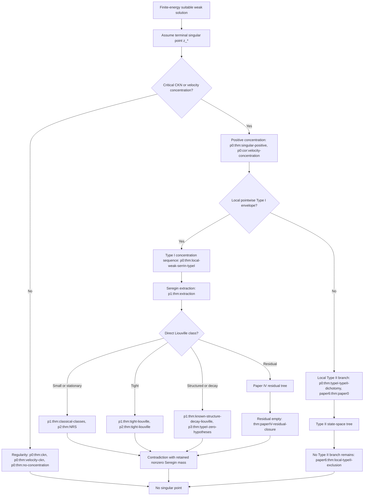
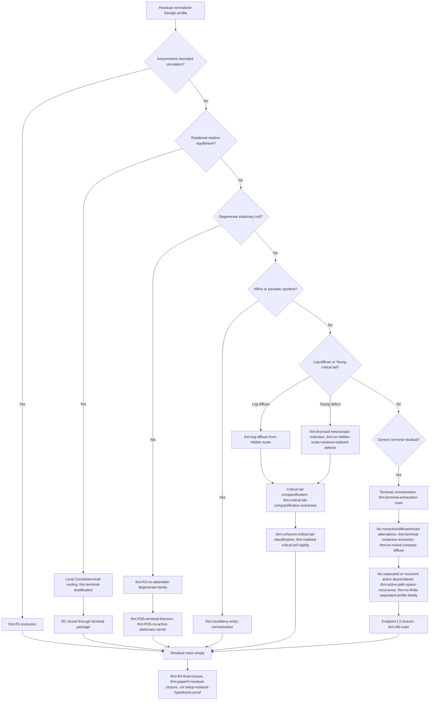
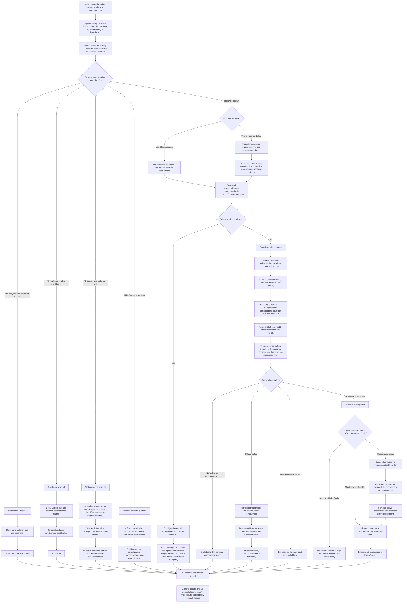
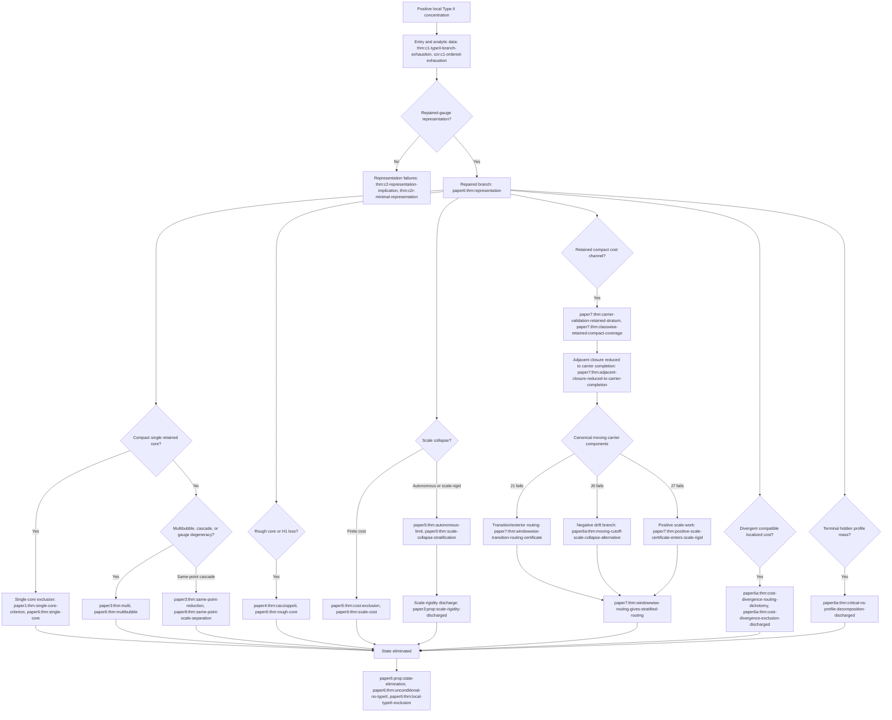
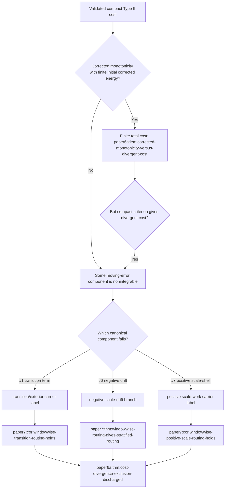

# Overall Proof Architecture for the Navier--Stokes State-Space Stratification

## Executive Summary

This document explains how the three papers in this folder fit together as a
single proof architecture for routing and excluding finite-time singularity
scenarios for the three-dimensional incompressible Navier--Stokes equations.
The organizing principle is not to guess the shape of a singularity.  The
organizing principle is to force every possible singular branch into an
explicit state-space stratum, then eliminate that stratum by the tool that is
strongest for exactly that geometry.

The strategy starts from a finite-energy suitable weak solution
$$
  \partial_t u+(u\cdot\nabla)u+\nabla p=\Delta u,
  \qquad \nabla\cdot u=0,
$$
and assumes that a terminal singular point \(z_*=(x_*,T)\) exists.  Local
epsilon-regularity gives the first dichotomy:

```text
terminal point
  |
  +-- no scale-critical concentration  --> regular by CKN epsilon-regularity
  |
  +-- positive scale-critical concentration
          |
          +-- local pointwise Type I branch
          |
          +-- local Type II branch
```

The three papers then close the two positive-concentration branches.

| Paper | Role in the architecture | Main output |
| --- | --- | --- |
| `proof_setup.tex` | Establishes local concentration, the Type I/Type II dichotomy, Type I Seregin extraction, and the first non-residual Type I class closures. | A local pointwise Type I singularity produces a nonzero normalized bounded centered ancient Seregin profile. That profile is either in a closed non-residual Liouville class or in the residual class. |
| `paperIV_residual_branch.tex` | Refines and closes the Type I residual class left by the setup paper. | The retained normalized residual class is empty after an ordered residual decomposition into axisymmetric, rotational, stationary-hull, affine/parasitic, critical-tail, and generic terminal strata. |
| `type_II_regularity.tex` | Excludes the local Type II branch by closing every state-space exit. | Every positive local Type II concentration sequence enters one of the repaired-gauge, multibubble, rough-core, scale-collapse, retained compact-cost, carrier-routing, or terminal-profile alternatives; scale-rigidity, windowwise routing, cost-divergence, analytic-data exhaustion, retained compact-test closure, and critical-profile completeness are all discharged inside the paper. |

The resulting architecture is:

```text
finite-energy suitable weak solution
  |
  +-- suppose a singular point exists
          |
          +-- local CKN concentration gives positive critical mass
                  |
                  +-- Type I branch
                  |     |
                  |     +-- Seregin ancient limit
                  |     +-- non-residual Liouville classes closed in proof_setup.tex
                  |     +-- residual classes closed in paperIV_residual_branch.tex
                  |     +-- contradiction
                  |
                  +-- Type II branch
                        |
                        +-- repaired-gauge/local-profile state-space partition
                        +-- all Type II state-space exits closed in type_II_regularity.tex
                        +-- contradiction
```

This should be read in the hybrid sense used by the papers themselves.  The
architecture is assertive about the intended proof flow, but it is explicit
about the inputs on which each branch depends.  The Type I residual closure is
now discharged by `paperIV_residual_branch.tex`, including the setup residual
hypothesis.  In `type_II_regularity.tex`, several items that used to be treated
as strategic assumptions have also been converted into theorem packages:
`paper3:prop:local-scale-rigidity-exclusion`,
`paper7:def:windowwise-transition-routing`,
`paper7:def:windowwise-positive-scale-routing`,
`paper6a:thm:cost-divergence-exclusion-discharged`, and
`paper6a:thm:critical-ns-profile-decomposition-discharged`.  The current status is that
the Type II exit ledger is closed: entry into the local alternative class,
repaired-gauge representation, compactness and local energy propagation,
retained compact-test closure, cost/carrier routing, and terminal profile
exhaustion are all supplied by named theorem packages in
`type_II_regularity.tex`.

## Current Closure Status

All exits in the three-paper state space are now closed.

| Branch or interface | Current status | Closing theorem package |
| --- | --- | --- |
| Vanishing local concentration | Closed. | `p0:thm:ckn`, `p0:thm:velocity-ckn`, `p0:thm:no-concentration`. |
| Local pointwise Type I, non-residual classes | Closed. | `p1:thm:classical-classes`, `p2:thm:NRS`, `p1:thm:tight-liouville`, `p1:thm:known-structure-decay-liouville`, and the Part III/IV Liouville packages in `proof_setup.tex`. |
| Type I residual class | Closed. | `thm:paperIV-residual-closure`, with `cor:setup-residual-hypothesis-proof` feeding back into the setup paper. |
| Type II entry and analytic-data exhaustion | Closed. | `paper6:thm:paper0`, `thm:c1-typeII-branch-exhaustion`, `paper6:thm:physical-typeII-covered-entry`, `paper6a:thm:typeII-analytic-data-exhaustive`. |
| Repaired-gauge representation and pressure/local-energy compatibility | Closed. | `paper6:thm:representation`, `thm:c2-representation-implication`, `thm:c2r-minimal-representation`, `paper6a:thm:ac-repaired-gauge-consequences`. |
| Compact single core, rough core, multibubble, and cascade exits | Closed. | `paper6:thm:single-core`, `paper6:thm:rough-core`, `paper6:thm:multibubble`, `paper7:thm:windowed-h1-failure-exclusion`, and the same-point cascade theorems. |
| Scale collapse and scale-rigidity exits | Closed. | `paper6:thm:scale-cost`, `paper6:thm:scale-stratification`, `paper6:prop:state-elimination`, `paper3:prop:scale-rigidity-discharged`. |
| Retained compact cost and carrier exits | Closed. | `paper7:thm:classwise-retained-compact-coverage`, `paper7:thm:windowwise-routing-gives-stratified-routing`, `paper7:def:stratified-moving-carrier-routing`, `paper6a:thm:cost-divergence-exclusion-discharged`. |
| Terminal hidden critical profile and residual mass exits | Closed. | `paper6a:thm:critical-ns-profile-decomposition-discharged`, `paper6a:thm:retained-compact-tests-closed`, `paper6a:thm:terminal-critical-local-compactness`, `paper6a:thm:expanded-terminal-typeII`. |
| Final Type II assembly | Closed. | `paper6:thm:state-decomposition`, `paper6:thm:unconditional-no-typeII`, `paper6:thm:local-typeII-exclusion`. |

The final proof is therefore no longer organized around a list of outstanding
strategic assumptions.  It is organized around a finite routing graph whose
terminal nodes are all contradictions: either local regularity contradicts the
choice of singular point, a Liouville theorem contradicts retained Type I mass,
the residual state space is empty, or a Type II exit contradicts retained core
mass, finite cost, scale-rigidity closure, or terminal profile exhaustion.

## Complete Exit and Rerouting Ledger

The tables in this section are the referee-facing ledger for the whole proof.
Each row records an exit, the routing test that sends a branch there, whether
the exit terminates directly or reroutes to another exit, and the closure
mechanism.  The entries are intentionally more explicit than the diagrams so
that a reader can check the proof linearly.

### Global and Setup Exits

| Exit | Entry test | Routing or rerouting mechanism | Closure |
| --- | --- | --- | --- |
| Vanishing CKN concentration | The scale-invariant \(C+D\) quantity becomes small at the candidate terminal point. | No further blow-up analysis is permitted; the branch exits to local regularity. | `p0:thm:ckn` and `p0:thm:no-concentration` give local boundedness, contradicting singularity. |
| Vanishing velocity concentration | The velocity-only critical quantity \(C\) vanishes along the candidate singular scales. | Routed to velocity epsilon-regularity rather than Seregin or Type II extraction. | `p0:thm:velocity-ckn` closes the branch. |
| Positive concentration with local pointwise Type I envelope | Positive local critical mass persists and the Type I scale-invariant \(L^\infty\) envelope is finite. | Routed into the Type I bridge sequence and Seregin extraction. | `p0:thm:local-weak-serrin-typeI`, `p1:thm:extraction`, and the Type I class ledger below. |
| Positive concentration with no local pointwise Type I envelope | Positive local critical mass persists but every local Type I envelope fails. | Routed into the Type II local state-space assembly. | `p0:thm:typeI-typeII-dichotomy`, `paper6:thm:paper0`, `paper6:thm:physical-typeII-covered-entry`, and the Type II ledger below. |
| Terminal velocity no-escape failure | A Type I bridge sequence would lose velocity mass into the terminal slice. | Routed back to the local weak-Serrin/no-escape estimates before extraction. | `p0:thm:auto-velocity-no-escape` and `p0:thm:local-weak-serrin-typeI` restore admissibility or close the branch. |
| Setup residual hypothesis | The setup paper reaches the residual Type I class after direct Liouville classes are removed. | Routed to `paperIV_residual_branch.tex` as the imported residual object. | `thm:paperIV-residual-closure` and `cor:setup-residual-hypothesis-proof` close the setup residual hypothesis. |

### Direct Type I Exits

| Exit | Entry test | Routing or rerouting mechanism | Closure |
| --- | --- | --- | --- |
| Small-amplitude Seregin profile | The normalized centered ancient profile is small in the relevant scale-invariant topology. | No residual routing; perturbative rigidity applies immediately. | `p1:thm:classical-classes` forces zero, contradicting retained compact \(L^3\) mass. |
| Stationary \(L^3\) Seregin profile | A time-translate or representative is stationary with critical \(L^3\) control. | Routed to stationary self-similar rigidity. | `p1:thm:classical-classes` and `p2:thm:NRS` force zero. |
| Uniformly \(L^3\)-tight Seregin profile | The ancient trajectory keeps its \(L^3\) mass uniformly tight in space. | Routed through physical pullback and endpoint sequence-\(L^3\) construction. | `p2:thm:tight-liouville`, `p2:thm:AB-endpoint`, and `p1:thm:tight-liouville` force zero. |
| Structured or decay-covered Seregin profile | Axisymmetry, no-swirl, pointwise scale control, weighted-vorticity smallness, or another listed structure is present. | Routed to the matching structure-specific Liouville theorem. | `p3:thm:axisymmetric-liouville`, `p3:thm:typeI-zero-hypotheses`, and `p1:thm:known-structure-decay-liouville` force zero. |
| Direct Type I class exhaustion failure | A profile avoids all direct classes. | This is not a terminal gap; it is exactly the residual class. | Routed to the residual ledger by `p1:thm:remaining-criterion`. |

### Type I Residual Exits

| Exit | Entry test | Routing or rerouting mechanism | Closure |
| --- | --- | --- | --- |
| Imported residual object mismatch | The residual paper would not be working with the same Seregin object produced by setup. | The imported setup package fixes the object, retained mass, pressure gauge, and ancestry. | `thm:imported-setup-results` and `hyp:base-seregin-hypotheses` align the interface. |
| Non-realized descendant | A recentered limit, hull element, tail state, or terminal profile may not descend from the original branch. | Routed through ancestor-realization and heredity before any closure theorem is applied. | `thm:ancestor-realization-inheritance` and `thm:descendant-heredity` make descendant closures logically effective. |
| Axisymmetric bounded-circulation residual | The residual profile is axisymmetric with bounded centered circulation after lower direct classes are removed. | Routed through centered circulation and axis-absorption; if it falls into no-swirl or lower structured behavior, it is sent back to direct Type I closure. | `thm:R1-exclusion` closes the exit. |
| Rotational relative equilibrium | The residual profile is stationary modulo rotation and carries local Coriolis transport structure. | Routed through local Coriolis flux and terminal concentration; lower compact profiles are sent to already closed strata. | `thm:terminal-stratification` and the rotational routing package close the exit. |
| Degenerate stationary hull | A time-translation hull contains a degenerate stationary-family carrier with retained concentration. | Routed through stationary-family realization, terminal stratification, and no-active-stationary-carrier closure. | `thm:R3-no-attainable-degenerate-family`, `thm:R3S-terminal-theorem`, and `thm:R3S-no-active-stationary-carrier`. |
| Affine or parasitic quotient | The apparent residual behavior is an affine/parasitic normalization mode rather than genuine nonlinear retained activity. | Routed through affine normalization; oscillatory representatives are removed and non-oscillatory representatives drop to lower strata. | `thm:affine-normalization-dichotomy` and `thm:oscillatory-entry-normalization`. |
| Closed non-affine activity failure | The non-affine active set would fail to be closed under the local observer calculus. | Routed through covariant observers and hull compactness before terminal extraction. | `thm:covariant-observer-calculus`, `thm:closed-nonaffine-activity`, and `thm:escaping-covariant-hull-compactness`. |
| Recurrent tail-core residual | Tail activity recurs without entering a compact terminal profile. | Routed to recurrent tail-core rigidity or to terminal concentration extraction. | `thm:recurrent-tail-core-rigidity` and `thm:terminal-exhaustion-main`. |
| Log-diffuse critical tail | Critical activity escapes through logarithmic annuli. | Routed to hidden-scale compactification and then to critical-tail compactification. | `thm:log-diffuse-from-hidden-scale` and `thm:critical-tail-compactification-extraction`. |
| Young critical-tail defect | Tail mass survives only as a variance or Young-measure defect. | Routed to first bad mesoscopic scale; realized hidden variance is excluded before compactification. | `thm:first-bad-mesoscopic-reduction` and `thm:no-hidden-scale-variance-realized-defects`. |
| Coherent homogeneous critical tail | Tail compactification produces a coherent homogeneous critical state. | Routed through bounded-origin realization; realized homogeneous tails become incompatible with bounded residual origin behavior. | `thm:coherent-critical-tail-classification`, `thm:bounded-origin-realization-coherent-tails`, and `thm:realized-critical-tail-rigidity`. |
| Coherent log-periodic critical tail | Tail compactification produces a coherent log-periodic state. | Routed to the same coherent-tail classification and realization test. | `thm:coherent-critical-tail-classification` and `thm:realized-critical-tail-rigidity`. |
| Coherent aperiodic critical tail | Tail compactification produces a compact log-translation hull with no period. | Routed to the aperiodic coherent-tail rigidity branch. | `thm:coherent-critical-tail-classification` and `thm:realized-critical-tail-rigidity`. |
| Terminal nonactive or nonconcentrating state | Terminal extraction produces no active compact concentration. | Routed to terminal nonactive discharge; retained mass cannot disappear. | `thm:terminal-nonactive-exclusion`. |
| Diffuse terminal defect | Terminal mass is diffuse rather than carried by a compact active profile. | Routed through diffuse compactness, recurrent diffuse measures, and the diffuse trichotomy; active outputs re-enter active terminal routing, affine outputs re-enter affine closure, tail outputs re-enter critical-tail closure. | `thm:diffuse-defect-compactness`, `thm:recurrent-diffuse-defect-measure`, and `thm:diffuse-defect-trichotomy`. |
| Mixed compact-diffuse terminal mass | Compact active concentration and diffuse defect coexist without a clean decomposition. | Routed to the mixed compact-diffuse exclusion. | `thm:no-mixed-compact-diffuse`. |
| Finite separated active profile family | Terminal mass splits into finitely many separated compact active profiles. | Routed through separated-profile analysis and indecomposability. | `thm:no-finite-separated-profile-family`. |
| Infinite active descendant chain or recurrence loop | Retained activity keeps regenerating through descendants without terminal closure. | Routed to active path-space recurrence and compact active descendant extraction. | `thm:active-path-space-recurrence` and `thm:compact-active-descendant`. |
| Generic terminal residual | No lower residual, tail, affine, diffuse, separated, or recurrent exit remains. | Routed through parasitic-free mildness, sequence-\(L^3\) completeness, and endpoint Liouville. | `thm:mildness-inheritance-main`, `thm:AB-main`, `thm:R4-final-closure`, and `thm:paperIV-residual-closure`. |

### Type II Exits

| Exit | Entry test | Routing or rerouting mechanism | Closure |
| --- | --- | --- | --- |
| Type II analytic-data failure | A positive Type II branch lacks the analytic data needed for the local assembly. | Routed through the C1/C3/C4/C5 PDE-form classification until either analytic data are produced or a cost/annulus alternative fires. | `thm:c1-typeII-branch-exhaustion`, `cor:c1-ordered-exhaustion`, `paper6a:thm:typeII-analytic-data-exhaustive`. |
| Repaired-gauge representation failure | A retained core cannot be put into a stable scale-center chart. | Routed to minimal representation, multibubble, cascade, or scale-rigid alternatives. | `paper6:thm:representation`, `thm:c2-representation-implication`, `thm:c2r-minimal-representation`. |
| Pressure or local-energy incompatibility in repaired variables | The transformed branch might fail to remain suitable or pressure-stable. | Routed through pressure decomposition, AC repaired-gauge consequences, and local Caccioppoli estimates. | `paper2:thm:pressure-decomp`, `paper2:thm:A`, `paper2:thm:B`, `paper2:thm:C`, `paper6a:thm:ac-repaired-gauge-consequences`. |
| Compact single-core branch | One retained core persists with compact-window control and vanishing localized dissipation. | If the limit is zero, retained mass is lost; if nonzero bounded, the branch exits Type II into Type I-type bounded behavior. | `paper1:thm:single-core-criterion` and `paper6:thm:single-core`. |
| Windowed \(H^1\) or rough-core failure | A selected core has critical mass but lacks inner gradient control. | Routed through Caccioppoli; failure of outer compact-cylinder control re-enters compactness failure, multibubble, or cascade exits. | `paper4:thm:caccioppoli`, `paper7:thm:windowed-h1-failure-exclusion`, `paper6:thm:rough-core`. |
| Same-point comparable-scale multibubble | Several active profiles occur near the same point and comparable scales. | Routed through active-frame reduction, thresholded mass counting, and terminal decoupling. | `paper3:thm:multi`, `paper8:thm:multibubble-frame-reduction`, `paper6:thm:multibubble`. |
| Same-point strict scale cascade | Active profiles occur at the same point on separated scales. | Routed through same-point reduction, scale separation, and terminal decoupling; irregular cascades reroute to rough-core or scale-rigid exits. | `paper3:thm:same-point-reduction`, `paper8:thm:same-point-scale-separation`, `paper8:thm:terminal-decoupling-implies-local-decoupling`. |
| Separated-point multibubble | Active profiles occur at separated centers. | Routed through local pressure and mass decoupling; each component returns to compact-core, terminal-profile, or small-data closure. | `paper3:thm:separated-point-reduction`, `paper8:thm:terminal-decoupling-implies-local-decoupling`. |
| Gauge-degenerate branch | The selected chart is nonunique or unstable because several cores or scales compete. | Routed to multibubble, same-point cascade, separated-profile, or scale-rigid exits. | Closed by `paper6:thm:state-decomposition` after the target exit closes. |
| Finite scale-collapse cost | The selected scale collapses but the signed or absolute scale cost is finite. | No reroute: retained core mass forces infinite cost. | `paper5:thm:cost-exclusion`, `paper6a:thm:scale-collapse-drift-cost`, `paper6:thm:scale-cost`. |
| Collapse core-floor failure | A collapsing branch would fail to retain a nonzero localized core. | Routed to vanishing critical \(L^3\) or terminal compactness closure. | `paper5:thm:collapse-core-floor`, `paper6a:thm:collapse-core-floor`, `paper6a:lem:typeII-concentration-extraction-routes`. |
| Thin-drift scale-collapse alternative | No fixed-length selected window carries enough drift for autonomous extraction. | Routed to the scale-collapse first-failure structure and then to compactness, rough-core, or carrier exits. | `paper5:thm:scale-collapse-first-failure-closure` and `paper5:thm:scale-collapse-alternatives`. |
| Autonomous-modulation alternative | Thick windows exist but modulation fails to converge cleanly. | Routed to autonomous reduced-limit extraction or compactness failure. | `paper5:thm:autonomous-modulation-selection`, `paper5:thm:autonomous-limit`, `paper5:lem:autonomous-scale-collapse-is-scale-rigid`. |
| Nonzero autonomous reduced limit | A nonzero autonomous or scale-rigid terminal state survives. | Routed to scale-rigid single-core compatibility, scale-rigid stratum decomposition, or compact single-core behavior. | `paper3:thm:scale-rigid-single-core-compatibility`, `paper3:thm:scale-rigid-stratum-decomposition`, `paper3:prop:scale-rigidity-discharged`. |
| Scale-rigid stratum decomposition | Scale-collapse reaches a scale-rigid terminal state but its subtype is not yet identified. | Routed into the finite scale-rigid sub-strata and then to virial, compact-core, or multibubble closures. | `paper3:thm:scale-rigid-stratum-decomposition` and `paper3:prop:scale-rigidity-discharged`. |
| Critical tightness failure | Critical mass tries to escape outside every compact window. | Routed through non-tight exclusion and tail windowed control; surviving mass re-enters terminal or exterior routing. | `paper7:thm:critical-tightness-criteria`. |
| Retained compact cost channel | The branch passes compact-cost validation and carries a compact cost-divergence conclusion. | Routed to local cost exclusion and then carrier completion. | `paper7:thm:local-cost-to-exclusion`, `paper7:thm:carrier-validation-retained-stratum`, `paper7:thm:classwise-retained-compact-coverage`. |
| Adjacent compact-cost exit | The branch leaves the retained compact cost stratum through an adjacent carrier state. | Reduced to carrier completion and finite-error selection. | `paper7:thm:adjacent-closure-reduced-to-carrier-completion`, `paper7:thm:carrier-completion-reduced-to-finite-error`. |
| Fixed carrier failure | Fixed-cutoff carrier errors fail to be summable. | Routed through fixed carrier closure or annular finite-error selection. | `paper7:thm:fixed-carrier-closure`, `paper7:thm:finite-error-selection-reduced-to-annular`. |
| Moving carrier failure | Moving-cutoff carrier errors fail to be summable. | Routed to the canonical moving components \(J_1,J_6,J_7\). | `paper7:thm:moving-carrier-closure`, `paper7:thm:carrier-package-closes-precarrier`. |
| \(J_1\) transition/exterior carrier | The cutoff-transition or shell-leakage component is nonintegrable. | Routed by normalized carrier-state extraction to transition/exterior leakage, then to exterior regularity or transition closure. | `paper7:thm:windowwise-transition-routing-certificate`, `paper7:thm:windowwise-routing-gives-stratified-routing`. |
| \(J_6\) negative scale-drift carrier | The negative scale-drift component is nonintegrable. | Routed to the negative-drift scale-collapse branch. | `paper6a:thm:moving-cutoff-scale-collapse-alternative` and `paper6a:thm:finite-infinite-scale-negative`. |
| \(J_7\) positive scale-shell work carrier | The positive scale-shell work component is nonintegrable. | Routed to positive scale-work, then to scale-rigidity unless an earlier exterior, recentering, or negative-drift label fires. | `paper7:thm:positive-scale-certificate-enters-scale-rigid`, `paper7:thm:windowwise-positive-scale-routing-certificate`. |
| Divergent compatible localized cost | Retained compact cost forces divergence on the canonical windowwise schedule. | Corrected monotonicity rules out fully summable errors; the branch enters \(J_1,J_6,J_7\). | `paper6a:thm:cost-divergence-routing-dichotomy` and `paper6a:thm:cost-divergence-exclusion-discharged`. |
| Vanishing terminal critical \(L^3\) norm | A terminal branch loses critical \(L^3\) mass. | Routed to nontrivial critical core and vanishing-critical exclusion. | `paper6a:lem:typeII-concentration-extraction-routes` and `paper6a:lem:terminal-local-critical-mass-routing`. |
| Terminal adjacent label | Terminal compactness produces a local state adjacent to a carrier or scale branch. | Routed by terminal adjacent-label routing to the already closed adjacent exit. | `paper6a:thm:terminal-adjacent-label-routing`. |
| Residual terminal mass | A terminal branch retains mass outside the recorded compact/core states. | Routed to admissible residual mass state and then profile extraction. | `paper6a:thm:residual-mass-admissible-state` and `paper6a:thm:critical-ns-profile-decomposition-discharged`. |
| Hidden terminal critical profile | Critical terminal mass remains after known profiles are extracted. | The profile decomposition extracts another profile; Kato-small remainders cannot carry hidden mass. | `paper6a:thm:critical-ns-profile-decomposition-discharged`, `paper6a:thm:kato-small-data-critical-stability`. |
| Retained compact-test closure failure | A retained compact test survives but is not assigned to an existing Type II state. | Routed through retained compact-test closure and terminal local compactness. | `paper6a:thm:retained-compact-tests-closed`, `paper6a:thm:terminal-critical-local-compactness`. |
| Terminal boundedness alternative | Terminal frames are bounded, unbounded, or sampled in incompatible ways. | Routed through bounded terminal sequences, coordinate-frame construction, and orbit sampling. | `paper6a:thm:bounded-terminal-sequences-from-l3`, `paper6a:thm:terminal-boundedness-alternatives`, `paper6a:thm:representation-gives-terminal-orbit-sampling`. |
| Exterior terminal concentration | Terminal mass escapes to the exterior region rather than a compact core. | Routed to exterior stratification and exterior regularity/no-concentration. | `paper8:thm:exterior-stratification`, `paper8:thm:exterior-regularity-no-concentration`, `paper8:thm:exterior-regular-removal`. |
| Final unassigned Type II state | A branch has passed through all earlier tests without terminal contradiction. | The state decomposition has no remaining open target; the final assembly closes the branch. | `paper6:thm:state-decomposition`, `paper6a:thm:abstract-final-typeII`, `paper6a:thm:expanded-terminal-typeII`, `paper6:thm:unconditional-no-typeII`, `paper6:thm:local-typeII-exclusion`. |

## Referee Navigation Guide

This document is meant to be a map, not a substitute for checking the proofs.
A referee can use it to track three questions through the papers:

1. Where does a candidate singular branch enter the state space?
2. Which theorem routes it to the next smaller alternative?
3. Which theorem closes that alternative, and what retained quantity gives the
   contradiction?

The recommended reading order is:

| Pass | What to read | What to verify |
| --- | --- | --- |
| 1 | `proof_setup.tex`, Parts I--II. | A singular point has positive critical concentration; the Type I/Type II split is exhaustive; a local pointwise Type I branch gives a nonzero normalized Seregin profile. |
| 2 | `proof_setup.tex`, Parts III--V. | The non-residual Type I classes are correctly closed by perturbative, stationary, tight, and structured Liouville mechanisms. |
| 3 | `paperIV_residual_branch.tex`. | The residual class imported from the setup paper is the same object being refined; every residual descendant preserves ancestry and retained mass; the ordered residual alternatives are exhaustive and closed. |
| 4 | `type_II_regularity.tex`, representation and local alternatives. | Every Type II branch has the analytic data needed for repaired gauges, pressure reconstruction, local energy, compactness, rough-core routing, and multibubble/cascade routing. |
| 5 | `type_II_regularity.tex`, cost/carrier and terminal profile sections. | Scale-rigidity, retained compact cost coverage, windowwise carrier routing, cost-divergence exclusion, and terminal critical-profile decomposition are proved under the hypotheses under which the assembly invokes them. |
| 6 | Final assembly statements in all three files. | No branch is closed using a theorem before its hypotheses have been produced by an earlier routing step. |

The proof has three interface contracts.  These are the main places where a
reader should check that no hypothesis is lost between papers.

| Interface | Source theorem package | Target use | Audit point |
| --- | --- | --- | --- |
| Setup to residual Type I | `p1:thm:extraction`, `p1:thm:remaining-criterion`, and the residual hypothesis recorded in `proof_setup.tex`. | `thm:imported-setup-results`, `hyp:base-seregin-hypotheses`, and `thm:paperIV-residual-closure` in `paperIV_residual_branch.tex`. | The residual object must remain a normalized bounded centered Seregin profile with retained compact \(L^3\) mass, compatible pressure gauge, and valid terminal ancestry. |
| Setup to Type II | `p0:thm:typeI-typeII-dichotomy` and the positive concentration results in `proof_setup.tex`. | `paper6:thm:paper0`, `thm:c1-typeII-branch-exhaustion`, `paper6:thm:physical-typeII-covered-entry`, and `paper6a:thm:typeII-analytic-data-exhaustive` in `type_II_regularity.tex`. | The Type II branch carries the local concentration, local energy, pressure, and scale-window data required by the local alternative class. |
| Type II internal assembly | Repaired gauge, multibubble, rough-core, scale-collapse, retained-cost, carrier-routing, and terminal-profile theorem packages inside `type_II_regularity.tex`. | `paper6:thm:state-decomposition`, `paper6:thm:unconditional-no-typeII`, and `paper6:thm:local-typeII-exclusion`. | Each closure theorem is invoked only after the branch has been routed into its stated hypotheses; former assumptions such as scale-rigidity, cost-divergence exclusion, and critical-profile completeness are theorem packages, not primitive final inputs. |

For quick tracking, the proof should be read as a chain of retained
obstructions:

| Retained obstruction | First produced | Must survive through | Final contradiction |
| --- | --- | --- | --- |
| Positive CKN or velocity concentration | CKN/velocity epsilon-regularity in `proof_setup.tex`. | Type I extraction or Type II window selection. | Vanishing alternatives imply regularity and are impossible at a singular point. |
| Compact local \(L^3\) mass of a Type I Seregin profile | Seregin extraction in `proof_setup.tex`. | Non-residual Liouville routing and residual descendant extraction. | Any Liouville conclusion \(V=0\), residual emptiness, or endpoint \(L^3\) closure contradicts retained mass. |
| Residual ancestry | Imported setup package in `paperIV_residual_branch.tex`. | Recentered limits, tail compactifications, active descendants, and terminal profiles. | A closed auxiliary descendant is meaningful only because it is realized by the original residual branch. |
| Retained Type II core mass | Type II entry and repaired-gauge selection in `type_II_regularity.tex`. | Single-core compactness, multibubble splitting, rough-core routing, scale-cost estimates, and terminal profile extraction. | Finite cost, vanishing terminal norm, compact zero limits, or hidden-profile exhaustion cannot coexist with retained mass. |
| Canonical carrier cost | Retained compact-cost validation in `type_II_regularity.tex`. | Corrected monotonicity and windowwise \(J_1,J_6,J_7\) routing. | Divergent compatible cost cannot remain a free terminal branch; it enters transition/exterior, negative-drift, or positive-scale/scale-rigid closures. |

The most useful cross-check is this: every edge in the decision diagrams below
should correspond either to a named theorem in the register at the end of this
document or to a cited external theorem explicitly imported in one of the three
papers.  Every terminal node should say what contradiction is obtained and
which retained obstruction supplies it.

## Latest Strategy Refinement

The current strategy is sharper than the original "prove one large missing
local theorem" picture.  The proof now proceeds by reducing each hard
interface to a small, named theorem package.

| Former strategic bottleneck | Current closed treatment |
| --- | --- |
| Setup residual hypothesis for Type I | Discharged in `paperIV_residual_branch.tex` by the ordered residual decomposition, terminal local concentration, critical-tail compactification, descendant heredity, and endpoint \(L^3\) closure. |
| Scale-rigidity exclusion in the Type II scale/multibubble layer | Discharged by `paper3:prop:scale-rigidity-discharged`; bounded selected-window limits and single-core dissipation are supplied by the selected-sequence theorem packages before the rigidity theorem is invoked. |
| Section 7 compact cost coverage and adjacent closure | Reduced to carrier completion and then to the canonical windowwise moving family; classwise retained compact coverage is discharged by `paper7:thm:classwise-retained-compact-coverage`. |
| Windowwise transition and positive-scale routing | Discharged by normalized carrier-state extraction and local state-space labels: nonintegrable \(J_1\) becomes a transition/exterior carrier state, while nonintegrable \(J_7\) becomes positive scale-work routed to scale-rigidity unless an earlier exterior, recentering, or negative-drift label fires. |
| Cost-divergence exclusion | Discharged by corrected-monotonicity arithmetic plus the canonical windowwise \(J_1,J_6,J_7\) routing package in `paper6a:thm:cost-divergence-exclusion-discharged`. |
| Critical Navier--Stokes profile decomposition | Reduced to cited \(L^3\) profile decomposition/nonlinear profile stability plus internal mass-decoupling, Kato-smallness, and hidden-mass exhaustion lemmas in `paper6a:thm:critical-ns-profile-decomposition-discharged`. |

The main discipline for checking the closed proof is therefore not to invoke
these packages as black boxes outside their hypotheses.  Cost-divergence is
tied to the canonical windowwise moving schedule; carrier routing is tied to
normalized carrier states rather than pointwise lower bounds; and the terminal
profile theorem is tied to the \(L^3_\sigma\) critical profile framework and
its Kato perturbative stability.

## Mermaid State-Space Decision Trees

The diagrams below give the state-space stratification as a theorem-labelled
decision procedure.  They are intentionally redundant with the tables: the
tables say what each layer means, while the diagrams show how a candidate
branch moves through the proof.

### Global Singularity Routing



### Type I Residual Decision Tree



### Paper IV Residual Branch Detailed Tree

This is the expanded residual branch, matching the internal organization of
`paperIV_residual_branch.tex`.  The point is that the residual class is not
closed by one theorem in isolation: it is routed through lower strata,
tail-defect compactification, terminal concentration, descendant heredity, and
endpoint \(L^3\) closure.



### Type II State-Space Decision Tree



### Cost and Carrier Subtree



## Diagram Edge Audit

The diagrams above should be read as theorem interfaces, not just pictures.
Every edge has a payload: a property that must be proved before the target node
can be used.  The tables below list those properties explicitly.

### Global Routing Edges

| Edge | What must be verified | Why the edge is valid |
| --- | --- | --- |
| Finite-energy suitable weak solution to terminal singular point | The object is a suitable weak solution on a terminal time interval, with the local energy inequality and pressure normalization available. | This is the counterexample setup for `p0:thm:ckn`, `p0:thm:velocity-ckn`, and the local concentration package. |
| Terminal point to CKN/velocity concentration test | The CKN quantities \(C(z,r)\), \(D(z,r)\), and the velocity concentration quantity are well-defined on shrinking backward cylinders. | The first gate is scale-critical and invariant under Navier--Stokes rescaling. |
| Concentration test to regularity | Smallness must hold on a cylinder at the candidate singular point. | `p0:thm:ckn`, `p0:thm:velocity-ckn`, and `p0:thm:no-concentration` then give boundedness, contradicting singularity. |
| Concentration test to positive concentration | There is a sequence of shrinking cylinders carrying a fixed positive critical amount of velocity-pressure or velocity mass. | `p0:thm:singular-positive` and `p0:cor:velocity-concentration` supply the retained mass token used later. |
| Positive concentration to Type I/Type II dichotomy | One must check whether a local pointwise Type I envelope holds near the terminal point. | `p0:thm:typeI-typeII-dichotomy` makes the split exhaustive. |
| Type I branch to Seregin extraction | The Type I envelope must give local boundedness away from \(T\), no-escape of velocity mass, local energy control, and pressure compactness. | These are the inputs to `p0:thm:local-weak-serrin-typeI` and `p1:thm:extraction`. |
| Seregin extraction to direct Liouville class test | The extracted profile must be normalized, bounded, centered, ancient, suitable, and nonzero by retained compact \(L^3\) mass. | The class tests only make sense for the normalized Seregin collection. |
| Direct Liouville class to contradiction | The relevant class hypothesis must force \(V=0\), while retained compact \(L^3\) mass remains positive. | `p1:thm:classical-classes`, `p1:thm:tight-liouville`, and `p1:thm:known-structure-decay-liouville` close these exits. |
| Direct class failure to residual tree | The profile must fail the small, stationary, tight, and structured/decay tests without losing normalization or retained mass. | `p1:thm:remaining-criterion` identifies exactly this complement as the residual class. |
| Residual tree to residual empty | The imported residual object must preserve setup ancestry, retained mass, pressure gauge, and terminal suitability through all descendant operations. | `thm:paperIV-residual-closure` then empties the residual class. |
| Type II branch to Type II state-space tree | The branch must carry positive concentration but no local Type I envelope, and must enter the analytic-data/exhaustion framework. | `paper6:thm:paper0`, `thm:c1-typeII-branch-exhaustion`, and `paper6:thm:physical-typeII-covered-entry` supply the entry. |
| Type II state-space tree to no Type II branch | Every local Type II state listed by `paper6:thm:state-decomposition` must be routed to a closed exit. | `paper6:prop:state-elimination`, `paper6:thm:unconditional-no-typeII`, and `paper6:thm:local-typeII-exclusion` finish the branch. |

### Type I Residual Edges

| Edge | What must be verified | Why the edge is valid |
| --- | --- | --- |
| Residual profile to imported setup package | The profile is the same normalized Seregin object generated by `proof_setup.tex`, not a newly introduced auxiliary solution. | `thm:imported-setup-results` and `hyp:base-seregin-hypotheses` fix the interface. |
| Imported setup to ancestor-realized operations | Every recentering, blow-down, hull limit, tail compactification, or terminal extraction must be sequence-realized from the original residual branch. | `thm:ancestor-realization-inheritance` prevents proving closure for unrelated auxiliary limits. |
| Ancestor-realized operations to ordered lower stratum | The proof must test lower residual strata in the specified order and show earlier strata are absent before later ones are used. | This prevents overlap from reintroducing already closed behavior under another name. |
| Axisymmetric residual to centered circulation closure | Axisymmetry, bounded centered angular circulation, pressure compatibility, and retained compact mass must survive the centered variables. | `thm:R1-exclusion` then forces a lower structured class or zero. |
| Rotational residual to terminal package | The relative-equilibrium structure must produce the local Coriolis flux identity and a terminal concentration recentering. | `thm:terminal-stratification` routes the branch to lower closed terminal alternatives. |
| Degenerate stationary hull to R3S closure | The stationary-family hull element must be a sequence-realized Seregin descendant and must still carry retained concentration. | `thm:R3-no-attainable-degenerate-family`, `thm:R3S-terminal-theorem`, and `thm:R3S-no-active-stationary-carrier` close it. |
| Affine/parasitic quotient to oscillatory normalization | The apparent activity must be shown to be generated by affine/parasitic normalization rather than genuine nonlinear retained mass. | `thm:affine-normalization-dichotomy` and `thm:oscillatory-entry-normalization` remove that quotient. |
| Tail/diffuse defect to hidden-scale reduction | The branch must exhibit log-annular escape or Young/variance defect after compact active alternatives are absent. | `thm:log-diffuse-from-hidden-scale` and `thm:first-bad-mesoscopic-reduction` convert hidden escape into a compactified tail state or lower exit. |
| Hidden-scale branch to critical-tail compactification | The mesoscopic scales must have compactness, pressure gauges, and retained critical activity after quotienting lower affine modes. | `thm:critical-tail-compactification-extraction` creates the coherent-tail state space. |
| Coherent critical tail to tail rigidity | The compactified tail must be homogeneous, log-periodic, or aperiodic in the precise log-scale dynamical sense. | `thm:coherent-critical-tail-classification` and `thm:realized-critical-tail-rigidity` close realized coherent tails. |
| Generic residual to covariant observer calculus | Lower strata, affine/parasitic quotients, and coherent tails must be absent, while non-affine activity remains closed under observers. | `thm:covariant-observer-calculus`, `thm:closed-nonaffine-activity`, and `thm:escaping-covariant-hull-compactness` make terminal extraction legitimate. |
| Terminal concentration to terminal alternatives | Maximal active families, terminal measures, and compact/diffuse decomposition must be constructed without losing retained mass. | `thm:maximal-active-family` and `thm:terminal-exhaustion-main` make the terminal split exhaustive. |
| Terminal nonactive, diffuse, or mixed branch to closure | One must verify whether retained mass is absent, diffuse, mixed compact-diffuse, or compact active. | `thm:terminal-nonactive-exclusion`, `thm:diffuse-defect-trichotomy`, and `thm:no-mixed-compact-diffuse` close the noncompact alternatives or reroute them. |
| Active terminal profile to descendant/separated tests | The active profile must be checked for finite separated splitting, descendant chains, recurrence, and indecomposable single-profile structure. | `thm:no-finite-separated-profile-family`, `thm:descendant-heredity`, and `thm:active-path-space-recurrence` remove non-single alternatives. |
| Single terminal profile to endpoint \(L^3\) closure | Parasitic-free mildness and sequence-\(L^3\) completeness must be manufactured from the previous exclusions. | `thm:mildness-inheritance-main` and `thm:AB-main` force zero, contradicting retained mass. |

### Type II Edges

| Edge | What must be verified | Why the edge is valid |
| --- | --- | --- |
| Positive Type II concentration to analytic data | The branch must retain critical mass, local energy, pressure control, scale-window data, and the failure of every local Type I envelope. | `thm:c1-typeII-branch-exhaustion`, `cor:c1-ordered-exhaustion`, and `paper6a:thm:typeII-analytic-data-exhaustive` produce the analytic entry package. |
| Analytic data to repaired-gauge representation | A nondegenerate core, scale, center, time parametrization, pressure gauge, and modulation coefficients must be selected. | `paper6:thm:representation`, `thm:c2-representation-implication`, and `thm:c2r-minimal-representation` give the modulated local PDE. |
| Representation failure to multibubble/cascade/scale-rigid exits | If the chart is nonunique or unstable, one must identify the competing cores, scales, or degenerating scale-rigid structure. | Representation failure is not terminal; it is routed by `paper6:thm:state-decomposition`. |
| Repaired branch to compact single core | Compact-window bounds, pressure stability, retained mass, and vanishing localized dissipation must all hold. | `paper1:thm:single-core-criterion` and `paper6:thm:single-core` then contradict Type II or retained mass. |
| Repaired branch to rough-core exit | The branch must fail windowed \(H^1\) or compact-cylinder gradient control while keeping critical mass. | `paper4:thm:caccioppoli`, `paper7:thm:windowed-h1-failure-exclusion`, and `paper6:thm:rough-core` reroute roughness to closed compactness/multibubble exits. |
| Repaired branch to multibubble/cascade | Multiple active profiles, separated centers, same-point scale separation, or chart competition must be detected. | `paper3:thm:multi`, `paper3:thm:same-point-reduction`, `paper8:thm:same-point-scale-separation`, and terminal decoupling close or reroute the split. |
| Repaired branch to scale collapse | The selected scale must genuinely collapse relative to the terminal window and the retained core must persist. | Finite-cost exits are closed by `paper5:thm:cost-exclusion` and `paper6:thm:scale-cost`; nonfinite/autonomous exits continue to scale-rigid analysis. |
| Scale collapse to autonomous or scale-rigid state | Thick selected windows, modulation control, pressure stability, and bounded selected-window limits must be produced. | `paper5:thm:autonomous-limit`, `paper5:thm:scale-collapse-stratification`, and `paper3:prop:scale-rigidity-discharged` close the scale-rigid path. |
| Repaired branch to retained compact cost channel | The compact tests, retained local mass floor, localized cost comparison, and carrier validation data must all hold. | `paper7:thm:carrier-validation-retained-stratum` and `paper7:thm:classwise-retained-compact-coverage` place the branch in the cost/carrier subtree. |
| Compact cost channel to carrier completion | Fixed and moving cutoff errors must be decomposed into finite-error identities with no unrecorded cost leakage. | `paper7:thm:adjacent-closure-reduced-to-carrier-completion` and `paper7:thm:carrier-package-closes-precarrier` reduce the problem to canonical carrier components. |
| Carrier completion to \(J_1,J_6,J_7\) | The automatic moving terms must be summable; only transition, negative drift, or positive scale-shell work may remain nonintegrable. | `paper7:thm:windowwise-routing-gives-stratified-routing` makes the component list exhaustive. |
| \(J_1\) to transition/exterior routing | Nonintegrable transition or shell-leakage must produce a normalized carrier state with exterior/transition label. | `paper7:thm:windowwise-transition-routing-certificate` routes it to exterior or transition closure. |
| \(J_6\) to negative drift | Nonintegrable negative scale drift must be tied to the canonical moving cutoff and compatible scale-collapse cost. | `paper6a:thm:moving-cutoff-scale-collapse-alternative` and `paper6a:thm:finite-infinite-scale-negative` close the negative-drift exit. |
| \(J_7\) to positive scale-work | Nonintegrable positive scale-shell work must survive normalized carrier extraction and avoid earlier exterior/recentering/negative-drift labels. | `paper7:thm:positive-scale-certificate-enters-scale-rigid` and `paper7:thm:windowwise-positive-scale-routing-certificate` reroute it to scale-rigidity. |
| Divergent compatible cost to cost-divergence exclusion | Corrected monotonicity, finite initial corrected energy, and canonical windowwise compatibility must be checked. | `paper6a:thm:cost-divergence-routing-dichotomy` and `paper6a:thm:cost-divergence-exclusion-discharged` force a closed carrier exit. |
| Repaired branch to terminal hidden profile mass | Terminal frames must be sampled from the represented orbit and bounded in the critical \(L^3_\sigma\) framework. | `paper6a:thm:critical-ns-profile-decomposition-discharged` extracts all nonzero terminal profiles and rules out hidden mass. |
| Terminal profile branch to final Type II closure | Retained compact tests, terminal local compactness, expanded terminal data, and boundedness alternatives must all be discharged. | `paper6a:thm:retained-compact-tests-closed`, `paper6a:thm:expanded-terminal-typeII`, and `paper6:thm:local-typeII-exclusion` close the branch. |

### Cost and Carrier Subtree Edges

| Edge | What must be verified | Why the edge is valid |
| --- | --- | --- |
| Validated compact cost to corrected monotonicity | The localized cost, corrected energy, moving cutoff, and pressure/error terms must satisfy the fixed or moving monotonicity identity. | `paper6a:thm:fixed-corrected-monotonicity` and `paper6a:thm:moving-corrected-monotonicity` control the cost balance. |
| Corrected monotonicity to finite total cost | All error terms must be summable and the initial corrected energy finite. | Then a divergent compact cost contradicts the monotonicity balance. |
| Failure of finite total cost to nonintegrable component | The fixed and moving carrier decompositions must show that nonintegrability appears in one of the canonical components. | `paper7:thm:fixed-carrier-closure` and `paper7:thm:moving-carrier-closure` rule out unclassified error leakage. |
| Nonintegrable component to \(J_1,J_6,J_7\) | Components \(J_2,\dots,J_5\) must be automatic or summable on the canonical moving family. | The remaining component determines transition/exterior, negative drift, or positive scale-work routing. |
| \(J_1,J_6,J_7\) to cost-divergence closure | The selected component must retain its geometric label under normalized carrier-state extraction. | The corresponding closed exit feeds into `paper6a:thm:cost-divergence-exclusion-discharged`. |

## What Is Novel or Interesting to a PDE Expert

The proof architecture has several features that are not just organizational.
They change where the hard PDE estimates are used.

| Feature | PDE significance |
| --- | --- |
| Local state-space stratification before rigidity | The argument avoids requiring a single all-purpose Liouville theorem for bounded ancient solutions.  It first routes a candidate into a stratum where a specific compactness, Liouville, virial, or cost mechanism has the right hypotheses. |
| Retained concentration as the invariant bookkeeping device | Positive CKN or compact \(L^3\) mass is carried through rescaling, gauge changes, terminal extraction, and descendant formation.  Every zero or vanishing conclusion is tested against this retained mass. |
| Type I residual closure by terminal dynamics | The residual Type I problem is not treated as a black-box complement.  It is decomposed by terminal active loci, critical tails, diffuse defects, affine/parasitic quotients, and descendant recurrence until endpoint \(L^3\) Liouville becomes applicable. |
| Repaired-gauge Type II analysis | The Type II branch is analyzed in moving scale-center coordinates with explicit modulation coefficients.  Translation drift, scale drift, pressure gauges, and chart degeneracy become named alternatives instead of uncontrolled compactness errors. |
| Cost-divergence treatment of scale collapse | Genuine Type II scale collapse is not classified by guessing a limiting profile first.  Retained local mass forces divergence of a localized scale cost; corrected monotonicity and the canonical windowwise routing package now convert that divergence into exclusion rather than leaving it as a primitive assumption. |
| No hidden global critical-norm assumption | The residual paper explicitly avoids assuming a global \(L^\infty_tL^3_x\) bound for the original residual profile.  Sequence-\(L^3\) control is manufactured only after lower strata and parasitic modes are removed. |
| No hidden global Coriolis--Leray theorem | Rotational relative equilibria are closed by local Coriolis flux and terminal concentration decomposition, not by invoking an unavailable whole-space Liouville theorem for all bounded rotating profiles. |
| Failure modes become alternatives | Missing pressure compactness, gauge degeneracy, rough-core loss, tail diffusion, critical-tail Young defects, noncompact terminal escape, and nonintegrable carrier components are not left as proof gaps; each is routed into the ordered partition. |

For a PDE reader, the most important structural point is that the proof tries
to replace a single impossible classification theorem by many smaller rigidity
statements whose hypotheses are produced by the preceding routing step.  The
interesting work is therefore not only in the terminal contradictions; it is in
showing that the routing is exhaustive and that descendants remain tied to the
original singularity.

## Strategy-Level Portability Beyond This Particular Proof

The architecture can be evaluated at two levels.  At the proof level, every
estimate, compactness passage, pressure reconstruction, and Liouville
invocation must be correct for the three-dimensional Navier--Stokes equations.
At the strategy level, many of the ideas are more general: they describe how to
organize a hard PDE regularity problem even if a particular implementation in
3D Navier--Stokes later has to be repaired or replaced.

The portable lesson is not "copy these strata verbatim."  The portable lesson
is "find the invariant observables, route every possible failure mode, and use
only the rigidity theorem justified by the stratum that has actually been
reached."

| Strategy-level item | Generality as a PDE technique | What changes in another PDE |
| --- | --- | --- |
| Critical concentration as the first gate | Very general for scale-critical regularity problems.  Analogues appear whenever an epsilon-regularity or small-data criterion detects regularity below a critical threshold. | Replace CKN \(C+D\) by the problem's critical Morrey, Strichartz, energy, entropy, curvature, vorticity, or defect-measure quantity. |
| Type I/Type II separation | Broadly useful when there is a natural self-similar blow-up rate.  It separates controlled self-similar compactness from genuinely supercritical dynamics. | The Type I norm and rate must be the one adapted to the equation: curvature for geometric flows, critical spacetime norms for dispersive equations, gradient or energy density for heat flows. |
| Blow-up extraction into ancient or eternal objects | Very general.  Many regularity problems reduce singularity formation to ancient solutions, tangent flows, bubbles, or profiles. | The compactness topology changes: suitable weak limits for Navier--Stokes, Brakke/tangent flows for mean curvature, concentration compactness profiles for dispersive PDE, Uhlenbeck limits for gauge theory. |
| Retained mass bookkeeping | Very general and highly valuable.  A contradiction proof needs a nonzero quantity that survives all limits and cannot coexist with a zero/rigid conclusion. | The retained token may be energy, entropy drop, curvature concentration, enstrophy, charge, topological degree, \(L^2\) mass, or a profile norm. |
| Ordered state-space stratification | Very general.  It is a way to replace a missing global classification theorem by many smaller conditional classifications. | The strata must be chosen from the equation's genuine failure modes: radiation, bubbling, necks, solitons, cascades, boundary concentration, oscillation, defect measures, or symmetry reductions. |
| Classification versus closure | Very general.  Decomposition and exclusion should be separate statements, so an unclosed stratum is visible rather than hidden. | Another PDE may have a complete decomposition but only partial closures; the architecture still identifies exactly which theorem is missing. |
| Failure modes as named alternatives | Very general and often underused.  A failed compactness estimate, failed gauge, or failed pressure bound should produce a new branch of the proof, not an implicit assumption. | The named alternatives depend on the PDE: gauge bubbling in Yang--Mills, neck regions in harmonic map heat flow, radiation channels in dispersive PDE, shock/oscillation measures in conservation laws. |
| Repaired gauges and modulation parameters | General for problems with symmetries or moving concentration centers.  This is common in soliton dynamics, geometric flows, dispersive blow-up, and gauge theories. | The parameters may be translation, scale, phase, Galilean boost, rotation, gauge transform, reparametrization, or diffeomorphism.  The orthogonality conditions and modulation equations are equation-specific. |
| Pressure/gauge bookkeeping | Specific in form but general in spirit.  Any PDE with nonlocal constraints, gauge freedom, or Lagrange multipliers needs compatible normalization across limits. | Replace pressure gauges by Coulomb gauges, DeTurck gauges, harmonic coordinates, elliptic potentials, chemical potentials, or constraint multipliers. |
| Cost-divergence or monotonicity-defect arguments | Broadly useful when a branch can escape by scale drift or migration.  A localized cost can turn "escape through scales" into a quantitative contradiction, provided the error terms are either summable or routed as named carrier states. | The cost may be entropy dissipation, frequency drop, Morawetz flux, monotonicity defect, action, curvature scale drift, virial defect, or modulation energy. |
| Tail compactification and critical-tail analysis | General for noncompact critical problems where mass can escape to infinity or to logarithmic scales. | The compactification variable changes: physical infinity, frequency infinity, logarithmic scale, null infinity, neck length, or renormalized time. |
| Active-locus extraction and descendant heredity | Very general for concentration compactness.  If a proof extracts secondary profiles, it must prove they are descendants of the original counterexample and still carry the retained obstruction. | The descendant relation may be profile decomposition ancestry, tangent-flow ancestry, bubble-tree ancestry, or gauge-recentered limit ancestry. |
| Endpoint rigidity after manufacturing its hypotheses | Very general.  Instead of assuming a strong global critical bound, one can try to stratify away all failures until an endpoint theorem becomes applicable.  The current papers use this both in the Type I residual endpoint \(L^3\) closure and in the Type II critical-profile/Kato package. | The endpoint theorem may be a Liouville theorem, scattering criterion, backward uniqueness theorem, monotonicity equality case, soliton rigidity theorem, or no-neck theorem. |
| Residual class as a real object, not a wastebasket | Very general.  The complement of known classes should be refined until it has its own geometry. | The residual geometry will be problem-specific: diffuse measures, radiation, soliton trains, neck cascades, parasitic gauge modes, or weak turbulence. |

This strategy-level viewpoint remains useful even if one later finds that a
specific estimate in the 3D Navier--Stokes implementation is wrong.  A failed
estimate would not invalidate the architectural lesson automatically; it would
identify one of three things:

1. the proposed stratum is not actually closed by the stated tool;
2. the routing into that stratum is not exhaustive;
3. the observable used to define the stratum is not stable enough under the
   relevant compactness or gauge operation.

Those are useful failure modes.  They tell a PDE analyst where the proof must
be repaired: strengthen the observable, split the stratum further, prove a
missing rigidity theorem, or accept that the branch is a genuine remaining
obstruction.  In this sense, the architecture is valuable not only as a claimed
proof route but also as a diagnostic framework for regularity programs.

## The Central Idea: Stratify the State Space Before Trying to Prove Rigidity

The main efficiency gain is that the proof does not seek one universal
Liouville theorem for every bounded ancient solution or one universal
description of every possible blow-up.  Instead it uses a decision procedure.
At every stage the proof asks a scale-invariant question whose answer places
the candidate singular branch into a smaller state space.

The state space is partitioned by features that are stable under the natural
Navier--Stokes rescalings:

1. Does the candidate singular point carry critical CKN mass?
2. Does the branch satisfy a local Type I envelope, or does every local Type I
   envelope fail?
3. If Type I, what kind of centered ancient Seregin profile is produced?
4. If the Seregin profile is not in a known Liouville class, which residual
   terminal geometry does it have?
5. If Type II, does the concentration have one retained core, several cores, a
   cascade, a rough core, scale collapse, or a scale-rigid terminal state?
6. If the branch escapes compactness, is the escape radiative, diffuse,
   critical-tail, affine/parasitic, or active and recurrent?

The point of this ordered classification is that each negative result only has
to be proved on the stratum where its hypotheses are naturally true.  For
example, endpoint \(L^3\) Liouville theory is used only after the argument has
converted a profile into a sequence-\(L^3\) or uniformly tight state.  The
axisymmetric circulation equation is used only after the profile has been
placed in the axisymmetric bounded-circulation stratum.  Repaired gauges are
used only for Type II branches where the selected core has moving scale and
center.  Cost identities are used only after genuine scale collapse has been
selected.

The partition is ordered rather than naively disjoint.  A profile may satisfy
several descriptive properties.  The proof assigns it to the first applicable
closed stratum.  This prevents overlap from creating ambiguity and prevents
lower-order or already-closed behavior from being reintroduced later under a
different name.

The actual observables used for routing are PDE observables, not formal labels.

| Observable | What it detects | Where it is used |
| --- | --- | --- |
| \(C(z,r)\) and \(D(z,r)\) | Local critical velocity-pressure concentration. | First concentration gate and Type II entry. |
| Local pointwise Type I envelope | Whether parabolic rescaling gives bounded ancient compactness. | Type I/Type II dichotomy. |
| Compact local \(L^3\) nonvanishing | The mass token that prevents Liouville zero conclusions from being harmless. | Type I Seregin limits and terminal residual states. |
| Uniform \(L^3\)-tightness or sequence-\(L^3\) control | Whether endpoint ancient Liouville theory can be applied. | Tight Type I class and final generic residual closure. |
| Stationarity, relative equilibrium, axisymmetry, circulation, swirl | Special structures that activate known or local Liouville mechanisms. | Structured Type I classes and lower residual strata. |
| Scale-center modulation \(a,b\) | Whether a Type II core is drifting, collapsing, or approaching an autonomous regime. | Repaired-gauge Type II analysis. |
| Local windowed \(H^1\) control | Whether compactness can be upgraded from critical control. | Rough-core and compact Type II branches. |
| Active loci and diffuse defect measures | Whether terminal mass is compact, separated, diffuse, or hidden between scales. | Residual Type I closure. |
| Localized scale cost | Whether scale collapse can coexist with retained mass. | Type II scale-collapse exclusion. |

## The First Gate: Local Concentration and the Vanishing Branch

The first paper, `proof_setup.tex`, begins with the local theory around a
candidate singular point.  For \(z_0=(x_0,T)\) and \(r>0\), the basic
scale-invariant quantities are

$$
  C(z_0,r)=r^{-2}\int_{Q_r(z_0)} |u|^3\,dx\,dt,
$$
and

$$
  D(z_0,r)=r^{-2}\int_{T-r^2}^{T}\int_{B_r(x_0)}
  |p-(p)_{B_r(x_0)}(t)|^{3/2}\,dx\,dt.
$$
The Caffarelli--Kohn--Nirenberg epsilon-regularity theorem says that if the
critical quantity \(C+D\) is sufficiently small on a backward parabolic
cylinder, then the solution is locally bounded on a smaller cylinder.  Thus a
true singular point cannot be invisible to these critical quantities.

This gives the first excluded singularity type.

| Candidate type | Meaning | Exclusion mechanism |
| --- | --- | --- |
| Vanishing CKN branch | At the putative singular point, the scale-invariant velocity-pressure mass tends to zero on all sufficiently small cylinders. | CKN epsilon-regularity gives local boundedness, contradicting singularity. |
| Vanishing velocity branch | The velocity-only critical quantity \(C(z_0,r)\) tends to zero along the scales relevant to the singular point. | The velocity epsilon-regularity criterion again gives local regularity. |

After this gate, every remaining singular point has positive critical mass at
arbitrarily small scales.  That positive mass is the conserved token that the
rest of the proof carries through blow-up, compactness, recentering, and
terminal-profile extraction.  Whenever a branch claims to disappear, diffuse
away, or become perturbative, the argument checks whether the retained mass has
actually been accounted for.  If the mass cannot be accounted for, the branch is
not a singular branch.

## The Second Gate: Type I Versus Type II

Once positive local concentration is fixed, the next partition is by blow-up
rate.  A terminal point is in the local pointwise Type I branch when, in some
neighborhood of the point,

$$
  \operatorname*{ess\,sup}_{T-\rho^2<t<T}
  \sqrt{T-t}\,\|u(t)\|_{L^\infty(B_\rho(x_*))}<\infty .
$$

It is in the local Type II branch when positive concentration is present but no
such local Type I scale-invariant bound holds.

This dichotomy is efficient because the two branches have different natural
compactness theories.

| Branch | Natural rescaling | Main compact object | Main obstruction |
| --- | --- | --- | --- |
| Local pointwise Type I | Parabolic rescaling at the singular scale, followed by centered self-similar variables. | A smooth bounded ancient Seregin profile \(V(y,\tau)\). | Bounded ancient solutions are too large a class unless stratified. |
| Local Type II | Selected local windows around retained concentration cores, with repaired moving scale-center gauges. | A represented local branch \((V,P,a,b)\) solving a modulated Navier--Stokes equation on compact windows. | The core may split, cascade, lose compactness, become rough, or collapse in scale. |

The proof deliberately does not merge these branches.  The Type I argument is
an ancient-solution classification problem.  The Type II argument is a local
concentration-geometry problem.  Treating them separately keeps each tool in
the regime where it has a clean scale-invariant meaning.

## The Type I Branch: From a Singular Point to a Bounded Centered Ancient State

The Type I pipeline in `proof_setup.tex` is:

```text
local pointwise Type I singular point
  |
  +-- positive local velocity concentration
  |
  +-- endpoint weak-Serrin / local Type I bounds
  |
  +-- terminal velocity no-escape
  |
  +-- admissible Type I bridge sequence
  |
  +-- Seregin extraction
  |
  +-- smooth bounded ancient physical profile U
  |
  +-- centered variables
  |
  +-- normalized centered ancient profile V with retained compact L^3 mass
```

The centered variables are
$$
  y=\frac{x}{\sqrt{-t}},\qquad
  \tau=-\log(-t),\qquad
  V(y,\tau)=\sqrt{-t}\,U(x,t),
$$
and the centered equation is
$$
  \partial_\tau V-\Delta V+\frac12 y\cdot\nabla V+\frac12 V
  +(V\cdot\nabla)V+\nabla P=0,
  \qquad \nabla\cdot V=0 .
$$

The crucial output is not merely that a limit exists.  The output is a
normalized object with positive retained local mass.  In schematic terms,
there are compact sets and times for which
$$
  \int_{K} |V(y,\tau)|^3\,dy > 0
$$
in the limiting profile.  This nonvanishing condition is what contradicts every
Liouville conclusion \(V\equiv0\).

The pressure bookkeeping matters here.  The source pressure \(p\), the physical
ancient pressure \(Q\), and the centered pressure \(P\) are all understood
modulo functions of time.  This gauge freedom is harmless for the equations and
the local energy inequality, but it is essential for compactness: pressure
limits must be compared in compatible local gauges rather than as absolute
functions.

### Why Seregin Extraction Is Used

Seregin extraction is the right compactness mechanism for Type I because the
Type I envelope produces uniform local boundedness away from the terminal time
after rescaling.  It converts a dynamic singularity into an ancient object on
the whole time interval \((-\infty,0)\), then centered variables turn the
self-similar scaling into time translation in \(\tau\).  This makes the
problem a classification problem for bounded ancient trajectories, where
Liouville and compact-dynamical tools are effective.

### The First Type I State-Space Partition

The setup paper defines a collection \(\mathcal S\) of normalized Seregin
ancient limits generated by admissible Type I extractions.  Each element
\(V\in\mathcal S\) is assigned to one of the following classes:

| Type I class | Selection criterion | Why it is removable |
| --- | --- | --- |
| Small-amplitude class | The bounded ancient profile is sufficiently small in the relevant scale-invariant topology. | Perturbative bounded ancient Liouville theory forces \(V=0\). |
| Stationary \(L^3\) class | The centered profile has a stationary representative with critical \(L^3\) control. | The Necas--Ruzicka--Sverak stationary self-similar rigidity theorem excludes nonzero profiles. |
| Uniformly \(L^3\)-tight class | The profile's \(L^3\) mass remains uniformly tight in space along the ancient time direction. | Physical pullback gives the endpoint sequence-\(L^3\) structure needed for the Albritton--Barker ancient Liouville theorem. |
| Liouville-covered structure/decay class | The profile has one of the explicitly listed structures or decay properties covered by known Liouville theorems. | Axisymmetric, swirl, weighted-vorticity, or other cited rigidity mechanisms force zero. |
| Remaining/residual class | The complement of the previous four classes inside \(\mathcal S\). | Not closed in the setup paper; refined and closed in `paperIV_residual_branch.tex`. |

The first four classes are not intended to be disjoint.  The residual class is
the complement of their union after those classes have been removed.  This is
important: residual means "not already removed by the available direct
Liouville mechanisms," not "mysterious singularity with no structure."

## The Non-Residual Type I Tools

The setup paper chooses tools according to the amount of structure already
visible in the Seregin limit.

| Tool | Where it enters | Why it is chosen |
| --- | --- | --- |
| Endpoint weak-Serrin local Type I estimate | Before Seregin extraction. | It prevents velocity mass from escaping into the terminal time slice and supplies the local energy control needed for admissibility. |
| Local compactness and pressure normalization | During blow-up extraction. | It provides a suitable ancient limit and keeps pressure meaningful modulo functions of time. |
| Centered self-similar variables | After physical ancient extraction. | They convert the Type I scaling symmetry into an autonomous centered ancient equation. |
| Perturbative Liouville theorem | Small-amplitude class. | Small bounded ancient solutions cannot carry retained concentration. |
| NRS stationary rigidity | Stationary \(L^3\) class. | A stationary finite-\(L^3\) self-similar profile must vanish. |
| Albritton--Barker endpoint ancient Liouville theorem | Uniformly \(L^3\)-tight class. | Tightness plus boundedness yields the sequence-\(L^3\) hypothesis needed to force zero. |
| Axisymmetric and weighted-vorticity Liouville mechanisms | Structured/decay class. | They exploit special geometric or weighted decay properties instead of requiring a universal ancient Liouville theorem. |

The non-residual Type I conclusion is therefore:

```text
normalized Type I Seregin profile
  |
  +-- in small/stationary/tight/structured class --> V = 0
  |
  +-- but V has retained compact L^3 mass       --> contradiction
```

The only Type I branch left after this point is the residual branch.

## The Residual Type I Branch: Why a Second Paper Is Needed

The residual paper, `paperIV_residual_branch.tex`, begins after the setup paper
has removed the small, stationary \(L^3\), uniformly tight, and closed
structured/decay alternatives.  A residual candidate is therefore a bounded
normalized centered ancient Seregin profile with retained local concentration
which has avoided all direct Liouville classes.

The key idea of the residual paper is that this remaining class is still not a
single amorphous object.  It has terminal geometry.  The proof refines the
residual state space by asking ordered questions about symmetry, rotation,
stationary hulls, affine/parasitic modes, tail compactness, active loci,
diffuse defects, and terminal recurrence.

The residual decomposition is:

```text
coarse Type I residual class
  |
  +-- axisymmetric bounded-circulation residual class C_ax
  +-- rotational relative-equilibrium class C_rot
  +-- degenerate stationary-hull class C_stat
  +-- affine/parasitic quotient stratum C_aff
  +-- log-diffuse critical-tail alternative C_logdiff
  +-- Young critical-tail alternative C_young
  +-- coherent homogeneous critical tail C_homcrit
  +-- coherent log-periodic critical tail C_logper
  +-- coherent aperiodic critical tail C_apcrit
  +-- generic terminal residual C_gen
```

Again, this is an ordered partition.  The proof does not need the classes to be
intrinsically disjoint in every possible descriptive sense.  It needs a
deterministic routing rule: after earlier strata have been removed, the first
remaining terminal behavior determines the next stratum.

### Residual Type I Taxonomy

| Residual stratum | What it represents | Main closure mechanism |
| --- | --- | --- |
| \(\mathcal C_{\rm ax}\): axisymmetric bounded-circulation residual | The Seregin profile has axisymmetric geometry and bounded centered angular circulation, but was not already removed by the setup structured class. | A centered angular-circulation equation plus axis-absorption Liouville theorem forces the profile into a no-swirl/lower structured class, contradicting residuality. |
| \(\mathcal C_{\rm rot}\): rotational relative equilibrium | The profile is stationary only modulo rotation, producing a local Coriolis-type transport structure. | A localized Coriolis-flux identity and local concentration recentering show that either a lower compact profile is produced or the profile falls into an endpoint critical class already closed. No global Coriolis--Leray Liouville theorem is used. |
| \(\mathcal C_{\rm stat}\): degenerate stationary hull with retained concentration | Time-translation hulls of the ancient trajectory contain degenerate stationary-family elements that still carry local concentration. | Scale reselection and the terminal local concentration theorem rule out stationary-family concentration profiles that occur as Seregin descendants after lower classes are removed. |
| \(\mathcal C_{\rm aff}\): affine/parasitic quotient stratum | The residual behavior is an affine or parasitic mode generated by gauge normalization rather than a genuine retained nonlinear residual profile. | Oscillatory-entry normalization removes the quotient stratum: no retained normalized representative remains there. |
| \(\mathcal C_{\log\rm diff}\): log-diffuse tail | Critical activity escapes through logarithmic annuli without becoming a compact active profile. | The branch is reduced to hidden-scale compactness and the minimal mesoscopic-scale reduction theorem. |
| \(\mathcal C_{\rm Young}\): Young critical-tail alternative | Critical tail mass survives only as a Young-measure or variance defect rather than a strong local profile. | Frechet--Kolmogorov/Young-measure compactness reduces the defect to the same minimal mesoscopic-scale theorem. |
| \(\mathcal C_{\rm homcrit}\): coherent homogeneous tail | The terminal tail becomes a coherent \((-1)\)-homogeneous critical profile. | Bounded-origin realization and local boundedness contradict the retained residual profile. |
| \(\mathcal C_{\log\rm per}\): coherent log-periodic tail | The tail is coherent and periodic in logarithmic scale. | The coherent critical-tail closure excludes realized log-periodic critical tails. |
| \(\mathcal C_{\rm apcrit}\): coherent aperiodic tail | The tail has a compact log-translation hull but no nonzero log period. | The aperiodic hull is closed by the same coherent critical-tail rigidity mechanism. |
| \(\mathcal C_{\rm gen}\): generic terminal residual | Everything left after all lower residual alternatives and tail alternatives have been removed. | Terminal concentration analysis, active path-space recurrence, finite separated-profile exclusion, parasitic-free mildness, sequence-\(L^3\) completeness, and the endpoint ancient Liouville theorem force zero. |

### Why the Residual Tools Are Different

The residual branch is difficult because a direct global \(L^3\) bound or
global Liouville theorem is not available at the start.  The residual paper
therefore builds such a conclusion only after eliminating the ways it could
fail.

This is a PDE point worth emphasizing.  A residual profile may have good local
boundedness and retained compact mass while still failing every direct global
critical-space hypothesis.  The proof does not pretend otherwise.  It first
removes affine/parasitic modes, diffuse tails, coherent critical tails, and
active descendant chains.  Only after these exits are closed does the generic
residual branch inherit the mildness and sequence-\(L^3\) structure needed for
the endpoint ancient Liouville theorem.

The main residual tools are:

| Residual tool | Purpose |
| --- | --- |
| Ancestor-realization and heredity | Ensures that descendants produced by recentering, blow-down, or terminal extraction are still connected to the original singularity-generated profile. This prevents the proof from proving a theorem about an auxiliary object that is not actually inherited by the original branch. |
| Terminal local concentration theorem | Classifies where retained local mass can go after lower classes are removed. It excludes pure local vanishing, pure exterior escape, and noncompact terminal alternatives as sole carriers of the retained mass. |
| Active-locus extraction | Identifies compact regions where a fixed positive amount of critical activity persists. These regions become the nodes of the terminal state-space graph. |
| Diffuse-defect compactness | Handles residual mass that does not localize into finitely many active cores. It distinguishes active regeneration, affine/parasitic collapse, and critical diffuse tails. |
| Minimal mesoscopic-scale reduction | Prevents hidden critical-tail defects from surviving only between visible scales. It routes log-diffuse and Young alternatives into active, affine, or coherent critical-tail strata. |
| Critical-tail compactification | Converts noncompact tail behavior into a compact log-scale dynamical problem with homogeneous, log-periodic, and aperiodic alternatives. |
| Active path-space recurrence | Rules out infinite chains or loops of retained active descendants. |
| Finite separated-profile exclusion | Prevents retained concentration from splitting into a finite separated family that avoids all lower strata. |
| Parasitic-free mildness inheritance | After affine/parasitic modes are removed, the physical pullback inherits the mild bounded ancient structure needed for endpoint Liouville theory. |
| Sequence-\(L^3\) completeness | Converts terminal indecomposability into the sequence-\(L^3\) condition needed by Albritton--Barker. |

The final generic residual closure is conceptually:

```text
generic residual profile
  |
  +-- if active compact concentration remains
  |       +-- finite/infinite descendant analysis
  |       +-- recurrence and separated-family exclusions
  |
  +-- if diffuse or tail concentration remains
  |       +-- diffuse-defect trichotomy
  |       +-- mesoscopic-scale reduction
  |       +-- critical-tail closure
  |
  +-- after all lower exits are closed
          +-- profile is parasitic-free and sequence-L^3
          +-- Albritton--Barker endpoint Liouville
          +-- profile is zero
          +-- contradiction with retained local mass
```

This is why the residual proof is efficient.  It does not prove a universal
Liouville theorem for every bounded centered ancient residual profile.  It
forces any residual profile that avoids lower strata to become endpoint
Liouville-admissible.

## The Type I Assembly

Combining `proof_setup.tex` and `paperIV_residual_branch.tex`, the Type I
singularity exclusion has the following structure:

| Step | Input | Output |
| --- | --- | --- |
| Local concentration | \(z_*=(x_*,T)\) singular and local pointwise Type I. | A positive local velocity concentration sequence. |
| No-escape bridge | Endpoint weak-Serrin/local Type I estimates. | The concentration sequence is admissible for Seregin extraction. |
| Seregin extraction | Admissible Type I bridge sequence. | A smooth bounded centered ancient limit \(V\) with retained compact \(L^3\) mass. |
| Setup class exhaustion | Definition of \(\mathcal S\). | \(V\) is in a non-residual Liouville class or in the residual class. |
| Non-residual closure | Perturbative, stationary, tight, and structured Liouville mechanisms. | Non-residual classes force \(V=0\), impossible. |
| Residual closure | Refined residual decomposition in `paperIV_residual_branch.tex`. | Residual class is empty, so \(V\) cannot exist. |

Thus a local pointwise Type I singularity cannot occur once the setup and
residual papers are combined.

## The Type II Branch: What Has to Be Classified

The Type II paper starts from the other side of the first dichotomy: positive
local critical concentration is present, but no local Type I scale-invariant
bound holds.  The branch is more geometric than the Type I branch because no
single self-similar scale is fixed by the Type I envelope.  The concentration
may move, split, collapse, or interact across scales.

The Type II paper therefore selects local windows around retained cores and
uses repaired gauges.  A typical represented branch satisfies a modulated
renormalized Navier--Stokes equation
$$
  \partial_\tau V+(V\cdot\nabla)V+\nabla P
  =
  \nu\Delta V+a(\tau)(V+y\cdot\nabla V)+b(\tau)\cdot\nabla V,
  \qquad \nabla\cdot V=0.
$$
Here \(a(\tau)\) records scale modulation and \(b(\tau)\) records translation
modulation.  The repaired gauge chooses the scale and center so that the
selected core stays in a controlled coordinate system and the modulation terms
are not arbitrary gauge artifacts.

The repaired chart is also designed to preserve the parabolic character of the
equation: the time reparametrization is tied to the spatial scale so that the
viscosity coefficient remains fixed in the renormalized equation.  This is why
the Type II analysis can still use local energy, Caccioppoli, pressure
reconstruction, and compactness estimates in the transformed variables.

### Why Repaired Gauges Are Used

Without a repaired gauge, a Type II concentration branch can look noncompact
for trivial reasons: the core center moves, the selected scale drifts, or two
nearby possible cores compete for the normalization.  Repaired gauges separate
these effects:

| Problem | Repaired-gauge response |
| --- | --- |
| Moving concentration center | Track a center \(x_c(\tau)\) and convert motion into a controlled transport term \(b(\tau)\cdot\nabla V\). |
| Changing concentration scale | Track a scale \(\lambda(\tau)\) and convert scale drift into \(a(\tau)(V+y\cdot\nabla V)\). |
| Pressure gauge ambiguity | Reconstruct pressure locally modulo functions of time, matching the local energy inequality. |
| Loss of compactness by bad coordinates | Use moment or localization constraints to pin down a canonical local chart where compactness questions are meaningful. |
| Gauge degeneracy | Route failure of the gauge into multibubble, cascade, or scale-rigidity alternatives instead of hiding it inside estimates. |

The represented Type II branch is not the conclusion of the proof.  It is the
coordinate system in which the state-space partition becomes precise.

The nontrivial analytic burden is that the represented branch must remain a
suitable local Navier--Stokes object after the transformation.  The pressure
must be reconstructed modulo functions of time, the local energy inequality
must survive on compact windows, and the modulation coefficients must be
measurable or locally integrable enough for the distributional identities and
compactness arguments.  These requirements explain why representation failure
is itself part of the Type II partition.

## Type II State-Space Partition

The Type II paper decomposes every positive local Type II concentration
sequence into local alternatives and closes each exit.  The final assembly
distinguishes the geometric alternatives from the local cost/carrier interfaces
that close the compact-cost channel:

| Type II alternative | Meaning | Closure mechanism |
| --- | --- | --- |
| Compact single-core vanishing-dissipation branch | One retained core is selected, compact-window estimates hold, pressure is stable, modulation is bounded, and localized dissipation vanishes. | Local compactness gives a spatially constant or bounded selected-window limit. A zero limit contradicts retained concentration; a nonzero bounded selected-window limit contradicts the Type II regime. |
| Multibubble, cascade, or gauge-degenerate branch | Positive concentration splits into several active profiles, comparable-scale classes, same-point cascades, separated centers, or nonunique/gauge-degenerate core choices. | Active-profile decoupling, terminal profile decoupling, same-point cascade exclusion, separated-point reduction, and the discharged scale-rigidity package eliminate these branches. |
| Rough-core / loss of windowed \(H^1\) control | The selected core keeps critical mass but lacks the compact-cylinder gradient control needed for the compact argument. | Local Caccioppoli estimates show finite outer \(C+D\) control gives inner \(H^1\) control. Failure of \(H^1\) control is routed back to compactness failure or multibubble/cascade alternatives. |
| Finite-cost scale-collapse branch | The selected scale genuinely collapses but the scale-collapsing cost or absolute scale cost is finite. | Localized cost identities show finite cost is incompatible with a nonvanishing retained core. |
| Retained compact cost channel | The branch survives the compact-cost validation tests and carries a validated compact Type II cost-divergence conclusion. | Section 7 verifies the local cost-exclusion data on the retained stratum, proves classwise retained compact coverage, and reduces adjacent exits to the canonical carrier/routing package. |
| Windowwise carrier-routing alternatives | On the canonical moving cutoff, the only nonautomatic moving components after \(J_2,\dots,J_5\) are \(J_1,J_6,J_7\). | \(J_1\) routes to transition/exterior leakage, \(J_7\) routes to positive scale-work and then scale-rigidity unless an earlier label fires, and \(J_6\) is the assigned negative-drift branch. |
| Scale-rigid terminal state | Scale-collapse or terminal selection produces an autonomous or scale-rigid reduced state. | Virial-dissipative cases are removed by weighted identities; remaining cases are handled by `paper3:prop:scale-rigidity-discharged` or reduce to compact single-core behavior. |
| Terminal critical-profile branch | Terminal active-frame analysis requires critical \(L^3\) profile extraction, nonlinear profile stability, and no hidden terminal mass. | `paper6a:thm:critical-ns-profile-decomposition-discharged` supplies the profile theorem from cited \(L^3\) profile/stability results plus mass-decoupling, Kato-smallness, and hidden-mass exhaustion lemmas. |

This can be rendered as:

```text
positive local Type II concentration sequence
  |
  +-- can select one nondegenerate retained core?
  |       |
  |       +-- yes: repaired-gauge representation
  |       |       |
  |       |       +-- compact single-core vanishing-dissipation branch
  |       |       +-- rough-core / windowed H^1 failure
  |       |       +-- genuine scale-collapse branch
  |       |       +-- retained compact-cost / carrier-routing branch
  |       |       +-- scale-rigid terminal state
  |       |       +-- terminal critical-profile branch
  |       |
  |       +-- no: multibubble / cascade / gauge-degenerate branch
  |
  +-- every Type II exit is eliminated
```

### Compact Single-Core Branch

This is the Type II branch closest to a simple blow-up profile.  A single core
is retained, the repaired-gauge representation is valid, and the local
velocity-pressure quantities are uniformly controlled on compact cylinders.

If localized dissipation vanishes, compactness forces the limit to be too
rigid.  Either the limit is zero, which contradicts the positive CKN mass used
to select the core, or the limit is a nonzero bounded selected-window profile,
which contradicts the premise that no local Type I scale-invariant bound exists.

This branch is efficient because it turns a Type II question into a local
compactness contradiction, not a global profile classification.

### Multibubble and Cascade Branches

The multibubble/cascade analysis handles the ways a Type II branch can avoid
being a single compact core.

| Subtype | Description | Why it is a separate stratum |
| --- | --- | --- |
| Same-point comparable-scale multibubble | Several active profiles occur near the same physical point and at comparable scales. | They must be grouped into a compound active core; below-threshold compounds are perturbative, above-threshold compounds are retained. |
| Same-point strict scale cascade | Active profiles occur at the same point but at scales separating by large factors. | A nested cascade threatens infinite concentration across scales; cascade length and regularity estimates rule it out. |
| Separated-point multibubble | Active profiles occur at separated centers. | Local decoupling separates their critical \(L^3\) masses and pressure interactions. |
| Gauge-degenerate branch | The selected scale-center chart is not uniquely or stably determined. | Degeneracy signals competing cores, cascade structure, or scale-rigid behavior and is routed into the corresponding alternatives. |
| Terminal active-frame failure | Terminal profiles do not decouple in the required way. | The branch is assigned to terminal profile alternatives and closed by the critical profile decomposition package, terminal admissibility, and the discharged scale-rigidity input. |

The proof uses critical small-data stability to remove perturbative profile
classes.  It uses lower mass thresholds to ensure that every active profile
consumes a definite amount of critical mass.  The current profile package makes
this step explicit: bounded terminal \(L^3_\sigma\) sequences admit an
orthogonal profile decomposition, cubic \(L^3\)-mass decoupling, Kato-small heat
remainders, nonlinear profile perturbation, and an exhaustion clause saying
that any residual terminal frame with nonzero critical mass generates another
profile.  This makes infinite or uncontrolled active splitting impossible in
the finite critical-mass regimes reached by the terminal profile theorem.

### Rough-Core Branch

The rough-core branch represents a possible selected core with enough critical
mass to matter but insufficient regularity for compactness.  The local
Caccioppoli estimate is the correct tool because it converts outer
velocity-pressure control into inner gradient control:

```text
finite compact-cylinder C + D control
      |
      v
inner windowed H^1 control
```

Therefore, if the inner \(H^1\) control fails, the branch cannot be a new
singularity type.  It means that one of the enclosing compact-cylinder controls
has failed, and that failure is already part of the compactness-failure,
multibubble, or cascade side of the state-space partition.

### Scale-Collapse Branch

Scale collapse is a genuinely Type II phenomenon: the selected concentration
scale can shrink relative to the surrounding terminal window in a way not
controlled by a Type I rate.  The Type II paper assigns scale-collapse branches
to a cost-based partition.

| Scale-collapse outcome | Meaning | Treatment |
| --- | --- | --- |
| Finite scale-collapsing cost | The signed scale-collapse cost accumulated by the branch is finite. | A nonvanishing localized core forces infinite cost, contradiction. |
| Finite absolute scale cost | Even the absolute amount of scale drift is finite. | Stronger finite-cost exclusion applies. |
| Thin-drift alternative | No fixed-length selected window carries the uniform drift needed for the autonomous limit. | Routed outside the compact finite-cost branch and into the ordered alternative structure. |
| Autonomous-modulation alternative | Thick windows exist but modulation does not converge in the way needed for a clean autonomous limit. | Treated as a modulation/compactness alternative rather than a hidden singularity. |
| Compactness alternative | Local estimates needed for compact autonomous extraction fail. | Routed to compactness failure or rough-core mechanisms. |
| Nonzero autonomous reduced limit | A terminal autonomous state survives. | Closed by the appropriate rigidity theorem or virial-dissipative exclusion. |

The cost method is efficient because it avoids classifying every possible
scale-collapse trajectory.  If collapse carries retained mass, the cost must
diverge.  If it does not diverge, the retained core cannot survive.  The
latest refinement adds the converse local exclusion interface: once a validated
nonnegative localized cost diverges on the canonical windowwise moving schedule,
corrected monotonicity rules out the fully summable-error case, so the branch
must enter one of the final carrier exits \(J_1,J_6,J_7\).  Those exits are
now routed to transition/exterior leakage, negative scale drift, or positive
scale-work/scale-rigidity.

For a PDE expert, the useful analogy is that the cost plays the role of a
localized monotonicity defect adapted to a moving scale-center frame.  It is not
introduced as a new global norm.  It measures exactly the dissipation and scale
drift that would be required for a compact retained core to collapse through
renormalized scales, while the corrected-energy argument prevents divergent
cost from being treated as a separate final assumption.

### Retained Compact Cost and Carrier Routing

The retained compact-cost layer is the part of the Type II proof that was most
refined in the latest pass.  The older architecture treated adjacent compact
cost exits and cost-divergence exclusion as broad interfaces.  The current
paper splits them into explicit local tests.

On the retained compact stratum, local cost-exclusion data are verified rather
than assumed.  Classwise retained compact coverage is discharged by the ordered
validation theorem that prevents unrecorded cost escape.  Adjacent compact-cost
closure is then reduced to carrier completion, and carrier completion is tested
through componentwise fixed and moving finite-error estimates.

On the canonical windowwise moving family, four moving components are automatic:
viscous cutoff, convection, pressure, and translation.  The remaining
components have state-space meanings:

| Component | Meaning on the canonical moving family | Route |
| --- | --- | --- |
| \(J_1\) | Nonintegrable cutoff-transition or shell-leakage component. | Normalized carrier-state extraction labels it as transition/exterior leakage. |
| \(J_6\) | Nonintegrable negative scale-drift contribution. | Assigned to the Section 6 negative-drift/scale-collapse branch. |
| \(J_7\) | Nonintegrable positive scale-shell work. | Routed to positive scale-work, then to scale-rigidity unless an earlier exterior, recentering, or negative-drift label has already fired. |

This matters because the proof no longer needs to turn nonintegrability into a
pointwise or unit-window lower bound.  Diffuse nonintegrable tails are converted
into normalized local carrier states, and those states carry the geometric
label needed by the ordered partition.

### Terminal Type II States

The Type II paper also records terminal profile and critical-annulus
classifications.  These distinguish finite critical mass, infinite tail,
vanishing critical norm, exterior regularity, and active terminal profiles.
The role of these classifications is to prevent terminal escape from becoming
a hidden sixth alternative.  A branch that tries to avoid the compact
single-core mechanism must either regenerate active concentration, enter a
scale-rigid state, or lose one of the explicit analytic inputs.  It is not left
unclassified.

The terminal critical-profile input is also now explicit.  The paper proves the
critical Navier--Stokes profile package from the standard \(L^3\) profile
decomposition and nonlinear profile perturbation theory, plus internal lemmas
for \(L^3\)-mass decoupling, heat-flow Kato smallness, and diagonal extraction
of hidden terminal mass.  Thus "no hidden terminal profile" is not a separate
terminal assumption in the current architecture; it is the exhaustion clause of
the critical profile theorem.

## Tool Map Across the Whole Proof

| Tool | Used in | What it proves | Why it is efficient |
| --- | --- | --- | --- |
| CKN epsilon-regularity | First gate in `proof_setup.tex` and Type II entry. | Vanishing critical mass implies regularity. | It removes the easiest branch before blow-up analysis begins. |
| Velocity epsilon-regularity | Local concentration setup. | Velocity concentration must persist at a singular point. | It provides a velocity mass token that survives Seregin extraction. |
| Endpoint weak-Serrin / local Type I estimate | Type I bridge. | Local pointwise Type I implies no-escape and local energy control. | It converts a pointwise envelope into compactness data. |
| Seregin extraction | Type I branch. | Produces bounded ancient profiles from Type I singularities. | It turns singularity analysis into ancient-solution classification. |
| Centered self-similar variables | Type I branch. | Produces the centered autonomous ancient equation. | Time translation becomes the natural compact-dynamical symmetry. |
| Perturbative Liouville theory | Small Type I class. | Small ancient profiles vanish. | It closes profiles near zero without global classification. |
| Stationary \(L^3\) rigidity | Stationary Type I class and some terminal states. | Nonzero stationary critical profiles are impossible in the selected stationary strata. | It uses a sharp theorem exactly where stationarity has been selected. |
| Uniform \(L^3\)-tightness and endpoint Liouville | Tight Type I class and final generic residual closure. | Tight/sequence-\(L^3\) bounded ancient profiles vanish. | It turns tail control into a decisive Liouville contradiction. |
| Axisymmetric circulation equations | Structured Type I and residual axisymmetric strata. | Bounded-circulation or no-swirl profiles fall to zero/lower classes. | It uses scalar maximum-principle structure unavailable in generic 3D flow. |
| Weighted-vorticity Lyapunov functionals | Structured Type I class. | Small weighted vorticity states are ancient-rigid. | It closes perturbative coherent vortical structures. |
| Repaired-gauge representation | Type II branch. | Converts moving scale-center cores into a modulated local PDE. | It distinguishes real noncompactness from coordinate drift. |
| Local pressure reconstruction | Type I compactness and Type II repaired gauges. | Controls pressure modulo functions of time on compact windows. | It keeps pressure terms compatible with local energy and compactness. |
| Caccioppoli estimates | Type II rough-core branch. | Outer critical control gives inner \(H^1\) control. | It routes roughness into explicit compactness failure instead of a new branch. |
| Multibubble/profile decomposition | Type II and residual terminal analysis. | Separates active profiles by scale and center; in the Type II terminal setting, the critical \(L^3_\sigma\) profile package is now discharged by cited decomposition/stability theorems plus internal exhaustion lemmas. | It makes profile interaction countable and thresholded, and prevents hidden terminal mass from remaining after extracted profiles are removed. |
| Cost and scale-drift identities | Type II scale collapse and compact-cost closure. | Retained cores force infinite scale-collapse cost; corrected monotonicity plus canonical windowwise routing converts divergent localized cost into exclusion or named carrier exits. | It excludes collapse without a full autonomous classification and removes cost-divergence as a final assumption. |
| Canonical windowwise carrier states | Retained compact Type II cost channel. | Converts nonintegrable moving-error tails into normalized carrier labels for \(J_1,J_6,J_7\). | It routes diffuse carrier failures without assuming persistent pointwise lower bounds. |
| Active-locus and diffuse-defect compactness | Residual Type I. | Classifies compact versus diffuse terminal activity. | It prevents residual mass from hiding at infinity or between scales. |
| Minimal mesoscopic-scale theorem | Residual Type I critical tails. | Routes hidden-scale defects to active, affine, or coherent tail strata. | It closes log-diffuse and Young defects with one common mechanism. |
| Active path-space recurrence | Generic residual Type I. | Excludes infinite retained descendant chains and recurrent loops. | It prevents endless rerouting of the same residual mass. |

## The Full Singularity Taxonomy

The following table is the architectural classification of singularity
candidates across the three papers.

| Level | Candidate singularity/profile type | Assigned paper | Status |
| --- | --- | --- | --- |
| 0 | Vanishing CKN concentration | `proof_setup.tex` | Excluded by epsilon-regularity. |
| 1 | Positive concentration with local pointwise Type I envelope | `proof_setup.tex` plus `paperIV_residual_branch.tex` | Reduced to Seregin state space, then excluded. |
| 1 | Positive concentration with no local Type I envelope | `type_II_regularity.tex` | Excluded by the closed Type II state-space assembly. |
| Type I | Small-amplitude Seregin profile | `proof_setup.tex` | Excluded by perturbative Liouville theorem. |
| Type I | Stationary \(L^3\) Seregin profile | `proof_setup.tex` | Excluded by stationary self-similar rigidity. |
| Type I | Uniformly \(L^3\)-tight Seregin profile | `proof_setup.tex` | Excluded by endpoint ancient Liouville after physical pullback. |
| Type I | Liouville-covered structured/decay profile | `proof_setup.tex` | Excluded by cited structure-specific Liouville theorems. |
| Type I residual | Axisymmetric bounded-circulation residual | `paperIV_residual_branch.tex` | Excluded by centered circulation and axis-absorption. |
| Type I residual | Rotational relative equilibrium | `paperIV_residual_branch.tex` | Excluded by local Coriolis-flux and terminal concentration decomposition. |
| Type I residual | Degenerate stationary hull with retained concentration | `paperIV_residual_branch.tex` | Excluded by scale reselection and terminal local concentration theorem. |
| Type I residual | Affine/parasitic quotient stratum | `paperIV_residual_branch.tex` | Removed by oscillatory-entry normalization. |
| Type I residual | Log-diffuse critical tail | `paperIV_residual_branch.tex` | Reduced to and excluded by minimal mesoscopic-scale reduction. |
| Type I residual | Young critical-tail defect | `paperIV_residual_branch.tex` | Reduced to the same hidden-scale compactness mechanism. |
| Type I residual | Coherent homogeneous/log-periodic/aperiodic critical tails | `paperIV_residual_branch.tex` | Excluded by critical-tail compactification and bounded-origin realization. |
| Type I residual | Generic terminal residual | `paperIV_residual_branch.tex` | Excluded by terminal concentration, recurrence, sequence-\(L^3\), and endpoint Liouville. |
| Type II | Compact single-core branch | `type_II_regularity.tex` | Excluded by local compactness and contradiction with Type II condition. |
| Type II | Multibubble branch | `type_II_regularity.tex` | Excluded by active profile decoupling, critical profile decomposition, and thresholded mass counting. |
| Type II | Same-point cascade | `type_II_regularity.tex` | Excluded by cascade length/control and the discharged scale-rigidity package. |
| Type II | Separated active profiles | `type_II_regularity.tex` | Excluded by terminal decoupling and separated-profile reductions. |
| Type II | Gauge-degenerate branch | `type_II_regularity.tex` | Routed into multibubble, cascade, or scale-rigid alternatives and excluded there. |
| Type II | Rough-core branch | `type_II_regularity.tex` | Reduced by Caccioppoli to compactness failure/multibubble alternatives. |
| Type II | Finite-cost scale collapse | `type_II_regularity.tex` | Excluded by localized cost divergence forced by retained mass. |
| Type II | Retained compact cost channel | `type_II_regularity.tex` | Closed by verified local cost-exclusion data, classwise retained compact coverage, and adjacent closure reduced to canonical carrier routing. |
| Type II | Windowwise transition/positive-scale routing | `type_II_regularity.tex` | Discharged by normalized carrier-state extraction; \(J_1\) routes to transition/exterior leakage and \(J_7\) routes to positive scale-work/scale-rigidity. |
| Type II | Divergent compatible localized cost | `type_II_regularity.tex` | Excluded by corrected monotonicity plus the \(J_1,J_6,J_7\) canonical routing theorem. |
| Type II | Terminal hidden critical profile mass | `type_II_regularity.tex` | Excluded by the critical \(L^3\) profile decomposition, nonlinear profile stability, Kato-small remainder, and hidden-mass exhaustion theorem. |
| Type II | Thin drift, autonomous modulation, compactness alternatives | `type_II_regularity.tex` | Routed by the ordered scale-collapse stratification. |
| Type II | Scale-rigid terminal state | `type_II_regularity.tex` | Excluded by virial identities or `paper3:prop:scale-rigidity-discharged`. |

## How the State-Space Partition Is Actually Done

The partition is not a philosophical label.  It is a sequence of tests.

### Step 1: Test for Critical Concentration

At every candidate singular point, inspect the CKN scale-invariant quantities.
If they vanish, epsilon-regularity closes the branch.  If not, choose a
positive concentration sequence.

### Step 2: Test the Local Type I Envelope

On the concentration sequence, decide whether a local pointwise Type I bound
holds.  If yes, enter the Type I Seregin extraction.  If no, enter the Type II
local branch analysis.

### Step 3A: Partition the Type I Seregin Collection

For each normalized Seregin ancient profile:

```text
Is it small?
  yes --> small class
  no
Is it stationary with L^3 control?
  yes --> stationary class
  no
Is it uniformly L^3-tight?
  yes --> tight class
  no
Does it satisfy a listed Liouville-covered structure/decay condition?
  yes --> structured/decay class
  no
residual class
```

The order matters only as a routing convention.  If a profile satisfies more
than one removable property, the earliest applicable closure removes it.

### Step 3B: Refine the Type I Residual

For the residual class:

```text
Axisymmetric bounded circulation?
  yes --> C_ax
Rotational relative equilibrium?
  yes --> C_rot
Degenerate stationary hull with retained concentration?
  yes --> C_stat
Affine/parasitic quotient behavior?
  yes --> C_aff
Log-diffuse or Young critical-tail defect?
  yes --> C_logdiff or C_young
Coherent critical tail?
  yes --> C_homcrit / C_logper / C_apcrit
None of the above?
  yes --> C_gen
```

Each "yes" branch has a closure theorem.  The "none of the above" branch is not
ignored.  It is the generic residual class, and it is closed last using the
terminal concentration theorem, descendant heredity, recurrence exclusion, and
endpoint Liouville.

### Step 3C: Partition the Type II Branch

For a positive local Type II concentration sequence:

```text
Can a nondegenerate retained core be selected?
  no --> multibubble/cascade/gauge-degenerate side
  yes
      Build repaired-gauge representation.
      |
      +-- compact single-core with vanishing dissipation?
      |       yes --> compact single-core exclusion
      |
      +-- windowed H^1 control fails?
      |       yes --> rough-core reduction to compactness failure
      |
      +-- genuine scale collapse?
      |       yes --> cost/scale-collapse stratification
      |
      +-- retained compact cost channel?
      |       yes --> verified local cost data + canonical carrier routing
      |
      +-- divergent compatible localized cost?
      |       yes --> corrected monotonicity + J1/J6/J7 routing
      |
      +-- terminal hidden profile mass?
      |       yes --> critical L3 profile decomposition extracts another profile
      |
      +-- scale-rigid terminal state?
              yes --> virial or scale-rigidity closure
```

This partition is also ordered.  Failure of one representation condition is not
a gap; it is routed to an explicit alternative, usually multibubble, cascade,
rough-core, compactness failure, or scale-rigidity.

## Why the Architecture Is Efficient

The proof is efficient for seven reasons.

First, it uses critical quantities from the beginning.  The proof never tracks
large non-invariant norms unless they are needed locally to support compactness.
The objects \(C\), \(D\), local \(L^3\) mass, and scale-center costs are adapted
to Navier--Stokes scaling.

Second, it separates Type I and Type II before doing expensive analysis.  Type I
has a strong compactness theory leading to bounded ancient solutions.  Type II
does not.  Treating them with the same argument would either lose the Type I
structure or over-assume compactness in Type II.

Third, it avoids universal classification theorems.  The proof does not require
a Liouville theorem for every bounded ancient solution, every rotating profile,
or every scale-collapse terminal state.  It proves or cites rigidity only after
the state-space partition has produced the exact hypotheses needed.

Fourth, it turns failures into strata.  If pressure compactness fails, if a
gauge degenerates, if a core becomes rough, if a tail is diffuse, if a
critical defect lives between scales, or if a moving carrier component is
nonintegrable, the proof does not treat that as a vague technical obstruction.
It gives the failure a name and an ordered route in the state space.

Fifth, it preserves ancestry.  The residual and Type II arguments repeatedly
extract descendants: recentered profiles, terminal profiles, blow-downs,
active-locus limits, and hull elements.  The proof tracks which descendants are
realized by the original singularity-generated branch.  This prevents loss of
logical force when an auxiliary limit is eliminated.

Sixth, pressure and gauge issues are treated as structural, not cosmetic.  In
Navier--Stokes compactness arguments the pressure is both nonlocal and gauge
ambiguous.  The architecture repeatedly normalizes pressure only up to
functions of time and insists that local pressure reconstruction be part of the
state definition.  This is what lets local energy inequalities, CKN quantities,
and repaired-gauge limits remain compatible.

Seventh, the proof distinguishes classification from closure.  A decomposition
theorem says where a branch must go; a closure theorem says that the destination
is empty or contradictory.  Keeping those roles separate is what makes the
dependency graph legible: when a Type II rigidity or compactness input is
needed, it appears as the closure of a named stratum, not as an unstated premise
hidden inside the decomposition.

## What Is Not Being Assumed Silently

Several tempting shortcuts are explicitly avoided by the architecture.

| Shortcut not used | Replacement in the proof architecture |
| --- | --- |
| A universal Liouville theorem for all bounded ancient Navier--Stokes solutions. | Ordered Type I and residual strata, each closed by a narrower theorem or by terminal reduction to endpoint \(L^3\). |
| A global \(L^\infty_tL^3_x\) bound for arbitrary residual profiles. | Uniform tightness and sequence-\(L^3\) are produced only after residual tail, affine, and descendant alternatives are removed. |
| A whole-space Coriolis--Leray Liouville theorem for every bounded rotating profile. | Local Coriolis-flux identities and terminal concentration recentering close the rotational residual stratum. |
| Treating pressure convergence as automatic. | Pressure gauges, local Calderon--Zygmund reconstruction, and pressure-stable persistence are part of the state definitions. |
| Treating Type II scale drift as a coordinate nuisance. | Repaired-gauge modulation and scale-cost identities make drift an observable branch of the proof. |
| Treating compactness failure as a technical remainder. | Compactness failure is stratified into rough-core, multibubble, cascade, terminal, diffuse, and critical-tail alternatives. |
| Treating nonintegrable moving-cutoff errors as pointwise lower bounds. | Normalized carrier-state extraction routes diffuse \(J_1\) and \(J_7\) tails without requiring persistent unit-window lower bounds. |
| Assuming cost-divergence exclusion as a final black box. | Corrected monotonicity plus the canonical \(J_1,J_6,J_7\) routing theorem discharges the local cost-divergence criterion. |
| Assuming terminal profile completeness as an uncited terminal principle. | The Type II paper reduces it to critical \(L^3\) profile decomposition, nonlinear profile stability, Kato-small remainders, and hidden-mass exhaustion. |

## Closure Ledger

The architecture should be read with the following explicit closure ledger.

| Statement | Status in the three-paper architecture |
| --- | --- |
| A singular point must carry positive local critical concentration. | Proved from CKN/velocity epsilon-regularity in the setup framework. |
| Every positive concentration point is Type I or Type II. | Proved as the local blow-up-rate dichotomy. |
| A local pointwise Type I singularity gives a normalized nonzero bounded centered Seregin ancient profile. | Proved by the setup paper using no-escape and Seregin extraction. |
| Small, stationary \(L^3\), uniformly tight, and closed structured/decay Type I classes are impossible. | Proved or reduced to cited Liouville theorems in the setup paper. |
| The Type I residual class is empty. | Proved by the refined residual decomposition and closure in `paperIV_residual_branch.tex`. |
| Type II scale-rigidity closure. | Discharged by `paper3:prop:scale-rigidity-discharged` after the local compactness and dissipation hypotheses are produced by the Type II routing. |
| Section 7 retained compact cost coverage and windowwise routing. | Discharged by classwise retained compact coverage, canonical windowwise carrier-state extraction, and the transition/positive-scale routing corollaries. |
| Local cost-divergence exclusion. | Discharged by corrected monotonicity and the canonical \(J_1,J_6,J_7\) routing theorem. |
| Critical Navier--Stokes profile decomposition for terminal Type II analysis. | Discharged by cited \(L^3\) profile/stability theorems plus internal mass-decoupling, Kato-smallness, and hidden-mass exhaustion lemmas. |
| Positive local Type II concentration sequences are excluded. | Proved in `type_II_regularity.tex` by analytic-data exhaustion, state decomposition, and closure of every local exit. |
| Full end-to-end regularity conclusion. | Follows from the local concentration dichotomy, Type I setup/residual closure, and closed Type II state-space assembly. |

Thus the final combined statement is:

> If a finite-energy suitable weak solution had a terminal singular point, local
> concentration would place it in either the local pointwise Type I branch or
> the local Type II branch.  The Type I branch is eliminated by the Seregin
> state-space partition in `proof_setup.tex` together with the residual closure
> in `paperIV_residual_branch.tex`.  The Type II branch is eliminated by the
> closed local state-space assembly in `type_II_regularity.tex`.  Therefore no
> singular point remains.

## Final Assembly Matrix

| Initial branch | Subdivision | Eliminating paper/tool | Contradiction |
| --- | --- | --- | --- |
| No concentration | Vanishing \(C+D\) or velocity \(C\). | CKN/velocity epsilon-regularity. | Local boundedness. |
| Type I | Direct non-residual Seregin classes. | `proof_setup.tex`: perturbative, NRS, endpoint \(L^3\), structured Liouville tools. | \(V=0\) contradicts retained \(L^3\) mass. |
| Type I | Refined residual classes. | `paperIV_residual_branch.tex`: ordered residual closure. | Residual class is empty, contradicting existence of retained Seregin profile. |
| Type II | Compact single core. | `type_II_regularity.tex`: local compactness criterion. | Zero limit loses mass; nonzero bounded limit exits Type II. |
| Type II | Multibubble/cascade/gauge degeneracy. | `type_II_regularity.tex`: profile decoupling and cascade exclusion. | Active profiles either decouple into excluded cases or force forbidden scale-rigid behavior. |
| Type II | Rough core. | Caccioppoli estimate. | Roughness is not independent; it routes to compactness failure or multibubble/cascade. |
| Type II | Scale collapse. | Cost divergence, corrected monotonicity, canonical carrier routing, and autonomous-limit stratification. | Finite cost contradicts retained mass; divergent compatible cost routes to \(J_1,J_6,J_7\); terminal scale-rigid states are closed by virial/scale-rigidity inputs. |
| Type II | Terminal profile incompleteness. | Critical \(L^3\) profile decomposition and hidden-mass exhaustion. | Any hidden terminal critical mass creates another profile, so no unrecorded profile branch remains. |

## Complete Theorem Label Register

This register is regenerated against the current `theorem` environments in the
three TeX sources.  It is grouped by file so the labels can be cross-checked
against the decision trees and the source.  Some theorem environments carry
non-`thm:` prefixes because the source uses hypothesis-style or lemma-style
labels for theorem-environment statements.

### `proof_setup.tex`

`p0:thm:ckn`, `p0:thm:velocity-ckn`, `p0:thm:no-concentration`,
`p0:thm:singular-positive`, `p0:thm:auto-velocity-no-escape`,
`p0:thm:typeI-typeII-dichotomy`, `p0:thm:local-weak-serrin-typeI`,
`p1:thm:remaining-criterion`, `p1:thm:classical-classes`,
`p1:thm:tight-liouville`, `p1:thm:known-structure-decay-liouville`,
`p2:thm:tight-compactness-intro`, `p2:thm:minimal-tight-intro`,
`p2:thm:tight-liouville-intro`, `p2:thm:stationary-limits-tight`,
`p2:thm:NRS`, `p2:thm:minimal-existence`, `p2:thm:compact-hull`,
`p2:thm:KB`, `p2:thm:statistical-identity`,
`p2:thm:barycenter-covariance`, `p2:thm:AB-endpoint`,
`p2:thm:tight-liouville`, `p2:thm:no-tight-normalized-collection`,
`p3:thm:axisymmetric-liouville`, `p3:thm:weighted-vorticity-vanishing-intro`,
`p3:thm:typeI-consequences`, `p3:thm:knss-noswirl`,
`p3:thm:knss-pointwise`, `p3:thm:lzz`, `p3:thm:lrz`, `p3:thm:gallay`,
`p3:thm:typeI-zero-hypotheses`, `p3:thm:stated-hypotheses-zero`,
`p1:thm:final-assembly`.

### `paperIV_residual_branch.tex`

`thm:imported-setup-results`, `hyp:base-seregin-hypotheses`,
`thm:ancestor-realization-inheritance`, `thm:refined-residual-closure`,
`thm:AB-weak-serrin-typeI-estimate`,
`thm:local-typeI-terminal-energy-estimates`,
`thm:local-typeI-entry-or-exclusion`, `thm:R1-exclusion`,
`thm:covariant-observer-calculus`, `thm:closed-nonaffine-activity`,
`thm:affine-normalization-dichotomy`, `thm:escaping-covariant-hull-compactness`,
`thm:recurrent-tail-core-rigidity`, `thm:maximal-active-family`,
`lem:compact-window-expanding-region-protocol`, `thm:terminal-exhaustion-main`,
`thm:terminal-nonactive-exclusion`, `thm:diffuse-defect-compactness`,
`thm:diffuse-defect-compactification-construction`,
`thm:recurrent-diffuse-defect-measure`, `thm:diffuse-defect-trichotomy`,
`thm:critical-tail-compactification-compactness`,
`thm:log-diffuse-from-hidden-scale`, `thm:first-bad-mesoscopic-reduction`,
`thm:no-hidden-scale-variance-realized-defects`,
`thm:critical-tail-compactification-extraction`,
`thm:coherent-critical-tail-classification`,
`thm:realized-critical-tail-rigidity`, `thm:oscillatory-entry-normalization`,
`thm:remaining-rigidity-exact-form`,
`thm:bounded-origin-realization-coherent-tails`, `thm:no-mixed-compact-diffuse`,
`thm:mildness-inheritance-main`, `thm:AB-main`, `thm:descendant-heredity`,
`thm:active-path-space-recurrence`, `thm:compact-active-descendant`,
`thm:no-finite-separated-profile-family`, `thm:terminal-stratification`,
`thm:generic-terminal-exhaustion`, `thm:R4-final-closure`,
`thm:paperIV-residual-closure`.

### `type_II_regularity.tex`

`paper1:thm:paper0-dichotomy`, `paper1:thm:single-core-criterion`,
`paper2:thm:ren-NS`, `paper2:thm:repaired-existence`,
`paper2:thm:pressure-decomp`, `paper2:thm:mod-sys`, `paper2:thm:C`,
`paper3:thm:minimal-bad-extraction`, `paper3:thm:separated-point-reduction`,
`paper3:thm:scale-rigid-single-core-compatibility`,
`paper3:thm:scale-rigid-stratum-decomposition`, `paper3:thm:multi`,
`paper4:thm:caccioppoli`, `paper5:thm:collapse-core-floor`,
`paper5:thm:cost-exclusion`, `paper5:thm:autonomous-limit`,
`paper5:thm:scale-collapse-stratification`,
`paper5:thm:selected-compactness-failure-routed`,
`paper5:thm:scale-collapse-first-failure-closure`,
`paper5:thm:compact-scale-collapse-rigidity-discharged`,
`paper5:thm:scale-collapse-alternatives`,
`paper7:thm:critical-tightness-criteria`,
`paper7:thm:windowed-h1-failure-exclusion`,
`paper7:thm:local-cost-to-exclusion`,
`paper7:thm:carrier-validation-retained-stratum`,
`paper7:thm:classwise-retained-compact-coverage`,
`paper7:thm:pointwise-cost-exclusion`, `paper7:thm:noncarrier-exits-route`,
`paper7:thm:precarrier-reduces-to-carrier`,
`paper7:thm:fixed-carrier-closure`, `paper7:thm:moving-carrier-closure`,
`paper7:thm:finite-error-selection-reduced-to-annular`,
`paper7:thm:carrier-completion-reduced-to-finite-error`,
`paper7:thm:carrier-package-closes-precarrier`,
`paper7:thm:adjacent-closure-reduced-to-carrier-completion`,
`paper7:thm:windowwise-transition-routing-certificate`,
`paper7:thm:positive-scale-certificate-enters-scale-rigid`,
`paper7:thm:windowwise-positive-scale-routing-certificate`,
`paper7:thm:windowwise-routing-gives-stratified-routing`,
`paper7:thm:ambient-adjacent-closure-branchwise`,
`paper8:thm:same-point-scale-separation`,
`paper8:thm:multibubble-frame-reduction`,
`paper8:thm:terminal-decoupling-implies-local-decoupling`,
`paper8:thm:terminal-windowed-profile-completeness`,
`paper8:thm:terminal-nonlinear-decoupling`, `paper8:thm:small-data-critical`,
`paper8:thm:active-profile-mass-floor`, `paper8:thm:terminal-ckn-regularity`,
`paper8:thm:exterior-stratification`,
`paper8:thm:exterior-regularity-no-concentration`,
`paper8:thm:exterior-regular-removal`,
`paper8:thm:exterior-concentration-routed`,
`paper6a:thm:fixed-corrected-monotonicity`,
`paper6a:thm:fixed-cost-criterion`, `paper6a:thm:compact-cost-criterion`,
`paper6a:thm:moving-corrected-monotonicity`, `paper6a:thm:moving-replacement`,
`paper6a:thm:finite-infinite-scale-negative`,
`paper6a:thm:collapse-core-floor`, `paper6a:thm:scale-collapse-drift-cost`,
`paper6a:thm:moving-cutoff-scale-collapse-alternative`,
`paper6a:thm:cost-divergence-routing-dichotomy`,
`paper6a:thm:cost-divergence-exclusion-discharged`,
`paper6a:thm:ac-repaired-gauge-consequences`,
`paper6a:thm:ac-local-caccioppoli`,
`paper6a:thm:terminal-adjacent-label-routing`,
`paper6a:thm:residual-mass-admissible-state`,
`paper6a:thm:critical-ns-profile-decomposition-discharged`,
`paper6a:thm:kato-small-data-critical-stability`,
`paper6a:thm:retained-compact-tests-closed`,
`paper6a:thm:thin-negative-drift-closed`,
`paper6a:thm:typeII-analytic-data-exhaustive`,
`paper6a:thm:terminal-critical-local-compactness`,
`paper6a:thm:bounded-terminal-sequences-from-l3`,
`paper6a:thm:terminal-boundedness-alternatives`,
`paper6a:thm:terminal-coordinate-frame-construction-profile-selection`,
`paper6a:thm:terminal-coordinate-frames-sampled`,
`paper6a:thm:representation-gives-terminal-orbit-sampling`,
`paper6a:thm:abstract-final-typeII`,
`paper6a:thm:expanded-terminal-typeII`,
`paper6a:thm:expanded-terminal-data-branchwise`, `paper6:thm:paper0`,
`paper6:thm:representation`, `paper6:thm:single-core`,
`paper6:thm:multibubble`, `paper6:thm:rough-core`, `paper6:thm:scale-cost`,
`paper6:thm:scale-stratification`, `paper6:thm:state-decomposition`,
`paper6:thm:physical-typeII-covered-entry`,
`paper6:thm:autonomous-modulation-failure-closed`,
`paper6:thm:noncanonical-cost-routing-closed`,
`paper6:thm:active-core-loss-closed`, `paper6:thm:unconditional-no-typeII`,
`paper6:thm:unconditional-no-typeII-discharged`,
`paper6:thm:local-typeII-exclusion`, `thm:c1-typeII-branch-exhaustion`,
`thm:c2-representation-implication`, `thm:c2r-minimal-representation`,
`thm:c3-local-retained-mass-cost-divergence`, `thm:c4-cost-comparison`.

The proof architecture is therefore a finite decision tree with terminal
contradictions.  Its strength is that every possible singularity type is routed
before it is eliminated.  Its discipline is that every route specifies the
analytic input it uses.
