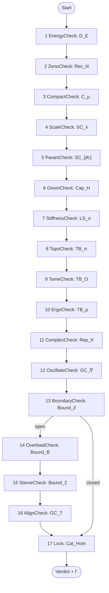

# Hypostructure LLM Reference (v1.0)

This file is the compact reference needed to execute `docs/source/template.md` as a deterministic proof-object compiler.

- Full spec (definitions, registries, proofs): `docs/source/hypopermits_jb.md`
- Optional meta-learning layer: `docs/source/metalearning.md`
- Worked runs: `docs/source/examples.md`, `docs/source/case_studies.md`
- Bibliography: `docs/source/references.bib`

---

## 1) Output Contract (what the template must contain)

1. **Thin instantiation** (the user-supplied primitives; Section 2 below).
2. **A Sieve run** through Nodes 1–17 where **each node emits exactly one typed certificate**.
3. **An append-only certificate context** $\Gamma$ (never delete; add upgrades as additional certificates).
4. **A verdict**:
   - **REGULAR**: Lock is blocked ($K_{\mathrm{Cat}_{\mathrm{Hom}}}^{\mathrm{blk}}$).
   - **DISPERSION**: CompactCheck returns dispersion + scattering barrier benign (Mode D.D).
   - **FAILURE(mode)**: a mode terminal is reached with witness/inadmissibility.
   - **HORIZON**: a typed NO-inconclusive horizon certificate persists in the goal cone (see {prf:ref}`def-proof-complete` in `hypopermits_jb.md`).

---

## 2) Minimal Inputs (“Thin Objects”)

Only these are user primitives; everything else is derived via factories and metatheorems (especially under the Automation Guarantee {prf:ref}`def-automation-guarantee`).

| Thin object | Symbol | You must provide |
|---|---|---|
| Arena | $\mathcal{X}^{\text{thin}}=(\mathcal{X},d,\mu)$ | state space, metric/distance, reference measure |
| Potential | $\Phi^{\text{thin}}=(\Phi,\nabla,\alpha)$ | height/energy $\Phi$, gradient/slope, scaling exponent $\alpha$ |
| Cost | $\mathfrak{D}^{\text{thin}}=(\mathfrak{D},\beta)$ | dissipation/cost $\mathfrak{D}$, scaling exponent $\beta$ |
| Invariance | $G^{\text{thin}}=(G,\rho,\mathcal{S})$ | symmetry group, action, scaling subgroup/action |
| Boundary (optional) | $\partial^{\text{thin}}=(\mathcal{B},\mathrm{Tr},\mathcal{J},\mathcal{R})$ | boundary object, trace, flux, reinjection (open systems only) |

Pointers (full definitions): Thin objects {prf:ref}`def-thin-objects`, Thin-to-Full Expansion {prf:ref}`mt-thin-expansion`.

---

## 3) Certificate Algebra (typed, monotone, upgradeable)

**Gate nodes (blue)** emit one of:
- **YES**: $K_I^+$ (constructive witness).
- **NO-witness**: $K_I^-$ (semantic refutation/counterexample).
- **NO-inconclusive**: $K_I^{\mathrm{inc}}=(\mathsf{obligation},\mathsf{missing},\mathsf{code},\mathsf{trace})$ (mandatory when neither YES nor NO-witness is available; see {prf:ref}`rem-mandatory-inc`).

**Barriers (orange)** emit:
- **BLOCKED**: $K_B^{\mathrm{blk}}$ (bad scenario excluded; treat as success via a promotion metatheorem).
- **BREACHED**: $K_B^{\mathrm{br}}$ (must route to admissibility/surgery or to a mode terminal).
- **BREACHED-inconclusive**: $K_B^{\mathrm{br\text{-}inc}}$ (especially at the Lock; see {prf:ref}`def-lock-breached-inc`).

**Surgery (purple)** emits:
- **Re-entry**: $K_S^{\mathrm{re}}$ (restores a weakest-precondition token for a downstream target node).

**Upgrade rule:** if a metatheorem says $A\wedge B\Rightarrow C$, you may **add** $C$ to $\Gamma$ without removing $A,B$ (audit trail).

---

## 4) Main Sieve Diagram (high-level)



### Full Sieve Diagram (authoritative control flow)
(Copied from `docs/source/hypopermits_jb.md` Appendix {ref}`complete-sieve-algorithm`.)

```mermaid
graph TD
    Start(["<b>START DIAGNOSTIC</b>"]) --> EnergyCheck{"<b>1. D_E:</b> Is Energy Finite?<br>E[Φ] < ∞"}

    %% --- LEVEL 1: 0-TRUNCATION (Energy Bounds) ---
    EnergyCheck -- "No: K-_DE" --> BarrierSat{"<b>B1. D_E:</b> Is Drift Bounded?<br>E[Φ] ≤ E_sat"}
    BarrierSat -- "Yes: Kblk_DE" --> ZenoCheck
    BarrierSat -- "No: Kbr_DE" --> SurgAdmCE{"<b>A1. SurgCE:</b> Admissible?<br>conformal ∧ ∂∞X def."}
    SurgAdmCE -- "Yes: K+_Conf" --> SurgCE["<b>S1. SurgCE:</b><br>Ghost/Cap Extension"]
    SurgAdmCE -- "No: K-_Conf" --> ModeCE["<b>Mode C.E</b>: Energy Blow-Up"]
    SurgCE -. "Kre_SurgCE" .-> ZenoCheck

    EnergyCheck -- "Yes: K+_DE" --> ZenoCheck{"<b>2. Rec_N:</b> Are Discrete Events Finite?<br>N(J) < ∞"}
    ZenoCheck -- "No: K-_RecN" --> BarrierCausal{"<b>B2. Rec_N:</b> Infinite Depth?<br>D#40;T*#41; = ∞"}
    BarrierCausal -- "No: Kbr_RecN" --> SurgAdmCC{"<b>A2. SurgCC:</b> Admissible?<br>∃N_max: events ≤ N_max"}
    SurgAdmCC -- "Yes: K+_Disc" --> SurgCC["<b>S2. SurgCC:</b><br>Discrete Saturation"]
    SurgAdmCC -- "No: K-_Disc" --> ModeCC["<b>Mode C.C</b>: Event Accumulation"]
    SurgCC -. "Kre_SurgCC" .-> CompactCheck
    BarrierCausal -- "Yes: Kblk_RecN" --> CompactCheck

    ZenoCheck -- "Yes: K+_RecN" --> CompactCheck{"<b>3. C_μ:</b> Does Energy Concentrate?<br>μ(V) > 0"}

    %% --- LEVEL 2: COMPACTNESS LOCUS (Profile Moduli) ---
    CompactCheck -- "No: K-_Cmu" --> BarrierScat{"<b>B3. C_μ:</b> Is Interaction Finite?<br>M[Φ] < ∞"}
    BarrierScat -- "Yes: Kben_Cmu" --> ModeDD["<b>Mode D.D</b>: Dispersion<br><i>#40;Global Existence#41;</i>"]
    BarrierScat -- "No: Kpath_Cmu" --> SurgAdmCD_Alt{"<b>A3. SurgCD_Alt:</b> Admissible?<br>V ∈ L_soliton ∧ ‖V‖_H¹ < ∞"}
    SurgAdmCD_Alt -- "Yes: K+_Prof" --> SurgCD_Alt["<b>S3. SurgCD_Alt:</b><br>Concentration-Compactness"]
    SurgAdmCD_Alt -- "No: K-_Prof" --> ModeCD_Alt["<b>Mode C.D</b>: Geometric Collapse<br><i>#40;Via Escape#41;</i>"]
    SurgCD_Alt -. "Kre_SurgCD_Alt" .-> Profile

    CompactCheck -- "Yes: K+_Cmu" --> Profile["<b>Canonical Profile V Emerges</b>"]

    %% --- LEVEL 3: EQUIVARIANT DESCENT ---
    Profile --> ScaleCheck{"<b>4. SC_λ:</b> Is Profile Subcritical?<br>λ(V) < λ_c"}

    ScaleCheck -- "No: K-_SClam" --> BarrierTypeII{"<b>B4. SC_λ:</b> Is Renorm Cost ∞?<br>∫D̃ dt = ∞"}
    BarrierTypeII -- "No: Kbr_SClam" --> SurgAdmSE{"<b>A4. SurgSE:</b> Admissible?<br>α-β < ε_crit ∧ V smooth"}
    SurgAdmSE -- "Yes: K+_Lift" --> SurgSE["<b>S4. SurgSE:</b><br>Regularity Lift"]
    SurgAdmSE -- "No: K-_Lift" --> ModeSE["<b>Mode S.E</b>: Supercritical Cascade"]
    SurgSE -. "Kre_SurgSE" .-> ParamCheck
    BarrierTypeII -- "Yes: Kblk_SClam" --> ParamCheck

    ScaleCheck -- "Yes: K+_SClam" --> ParamCheck{"<b>5. SC_∂c:</b> Are Constants Stable?<br>‖∂c‖ < ε"}
    ParamCheck -- "No: K-_SCdc" --> BarrierVac{"<b>B5. SC_∂c:</b> Is Phase Stable?<br>ΔV > k_B T"}
    BarrierVac -- "No: Kbr_SCdc" --> SurgAdmSC{"<b>A5. SurgSC:</b> Admissible?<br>‖∂θ‖ < C_adm ∧ θ stable"}
    SurgAdmSC -- "Yes: K+_Stab" --> SurgSC["<b>S5. SurgSC:</b><br>Convex Integration"]
    SurgAdmSC -- "No: K-_Stab" --> ModeSC["<b>Mode S.C</b>: Parameter Instability"]
    SurgSC -. "Kre_SurgSC" .-> GeomCheck
    BarrierVac -- "Yes: Kblk_SCdc" --> GeomCheck

    ParamCheck -- "Yes: K+_SCdc" --> GeomCheck{"<b>6. Cap_H:</b> Is Codim ≥ Threshold?<br>codim(S) ≥ 2"}

    %% --- LEVEL 4: DIMENSION FILTRATION ---
    GeomCheck -- "No: K-_CapH" --> BarrierCap{"<b>B6. Cap_H:</b> Is Measure Zero?<br>Cap_H#40;S#41; = 0"}
    BarrierCap -- "No: Kbr_CapH" --> SurgAdmCD{"<b>A6. SurgCD:</b> Admissible?<br>Cap#40;Σ#41; ≤ ε ∧ V ∈ L_neck"}
    SurgAdmCD -- "Yes: K+_Neck" --> SurgCD["<b>S6. SurgCD:</b><br>Auxiliary/Structural"]
    SurgAdmCD -- "No: K-_Neck" --> ModeCD["<b>Mode C.D</b>: Geometric Collapse"]
    SurgCD -. "Kre_SurgCD" .-> StiffnessCheck
    BarrierCap -- "Yes: Kblk_CapH" --> StiffnessCheck

    GeomCheck -- "Yes: K+_CapH" --> StiffnessCheck{"<b>7. LS_σ:</b> Is Gap Certified?<br>inf σ(L) > 0"}

    %% --- LEVEL 5: SPECTRAL OBSTRUCTION ---
    StiffnessCheck -- "No: K-_LSsig" --> BarrierGap{"<b>B7. LS_σ:</b> Is Kernel Finite?<br>dim ker#40;L#41; < ∞ ∧ σ_ess > 0"}
    BarrierGap -- "Yes: Kblk_LSsig" --> TopoCheck
    BarrierGap -- "No: Kstag_LSsig" --> BifurcateCheck{"<b>7a. LS_∂²V:</b> Is State Unstable?<br>∂²V(x*) ⊁ 0"}

    %% --- LEVEL 5b: SPECTRAL RESTORATION (Bifurcation Resolution) ---
    BifurcateCheck -- "No: K-_LSd2V" --> SurgAdmSD{"<b>A7. SurgSD:</b> Admissible?<br>dim ker#40;H#41; < ∞ ∧ V iso."}
    SurgAdmSD -- "Yes: K+_Iso" --> SurgSD["<b>S7. SurgSD:</b><br>Ghost Extension"]
    SurgAdmSD -- "No: K-_Iso" --> ModeSD["<b>Mode S.D</b>: Stiffness Breakdown"]
    SurgSD -. "Kre_SurgSD" .-> TopoCheck
    BifurcateCheck -- "Yes: K+_LSd2V" --> SymCheck{"<b>7b. G_act:</b> Is G-orbit Degenerate?<br>⎸G·v₀⎸ = 1"}

    %% Path A: Symmetry Breaking (Governed by SC_∂c)
    SymCheck -- "Yes: K+_Gact" --> CheckSC{"<b>7c. SC_∂c:</b> Are Constants Stable?<br>‖∂c‖ < ε"}
    CheckSC -- "Yes: K+_SCdc" --> ActionSSB["<b>ACTION: SYM. BREAKING</b><br>Generates Mass Gap"]
    ActionSSB -- "Kgap" --> TopoCheck
    CheckSC -- "No: K-_SCdc" --> SurgAdmSC_Rest{"<b>A8. SurgSC_Rest:</b> Admissible?<br>ΔV > k_B T ∧ Γ < Γ_crit"}
    SurgAdmSC_Rest -- "Yes: K+_Vac" --> SurgSC_Rest["<b>S8. SurgSC_Rest:</b><br>Auxiliary Extension"]
    SurgAdmSC_Rest -- "No: K-_Vac" --> ModeSC_Rest["<b>Mode S.C</b>: Parameter Instability<br><i>#40;Vacuum Decay#41;</i>"]
    SurgSC_Rest -. "Kre_SurgSC_Rest" .-> TopoCheck

    %% Path B: Tunneling (Governed by TB_S)
    SymCheck -- "No: K-_Gact" --> CheckTB{"<b>7d. TB_S:</b> Is Tunneling Finite?<br>S[γ] < ∞"}
    CheckTB -- "Yes: K+_TBS" --> ActionTunnel["<b>ACTION: TUNNELING</b><br>Instanton Decay"]
    ActionTunnel -- "Ktunnel" --> TameCheck
    CheckTB -- "No: K-_TBS" --> SurgAdmTE_Rest{"<b>A9. SurgTE_Rest:</b> Admissible?<br>V ≅ S^n×I ∧ S_R[γ] < ∞"}
    SurgAdmTE_Rest -- "Yes: K+_Inst" --> SurgTE_Rest["<b>S9. SurgTE_Rest:</b><br>Structural"]
    SurgAdmTE_Rest -- "No: K-_Inst" --> ModeTE_Rest["<b>Mode T.E</b>: Topological Twist<br><i>#40;Metastasis#41;</i>"]
    SurgTE_Rest -. "Kre_SurgTE_Rest" .-> TameCheck

    StiffnessCheck -- "Yes: K+_LSsig" --> TopoCheck{"<b>8. TB_π:</b> Is Sector Reachable?<br>[π] ∈ π₀(C)_acc"}

    %% --- LEVEL 6: HOMOTOPICAL OBSTRUCTIONS ---
    TopoCheck -- "No: K-_TBpi" --> BarrierAction{"<b>B8. TB_π:</b> Energy < Gap?<br>E < S_min + Δ"}
    BarrierAction -- "No: Kbr_TBpi" --> SurgAdmTE{"<b>A10. SurgTE:</b> Admissible?<br>V ≅ S^n×R #40;Neck#41;"}
    SurgAdmTE -- "Yes: K+_Topo" --> SurgTE["<b>S10. SurgTE:</b><br>Tunnel"]
    SurgAdmTE -- "No: K-_Topo" --> ModeTE["<b>Mode T.E</b>: Topological Twist"]
    SurgTE -. "Kre_SurgTE" .-> TameCheck
    BarrierAction -- "Yes: Kblk_TBpi" --> TameCheck

    TopoCheck -- "Yes: K+_TBpi" --> TameCheck{"<b>9. TB_O:</b> Is Topology Tame?<br>Σ ∈ O-min"}

    TameCheck -- "No: K-_TBO" --> BarrierOmin{"<b>B9. TB_O:</b> Is It Definable?<br>S ∈ O-min"}
    BarrierOmin -- "No: Kbr_TBO" --> SurgAdmTC{"<b>A11. SurgTC:</b> Admissible?<br>Σ ∈ O-ext def. ∧ dim < n"}
    SurgAdmTC -- "Yes: K+_Omin" --> SurgTC["<b>S11. SurgTC:</b><br>O-minimal Regularization"]
    SurgAdmTC -- "No: K-_Omin" --> ModeTC["<b>Mode T.C</b>: Labyrinthine"]
    SurgTC -. "Kre_SurgTC" .-> ErgoCheck
    BarrierOmin -- "Yes: Kblk_TBO" --> ErgoCheck

    TameCheck -- "Yes: K+_TBO" --> ErgoCheck{"<b>10. TB_ρ:</b> Does Flow Mix?<br>τ_mix < ∞"}

    ErgoCheck -- "No: K-_TBrho" --> BarrierMix{"<b>B10. TB_ρ:</b> Mixing Finite?<br>τ_mix < ∞"}
    BarrierMix -- "No: Kbr_TBrho" --> SurgAdmTD{"<b>A12. SurgTD:</b> Admissible?<br>Trap iso. ∧ ∂T > 0"}
    SurgAdmTD -- "Yes: K+_Mix" --> SurgTD["<b>S12. SurgTD:</b><br>Mixing Enhancement"]
    SurgAdmTD -- "No: K-_Mix" --> ModeTD["<b>Mode T.D</b>: Glassy Freeze"]
    SurgTD -. "Kre_SurgTD" .-> ComplexCheck
    BarrierMix -- "Yes: Kblk_TBrho" --> ComplexCheck

    ErgoCheck -- "Yes: K+_TBrho" --> ComplexCheck{"<b>11. Rep_K:</b> Is K(x) Computable?<br>K(x) ∈ ℕ"}

    %% --- LEVEL 7: KOLMOGOROV FILTRATION ---
    ComplexCheck -- "No: K-_RepK" --> BarrierEpi{"<b>B11. Rep_K:</b> Approx. Bounded?<br>sup K_ε#40;x#41; ≤ S_BH"}
    BarrierEpi -- "No: Kbr_RepK" --> SurgAdmDC{"<b>A13. SurgDC:</b> Admissible?<br>K ≤ S_BH+ε ∧ Lipschitz"}
    SurgAdmDC -- "Yes: K+_Lip" --> SurgDC["<b>S13. SurgDC:</b><br>Viscosity Solution"]
    SurgAdmDC -- "No: K-_Lip" --> ModeDC["<b>Mode D.C</b>: Semantic Horizon"]
    SurgDC -. "Kre_SurgDC" .-> OscillateCheck
    BarrierEpi -- "Yes: Kblk_RepK" --> OscillateCheck

    ComplexCheck -- "Yes: K+_RepK" --> OscillateCheck{"<b>12. GC_∇:</b> Does Flow Oscillate?<br>ẋ ≠ -∇V"}

    OscillateCheck -- "Yes: K+_GCnabla" --> BarrierFreq{"<b>B12. GC_∇:</b> Oscillation Finite?<br>∫ω²S dω < ∞"}
    BarrierFreq -- "No: Kbr_GCnabla" --> SurgAdmDE{"<b>A14. SurgDE:</b> Admissible?<br>∃Λ: trunc. moment < ∞ ∧ elliptic"}
    SurgAdmDE -- "Yes: K+_Ell" --> SurgDE["<b>S14. SurgDE:</b><br>De Giorgi-Nash-Moser"]
    SurgAdmDE -- "No: K-_Ell" --> ModeDE["<b>Mode D.E</b>: Oscillatory"]
    SurgDE -. "Kre_SurgDE" .-> BoundaryCheck
    BarrierFreq -- "Yes: Kblk_GCnabla" --> BoundaryCheck

    OscillateCheck -- "No: K-_GCnabla" --> BoundaryCheck{"<b>13. Bound_∂:</b> Is System Open?<br>∂Ω ≠ ∅"}

    %% --- LEVEL 8: BOUNDARY COBORDISM ---
    BoundaryCheck -- "Yes: K+_Bound" --> OverloadCheck{"<b>14. Bound_B:</b> Is Input Bounded?<br>‖Bu‖ ≤ M"}

    OverloadCheck -- "No: K-_BoundB" --> BarrierBode{"<b>B14. Bound_B:</b> Waterbed Bounded?<br>∫ln‖S‖dω > -∞"}
    BarrierBode -- "No: Kbr_BoundB" --> SurgAdmBE{"<b>A15. SurgBE:</b> Admissible?<br>‖S‖_∞ < M ∧ φ_margin > 0"}
    SurgAdmBE -- "Yes: K+_Marg" --> SurgBE["<b>S15. SurgBE:</b><br>Saturation"]
    SurgAdmBE -- "No: K-_Marg" --> ModeBE["<b>Mode B.E</b>: Injection"]
    SurgBE -. "Kre_SurgBE" .-> StarveCheck
    BarrierBode -- "Yes: Kblk_BoundB" --> StarveCheck

    OverloadCheck -- "Yes: K+_BoundB" --> StarveCheck{"<b>15. Bound_∫:</b> Is Input Sufficient?<br>∫r dt ≥ r_min"}

    StarveCheck -- "No: K-_BoundInt" --> BarrierInput{"<b>B15. Bound_∫:</b> Reserve Positive?<br>r_reserve > 0"}
    BarrierInput -- "No: Kbr_BoundInt" --> SurgAdmBD{"<b>A16. SurgBD:</b> Admissible?<br>r_res > 0 ∧ recharge > drain"}
    SurgAdmBD -- "Yes: K+_Res" --> SurgBD["<b>S16. SurgBD:</b><br>Reservoir"]
    SurgAdmBD -- "No: K-_Res" --> ModeBD["<b>Mode B.D</b>: Starvation"]
    SurgBD -. "Kre_SurgBD" .-> AlignCheck
    BarrierInput -- "Yes: Kblk_BoundInt" --> AlignCheck

    StarveCheck -- "Yes: K+_BoundInt" --> AlignCheck{"<b>16. GC_T:</b> Is Control Matched?<br>T(u) ~ d"}
    AlignCheck -- "No: K-_GCT" --> BarrierVariety{"<b>B16. GC_T:</b> Variety Sufficient?<br>H#40;u#41; ≥ H#40;d#41;"}
    BarrierVariety -- "No: Kbr_GCT" --> SurgAdmBC{"<b>A17. SurgBC:</b> Admissible?<br>H#40;u#41; < H#40;d#41; ∧ bridgeable"}
    SurgAdmBC -- "Yes: K+_Ent" --> SurgBC["<b>S17. SurgBC:</b><br>Controller Augmentation"]
    SurgAdmBC -- "No: K-_Ent" --> ModeBC["<b>Mode B.C</b>: Misalignment"]
    SurgBC -. "Kre_SurgBC" .-> BarrierExclusion

    %% --- LEVEL 9: THE COHOMOLOGICAL BARRIER ---
    %% All successful paths funnel here
    BoundaryCheck -- "No: K-_Bound" --> BarrierExclusion
    BarrierVariety -- "Yes: Kblk_GCT" --> BarrierExclusion
    AlignCheck -- "Yes: K+_GCT" --> BarrierExclusion

    BarrierExclusion{"<b>17. Cat_Hom:</b> Is Hom#40;Bad, S#41; = ∅?<br>Hom#40;B, S#41; = ∅"}

    BarrierExclusion -- "Yes: Kblk_CatHom" --> VICTORY(["<b>GLOBAL REGULARITY</b><br><i>#40;Structural Exclusion Confirmed#41;</i>"])
    BarrierExclusion -- "No: Kmorph_CatHom" --> ModeCat["<b>FATAL ERROR</b><br>Structural Inconsistency"]
    BarrierExclusion -- "NO(inc): Kbr-inc_CatHom" --> ReconstructionLoop["<b>MT 42.1:</b><br>Structural Reconstruction"]
    ReconstructionLoop -- "Verdict: Kblk" --> VICTORY
    ReconstructionLoop -- "Verdict: Kmorph" --> ModeCat

    %% ====== STYLES ======
    %% Success states - Green
    style VICTORY fill:#22c55e,stroke:#16a34a,color:#000000,stroke-width:4px
    style ModeDD fill:#22c55e,stroke:#16a34a,color:#000000

    %% Failure modes - Red
    style ModeCE fill:#ef4444,stroke:#dc2626,color:#ffffff
    style ModeCC fill:#ef4444,stroke:#dc2626,color:#ffffff
    style ModeSE fill:#ef4444,stroke:#dc2626,color:#ffffff
    style ModeSC fill:#ef4444,stroke:#dc2626,color:#ffffff
    style ModeCD fill:#ef4444,stroke:#dc2626,color:#ffffff
    style ModeCD_Alt fill:#ef4444,stroke:#dc2626,color:#ffffff
    style ModeSD fill:#ef4444,stroke:#dc2626,color:#ffffff
    style ModeTE fill:#ef4444,stroke:#dc2626,color:#ffffff
    style ModeTC fill:#ef4444,stroke:#dc2626,color:#ffffff
    style ModeTD fill:#ef4444,stroke:#dc2626,color:#ffffff
    style ModeDC fill:#ef4444,stroke:#dc2626,color:#ffffff
    style ModeDE fill:#ef4444,stroke:#dc2626,color:#ffffff
    style ModeBE fill:#ef4444,stroke:#dc2626,color:#ffffff
    style ModeBD fill:#ef4444,stroke:#dc2626,color:#ffffff
    style ModeBC fill:#ef4444,stroke:#dc2626,color:#ffffff
    style ModeCat fill:#ef4444,stroke:#dc2626,color:#ffffff

    %% Barriers - Orange/Amber
    style BarrierSat fill:#f59e0b,stroke:#d97706,color:#000000
    style BarrierCausal fill:#f59e0b,stroke:#d97706,color:#000000
    style BarrierScat fill:#f59e0b,stroke:#d97706,color:#000000
    style BarrierTypeII fill:#f59e0b,stroke:#d97706,color:#000000
    style BarrierVac fill:#f59e0b,stroke:#d97706,color:#000000
    style BarrierCap fill:#f59e0b,stroke:#d97706,color:#000000
    style BarrierGap fill:#f59e0b,stroke:#d97706,color:#000000
    style BarrierAction fill:#f59e0b,stroke:#d97706,color:#000000
    style BarrierOmin fill:#f59e0b,stroke:#d97706,color:#000000
    style BarrierMix fill:#f59e0b,stroke:#d97706,color:#000000
    style BarrierEpi fill:#f59e0b,stroke:#d97706,color:#000000
    style BarrierFreq fill:#f59e0b,stroke:#d97706,color:#000000
    style BarrierBode fill:#f59e0b,stroke:#d97706,color:#000000
    style BarrierInput fill:#f59e0b,stroke:#d97706,color:#000000
    style BarrierVariety fill:#f59e0b,stroke:#d97706,color:#000000

    %% Reconstruction Loop - Yellow/Gold
    style ReconstructionLoop fill:#fbbf24,stroke:#f59e0b,color:#000000,stroke-width:2px

    %% The Final Gate - Purple with thick border
    style BarrierExclusion fill:#8b5cf6,stroke:#7c3aed,color:#ffffff,stroke-width:4px

    %% Interface Checks - Blue
    style EnergyCheck fill:#3b82f6,stroke:#2563eb,color:#ffffff
    style ZenoCheck fill:#3b82f6,stroke:#2563eb,color:#ffffff
    style CompactCheck fill:#3b82f6,stroke:#2563eb,color:#ffffff
    style ScaleCheck fill:#3b82f6,stroke:#2563eb,color:#ffffff
    style ParamCheck fill:#3b82f6,stroke:#2563eb,color:#ffffff
    style GeomCheck fill:#3b82f6,stroke:#2563eb,color:#ffffff
    style StiffnessCheck fill:#3b82f6,stroke:#2563eb,color:#ffffff
    style TopoCheck fill:#3b82f6,stroke:#2563eb,color:#ffffff
    style TameCheck fill:#3b82f6,stroke:#2563eb,color:#ffffff
    style ErgoCheck fill:#3b82f6,stroke:#2563eb,color:#ffffff
    style ComplexCheck fill:#3b82f6,stroke:#2563eb,color:#ffffff
    style OscillateCheck fill:#3b82f6,stroke:#2563eb,color:#ffffff
    style BoundaryCheck fill:#3b82f6,stroke:#2563eb,color:#ffffff
    style OverloadCheck fill:#3b82f6,stroke:#2563eb,color:#ffffff
    style StarveCheck fill:#3b82f6,stroke:#2563eb,color:#ffffff
    style AlignCheck fill:#3b82f6,stroke:#2563eb,color:#ffffff

    %% Intermediate nodes - Purple
    style Start fill:#8b5cf6,stroke:#7c3aed,color:#ffffff
    style Profile fill:#8b5cf6,stroke:#7c3aed,color:#ffffff

    %% Restoration checks - Blue (interface permit checks)
    style BifurcateCheck fill:#3b82f6,stroke:#2563eb,color:#ffffff
    style SymCheck fill:#3b82f6,stroke:#2563eb,color:#ffffff
    style CheckSC fill:#3b82f6,stroke:#2563eb,color:#ffffff
    style CheckTB fill:#3b82f6,stroke:#2563eb,color:#ffffff

    %% Restoration mechanisms - Purple (escape mechanisms)
    style ActionSSB fill:#8b5cf6,stroke:#7c3aed,color:#ffffff
    style ActionTunnel fill:#8b5cf6,stroke:#7c3aed,color:#ffffff

    %% Restoration failure modes - Red
    style ModeSC_Rest fill:#ef4444,stroke:#dc2626,color:#ffffff
    style ModeTE_Rest fill:#ef4444,stroke:#dc2626,color:#ffffff

    %% Surgery recovery nodes - Purple
    style SurgCE fill:#8b5cf6,stroke:#7c3aed,color:#ffffff
    style SurgCC fill:#8b5cf6,stroke:#7c3aed,color:#ffffff
    style SurgCD_Alt fill:#8b5cf6,stroke:#7c3aed,color:#ffffff
    style SurgSE fill:#8b5cf6,stroke:#7c3aed,color:#ffffff
    style SurgSC fill:#8b5cf6,stroke:#7c3aed,color:#ffffff
    style SurgCD fill:#8b5cf6,stroke:#7c3aed,color:#ffffff
    style SurgSD fill:#8b5cf6,stroke:#7c3aed,color:#ffffff
    style SurgSC_Rest fill:#8b5cf6,stroke:#7c3aed,color:#ffffff
    style SurgTE_Rest fill:#8b5cf6,stroke:#7c3aed,color:#ffffff
    style SurgTE fill:#8b5cf6,stroke:#7c3aed,color:#ffffff
    style SurgTC fill:#8b5cf6,stroke:#7c3aed,color:#ffffff
    style SurgTD fill:#8b5cf6,stroke:#7c3aed,color:#ffffff
    style SurgDC fill:#8b5cf6,stroke:#7c3aed,color:#ffffff
    style SurgDE fill:#8b5cf6,stroke:#7c3aed,color:#ffffff
    style SurgBE fill:#8b5cf6,stroke:#7c3aed,color:#ffffff
    style SurgBD fill:#8b5cf6,stroke:#7c3aed,color:#ffffff
    style SurgBC fill:#8b5cf6,stroke:#7c3aed,color:#ffffff

    %% Surgery Admissibility checks - Light Purple with border
    style SurgAdmCE fill:#e9d5ff,stroke:#9333ea,color:#000000,stroke-width:2px
    style SurgAdmCC fill:#e9d5ff,stroke:#9333ea,color:#000000,stroke-width:2px
    style SurgAdmCD_Alt fill:#e9d5ff,stroke:#9333ea,color:#000000,stroke-width:2px
    style SurgAdmSE fill:#e9d5ff,stroke:#9333ea,color:#000000,stroke-width:2px
    style SurgAdmSC fill:#e9d5ff,stroke:#9333ea,color:#000000,stroke-width:2px
    style SurgAdmCD fill:#e9d5ff,stroke:#9333ea,color:#000000,stroke-width:2px
    style SurgAdmSD fill:#e9d5ff,stroke:#9333ea,color:#000000,stroke-width:2px
    style SurgAdmSC_Rest fill:#e9d5ff,stroke:#9333ea,color:#000000,stroke-width:2px
    style SurgAdmTE_Rest fill:#e9d5ff,stroke:#9333ea,color:#000000,stroke-width:2px
    style SurgAdmTE fill:#e9d5ff,stroke:#9333ea,color:#000000,stroke-width:2px
    style SurgAdmTC fill:#e9d5ff,stroke:#9333ea,color:#000000,stroke-width:2px
    style SurgAdmTD fill:#e9d5ff,stroke:#9333ea,color:#000000,stroke-width:2px
    style SurgAdmDC fill:#e9d5ff,stroke:#9333ea,color:#000000,stroke-width:2px
    style SurgAdmDE fill:#e9d5ff,stroke:#9333ea,color:#000000,stroke-width:2px
    style SurgAdmBE fill:#e9d5ff,stroke:#9333ea,color:#000000,stroke-width:2px
    style SurgAdmBD fill:#e9d5ff,stroke:#9333ea,color:#000000,stroke-width:2px
    style SurgAdmBC fill:#e9d5ff,stroke:#9333ea,color:#000000,stroke-width:2px
```


Full DAG (all barriers/surgeries/restoration subtree): see the Mermaid graph in `docs/source/hypopermits_jb.md` (Section {ref}`complete-sieve-algorithm`).

---

## 5) Permit Tables (what each node checks)

### 5.1 Gate permits (Nodes 1–12)

| Node | Gate (permit) | Predicate (YES means…) | Output certs | NO routes to |
|---:|---|---|---|---|
| 1 | $D_E$ ({prf:ref}`def-node-energy`) | $\sup_{t<T}\Phi(u(t))<\infty$ | $K_{D_E}^+,K_{D_E}^-,K_{D_E}^{\mathrm{inc}}$ | BarrierSat |
| 2 | $\mathrm{Rec}_N$ ({prf:ref}`def-node-zeno`) | finitely many discrete events on bounded windows | $K_{\mathrm{Rec}_N}^+,K_{\mathrm{Rec}_N}^-,K_{\mathrm{Rec}_N}^{\mathrm{inc}}$ | BarrierCausal |
| 3 | $C_\mu$ ({prf:ref}`def-node-compact`) | concentration occurs (profile exists) | $K_{C_\mu}^+,K_{C_\mu}^-$ | BarrierScat / Mode D.D |
| 4 | $\mathrm{SC}_\lambda$ ({prf:ref}`def-node-scale`) | subcritical scaling ($\alpha>\beta$) | $K_{\mathrm{SC}_\lambda}^+,K_{\mathrm{SC}_\lambda}^-,K_{\mathrm{SC}_\lambda}^{\mathrm{inc}}$ | BarrierTypeII |
| 5 | $\mathrm{SC}_{\partial c}$ ({prf:ref}`def-node-param`) | parameters/constants stable | $K_{\mathrm{SC}_{\partial c}}^+,K_{\mathrm{SC}_{\partial c}}^-,K_{\mathrm{SC}_{\partial c}}^{\mathrm{inc}}$ | BarrierVac |
| 6 | $\mathrm{Cap}_H$ ({prf:ref}`def-node-geom`) | $\mathrm{Cap}(\Sigma)<C_{\text{crit}}$ (e.g., codim $\ge 2$) | $K_{\mathrm{Cap}_H}^+,K_{\mathrm{Cap}_H}^-,K_{\mathrm{Cap}_H}^{\mathrm{inc}}$ | BarrierCap |
| 7 | $\mathrm{LS}_\sigma$ ({prf:ref}`def-node-stiffness`) | stiffness / gap holds | $K_{\mathrm{LS}_\sigma}^+,K_{\mathrm{LS}_\sigma}^-,K_{\mathrm{LS}_\sigma}^{\mathrm{inc}}$ | BarrierGap + restoration subtree |
| 8 | $\mathrm{TB}_\pi$ ({prf:ref}`def-node-topo`) | sector accessible/preserved | $K_{\mathrm{TB}_\pi}^+,K_{\mathrm{TB}_\pi}^-,K_{\mathrm{TB}_\pi}^{\mathrm{inc}}$ | BarrierAction |
| 9 | $\mathrm{TB}_O$ ({prf:ref}`def-node-tame`) | singular set/topology is tame (o-minimal definable) | $K_{\mathrm{TB}_O}^+,K_{\mathrm{TB}_O}^-,K_{\mathrm{TB}_O}^{\mathrm{inc}}$ | BarrierOmin |
| 10 | $\mathrm{TB}_\rho$ ({prf:ref}`def-node-ergo`) | finite mixing time ($\tau_{\mathrm{mix}}<\infty$) | $K_{\mathrm{TB}_\rho}^+,K_{\mathrm{TB}_\rho}^-,K_{\mathrm{TB}_\rho}^{\mathrm{inc}}$ | BarrierMix |
| 11 | $\mathrm{Rep}_K$ ({prf:ref}`def-node-complex`) | finite/computable description (or finite complexity of law) | $K_{\mathrm{Rep}_K}^+,K_{\mathrm{Rep}_K}^-,K_{\mathrm{Rep}_K}^{\mathrm{inc}}$ | BarrierEpi |
| 12 | $\mathrm{GC}_\nabla$ ({prf:ref}`def-node-oscillate`) | oscillation present (YES) vs monotone/gradient-like (NO) | $K_{\mathrm{GC}_\nabla}^+,K_{\mathrm{GC}_\nabla}^-,K_{\mathrm{GC}_\nabla}^{\mathrm{inc}}$ | BarrierFreq (if YES), else Node 13 |

### 5.2 Boundary permits (Nodes 13–16)

| Node | Gate (permit) | Predicate (YES means…) | Output certs | NO routes to |
|---:|---|---|---|---|
| 13 | $\mathrm{Bound}_\partial$ ({prf:ref}`def-node-boundary`) | system is open (has boundary coupling) | $K_{\mathrm{Bound}_\partial}^+,K_{\mathrm{Bound}_\partial}^-$ | if NO: skip to Lock (Node 17) |
| 14 | $\mathrm{Bound}_B$ ({prf:ref}`def-node-overload`) | input is bounded (no overload) | $K_{\mathrm{Bound}_B}^+,K_{\mathrm{Bound}_B}^-,K_{\mathrm{Bound}_B}^{\mathrm{inc}}$ | BarrierBode |
| 15 | $\mathrm{Bound}_{\Sigma}$ ({prf:ref}`def-node-starve`) | input is sufficient (no starvation) | $K_{\mathrm{Bound}_{\Sigma}}^+,K_{\mathrm{Bound}_{\Sigma}}^-,K_{\mathrm{Bound}_{\Sigma}}^{\mathrm{inc}}$ | BarrierInput |
| 16 | $\mathrm{GC}_T$ ({prf:ref}`def-node-align`) | control/proxy aligned with true objective | $K_{\mathrm{GC}_T}^+,K_{\mathrm{GC}_T}^-,K_{\mathrm{GC}_T}^{\mathrm{inc}}$ | BarrierVariety |

### 5.3 The Lock (Node 17)

| Node | Barrier (permit) | Predicate (BLOCKED means…) | Output certs |
|---:|---|---|---|
| 17 | $\mathrm{Cat}_{\mathrm{Hom}}$ ({prf:ref}`def-node-lock`) | $\mathrm{Hom}(\mathbb{H}_{\mathrm{bad}},\mathcal{H})=\varnothing$ | $K_{\mathrm{Cat}_{\mathrm{Hom}}}^{\mathrm{blk}}$ / $K_{\mathrm{Cat}_{\mathrm{Hom}}}^{\mathrm{morph}}$ / $K_{\mathrm{Cat}_{\mathrm{Hom}}}^{\mathrm{hor}}$ / $K_{\mathrm{Cat}_{\mathrm{Hom}}}^{\mathrm{br\text{-}inc}}$ |

---

## 6) Metatheorem Catalog (requirements ⇒ output; no proofs)

### 6.1 Core / instantiation / compilation (`hypopermits_jb.md`)

- `mt-fixed-point-principle` ({prf:ref}`mt-fixed-point-principle`): hypostructure axioms on finite-energy trajectories ⇔ asymptotic self-consistency ⇔ persistent states are fixed points.
- `mt-valid-instantiation` ({prf:ref}`mt-valid-instantiation`): topos + $(\mathcal{X},\Phi,\mathfrak{D},G)$ + evaluators/certificate schemas ⇒ Sieve is a well-defined computable function.
- `mt-minimal-instantiation` ({prf:ref}`mt-minimal-instantiation`): provide thin objects $(\mathcal{X},\Phi,\mathfrak{D},G)$ ⇒ Framework derives profiles/admissibility/surgery/topology/bad sets.
- `mt-thin-expansion` ({prf:ref}`mt-thin-expansion`): thin objects + basic consistency ⇒ full kernel objects + derived structures (SectorMap, bad set, ProfileExtractor, SurgeryOperator).
- `mt-soft-wp` ({prf:ref}`mt-soft-wp`): SoftCore ($K_{\mathcal{H}_0}^+ \wedge K_{D_E}^+ \wedge K_{\mathrm{Bound}}^+ \wedge K_{\mathrm{SC}_\lambda}^+ \wedge K_{\mathrm{Rep}_K}^+$) ⇒ $K_{\mathrm{WP}_{s_c}}^+$.
- `mt-soft-profdec` ({prf:ref}`mt-soft-profdec`): $K_{C_\mu}^+ \wedge K_{\mathrm{SC}_\lambda}^+ \wedge K_{\mathrm{Rep}_K}^+$ ⇒ $K_{\mathrm{ProfDec}_{s_c,G}}^+$.
- `mt-soft-km` ({prf:ref}`mt-soft-km`): $K_{\mathrm{WP}_{s_c}}^+ \wedge K_{\mathrm{ProfDec}}^+ \wedge K_{D_E}^+ \wedge K_{\mathrm{SC}_\lambda}^+$ ⇒ $K_{\mathrm{KM}_{\mathrm{CC+stab}}}^+$.
- `mt-soft-rigidity` ({prf:ref}`mt-soft-rigidity`): $K_{\mathrm{Mon}_\phi}^+ \wedge K_{\mathrm{KM}}^+ \wedge K_{\mathrm{LS}_\sigma}^+ \wedge K_{\mathrm{Cat}_{\mathrm{Hom}}}^{\mathrm{blk}}$ ⇒ $K_{\mathrm{Rigidity}_T}^+$.
- `mt-soft-attr` ({prf:ref}`mt-soft-attr`): $K_{D_E}^+ \wedge K_{C_\mu}^+ \wedge K_{\mathrm{TB}_\pi}^+$ ⇒ $K_{\mathrm{Attr}}^+$.
- `mt-soft-morsedecomp` ({prf:ref}`mt-soft-morsedecomp`): $K_{\mathrm{Attr}}^+ \wedge K_{D_E}^+ \wedge K_{\mathrm{LS}_\sigma}^+$ ⇒ $K_{\mathrm{MorseDecomp}}^+$.
- `mt-weakest-precondition` ({prf:ref}`mt-weakest-precondition`): define thin objects + implement interface predicates ⇒ run Sieve; regularity is an output certificate, not an assumption.

### 6.2 Lyapunov reconstruction (`hypopermits_jb.md`)

- `mt-canonical-lyapunov-existence` ({prf:ref}`mt-canonical-lyapunov-existence`): $K_{D_E}^+ \wedge K_{C_\mu}^+ \wedge K_{\mathrm{LS}_\sigma}^+$ ⇒ $K_{\mathcal{L}}^+$ (canonical Lyapunov exists).
- `mt-jacobi-reconstruction` ({prf:ref}`mt-jacobi-reconstruction`): $K_{D_E}^+ \wedge K_{\mathrm{LS}_\sigma}^+ \wedge K_{\mathrm{GC}_\nabla}^+$ ⇒ $K_{\mathrm{Jacobi}}^+$ (Lyapunov as Jacobi-metric action).
- `mt-hamilton-jacobi` ({prf:ref}`mt-hamilton-jacobi`): $K_{D_E}^+ \wedge K_{\mathrm{LS}_\sigma}^+ \wedge K_{\mathrm{GC}_\nabla}^+$ ⇒ $K_{\mathrm{HJ}}^+$ (static Hamilton–Jacobi characterization).
- `mt-extended-action` ({prf:ref}`mt-extended-action`): prior Lyapunov certificates + surgery/transport compatibility ⇒ extended action/Lyapunov across surgeries.

### 6.3 Towers / obstructions (`hypopermits_jb.md`)

- `mt-tower-globalization` ({prf:ref}`mt-tower-globalization`): local/tower interface permits across strata ⇒ globalized tower certificate (soft local → global).
- `mt-obstruction-collapse` ({prf:ref}`mt-obstruction-collapse`): obstruction interface + capacity control ⇒ obstruction class collapses (reduces to small-capacity case).
- `mt-stiff-pairing` ({prf:ref}`mt-stiff-pairing`): stiffness pairing conditions ⇒ no null directions / kernel control for stiffness layer.

### 6.4 Universal Singularity Modules & automation (`hypopermits_jb.md`)

- `mt-profile-trichotomy` ({prf:ref}`mt-profile-trichotomy`): at Profile node ⇒ exactly one of $K_{\text{lib}}$, $K_{\text{strat}}$, or $K_{\mathrm{prof}}^-$ (wild/inc).
- `mt-auto-profile` ({prf:ref}`mt-auto-profile`): Automation Guarantee + SoftCore (+ one mechanism extension) ⇒ computed $K_{\mathrm{prof}}^+$.
- `mt-surgery-trichotomy` ({prf:ref}`mt-surgery-trichotomy`): before surgery ⇒ exactly one of $K_{\text{adm}}$, $K_{\text{adm}}^{\sim}$, $K_{\text{inadm}}$.
- `mt-auto-admissibility` ({prf:ref}`mt-auto-admissibility`): Automation Guarantee + thin objects ⇒ computed admissibility certificate (no user code).
- `mt-structural-surgery` ({prf:ref}`mt-structural-surgery`): $K^{\mathrm{br}} \wedge (K_{\text{adm}} \text{ or } K_{\text{adm}}^{\sim})$ ⇒ surgery pushout + re-entry certificate $K^{\mathrm{re}}$.
- `mt-conservation-flow` ({prf:ref}`mt-conservation-flow`): admissible surgery ⇒ energy drop + regularization + bounded surgery count.
- `mt-auto-surgery` ({prf:ref}`mt-auto-surgery`): Automation Guarantee + $V\in\mathcal{L}_T$ ⇒ surgery executed automatically (pushout + re-entry).

### 6.5 Factory metatheorems (`hypopermits_jb.md`)

- `mt-gate-factory` ({prf:ref}`mt-gate-factory`): type $T$ + user definitions ⇒ canonical verifiers for Nodes 1–17 (sound YES certificates).
- `mt-barrier-factory` ({prf:ref}`mt-barrier-factory`): type $T$ + literature lemmas ⇒ default barrier implementations (non-circular, valid certs).
- `mt-surgery-factory` ({prf:ref}`mt-surgery-factory`): type $T$ admitting surgery ⇒ default surgery operators + admissibility + re-entry certs (else $K_{\mathrm{Surg}}^{\mathrm{inc}}$).
- `mt-transport-factory` ({prf:ref}`mt-transport-factory`): type $T$ ⇒ equivalence moves + transport lemmas + promotion rules.
- `mt-lock-factory` ({prf:ref}`mt-lock-factory`): type $T$ + $\mathrm{Rep}_K$ ⇒ Lock tactics; if $\mathrm{Rep}_K$ unavailable ⇒ limited Lock (geometry-only).
- `mt-instantiation` ({prf:ref}`mt-instantiation`): user provides $(X,G,\Phi,\mathfrak{D},\ldots)$ + type $T$ ⇒ compiled, sound sieve implementation (via TM-1…TM-5).

### 6.6 Instantaneous promotions / upgrades (`hypopermits_jb.md`)

- `mt-saturation-promotion` ({prf:ref}`mt-saturation-promotion`): $K_{D_E}^- \wedge K_{\text{sat}}^{\mathrm{blk}}$ ⇒ $K_{D_E}^{\sim}$ (finite energy under renormalized measure).
- `mt-causal-censor` ({prf:ref}`mt-causal-censor`): $K_{\mathrm{Rec}_N}^- \wedge K_{\mathrm{Rec}_N}^{\mathrm{blk}}$ ⇒ $K_{\mathrm{Rec}_N}^{\sim}$ (finite observable event count).
- `mt-scattering-promotion` ({prf:ref}`mt-scattering-promotion`): $K_{C_\mu}^- \wedge K_{C_\mu}^{\mathrm{ben}}$ ⇒ VICTORY (Mode D.D dispersion/scattering).
- `mt-type-ii-suppression` ({prf:ref}`mt-type-ii-suppression`): $K_{\mathrm{SC}_\lambda}^- \wedge K_{\mathrm{II}}^{\mathrm{blk}}$ ⇒ $K_{\mathrm{SC}_\lambda}^{\sim}$ (effective subcriticality after renorm).
- `mt-capacity-promotion` ({prf:ref}`mt-capacity-promotion`): $K_{\mathrm{Cap}_H}^- \wedge K_{\text{cap}}^{\mathrm{blk}}$ ⇒ $K_{\mathrm{Cap}_H}^{\sim}$ (removable singular set).
- `mt-spectral-gap` ({prf:ref}`mt-spectral-gap`): $K_{\mathrm{LS}_\sigma}^- \wedge K_{\text{gap}}^{\mathrm{blk}}$ ⇒ $K_{\mathrm{LS}_\sigma}^+$ (stiffness via finite kernel / essential gap).
- `mt-o-minimal` ({prf:ref}`mt-o-minimal`): $K_{\mathrm{TB}_O}^- \wedge K_{\mathrm{TB}_O}^{\mathrm{blk}}$ ⇒ $K_{\mathrm{TB}_O}^{\sim}$ (tameness via definability).
- `mt-surgery-promotion` ({prf:ref}`mt-surgery-promotion`): $K_S^{\mathrm{re}}$ + target preconditions ⇒ corresponding gate YES$^\sim$.
- `mt-lock-promotion` ({prf:ref}`mt-lock-promotion`): $K_{\mathrm{Cat}_{\mathrm{Hom}}}^{\mathrm{blk}}$ ⇒ GLOBAL YES (regularity verdict; retroactive permit validation).
- `mt-absorbing-boundary` ({prf:ref}`mt-absorbing-boundary`): absorbing boundary certificate ⇒ reduces boundary energy accounting to Node 1 (EnergyCheck).
- `mt-catastrophe-stability` ({prf:ref}`mt-catastrophe-stability`): bifurcation/instability evidence + catastrophe-stability condition ⇒ promotes to StiffnessCheck continuation.
- `mt-inc-completion` ({prf:ref}`mt-inc-completion`): $K_P^{\mathrm{inc}}$ + all listed missing prerequisites in $\Gamma$ ⇒ upgrade to $K_P^+$.
- `mt-inc-aposteriori` ({prf:ref}`mt-inc-aposteriori`): later certificates (post-surgery/Lock) satisfy missing prerequisites ⇒ retro-upgrade earlier $K_P^{\mathrm{inc}}$ to $K_P^+$.
- `mt-shadow-sector-retroactive` ({prf:ref}`mt-shadow-sector-retroactive`): TopoCheck shadow-sector constraint ⇒ retroactive promotion affecting ZenoCheck (topological confinement of events).

### 6.7 Cross-gate interaction theorems (`hypopermits_jb.md`)

- `mt-lock-back` ({prf:ref}`mt-lock-back`): Lock blocked ⇒ can retroactively block/promote earlier barriers (global obstruction controls local failures).
- `mt-symmetry-gap` ({prf:ref}`mt-symmetry-gap`): symmetry structure ⇒ stiffness/gap (SymCheck → StiffnessCheck).
- `mt-tame-topology` ({prf:ref}`mt-tame-topology`): tameness ⇒ geometry/capacity control (TameCheck → GeomCheck).
- `mt-ergodic-sat` ({prf:ref}`mt-ergodic-sat`): ergodicity/mixing ⇒ saturation/energy control (ErgoCheck → EnergyCheck).
- `mt-variety-control` ({prf:ref}`mt-variety-control`): alignment/requisite variety ⇒ scaling control (AlignCheck → ScaleCheck).
- `mt-algorithm-depth` ({prf:ref}`mt-algorithm-depth`): computational depth bound ⇒ excludes Zeno/event accumulation (ComplexCheck → ZenoCheck).
- `mt-holographic` ({prf:ref}`mt-holographic`): holographic/complexity bound ⇒ capacity/geom control (ComplexCheck → GeomCheck).
- `mt-spectral-quant` ({prf:ref}`mt-spectral-quant`): Lock obstruction ⇒ oscillation quantization control (Lock → OscillateCheck).
- `mt-unique-attractor` ({prf:ref}`mt-unique-attractor`): suitable permit schema (alternative backends) ⇒ unique attractor certificate.

### 6.8 Stability / composition metatheorems (`hypopermits_jb.md`)

- `mt-openness` ({prf:ref}`mt-openness`): regularity is open under small perturbations (structural stability).
- `mt-shadowing` ({prf:ref}`mt-shadowing`): numerical shadowing certificate ⇒ validity of approximate trajectories (numerical-to-true lift).
- `mt-weak-strong` ({prf:ref}`mt-weak-strong`): weak + strong solution coexistence ⇒ uniqueness/upgrade (duality mechanism).
- `mt-product` ({prf:ref}`mt-product`): product system permits ⇒ product-regularity certificate (composition).
- `mt-subsystem` ({prf:ref}`mt-subsystem`): subsystem permits ⇒ inheritance of regularity/obstruction properties.

### 6.9 Imported metatheorems (`hypopermits_jb.md`)

- `mt-imported-structural-exclusion` ({prf:ref}`mt-imported-structural-exclusion`): Hom-emptiness at Lock + admissible $\mathbf{Hypo}_T$ hypotheses ⇒ $\mathrm{Rep}_K(T,Z)$ (conjecture/regularity) holds.
- `mt-imported-structural-resolution` ({prf:ref}`mt-imported-structural-resolution`): minimal regularity + $D_E$ (+ compactness template) ⇒ trichotomy of behaviors (dispersion / regularity via obstructions / genuine singularity).
- `mt-imported-equivariance` ({prf:ref}`mt-imported-equivariance`): $G$-covariant data + equivariant parametrization + defect equivariance ⇒ learned/minimizing parameters preserve symmetry (SV-08).
- `mt-imported-type-ii-exclusion` ({prf:ref}`mt-imported-type-ii-exclusion`): $D_E^+ \wedge \mathrm{SC}_\lambda^+$ with $\alpha>\beta$ (+ finite total cost) ⇒ excludes supercritical self-similar blow-up (Type II).
- `mt-imported-spectral-generator` ({prf:ref}`mt-imported-spectral-generator`): $D_E$ + $\mathrm{LS}_\sigma$ + $\mathrm{GC}_\nabla$ (+ Hessian positivity near $M$) ⇒ Łojasiewicz–Simon inequality / stiffness control.
- `mt-imported-ergodic-mixing` ({prf:ref}`mt-imported-ergodic-mixing`): mixing barrier hypotheses ⇒ ergodic/mixing obstruction or its exclusion (BarrierMix justification).
- `mt-imported-spectral-distance` ({prf:ref}`mt-imported-spectral-distance`): $C_\mu$ + $D_E$ ⇒ spectral/metric identification used by frequency/complexity barriers.
- `mt-imported-antichain-surface` ({prf:ref}`mt-imported-antichain-surface`): boundary/min-cut–max-flow correspondence ⇒ boundary node realizations (bridge from combinatorics/geometry).
- `mt-imported-saturation` ({prf:ref}`mt-imported-saturation`): $D_E$ + $\mathrm{SC}_\lambda$ ⇒ saturation barrier principle (BarrierSat justification).
- `mt-imported-causal-barrier` ({prf:ref}`mt-imported-causal-barrier`): computational depth limitation ⇒ BarrierCausal justification.
- `mt-imported-capacity-barrier` ({prf:ref}`mt-imported-capacity-barrier`): $\mathrm{Cap}_H$ (+ geometric background) ⇒ capacity barrier / removability criterion.
- `mt-imported-topological-suppression` ({prf:ref}`mt-imported-topological-suppression`): $\mathrm{TB}_\pi$ (+ scaling/energy) ⇒ topological sector suppression (BarrierAction justification).
- `mt-imported-epistemic-horizon` ({prf:ref}`mt-imported-epistemic-horizon`): representational/complexity assumptions ⇒ horizon principle (BarrierEpi justification).
- `mt-imported-regularity-lift` ({prf:ref}`mt-imported-regularity-lift`): local regularity + scale subcriticality ⇒ lift to global regularity (regularity-lift surgery principle).
- `mt-imported-structural-surgery` ({prf:ref}`mt-imported-structural-surgery`): admissible profile + gluing data ⇒ rigorous surgery construction (MT 6.5).
- `mt-imported-projective-extension` ({prf:ref}`mt-imported-projective-extension`): projective compactification assumptions ⇒ extension across infinity (MT 6.3).
- `mt-imported-brst` ({prf:ref}`mt-imported-brst`): ghost/derived extension assumptions ⇒ derived extension / BRST resolution (MT 6.2).
- `mt-imported-adjoint-surgery` ({prf:ref}`mt-imported-adjoint-surgery`): primal-dual / constraint alignment assumptions ⇒ adjoint surgery move (MT 6.26).
- `mt-imported-lyapunov-compactification` ({prf:ref}`mt-imported-lyapunov-compactification`): conformal/Jacobi compactification assumptions ⇒ compactify via Lyapunov metric (MT 6.4).
- `mt-imported-motivic-flow` ({prf:ref}`mt-imported-motivic-flow`): $D_E^+ \wedge C_\mu^+ \wedge \mathrm{SC}_\lambda^+$ ⇒ motivic assignment certificate with weight filtration (MT 22.1).
- `mt-imported-schematic-sieve` ({prf:ref}`mt-imported-schematic-sieve`): $\mathrm{Cap}_H^+ \wedge \mathrm{LS}_\sigma^+ \wedge \mathrm{SC}_\lambda^+ \wedge \mathrm{TB}_\pi^+$ ⇒ SOS/semialgebraic bad-pattern exclusion cert (MT 22.2).
- `mt-imported-kodaira-spencer` ({prf:ref}`mt-imported-kodaira-spencer`): $\mathrm{LS}_\sigma^+ \wedge C_\mu^+$ ⇒ deformation cohomology / rigidity classification cert (MT 22.3).
- `mt-imported-virtual-cycle` ({prf:ref}`mt-imported-virtual-cycle`): $\mathrm{Cap}_H^+ \wedge D_E^+ \wedge \mathrm{Rep}^+$ ⇒ virtual fundamental class / enumerative cert (MT 22.7).
- `mt-imported-monodromy-weight` ({prf:ref}`mt-imported-monodromy-weight`): $\mathrm{TB}_\pi^+ \wedge \mathrm{SC}_\lambda^+ \wedge D_E^+$ ⇒ limiting mixed Hodge structure / lock cert (MT 22.11).
- `mt-imported-tannakian-recognition` ({prf:ref}`mt-imported-tannakian-recognition`): $K_{\mathrm{Cat}_{\mathrm{Hom}}}^+ \wedge K_\Gamma^+$ ⇒ Tannakian group reconstruction / algebraicity criterion (MT 22.15).
- `mt-structural-reconstruction` ({prf:ref}`mt-structural-reconstruction`): Lock breached-inconclusive + reconstruction functor assumptions ⇒ constructive dictionary resolving Lock (MT 42.1).

---

## 7) Meta-learning metatheorems (optional; `metalearning.md`)

These are only needed if you are learning/optimizing hypostructure components from data rather than hand-defining them.

- `mt-existence-of-axiom-minimizers` ({prf:ref}`mt-existence-of-axiom-minimizers`): compact $\Theta$ + continuity + dominated bound ⇒ existence of global axiom minimizer $\theta^*$.
- `mt-joint-training-dynamics` ({prf:ref}`mt-joint-training-dynamics`): coupled gradient flow on joint risk ⇒ convergence/trajectory characterization for $(\theta_t)$ under standard regularity assumptions.
- `mt-sv-09-meta-identifiability` ({prf:ref}`mt-sv-09-meta-identifiability`): identifiability conditions on defect families ⇒ recovery of true axiom parameters up to symmetry.
- `mt-functional-reconstruction` ({prf:ref}`mt-functional-reconstruction`): sufficient observation/defect data ⇒ reconstruct $\Phi_\theta,\mathfrak{D}_\theta,G_\theta$ within the parametric family.
- `mt-trainable-hypostructure-consistency` ({prf:ref}`mt-trainable-hypostructure-consistency`): small joint defect risk ⇒ learned hypostructure satisfies permits approximately/consistently.
- `mt-meta-error-localization` ({prf:ref}`mt-meta-error-localization`): defect decomposition + sensitivity ⇒ localize which permit/interface causes empirical failure.
- `mt-meta-generalization` ({prf:ref}`mt-meta-generalization`): capacity/control of hypothesis class ⇒ generalization of low defects from sample to population.
- `mt-axiom-expressivity` ({prf:ref}`mt-axiom-expressivity`): richness of parametric axiom family ⇒ ability to approximate target structural constraints.
- `mt-optimal-experiment-design` ({prf:ref}`mt-optimal-experiment-design`): choose trajectory sampling/design measure ⇒ maximize information about $\theta$ / minimize posterior uncertainty.
- `mt-robustness-of-failure-mode-predictions` ({prf:ref}`mt-robustness-of-failure-mode-predictions`): stability of mode classification under perturbations/noise ⇒ robust failure-mode forecasting.
- `mt-robust-divergence-control` ({prf:ref}`mt-robust-divergence-control`): robust control of divergence in training dynamics ⇒ bounded risk under perturbations.
- `mt-robust-latent-mode-suppression` ({prf:ref}`mt-robust-latent-mode-suppression`): training with penalties/priors ⇒ suppress spurious latent modes.
- `mt-curriculum-stability` ({prf:ref}`mt-curriculum-stability`): curriculum schedule assumptions ⇒ stability/convergence improvements.
- `mt-robust-ls-convergence` ({prf:ref}`mt-robust-ls-convergence`): Łojasiewicz-style conditions for meta-objective ⇒ convergence rates/avoidance of cycling.
- `mt-hypostructure-from-raw-data` ({prf:ref}`mt-hypostructure-from-raw-data`): raw trajectory data + identifiability ⇒ reconstruct a hypostructure instance.
- `mt-equivariance` ({prf:ref}`mt-equivariance`): $G$-equivariant data/model ⇒ learned structures preserve symmetry.
- `mt-differentiability` ({prf:ref}`mt-differentiability`): regularity of defect/risk functionals ⇒ differentiability of meta-objective and valid gradients.
- `mt-universal-solver` ({prf:ref}`mt-universal-solver`): expressive model + optimization assumptions ⇒ existence of solver that minimizes joint defect risk.
- `mt-the-learnability-threshold` ({prf:ref}`mt-the-learnability-threshold`): information/complexity threshold conditions ⇒ learnability vs impossibility boundary.
- `mt-the-renormalization-variational-principle` ({prf:ref}`mt-the-renormalization-variational-principle`): renormalization variational setup ⇒ select effective axioms/parameters by minimizing meta-action.
- `mt-non-differentiable-extension` ({prf:ref}`mt-non-differentiable-extension`): non-smooth defects ⇒ generalized (subgradient/variational) training still yields minimizers.
- `mt-defect-reconstruction-2` ({prf:ref}`mt-defect-reconstruction-2`): defect observations ⇒ reconstruct missing defect functionals / calibrate penalties.
- `mt-meta-identifiability` ({prf:ref}`mt-meta-identifiability`): meta-level identifiability assumptions ⇒ recover latent structure/parameters.
- `mt-epistemic-fixed-point` ({prf:ref}`mt-epistemic-fixed-point`): stability of learning loop ⇒ epistemic fixed point (self-consistent learned theory).
