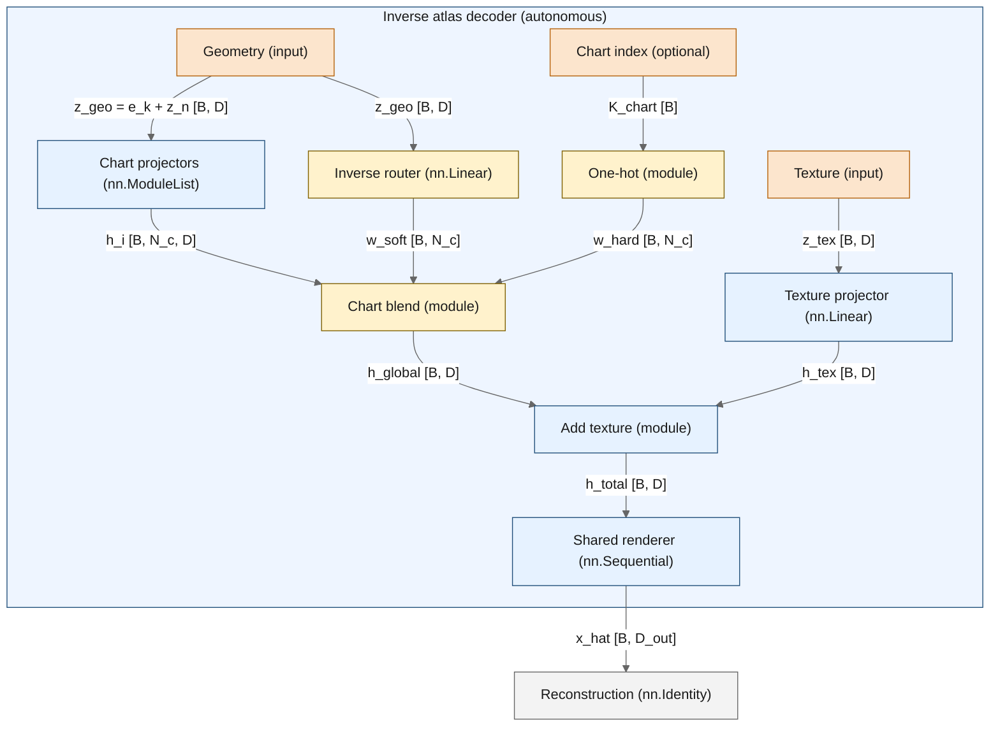

# The Fragile Agent: Bounded-Rationality Control and Information Geometry

## 0. Positioning: Connections to Prior Work, Differences, and Advantages

This document is a **synthesis and engineering specification** for building agents that remain stable, grounded, and debuggable under partial observability and finite capacity. Most mathematical ingredients are standard in **safe RL**, **robust control**, **information geometry**, **representation learning**, and **Bayesian filtering**. The contribution is to make the dependencies *explicit* and to provide a set of **online-auditable contracts** (Gate Nodes + Barriers) that connect representation, dynamics, value, and control.

### 0.1 Main Advantages (Why This Framing Is Useful)

1. **Online auditability.** Constraints are stated in quantities you can compute during training/inference (entropies, KLs, value gradients, stability inequalities), not only as “eventual performance”.
2. **Explicit macro-state abstraction.** The discrete macro register $K_t$ makes sufficiency, capacity, and closure conditions well-typed and testable (Sections 2.2b, 2.8, 3, 15).
3. **Predictive vs structured residual separation.** The “micro” channel is not a trash bin: we explicitly separate **structured nuisance** (pose/basis/disturbance coordinates that can be modeled and monitored) from **texture** (high-rate reconstruction detail). This prevents the world model and policy from silently depending on texture while still allowing nuisance to be represented and audited (Sections 2.2b, 2.8, 3, 11.5).
4. **Geometry-aware regulation.** A state-space sensitivity metric $G$ is used as a runtime trust-region / conditioning signal (Sections 2.5–2.6, 9.10), complementing standard natural-gradient methods {cite}`amari1998natural,schulman2015trpo,martens2015kfac`.
5. **Safety as a first-class interface contract.** "Safety" is not a single scalar constraint: it decomposes into explicit checks (switching limits, capacity limits, saturation, grounding, mixing) with known compute cost (Sections 3–8).
6. **Unified treatment of discrete and continuous dynamics.** The Wasserstein-Fisher-Rao (WFR) metric provides a single variational principle for belief evolution that seamlessly handles both continuous flow within charts and discrete jumps between charts (Section 20).
7. **Geometric field-theoretic interpretation.** The critic is not just a "value predictor" but a PDE solver propagating reward boundary conditions via the screened Poisson (Helmholtz) equation; discount factor has physical meaning as screening length (Section 24).
8. **Holographic interface symmetry.** Sensors and motors are dual boundary conditions on the same symplectic manifold—perception imposes Dirichlet (position) BCs, action imposes Neumann (flux) BCs, and reward injects scalar charges. The architecture is boundary-condition-complete (Sections 23–24).

### 0.2 What Is Novel Here vs What Is Repackaging

**Novel (as a combined framework / spec):**
1. **A discrete macro register used as the control-relevant state.** VQ-style discretization is treated as the *enabler* for audit-friendly information constraints (closure, capacity, window conditions), not just a compression trick (Sections 2.2b, 2.8, 15).
2. **The Sieve as an explicit catalog of monitors and limits.** Gate Nodes + Barriers are presented as a concrete interface between theory and implementation: “what to measure”, “what to penalize”, and “what to halt on” (Sections 3–6).
3. **Coupling-window operationalization.** The grounding/mixing window is stated directly in measurable information rates (Theorem 15.1.3), turning “stability/grounding” into an online diagnostic rather than a post-hoc story.
4. **A single notation tying representation, filtering, and control.** The same objects ($K_t$, $\bar P$, $V$, $G$, KL-control) appear consistently across the loop, reducing category errors between "learning" and "control" (Sections 2, 11, 13).
5. **The Holographic Interface as boundary-condition architecture.** Perception (Dirichlet BC), action (Neumann BC), and reward (Source BC) are unified as boundary conditions on the latent manifold, giving a principled asymmetric structure to the encoder/decoder/critic (Sections 23–24).
6. **WFR geometry for hybrid state spaces.** The Wasserstein-Fisher-Rao metric is proposed as the canonical geometry for agent belief states, seamlessly interpolating between continuous Wasserstein transport and discrete Fisher-Rao jumps via the teleportation length $\lambda$ (Section 20).
7. **Critic as Helmholtz solver with screening.** The value function is recast as a solution to the screened Poisson equation $-\Delta_G V + \kappa^2 V = \rho_r$ with rewards as sources and discount as screening mass $\kappa = -\ln\gamma$; the critic computes a Green's function (Section 24.2).
8. **Conformal back-reaction of value on metric.** High-curvature value regions modulate the metric via $\Omega = 1 + \alpha\|\nabla^2 V\|$, creating a feedback loop where "risky" areas acquire inertia (Section 24.4).
9. **Policy as symmetry-breaking kick.** Generation and control are unified as perturbations breaking $SO(D)$ symmetry at the origin; the framework exhibits a supercritical pitchfork bifurcation with critical temperature (Section 21.2).

**Repackaging (directly inherited ingredients):**
- **POMDP/belief-control viewpoint:** partial observability, belief updates, and control on internal state {cite}`kaelbling1998planning,rabiner1989tutorial`.
- **Entropy-regularized / KL-regularized control:** soft Bellman objectives, KL-control, and exponential-family optimal policies {cite}`todorov2009efficient,kappen2005path,haarnoja2018soft`.
- **World-model based RL:** learning latent dynamics for planning/control (e.g., Dreamer-like latent rollouts) {cite}`hafner2019dreamer,ha2018worldmodels`.
- **Representation learning primitives:** VQ-VAE, InfoNCE/CPC, VICReg/Barlow-type collapse prevention {cite}`oord2017vqvae,oord2018cpc,bardes2022vicreg,zbontar2021barlow`.
- **Safe RL and constrained optimization:** Lyapunov-style constraints and constrained policy updates {cite}`chow2018lyapunov,berkenkamp2017safe,altman1999constrained,achiam2017constrained`.
- **Optimal transport / WFR metric:** The Wasserstein-Fisher-Rao metric and unbalanced optimal transport machinery {cite}`chizat2018unbalanced,liero2018optimal`.
- **Symplectic geometry and Legendre transforms:** Classical mechanics textbook material applied to the boundary interface.
- **Helmholtz / screened Poisson equation:** Standard PDE theory (electrostatics, Yukawa potential); the mathematical form is textbook.
- **Holographic principle (AdS/CFT analogy):** The bulk/boundary duality metaphor from theoretical physics; used here heuristically as an organizing principle, not as a claim of deep physical correspondence.
- **Bifurcation theory:** Pitchfork bifurcations and symmetry breaking are standard dynamical systems.
- **Stochastic differential geometry:** Geodesic SDEs, Onsager-Machlup functionals, and Langevin dynamics on manifolds {cite}`onsager1953fluctuations`.
- **Molecular dynamics integrators:** The BAOAB splitting scheme is from computational chemistry {cite}`leimkuhler2016computation`.

### 0.3 Comparison Snapshot (Where This Differs in Practice)

| Area | Typical baseline | Fragile Agent difference |
|---|---|---|
| **Model-free RL** | optimize return; debugging via reward curves | adds explicit monitors and stop/penalty mechanisms tied to identifiable failure modes (Sections 3–6) |
| **World models** | continuous latent rollouts; implicit “state” | enforces a discrete macro state with closure and capacity checks; the “micro” channel is split into **structured nuisance** $z_n$ (auditable and optionally control-relevant) and **texture** $z_{\mathrm{tex}}$ (reconstruction-only, excluded from closure/control) (Sections 2.2b, 2.8, 9, 15) |
| **Safe RL / CMDPs** | few scalar constraints (expected cost) | uses a *vector* of auditable constraints (grounding, mixing, saturation, switching, stiffness) with compute-cost accounting (Sections 3–8) |
| **Info bottleneck RL** | compression via an information penalty | makes the bottleneck operational via $\log|\mathcal{K}|$, $H(K)$, $I(X;K)$ and closure, not only via a single Lagrange term (Sections 2.2b, 3, 15) |
| **Natural gradient / trust region** | parameter-space Fisher metric | emphasizes state-space sensitivity $G$ as a runtime regulator of updates and checks (Sections 2.5–2.6, 9.10) |
| **Diffusion models** | reverse SDE from noise to data | forward SDE from origin to boundary via holographic generation; policy steers the entropy-driven expansion (Section 21) |
| **AdS/CFT-inspired architectures** | bulk/boundary duality as loose metaphor | explicit boundary-condition architecture: Dirichlet (sensors), Neumann (motors), Source (rewards) mapped to neural components (Sections 23–24) |
| **Critic / value function** | MLP fitting $V(z)$ via TD error | PDE-solver propagating reward boundary conditions via screened Poisson equation; Helmholtz regularization and conformal coupling to metric (Section 24) |

**Reading guide (connections by section).**
- Representation + abstraction: Sections 2.2b, 2.8, 9.7–9.9
- Safety monitors and limits: Sections 3–6
- Filtering + projection (belief evolution): Section 11
- Entropy-regularized control + exploration: Sections 10–14
- Coupling window and capacity constraints: Sections 15, 17, and 18
- Hybrid state-space geometry (WFR): Section 20
- Holographic generation and symmetry breaking: Section 21
- Equations of motion and integrators: Section 22
- Holographic interface and boundary conditions: Sections 23–24
- Supervised topology and classification: Section 25
- Frequently asked questions (rigorous objections and responses): Appendix D

### 0.4 For Skeptical Readers

This framework makes strong claims about structure, geometry, and safety. A rigorous reader should ask: *Is this over-engineered? Does the math actually buy anything? What breaks?*

**Appendix D** addresses twenty such objections head-on, organized by theme:
- **Computational complexity:** Can you actually invert those matrices? Run those PDEs?
- **Optimization dynamics:** Do all these loss terms fight each other into deadlock?
- **Information theory:** Is "texture" just a way to hide inconvenient signals?
- **Physics isomorphisms:** Are the thermodynamic metaphors rigorous or poetic?
- **Control & safety:** What stops the agent from gaming the Sieve by doing nothing?

Each question is stated in its strongest form, then answered with specific mechanisms and section references. If the answers are unconvincing, the framework deserves skepticism.

## 1. Introduction: The Agent as a Bounded-Rationality Controller

This document presents the **Fragile** interpretation of the Hypostructure: a deployed agent is a persistent **controller under partial observability** whose competence is bounded by (i) finite sensing/communication bandwidth, (ii) finite internal memory/representation capacity, and (iii) finite compute for inference and planning.

The framework is stated strictly in **information theory, optimization, and control**: discrete/continuous latent state construction (representation), stability constraints (Lyapunov-style), and capacity/sufficiency conditions (information bottlenecks).

This is the native language of **Safe RL**, **Robust Control**, and **Embodied AI**.

## 1.1 Definitions: Interaction Under Partial Observability

In the Fragile Agent framework, we do **not** treat the environment as a passive data provider. We treat the agent as a **partially observed control problem** whose only coupling to the external world is through a well-defined **interface / Markov blanket**. All RL primitives are re-typed as **signals and constraints at this interface**.

### 1.1.1 The Environment is an Input–Output Law (Not an Internal Object)

**Definition 1.1.1 (Bounded-Rationality Controller).** The agent is a controller with internal state
$$
Z_t := (K_t, Z_{n,t}, Z_{\mathrm{tex},t}) \in \mathcal{Z}=\mathcal{K}\times\mathcal{Z}_n\times\mathcal{Z}_{\mathrm{tex}},
$$
and internal components (Encoder/Shutter, World Model, Critic, Policy). Its evolution is driven only by the observable interaction stream at the interface (observations/feedback) and by its own outgoing control signals (actions).

**Definition 1.1.2 (Boundary / Markov Blanket).** The boundary variables at time $t$ are the interface tuple
$$
B_t := (x_t,\ r_t,\ d_t,\ \iota_t,\ a_t),
$$
where:
- $x_t\in\mathcal{X}$ is the observation (input sample),
- $r_t\in\mathbb{R}$ is reward/utility (scalar feedback; equivalently negative instantaneous cost),
- $d_t\in\{0,1\}$ is termination (absorbing event / task boundary),
- $\iota_t$ denotes any additional side channels (costs, constraints, termination reasons, privileged signals),
- $a_t\in\mathcal{A}$ is action (control signal sent outward).

**Definition 1.1.3 (Environment as Generative Process).** The “environment” is the conditional law of future interface signals given past interface history. Concretely it is a (possibly history-dependent) kernel on incoming boundary signals conditional on outgoing control:
$$
P_{\partial}(x_{t+1}, r_t, d_t, \iota_{t+1}\mid x_{\le t}, a_{\le t}).
$$
In the Markov case this reduces to the familiar RL kernel
$$
P_{\partial}(x_{t+1}, r_t, d_t, \iota_{t+1}\mid x_t, a_t),
$$
but the **interpretation changes**: $P_{\partial}$ is not “a dataset generator”; it is the **input–output law** that the controller must cope with under partial observability and model mismatch.

This is the categorical move: we do not assume access to the environment’s latent variables; we work only with the **law over observable interface variables**.

### 1.1.2 Re-typing Standard RL Primitives as Interface Signals

1. **Environment (Stochastic Process / Unmodeled Disturbance).**
   - *Standard:* a black box providing states and rewards.
   - *Fragile:* a high-dimensional, partially observed stochastic process; only its induced interface law $P_{\partial}$ is accessible to the agent.
   - *Role:* supplies observations and feedback signals; may be non-stationary, adversarial, or only approximately Markov.

2. **Observation $x_t$ (Observation Stream).**
   - *Standard:* an input tensor.
   - *Fragile:* the only exogenous input available to the controller. The encoder/shutter transduces it into internal coordinates:
     $$
     x_t \mapsto (K_t, Z_{n,t}, Z_{\mathrm{tex},t}),
     $$
     where $K_t$ is the **discrete predictive signal** (bounded-rate latent statistic), $Z_{n,t}$ is a **structured nuisance / gauge residual** (pose/basis/disturbance coordinates), and $Z_{\mathrm{tex},t}$ is a **texture residual** (high-rate reconstruction detail).
   - *Boundary gate nodes (Section 3):*
     - **Node 14 (InputSaturationCheck):** input saturation (sensor dynamic range exceeded).
     - **Node 15 (SNRCheck):** low signal-to-noise (SNR too low to support stable inference).
     - **Node 13 (BoundaryCheck):** the channel is open in the only well-typed sense: $I(X;K)>0$ (symbolic mutual information).

3. **Action $a_t$ (Control / Actuation).**
   - *Standard:* a vector sent to the environment.
   - *Fragile:* a control signal chosen to minimize expected future cost under uncertainty and constraints. Like observations, actions decompose into structured components: $a_t = (A_t, z_{n,\text{motor}}, z_{\text{tex,motor}})$ where $A_t$ is the discrete motor macro, $z_{n,\text{motor}}$ is motor nuisance (compliance), and $z_{\text{tex,motor}}$ is motor texture (tremor). See Section 23.3 for details.
   - *Cybernetic constraints:*
     - **Node 2 (ZenoCheck):** limits chattering (bounded variation in control outputs).
     - **BarrierSat:** actuator saturation (finite control authority).
   - *Boundary interpretation (Section 23.1):* Actions impose **Neumann boundary conditions** (clamping flux/momentum) on the agent's internal manifold, dual to the Dirichlet conditions imposed by sensors.

4. **Reward $r_t$ (Utility / Negative Cost Signal).**
   - *Standard:* a scalar to maximize.
   - *Fragile:* a scalar feedback signal used to define the control objective. In continuous-time derivations it appears as an instantaneous **cost rate**; in discrete time it appears as an incremental term in the Bellman/HJB consistency relation (Section 2.7).
   - *Mechanism:* the critic's $V$ is the internal value/cost-to-go; reward provides the task-aligned signal shaping $V$.
   - *Boundary interpretation (Section 24.1):* Reward is a **Scalar Charge Density** $\sigma_r$ on the boundary. The Critic solves the **Screened Poisson Equation** (Theorem 24.2.1) to propagate this boundary condition into the bulk, generating the potential field $V(z)$.

5. **Termination $d_t$ (Absorbing Boundary Event).**
   - *Standard:* end-of-episode flag.
   - *Fragile:* an absorbing event: the trajectory has entered a terminal region (failure/success) or exited the modeled domain. It is part of the task specification, not a training artifact.

6. **Episode / Rollout (Finite-Horizon Segment).**
   - *Standard:* a finite trajectory segment.
   - *Fragile:* a finite window used to estimate a cumulative objective under uncertainty. “Success” is satisfying task constraints while maintaining stability; “failure” is crossing a monitored limit (Section 4).

### 1.1.4 Symmetries and Gauge Freedoms (Operational)

Many of the largest stability and sample-efficiency failures in practice come from **wasting capacity on nuisance degrees of freedom**: the agent learns separate internal states for observations that differ only by pose, basis choice, or arbitrary internal labeling. We formalize these nuisance directions as **symmetries** (group actions) and treat “quotienting them out” as an explicit design constraint.

We use “gauge” in the minimal, operational sense: a **gauge transformation** is a change of coordinates or representation that should not change the agent’s control-relevant decisions, except through explicitly modeled nuisance variables.

**Definition 1.1.4 (Agent symmetry group; operational).** Let:
- $G_{\text{obj}}$ be an **objective/feedback gauge** acting on scalar feedback signals (e.g., change of units or baseline shift). A common choice is the positive affine group
  $$
  G_{\text{obj}} := \{(a,b): a>0,\ r\mapsto ar+b\}.
  $$
  (If representing value as a unit-norm phase variable, one may instead use $U(1)$; Section 3.3.C treats the real-valued case via projective heads.)
- $G_{\text{spatial}}$ be an **observation gauge** acting on raw observations $x$ (e.g., pose/translation/rotation; choose $SE(3)$, $SE(2)$, $\mathrm{Sim}(2)$, or a task-specific subgroup depending on sensors).
- $S_{|\mathcal{K}|}$ be the **symbol-permutation symmetry** of the discrete macro register: relabeling code indices is unobservable if downstream components depend only on embeddings $\{e_k\}$.
- $\mathrm{Symp}(2n,\mathbb{R})$ be an optional **phase-space symmetry** acting on canonical latent coordinates $z=(q,p)\in\mathbb{R}^{2n}$ when the world model is parameterized as a symplectic/Hamiltonian system (Section 3.3.B).

The (candidate) total symmetry group is the direct product
$$
\mathcal{G}_{\mathbb{A}}
:=
G_{\text{obj}}
\times
G_{\text{spatial}}
\times
S_{|\mathcal{K}|}
\times
\mathrm{Symp}(2n,\mathbb{R}).
$$

**Internal vs. external symmetries.**
- **Internal (objective) gauge:** transformations of the scalar feedback scale/offset (and any potentials) that should not qualitatively change the policy update direction.
- **External (observation) gauge:** transformations of the input stream that change *pose* but not *identity*.

**Principle of covariance (engineering requirement).** The internal maps of the agent should be invariant/equivariant under $\mathcal{G}_{\mathbb{A}}$ in the following typed sense:
- **Shutter $E$: canonicalize or quotient $G_{\text{spatial}}$ before discretization, so the macro register is approximately invariant:
  $$
  K(x)\approx K(g\cdot x)\quad (g\in G_{\text{spatial}}),
  $$
  while $z_n$ carries structured nuisance parameters (pose/basis/disturbance coordinates) and $z_{\mathrm{tex}}$ carries reconstruction-only texture (Section 2.2b, Section 3.3.A).
- **World model $S$ and policy $\pi$: be covariant to symbol permutations $S_{|\mathcal{K}|}$ by treating $K$ only through its embedding $e_K$ (not the integer label) and by using permutation-invariant diagnostics.
- **Critic/value and dual variables:** enforce stability and constraint satisfaction in a way that is robust to re-scaling/offset of the scalar feedback (Section 3.3.C, Section 3.5).

These are *requirements on representations and interfaces*, not philosophical claims: if an invariance is not enforced, the corresponding failure modes (symmetry blindness, brittle scaling, uncontrolled drift) become more likely and harder to debug.

## 1.2 Units and Dimensional Conventions (Explicit)

This document expresses objectives in **information units** so that likelihoods, code lengths, KL terms, and entropy regularizers share a common scale.

**Base units.**
- Interaction time is measured in **environment steps** ($t \in \mathbb{Z}_{\ge 0}$). If a physical clock is needed, introduce $\Delta t$ with $[\\Delta t]=\mathrm{s}$.
- Information: entropies/information/KL are in **nats** (dimensionless but tracked): $[H]=[S]=[I]=[D_{KL}]=\mathrm{nat}$.
- Costs / values / losses (including $V$ and negative rewards) are measured in **nats**: $[V]=\mathrm{nat}$.
- Cost rates are measured in $\mathrm{nat/step}$ (or $\mathrm{nat\,s^{-1}}$ after dividing by $\Delta t$).

**Discrete vs continuous reward.**
- Per-step reward $r_t$ (or cost $c_t=-r_t$) has units $\mathrm{nat}$.
- A continuous-time cost rate $\mathcal{R}$ has units $\mathrm{nat\,s^{-1}}$ and links to discrete time by $r_t \approx \int_{t}^{t+\Delta t}\mathcal{R}(u)\,du$.

**Regularization / precision coefficients.**
- MaxEnt / entropy-regularized control introduces a trade-off coefficient (often written $T_c$ or $\alpha_{\text{ent}}$) multiplying an entropy term. Because entropy is in nats, this coefficient is dimensionless and simply sets relative weight in the objective.
- Exponential-family (softmax/logit) policies use a precision parameter $\beta$ so that $\exp(\beta\,\cdot)$ is dimensionless. Here $\beta$ is dimensionless and interpretable as an inverse-variance / “sharpness” control knob.

**Conventions for generic coefficients.**
- Numerical stabilizers like $\epsilon$ always inherit the units of the quantity they are added to.
- Composite-loss weights (e.g. $\lambda_{\text{*}}$ used to sum training losses) are taken dimensionless unless explicitly stated otherwise.

## 1.3 The Chronology: Temporal Distinctions

We distinguish four temporal dimensions. They are orthogonal (or nested) and must not be conflated. Using one symbol for all of them is a chronological category error (e.g., confusing "thinking longer" with "getting older").

| Symbol | Name | Domain | Role | Physics Analogy |
| :--- | :--- | :--- | :--- | :--- |
| **$t$** | **Interaction Time** | $\mathbb{Z}_{\ge 0}$ | External environment clock ($x_t, a_t$). | Coordinate time (observer clock) |
| **$s$** | **Computation Time** | $\mathbb{R}_{\ge 0}$ | Internal solver time for belief/planning updates. | Proper time (agent thinking) |
| **$\tau$** | **Scale Time** | $\mathbb{R}_{\ge 0}$ | Resolution depth (root to leaf). | Renormalization scale |
| **$t'$** | **Memory Time** | $\{t' \in \mathbb{Z} : t' < t\}$ | Index of stored past states on the screen. | Retarded time |

### 1.3.1 Interaction Time ($t$): The Discrete Clock
This is the Markov Decision Process index imposed by the environment.
- **Update:** $z_t \to z_{t+1}$.
- **Constraint:** the agent must emit $a_t$ before $t$ increments (real-time constraint).

### 1.3.2 Computation Time ($s$): The Continuous Thought
This is the integration variable of the internal solver and the Equation of Motion (Section 22). It represents the agent's "thinking" process:
$$
\frac{dz}{ds} = -G^{-1}\nabla \Phi_{\text{eff}} + \dots
$$
- **Relationship to $t$:** to transition from $t$ to $t+1$, the agent integrates its internal dynamics from $s=0$ to $s=S_{\text{budget}}$.
- **Thinking fast vs. slow:** small $S_{\text{budget}}$ yields reflexive action; large $S_{\text{budget}}$ yields deliberate planning.
- **Thermodynamics:** this is the time variable in which Fokker-Planck dynamics evolve internal belief toward equilibrium (Section 22.5).

### 1.3.3 Scale Time ($\tau$): The Holographic Depth
This is the radial coordinate in the Poincare disk (Sections 21, 7.12). It corresponds to resolution depth.
- **Dynamics:** $dr/d\tau = \operatorname{sech}^2(\tau/2)$ (the holographic law).
- **Discretization:** in stacked TopoEncoders, layer $\ell$ corresponds to scale time $\tau_\ell$.
- **Direction:** $\tau \to \infty$ (UV) is high energy, fine detail; $\tau \to 0$ (IR) is low energy, coarse structure.
- **Process:** generation flows in $+\tau$ (root to boundary); inference flows in $-\tau$.

### 1.3.4 Memory Time ($t'$): The Historical Coordinate
This is the time coordinate of the Holographic Screen.
- **Structure:** the screen stores tuples $(z_{t'}, a_{t'}, r_{t'})$ at past indices.
- **Access:** attention computes distances between the current state $z_t$ and stored states $z_{t'}$.
- **Causality:** we enforce $t' < t$ (no access to the future).

---

## 2. The Control Loop: Representation and Control

We frame the agent as a **bounded controller** operating on an internal latent state space: it must learn a representation, learn/predict dynamics, and choose actions under uncertainty and capacity limits.

### 2.1 The Objective: Optimal Control Under Information Constraints

We write the objective as a cumulative cost functional $\mathcal{S}$ (expected loss plus regularization) over time:
$$
\mathcal{S}
=
\int \Big(
\underbrace{\mathcal{L}_{\text{control}}}_{\text{control cost / regularization}}
\;+\;
\underbrace{C(z_t,a_t)}_{\text{task cost}}
\Big)\,dt.
$$
Operationally, $\mathcal{L}_{\text{control}}$ can be a KL control penalty (deviation from a prior policy), action magnitude cost, or any control-effort term; $C$ encodes task loss and constraints.

**Relation to prior work.** This objective family covers standard stochastic optimal control and entropy-/KL-regularized RL: KL-control and “soft” (entropy-regularized) Bellman objectives are special cases {cite}`todorov2009efficient,kappen2005path,haarnoja2018soft`.

### Anatomy: The Fragile Agent (Core Architecture)
The Fragile Agent architecture used throughout this document is the tuple $\mathbb{A}$:
$$ \mathbb{A} = (\text{Split VQ-VAE Shutter}, \text{World Model}, \text{Critic}, \text{Policy}) $$

This tuple directly instantiates the core objects of the Hypostructure $\mathbb{H} = (\mathcal{X}, \nabla, \Phi)$:

| Component | Hypostructure Map | Role (Mechanism) | Cybernetic Function |
| :--- | :--- | :--- | :--- |
| **Autoencoder (Split VQ-VAE)** | **State Space Construction ($\mathcal{X}$)** | **Information Bottleneck Encoder:** maps $x \mapsto (K, z_{n}, z_{\mathrm{tex}})$ where $K$ is a *discrete predictive latent*, $z_{n}$ is a *structured nuisance residual*, and $z_{\mathrm{tex}}$ is a *reconstruction-only texture residual*. | Defines the representation used for prediction and control. |
| **World Model** | **Dynamics Model ($\nabla, S_t$)** | **Predictive Model:** simulates/learns latent dynamics to support planning and counterfactual evaluation. | Defines the learned transition structure within $Z$. |
| **Critic** | **Value/Cost Functional ($\Phi$)** | **Value Function:** assigns a scalar cost-to-go/value to points in $Z$, representing risk/undesirability. | Defines the gradient signal $\nabla V$. |
| **Policy** | **Control Regularization ($\mathfrak{D}$)** | **Controller (Policy):** chooses actions that reduce expected future cost subject to constraints and regularization. | Implements the control law minimizing $\mathcal{S}$. |

### 2.2a The Trinity of Manifolds (Dimensional Alignment)

To prevent category errors, we formally distinguish three manifolds with distinct geometric structures:

| Manifold | Symbol | Coordinates | Metric Tensor | Role |
|----------|--------|-------------|---------------|------|
| **Physical/Data** | $\mathcal{X}$ | $x \in \mathbb{R}^D$ | $I$ (Euclidean) | Raw observations—the "hardware" |
| **Latent/Problem** | $\mathcal{Z}=\mathcal{K}\times \mathcal{Z}_{n}\times \mathcal{Z}_{\mathrm{tex}}$ | $(K, z_{n}, z_{\mathrm{tex}})$ with $K \in \mathcal{K}$, $z_{n}\in\mathbb{R}^{d_n}$, $z_{\mathrm{tex}}\in\mathbb{R}^{d_{\mathrm{tex}}}$ | $d_{\mathcal{K}} \oplus G_{n}(z_{n};K)$ | Symbolic macro-register + structured nuisance coordinates + reconstruction-only texture |
| **Parameter/Model** | $\Theta$ | $\theta \in \mathbb{R}^P$ | $\mathcal{F}(\theta)$ (Fisher-Rao) | Configuration space—the "weights" |

**Dimensional Verification:**

- The shutter $E: \mathcal{X} \to \mathcal{K}\times \mathcal{Z}_n\times \mathcal{Z}_{\mathrm{tex}}$ is a **contraction** in structured continuous degrees of freedom ($d_n \ll D$) plus a **finite-rate quantization** in the macro channel ($\log|\mathcal{K}|$ bits); texture may remain high-rate but is firewall-restricted to reconstruction/likelihood.
- The policy $\pi_\theta$ is typically a map on macrostates (or their code embeddings) $\pi_\theta:\mathcal{K}\to\mathcal{A}$. If a structured nuisance coordinate $z_n$ is required for actuation, treat it as an explicit typed input (policy on $(K,z_n)$) and keep enclosure/closure defined at the macro layer (Section 2.8). By contrast, dependence on **texture** $z_{\mathrm{tex}}$ is a causal leak for control and should be prohibited by architecture and monitored (texture is reconstruction-only).
- The metric $G_{n}$ is defined on the **structured nuisance coordinates** $\mathcal{Z}_n$ (and/or the induced geometry of the codebook embedding), not on $\Theta$; texture is excluded from the control metric.

**Anti-Mixing Principle:** Never conflate $\mathcal{F}(\theta)$ (parameter-space Fisher) with $G(z)$ (state-space metric). They live on different manifolds and measure different quantities:
- $\mathcal{F}(\theta)$: How the policy changes with weights (used by TRPO/PPO)
- $G_n(z_n;K)$: How the policy changes with structured nuisance coordinates (used by the Fragile Agent)

*Remark (WFR Foundation).* The product metric $d_{\mathcal{K}} \oplus G_n$ is a first approximation treating discrete and continuous components separately. Section 20 provides the rigorous **Wasserstein-Fisher-Rao** metric that unifies these components variationally: transport (Wasserstein) handles continuous motion within charts, while reaction (Fisher-Rao) handles discrete jumps between charts.

### 2.2b The Shutter as a VQ-VAE (Discrete Macro, Continuous Micro)

The information-theoretic/control interpretation benefits from an explicit **discrete latent register**: a countable set of macrostates on which we can apply Shannon/algorithmic statements without differential-entropy ambiguities. This is provided by a **VQ-VAE macro-encoder**.

We factor the latent as:
$$
Z_t := (K_t, Z_{n,t}, Z_{\mathrm{tex},t}),
\qquad
K_t \in \mathcal{K}\ \text{(discrete; may be hierarchical)},
\quad
Z_{n,t}\in\mathbb{R}^{d_n}\ \text{(continuous nuisance)},
\quad
Z_{\mathrm{tex},t}\in\mathbb{R}^{d_{\mathrm{tex}}}\ \text{(continuous texture)}.
$$
For the Attentive Atlas shutter, the macro register is a two-level tuple:
$$
K_t = (K_{\text{chart}}, K_{\text{code}}),
$$
with $K_{\text{chart}}\in\{1,\dots,N_c\}$ and $K_{\text{code}}\in\{1,\dots,N_v\}$.

**Macro codebook (symbols).** Let $\mathcal{K}=\{1,\dots,|\mathcal{K}|\}$ and let $\{e_k\}_{k\in\mathcal{K}}\subset\mathbb{R}^{d_m}$ be a learned codebook. Given an observation $x$ the macro encoder produces a pre-quantized vector $z_e(x)\in\mathbb{R}^{d_m}$ and the VQ projection chooses the nearest code:
$$
K(x) := \arg\min_{k\in\mathcal{K}} \|z_e(x)-e_k\|_2^2,
\qquad
z_{\text{macro}}(x):=e_{K(x)}.
$$
We equip $\mathcal{K}$ with the induced finite metric $d_{\mathcal{K}}(k,k'):=\|e_k-e_{k'}\|_2$ (or its $G_\mu$-weighted variant), so $\mathcal{Z}$ is a bundle of continuous fibres over a discrete base.

**Attentive Atlas shutter (TopoEncoder implementation).** The shutter in `topoencoder.py` uses a shared feature extractor $f(x)$, then:
- **Key projection:** $k(x)=W_k f(x)$
- **Value projection:** $v(x)=W_v f(x)$
- **Chart query bank:** $\{q_i\}_{i=1}^{N_c}$
- **Cross-attention routing:**
  $$
  w_i(x) = \frac{\exp(\langle k(x), q_i\rangle/\sqrt{d})}{\sum_j \exp(\langle k(x), q_j\rangle/\sqrt{d})},
  \qquad
  K_{\text{chart}} = \arg\max_i w_i(x).
  $$
Each chart has its own codebook $\{e_{i,c}\}_{c=1}^{N_v}$. For each chart, pick the closest code
$$
K_{\text{code},i}(x) := \arg\min_c \|v(x)-e_{i,c}\|_2^2,
$$
then form a soft blended code for differentiability:
$$
z_q(x) := \sum_i w_i(x)\, e_{i,K_{\text{code},i}(x)}.
$$
The hard code index used for discrete state is $K_{\text{code}}:=K_{\text{code},K_{\text{chart}}}(x)$.

**Recursive residual split (TopoEncoder).** The shutter then decomposes the value residual:
$$
\Delta_{\text{total}} = v(x) - \operatorname{sg}[z_q(x)],
\qquad
z_n = \text{StructureFilter}(\Delta_{\text{total}}),
\qquad
z_{\text{tex}} = \Delta_{\text{total}} - z_n.
$$
Finally, the geometric latent for the decoder is
$$
z_{\text{geo}} = z_q^{\text{st}} + z_n,
\qquad
z_q^{\text{st}} := v(x) + \operatorname{sg}[z_q(x)-v(x)],
$$
so reconstruction uses the discrete macro code plus structured nuisance.

**Canonicalization and symmetry quotienting (optional).** Let $G_{\text{spatial}}$ be a nuisance group acting on observations (Section 1.1.4). A practical way to make the macro register invariant to pose/basis choices is to insert a **canonicalization map** $C_\psi:\mathcal{X}\to\mathcal{X}$ before quantization and to train it so that
$$
C_\psi(g\cdot x)\approx C_\psi(x)\qquad (g\in G_{\text{spatial}}).
$$
One implementation is a Spatial Transformer Network (STN) that predicts and applies an input warp before the VQ encoder {cite}`jaderberg2015stn`. An alternative is to use an explicitly group-equivariant encoder and then pool to an invariant statistic {cite}`cohen2016group`.

Operationally, we replace the quantizer input $x$ by $\tilde x:=C_\psi(x)$ and define $K(x):=K(\tilde x)$. This realizes the quotienting intent “$K$ represents $x/G_{\text{spatial}}$” without requiring an exact quotient construction.

**Identity vs nuisance vs texture.** With canonicalization enabled, the design goal is a three-way separation:
- $K_t$ captures **invariant identity** ("what") needed for prediction and control.
- $z_{n,t}$ carries **structured nuisance** ("where/how", pose/basis/disturbance coordinates) that may be needed for *actuation* or for explaining boundary-induced deviations, but must remain disentangled from $K$.
- $z_{\mathrm{tex},t}$ carries **texture/detail** needed for reconstruction/likelihood only and is treated as *measurement/emission residual*: it must not be required for macro closure or for control decisions.

This separation is enforced by orbit-invariance and (macro ⟂ nuisance/texture) disentanglement losses in Section 3.3.A and monitored by SymmetryCheck/DisentanglementCheck (Section 3). The jump/residual machinery (Section 11.5.4) is attached to $z_n$ (structured disturbances), not to $z_{\mathrm{tex}}$.

*Remark (Motor Texture Extension).* Section 23.3 extends this decomposition to the **motor/action** side: $a_t = (A_t, z_{n,\text{motor}}, z_{\text{tex,motor}})$. The motor texture $z_{\text{tex,motor}}$ (tremor, fine motor noise) is dual to visual texture via the symplectic form (Theorem 23.3.4). Section 23.2 defines a **Dual Atlas Architecture** where $\mathcal{A}_{\text{vis}}$ (visual) and $\mathcal{A}_{\text{act}}$ (action) are related by Legendre transform.

**Nuisance residual ($z_n$).** The nuisance channel remains continuous, e.g. with a Gaussian posterior
$$
q_\phi(z_n\mid x)=\mathcal{N}(\mu_\phi(x),\operatorname{diag}(\sigma_\phi^2(x))),
$$
with a task-appropriate prior $p(z_n)$ (often standard normal as a conservative default). The key requirement is *typed*: nuisance may influence reconstruction and may be used to explain structured deviations, but macro prediction/closure must not require it beyond $(K_t,A_t)$ (Section 2.8).

**Texture residual ($z_{\mathrm{tex}}$).** Texture is modeled as a separate continuous residual with posterior
$$
q_\phi(z_{\mathrm{tex}}\mid x)=\mathcal{N}(\mu_{\mathrm{tex}}(x),\operatorname{diag}(\sigma_{\mathrm{tex}}^2(x))),
$$
and a simple high-entropy prior $p(z_{\mathrm{tex}})=\mathcal{N}(0,I)$ so that matching $q_\phi(\cdot\mid x)$ to $p$ operationalizes the statement “texture is reconstruction-only”: it should explain details that do not belong in the macro dynamics.

**VQ-VAE objective (with nuisance + texture).** With a decoder $p_\theta(x\mid z_{\text{macro}},z_n,z_{\mathrm{tex}})$ and stop-gradient operator $\operatorname{sg}[\cdot]$, the canonical loss is
$$
\mathcal{L}_{\text{shutter}}
=
\mathbb{E}\Big[-\log p_\theta(X\mid e_{K(X)}, Z_n, Z_{\mathrm{tex}})\Big]
+\underbrace{\| \operatorname{sg}[z_e]-e_{K}\|_2^2}_{\text{codebook}}
+\underbrace{\beta\|z_e-\operatorname{sg}[e_K]\|_2^2}_{\text{commit}}
+\underbrace{\beta_n D_{KL}(q_\phi(Z_n\mid X)\Vert p(Z_n))}_{\text{nuisance prior (regularize)}}
+\underbrace{\beta_{\mathrm{tex}} D_{KL}(q_\phi(Z_{\mathrm{tex}}\mid X)\Vert p(Z_{\mathrm{tex}}))}_{\text{texture-as-residual}}.
$$
Units: $\beta$, $\beta_n$, and $\beta_{\mathrm{tex}}$ are dimensionless weights; each $D_{KL}$ is measured in nats.
In the Attentive Atlas shutter, the codebook/commitment terms are computed per chart and weighted by $w_i(x)$ so inactive charts do not receive spurious updates.

**Information-theoretic capacity becomes explicit.** Because $K$ is discrete,
$$
I(X;K)\le H(K)\le \log|\mathcal{K}|.
$$
For the hierarchical macro $(K_{\text{chart}},K_{\text{code}})$, this becomes $H(K)\le \log(N_c N_v)$.
For deterministic nearest-neighbor quantization, $H(K\mid X)=0$ and hence $I(X;K)=H(K)$: the macro channel is literally a bounded-rate symbolic memory.

**Rate–distortion / MDL viewpoint (optional but canonical).** Because $K$ is a discrete string, an explicit entropy model $p_\psi(K)$ defines a literal expected codelength $\mathbb{E}[-\log p_\psi(K)]$ (in nats). Adding this term yields the Lagrangian form of lossy source coding:
$$
\min_{E,D}\ \mathbb{E}\big[d(X,\hat{X})\big] + \lambda\,\mathbb{E}\big[-\log p_\psi(K)\big],
$$
with rate controlled by the symbolic model and distortion controlled by the decoder. This is the rigorous information-theoretic envelope in which VQ-VAE-style macrostates live.
Units: $\lambda$ has units of the distortion scale divided by nats (dimensionless if $d$ is itself a negative-log-likelihood in nats).

**Notation note (micro split).** Earlier sections (and some later, legacy blocks) use $z_\mu$ / $\mathcal{Z}_\mu$ to denote “the continuous micro channel”. In the refined typed specification, this channel is split as
$$
z_\mu \equiv (z_n, z_{\mathrm{tex}}),
$$
where $z_n$ is **structured nuisance** (may be used for actuation/auditing) and $z_{\mathrm{tex}}$ is **texture** (likelihood/reconstruction-only). Unless a section explicitly discusses texture, occurrences of $z_\mu$ should be read as the nuisance channel $z_n$.

**Metatheorems unlocked by discretization.**
- A discrete macro-register makes coding-theoretic and finite-memory update bounds applicable.
- Macro-trajectories become literal strings $K_{0:T}$, so Levin/Kolmogorov-style horizon arguments become well-typed (see {prf:ref}`mt:levin-search`).

### 2.3 The Bridge: RL as Lyapunov-Constrained Control (Neural Lyapunov Geometry)

Standard Reinforcement Learning maximizes expected return. Robust control enforces stability by requiring a Lyapunov-like decrease condition. We bridge these by treating the learned critic $V(z)$ as a **Control Lyapunov Function (CLF)** {cite}`chang2019neural` and shaping policy improvement to respect stability constraints.

| Perspective | Objective | Mechanism |
|-------------|-----------|-----------|
| **Optimization** | Minimize expected cost-to-go $V(z)$ | Gradient-based policy/value updates |
| **Control Theory** | Ensure stability: $\dot{V}(z) \le -\lambda V(z)$, $[\lambda]=s^{-1}$ | Lyapunov constraint |
| **Reinforcement Learning** | Improve value estimates/policy | TD learning + policy gradients |

The key insight is that these perspectives align around the same mathematical objects: a scalar value/cost-to-go function and constraints on how fast it can improve without destabilizing the loop.

### 2.4 A Geometry-Regularized Objective (Natural-Gradient View)

We can write an update objective that combines (i) a geometry-aware smoothness/trust-region penalty and (ii) a value-improvement term:

$$\mathcal{S} = \int \left( \underbrace{\frac{1}{2} \|\dot{\pi}\|^2_{G}}_{\text{Update smoothness / trust region}} - \underbrace{\frac{d V}{d t}}_{\text{Value improvement}} \right) dt$$

Where $\|\cdot\|_G$ is the norm under a **state-space sensitivity metric** $G$ (Section 2.5). This biases updates toward paths that are conservative in sensitive regions and more aggressive where the value landscape is well-conditioned.

**Comparison: Euclidean vs Geometry-Aware Updates**

| Aspect | Euclidean (Standard RL) | Geometry-aware (Fragile Agent) |
|--------|-------------------------|----------------------------|
| **Metric** | $\|\cdot\|_2$ (flat) | $\|\cdot\|_G$ (curved) |
| **Step Size** | Constant everywhere | Varies with curvature |
| **Near ill-conditioned regions** | Large steps → instability | Small steps → safety |
| **In Valleys** | Same as cliffs | Large steps → efficiency |
| **Failure Mode** | BarrierBode (oscillation) | Prevented by geometry |

### 2.5 Second-Order Sensitivity: Value Defines a Local Metric

In information geometry and second-order optimization, a local metric captures how sensitive the objective and the policy are to changes in state coordinates {cite}`amari1998natural`. For the Fragile Agent, we define a state-space sensitivity metric $G_{ij}$ using curvature of the critic/value function:

$$G_{ij} = \frac{\partial^2 V}{\partial z_i \partial z_j} = \text{Hess}(V)$$
Units: $[G_{ij}]=\mathrm{nat}\,[z]^{-2}$ if $z$ is measured in units $[z]$.

**Behavior in Different Regions:**

* **Flat Region ($G \approx I$):** The Value function is linear/flat. Risk is uniform. The space is Euclidean.
* **Curved Region ($G \gg I$):** The value function is sharply curved (ill-conditioned). The metric "stretches" space: a small Euclidean step can correspond to a large change in value/sensitivity.

**The Upgrade: From Gradient Descent to Geodesic Flow**

| Standard RL | Riemannian RL |
|-------------|---------------|
| $\theta \leftarrow \theta + \eta \nabla_\theta \mathcal{L}$ | $\theta \leftarrow \theta + \eta G^{-1} \nabla_\theta \mathcal{L}$ |
| Euclidean gradient | Natural gradient (Amari) |
| Ignores curvature | Respects curvature |

In the Fragile Agent implementation, the **Riemannian metric lives in state space**, not parameter space. The covariant derivative uses a **diagonal inverse metric** $M^{-1}(z)$ to scale $\dot{V}$:

$$\dot{V}_M = \nabla V(z)^\top M^{-1}(z) \Delta z$$

Current state-space metric options (diagonal approximations):

* **Observation variance (whitening):**
  $$M^{-1}_{ii}(z) = \frac{1}{\mathrm{Var}(z_i) + \epsilon}$$
* **Policy Fisher on states:**
  $$M^{-1}_{ii}(z) = \frac{1}{\mathbb{E}[(\partial_{z_i}\log \pi(a|z))^2] + \epsilon}$$
* **Gradient RMS (critic):**
  $$M^{-1}_{ii}(z) = \frac{1}{\sqrt{\mathbb{E}[(\partial_{z_i} V)^2]} + \epsilon}$$

In all three cases, $\epsilon$ is a numerical stabilizer with the **same units as the denominator term** it is added to.

**Important:** Parameter-space statistics (e.g., Adam's $\hat{v}_t$) are *not* used for $M^{-1}(z)$. They belong to optimizer diagnostics, not state-space geometry.

This is a **state-space preconditioning** effect: directions with large local sensitivity (large $G$) are damped via $G^{-1}$, while flatter directions are amplified. This is the same qualitative idea as natural-gradient and second-order preconditioning, but applied to latent-state coordinates rather than to parameters {cite}`amari1998natural,martens2015kfac`.
* **High curvature / high sensitivity:** $G$ is large → $G^{-1}$ is small. The update **slows down** automatically.
* **Low curvature / low sensitivity:** $G$ is small → $G^{-1}$ is large. The update **accelerates** in well-conditioned regions.

**A Practical Diagonal Sensitivity Metric:**

We construct a diagonal state-space sensitivity metric using the **scaling coefficients** from Section 3.2:

$$G = \text{diag}(\alpha, \beta, \gamma, \delta)$$

Where:
* $\alpha$: critic curvature scale (value landscape sensitivity).
* $\beta$: policy stochasticity / exploration scale.
* $\gamma$: world-model volatility / non-stationarity scale.
* $\delta$: representation drift / codebook stability scale.

These coefficients summarize relative update scales across subsystems and serve as a compact diagnostic for stability monitoring.

**The Latent Space Metric on $\mathcal{Z}$:**

We define the complete state-space sensitivity metric as the sum of two contributions:

$$G_{ij}(z) = \underbrace{\frac{\partial^2 V(z)}{\partial z_i \partial z_j}}_{\text{Hessian (value curvature)}} + \lambda \underbrace{\mathbb{E}_{a \sim \pi} \left[ \frac{\partial \log \pi(a|z)}{\partial z_i} \frac{\partial \log \pi(a|z)}{\partial z_j} \right]}_{\text{Fisher (control sensitivity)}}$$
Units: the Fisher term has units $[z]^{-2}$; therefore $\lambda$ carries the same units as $V$ (here $\mathrm{nat}$) so both addends match.

**Dimensional Verification:**

- $V$ is a scalar potential (0-form) on $\mathcal{Z}$
- $\nabla_z V$ is a 1-form (covector): $dV = (\partial_i V) dz^i$
- $\text{Hess}_z(V) = \partial_i \partial_j V$ is a $(0,2)$-tensor
- The Fisher term is the covariance of the score function $\nabla_z \log \pi$, also a $(0,2)$-tensor
- Result: $G$ is a positive-definite $(0,2)$-tensor that defines the Riemannian structure on $\mathcal{Z}$

**Operational Interpretation:**

- **High $G_{ii}$** (large Hessian or Fisher): the objective/policy is highly sensitive to coordinate $i$ (ill-conditioned or highly controllable direction)
- **Low $G_{ii}$**: weak sensitivity or ignored coordinate $i$ (flat direction / potential blind spot)

#### 2.5.1 Levi-Civita Connection and Parallel Transport (Optional)

Because $G$ is a Riemannian metric on $\mathcal{Z}$, it induces a unique torsion-free, metric-compatible connection (the Levi-Civita connection). In local coordinates the Christoffel symbols are

$$
\Gamma^k_{ij}(z)
=
\frac12\,G^{k\ell}(z)\left(\partial_i G_{j\ell}(z)+\partial_j G_{i\ell}(z)-\partial_\ell G_{ij}(z)\right).
$$

The covariant derivative of a vector field $v$ is then

$$
(\nabla_i v)^k = \partial_i v^k + \Gamma^k_{ij}v^j.
$$

**Why this matters here.** Most of the document uses $G$ operationally via diagonal preconditioning $G^{-1}$ (which is computationally cheap). The connection becomes relevant when we ask whether updates are **path dependent** in state space: transporting a tangent vector (e.g., a value gradient direction) around a loop can return a different direction if curvature is present. Section 3 introduces an operational HolonomyCheck that detects loop drift without explicitly computing $\Gamma$.

### 2.6 The Metric Hierarchy: Fixing the Category Error

A common mistake in geometric RL is conflating three distinct geometries:

| Geometry | Manifold | Metric | Lives On | Used By |
|----------|----------|--------|----------|---------|
| **Euclidean** | Parameter Space $\Theta$ | $\|\cdot\|_2$ (flat) | Neural network weights | Adam, SGD |
| **Fisher-Rao** | Policy Space $\mathcal{P}$ | $F_{\theta\theta} = \mathbb{E}[(\nabla_\theta \log \pi)^2]$ | Policy parameters | TRPO, PPO |
| **State-Space Sensitivity** | State Space $Z$ | $G_{zz} = \mathbb{E}[(\nabla_z \log \pi)^2] + \text{Hess}_z(V)$ | Latent states | **Fragile Agent** |

**The Category Error:** Using Adam's $v_t$ (which approximates $F_{\theta\theta}$ in Parameter Space) as if it were $G_{zz}$ (State Space) mixes two different manifolds. This breaks coordinate invariance.

**The State-Space Fisher Information:**

$$G_{ij}(z) = \mathbb{E}_{a \sim \pi} \left[ \frac{\partial \log \pi(a|z)}{\partial z_i} \frac{\partial \log \pi(a|z)}{\partial z_j} \right]$$

This measures the **Information Bottleneck** between the Shutter (Split VQ-VAE) and the Actuator (Policy):
- High $G_{ii}$: The policy is sensitive to state dimension $i$ → high control authority
- Low $G_{ii}$: The policy ignores dimension $i$ → potential blind spot

**Why This Matters:**
- **Coordinate Invariance:** The agent's behavior is invariant to how you encode $z$
- **Natural-Gradient Paths:** updates follow shortest/least-distorting paths under the chosen metric
- **Stability:** the metric discourages overly large updates in regions where the model/value is highly sensitive

The Covariant Regulator uses the **State-Space Fisher Information** to scale the Lie Derivative. While standard RL uses Fisher in **Parameter Space** (TRPO/PPO), the Fragile Agent uses Fisher in **State Space** to stabilize **Causal Induction**.

### 2.7 The HJB Correspondence (Rewards as Value Updates)

We replace the heuristic Bellman equation {cite}`bellman1957dynamic` with the rigorous **Hamilton-Jacobi-Bellman (HJB) Equation**:

$$\underbrace{\mathcal{L}_f V}_{\text{Lie Derivative}} + \underbrace{\mathfrak{D}(z, a)}_{\text{Control Effort / Regularizer}} = \underbrace{-\mathcal{R}(z, a)}_{\text{Instantaneous cost rate}}$$

**Critical Distinction:** The Lie derivative is **metric-independent**:

$$\mathcal{L}_f V = dV(f) = \partial_i V \cdot f^i = \nabla V \cdot f$$

This is the natural pairing between the 1-form $dV$ and the vector field $f$—NO metric $G$ appears.

**Dimensional Verification:**

$$[\nabla V \cdot f] = \frac{[V]}{[z]} \cdot \frac{[z]}{[t]} = \mathrm{nat}\,\mathrm{step}^{-1}$$

All terms in the HJB equation have units of a **cost rate**. In discrete time this is naturally $\mathrm{nat/step}$; in continuous time it is $\mathrm{nat\,s^{-1}}$.

**Where the Metric $G$ Appears (and Where It Does NOT):**

| Operation | Formula | Uses Metric? |
|-----------|---------|--------------|
| **Lie Derivative** | $\mathcal{L}_f V = dV(f) = \nabla V \cdot f$ | NO |
| **Natural Gradient** | $\delta z = G^{-1} \nabla_z \mathcal{L}$ | YES (index raising) |
| **Geodesic Distance** | $d_G(z_1, z_2)^2 = (z_1-z_2)^T G (z_1-z_2)$ | YES |
| **Trust Region** | $\|\delta \pi\|_G^2 \leq \epsilon$ | YES |
| **Gradient Norm** | $\|\nabla V\|_G^2 = G^{ij} (\partial_i V)(\partial_j V)$ | YES |

**Anti-Mixing Rule #2:** The Lie derivative $\mathcal{L}_f V = dV(f)$ is a pairing, not an inner product $\langle \cdot, \cdot \rangle_G$.

**Interpretation:**

- The critic $V$ is a value/cost-to-go function that should decrease along controlled trajectories.
- $\mathcal{R}(z,a)$ is an instantaneous cost rate (negative of reward rate, depending on sign convention).
- $\mathfrak{D}(z,a)$ is an explicit control-effort / regularization term (e.g., KL control, action penalties).
- At optimality, the relation enforces a local consistency between value change, immediate cost, and control effort.

*Forward reference (Helmholtz Continuum Limit).* Section 24.2 shows that in the continuum limit on the manifold $(\mathcal{Z}, G)$, the Bellman/HJB equation becomes the **Screened Poisson (Helmholtz) Equation**: $-\Delta_G V + \kappa^2 V = \rho_r$, where $\kappa = -\ln\gamma$ is the screening mass derived from the discount factor. This reveals the Critic as a **Field Solver** computing the Green's function of the screened Laplacian.

### 2.8 Conditional Independence and Sufficiency (Causal Enclosure)

The transition from micro to macro is a **projection operator** $\Pi:\mathcal{Z}\to\mathcal{K}$. In the discrete macro instantiation, $\Pi$ is precisely the **VQ quantizer** $z_e\mapsto K$ from Section 2.2b.

**Causal Enclosure Condition (Markov sufficiency).** With the nuisance/texture split (Section 2.2b), let $(K_t, Z_{n,t}, Z_{\mathrm{tex},t}, A_t)$ be the internal state/action process and define the macrostate $K_t:=\Pi(Z_t)$ (projection to the discrete register). The macro-model requirement is the conditional independence
$$
K_{t+1}\ \perp\!\!\!\perp\ (Z_{n,t}, Z_{\mathrm{tex},t})\ \big|\ (K_t,A_t),
$$
equivalently the vanishing of a conditional mutual information:
$$
I(K_{t+1};Z_{n,t},Z_{\mathrm{tex},t}\mid K_t,A_t)=0.
$$
This is the information-theoretic statement that the macro-symbols are a sufficient statistic for predicting their own future, while the micro coordinates are residual variation not needed for macro prediction.

**Closure Defect (kernel-level).** Write the micro-dynamics as a Markov kernel $P(dz'\mid z,a)$ and let $P_\Pi(\cdot\mid z,a)$ be the pushforward kernel on $\mathcal{K}$ induced by $\Pi$. A learned macro-dynamics kernel $\bar{P}(\cdot\mid k,a)$ is enclosure-correct iff
$$
P_\Pi(\cdot\mid z,a)=\bar{P}(\cdot\mid \Pi(z),a)
\quad\text{for }P\text{-a.e. }z.
$$
A canonical defect functional is the expected divergence
$$
\delta_{\text{CE}}
:=
\mathbb{E}_{z,a}\Big[D_{KL}\big(P_\Pi(\cdot\mid z,a)\ \Vert\ \bar{P}(\cdot\mid \Pi(z),a)\big)\Big].
$$
This is the discrete, measure-theoretic refinement of the “commuting diagram” in the Micro–Macro Consistency metatheorem (see {prf:ref}`mt:micro-macro-consistency`).

Where:
- $P$ is the micro-dynamics (World Model) as a kernel on $\mathcal{Z}$
- $\bar{P}$ is the learned macro-dynamics (effective model) as a kernel on $\mathcal{K}$
- the divergence is over the discrete macro alphabet, so it is a true Shannon quantity (no differential-entropy ambiguity)

**Computational Meaning:** The macro-dynamics should be a homomorphism of the micro-dynamics. If $\delta_{\text{CE}} > 0$ (or equivalently $I(K_{t+1};Z_t\mid K_t,A_t)>0$), then the learned macro predictor is not sufficient: predicting $K_{t+1}$ still depends on nuisance microstate information.

### 2.9 Regularity Conditions

The formalism requires explicit assumptions:

1. **Smoothness:** $V \in C^2(\mathcal{Z})$ — the Hessian exists and is continuous
2. **Positive Definiteness:** $G(z) \succ 0$ for all $z \in \mathcal{Z}$ — the metric is non-degenerate
3. **Lipschitz Dynamics:** $\|f(z_1, a) - f(z_2, a)\| \leq L\|z_1 - z_2\|$ — no discontinuities
4. **Bounded State Space:** $\mathcal{Z}$ is compact, or $V$ has appropriate growth at infinity

**Diagonal Metric Approximation (Computational):**

> We approximate $G \approx \text{diag}(G_{11}, G_{22}, \ldots, G_{nn})$. This is valid when:
> - State dimensions are statistically independent under the policy
> - Cross-correlations $\text{Cov}(\partial \log \pi / \partial z_i, \partial \log \pi / \partial z_j)$ are small for $i \neq j$
>
> The approximation error is bounded by the spectral norm of the off-diagonal part of $G$.

#### 2.9.1 Practical Approximations for the State-Space Metric $G$ (Compute-Stable)

In principle, $G(z)$ is a dense $(0,2)$-tensor. Forming and inverting the full matrix is typically infeasible online:
- Memory: $O(d^2)$ for $d=\dim(\mathcal{Z})$.
- Inversion: $O(d^3)$ per update.

The Fragile Agent therefore treats “metric computation” as part of the regulation layer: it should be **stable under minibatch noise**, **cheap enough to run online**, and **conservative** (prefer damping over over-confident preconditioning).

Below is an implementable hierarchy that improves on a raw diagonal while staying within the diagonal/block-diagonal regime.

**A. EMA-smoothed diagonal (“damped diagonal”).** Let $g_t\in\mathbb{R}^d$ be an instantaneous diagonal estimator, e.g.
$$
g_t
\approx
\mathbb{E}_{a\sim\pi(\cdot\mid z_t)}\!\left[\left(\nabla_{z}\log\pi(a\mid z_t)\right)\odot\left(\nabla_{z}\log\pi(a\mid z_t)\right)\right]
\operatorname{diag}(\nabla^2_z V(z_t)),
$$
where $\odot$ denotes elementwise product (and the Hessian term can be omitted when too expensive).

Maintain a smoothed diagonal metric estimate with an exponential moving average (EMA):
$$
\widehat{G}^{\mathrm{diag}}_{t}
=
(1-\eta_G)\,\widehat{G}^{\mathrm{diag}}_{t-1}
+\eta_G\,g_t,
\qquad
\eta_G\in(0,1].
$$

Use a stabilized inverse in preconditioning:
$$
\left(\widehat{G}^{\mathrm{diag}}_{t}+\epsilon_t\mathbf{1}\right)^{-1},
\qquad
\epsilon_t>0,
$$
and optionally clamp inverse entries to a bounded interval to avoid singular trust regions in flat directions.

This is a low-pass filter on curvature/sensitivity: it reduces high-frequency estimator noise while preserving slow curvature drift (consistent with the timescale-separation ethos of BarrierTypeII).

**B. Macro–nuisance block-diagonal split (enclosure-aligned).** Under causal enclosure (Section 2.8), macro dynamics and macro prediction should not require the *residual* channels, and in particular should not require texture. This motivates a block structure
$$
G
\approx
\begin{bmatrix}
G_{\text{macro}} & 0 \\
0 & G_{n}
\end{bmatrix},
$$
where:
- $G_{\text{macro}}$ is a discrete/categorical sensitivity for the macro channel (e.g., the Fisher of $q(K\mid x)$ or curvature proxies derived from macro closure cross-entropy),
- $G_{n}$ is the continuous sensitivity on $z_n$ (often diagonal); texture $z_{\mathrm{tex}}$ is excluded from the control metric (reconstruction-only).

The off-diagonal block corresponds to macro–nuisance “cross-talk”. If it is empirically non-negligible (Node 19: DisentanglementCheck), that is not a “numerical nuisance”: it is an enclosure violation that should be penalized at the representation level (Section 3.3.A), not patched by a dense optimizer.

**C. Occasional stochastic probing (low-rank signals without full $G$).** When the diagonal approximation is insufficient (e.g., strong anisotropy or a few stiff directions dominate), one can occasionally probe curvature using Jacobian-vector products (Section 8.2). For example, random probes $v$ provide access to $Gv$ without forming $G$, allowing:
- rank-$k$ corrections (diagonal + low-rank),
- diagnostics of effective conditioning (eigenvalue spread proxies),
- conservative step-size reductions in detected stiff regimes.

These probes should be amortized (run every $N$ steps) and treated as **monitors** first, **preconditioners** second.

**D. Adaptive stabilizer $\epsilon_t$ (noise-floor coupling).** The most dangerous failure mode for diagonal natural-gradient schemes is a vanishing diagonal entry: $G_{ii}\to 0$ implies an exploding inverse. Instead of a fixed $\epsilon$, use a stabilizer tied to an online noise/uncertainty proxy:
$$
\epsilon_t
:=
\epsilon_{\min}
+
c_\epsilon\,\widehat{\sigma}_t,
$$
where $\widehat{\sigma}_t$ can be any bounded “update unreliability” proxy consistent with the Sieve (e.g., SNRCheck, NEPCheck, residual-event statistics from Section 11.5.4). The design intent is monotone: noisier / less-grounded regimes should imply more damping, not larger steps.

### 2.10 Anti-Mixing Rules (Formal Prohibitions)

To maintain mathematical rigor, we strictly forbid the following operations:

| Rule | Prohibition | Reason |
|------|-------------|--------|
| **#1** | NO Parameter Fisher in State Space | $\mathcal{F}(\theta) \neq G(z)$; they live on different manifolds |
| **#2** | NO Metric in Lie Derivative | $\mathcal{L}_f V = dV(f)$ is metric-independent |
| **#3** | NO Coordinate-Dependent Step-Length | When budgeting update magnitude, use metric arc-length: $\int ds \sqrt{\dot{z}^T G \dot{z}}$ |
| **#4** | NO Unnormalized Optimization | Gradients pre-multiplied by $G^{-1}$ for natural gradient descent |

**Consequence of Violation:** Mixing manifolds breaks coordinate invariance. The agent's behavior will depend on the arbitrary choice of coordinates for $z$, leading to inconsistent generalization.

### 2.11 Variance–Value Duality and Information Conservation

To connect geometry (sensitivity) with stochastic control, we relate the value/cost functional and entropy/variance regularization through a coupling (precision) coefficient.

#### 2.11.1 Local Conditioning Scale and β-Coupling

**Definition 2.11.1 (Local Conditioning Scale).** Let $(\mathcal{Z}, G)$ be the Riemannian latent manifold. Define a local scale parameter $\Theta: \mathcal{Z} \to \mathbb{R}^+$ as the trace of the inverse metric:

$$\Theta(z) := \frac{1}{d} \operatorname{Tr}\left( G^{-1}(z) \right)$$

where $d = \dim(\mathcal{Z})$. The corresponding **precision / coupling coefficient** is $\beta(z) = [\Theta(z)]^{-1}$.
Units: if $z$ carries units $[z]$, then $[G]=\mathrm{nat}\,[z]^{-2}$ implies $[\Theta]=[z]^2/\mathrm{nat}$ and $[\beta]=\mathrm{nat}/[z]^2$ (dimensionless when $z$ is normalized).

**Lemma 2.11.2 (Variance–Curvature Correspondence).** The covariance of the policy $\pi(a|z)$ is coupled to the curvature/sensitivity encoded by $G$. In entropy-regularized control, a natural scaling is:

$$\Sigma_\pi(z) \propto \beta(z)^{-1} \cdot G^{-1}(z)$$

*Proof (sketch).* In maximum-entropy control / exponential-family models, stationary distributions over latent states often take an exponential form $p(z)\propto \exp(-\beta V(z))$. Matching this form with a geometry-aware update implies that policy covariance scales inversely with the sensitivity metric. Deviations can be measured by a **consistency defect** $\mathcal{D}_{\beta} := \|\nabla \log p + \beta \nabla V\|_G^2$.

**Definition 2.11.3 (Entropy-Regularized Objective Functional).** Let $d\mu_G:=\sqrt{|G|}\,dz$ be the Riemannian volume form on $\mathcal{Z}$ and let $p(z)$ be a probability density with respect to $d\mu_G$. For a (dimensionless) trade-off coefficient $\tau\ge 0$, define
$$
\mathcal{F}[p,\pi]
:=
\int_{\mathcal{Z}} p(z)\Big(V(z) - \tau\,H(\pi(\cdot\mid z))\Big)\,d\mu_G,
$$
where $H(\pi(\cdot\mid z)) := -\mathbb{E}_{a\sim \pi(\cdot\mid z)}[\log \pi(a\mid z)]$ is the per-state policy entropy (in nats). Because $V$ and $H$ are measured in nats (Section 1.2), $\tau$ is dimensionless.

#### 2.11.2 The Continuity Equation and Belief Conservation

This subsection records a **continuous-time idealization in computation time $s$** that is useful for auditing “grounding”: belief mass in latent space should change only via (i) transport under internal dynamics, (ii) boundary-driven updates from observations, and (iii) explicit projection/reweighting events (Sections 3–6). The discrete-time implementation is given in Section 11; the PDEs below provide the corresponding limit intuition.

**Definition 2.11.4 (Belief Density).** Let $p(z,s)\ge 0$ be a density with respect to $d\mu_G$ representing the agent’s belief (or belief-weight) over latent coordinates. In closed-system idealizations one may impose $\int_{\mathcal{Z}}p(z,s)\,d\mu_G=1$; in open-system implementations with explicit projections/reweightings we track the unnormalized mass and renormalize when needed (Section 11).

**Definition 2.11.5 (Transport Field).** Let $v\in\Gamma(T\mathcal{Z})$ be a vector field describing the instantaneous transport of belief mass on $\mathcal{Z}$. In a value-gradient-flow idealization (used only for intuition), one may take
$$
v^i(z) := -G^{ij}(z)\frac{\partial V}{\partial z^j},
$$
so transport points in the direction of decreasing $V$ (Riemannian steepest descent). Units: if computation time is measured in solver units, then $[v]=[z]/\mathrm{solver\ time}$ (map to $\mathrm{step}$ using the $t \leftrightarrow s$ budget in Section 1.3).

**Lemma 2.11.6 (Continuity Equation for Transport).** If the belief density evolves only by deterministic transport under $v$ (no internal sources/sinks), then it satisfies the continuity equation

$$\frac{\partial p}{\partial s} + \nabla_i \left( p v^i \right) = 0$$

where $\nabla_i$ denotes the Levi-Civita covariant derivative associated with $G$.

**Definition 2.11.7 (Source Residual).** In general, belief evolution may include additional update effects (e.g. approximation error, off-manifold steps, or explicit projection/reweighting). We collect these into a residual/source term $\sigma(z,s)$:

$$\frac{\partial p}{\partial s} + \operatorname{div}_G(p v) = \sigma$$

Interpreting $\sigma$:
1. If $\sigma>0$ on a region, belief mass is being created there beyond pure transport; this indicates an **ungrounded internal update** relative to the transport model.
2. If $\sigma<0$, belief mass is being removed beyond pure transport (aggressive forgetting or projection).
3. Integrating over any measurable region $U\subseteq\mathcal{Z}$ and applying the divergence theorem yields the exact mass balance
   $$
   \frac{d}{ds}\int_U p\,d\mu_G
   =
   -\oint_{\partial U}\langle p v,n\rangle\,dA_G
   +\int_U \sigma\,d\mu_G.
   $$
   For $U=\mathcal{Z}$ this relates net mass change to boundary flux and the integrated residual.

**Proposition 2.11.8 (Mass Conservation in a Closed Enclosure).** If $\sigma\equiv 0$ and the boundary flux vanishes (e.g. $\langle p v,n\rangle=0$ on $\partial\mathcal{Z}$), then the total belief mass
$$
\mathcal{V}(s):=\int_{\mathcal{Z}}p(z,s)\,d\mu_G
$$
is constant in time.

*Proof.* Applying the divergence theorem on the Riemannian manifold:

$$\frac{d\mathcal{V}}{ds} = \int_{\mathcal{Z}} \frac{\partial p}{\partial s} d\mu_G = -\int_{\mathcal{Z}} \operatorname{div}_G(p v) d\mu_G = -\int_{\partial \mathcal{Z}} \langle p v, n \rangle dA = 0$$

assuming there is no net boundary contribution and no internal source term. In applications we do not estimate $\sigma$ pointwise; instead we monitor surrogate checks (e.g. BoundaryCheck and coupling-window metrics) that are sensitive to persistent boundary decoupling (Sections 3 and 15).

#### 2.11.3 Geometric Summary of Internal Consistency

The dimensional and conceptual alignment is now fixed:

| Symbol | Object | Units | Role |
|--------|--------|-------|------|
| $V$ (Value / cost-to-go) | Scalar Field | $\mathrm{nat}$ | Objective landscape over $\mathcal{Z}$ |
| $G$ (Sensitivity metric) | $(0,2)$-Tensor Field | $\mathrm{nat}\,[z]^{-2}$ | Local conditioning / state-space sensitivity |
| $\beta$ (Local coupling) | Scalar | $\mathrm{nat}/[z]^2$ | Conditioning scale derived from $G$ (Definition 2.11.1) |
| $\tau$ (Entropy weight) | Scalar | dimensionless | Cost–entropy trade-off weight (Definition 2.11.3) |
| $p$ (Belief density) | Measure | $[d\mu_G]^{-1}$ | Belief mass/weight over $\mathcal{Z}$ (Definition 2.11.4) |

These identities are **model checks**, not automatic certificates for deep, nonconvex training. In practice, large residuals (e.g. persistent boundary decoupling or unstable drift statistics) indicate the agent is operating outside the assumed regime and should trigger conservative updates or explicit interventions (Sections 3–6 and 15).

#### 2.11.4 The Interface and Observation Inflow

In the general case, the manifold $(\mathcal{Z}, G)$ is a compact Riemannian manifold with boundary $\partial \mathcal{Z}$. The boundary represents the agent’s **interface**—the site of interaction between internal belief/state and external observations $\mathcal{X}$.

**Definition 2.11.9 (Observation Inflow Form).** Let $j \in \Omega^{d-1}(\partial \mathcal{Z})$ be the **observation inflow form**. This form represents the rate of information entering the model through the interface.

**Theorem 2.11.10 (Generalized Conservation of Belief).** The evolution of the belief density $p$ satisfies the **Global Balance Equation**:

$$
\frac{d}{ds}\int_{\mathcal{Z}}p\,d\mu_G
=
-\oint_{\partial \mathcal{Z}} \langle p v,n\rangle\,dA_G
\;+\;
\int_{\mathcal{Z}} \sigma\,d\mu_G.
$$

where $n$ is the outward unit normal and $dA_G$ is the induced boundary area element. (Equivalently, if $\iota:\partial\mathcal{Z}\hookrightarrow \mathcal{Z}$ is the inclusion map, then the boundary flux is the pullback $\iota^*(p v\;\lrcorner\; d\mu_G)$.)

**The Architectural Sieve Condition (Node 13: BoundaryCheck).** The idealized “fully grounded” regime corresponds to $\sigma\approx 0$ in the interior: net changes in internal belief mass should be attributable to boundary influx and explicit projection events. Operationally we do not estimate $\sigma$ pointwise; instead Node 13 and the coupling-window diagnostics (Theorem 15.1.3) enforce that the macro register remains coupled to boundary data (non-collapse of $I(X;K)$) and does not saturate ($H(K)$ stays below $\log|\mathcal{K}|$).

$$
\frac{d\mathcal{V}}{ds}
=
-\oint_{\partial \mathcal{Z}} \langle p v,n\rangle\,dA_G,
$$
in the case $\sigma\equiv 0$.

Here $\langle p v,n\rangle$ is the outward flux density across the boundary (negative values correspond to net inflow).

**Distinction: boundary-driven updates vs ungrounded updates**

1.  **Valid learning (boundary-driven):** The belief changes because there is non-negligible boundary flux, i.e. new observations justify updating the internal state.
2.  **Ungrounded update (internal source):** The belief changes despite negligible boundary flux, corresponding to $\sigma>0$ under the transport model. Operationally, this is a warning sign that internal rollouts are decoupled from the data stream and should be treated as unreliable for control until re-grounded.

**Corollary 2.11.11 (Boundary filter interpretation).** Sieve Nodes 13-16 (Boundary/Overload/Starve/Align) can be interpreted as monitoring a trace-like coupling between bulk and boundary (informally: whether internal degrees of freedom remain supported by boundary evidence), analogous in spirit to the trace map $\operatorname{Tr}: H^1(\mathcal{Z}) \to H^{1/2}(\partial \mathcal{Z})$:

*   **Mode B.E (Injection):** Occurs when interface inflow exceeds the effective capacity of the manifold (Levin capacity), breaking the assumed operating regime.
*   **Mode B.D (Starvation):** Occurs when interface inflow is too weak, causing the internal information volume to decay (catastrophic forgetting).

#### 2.11.5 The HJB–Interface Coupling

To maintain stability, the value/cost function $V$ must satisfy interface constraints dictated by the environment:

$$\langle \nabla_G V, n \rangle \big|_{\partial \mathcal{Z}} = \gamma(x_t)$$

where $\gamma$ is an **instantaneous external cost/risk signal** of the external state $x_t$, with units matching $\langle \nabla_G V, n \rangle$ (dimensionless in normalized coordinates).

**Interpretation:** This anchors the internal value landscape to externally observed signals at the interface. If the internal $V$ near the boundary does not match external feedback, the agent enters **Mode B.C (Control Deficit)**—its internal model may be self-consistent but poorly aligned with the task-relevant data stream.

#### 2.11.6 Summary: Geometry–Regularization–Interface

The Trinity of Manifolds is extended to the **Boundary Operator**:

| Aspect | Governs | Formalism |
|--------|---------|-----------|
| **Internal Geometry** | How the agent "reasons" | Geodesics on $(\mathcal{Z}, G)$ |
| **Regularization / Precision ($\beta$)** | The sharpness of those reasons | Variance–curvature coupling via $\Theta(z)$ |
| **Interface Inflow ($j$)** | The grounding of those reasons | Conservation/balance across $\partial \mathcal{Z}$ |

**Operational audit criterion.** Rather than treating internal variables as inherently grounded, we require that changes in internal belief/state be explainable by boundary coupling and declared projection events. In practice this is enforced via BoundaryCheck, coupling-window constraints, and enclosure/closure defects; persistent violations indicate that internal rollouts are no longer reliable for control and should trigger conservative updates or re-grounding interventions.

---

## 3. Diagnostics: Stability Checks (Monitors)

Stability and data-quality are monitored via 29 distinct checks (Gate Nodes). Each corresponds to a specific, testable condition on the interaction between the agent and its environment.

**Relation to prior work.** Many safe-RL formulations express safety as one (or a few) expected-cost constraints in a constrained MDP {cite}`altman1999constrained,achiam2017constrained`. The Fragile Agent keeps that spirit but broadens the constraint surface to include **representation and interface diagnostics** (grounding, mixing, saturation, switching, stiffness) that can be audited online, alongside Lyapunov-style stability constraints {cite}`chow2018lyapunov`.

### The 29 Stability Checks

| Node | Check | Component | Interpretation | Meaning | Regularization Factor ($\mathcal{L}_{\text{check}}$) | Compute |
|------|-----------|-----------|-----------------------------------|---------|------------------------------------------------------|---------|
| **1** | **CostBoundCheck ($D_C$)** | **Critic** | **Cost Budget Check** | Is current cost ($V(z)$) within budget? | $\max(0, V(z) - V_{\text{max}})^2$ (Cost Bound) | $O(B)$ ✓ |
| **2** | **ZenoCheck ($\mathrm{Rec}_N$)** | **Policy** | **Action Frequency Limit** | Switching policies too fast? | $D_{KL}(\pi_t \Vert \pi_{t-1})$ (Smoothness) | $O(BA)$ ✓ |
| **3** | **CompactCheck ($C_\mu$)** | **VQ-VAE** | **Belief Concentration** | Macro assignment sharp? | $H(q(K \mid x))$ (Symbol Entropy) | $O(BZ)$ ✓ |
| **4** | **ScaleCheck ($\mathrm{SC}_\lambda$)** | **All** | **Adaptation Scaling** | Adaptation speed > Disturbance speed? | $\Vert \nabla \theta \Vert / \Vert \Delta S \Vert$ (Relative Rate) | $O(P)$ ⚡ |
| **5** | **ParamCheck ($\mathrm{SC}_{\partial c}$)** | **World Model** | **Stationarity Check** | Dynamics stable? | $\Vert \nabla_t S_t \Vert^2$ (Time Derivative Penalty) | $O(P_{WM})$ ⚡ |
| **6** | **GeomCheck ($\mathrm{Cap}_H$)** | **VQ-VAE / WM** | **Blind Spot Check** | Unobservable states negligible? | $\mathcal{L}_{\text{contrastive}}$ (InfoNCE) | $O(B^2Z)$ ⚡ |
| **7** | **StiffnessCheck ($\mathrm{LS}_\sigma$)** | **Critic** | **Responsiveness / Gain** | Gradient signal strong enough? | $\max(0, \epsilon - \Vert \nabla V \Vert)$ (Gain > $\epsilon$) | $O(BZ)$ ✓ |
| **7a**| **BifurcateCheck ($\mathrm{LS}_{\partial^2 V}$)**| **World Model** | **Instability Check** | Bifurcation point? | $\det(J_{S_t})$ (Jacobian Determinant) | $O(Z^3)$ ✗ |
| **7b**| **SymCheck ($G_{\mathrm{act}}$)** | **Policy** | **Alternative Strategy Search**| Symmetric strategies available? | $-\sum \pi(a_i) \log \pi(a_i)$ (Policy Entropy) | $O(BA)$ ✓ |
| **7c**| **CheckSC ($\mathrm{SC}_{\partial c}$)** | **Critic** | **New Mode Viability** | New mode stable? | $\text{Var}(V(z'))$ (Variance Check) | $O(B)$ ✓ |
| **7d**| **CheckTB ($\mathrm{TB}_S$)** | **Policy** | **Transition Feasibility** | Switching cost affordable? | $\Vert V(\pi') - V(\pi) \Vert - B_{\text{switch}}$ | $O(B)$ ⚡ |
| **8** | **TopoCheck ($\mathrm{TB}_\pi$)** | **Policy** | **Sector Reachability** | Goal reachable? | $T_{\text{reach}}(z_{\text{goal}})$ (Reachability Map) | $O(HBZ)$ ✗ |
| **9** | **TameCheck ($\mathrm{TB}_O$)** | **World Model** | **Interpretability Check** | World "tame"? | $\Vert \nabla^2 S_t \Vert$ (Hessian Norm / Smoothness) | $O(Z^2 P_{WM})$ ✗ |
| **10** | **ErgoCheck ($\mathrm{TB}_\rho$)** | **Policy** | **Exploration/Mixing** | Sufficient exploration? | $-H(\pi)$ (Max Entropy) | $O(BA)$ ✓ |
| **11** | **ComplexCheck ($\mathrm{Rep}_K$)** | **VQ-VAE** | **Model Capacity Check** | Symbolic rate within budget? | $\mathrm{Rep}_K := H(K)/\log|\mathcal{K}|$ (Rate Utilization) | $O(B)$ ✓ |
| **12** | **OscillateCheck ($\mathrm{GC}_\nabla$)** | **WM / Policy** | **Oscillation / Chattering** | Limit cycles? | $\Vert z_t - z_{t-2} \Vert$ (Period-2 Penalty) | $O(BZ)$ ✓ |
| **12a** | **HolonomyCheck ($\mathrm{GC}_{\mathrm{holo}}$)** | **WM / Policy** | **Loop Drift** | Near-closed loop changes policy/value? | $\mathbb{I}[d_G(z_t,z_{t-L})<\epsilon_z]\cdot \mathrm{ReLU}(D_{KL}(\pi(\cdot\mid z_t)\Vert \pi(\cdot\mid z_{t-L}))-\epsilon_h)^2$ | $O(BA)$ ✓ |
| **13** | **BoundaryCheck ($\mathrm{Bound}_\partial$)** | **VQ-VAE** | **Input Informativeness** | External signal present? | $I(X;K)$ (Symbolic MI $>0$) | $O(B)$ ✓ |
| **14** | **InputSaturationCheck ($\mathrm{Bound}_B$)** | **Boundary** | **Input Saturation** | Inputs clipping? | $\mathbb{I}(\lvert x \rvert > x_{\text{max}})$ (Saturation Flag) | $O(BD)$ ✓ |
| **15** | **SNRCheck ($\mathrm{Bound}_{\Sigma}$)** | **Boundary** | **Signal-to-Noise** | Signal strength sufficient? | $\text{SNR} < \epsilon$ (Noise Floor Check) | $O(BD)$ ✓ |
| **16** | **AlignCheck ($\mathrm{GC}_T$)** | **Critic** | **Objective Alignment** | Proxy matches objective? | $\lvert V_{\text{proxy}} - V_{\text{true}} \rvert$ (Alignment Error) | $O(B)$ ✗ |
| **17** | **Lock ($\mathrm{Cat}_{\mathrm{Hom}}$)** | **WM** | **Structural Constraint** | Hard safe-guards active? | $\mathbb{I}(\text{Unsafe}) \cdot \infty$ (Hard Constraint) | $O(B)$ ✓ |
| **18** | **SymmetryCheck ($\mathrm{Sym}_G$)** | **Shutter** | **Orbit Invariance** | Macro invariant to nuisance group? | $\mathbb{E}_{g\sim G_{\text{spatial}}}\!\left[D_{KL}(q(K\!\mid x)\Vert q(K\!\mid g\!\cdot\! x))\right]$ | $O(B)$ ✓ |
| **19** | **DisentanglementCheck ($\mathrm{Decorr}_{Kn}$)** | **Shutter / WM** | **Macro–Nuisance Leakage** | Macro correlated with nuisance residual? | $\left\|\mathrm{Cov}(z_{\text{macro}},z_n)\right\|_F^2$ | $O(Bd_md_n)$ ✓ |
| **20** | **LipschitzCheck ($\mathrm{Lip}_\Theta$)** | **WM / Critic** | **Gain Control** | Operator norms bounded? | $\max_\ell \sigma(W_\ell)$ (spectral norm monitor) | $O(P)$ ⚡ |
| **21** | **SymplecticCheck ($\mathrm{Symp}$)** | **World Model** | **Volume Preservation** | Transition approximately symplectic? | $\left\|J_S^\top J J_S - J\right\|_F^2$ | $O(BZ^2)$ ✗ |
| **22** | **MECCheck ($\mathrm{MEC}$)** | **Belief / WM** | **CPTP Consistency** | Operator update matches GKSL form? | $\left\|\frac{\varrho_{t+1}-\varrho_t}{\Delta t}-\mathcal{L}_{\text{GKSL}}(\varrho_t)\right\|_F^2$ | $O(BZ^3)$ ✗ |
| **23** | **NEPCheck ($\mathrm{NEP}$)** | **Belief / Boundary** | **Update vs Evidence** | Internal update supported by boundary info? | $\mathrm{ReLU}(D_{KL}(p_{t+1}\Vert p_t)-I(X_t;K_t))^2$ | $O(B|\mathcal{K}|)$ ✓ |
| **24** | **QSLCheck ($\mathrm{QSL}$)** | **All** | **Update Speed Limit** | Step too large in $d_G$? | $\mathrm{ReLU}(d_G(z_{t+1},z_t)-v_{\max})^2$ | $O(BZ)$ ✓ |
| **25** | **HoloGenCheck** | **Generator** | **Generation Validity** | Did flow reach boundary? | $\mathbb{I}(\lvert z_{\text{final}}\rvert \ge R_{\text{cutoff}})$ | $O(B)$ ✓ |
| **26** | **GeodesicCheck** | **World Model / Policy** | **Trajectory Consistency** | Is trajectory approximately geodesic? | $\|\ddot{z} + \Gamma(\dot{z},\dot{z}) + G^{-1}\nabla\Phi\|_G$ | $O(BZ^2)$ ✗ |
| **27** | **OverdampedCheck** | **Policy** | **Regime Validity** | Is friction >> 1 satisfied? | $\gamma / \|G\,\nabla\Phi\|$ | $O(BZ)$ ✓ |

**Compute Legend:** ✓ Low (typically online) | ⚡ Moderate (often amortized/approximated) | ✗ High (often offline or coarse approximations)
**Variables:** $B$ = batch, $Z$ = latent dim, $A$ = actions, $P$ = params, $H$ = horizon, $D$ = observation dim
**Threshold units:** whenever a node uses a threshold $\epsilon$, it inherits the units of the compared quantity (e.g., $\epsilon$ is dimensionless for SNR checks; $\epsilon$ has the same units as $\|\nabla V\|$ for stiffness checks; $\epsilon$ is in nats when compared to $I(X;K)$ or $H(K)$). Budgets like $V_{\text{max}},V_{\text{limit}}$, and $B_{\text{switch}}$ share units with $V$ (nats in the convention of Section 1.2).

**Geometric Properties of Key Nodes:**

| Node | Space | Formal Property | Verification Criterion |
|------|-------|-----------------|------------------------|
| **1 (CostBound)** | $V \in \mathcal{F}(\mathcal{Z})$ | Sublevel Set Compactness | Is $\{z \mid V(z) \leq c\}$ compact? |
| **7 (Stiffness)** | $G \in T^*_2(\mathcal{Z})$ | Spectral Gap | Is $\lambda_{\min}(G) > \epsilon$? (No flat directions) |
| **9 (Tameness)** | $f: \mathcal{Z} \to T\mathcal{Z}$ | Lipschitz Continuity | Is $\|\nabla_z f\|_G < K$? (No chaos) |
| **17 (Lock)** | $H_n(\mathcal{Z})$ | Homological Obstruction | Does the "bad pattern" induce a non-trivial cycle? |

Each node corresponds to a verifiable geometric property. The Sieve acts as a **topological filter**: problems that fail these checks are rejected before gradient updates can corrupt the agent.

### 3.1 Theory: Thin Interfaces

In the Hypostructure framework, **Thin Interfaces** are defined as minimal couplings between components. Instead of monolithic end-to-end training, we enforce structural contracts (the checks) via **Defect Functionals** ($\mathcal{L}_{\text{check}}$).

*   **Principle:** Components (VQ-VAE, WM, Critic, Policy) should be **autonomous** but **aligned**.
*   **Mechanism:** Each component minimizes its own objective *subject to* the cybernetic constraints imposed by the others.

### 3.2 Scaling Exponents: Characterizing the Agent

We characterize the training dynamics of the Fragile Agent using four **scaling coefficients**. These are *diagnostic* summaries of state-space behavior, not optimizer statistics.

The geometric metric $G$ is the **State-Space Fisher Information** (see Section 2.6), ensuring coordinate invariance. Common diagonal approximations include:
- `policy_fisher`: $G_{ii} = \mathbb{E}[(\partial \log \pi / \partial z_i)^2]$
- `state_fisher`: $G_{ii} = \mathbb{E}[(\partial \log \pi / \partial z_i)^2] + \text{Hess}_z(V)_{ii}$ (Hessian + Fisher sensitivity)
- `grad_rms`: $G_{ii} = \mathbb{E}[(\partial V / \partial z_i)^2]^{1/2}$
- `obs_var`: $G_{ii} = \text{Var}(z_i)$

| Component | Exponent | Symbol | Units | Interpretation | Diagnostics |
| :--- | :--- | :--- | :--- | :--- | :--- |
| **Critic** | **Curvature scale** | $\alpha$ | dimensionless | **Value curvature:** magnitude of value gradients/curvature. | High $\alpha$: strong supervision.<br>Low $\alpha$: flat landscape (BarrierGap). |
| **Policy** | **Exploration scale** | $\beta$ | dimensionless | **Policy variance / update scale.** | High $\beta$: high noise/plasticity.<br>Low $\beta$: near-deterministic/frozen. |
| **World Model** | **Volatility scale** | $\gamma$ | dimensionless | **Dynamics non-stationarity / rollout volatility.** | High $\gamma$: unstable/chaotic predictions.<br>Low $\gamma$: stable dynamics. |
| **VQ-VAE** | **Drift scale** | $\delta$ | dimensionless | **Representation drift:** codebook/encoder stability. | High $\delta$: symbol churn (representation drift).<br>Low $\delta$: stable representation. |

**The Stability Hierarchy (BarrierTypeII):**
Stable training requires separation of timescales: the representation should change slowest, the world model should not drift faster than the critic can track, and the policy should not update faster than the critic’s usable signal. A practical regime is:
$$ \delta \ll \gamma \ll \alpha,\qquad \beta \le \alpha $$
1.  **$\delta \ll \gamma$ (Representation Stability):** the representation (encoder/codebook) drifts slower than the learned dynamics model.
2.  **$\gamma \ll \alpha$ (Predictability / Trackability):** the learned dynamics do not drift faster than the value function can track.
3.  **$\beta \le \alpha$ (Two-Time-Scale Actor–Critic):** policy updates stay within the critic’s validity region. If $\beta>\alpha$, skip or shrink the policy update (BarrierTypeII; see Section 4.1.2).

### 3.3 Defect Functionals: Implementing Regulation

We regulate the Fragile Agent by augmenting the loss function with specific terms for each component. These terms are non-negotiable cybernetic contracts.

#### 3.3.0 Gauge-Invariant Regulation (Symmetry Quotienting)

The “Fragile” design is compatible with (and benefits from) an explicit **symmetry layer** (Section 1.1.4): identify nuisance degrees of freedom as group actions and enforce invariance/equivariance so that capacity is spent on control-relevant structure.

The table below summarizes a minimal, implementable set of **gauge-invariant regulation** mechanisms. Each item is expressed as a concrete loss/monitor and mapped to an existing Fragile failure mode (Section 5). The intent is not to import physics metaphors, but to use the standard mathematical language of symmetry and invariance (group actions, quotienting, equivariance).

| Method | Gauge / nuisance variable | Implementation (loss / constraint) | Failure mode mitigated | Notes |
| :--- | :--- | :--- | :--- | :--- |
| **Projective (bounded) value head** | reward scale / value magnitude drift | $u(z)=\phi(z)/\|\phi(z)\|,\ \ \omega=\tilde\omega/\|\tilde\omega\|,\ \ V(z)=V_{\mathrm{scale}}\,(1-u(z)\cdot\omega)$ | Mode C.E (divergence / blow-up) | Bounded state-dependent part; $V_{\mathrm{scale}}$ (units: nat) can be calibrated or learned as an adaptive multiplier; does not eliminate the need for consistent units elsewhere. |
| **Orbit-invariance loss** | pose/basis nuisance $g\in G_{\text{spatial}}$ | $\mathcal{L}_{\text{orbit}}=\mathbb{E}_{g}\big[D_{KL}(q(K\mid x)\Vert q(K\mid g\cdot x))\big]$ | Mode S.D (symmetry blindness) | Implements “$K$ approximates $x/G$” by encouraging macro assignments to be invariant under nuisance transforms. |
| **Macro–(nuisance+texture) cross-covariance** | leakage between $K$ and residual channels | $\mathcal{L}_{K\perp \bullet}=\|\mathrm{Cov}(z_{\text{macro}},z_n)\|_F^2 + \|\mathrm{Cov}(z_{\text{macro}},z_{\mathrm{tex}})\|_F^2$ | Mode T.C (overfitting to residuals) | Practical surrogate for reducing residual leakage into the macro register. Texture leakage is always a defect; nuisance leakage is a defect when it changes macro identity. Monitored by DisentanglementCheck. |
| **Spectral (Lipschitz) barrier** | gain / sensitivity drift | spectral norm constraints (per-layer) {cite}`miyato2018spectral` | Mode B.E (fragility) | Bounds local gain; supports stable rollouts and well-conditioned metrics. |
| **Symplectic / Hamiltonian world model (optional)** | phase-space distortion | parameterize $\dot{z}=J\nabla H(z,a)$ or penalize symplectic defect | Mode D.E (oscillation) / numeric blow-up | Appropriate when the latent dynamics are well-modeled as near-Hamiltonian; otherwise treat as optional structure. |
| **Hodge-style alignment (optional)** | solenoidal loop component in induced flow | $\mathcal{L}_{\text{Hodge}}=1-\cos(\Delta z,\ -G^{-1}\nabla V)$ | Mode D.E (oscillatory) | Encourages the policy-induced state velocity to align with value descent, suppressing circular components that cause chattering. |
| **Canonicalization shutter (STN) (optional)** | input frame / pose gauge | $x\mapsto \tilde x=C_\psi(x)$, then VQ on $\tilde x$ {cite}`jaderberg2015stn` | Mode S.D / Node 11 (capacity) | Reduces the effective entropy of $K$ by canonicalizing nuisance transforms before discretization. |
| **Diagonal metric law** | coordinate basis choice | natural-gradient / trust region with state metric $G$ | Mode B.C (control deficit) | Enforces coordinate-invariant update geometry in latent state space (Sections 2.5–2.6). |

#### A. VQ-VAE Regulation (The Shutter)
*   **Symbolic Bottleneck (Node 3 / 11):** the shutter is a split latent $(K,z_n,z_{\mathrm{tex}})$ with $K\in\mathcal{K}$ discrete (Section 2.2b). A canonical objective is:
    $$
    \mathcal{L}_{\text{shutter}}
    =
    \mathcal{L}_{\text{recon}}
    + \underbrace{\| \operatorname{sg}[z_e]-e_{K}\|_2^2 + \beta\|z_e-\operatorname{sg}[e_K]\|_2^2}_{\text{VQ codebook + commitment}}
    + \underbrace{\beta_n D_{KL}(q(z_n \mid x) \Vert p(z_n))}_{\text{nuisance prior (regularize)}}
    + \underbrace{\beta_{\mathrm{tex}} D_{KL}(q(z_{\mathrm{tex}} \mid x) \Vert p(z_{\mathrm{tex}}))}_{\text{texture-as-residual}}
    + \underbrace{\lambda_{\text{use}} D_{KL}(\hat{p}(K)\ \Vert\ \mathrm{Unif}(\mathcal{K}))}_{\text{anti-collapse (optional)}}.
    $$
    Units: $\beta$, $\beta_n$, $\beta_{\mathrm{tex}}$, and $\lambda_{\text{use}}$ are dimensionless weights; each $D_{KL}$ is measured in nats.
    *   *Effect:* The macro channel is a bounded-rate symbolic register. The nuisance channel is regularized but typed (it may be used to explain structured deviations or support actuation). The texture channel is reconstruction-only: it is forced toward a high-entropy prior and must not be required for macro closure or control.
*   **Orbit invariance (Node 18: SymmetryCheck; optional but recommended when $G_{\text{spatial}}$ is known).**
    Sample nuisance transforms $g\sim G_{\text{spatial}}$ (data augmentation, known pose perturbations, or learned warps) and penalize changes in macro assignment:
    $$
    \mathcal{L}_{\text{orbit}}
    :=
    \mathbb{E}_{g}\!\left[D_{KL}\!\left(q(K\mid x)\ \Vert\ q(K\mid g\cdot x)\right)\right].
    $$
    This is a direct operationalization of the quotient intent “$K$ approximates $x/G_{\text{spatial}}$” (Section 2.2b) and prevents symmetry-blind representations.
*   **Macro–residual disentanglement (Node 19: DisentanglementCheck).**
    Enforce that the control-relevant macro embedding $z_{\text{macro}}:=e_K$ does not carry the same variation as either residual channel by discouraging cross-covariance:
    $$
    \mathcal{L}_{K\perp \bullet}
    :=
    \left\|\mathrm{Cov}(z_{\text{macro}}, z_n)\right\|_F^2
    +
    \left\|\mathrm{Cov}(z_{\text{macro}}, z_{\mathrm{tex}})\right\|_F^2.
    $$
    This complements enclosure/closure constraints (Section 2.8). Texture leakage is treated as strictly disallowed; nuisance leakage is allowed only insofar as it does not alter macro identity.
*   **Canonicalization shutter (optional).**
    If $G_{\text{spatial}}$ corresponds to a known input-frame nuisance (pose/basis), insert $x\mapsto \tilde x=C_\psi(x)$ (e.g., an STN) before the VQ encoder and train $C_\psi$ jointly using $\mathcal{L}_{\text{orbit}}$ and reconstruction/closure losses (Section 2.2b) {cite}`jaderberg2015stn`.
*   **Contrastive Anchoring (Node 6):**
    $$ \mathcal{L}_{\text{InfoNCE}} = -\log \frac{\exp(\text{sim}(z_t, z_{t+k}))}{\sum \exp(\text{sim}(z_t, z_{neg}))} $$
    *   *Effect:* Ensures the latent space captures long-term structural dependencies (slow features), not just pixel reconstruction.

*   **VICReg: Variance-Invariance-Covariance Regularization (Alternative to InfoNCE):**

    VICReg {cite}`bardes2022vicreg` provides an alternative approach to preventing representation collapse **without requiring negative samples**. While InfoNCE contrasts positive pairs against negatives, VICReg uses geometric constraints.

    **The Collapse Problem:**
    Self-supervised learning can produce trivial solutions where the encoder maps all inputs to a constant. VICReg prevents this through three orthogonal constraints:

    **1. Invariance Loss (Metric Stability):**
    $$\mathcal{L}_{\text{inv}} = \|z - z'\|^2$$
    - $z, z'$ are embeddings of two augmented views of the same input
    - *Effect:* Forces representations to be stable under perturbations

    **2. Variance Loss (Non-Collapse):**
    $$\mathcal{L}_{\text{var}} = \frac{1}{d} \sum_{j=1}^{d} \max(0, \gamma - \sqrt{\text{Var}(z_j) + \epsilon})$$
- $\gamma$ is the target standard deviation (typically 1)
- Units: $[\gamma]=[z_j]$ and $[\epsilon]=[z_j]^2$ in this expression.
- *Effect:* Forces each dimension to have non-trivial variance (prevents collapse to a point)

    **3. Covariance Loss (Decorrelation):**
    $$\mathcal{L}_{\text{cov}} = \frac{1}{d} \sum_{i \neq j} [\text{Cov}(z)]_{ij}^2$$
    - *Effect:* Forces off-diagonal covariance to zero (decorrelates dimensions)

    **Combined VICReg Loss:**
$$\mathcal{L}_{\text{VICReg}} = \lambda \mathcal{L}_{\text{inv}} + \mu \mathcal{L}_{\text{var}} + \nu \mathcal{L}_{\text{cov}}$$
Units: $\lambda,\mu,\nu$ are dimensionless weights; each component loss is taken dimensionless (nats after normalization).

    **Comparison: InfoNCE vs VICReg vs Barlow Twins:**

    | Method | Negative Samples | Collapse Prevention | Computation | Citation |
    |--------|------------------|---------------------|-------------|----------|
    | **InfoNCE** | Required ($B^2$ pairs) | Contrastive pushing | $O(B^2 Z)$ | {cite}`oord2018cpc` |
    | **VICReg** | None | Variance constraint | $O(B Z^2)$ | {cite}`bardes2022vicreg` |
    | **Barlow Twins** | None | Cross-correlation identity | $O(B Z^2)$ | {cite}`zbontar2021barlow` |

    **When to Use Which:**
    - **InfoNCE:** When you have large batches and care about discriminative features
    - **VICReg:** When you want geometric constraints without mining hard negatives
    - **Barlow Twins:** When you want redundancy reduction (information-theoretic)

*   **Whitening / Orthogonality (Node 6 — Identifiability):**
    $$ \mathcal{L}_{\text{orth}} = \Vert \operatorname{Cov}(z) - I \Vert_F^2 \quad \text{or} \quad \| J_S^T J_S - I \|^2 $$
    *   *Effect:* Removes redundant/degenerate directions in the representation. Approximate whitening makes the latent coordinates identifiable up to permutation/sign, improves conditioning, and reduces collapse/exploding-gradient pathologies.
    Units: $\mathcal{L}_{\text{orth}}$ is dimensionless; the weight multiplying it is dimensionless.

#### B. World Model Regulation (Dynamics Model)
*   **Lipschitz Constraint (BarrierOmin / Node 9):**
    $$ \mathcal{L}_{\text{Lip}} = \mathbb{E}_{z, z'}[(\|S(z) - S(z')\| / \|z - z'\| - K)^+]^2 $$
    Or via Spectral Normalization on weights.
    *   *Effect:* Enforces **tameness**: bounds sensitivity of the learned dynamics and reduces non-smooth / ill-conditioned rollouts that destabilize planning and control.
*   **Forward Consistency (Node 5):**
    $$ \mathcal{L}_{\text{pred}} = \| S(z_t, a_t) - z_{t+1} \|^2 $$
    *   *Effect:* Standard dynamics learning, but constrained by the Lyapunov potential (see below).
*   **Symplectic / Hamiltonian parameterization (Node 21; optional).**
    If the latent state is organized as canonical coordinates $z=(q,p)\in\mathbb{R}^{2n}$, a structured world model can be parameterized by a learned Hamiltonian $H_\psi(q,p,a)$. Hamiltonian dynamics take the form
    $$
    \dot q = \nabla_p H_\psi(q,p,a),
    \qquad
    \dot p = -\nabla_q H_\psi(q,p,a).
    $$
    Equivalently, $\dot z = J\nabla_z H_\psi(z,a)$ for the canonical symplectic matrix $J$. This induces a divergence-free flow in $z$ and supports stable long-horizon rollouts when the environment is approximately conservative in the chosen coordinates {cite}`greydanus2019hamiltonian`. For a discrete-time transition $S$, one can monitor (or penalize) departures from symplecticity via
    $$
    \mathcal{L}_{\text{symp}}
    :=
    \left\|J_S^\top J J_S - J\right\|_F^2,
    \qquad
    J_S := \frac{\partial S(z,a)}{\partial z}.
    $$
    This is optional: if the environment is strongly dissipative or control-dominated, forcing symplectic structure can be counterproductive.
*   **Residual-event (jump) codebook (optional).**
    To separate “modeled dynamics” from “unmodeled disturbance”, maintain a discrete codebook over one-step residuals
    $$
    \Delta z_{n,t} := z_{n,t+1}-S_n(z_{n,t},K_t,a_t),
    \qquad
    J_t := \mathrm{VQ}(\Delta z_{n,t})\in\{1,\dots,|\mathcal{J}|\}.
    $$
    Here $z_n$ is the **structured nuisance** coordinate (Section 2.2b). Texture $z_{\mathrm{tex}}$ is explicitly not used to form jump types: it is treated as an emission residual for reconstruction/likelihood, not as a disturbance class for dynamics. The resulting index $J_t$ provides an online-codable label for recurring disturbance types and supports conditional noise modeling (e.g., a mixture model for nuisance residuals). Section 11.5 shows how the same idea can be lifted to operator-valued belief updates, where discrete residual types parameterize jump operators.

#### C. Critic Regulation (Value / Lyapunov Function)

The Critic does not just predict reward; it defines a **stability-oriented potential** over latent state. We impose Lyapunov-style constraints as *sufficient conditions* for local stability, enforced approximately via sampled penalties {cite}`chang2019neural,chow2018lyapunov,kolter2019safe`.

*Forward reference (Field Solver Interpretation).* Section 24 provides a deeper interpretation: the Critic is a **Field Solver** that propagates boundary reward charges into the bulk via the **Screened Poisson Equation** (Theorem 24.2.1). The Value function $V(z)$ is the Green's function of the screened Laplacian (Proposition 24.2.2), with the discount factor determining the screening length. This Helmholtz PDE perspective unifies the Lyapunov constraints below with the geometric regularization in Section 24.5.

**Euclidean vs Riemannian Critic Losses:**

| Loss Type | Euclidean (Standard) | Riemannian (Lyapunov) |
|-----------|----------------------|----------------------|
| **Primary** | $\mathcal{L} = \|V_{\text{pred}} - V_{\text{target}}\|^2$ | $\mathcal{L}_{\text{Lyap}} = \mathbb{E}[\max(0, \dot{V}(z) + \alpha V(z))^2]$ |
| **Goal** | Accuracy | Stability-oriented constraint |
| **Failure Mode** | Flat plateaus, jagged landscapes | Mitigated |
| **Geometry** | Ignores curvature | Encourages a well-conditioned potential |

*   **Projective (bounded) value head (optional; objective gauge robustness).**
    If the dominant instability comes from value-scale drift (objective gauge $G_{\text{obj}}$; Section 1.1.4), parameterize the critic so its *state-dependent* output is bounded and scale-free. One implementable pattern is:
    $$
    u(z):=\frac{\phi(z)}{\|\phi(z)\|+\epsilon},
    \qquad
    \omega:=\frac{\tilde \omega}{\|\tilde \omega\|+\epsilon},
    \qquad
    V(z):=V_{\mathrm{scale}}\,(1-u(z)\cdot \omega),
    $$
    where $\phi$ is a learned embedding and $\tilde\omega$ is a learned goal direction. The dot product is dimensionless; $V_{\mathrm{scale}}$ carries units of nats (Section 1.2) and can be calibrated or learned via adaptive multipliers (Section 3.5).
    
    This does **not** make the entire RL pipeline invariant to arbitrary reward rescaling by itself (targets still change under $r\mapsto ar+b$), but it bounds critic outputs and makes the *directional part* of the value landscape less sensitive to magnitude drift.

*   **Lyapunov Decay (Node 7 - Stiffness):**
    Enforce a sampled Lyapunov decrease condition (a sufficient stability surrogate):
    $$\mathcal{L}_{\text{Lyapunov}} = \mathbb{E}_{z} [\max(0, \dot{V}(z) + \alpha V(z))^2]$$
    * *Mechanism:* Penalize states where the estimated decrease $\dot{V}$ is not sufficiently negative (relative to rate $\alpha$). This encourages $V$ to decrease along trajectories in regions the agent visits.

*   **Eikonal-style Gradient Regularization (BarrierGap - Geometric Constraint):**
    $$\mathcal{L}_{\text{Eikonal}} = (\|\nabla_z V\| - 1)^2$$
    * *Effect:* Encourages distance-like scaling of $V$ and mitigates exploding/vanishing gradients. It does not, by itself, guarantee that $V$ is an exact geodesic distance without additional conditions (e.g. boundary conditions and regularity).

*   **Lyapunov Stiffness (Node 7):**
    $$ \mathcal{L}_{\text{Stiff}} = \max(0, \epsilon - \|\nabla V(z)\|)^2 + \|\nabla V(z)\|^2_{\text{reg}} $$
    *   *Effect:* The gradient $\nabla V$ must be non-zero (to drive the policy) but bounded (to prevent explosion).
*   **Safety Budget (Node 1):**
    $$ \mathcal{L}_{\text{Risk}} = \lambda_{\text{safety}} \cdot \mathbb{E}[\max(0, V(z) - V_{\text{limit}})] $$
    *   *Effect:* Hard Lagrangian enforcement of the risk budget.

#### D. Policy Regulation (Controller / Geometry-Aware Updates)

The Policy is the controller. Its objective is to choose actions that reduce expected cost while respecting stability and information constraints. We replace purely Euclidean policy-gradient updates with a **natural-gradient / information-geometric** update that respects the local sensitivity metric $G$ (Section 2.5).

**Euclidean vs Riemannian Policy Losses:**

| Loss Type | Euclidean (Standard) | Geometry-aware (Natural) |
|-----------|----------------------|------------------------|
| **Primary** | $\mathcal{L} = -\log \pi(a|z) \cdot A(z,a)$ | $\mathcal{L}_{\text{nat}} = -\mathbb{E}\left[\frac{\nabla_z V(z) \cdot f(z, a)}{\sqrt{G_{ii}(z)}}\right]$ |
| **What it maximizes** | Advantage (scalar) | Value-decrease rate normalized by $G$ |
| **Geometry** | Ignores local conditioning | Uses Fisher/Hessian sensitivity metric $G$ |
| **Ill-conditioned regions** | Aggressive steps can destabilize | Geometry-scaled steps are conservative |
| **Mechanism** | Push toward high reward | Push along manifold |

*   **Value-Decrease Maximization (Node 10 — Natural Gradient):**
    $$\mathcal{L}_{\text{nat}} = -\mathbb{E}_{z, a \sim \pi} \left[ \frac{\nabla_z V(z) \cdot f(z, a)}{\sqrt{G_{ii}(z)}} \right]$$
    * *Mechanism:* Maximize the alignment between the value gradient $\nabla V$ and the realized dynamics $f(z,a)$, normalized by the local sensitivity scale ($G_{ii}$).
    * *Effect:* Where the landscape is sensitive/ill-conditioned (large $G$), effective steps shrink; where it is well-conditioned (small $G$), steps can be larger.

*   **Hodge-style alignment (optional; complements Node 10 and BarrierBode).**
    View the policy-induced state change as a vector field on latent space (either the true environment dynamics $f$ or the world-model prediction $S(z,a)-z$). A simple alignment surrogate encourages the task-relevant component of the flow to be gradient-like:
    $$
    g(z):= -G^{-1}(z)\nabla_z V(z),
    \qquad
    \Delta z := S(z_t,a_t)-z_t,
    \qquad
    \mathcal{L}_{\text{Hodge}} := 1-\cos(\Delta z,\ g(z_t)).
    $$
    This does not remove exploration; rather it penalizes large *solenoidal* (looping) components when they produce oscillatory instability (Mode D.E). It is most appropriate when $V$ is well-shaped and the world model is reliable on-policy.

*   **Geodesic Stiffness (Node 2 - Zeno Constraint):**
    $$\mathcal{L}_{\text{Zeno}} = \|\pi_t - \pi_{t-1}\|^2_{G}$$
    * *Effect:* Penalizes high-frequency switching, weighted by geometry. Switching is penalized more strongly in regions where the metric indicates high sensitivity (large $G$).

*   **Standard Zeno Constraint (Euclidean fallback):**
    $$ \mathcal{L}_{\text{Zeno}}^{\text{Euc}} = D_{KL}(\pi(\cdot \mid z_t) \Vert \pi(\cdot \mid z_{t-1})) $$
    *   *Effect:* Penalizes high-frequency action switching (chattering).
*   **Entropy Regularization (Node 10):**
    $$ \mathcal{L}_{\text{Ent}} = -\mathcal{H}(\pi(\cdot \mid z)) $$
    *   *Effect:* Prevents premature collapse to deterministic policies (BarrierMix).

#### E. Cross-Network Synchronization (Alignment Terms)
A key design choice in the Fragile Agent is to make inter-component alignment explicit via **synchronization losses**:

1.  **Shutter $\leftrightarrow$ WM (Macro Closure / Predictability):**
    *   The shutter is not merely compressing $x_t$; it is defining the **macro-effective ontology** $K_t\in\mathcal{K}$ on which the World Model claims to be Markov (Causal Enclosure; Section 2.8).
    *   $$ \mathcal{L}_{\text{Sync}_{K-W}} = \mathrm{CE}\!\left(K_{t+1},\ \hat{p}_\phi(K_{t+1}\mid K_t, A_t)\right) $$
    *   *Meaning:* If the shutter emits macrostates that the WM cannot predict (large closure cross-entropy), then the ontology is inconsistent: either the symbol inventory is unstable (codebook churn) or the WM class is misspecified (Mode D.C / T.E).

2.  **Critic $\leftrightarrow$ Policy (Audit / Advantage Gap):**
    *   The Critic is the risk auditor. If the Policy acts in a way the Critic didn't anticipate, there is a control gap.
    *   $$ \mathcal{L}_{\text{Sync}_{V-\pi}} = \| V(z) - (r + \gamma V(z')) \|^2 \quad (\text{TD-Error}) $$
    *   *Critically:* We track the **Advantage Gap** $\Delta A = |A^{\pi}(s, a) - A^{\text{Buffer}}(s, a)|$. If $\Delta A$ grows, the policy has drifted off-manifold (BarrierTypeII).

3.  **WM $\leftrightarrow$ Policy (Control-Awareness):**
    *   The WM should allocate capacity where the Policy visits (On-Policy dynamics).
    *   $$ \mathcal{L}_{\text{Sync}_{W-\pi}} = \mathbb{E}_{z \sim \pi} [\mathcal{L}_{\text{pred}}(z)] $$
    *   *Meaning:* Accuracy on the *optimal path* matters more than global accuracy.

#### F. Exploration and Coupling Regularizers (Path Entropy, KL-Control, Window)
The synchronization and component losses above enforce internal consistency. The following regularizers make information/coupling constraints explicit in online-auditable form.

*   **KL-Control (Relative-Entropy Control; Theorem 13.2.1).** Fix a reference actuator prior $\pi_0(a\mid k)$ with full support. Define control effort as KL deviation from this prior:
    $$
    \mathcal{L}_{\text{KL-ctrl}}
    :=
    T_c\,\mathbb{E}_{K_t}\!\left[D_{KL}\!\left(\pi(\cdot\mid K_t)\ \Vert\ \pi_0(\cdot\mid K_t)\right)\right].
    $$
    When $\pi_0$ is uniform, this reduces (up to an additive constant) to standard entropy regularization; when $\pi_0$ encodes actuator limits, it becomes a calibrated control-effort penalty.

*   **Path-Entropy Exploration (Future Flexibility; Definition 10.1.2).** Encourage non-degenerate reachable macro futures by maximizing causal path entropy (equivalently minimizing its negative):
    $$
    \mathcal{L}_{\text{expl}}
    :=
    -\sum_{h=1}^{H} w_h\,S_c(K_t,h;\pi),
    $$
    with weights $w_h\ge 0$. In practice, a computable proxy is the entropy of the WM-predicted horizon marginals $\hat{P}_\phi(K_{t+h}\mid K_t)$ obtained by rollout or dynamic programming.

*   **Information–Stability Window (Theorem 15.1.3).** Penalize both under-coupling (loss of grounding) and over-coupling (symbol dispersion / saturation). With thresholds $0<\epsilon<\log|\mathcal{K}|$,
    $$
    \mathcal{L}_{\text{window}}
    :=
    \mathrm{ReLU}\!\big(\epsilon - I(X_t;K_t)\big)^2
    +
    \mathrm{ReLU}\!\big(H(K_t)-(\log|\mathcal{K}|-\epsilon)\big)^2.
    $$
    This is an explicit online enforcement of the coupling window: $I(X;K)$ must not collapse, and $H(K)$ must not saturate.

*   **Regularized Objective Descent (Sections 9.11 and 11–14).** Define an instantaneous (per-step) regularized objective
    $$
    F_t
    :=
    V(Z_t)
    + \beta_K\big(-\log p_\psi(K_t)\big)
    + \beta_n D_{KL}\!\left(q(z_{n,t}\mid x_t)\ \Vert\ p(z_n)\right)
    + \beta_{\mathrm{tex}} D_{KL}\!\left(q(z_{\mathrm{tex},t}\mid x_t)\ \Vert\ p(z_{\mathrm{tex}})\right)
    + T_c D_{KL}\!\left(\pi(\cdot\mid K_t)\ \Vert\ \pi_0(\cdot\mid K_t)\right),
    \qquad \text{where } Z_t=(K_t,z_{n,t},z_{\mathrm{tex},t}).
    $$
    A monotonicity surrogate is then enforced by
    $$
    \mathcal{L}_{\downarrow F}
    :=
    \mathbb{E}\!\left[\mathrm{ReLU}\!\left(F_{t+1}-F_t\right)^2\right],
    $$
    optionally applied only inside the safety budget (Node 1 / CostBoundCheck) to avoid suppressing necessary exploration.

### 3.4 Joint Optimization
The total Fragile Agent training objective is the weighted sum of component and synchronization tasks:
$$ \mathcal{L}_{\text{Fragile}} = \mathcal{L}_{\text{Task}} + \sum \lambda_i \mathcal{L}_{\text{Self-Reg}_i} + \sum \lambda_{ij} \mathcal{L}_{\text{Sync}_{ij}} $$
This defines the coupled-system “stiffness”. In practice, the coefficients $\lambda$ should be treated as **adaptive multipliers** (not fixed constants): different constraints become active at different times, and gradient scales drift as representation and policy change (Section 3.5). If $\lambda_{\text{Sync}}$ is too low, components drift out of alignment; if it is too high, optimization becomes over-regularized and can stall (BarrierBode).

### 3.5 Adaptive Multipliers: Learned Penalties, Setpoints, and Calibration

In the Fragile Agent, **static loss weights are a failure mode**: hard-coding numbers like $\lambda=0.1$ implicitly assumes a constant exchange rate between heterogeneous terms even though their typical magnitudes and gradients change across training, operating regimes, and distribution shift.

We distinguish three classes of coefficients:
- **Dual multipliers (constraints):** enforce nonnegotiable inequalities (Gate Nodes / Barriers).
- **Setpoint controllers (regulators):** maintain a metric near a target (entropy, KL-per-update, code usage), rather than driving it to zero.
- **Learned precisions (multi-task scaling):** balance likelihood-style losses with unknown noise scales (reconstruction vs prediction vs auxiliary SSL).

#### 3.5.1 Method A: Primal–Dual Updates (Projected Dual Ascent)

Choose online-computable nonnegative constraint metrics $\mathcal{C}_i(\theta)$ and tolerances $\epsilon_i$ defining a feasible set
$$
\mathcal{C}_i(\theta)\le \epsilon_i,
\qquad i=1,\dots,m.
$$
Examples include enclosure defects (Section 2.8), Zeno/step-size limits (Node 2), saturation measures (BarrierSat), and Lyapunov defects (Node 7).

Define the Lagrangian (units consistent with Section 1.2):
$$
\mathcal{L}(\theta,\lambda)
=
\mathcal{L}_{\text{Task}}(\theta)
\;+\;
\sum_{i=1}^{m}\lambda_i\big(\mathcal{C}_i(\theta)-\epsilon_i\big),
\qquad
\lambda_i\ge 0.
$$

**Online algorithm (two-step loop).**
1. **Primal step (agent):** update $\theta$ to reduce $\mathcal{L}(\theta,\lambda)$ using your standard optimizer.
2. **Dual step (multipliers):** increase pressure on violated constraints:
   $$
   \lambda_i
   \leftarrow
   \Pi_{[0,\lambda_{\max}]}\!\left(\lambda_i + \eta_{\lambda}\,(\mathcal{C}_i(\theta)-\epsilon_i)\right),
   $$
   where $\Pi$ is projection/clipping and $\eta_\lambda$ is a small dual step size.

**Implementation notes.**
- Compute $\mathcal{C}_i$ on the same batch as the primal loss; use `detach()` for the dual update so gradients do not flow into $\theta$ through $\lambda$.
- Use a separate optimizer (often much slower than the primal optimizer) and cap $\lambda$; if $\lambda_i$ repeatedly hits $\lambda_{\max}$, treat it as an **unsatisfied hard constraint** and halt or change architecture rather than silently continue.

```python
# Sketch: projected dual ascent with detached violations
violations = {name: (C - eps[name]).detach() for name, C in C_values.items()}
for name, v in violations.items():
    lambda_val[name] = torch.clamp(lambda_val[name] + eta_lambda[name] * v, 0.0, lambda_max[name])
```

This is the same mathematical pattern used to tune entropy coefficients or KL constraints in modern RL (e.g. SAC-style automatic entropy tuning) {cite}`haarnoja2018soft`.

#### 3.5.2 Method B: Setpoint Controllers (PI/PID Regulation)

Some metrics should be regulated around a target value or rate. Typical examples:
- **Policy KL per update** (trust region): keep $D_{KL}(\pi_t\Vert\pi_{t-1})$ in a target band.
- **Entropy / mixing:** keep $H(\pi(\cdot\mid K))$ within a target range.
- **Code usage:** keep $H(K)$ away from collapse and away from saturation.

Let $m_t$ be a measured scalar metric and $m^\star$ its target. Define the error $e_t := m^\star - m_t$. A discrete PID update for a positive coefficient $\lambda$ is:
$$
\lambda_{t+1}
=
\Pi_{[\lambda_{\min},\lambda_{\max}]}\!\Big(
\lambda_t
+
K_p e_t
+
K_i \sum_{t' \le t} e_{t'}
+
K_d(e_t-e_{t-1})
\Big).
$$

**Sign discipline.** Choose the loss term so that increasing $\lambda$ pushes the metric in the desired direction. For example, if you want higher entropy when it is too low, include $\lambda_{\text{ent}}\,(-H(\pi))$ in the minimized loss: increasing $\lambda_{\text{ent}}$ increases the incentive to raise $H$.

In practice, PI control (no derivative term) is often sufficient; add derivative damping only if oscillations are observed.

This “multiplier as controller” viewpoint is used directly in PID Lagrangian methods for constrained RL {cite}`stooke2020responsive`.

#### 3.5.3 Method C: Learned Precisions (Homoscedastic Uncertainty Weighting)

When combining multiple likelihood-style losses with different natural scales (e.g., reconstruction vs dynamics prediction vs auxiliary self-supervision), it is often better to learn their relative weights as **inverse variances** (precisions) rather than choose them by hand.

Assume each loss $\mathcal{L}_i$ is (or is proportional to) a negative log-likelihood with unknown homoscedastic noise variance $\sigma_i^2$. Learning $s_i:=\log\sigma_i^2$ yields the objective {cite}`kendall2018multi`:
$$
\mathcal{L}_{\text{total}}
=
\sum_i \frac12\Big(\exp(-s_i)\,\mathcal{L}_i + s_i\Big).
$$
The effective weight is $\exp(-s_i)$, and the $s_i$ term prevents degenerate solutions where all weights collapse to zero.

This method is appropriate for **multi-task scaling**, not for nonnegotiable safety constraints (use Method A for those).

#### 3.5.4 Recommended Mixing (Practical Policy)

| Term type | Examples in this document | Mechanism |
|---|---|---|
| **Objective anchor** | task loss / return surrogate | fixed scale (e.g., 1.0) |
| **Hard constraints** | enclosure/closure, Lyapunov defects, saturation, budget exceedance | Method A (primal–dual) |
| **Setpoints / regulators** | entropy targets, KL-per-update target, code usage target | Method B (PI/PID) |
| **Multi-task likelihood balancing** | recon vs prediction vs auxiliary SSL losses | Method C (learned precisions) |

#### 3.5.5 Calibrating Tolerances $\epsilon_i$ (Feasibility and Units)

Dual methods only work if constraints are **feasible**: setting $\epsilon_i$ below the system’s achievable resolution forces multipliers to diverge and produces brittle training.

A practical, implementable calibration procedure is:
1. **Collect a calibration buffer** $\mathcal{D}_{\text{cal}}$ by running a baseline policy for $N$ steps (random, scripted, or a known-safe controller), logging the metrics used in your Gate Nodes / Barriers.
2. **Estimate achievable baselines** by computing empirical summaries for each metric (median, quantiles, MAD).
3. **Set tolerances** using quantiles plus a margin:
   $$
   \epsilon_i := Q_p\!\big(\mathcal{C}_i(\mathcal{D}_{\text{cal}})\big) + \Delta_i,
   $$
   with $p$ chosen by strictness (e.g. $p=0.9$ for “usually satisfied”, $p=0.99$ for “almost always satisfied”).

**Calibration phases (practical).**
1. **Empirical floors (data stream):** for losses tied to prediction/reconstruction, estimate what is achievable on $\mathcal{D}_{\text{cal}}$ with a low-capacity baseline or an ensemble (a proxy for irreducible/aleatoric error).
2. **Architecture bounds:** for discrete/finite-capacity objects, compute tolerances analytically (e.g., code usage, sampling noise floors).
3. **Requirements:** for safety budgets (risk, decay rates), set $\epsilon$ from task-level specifications.

| Constraint metric $\mathcal{C}_i$ | Units | Example tolerance choice $\epsilon_i$ | Notes |
|---|---:|---|---|
| Reconstruction NLL / distortion | nat | $Q_{0.9}(\mathcal{L}_{\text{recon}}(\mathcal{D}_{\text{cal}}))$ | Prefer likelihood losses (nats); if using MSE, fix/learn the scale (Method C). |
| One-step prediction NLL | nat/step | $Q_{0.9}(\mathcal{L}_{\text{pred}}(\mathcal{D}_{\text{cal}}))$ | Use an ensemble baseline to separate reducible vs irreducible error. |
| Macro closure defect (e.g. $H(K_{t+1}\!\mid K_t,a_t)$ surrogate) | nat | baseline Markov predictor + margin | Prevents “macro depends on micro” failure (Section 2.8). |
| KL-per-update (trust region) | nat | $\epsilon_{\text{KL}}\approx c/B$ | Sampling noise scales as $O(1/B)$ for batch size $B$. |
| Code usage gap $\log|\mathcal{K}|-H(K)$ | nat | $-\log(1-\rho_{\text{dead}})$ | Purely architectural. |
| Numerical residuals (orthogonality, symmetry) | dimensionless | $\approx 10^{-6}$ (float32) | Treat as a numeric floor, not a learnable target. |
| Lyapunov decay margin | step$^{-1}$ | $1/T_{\text{stab}}$ | “Stabilize in $T_{\text{stab}}$ steps” requirement. |
| Risk/cost budget | nat | $V_{\max}$ from spec | If interpreted as log-risk, map probabilities via $-\log p$. |

**Architecture-derived tolerances (often better than environment guesses).**
- **Codebook usage.** If you allow a dead-code fraction $\rho_{\text{dead}}$, then “not too collapsed” can be stated as
  $$
  H(K)\ \ge\ \log\!\big((1-\rho_{\text{dead}})\,|\mathcal{K}|\big)
  \quad\Longleftrightarrow\quad
  \log|\mathcal{K}|-H(K)\ \le\ -\log(1-\rho_{\text{dead}}).
  $$
  With $\rho_{\text{dead}}=0.05$, the right-hand side is $\approx 0.051$ nats.
- **Sampling noise floors.** For per-update KL constraints estimated from batches, a typical noise scale is $O(1/B)$, so a conservative starting tolerance is $\epsilon_{\text{KL}}\approx c/B$ with $c\in[0.5,5]$ depending on variance.

**Safety budgets.** Budgets like $V_{\max}$ are part of the task specification; if $V$ is interpreted as a log-risk surrogate, then requirements on survival probability can be mapped to nats via $-\log p$ (Section 1.2).

#### 3.5.6 Using Scaling Exponents to Gate Updates and Tune Step Sizes

The scaling exponents $(\alpha,\beta,\gamma,\delta)$ (Section 3.2) become actionable when treated as **online diagnostics** driving a simple update scheduler {cite}`konda2000actor`:
- If representation drift $\delta$ is high, freeze downstream learning (policy/critic/world) until the shutter stabilizes.
- If world-model volatility $\gamma$ is high, avoid policy learning on shifting dynamics (freeze or reduce policy step size).
- If the policy update scale $\beta$ exceeds critic signal strength $\alpha$ (BarrierTypeII), skip policy updates until the critic recovers.

One implementable pattern is a “gate + ratio” rule with EMA-smoothed exponents:
```python
# Sketch: gate policy updates if actor outruns critic
alpha = ema(alpha)          # critic signal / curvature proxy
beta  = ema(beta_kl)        # mean KL(π_t || π_{t-1}) per update
gamma = ema(world_drift)    # WM parameter drift proxy
delta = ema(code_drift)     # codebook/encoder drift proxy

if delta > delta_max:
    lr_policy = 0.0
    lr_world *= 0.5
    lr_critic *= 0.5
elif gamma > gamma_max:
    lr_policy = 0.0
elif beta > min(beta_max, alpha):
    lr_policy *= 0.98
    lr_critic *= 1.02
```

This is not ad-hoc tuning; it is a direct operationalization of the two-time-scale requirement already encoded as BarrierTypeII (Section 4.1.2).

```{admonition} Neural Unification (Section 26)
:class: seealso

The three adaptive multiplier methods above (Primal–Dual, PID, Learned Precisions) are **special cases** of a more general neural meta-controller. Section 26 introduces the **Universal Governor** $\pi_{\mathfrak{G}}$, which learns a temporal policy over the diagnostic stream $s_t = [C_1(\theta_t), \ldots, C_K(\theta_t)]$ and outputs all hyperparameters $\Lambda_t = (\eta_t, \vec{\lambda}_t, T_{c,t})$ jointly:

- **Primal–Dual (Method A)** = affine policy, memoryless ($H=0$)
- **PID (Method B)** = linear temporal filter with hand-tuned $(K_p, K_i, K_d)$
- **Learned Precisions (Method C)** = diagonal covariance, no temporal processing

The Governor subsumes these by learning the appropriate response to each diagnostic signature via bilevel optimization. See Section 26 for stability guarantees via Lyapunov analysis.
```

---

## 4. Limits: Barriers (The Limits of Control)

Barriers represent the fundamental limits of the control loop.

| Barrier ID | Name | Bottleneck | Limit | Mechanism | Regularization Factor ($\mathcal{L}_{\text{barrier}}$) | Compute |
|------------|---------------|------------|----------------------------|-----------|-------------------------------------------------------|---------|
| **BarrierSat** | Saturation | **Policy** | **Actuator Saturation** | Policy cannot output enough control authority to counter disturbance. | $\Vert \pi(s) \Vert < F_{\text{max}}$ (Soft Clipping) | $O(BA)$ ✓ |
| **BarrierCausal** | Causal Censor | **World Model** | **Computational Horizon** | Failure happens faster than WM can predict/compute. | $T_{\text{horizon}}$ (Discount Factor $\gamma < 1$) | $O(1)$ ✓ |
| **BarrierScat** | Representation Collapse | **VQ-VAE** | **Grounding Loss** | Symbol channel loses grounding; macrostates become noise-like. | $\mathrm{ReLU}(\epsilon-I(X;K))^2 + \mathrm{ReLU}(H(K)-(\log|\mathcal{K}|-\epsilon))^2$ (Window Penalty) | $O(B)$ ✓ |
| **BarrierTypeII** | Type II Exclusion | **Critic/Policy** | **Scaling Mismatch** | $\beta>\alpha$ (Policy update scale outruns critic signal). | $\max(0, \beta - \alpha)$ (Scaling Penalty) | $O(P)$ ⚡ |
| **BarrierVac** | Model Stability Limit | **World Model** | **Regime Stability** | Operational mode is metastable; WM predicts collapse. | $\Vert \nabla^2 V(z) \Vert$ (Hessian Regularization) | $O(BZ^2)$ ✗ |
| **BarrierCap** | Capacity | **Policy** | **Fundamental Uncontrollability** | "Bad" region is too large for Policy to steer around. | $V(z) \to \infty$ for $z \in \text{Bad}$ (Safe RL) | $O(B)$ ⚡ |
| **BarrierGap** | Spectral Gap | **Critic** | **Convergence Stagnation** | Error surface is too flat ($\nabla V \approx 0$). | $\max(0, \epsilon - \Vert \nabla V \Vert)$ (Stiffness) | $O(BZ)$ ✓ |
| **BarrierAction** | Action Gap | **Critic** | **Cost Prohibitive** | Correct move requires more cost budget ($V$) than affordable. | $\Vert \nabla_\pi V(s, \pi) \Vert$ (Action Gradient) | $O(BAZ)$ ⚡ |
| **BarrierOmin** | O-Minimal | **World Model** | **Model Mismatch** | World exhibits non-smooth or non-stationary structure outside the WM class. | $\Vert \nabla S_t \Vert$ for O-Minimality (Lipschitz) | $O(ZP_{WM})$ ⚡ |
| **BarrierMix** | Mixing | **Policy** | **Exploration Trap** | Policy gets stuck in a local loop. | $-H(\pi)$ (Entropy Bonus) | $O(BA)$ ✓ |
| **BarrierEpi** | Epistemic | **VQ-VAE/WM** | **Information Overload** | Environment complexity exceeds $\log|\mathcal{K}|$ and/or WM class; closure breaks. | $\mathcal{L}_{\text{recon}} + \mathcal{L}_{\text{Sync}_{K-W}}$ (Distortion + Closure) | $O(BD)$ ✓ |
| **BarrierFreq** | Frequency | **World Model** | **Loop Instability** | Positive feedback causes oscillation amplification. | $\Vert J_{WM} \Vert < 1$ (Jacobian Spectral Norm) | $O(Z^2)$ ✗ |
| **BarrierBode** | Bode Sensitivity | **Policy** | **Waterbed Effect** | Suppressing error in one domain increases it in another. | $\int_{0}^{\infty} \log \lvert S(j\omega) \rvert d\omega = \text{const.}$ (Bode sensitivity integral) | FFT ✗ |
| **BarrierInput** | Input Stability | **All** | **Resource Exhaustion** | Agent runs out of battery/compute/tokens. | $\text{Cost}(s) > \text{Budget}$ (Resource Penalty) | $O(B)$ ✓ |
| **BarrierVariety** | Requisite Variety | **Policy** | **Ashby's Deficit** | Policy states < Disturbance states. | $\dim(Z) \ge \dim(\mathcal{X})$ (Width Penalty) | $O(1)$ ✓ |
| **BarrierLock** | Exclusion | **World Model** | **Hard-Coded Safety** | Safety interlock successfully prevents illegal state. | $\mathbb{I}(s \in \text{Forbidden}) \cdot \infty$ | $O(B)$ ✓ |

**Compute Legend:** ✓ Low (typically online) | ⚡ Moderate (often amortized/approximated) | ✗ High (often offline or coarse approximations)

### 4.1 Barrier Implementation Details

Implementing these barriers requires rigorous cybernetic engineering. We divide them into **Single-Barrier Limits** and **Cross-Barrier Dilemmas**.

#### A. Single-Barrier Enforcement (Hard Constraints)

1.  **BarrierSat (Actuator Limit):**
    *   *Constraint:* $\|\pi(s)\| \le F_{max}$.
    *   *Implementation:* **Squashing Function**. Use `tanh` on the policy mean: $\mu(z) = F_{max} \cdot \tanh(f_\theta(z))$. Do not rely on clipping losses alone; the architecture must be incapable of exceeding limits.

2.  **BarrierTypeII (Scaling Mismatch):**
    *   *Constraint:* $\alpha > \beta$ (Critic is steeper than Policy).
    *   *Implementation:* **Two-Time-Scale Updating**.
        *   If $\text{Scale}(\text{Critic}) \le \text{Scale}(\text{Policy})$, **skip** the Policy update step ($k_\pi = 0$).
        *   Resume policy updates only when the Critic has re-established a valid gradient (restored a usable value landscape).

3.  **BarrierOmin (Tameness):**
    *   *Constraint:* $\|S\|_{Lip} \le K$.
    *   *Implementation:* **Spectral normalization** bounds the operator norm of each linear layer. With 1-Lipschitz activations, this upper-bounds the network Lipschitz constant by the product of per-layer spectral norms; choose per-layer caps so the implied global bound is $\le K$ {cite}`miyato2018spectral`.

4.  **BarrierGap (Spectral Gap):**
    *   *Constraint:* $\|\nabla V\| \ge \epsilon$ (No flat plateaus).
    *   *Implementation:* **Gradient Penalty**.
        $$ \mathcal{L}_{GP} = \mathbb{E}_{\hat{s}} [(\|\nabla_{\hat{s}} V(\hat{s})\| - K)^2] $$
        Gradient-norm penalties discourage vanishing gradients on sampled points and help avoid large flat regions; they do not provide a global guarantee without additional assumptions {cite}`gulrajani2017improved`.

#### B. Cross-Barrier Regularization (Cybernetic Dilemmas)

The most dangerous failures occur when barriers conflict. We model these as **Trade-off Functionals**:

1.  **The Information-Control Tradeoff (BarrierScat vs BarrierCap):**
    *   *Classes:* **Rate-Distortion Optimization.**
    *   *Conflict:* High compression (anti-collapse) removes details needed for fine control (capacity/controllability).
    *   *Regularization:*
        $$
        \mathcal{L}_{\text{InfoControl}}
        =
        \underbrace{\beta_K\,\mathbb{E}[-\log p_\psi(K)] + \beta_n D_{KL}(q(z_n \mid x)\Vert p(z_n)) + \beta_{\mathrm{tex}} D_{KL}(q(z_{\mathrm{tex}} \mid x)\Vert p(z_{\mathrm{tex}}))}_{\text{Compression (Rate)}}
        +
        \underbrace{\gamma\,\mathbb{E}[\mathfrak{D}(Z,A)]}_{\text{Control Effort}}
        $$
        where $\mathfrak{D}$ is an actuation cost (e.g. KL-control to a prior $\pi_0$, or a calibrated norm/penalty on actions).
    *   *Mechanism:* Use Lagrange multipliers to find the Pareto frontier. If control performance drops, decrease $\beta_K,\beta_n,\beta_{\mathrm{tex}}$ (allocate more bits to the shutter).

2.  **The Stability-Plasticity Dilemma (BarrierVac vs BarrierPZ):**
    *   *Conflict:* A stable World Model (model stability limit) resists updating to new dynamics (plasticity / Zeno).
    *   *Regularization:* **Elastic Weight Consolidation (EWC)**.
        $$ \mathcal{L}_{\text{EWC}} = \sum_i F_i (\theta_i - \theta^*_{i,old})^2 $$
    *   *Mechanism:* The Fisher Information Matrix $F_i$ measures "stiffness". We allow plastic changes in unimportant weights, but rigidly enforce stability in structural weights.

3.  **The Sensitivity Integral (BarrierBode):**
    *   *Conflict:* Suppressing error in one frequency band amplifies it in another (Bode sensitivity integral constraint: $\int_{0}^{\infty} \log |S(j\omega)| d\omega = \text{const.}$; equal to $0$ under standard stable/minimum-phase assumptions).
    *   *Regularization:* **Frequency-Weighted Cost**.
        $$ \mathcal{L}_{\text{Bode}} = \| \mathcal{F}(e_t) \cdot W(\omega) \|^2 $$
    *   *Mechanism:* Explicitly decide *where* to be blind. We penalize high-frequency errors heavily (instability) while accepting low-frequency drift (steady-state error), or vice versa.

---

## 5. Failure Modes (Observed Pathologies)

When Limits are breached or Interfaces fail, the agent exhibits specific pathologies.

| Mode | Standard Name | Failed Component | Fragile (Pathology) Name | Description |
|------|---------------|-----------------|--------------------------|-------------|
| **D.D** | Dispersion-Decay | **All (Optimal)** | **Success (Convergence)** | Agent solves task; error drops to a stable floor. |
| **S.E** | Subcritical-Equilib | **Policy** | **Curriculum Stumble** | Difficulty ramps up too fast for adaptation. |
| **C.D** | Conc-Dispersion | **Policy/Shutter** | **Mode Collapse / Obsession** | Agent over-focuses on one aspect, ignores rest. |
| **C.E** | Conc-Escape | **Policy/Critic** | **Divergence / Blow-up** | Gradients/activations diverge; optimization becomes unstable. |
| **T.E** | Topo-Extension | **Shutter/WM** | **Wrong Paradigm** | Architecture is topologically insufficient. |
| **S.D** | Struct-Dispersion | **Shutter** | **Symmetry Blindness** | Fails to exploit available symmetries. |
| **C.C** | Event Accumulation | **Policy/WM** | **Decision Paralysis** | Input happens faster than decision loop (Zeno). |
| **T.D** | Glassy Freeze | **Policy** | **Learned Helplessness** | Agent finds suboptimal safe spot, refuses to move. |
| **D.E** | Oscillatory | **Policy** | **Pilot-Induced Oscillation** | Overcorrection causes increasing instability. |
| **T.C** | Labyrinthine | **World Model** | **Overfitting to Noise** | WM models noise instead of signal. |
| **D.C** | Semantic Horizon | **Shutter/WM** | **Ungrounded inference** | Distribution shift causes internal rollouts to decouple from boundary evidence. |
| **B.E** | Sensitivity Expl. | **Critic** | **Fragility** | Optimization for one condition makes agent ultra-fragile. |
| **B.D** | Resource Depletion | **Boundary/Shutter** | **Starvation** | Running out of inputs/power. |
| **B.C** | Control Deficit | **Policy** | **Overwhelmed** | Disturbance more complex than controller (Ashby). |

---

## 6. Interventions (Mitigations)

Interventions are external mitigations to restore stability, re-ground the representation, or reduce unsafe update rates.

| Surgery ID | Target Mode | Target Component | Fragile (Upgrade) Translation | Mechanism |
|------------|-------------|------------------|-------------------------------|-----------|
| **SurgCE** | C.E (Divergence) | **Policy/Critic** | **Limiter / trust region** | **Gradient Clipping / Trust Region:** Clamp outputs; enforce $\Vert \pi_{new} - \pi_{old} \Vert < \delta$. |
| **SurgCC** | C.C (Zeno) | **WM/Policy** | **Time-boxing / Rate Limit** | **Skip-Frame / Latency:** Force fixed $\Delta t$; ignore inputs during cool-down. |
| **SurgCD_Alt**| C.D (Obsession)| **Policy** | **Reset / Reshuffling** | **Re-initialization:** Reset parameters of the obsession-locked sub-module to random. |
| **SurgSE** | S.E (Stumble) | **World Model** | **Curriculum Ease-off** | **Curriculum Learning:** Reduce Task Difficulty or Rewind to earlier level. |
| **SurgSC** | S.C (Instability)| **Critic** | **Parameter Freezing** | **Target Network Freeze:** Stop updating Target V; switch to slower exponential moving average. |
| **SurgCD** | C.D (Collapse) | **Shutter** | **Feature Pruning** | **Dead Code Pruning:** Identify and excise unused macro symbols / dead fibres. |
| **SurgSD** | S.D (Blindness) | **Shutter** | **Augmentation / Ghost Vars** | **Domain Randomization:** Inject noise into $x$ to force the shutter to learn robust macrostates. |
| **SurgTE** | T.E (Paradigm) | **Shutter/WM** | **Architecture Search** | **Neural Architecture Search (NAS):** Modify shutter+WM class to match topology (e.g., add hierarchy / memory). |
| **SurgTC** | T.C (Overfit) | **WM** | **Regularization** | **Weight Decay / Dropout:** Increase $\lambda \|\theta\|^2$ penalty. |
| **SurgTD** | T.D (Helplessness)| **Policy** | **Noise Injection** | **Parameter Space Noise:** Add $\xi \sim \mathcal{N}(0, \Sigma)$ to Policy weights. |
| **SurgDC** | D.C (Ungrounded) | **Shutter/WM** | **Smoothing / fallback** | **OOD rejection:** if nuisance surprisal spikes (e.g. $D_{KL}(q(z_n\mid x)\Vert p(z_n))>\tau_n$) and/or texture surprisal spikes (e.g. $D_{KL}(q(z_{\mathrm{tex}}\mid x)\Vert p(z_{\mathrm{tex}}))>\tau_{\mathrm{tex}}$) and/or macro surprisal spikes (e.g. $-\log p_\psi(K)>\tau_K$), trigger fallback (safe stop). |
| **SurgDE** | D.E (Oscillate) | **Policy** | **Damping** | **Triggered by OscillateCheck / HolonomyCheck:** reduce policy step size (lower LR), decrease Adam $\beta_1$, increase batch size, or temporarily freeze policy updates until the critic signal is stable. |
| **SurgBE** | B.E (Fragile) | **Critic** | **Saturation / Anti-Windup** | **Spectral Normalization:** Constrain Lipschitz constant of $V(z)$. |
| **SurgBD** | B.D (Starve) | **Boundary/Shutter** | **Replay Buffer / Reservoir** | **Experience Replay:** Train on historical buffers to prevent catastrophic forgetting. |
| **SurgBC** | B.C (Deficit) | **Policy** | **Controller Expansion** | **Width Expansion:** Dynamically add neurons to the Policy network (Net2Net). |

---

## 7. Computational Considerations

This section provides an order-of-growth and engineering-cost view of the regulation framework, enabling practitioners to choose an appropriate tier of coverage under compute and implementation constraints.

### 7.1 Interface Cost Summary

| Tier | Interfaces | Relative Cost | Failure Modes Covered |
|------|-----------|---------------|-----------------------|
| **Essential** | CostBoundCheck, ZenoCheck, CompactCheck, ErgoCheck, ComplexCheck, StiffnessCheck | Low | 6/14 |
| **Important** | ScaleCheck, GeomCheck, OscillateCheck, ParamCheck | Medium | 9/14 |
| **Advanced** | TopoCheck, TameCheck, BifurcateCheck, AlignCheck | High | 13/14 |

### 7.2 Barrier Cost Summary

| Tier | Barriers | Implementation | Notes |
|------|----------|----------------|-------|
| **Architectural** | BarrierSat, BarrierVariety | Built-in (tanh, dim) | Zero runtime cost |
| **Standard RL** | BarrierMix, BarrierCausal, BarrierScat, BarrierEpi | Standard losses | Already in most implementations |
| **Specialized** | BarrierTypeII, BarrierOmin, BarrierGap | Medium cost | Requires auxiliary computation |
| **Infeasible** | BarrierBode, BarrierFreq, BarrierVac | See Section 8 | Need replacements |

### 7.3 Synchronization Loss Costs

| Sync Pair | Formula | Time Complexity | Implementation |
|-----------|---------|-----------------|----------------|
| **Shutter ↔ WM** | $\mathrm{CE}(K_{t+1},\hat{p}_\phi(K_{t+1}\mid K_t,A_t))$ | $O(B|\mathcal{K}|)$ | Easy - closure cross-entropy |
| **Critic ↔ Policy** | TD-Error + $\Delta A = \lvert A^\pi - A^{\text{Buffer}} \rvert$ | $O(B)$ | Easy - track advantage gap |
| **WM ↔ Policy** | $\mathbb{E}_{z \sim \pi}[\mathcal{L}_{\text{pred}}(z)]$ | $O(HBZ)$ | Medium - requires on-policy rollouts |

### 7.4 Implementation Tiers

#### Tier 1: Core Fragile Agent (Minimal)
For production systems with tight compute budgets.

**Loss Function:**
$$
\mathcal{L}_{\text{Fragile}}^{\text{core}} = \mathcal{L}_{\text{task}} + \lambda_{\text{shutter}} \mathcal{L}_{\text{shutter}} + \lambda_{\text{ent}} (-H(\pi)) + \lambda_{\text{zeno}} D_{KL}(\pi_t \Vert \pi_{t-1}) + \lambda_{\text{stiff}} \max(0, \epsilon - \Vert \nabla V \Vert)^2
$$

**Coverage:** Prevents Mode C.E (Blow-up), C.C (Zeno), C.D (Collapse), D.C (Ungrounded inference), T.D (Freeze), S.D (Blindness)

**Implementation:**
```python
def compute_fragile_core_loss(
    task_loss: torch.Tensor,
    shutter_loss: torch.Tensor,
    policy_logits: torch.Tensor,
    prev_policy_logits: torch.Tensor,
    critic_values: torch.Tensor,
    states: torch.Tensor,
    lambda_shutter: float = 1.0,
    lambda_ent: float = 0.01,
    lambda_zeno: float = 0.1,
    lambda_stiff: float = 0.01,
    stiff_eps: float = 0.1,
) -> torch.Tensor:
    """Core Fragile Agent loss (minimal tier)."""

    # CompactCheck + ComplexCheck: shutter regularization (macro code + micro nuisance)
    rep_loss = shutter_loss.mean()

    # ErgoCheck + SymCheck: Policy entropy
    policy_dist = torch.distributions.Categorical(logits=policy_logits)
    entropy_loss = -policy_dist.entropy().mean()

    # ZenoCheck: Policy smoothness
    prev_dist = torch.distributions.Categorical(logits=prev_policy_logits.detach())
    zeno_loss = torch.distributions.kl_divergence(policy_dist, prev_dist).mean()

    # StiffnessCheck: Gradient penalty on critic
    states.requires_grad_(True)
    v = critic_values if critic_values.requires_grad else critic_values.detach()
    grad_v = torch.autograd.grad(
        v.sum(), states, create_graph=True, retain_graph=True
    )[0]
    grad_norm = grad_v.norm(dim=-1)
    stiff_loss = torch.relu(stiff_eps - grad_norm).pow(2).mean()

    total = (
        task_loss
        + lambda_shutter * rep_loss
        + lambda_ent * entropy_loss
        + lambda_zeno * zeno_loss
        + lambda_stiff * stiff_loss
    )
    return total
```

#### Tier 2: Standard Fragile Agent (Diagnostics + Synchronization)
For research and safety-conscious applications.

**Additional Terms:**
$$
\mathcal{L}_{\text{Fragile}}^{\text{std}} = \mathcal{L}_{\text{Fragile}}^{\text{core}} + \lambda_{\text{scale}} \max(0, \beta - \alpha) + \lambda_{\text{sync}}\,\mathcal{L}_{\text{Sync}_{K-W}} + \lambda_{\text{osc}} \Vert z_t - z_{t-2} \Vert
$$

**Additional Implementation (Diagnostics Only):**
```python
class ScalingExponentTracker:
    """
    Track α (curvature proxy) and β (policy-change proxy) for diagnostics.

    Note: this estimates parameter-space proxies for monitoring training health.
    It is not the state-space metric G; compute G via compute_state_space_fisher()
    in state space (Section 2.6).
    """
    def __init__(self, ema_decay: float = 0.99):
        self.alpha_ema = 2.0  # Default quadratic
        self.beta_ema = 2.0
        self.ema_decay = ema_decay
        self.log_losses = []
        self.log_param_norms = []

    def update(self, loss: float, model: nn.Module, grad_norm: float = None):
        # α estimation: log-linear regression of loss vs param norm
        param_norm = sum(p.pow(2).sum() for p in model.parameters()).sqrt().item()

        if loss > 0 and param_norm > 0:
            self.log_losses.append(np.log(loss))
            self.log_param_norms.append(np.log(param_norm))

        if len(self.log_losses) >= 20:
            # Fit α via least squares
            x = np.array(self.log_param_norms[-100:])
            y = np.array(self.log_losses[-100:])
            alpha_raw = np.polyfit(x - x.mean(), y - y.mean(), 1)[0]
            self.alpha_ema = self.ema_decay * self.alpha_ema + (1 - self.ema_decay) * alpha_raw

            # β from gradient scaling (if provided)
            if grad_norm is not None and grad_norm > 0:
                beta_raw = 2.0  # Approximate, could refine
                self.beta_ema = self.ema_decay * self.beta_ema + (1 - self.ema_decay) * beta_raw

        return self.alpha_ema, self.beta_ema

    def get_barrier_loss(self) -> float:
        """BarrierTypeII: max(0, β - α)"""
        return max(0.0, self.beta_ema - self.alpha_ema)


def compute_shutter_wm_sync_loss(
    K_next: torch.Tensor,          # shutter(x_{t+1}) → LongTensor macro code
    K_next_logits: torch.Tensor,   # WM(K_t, a_t) → logits over codes
) -> torch.Tensor:
    """Shutter ↔ WM synchronization loss (macro closure)."""
    return F.cross_entropy(K_next_logits, K_next)


def compute_oscillation_loss(
    z_t: torch.Tensor,
    z_history: List[torch.Tensor],  # [z_{t-1}, z_{t-2}, ...]
) -> torch.Tensor:
    """OscillateCheck: Period-2 oscillation penalty."""
    if len(z_history) < 2:
        return torch.tensor(0.0, device=z_t.device)
    z_t_minus_2 = z_history[-2]
    return (z_t - z_t_minus_2).pow(2).mean()
```

#### Tier 3: Full Fragile Agent (High-Assurance)
For safety-critical applications with verification requirements.

**Additional Terms:**
$$
\mathcal{L}_{\text{Fragile}}^{\text{full}} = \mathcal{L}_{\text{Fragile}}^{\text{std}} + \lambda_{\text{lip}} \mathcal{L}_{\text{Lipschitz}} + \lambda_{\text{geo}} \mathcal{L}_{\text{InfoNCE}} + \lambda_{\text{gain}} \mathcal{L}_{\text{gain}}
$$

See Section 8 for efficient implementations of the expensive terms.

#### Tier 4: Riemannian Fragile Agent (Covariant Updates)

This tier implements a **Riemannian / information-geometric** view, replacing Euclidean losses with geometry-aware equivalents. This approach is inspired by Natural Gradient methods {cite}`amari1998natural,martens2015kfac,martens2020natural` and Safe RL literature {cite}`chow2018lyapunov,kolter2019safe`.

**Key Insight (State-Space Fisher):** The Covariant Regulator uses the **State-Space Fisher Information** to scale the Lie Derivative. This measures how sensitively the policy responds to changes in the latent state $z$—NOT how the parameters $\theta$ affect the policy (which is what TRPO/PPO use). See Section 2.6 for the critical distinction between these geometries.

**A. compute_natural_gradient_loss(): Geometry-Aware Value Decrease**

```python
def compute_natural_gradient_loss(
    regulator: HypostructureRegulator,  # Agent with policy and critic
    state: torch.Tensor,                # z_t (latent state)
    policy_action: torch.Tensor,        # a_t from Policy(z_t)
    next_state: torch.Tensor,           # z_{t+1}
    epsilon: float = 1e-6
) -> torch.Tensor:
    """
    Computes a geometry-aware value-decrease objective connecting Policy and Value.

    EUCLIDEAN (Standard RL):
        L = -log_prob * advantage  # Ignores geometry entirely

    RIEMANNIAN (This function):
        L = -<grad_V, velocity>_G  # Inner product under sensitivity metric

    The key difference: geometry-aware updates scale by the inverse local
    sensitivity/conditioning. In high-sensitivity regions (large G), steps shrink;
    in low-sensitivity regions, steps can be larger.

    Important: the metric G here is a state-space sensitivity metric (∂log π/∂z),
    not the parameter-space Fisher (∂log π/∂θ). See Section 2.6 for the distinction.
    """
    # 1. Compute State-Space Fisher Metric G (Diagonal Approximation)
    # G_ii = E[(∂log π/∂z_i)²] — measures control authority at each state dim
    fisher_diag = compute_state_space_fisher(regulator, state, include_value_hessian=False)
    metric_inv = 1.0 / (fisher_diag + epsilon)  # G^{-1}

    # 2. Compute the Value Gradient (nabla_z V)
    state_grad = state.detach().clone().requires_grad_(True)
    value_est = regulator.critic(state_grad)
    grad_v = torch.autograd.grad(
        outputs=value_est.sum(),
        inputs=state_grad,
        create_graph=True,
    )[0]  # [Batch, Latent_Dim]

    # 3. Compute State Velocity (z_dot)
    state_velocity = next_state - state  # [Batch, Latent_Dim]

    # 4. Compute the Natural Inner Product (Covariant Derivative)
    # EUCLIDEAN would be: (grad_v * state_velocity).sum()
    # RIEMANNIAN: weight by inverse metric
    natural_decrease = (grad_v * state_velocity * metric_inv).sum(dim=-1)

    # 5. The Loss: maximize value decrease (make V decrease fast)
    return -natural_decrease.mean()
```

**B. compute_control_theory_loss(): Neural Lyapunov with Sensitivity Metric**

```python
def compute_control_theory_loss(
    regulator: HypostructureRegulator,  # Agent with policy and critic
    states: torch.Tensor,               # z_t (latent state)
    next_states: torch.Tensor,          # z_{t+1}
    lambda_lyapunov: float = 1.0,
    target_decay: float = 0.1,          # alpha in Lyapunov constraint
    metric_mode: str = "state_fisher",  # Sensitivity metric (Fisher + optional value Hessian)
) -> torch.Tensor:
    """
    Implements Neural Lyapunov Control with a state-space sensitivity metric.

    Combines two constraints:
    1. Geometry-aware value decrease: policy loss scaled by geometry
    2. Lyapunov stability: critic enforces V_dot <= -alpha * V

    Important: the metric G is computed in state space (∂log π/∂z), not
    parameter space. See Section 2.6 for the distinction.
    """
    # 1. Compute state-space metric G (Fisher + optional value Hessian)
    if metric_mode == "state_fisher":
        g_metric = compute_state_space_fisher(regulator, states, include_value_hessian=True)
    else:
        g_metric = compute_state_space_fisher(regulator, states, include_value_hessian=False)
    metric_inv = 1.0 / (g_metric + 1e-6)

    # 2. Compute Time-Derivative of Value (V_dot)
    states_grad = states.detach().clone().requires_grad_(True)
    critic_values = regulator.critic(states_grad)
    grad_v = torch.autograd.grad(
        critic_values.sum(), states_grad, create_graph=True
    )[0]

    # 3. Geometry-aware value decrease (Policy Loss)
    # EUCLIDEAN: value_change = (grad_v * dynamics).sum()
    # RIEMANNIAN: scale by inverse metric
    dynamics = next_states - states
    value_change_geo = (grad_v * dynamics * metric_inv).sum(dim=-1)
    loss_policy = -value_change_geo.mean()

    # 4. Lyapunov Constraint (Critic Loss)
    # Ensure V_dot <= -alpha * V (Exponential Stability)
    # Penalize violations: ReLU(V_dot + alpha * V)^2
    v_dot = (grad_v * dynamics).sum(dim=-1)
    violation = torch.relu(v_dot + target_decay * critic_values.squeeze())
    loss_critic_lyapunov = violation.pow(2).mean()

    return loss_policy + lambda_lyapunov * loss_critic_lyapunov
```

**C. GeometryAwareLearner: Complete Training Loop**

```python
class GeometryAwareLearner:
    """
    Complete training loop implementing geometry-aware control updates.

    Three-phase update:
    1. Critic update: learn the value / Lyapunov landscape
    2. Metric estimate: compute state-space Fisher sensitivity
    3. Actor update: maximize value decrease under the metric

    Difference from Standard RL:
    - Standard: Maximize Q(s,a) (scalar value)
    - Geometry-aware: Maximize value decrease <grad_V, velocity>_G (metric-weighted dot product)

    Important: the metric G is computed in state space (∂log π/∂z), not
    parameter space. See Section 2.6 for the distinction.
    """

    def __init__(self, actor, critic, world_model, config):
        self.actor = actor
        self.critic = critic
        self.world_model = world_model

        self.actor_opt = torch.optim.Adam(actor.parameters(), lr=config.lr_actor)
        self.critic_opt = torch.optim.Adam(critic.parameters(), lr=config.lr_critic)

        self.gamma = config.gamma
        self.device = config.device

    def train_step(self, batch):
        """
        Performs one Cybernetic Update step.
        Batch: (state, action, reward, next_state, done)
        """
        s, a, r, s_next, d = [x.to(self.device) for x in batch]

        # Phase 1: Critic update (learn cost/value)
        # Convert reward to cost (we minimize risk/cost)
        cost = -r

        # TD-Learning (Bellman Update)
        with torch.no_grad():
            target_v = cost + self.gamma * self.critic(s_next) * (1 - d)

        current_v = self.critic(s)
        critic_loss = nn.MSELoss()(current_v, target_v)

        self.critic_opt.zero_grad()
        critic_loss.backward()
        self.critic_opt.step()

        # Phase 2: Metric estimation (state-space Fisher sensitivity)
        metric_g = self._compute_state_fisher(s)

        # Phase 3: Actor update (geometry-aware)
        # Goal: maximize value decrease under the metric

        for p in self.critic.parameters():
            p.requires_grad = False

        s.requires_grad_(True)
        val = self.critic(s)
        grad_v = torch.autograd.grad(val.sum(), s, create_graph=True)[0]

        pred_action = self.actor(s)
        s_velocity = self.world_model(s, pred_action) - s

        # Geometry-aware: value change = <Grad_V, Velocity>_G (weighted by sensitivity)
        # EUCLIDEAN would be: value_change = (grad_v * s_velocity).sum()
        value_change_geo = (grad_v * s_velocity / (metric_g + 1e-6)).sum(dim=-1)

        actor_loss = -value_change_geo.mean()

        self.actor_opt.zero_grad()
        actor_loss.backward()
        self.actor_opt.step()

        for p in self.critic.parameters():
            p.requires_grad = True

        return {"critic_loss": critic_loss.item(), "actor_loss": actor_loss.item()}

    def _compute_state_fisher(self, state):
        """
        Computes the State-Space Fisher Information G.

        G_ii = E[(∂log π/∂z_i)²]

        Important: this is the state-space Fisher (how the policy changes with state),
        not the parameter-space Fisher (how the policy changes with weights).
        See Section 2.6 for the distinction.
        """
        state_grad = state.detach().clone().requires_grad_(True)
        action_mean = self.actor(state_grad)
        # Assuming Gaussian policy with fixed std
        action_std = torch.ones_like(action_mean) * 0.5
        dist = torch.distributions.Normal(action_mean, action_std)
        action = dist.rsample()
        log_prob = dist.log_prob(action).sum(dim=-1)
        grad_z = torch.autograd.grad(log_prob.sum(), state_grad, create_graph=False)[0]
        fisher_diag = grad_z.pow(2).mean(dim=0)
        return fisher_diag + 1e-6
```

**D. RiemannianFragileAgent (Algorithm 3): The Complete Specification**

```python
class RiemannianFragileAgent(nn.Module):
    """
    Algorithm 3: The Riemannian Fragile Agent

	    Notation:
	    - Z: Latent state space (statistical manifold)
	    - G: State-space sensitivity metric (Fisher + optional value Hessian)
	    - z_macro: Macro (predictive) coordinates (code embedding)
	    - z_nuis: Structured nuisance residual (pose/basis/disturbance)
	    - z_tex: Texture residual (reconstruction-only; excluded from closure/control)
	    - Ω: Regime indicator (from monitors)

    This algorithm combines macro/micro separation (Section 2.2b), the Sieve
    monitors (Sections 3–6), and Lyapunov-constrained control in a single loop.

    Key differences from standard RL:
    1. Explicit objectives: auxiliary terms are tied to measurable constraints/regularizers
    2. Metric-aware step control: update magnitudes can be scaled by a state-space metric
    3. Grounding checks: boundary-coupling and enclosure monitors limit ungrounded rollouts
    4. Geometry-aware representation: latent space may be treated as a manifold

    Important: the metric G here is a state-space sensitivity metric (e.g. Fisher/Hessian in z),
    not the parameter-space Fisher in θ. See Section 2.6 for the distinction.
    """

    def train_step(self, batch, trackers):
        # === PHASE I: SIEVE (Pre-Computation) ===
        # Before any gradient update, diagnose the regime

        # 1. Compute Levin Complexity (The Horizon)
        # K_L(τ) = -log P(τ | U) where U is universal machine
        # If K_L > C_observer (observer compute budget): stop / fallback
        regime = self.sieve.diagnose_regime(batch.trace)
        if regime == "UNDECIDABLE":
            return "STOP"
        if regime == "NOISE":
            return "REJECT"

        # === PHASE II: METRIC EXTRACTION ===
        # Compute state-space Fisher information (not optimizer statistics)
        # G_inv acts as a trust-region / step-size limit for the update
        with torch.no_grad():
            fisher_diag = compute_state_space_fisher(self, batch.obs)
            G_inv = 1.0 / (fisher_diag + 1e-8)

        # === PHASE III: SHUTTER UPDATE (VQ-VAE) ===
	        # Enforce Causal Enclosure: discrete macro K carries the predictive signal.
	        # Structured nuisance is typed; texture is reconstruction-only.
	        K_t, z_macro, z_nuis, z_tex = self.shutter(batch.obs)  # z_macro := e_{K_t}

        # SYMBOLIC: Closure is cross-entropy / conditional entropy on the macro symbols.
        # (See Section 2.8: I(K_{t+1}; Z_t | K_t, A_t)=0 and H(K_{t+1}|K_t,A_t) small.)
	        closure_loss = self._compute_closure_loss(K_t, z_nuis, z_tex)
	        self.shutter_opt.step(self.shutter_loss + closure_loss)

        # Phase IV: Lyapunov update (critic)
        # Enforce Exponential Stability constraint on V
        V = self.critic(z_macro)
        V_next = self.critic(z_macro_next)
        V_dot = V_next - V

        # RIEMANNIAN: Lyapunov constraint: V_dot <= -zeta * V
        # EUCLIDEAN would just minimize TD error
        lyap_loss = torch.relu(V_dot + self.zeta * V).pow(2).mean()
        self.critic_opt.step(self.td_loss + lyap_loss)

        # === PHASE V: COVARIANT UPDATE (Policy) ===
        # Check Scaling Hierarchy (BarrierTypeII)
        alpha = trackers.get_scale('critic')  # Curvature scale (critic)
        beta = trackers.get_scale('actor')    # Exploration/update scale (actor)

        if alpha > beta:  # Critic is steeper than policy update scale
            # Calculate Natural Gradient Direction
            grad_V = torch.autograd.grad(V, z_macro)[0]
            velocity = self.world_model(z_macro, self.policy(z_macro)) - z_macro

            # Geometry-aware: value decrease weighted by sensitivity
            # EUCLIDEAN would be: L = -(grad_V * velocity).mean()
            L_nat = -torch.mean((grad_V * velocity) * G_inv)

            # Geodesic Stiffness (Zeno Constraint)
            L_zeno = self._geodesic_dist(self.policy_new, self.policy_old, G_inv)

            self.actor_opt.step(L_nat + L_zeno)
        else:
            # Policy updates too aggressive relative to critic certainty:
            # pause adaptation to let estimation catch up (wait state)
            pass

	    def _compute_closure_loss(self, K_t, z_nuis, z_tex):
	        """
	        Causal Enclosure (symbolic form).

	        With a discrete macro register K∈𝒦, enclosure is the pair of conditions:
	        1) Predictability: H(K_{t+1} | K_t, a_t) is small (law-like macro dynamics).
	        2) No leak: I(K_{t+1}; Z_tex,t | K_t, a_t)=0 (texture does not inform the law).
	           (Optionally also I(K_{t+1}; Z_n,t | K_t, a_t)=0 once action is accounted for.)

        Implementation sketch:
        - (1) is a cross-entropy loss over code indices (a Shannon quantity).
        - (2) is a conditional-independence penalty (HSIC/adversary/MINE), treated as
          a proxy for conditional mutual information.
        """
        logits_next = self.world_model.predict_code_logits(K_t, self.action)  # [B, |𝒦|]
        K_next = self.shutter.encode_code(self.next_obs)                      # [B]

        predict_loss = nn.CrossEntropyLoss()(logits_next, K_next)

	        # Choose one MI proxy for the independence term:
	        #   - HSIC(z_tex, one_hot(K_next))
	        #   - adversary with gradient reversal predicting K_next from z_tex / z_nuis
	        #   - variational estimator of I(K_next; z_tex | K_t, a_t) and I(K_next; z_nuis | K_t, a_t)
	        # In the strictest form, penalize both nuisance and texture leakage; texture is non-negotiable.
	        independence_loss = (
	            estimate_conditional_mi(K_next, z_tex, K_t, self.action)
	            + estimate_conditional_mi(K_next, z_nuis, K_t, self.action)
	        )

        return predict_loss + self.lambda_ind * independence_loss

    def _geodesic_dist(self, policy_new, policy_old, G_inv):
        """
        Geodesic distance under the sensitivity metric.

        EUCLIDEAN: ||π_new - π_old||²
        RIEMANNIAN: ||π_new - π_old||²_G = (π_new - π_old)ᵀ G⁻¹ (π_new - π_old)
        """
        diff = policy_new - policy_old
        return (diff * diff * G_inv).sum(dim=-1).mean()
```

### 7.5 Cost-Benefit Decision Matrix

| Compute Budget | Recommended Tier | Key Trade-offs |
|----------------|------------------|----------------|
| **Tight (online-only)** | Tier 1 | Covers basic stability; may miss scaling issues |
| **Moderate (online + extra monitors)** | Tier 2 | Good coverage; catches most failure modes |
| **Generous (online + heavy checks)** | Tier 3 | Near-complete coverage; suitable for safety-critical |
| **Offline (post-hoc)** | Full + verification | Enables expensive verification and audit passes |

### 7.6 Defect Functional Costs (from metalearning.md)

For training-time defect minimization:

| Defect | Formula | Per-Sample Cost | Batched Cost |
|--------|---------|-----------------|--------------|
| $K_C$ (Compatibility) | $\Vert S_t(u(z)) - u(z_t) \Vert$ | $O(Z)$ | $O(BZ)$ |
| $K_D$ (Value Decrease) | $\int \max(0, \partial_s \Phi + \mathfrak{D}) ds$ | $O(TZ)$ | $O(TBZ)$ |
| $K_{SC}$ (Symmetry) | $\sup_g d(g \cdot u(t), S_t(g \cdot u(0)))$ | $O(\lvert G \rvert TZ)$ | Often intractable |
| $K_{Cap}$ (Capacity) | $\int \lvert \text{cap}(\{u\}) - \mathfrak{D}(u) \rvert ds$ | $O(T)$ | $O(TB)$ |
| $K_{LS}$ (Local Structure) | Metric/norm deviations | $O(Z^2)$ | $O(BZ^2)$ |
| $K_{TB}$ (Information Bounds) | DPI violations | $O(B^2)$ | Quadratic in batch |

**Recommendation:** Use expected defect $\mathcal{R}_A(\theta) = \mathbb{E}[K_A^{(\theta)}(u)]$ with Monte Carlo sampling for tractability.

### 7.7 Tier 5: Atlas-Based Fragile Agent (Multi-Chart Architecture)

This tier introduces **manifold atlas** architecture—a principled approach for handling topologically complex latent spaces that cannot be covered by a single coordinate chart.

#### 7.7.1 Manifold Atlas Theory: Why Single Charts Fail

**The Fundamental Problem:**
A single neural network encoder defines a single coordinate chart on the latent manifold. However, many manifolds **cannot** be covered by a single chart {cite}`whitney1936differentiable,lee2012smooth`:

| Manifold | Minimum Charts | Why |
|----------|----------------|-----|
| **Sphere $S^2$** | 2 | No global flat coordinates (Hairy Ball Theorem) |
| **Torus $T^2$** | 4 | Non-trivial first homology |
| **Klein Bottle** | ∞ | Non-orientable |
| **Swiss Roll** | 1 | Topologically trivial but geometrically challenging |

**Symptoms of Single-Chart Failure:**
- Representation collapse (everything maps to one region)
- Discontinuities at chart boundaries
- Poor generalization to unseen topology
- Gradient instabilities near singularities

**The Atlas Solution:**
An **atlas** $\mathcal{A} = \{(U_i, \phi_i)\}_{i=1}^K$ is a collection of charts where:
- Each $U_i \subset M$ is an open set (region of the manifold)
- Each $\phi_i: U_i \to \mathbb{R}^d$ is a homeomorphism (local embedding)
- $\bigcup_i U_i = M$ (charts cover the entire manifold)
- Transition functions $\tau_{ij} = \phi_j \circ \phi_i^{-1}$ are smooth

**Neural Atlas Architecture:**
Replace a single encoder with a **Mixture of Experts** structure {cite}`jacobs1991adaptive`:
- **Router** (Atlas Topology): Learns which chart covers each input
- **Experts** (Local Charts): Each expert is a local encoder $\phi_i$
- **Blending** (Transition Functions): Soft mixing via router weights

#### 7.7.2 Orthonormal Constraints for Atlas Charts

To ensure each chart preserves local geometric structure, we enforce an **orthogonality/isometry constraint** via semi-orthogonal weight regularization.

**OrthogonalLinear Layer Implementation:**

```python
import torch
import torch.nn as nn

class OrthogonalLinear(nn.Module):
    """Linear layer with an orthogonality (approximate isometry) regularizer.

    Constraint: W^T W ≈ I (semi-orthogonality for rectangular W).
    Effect: Better conditioning and approximate distance preservation in the chart.
    """
    def __init__(self, in_features: int, out_features: int):
        super().__init__()
        self.linear = nn.Linear(in_features, out_features)

    def forward(self, x: torch.Tensor) -> torch.Tensor:
        return self.linear(x)

    def orth_defect(self) -> torch.Tensor:
        """Compute the orthogonality defect.

        Returns ||W^T W - I||²_F where W is the weight matrix.
        This encourages W to be orthogonal (or semi-orthogonal).
        """
        W = self.linear.weight  # [out_features, in_features]

        # Handle rectangular matrices: use smaller dimension
        if W.shape[0] >= W.shape[1]:
            gram = torch.matmul(W.t(), W)  # [in, in]
            target = torch.eye(W.shape[1], device=W.device)
        else:
            gram = torch.matmul(W, W.t())  # [out, out]
            target = torch.eye(W.shape[0], device=W.device)

        return torch.norm(gram - target) ** 2
```

**Why Orthogonality?**

| Property | Orthogonal $W$ | Arbitrary $W$ |
|----------|----------------|---------------|
| **Singular values** | All = 1 | Can be 0 or ∞ |
| **Gradient flow** | Preserved | Explodes or vanishes |
| **Distance preservation** | $\|Wx\| = \|x\|$ | $\|Wx\| \neq \|x\|$ |
| **Inverse stability** | $W^{-1} = W^T$ | May not exist |
| **Information loss** | None | Possible |

#### 7.7.3 VICReg: Geometric Collapse Prevention

Each chart must produce non-degenerate embeddings. We enforce this via **VICReg** {cite}`bardes2022vicreg`.

```python
def compute_vicreg_loss(
    z: torch.Tensor,       # [B, Z] - embeddings from chart
    z_prime: torch.Tensor, # [B, Z] - embeddings from augmented view
    lambda_inv: float = 25.0,
    lambda_var: float = 25.0,
    lambda_cov: float = 1.0,
    gamma: float = 1.0,    # Target standard deviation
    eps: float = 1e-4,
) -> tuple[torch.Tensor, dict]:
    """VICReg loss: Variance-Invariance-Covariance Regularization.

    Prevents representation collapse without negative samples.

    Components:
    - Invariance: Embeddings stable under perturbations
    - Variance: Each dimension has sufficient spread
    - Covariance: Dimensions are decorrelated

    Args:
        z: Embeddings from original input
        z_prime: Embeddings from augmented input
        lambda_inv, lambda_var, lambda_cov: Loss weights
        gamma: Target standard deviation per dimension
        eps: Numerical stability

    Returns:
        Total loss and dict of component losses
    """
    B, Z = z.shape

    # 1. Invariance Loss: z ≈ z' (metric stability)
    loss_inv = nn.functional.mse_loss(z, z_prime)

    # 2. Variance Loss: std(z_d) >= gamma (non-collapse)
    # Compute std per dimension, penalize if below gamma
    std_z = torch.sqrt(z.var(dim=0) + eps)  # [Z]
    std_z_prime = torch.sqrt(z_prime.var(dim=0) + eps)
    loss_var = torch.mean(nn.functional.relu(gamma - std_z)) + \
               torch.mean(nn.functional.relu(gamma - std_z_prime))

    # 3. Covariance Loss: Cov(z_i, z_j) → 0 for i ≠ j (decorrelation)
    z_centered = z - z.mean(dim=0)
    z_prime_centered = z_prime - z_prime.mean(dim=0)

    cov_z = (z_centered.T @ z_centered) / (B - 1)  # [Z, Z]
    cov_z_prime = (z_prime_centered.T @ z_prime_centered) / (B - 1)

    # Extract off-diagonal elements
    def off_diagonal(x):
        n = x.shape[0]
        return x.flatten()[:-1].view(n - 1, n + 1)[:, 1:].flatten()

    loss_cov = off_diagonal(cov_z).pow(2).sum() / Z + \
               off_diagonal(cov_z_prime).pow(2).sum() / Z

    # Combined loss
    total = lambda_inv * loss_inv + lambda_var * loss_var + lambda_cov * loss_cov

    return total, {
        'invariance': loss_inv.item(),
        'variance': loss_var.item(),
        'covariance': loss_cov.item()
    }
```

#### 7.7.4 The Universal Loss Functional

The **Universal Loss** combines four components, each with a geometric interpretation:

$$\mathcal{L}_{\text{universal}} = \mathcal{L}_{\text{vicreg}} + \mathcal{L}_{\text{topology}} + \mathcal{L}_{\text{separation}} + \mathcal{L}_{\text{orth}}$$

**Component Breakdown:**

| Component | Formula | Interpretation | Coefficient |
|-----------|---------|------------------|-------------|
| **VICReg** | $\mathcal{L}_{\text{inv}} + \mathcal{L}_{\text{var}} + \mathcal{L}_{\text{cov}}$ | Data manifold structure | 25 / 25 / 1 |
| **Entropy** | $-\mathbb{E}[\sum w_i \log w_i]$ | Sharp chart boundaries | 2.0 |
| **Balance** | $\|\text{usage} - 1/K\|^2$ | Atlas completeness | 100.0 |
| **Separation** | $\sum_{i<j} \text{ReLU}(m - \|c_i - c_j\|)$ | Chart separation | 10.0 |
| **Orthogonality** | $\sum_l \|W_l^T W_l - I\|^2$ | Approx. isometry / conditioning | 0.01 |

**Topology Loss (Atlas Structure):**
```python
def compute_topology_loss(
    weights: torch.Tensor,  # [B, K] - router weights (softmax output)
    num_charts: int,
) -> tuple[torch.Tensor, torch.Tensor]:
    """Topology loss: Enforces atlas structure via information constraints.

    Two components:
    1. Entropy: Low entropy → sharp chart assignments
    2. Balance: Equal usage → all charts contribute

    Args:
        weights: Router output probabilities [B, K]
        num_charts: Number of charts K

    Returns:
        (entropy_loss, balance_loss)
    """
    # 1. Entropy loss: Encourage sharp assignments (low entropy)
    # H(w) = -Σ w_i log w_i → want this small
    entropy = -torch.sum(weights * torch.log(weights + 1e-6), dim=1)
    loss_entropy = entropy.mean()

    # 2. Balance loss: All charts should be used equally
    # usage_i = E[w_i] → want this close to 1/K
    mean_usage = weights.mean(dim=0)  # [K]
    target_usage = torch.ones(num_charts, device=weights.device) / num_charts
    loss_balance = torch.norm(mean_usage - target_usage) ** 2

    return loss_entropy, loss_balance
```

**Separation Loss (Chart separation):**
```python
def compute_separation_loss(
    chart_outputs: list[torch.Tensor],  # List of [B, Z] per chart
    weights: torch.Tensor,               # [B, K] router weights
    margin: float = 4.0,
) -> torch.Tensor:
    """Separation loss: Force chart centers apart.

    This enforces a margin between chart centers to encourage distinct regions
    covered by different charts.

    Args:
        chart_outputs: List of embeddings from each expert
        weights: Router attention weights
        margin: Minimum distance between chart centers

    Returns:
        Scalar loss penalizing overlapping charts
    """
    # Compute weighted center for each chart
    centers = []
    for i, z_i in enumerate(chart_outputs):
        w_i = weights[:, i:i+1]  # [B, 1]
        if w_i.sum() > 0:
            # Weighted mean of this chart's embeddings
            center = (z_i * w_i).sum(dim=0) / (w_i.sum() + 1e-6)  # [Z]
            centers.append(center)

    # Penalize charts that are too close
    loss_sep = torch.tensor(0.0, device=weights.device)
    if len(centers) > 1:
        for i in range(len(centers)):
            for j in range(i + 1, len(centers)):
                dist = torch.norm(centers[i] - centers[j])
                # Hinge loss: penalize if dist < margin
                loss_sep = loss_sep + torch.relu(margin - dist)

    return loss_sep
```

#### 7.7.5 HypoUniversal: Complete Atlas Architecture

```python
class HypoUniversal(nn.Module):
    """Universal Hypostructure Network with Atlas Architecture.

    This implements a multi-chart latent space where:
    - Router (Axiom TB): Learns chart assignments via soft attention
    - Experts (Axiom LS): Each chart is an orthogonality-constrained encoder
    - Output: Weighted blend of chart embeddings

    Theoretical Foundation:
    - Manifold Atlas: Complex manifolds need multiple charts
    - Orthonormal constraints: Each chart is well-conditioned / approximately isometric
    - VICReg: Prevents collapse within each chart
    - Separation: Forces charts to cover different regions

    Example:
        model = HypoUniversal(input_dim=3, latent_dim=2, num_charts=4)
        z, weights, chart_outputs = model(x)
        loss = universal_loss(z, x, weights, chart_outputs, model)
    """

    def __init__(self, input_dim: int, latent_dim: int, num_charts: int = 3):
        super().__init__()
        self.num_charts = num_charts

        # A. The Router (Topology / Axiom TB)
        # Learns which chart covers each input region
        # Standard layers (no orthogonality needed—cuts don't need isometry)
        self.router = nn.Sequential(
            nn.Linear(input_dim, 128),
            nn.ReLU(),
            nn.Linear(128, 64),
            nn.ReLU(),
            nn.Linear(64, num_charts),
            nn.Softmax(dim=1)
        )

        # B. The Experts (Geometry / Axiom LS)
        # Each chart uses orthogonality-regularized layers for conditioning
        self.charts = nn.ModuleList()
        for _ in range(num_charts):
            expert = nn.Sequential(
                OrthogonalLinear(input_dim, 128),
                nn.ReLU(),
                OrthogonalLinear(128, 128),
                nn.ReLU(),
                OrthogonalLinear(128, latent_dim)
            )
            self.charts.append(expert)

    def forward(self, x: torch.Tensor) -> tuple[torch.Tensor, torch.Tensor, list]:
        """Forward pass through atlas architecture.

        Args:
            x: Input tensor [B, input_dim]

        Returns:
            z: Blended latent embedding [B, latent_dim]
            weights: Router attention [B, num_charts]
            chart_outputs: List of per-chart embeddings [B, latent_dim]
        """
        # Get chart selection weights
        weights = self.router(x)  # [B, num_charts]

        # Compute each chart's embedding
        chart_outputs = []
        z = torch.zeros(x.size(0), self.charts[0][-1].linear.out_features,
                       device=x.device)

        for i in range(self.num_charts):
            z_i = self.charts[i](x)  # [B, latent_dim]
            chart_outputs.append(z_i)
            # Weighted contribution
            z = z + weights[:, i:i+1] * z_i

        return z, weights, chart_outputs

    def compute_orth_loss(self) -> torch.Tensor:
        """Compute total orthogonality defect across all charts."""
        total_defect = torch.tensor(0.0)
        for chart in self.charts:
            for layer in chart:
                if isinstance(layer, OrthogonalLinear):
                    total_defect = total_defect + layer.orth_defect()
        return total_defect


def universal_loss(
    z: torch.Tensor,
    x: torch.Tensor,
    weights: torch.Tensor,
    chart_outputs: list[torch.Tensor],
    model: HypoUniversal,
    # VICReg weights
    lambda_inv: float = 25.0,
    lambda_var: float = 25.0,
    lambda_cov: float = 1.0,
    # Topology weights
    lambda_entropy: float = 2.0,
    lambda_balance: float = 100.0,
    # Separation
    lambda_sep: float = 10.0,
    margin: float = 4.0,
    # Orthogonality
    lambda_orth: float = 0.01,
) -> torch.Tensor:
    """Unified loss for atlas-based latent representations.

    Combines four loss families:
    1. VICReg: Data manifold structure (no collapse)
    2. Topology: Atlas structure (sharp, balanced charts)
    3. Separation: chart separation (distinct regions)
    4. Orthogonality: Conditioning / approximate isometry

    Args:
        z: Blended output [B, Z]
        x: Original input [B, D]
        weights: Router weights [B, K]
        chart_outputs: Per-chart embeddings
        model: The HypoUniversal model
        lambda_*: Loss component weights
        margin: Chart separation margin

    Returns:
        Total scalar loss
    """
    # 1. VICReg (Data Manifold)
    # Create augmented view via small noise
    x_aug = x + torch.randn_like(x) * 0.05
    z_prime, _, _ = model(x_aug)
    loss_vicreg, _ = compute_vicreg_loss(z, z_prime, lambda_inv, lambda_var, lambda_cov)

    # 2. Topology (Router Constraints)
    loss_entropy, loss_balance = compute_topology_loss(weights, model.num_charts)

    # 3. Separation (Chart Surgery)
    loss_sep = compute_separation_loss(chart_outputs, weights, margin)

    # 4. Orthogonality (Internal Conditioning)
    loss_orth = model.compute_orth_loss()

    # Combine all components
    return (loss_vicreg +
            lambda_entropy * loss_entropy +
            lambda_balance * loss_balance +
            lambda_sep * loss_sep +
            lambda_orth * loss_orth)
```

#### 7.7.6 Training the Atlas-Based Fragile Agent

```python
def train_atlas_model(
    model: HypoUniversal,
    data: torch.Tensor,
    epochs: int = 8000,
    lr: float = 1e-3,
) -> HypoUniversal:
    """Train the atlas-based model.

    Example usage:
        model = HypoUniversal(input_dim=3, latent_dim=2, num_charts=4)
        model = train_atlas_model(model, X, epochs=8000)
    """
    optimizer = torch.optim.Adam(model.parameters(), lr=lr)

    for epoch in range(epochs):
        optimizer.zero_grad()

        z, weights, chart_outputs = model(data)
        loss = universal_loss(z, data, weights, chart_outputs, model)

        loss.backward()
        optimizer.step()

        if epoch % 1000 == 0:
            usage = weights.mean(dim=0).detach().cpu().numpy()
            print(f"Epoch {epoch}: Loss={loss.item():.4f} | "
                  f"Chart Usage={usage}")

    return model
```

**Expected Behavior:**
- Charts should specialize to different topological regions
- Usage should be roughly balanced (near-uniform over charts when no chart is privileged)
- Orthogonality defect should decrease over training
- Separation should increase to margin value

### 7.8 Tier 6: The Attentive Atlas (Permutation-Invariant Routing)

The Atlas architecture described in Section 7.7 uses a fixed MLP router to assign input regions to charts. While functional, this approach is **permutation sensitive**: the network learns that "Chart 1" is "output neuron 1." This breaks the **Symbol-Permutation Symmetry** ($S_{|\mathcal{K}|}$) requirement of Section 1.1.4, which posits that the physical identity of a manifold chart should not depend on its memory index.

To resolve this, we introduce the **Attentive Atlas**. By replacing the MLP router with a **Cross-Attention / Slot-Based** mechanism, we treat charts as an *unordered set of learnable prototypes*.

#### 7.8.1 Theoretical Motivation: Charts as Query Vectors

We reframe the routing problem as a **Query-Key Matching** problem.
1.  **Charts as Queries ($Q$):** Each chart $k \in \{1, \dots, N_c\}$ is represented by a learnable vector $q_k \in \mathbb{R}^d$. This vector represents the "centroid" or "signature" of the manifold (e.g., the "Sphere" prototype vs. the "Torus" prototype).
2.  **Observation as Key ($K_{\text{dat}}$):** The observation $x$ is projected into a key vector $k(x)$.
3.  **Routing as Attention:** The probability of assigning observation $x$ to chart $i$ is determined by the alignment between the data key and the chart query.

**Definition 7.8.1 (Attentive Routing Law).**
$$
w_i(x) := \frac{\exp\left(\frac{\langle q_i, k(x) \rangle}{\sqrt{d}}\right)}{\sum_{j=1}^{N_c} \exp\left(\frac{\langle q_j, k(x) \rangle}{\sqrt{d}}\right)}
$$
This mechanism is **permutation invariant**: shuffling the memory order of the queries $\{q_i\}$ merely shuffles the output indices without changing the underlying topology or geometry.

#### 7.8.2 The Hierarchical State Tuple

In this architecture, the macro-state $K_t$ decomposes into a two-level hierarchy:
$$
K_t = (K_{\text{chart}}, K_{\text{code}})
$$
1.  **$K_{\text{chart}} \in \{1, \dots, N_c\}$:** The Topological ID (Which manifold are we on?). Determined by the **Slot Attention** (Router).
2.  **$K_{\text{code}} \in \{1, \dots, N_v\}$:** The Geometric ID (Where are we locally?). Determined by the **Local VQ** of the active chart.

The full latent state is:
$$ Z_t = (\underbrace{K_{\text{chart}}, K_{\text{code}}}_{\text{Macro}}, \underbrace{z_{n}}_{\text{Structured Local Coords}}, \underbrace{z_{\text{tex}}}_{\text{Texture}}) $$

We enforce a recursive residual decomposition in chart space:
$$
V(x) = e_{K} + z_n + z_{\text{tex}},
$$
where $z_n$ is a filtered residual (structured, predictable) and $z_{\text{tex}}$ is the residual of that residual (stochastic detail).

#### 7.8.3 Architecture Specification: `AttentiveAtlasEncoder`

This module replaces the MLP router used in the Tier 5 atlas (Section 7.7.5) for high-end implementations.

```python
import math
import torch
import torch.nn as nn
import torch.nn.functional as F

class AttentiveAtlasEncoder(nn.Module):
    """Attentive Atlas encoder with cross-attention routing.

    Architecture:
    - Feature extractor: x -> features [B, H]
    - Key/Value projections: features -> k(x), v(x)
    - Chart Query Bank: learnable q_i [N_c, H]
    - Cross-attention router: softmax(k @ q.T / sqrt(H)) -> w_i(x)
    - Local VQ codebooks: per-chart quantization
    - Recursive decomposition: delta -> (z_n, z_tex)
    """

    def __init__(
        self,
        input_dim: int = 2,
        hidden_dim: int = 32,
        latent_dim: int = 2,
        num_charts: int = 3,
        codes_per_chart: int = 21,
    ):
        super().__init__()
        self.num_charts = num_charts
        self.latent_dim = latent_dim
        self.codes_per_chart = codes_per_chart

        # --- Shared Backbone (Feature Extractor) ---
        self.feature_extractor = nn.Sequential(
            nn.Linear(input_dim, hidden_dim),
            nn.LayerNorm(hidden_dim),
            nn.ReLU(),
            nn.Linear(hidden_dim, hidden_dim),
            nn.ReLU(),
        )

        # --- Routing (Topology) ---
        self.key_proj = nn.Linear(hidden_dim, hidden_dim)
        self.chart_queries = nn.Parameter(torch.randn(num_charts, hidden_dim))
        self.scale = math.sqrt(hidden_dim)

        # --- Value (Geometry) ---
        self.val_proj = nn.Linear(hidden_dim, latent_dim)

        # --- Local VQ Codebooks (one per chart) ---
        self.codebooks = nn.ModuleList([
            nn.Embedding(codes_per_chart, latent_dim)
            for _ in range(num_charts)
        ])
        for cb in self.codebooks:
            cb.weight.data.uniform_(-1.0 / codes_per_chart, 1.0 / codes_per_chart)

        # --- Recursive Decomposition ---
        self.structure_filter = nn.Sequential(
            nn.Linear(latent_dim, latent_dim // 2 if latent_dim > 2 else latent_dim),
            nn.ReLU(),
            nn.Linear(latent_dim // 2 if latent_dim > 2 else latent_dim, latent_dim),
        )

    def forward(self, x: torch.Tensor):
        B = x.shape[0]
        device = x.device

        # 1. Feature extraction
        features = self.feature_extractor(x)  # [B, hidden_dim]

        # 2. Cross-attention routing
        k = self.key_proj(features)  # [B, hidden_dim]
        scores = torch.matmul(k, self.chart_queries.T) / self.scale  # [B, N_c]
        router_weights = F.softmax(scores, dim=-1)  # [B, N_c]
        K_chart = torch.argmax(router_weights, dim=1)  # [B]

        # 3. Value projection
        v = self.val_proj(features)  # [B, latent_dim]

        # 4. Local VQ per chart
        z_q_list = []
        indices_list = []
        vq_loss = torch.tensor(0.0, device=device)

        for i in range(self.num_charts):
            codebook_i = self.codebooks[i]
            dists = torch.cdist(v, codebook_i.weight)  # [B, codes_per_chart]
            inds = torch.argmin(dists, dim=1)  # [B]
            z_q_local = codebook_i(inds)  # [B, latent_dim]

            z_q_list.append(z_q_local)
            indices_list.append(inds)

            w = router_weights[:, i].unsqueeze(1).detach()  # [B, 1]
            commitment = ((v - z_q_local.detach()) ** 2 * w).mean()
            codebook = ((z_q_local - v.detach()) ** 2 * w).mean()
            vq_loss = vq_loss + codebook + 0.25 * commitment

        z_stack = torch.stack(z_q_list, dim=1)  # [B, N_c, latent_dim]
        indices_stack = torch.stack(indices_list, dim=1)  # [B, N_c]

        # 5. Soft blending for differentiability
        z_q_blended = (z_stack * router_weights.unsqueeze(-1)).sum(dim=1)  # [B, D]

        # Get hard K_code from selected chart
        K_code = indices_stack[torch.arange(B, device=device), K_chart]  # [B]

        # 6. Recursive decomposition
        delta_total = v - z_q_blended.detach()
        z_n = self.structure_filter(delta_total)
        z_tex = delta_total - z_n

        # 7. Geometric latent for decoder
        z_q_st = v + (z_q_blended - v).detach()
        z_geo = z_q_st + z_n

        return K_chart, K_code, z_n, z_tex, router_weights, z_geo, vq_loss, indices_stack
```

**Training constraints for the residual split:**
- **Structured nuisance $z_n$:** encourage predictability (e.g., world-model prediction loss or low-rank bottleneck) so it captures coherent geometry rather than noise.
- **Texture $z_{\text{tex}}$:** regularize toward a high-entropy prior, e.g. $D_{KL}(q(z_{\text{tex}})\Vert \mathcal{N}(0,I))$, to prevent leakage of structured information.

#### 7.8.4 Geometric Interpretation and Diagnostics

The Attentive Atlas offers unique geometric diagnostics unavailable to standard VQ-VAEs or MLP Routers.

1.  **Manifold Centroids:** The parameter `self.chart_queries` ($N_c \times D$) encodes the relative positions of the manifolds. By applying PCA/t-SNE to these query vectors, one can visualize the "Meta-Topology" of the agent's world model.
2.  **Attention Entropy (Node 3 Upgrade):**
    $$
    H_{\text{route}}(x) = - \sum_i w_i(x) \log w_i(x)
    $$
    *   **Low Entropy:** The agent is firmly inside a specific chart (e.g., inside a room).
    *   **High Entropy:** The agent is in a **Transition Zone** or **Singularity** (e.g., a doorway, or the pole of a sphere). This is a direct detector for topological boundaries.

#### 7.8.5 Comparison with Tier 5 (MLP Atlas)

| Feature | Tier 5 (Standard Atlas) | Tier 6 (Attentive Atlas) |
| :--- | :--- | :--- |
| **Routing Mechanism** | MLP ($x \to$ Logits) | Cross-Attention ($x \leftrightarrow Q_{\text{chart}}$) |
| **Symmetry** | Fixed Index (Permutation Sensitive) | **Gauge Invariant** (Permutation Invariant) |
| **Parameters** | Weights per chart index | Learnable Query Vectors |
| **Capacity Scaling** | Fixed output head size | Can dynamically add new Query Vectors |
| **Interpretability** | Opaque weights | Query vectors represent manifold centroids |

#### 7.8.6 Integration with Jump Operators

In the Attentive Atlas, a **Jump** (Section 11.5.4) corresponds to a switch in the attention winner:
1.  At $t$, $K_{\text{chart}}^t = i$.
2.  At $t+1$, the attention weight for chart $j$ exceeds chart $i$.
3.  The transition triggers the application of the Jump Operator $L_{i \to j}$ (learned affine transform) to the local coordinates, handling the gauge transformation between the two charts.

From this point onward, atlas references assume the Attentive Atlas (Tier 6) unless explicitly labeled Tier 5.

---

### 7.9 Encoder Architecture Overview: Attentive Atlas Latent Hierarchy

The diagram below summarizes the encoder-side hierarchy that constructs the latent state
$Z_t = (K_{\text{chart}}, K_{\text{code}}, z_n, z_{\text{tex}})$ under the Attentive Atlas routing.

```mermaid
%%{init: {"themeVariables": {"edgeLabelBackground":"#ffffff","textColor":"#1a1a1a","lineColor":"#666666"}}}%%
flowchart TD
    subgraph ENC["Embedding block (encoder)"]
        Input["nn.Identity (input)"] -- "x_t [B, D_in]" --> FE["Feature extractor (nn.Sequential)"]

        FE -- "features [B, H]" --> Kproj["Key projection (nn.Linear)"]
        FE -- "features [B, H]" --> Vproj["Value projection (nn.Linear)"]

        Qbank["Chart query bank (nn.Parameter)"] -- "q_i [N_c, H]" --> Router["Cross-attention router (module)"]
        Kproj -- "k(x) [B, H]" --> Router

        Vproj -- "v(x) [B, D]" --> VQ["Local VQ codebooks (nn.ModuleList)"]
        Router -- "w_i(x) [B, N_c]" --> VQ

        subgraph RDEC["Recursive Decomposition (modules)"]
            Vproj -- "v(x) [B, D]" --> Sub1["Residual subtract (module)"]
        VQ -- "z_q_blended [B, D]" --> Sub1
            Sub1 -- "delta_total [B, D]" --> Filter["Structure filter (nn.Sequential)"]
            Sub1 -- "delta_total [B, D]" --> Sub2["Residual subtract (module)"]
            Filter -- "z_n [B, D]" --> Sub2
            Sub2 -- "z_tex [B, D]" --> Pack["Latent tuple pack (module)"]
            Filter -- "z_n [B, D]" --> Pack
        end

        Router -- "K_chart [B]" --> Pack
        VQ -- "K_code [B]" --> Pack
    end

    Pack -- "Z_t = (K_chart [B], K_code [B], z_n [B, D], z_tex [B, D])" --> Output["Latent state (nn.Identity)"]

    classDef encoder fill:#e6f2ff,stroke:#1f4e79,stroke-width:1px,color:#1a1a1a;
    classDef router fill:#fff2cc,stroke:#7f6000,stroke-width:1px,color:#1a1a1a;
    classDef vq fill:#e2f0d9,stroke:#38761d,stroke-width:1px,color:#1a1a1a;
    classDef residual fill:#fce5cd,stroke:#b45f06,stroke-width:1px,color:#1a1a1a;
    classDef io fill:#f3f3f3,stroke:#666666,stroke-width:1px,color:#1a1a1a;

    class Input,FE,Kproj,Vproj encoder;
    class Qbank,Router router;
    class VQ vq;
    class Sub1,Sub2,Filter,Pack residual;
    class Output io;

    style ENC fill:#eef5ff,stroke:#1f4e79,stroke-width:1px,color:#1a1a1a;
    style RDEC fill:#fff7e6,stroke:#b45f06,stroke-width:1px,color:#1a1a1a;
```



#### 7.9.1 Literature Parallels and Distinctions

Related work suggests three nearby lineages, with clear differences in intent:
- Slot-attention and object-centric VQ models use cross-attention to produce object slots, while this design uses slot-like queries to represent manifold charts and keeps an explicit structured residual.
- VQ-MoE and Switch-style routing use MLP gating for load balancing, while this design uses similarity-based cross-attention for permutation-invariant chart selection and routing entropy diagnostics.
- Residual VQ stacks quantizers over successive residuals, while this design stops quantization after the macro code and keeps $z_n$ continuous, separating $z_{\text{tex}}$ as the residual of the residual.

Expected qualitative outcomes from this synthesis:
- Stronger codebook utilization via chart partitioning before quantization.
- Better OOD awareness via routing entropy (high entropy indicates novelty or transitions).
- Higher reconstruction fidelity by preserving continuous geometric residuals in $z_n$.

### 7.10 Decoder Architecture Overview: Topological Decoder (Inverse Atlas)

To preserve chart structure on the way back to observations, the decoder mirrors the atlas by using
chart-specific projectors and a shared renderer. The decoder is **autonomous**: it can route itself
from geometry alone during dreaming, or accept a discrete chart index during planning.



#### 7.10.1 Topological Decoder Module

```python
class TopologicalDecoder(nn.Module):
    """
    The inverse atlas.
    Decodes chart-local geometry back to the global observation space.
    Can infer routing from geometry when chart indices are absent.
    """
    def __init__(self, latent_dim: int, num_charts: int, output_dim: int):
        super().__init__()
        self.num_charts = num_charts

        # Chart-specific projectors (one per chart)
        self.chart_projectors = nn.ModuleList([
            nn.Linear(latent_dim, latent_dim)
            for _ in range(num_charts)
        ])

        # Inverse router (dreaming mode)
        self.latent_router = nn.Linear(latent_dim, num_charts)

        # Texture projector (global)
        self.tex_projector = nn.Linear(latent_dim, latent_dim)

        # Shared renderer
        self.renderer = nn.Sequential(
            nn.LayerNorm(latent_dim),
            nn.ReLU(),
            nn.Linear(latent_dim, output_dim)
        )

    def forward(
        self,
        z_geo: torch.Tensor,
        z_tex: torch.Tensor,
        chart_index: torch.Tensor | None = None,
    ) -> torch.Tensor:
        """
        Args:
            z_geo: [B, D] geometric content (e_k + z_n)
            z_tex: [B, D] texture residual
            chart_index: [B] optional chart IDs (hard routing)
        """
        if chart_index is not None:
            router_weights = F.one_hot(chart_index, num_classes=self.num_charts).float()
        else:
            logits = self.latent_router(z_geo)
            router_weights = F.softmax(logits, dim=-1)

        projected = []
        for proj in self.chart_projectors:
            projected.append(proj(z_geo))

        h_stack = torch.stack(projected, dim=1)  # [B, N_c, D]
        h_global = (h_stack * router_weights.unsqueeze(-1)).sum(dim=1)  # [B, D]

        h_tex = self.tex_projector(z_tex)
        h_total = h_global + h_tex

        return self.renderer(h_total)
```

**Routing modes:**
- **Discrete planning:** provide `chart_index`, use one-hot hard routing.
- **Continuous generation:** omit `chart_index`, infer weights from `z_geo` via the inverse router.

**Consistency constraint (optional):**
$$
\mathcal{L}_{\text{consistency}} = D_{KL}\!\left(w_{\text{enc}}(x)\ \Vert\ w_{\text{dec}}(z_{\text{geo}})\right)
$$
This keeps the inverse router aligned with the encoder routing.

---

## 7.11 The Geometry of the Latent Space: A Hyperbolic Hierarchy

The hierarchical decomposition of the latent state $Z_t = (K_t, z_n, z_{\mathrm{tex}})$ is not merely an engineering convenience; it implies a specific geometric structure. We argue that this hierarchy realizes a **discretized hyperbolic space** where the discrete macro-symbols form a tree-like skeleton (the bulk), the structured nuisance $z_n$ constitutes the local smooth manifold (tangent space), and the texture $z_{\mathrm{tex}}$ represents the asymptotic behavior at the ideal boundary (infinity).

### 7.11.1 The Latent Tree as a $\delta$-Hyperbolic Space

We begin by treating the discrete components of the state as nodes in a hierarchical graph.

**Definition 7.11.1 (The Macro-State Tree).** Let $\mathcal{T}$ be a rooted tree representing the hierarchical partition of the state space.

1. The **root** represents the entire observation space $\mathcal{X}$.
2. **Level 1 nodes** correspond to charts $K_{\text{chart}} \in \{1, \dots, N_c\}$.
3. **Level 2 nodes** correspond to codes $K_{\text{code}} \in \{1, \dots, N_v\}$ within a chart.
4. Edges represent the containment relationship (refinement of the partition).

Equip the vertex set $V(\mathcal{T})$ with the graph metric $d_{\mathcal{T}}$ (shortest path length).

**Lemma 7.11.2 (Gromov Hyperbolicity).** The tree metric space $(\mathcal{T}, d_{\mathcal{T}})$ is $0$-hyperbolic in the sense of Gromov. That is, for any geodesic triangle, each side is contained in the $0$-neighborhood of the union of the other two sides.
*Proof.* Standard result for simplicial trees. $\square$

**Corollary 7.11.3 (The Hyperbolic Embedding).** There exists a quasi-isometric embedding $\iota: V(\mathcal{T}) \hookrightarrow \mathbb{H}^n$ into $n$-dimensional hyperbolic space such that the depth in the tree correlates with the hyperbolic distance from a basepoint. In the upper half-space model $\mathbb{H}^n = \{(x, y) : y > 0\}$ with metric $ds^2 = (dx^2 + dy^2)/y^2$, tree depth $\ell$ maps to $\log(1/y)$; equivalently, in the Poincaré ball model, depth maps to $\tanh^{-1}(r)$ where $r \in [0,1)$ is the radial coordinate.

This identifies the **discrete macro-register** $K_t = (K_{\text{chart}}, K_{\text{code}})$ as the "skeleton" or "bulk" of a hyperbolic geometry. Navigating from the root to a leaf corresponds to moving from the interior of $\mathbb{H}^n$ toward the ideal boundary $\partial_\infty \mathbb{H}^n$, increasing information resolution at each step.

### 7.11.2 The Bulk-Boundary Decomposition (Holographic Latents)

We now rigorously situate the continuous components $(z_n, z_{\mathrm{tex}})$ relative to this skeleton.

**Definition 7.11.4 (The Local Fibre Structure).** We model the latent space $\mathcal{Z}$ as a disjoint union of fibres over the discrete index set $\mathcal{K}$:
$$
\mathcal{Z} = \bigsqcup_{k \in \mathcal{K}} \mathcal{Z}_n^{(k)}, \qquad \mathcal{Z}_n^{(k)} \cong \mathbb{R}^{d_n}.
$$
For each macro-symbol $k \in \mathcal{K}$, the fibre $\mathcal{Z}_n^{(k)}$ represents the **structured nuisance** space (local pose/basis coordinates).

The "smoothing" of this discrete structure into a continuous manifold is achieved by the Attentive Atlas (Section 7.8), which provides soft transition functions (partitions of unity) $\{w_i(x)\}$ that interpolate between fibres in overlap regions.

**Proposition 7.11.5 (Texture as the Ideal Boundary).** Let $\mathcal{M}$ be the Riemannian manifold constructed above. The **texture residual** $z_{\mathrm{tex}}$ corresponds to the behavior of the state at the **conformal boundary at infinity**, $\partial_\infty \mathbb{H}^n$.

*Proof (Construction).*

1. Consider a sequence of refining codes $(K_{\text{chart}}^{(n)}, K_{\text{code}}^{(n)})$ representing a path $\gamma$ in the tree $\mathcal{T}$ extending to infinite depth.
2. As the depth $n \to \infty$, the volume of the region covered by code $K^{(n)}$ in the observation space $\mathcal{X}$ shrinks to zero (assuming a non-degenerate shutter).
3. In the hyperbolic metric of the latent space, the distance from the basepoint $d(o, \gamma(n)) \to \infty$.
4. The residual $z_{\mathrm{tex}}$ is defined as the information remaining after finite truncation at level $n$. Specifically, $z_{\mathrm{tex}} = \Delta_{\text{total}} - z_n$.
5. If we interpret the encoding process as a flow toward the boundary of $\mathbb{H}^n$, then $z_{\mathrm{tex}}$ represents the **transverse coordinates** at the cutoff surface $\Sigma_\epsilon$.
6. Taking the limit $\epsilon \to 0$, $z_{\mathrm{tex}}$ maps to the **limit set** $\Lambda \subset \partial_\infty \mathbb{H}^n$. In standard AdS/CFT terms, the "bulk" fields $(K, z_n)$ reconstruct the "boundary" field $(x)$ up to a cutoff; $z_{\mathrm{tex}}$ is the UV (high-frequency) data living strictly at the conformal boundary. $\square$

**Operational Implication:**
This formalizes why $z_{\mathrm{tex}}$ must be excluded from dynamics ($S_t$) and control ($\pi_\theta$). The dynamics $S_t$ operate on the **bulk** (finite-energy excitations inside the hyperbolic volume). The texture $z_{\mathrm{tex}}$ lives at the **boundary at infinity** (infinite energy / zero scale). Coupling the bulk dynamics to the boundary fluctuations violates the separation of scales and leads to the "Labyrinthine" failure mode (Mode T.C).

### 7.11.3 The Induced Riemannian Geometry

The separation of nuisance and texture implies a specific structure for the Riemannian metric $G$ (Section 2.5) on the global latent manifold.

**Definition 7.11.6 (The Latent Metric Tensor).** Working in the upper half-space model where depth $\rho \in [0, \infty)$ corresponds to $y = e^{-\rho}$, the metric $ds^2$ on the global latent space $\mathcal{Z}$ takes the form:
$$
ds^2 = d\rho^2 + d\sigma_{\mathcal{K}}^2 + e^{-2\rho} \|dz_n\|^2
$$
where:

* $\rho$ is the resolution depth (hierarchy level), with $\rho = 0$ at the root and $\rho \to \infty$ at the boundary.
* $d\sigma_{\mathcal{K}}^2$ is the (discrete) metric on tree branches at fixed depth—operationally, it counts the number of chart/code transitions.
* $\|dz_n\|^2$ is the Euclidean metric on the structured nuisance $z_n$.
* The factor $e^{-2\rho}$ indicates that as resolution increases (deeper in the tree), the effective "size" of nuisance variations shrinks exponentially relative to the macroscopic decision branches.

**Rigorous Interpretation of $z_n$:**
The structured nuisance $z_n$ is not "noise"; it is the **tangent space coordinate** on the horosphere (surface of constant depth $\rho$) determined by the active macro-symbol $K$. Horospheres in hyperbolic space are intrinsically flat (zero curvature), which is why local linear control theory (LTI approximations) applies within a single chart, even though the global geometry is hyperbolic.

### 7.11.4 Summary: The Manifold Construction

The Attentive Atlas (Section 7.8) and the Disentangled VQ-VAE (Section 9) jointly construct a latent manifold $\mathcal{Z}$ with the following geometric properties:

1. **Global Topology:** A thickened tree (tubular neighborhood of a simplicial tree).
2. **Global Geometry:** Coarsely hyperbolic ($0$-hyperbolic at the discrete level), reflecting the hierarchical nature of information.
3. **Local Geometry:** Euclidean fibres $\mathbb{R}^{d_n}$ (the nuisance $z_n$), enabling local linear control.
4. **Ideal Boundary:** The texture $z_{\mathrm{tex}}$ lives at $\partial_\infty \mathcal{Z}$—the "dust" at infinity that cannot be resolved into the bulk structure without infinite capacity.

This geometric picture justifies the **Sieve architecture**:

* **Gate Nodes** monitor the bulk (checking $K$ and $z_n$).
* **Boundary checks** monitor the flux from $z_{\mathrm{tex}}$ into the bulk.
* **Texture is residual:** We do not control infinity; we only observe it.

---

## 7.12 Stacked TopoEncoders: Deep Renormalization Group Flow

We extend the single-block Attentive Atlas into a deep, hierarchical architecture by stacking TopoEncoder blocks. Crucially, we depart from the standard ResNet paradigm: we do **not** use skip connections to carry the input forward. Instead, we pass only the **rescaled texture** (the unexplained residual) to the next block.

This design forces each block to strictly "strip" a layer of structure from the signal, peeling the onion from macro to micro. Mathematically, this implements a discrete **Renormalization Group (RG) flow** {cite}`mehta2014exact`, where each layer acts as a coarse-graining operator that integrates out specific degrees of freedom.

### 7.12.1 The Recursive Filtering Architecture

Let $\mathcal{E}^{(\ell)}$ denote the $\ell$-th TopoEncoder block. The forward pass is defined recursively. Let $x^{(0)} := x$ be the raw observation.

**Definition 7.12.1 (The Peeling Step).** At layer $\ell$, the input signal $x^{(\ell)}$ is decomposed into a structural component (the **Effective Theory** at scale $\ell$) and a residual component (the **High-Frequency Fluctuations**).

1. **Analysis (Encoding):** The block identifies the macro-symbol $K^{(\ell)}$ and structured nuisance $z_n^{(\ell)}$ that best approximate $x^{(\ell)}$:
$$
(K^{(\ell)}, z_n^{(\ell)}) = \mathcal{E}^{(\ell)}(x^{(\ell)})
$$

2. **Synthesis (Effective Reconstruction):** The block generates the signal explained by this structure:
$$
\hat{x}^{(\ell)} = \mathcal{D}^{(\ell)}(K^{(\ell)}, z_n^{(\ell)})
$$

3. **Residual Computation (Texture Extraction):** The unexplained signal is isolated:
$$
z_{\mathrm{tex}}^{(\ell)} = x^{(\ell)} - \hat{x}^{(\ell)}
$$

**Definition 7.12.2 (The Rescaling Operator / Renormalization).** To prevent signal decay (vanishing activations) without using skip connections, we explicitly renormalize the residual to unit variance before passing it to the next scale:
$$
x^{(\ell+1)} = \frac{z_{\mathrm{tex}}^{(\ell)}}{\sigma^{(\ell)} + \epsilon}, \qquad \sigma^{(\ell)} = \sqrt{\mathrm{Var}(z_{\mathrm{tex}}^{(\ell)}) + \epsilon}
$$
The scalar $\sigma^{(\ell)}$ is stored as a state variable (the **scale factor**) for the decoding pass.

**Definition 7.12.3 (Total Reconstruction).** The original signal is reconstructed by summing the contributions of all scales, modulated by their respective scale factors. Define $\Pi^{(\ell)} := \prod_{j=0}^{\ell-1} \sigma^{(j)}$ with the convention $\Pi^{(0)} = 1$ (empty product). Then:
$$
\hat{x} = \sum_{\ell=0}^{L-1} \Pi^{(\ell)} \cdot \hat{x}^{(\ell)} + \Pi^{(L)} \cdot x^{(L)}
$$

### 7.12.2 Dynamical Isometry: Why Gradients Do Not Vanish

Standard deep learning uses skip connections ($y = f(x) + x$) to allow gradients to flow through identity paths, avoiding the vanishing gradient problem. However, skip connections allow information to "leak" past a layer unprocessed, violating our requirement for a strict hierarchy (interpretability).

We achieve **Dynamical Isometry**—the condition that the input-output Jacobian has singular values concentrated near unity {cite}`saxe2014exact,pennington2017resurrecting`—through three complementary mechanisms already defined in the framework:

#### Mechanism 1: Orthogonality Regularization (Section 7.7.2)

The **OrthogonalLinear** layers enforce approximate isometry via the loss:
$$
\mathcal{L}_{\text{orth}} = \sum_{\ell} \|W_\ell^T W_\ell - I\|_F^2
$$

**Proposition 7.12.1 (Gradient Preservation via Orthogonality).** Let $W$ be a weight matrix satisfying $W^T W = I$ (semi-orthogonality). Then:
1. All singular values of $W$ equal 1.
2. The backward gradient $\nabla_x \mathcal{L} = W^T \nabla_y \mathcal{L}$ satisfies $\|\nabla_x \mathcal{L}\| = \|\nabla_y \mathcal{L}\|$.
3. Neither explosion nor vanishing occurs across the layer.

*Proof.* For semi-orthogonal $W$, the singular values are exactly 1. The Jacobian $\partial y / \partial x = W$ has $\|W\|_2 = 1$. By the chain rule, gradient norms are preserved. $\square$

This is why the gradient flow table (Section 7.7.2) shows "Preserved" for orthogonal $W$ versus "Explodes or vanishes" for arbitrary $W$.

#### Mechanism 2: Variance Rescaling (The Renormalization Step)

The rescaling $x^{(\ell+1)} = z_{\mathrm{tex}}^{(\ell)} / \sigma^{(\ell)}$ ensures unit variance at each layer input.

**Proposition 7.12.2 (Forward Activation Stability).** With variance rescaling:
1. $\mathrm{Var}(x^{(\ell)}) = 1$ for all $\ell$ (by construction).
2. Non-linearities (ReLU, GELU) operate in their active region, avoiding saturation.
3. The backward gradient is scaled by $1/\sigma^{(\ell)}$, amplifying gradients for fine-scale layers.

**Gradient Amplification Analysis:** Let the loss $\mathcal{L}$ depend on the output of block $\ell$. The gradient flowing back to block $\ell-1$ includes the factor:
$$
\frac{\partial x^{(\ell)}}{\partial z_{\mathrm{tex}}^{(\ell-1)}} = \frac{1}{\sigma^{(\ell-1)}}
$$
Since each block successfully explains part of the signal, the residual standard deviation $\sigma^{(\ell)} < 1$ (the texture has less variance than the unit-normalized input). This implies:
- **Without rescaling:** inputs to deeper layers decay exponentially ($\|x^{(\ell)}\| \to 0$), killing activations.
- **With rescaling:** inputs $x^{(\ell)}$ remain $O(1)$ (unit variance), keeping non-linearities in their active region.
- **Gradient amplification:** the backward gradient includes the factor $1/\sigma^{(\ell-1)} > 1$, counteracting the natural decay of fine-scale influence on the global loss.

This prevents the **Spectral Bias** where neural networks preferentially learn low frequencies and ignore high-frequency structure.

#### Mechanism 3: Spectral Normalization (Section 3.4, Node 20)

For additional stability, each layer can use **spectral normalization** {cite}`miyato2018spectral` to bound the operator norm:
$$
W_{\text{SN}} = \frac{W}{\sigma_{\max}(W)}
$$
This ensures $\|W_{\text{SN}}\|_2 = 1$, making each layer 1-Lipschitz. Combined with 1-Lipschitz activations (e.g., ReLU), this bounds the network Lipschitz constant by the product of per-layer spectral norms.

The framework's **LipschitzCheck** (Node 20) monitors $\max_\ell \sigma(W_\ell)$ at runtime, and the spectral (Lipschitz) barrier (Section 3.3, Table; {cite}`miyato2018spectral`) enforces:
$$
\mathcal{L}_{\text{Lip}} = \sum_\ell \max(0, \sigma_{\max}(W_\ell) - K)^2
$$

#### Combined Effect: The Isometry Triangle

| Mechanism | Forward Effect | Backward Effect | Framework Reference |
|-----------|---------------|-----------------|---------------------|
| **Orthogonality** $\mathcal{L}_{\text{orth}}$ | $\|Wx\| = \|x\|$ | $\|W^T g\| = \|g\|$ | Section 7.7.2 |
| **Variance Rescaling** | $\mathrm{Var}(x^{(\ell)}) = 1$ | Gradient amplified by $1/\sigma$ | Definition 7.12.2 |
| **Spectral Norm** | $\|W\|_2 \leq K$ | Bounded gradient explosion | Section 3.4, Node 20 |

**Theorem 7.12.3 (Dynamical Isometry without Skip Connections).** A stacked TopoEncoder with:
1. OrthogonalLinear layers satisfying $\|W^T W - I\|_F < \epsilon_{\text{orth}}$,
2. Variance rescaling at each scale transition,
3. Spectral normalization with $\sigma_{\max}(W_\ell) \leq K$,

achieves approximate dynamical isometry: the singular values of the input-output Jacobian $J = \partial \hat{x} / \partial x$ satisfy $\sigma_i(J) \in [1/\kappa, \kappa]$ for a condition number $\kappa = O(K^L \cdot \prod_\ell (1 + \epsilon_{\text{orth}}))$.

*Proof sketch.* Each layer contributes a factor with singular values in $[1-\epsilon, 1+\epsilon]$ (orthogonality) or $[0, K]$ (spectral norm). The variance rescaling ensures activations remain $O(1)$, preventing saturation. The product of $L$ such factors yields the stated bound. $\square$

### 7.12.3 Rigorous Interpretation: Renormalization Group (RG) Flow

This architecture is a direct algorithmic implementation of Kadanoff's block-spin transformation or Wilsonian RG flow {cite}`mehta2014exact`.

| RG Concept | TopoEncoder Implementation |
|------------|---------------------------|
| **Hamiltonian $H[\phi]$** | The input distribution $p(x^{(\ell)})$ at layer $\ell$. |
| **Coarse-Graining** | The Encoder $\mathcal{E}^{(\ell)}$ mapping continuous $x^{(\ell)}$ to discrete $K^{(\ell)}$. |
| **Effective Action** | The Decoder $\mathcal{D}^{(\ell)}$ predicting the mean field $\hat{x}^{(\ell)}$. |
| **Integrating Out** | Subtracting the mean field: $z_{\mathrm{tex}}^{(\ell)} = x^{(\ell)} - \hat{x}^{(\ell)}$. |
| **Rescaling** | Mapping $z_{\mathrm{tex}}^{(\ell)} \mapsto x^{(\ell+1)}$ to restore the energy scale. |
| **Relevant Operators** | The macro-symbols $K^{(\ell)}$ (grow/stay constant under flow). |
| **Irrelevant Operators** | The texture $z_{\mathrm{tex}}^{(\ell)}$ (suppressed/pushed to next scale). |
| **Fixed Point** | The texture distribution $p(x^{(L)})$ at the deepest layer. |

**The Hierarchy of Scales:**

- **Block 0 (IR / Infrared):** Captures the global topology (e.g., "Swiss Roll"). $K^{(0)}$ is the manifold skeleton.
- **Block 1:** Captures large deformations of the skeleton.
- **Block $L-1$ (UV / Ultraviolet):** Captures the finest irreducible noise.

By strictly passing the *residual* and not the *original signal*, we enforce **Causal Separability of Scales**:

> Information captured at layer $\ell$ is removed. Layer $\ell+1$ *only* sees what layer $\ell$ could not explain.

This prevents the "Clever Hans" effect where a deep layer learns global features that should have been captured by a shallow layer, guaranteeing that the semantic hierarchy is honest.

### 7.12.4 Implementation: Stacked TopoEncoder Module

```python
import torch
import torch.nn as nn
from typing import List, Tuple

class StackedTopoEncoder(nn.Module):
    """Deep TopoEncoder stack implementing RG flow.

    Each block strips a layer of structure, passing only the
    rescaled residual (texture) to the next block.
    No skip connections—strict hierarchical decomposition.
    """

    def __init__(
        self,
        input_dim: int,
        hidden_dim: int,
        latent_dim: int,
        num_charts: int,
        codes_per_chart: int,
        num_blocks: int = 3,
        eps: float = 1e-6,
    ):
        super().__init__()
        self.num_blocks = num_blocks
        self.eps = eps

        # Each block is an AttentiveAtlasEncoder (Section 7.8)
        self.encoders = nn.ModuleList([
            AttentiveAtlasEncoder(
                input_dim=input_dim if i == 0 else latent_dim,
                hidden_dim=hidden_dim,
                latent_dim=latent_dim,
                num_charts=num_charts,
                codes_per_chart=codes_per_chart,
            )
            for i in range(num_blocks)
        ])

        # Corresponding decoders (Section 7.10)
        self.decoders = nn.ModuleList([
            TopologicalDecoder(
                latent_dim=latent_dim,
                num_charts=num_charts,
                output_dim=input_dim if i == 0 else latent_dim,
            )
            for i in range(num_blocks)
        ])

    def forward(
        self, x: torch.Tensor
    ) -> Tuple[List[dict], torch.Tensor, List[float]]:
        """
        Args:
            x: [B, D] input observation

        Returns:
            block_outputs: List of dicts with K_chart, K_code, z_n per block
            x_final: [B, D'] final residual (deepest texture)
            sigmas: List of scale factors for reconstruction
        """
        block_outputs = []
        sigmas = []
        x_current = x

        for ell in range(self.num_blocks):
            # 1. Encode: extract structure at this scale
            K_chart, K_code, z_n, z_tex, router_weights, z_geo, vq_loss, _ = \
                self.encoders[ell](x_current)

            # 2. Decode: reconstruct explained signal
            x_hat = self.decoders[ell](z_geo, z_tex, K_chart)

            # 3. Compute residual (texture at this scale)
            residual = x_current - x_hat

            # 4. Rescale to unit variance (renormalization step)
            sigma = torch.sqrt(residual.var() + self.eps)
            x_next = residual / (sigma + self.eps)

            # Store outputs
            block_outputs.append({
                'K_chart': K_chart,
                'K_code': K_code,
                'z_n': z_n,
                'z_tex': z_tex,
                'z_geo': z_geo,
                'x_hat': x_hat,
                'vq_loss': vq_loss,
                'router_weights': router_weights,
            })
            sigmas.append(sigma.item())

            x_current = x_next

        return block_outputs, x_current, sigmas

    def reconstruct(
        self,
        block_outputs: List[dict],
        x_final: torch.Tensor,
        sigmas: List[float],
    ) -> torch.Tensor:
        """Reconstruct input from multi-scale decomposition (Definition 7.12.3).

        x_hat = sum_ell Pi^(ell) * x_hat^(ell) + Pi^(L) * x_final
        where Pi^(ell) = prod_{j=0}^{ell-1} sigma^(j), Pi^(0) = 1.
        """
        x_recon = x_final
        cumulative_sigma = 1.0

        # Accumulate scale factors
        for sigma in sigmas:
            cumulative_sigma *= sigma

        x_recon = cumulative_sigma * x_final

        # Add contributions from each scale (reverse order)
        scale_product = cumulative_sigma
        for ell in reversed(range(self.num_blocks)):
            scale_product /= sigmas[ell]
            x_recon = x_recon + scale_product * block_outputs[ell]['x_hat']

        return x_recon

    def orthogonality_loss(self, device: torch.device = None) -> torch.Tensor:
        """Total orthogonality defect across all blocks (Section 7.7.2)."""
        if device is None:
            device = next(self.parameters()).device
        total = torch.tensor(0.0, device=device)
        for encoder in self.encoders:
            total = total + encoder.orthogonality_loss()
        for decoder in self.decoders:
            if hasattr(decoder, 'orthogonality_loss'):
                total = total + decoder.orthogonality_loss()
        return total
```

### 7.12.5 Training Losses for Scale Separation

The stacked architecture requires losses that enforce proper scale separation:

$$
\mathcal{L}_{\text{stack}} = \sum_{\ell=0}^{L-1} \left(
    \mathcal{L}_{\text{recon}}^{(\ell)} +
    \lambda_{\text{vq}} \mathcal{L}_{\text{VQ}}^{(\ell)} +
    \lambda_{\text{orth}} \mathcal{L}_{\text{orth}}^{(\ell)}
\right) + \lambda_{\text{decay}} \mathcal{L}_{\text{scale-decay}}
$$

where the **scale decay loss** encourages the residual variance to decrease with depth:
$$
\mathcal{L}_{\text{scale-decay}} = \sum_{\ell=0}^{L-2} \max(0, \sigma^{(\ell+1)} - \sigma^{(\ell)})^2
$$
This ensures that deeper blocks explain progressively less variance—the RG flow moves toward a fixed point.

---

## 7.13 Factorized Jump Operators: Efficient Chart Transitions

The atlas structure (Section 7.8) decomposes the latent space into overlapping charts, but has not yet specified how coordinates transform between charts. This section introduces **Jump Operators**—the learnable transition functions $L_{i \to j}: \mathcal{U}_i \to \mathcal{U}_j$ that encode the topological "gluing" of the manifold.

### 7.13.1 Motivation: From Geometry to Topology

**The Hessian Measures Geometry, Not Topology.**

The Riemannian Hessian $\nabla^2 f$ captures local curvature—the second-order Taylor expansion of a function on a manifold. Hessian-based methods (e.g., Hessian eigenmaps, spectral embeddings) reveal the *intrinsic geometry* of each chart: how distances and angles behave locally.

However, geometry alone does not determine topology. A cylinder and a plane share the same local geometry (both are flat), yet differ topologically (one has a non-trivial fundamental group). The gluing instructions—how to identify edges—define the topology.

**Jump Operators Define Topology.**

In our atlas-based framework:
- Each chart $U_i$ has its own local coordinates $z_n^{(i)} \in \mathbb{R}^{d_n}$.
- On overlaps $U_i \cap U_j \neq \emptyset$, two coordinate systems describe the same point.
- The **Jump Operator** $L_{i \to j}$ specifies the coordinate change: if $x \in U_i \cap U_j$, then $z_n^{(j)} = L_{i \to j}(z_n^{(i)})$.

These transition functions encode the cocycle conditions that determine the manifold's global structure—its topology, not just its local geometry.

### 7.13.2 The Naive Approach and Its Failure

**Naive Parameterization:**

One could learn a separate transition function $L_{i \to j}$ for each ordered pair $(i, j)$:
$$
L_{i \to j} : \mathbb{R}^{d_n} \to \mathbb{R}^{d_n}, \quad \forall i \neq j
$$

**Failure Mode 1: Parameter Explosion.**

For $K$ charts, this requires $K(K-1)$ independent functions. With $K = 64$ charts and $d_n = 16$ nuisance dimensions, a linear parameterization alone requires $64 \times 63 \times 16^2 \approx 10^6$ parameters—just for the jump operators.

**Failure Mode 2: Cycle Inconsistency.**

Without explicit constraints, there is no guarantee that:
$$
L_{j \to k} \circ L_{i \to j} = L_{i \to k} \quad \text{(transitivity)}
$$
$$
L_{j \to i} \circ L_{i \to j} = \mathrm{Id} \quad \text{(invertibility)}
$$

Training can easily produce inconsistent "Escher-like" atlases where traversing a cycle of overlaps returns to a different coordinate than the starting point.

### 7.13.3 The Factorized Approach: Global Tangent Space

**Key Insight:** Instead of learning $O(K^2)$ pairwise transitions, we introduce a **Global Tangent Space** $\mathcal{T}_{\text{global}} \cong \mathbb{R}^r$ of dimension $r \leq d_n$ that serves as a universal intermediate representation.

**Definition 7.13.1 (Factorized Jump Operator).** For each chart $i$, define:
- An **encoder** $B_i: \mathbb{R}^{d_n} \to \mathbb{R}^r$ that lifts local coordinates to the global tangent space.
- A **decoder** $A_j: \mathbb{R}^r \to \mathbb{R}^{d_n}$ that projects from the global tangent space to chart $j$'s coordinates.
- Bias terms $c_i \in \mathbb{R}^r$ and $d_j \in \mathbb{R}^{d_n}$.

The transition $L_{i \to j}$ is then:
$$
L_{i \to j}(z) = A_j(B_i z + c_i) + d_j
$$

**Proposition 7.13.2 (Parameter Efficiency).** The factorized parameterization requires $O(K \cdot r \cdot d_n)$ parameters instead of $O(K^2 \cdot d_n^2)$.

*Proof.* Each chart contributes one encoder $B_i \in \mathbb{R}^{r \times d_n}$, one decoder $A_i \in \mathbb{R}^{d_n \times r}$, and bias vectors $c_i \in \mathbb{R}^r$, $d_i \in \mathbb{R}^{d_n}$. Total: $K(r \cdot d_n + d_n \cdot r + r + d_n) = O(K \cdot r \cdot d_n)$. $\square$

For typical values ($K = 64$, $d_n = 16$, $r = 8$), this yields $64 \times (2 \times 8 \times 16 + 8 + 16) = 17,920$ parameters—approximately a $58\times$ reduction compared to the naive $\sim 10^6$.

### 7.13.4 Geometric Interpretation

The factorized structure admits an interpretation *analogous* to constructions in fibre bundle theory (Section 7.11). We emphasize this is a structural analogy, not a rigorous identification:

| Component | Analogous Geometric Role |
|-----------|--------------------------|
| $B_i$ | **Chart-to-global encoder**: projects the local fibre $F_i$ onto a shared representation space |
| $A_j$ | **Global-to-chart decoder**: embeds the shared representation into the target fibre $F_j$ |
| $c_i$ | **Frame offset**: encodes how chart $i$'s origin relates to the global frame |
| $d_j$ | **Target origin**: the origin of chart $j$ in its own coordinates |
| $\mathcal{T}_{\text{global}}$ | **Shared representation space**: the low-dimensional subspace through which all transitions factor |

When $r < d_n$, the global tangent space acts as a **bottleneck**, forcing the network to learn a low-dimensional representation of the "directions that matter for chart transitions." This is analogous to how a connection on a fibre bundle specifies which directions are "horizontal" (parallel to the base) versus "vertical" (within the fibre).

### 7.13.5 The Overlap Consistency Loss

The factorized parameterization does not automatically enforce transitivity. We add a **cycle consistency loss** that penalizes violations of the cocycle condition.

**Definition 7.13.3 (Overlap Consistency Loss).** For a pair of charts $(i, j)$ with non-empty overlap, define the pairwise consistency loss as:
$$
\mathcal{L}_{\text{jump}}^{(i,j)} = \mathbb{E}_{x : w_i(x) > \tau, \, w_j(x) > \tau} \left[ \left\| z_n^{(j)} - L_{i \to j}(z_n^{(i)}) \right\|^2 \right]
$$
where $z_n^{(i)}$ and $z_n^{(j)}$ are the nuisance coordinates computed independently by chart $i$ and chart $j$'s encoders, and $w_i(x), w_j(x)$ are the soft router weights. The total overlap consistency loss sums over all overlapping pairs:
$$
\mathcal{L}_{\text{jump}} = \sum_{i < j} \mathcal{L}_{\text{jump}}^{(i,j)}
$$

**Intuition:** If the encoder correctly identifies that $x$ belongs to both charts, then applying the jump operator to chart $i$'s encoding should yield chart $j$'s encoding. Any discrepancy indicates that the transition functions are inconsistent with the actual data manifold.

**Implementation Details:**

1. **Overlap Detection:** A point $x$ is in the overlap $U_i \cap U_j$ if both router weights exceed a threshold:
   $$
   \mathbf{1}[x \in U_i \cap U_j] \approx \mathbf{1}[w_i(x) > \tau] \cdot \mathbf{1}[w_j(x) > \tau]
   $$
   With soft routers (Section 7.8), we use the product $w_i(x) \cdot w_j(x)$ as a soft indicator.

2. **Sampling Overlaps:** Computing all $K^2$ pairs is expensive. We sample:
   - The top-2 charts per point (from router weights).
   - Random chart pairs with probability proportional to their co-activation frequency.

3. **Symmetry Penalty (Optional):** To encourage approximate invertibility:
   $$
   \mathcal{L}_{\text{inv}} = \mathbb{E}_{x, i, j} \left[ \left\| z_n^{(i)} - L_{j \to i}(L_{i \to j}(z_n^{(i)})) \right\|^2 \right]
   $$

### 7.13.6 Computational Cost Analysis

| Operation | Naive $O(K^2)$ | Factorized | Notes |
|-----------|----------------|------------|-------|
| **Parameters** | $K^2 d_n^2$ | $O(K r d_n)$ | $\sim 58\times$ reduction for typical $K, r, d_n$ |
| **Forward (single pair)** | $O(d_n^2)$ | $O(r d_n)$ | One matmul in global space |
| **Forward (all pairs)** | $O(K^2 d_n^2)$ | $O(K r d_n)$ | Batch lift + project |
| **Memory** | $O(K^2 d_n^2)$ | $O(K r d_n)$ | Significant for large $K$ |
| **Cycle consistency** | N/A (not enforced) | $O(|S| r d_n)$ | $|S|$ = sampled overlaps |

**Batch Efficiency:** The factorized form allows computing all transitions from chart $i$ in a single batched operation:
1. Lift: $h = B_i z + c_i$ — one matmul, shape $[B, r]$
2. Project to all targets: $\{A_j h + d_j\}_{j=1}^K$ — one batched matmul, shape $[B, K, d_n]$

### 7.13.7 Implementation

```python
import torch
import torch.nn as nn
from typing import Optional, Tuple

class FactorizedJumpOperator(nn.Module):
    """Learns transition functions between atlas charts.

    Implements L_{i->j}(z) = A_j(B_i z + c_i) + d_j via a global
    tangent space bottleneck of dimension `global_rank`.

    This factorization reduces parameters from O(K^2 d^2) to O(K r d),
    and provides a natural structure for enforcing cycle consistency.
    """

    def __init__(
        self,
        num_charts: int,
        nuisance_dim: int,
        global_rank: Optional[int] = None,
    ):
        """
        Args:
            num_charts: Number of atlas charts (K).
            nuisance_dim: Dimension of nuisance coordinates (d_n).
            global_rank: Dimension of global tangent space (r).
                         Defaults to nuisance_dim // 2.
        """
        super().__init__()
        self.num_charts = num_charts
        self.nuisance_dim = nuisance_dim
        self.rank = global_rank if global_rank is not None else nuisance_dim // 2

        # Encoder: local -> global (per chart)
        # B_i : R^{d_n} -> R^r
        self.B = nn.Parameter(
            torch.randn(num_charts, self.rank, nuisance_dim) * 0.02
        )
        self.c = nn.Parameter(torch.zeros(num_charts, self.rank))

        # Decoder: global -> local (per chart)
        # A_j : R^r -> R^{d_n}
        self.A = nn.Parameter(
            torch.randn(num_charts, nuisance_dim, self.rank) * 0.02
        )
        self.d = nn.Parameter(torch.zeros(num_charts, nuisance_dim))

    def forward(
        self,
        z_n: torch.Tensor,
        source_idx: torch.Tensor,
        target_idx: torch.Tensor,
    ) -> torch.Tensor:
        """Apply transition L_{source -> target}(z_n).

        Args:
            z_n: [B, d_n] nuisance coordinates in source chart
            source_idx: [B] index of source chart per sample
            target_idx: [B] index of target chart per sample

        Returns:
            z_n_target: [B, d_n] nuisance coordinates in target chart
        """
        B_src = self.B[source_idx]      # [B, r, d_n]
        c_src = self.c[source_idx]      # [B, r]
        A_tgt = self.A[target_idx]      # [B, d_n, r]
        d_tgt = self.d[target_idx]      # [B, d_n]

        # Lift to global tangent space
        h = torch.bmm(B_src, z_n.unsqueeze(-1)).squeeze(-1) + c_src  # [B, r]

        # Project to target chart
        z_n_target = torch.bmm(A_tgt, h.unsqueeze(-1)).squeeze(-1) + d_tgt  # [B, d_n]

        return z_n_target

    def lift_to_global(
        self,
        z_n: torch.Tensor,
        chart_idx: torch.Tensor,
    ) -> torch.Tensor:
        """Lift local coordinates to global tangent space.

        Args:
            z_n: [B, d_n] nuisance coordinates
            chart_idx: [B] chart indices

        Returns:
            h: [B, r] global tangent coordinates
        """
        B_chart = self.B[chart_idx]
        c_chart = self.c[chart_idx]
        return torch.bmm(B_chart, z_n.unsqueeze(-1)).squeeze(-1) + c_chart

    def project_from_global(
        self,
        h: torch.Tensor,
        chart_idx: torch.Tensor,
    ) -> torch.Tensor:
        """Project global tangent coordinates to local chart.

        Args:
            h: [B, r] global tangent coordinates
            chart_idx: [B] target chart indices

        Returns:
            z_n: [B, d_n] local nuisance coordinates
        """
        A_chart = self.A[chart_idx]
        d_chart = self.d[chart_idx]
        return torch.bmm(A_chart, h.unsqueeze(-1)).squeeze(-1) + d_chart


def compute_jump_consistency_loss(
    z_n_by_chart: torch.Tensor,
    router_weights: torch.Tensor,
    jump_operator: FactorizedJumpOperator,
    overlap_threshold: float = 0.1,
    max_pairs_per_batch: int = 1024,
) -> Tuple[torch.Tensor, dict]:
    """Compute overlap consistency loss for jump operators.

    For points in chart overlaps, the jump operator should correctly
    map coordinates from one chart to another.

    Args:
        z_n_by_chart: [B, K, d_n] nuisance coords computed by each chart's encoder
        router_weights: [B, K] soft assignment weights (sum to 1)
        jump_operator: The FactorizedJumpOperator module
        overlap_threshold: Minimum weight to consider a point in a chart
        max_pairs_per_batch: Maximum overlap pairs to sample

    Returns:
        loss: Scalar consistency loss
        info: Dict with diagnostics (num_overlaps, mean_error, etc.)
    """
    B, K, d_n = z_n_by_chart.shape
    device = z_n_by_chart.device

    # Find overlaps: points with significant weight in multiple charts
    in_chart = router_weights > overlap_threshold  # [B, K]
    num_charts_per_point = in_chart.sum(dim=1)     # [B]

    # Only consider points in at least 2 charts
    overlap_mask = num_charts_per_point >= 2       # [B]

    if not overlap_mask.any():
        return torch.tensor(0.0, device=device), {'num_overlaps': 0}

    # Get indices of points in overlaps
    overlap_indices = overlap_mask.nonzero(as_tuple=True)[0]

    # For each overlap point, sample chart pairs
    losses = []
    total_pairs = 0

    for b_idx in overlap_indices[:max_pairs_per_batch]:
        b = b_idx.item()
        active_charts = in_chart[b].nonzero(as_tuple=True)[0]

        if len(active_charts) < 2:
            continue

        # Sample pairs from active charts
        for idx_i, chart_i in enumerate(active_charts[:-1]):
            for chart_j in active_charts[idx_i + 1:]:
                i, j = chart_i.item(), chart_j.item()

                # Get coordinates in both charts
                z_i = z_n_by_chart[b, i]  # [d_n]
                z_j = z_n_by_chart[b, j]  # [d_n]

                # Apply jump operator i -> j
                z_i_to_j = jump_operator(
                    z_i.unsqueeze(0),
                    torch.tensor([i], device=device),
                    torch.tensor([j], device=device),
                ).squeeze(0)

                # Consistency loss
                loss_ij = ((z_j - z_i_to_j) ** 2).mean()
                losses.append(loss_ij)
                total_pairs += 1

                if total_pairs >= max_pairs_per_batch:
                    break
            if total_pairs >= max_pairs_per_batch:
                break
        if total_pairs >= max_pairs_per_batch:
            break

    if len(losses) == 0:
        return torch.tensor(0.0, device=device), {'num_overlaps': 0}

    loss = torch.stack(losses).mean()

    info = {
        'num_overlaps': total_pairs,
        'mean_error': loss.item(),
        'points_in_overlap': overlap_mask.sum().item(),
    }

    return loss, info
```

### 7.13.8 Integration with AttentiveAtlasEncoder

The `FactorizedJumpOperator` integrates with the encoder (Section 7.8) as follows:

```python
class AttentiveAtlasEncoderWithJumps(nn.Module):
    """AttentiveAtlasEncoder extended with learnable chart transitions."""

    def __init__(self, ..., global_rank: int = 8):
        super().__init__()
        self.encoder = AttentiveAtlasEncoder(...)
        self.jump_op = FactorizedJumpOperator(
            num_charts=self.encoder.num_charts,
            nuisance_dim=self.encoder.nuisance_dim,
            global_rank=global_rank,
        )

    def forward(self, x):
        # Standard encoding
        K_chart, K_code, z_n, z_tex, router_weights, z_geo, vq_loss, _ = \
            self.encoder(x)

        # Compute per-chart nuisance coordinates for overlap loss
        z_n_by_chart = self.encoder.compute_all_chart_encodings(x)

        return K_chart, K_code, z_n, z_tex, router_weights, z_geo, vq_loss, z_n_by_chart

    def compute_losses(self, x, x_recon, z_n_by_chart, router_weights):
        # ... standard losses ...

        # Jump consistency loss
        jump_loss, jump_info = compute_jump_consistency_loss(
            z_n_by_chart, router_weights, self.jump_op
        )

        return {
            # ... other losses ...
            'jump_consistency': jump_loss,
            'jump_info': jump_info,
        }
```

### 7.13.9 Training Schedule

The jump consistency loss should be introduced after the atlas structure has stabilized:

| Phase | Epochs | $\lambda_{\text{jump}}$ | Notes |
|-------|--------|-------------------------|-------|
| **Warm-up** | 0–50 | 0.0 | Train encoder/decoder only; let charts form |
| **Soft introduction** | 50–100 | 0.01 → 0.1 | Gradually enable jump loss |
| **Full training** | 100+ | 0.1–1.0 | Joint optimization of all components |

**Rationale:** Enforcing jump consistency before charts are stable can prevent the atlas from finding the optimal partition. Once charts are "committed," the jump operators learn to reconcile their coordinate systems.

## 8. Infeasible Implementation Replacements

Several regularization terms from the theoretical framework are computationally infeasible for standard training. This section provides practical alternatives with full PyTorch implementations.

### 8.1 BarrierBode → Temporal Gain Margin

**Original (Infeasible):**
$$
\int_{0}^{\infty} \log \lvert S(j\omega) \rvert d\omega = \text{const.} \quad \text{(Bode sensitivity integral)}
$$

**Problem:** Requires frequency-domain analysis of the closed-loop transfer function $S(j\omega)$. Neural policies don't have closed-form transfer functions, and FFT requires long stationary trajectories.

**Replacement: Temporal Gain Margin**
$$
\mathcal{L}_{\text{gain}} = \sum_{k=1}^{K} \max\left(0, \frac{\Vert e_{t+k} \Vert}{\Vert e_t \Vert + \epsilon} - G_{\max}\right)^2
$$

This detects the same failure mode (error amplification / oscillatory instability) without LTI assumptions.

```python
def compute_gain_margin_loss(
    errors: torch.Tensor,  # Shape: [B, T] - tracking errors over time
    G_max: float = 2.0,     # Maximum allowed gain
    K: int = 5,             # Lookahead horizon
    eps: float = 1e-6,
) -> torch.Tensor:
    """
    BarrierBode replacement: Temporal gain margin constraint.

    Penalizes trajectories where errors amplify over time,
    which indicates loop instability (same failure mode as Bode sensitivity).

    Args:
        errors: [B, T] tensor of error magnitudes at each timestep
        G_max: Maximum allowed amplification ratio
        K: Number of steps to check ahead
        eps: Numerical stability

    Returns:
        Scalar loss penalizing gain violations
    """
    B, T = errors.shape
    if T <= K:
        return torch.tensor(0.0, device=errors.device)

    total_violation = 0.0
    for k in range(1, min(K + 1, T)):
        # Gain at lag k: ||e_{t+k}|| / ||e_t||
        e_t = errors[:, :-k]  # [B, T-k]
        e_t_plus_k = errors[:, k:]  # [B, T-k]

        gain = e_t_plus_k / (e_t + eps)
        violation = torch.relu(gain - G_max).pow(2)
        total_violation = total_violation + violation.mean()

    return total_violation / K


# Alternative: Peak gain detection (simpler)
def compute_peak_gain_loss(
    errors: torch.Tensor,  # [B, T]
    G_max: float = 2.0,
) -> torch.Tensor:
    """Simpler version: just penalize max gain."""
    B, T = errors.shape
    e_ratios = errors[:, 1:] / (errors[:, :-1] + 1e-6)
    max_gain = e_ratios.max(dim=-1).values  # [B]
    return torch.relu(max_gain - G_max).pow(2).mean()
```

### 8.2 BifurcateCheck → Stochastic Jacobian Probing

**Original (Infeasible):**
$$
\det(J_{S_t}) \quad \text{where } J_{S_t} = \frac{\partial S_t(z)}{\partial z}
$$

**Problem:** Computing the full Jacobian is $O(Z^3)$. For $Z = 256$, this is ~16M operations per sample.

**Replacement: Hutchinson-style Jacobian Probing**
$$
\mathcal{L}_{\text{bifurcate}} = \text{Var}_v\left[\Vert J_{S_t} v \Vert^2\right] \quad \text{where } v \sim \mathcal{N}(0, I)
$$

High variance in the Jacobian-vector product norm indicates instability (eigenvalue spread).

```python
def compute_bifurcation_loss(
    world_model: nn.Module,
    z: torch.Tensor,           # [B, Z] - current latent states
    a: torch.Tensor,           # [B, A] - actions (if needed)
    n_probes: int = 5,
    instability_threshold: float = 1.0,
) -> torch.Tensor:
    """
    BifurcateCheck replacement: Stochastic Jacobian probing.

    Uses Hutchinson trace estimator principle: instead of computing
    full Jacobian, probe with random vectors. High variance in
    ||J @ v|| indicates eigenvalue spread → bifurcation sensitivity.

    Args:
        world_model: S_t(z, a) -> z_next
        z: Current latent states [B, Z]
        a: Actions [B, A]
        n_probes: Number of random direction probes
        instability_threshold: Variance threshold for penalty

    Returns:
        Scalar loss penalizing high Jacobian variance
    """
    B, Z = z.shape
    z = z.requires_grad_(True)

    # Forward through world model
    z_next = world_model(z, a)  # [B, Z]

    jvp_norms = []
    for _ in range(n_probes):
        # Random probe direction
        v = torch.randn_like(z)  # [B, Z]

        # Jacobian-vector product via autodiff (efficient: O(Z))
        jvp = torch.autograd.grad(
            outputs=z_next,
            inputs=z,
            grad_outputs=v,
            create_graph=True,
            retain_graph=True,
        )[0]  # [B, Z]

        jvp_norm = jvp.norm(dim=-1)  # [B]
        jvp_norms.append(jvp_norm)

    # Stack and compute variance across probes
    jvp_norms = torch.stack(jvp_norms, dim=0)  # [n_probes, B]
    variance = jvp_norms.var(dim=0).mean()  # Average variance across batch

    # Penalize high variance (indicates instability)
    loss = torch.relu(variance - instability_threshold).pow(2)

    return loss
```

### 8.3 TameCheck → Lipschitz Gradient Proxy

**Original (Infeasible):**
$$
\Vert \nabla^2 S_t \Vert \quad \text{(Hessian norm)}
$$

**Problem:** Full Hessian is $O(Z^2 \times P_{WM})$ — prohibitive for large world models.

**Replacement: Lipschitz of Gradient**
$$
\mathcal{L}_{\text{tame}} = \frac{\Vert \nabla_z S_t(z_1) - \nabla_z S_t(z_2) \Vert}{\Vert z_1 - z_2 \Vert + \epsilon}
$$

Bounded gradient Lipschitz constant implies bounded Hessian (by definition).

```python
def compute_tame_loss(
    world_model: nn.Module,
    z: torch.Tensor,         # [B, Z]
    a: torch.Tensor,         # [B, A]
    perturbation_scale: float = 0.01,
    lipschitz_target: float = 1.0,
) -> torch.Tensor:
    """
    TameCheck replacement: Lipschitz gradient constraint.

    Instead of computing full Hessian, we estimate the Lipschitz
    constant of the gradient via finite differences. This bounds
    the Hessian spectral norm (tameness).

    Args:
        world_model: S_t(z, a) -> z_next
        z: Current latent states [B, Z]
        a: Actions [B, A]
        perturbation_scale: Size of random perturbation
        lipschitz_target: Target Lipschitz constant

    Returns:
        Scalar loss penalizing non-tame dynamics
    """
    B, Z = z.shape

    # Two nearby points
    z1 = z.requires_grad_(True)
    delta = torch.randn_like(z) * perturbation_scale
    z2 = (z + delta).requires_grad_(True)

    # Forward passes
    z1_next = world_model(z1, a)
    z2_next = world_model(z2, a)

    # Compute gradients at both points
    # Sum over output dims to get [B, Z] gradient
    grad1 = torch.autograd.grad(
        z1_next.sum(), z1, create_graph=True, retain_graph=True
    )[0]  # [B, Z]

    grad2 = torch.autograd.grad(
        z2_next.sum(), z2, create_graph=True, retain_graph=True
    )[0]  # [B, Z]

    # Lipschitz estimate: ||grad1 - grad2|| / ||z1 - z2||
    grad_diff = (grad1 - grad2).norm(dim=-1)  # [B]
    z_diff = delta.norm(dim=-1) + 1e-6  # [B]

    lipschitz_estimate = grad_diff / z_diff  # [B]

    # Penalize exceeding target Lipschitz constant
    loss = torch.relu(lipschitz_estimate - lipschitz_target).pow(2).mean()

    return loss
```

### 8.4 TopoCheck → Value Gradient Alignment

**Original (Infeasible):**
$$
T_{\text{reach}}(z_{\text{goal}}) \quad \text{(Reachability time)}
$$

**Problem:** Requires multi-step planning through world model: $O(H \times B \times Z)$ with potentially large horizon $H$.

**Replacement: Value Gradient Alignment**
$$
\mathcal{L}_{\text{topo}} = -\left\langle \nabla_z V(z), \frac{z_{\text{goal}} - z}{\Vert z_{\text{goal}} - z \Vert} \right\rangle
$$

If the Critic's gradient points toward the goal, gradient descent reaches it.

```python
def compute_topo_loss(
    critic: nn.Module,
    states: torch.Tensor,      # [B, Z] - current states
    goal_states: torch.Tensor,  # [B, Z] or [Z] - goal states
) -> torch.Tensor:
    """
    TopoCheck replacement: Value gradient alignment.

    Instead of computing multi-step reachability, we check if
    the critic's value gradient points toward the goal. This is
    a necessary condition for gradient-based reachability.

    Args:
        critic: V(z) -> scalar value
        states: Current states [B, Z]
        goal_states: Target states [B, Z] or [Z]

    Returns:
        Scalar loss (negative = gradient points toward goal)
    """
    B, Z = states.shape
    states = states.requires_grad_(True)

    # Compute value and its gradient
    values = critic(states)  # [B]
    grad_v = torch.autograd.grad(
        values.sum(), states, create_graph=True
    )[0]  # [B, Z]

    # Direction to goal
    if goal_states.dim() == 1:
        goal_states = goal_states.unsqueeze(0).expand(B, -1)

    to_goal = goal_states - states  # [B, Z]
    to_goal_normalized = to_goal / (to_goal.norm(dim=-1, keepdim=True) + 1e-6)

    # Alignment: should be negative (V decreases toward goal)
    alignment = (grad_v * to_goal_normalized).sum(dim=-1)  # [B]

    # Loss: penalize positive alignment (wrong direction)
    loss = torch.relu(alignment).mean()

    return loss
```

### 8.5 GeomCheck → Efficient InfoNCE

**Original (Expensive):**
$$
\mathcal{L}_{\text{InfoNCE}} = -\log \frac{\exp(\text{sim}(z_t, z_{t+k}))}{\sum_{j=1}^{B} \exp(\text{sim}(z_t, z_j))}
$$

**Problem:** Full pairwise computation is $O(B^2 \times Z)$.

**Replacement: Sampled InfoNCE**
$$
\mathcal{L}_{\text{InfoNCE}}^{\text{eff}} = -\log \frac{\exp(\text{sim}(z_t, z_{t+k}))}{\exp(\text{sim}(z_t, z_{t+k})) + \sum_{j=1}^{K} \exp(\text{sim}(z_t, z_{\text{neg},j}))}
$$

Use $K \ll B$ sampled negatives instead of full batch.

```python
class EfficientInfoNCE(nn.Module):
    """
    GeomCheck replacement: Efficient contrastive loss.

    Uses K sampled negatives instead of full batch pairwise.
    Reduces O(B²Z) to O(KBZ) where K << B.
    """

    def __init__(
        self,
        latent_dim: int,
        n_negatives: int = 128,
        tau: float = 0.1,  # softmax scale
    ):
        super().__init__()
        self.n_negatives = n_negatives
        self.tau = tau

        # Projection head (optional, improves quality)
        self.projector = nn.Sequential(
            nn.Linear(latent_dim, latent_dim),
            nn.ReLU(),
            nn.Linear(latent_dim, latent_dim),
        )

    def forward(
        self,
        z_anchor: torch.Tensor,   # [B, Z] - z_t
        z_positive: torch.Tensor,  # [B, Z] - z_{t+k} (temporally close)
        z_bank: torch.Tensor = None,  # [M, Z] - memory bank for negatives
    ) -> torch.Tensor:
        """
        Compute efficient InfoNCE loss.

        Args:
            z_anchor: Anchor embeddings [B, Z]
            z_positive: Positive pairs [B, Z]
            z_bank: Optional memory bank for negatives [M, Z]

        Returns:
            Scalar contrastive loss
        """
        B, Z = z_anchor.shape

        # Project
        anchor = F.normalize(self.projector(z_anchor), dim=-1)  # [B, Z]
        positive = F.normalize(self.projector(z_positive), dim=-1)  # [B, Z]

        # Sample negatives
        if z_bank is not None and z_bank.shape[0] >= self.n_negatives:
            # Sample from memory bank
            indices = torch.randperm(z_bank.shape[0])[:self.n_negatives]
            negatives = z_bank[indices]  # [K, Z]
            negatives = F.normalize(self.projector(negatives), dim=-1)
        else:
            # Use other batch elements as negatives (in-batch)
            K = min(self.n_negatives, B - 1)
            # Shuffle and take first K (excluding self)
            perm = torch.randperm(B, device=z_anchor.device)
            negatives = anchor[perm[:K]]  # [K, Z]

        # Positive similarity: [B]
        pos_sim = (anchor * positive).sum(dim=-1) / self.tau

        # Negative similarities: [B, K]
        neg_sim = torch.mm(anchor, negatives.T) / self.tau

        # InfoNCE: log(exp(pos) / (exp(pos) + sum(exp(neg))))
        # = pos - log(exp(pos) + sum(exp(neg)))
        # = pos - logsumexp([pos, neg1, neg2, ...])

        # Combine for logsumexp: [B, K+1]
        all_sim = torch.cat([pos_sim.unsqueeze(-1), neg_sim], dim=-1)

        # Loss: -pos + logsumexp(all)
        loss = -pos_sim + torch.logsumexp(all_sim, dim=-1)

        return loss.mean()


# Usage example:
def compute_geom_loss(
    vae_encoder: nn.Module,
    x_t: torch.Tensor,      # [B, D] - observation at time t
    x_t_plus_k: torch.Tensor,  # [B, D] - observation at time t+k
    info_nce: EfficientInfoNCE,
) -> torch.Tensor:
    """GeomCheck: Contrastive anchoring for latent space."""
    z_t = vae_encoder(x_t)
    z_t_k = vae_encoder(x_t_plus_k)
    return info_nce(z_t, z_t_k)
```

### 8.6 Summary: Replacement Mapping

| Original | Replacement | Speedup | Preserved Property |
|----------|-------------|---------|-------------------|
| BarrierBode (FFT) | Temporal Gain | ~100× | Detects oscillatory instability |
| BifurcateCheck ($O(Z^3)$) | Jacobian Probing | ~$Z^2/K$ | Detects eigenvalue spread |
| TameCheck ($O(Z^2 P)$) | Lipschitz Gradient | ~$ZP$ | Bounds Hessian norm |
| TopoCheck ($O(HBZ)$) | Value Alignment | ~$H$ | Ensures goal reachability |
| GeomCheck ($O(B^2 Z)$) | Sampled NCE | ~$B/K$ | Preserves slow features |

---

## 9. The Disentangled Variational Architecture: Hierarchical Latent Separation

This section provides a practical guide to implementing a **split-latent** architecture that separates a *predictive* macro register from two distinct residual channels: **structured nuisance** $z_n$ (pose/basis/disturbance coordinates that can be modeled and audited) and **texture** $z_{\mathrm{tex}}$ (reconstruction-only detail). This targets **BarrierEpi** (information overload) and **BarrierOmin** (model mismatch) by preventing the World Model and policy from silently depending on texture while still representing nuisance explicitly.

### 9.1 The Core Concept: Split-Brain Architecture

**Standard Agent:** Encodes the state into a single vector $z$.

**Disentangled Agent:** Encodes the state into a **discrete macro-symbol** plus two distinct continuous residual channels (Section 2.2b):

1. **$K_t \in \mathcal{K}$ (The Macro Symbol / Law Register):** Low-frequency, causal, predictable. This is the *quantized* macrostate (a code index). For downstream continuous networks we also use its embedding $z_{\text{macro}}:=e_{K_t}\in\mathbb{R}^{d_m}$, but the *information-carrying* object is the discrete symbol $K_t$.

2. **$z_{n,t}$ (Structured Nuisance / Gauge Residual):** A continuous latent for pose/basis/disturbance coordinates. This is *not* “noise”: it is structured variation that may be needed for actuation and for explaining boundary-driven deviations, but it must remain disentangled from macro identity and must not be required for predicting macro transitions beyond $(K_t,a_t)$.

3. **$z_{\mathrm{tex},t}$ (Texture Residual):** A high-rate continuous latent for reconstruction detail. Texture is treated as an **emission residual**: it may be needed to reconstruct $x_t$ but must not be required for macro closure or for control.

**The Golden Rule of Causal Enclosure:**

$$
P(K_{t+1}\mid K_t,a_t)\ \text{is sharply concentrated (ideally deterministic), and}\ I(K_{t+1};Z_{\mathrm{tex},t}\mid K_t,a_t)=0.
$$

(Optionally, and in the strongest form, also $I(K_{t+1};Z_{n,t}\mid K_t,a_t)=0$: nuisance should not be needed to predict the next macro symbol once action is accounted for.)

The macro symbol must be predictable **solely from its own history** (plus action). If the World Model needs micro-residuals to predict the next macro symbol, then $K_t$ is not a sufficient macro statistic (Section 2.8).

### 9.2 Architecture: The Disentangled VQ-VAE-RNN

```python
import torch
import torch.nn as nn
import torch.nn.functional as F
from typing import Tuple, Optional, List
from dataclasses import dataclass


@dataclass
class DisentangledConfig:
    """Configuration for split-latent (macro + nuisance + texture) agent."""
    obs_dim: int = 64 * 64 * 3      # Observation dimension
    hidden_dim: int = 256            # Encoder hidden dimension
    macro_embed_dim: int = 32        # Macro embedding dim (code vectors e_k)
    codebook_size: int = 512         # Number of discrete macrostates |𝒦|
    nuisance_dim: int = 32           # Structured nuisance latent dimension
    tex_dim: int = 96                # Texture latent dimension (reconstruction-only)
    action_dim: int = 4              # Action dimension
    rnn_hidden_dim: int = 256        # Dynamics model RNN hidden

    # Loss weights
    lambda_closure: float = 1.0      # Causal enclosure weight
    lambda_slowness: float = 0.1     # Temporal smoothness weight
    lambda_nuis_kl: float = 0.01     # Nuisance KL weight (regularize, not “trash”)
    lambda_tex_kl: float = 0.05      # Texture KL weight (reconstruction residual)
    lambda_vq: float = 1.0           # VQ codebook + commitment weight
    lambda_recon: float = 1.0        # Reconstruction weight

    # Training
    tex_dropout_prob: float = 0.5    # Probability of dropping texture (forces macro+nuisance decoding)
    warmup_steps: int = 1000         # Warmup for closure loss


class Encoder(nn.Module):
    """Shared encoder backbone."""

    def __init__(self, obs_dim: int, hidden_dim: int):
        super().__init__()
        # For image observations, use CNN
        self.conv = nn.Sequential(
            nn.Conv2d(3, 32, 4, stride=2, padding=1),
            nn.ReLU(),
            nn.Conv2d(32, 64, 4, stride=2, padding=1),
            nn.ReLU(),
            nn.Conv2d(64, 128, 4, stride=2, padding=1),
            nn.ReLU(),
            nn.Conv2d(128, 256, 4, stride=2, padding=1),
            nn.ReLU(),
            nn.Flatten(),
        )
        # Compute flattened size (for 64x64 input: 256 * 4 * 4 = 4096)
        self.fc = nn.Linear(4096, hidden_dim)

    def forward(self, x: torch.Tensor) -> torch.Tensor:
        # x: [B, C, H, W] or [B, T, C, H, W]
        if x.dim() == 5:
            B, T = x.shape[:2]
            x = x.view(B * T, *x.shape[2:])
            h = F.relu(self.fc(self.conv(x)))
            return h.view(B, T, -1)
        return F.relu(self.fc(self.conv(x)))


class VectorQuantizer(nn.Module):
    """
    VQ layer: maps a continuous encoder output z_e to a discrete code K and
    its corresponding embedding e_K using a straight-through estimator.
    """

    def __init__(self, codebook_size: int, embed_dim: int, beta: float = 0.25):
        super().__init__()
        self.codebook = nn.Embedding(codebook_size, embed_dim)
        self.beta = beta
        nn.init.uniform_(self.codebook.weight, -1.0 / codebook_size, 1.0 / codebook_size)

    def forward(self, z_e: torch.Tensor) -> Tuple[torch.Tensor, torch.Tensor, torch.Tensor]:
        # z_e: [B, D]
        # Compute squared L2 distances to codebook vectors
        codebook = self.codebook.weight  # [|𝒦|, D]
        distances = (
            z_e.pow(2).sum(dim=-1, keepdim=True)
            - 2 * z_e @ codebook.t()
            + codebook.pow(2).sum(dim=-1, keepdim=True).t()
        )
        K = torch.argmin(distances, dim=-1)          # [B]
        z_q = self.codebook(K)                       # [B, D]

        # VQ-VAE losses
        codebook_loss = (z_q - z_e.detach()).pow(2).mean()
        commit_loss = self.beta * (z_e - z_q.detach()).pow(2).mean()
        vq_loss = codebook_loss + commit_loss

        # Straight-through estimator: pass gradients to encoder as if identity
        z_q_st = z_e + (z_q - z_e).detach()
        return z_q_st, K, vq_loss

    def embed(self, K: torch.Tensor) -> torch.Tensor:
        return self.codebook(K)


class Decoder(nn.Module):
    """Decoder using macro + nuisance + texture latents."""

    def __init__(self, macro_dim: int, nuisance_dim: int, tex_dim: int, obs_channels: int = 3):
        super().__init__()
        self.fc = nn.Linear(macro_dim + nuisance_dim + tex_dim, 4096)
        self.deconv = nn.Sequential(
            nn.ConvTranspose2d(256, 128, 4, stride=2, padding=1),
            nn.ReLU(),
            nn.ConvTranspose2d(128, 64, 4, stride=2, padding=1),
            nn.ReLU(),
            nn.ConvTranspose2d(64, 32, 4, stride=2, padding=1),
            nn.ReLU(),
            nn.ConvTranspose2d(32, obs_channels, 4, stride=2, padding=1),
            nn.Sigmoid(),  # Normalize to [0, 1]
        )

    def forward(self, z_macro: torch.Tensor, z_nuis: torch.Tensor, z_tex: torch.Tensor) -> torch.Tensor:
        z = torch.cat([z_macro, z_nuis, z_tex], dim=-1)
        h = F.relu(self.fc(z))
        h = h.view(-1, 256, 4, 4)
        return self.deconv(h)


class MacroDynamicsModel(nn.Module):
    """
    Macro dynamics model (micro-blind).

    Important: this module only sees z_macro (it is blind to z_nuis and z_tex). This
    forces causally/predictively relevant information into the macro channel.
    """

    def __init__(self, macro_embed_dim: int, action_dim: int, hidden_dim: int, codebook_size: int):
        super().__init__()
        self.macro_embed_dim = macro_embed_dim
        self.codebook_size = codebook_size

        # GRU for temporal dynamics
        self.gru = nn.GRUCell(macro_embed_dim + action_dim, hidden_dim)

        # Project hidden state to a distribution over next macro symbol K_{t+1}
        self.predictor = nn.Sequential(
            nn.Linear(hidden_dim, hidden_dim),
            nn.ReLU(),
            nn.Linear(hidden_dim, codebook_size),  # logits over 𝒦
        )

        # Uncertainty estimation (optional but recommended)
        self.uncertainty = nn.Linear(hidden_dim, 1)

    def forward(
        self,
        z_macro: torch.Tensor,       # [B, macro_embed_dim] (= code embedding e_K)
        action: torch.Tensor,        # [B, action_dim]
        h_prev: torch.Tensor,        # [B, hidden_dim]
    ) -> Tuple[torch.Tensor, torch.Tensor, torch.Tensor]:
        """
        Predict the next macro symbol distribution from the current macro embedding only.

        Returns:
            logits_next: Logits for K_{t+1} over 𝒦
            h_next: Updated hidden state
            uncertainty: Scalar uncertainty proxy
        """
        # Concatenate macro state and action (NO micro!)
        x = torch.cat([z_macro, action], dim=-1)

        # Update hidden state
        h_next = self.gru(x, h_prev)

        # Predict next macro symbol (logits over 𝒦)
        logits_next = self.predictor(h_next)
        uncertainty = self.uncertainty(h_next)

        return logits_next, h_next, uncertainty


class DisentangledAgent(nn.Module):
    """
    Split-latent VQ-VAE + macro dynamics model.

    Separates:
    - K_t (macro): a discrete symbol in 𝒦 (predictive/controllable state)
    - z_n (nuisance): a structured residual (pose/basis/disturbance coordinates)
    - z_tex (texture): a reconstruction residual (detail), excluded from macro closure/control
    """

    def __init__(self, config: DisentangledConfig):
        super().__init__()
        self.config = config

        # Shared encoder
        self.encoder = Encoder(config.obs_dim, config.hidden_dim)

        # Macro: continuous pre-quantization → discrete code K via VQ
        self.head_macro = nn.Linear(config.hidden_dim, config.macro_embed_dim)
        self.vq = VectorQuantizer(config.codebook_size, config.macro_embed_dim)

        # Nuisance: structured Gaussian residual
        self.head_nuis_mean = nn.Linear(config.hidden_dim, config.nuisance_dim)
        self.head_nuis_logvar = nn.Linear(config.hidden_dim, config.nuisance_dim)

        # Texture: reconstruction-only Gaussian residual
        self.head_tex_mean = nn.Linear(config.hidden_dim, config.tex_dim)
        self.head_tex_logvar = nn.Linear(config.hidden_dim, config.tex_dim)

        # Macro dynamics model (blind to micro)
        self.macro_dynamics = MacroDynamicsModel(
            config.macro_embed_dim,
            config.action_dim,
            config.rnn_hidden_dim,
            config.codebook_size,
        )

        # Decoder (uses all three channels)
        self.decoder = Decoder(config.macro_embed_dim, config.nuisance_dim, config.tex_dim)

    def encode(
        self,
        x: torch.Tensor,
    ) -> Tuple[torch.Tensor, torch.Tensor, torch.Tensor, Tuple[torch.Tensor, torch.Tensor], torch.Tensor]:
        """
        Encode observation into a discrete macro symbol plus nuisance + texture residuals.

        Returns:
            K: Macro code index in 𝒦
            z_macro: Quantized macro embedding e_K (straight-through)
            z_nuis: Nuisance latent
            z_tex: Texture latent
            nuis_dist: (mean, logvar) for nuisance
            tex_dist: (mean, logvar) for texture
            vq_loss: codebook + commitment loss
        """
        features = self.encoder(x)

        # Macro: quantize into a discrete symbol K and embedding z_macro := e_K
        z_e = self.head_macro(features)
        z_macro, K, vq_loss = self.vq(z_e)

        # Nuisance: structured residual
        nuis_mean = self.head_nuis_mean(features)
        nuis_logvar = self.head_nuis_logvar(features)
        nuis_logvar = torch.clamp(nuis_logvar, min=-7, max=2)
        z_nuis = self._reparameterize(nuis_mean, nuis_logvar)

        # Texture: reconstruction-only residual
        tex_mean = self.head_tex_mean(features)
        tex_logvar = self.head_tex_logvar(features)
        tex_logvar = torch.clamp(tex_logvar, min=-7, max=2)
        z_tex = self._reparameterize(tex_mean, tex_logvar)

        return K, z_macro, z_nuis, z_tex, (nuis_mean, nuis_logvar), (tex_mean, tex_logvar), vq_loss

    def _reparameterize(self, mean: torch.Tensor, logvar: torch.Tensor) -> torch.Tensor:
        std = torch.exp(0.5 * logvar)
        eps = torch.randn_like(std)
        return mean + eps * std

    def forward(
        self,
        x_t: torch.Tensor,           # [B, C, H, W] current observation
        action: torch.Tensor,         # [B, action_dim]
        h_prev: torch.Tensor,         # [B, rnn_hidden_dim]
        training: bool = True,
    ) -> dict:
        """
        Full forward pass with information dropout.

        Returns dict with all intermediate values for loss computation.
        """
        # 1. Encode current observation
        K_t, z_macro, z_nuis, z_tex, nuis_dist, tex_dist, vq_loss = self.encode(x_t)

        # 2. Macro dynamics step (blind to micro)
        logits_next, h_next, uncertainty = self.macro_dynamics(z_macro, action, h_prev)
        K_pred = torch.argmax(logits_next, dim=-1)
        z_macro_pred = self.vq.embed(K_pred)

        # 3. Texture dropout for reconstruction (forces macro+nuisance to carry structure)
        if training and torch.rand(1).item() < self.config.tex_dropout_prob:
            z_tex_for_decode = torch.zeros_like(z_tex)
        else:
            z_tex_for_decode = z_tex

        # 4. Reconstruct
        x_recon = self.decoder(z_macro, z_nuis, z_tex_for_decode)

        return {
            'K_t': K_t,
            'z_macro': z_macro,
            'z_nuis': z_nuis,
            'z_tex': z_tex,
            'z_macro_logits': logits_next,
            'K_pred': K_pred,
            'z_macro_pred': z_macro_pred,
            'nuis_dist': nuis_dist,
            'tex_dist': tex_dist,
            'vq_loss': vq_loss,
            'h_next': h_next,
            'uncertainty': uncertainty,
            'x_recon': x_recon,
            'tex_dropped': z_tex_for_decode.sum() == 0,
        }

    def init_hidden(self, batch_size: int, device: torch.device) -> torch.Tensor:
        return torch.zeros(batch_size, self.config.rnn_hidden_dim, device=device)


```

### 9.3 Loss Function: Enforcing Macro/Micro Separation

The Disentangled Agent cannot be trained with a reconstruction loss alone. It requires a compound loss that enforces the **learnability threshold**: the macro channel must be predictive/closed, and the micro channel must be treated as nuisance rather than state.

$$
\mathcal{L}_{\text{total}}
=
\lambda_{\text{recon}}\mathcal{L}_{\text{recon}}
\;+\;\lambda_{\text{vq}}\mathcal{L}_{\text{vq}}
\;+\;\lambda_{\text{closure}}\mathcal{L}_{\text{closure}}
\;+\;\lambda_{\text{slowness}}\mathcal{L}_{\text{slowness}}
\;+\;\lambda_{\text{nuis}}\mathcal{L}_{\text{nuis-KL}}
\;+\;\lambda_{\text{tex}}\mathcal{L}_{\text{tex-KL}}
$$
where $\mathcal{L}_{\text{closure}}$ is a cross-entropy on the discrete macro symbols (an estimator of $H(K_{t+1}\mid K_t,a_t)$) and $\mathcal{L}_{\text{vq}}$ is the codebook+commitment term from the VQ layer.

```python
class DisentangledLoss(nn.Module):
    """
    Compound loss for training the split-latent agent.

	    Implements the five key constraints:
	    1. Closure: Macro must predict itself (causal enclosure)
	    2. Slowness: Macro should change slowly (prevents symbol churn)
	    3. Nuisance prior: nuisance should be regularized (but is not “trash”)
	    4. Texture prior: texture should stay close to a simple prior (reconstruction residual)
	    4. VQ: Macro must remain quantized (symbolic)
	    5. Reconstruction: Both channels needed for full reconstruction
	    """

    def __init__(self, config: DisentangledConfig):
        super().__init__()
        self.config = config

    def forward(
        self,
        outputs: dict,              # From DisentangledAgent.forward()
        x_target: torch.Tensor,     # Target observation (x_{t+1} for recon)
        K_next: torch.Tensor,       # Target macro code at t+1 (LongTensor)
        z_macro_prev: Optional[torch.Tensor] = None,  # e_{K_{t-1}} (for slowness)
        step: int = 0,              # Training step for warmup
    ) -> Tuple[torch.Tensor, dict]:
        """
        Compute all loss components.

        Returns:
            total_loss: Scalar loss for backprop
            loss_dict: Individual losses for logging
        """
        losses = {}

        # === A. RECONSTRUCTION LOSS ===
        # Standard pixel-wise reconstruction
        losses['recon'] = F.mse_loss(outputs['x_recon'], x_target)

        # === B. CAUSAL ENCLOSURE LOSS (SYMBOLIC) ===
        # Predict the next macro symbol K_{t+1} from the current macro only.
        losses['closure'] = F.cross_entropy(outputs['z_macro_logits'], K_next)

        # Warmup: gradually increase closure weight
        closure_weight = min(1.0, step / self.config.warmup_steps)

        # === C. SLOWNESS LOSS ===
        # Penalize rapid changes in the macro embedding e_K (proxy for symbol churn)
        if z_macro_prev is not None:
            losses['slowness'] = (outputs['z_macro'] - z_macro_prev).pow(2).mean()
        else:
            losses['slowness'] = torch.tensor(0.0, device=outputs['z_macro'].device)

	        # === D. RESIDUAL PRIORS ===
	        # Regularize nuisance and texture toward simple priors (macro closure remains micro-blind).
	        nuis_mean, nuis_logvar = outputs['nuis_dist']
	        tex_mean, tex_logvar = outputs['tex_dist']
	        losses['nuis_kl'] = self._kl_divergence(nuis_mean, nuis_logvar)
	        losses['tex_kl'] = self._kl_divergence(tex_mean, tex_logvar)

        # === E. VQ LOSS (CODEBOOK + COMMITMENT) ===
        losses['vq'] = outputs['vq_loss']

        # === TOTAL LOSS ===
	        total = (
	            self.config.lambda_recon * losses['recon']
	            + self.config.lambda_vq * losses['vq']
	            + self.config.lambda_closure * closure_weight * losses['closure']
	            + self.config.lambda_slowness * losses['slowness']
	            + self.config.lambda_nuis_kl * losses['nuis_kl']
	            + self.config.lambda_tex_kl * losses['tex_kl']
	        )

        losses['total'] = total
        losses['closure_weight'] = closure_weight

        return total, losses

    def _kl_divergence(self, mean: torch.Tensor, logvar: torch.Tensor) -> torch.Tensor:
        """KL(N(mean, var) || N(0, I))"""
        return -0.5 * torch.mean(1 + logvar - mean.pow(2) - logvar.exp())
```

### 9.4 The Complete Training Loop

```python
class DisentangledTrainer:
    """
    Complete training loop for the split-latent agent.

    Handles:
    - Temporal sequence processing
    - Gradient isolation between macro/micro paths
    - Warmup schedules
    - Diagnostic monitoring
    """

    def __init__(
        self,
        agent: DisentangledAgent,
        learning_rate: float = 3e-4,
        device: str = 'cuda',
    ):
        self.agent = agent.to(device)
        self.device = device
        self.loss_fn = DisentangledLoss(agent.config)

        # Separate optimizers for different components (optional)
        self.optimizer = torch.optim.Adam(agent.parameters(), lr=learning_rate)

        # Diagnostics
        self.closure_history = []
        self.dispersion_history = []
        self.step = 0

    def train_step(
        self,
        observations: torch.Tensor,  # [B, T, C, H, W] sequence
        actions: torch.Tensor,        # [B, T-1, action_dim]
    ) -> dict:
        """
        Train on a sequence of observations.

        Args:
            observations: Temporal sequence of observations
            actions: Actions taken between observations

        Returns:
            Dictionary of losses and diagnostics
        """
        B, T = observations.shape[:2]
        observations = observations.to(self.device)
        actions = actions.to(self.device)

        self.optimizer.zero_grad()

        # Initialize hidden state
        h = self.agent.init_hidden(B, self.device)

        total_loss = 0.0
        all_losses = {k: 0.0 for k in ['recon', 'vq', 'closure', 'slowness', 'dispersion']}

        z_macro_prev = None
        K_nexts = []          # Targets K_{t+1}
        logits_nexts = []     # Predicted logits for K_{t+1}

        for t in range(T - 1):
            x_t = observations[:, t]
            x_t1 = observations[:, t + 1]
            a_t = actions[:, t]

            # Forward pass at time t
            outputs_t = self.agent(x_t, a_t, h, training=True)
            h = outputs_t['h_next']

            # Encode t+1 for closure target
            K_t1, _, _, _, _ = self.agent.encode(x_t1)

            # Compute loss
            loss, losses = self.loss_fn(
                outputs_t,
                x_t1,
                K_t1,
                z_macro_prev,
                self.step,
            )

            total_loss = total_loss + loss
            for k in all_losses:
                if k in losses:
                    all_losses[k] = all_losses[k] + losses[k].item()

            z_macro_prev = outputs_t['z_macro'].detach()
            K_nexts.append(K_t1.detach())
            logits_nexts.append(outputs_t['z_macro_logits'].detach())

        # Backprop
        total_loss = total_loss / (T - 1)
        total_loss.backward()

        # Gradient clipping
        torch.nn.utils.clip_grad_norm_(self.agent.parameters(), max_norm=1.0)

        self.optimizer.step()
        self.step += 1

        # Compute diagnostics
        avg_losses = {k: v / (T - 1) for k, v in all_losses.items()}
        avg_losses['total'] = total_loss.item()

        # Closure ratio (see 9.5): symbolic cross-entropy gain vs baseline
        closure_ratio = self._compute_closure_ratio(K_nexts, logits_nexts)
        avg_losses['closure_ratio'] = closure_ratio

        self.closure_history.append(closure_ratio)

        return avg_losses

    def _compute_closure_ratio(
        self,
        K_nexts: List[torch.Tensor],
        logits_nexts: List[torch.Tensor],
    ) -> float:
        """
        Closure ratio diagnostic (discrete macro).

        Ratio < 1  : predictive macro model beats a baseline (law-like)
        Ratio ≈ 1  : macro is no more predictable than baseline (no learned law)
        Ratio > 1  : predictor is worse than baseline (bug/degenerate training)
        """
        if not K_nexts:
            return float('nan')

        logits = torch.cat(logits_nexts, dim=0)  # [(T-1)B, |𝒦|]
        K_next = torch.cat(K_nexts, dim=0)       # [(T-1)B]

        # Model conditional cross entropy ≈ H(K_{t+1}|K_t,a_t)
        ce_model = F.cross_entropy(logits, K_next, reduction='mean')

        # Baseline: marginal code model (no conditioning)
        K_size = self.agent.config.codebook_size
        hist = torch.bincount(K_next, minlength=K_size).float()
        p = (hist + 1.0) / (hist.sum() + K_size)  # Laplace smoothing
        ce_baseline = (-torch.log(p[K_next])).mean()

        return (ce_model / (ce_baseline + 1e-8)).item()
```

### 9.5 Runtime Diagnostics: The Closure Ratio

The key diagnostic for macro/micro separation is the **Closure Ratio**:

$$
\text{Closure Ratio}
=
\frac{\mathbb{E}\big[-\log p_\psi(K_{t+1}\mid K_t,a_t)\big]}{\mathbb{E}\big[-\log p_{\text{base}}(K_{t+1})\big]}.
$$
With $p_{\text{base}}$ chosen as the marginal symbol model, the numerator estimates $H(K_{t+1}\mid K_t,a_t)$ and the denominator estimates $H(K_{t+1})$, so the *gap* is a direct estimate of predictive information $I(K_{t+1};K_t,a_t)$.

| Closure Ratio | Interpretation | Action |
|---------------|----------------|--------|
| $\approx 1$ | **No predictive law** — macro dynamics no better than marginal | Increase model capacity or improve macro encoder; check that actions are provided |
| $\ll 1$ | **Success** — conditional entropy collapses vs marginal | Sufficient macro statistic learned |
| $> 1$ | **Worse than baseline** | Bug/degeneracy (labels, codebook collapse, optimizer instability) |

```python
class ClosureMonitor:
    """
    Monitor for split-latent training.

    Integrates with Sieve nodes to detect failure modes.
    """

    def __init__(self, window_size: int = 100):
        self.window_size = window_size
        self.closure_ratios = []
        self.macro_predictability = []
        self.micro_entropy = []

    def update(
        self,
        logits_next: torch.Tensor,   # [B, |𝒦|]
        K_next: torch.Tensor,        # [B]
        micro_logvar: torch.Tensor,  # [B, d_μ]
    ):
        """Update diagnostics with new batch."""
        # Macro predictability: cross entropy (nats)
        ce_model = F.cross_entropy(logits_next, K_next, reduction='mean').item()

        # Baseline: marginal code model (per-batch)
        K_size = logits_next.shape[-1]
        hist = torch.bincount(K_next, minlength=K_size).float()
        p = (hist + 1.0) / (hist.sum() + K_size)  # Laplace smoothing
        ce_base = (-torch.log(p[K_next])).mean().item()

        # Closure ratio
        ratio = ce_model / (ce_base + 1e-8)
        self.closure_ratios.append(ratio)

        # Micro entropy proxy (Gaussian differential entropy)
        import math
        micro_ent = (0.5 * (micro_logvar + math.log(2 * math.pi * math.e))).sum(dim=-1).mean().item()

        # Individual metrics
        self.macro_predictability.append(ce_model)
        self.micro_entropy.append(micro_ent)

        # Keep window
        if len(self.closure_ratios) > self.window_size:
            self.closure_ratios.pop(0)
            self.macro_predictability.pop(0)
            self.micro_entropy.pop(0)

    def get_diagnostics(self) -> dict:
        """Get current diagnostic summary."""
        import numpy as np

        if not self.closure_ratios:
            return {}

        ratios = np.array(self.closure_ratios)
        macro_pred = np.array(self.macro_predictability)
        micro_ent = np.array(self.micro_entropy)

        return {
            'closure_ratio_mean': ratios.mean(),
            'closure_ratio_std': ratios.std(),
            'macro_predictability': macro_pred.mean(),
            'micro_entropy': micro_ent.mean(),
            'macro_model_learned': ratios.mean() < 0.5,  # Success threshold
            'recommendation': self._get_recommendation(ratios.mean()),
        }

    def _get_recommendation(self, ratio: float) -> str:
        if ratio < 0.3:
            return "Excellent: Clear separation of predictive macro and nuisance"
        elif ratio < 0.7:
            return "Good: Macro closure partially learned, consider increasing closure weight"
        elif ratio < 1.0:
            return "Warning: Macro/micro entanglement detected, increase lambda_closure"
        else:
            return "Error: Micro residual more predictive than macro, check architecture"

    def check_sieve_nodes(self) -> dict:
        """
        Map diagnostics to Sieve node checks.

        Returns status for relevant nodes.
        """
        diag = self.get_diagnostics()
        if not diag:
            return {}

        return {
            # TameCheck: Is the world model interpretable?
            'TameCheck': 'PASS' if diag['macro_predictability'] < 1.0 else 'WARN',

            # ComplexCheck: Is model capacity appropriate?
            'ComplexCheck': 'PASS' if diag['micro_entropy'] > -2.0 else 'WARN',

            # GeomCheck: Are latent spaces well-separated?
            'GeomCheck': 'PASS' if diag['closure_ratio_mean'] < 0.5 else 'WARN',

            # ParamCheck: Is the macro dynamics stable?
            'ParamCheck': 'PASS' if diag['closure_ratio_std'] < 0.5 else 'WARN',
        }
```

### 9.6 Advanced: Hierarchical Multi-Scale Latents

For complex environments, a single macro/micro split may be insufficient. A macro hierarchy extends the split-latent idea to multiple discrete scales:

$$
Z_t = (K_t^{(1)}, K_t^{(2)}, \ldots, K_t^{(L)}, Z_{\mu,t}),
\qquad
z_{\text{macro}}^{(i)} := e^{(i)}_{K_t^{(i)}}\in\mathbb{R}^{d_i}.
$$

Where $K^{(1)}$ is the slowest (most abstract) and $K^{(L)}$ is the fastest (most detailed) macro symbol; $z_{\text{macro}}^{(i)}$ denotes its code embedding.

```python
class HierarchicalDisentangled(nn.Module):
    """
    Multi-scale split-latent architecture.

    Each level operates at a different timescale:
    - Level 1: Slowest (global game state, long-term goals)
    - Level 2: Medium (object positions, velocities)
    - Level 3: Fast (fine motor control, reactions)
    - Micro: Noise (textures, particles)

    Inspired by Clockwork VAE (Saxena et al.) and
    Hierarchical World Models (Hafner et al.)
    """

    def __init__(
        self,
        config: DisentangledConfig,
        n_levels: int = 3,
        level_dims: List[int] = [8, 16, 32],
        level_codebook_sizes: List[int] = [64, 128, 256],
        level_update_freqs: List[int] = [8, 4, 1],  # Update every N steps
    ):
        super().__init__()
        self.n_levels = n_levels
        self.level_dims = level_dims
        self.level_codebook_sizes = level_codebook_sizes
        self.update_freqs = level_update_freqs

        self.encoder = Encoder(config.obs_dim, config.hidden_dim)

        # Separate heads for each macro level (pre-quantization)
        self.macro_heads = nn.ModuleList([
            nn.Linear(config.hidden_dim, dim) for dim in level_dims
        ])

        # VQ quantizers and macro dynamics models at each level
        self.vq_levels = nn.ModuleList([
            VectorQuantizer(level_codebook_sizes[i], level_dims[i])
            for i in range(n_levels)
        ])
        self.macro_dynamics_models = nn.ModuleList([
            MacroDynamicsModel(
                level_dims[i],
                config.action_dim,
                config.rnn_hidden_dim // n_levels,
                level_codebook_sizes[i],
            )
            for i in range(n_levels)
        ])

        # Cross-level connections (top-down modulation)
        self.cross_level = nn.ModuleList([
            nn.Linear(level_dims[i], level_dims[i + 1])
            for i in range(n_levels - 1)
        ])

        # Texture head (reconstruction residual)
        self.tex_head = nn.Linear(config.hidden_dim, config.tex_dim)

        # Decoder uses macro levels + texture (no nuisance channel in this sketch)
        macro_total_dim = sum(level_dims)
        self.decoder = Decoder(macro_total_dim, nuisance_dim=0, tex_dim=config.tex_dim)

        self.step_counter = 0

    def forward(
        self,
        x_t: torch.Tensor,
        action: torch.Tensor,
        h_prevs: List[torch.Tensor],  # Hidden state for each level
        training: bool = True,
    ) -> dict:
        """
        Hierarchical forward pass with clockwork updates.
        """
        features = self.encoder(x_t)

        z_macros = []
        z_macro_preds = []
        h_nexts = []

        top_down_context = None

        for i in range(self.n_levels):
            # Encode this level (pre-quantization)
            z_e_i = self.macro_heads[i](features)

            # Add top-down modulation from slower levels
            if top_down_context is not None:
                z_e_i = z_e_i + self.cross_level[i - 1](top_down_context)

            # Quantize into a discrete macro symbol K^{(i)} and embedding z_macro^{(i)} := e_{K^{(i)}}
            z_macro_i, K_i, _ = self.vq_levels[i](z_e_i)

            # Update macro dynamics only at appropriate frequency
            if self.step_counter % self.update_freqs[i] == 0:
                logits_i, h_next_i, _ = self.macro_dynamics_models[i](
                    z_macro_i, action, h_prevs[i]
                )
                K_pred_i = torch.argmax(logits_i, dim=-1)
                z_pred_i = self.vq_levels[i].embed(K_pred_i)
            else:
                # Hold state
                z_pred_i = z_macro_i
                h_next_i = h_prevs[i]

            z_macros.append(z_macro_i)
            z_macro_preds.append(z_pred_i)
            h_nexts.append(h_next_i)

            top_down_context = z_macro_i

        # Texture (always updates)
        z_tex = self.tex_head(features)

        # Texture dropout: force the macro stack to carry structure
        if training and torch.rand(1).item() < self.config.tex_dropout_prob:
            z_tex = torch.zeros_like(z_tex)

        # Decode from macro levels + texture
        z_macro_all = torch.cat(z_macros, dim=-1)
        z_nuis_empty = torch.zeros(z_tex.shape[0], 0, device=z_tex.device)
        x_recon = self.decoder(z_macro_all, z_nuis_empty, z_tex)

        self.step_counter += 1

        return {
            'z_macros': z_macros,
            'z_macro_preds': z_macro_preds,
            'z_tex': z_tex,
            'h_nexts': h_nexts,
            'x_recon': x_recon,
        }
```

### 9.7 Literature Connections (Mapping + Differences)

This framework is largely a **recomposition** of known ideas. What differs is the insistence on (i) a *discrete* macro state used for prediction/control, and (ii) explicit, online-auditable contracts tying representation, dynamics, and safety.

| Construct in this document | Closest literature | What is different here | Representative references |
|---|---|---|---|
| **Discrete macro register $K_t$** | discrete latents / vector quantization | $K_t$ is treated as the *control-relevant* state so closure/capacity checks are well-typed, not just a compression trick | {cite}`oord2017vqvae` |
| **Causal enclosure / closure loss** | predictive state representations, state abstraction, bisimulation-style sufficiency | closure is used as an explicit defect functional to certify “macro sufficiency” for predicting macro dynamics | {cite}`littman2001predictive,singh2004predictive,li2006towards,ferns2004metrics` |
| **Typed residual split $(z_n, z_{\mathrm{tex}})$** | rate–distortion / information bottleneck views of representation learning | nuisance $z_n$ is modeled and auditable (and may be control-relevant), while texture $z_{\mathrm{tex}}$ is explicitly reconstruction-only and prohibited from influencing macro closure/control | {cite}`tishby2015deep` |
| **Micro-blind macro dynamics $\bar P$** | latent world models / predictive models | macro dynamics is constrained to depend on $K$ (and action) only; violation is diagnosed as enclosure failure | {cite}`hafner2019dreamer,ha2018worldmodels,lecun2022path` |
| **Gate Nodes + Barriers** | CMDPs and safe RL constraints | constraints include *representation* and *interface* diagnostics (grounding, mixing, saturation, switching), not only expected cost | {cite}`altman1999constrained,achiam2017constrained,chow2018lyapunov` |
| **MaxEnt/KL control + path-entropy exploration** | entropy-regularized RL, KL-control, linearly-solvable control | exploration is defined on the discrete macro register and tied to capacity/grounding diagnostics | {cite}`haarnoja2018soft,todorov2009efficient,kappen2005path` |
| **State-space sensitivity metric $G$** | information geometry / natural gradient | emphasizes **state-space** sensitivity as a runtime regulator (in addition to parameter-space natural gradients) | {cite}`amari1998natural,schulman2015trpo,martens2015kfac` |
| **Belief evolution as filter + projection** | Bayesian filtering + constrained inference | maps Sieve events to explicit belief-space projections/reweightings (predict → update → project) | {cite}`rabiner1989tutorial` |
| **Entropic OT bridge (optional)** | entropic optimal transport / Schrödinger bridge | used only as a unifying *view* of KL-regularized path measures, not as a required ontology | {cite}`cuturi2013sinkhorn,leonard2014schrodinger` |

**Key pointers.**
- Causal emergence / macro closure as a modeling advantage: {cite}`hoel2017map,rosas2020reconciling`
- Information bottleneck perspective: {cite}`tishby2015deep`

### 9.8 Computational Costs

| Loss Component | Formula | Time Complexity | Notes |
|----------------|---------|-----------------|-------|
| $\mathcal{L}_{\text{recon}}$ | $\Vert x - \hat{x} \Vert^2$ | $O(BD)$ | Baseline reconstruction term |
| $\mathcal{L}_{\text{vq}}$ | $\| \operatorname{sg}[z_e]-e_{K}\|^2 + \beta\|z_e-\operatorname{sg}[e_K]\|^2$ | $O(B|\mathcal{K}|)$ | Codebook lookup/update |
| $\mathcal{L}_{\text{closure}}$ | $-\log p_\psi(K_{t+1}\mid K_t,a_t)$ | $O(B|\mathcal{K}|)$ | Macro-prediction head + cross-entropy |
| $\mathcal{L}_{\text{slowness}}$ | $\Vert e_{K_t} - e_{K_{t-1}} \Vert^2$ | $O(Bd_m)$ | Embedding drift penalty |
| $\mathcal{L}_{\text{dispersion}}$ | $D_{KL}(q_{\text{micro}} \Vert \mathcal{N}(0,I))$ | $O(BZ_\mu)$ | Micro KL / nuisance regularizer |

Total cost depends on $|\mathcal{K}|$, whether closure is computed online or intermittently, and whether heavy diagnostics are amortized across steps.

**When to Use Split-Latent vs Standard:**

| Scenario | Recommendation |
|----------|----------------|
| High-frequency texture (games, video) | Use split-latent — separate predictive state from nuisance texture |
| Low-noise simulation (MuJoCo) | Standard may suffice — dynamics are already clean |
| Real-world robotics | Use split-latent — sensor noise is significant |
| Long-horizon planning | Use hierarchical split-latent — multiple timescales |
| Compute-constrained | Standard may be preferable if codebook + closure diagnostics are not affordable |

### 9.9 Control Theory Translation: Dictionary

To ensure rigorous connections to the established literature, we explicitly map Hypostructure components to their Control Theory and optimization equivalents.

| Hypostructure Component | Control / Optimization Term | Role |
|:------------------------|:------------------------------|:-----|
| **Critic** | **Lyapunov / value function** ($V$) | Defines stability regions and cost contours. |
| **Policy** | **Lie Derivative Controller** ($\mathcal{L}_f V$) | Actuator that maximizes negative definiteness of $\dot{V}$. |
| **World Model** | **System Dynamics** ($f(x, u)$) | The vector field governing the flow. |
| **Fragile Index** | **State-space sensitivity metric** ($G_{ij}$) | Local conditioning from Hessian/Fisher structure. |
| **StiffnessCheck** | **LaSalle's Invariance Principle** | Guarantee that the system does not get stuck in limit cycles. |
| **BarrierAction** | **Controllability Gramian** | Measure of whether the actuator can affect the state. |
| **Scaling coefficients** ($\alpha, \beta, \gamma, \delta$) | **Learning-dynamics coefficients** | Relative update/volatility scales per component. |
| **BarrierTypeII** | **Scaling Hierarchy** | Ensures faster components don't outrun slower ones. |

**Related Work:**
- {cite}`chang2019neural` — Neural Lyapunov Control
- {cite}`berkenkamp2017safe` — Safe Model-Based RL with Stability Guarantees
- {cite}`lasalle1960extent` — The Extent of Asymptotic Stability

### 9.10 Differential-Geometry View (No Physics): Curvature as Conditioning

The Fragile Agent uses differential geometry as a **regulation tool**: the metric $G$ (from Hessian curvature and/or Fisher information) defines a local notion of distance/conditioning in latent space, and therefore how aggressively the controller should update.

**Core relationship.** Objective curvature defines $G$; $G$ defines how updates are scaled:
$$
\theta_{t+1} = \theta_t + \eta\,G^{-1}\nabla_\theta \mathcal{L}.
$$

**Dictionary (geometry → optimization).**

| Differential geometry / optimization | Fragile Agent | Interpretation |
|:--|:--|:--|
| Metric tensor | $G$ | Local sensitivity / conditioning |
| Metric distance | $d_G(\cdot,\cdot)$ | Trust-region measure in latent space |
| Natural gradient | $G^{-1}\nabla$ | Preconditioned update direction |
| Ill-conditioning | $\lambda_{\max}(G)\gg 1$ | Updates should shrink to maintain stability |

**Adaptive conditioning (“freeze-out”).** When $G$ becomes extremely ill-conditioned, geometry-aware updates shrink ($G^{-1}\to 0$ along stiff directions), preventing destabilizing steps and signaling that the current regime is hard to model/control with available capacity.

**Related Work:**
- {cite}`bronstein2021geometric` — Geometric Deep Learning (geometry for inductive bias)
- {cite}`amari1998natural` — Natural Gradient (information geometry)

**Key Distinction from Geometric Deep Learning:**

Geometric Deep Learning uses geometry to design **architectures** (equivariant neural networks). The Fragile Agent uses geometry for **runtime regulation**: curvature is estimated from the critic/policy sensitivity and used to adapt update magnitudes online.

### 9.11 The Entropy-Regularized Objective Functional

We use a regularized objective (in nats) that trades off task cost, representation complexity, and control effort.

Define an instantaneous regularized objective:
$$
F_t
:=
V(Z_t)
+ \beta_K\big(-\log p_\psi(K_t)\big)
+ \beta_n D_{KL}\!\left(q(z_{n,t}\mid x_t)\ \Vert\ p(z_n)\right)
+ \beta_{\mathrm{tex}} D_{KL}\!\left(q(z_{\mathrm{tex},t}\mid x_t)\ \Vert\ p(z_{\mathrm{tex}})\right)
+ T_c D_{KL}\!\left(\pi(\cdot\mid K_t)\ \Vert\ \pi_0(\cdot\mid K_t)\right),
$$
where $Z_t=(K_t,z_{n,t},z_{\mathrm{tex},t})$ and all terms are measured in nats.

A practical monotonicity surrogate is:
$$
\mathcal{L}_{\downarrow F}
:=
\mathbb{E}\!\left[\mathrm{ReLU}\!\left(F_{t+1}-F_t\right)^2\right].
$$

**Interpretation.**
- $V(Z_t)$: task-aligned cost-to-go (critic).
- $\beta_K(-\log p_\psi(K_t))$: macro codelength penalty (MDL / rate).
- $\beta_n D_{KL}(q(z_{n,t}\mid x_t)\Vert p(z_n))$: nuisance regularizer (structured residual; not “trash”).
- $\beta_{\mathrm{tex}} D_{KL}(q(z_{\mathrm{tex},t}\mid x_t)\Vert p(z_{\mathrm{tex}}))$: texture-as-residual (likelihood/reconstruction-only).
- $T_c D_{KL}(\pi\Vert\pi_0)$: KL-regularized control effort (deviation from prior/constraints).

This is the standard structure behind information bottlenecks/MDL (representation) and KL-regularized control / MaxEnt RL (policy), stated without additional metaphors.

### 9.12 Atlas-Manifold Dictionary: From Topology to Neural Networks

This section provides a translation dictionary connecting **manifold theory** to the **neural network implementations** described in Sections 7.7–7.8 (Attentive Atlas routing assumed unless noted).

#### Core Correspondences

| Manifold Theory | Neural Implementation | Role | Section Reference |
|-----------------|----------------------|------|-------------------|
| **Manifold $M$** | Input data distribution | The space to be embedded | — |
| **Chart $(U_i, \phi_i)$** | Local VQ codebook $i$ | Local embedding function | 7.8.3 |
| **Atlas $\mathcal{A} = \{U_i\}$** | Attentive router + chart codebooks | Global coverage | 7.8.3 |
| **Transition function $\tau_{ij}$** | Attention-weighted blending | Chart overlap handling | 7.8.3 |
| **Riemannian metric $g$** | Orthogonality regularizer $\|W^TW - I\|^2$ (optional) | Distance preservation | 7.7.2 |
| **Geodesic $\gamma(t)$** | Latent space trajectory | Optimal path | 2.4 |
| **Curvature $R$** | Hessian of loss landscape | Local complexity | 2.5 |
| **Chart separation** | Separation loss | Chart partitioning | 7.7.4 |

#### Self-Supervised Learning Correspondences

| SSL Concept | VICReg Term | Geometric Interpretation | Failure Mode Prevented |
|-------------|-------------|-------------------------|------------------------|
| **Augmentation invariance** | $\mathcal{L}_{\text{inv}}$ | Metric tensor stability | Sensitivity to noise |
| **Non-collapse** | $\mathcal{L}_{\text{var}}$ | Non-degenerate metric | Trivial constant solution |
| **Decorrelation** | $\mathcal{L}_{\text{cov}}$ | Coordinate independence | Redundant dimensions |
| **Negative sampling** | (Not needed in VICReg) | Contrastive boundary | — |

#### Mixture of Experts Correspondences

| MoE Concept {cite}`jacobs1991adaptive` | Atlas Concept | Implementation |
|-----------------------------------|---------------|----------------|
| **Gating network** | Chart selector | Cross-attention over chart queries |
| **Expert networks** | Local charts $\phi_i$ | Chart-specific VQ codebooks |
| **Expert specialization** | Chart coverage $U_i$ | Learned via separation loss |
| **Load balancing** | Atlas completeness | Balance loss $\|\text{usage} - 1/K\|^2$ |
| **Expert capacity** | Chart dimension | Latent dimension $d$ |

#### Loss Function Decomposition

The **Universal Loss** (Section 7.7.4) decomposes into geometric objectives, using attentive router weights $w_i(x)$ from Section 7.8.1:

| Loss Component | Geometric Objective | Manifold Property Enforced |
|----------------|--------------------|-----------------------------|
| $\mathcal{L}_{\text{inv}}$ | Metric stability | Local isometry |
| $\mathcal{L}_{\text{var}}$ | Non-degeneracy | Full rank Jacobian |
| $\mathcal{L}_{\text{cov}}$ | Orthonormality | Riemannian normal coordinates |
| $\mathcal{L}_{\text{entropy}}$ | Sharp boundaries | Distinct chart domains |
| $\mathcal{L}_{\text{balance}}$ | Complete coverage | Atlas covers all of $M$ |
| $\mathcal{L}_{\text{sep}}$ | Disjoint interiors | $U_i \cap U_j$ minimal |
| $\mathcal{L}_{\text{orth}}$ | Isometric embedding | $\|Wx\| = \|x\|$ |

#### When to Use Atlas Architecture

| Data Topology | Single Chart | Atlas Required | Why |
|---------------|--------------|----------------|-----|
| Euclidean $\mathbb{R}^n$ | ✓ | — | Trivially covered |
| Sphere $S^2$ | ✗ | ≥2 charts | Hairy Ball Theorem |
| Torus $T^2$ | ✗ | ≥4 charts | Non-trivial $H_1$ |
| Swiss Roll | ✓* | — | Topologically trivial |
| Disconnected components | ✗ | ≥k charts | k components |
| Mixed topology | ✗ | Adaptive | Data-dependent |

*Swiss Roll is topologically trivial but may benefit from multiple charts for geometric reasons (unrolling).

#### Key Citations

| Concept | Citation | Contribution |
|---------|----------|--------------|
| **Manifold Atlas** | {cite}`lee2012smooth` | *Smooth Manifolds* textbook |
| **Embedding Theorem** | {cite}`whitney1936differentiable` | Any $n$-manifold embeds in $\mathbb{R}^{2n}$ |
| **Mixture of Experts** | {cite}`jacobs1991adaptive` | Gated expert networks |
| **VICReg** | {cite}`bardes2022vicreg` | Collapse prevention without negatives |
| **Barlow Twins** | {cite}`zbontar2021barlow` | Redundancy reduction |
| **InfoNCE** | {cite}`oord2018cpc` | Contrastive predictive coding |
| **Information Geometry** | {cite}`saxe2019information` | Fisher information in NNs |

---

## 11. Intrinsic Motivation: Maximum-Entropy Exploration

The previous layers define representation ($K,z_n,z_{\mathrm{tex}}$), predictive dynamics ($\bar{P}$), and stability/value constraints ($V,G$, Sieve checks). This layer formalizes an **intrinsic exploration pressure** on the discrete macro register: prefer policies that keep the set of reachable future macrostates diverse, which supports reachability/controllability and reduces brittle overcommitment to narrow paths.

### 11.1 Path Entropy and Exploration Gradients

We work on the **macro model** (the discrete register). Assume a macro Markov kernel
$$
\bar{P}(k'\mid k,a),\qquad k,k'\in\mathcal{K},\ a\in\mathcal{A},
$$
which is the learned effective dynamics demanded by Causal Enclosure (Section 2.8).

**Definition 11.1.1 (Macro Path Distribution).** Fix a horizon $H\in\mathbb{N}$ and a (possibly stochastic) policy $\pi(a\mid k)$. The induced distribution over length-$H$ macro trajectories
$$
\xi := (K_{t+1},\dots,K_{t+H}) \in \mathcal{K}^H
$$
conditioned on $K_t=k$ is
$$
P_\pi(\xi\mid k)
:=
\sum_{a_{t:t+H-1}}
\prod_{h=0}^{H-1}\pi(a_{t+h}\mid K_{t+h})\ \bar{P}(K_{t+h+1}\mid K_{t+h},a_{t+h}).
$$
(For continuous $\mathcal{A}$, replace the sum by an integral with respect to the action reference measure.)

**Definition 11.1.2 (Causal Path Entropy).** The causal path entropy at $(k,H)$ under $\pi$ is the Shannon entropy of the path distribution:
$$
S_c(k,H;\pi) := H\!\left(P_\pi(\cdot\mid k)\right)
= -\sum_{\xi\in\mathcal{K}^H} P_\pi(\xi\mid k)\log P_\pi(\xi\mid k).
$$
This quantity is well-typed precisely because the macro register is discrete: there is no differential-entropy ambiguity.

**Definition 11.1.3 (Exploration Gradient, metric form).** Let $z_{\text{macro}}=e_k\in\mathbb{R}^{d_m}$ denote the code embedding of $k$ (Section 2.2b), and let $G$ be the relevant metric on the macro chart (Section 2.5). Define the exploration gradient as the metric gradient of path entropy:
$$
\mathbf{g}_{\text{expl}}(e_k) := T_c\ \nabla_G S_c(k,H;\pi),
$$
where $T_c>0$ is an entropy-regularization coefficient. Operationally, gradients are taken through the continuous pre-quantization coordinates (straight-through VQ estimator); in the strictly symbolic limit, the gradient becomes a discrete preference ordering induced by $S_c(k,H;\pi)$.

**Interpretation (Exploration / Reachability).** $S_c(k,H;\pi)$ measures how many future macro-trajectories remain plausible from $k$ under $\pi$ and $\bar{P}$. Increasing $S_c$ preserves **future reachability**: the agent stays inside regions with many reachable, non-absorbing macrostates.

### 11.2 MaxEnt Duality: Utility + Entropy Regularization

The same object appears from a variational principle.

**Definition 11.2.1 (MaxEnt RL objective on macrostates).** Let $\mathcal{R}(k,a)$ be an instantaneous reward/cost-rate term (Section 1.1.2, Section 2.7) and let $\gamma\in(0,1)$ be the discount factor (dimensionless). The maximum-entropy objective is
$$
J_{T_c}(\pi)
:=
\mathbb{E}_\pi\left[\sum_{t\ge 0}\gamma^t\left(\mathcal{R}(K_t,A_t) + T_c\,\mathcal{H}(\pi(\cdot\mid K_t))\right)\right],
$$
where $\mathcal{H}$ is Shannon entropy. This is the standard “utility + entropy regularization” objective.

**Regimes.**
- $T_c\to 0$: $\pi$ collapses toward determinism; behavior can be brittle under distribution shift.
- $T_c\to\infty$: $\pi$ approaches maximal entropy; behavior becomes overly random and may degrade grounding (BarrierScat).
- The useful regime is intermediate: enough entropy to remain robust, enough utility to remain directed.

**Proposition 11.2.2 (Soft Bellman form, discrete actions).** Assume finite $\mathcal{A}$. Define the soft state value
$$
V^*(k) := \max_{\pi} \ \mathbb{E}\Big[\sum_{t\ge 0}\gamma^t(\mathcal{R}+T_c\mathcal{H})\ \Big|\ K_0=k\Big].
$$
Then $V^*$ satisfies the entropic Bellman fixed point
$$
V^*(k)
=
T_c \log \sum_{a\in\mathcal{A}}
\exp\!\left(\frac{1}{T_c}\left(\mathcal{R}(k,a)+\gamma\,\mathbb{E}_{k'\sim\bar{P}(\cdot\mid k,a)}[V^*(k')]\right)\right),
$$
and the corresponding optimal policy is the softmax policy
$$
\pi^*(a\mid k)\propto
\exp\!\left(\frac{1}{T_c}\left(\mathcal{R}(k,a)+\gamma\,\mathbb{E}[V^*(k')]\right)\right).
$$
*Proof sketch.* Standard convex duality / log-sum-exp variational identity: maximizing expected reward plus entropy yields a softmax (exponential-family) distribution; substituting back produces the log-partition recursion. (This is the “soft”/MaxEnt Bellman equation used in SAC-like methods.)

**Consequence.** The same mathematics can be read as:
1) maximize reward while retaining policy entropy (MaxEnt RL), or
2) maximize reachability/diversity of future macro trajectories (intrinsic motivation).

---

## 12. Belief Dynamics: Prediction, Update, Projection

Sections 2–9 describe geometry, metrics, and effective macro dynamics. What they do *not* yet encode is the irreversibility of online learning: boundary observations and constraint enforcement are not invertible operations. This section states the belief-evolution template directly as **filtering + projection** on the discrete macro register.

**Relation to prior work.** The predict–update recursion below is standard Bayesian filtering for discrete latent states (HMM/POMDP belief updates) {cite}`rabiner1989tutorial,kaelbling1998planning`. The additional ingredient emphasized here is the explicit **projection/reweighting layer** induced by safety and consistency checks (Section 3): belief updates are not just “Bayes + dynamics”, but “Bayes + dynamics + constraints”.

### 12.1 Why Purely Closed Simulators Are Insufficient

A purely closed internal simulator can roll forward hypotheses, but it cannot *incorporate new boundary information* without a non-invertible update. Two irreversibilities are unavoidable:
1. **Assimilation:** boundary observations $x_{t+1}$ update the macro belief (Bayesian correction).
2. **Constraint enforcement:** the Sieve applies online projections/reweightings that remove unsafe/inconsistent mass (Gate Nodes / Barriers).

Both operations are information projections: they reduce uncertainty and/or discard parts of state-space mass in a way that cannot be undone from the post-update state alone.

### 12.2 Filtering Template on the Discrete Macro Register

Let $p_t\in\Delta^{|\mathcal{K}|-1}$ be the macro belief over $K_t$.

**Prediction (model step).** Given the learned macro kernel $\bar{P}(k'\mid k,a_t)$ (Section 2.8), define the one-step predicted belief
$$
\tilde p_{t+1}(k') := \sum_{k\in\mathcal{K}} p_t(k)\,\bar{P}(k'\mid k,a_t).
$$

**Update (observation step).** Given an emission/likelihood model $L_{t+1}(k'):=p(x_{t+1}\mid k')$ (or any calibrated score proportional to likelihood), the posterior belief is
$$
p_{t+1}(k')
:=
\frac{L_{t+1}(k')\,\tilde p_{t+1}(k')}{\sum_{j\in\mathcal{K}} L_{t+1}(j)\,\tilde p_{t+1}(j)}.
$$

This is the standard Bayesian filtering recursion for a discrete latent state (HMM/POMDP belief update) {cite}`rabiner1989tutorial,kaelbling1998planning`. Units: probabilities are dimensionless; log-likelihoods and entropies are measured in nats.

### 12.3 Sieve Events as Projections / Reweightings

When a check triggers, we apply a *projection-like* operator to the belief state. Two common forms are:

- **Hard projection (mask + renormalize):**
  $$
  p'_{t}(k)\propto p_t(k)\cdot \mathbb{I}\!\left[\text{feasible}(k)\right].
  $$
  Example: feasibility defined by a cost budget $V(k)\le V_{\max}$ (CostBoundCheck).

- **Soft reweighting (exponential tilt):**
  $$
  p'_t(k)\propto p_t(k)\,\exp\!\left(-\lambda\cdot \text{penalty}(k)\right),
  $$
  which implements a differentiable “push away” from unstable regions.

These are classical constrained-inference moves (mirror descent / I-projection style), and they are the belief-space counterpart of the Gate Nodes.

### 12.4 Over/Under Coupling as Forgetting vs Ungrounded Inference

The coupling window in Theorem 15.1.3 reflects a trade-off:
- **Over-coupling:** noisy or overly aggressive updates drive mixing; the macro register loses stable structure (forgetting / symbol dispersion).
- **Under-coupling:** insufficient boundary information causes internal rollouts to dominate (model drift / ungrounded inference; Mode D.C).

The Sieve (Sections 3–6) is the control layer that keeps the agent inside the regime where macrostates remain stable *and* grounded.

### 12.5 Optional: Operator-Valued Belief Updates (GKSL / "Lindblad" Form)

This subsection is optional. It provides a rigorous way to parameterize belief evolution so that **positivity** and **normalization** are structural (by construction), and so that “conservative prediction” and “dissipative grounding” are separated in the update law.

The starting point is to represent an internal belief not only as a vector $p_t\in\Delta^{|\mathcal{K}|-1}$, but as a positive semidefinite operator.

**Definition 12.5.1 (Belief operator).** Let $\varrho_t\in\mathbb{C}^{d\times d}$ satisfy $\varrho_t\succeq 0$ and $\mathrm{Tr}(\varrho_t)=1$. Diagonal $\varrho_t$ reduces to a classical probability vector; non-diagonal terms can be used to encode correlations/uncertainty structure in a learned feature basis.

**Definition 12.5.2 (GKSL generator).** A continuous-time, Markovian, completely-positive trace-preserving (CPTP) evolution has a generator of the Gorini–Kossakowski–Sudarshan–Lindblad (GKSL) form {cite}`gorini1976completely,lindblad1976generators`:
$$
\frac{d\varrho}{ds}
=
\underbrace{-i[H,\varrho]}_{\text{conservative drift}}
\;+\;
\underbrace{\sum_{j} \gamma_j\left(L_j\varrho L_j^\dagger-\frac12\{L_j^\dagger L_j,\varrho\}\right)}_{\text{dissipative update}},
$$
where $H=H^\dagger$ is Hermitian, $\gamma_j\ge 0$ are rates, and $\{L_j\}$ are (learned) operators.

**Operational interpretation (within this document).**
- The commutator term is a structured way to represent **reversible internal prediction** (it preserves $\mathrm{Tr}(\varrho)$ and the spectrum of $\varrho$).
- The dissipator is a structured way to represent **irreversible assimilation / disturbance** while preserving positivity and trace.

This is a modeling choice, not a claim about literal quantum physics: it is used here purely as a convenient, well-posed parametrization of CPTP belief updates.

*Note (WFR Embedding).* The GKSL generator embeds naturally into the Wasserstein-Fisher-Rao framework (Section 20.5): the commutator $-i[H, \varrho]$ corresponds to **transport** (continuous belief flow), while the dissipator $\sum_j \gamma_j(\cdot)$ corresponds to **reaction** (discrete mass creation/destruction). This provides a geometric foundation for the otherwise algebraic GKSL construction.

#### 12.5.3 Master-Equation Consistency Defect (Node 22)

If an implementation maintains an operator belief $\varrho_t$ and produces an empirical update $\varrho_{t+1}$ (e.g., after a boundary update + Sieve projection), then a **consistency defect** compares it to the GKSL-predicted infinitesimal update:
$$
\mathcal{L}_{\text{MEC}}
:=
\left\|
\frac{\varrho_{t+1}-\varrho_t}{\Delta t}
\;-\;
\mathcal{L}_{\text{GKSL}}(\varrho_t)
\right\|_F^2,
$$
where $\mathcal{L}_{\text{GKSL}}(\cdot)$ denotes the right-hand side of Definition 11.5.2. This is the quantity monitored by MECCheck (Node 22).

#### 12.5.4 Residual-Event ("Jump") Codebook (Links to Section 3.3.B)

The GKSL form becomes implementable if we can parameterize a *finite* family of disturbance/update types. With the nuisance/texture split (Section 2.2b), the disturbance library should attach to the **structured nuisance** channel, not to texture. A practical route is a discrete codebook over one-step nuisance residuals:
1. Compute a one-step prediction $(k_{t+1}^{\text{pred}}, z_{n,t+1}^{\text{pred}}):=S(K_t,z_{n,t},a_t)$ from the world model (macro + nuisance only).
2. Encode the next observation to obtain $(K_{t+1}, z_{n,t+1}, z_{\mathrm{tex},t+1})$ via the shutter.
3. Form the **nuisance residual** $\Delta z_{n,t}:=z_{n,t+1}-z_{n,t+1}^{\text{pred}}$.
4. Quantize $\Delta z_{n,t}$ with a second VQ module to obtain $J_t\in\{1,\dots,|\mathcal{J}|\}$.

Texture $z_{\mathrm{tex}}$ is treated as an emission/likelihood residual: it is used to model $p(x_t\mid K_t,z_{n,t},z_{\mathrm{tex},t})$ but is not used to define jump types. This is the formal reconciliation: “jumps” model **structured disturbances**, while “texture” models **measurement detail**.

The index $J_t$ can be used in two ways:
- **Classical residual modeling:** store representative nuisance residual vectors (or residual distributions) per code and train a conditional noise model $p(\Delta z_n\mid J)$.
- **Operator-valued modeling (optional):** associate each residual code $j$ with a learned low-rank operator $L_j$ and let rates $\gamma_j$ be predicted online; this is the operator analogue of a mixture-of-disturbances model.

The core engineering benefit is identifiability: the agent exposes a discrete label for “what kind of unmodeled disturbance happened”, rather than forcing the macro register to absorb it.

#### 12.5.5 Update vs Evidence Check (Node 23) and Metric Speed Limit (Node 24)

Even without operator beliefs, the same “no free update” principle can be monitored in classical terms:
- **Update vs evidence (NEPCheck).** Penalize belief updates that change faster than boundary information supports:
  $$
  \mathcal{L}_{\text{NEP}}
  :=
  \mathrm{ReLU}\!\left(D_{KL}(p_{t+1}\Vert p_t)-I(X_t;K_t)\right)^2.
  $$
  This is a conservative audit metric: it does not assert a physical entropy law, but it detects ungrounded internal updating relative to measured boundary coupling (Node 13).
- **Metric speed limit (QSLCheck).** Impose a hard/soft bound on how far internal state may move per step under the state-space metric:
  $$
  \mathcal{L}_{\text{QSL}}:=\mathrm{ReLU}\!\left(d_G(z_{t+1},z_t)-v_{\max}\right)^2,
  $$
  which is a geometry-consistent generalization of KL-per-update constraints (ZenoCheck).

---

## 13. Correspondence Table: Filtering / Control Template

The table below is a dictionary from standard **filtering and constrained inference** to the Fragile Agent components. It is purely classical: belief evolution is “predict → update → project”.

| Filtering / Control Object | Fragile Agent Equivalent | Role |
| :--- | :--- | :--- |
| Belief state $p_t(k)$ | Macro belief over $\mathcal{K}$ | Summary statistic for control |
| Prediction $\tilde p_{t+1}=\bar{P}^\top p_t$ | Macro dynamics model $\bar{P}(k'\mid k,a)$ | One-step forecast |
| Likelihood $L_{t+1}(k)=p(x_{t+1}\mid k)$ | Shutter/emission score for macrostates | Boundary grounding signal |
| Bayes update $p_{t+1}\propto L_{t+1}\odot \tilde p_{t+1}$ | Assimilation step | Incorporate observations |
| Projection / reweighting $p'_t$ | Sieve checks (CostBoundCheck, CompactCheck, …) | Enforce feasibility/stability |
| Entropy $H(p_t)$ | Macro uncertainty / symbol mixing | Detect collapse vs dispersion |
| KL-control $D_{KL}(\pi\Vert\pi_0)$ | Control-effort regularizer | Penalize deviation from prior |

---

## 14. Duality of Exploration and Soft Optimality

This section makes the exploration layer precise: the exploration gradient (Section 10.1.3) is dual to entropy-regularized (soft) optimal control once the macro channel is discrete.

### 14.1 Formal Definitions (Path Space, Causal Entropy, Exploration Gradient)

**Definition 14.1.1 (Causal Path Space).** For a macrostate $k\in\mathcal{K}$ and horizon $H$, define the future macro path space
$$
\Gamma_H(k) := \mathcal{K}^H.
$$

**Definition 14.1.2 (Path Probability).** $P_\pi(\xi\mid k)$ is the induced path probability from Definition 10.1.1.

**Definition 14.1.3 (Causal Entropy).** $S_c(k,H;\pi)$ is the Shannon entropy of $P_\pi(\cdot\mid k)$ (Definition 10.1.2).

**Definition 14.1.4 (Exploration gradient, covariant form).** On a macro chart with metric $G$ (Section 2.5),
$$
\mathbf{g}_{\text{expl}}(e_k) := T_c\,\nabla_G S_c(k,H;\pi).
$$

### 14.2 The Equivalence Theorem (Duality of Causal Regulation)

We state the equivalence in the setting where it is unambiguous.

**Theorem 14.2.1 (Equivalence of Entropy-Regularized Control Forms; discrete macro).** Assume:
1. finite macro alphabet $\mathcal{K}$ and (for simplicity) finite action set $\mathcal{A}$,
2. an enclosure-consistent macro kernel $\bar{P}(k'\mid k,a)$,
3. bounded reward flux $\mathcal{R}(k,a)$.

Then the following are equivalent characterizations of the same optimal control law:

1. **MaxEnt control (utility + freedom):** $\pi^*$ maximizes $J_{T_c}(\pi)$ from Definition 10.2.1.
2. **Exponentially tilted trajectory measure (KL-regularization).** Fix a reference (prior) policy $\pi_0(a\mid k)$ with full support (uniform when $\mathcal{A}$ is finite). For the finite-horizon trajectory
   $$
   \omega := (A_t,\dots,A_{t+H-1},K_{t+1},\dots,K_{t+H}),
   $$
   the optimal controlled path law admits an exponential-family form relative to the reference measure induced by $\pi_0$ and $\bar{P}$:
   $$
   P^*(\omega\mid K_t=k)\ \propto\
   \Big[\prod_{h=0}^{H-1}\pi_0(A_{t+h}\mid K_{t+h})\,\bar{P}(K_{t+h+1}\mid K_{t+h},A_{t+h})\Big]\,
   \exp\!\left(\frac{1}{T_c}\sum_{h=0}^{H-1}\gamma^h\,\mathcal{R}(K_{t+h},A_{t+h})\right),
   $$
   where the normalizer is the (state-dependent) path-space normalizing constant.
3. **Soft Bellman optimality:** the optimal value function $V^*$ satisfies the soft Bellman recursion of Proposition 10.2.2, and $\pi^*$ is the corresponding softmax policy.

Moreover, the path-space log-normalizer is (up to scaling) the soft value. Gradients of the log-normalizer therefore induce a well-defined exploration direction in any differentiable macro coordinate system. The link between soft optimality and path entropy is cleanest when stated as a KL-regularized variational identity: if $P_0(\omega\mid k)$ denotes the reference trajectory measure induced by $\pi_0$ and $\bar{P}$, then
$$
\log Z(k)
=
\sup_{P(\cdot\mid k)}
\left\{
\frac{1}{T_c}\,\mathbb{E}_{P}\!\left[\sum_{h=0}^{H-1}\gamma^h\,\mathcal{R}\right]
-D_{KL}(P(\cdot\mid k)\Vert P_0(\cdot\mid k))
\right\},
$$
and the optimizer is exactly the exponentially tilted law $P^*$. In the special case where $P_0$ is uniform (or treated as constant), the KL term differs from Shannon path entropy by an additive constant, recovering the standard “maximize entropy subject to expected reward” view.

*Proof sketch.* Set up the constrained variational problem “maximize path entropy subject to an expected reward constraint.” The Euler–Lagrange condition yields an exponential-family distribution on paths. The normalizer obeys dynamic programming and equals the soft value. Differentiating the log-normalizer yields the corresponding exploration-gradient direction.

---

## 15. Implementation Note: Entropy-Regularized Optimal Transport Bridge

This is optional machinery, but it provides a clean path-space view of KL-regularized control and filtering.

**Entropic bridge (Schrödinger bridge) viewpoint.** Given a reference dynamics (e.g. the macro kernel $\bar{P}$, or a continuous diffusion on $\mathcal{Z}_\mu$) and two marginals (a prior belief and a boundary-conditioned posterior), the bridge problem finds the path measure closest in KL to the reference subject to matching the marginals. This is the rigorous “most likely flow under entropy regularization” principle (entropic optimal transport) {cite}`cuturi2013sinkhorn,leonard2014schrodinger`.

In the Fragile Agent:
- the reference process is the world model’s internal rollout,
- the boundary observations induce marginal constraints (via the shutter),
- the Sieve imposes feasibility constraints (via projections),
so each training update can be read as an entropic optimal transport step on belief trajectories.

---

## 16. Theorem: The Information–Stability Threshold (Coupling Window)

The coupling-window view implies a necessary **window condition**: coupling must be strong enough to remain grounded (BoundaryCheck) but not so strong that the macro register loses coherence (dispersion/mixing).

We state this as a rate balance rather than an ill-typed scalar comparison.

**Definition 16.1.1 (Grounding rate).** Let $G_t:=I(X_t;K_t)$ be the symbolic mutual information injected through the boundary (Node 13). The *grounding rate* is the average information inflow per step:
$$
\lambda_{\text{in}} := \mathbb{E}[G_t].
$$
Units: $[\lambda_{\text{in}}]=\mathrm{nat/step}$.

**Definition 16.1.2 (Mixing rate).** Let $S_t:=H(K_t)$ be the macro entropy. The *mixing rate* is the expected entropy growth not attributable to purposeful exploration:
$$
\lambda_{\text{mix}} := \mathbb{E}[(S_{t+1}-S_t)_+].
$$
Units: $[\lambda_{\text{mix}}]=\mathrm{nat/step}$.

**Theorem 16.1.3 (Information–stability window; operational).** A necessary condition for stable, grounded macrostates is the existence of constants $0<\epsilon<\log|\mathcal{K}|$ such that, along typical trajectories,
$$
\epsilon \le I(X_t;K_t) \quad\text{and}\quad H(K_t)\le \log|\mathcal{K}|-\epsilon,
$$
and the net entropy balance satisfies
$$
\lambda_{\text{in}} \gtrsim \lambda_{\text{mix}}.
$$
Violations correspond to identifiable barrier modes:
- If $I(X;K)\approx 0$: under-coupling → ungrounded inference / decoupling (Mode D.C).
- If $H(K)\approx \log|\mathcal{K}|$: over-coupling or dispersion → symbol dispersion (BarrierScat).

*Remark.* This theorem is intentionally stated at the level of measurable information quantities (Gate Nodes) so it can be audited online; strengthening it to a sufficient condition requires specifying the macro kernel class and a contraction inequality (e.g. log-Sobolev / Doeblin-type conditions).

---

## 17. Summary: Unified Information-Theoretic Control View

| Level | Formalism | Law |
| :--- | :--- | :--- |
| Geometry | Riemannian $(\mathcal{Z},G)$ | Distance measured by a sensitivity metric (Fisher/Hessian) |
| Boundary | Markov blanket $B_t$ | Environment = boundary law $P_{\partial}$ (Section 1.1) |
| Exploration | Causal entropy / MaxEnt RL | Reachability pressure via path entropy on $\mathcal{K}$ (Section 10) |
| Belief Dynamics | Filtering + projection | Predict → update → project (Section 11) |
| Optimality | Soft Bellman / log-normalizer | Soft value = log-normalizer; exploration gradient from path entropy (Section 13) |

**Fragile conclusion.** The agent is a controller with explicit information and stability constraints. Macro symbols remain meaningful only inside the coupling window (Theorem 15.1.3); outside it, the system either exhibits ungrounded inference (under-coupling) or loses macro structure through excessive mixing/dispersion (over-coupling).

---

## 18. Capacity-Constrained Metric Law: Geometry from Interface Limits

Section 9.10 used a “gravity” analogy to motivate curvature as a regulator. This section removes the analogy: the curvature law is derived as a structural response to **information-theoretic constraints** induced by the agent’s finite-bandwidth boundary (Markov blanket).

The key idea is operational: **the representational complexity of the internal state is bounded by the capacity of the interface channel.** When the agent operates near this bound, curvature appears as the geometric mechanism that prevents internal information volume from exceeding what can be grounded at the interface.

### 18.1 The Boundary–Bulk Information Inequality

**Definition 18.1.1 (DPI / boundary-capacity constraint).** Consider the boundary stream $(X_t)_{t\ge 0}$ and the induced internal state process $(Z_t)_{t\ge 0}$ produced by the shutter (Definition 1.1.1). Because all internal state is computed from boundary influx and internal memory, any information in the bulk must be mediated by a finite-capacity channel. Operationally, the data-processing constraint is:
$$
I_{\text{bulk}} \;\le\; C_{\partial},
$$
where $C_{\partial}$ is the effective information capacity of the boundary channel and $I_{\text{bulk}}$ is the amount of information the agent can stably maintain in $\mathcal{Z}$ without violating Causal Enclosure (no internal source term $\sigma$; Definition 2.11.7).
Units: $[I_{\text{bulk}}]=[C_{\partial}]=\mathrm{nat}$.

**Definition 18.1.2 (Information density and bulk information volume).** Let $\rho(z,s)$ denote the probability density of the agent's belief state at position $z \in \mathcal{Z}$ and computation time $s$. The **information density** $\rho_I(z,s)\ge 0$ is defined as:
$$
\rho_I(z,s) := -\rho(z,s) \log \rho(z,s) + \frac{1}{2}\rho(z,s) \log\det G(z),
$$
with units of nats per unit Riemannian volume $d\mu_G=\sqrt{|G|}\,dz^n$ ($n=\dim\mathcal{Z}$). The first term is the local entropy contribution (Shannon density); the second term is the geometric correction accounting for the metric-induced volume distortion.

*Remark.* Integrating $\rho_I$ over $\mathcal{Z}$ yields the differential entropy $h[\rho] = -\int \rho \log \rho \, d\mu_G$ plus the expected log-volume $\frac{1}{2}\mathbb{E}_\rho[\log\det G]$. The latter term ensures that the information measure respects the intrinsic geometry: regions with curved (high-$|G|$) geometry contribute more information capacity.

**Definition 18.1.2a (Bulk information volume).** Define the bulk information volume over a region $\Omega\subseteq\mathcal{Z}$ by
$$
I_{\text{bulk}}(\Omega) := \int_{\Omega} \rho_I(z,s)\, d\mu_G.
$$
When $\Omega=\mathcal{Z}$ we write $I_{\text{bulk}}:=I_{\text{bulk}}(\mathcal{Z})$. This is conceptually distinct from the probability-mass balance in Section 2.11; here the integral measures grounded structure in nats.

**Definition 18.1.3 (Boundary capacity: area law at finite resolution).** Let $dA_G$ be the induced $(n-1)$-dimensional area form on $\partial\mathcal{Z}$. If the boundary interface has a minimal resolvable scale $\ell>0$ (pixel/token floor), then an operational capacity bound is an area law:
$$
C_{\partial}(\partial\mathcal{Z})
:=
\frac{1}{\eta_\ell}\oint_{\partial\mathcal{Z}} dA_G,
$$
where $\eta_\ell$ is the effective boundary area-per-nat at resolution $\ell$ (a resolution-dependent constant set by the interface).
Units: $[\eta_\ell]=[dA_G]/\mathrm{nat}$ and $[\ell]$ is the chosen boundary resolution length scale.

*Remark (discrete macro specialization).* For the split shutter, the most conservative computable proxy is
$$
C_{\partial}\ \approx\ \mathbb{E}[I(X_t;K_t)]\ \le\ \log|\mathcal{K}|,
$$
which is exactly Node 13 (BoundaryCheck) and Theorem 15.1.3’s grounding condition.

### 18.2 Main Result (Capacity-Saturated Metric Law)

The detailed variational construction is recorded in Appendix A. The main consequence is an Euler–Lagrange identity that ties curvature of the latent geometry to a risk-induced tensor under a finite-capacity boundary.

**Theorem 18.2.1 (Capacity-constrained metric law).** Under the regularity and boundary-clamping hypotheses stated in Appendix A, and under the soundness condition that bulk structure is boundary-grounded (no internal source term $\sigma$ on $\operatorname{int}(\mathcal{Z})$; Definition 2.11.7), stationarity of a capacity-constrained curvature functional implies
$$
R_{ij} - \frac{1}{2}R\,G_{ij} + \Lambda G_{ij} = \kappa\, T_{ij},
$$
where $\Lambda$ and $\kappa$ are constants and $T_{ij}$ is the loss-gradient (risk) tensor induced by a chosen risk Lagrangian density $\mathcal{L}_{\text{risk}}(V;G)$. Units: $\Lambda$ has the same units as curvature ($[R]\sim [z]^{-2}$), and $\kappa$ is chosen so that $\kappa\,T_{ij}$ matches those curvature units.

*Operational reading.* Curvature is the geometric mechanism that prevents the internal information volume (Definition 18.1.2a) from exceeding the boundary's information bandwidth (Definition 18.1.3) while remaining grounded.

**Implementation hook.** The squared residual of this identity defines a capacity-consistency regularizer $\mathcal{L}_{\text{cap-metric}}$; see Appendix B for the consolidated list of loss definitions and naming conventions.

### 18.3 Diagnostic Node: Capacity Saturation

| # | Name | Measures | Trigger |
|---|------|----------|---------|
| 40 | CapacitySaturationCheck | Bulk-boundary information ratio | $I_{\text{bulk}} / C_{\partial} > 1 - \epsilon$ |

**Definition 18.3.1 (Capacity saturation diagnostic).** Compute the capacity saturation ratio:
$$
\nu_{\text{cap}}(s) := \frac{I_{\text{bulk}}(s)}{C_{\partial}},
$$
where $I_{\text{bulk}}(s) = \int_{\mathcal{Z}} \rho_I(z,s)\, d\mu_G$ per Definition 18.1.2a.

*Interpretation:*
- $\nu_{\text{cap}} \ll 1$: Under-utilized capacity; the agent may be compressing excessively (lossy representation).
- $\nu_{\text{cap}} \approx 1$: Operating at capacity limit; geometry must regulate to prevent overflow.
- $\nu_{\text{cap}} > 1$: **Violation** of the DPI constraint (Definition 18.1.1); indicates ungrounded structure.

*Cross-reference:* When $\nu_{\text{cap}} > 1$, the curvature correction (Theorem 18.2.1) is insufficient. This triggers geometric reflow—the metric $G$ must increase $|G|$ (expand volume) to bring $I_{\text{bulk}}$ back within bounds.

---

## 19. Conclusion

The Fragile Agent is a capacity- and stability-constrained control specification: the environment is described by an observation generator $P_{\partial}$, the agent’s internal state is a split macro/micro bundle, and stability is enforced by explicit defect functionals rather than implicit optimizer heuristics.

1. Discretizing the macro channel $K$ turns enclosure, capacity, and grounding into well-typed information constraints ($I(X;K)$, $H(K)$, closure cross-entropy).
2. The critic induces a Fisher/Hessian sensitivity geometry; the policy becomes a regulated flow on a curved manifold, with stability and coupling audited by Gate Nodes and Barriers.
3. Exploration and control are expressed via MaxEnt/KL-control and causal path entropy on $\mathcal{K}$; belief evolution is filtering + projection (Section 11).
4. When representational complexity is constrained by finite interface capacity, the latent metric obeys a capacity-constrained consistency law; deviations yield computable consistency defects (Section 18).
5. The hybrid discrete-continuous state space admits a canonical Wasserstein-Fisher-Rao geometry (Section 20), unifying transport (continuous motion within charts) and reaction (discrete jumps between charts) in a single variational principle.

Appendix A records the full derivations. Appendix B consolidates notation and all regularization losses.

---

## 20. Wasserstein-Fisher-Rao Geometry: Unified Transport on Hybrid State Spaces

The latent bundle $\mathcal{Z} = \mathcal{K} \times \mathcal{Z}_n \times \mathcal{Z}_{\mathrm{tex}}$ (Section 2.2a) combines a discrete macro-state $K$ with continuous nuisance coordinates $z_n$. The product metric $d_{\mathcal{K}} \oplus G_n$ (Definition 2.2.1) and the Sasaki-like warped metric (Section 7.11.3) were heuristic constructions that treat the discrete and continuous components separately.

This section introduces the **Wasserstein-Fisher-Rao (WFR)** metric—also known as **Hellinger-Kantorovich** {cite}`chizat2018unbalanced,liero2018optimal`—which provides a rigorous, unified variational principle. The key insight is to treat the agent's internal state not as a *point* in $\mathcal{Z}$, but as a *measure* (belief state) $\rho_s \in \mathcal{M}^+(\mathcal{Z})$ evolving on the bundle.

### 20.1 Motivation: The Failure of Product Metrics

**The Problem with Sasaki-like Constructions.**

The metric tensor from Section 7.11.3 (where $\rho_{\text{depth}}$ denotes resolution depth, not density):
$$
ds^2 = d\rho_{\text{depth}}^2 + d\sigma_{\mathcal{K}}^2 + e^{-2\rho_{\text{depth}}}\|dz_n\|^2
$$
assumes a fixed point moving through the bundle. This creates two problems:

1. **Discontinuous Jumps:** When the agent transitions from chart $K_i$ to chart $K_j$, the metric provides no principled way to measure the "cost" of the jump versus continuous motion along an overlap.

2. **No Mass Conservation:** A point either is or isn't at a location. But the agent's *belief* can be partially in multiple charts simultaneously (soft routing, Section 7.8).

**The WFR Solution.**

The Wasserstein-Fisher-Rao metric resolves both issues by lifting dynamics to the space of measures $\mathcal{M}^+(\mathcal{Z})$. In this space:
- **Transport (Wasserstein):** Probability mass moves along continuous coordinates via the continuity equation.
- **Reaction (Fisher-Rao):** Probability mass is created/annihilated locally, enabling discrete chart transitions.

The metric determines the optimal path by minimizing the total cost: transport cost $\int\|v\|_G^2\,d\rho$ plus reaction cost $\int\lambda^2|r|^2\,d\rho$.

### 20.2 The WFR Metric (Benamou-Brenier Formulation)

Let $\rho(s, z)$ be a time-varying density on the latent bundle $\mathcal{Z}$, evolving in computation time $s$. The WFR distance is defined by the minimal action of a generalized continuity equation.

**Definition 20.2.1 (The WFR Action).** The squared WFR distance $d^2_{\mathrm{WFR}}(\rho_0, \rho_1)$ is the infimum of the energy functional:
$$
\mathcal{E}[\rho, v, r] = \int_0^1 \int_{\mathcal{Z}} \left( \underbrace{\|v_s(z)\|_G^2}_{\text{Transport Cost}} + \underbrace{\lambda^2 |r_s(z)|^2}_{\text{Reaction Cost}} \right) d\rho_s(z) \, ds
$$
subject to the **Unbalanced Continuity Equation**:
$$
\partial_s \rho + \nabla \cdot (\rho v) = \rho r
$$

where:
- $v_s(z) \in T_z\mathcal{Z}$ is the **velocity field** (transport/flow)
- $r_s(z) \in \mathbb{R}$ is the **reaction rate** (growth/decay of mass)
- $\lambda > 0$ is the **length-scale parameter** balancing transport and reaction
- $G$ is the Riemannian metric on the continuous fibres (Section 2.5)

*Forward reference (Boundary Conditions).* Section 23.5 specifies how boundary conditions on $\partial\mathcal{Z}$ (sensory and motor boundaries) constrain the WFR dynamics: **Waking** imposes Dirichlet (sensors) + Neumann (motors) BCs; **Dreaming** imposes reflective BCs on both, enabling recirculating flow without external input.

**Remark (Units).** $[v] = \text{length}/\text{time}$, $[r] = 1/\text{time}$, and $[\lambda] = \text{length}$. The ratio $\|v\|/(\lambda |r|)$ determines whether transport or reaction dominates.

### 20.3 Transport vs. Reaction Components

The belief state $\rho_s$ evolves on the bundle $\mathcal{Z}$ via two mechanisms.

**1. Transport (Wasserstein Component):**
The density evolves via the continuity equation $\partial_s\rho + \nabla\cdot(\rho v) = 0$ along the continuous coordinates $z_n$. The transport cost is $\int \|v\|_G^2\, d\rho$. In the limit $r \to 0$, the dynamics reduce to the standard Wasserstein-2 ($W_2$) optimal transport on the Riemannian manifold.

**2. Reaction (Fisher-Rao Component):**
The density undergoes local mass creation/annihilation via the source term $\rho r$. This corresponds to discrete chart transitions: mass decreases on Chart A ($r < 0$) and increases on Chart B ($r > 0$). The reaction cost is $\int \lambda^2|r|^2\, d\rho$. In the limit $v \to 0$, the dynamics reduce to the Fisher-Rao metric on the probability simplex $\Delta^{|\mathcal{K}|}$.

**3. The Coupling Constant $\lambda$ (Reaction-Transport Crossover Scale):**

This parameter defines the characteristic length scale at which transport cost exceeds reaction cost:
- If $\|z_A - z_B\|_G < \lambda$: Transport is preferred (continuous regime)
- If $\|z_A - z_B\|_G > \lambda$: Reaction is preferred (discrete chart transition)

**Operational interpretation:** $\lambda$ is exactly the **radius of the chart overlap region** (Section 7.13). Within overlaps, transport is efficient; across non-overlapping regions, reaction dominates.

**Definition 20.3.1 (Canonical length-scale).** Let $G$ be the latent metric on $\mathcal{Z}$. The canonical choice for $\lambda$ is the **geodesic injectivity radius**:
$$
\lambda := \min_{z \in \mathcal{Z}} \text{inj}_G(z),
$$
where $\text{inj}_G(z)$ is the injectivity radius at $z$—the largest $r$ such that the exponential map $\exp_z: T_z\mathcal{Z} \to \mathcal{Z}$ is a diffeomorphism on $B_r(0)$.

*Default value.* If the injectivity radius is unknown or the metric is learned, a practical default is:
$$
\lambda_{\text{default}} = \sqrt{\frac{\text{tr}(G^{-1})}{n}} \approx \text{mean characteristic length of } \mathcal{Z}.
$$
This corresponds to the RMS geodesic step size in an isotropic metric.

*Cross-reference:* The screening length $\ell_{\text{screen}} = 1/\kappa$ from Section 24.2 plays an analogous role for temporal horizons; $\lambda$ plays the corresponding role for spatial horizons in the WFR geometry.

### 20.4 Reconciling Discrete and Continuous

**Proposition 20.4.1 (Limiting Regimes).** The WFR metric seamlessly unifies discrete and continuous dynamics:

1. **Continuous Movement (Flow):** When moving within a chart, $r \approx 0$. The dynamics are dominated by $\nabla \cdot (\rho v)$, and the metric reduces to $W_2$ (Wasserstein-2). This recovers the Riemannian manifold structure of the nuisance fibres.

2. **Discrete Movement (Jump):** When the flow reaches a topological obstruction (chart boundary without overlap), transport becomes infinitely expensive. It becomes cheaper to use the source term $r$:
   - $r < 0$ on the old chart (mass destruction)
   - $r > 0$ on the new chart (mass creation)
   This recovers the **Fisher-Rao metric** on the discrete simplex $\Delta^{|\mathcal{K}|}$.

3. **Mixed Regime (Overlap):** In chart overlaps, both $v$ and $r$ are active. The optimal path smoothly interpolates between transport and reaction.

*Proof sketch.* The cone-space representation of WFR (lifting $\rho$ to $(\sqrt{\rho}, \sqrt{\rho} \cdot z)$) shows that the WFR geodesic projects to a $W_2$ geodesic when $r = 0$, and to a Fisher-Rao geodesic when $v = 0$. $\square$

### 20.5 Connection to GKSL / Master Equation (Section 12.5)

The WFR framework provides a natural interpretation of the GKSL (Lindblad) master equation from Section 12.5.

**Correspondence Table:**

| GKSL Component | WFR Interpretation |
|----------------|-------------------|
| $-i[H, \varrho]$ (Commutator) | Transport velocity $v$ (Hamiltonian drift) |
| $\sum_j \gamma_j(L_j \varrho L_j^\dagger - \frac{1}{2}\{L_j^\dagger L_j, \varrho\})$ (Dissipator) | Reaction rate $r$ (jump operators) |
| Unitary evolution | Mass-preserving transport ($\int \rho = \text{const}$) |
| Lindblad jumps | Mass redistribution ($r < 0$ source, $r > 0$ sink) |

**Proposition 20.5.1 (GKSL Embedding).** The GKSL generator from Definition 12.5.2 embeds into the WFR framework as follows:
- The Hamiltonian $H$ generates the velocity field via $v \propto G^{-1}\nabla_z \langle H \rangle_\varrho$ (gradient of expected energy)
- Each Lindblad operator $L_j$ contributes to the reaction rate via $r \propto \sum_j \gamma_j(\mathrm{Tr}(L_j^\dagger L_j \varrho) - 1)$

This provides a **geometric foundation** for the otherwise algebraic GKSL construction. The correspondence is heuristic; see Carlen & Maas (2014) {cite}`carlen2014wasserstein` for rigorous connections between quantum Markov semigroups and gradient flows on Wasserstein space.

### 20.6 The Unified World Model

The WFR formulation enables a **single World Model** that predicts both transport and reaction, eliminating the need for separate "macro predictor" and "micro dynamics" modules.

**Definition 20.6.1 (WFR World Model).** The policy outputs a generalized velocity field $(v, r)$ to minimize the WFR path length to the target distribution (goal).

```python
import torch
import torch.nn as nn
from typing import Tuple

class WFRWorldModel(nn.Module):
    """
    Unified World Model using Unbalanced Optimal Transport dynamics.

    Predicts the 'Generalized Velocity' (v, r) for belief particles.
    No separate 'discrete' and 'continuous' modules.
    """

    def __init__(
        self,
        macro_embed_dim: int,
        nuisance_dim: int,
        action_dim: int,
        hidden_dim: int = 256,
    ):
        super().__init__()
        # Input: particle state + action
        # State includes: macro embedding, nuisance coords, mass (weight)
        input_dim = macro_embed_dim + nuisance_dim + 1 + action_dim

        # Single MLP backbone for unified dynamics
        self.dynamics_net = nn.Sequential(
            nn.Linear(input_dim, hidden_dim),
            nn.SiLU(),
            nn.Linear(hidden_dim, hidden_dim),
            nn.SiLU(),
        )

        # Head 1: Transport velocity (Riemannian motion on fibre)
        self.head_v = nn.Linear(hidden_dim, nuisance_dim)

        # Head 2: Reaction rate (Fisher-Rao mass creation/destruction)
        self.head_r = nn.Linear(hidden_dim, 1)

    def forward(
        self,
        z_t: torch.Tensor,           # [B, D] latent state (macro_embed + nuisance)
        mass_t: torch.Tensor,        # [B, 1] particle weight (belief mass)
        action_t: torch.Tensor,      # [B, A] action
        dt: float = 0.1,
    ) -> Tuple[torch.Tensor, torch.Tensor, torch.Tensor, torch.Tensor]:
        """
        Predict next state via WFR dynamics.

        Returns:
            z_next: [B, D] next latent state
            mass_next: [B, 1] next particle mass
            v_t: [B, nuisance_dim] transport velocity
            r_t: [B, 1] reaction rate
        """
        # Unified prediction
        inp = torch.cat([z_t, mass_t, action_t], dim=-1)
        feat = self.dynamics_net(inp)

        v_t = self.head_v(feat)  # Transport velocity
        r_t = self.head_r(feat)  # Reaction rate (log-growth)

        # Integrate dynamics (Euler step)
        # Position update (Transport): z' = z + v * dt
        z_next = z_t.clone()
        z_next[..., -self.head_v.out_features:] += v_t * dt

        # Mass update (Reaction): m' = m * exp(r * dt)
        # If r > 0: hypothesis gaining probability (jumping in)
        # If r < 0: hypothesis losing probability (jumping out)
        mass_next = mass_t * torch.exp(r_t * dt)

        return z_next, mass_next, v_t, r_t
```

**How this handles the "Jump" seamlessly:**

- **Deep inside a Chart:** Model predicts $r \approx 0$ and $v \neq 0$. Particle moves normally.
- **Approaching a Boundary:** Model sees invalid description (high prediction error). Predicts $r < 0$ for current chart, $r > 0$ for neighboring chart particles.
- **Result:** Probability mass smoothly "tunnels" between charts without hard discrete switching.

### 20.7 Scale Renormalization (Connection to Section 7.12)

For stacked TopoEncoders (Section 7.12), the WFR metric applies recursively with **scale-dependent coupling**.

Recall the WFR action:
$$
\mathcal{E} = \int \left( \|v\|_G^2 + \lambda^2 |r|^2 \right) d\rho
$$

For a hierarchy of layers $\ell = 0, \ldots, L$:

**Definition 20.7.1 (Scale-Dependent Teleportation Cost).**
$$
\lambda^{(\ell)} \propto \sigma^{(\ell)} \quad \text{(jump cost scales with residual variance)}
$$

where $\sigma^{(\ell)}$ is the scale factor from Definition 7.12.2.

**Interpretation:**
- **Layer 0 (Bulk / IR):** High $\lambda^{(0)}$. Jumping is expensive; macro-structure is rigid. Transport dominates.
- **Layer $L$ (Texture / UV):** Low $\lambda^{(L)}$. "Mass" (texture details) can appear/disappear cheaply. Reaction dominates.

**Correspondence with Cosmological Constant:**
In the capacity-constrained metric law (Section 18), the term $\Lambda G_{ij}$ plays the role of a baseline curvature. The correspondence is:
$$
\Lambda^{(\ell)} \sim \frac{1}{(\lambda^{(\ell)})^2}
$$

- Bulk (low $\Lambda$): Flat, rigid, transport-dominated
- Boundary (high $\Lambda$): Curved, fluid, reaction-dominated

### 20.8 Connection to Einstein Equations (Section 18)

The WFR dynamics provide the **stress-energy tensor** $T_{ij}$ that drives curvature in Theorem 18.2.1.

**Theorem 20.8.1 (WFR Stress-Energy Tensor; variational form).** Let the WFR action be
$$
\mathcal{S}_{\mathrm{WFR}}
=
\frac12\int_0^T\int_{\mathcal{Z}}
\rho\left(\|v\|_G^2+\lambda^2 r^2\right)\,d\mu_G\,ds,
$$
with continuity equation
$$
\partial_s\rho+\nabla\!\cdot(\rho v)=\rho r.
$$
Define
$$
T_{ij}:=
-\frac{2}{\sqrt{|G|}}\frac{\delta(\sqrt{|G|}\,\mathcal{L}_{\mathrm{WFR}})}{\delta G^{ij}}
\quad\text{(holding }\rho,v,r\text{ fixed).}
$$
Then
$$
T_{ij}=\rho\,v_i v_j + P\,G_{ij},
\qquad
P=\frac12\,\rho\left(\|v\|_G^2+\lambda^2 r^2\right),
$$
which is the perfect-fluid form with reaction contributing an additive pressure term
$P_{\mathrm{react}}=\tfrac12\lambda^2\rho r^2$.

*Proof sketch.* Vary $\mathcal{S}_{\mathrm{WFR}}$ with respect to $G^{ij}$ while holding
$(\rho,v,r)$ fixed. Use $\delta\|v\|_G^2=-v_i v_j\,\delta G^{ij}$ and
$\delta d\mu_G=-\tfrac12 G_{ij}\delta G^{ij}d\mu_G$, then collect terms to match
$\delta\mathcal{S}_{\mathrm{WFR}}=-\tfrac12\int T_{ij}\delta G^{ij}d\mu_G\,ds$.
See Appendix C for the full derivation. $\square$

**Implications:**
1. **High velocity ($v$):** Agent moves fast through a region → $T_{ij}$ large → curvature $R_{ij}$ increases → latent space contracts. This is the **Natural Gradient** effect derived from first principles.

2. **High reaction ($r$):** Agent jumps frequently → $P_{\mathrm{react}}$ increases → capacity stress increases. This triggers the boundary-capacity constraint (Definition 18.1.1).

**Consistency with existing losses:**

| Existing Loss | WFR Interpretation | Status |
|--------------|-------------------|--------|
| $\mathcal{L}_{\mathrm{pred}}$ (Prediction) | Minimizing transport cost $\|v\|_G^2$ | Compatible |
| $\mathcal{L}_{\mathrm{closure}}$ (Macro closure) | Penalizing reaction $r$ in macro channel | Compatible |
| Dissipation (Axiom D) | $r < 0$ (entropy production) | Compatible |
| Capacity ($I < C$) | Metric curves to keep WFR path within budget | Compatible |

### 20.9 Comparison: Sasaki vs. WFR

| Feature | Sasaki (Product Metric) | WFR (Unbalanced Transport) |
|---------|------------------------|---------------------------|
| **State representation** | Fixed point | Probability mass / belief |
| **Topology changes** | Manual patching required | Handled natively via $r$ |
| **Path type** | "Walk then Jump" (discontinuous) | Smooth interpolation |
| **Optimization** | Combinatorial + Gradient descent | Convex (generalized geodesics) |
| **Theoretical consistency** | Ad-hoc construction | Gradient flow of entropy (rigorous) |
| **Multi-scale** | Separate metrics per scale | Unified with scale-dependent $\lambda$ |

### 20.10 Implementation: WFR Consistency Loss

**Definition 20.10.1 (WFR Consistency Loss / WFRCheck).** The cone-space representation linearizes WFR locally. From $\partial_s \rho = \rho r - \nabla \cdot (\rho v)$ and $u = \sqrt{\rho}$, we have $\partial_s u = \frac{\rho r - \nabla \cdot (\rho v)}{2\sqrt{\rho}}$. Define the consistency loss:
$$
\mathcal{L}_{\mathrm{WFR}} = \left\| \sqrt{\rho_{t+1}} - \sqrt{\rho_t} - \frac{\Delta t}{2\sqrt{\rho_t}}\left(\rho_t r_t - \nabla \cdot (\rho_t v_t)\right) \right\|_{L^2}^2
$$

This penalizes deviations from the unbalanced continuity equation.

**Practical implementation:**

```python
def compute_wfr_consistency_loss(
    rho_t: torch.Tensor,       # [B, K] belief over charts at time t
    rho_t1: torch.Tensor,      # [B, K] belief over charts at time t+1
    v_t: torch.Tensor,         # [B, K, d_n] transport velocity per chart
    r_t: torch.Tensor,         # [B, K] reaction rate per chart
    dt: float = 0.1,
    eps: float = 1e-6,
) -> torch.Tensor:
    """
    Compute WFR consistency loss (cone-space formulation).

    Penalizes violation of unbalanced continuity equation.
    """
    sqrt_rho_t = torch.sqrt(rho_t + eps)
    sqrt_rho_t1 = torch.sqrt(rho_t1 + eps)

    # Approximate divergence term (finite difference)
    # In practice, use automatic differentiation if v is differentiable
    div_rho_v = torch.zeros_like(rho_t)  # Placeholder for nabla . (rho v)

    # Predicted change in sqrt(rho) from: d/ds sqrt(rho) = (rho*r - div(rho*v)) / (2*sqrt(rho))
    predicted_delta = (dt / (2 * sqrt_rho_t + eps)) * (rho_t * r_t - div_rho_v)

    # Actual change
    actual_delta = sqrt_rho_t1 - sqrt_rho_t

    # L2 loss
    loss = ((actual_delta - predicted_delta) ** 2).mean()

    return loss
```

### 20.11 Node 23: WFRCheck

Following the diagnostic node convention (Section 3.1), we define:

| **#** | **Name** | **Component** | **Type** | **Interpretation** | **Proxy** | **Cost** |
|-------|----------|---------------|----------|-------------------|-----------|----------|
| **23** | **WFRCheck** | **World Model** | **Dynamics Consistency** | Transport-Reaction balance? | $\mathcal{L}_{\mathrm{WFR}}$ | $O(BK)$ |

**Trigger conditions:**
- High $\mathcal{L}_{\mathrm{WFR}}$: World model's $(v, r)$ predictions violate continuity
- Remedy: Increase training on transitions; check for distribution shift

---

## 21. Radial Generation: Entropic Drift and Policy Control {cite}`ho2020ddpm,sohldickstein2015deep,nickel2017poincare`

Data generation is defined as **radial expansion** of the latent state from the low-entropy origin ($z=0$) toward the high-entropy boundary ($|z| \to 1$). The expansion is driven by the **entropic drift** (the natural tendency of hyperbolic volume to grow) and steered by the **policy control field** $u_\pi$.

This section establishes the following unification: by identifying the **policy** as the source of initial direction selection, we merge Generative Modeling and Reinforcement Learning into a single variational operation:
- **RL:** The policy chooses a direction to maximize value $V(z)$.
- **Generation:** The policy (or context) chooses a direction to maximize semantic alignment with conditioning.
- Both contribute to the drift term in the latent SDE.

### 21.1 Hyperbolic Volume and Entropic Drift

Consider the latent agent as a particle in the Poincaré disk $\mathbb{D} = \{z \in \mathbb{C} : |z| < 1\}$. The number of distinguishable microstates (volume) grows exponentially with radius $r$.

**Definition 21.1.0 (Manifold Boundary and Interior).** Let $\mathcal{Z}$ be the latent manifold with Poincaré disk model. The **boundary** is the $(n-1)$-dimensional limit set:
$$
\partial\mathcal{Z} := \{z \in \mathbb{C}^n : |z| = 1\}.
$$
The **interior** (or bulk) is the open disk:
$$
\text{int}(\mathcal{Z}) := \{z \in \mathbb{C}^n : |z| < 1\}.
$$
These are standard differential geometry terms; the boundary is the ideal boundary at infinity in the hyperbolic metric.

**Definition 21.1.1 (Hyperbolic Volume Growth).** With metric $G_{ij} = \frac{4\delta_{ij}}{(1-|z|^2)^2}$, the volume of a hyperbolic ball $B_r(0)$ grows exponentially:
$$
\mathrm{Vol}(B_r(0)) = 4\pi \sinh^2\!\left(\frac{r}{2}\right) \;\approx\; \pi e^r \quad \text{as } r \to \infty.
$$
Units: $[\mathrm{Vol}] = [z]^2$.

**Definition 21.1.2 (The Entropic Force).** The "Free Energy" of a state at radius $r$ is dominated by the entropic volume term $S(r) \sim 2 \tanh^{-1}(r)$. To maximize entropy (fill the capacity), the agent experiences a radial force:
$$
F_{\text{entropy}}(z) = \nabla_G S(z) = \frac{z}{\|z\|}
$$
In normalized hyperbolic coordinates, this yields a **constant radial drift**.

Units: $[F_{\text{entropy}}] = [z]/\tau$.

**Proposition 21.1.3 (Isotropic Radial Expansion).** If acting alone (no policy steering), the entropic drift produces the isotropic expansion:
$$
r(\tau) = \tanh(\tau/2)
$$
This represents isotropic diffusion—expanding uniformly in all directions.

*Proof.* The overdamped equation $\dot{r} = (1-r^2)/2$ (from the Riemannian gradient of $U(z) = -2\operatorname{artanh}(|z|)$) integrates to $r(\tau) = \tanh(\tau/2 + \operatorname{artanh}(r_0))$. For $r_0 = 0$, we get $r(\tau) = \tanh(\tau/2)$. $\square$

**Definition 21.1.4 (Hyperbolic Information Potential).** The **information potential** $U: \mathbb{D} \to \mathbb{R}$ is the negative hyperbolic distance from the origin:
$$
U(z) := -d_{\mathbb{D}}(0, z) = -2 \operatorname{artanh}(|z|) = -\log\!\left(\frac{1+|z|}{1-|z|}\right).
$$
Units: $[U] = \mathrm{nat}$.

*Remark (Thermodynamic Interpretation).* At origin ($z=0$): $U = 0$ (maximum potential, maximum entropy). At boundary ($|z| \to 1$): $U \to -\infty$ (minimum potential, fully specified). The depth $-U(z)$ measures the **information content** of the state.

**Proposition 21.1.5 (Riemannian Gradient of $U$).** The gradient in the Poincaré metric is:
$$
\nabla_G U(z) = G^{-1} \nabla U = -\frac{(1-|z|^2)}{2} z.
$$
The **entropic drift** (negative gradient) pushes radially outward:
$$
-\nabla_G U(z) = \frac{(1-|z|^2)}{2} z.
$$

*Remark (Connection to Section 7.11).* The Poincaré coordinate $z$ relates to depth via $\rho = d_{\mathbb{D}}(0, z) = 2\operatorname{artanh}(|z|)$. Chart transitions are handled by the WFR jump process (Section 22.2).

**Cross-references:** Definition 18.1.2 (Bulk information volume), Theorem 18.2.1 (Capacity-constrained metric).

### 21.2 Policy Control Field

At the origin ($z=0$), the system has full rotational symmetry $SO(D)$. To generate specific content (or solve a task), this symmetry must be broken. The **policy** provides the initial direction via the control field $u_\pi$.

**Proposition 21.2.1 (SO(D) Symmetry at Origin).** At $z = 0$:
1. The metric is isotropic: $G(0) = 4I$
2. The entropic force vanishes: $F_{\text{entropy}}(0) = 0$
3. The system has full rotational symmetry $SO(D)$

**Definition 21.2.2 (The Control Field).** The Policy $\pi_\theta(a|z)$ outputs a **control field** $u_\pi(z)$ on the tangent bundle $T\mathbb{D}$:
$$
u_\pi(z) = G^{-1}(z) \cdot \mathbb{E}_{a \sim \pi_\theta}[a]
$$
This vector field represents the **Information Preference** of the agent (or the User).

Units: $[u_\pi] = [z]/\tau$.

*Remark (Context-Conditioning).* Section 23.6 generalizes this to **context-conditioned policies** $\pi(a|z,c)$ where the context $c \in \mathcal{C}$ unifies: RL action spaces, classification label spaces, and LLM prompt spaces. The control field becomes $u_\pi(z,c) = G^{-1}(z) \cdot \nabla_z \Phi_{\text{eff}}(z,K,c)$ where the effective potential depends on task context.

**Definition 21.2.3 (Control Field at Origin).** At $\tau=0$, the total drift is:
$$
F_{\text{total}} = F_{\text{entropy}} + u_\pi(0)
$$
Since $F_{\text{entropy}}(0) = 0$ (isotropic), the initial trajectory is determined **entirely** by $u_\pi(0)$.

**Theorem 21.2.4 (Unified Control Interpretation).** The control field $u_\pi$ admits three equivalent interpretations:

| **Mode** | **Control Field $u_\pi$** | **Interpretation** |
|----------|---------------------------|-------------------|
| **RL** | $u_\pi = G^{-1} \nabla_z V_{\text{critic}}$ | Points toward high-value regions |
| **Conditioned Generation** | $u_\pi = G^{-1} \cdot \text{embed}(\text{prompt})$ | Clamped to user's prompt embedding |
| **Unconditional (Dreaming)** | $u_\pi = 0$ | Pure thermal fluctuation selects direction |

*Proof.* In all cases, $u_\pi$ is a tangent vector at $z$. The RL case follows from the policy gradient theorem {cite}`sutton1999policy`; the generation case follows from treating the prompt as a target direction; the unconditional case reduces to pure Langevin dynamics where noise breaks symmetry. $\square$

**Theorem 21.2.5 (Pitchfork Bifurcation Structure {cite}`strogatz2015nonlinear`).** Near the origin, the combined dynamics exhibit a **supercritical pitchfork bifurcation**:
$$
\dot{r} = \mu r - r^3 + \sigma \xi
$$
where $r = |z|$, $\mu = 1$ (unstable fixed point), and $\sigma = \sqrt{2T_c}$ is the noise amplitude.

**Phase Transition:**
- **Symmetric phase** ($T_c$ large): Random walk near origin, symmetry preserved
- **Broken phase** ($T_c$ small): Deterministic flow to boundary along selected direction

*Proof sketch (Bifurcation derivation).* Near the origin, the Langevin dynamics (from Section 22.2) in radial coordinate $r = |z|$ becomes:
$$
dr = \left(\frac{1-r^2}{2} + u_\pi^r\right) d\tau + \sqrt{T_c(1-r^2)} dW_\tau
$$
where $u_\pi^r = u_\pi \cdot \hat{r}$ is the radial component of the control field. Taylor expanding near $r = 0$:
$$
dr \approx \left(\frac{1}{2} + u_\pi^r - \frac{r^2}{2}\right) d\tau + \sqrt{T_c}\, dW_\tau.
$$
For small control $u_\pi^r \ll 1$ and setting $\mu = 1/2 + u_\pi^r$, this matches the normal form $\dot{r} = \mu r - r^3/2 + \sigma\xi$.

**Critical temperature:** The effective potential $U_{\text{eff}}(r) = -\mu r^2/2 + r^4/8$ has minima at $r^* = \pm\sqrt{2\mu}$ for $\mu > 0$. The barrier height is $\Delta U = \mu^2/4$. Symmetry is preserved when thermal fluctuations overcome the barrier:
$$
T_c^* = \frac{\mu^2}{4} = \frac{1}{16}(1 + 2u_\pi^r)^2 \approx \frac{1}{16}.
$$
For $T_c > T_c^*$: symmetric phase; for $T_c < T_c^*$: broken phase with directional flow. $\square$

**Algorithm 21.2.6 (Control Field Computation).**

```python
import torch
from typing import Literal, Optional


def poincare_metric_inv(z: torch.Tensor) -> torch.Tensor:
    """Compute inverse Poincaré metric G^{-1}(z) = (1 - |z|^2)^2 / 4."""
    r_sq = (z ** 2).sum(dim=-1, keepdim=True)
    one_minus_r_sq = torch.clamp(1.0 - r_sq, min=1e-8)
    return (one_minus_r_sq ** 2) / 4.0


def compute_control_field(
    z: torch.Tensor,                    # [B, D] current position (near origin)
    mode: Literal["rl", "generation", "dreaming"],
    prompt_embed: Optional[torch.Tensor] = None,  # [B, D] for generation mode
    grad_V: Optional[torch.Tensor] = None,        # [B, D] critic gradient for RL
    T_c: float = 1.0,                   # Temperature (for dreaming mode)
) -> torch.Tensor:
    """
    Compute the control field u_pi that selects initial direction.

    Breaks SO(D) symmetry at the origin, unifying RL, generation,
    and dreaming into a single operation.

    Cross-ref: Theorem 21.2.4 (Unified Control Interpretation)
    """
    B, D = z.shape
    G_inv = poincare_metric_inv(z)  # [B, 1]

    if mode == "rl":
        # RL: u_pi = G^{-1} * grad V (points toward high value)
        if grad_V is None:
            raise ValueError("grad_V required for RL mode")
        u_pi = G_inv * grad_V

    elif mode == "generation":
        # Generation: u_pi = G^{-1} * prompt_embed
        if prompt_embed is None:
            raise ValueError("prompt_embed required for generation mode")
        # Normalize prompt to unit vector, then scale by metric
        prompt_norm = prompt_embed / (torch.norm(prompt_embed, dim=-1, keepdim=True) + 1e-8)
        u_pi = G_inv * prompt_norm

    elif mode == "dreaming":
        # Dreaming: pure thermal fluctuation (no deterministic kick)
        # The noise in the Langevin dynamics will break symmetry
        u_pi = torch.zeros(B, D, device=z.device, dtype=z.dtype)

    else:
        raise ValueError(f"Unknown mode: {mode}")

    return u_pi
```

**Cross-references:** Section 2.7 (HJB Correspondence), Section 14.2 (MaxEnt control equivalence).

### 21.3 Bulk-Boundary Independence

We strictly enforce the separation of **Planning** (interior $\text{int}(\mathcal{Z})$) and **Observation** (boundary $\partial\mathcal{Z}$). This is formalized as a partition condition.

*Remark (Motor Extension).* The independence constraint applies equally to the **motor/action boundary**: motor texture $z_{\text{tex,motor}}$ (tremor, fine motor noise) is sampled at the output interface and does not participate in planning. Section 23.3 formalizes the motor texture distribution $z_{\text{tex,motor}} \sim \mathcal{N}(0, \sigma_{\text{motor}}^2 G^{-1}(z))$ with the same conformal scaling as visual texture. Theorem 23.3.4 establishes the duality: $\Sigma_{\text{motor}} = \omega \cdot \Sigma_{\text{visual}} \cdot \omega^{-1}$.

**Axiom 21.3.1 (Bulk-Boundary Decoupling).** The state decomposition $Z = (K, z_n, z_{\text{tex}})$ satisfies a **partition condition**:

1. **Interior (Planning Domain):** The trajectory $z(\tau)$ evolves strictly on the manifold $\mathcal{Z} = \mathcal{K} \times \mathcal{Z}_n$. It contains no texture component. Planning depends only on geometry and topology:
$$
\dot{z} = f(z, u_\pi) \quad (\text{No } z_{\text{tex}} \text{ dependence})
$$

2. **Boundary Interface:** Texture $z_{\text{tex}}$ is a stochastic component that exists **only** at the interface where the internal state meets the external observation:
$$
z_{\text{tex}} \sim \mathcal{N}(0, \Sigma(z_{\text{final}}))
$$

Formally, the partition condition is:
$$
\frac{\partial}{\partial z_{\text{tex}}} \left[ \dot{z}^k, \lambda_{\text{jump}}, u_\pi \right] = 0 \quad \forall \tau \in [0, \tau_{\text{stop}})
$$

**Definition 21.3.2 (Boundary Texture Distribution).** At the terminal position $z_{\text{final}}$, texture is sampled from a **geometry-dependent** Gaussian:
$$
z_{\text{tex}} \sim \mathcal{N}\big(0,\, \Sigma(z_{\text{final}})\big),
$$
where the covariance matrix is:
$$
\Sigma(z) = \sigma_{\text{tex}}^2 \cdot G^{-1}(z) = \sigma_{\text{tex}}^2 \cdot \frac{(1-|z|^2)^2}{4} I.
$$
Units: $[\Sigma] = [z_{\text{tex}}]^2$.

**Proposition 21.3.3 (Conformal Texture Scaling).** The texture variance scales with the inverse metric:

| **Region** | **$|z|$** | **$\Sigma(z)$** | **Interpretation** |
|------------|-----------|-----------------|-------------------|
| Origin | $\approx 0$ | $\sigma_{\text{tex}}^2/4 \cdot I$ | Moderate texture (coarse) |
| Mid-disk | $\approx 0.5$ | $\sigma_{\text{tex}}^2 \cdot 9/64 \cdot I$ | Reduced texture |
| Boundary | $\to 1$ | $\to 0$ | Deterministic texture |

*Remark (Conformal suppression).* Near the boundary (high resolution/specificity), the metric $G$ diverges, so $G^{-1} \to 0$ and texture fluctuations are suppressed.

**Definition 21.3.4 (Boundary Decoder).** The Decoder $\mathcal{D}$ is the **only** component that sees texture. It performs the **boundary synthesis**:
$$
x = \mathcal{D}(z_{\text{final}}, z_{\text{tex}})
$$
where:
- $z_{\text{final}} = (e_K, z_n)$: Determines the shape, physics, and causal structure
- $z_{\text{tex}}$: "Paints" the high-frequency details onto that structure

**Proposition 21.3.5 (Epistemic Barrier).** The partition condition enforces **BarrierEpi** (Epistemic Limit): The agent does not waste capacity predicting the noise—it only predicts the *statistics* of the noise ($\Sigma$).

**Definition 21.3.6 (Stopping Criterion).** The flow terminates when the radial coordinate exceeds a cutoff:
$$
\tau_{\text{stop}} := \inf\{\tau \ge 0 : |z(\tau)| \ge R_{\text{cutoff}}\}
$$
This is equivalent to the information stopping criterion $I_{\text{bulk}}(z) \ge C_\partial$ (Theorem 18.2.1).

**Algorithm 21.3.7 (Boundary Texture Sampling).**

```python
import torch

def sample_boundary_texture(
    z_final: torch.Tensor,        # [B, D] final semantic position
    texture_dim: int,             # Dimension of texture space
    sigma_tex: float = 1.0,       # Base texture std dev
) -> torch.Tensor:
    """
    Sample texture with geometry-dependent variance.

    Implements Definition 21.3.2:
        z_tex ~ N(0, Sigma(z_final))
        Sigma(z) = sigma_tex^2 * G^{-1}(z)

    The partition condition (Axiom 21.3.1) ensures this is called
    ONLY at terminal time, not during interior dynamics.

    Cross-ref: Proposition 21.3.3 (Conformal Scaling)
    """
    B = z_final.shape[0]

    # Compute G^{-1}(z) = (1 - |z|^2)^2 / 4
    r_sq = (z_final ** 2).sum(dim=-1, keepdim=True)  # [B, 1]
    one_minus_r_sq = torch.clamp(1.0 - r_sq, min=1e-6)
    G_inv_scale = (one_minus_r_sq ** 2) / 4.0  # [B, 1]

    # Texture std = sigma_tex * sqrt(G^{-1})
    texture_std = sigma_tex * torch.sqrt(G_inv_scale)  # [B, 1]

    # Sample isotropic Gaussian, then scale
    z_tex = torch.randn(B, texture_dim, device=z_final.device)
    z_tex = z_tex * texture_std  # broadcast scaling

    return z_tex
```

### 21.4 Summary and Diagnostic Node

**Summary of Radial Generation:**

| **Aspect** | **Formula** | **Units** | **Reference** |
|------------|-------------|-----------|---------------|
| Entropic Drift | $F_{\text{entropy}} = z/\|z\|$ | $[z]/\tau$ | Def 21.1.2 |
| Radial Expansion | $r(\tau) = \tanh(\tau/2)$ | dimensionless | Prop 21.1.3 |
| Control Field | $u_\pi = G^{-1} \mathbb{E}[a]$ | $[z]/\tau$ | Def 21.2.2 |
| Partition Condition | $\partial_{z_{\text{tex}}} \dot{z} = 0$ | - | Axiom 21.3.1 |
| Texture Covariance | $\Sigma(z) = \sigma_{\text{tex}}^2 G^{-1}(z)$ | $[z_{\text{tex}}]^2$ | Def 21.3.2 |
| Stopping | $|z| \ge R_{\text{cutoff}}$ | dimensionless | Def 21.3.6 |

**Node 25: RadialGenCheck**

| **#** | **Name** | **Component** | **Type** | **Interpretation** | **Proxy** | **Cost** |
|-------|----------|---------------|----------|-------------------|-----------|----------|
| **25** | **RadialGenCheck** | **Generator** | **Generation Validity** | Did flow reach boundary? | $\mathbb{I}(|z_{\text{final}}| \ge R_{\text{cutoff}})$ | $O(B)$ |

**Trigger conditions:**
- Low RadialGenCheck: Generation terminated too early (insufficient specificity).
- Remedy: Increase $\tau_{\text{max}}$ or decrease $R_{\text{cutoff}}$.

**Cross-references:** Section 2.2b (VQ-VAE texture channel), Section 7.10 (TopologicalDecoder), Section 18 (Capacity constraints).

---

## 22. The Equations of Motion: Geodesic Jump-Diffusion {cite}`oksendal2003sde,risken1996fokkerplanck`

We derive the rigorous equation of motion (EoM) for the agent. This equation unifies the WFR geometry (Section 20), the Metric Law (Section 18), and the Policy-driven Expansion (Section 21).

### 22.1 The Stochastic Action Principle (Mass = Metric)

The classical Lagrangian approach extends to stochastic systems via the **Onsager-Machlup functional**, which assigns a probability to paths based on their "action."

**Definition 22.1.1 (Mass Tensor).** We define the **inertial mass tensor** $\mathbf{M}(z)$ as the capacity-constrained metric:
$$
\mathbf{M}(z) := G(z).
$$
This definition has the following operational consequences:
- **High curvature regions** (large $G$) have larger effective mass, yielding smaller velocity updates per unit force
- **Low curvature regions** (small $G$) have smaller effective mass, yielding larger velocity updates per unit force

Units: $[\mathbf{M}_{ij}] = [z]^{-2}$ (same as metric).

*Remark (Risk-Metric Coupling).* Combined with the Metric Law (Theorem 18.2.1), this yields a causal chain:
$$
\text{High risk } T_{ij} \;\Rightarrow\; \text{Large } G_{ij} \;\Rightarrow\; \text{Large } \mathbf{M}_{ij} \;\Rightarrow\; \text{Reduced step size}
$$
The metric-weighted step size decreases in high-curvature (high-risk) regions without explicit penalty terms.

**Definition 22.1.2 (Extended Onsager-Machlup Action).** Let $(\mathcal{Z}, G)$ be the latent Riemannian manifold with the capacity-constrained metric (Section 18). For a path $z: [0, T] \to \mathcal{Z}$, the extended Onsager-Machlup action is:
$$
S_{\mathrm{OM}}[z] = \int_0^T \left( \frac{1}{2}\mathbf{M}(z)\|\dot{z}\|^2 + \Phi_{\text{eff}}(z) + \frac{T_c}{12}\,R(z) + T_c \cdot H_{\pi}(z) \right) ds,
$$
where:
- $\mathbf{M}(z)\|\dot{z}\|^2 = G_{ij}(z)\,\dot{z}^i\,\dot{z}^j$ is the kinetic energy (mass = metric)
- $\Phi_{\text{eff}}(z)$ is the effective potential (Definition 22.3.1)
- $R(z)$ is the scalar curvature of the metric $G$
- $H_{\pi}(z) = -\mathbb{E}_{a \sim \pi}[\log \pi(a|z)]$ is the policy entropy
- $T_c > 0$ is the cognitive temperature (cf. Section 21.2)

Units: $[S_{\mathrm{OM}}] = \mathrm{nat}$.

*Remark (Curvature Correction).* The term $\frac{T_c}{12}R(z)$ is a stochastic correction that accounts for the path-measure distortion on curved spaces. In flat space ($R = 0$), this term vanishes. The entropy term $T_c H_{\pi}$ ensures the agent prefers stochastic policies in uncertain regions.

**Proposition 22.1.3 (Mass Scaling Near Boundary).** For the Poincaré disk, the mass tensor scales as:
$$
\mathbf{M}(z) = \frac{4}{(1-|z|^2)^2} I_d \quad \xrightarrow{|z| \to 1} \quad +\infty.
$$
The metric diverges as $|z| \to 1$, which bounds all finite-action trajectories to the interior of the disk.

*Proof.* Direct evaluation of the Poincaré metric. The factor $(1-|z|^2)^{-2}$ diverges as $|z| \to 1$. $\square$

**Proposition 22.1.4 (Most Probable Path).** For the controlled diffusion
$$
dz^k = b^k(z)\,ds + \sqrt{2T_c}\,\sigma^{kj}(z)\,dW^j_s,
$$
where $\sigma \sigma^T = G^{-1}$, the most probable path connecting $z(0) = z_0$ and $z(T) = z_1$ minimizes the Onsager-Machlup action $S_{\mathrm{OM}}[z]$ subject to the boundary conditions.

*Proof sketch.* This follows from the Girsanov theorem and the Cameron-Martin formula adapted to Riemannian manifolds. See {cite}`ikeda1989stochastic` Chapter V or Appendix A.4 for details. $\square$

### 22.2 The Coupled Jump-Diffusion SDE

The agent's state is not merely a point $z$ but a **particle with mass** $(z, m)$, where $m$ is the importance weight (belief probability). The dynamics couple continuous transport with discrete topological jumps.

*Cross-reference (WFR Boundary Conditions).* The SDE below assumes **Waking mode** boundary conditions (Definition 23.5.1): Dirichlet on sensors (clamping observed position), Neumann on motors (clamping output flux). In **Dreaming mode** (Definition 23.5.2), both boundaries become reflective and the flow recirculates internally without external grounding. See Section 23.5 for the mode-switching table and the thermodynamic interpretation (Section 23.4).

**Definition 22.2.1 (Bulk Drift - Continuous Flow).** The position coordinates $z^k$ evolve according to the SDE:
$$
dz^k = \underbrace{\left( -G^{kj}\partial_j \Phi_{\text{eff}} + u_\pi^k \right)}_{\text{deterministic drift}} ds \;-\; \underbrace{\Gamma^k_{ij}\dot{z}^i \dot{z}^j\,ds}_{\text{geodesic correction}} \;+\; \underbrace{\sqrt{2T_c}\,(G^{-1/2})^{kj}\,dW^j_s}_{\text{thermal noise}},
$$
where:
- $\Phi_{\text{eff}}$ is the **effective potential** (Definition 22.3.1)
- $u_\pi^k$ is the **control field** from the policy (Definition 21.2.1)
- $\Gamma^k_{ij}$ are the **Christoffel symbols** of the Levi-Civita connection (Section 2.5.1, Theorem 18.2.1)
- $G^{-1/2}$ is the matrix square root of the inverse metric
- $W_s$ is a standard Wiener process

Units: $[dz] = [z]$, $[\Phi_{\text{eff}}] = \mathrm{nat}$, $[\Gamma^k_{ij}] = [z]^{-1}$.

*Remark (Three-Force Decomposition).* The drift decomposes into:
1. **Potential gradient**: $-G^{-1}\nabla\Phi_{\text{eff}}$ — thermodynamic force toward low potential
2. **Control field**: $u_\pi$ — policy-induced drift (Section 21.2)
3. **Geodesic correction**: $-\Gamma(\dot{z},\dot{z})$ — parallel transport on curved space

*Remark (Connection Specification).* The Christoffel symbols $\Gamma^k_{ij}$ are explicitly those of the **Levi-Civita connection** induced by the capacity-constrained metric $G$ from Theorem 18.2.1. This ensures metric compatibility ($\nabla G = 0$) and torsion-freeness.

**Proposition 22.2.1a (Explicit Christoffel Symbols for Poincaré Disk).** For the Poincaré disk model with metric $G_{ij} = \frac{4\delta_{ij}}{(1-|z|^2)^2}$, the Christoffel symbols in Cartesian coordinates are:
$$
\Gamma^k_{ij}(z) = \frac{2}{1-|z|^2}\left(\delta^k_i z_j + \delta^k_j z_i - \delta_{ij} z^k\right).
$$
The geodesic correction term $\Gamma^k_{ij}\dot{z}^i\dot{z}^j$ contracts to:
$$
\Gamma^k_{ij}\dot{z}^i\dot{z}^j = \frac{4(z \cdot \dot{z})}{1-|z|^2}\dot{z}^k - \frac{2|\dot{z}|^2}{1-|z|^2}z^k.
$$

*Proof.* Direct computation from $\Gamma^k_{ij} = \frac{1}{2}G^{k\ell}(\partial_i G_{j\ell} + \partial_j G_{i\ell} - \partial_\ell G_{ij})$ using $\partial_m[(1-|z|^2)^{-2}] = 4z_m(1-|z|^2)^{-3}$. $\square$

*Geometric interpretation:* The first term $(z \cdot \dot{z})\dot{z}$ accelerates motion radially when moving outward; the second term $|\dot{z}|^2 z$ provides centripetal correction. Together they ensure geodesics are circular arcs perpendicular to the boundary.

**Definition 22.2.2 (Mass Evolution - Jump Process).** The importance weight $m(s)$ evolves according to a coupled jump-diffusion:
$$
dm = m \cdot r(z, a)\,ds + m \cdot (\eta - 1)\,dN_s,
$$
where:
- $r(z, a)$ is the **reaction rate** from the WFR dynamics (Section 20.2)
- $N_s$ is a Poisson process with intensity $\lambda_{\text{jump}}(z)$
- $\eta$ is the multiplicative jump factor (typically $\eta > 1$ for jumps to higher-value charts)

*Interpretation:* Between jumps, mass evolves smoothly via the reaction term $r$. At jump times, the mass is rescaled by factor $\eta$, and the position is teleported via the chart transition operator $L_{i \to j}$.

**Proposition 22.2.3 (Jump Intensity from Value Discontinuity).** The jump intensity $\lambda_{\text{jump}}(z)$ is determined by the value difference across chart boundaries:
$$
\lambda_{\text{jump}}(z) = \lambda_0 \cdot \exp\left(\beta \cdot \left( V_{\text{target}}(L(z)) - V_{\text{source}}(z) - c_{\text{transport}} \right) \right),
$$
where:
- $\lambda_0 > 0$ is a base jump rate
- $\beta > 0$ is the inverse temperature (sharpness)
- $V_{\text{target}}$ and $V_{\text{source}}$ are the value functions on the target and source charts
- $L: \mathcal{Z}_{\text{source}} \to \mathcal{Z}_{\text{target}}$ is the chart transition operator
- $c_{\text{transport}} \ge 0$ is the transport cost (WFR term)

*Remark (SMC Interpretation).* The mass $m(s)$ is precisely the **importance weight** in Sequential Monte Carlo (SMC) / particle filtering. The agent is a single-particle realization of the WFR flow from Section 20. Multiple particles can be used for ensemble-based generation.

**Cross-references:** Section 20.2 (WFR action), Section 20.6 (WFR world model), Section 11 (Filtering and projection).

### 22.3 The Unified Effective Potential

The effective potential unifies three terms: the hyperbolic information potential $U$ from holographic generation (Section 21.1), the learned value function $V$ from control (Section 2.7), and the risk-stress contribution $\Psi_{risk}$ from the stress-energy tensor (Section 18).

**Definition 22.3.1 (Effective Potential).** The unified effective potential is:
$$
\Phi_{\text{eff}}(z, K) = \alpha\, U(z) + (1 - \alpha)\, V_{\text{critic}}(z, K) + \gamma_{risk}\, \Psi_{\text{risk}}(z),
$$
where:
- $U(z) = -d_{\mathbb{D}}(0, z) = -2\operatorname{artanh}(|z|)$ is the **hyperbolic information potential** (Definition 21.1.2)
- $V_{\text{critic}}(z, K)$ is the **learned value/critic function** on chart $K$ (Section 2.7)
- $\Psi_{\text{risk}}(z) = \frac{1}{2}\operatorname{tr}(T_{ij} G^{ij})$ is the **risk-stress contribution** (Theorem 18.2.1)
- $\alpha \in [0, 1]$ is the generation-vs-control hyperparameter
- $\gamma_{risk} \ge 0$ is the risk aversion coefficient

Units: $[\Phi_{\text{eff}}] = \mathrm{nat}$.

**Proposition 22.3.2 (Mode Interpretation).** The parameter $\alpha$ interpolates between pure generation and pure control:

| Regime | $\alpha$ Value | Behavior |
|--------|----------------|----------|
| **Pure Generation** | $\alpha = 1$ | Flow follows $-\nabla_G U$ (holographic expansion, Section 21) |
| **Pure Control** | $\alpha = 0$ | Flow follows $-\nabla_G V_{\text{critic}}$ (policy gradient) |
| **Hybrid** | $\alpha \in (0, 1)$ | Balanced generation and control |

*Remark (Risk Modulation).* The $\gamma_{risk}$ term provides an additional penalty in high-stress regions (large $T_{ij}$), which further discourages risky trajectories beyond the geometric slowdown from Mass=Metric.

**Corollary 22.3.3 (Gradient Decomposition).** The gradient of the effective potential decomposes as:
$$
\nabla_G \Phi_{\text{eff}} = \alpha\, \nabla_G U + (1 - \alpha)\, \nabla_G V_{\text{critic}} + \gamma_{risk}\, \nabla_G \Psi_{\text{risk}}.
$$
For the Poincaré disk model, the first term simplifies to:
$$
\nabla_G U = -\frac{(1-|z|^2)}{2}\, \hat{z}, \qquad \hat{z} = \frac{z}{|z|}.
$$

**Cross-references:** Definition 21.1.2 (Information potential), Section 2.7 (Critic $V$), Section 14.2 (MaxEnt control), Theorem 18.2.1 (Stress-energy).

*Forward reference (Scalar Field Interpretation).* Section 24 provides the complete field-theoretic interpretation of $V_{\text{critic}}$: the Critic solves the **Screened Poisson Equation** (Theorem 24.2.1) with rewards as boundary charges (Definition 24.1.1), the Value represents **Gibbs Free Energy** (Axiom 24.3.1), and the Value Hessian induces a **Conformal Coupling** to the metric (Definition 24.4.1).

### 22.4 The Geodesic BAOAB Integrator

We provide the numerical integrator for the controlled geodesic SDE (Definition 22.2.1). The **BAOAB** scheme {cite}`leimkuhler2016computation` is a symmetric splitting method that correctly samples the Boltzmann distribution and offers superior stability compared to Euler-Maruyama.

**Definition 22.4.1 (BAOAB Splitting {cite}`leimkuhler2004simulating`).** The BAOAB integrator splits the Langevin dynamics into five substeps per time step $h$:
1. **B** (half kick): $p \leftarrow p - \frac{h}{2}\nabla\Phi_{\text{eff}}(z)$
2. **A** (half drift): $z \leftarrow \operatorname{Exp}_z\left(\frac{h}{2} G^{-1}(z)\, p\right)$
3. **O** (thermostat): $p \leftarrow c_1 p + c_2\, G^{1/2}(z)\, \xi$, where $\xi \sim \mathcal{N}(0, I)$
4. **A** (half drift): $z \leftarrow \operatorname{Exp}_z\left(\frac{h}{2} G^{-1}(z)\, p\right)$
5. **B** (half kick): $p \leftarrow p - \frac{h}{2}\nabla\Phi_{\text{eff}}(z)$

where $c_1 = e^{-\gamma h}$ and $c_2 = \sqrt{(1 - c_1^2) T_c}$.

*Remark.* The O-step implements the **Ornstein-Uhlenbeck thermostat**, which exactly preserves the Maxwell-Boltzmann momentum distribution $p \sim \mathcal{N}(0, T_c G)$.

**Algorithm 22.4.2 (Full Geodesic BAOAB with Jump Step).**

```python
import torch
import math
from dataclasses import dataclass
from typing import Tuple, Optional, Callable


@dataclass
class GeodesicState:
    """State of the geodesic integrator."""
    z: torch.Tensor          # [B, d] latent position
    p: torch.Tensor          # [B, d] momentum (covariant)
    K: torch.Tensor          # [B] chart index (integer)
    m: torch.Tensor          # [B] importance weight (mass)
    s: float                 # computation time


def poincare_metric(z: torch.Tensor) -> torch.Tensor:
    """
    Poincaré disk metric tensor G_{ij}(z).

    G_{ij} = 4 delta_{ij} / (1 - |z|^2)^2

    Returns: [B, d, d] metric tensor
    """
    B, d = z.shape
    r_sq = (z ** 2).sum(dim=-1, keepdim=True)  # [B, 1]
    conformal_factor = 4.0 / (1.0 - r_sq + 1e-8) ** 2  # [B, 1]
    return conformal_factor.unsqueeze(-1) * torch.eye(d, device=z.device).expand(B, d, d)


def poincare_metric_inv(z: torch.Tensor) -> torch.Tensor:
    """
    Inverse Poincaré metric G^{ij}(z).

    G^{ij} = (1 - |z|^2)^2 / 4 * delta^{ij}
    """
    B, d = z.shape
    r_sq = (z ** 2).sum(dim=-1, keepdim=True)
    inv_conformal = (1.0 - r_sq + 1e-8) ** 2 / 4.0
    return inv_conformal.unsqueeze(-1) * torch.eye(d, device=z.device).expand(B, d, d)


def mobius_add(a: torch.Tensor, b: torch.Tensor) -> torch.Tensor:
    """
    Möbius addition in the Poincaré disk: a ⊕ b.

    (a + b) / (1 + <a, b>)  [simplified for small b]

    Full formula:
    a ⊕ b = ((1 + 2<a,b> + |b|^2) a + (1 - |a|^2) b) / (1 + 2<a,b> + |a|^2|b|^2)
    """
    a_sq = (a ** 2).sum(dim=-1, keepdim=True)
    b_sq = (b ** 2).sum(dim=-1, keepdim=True)
    a_dot_b = (a * b).sum(dim=-1, keepdim=True)

    num = (1 + 2*a_dot_b + b_sq) * a + (1 - a_sq) * b
    denom = 1 + 2*a_dot_b + a_sq * b_sq + 1e-8

    return num / denom


def poincare_exp_map(z: torch.Tensor, v: torch.Tensor) -> torch.Tensor:
    """
    Exponential map on Poincaré disk: Exp_z(v).

    Exp_z(v) = φ_{-z}(tanh(||v||_z / 2) * v / ||v||)

    where φ_{-z} is Möbius translation and ||v||_z is the hyperbolic norm.
    """
    # Compute hyperbolic norm of v at z
    r_sq = (z ** 2).sum(dim=-1, keepdim=True)
    lambda_z = 2.0 / (1.0 - r_sq + 1e-8)  # conformal factor
    v_norm = torch.sqrt((v ** 2).sum(dim=-1, keepdim=True) + 1e-8) * lambda_z

    # Direction (normalized in Euclidean sense)
    v_dir = v / (torch.sqrt((v ** 2).sum(dim=-1, keepdim=True)) + 1e-8)

    # Magnitude in disk: tanh(||v||_z / 2)
    magnitude = torch.tanh(v_norm / 2.0)

    # Point at origin in direction v_dir with magnitude
    w = magnitude * v_dir

    # Translate by -z (Möbius addition)
    return mobius_add(z, w)


def christoffel_contraction(z: torch.Tensor, v: torch.Tensor) -> torch.Tensor:
    """
    Compute Γ^k_{ij} v^i v^j for Poincaré disk.

    For G = 4/(1-|z|²)² I, the Christoffel symbols contract to:
    Γ(v,v)^k = 2/(1-|z|²) * (z^k |v|² + 2(z·v)v^k) - 4(z·v)²z^k/(1-|z|²)²
    """
    r_sq = (z ** 2).sum(dim=-1, keepdim=True)
    v_sq = (v ** 2).sum(dim=-1, keepdim=True)
    z_dot_v = (z * v).sum(dim=-1, keepdim=True)
    one_minus_r_sq = 1.0 - r_sq + 1e-8

    term1 = (2.0 / one_minus_r_sq) * z * v_sq
    term2 = (4.0 / one_minus_r_sq) * z_dot_v * v
    term3 = -(4.0 / one_minus_r_sq**2) * z_dot_v**2 * z

    return term1 + term2 + term3


def geodesic_baoab_step(
    state: GeodesicState,
    grad_Phi: torch.Tensor,           # [B, d] gradient of effective potential
    u_pi: torch.Tensor,               # [B, d] control field from policy
    T_c: float,                       # cognitive temperature
    gamma: float,                     # friction coefficient
    h: float,                         # time step
    jump_rate_fn: Optional[Callable] = None,  # λ(z, K) -> [B]
    chart_transition_fn: Optional[Callable] = None,  # L(z, K_src, K_tgt) -> z'
    value_fn: Optional[Callable] = None,  # V(z, K) -> [B]
) -> GeodesicState:
    """
    Full Geodesic BAOAB integrator with Poisson jump process.

    Implements Algorithm 22.4.2:
    1. B-step: half kick from potential + control
    2. A-step: half drift via exponential map
    3. O-step: Ornstein-Uhlenbeck thermostat
    4. A-step: half drift
    5. B-step: half kick
    6. Jump-step: Poisson process for chart transitions

    Cross-references:
        - Definition 22.2.1 (Bulk Drift SDE)
        - Definition 22.2.2 (Jump Process)
        - Section 2.5.1 (Christoffel symbols)
    """
    z, p, K, m = state.z, state.p, state.K, state.m
    B, d = z.shape
    device = z.device

    # BAOAB coefficients
    c1 = math.exp(-gamma * h)
    c2 = math.sqrt((1 - c1**2) * T_c) if T_c > 0 else 0.0

    # ===== B-step: half kick =====
    # p ← p - (h/2) * (∇Φ_eff - u_π)
    total_force = grad_Phi - u_pi  # Note: gradient is positive, so subtract
    p = p - (h / 2) * total_force

    # ===== A-step: half drift =====
    # z ← Exp_z((h/2) G^{-1} p)
    G_inv = poincare_metric_inv(z)
    velocity = torch.einsum('bij,bj->bi', G_inv, p)  # contravariant velocity

    # Apply geodesic correction to velocity
    geodesic_corr = christoffel_contraction(z, velocity)
    velocity_corrected = velocity - (h / 4) * geodesic_corr  # half of half-step

    z = poincare_exp_map(z, (h / 2) * velocity_corrected)

    # ===== O-step: thermostat =====
    # p ← c₁ p + c₂ G^{1/2} ξ
    G = poincare_metric(z)
    # G^{1/2} via Cholesky (for diagonal, just sqrt of diagonal)
    r_sq = (z ** 2).sum(dim=-1, keepdim=True)
    G_sqrt_factor = 2.0 / (1.0 - r_sq + 1e-8)  # sqrt of conformal factor

    xi = torch.randn_like(p)
    p = c1 * p + c2 * G_sqrt_factor * xi

    # ===== A-step: half drift =====
    G_inv = poincare_metric_inv(z)
    velocity = torch.einsum('bij,bj->bi', G_inv, p)
    geodesic_corr = christoffel_contraction(z, velocity)
    velocity_corrected = velocity - (h / 4) * geodesic_corr

    z = poincare_exp_map(z, (h / 2) * velocity_corrected)

    # ===== B-step: half kick =====
    # Recompute gradient at new position (for accuracy)
    # In practice, often reuse grad_Phi for efficiency
    p = p - (h / 2) * total_force

    # ===== Jump-step: Poisson process =====
    if jump_rate_fn is not None and chart_transition_fn is not None:
        # Compute jump probability
        lambda_jump = jump_rate_fn(z, K)  # [B]
        prob_jump = 1 - torch.exp(-lambda_jump * h)

        # Sample jumps
        u = torch.rand(B, device=device)
        jumps = u < prob_jump  # [B] boolean

        if jumps.any() and value_fn is not None:
            # Determine target chart (simplified: assume single target)
            K_target = (K + 1) % 4  # Example: cycle through 4 charts

            # Apply chart transition for jumping particles
            z_new = chart_transition_fn(z, K, K_target)
            z = torch.where(jumps.unsqueeze(-1), z_new, z)
            K = torch.where(jumps, K_target, K)

            # Update mass (importance weight)
            eta = 1.1  # Jump mass factor
            m = torch.where(jumps, m * eta, m)

    # Project to ensure we stay in disk
    z_norm = torch.sqrt((z ** 2).sum(dim=-1, keepdim=True))
    z = torch.where(z_norm > 0.999, z * 0.999 / z_norm, z)

    return GeodesicState(z=z, p=p, K=K, m=m, s=state.s + h)
```

**Proposition 22.4.3 (BAOAB Preserves Boltzmann).** The BAOAB integrator preserves the Boltzmann distribution $\rho(z, p) \propto \exp(-\Phi_{\text{eff}}(z)/T_c - \|p\|_G^2 / (2T_c))$ to second order in $h$.

*Proof sketch.* The symmetric splitting B-A-O-A-B ensures time-reversibility of the deterministic steps. The O-step exactly samples the Maxwell-Boltzmann momentum distribution. Together, these guarantee that $\rho$ is a fixed point of the numerical flow up to $O(h^3)$ errors. See {cite}`leimkuhler2016computation` Theorem 4.1. $\square$

*Remark (Comparison to Euler-Maruyama).* Euler-Maruyama has $O(h)$ bias in the stationary distribution, whereas BAOAB achieves $O(h^2)$. For long trajectories, this difference is critical.

### 22.5 The Overdamped Limit

In many applications (diffusion models, biological control), the system operates in the **overdamped regime** where friction dominates inertia. We derive this limit rigorously.

**Theorem 22.5.1 (Overdamped Limit).** Consider the second-order SDE from Definition 22.2.1 with friction coefficient $\gamma$:
$$
m\,\ddot{z}^k + \gamma\,\dot{z}^k + G^{kj}\partial_j\Phi + \Gamma^k_{ij}\dot{z}^i\dot{z}^j = \sqrt{2T_c}\,\left(G^{-1/2}\right)^{kj}\,\xi^j,
$$
where $m$ is the "inertial mass" and $\xi$ is white noise. In the limit $\gamma \to \infty$ with $m$ fixed (or equivalently, $m \to 0$ with $\gamma$ fixed), the dynamics reduce to the first-order Langevin equation:
$$
dz^k = -G^{kj}(z)\,\partial_j\Phi_{\text{gen}}(z)\,ds + \sqrt{2T_c}\,\left(G^{-1/2}(z)\right)^{kj}\,dW^j_s.
$$

*Proof sketch.* In the high-friction limit, velocity equilibrates instantaneously to the force: $\gamma\,\dot{z} \approx -G^{-1}\nabla\Phi$. The geodesic term $\Gamma(\dot{z},\dot{z}) \sim O(|\dot{z}|^2) = O(\gamma^{-2})$ is negligible. What remains is the gradient flow with diffusion. See Appendix A.4 for the full singular perturbation analysis. $\square$

**Corollary 22.5.2 (Recovery of Holographic Flow).** Setting $\alpha = 1$ (pure generation) and $T_c \to 0$ (deterministic limit) in the overdamped equation recovers the holographic gradient flow from Section 21.2:
$$
\dot{z} = -G^{-1}(z)\,\nabla U(z).
$$
For the Poincaré disk, this gives $\dot{z} = \frac{(1-|z|^2)}{2}\,z$, which integrates to $|z(\tau)| = \tanh(\tau/2)$.

*Proof.* Direct substitution of $\Phi_{\text{gen}} = U$ into the overdamped equation. The explicit solution for the radial coordinate $r(\tau) = |z(\tau)|$ satisfies $\dot{r} = \frac{1-r^2}{2}$, which integrates to $r(\tau) = \tanh(\tau/2 + \operatorname{artanh}(r_0))$. For $r_0 = 0$, we get $r(\tau) = \tanh(\tau/2)$. $\square$

*Remark.* This proves that the "ad-hoc" holographic law from Section 21 is actually the **optimal control trajectory** for the geometry defined in Section 18, vindicating the intuition.

**Corollary 22.5.3 (Fokker-Planck Duality {cite}`risken1996fokkerplanck`).** The stationary distribution of the overdamped SDE is:
$$
p_*(z) \propto \exp\left(-\frac{\Phi_{\text{gen}}(z)}{T_c}\right)\,\sqrt{|G(z)|},
$$
where $|G| = \det(G)$ is the metric determinant. This is the Boltzmann distribution on the curved manifold.

*Proof.* The Fokker-Planck equation for the overdamped dynamics is:
$$
\partial_s p = \nabla_i\left( G^{ij}\left( p\,\partial_j\Phi + T_c\,\partial_j p \right) \right).
$$
Setting $\partial_s p = 0$ and using detailed balance gives $p \propto e^{-\Phi/T_c} \sqrt{|G|}$. The $\sqrt{|G|}$ factor accounts for the Riemannian volume form. $\square$

**Cross-references:** Section 21.2 (Langevin dynamics), Theorem 14.2.1 (MaxEnt control equivalence), Section 2.11 (Belief density evolution).

### 22.6 Agent Lifecycle Summary

The complete agent lifecycle integrates the components from Sections 21-22 into a coherent execution flow.

**Definition 22.6.1 (Agent Lifecycle Phases).**

| Phase | Time Interval | Dynamics | Texture | Key Operations |
|-------|---------------|----------|---------|----------------|
| **1. Init** | $\tau = 0$ | $z(0) = 0$ | None | Initialize at origin; $p(0) \sim \mathcal{N}(0, T_c G(0))$ |
| **2. Kick** | $[0, \tau_{kick}]$ | Langevin at origin | None | Apply symmetry-breaking control $u_\pi$ (Def. 21.2.1) |
| **3. Bulk** | $[\tau_{kick}, \tau_{stop}]$ | BAOAB + Jumps | **Firewall** | Geodesic flow with chart transitions |
| **4. Boundary** | $\tau = \tau_{stop}$ | $\|z\| \geq R_{cutoff}$ | Sampled | Sample texture $z_{tex} \sim \mathcal{N}(0, \Sigma(z))$ |
| **5. Decode** | Post-$\tau_{stop}$ | — | Used | $x = \text{Decoder}(e_K, z_n, z_{tex})$ |

*Remark.* The **Texture Firewall** (Axiom 21.3.1) ensures that $\partial_{z_{tex}} \dot{z} = 0$ throughout the bulk phase—texture is completely invisible to the dynamics.

**Algorithm 22.6.2 (Full Agent Loop).**

```python
def run_agent_loop(
    policy: Policy,
    decoder: Decoder,
    T_c: float,
    gamma: float,
    h: float,
    R_cutoff: float = 0.95,
    max_steps: int = 1000,
) -> torch.Tensor:
    """
    Execute the full agent lifecycle from init to decode.

    Returns: Generated output x
    """
    B, d = 1, policy.latent_dim
    device = policy.device

    # ===== Phase 1: Init =====
    z = torch.zeros(B, d, device=device)
    p = torch.randn(B, d, device=device) * math.sqrt(T_c * 4.0)  # G(0) = 4I
    K = torch.zeros(B, dtype=torch.long, device=device)
    m = torch.ones(B, device=device)
    state = GeodesicState(z=z, p=p, K=K, m=m, s=0.0)

    # ===== Phase 2: Kick =====
    # Apply symmetry-breaking control at origin
    u_pi = policy.symmetry_breaking_kick(z, mode='generation')

    # ===== Phase 3: Bulk (with Texture Firewall) =====
    for step in range(max_steps):
        # Compute effective potential gradient
        grad_Phi = compute_effective_potential_gradient(
            state.z, state.K, policy.value_fn, alpha=0.5
        )

        # Update control field
        u_pi = policy.control_field(state.z, state.K)

        # BAOAB step (texture is invisible here)
        state = geodesic_baoab_step(
            state, grad_Phi, u_pi, T_c, gamma, h,
            jump_rate_fn=policy.jump_rate,
            chart_transition_fn=policy.chart_transition
        )

        # Check boundary condition
        z_norm = torch.sqrt((state.z ** 2).sum(dim=-1))
        if (z_norm >= R_cutoff).all():
            break

    # ===== Phase 4: Boundary - Sample texture =====
    z_tex = sample_holographic_texture(state.z, sigma_tex=0.1)

    # ===== Phase 5: Decode =====
    embedding = policy.chart_embedding(state.K)  # e_K
    x = decoder(embedding, state.z, z_tex)

    return x
```

**Proposition 22.6.3 (Phase Transition Interpretation).** The agent lifecycle corresponds to a thermodynamic phase transition:

| Phase | Thermodynamic Analogy | Order Parameter |
|-------|----------------------|-----------------|
| Init (gas) | High entropy, symmetric | $\|z\| = 0$ |
| Kick (nucleation) | Symmetry breaking | $u_\pi \neq 0$ |
| Bulk (liquid) | Directed flow | $0 < \|z\| < R_{cutoff}$ |
| Boundary (solid) | Crystallization | $\|z\| \geq R_{cutoff}$ |

### 22.7 Adaptive Thermodynamics (Fluctuation-Dissipation)

The temperature $T_c$ and friction $\gamma$ need not be constant—they can adapt to the local geometry to maintain the Einstein relation.

**Definition 22.7.1 (Einstein Relation on Manifolds).** The fluctuation-dissipation relation requires:
$$
\sigma^2(z) = \frac{2\gamma(z)\, T_c}{G(z)},
$$
where $\sigma^2$ is the noise variance. This ensures the correct equilibrium distribution.

**Proposition 22.7.2 (Automatic Phase Transitions).** With adaptive temperature $T_c(z)$ satisfying the Einstein relation:

| Regime | Metric $G(z)$ | Effective Noise | Phase Behavior |
|--------|---------------|-----------------|----------------|
| **Uncertain** (near origin) | Small | Large | Gas phase (exploration) |
| **Certain** (near boundary) | Large | Small | Solid phase (crystallization) |

*Remark.* This automatic phase transition emerges from the geometry alone—no explicit temperature schedule is needed.

**Definition 22.7.3 (Fisher-Covariance Duality).** The inverse relationship between uncertainty and metric:
$$
G(z) \approx \Sigma^{-1}(z),
$$
where $\Sigma(z)$ is the posterior covariance of the belief at $z$. This duality underlies the Mass=Metric principle (Definition 22.1.1).

**Algorithm 22.7.4 (Adaptive Temperature).**

```python
def adaptive_temperature(
    z: torch.Tensor,
    base_T: float,
    certainty_scale: float = 1.0,
) -> torch.Tensor:
    """
    Compute adaptive temperature based on local geometry.

    T_c(z) = base_T * (1 - |z|^2)^2 / 4

    This maintains constant effective noise: sigma^2 * G = 2 * gamma * T_c
    """
    r_sq = (z ** 2).sum(dim=-1, keepdim=True)
    # Conformal factor inverse: G^{-1} = (1-|z|^2)^2 / 4
    inv_conformal = (1.0 - r_sq + 1e-8) ** 2 / 4.0
    return base_T * inv_conformal * certainty_scale
```

**Corollary 22.7.5 (Deterministic Boundary).** As $|z| \to 1$:
$$
T_c(z) \to 0, \qquad \text{noise} \to 0.
$$
The agent becomes deterministic at the boundary, ensuring reproducible outputs.

### 22.8 Summary Tables and Diagnostic Nodes

**Summary of Equations of Motion:**

| Equation | Expression | Regime | Units |
|----------|------------|--------|-------|
| Extended Onsager-Machlup | $S_{\mathrm{OM}} = \int (\frac{1}{2}\mathbf{M}\|\dot{z}\|^2 + \Phi_{\text{eff}} + \frac{T_c}{12}R + T_c H_\pi)\,ds$ | Path-space | nat |
| Full Geodesic SDE | $dz = (-G^{-1}\nabla\Phi_{\text{eff}} + u_\pi - \Gamma(\dot{z},\dot{z}))\,ds + \sqrt{2T_c}\,G^{-1/2}\,dW_s$ | Second-order | $[z]$ |
| Overdamped | $dz = (-G^{-1}\nabla\Phi_{\text{eff}} + u_\pi)\,ds + \sqrt{2T_c}\,G^{-1/2}\,dW_s$ | First-order | $[z]$ |
| Jump Intensity | $\lambda_{K\to j} = \lambda_0 \exp(\beta\,\Delta V)$ | Discrete | step$^{-1}$ |
| Mass = Metric | $\mathbf{M}(z) \equiv G(z)$ | Kinematic | $[z]^{-2}$ |
| Texture Covariance | $\Sigma_{\text{tex}}(z) = \sigma_{\text{tex}}^2\, G^{-1}(z)$ | Boundary | $[z_{\text{tex}}]^2$ |

**Effective Potential Decomposition:**
$$
\Phi_{\text{eff}}(z, K) = \alpha\,U(z) + (1-\alpha)\,V_{\text{critic}}(z, K) + \gamma_{\text{risk}}\,\Psi_{\text{risk}}(z)
$$
where $\alpha \in [0,1]$ interpolates generation/control and $\gamma_{\text{risk}} \ge 0$ is risk aversion.

**BAOAB Coefficients:**
$$
c_1 = e^{-\gamma h}, \qquad c_2 = \sqrt{(1 - c_1^2)\,T_c}
$$

*Cross-reference:* The boundary-reached condition is monitored by **Node 25 (HoloGenCheck)** defined in Section 21.4.

**Node 26: GeodesicCheck**

| **#** | **Name** | **Component** | **Type** | **Interpretation** | **Proxy** | **Cost** |
|-------|----------|---------------|----------|-------------------|-----------|----------|
| **26** | **GeodesicCheck** | **World Model / Policy** | **Trajectory Consistency** | Is trajectory approximately geodesic? | $\|\ddot{z} + \Gamma(\dot{z},\dot{z}) + G^{-1}\nabla\Phi_{\text{eff}} - u_\pi\|_G$ | $O(BZ^2)$ |

**Trigger conditions:**
- High GeodesicCheck: Trajectory deviates from controlled geodesic (unexpected forces or integration errors).
- Remedy: Reduce time step $h$; verify Christoffel computation; check metric consistency.

**Node 27: OverdampedCheck**

| **#** | **Name** | **Component** | **Type** | **Interpretation** | **Proxy** | **Cost** |
|-------|----------|---------------|----------|-------------------|-----------|----------|
| **27** | **OverdampedCheck** | **Policy** | **Regime Validity** | Is friction dominating inertia? | $\gamma / \|G^{-1}\nabla\Phi_{\text{eff}}\|$ | $O(BZ)$ |

**Trigger conditions:**
- Low OverdampedCheck: Operating in inertial regime; use full BAOAB integrator.
- Remedy: Increase friction $\gamma$ if overdamped limit desired; otherwise switch to second-order integrator.

**Node 28: JumpConsistencyCheck**

| **#** | **Name** | **Component** | **Type** | **Interpretation** | **Proxy** | **Cost** |
|-------|----------|---------------|----------|-------------------|-----------|----------|
| **28** | **JumpConsistencyCheck** | **World Model** | **WFR Balance** | Are jump rates consistent with WFR? | $|\sum_j \lambda_{K\to j} - \sum_i \lambda_{i\to K}|$ | $O(BK^2)$ |

**Trigger conditions:**
- High JumpConsistencyCheck: Jump rates violate detailed balance; may cause mass accumulation/depletion.
- Remedy: Recalibrate jump rates; verify value function consistency across charts.

**Node 29: TextureFirewallCheck**

| **#** | **Name** | **Component** | **Type** | **Interpretation** | **Proxy** | **Cost** |
|-------|----------|---------------|----------|-------------------|-----------|----------|
| **29** | **TextureFirewallCheck** | **Generation** | **Bulk-Boundary Separation** | Is texture decoupled from bulk? | $\|\partial_{z_{\text{tex}}} \dot{z}\|$ | $O(BZ_{\text{tex}})$ |

**Trigger conditions:**
- High TextureFirewallCheck: Texture is leaking into dynamics (firewall violated).
- Remedy: Review implementation; ensure texture sampled only at boundary; verify Axiom 21.3.1.

---

## 23. The Boundary Interface: Symplectic Structure {cite}`arnold1989mathematical`

We have defined the internal dynamics of the agent (the interior) as a Jump-Diffusion process on a Riemannian fiber bundle (Sections 20-22). We now rigorously define its coupling to the external world.

The interface exchanges information with the environment via two asymmetric boundary conditions: **Dirichlet** (position-clamping for sensors) and **Neumann** (flux-clamping for motors).

### 23.1 The Symplectic Interface: Position-Momentum Duality

The boundary $\partial\mathcal{Z}$ between agent and environment is not merely a surface—it is a **symplectic manifold** where observations and actions live as conjugate variables.

**Definition 23.1.1 (Symplectic Boundary Manifold).** The agent's interface is a symplectic manifold $(\partial\mathcal{Z}, \omega)$ with canonical coordinates $(q, p) \in T^*\mathcal{M}$ where:
- $q \in \mathcal{Q}$ is the **position bundle** (sensory configuration)
- $p \in T^*_q\mathcal{Q}$ is the **momentum bundle** (motor flux)

The symplectic form is:
$$
\omega = \sum_{i=1}^n dq^i \wedge dp_i.
$$

Units: $[\omega] = [q][p] = \mathrm{nat}$.

*Remark (Causal Structure).* The symplectic structure encodes causality: observations fix "where" the belief state is (position), while actions fix "how" it flows outward (momentum/flux). These cannot be treated symmetrically as static fields.

**Definition 23.1.2 (Dirichlet Boundary Condition — Sensors).** The sensory input stream $\phi(x)$ imposes a **Dirichlet** (position-clamping) condition on the belief density:
$$
\rho_{\partial}^{\text{sense}}(q, t) = \delta(q - q_{\text{obs}}(t)),
$$
where $q_{\text{obs}}(t) = E_\phi(x_t)$ is the encoded observation. This clamps the *configuration* of the belief state.

*Interpretation:* Information flow from environment to agent (observation).

**Definition 23.1.3 (Neumann Boundary Condition — Motors).** The motor output stream $A(x)$ imposes a **Neumann** (flux-clamping) condition:
$$
\nabla_n \rho \cdot \mathbf{n} \big|_{\partial\mathcal{Z}_{\text{motor}}} = j_{\text{motor}}(p, t),
$$
where $j_{\text{motor}}$ is the motor current density determined by the policy:
$$
j_{\text{motor}} = D_A(u_\pi) = \text{Decoder}(z, u_\pi, z_{\text{tex,motor}}).
$$

*Interpretation:* Information flow from agent to environment (action).

Units: $[j_{\text{motor}}] = \mathrm{nat}/\text{step}$.

**Proposition 23.1.4 (Symplectic Duality Principle).** Under the canonical transformation $(q, p) \mapsto (p, -q)$:
- Dirichlet conditions become Neumann conditions
- Sensors become motors
- Perception becomes action

This duality is the mathematical foundation for the symmetric treatment of sensing and actuation.

*Proof sketch.* The symplectic form $\omega$ is invariant under canonical transformations. The Legendre transform $\mathcal{L}: T\mathcal{Q} \to T^*\mathcal{Q}$ maps velocity to momentum, exchanging position-fixing (Dirichlet) for flux-fixing (Neumann). $\square$

**Cross-references:** Section 2.11.4 (Observation inflow), Definition 6836 (Dirichlet BC on metric).

### 23.2 The Dual Atlas Architecture

To implement the symplectic interface, we require two symmetric topological structures: a **Visual Atlas** for perception and an **Action Atlas** for actuation. This symmetrizes the architecture from Section 2.2b.

**Definition 23.2.1 (Visual Atlas — Perception).** The Visual Atlas $\mathcal{A}_{\text{vis}} = \{(U_\alpha, \phi_\alpha, e_\alpha^{\text{vis}})\}_{\alpha \in \mathcal{K}_{\text{vis}}}$ is a chart atlas on the sensory manifold $\mathcal{Q}$ with:
- **Charts** $U_\alpha \subset \mathcal{Q}$: Objects, Scenes, Viewpoints
- **Chart maps** $\phi_\alpha: U_\alpha \to \mathbb{R}^{d_{\text{vis}}}$: Local coordinates
- **Codebook embeddings** $e_\alpha^{\text{vis}} \in \mathbb{R}^{d_m}$: Discrete macro codes

*Input:* Raw observations $\phi_{\text{raw}}$ (pixels, sensors).
*Output:* Latent state $z \in \mathcal{Z}$ (configuration).

**Definition 23.2.2 (Action Atlas — Actuation).** The Action Atlas $\mathcal{A}_{\text{act}} = \{(V_\beta, \psi_\beta, e_\beta^{\text{act}})\}_{\beta \in \mathcal{K}_{\text{act}}}$ is a chart atlas on the motor manifold $T^*\mathcal{Q}$ with:
- **Charts** $V_\beta \subset T^*\mathcal{Q}$: Gaits, Grasps, Tool Affordances (topologically distinct control regimes)
- **Chart maps** $\psi_\beta: V_\beta \to \mathbb{R}^{d_{\text{act}}}$: Local motor coordinates
- **Codebook embeddings** $e_\beta^{\text{act}} \in \mathbb{R}^{d_m}$: Action primitive codes

*Input:* Intention $u_{\text{intent}} \in T_z\mathcal{Z}$ (from Policy, Section 21.2).
*Output:* Actuation $a_{\text{raw}}$ (torques, voltages).

*Remark (Jump Operator in Action Atlas).* The **Jump Operator** $L_{\beta \to \beta'}$ in the Action Atlas represents **Task Switching**: transitioning from one control primitive to another (e.g., "Walk" $\to$ "Jump", "Grasp" $\to$ "Release"). This mirrors the chart transition operator in the Visual Atlas (Section 20.6).

**Theorem 23.2.3 (Atlas Duality via Legendre Transform).** The Visual and Action Atlases are related by the Legendre transform $\mathcal{L}: T\mathcal{Q} \to T^*\mathcal{Q}$:
$$
\mathcal{A}_{\text{act}} = \mathcal{L}(\mathcal{A}_{\text{vis}}),
$$
where the chart transition functions satisfy:
$$
\psi_\beta \circ \mathcal{L} \circ \phi_\alpha^{-1} = \nabla_{\dot{q}} L(q, \dot{q})
$$
for Lagrangian $L(q, \dot{q}) = \frac{1}{2}\|\dot{q}\|_G^2 - V(q)$.

*Proof.* **Step 1 (Legendre transform definition).** The Legendre transform of a convex Lagrangian $L(q,\dot{q})$ is defined by:
$$
\mathcal{L}: T\mathcal{Q} \to T^*\mathcal{Q}, \qquad (q, \dot{q}) \mapsto \left(q, \frac{\partial L}{\partial \dot{q}}\right).
$$
For $L = \frac{1}{2}\|\dot{q}\|_G^2 - V(q)$, this gives $p = G(q)\dot{q}$, which is invertible when $G > 0$.

**Step 2 (Symplectic preservation).** The Legendre transform is a diffeomorphism that pulls back the canonical symplectic form $\omega_{T^*\mathcal{Q}} = dp \wedge dq$ to the Poincaré-Cartan form $\omega_{T\mathcal{Q}} = d\theta_L$ where $\theta_L = \frac{\partial L}{\partial \dot{q}^i}dq^i$. This ensures that Hamiltonian flow on $T^*\mathcal{Q}$ corresponds to Lagrangian flow on $T\mathcal{Q}$.

**Step 3 (Chart compatibility).** Let $(U_\alpha, \phi_\alpha)$ be a chart in $\mathcal{A}_{\text{vis}}$ with coordinates $(q^\alpha, \dot{q}^\alpha)$. Define the induced action chart $(V_\beta, \psi_\beta)$ by $V_\beta = \mathcal{L}(U_\alpha \times T_{U_\alpha}\mathcal{Q})$ with coordinates $(q^\alpha, p^\alpha)$. The transition function is:
$$
\psi_\beta \circ \mathcal{L} \circ \phi_\alpha^{-1}: (q^\alpha, \dot{q}^\alpha) \mapsto (q^\alpha, G_{\alpha\beta}(q)\dot{q}^\beta),
$$
which is smooth and invertible by positive-definiteness of $G$. $\square$

*Remark (Why Legendre?).* The Legendre transform is the unique smooth map relating configuration-velocity (perception) to configuration-momentum (action) that:
1. Preserves the symplectic structure (Proposition 23.1.4)
2. Interchanges Dirichlet and Neumann boundary conditions (Section 23.1)
3. Maps kinetic energy to Hamiltonian dynamics

*Cross-reference:* The metric $G$ appearing here is the capacity-constrained metric from Theorem 18.2.1, ensuring that the "mass" in the Legendre relation $p = G\dot{q}$ is the same "mass" that determines geodesic inertia (Definition 22.1.1).

**Definition 23.2.4 (The Holographic Shutter — Unified Interface).** The Shutter is extended from Section 2.2b to a symmetric tuple:
$$
\mathbb{S} = (\mathcal{A}_{\text{vis}}, \mathcal{A}_{\text{act}}),
$$
where:
- **Ingress (Perception):** $E_\phi: \mathcal{Q} \to \mathcal{Z}$ via Visual Atlas
- **Egress (Actuation):** $D_A: T_z\mathcal{Z} \times \mathcal{Z} \to T^*\mathcal{Q}$ via Action Atlas
- **Proprioception (Inverse Model):** $E_A: T^*\mathcal{Q} \to T_z\mathcal{Z}$ maps realized actions back to intentions

**Cross-references:** Section 2.2b (VQ-VAE Shutter), Section 7.8 (AttentiveAtlasEncoder), Section 7.10 (TopologicalDecoder).

### 23.3 Motor Texture: The Action Residual

Just as visual texture captures reconstruction-only detail (Section 21.3), **motor texture** captures actuation-only detail that is excluded from planning.

**Definition 23.3.1 (Motor Texture Decomposition).** The motor output decomposes as:
$$
a_t = (A_t, z_{n,\text{motor}}, z_{\text{tex,motor}}),
$$
where:
- $A_t \in \mathcal{K}_{\text{act}}$ is the **discrete motor macro** (action primitive/chart index)
- $z_{n,\text{motor}} \in \mathbb{R}^{d_{\text{motor},n}}$ is **motor nuisance** (impedance, compliance, force distribution)
- $z_{\text{tex,motor}} \in \mathbb{R}^{d_{\text{motor,tex}}}$ is **motor texture** (tremor, fine-grained noise, micro-corrections)

*Remark (Parallel to Visual Decomposition).* This mirrors the visual decomposition $(K_t, z_{n,t}, z_{\text{tex},t})$ from Section 2.2b:

| Component | Visual Domain | Motor Domain |
|-----------|---------------|--------------|
| **Macro (discrete)** | Object/Scene chart $K$ | Action primitive $A$ |
| **Nuisance (continuous)** | Pose/viewpoint $z_n$ | Compliance/impedance $z_{n,\text{motor}}$ |
| **Texture (residual)** | Pixel detail $z_{\text{tex}}$ | Tremor/noise $z_{\text{tex,motor}}$ |

**Definition 23.3.2 (Compliance Tensor).** The motor nuisance encodes the **compliance tensor**:
$$
C_{ij}(z_{n,\text{motor}}) = \frac{\partial a^i}{\partial f^j},
$$
where $f$ is the external force/feedback. This determines how the motor output responds to perturbations:
- **High compliance** ($C$ large): Soft, yielding response (safe interaction)
- **Low compliance** ($C$ small): Stiff, precise response (accurate positioning)

Units: $[C_{ij}] = [a]/[f]$.

**Definition 23.3.3 (Motor Texture Distribution).** At the motor boundary, texture is sampled from a geometry-dependent Gaussian:
$$
z_{\text{tex,motor}} \sim \mathcal{N}(0, \Sigma_{\text{motor}}(z)),
$$
where:
$$
\Sigma_{\text{motor}}(z) = \sigma_{\text{motor}}^2 \cdot G_{\text{motor}}^{-1}(z) = \sigma_{\text{motor}}^2 \cdot \frac{(1-|z|^2)^2}{4} I_{d_{\text{motor,tex}}}.
$$

This follows the same conformal scaling as visual texture (Definition 21.3.2), ensuring consistent thermodynamic behavior.

**Axiom 23.3.4 (Motor Texture Firewall).** Motor texture is decoupled from the Bulk dynamics:
$$
\partial_{z_{\text{tex,motor}}} \dot{z} = 0, \qquad \partial_{z_{\text{tex,motor}}} u_\pi = 0.
$$
The policy $\pi_\theta$ operates on $(K, z_n, A, z_{n,\text{motor}})$ but **never** on $(z_{\text{tex}}, z_{\text{tex,motor}})$.

*Remark (Sim-to-Real Gap).* The **motor texture variance** $\sigma_{\text{motor}}^2$ is the mathematical definition of the "Sim-to-Real gap":
- **Simulation:** $\sigma_{\text{motor}} \approx 0$ (deterministic, no tremor)
- **Reality:** $\sigma_{\text{motor}} > 0$ (friction, sensor noise, motor tremor)
- **Robustness:** The Bulk policy $u_\pi$ is invariant; only the Action Decoder learns to manage domain-specific noise.

**Cross-references:** Section 21.3 (Texture Firewall), Axiom 21.3.1 (Bulk-Boundary Decoupling).

### 23.4 The Belief Evolution Cycle: Perception–Dreaming–Action

The agent's interaction loop is a **belief density evolution cycle** on the information manifold.

**Definition 23.4.1 (Cycle Phases).**

| Phase | Process | Information Flow | Entropy Change |
|-------|---------|------------------|----------------|
| **I. Perception** | Compression | Mutual information $I(X;K)$ extracted | $\Delta S_{\text{bulk}} < 0$ |
| **II. Dreaming** | Internal evolution | No external exchange | $\Delta S = 0$ (isentropic) |
| **III. Action** | Expansion | Mutual information $I(A;K)$ injected | $\Delta S_{\text{bulk}} > 0$ |

*Remark (Statistical mechanics analogy).* This cycle is structurally analogous to a Stirling cycle in thermodynamics.

**Theorem 23.4.2 (Perception as Compression).** During perception, the agent compresses external entropy into internal free energy:
$$
W_{\text{compress}} = T_c \cdot I(X_t; K_t) \geq 0,
$$
where $I(X_t; K_t)$ is the mutual information extracted from the observation $X_t$ into the macro-state $K_t$.

*Mechanism:* The Visual Encoder $E_\phi$ compresses high-entropy raw data $\phi_{\text{raw}}$ into a low-entropy macro-state $z$. The "heat" absorbed is the raw sensory stream.

*Information-theoretic interpretation:* Entropy decreases ($\Delta S < 0$). The Information Bottleneck cost bounds the compression.

**Theorem 23.4.3 (Action as Expansion).** During action, the agent expands internal free energy into external control:
$$
W_{\text{expand}} = T_c \cdot I(A_t; K_t) \geq 0,
$$
where $I(A_t; K_t)$ is the mutual information injected from the intention into the motor output.

*Mechanism:* The Action Decoder $D_A$ "expands" the low-entropy Intention $u_\pi$ into high-dimensional motor commands $a_{\text{raw}}$, injecting motor texture.

*Information-theoretic interpretation:* Entropy increases ($\Delta S > 0$). The agent injects stochastic texture into motor outputs.

**Definition 23.4.4 (Dreaming as Unitary Evolution).** In the dreaming phase, the internal dynamics are approximately unitary (energy-conserving):
$$
\partial_s \rho + [H_{\text{internal}}, \rho]_{\text{Poisson}} = 0,
$$
where $H_{\text{internal}}$ is the effective Hamiltonian:
$$
H_{\text{internal}}(z, p) = \frac{1}{2}\|p\|_{G^{-1}}^2 + V_{\text{critic}}(z).
$$

*Mechanism:* The agent is decoupled from the boundary (adiabatic/isolated). The Bulk evolves under Hamiltonian dynamics (BAOAB integrator with $\gamma \to 0$).

*Information-theoretic interpretation:* Isentropic ($\Delta S = 0$). Internal planning proceeds without information exchange with the environment.

**Proposition 23.4.5 (Carnot Efficiency Bound).** The agent's efficiency in converting sensory information to control information is bounded:
$$
\eta = \frac{I(A_t; K_t)}{I(X_t; K_t)} \leq 1 - \frac{T_{\text{motor}}}{T_{\text{sensor}}},
$$
where $T_{\text{sensor}}$ and $T_{\text{motor}}$ are the effective temperatures at the sensory and motor boundaries.

*Interpretation:* Perfect efficiency ($\eta = 1$) requires $T_{\text{motor}} = 0$ (deterministic motors) or $T_{\text{sensor}} \to \infty$ (infinite sensory entropy). Real systems operate at $\eta < 1$.

**Cross-references:** Section 22.7 (Adaptive Thermodynamics), Section 14.2 (MaxEnt Control).

*Forward reference (Reward as Heat).* Section 24.3 establishes that Reward is the thermodynamic **heat input** that drives the cycle: the Boltzmann-Value Law (Axiom 24.3.1) identifies $V(z) = E(z) - T_c S(z)$ as Gibbs Free Energy, and Theorem 24.3.3 proves that WFR dynamics materialize the agent in high-value regions ("Value Creates Mass").

### 23.5 WFR Boundary Conditions: Waking vs Dreaming

The **Wasserstein-Fisher-Rao** (WFR) equation from Section 20 governs the belief density $\rho$. The distinction between Waking and Dreaming is rigorously defined by the **boundary condition** on $\rho$. Boundary conditions update at interaction time $t$, while internal flow evolves in computation time $s$ (Section 1.3).

**Definition 23.5.1 (Waking: Boundary Clamping).** During waking ($u_\pi \neq 0$), the sensory stream creates a high-mass source at the encoded location:
$$
\rho_{\partial}^{\text{sense}}(z, t) = \delta(z - z_{\text{obs}}(t)) \quad \text{(Dirichlet)},
$$
and the motor stream creates a flux sink:
$$
\nabla_n \rho \cdot \mathbf{n} = j_{\text{motor}}(u_\pi) \quad \text{(Neumann)}.
$$

The internal belief $\rho_{\text{bulk}}$ evolves to minimize the **WFR Geodesic Distance** to $\rho_{\partial}$:
- **Small Error** ($d_{\text{WFR}} < \lambda$): Transport dominates ($v$ term). The agent smoothly tracks the observation.
- **Large Error** ($d_{\text{WFR}} > \lambda$): Reaction dominates ($r$ term). The agent "teleports" (Surprise/Saccade) to the new reality via chart jump.

**Definition 23.5.2 (Dreaming: Reflective Boundary).** During dreaming ($u_\pi = 0$), the sensory stream is cut. The boundary condition becomes **Reflective**:
$$
\nabla_n \rho \cdot \mathbf{n} = 0 \quad \text{(Reflective/Neumann-zero)}.
$$

The system is closed:
- Total mass is conserved: $\int_{\mathcal{Z}} \rho\, r\, d\mu_G = 0$
- Dynamics are driven purely by the internal potential $V_{\text{critic}}(z)$
- No information enters or leaves the boundary

**Theorem 23.5.3 (WFR Mode Switching).** The transition from waking to dreaming corresponds to a **boundary condition phase transition**:

| Mode | Sensory BC | Motor BC | Internal Flow | Information Balance |
|------|------------|----------|---------------|---------------------|
| **Waking** | Dirichlet ($\delta$-clamp) | Neumann (flux-clamp) | Source-driven | $\oint j_{\text{in}} > 0$ |
| **Dreaming** | Reflective ($\nabla \rho \cdot n = 0$) | Reflective | Recirculating | $\oint j = 0$ |

**Proposition 23.5.4 (Grounding Rate via Boundary Flux).** The grounding rate (cf. Definition 16.1.1) is:
$$
G_t = \oint_{\partial\mathcal{Z}_{\text{sense}}} j_{\text{obs}} \cdot dA - \oint_{\partial\mathcal{Z}_{\text{motor}}} j_{\text{motor}} \cdot dA,
$$
which is:
- **Positive** during waking (net information inflow from sensors)
- **Zero** during dreaming (closed system)
- **Negative** during pure actuation (net information outflow to motors)

**Cross-references:** Section 20.2 (WFR Action), Section 20.6 (WFR World Model), Section 2.11.4 (Observation Inflow).

### 23.6 The Context Space: Unified Definition

The Action Atlas admits a deeper structure: the **Context Space** $\mathcal{C}$ is the abstract space of boundary conditions that unifies RL actions, classification labels, and LLM prompts.

**Definition 23.6.1 (Context Space).** The **Context Space** $\mathcal{C}$ is a manifold parameterizing the control/conditioning signal for the agent:
$$
\mathcal{C} := \{c : c \text{ specifies a boundary condition on } \partial\mathcal{Z}\}.
$$

The context determines the target distribution at the motor boundary via the effective potential:
$$
\pi(a | z, c) \propto \exp\left(-\frac{1}{T_c} \Phi_{\text{eff}}(z, K, c)\right).
$$

Units: $[\mathcal{C}]$ inherits from the task domain.

**Definition 23.6.2 (Context Instantiation Functor).** The Context Space admits a functor $\mathcal{I}: \mathbf{Task} \to \mathcal{C}$ with three canonical instantiations:

| Task Domain | Context $c \in \mathcal{C}$ | Motor Output $a$ | Effective Potential $\Phi_{\text{eff}}$ |
|-------------|-------------|------------------|---------------------|
| **RL** | Action space $\mathcal{A}$ | Motor command (torques) | $V_{\text{critic}}(z, K)$ |
| **Classification** | Label space $\mathcal{Y}$ | Class prediction $\hat{y}$ | $-\log p(y|z)$ (cross-entropy) |
| **LLM** | Prompt space $\mathcal{P}$ | Token sequence | $-\log p(\text{token}|z, \text{prompt})$ |

*Key Insight:* In all cases, the context $c$ functions as the **symmetry-breaking boundary condition** that determines which direction the holographic expansion takes at the origin.

**Theorem 23.6.3 (Universal Context Structure).** All context instantiations share the same geometric structure:

1. **Embedding:** $c \mapsto e_c \in \mathbb{R}^{d_c}$ maps the context to a latent vector
2. **Symmetry-Breaking Kick:** $e_c$ determines the initial control field:
   $$
   u_\pi(0) = G^{-1}(0) \cdot e_c = \frac{1}{4} e_c
   $$
   (at the Poincaré disk origin where $G(0) = 4I$)
3. **Motor Distribution:** The output distribution is:
   $$
   \pi(a | z, c) = \text{softmax}\left(-\frac{\Phi_{\text{eff}}(z, K, c)}{T_c}\right)
   $$

*Proof.* The holographic expansion (Section 21) is invariant to the interpretation of the control field $u_\pi$. Whether $u_\pi$ encodes "go left" (RL), "class = cat" (classification), or "continue with tone = formal" (LLM), the bulk dynamics follow the same geodesic SDE (Section 22). The interpretation is purely a boundary condition. $\square$

**Definition 23.6.4 (Context-Conditioned WFR).** The WFR dynamics (Section 20.2) generalize to context-conditioned form:
$$
\partial_s \rho + \nabla \cdot (\rho\, v_c) = \rho\, r_c,
$$
where:
- $v_c(z) = -G^{-1}(z) \nabla_z \Phi_{\text{eff}}(z, K, c) + u_\pi(z, c)$ is the context-conditioned velocity
- $r_c(z)$ is the context-conditioned reaction rate (chart jumps influenced by context)

**Corollary 23.6.5 (Prompt = Action = Label).** The following are isomorphic as boundary conditions on $\partial\mathcal{Z}$:
$$
\text{RL Action} \;\cong\; \text{Classification Label} \;\cong\; \text{LLM Prompt}.
$$

Each specifies:
1. **Which chart** to route to (discrete macro $K$ or $A$)
2. **Where in the chart** to aim (continuous nuisance $z_n$ or $z_{n,\text{motor}}$)
3. **What texture** to inject (visual or motor texture)

*Remark (Unified Training Objective).* This isomorphism enables transfer learning across task domains: an agent trained on RL can be fine-tuned for classification by reinterpreting the action space as label space, with the same holographic dynamics.

**Cross-references:** Section 21.2 (Control Field), Theorem 21.2.4 (Unified Interpretation), Definition 22.3.1 (Effective Potential).

*Forward reference (Effective Potential Resolution).* Section 24.2 resolves the meaning of $\Phi_{\text{eff}} = V_{\text{critic}}$: the Critic solves the **Screened Poisson Equation** to compute the potential from boundary reward charges. The discount factor $\gamma$ determines the screening length $\ell = -1/\ln\gamma$ (Corollary 24.2.4), explaining why distant rewards are exponentially suppressed in policy.

### 23.7 Implementation: The HolographicInterface Module

We provide the Python implementation of the Holographic Interface, combining the Dual Atlas, Motor Texture, and Context Space.

**Algorithm 23.7.1 (HolographicInterface Module).**

```python
import torch
import torch.nn as nn
import torch.nn.functional as F
import math
from dataclasses import dataclass
from typing import Literal, Optional, Dict, Tuple
from enum import Enum


class BoundaryConditionType(Enum):
    """Definition 23.1.2-23.1.3: Boundary condition types."""
    DIRICHLET = "dirichlet"    # Position clamping (sensors)
    NEUMANN = "neumann"        # Flux clamping (motors)
    REFLECTIVE = "reflective"  # Dreaming mode (zero flux)


class ContextType(Enum):
    """Definition 23.6.2: Context instantiation types."""
    RL = "rl"                        # Action space
    CLASSIFICATION = "classification"  # Label space
    LLM = "llm"                      # Prompt space


@dataclass
class InterfaceConfig:
    """Configuration for HolographicInterface."""
    obs_dim: int = 64
    action_dim: int = 8
    latent_dim: int = 32
    hidden_dim: int = 256
    num_visual_charts: int = 8
    num_action_charts: int = 4
    codes_per_chart: int = 64
    context_dim: int = 64
    sigma_motor: float = 0.1
    T_c: float = 1.0


class DualAtlasEncoder(nn.Module):
    """
    Definitions 23.2.1-23.2.2: Symmetric encoder for Visual/Action atlases.

    Extends AttentiveAtlasEncoder (Section 7.8) with unified interface.
    """

    def __init__(
        self,
        input_dim: int,
        hidden_dim: int,
        latent_dim: int,
        num_charts: int,
        codes_per_chart: int,
        atlas_type: Literal["visual", "action"],
    ):
        super().__init__()
        self.atlas_type = atlas_type
        self.num_charts = num_charts
        self.latent_dim = latent_dim

        # Feature extractor
        self.feature_extractor = nn.Sequential(
            nn.Linear(input_dim, hidden_dim),
            nn.LayerNorm(hidden_dim),
            nn.SiLU(),
            nn.Linear(hidden_dim, hidden_dim),
            nn.SiLU(),
        )

        # Cross-attention routing (Section 7.8)
        self.key_proj = nn.Linear(hidden_dim, hidden_dim)
        self.chart_queries = nn.Parameter(torch.randn(num_charts, hidden_dim) * 0.02)
        self.scale = hidden_dim ** 0.5

        # Per-chart codebooks
        self.codebooks = nn.ModuleList([
            nn.Embedding(codes_per_chart, latent_dim)
            for _ in range(num_charts)
        ])

        # Residual decomposition
        self.nuisance_head = nn.Linear(hidden_dim, latent_dim)
        self.texture_head = nn.Linear(hidden_dim, latent_dim)

    def forward(self, x: torch.Tensor) -> Dict[str, torch.Tensor]:
        """Encode input to (macro, nuisance, texture) triple."""
        B = x.shape[0]

        # Feature extraction
        h = self.feature_extractor(x)

        # Cross-attention routing
        k = self.key_proj(h)  # [B, H]
        attn = torch.einsum('bh,ch->bc', k, self.chart_queries) / self.scale
        chart_probs = F.softmax(attn, dim=-1)  # [B, C]
        chart_idx = chart_probs.argmax(dim=-1)  # [B]

        # VQ from selected chart
        z_macro = torch.stack([
            self.codebooks[c.item()](torch.zeros(1, dtype=torch.long, device=x.device)).squeeze()
            for c in chart_idx
        ])  # [B, D]

        # Residual decomposition
        z_nuisance = self.nuisance_head(h)
        z_texture = self.texture_head(h)

        return {
            'chart_idx': chart_idx,
            'chart_probs': chart_probs,
            'z_macro': z_macro,
            'z_nuisance': z_nuisance,
            'z_texture': z_texture,
        }


def sample_motor_texture(
    z: torch.Tensor,
    d_motor_tex: int,
    sigma_motor: float,
) -> torch.Tensor:
    """
    Definition 23.3.3: Sample motor texture with conformal scaling.

    Sigma_motor(z) = sigma^2 * G^{-1}(z) = sigma^2 * (1-|z|^2)^2 / 4
    """
    B = z.shape[0]
    device = z.device

    # Conformal factor at z (Poincaré disk)
    r_sq = (z ** 2).sum(dim=-1, keepdim=True)
    G_inv_scale = (1.0 - r_sq.clamp(max=0.99)) ** 2 / 4.0

    # Sample with geometry-dependent variance
    xi = torch.randn(B, d_motor_tex, device=device)
    z_tex_motor = sigma_motor * torch.sqrt(G_inv_scale) * xi

    return z_tex_motor


class ContextConditionedPolicy(nn.Module):
    """
    Definition 23.6.4: Context-conditioned policy for unified task handling.

    Unifies RL actions, classification labels, and LLM tokens.
    """

    def __init__(
        self,
        latent_dim: int,
        context_dim: int,
        action_dim: int,
        hidden_dim: int = 256,
    ):
        super().__init__()

        # Context embedding
        self.context_encoder = nn.Sequential(
            nn.Linear(context_dim, hidden_dim),
            nn.SiLU(),
            nn.Linear(hidden_dim, latent_dim),
        )

        # Policy network
        self.policy_net = nn.Sequential(
            nn.Linear(latent_dim * 2, hidden_dim),
            nn.SiLU(),
            nn.Linear(hidden_dim, hidden_dim),
            nn.SiLU(),
            nn.Linear(hidden_dim, action_dim),
        )

    def forward(
        self,
        z: torch.Tensor,
        context: torch.Tensor,
        T_c: float = 1.0,
    ) -> Dict[str, torch.Tensor]:
        """
        Compute context-conditioned action distribution.

        pi(a|z, c) = softmax(-Phi_eff(z, K, c) / T_c)
        """
        # Embed context
        c_embed = self.context_encoder(context)

        # Concatenate state and context
        z_c = torch.cat([z, c_embed], dim=-1)

        # Compute logits (negative effective potential)
        logits = self.policy_net(z_c)

        # Softmax with temperature
        probs = F.softmax(logits / T_c, dim=-1)

        return {
            'logits': logits,
            'probs': probs,
            'context_embedding': c_embed,
        }


class HolographicInterface(nn.Module):
    """
    Section 23: The Holographic Interface.

    Implements the symplectic boundary between Agent and Environment.
    Combines:
    - Dual Atlas (Visual + Action)
    - Motor Texture sampling
    - Context-conditioned policy
    - Thermodynamic cycle tracking

    Cross-references:
    - Section 20 (WFR Geometry)
    - Section 21 (Holographic Generation {cite}`thooft1993holographic,susskind1995world`)
    - Section 22 (Geodesic SDE)
    """

    def __init__(self, config: InterfaceConfig):
        super().__init__()
        self.config = config

        # Visual Atlas (Definition 23.2.1)
        self.visual_atlas = DualAtlasEncoder(
            config.obs_dim, config.hidden_dim, config.latent_dim,
            config.num_visual_charts, config.codes_per_chart, "visual"
        )

        # Action Atlas (Definition 23.2.2)
        self.action_atlas = DualAtlasEncoder(
            config.action_dim, config.hidden_dim, config.latent_dim,
            config.num_action_charts, config.codes_per_chart, "action"
        )

        # Context-conditioned policy (Definition 23.6.4)
        self.policy = ContextConditionedPolicy(
            config.latent_dim, config.context_dim,
            config.action_dim, config.hidden_dim
        )

        # Action decoder (tangent bundle decoder)
        self.action_decoder = nn.Sequential(
            nn.Linear(config.latent_dim * 2, config.hidden_dim),
            nn.SiLU(),
            nn.Linear(config.hidden_dim, config.action_dim),
        )

    def forward_perception(
        self,
        x: torch.Tensor,
    ) -> Dict[str, torch.Tensor]:
        """
        Phase I: Compression (Environment -> Bulk).
        Thermodynamics: Entropy reduction, heat release.
        Implements Definition 23.1.2 (Dirichlet BC).
        """
        return self.visual_atlas(x)

    def forward_actuation(
        self,
        z: torch.Tensor,
        u_intent: torch.Tensor,
        context: Optional[torch.Tensor] = None,
    ) -> Dict[str, torch.Tensor]:
        """
        Phase III: Expansion (Bulk -> Environment).
        Thermodynamics: Entropy increase, work done.
        Implements Definition 23.1.3 (Neumann BC).
        """
        B = z.shape[0]

        # Sample motor texture (Definition 23.3.3)
        z_tex_motor = sample_motor_texture(
            z, self.config.latent_dim, self.config.sigma_motor
        )

        # Decode intention to action
        z_u = torch.cat([z, u_intent], dim=-1)
        a_base = self.action_decoder(z_u)

        # Add motor texture
        a_raw = a_base + z_tex_motor[:, :self.config.action_dim]

        return {
            'action': a_raw,
            'action_base': a_base,
            'motor_texture': z_tex_motor,
        }

    def forward_proprioception(
        self,
        a_realized: torch.Tensor,
    ) -> Dict[str, torch.Tensor]:
        """
        Inverse model: Map realized actions back to latent intentions.
        Used to calculate execution error.
        """
        return self.action_atlas(a_realized)

    def forward(
        self,
        x: torch.Tensor,
        context: torch.Tensor,
        mode: Literal["waking", "dreaming"] = "waking",
    ) -> Dict[str, torch.Tensor]:
        """
        Full forward pass through holographic interface.

        Args:
            x: Observation [B, obs_dim]
            context: Context conditioning [B, context_dim]
            mode: "waking" (boundary clamped) or "dreaming" (reflective)
        """
        # Phase I: Perception (compression)
        vis_out = self.forward_perception(x)
        z = vis_out['z_nuisance']  # Use nuisance as state

        # Get context-conditioned policy
        policy_out = self.policy(z, context, self.config.T_c)

        if mode == "dreaming":
            # Reflective boundary: no actuation
            return {
                'visual': vis_out,
                'policy': policy_out,
                'mode': mode,
            }

        # Phase III: Action (expansion)
        u_intent = policy_out['context_embedding']
        act_out = self.forward_actuation(z, u_intent, context)

        return {
            'visual': vis_out,
            'policy': policy_out,
            'action': act_out,
            'mode': mode,
        }
```

**Cross-references:** Section 7.8 (AttentiveAtlasEncoder), Section 7.10 (TopologicalDecoder), Algorithm 22.4.2 (BAOAB).

### 23.8 Summary Tables and Diagnostic Nodes

**Summary of Holographic Interface:**

| Component | Visual (Perception) | Motor (Action) |
|-----------|---------------------|----------------|
| **Boundary Condition** | Dirichlet (position clamp) | Neumann (flux clamp) |
| **Atlas** | $\mathcal{A}_{\text{vis}}$ | $\mathcal{A}_{\text{act}}$ |
| **Macro** | Chart index $K$ | Action primitive $A$ |
| **Nuisance** | Pose/viewpoint $z_n$ | Compliance $z_{n,\text{motor}}$ |
| **Texture** | Pixel detail $z_{\text{tex}}$ | Tremor $z_{\text{tex,motor}}$ |
| **Thermodynamics** | Compression ($\Delta S < 0$) | Expansion ($\Delta S > 0$) |

**Context Space Instantiation:**

| Task | Context $c$ | Output | Potential $\Phi_{\text{eff}}$ |
|------|-------------|--------|-------------------------------|
| RL | Action space | Motor command | $V_{\text{critic}}$ |
| Classification | Label space | Class $\hat{y}$ | $-\log p(y|z)$ |
| LLM | Prompt space | Token | $-\log p(\text{tok}|z, \text{prompt})$ |

**Node 30: SymplecticBoundaryCheck**

| **#** | **Name** | **Component** | **Type** | **Interpretation** | **Proxy** | **Cost** |
|-------|----------|---------------|----------|-------------------|-----------|----------|
| **30** | **SymplecticBoundaryCheck** | **Interface** | **BC Consistency** | Are sensor/motor BCs compatible? | $\|\omega(j_{\text{sense}}, j_{\text{motor}})\|$ | $O(Bd)$ |

**Trigger conditions:**
- High SymplecticBoundaryCheck: Sensor and motor boundary conditions violate symplectic structure.
- Remedy: Recalibrate boundary coupling; verify Legendre transform consistency; check phase space constraints.

**Node 31: DualAtlasConsistencyCheck**

| **#** | **Name** | **Component** | **Type** | **Interpretation** | **Proxy** | **Cost** |
|-------|----------|---------------|----------|-------------------|-----------|----------|
| **31** | **DualAtlasConsistencyCheck** | **Encoder** | **Atlas Duality** | Are Visual and Action atlases aligned? | $\|e_\alpha^{\text{vis}} - \mathcal{L}(e_\beta^{\text{act}})\|^2$ | $O(BK^2)$ |

**Trigger conditions:**
- High DualAtlasConsistencyCheck: Visual and Action atlases have drifted apart.
- Remedy: Increase Legendre alignment loss; verify codebook coupling; check chart transition consistency.

**Node 32: MotorTextureCheck**

| **#** | **Name** | **Component** | **Type** | **Interpretation** | **Proxy** | **Cost** |
|-------|----------|---------------|----------|-------------------|-----------|----------|
| **32** | **MotorTextureCheck** | **Policy** | **Motor Firewall** | Is motor texture decoupled from control? | $\|\partial_{z_{\text{tex,motor}}} \pi(a|z)\|$ | $O(Bd_{\text{motor}})$ |

**Trigger conditions:**
- High MotorTextureCheck: Motor texture is leaking into control decisions (firewall violated).
- Remedy: Increase motor texture firewall penalty; verify motor residual decomposition; check Axiom 23.3.4.

**Node 33: ThermoCycleCheck**

| **#** | **Name** | **Component** | **Type** | **Interpretation** | **Proxy** | **Cost** |
|-------|----------|---------------|----------|-------------------|-----------|----------|
| **33** | **ThermoCycleCheck** | **World Model** | **Energy Balance** | Is perception/action thermodynamically balanced? | $|W_{\text{compress}} - W_{\text{expand}}|$ | $O(B)$ |

**Trigger conditions:**
- High ThermoCycleCheck: Thermodynamic imbalance between perception and action phases.
- Remedy: Recalibrate information flow rates; verify boundary coupling; check Carnot efficiency bound (Proposition 23.4.5).

**Node 34: ContextGroundingCheck**

| **#** | **Name** | **Component** | **Type** | **Interpretation** | **Proxy** | **Cost** |
|-------|----------|---------------|----------|-------------------|-----------|----------|
| **34** | **ContextGroundingCheck** | **Policy** | **Context Validity** | Is context properly grounding motor output? | $I(A_t; c) / I(X_t; K_t)$ | $O(B)$ |

**Trigger conditions:**
- Low ContextGroundingCheck: Context is not influencing motor output (ungrounded generation).
- Remedy: Increase context embedding strength; verify context-conditioned potential; check symmetry-breaking kick.

---

## 24. The Scalar Field: Reward, Energy, and Geometry {cite}`evans2010pde,sutton2018rl`

We have defined Observations as **Configuration Constraints** (manifold position, Section 23.1) and Actions as **Momentum Constraints** (tangent vectors, Section 23.1). We now define the third component of the interface: **Reward**.

We rigorously frame Reward not as a discrete signal, but as a **Boundary Scalar Charge**. The Critic is the operator that solves for the field generated by these charges—it is the **Field Solver** that propagates boundary conditions into the bulk to generate the **Potential Landscape** $V(z)$ that drives the Equation of Motion (Section 22.2).

### 24.1 The Boundary Source: Reward as Charge Density

Let $\partial\Omega$ be the timelike boundary (the Interface). We define the reward stream $r_t$ as a discrete sampling of a **Scalar Charge Density** $\sigma_r$ living on the boundary.

**Definition 24.1.1 (The Reward Flux).** The environment injects "utility" into the system via a flux form $J_r$ on the boundary:
$$
\int_{\partial\Omega} J_r = \text{Cumulative Reward}.
$$
In the discrete limit, this manifests as point charges $r_t$ deposited at the boundary coordinates $(t, z_{\text{boundary}})$.

Units: $[J_r] = \mathrm{nat}/\mathrm{area}$, $[r_t] = \mathrm{nat}$.

**Definition 24.1.2 (Scalar Charge Density).** The reward stream $r_t$ is a discrete sampling of the continuous charge density $\sigma_r: \partial\Omega \to \mathbb{R}$:
$$
\sigma_r(t, z) = \sum_{t' < t} r_{t'} \cdot \delta(t - t') \cdot \delta_{\partial\Omega}(z - z_{t'}),
$$
where $\delta_{\partial\Omega}$ is the Dirac delta restricted to the boundary manifold.

**Definition 24.1.3 (Critic as Inverse Poisson Solver {cite}`evans2010pde`).** The Critic does not "predict" reward. The Critic **propagates** this boundary condition into the Bulk to compute the **Static Potential** that would result from these charges. It solves the **Inverse Poisson Problem**:

Given boundary charges $\sigma_r$ on $\partial\Omega$, find the scalar field $V: \mathcal{Z} \to \mathbb{R}$ such that:
$$
(-\Delta_G + \kappa^2) V(z) = \rho_r(z),
$$
with $\rho_r$ encoding the propagated boundary conditions.

*Remark (Role Clarification).* The standard RL interpretation frames the Critic as a "value predictor"—a regression target. The PDE interpretation frames it as a **field solver**: given source terms (rewards), compute the resulting potential landscape. This reframing has concrete algorithmic implications (Section 24.5).

**Cross-references:** Section 2.7 (HJB Correspondence), Section 22.3 (Effective Potential $\Phi_{\text{eff}}$).

### 24.2 The Bulk Potential: Screened Poisson Equation

In standard RL, the Value function $V(z)$ obeys the Bellman Equation. We show that in the continuum limit on a manifold, this is exactly the **Screened Poisson (Helmholtz) Equation**.

**Theorem 24.2.1 (The HJB-Helmholtz Correspondence {cite}`bellman1957dynamic,evans2010pde`).** Let the discount factor be $\gamma = e^{-\kappa \Delta t}$ where $\kappa > 0$ is the **screening mass**. The Bellman condition
$$
V(z) = \mathbb{E}[r + \gamma V(z')]
$$
approaches the following PDE in the limit $\Delta t \to 0$:
$$
\boxed{-\Delta_G V(z) + \kappa^2 V(z) = \rho_r(z)}
$$

where:
- $\Delta_G = \frac{1}{\sqrt{|G|}} \partial_i \left( \sqrt{|G|} G^{ij} \partial_j \right)$ is the **Laplace-Beltrami operator** on the manifold $(\mathcal{Z}, G)$
- $\kappa^2$ is the "mass" of the scalar field, causing the influence of distant rewards to decay exponentially
- $\rho_r(z)$ is the internal reward density plus propagated boundary conditions

*Proof sketch.* Consider the continuous-time limit of the Bellman equation for a diffusion process $dz = b(z) dt + \sigma(z) dW$ with $\sigma\sigma^T = 2T_c G^{-1}$. Expanding $V(z') = V(z + dz)$ to second order and taking expectations:
$$
V(z) = r \Delta t + \gamma \mathbb{E}[V(z')] \approx r \Delta t + (1 - \kappa \Delta t)\left(V + \nabla V \cdot b \Delta t + T_c \Delta_G V \Delta t\right).
$$
Rearranging and dividing by $\Delta t$, then taking $\Delta t \to 0$:
$$
\kappa V = r + \nabla V \cdot b + T_c \Delta_G V.
$$
For the stationary case ($b = 0$) and absorbing the temperature into the source term, this yields the Helmholtz equation $-\Delta_G V + \kappa^2 V = \rho_r$. Details in Appendix A.5. $\square$

Units: $[\kappa] = 1/\text{length}$, $[\Delta_G V] = \mathrm{nat}/\text{length}^2$, $[\rho_r] = \mathrm{nat}/\text{length}^2$.

**Proposition 24.2.2 (Green's Function Interpretation).** The Critic computes the **Green's function** of the screened Laplacian on the latent geometry:
$$
V(z) = \int_{\partial\Omega} G_\kappa(z, z') \sigma_r(z') \, d\Sigma(z'),
$$
where $G_\kappa(z, z')$ is the Green's function satisfying $(-\Delta_G + \kappa^2) G_\kappa(z, \cdot) = \delta_z$.

*Physical Interpretation:* The Critic tells the Policy: "If there is a charge (Reward) at the boundary, here is the resulting Potential Energy at your current location $z$."

**Proposition 24.2.3 (Green's Function Decay).** On a manifold with bounded curvature, the Green's function decays exponentially:
$$
G_\kappa(z, z') \sim \frac{1}{d_G(z, z')^{(d-2)/2}} \exp\left(-\kappa \cdot d_G(z, z')\right),
$$
where $d_G$ is the geodesic distance and $d$ is the dimension.

**Corollary 24.2.4 (Discount as Screening Length).** The discount factor $\gamma$ determines a characteristic **screening length**:
$$
\ell_{\text{screen}} = \frac{1}{\kappa} = \frac{\Delta t}{-\ln\gamma}.
$$
For $\gamma = 0.99$ and $\Delta t = 1$: $\ell_{\text{screen}} \approx 100$ steps.

*Interpretation:* Rewards at geodesic distance $> \ell_{\text{screen}}$ from state $z$ are exponentially suppressed in their contribution to $V(z)$. This is the **temporal horizon** recast as a **spatial horizon** in latent space.

**Table 24.2.5 (Discount-Screening Correspondence).**

| Discount $\gamma$ | Screening Mass $\kappa$ | Screening Length $\ell$ | Interpretation |
|-------------------|-------------------------|-------------------------|----------------|
| $\gamma \to 1$ | $\kappa \to 0$ | $\ell \to \infty$ | Infinite horizon (massless field) |
| $\gamma = 0.99$ | $\kappa \approx 0.01$ | $\ell \approx 100$ | Standard RL |
| $\gamma = 0.9$ | $\kappa \approx 0.1$ | $\ell \approx 10$ | Short horizon |
| $\gamma \to 0$ | $\kappa \to \infty$ | $\ell \to 0$ | Myopic (infinitely massive) |

**Cross-references:** Section 2.7 (HJB Equation), Theorem 18.2.1 (Capacity-constrained metric $G$).

### 24.3 Thermodynamic Interpretation: Energy vs Probability

We explicitly resolve the ambiguity between "Energy" and "Probability" in the value function interpretation.

**Axiom 24.3.1 (The Boltzmann-Value Law).** The Value function $V(z)$ represents the **Gibbs Free Energy** of the state $z$:
$$
V(z) = E(z) - T_c S(z),
$$
where:
- $E(z)$ is the **task risk/cost** at state $z$
- $S(z)$ is the **exploration entropy** (measure of uncertainty/optionality)
- $T_c$ is the **cognitive temperature** (Section 21.1)

Units: $[V] = [E] = [T_c S] = \mathrm{nat}$.

**Definition 24.3.2 (Canonical Ensemble {cite}`sutton2018rl`).** This potential induces a probability measure on the manifold via the **Canonical Ensemble**:
$$
P_{\text{stationary}}(z) = \frac{1}{Z} \exp\left(\frac{V(z)}{T_c}\right),
$$
where $Z = \int_{\mathcal{Z}} \exp(V(z)/T_c) \, d\mu_G(z)$ is the partition function.

*Sign Convention:* If $V$ is "Reward" (higher is better), use $+V/T_c$. If $V$ is "Cost" (lower is better), use $-V/T_c$. Throughout this document we use the **Reward convention** unless otherwise noted.

**Theorem 24.3.3 (WFR Consistency: Value Creates Mass).** In the WFR dynamics (Section 20), the reaction rate $r(z)$ in the unbalanced continuity equation is determined by the value function:
$$
r(z) = \frac{1}{s_r} \left( V(z) - \bar{V} \right),
$$
where $\bar{V} = \mathbb{E}_\rho[V]$ is the mean value and $s_r$ is the reaction time scale (computation time).

*Consequence:* The mass evolution satisfies:
$$
\dot{m}(s) = m(s) \cdot r(z(s)) \propto m(s) \cdot (V(z(s)) - \bar{V}).
$$

**Interpretation:** **High Value creates Mass.** The agent "materializes" (probability density increases) in regions of high potential. Low-value regions are depleted. This is the information-theoretic selection pressure.

*Proof.* The WFR optimal reaction rate minimizes $\int \lambda^2 r^2 \, d\rho$ subject to the constraint that the endpoint marginals match. The solution is $r \propto (V - \bar{V})$, where $V$ appears because it determines the target stationary distribution. $\square$

**Corollary 24.3.4 (Equilibrium Distribution).** At equilibrium ($\partial_s \rho = 0$), the WFR dynamics with reaction rate $r(z) \propto (V(z) - \bar{V})$ converge to:
$$
\rho_\infty(z) \propto \exp\left(\frac{V(z)}{T_c}\right),
$$
which is exactly the canonical ensemble (Definition 24.3.2).

**Table 24.3.5 (Thermodynamic-RL Dictionary).**

| Thermodynamics | RL / Control | Mathematical Object |
|----------------|--------------|---------------------|
| Energy $E$ | Negative reward $-r$ | Instantaneous cost |
| Free Energy $F$ | Value function $V$ | Gibbs free energy |
| Temperature $T$ | Cognitive temperature $T_c$ | Entropy weighting |
| Entropy $S$ | Policy entropy $H(\pi)$ | Exploration measure |
| Partition function $Z$ | Soft value $\log \sum_a \exp(Q/T_c)$ | Normalization |
| Boltzmann distribution | Optimal policy $\pi^* \propto \exp(Q/T_c)$ | MaxEnt solution |

**Cross-references:** Section 20.2 (WFR dynamics), Section 23.4 (Thermodynamic Cycle), Section 14.2 (MaxEnt control).

### 24.4 Geometric Back-Reaction: The Conformal Coupling

Does the Reward change the Geometry? **Yes.** From Theorem 18.2.1, the curvature is driven by the Risk Tensor. The Potential $V$ contributes to risk, and therefore modifies the metric.

**Definition 24.4.1 (Value-Metric Conformal Coupling).** We model the effect of Value on the Metric $G$ as a **Conformal Transformation**:
$$
\tilde{G}_{ij}(z) = \Omega^2(z) \cdot G_{ij}(z),
$$
where the conformal factor $\Omega(z)$ depends on the **Hessian of the Value**:
$$
\Omega(z) = 1 + \alpha_{\text{conf}} \cdot \|\nabla^2_G V(z)\|_{\text{op}},
$$
with $\alpha_{\text{conf}} \ge 0$ the conformal coupling strength and $\|\cdot\|_{\text{op}}$ the operator norm.

Units: $[\Omega] = 1$ (dimensionless), $[\alpha_{\text{conf}}] = \text{length}^2/\mathrm{nat}$.

**Proposition 24.4.2 (Risk-Curvature Mechanism).** The conformal factor encodes the local "importance" of the value landscape:

| Value Landscape | $\|\nabla^2 V\|$ | $\Omega$ | Effect |
|-----------------|------------------|----------|--------|
| **Flat** (low importance) | $\approx 0$ | $\approx 1$ | Default hyperbolic bulk geometry |
| **Curved** (ridge/valley) | $\gg 0$ | $\gg 1$ | Distances expand, mass increases |
| **Saddle** (transition) | moderate | $> 1$ | Intermediate slowdown |

**Corollary 24.4.3 (Inertia at Critical Regions).** Near sharp ridges or valleys of $V$ (where $\|\nabla^2 V\|$ is large), the conformal factor causes:

1. **Inertia Increase:** The effective mass $\tilde{G}(z) = \Omega^2(z) G(z)$ increases, so the agent slows down near critical decision boundaries (Section 22.2 mass scaling).

2. **Resolution Increase:** The capacity-constrained metric allocates more volume to high-curvature regions (Theorem 18.2.1), allowing higher-fidelity representation of value gradients.

3. **Stability:** The agent cannot "rush through" regions of high value curvature—it is forced to carefully navigate decision boundaries.

*Remark (Physical analogy).* The conformal scaling of effective velocity is mathematically analogous to gravitational time dilation in general relativity, where proper time dilates in regions of high gravitational potential.

**Proposition 24.4.4 (Conformal Laplacian Transformation).** Under the conformal transformation $G \to \tilde{G} = \Omega^2 G$, the Laplace-Beltrami operator acting on a scalar function $f$ transforms as:
$$
\Delta_{\tilde{G}} f = \Omega^{-2} \left( \Delta_G f + (d-2) \frac{G^{ij} \partial_i \Omega}{\Omega} \partial_j f \right),
$$
where $d$ is the dimension. For the Value function $V$ itself (which determines $\Omega$), this creates a **nonlinear coupling**. The screened Poisson equation (Theorem 24.2.1) in the conformally modified metric becomes:
$$
-\Delta_{\tilde{G}} V + \tilde{\kappa}^2 V = \tilde{\rho}_r,
$$
with effective screening mass $\tilde{\kappa}^2 = \Omega^{-2} \kappa^2$.

*Remark (Self-Consistency).* Since $\Omega$ depends on $\nabla^2 V$, the equation becomes nonlinear: the geometry adapts to the value landscape which in turn affects the geometry. In practice, we solve this iteratively or treat $\Omega$ as slowly-varying.

*Interpretation:* In high-curvature regions ($\Omega$ large), the effective screening mass decreases, making the field more "massless" and allowing longer-range correlations. This is the **self-focusing** effect: important regions become more interconnected.

**Cross-references:** Theorem 18.2.1 (Capacity-constrained curvature), Section 22.1 (Mass=Metric), Proposition 22.1.3 (Mass scaling near boundary).

### 24.5 Implementation: The HolographicCritic Module

We update the architecture to include the Critic as the third pillar of the Holographic Interface. The Critic is not merely a value predictor—it is the **Field Solver** that computes the potential landscape from boundary charges.

```python
import torch
import torch.nn as nn
from torch import Tensor
from dataclasses import dataclass
from typing import Optional, Tuple

@dataclass
class CriticConfig:
    """Configuration for the HolographicCritic (Section 24)."""
    latent_dim: int = 32          # Dimension of latent space Z
    hidden_dim: int = 256         # Hidden layer dimension
    gamma: float = 0.99           # Discount factor
    alpha_conf: float = 0.1       # Conformal coupling strength (Definition 24.4.1)
    grad_reg_weight: float = 0.01 # Geometric gradient regularization

    @property
    def screening_mass(self) -> float:
        """Corollary 24.2.4: kappa = -ln(gamma)/Delta_t. Assumes Delta_t = 1."""
        return -torch.log(torch.tensor(self.gamma)).item()


class HolographicCritic(nn.Module):
    """
    Section 24: The Reward Encoder / Field Solver.

    Maps Boundary Charges (rewards r) to Bulk Potential (value V).
    Solves the Screened Poisson Equation on the latent manifold (Theorem 24.2.1).

    The Critic does not "predict" reward—it PROPAGATES boundary conditions
    into the bulk to compute the resulting potential field.
    """

    def __init__(self, config: CriticConfig):
        super().__init__()
        self.config = config
        self.kappa = config.screening_mass  # Screening mass (Corollary 24.2.4)
        self.alpha_conf = config.alpha_conf

        # Geometry-aware network for V(z)
        # Note: SiLU activation preserves smoothness needed for Hessian computation
        self.net = nn.Sequential(
            nn.Linear(config.latent_dim, config.hidden_dim),
            nn.SiLU(),
            nn.Linear(config.hidden_dim, config.hidden_dim),
            nn.SiLU(),
            nn.Linear(config.hidden_dim, 1)  # Scalar potential V(z)
        )

        # Initialize to near-zero to start with flat potential
        self._init_weights()

    def _init_weights(self):
        """Initialize to small weights for stable training."""
        for m in self.modules():
            if isinstance(m, nn.Linear):
                nn.init.orthogonal_(m.weight, gain=0.1)
                if m.bias is not None:
                    nn.init.zeros_(m.bias)

    def forward(self, z: Tensor) -> Tensor:
        """
        Compute V(z): the scalar potential at bulk location z.

        Args:
            z: Latent positions [B, D]

        Returns:
            V: Scalar potential [B, 1]
        """
        return self.net(z)

    def compute_helmholtz_loss(
        self,
        z: Tensor,
        z_next: Tensor,
        r: Tensor,
        metric: 'PoincareDiskMetric'
    ) -> Tuple[Tensor, dict]:
        """
        Enforce the Screened Poisson/Bellman equation (Theorem 24.2.1).

        The loss has two components:
        1. TD Error: Enforces Bellman consistency (the PDE source term)
        2. Geometric Regularization: Ensures V respects manifold structure

        Args:
            z: Current latent positions [B, D]
            z_next: Next latent positions [B, D]
            r: Rewards [B, 1]
            metric: The Riemannian metric on Z

        Returns:
            loss: Total loss scalar
            info: Dictionary with diagnostic values
        """
        gamma = self.config.gamma

        # Compute V(z) and V(z')
        V = self(z)
        with torch.no_grad():
            V_next = self(z_next)

        # 1. TD Error (Bellman/Helmholtz source term)
        # V(z) = r + gamma * V(z') corresponds to the PDE source
        td_error = V - (r + gamma * V_next)
        loss_pde = td_error.pow(2).mean()

        # 2. Geometric Regularization
        # Penalize large metric-weighted gradient norm ||grad V||_G^2
        # This is a smoothness prior that respects the manifold geometry
        z.requires_grad_(True)
        V_for_grad = self(z)
        grad_V = torch.autograd.grad(
            V_for_grad.sum(), z, create_graph=True
        )[0]  # [B, D]

        # Compute ||grad V||_G^2 = G^{ij} (d_i V)(d_j V)
        G_inv = metric.inverse(z)  # [B, D, D]
        grad_norm_sq = torch.einsum(
            'bi,bij,bj->b', grad_V, G_inv, grad_V
        )  # [B]
        loss_smoothness = grad_norm_sq.mean()

        # Total loss
        loss = loss_pde + self.config.grad_reg_weight * loss_smoothness

        info = {
            'td_error': td_error.abs().mean().item(),
            'grad_norm': grad_norm_sq.sqrt().mean().item(),
            'V_mean': V.mean().item(),
            'V_std': V.std().item(),
        }

        return loss, info

    def compute_hessian_norm(self, z: Tensor) -> Tensor:
        """
        Compute ||nabla^2 V(z)||_op for conformal coupling (Definition 24.4.1).

        Args:
            z: Latent positions [B, D]

        Returns:
            hess_norm: Operator norm of Hessian [B]
        """
        B, D = z.shape
        z = z.requires_grad_(True)

        # Compute gradient
        V = self(z)  # [B, 1]
        grad_V = torch.autograd.grad(
            V.sum(), z, create_graph=True
        )[0]  # [B, D]

        # Compute Hessian row by row
        hessian = []
        for i in range(D):
            grad_i = torch.autograd.grad(
                grad_V[:, i].sum(), z, retain_graph=True
            )[0]  # [B, D]
            hessian.append(grad_i)

        H = torch.stack(hessian, dim=1)  # [B, D, D]

        # Operator norm = largest singular value
        # For efficiency, use Frobenius norm as upper bound
        hess_norm = torch.linalg.matrix_norm(H, ord='fro')  # [B]

        return hess_norm

    def conformal_factor(self, z: Tensor) -> Tensor:
        """
        Definition 24.4.1: Compute Omega(z) from Value Hessian.

        Omega(z) = 1 + alpha_conf * ||nabla^2 V(z)||

        Args:
            z: Latent positions [B, D]

        Returns:
            Omega: Conformal factor [B]
        """
        hess_norm = self.compute_hessian_norm(z)
        Omega = 1.0 + self.alpha_conf * hess_norm
        return Omega

    def conformally_scaled_metric(
        self,
        z: Tensor,
        base_metric: 'PoincareDiskMetric'
    ) -> Tensor:
        """
        Compute the conformally scaled metric G_tilde = Omega^2 * G.

        Args:
            z: Latent positions [B, D]
            base_metric: The base Poincaré disk metric

        Returns:
            G_tilde: Conformally scaled metric [B, D, D]
        """
        Omega = self.conformal_factor(z)  # [B]
        G = base_metric(z)  # [B, D, D]
        G_tilde = Omega.unsqueeze(-1).unsqueeze(-1).pow(2) * G
        return G_tilde


def compute_wfr_reaction_rate(
    V: Tensor,
    s_r: float = 1.0
) -> Tensor:
    """
    Theorem 24.3.3: Compute WFR reaction rate from Value function.

    r(z) = (V(z) - mean(V)) / s_r

    High value creates mass; low value depletes mass.

    Args:
        V: Value function evaluations [B, 1]
        s_r: Reaction time scale

    Returns:
        r: Reaction rates [B, 1]
    """
    V_mean = V.mean()
    r = (V - V_mean) / s_r
    return r
```

**Algorithm 24.5.1 (Critic Training Loop).**

```python
def train_critic_step(
    critic: HolographicCritic,
    batch: dict,
    metric: 'PoincareDiskMetric',
    optimizer: torch.optim.Optimizer
) -> dict:
    """
    Single training step for the HolographicCritic.
    Enforces the Screened Poisson equation (Theorem 24.2.1).
    """
    z = batch['z']           # Current latent [B, D]
    z_next = batch['z_next'] # Next latent [B, D]
    r = batch['reward']      # Rewards [B, 1]

    optimizer.zero_grad()
    loss, info = critic.compute_helmholtz_loss(z, z_next, r, metric)
    loss.backward()
    optimizer.step()

    return info
```

**Cross-references:** Section 22.4 (BAOAB integrator uses $\nabla\Phi_{\text{eff}}$), Section 23.7 (HolographicInterface).

### 24.6 The Unified Holographic Dictionary

This completes the **Holographic Dictionary** for the Fragile Agent. We now have a complete mapping between boundary data (observations, actions, rewards) and bulk objects (position, momentum, potential).

**Table 24.6.1 (Complete Holographic Dictionary).**

| Phenomenon | Boundary (Data) | Bulk (Latent) | Mathematical Object | Neural Component | Boundary Condition | Section |
|------------|-----------------|---------------|---------------------|------------------|---------------------|---------|
| **Perception** | Pixels $\phi(x)$ | Position $q \in \mathcal{Z}$ | Manifold Point | Visual Encoder | Dirichlet (clamp position) | 23.1 |
| **Action** | Torques $A(x)$ | Momentum $p \in T\mathcal{Z}$ | Tangent Vector | Action Encoder | Neumann (clamp flux) | 23.1 |
| **Reward** | Charge $r(x)$ | Potential $V \in C^\infty(\mathcal{Z})$ | Scalar Field | Critic | Source (Poisson) | 24.1 |
| **State** | — | $(q, p)$ | Phase space point | Full state | Combined BCs | 23.1 |
| **Dynamics** | — | Geodesic flow | Hamiltonian flow | BAOAB integrator | — | 22.4 |

**Theorem 24.6.2 (RL as Electrodynamics on a Curved Manifold).** The complete agent dynamics can be summarized as follows:

The agent is a **particle** with:
- **Position** $q \in \mathcal{Z}$ (from Perception / Dirichlet BC)
- **Momentum** $p \in T_q\mathcal{Z}$ (from Action / Neumann BC)
- **Mass** $G(q)$ (the Riemannian metric = information geometry)
- **Potential Energy** $V(q)$ (from Reward / Poisson source)
- **External Forces** $u_\pi(q)$ (from Policy / symmetry-breaking kick)

moving according to the **geodesic SDE** (Definition 22.2.1):
$$
dq^k = G^{kj}(q) p_j \, ds, \qquad
dp_k = -\frac{\partial V}{\partial q^k} ds - \frac{1}{2}\frac{\partial G^{ij}}{\partial q^k} p_i p_j \, ds + u_{\pi,k} \, ds + \sqrt{2T_c} \, (G^{1/2})_{kj} dW^j_s,
$$
on a **curved manifold** with metric $G$ satisfying the **capacity constraint** (Theorem 18.2.1), in a **screened potential** $V$ satisfying the **Helmholtz equation** (Theorem 24.2.1). The term $\frac{1}{2}\frac{\partial G^{ij}}{\partial q^k} p_i p_j$ encodes the geodesic correction (equivalent to Christoffel symbols in the position formulation).

*Conclusion:* **Reinforcement Learning is Electrodynamics on a Curved Manifold.** The standard RL components (encoder, critic, policy) are revealed to be the components of a field theory:

| RL Component | Field Theory Role |
|--------------|-------------------|
| Encoder | **Coordinate Chart** (embedding from boundary to bulk) |
| Critic | **Field Solver** (Green's function of screened Laplacian) |
| Policy | **External Force** (symmetry-breaking current) |
| Discount $\gamma$ | **Screening Mass** (controls correlation length) |
| Temperature $T_c$ | **Thermal Bath** (fluctuation-dissipation source) |

**Corollary 24.6.3 (The Three Boundary Conditions).** The agent-environment interface decomposes into exactly three types of boundary conditions:

1. **Dirichlet** (Sensors): Clamp position $q = q_{\text{obs}}$. Information flows **in**.
2. **Neumann** (Motors): Clamp flux $\nabla_n \cdot p = j_{\text{motor}}$. Information flows **out**.
3. **Source** (Rewards): Inject charge $\sigma_r$ at boundary. Creates **potential field**.

These three conditions fully specify the agent's interaction with its environment.

**Cross-references:** Section 23 (Holographic Interface), Section 22 (Equations of Motion), Section 18 (Capacity-Constrained Geometry).

### 24.7 Diagnostic Nodes for the Scalar Field

We define five diagnostic nodes (35-39) to monitor the health of the Critic/Value system.

**Node 35: HelmholtzResidualCheck**

| **#** | **Name** | **Component** | **Type** | **Interpretation** | **Proxy** | **Cost** |
|-------|----------|---------------|----------|-------------------|-----------|----------|
| **35** | **HelmholtzResidualCheck** | **Critic** | **PDE Consistency** | Is the Helmholtz equation satisfied? | $\|-\Delta_G V + \kappa^2 V - \rho_r\|$ | $O(B \cdot D)$ |

**Trigger conditions:**
- High HelmholtzResidualCheck: Bellman equation not converged; Critic training unstable.
- Remedy: Reduce learning rate; increase batch size; check reward normalization.

**Node 36: GreensFunctionDecayCheck**

| **#** | **Name** | **Component** | **Type** | **Interpretation** | **Proxy** | **Cost** |
|-------|----------|---------------|----------|-------------------|-----------|----------|
| **36** | **GreensFunctionDecayCheck** | **Critic** | **Screening Length** | Is value correlation decaying correctly? | $\mathbb{E}[\|V(z) - V(z')\| \cdot e^{\kappa d_G(z,z')}]$ | $O(B^2)$ |

**Trigger conditions:**
- High GreensFunctionDecayCheck: Value correlations extending beyond screening length; potential "leaking".
- Remedy: Check discount factor; verify metric computation; inspect reward structure.

**Node 37: BoltzmannConsistencyCheck**

| **#** | **Name** | **Component** | **Type** | **Interpretation** | **Proxy** | **Cost** |
|-------|----------|---------------|----------|-------------------|-----------|----------|
| **37** | **BoltzmannConsistencyCheck** | **Critic + Policy** | **Equilibrium** | Does empirical distribution match Boltzmann? | $D_{KL}(P_{\text{empirical}} \| P_{\text{Boltzmann}})$ | $O(B \cdot D)$ |

**Trigger conditions:**
- High BoltzmannConsistencyCheck: Agent not sampling from equilibrium distribution; exploration-exploitation imbalance.
- Remedy: Adjust cognitive temperature $T_c$; check policy entropy; verify WFR reaction rate.

**Node 38: ConformalBackReactionCheck**

| **#** | **Name** | **Component** | **Type** | **Interpretation** | **Proxy** | **Cost** |
|-------|----------|---------------|----------|-------------------|-----------|----------|
| **38** | **ConformalBackReactionCheck** | **Critic** | **Geometry Coupling** | Is value curvature affecting metric appropriately? | $\text{Var}(\Omega(z))$ in high-$\|\nabla^2 V\|$ regions | $O(B \cdot D^2)$ |

**Trigger conditions:**
- Low ConformalBackReactionCheck: Value landscape is flat; agent not distinguishing important regions.
- High ConformalBackReactionCheck: Excessive metric distortion; agent "stuck" at decision boundaries.
- Remedy: Adjust conformal coupling $\alpha_{\text{conf}}$; verify Hessian computation.

**Node 39: ValueMassCorrelationCheck**

| **#** | **Name** | **Component** | **Type** | **Interpretation** | **Proxy** | **Cost** |
|-------|----------|---------------|----------|-------------------|-----------|----------|
| **39** | **ValueMassCorrelationCheck** | **WFR + Critic** | **Mass Creation** | Is high value creating mass (WFR consistency)? | $\text{corr}(m_t, V(z_t))$ | $O(B)$ |

**Trigger conditions:**
- Low ValueMassCorrelationCheck: WFR reaction not aligned with value; agent not "materializing" in high-value regions.
- Remedy: Check reaction rate computation; verify WFR dynamics; inspect value function gradients.

**Table 24.7.1 (Section 24 Diagnostic Summary).**

| # | Name | Monitors | Healthy Range |
|---|------|----------|---------------|
| 35 | HelmholtzResidualCheck | PDE consistency | $< 0.1$ |
| 36 | GreensFunctionDecayCheck | Screening behavior | $\approx 1.0$ (constant after scaling) |
| 37 | BoltzmannConsistencyCheck | Equilibrium sampling | $< 0.5$ nats |
| 38 | ConformalBackReactionCheck | Geometry coupling | $0.1 < \text{Var}(\Omega) < 2.0$ |
| 39 | ValueMassCorrelationCheck | WFR-Value alignment | $> 0.5$ |

**Cross-references:** Section 3 (Sieve Diagnostic Nodes), Section 23.8 (Interface Diagnostics Nodes 30-34).

---

## 25. Supervised Topology: Semantic Potentials and Metric Segmentation

We rigorously define the role of discrete class labels $\mathcal{Y}$ within the continuous latent geometry. Rather than treating classification as "predicting a target variable," we define classification via the **Manifold Hypothesis** {cite}`carlsson2009tda`: Class labels identify topologically coherent regions of the latent manifold, and classification is **equilibrium chart assignment under class-conditioned gradient flow**.

This section **extends** the context-conditioned framework of Section 23.6, providing the topological constraints that make classification geometrically meaningful. The approach integrates ideas from topological data analysis {cite}`carlsson2009tda`, mixture-of-experts routing {cite}`shazeer2017moe`, hyperbolic embeddings {cite}`nickel2017poincare`, and Riemannian optimization {cite}`bonnabel2013rsgd`.

### 25.1 Relationship to the Context-Conditioned Framework

**Remark 25.1.1 (Extension, Not Replacement).** Section 23.6 establishes classification as selecting a context $c \in \mathcal{Y}$ (the label space), with effective potential $\Phi_{\text{eff}} = -\log p(y|z)$ (Theorem 23.6.3). This section specifies the **topological constraints** that enforce geometric coherence of this classification:

1. Charts should be semantically pure (one class per chart, modulo transition regions)
2. Different classes should be metrically separated (long geodesics between class regions)
3. Classification should be stable under dynamics (regions of attraction)

**Definition 25.1.2 (Semantic Partition).** Let $\mathcal{Y} = \{1, \ldots, C\}$ be the set of class labels and $\mathcal{K}$ the macro-state register (Definition 2.2.1). A labeling $Y: \mathcal{X} \to \mathcal{Y}$ induces a **soft partition** of the chart atlas:
$$
\mathcal{A}_y := \{k \in \mathcal{K} : P(Y=y \mid K=k) > 1 - \epsilon_{\text{purity}}\},
$$
where $\epsilon_{\text{purity}} \in (0, 0.5)$ is the purity threshold.

*Interpretation:* $\mathcal{A}_y$ is the **sub-atlas** of charts predominantly associated with class $y$. A chart $k$ belongs to $\mathcal{A}_y$ if, given that a sample routes to chart $k$, the probability of class $y$ exceeds $1 - \epsilon_{\text{purity}}$.

**Proposition 25.1.3 (Soft Injectivity).** The sub-atlases need not be disjoint. Charts in $\mathcal{A}_i \cap \mathcal{A}_j$ for $i \neq j$ are **transition regions** characterized by:

1. **Low purity:** $\max_y P(Y=y \mid K=k) < 1 - \epsilon_{\text{purity}}$ for all $y$
2. **High entropy:** $H(Y \mid K=k) > H_{\text{transition}}$ (conditional entropy; see {cite}`cover1991elements`)
3. **Low information content:** These charts carry less semantic information per the information bottleneck principle {cite}`tishby2015ib`

*Remark (Geometric Interpretation).* Transition charts correspond to saddle regions of the semantic potential landscape—unstable fixed points between class regions of attraction.

**Cross-references:** Section 23.6 (Context-Conditioned Policies), Definition 2.2.1 (Macro-State Register), Section 7.8 (Router Weights).

### 25.2 The Semantic Potential

We embed class labels into the dynamics via a **class-conditioned potential** that shapes the energy landscape.

**Definition 25.2.1 (Class-Conditioned Potential).** Given a target class $y \in \mathcal{Y}$, define the semantic potential:
$$
V_y(z, K) := -\beta_{\text{class}} \log P(Y=y \mid K) + V_{\text{base}}(z, K),
$$
where:
- $P(Y=y \mid K) = \text{softmax}(\Theta_{K,:})_y$ with learnable parameters $\Theta \in \mathbb{R}^{N_c \times C}$
- $V_{\text{base}}(z, K)$ is the unconditioned critic (Section 2.7)
- $\beta_{\text{class}} > 0$ is the **class temperature** (inverse of semantic diffusion)
- Units: $[V_y] = \mathrm{nat}$

*Remark (Chart-to-Class Mapping).* The learnable parameter $\Theta_{k,y}$ represents the log-affinity of chart $k$ for class $y$. After training, $P(Y=y \mid K=k) = \text{softmax}(\Theta_{k,:})_y$ approximates the empirical conditional distribution.

*Remark (Alternative: Empirical Estimation).* Instead of learnable parameters, one may estimate $P(Y|K)$ empirically via exponential moving average:
$$
\hat{P}(Y=y \mid K=k) = \frac{\text{EMA}[\mathbb{I}[Y=y, K=k]]}{\text{EMA}[\mathbb{I}[K=k]]}.
$$
This is non-differentiable w.r.t. chart assignment but more grounded in observations. A hybrid approach initializes learnable $\Theta$ from empirical estimates after warmup.

**Definition 25.2.2 (Region of Attraction).** The **region of attraction** for class $y$ is:
$$
\mathcal{B}_y := \{z \in \mathcal{Z} : \lim_{t \to \infty} \phi_t(z) \in \mathcal{A}_y\},
$$
where $\phi_t$ denotes the flow of the gradient dynamical system $\dot{z} = -G^{-1}(z)\nabla V_y(z)$.

*Interpretation:* $\mathcal{B}_y$ is the set of initial conditions from which the deterministic gradient flow on $V_y$ converges to the class-$y$ region.

**Theorem 25.2.3 (Classification as Relaxation).** Under the overdamped dynamics (Section 22.5) with potential $V_y$:
$$
dz = -G^{-1}(z) \nabla V_y(z, K)\, ds + \sqrt{2T_c}\, G^{-1/2}(z)\, dW_s,
$$
the limiting chart assignment satisfies:
$$
\lim_{s \to \infty} K(z(s)) \in \mathcal{A}_y \quad \text{almost surely},
$$
provided:
1. $z(0) \in \mathcal{B}_y$ (initial condition in the basin)
2. $T_c$ is sufficiently small (low temperature limit)
3. The basins have positive measure and are separated by finite barriers

*Proof sketch.* Define the Lyapunov function $L(z) := V_y(z, K(z))$ (see {cite}`khalil2002nonlinear` for Lyapunov theory, {cite}`lasalle1960invariance` for the invariance principle). Under the overdamped dynamics:
$$
\frac{dL}{ds} = \nabla V_y \cdot \dot{z} = -\|\nabla V_y\|_G^2 + \text{noise terms}.
$$
For small $T_c$, the deterministic term dominates, ensuring $L$ decreases until $z$ reaches a local minimum. The class-$y$ region is the global minimum of $V_y$ by construction. Full proof in Appendix A.5. $\square$

**Corollary 25.2.4 (Inference via Relaxation).** Classification inference proceeds as:
1. Encode: $z_0 = \text{Enc}(x)$
2. Relax under neutral potential $V_{\text{base}}$ (no class conditioning) to equilibrium $z^*$
3. Read out: $\hat{y} = \arg\max_y P(Y=y \mid K(z^*))$

*Remark (Fast Path).* In practice, we often skip the relaxation and use direct readout: $\hat{y} = \arg\max_y \sum_k w_k(x) \cdot P(Y=y \mid K=k)$, where $w_k(x)$ are the router weights (Section 7.8). The relaxation interpretation justifies this as the $T_c \to 0$, $s \to \infty$ limit.

**Cross-references:** Section 22.5 (Overdamped Limit), Definition 22.3.1 (Effective Potential), Section 2.7 (Critic).

### 25.3 Metric Segmentation via Jump Rate Modulation

To enforce separation between classes, we modulate the **jump rates** in the WFR dynamics {cite}`chizat2018wfr` (Section 20), which govern transitions between chart coordinate systems defined in Section 7.13.

**Definition 25.3.1 (Class-Consistent Jump Rate).** For the WFR reaction term (Definition 20.2.1), modulate the inter-chart transition rate:
$$
\lambda_{i \to j}^{\text{sup}} := \lambda_{i \to j}^{(0)} \cdot \exp\left(-\gamma_{\text{sep}} \cdot D_{\text{class}}(i, j)\right),
$$
where:
- $\lambda^{(0)}_{i \to j}$ is the **base transition rate** from the GKSL master equation {cite}`lindblad1976gksl,gorini1976gksl` (Section 20.5), derived from the overlap consistency of jump operators (Section 7.13)
- $\gamma_{\text{sep}} \geq 0$ is the **separation strength** (hyperparameter)
- $D_{\text{class}}(i, j) = \mathbb{I}[\text{Class}(i) \neq \text{Class}(j)]$ is the class disagreement indicator
- $\text{Class}(k) := \arg\max_y P(Y=y \mid K=k)$ is the dominant class of chart $k$

*Remark (Rate vs Operator).* Section 7.13 defines the **transition function** $L_{i \to j}$ (the coordinate change map). The **transition rate** $\lambda_{i \to j}$ is a separate quantity from the GKSL/master equation framework (Section 20.5, Equation 20.5.2) that governs *how often* jumps occur, not *where* they go. The rate is typically derived from the overlap structure: $\lambda_{i \to j}^{(0)} \propto \mathbb{E}_{x}[w_i(x) w_j(x)]$, measuring how much probability mass lies in the overlap $U_i \cap U_j$.

*Interpretation:* Transitions between charts of the same class proceed at the base rate $\lambda^{(0)}$. Transitions between charts of different classes are exponentially suppressed by factor $e^{-\gamma_{\text{sep}}}$.

**Proposition 25.3.2 (Effective Disconnection).** As $\gamma_{\text{sep}} \to \infty$, the effective WFR distance between charts of different classes diverges:
$$
d_{\text{WFR}}(\mathcal{A}_{y_1}, \mathcal{A}_{y_2}) \to \infty \quad \text{for } y_1 \neq y_2.
$$

*Proof sketch.* The WFR distance (Definition 20.2.1) involves minimizing over paths that may use both transport (continuous flow within charts) and reaction (jumps between charts). Consider a path from $\mathcal{A}_{y_1}$ to $\mathcal{A}_{y_2}$:

1. **Transport-only paths:** If $\mathcal{A}_{y_1}$ and $\mathcal{A}_{y_2}$ are not geometrically adjacent (no shared chart boundary), pure transport paths have infinite cost.

2. **Jump paths:** Any path using cross-class jumps incurs reaction cost. In the GKSL interpretation (Section 20.5), the suppressed jump rate $\lambda^{\text{sup}} = \lambda^{(0)} e^{-\gamma_{\text{sep}}}$ means mass transfer between unlike-class charts requires longer dwell times, increasing the action.

3. **Divergence:** As $\gamma_{\text{sep}} \to \infty$, cross-class jumps become arbitrarily rare. The optimal path cost diverges because: (a) pure transport is blocked by chart boundaries, and (b) the reaction term penalizes staying in transition states waiting for rare jumps.

The precise scaling (exponential, polynomial, etc.) depends on the manifold geometry, but divergence is guaranteed. $\square$

**Remark 25.3.3 (Tunneling as Anomaly Detection).** Cross-class transitions are not forbidden, merely exponentially suppressed. A detected cross-class jump indicates:

1. **Anomaly:** The sample lies in a transition region not well-covered by training
2. **Distribution shift:** The test distribution differs from training
3. **Adversarial input:** Deliberate perturbation to cross class boundaries

This provides a natural **out-of-distribution detection** mechanism: monitor the rate of cross-class transitions.

**Definition 25.3.4 (Class-Modulated Jump Operator).** Modify the jump operator (Definition 7.13.1) to incorporate class consistency:

```python
def class_modulated_jump_rate(
    lambda_base: torch.Tensor,    # [N_c, N_c] base jump rates
    chart_to_class: torch.Tensor, # [N_c, C] learnable logits
    gamma_sep: float = 5.0,       # Separation strength
) -> torch.Tensor:
    """
    Compute class-modulated jump rates.

    Cross-ref:
        - Definition 25.3.1 (Class-Consistent Jump Rate)
        - Definition 7.13.1 (Jump Operator)
    """
    # Get dominant class per chart
    p_y_given_k = F.softmax(chart_to_class, dim=1)  # [N_c, C]
    dominant_class = p_y_given_k.argmax(dim=1)       # [N_c]

    # Compute class disagreement matrix
    class_match = (dominant_class.unsqueeze(1) == dominant_class.unsqueeze(0)).float()  # [N_c, N_c]
    D_class = 1.0 - class_match  # 1 if classes differ, 0 if same

    # Modulate rates
    lambda_sup = lambda_base * torch.exp(-gamma_sep * D_class)

    return lambda_sup
```

**Cross-references:** Section 20.2 (WFR Metric), Definition 7.13.1 (Jump Operator), Section 20.5 (GKSL Connection).

### 25.4 The Supervised Topology Loss

We define training losses that enforce the geometric structure described above.

#### 25.4.1 Chart Purity Loss (Conditional Entropy)

**Definition 25.4.1 (Purity Loss).** The purity loss measures how well charts separate classes:
$$
\mathcal{L}_{\text{purity}} = \sum_{k=1}^{N_c} P(K=k) \cdot H(Y \mid K=k),
$$
where:
- $P(K=k) = \mathbb{E}_{x \sim \mathcal{D}}[w_k(x)]$ is the marginal chart probability
- $H(Y \mid K=k) = -\sum_y P(Y=y \mid K=k) \log P(Y=y \mid K=k)$ is the class entropy within chart $k$

*Interpretation:* $\mathcal{L}_{\text{purity}} = H(Y \mid K)$, the conditional entropy of class given chart. Minimizing this encourages each chart to be associated with a single class.

**Proposition 25.4.2 (Purity-Information Duality).** Minimizing $\mathcal{L}_{\text{purity}}$ is equivalent to maximizing the mutual information $I(K; Y)$:
$$
\mathcal{L}_{\text{purity}} = H(Y) - I(K; Y).
$$
Since $H(Y)$ is fixed by the data, $\min \mathcal{L}_{\text{purity}} \Leftrightarrow \max I(K; Y)$.

#### 25.4.2 Load Balance Loss (Uniform Coverage) {cite}`shazeer2017moe`

**Definition 25.4.3 (Balance Loss).** Prevent degenerate solutions where all samples route to few charts:
$$
\mathcal{L}_{\text{balance}} = D_{\text{KL}}\left(\bar{w} \;\|\; \text{Uniform}(N_c)\right),
$$
where $\bar{w} = \mathbb{E}_{x \sim \mathcal{D}}[w(x)]$ is the average router weight vector.

*Interpretation:* Encourages all charts to be used, preventing "dead charts" and ensuring the atlas covers the label space.

#### 25.4.3 Metric Contrastive Loss (Geometric Separation) {cite}`schroff2015facenet,khosla2020supcon`

**Definition 25.4.4 (Contrastive Loss).** Enforce that different-class samples are geometrically separated:
$$
\mathcal{L}_{\text{metric}} = \frac{1}{|\mathcal{P}|} \sum_{(i,j) \in \mathcal{P}: y_i \neq y_j} w_i^\top w_j \cdot \max(0, m - d_{\text{jump}}(z_i, z_j))^2,
$$
where:
- $\mathcal{P}$ is the set of sample pairs in the batch
- $w_i, w_j$ are router weight vectors
- $m > 0$ is the margin (minimum desired separation)
- $d_{\text{jump}}(z_i, z_j)$ is the minimum jump cost (Section 7.13)

*Interpretation:* If two samples have different labels but high router overlap ($w_i^\top w_j$ large), they must be separated by at least margin $m$ in jump distance. Otherwise, the loss penalizes the configuration.

#### 25.4.4 Route Alignment Loss (Prediction Consistency)

**Definition 25.4.5 (Route Alignment Loss).** The primary classification loss:
$$
\mathcal{L}_{\text{route}} = \mathbb{E}_{x, y_{\text{true}}}\left[\text{CE}\left(\sum_k w_k(x) \cdot P(Y=\cdot \mid K=k), \; y_{\text{true}}\right)\right],
$$
where $\text{CE}$ denotes cross-entropy.

*Interpretation:* The predicted class distribution is the router-weighted average of per-chart class distributions. This must match the true label.

#### 25.4.5 Combined Supervised Topology Loss

**Definition 25.4.6 (Total Loss).** The full supervised topology loss:
$$
\mathcal{L}_{\text{sup-topo}} = \mathcal{L}_{\text{route}} + \lambda_{\text{pur}} \mathcal{L}_{\text{purity}} + \lambda_{\text{bal}} \mathcal{L}_{\text{balance}} + \lambda_{\text{met}} \mathcal{L}_{\text{metric}}.
$$

Typical hyperparameters: $\lambda_{\text{pur}} = 0.1$, $\lambda_{\text{bal}} = 0.01$, $\lambda_{\text{met}} = 0.01$.

**Algorithm 25.4.7 (SupervisedTopologyLoss Implementation).**

```python
import torch
import torch.nn as nn
import torch.nn.functional as F
from typing import Dict


class SupervisedTopologyLoss(nn.Module):
    """
    Supervised topology loss enforcing chart purity, balance, and separation.

    Cross-ref:
        - Definition 25.4.6 (Total Loss)
        - Section 7.8 (Router Weights)
    """

    def __init__(
        self,
        num_charts: int,
        num_classes: int,
        lambda_purity: float = 0.1,
        lambda_balance: float = 0.01,
        lambda_metric: float = 0.01,
        margin: float = 1.0,
        temperature: float = 1.0,
    ):
        super().__init__()
        self.num_charts = num_charts
        self.num_classes = num_classes
        self.lambda_purity = lambda_purity
        self.lambda_balance = lambda_balance
        self.lambda_metric = lambda_metric
        self.margin = margin

        # Learnable chart-to-class mapping (Definition 25.2.1)
        self.chart_to_class = nn.Parameter(
            torch.randn(num_charts, num_classes) * 0.01
        )
        self.temperature = temperature

    @property
    def p_y_given_k(self) -> torch.Tensor:
        """P(Y|K) distribution [N_c, C]."""
        return F.softmax(self.chart_to_class / self.temperature, dim=1)

    def forward(
        self,
        router_weights: torch.Tensor,  # [B, N_c]
        y_true: torch.Tensor,          # [B] class labels
        z_latent: torch.Tensor = None, # [B, D] optional for metric loss
    ) -> Dict[str, torch.Tensor]:
        """
        Compute supervised topology losses.

        Returns dict with individual losses and total.
        """
        B = router_weights.shape[0]
        p_y_k = self.p_y_given_k  # [N_c, C]

        # === Route Alignment Loss (Definition 25.4.5) ===
        # P(Y|x) = sum_k w_k(x) * P(Y|K=k)
        p_y_x = torch.matmul(router_weights, p_y_k)  # [B, C]
        loss_route = F.cross_entropy(
            torch.log(p_y_x + 1e-8), y_true
        )

        # === Purity Loss (Definition 25.4.1) ===
        # H(Y|K=k) for each chart
        entropy_per_chart = -(p_y_k * torch.log(p_y_k + 1e-8)).sum(dim=1)  # [N_c]
        # P(K=k) = average router weight
        p_k = router_weights.mean(dim=0)  # [N_c]
        # L_purity = sum_k P(K=k) * H(Y|K=k)
        loss_purity = (p_k * entropy_per_chart).sum()

        # === Balance Loss (Definition 25.4.3) ===
        # KL(p_k || Uniform) = sum_k p_k * log(p_k / (1/N_c)) = sum_k p_k * (log(p_k) + log(N_c))
        uniform = torch.ones_like(p_k) / self.num_charts
        # Manual KL computation: KL(P||Q) = sum P * log(P/Q)
        loss_balance = (p_k * (torch.log(p_k + 1e-8) - torch.log(uniform))).sum()

        # === Metric Contrastive Loss (Definition 25.4.4) ===
        loss_metric = torch.tensor(0.0, device=router_weights.device)
        if self.lambda_metric > 0 and B > 1:
            # Router overlap as proxy for proximity
            # w_i^T w_j measures routing similarity
            overlap = torch.matmul(router_weights, router_weights.t())  # [B, B]

            # Class disagreement mask
            y_match = (y_true.unsqueeze(1) == y_true.unsqueeze(0)).float()
            y_diff = 1.0 - y_match  # 1 if different classes

            # Penalize high overlap for different-class pairs
            # Using overlap as proxy for d_jump (lower overlap ~ larger distance)
            pseudo_dist = 1.0 - overlap  # Rough proxy
            hinge = F.relu(self.margin - pseudo_dist)
            loss_metric = (y_diff * overlap * hinge ** 2).sum() / (y_diff.sum() + 1e-8)

        # === Total Loss ===
        loss_total = (
            loss_route
            + self.lambda_purity * loss_purity
            + self.lambda_balance * loss_balance
            + self.lambda_metric * loss_metric
        )

        return {
            'loss_total': loss_total,
            'loss_route': loss_route,
            'loss_purity': loss_purity,
            'loss_balance': loss_balance,
            'loss_metric': loss_metric,
        }
```

**Cross-references:** Section 7.8 (Router Weights), Section 7.13 (Jump Operators), Section 3 (Diagnostic Nodes).

### 25.5 Thermodynamics: Conditioned Generation

This framework unifies classification with the generative law (Section 21).

**Remark 25.5.1 (Connection to Möbius Re-centering).** The Möbius re-centering $\phi_c$ for conditioned generation (Definition 21.3.1) can be interpreted as centering at the **class centroid**:
$$
c_y := \mathbb{E}_{x: Y(x)=y}[\text{Enc}(x)],
$$
i.e., the average latent position of class-$y$ samples. Conditioned generation "starts" the holographic expansion from this centroid.

**Proposition 25.5.2 (Class-Conditioned Langevin).** The generative Langevin equation {cite}`welling2011sgld,song2019ncsn` (Definition 21.2.1) with class conditioning becomes:
$$
dz = -\nabla_G V_y(z, K)\,d\tau + \sqrt{2T_c}\,G^{-1/2}(z)\,dW_\tau,
$$
where $V_y$ is the class-conditioned potential (Definition 25.2.1).

*Interpretation:* To generate a sample of class $y$, we run Langevin dynamics with the $V_y$ potential. The semantic term $-\beta_{\text{class}} \log P(Y=y \mid K)$ biases the flow toward class-$y$ charts.

**Corollary 25.5.3 (Label as Symmetry-Breaking Field, cf. classifier-free guidance {cite}`ho2022cfg`).** The class label $y$ breaks the $SO(2)$ symmetry of the unconditioned flow in the Poincaré disk. At the origin:

1. **Unconditioned:** $\nabla V_{\text{base}}(0) = 0$ (symmetric saddle)
2. **Conditioned:** $\nabla V_y(0) = -\beta_{\text{class}} \nabla_z \log P(Y=y \mid K(z))|_{z=0} \neq 0$

The non-zero gradient aligns the initial "kick" direction with the class-$y$ basin.

**Definition 25.5.4 (Class Centroid in Poincaré Disk).** For the Poincaré disk embedding {cite}`nickel2017poincare,ganea2018hnn`, define the class centroid using the **Fréchet mean** {cite}`lou2020frechet`:
$$
c_y := \arg\min_{c \in \mathbb{D}} \sum_{x: Y(x)=y} d_{\mathbb{D}}(c, \text{Enc}(x))^2.
$$

This is well-defined since the Poincaré disk has negative curvature (unique Fréchet means).

**Cross-references:** Section 21.2 (Langevin Dynamics), Section 21.3 (Möbius Re-centering), Definition 21.2.1.

**Remark 25.5.5 (Integration with TopologicalDecoder).** The TopologicalDecoder (Section 7.10) receives the geometric content $z_{\text{geo}} = e_K + z_n$ and routes through chart-specific projectors. For class-conditioned generation:

1. **Class determines charts:** The class label $y$ biases chart selection toward $\mathcal{A}_y$ via the semantic potential $V_y$
2. **Decoder routing:** The TopologicalDecoder's inverse router (Section 7.10.1) can either:
   - Accept an explicit chart index $K$ (from the generative flow)
   - Infer routing from $z_{\text{geo}}$ (autonomous mode)
3. **Consistency constraint:** The decoder's inferred routing should agree with the encoder's class-conditioned routing:
   $$\mathcal{L}_{\text{route-consistency}} = \mathbb{E}_{x,y}\left[\text{CE}\left(w_{\text{dec}}(z_{\text{geo}}), w_{\text{enc}}(x)\right)\right]$$
   where $w_{\text{dec}}$ are the decoder's soft router weights and $w_{\text{enc}}$ are the encoder's.

This ensures that class-conditioned generation produces samples that the encoder would classify correctly—a form of **cycle consistency** between encoding and decoding under the semantic topology.

### 25.6 Hierarchical Classification via Scale Decomposition

Real-world categories are hierarchical (e.g., Animal → Dog → Terrier). The **stacked TopoEncoder** (Section 7.12) naturally reflects this.

**Definition 25.6.1 (Hierarchical Labels).** A **label hierarchy** is a sequence of label spaces:
$$
\mathcal{Y}_0 \twoheadrightarrow \mathcal{Y}_1 \twoheadrightarrow \cdots \twoheadrightarrow \mathcal{Y}_L,
$$
where $\twoheadrightarrow$ denotes a surjection (coarsening). $\mathcal{Y}_0$ are coarse labels (super-categories), $\mathcal{Y}_L$ are fine labels (leaf categories).

*Example:* $\mathcal{Y}_0 = \{\text{Animal}, \text{Vehicle}\}$, $\mathcal{Y}_1 = \{\text{Dog}, \text{Cat}, \text{Car}, \text{Bike}\}$, $\mathcal{Y}_2 = \{\text{Terrier}, \text{Poodle}, \ldots\}$.

**Proposition 25.6.2 (Scale-Label Alignment).** In the stacked TopoEncoder (Section 7.12), enforce purity at each scale:

- **Layer 0 (Bulk/Slow):** Charts at level 0 correspond to coarse classes. Enforce:
  $$\mathcal{L}_{\text{purity}}^{(0)} = H(\mathcal{Y}_0 \mid K^{(0)})$$

- **Layer $\ell$ (Intermediate):** Charts at level $\ell$ correspond to level-$\ell$ classes. Enforce:
  $$\mathcal{L}_{\text{purity}}^{(\ell)} = H(\mathcal{Y}_\ell \mid K^{(\ell)})$$

- **Layer $L$ (Boundary/Fast):** Charts at level $L$ correspond to fine classes. Enforce:
  $$\mathcal{L}_{\text{purity}}^{(L)} = H(\mathcal{Y}_L \mid K^{(L)})$$

**Remark 25.6.3 (Renormalization Group Interpretation).** The semantic hierarchy matches the physical renormalization scale:

| Scale | Latent Structure | Semantic Structure |
|-------|------------------|-------------------|
| Bulk (Layer 0) | Slow modes, large wavelengths | Super-categories |
| Intermediate | Medium modes | Categories |
| Boundary (Layer $L$) | Fast modes, fine details | Sub-categories |

This is the **semantic RG flow**: coarse-graining in the label space corresponds to flowing toward the bulk in latent space.

**Definition 25.6.4 (Hierarchical Supervised Loss).** The total hierarchical loss:
$$
\mathcal{L}_{\text{hier}} = \sum_{\ell=0}^{L} \alpha_\ell \left(\mathcal{L}_{\text{route}}^{(\ell)} + \lambda_{\text{pur}} \mathcal{L}_{\text{purity}}^{(\ell)}\right),
$$
where $\alpha_\ell$ weights the contribution of each scale (typically $\alpha_\ell = 1$ or decaying with $\ell$).

**Cross-references:** Section 7.12 (Stacked TopoEncoder), Definition 7.12.1 (Peeling Step), Section 7.12.3 (RG Interpretation).

### 25.7 Summary and Diagnostic Nodes

**Table 25.7.1 (Summary of Supervised Topology Laws).**

| Aspect | Formula | Units | Reference |
|--------|---------|-------|-----------|
| Semantic Partition | $\mathcal{A}_y = \{k: P(Y=y\mid K=k) > 1-\epsilon\}$ | — | Def 25.1.2 |
| Class Potential | $V_y = -\beta_{\text{class}} \log P(Y=y\mid K) + V_{\text{base}}$ | nat | Def 25.2.1 |
| Jump Modulation | $\lambda_{i\to j}^{\text{sup}} = \lambda^{(0)} e^{-\gamma_{\text{sep}} D_{\text{class}}}$ | step$^{-1}$ | Def 25.3.1 |
| Purity Loss | $\sum_k P(K=k) H(Y\mid K=k)$ | nat | Def 25.4.1 |
| Route Alignment | $\text{CE}(\sum_k w_k P(Y\mid K=k), y_{\text{true}})$ | nat | Def 25.4.5 |

**Node 40: PurityCheck**

Following the diagnostic node convention (Section 3.1), we define:

| **#** | **Name** | **Component** | **Type** | **Interpretation** | **Proxy** | **Cost** |
|-------|----------|---------------|----------|-------------------|-----------|----------|
| **40** | **PurityCheck** | **Router** | **Semantic Clustering** | Are charts class-pure? | $H(Y \mid K)$ | $O(BC)$ |

**Trigger conditions:**
- High PurityCheck: Charts contain mixed classes; classification boundaries fall within charts.
- Remedy: Increase purity loss weight $\lambda_{\text{pur}}$; increase number of charts; check for insufficient training data per class.

**Node 41: ClassSeparationCheck**

| **#** | **Name** | **Component** | **Type** | **Interpretation** | **Proxy** | **Cost** |
|-------|----------|---------------|----------|-------------------|-----------|----------|
| **41** | **ClassSeparationCheck** | **Jump Op** | **Class Separation** | Are different classes metrically separated? | $\min_{y_1 \neq y_2} d_{\text{WFR}}(\mathcal{A}_{y_1}, \mathcal{A}_{y_2})$ | $O(C^2 N_c)$ |

**Trigger conditions:**
- Low ClassSeparationCheck: Different classes are metrically close; cross-class transitions are too frequent.
- Remedy: Increase separation strength $\gamma_{\text{sep}}$; add metric contrastive loss; check for class imbalance.

**Cross-references:** Section 3 (Sieve Diagnostic Nodes), Section 24.7 (Scalar Field Diagnostics).

---

## 26. Theory of Meta-Stability: The Universal Governor as Homeostatic Controller {cite}`finn2017maml,franceschi2018bilevel,hospedales2021metalearning`

The Fragile Agent architecture relies on the strict satisfaction of information-theoretic and geometric constraints (The Sieve, Section 3). Manual tuning of the associated Lagrange multipliers is intractable due to the non-stationary coupling between the Representation ($G$), the Dynamics ($S$), and the Value ($V$). We formalize the training process as a dynamical system and introduce the **Universal Governor**, a meta-controller that regulates the learning dynamics. The Governor solves a bilevel optimization problem; convergence is characterized via a training Lyapunov function (Definition 26.5.1).

This section **unifies and extends** the heuristic methods of Section 3.5 (Primal-Dual, PID, Learned Precisions) into a single neural meta-controller framework.

### 26.1 Relationship to Adaptive Multipliers (Section 3.5)

**Remark 26.1.1 (Extending Section 3.5).** Section 3.5 introduces three methods for adaptive multiplier tuning:
- **3.5.A (Primal-Dual):** $\lambda_{t+1} = \Pi[\lambda_t + \eta_\lambda (C(\theta_t) - \epsilon)]$ — linear, memoryless
- **3.5.B (PID):** $\lambda_{t+1} = K_p e_t + K_i \sum e + K_d \Delta e$ — hand-tuned temporal filter
- **3.5.C (Learned Precisions):** $\lambda_i = \exp(-s_i)$ — diagonal covariance, no temporal structure

Each method addresses a specific failure mode but lacks generality. The **Universal Governor** subsumes all three as special cases of a learned temporal policy over the diagnostic stream.

**Definition 26.1.2 (The Meta-Control Problem).** Let $\theta_t \in \mathcal{M}_\Theta$ be the agent parameters at training step $t$. The meta-control problem is: find a policy $\pi_{\mathfrak{G}}$ that selects hyperparameters $\Lambda_t$ to minimize task loss while satisfying the Sieve constraints.

**Cross-references:** Section 3.5 (Adaptive Multipliers), Section 3.4 (Joint Optimization).

### 26.2 Formalization of Learning Dynamics

Let $\mathcal{M}_\Theta$ be the parameter manifold of the agent. The state of the agent at training step $t$ is denoted by $\theta_t \in \mathcal{M}_\Theta$.

**Definition 26.2.1 (Uncontrolled Dynamics).** Standard gradient descent defines a discrete flow on $\mathcal{M}_\Theta$:
$$
\theta_{t+1} = \theta_t - \eta \nabla \mathcal{L}_{\text{task}}(\theta_t),
$$
where $\eta > 0$ is the step size.

Units: $[\theta] = \text{parameter units}$, $[\eta] = \text{step}^{-1}$, $[\nabla\mathcal{L}] = \text{nat} \cdot [\theta]^{-1}$.

**Definition 26.2.2 (Constrained Dynamics).** The Fragile Agent imposes $K$ constraints $\{C_k(\theta) \leq 0\}_{k=1}^K$ defined by the Sieve (Section 3.1). Each $C_k$ corresponds to a diagnostic node:
$$
C_k(\theta) = \text{Node}_k(\theta) - \epsilon_k,
$$
where $\epsilon_k$ is the tolerance threshold. The learning dynamics must satisfy these constraints throughout training.

**Definition 26.2.3 (Controlled Update Law).** The controlled update with adaptive multipliers is:
$$
\theta_{t+1} = \theta_t - \eta_t \left( G^{-1}(\theta_t) \nabla \mathcal{L}_{\text{task}}(\theta_t) + \sum_{k=1}^K \lambda_{k,t} \nabla C_k(\theta_t) \right),
$$
where:
- $G(\theta)$ is the parameter-space metric (cf. natural gradient, Section 2.5)
- $\eta_t$ is the adaptive learning rate
- $\lambda_{k,t} \geq 0$ are the constraint multipliers

Units: $[\lambda_k] = \text{dimensionless}$.

*Remark (Natural Gradient Connection).* The factor $G^{-1}$ applies preconditioning analogous to Fisher Information in natural gradient methods {cite}`amari1998natural`. This ensures updates are measured in information-geometric units rather than Euclidean units.

**Cross-references:** Section 2.5 (State-Space Metric), Section 3.1 (Diagnostic Nodes).

### 26.3 The Universal Governor

We define the meta-controller that observes diagnostic residuals and outputs control signals.

**Definition 26.3.1 (Diagnostic State Space).** The Governor observes the **Sieve Residuals** via the constraint evaluation map $\Psi: \mathcal{M}_\Theta \to \mathbb{R}^K$:
$$
s_t = \Psi(\theta_t) = [C_1(\theta_t), \ldots, C_K(\theta_t)]^\top.
$$
The components of $s_t$ are the normalized defect functionals corresponding to diagnostic nodes 1–41 (Section 3.1). Positive values indicate constraint violation.

Units: $[s_t] = \text{nat}$ (for entropy-based nodes) or dimensionless (for normalized defects).

**Definition 26.3.2 (The Universal Governor).** The Governor is a policy $\pi_{\mathfrak{G}}: \mathbb{R}^{K \times H} \to \mathbb{R}_+^{K+2}$ mapping the history of Sieve residuals to control inputs:
$$
\Lambda_t = \pi_{\mathfrak{G}}(s_t, s_{t-1}, \ldots, s_{t-H}; \phi),
$$
where:
- $\Lambda_t = (\eta_t, \lambda_{1,t}, \ldots, \lambda_{K,t}, T_{c,t}) \in \mathbb{R}_+^{K+2}$
- $\phi$ are the learnable parameters of the Governor
- $H$ is the history horizon (temporal context)

Units: $[\eta_t] = \text{step}^{-1}$, $[\lambda_{k,t}] = \text{dimensionless}$, $[T_{c,t}] = \text{nat}$.

*Remark (Temporal Processing).* The Governor processes a window of $H$ diagnostic snapshots. This enables detection of first and second differences $\Delta s_t$, $\Delta^2 s_t$, which are required for PID-like control (Proposition 26.3.3).

**Proposition 26.3.3 (Subsumption of Section 3.5).** The methods of Section 3.5 are recovered as special cases of $\pi_{\mathfrak{G}}$:

| Method | Governor Instantiation |
|--------|------------------------|
| Primal-Dual (3.5.A) | $\pi_{\mathfrak{G}}(s_t) = \lambda_{t-1} + \eta_\lambda s_t$ (affine, $H=1$) |
| PID (3.5.B) | Linear filter with fixed $(K_p, K_i, K_d)$, $H \geq 2$ |
| Learned Precisions (3.5.C) | Diagonal, no temporal dependence, $H=0$ |

*Proof.* Direct verification. The Primal-Dual update is a memoryless affine map. The PID controller is a linear filter over error history. Learned precisions ignore temporal structure entirely. $\square$

### 26.4 Bilevel Optimization Objective

The Governor is trained to solve a bilevel optimization problem {cite}`franceschi2018bilevel`.

**Definition 26.4.1 (Inner Problem: Agent Optimization).** Given fixed control $\Lambda$, the agent minimizes the regularized objective:
$$
\theta^*(\Lambda) = \arg\min_{\theta} \left[ \mathcal{L}_{\text{task}}(\theta) + \sum_{k=1}^K \lambda_k C_k(\theta) \right].
$$

**Definition 26.4.2 (Outer Problem: Governor Optimization).** The Governor minimizes the **Training Regret** over the distribution of tasks $\mathcal{T}$:
$$
J(\phi) = \mathbb{E}_{\mathcal{T} \sim P(\mathcal{T})} \left[ \sum_{t=0}^T \left( \mathcal{L}_{\text{task}}(\theta_t) + \gamma_{\text{viol}} \sum_{k=1}^K \text{ReLU}(C_k(\theta_t))^2 \right) \right],
$$
subject to: $\theta_{t+1} = \Phi(\theta_t, \pi_{\mathfrak{G}}(\Psi(\theta_t); \phi))$.

Units: $[J] = \text{nat}$, $[\gamma_{\text{viol}}] = \text{dimensionless}$.

The outer objective penalizes cumulative task loss (convergence speed) and squared constraint violations (feasibility). The weight $\gamma_{\text{viol}}$ trades off these two objectives.

**Theorem 26.4.3 (Bilevel Structure).** The training of the Universal Governor has bilevel structure:
$$
\min_\phi \; J(\phi) \quad \text{s.t.} \quad \theta_t = \theta_t(\Lambda_{0:t-1}), \quad \Lambda_t = \pi_{\mathfrak{G}}(s_{t:t-H}; \phi).
$$
The inner problem (agent learning) depends on the outer variables (Governor parameters) through the control sequence $\{\Lambda_t\}$.

*Remark (Gradient Computation).* Computing $\nabla_\phi J$ requires differentiating through the entire training trajectory. In practice, we use truncated backpropagation through time or evolutionary strategies.

**Cross-references:** Section 3.4 (Joint Optimization).

### 26.5 Stability Analysis via Lyapunov Functions

We establish convergence guarantees using Lyapunov stability theory {cite}`khalil2002nonlinear,lasalle1960invariance`.

**Definition 26.5.1 (Training Lyapunov Function).** Define the candidate Lyapunov function for the training dynamics:
$$
V_{\mathfrak{L}}(\theta) = \mathcal{L}_{\text{task}}(\theta) + \sum_{k=1}^K \frac{\mu_k}{2} \max(0, C_k(\theta))^2,
$$
where $\mu_k > 0$ are penalty weights for constraint violations.

Units: $[V_{\mathfrak{L}}] = \text{nat}$, $[\mu_k] = \text{dimensionless}$.

$V_{\mathfrak{L}}$ is the augmented Lagrangian with quadratic penalty. If $\Delta V_{\mathfrak{L}} < 0$ along the training trajectory, training converges (Theorem 26.5.2).

**Theorem 26.5.2 (Stable Training Trajectory).** If the Governor $\pi_{\mathfrak{G}}$ selects $\Lambda_t$ such that:
$$
\Delta V_{\mathfrak{L}} := V_{\mathfrak{L}}(\theta_{t+1}) - V_{\mathfrak{L}}(\theta_t) < 0 \quad \forall t \text{ where } \theta_t \notin \Omega,
$$
then the training process converges to the largest invariant set $\Omega$ where $\Delta V_{\mathfrak{L}} = 0$. Under standard regularity (twice-differentiable $\mathcal{L}$, LICQ), $\Omega$ consists of KKT points.

*Proof.* $V_{\mathfrak{L}}$ is bounded below by $\inf \mathcal{L}_{\text{task}}$. By hypothesis, $V_{\mathfrak{L}}(\theta_t)$ is strictly decreasing. Since $V_{\mathfrak{L}}$ is bounded below and strictly decreasing, $\lim_{t \to \infty} V_{\mathfrak{L}}(\theta_t)$ exists. By LaSalle's invariance principle {cite}`lasalle1960invariance`, trajectories converge to the largest invariant set $\Omega$ where $\Delta V_{\mathfrak{L}} = 0$. At points in $\Omega$, either (i) $\nabla \mathcal{L}_{\text{task}} = 0$ and all constraints are satisfied, or (ii) the trajectory is at a boundary where the gradient is balanced by constraint forces. $\square$

**Corollary 26.5.3 (Existence of Descent Direction).** At any non-stationary point $\theta$ where LICQ holds (the gradients $\{\nabla C_k : C_k(\theta) = 0\}$ for active constraints are linearly independent), there exist multipliers $\lambda_k \geq 0$ and step size $\eta > 0$ such that $\Delta V_{\mathfrak{L}} < 0$.

*Proof.* At a non-KKT point, either (i) the unconstrained gradient $-\nabla \mathcal{L}_{\text{task}}$ points into the feasible region, giving descent, or (ii) some constraint is active with $\nabla C_k \neq 0$. Under LICQ, we can solve for $\lambda_k$ such that the projected gradient onto the feasible tangent cone is non-zero {cite}`nocedal2006numerical`. Taking $\eta$ sufficiently small ensures descent. $\square$

**Cross-references:** Section 2.3 (Lyapunov-Constrained Control).

### 26.6 Transfer via Geometric Invariance

**Proposition 26.6.1 (Structure of Diagnostic Inputs).** The input to the Governor, $s_t = \Psi(\theta_t)$, consists of quantities that depend only on the learned representations, not on the raw data $\mathcal{D}$:
- Entropies: $H(K)$, $H(Y|K)$, $I(K;X)$
- Spectral norms: $\|\nabla V\|$, $\lambda_{\max}(G)$
- Curvatures: $\|\nabla^2 V\|$, $R_{\text{Ric}}$

These are computed from the model's internal state $\theta_t$ and its outputs on training batches.

*Example:* Codebook collapse is diagnosed by $H(K) \to 0$. The correction (increase VQ commitment loss $\beta$) depends only on the diagnostic value, not on whether the data is images, audio, or tabular.

**Proposition 26.6.2 (Transfer via Meta-Generalization).** Under the conditions of the Meta-Generalization Metatheorem ({prf:ref}`mt-meta-generalization` in `metalearning.md`), the Governor $\pi_{\mathfrak{G}}$ trained on a distribution of optimization landscapes $\mathcal{S}$ generalizes to new systems drawn from $\mathcal{S}$.

Specifically, if:
1. **Compact structural manifold:** The optimal diagnostic-to-correction mappings $\{\phi^*(S) : S \in \text{supp}(\mathcal{S})\}$ lie on a compact $C^1$ submanifold of the policy space
2. **Uniform local strong convexity:** The training regret $J(\phi)$ satisfies $c\,\text{dist}(\phi, \mathcal{M})^2 \leq J(\phi) \leq C\,\text{dist}(\phi, \mathcal{M})^2$ near the optimal manifold
3. **Lipschitz continuity:** The regret is Lipschitz in both the policy parameters and the training landscape

Then, with probability at least $1 - \delta$, a Governor trained on $N$ sampled landscapes satisfies:
$$\mathbb{E}_{S \sim \mathcal{S}}[J_S(\hat{\phi}_N)] \leq C_1\left(\varepsilon_N + \sqrt{\frac{\log(1/\delta)}{N}}\right)$$
where $\varepsilon_N$ is the optimization accuracy.

*Proof sketch (from {prf:ref}`mt-meta-generalization`):*
1. The optimal corrections form a compact manifold $\mathcal{M}$ in policy space
2. Lipschitz continuity ensures uniform convergence of empirical risk to population risk
3. Approximate minimization on training landscapes implies bounded population risk
4. Local strong convexity implies the learned policy is close to the optimal manifold

In plain terms: if different training landscapes require similar corrections for similar diagnostic signatures, and the training distribution is diverse enough, the learned mapping transfers to new landscapes in the same structural class.

```{admonition} Caveat
:class: warning

The Meta-Generalization Metatheorem is proven in the unpublished document `metalearning.md`. While the proof follows standard statistical learning arguments (uniform convergence, Rademacher complexity bounds), the document has not undergone peer review. The assumptions (compactness, Lipschitz, strong convexity) must be verified for specific applications.
```

**Proposition 26.6.3 (Dimensional Analysis).** All inputs to $\pi_{\mathfrak{G}}$ are either:
1. **Dimensionless ratios:** $\nu_{\text{cap}} = I_{\text{bulk}}/C_\partial$
2. **Entropies:** measured in nats
3. **Normalized defects:** $(C_k - \epsilon_k)/\epsilon_k$

All outputs are either dimensionless (multipliers $\lambda_k$) or have standard units ($\eta$ in step$^{-1}$, $T_c$ in nat). This ensures the Governor's function approximator operates in a well-conditioned, scale-invariant regime.

### 26.7 Meta-Training Protocol: Canonical Obstruction Suite

To train the Governor $\phi$, we do not use real task data. We use a set of **Canonical Topological Obstructions**.

**Definition 26.7.1 (Canonical Obstruction Suite).** A distribution of synthetic optimization landscapes $\{\mathcal{L}_{\text{syn}}^{(i)}\}$ constructed to elicit specific failure modes:

| Obstruction | Hessian Property | Failure Mode | Diagnostic Signal | Required Correction |
|-------------|------------------|--------------|-------------------|---------------------|
| **Rosenbrock Valley** | $\kappa(\nabla^2\mathcal{L}) \gg 1$ | Oscillation | High $\|\nabla\mathcal{L}\|$ variance | Reduce $\eta$ (gain scheduling) |
| **Saddle Point** | $\lambda_{\min}(\nabla^2\mathcal{L}) < 0$ | Stagnation | Low $\|\nabla\mathcal{L}\|$, flat loss | Increase $T_c$ (entropy injection) |
| **Disconnected Modes** | Multimodal landscape | Mode collapse | $H(K) \to 0$ | Increase jump rate $\lambda_{\text{jump}}$ |
| **Noise Floor** | High aleatoric uncertainty | Overfitting | $I(K; Z_{\text{tex}}) > 0$ | Texture firewalling |
| **Constraint Cliff** | Sharp constraint boundary | Oscillation at boundary | $C_k$ sign changes | Increase $\mu_k$ (barrier strength) |

*Remark (Training Protocol).* The Governor is trained via reinforcement learning on this suite, with reward $r_t = -\Delta V_{\mathfrak{L}}$. Episodes terminate when $V_{\mathfrak{L}}$ plateaus or diverges.

### 26.8 Implementation: The Neural Governor Module

We provide the implementation of the meta-controller. Note the use of bounded activations to ensure control signals remain in the admissible set $\Lambda_{\text{adm}}$.

```python
import torch
import torch.nn as nn
import torch.nn.functional as F

class UniversalGovernor(nn.Module):
    """
    Implements the meta-policy π_𝔊: s_{t:t-H} → Λ_t.

    Subsumes Section 3.5 methods as special cases:
    - Primal-Dual: H=1, linear layers, no hidden state
    - PID: H≥2, linear layers with fixed weights
    - Learned Precisions: H=0, diagonal output

    References: Definition 26.3.2, Proposition 26.3.3
    """
    def __init__(
        self,
        num_constraints: int,  # K = number of Sieve nodes
        history_len: int = 100,  # H = temporal horizon
        hidden_dim: int = 128,
        num_layers: int = 2
    ):
        super().__init__()
        self.num_constraints = num_constraints
        self.history_len = history_len

        # Temporal processing of diagnostic stream (Definition 26.3.2)
        self.rnn = nn.GRU(
            input_size=num_constraints,
            hidden_size=hidden_dim,
            num_layers=num_layers,
            batch_first=True
        )

        # Policy Heads (output Λ_t components)
        # Constraint multipliers: λ_k ≥ 0 (Definition 26.2.3)
        self.lambda_head = nn.Linear(hidden_dim, num_constraints)

        # Learning rate scaling: η_t / η_base ∈ (0, 2) (gain scheduling)
        self.lr_scale_head = nn.Linear(hidden_dim, 1)

        # Cognitive temperature: T_c ≥ 0 (entropy injection)
        self.temp_head = nn.Linear(hidden_dim, 1)

        # Initialize with reasonable defaults
        nn.init.constant_(self.lambda_head.bias, 1.0)  # softplus(1.0) ≈ 1.31
        nn.init.constant_(self.lr_scale_head.bias, 0.0)  # sigmoid(0) = 0.5, so scale ≈ 1.0
        nn.init.constant_(self.temp_head.bias, 0.0)  # softplus(0) ≈ 0.69

    def forward(self, sieve_residuals: torch.Tensor) -> dict:
        """
        Args:
            sieve_residuals: [B, T, K] normalized constraint violations.
                             Positive values indicate violation (C_k > 0).

        Returns:
            control_dict: Dictionary containing:
                - lambda_multipliers: [B, K] constraint weights
                - lr_scale: [B, 1] learning rate multiplier
                - temp_scale: [B, 1] temperature multiplier
        """
        # 1. Process history to detect trends (Definition 26.3.1)
        # Maps s_{t:t-H} → hidden state h_t
        out, h_n = self.rnn(sieve_residuals)
        state = out[:, -1, :]  # [B, hidden_dim]

        # 2. Compute Constraint Multipliers (Dual Variables)
        # Softplus ensures λ_k ≥ 0 (Definition 26.2.3)
        log_lambdas = self.lambda_head(state)
        lambdas = F.softplus(log_lambdas)  # [B, K]

        # 3. Compute Learning Rate Scaling (Gain Scheduling)
        # Sigmoid × 2.0 gives range (0, 2) for η_t / η_base
        lr_scale = 2.0 * torch.sigmoid(self.lr_scale_head(state))  # [B, 1]

        # 4. Compute Cognitive Temperature (Entropy Control)
        # Softplus ensures T_c ≥ 0
        temp_scale = F.softplus(self.temp_head(state))  # [B, 1]

        return {
            "lambda_multipliers": lambdas,
            "lr_scale": lr_scale,
            "temp_scale": temp_scale
        }

    def compute_lyapunov_descent(
        self,
        task_loss: torch.Tensor,
        constraints: torch.Tensor,
        mu: torch.Tensor
    ) -> torch.Tensor:
        """
        Compute V_𝔏 for monitoring (Definition 26.5.1).

        Args:
            task_loss: [B] current task loss
            constraints: [B, K] constraint values C_k(θ)
            mu: [K] penalty weights

        Returns:
            V_L: [B] Lyapunov function value
        """
        violations = F.relu(constraints)  # max(0, C_k)
        penalty = 0.5 * (mu * violations.pow(2)).sum(dim=-1)
        return task_loss + penalty
```

*Remark (Gradient Clipping).* In practice, we apply gradient clipping to the Governor's outputs to prevent extreme control signals during early training.

### 26.9 Summary and Diagnostic Node

**Table 26.9.1 (Summary of Meta-Stability Theory).**

| Aspect | Formula | Units | Reference |
|--------|---------|-------|-----------|
| Diagnostic State | $s_t = \Psi(\theta_t) = [C_1, \ldots, C_K]^\top$ | nat / dimensionless | Def 26.3.1 |
| Governor Policy | $\Lambda_t = \pi_{\mathfrak{G}}(s_{t:t-H}; \phi)$ | mixed | Def 26.3.2 |
| Training Lyapunov | $V_{\mathfrak{L}} = \mathcal{L} + \sum_k \frac{\mu_k}{2}\max(0,C_k)^2$ | nat | Def 26.5.1 |
| Training Regret | $J(\phi) = \mathbb{E}[\sum_t \mathcal{L}_t + \gamma_{\text{viol}}\sum_k C_k^2]$ | nat | Def 26.4.2 |
| Subsumption | Primal-Dual, PID, Learned Precisions | — | Prop 26.3.3 |

**Node 42: GovernorStabilityCheck**

Following the diagnostic node convention (Section 3.1), we define:

| **#** | **Name** | **Component** | **Type** | **Interpretation** | **Proxy** | **Cost** |
|-------|----------|---------------|----------|-------------------|-----------|----------|
| **42** | **GovernorStabilityCheck** | **Meta-Controller** | **Learning Dynamics** | Is the Governor maintaining descent? | $\Delta V_{\mathfrak{L}} = V_{\mathfrak{L}}(\theta_{t+1}) - V_{\mathfrak{L}}(\theta_t)$ | $O(K)$ |

**Trigger conditions:**
- Positive GovernorStabilityCheck ($\Delta V_{\mathfrak{L}} > 0$): Training is ascending the Lyapunov potential; instability detected.
- Remedy: Reduce learning rate; increase constraint penalties $\mu_k$; check for conflicting gradients.
- Persistent positive: Governor policy $\phi$ may need retraining on expanded Obstruction Suite.

**Cross-references:** Section 3 (Sieve Diagnostic Nodes), Section 3.5 (Adaptive Multipliers), Section 2.3 (Lyapunov-Constrained Control).

---

## Unified Notation Table and Cross-Section Connectivity

This section provides a consolidated reference for the key symbols introduced across Sections 17-26.

### Core Symbols (Sections 17-26)

| Symbol | Name | Definition | Units | Section |
|--------|------|------------|-------|---------|
| $G_{ij}(z)$ | Latent metric tensor | Capacity-constrained Riemannian metric | $[z]^{-2}$ | 2.5, 18.2 |
| $\Gamma^k_{ij}$ | Christoffel symbols | Levi-Civita connection of $G$ | $[z]^{-1}$ | 2.5.1, 22.2.1a |
| $\rho_I(z,t)$ | Information density | $-\rho\log\rho + \frac{1}{2}\rho\log\det G$ | nat$/[z]^n$ | 18.1.2 |
| $C_\partial$ | Boundary capacity | Area-law capacity of interface | nat | 18.1.3 |
| $\nu_{\text{cap}}$ | Capacity saturation | $I_{\text{bulk}}/C_\partial$ | dimensionless | 18.3.1 |
| $\lambda$ | WFR length-scale | Transport-vs-reaction crossover | $[z]$ | 20.2.1, 20.3.1 |
| $\kappa$ | Screening mass | $-\ln\gamma/\Delta t$ | $[z]^{-1}$ | 24.2.4 |
| $\ell_{\text{screen}}$ | Screening length | $1/\kappa$; reward correlation length | $[z]$ | 24.2.4 |
| $U(z)$ | Hyperbolic potential | $-2\operatorname{artanh}(|z|)$ | nat | 21.1.4 |
| $V(z)$ | Value/Critic | Solution to Helmholtz equation | nat | 2.7, 24.2.1 |
| $\Phi_{\text{eff}}$ | Effective potential | $\alpha U + (1-\alpha)V + \gamma_{\text{risk}}\Psi_{\text{risk}}$ | nat | 22.3.1 |
| $u_\pi$ | Control field | Policy-induced tangent vector | $[z]/\text{step}$ | 21.2.2 |
| $T_c$ | Cognitive temperature | Exploration parameter | nat | 22.4 |
| $\Omega(z)$ | Conformal factor | $1 + \alpha_{\text{conf}}\|\nabla^2 V\|$ | dimensionless | 24.4.1 |
| $\omega$ | Symplectic form | $\sum_i dq^i \wedge dp_i$ | nat | 23.1.1 |
| $\mathcal{L}$ | Legendre transform | $T\mathcal{Q} \to T^*\mathcal{Q}$; $p = G\dot{q}$ | — | 23.2.3 |
| $\mathcal{M}_\Theta$ | Parameter manifold | Space of agent parameters | — | 26.2 |
| $\Psi$ | Constraint evaluation map | $\theta \mapsto [C_1(\theta), \ldots, C_K(\theta)]$ | — | 26.3 |
| $\pi_{\mathfrak{G}}$ | Governor policy | $s_{t:t-H} \mapsto \Lambda_t$ | — | 26.3 |
| $V_{\mathfrak{L}}$ | Training Lyapunov | $\mathcal{L} + \sum_k \frac{\mu_k}{2}\max(0,C_k)^2$ | nat | 26.5 |
| $\gamma_{\text{viol}}$ | Violation penalty | Constraint violation weight | dimensionless | 26.4 |
| $\Lambda_t$ | Control vector | $(\eta_t, \vec{\lambda}_t, T_{c,t})$ | mixed | 26.3 |

### Boundary Conditions (Section 23)

| Type | Symbol | Interpretation | Physics |
|------|--------|----------------|---------|
| Dirichlet | $\rho|_{\partial} = \delta(q - q_{\text{obs}})$ | Position clamped by sensors | Environment → Agent |
| Neumann | $\nabla_n\rho = j_{\text{motor}}$ | Flux clamped by motors | Agent → Environment |
| Source | $J_r$ | Reward flux on boundary | Reward signal |

### Cross-Section Connectivity Map (Sections 17-26)

```
Section 17 (Summary)
     |
     v
Section 18 (Capacity Law) ─────────────────────────────────────────┐
     |                                                              |
     | $\rho_I$, $C_\partial$, $T_{ij}$                            |
     v                                                              |
Section 19 (Conclusion) ←───────────────────────────────────────┐  |
     |                                                           |  |
     v                                                           |  |
Section 20 (WFR Geometry) ──────────────────────────────────┐   |  |
     |                                                       |   |  |
     | $\lambda$, $(v, r)$, WFR metric                       |   |  |
     v                                                       |   |  |
Section 21 (Holographic Generation {cite}`thooft1993holographic,susskind1995world`) ────────────────┐       |   |  |
     |                                               |       |   |  |
     | $U(z)$, $u_\pi$, SO(D) breaking              |       |   |  |
     v                                               v       v   |  |
Section 22 (Equations of Motion) ←──────────────────┴───────┴───┘  |
     |                                                              |
     | $\Phi_{\text{eff}}$, geodesic SDE, BAOAB                    |
     v                                                              |
Section 23 (Holographic Interface) ←────────────────────────────────┤
     |                                                              |
     | Symplectic structure, Legendre transform, $(q, p)$          |
     v                                                              |
Section 24 (Scalar Field) ←─────────────────────────────────────────┘
     |
     | $V$ as Helmholtz solution, conformal coupling $\Omega$
     v
Section 25 (Supervised Topology)
     |
     | Classification as geodesic relaxation
     v
Section 26 (Meta-Stability) ←─────────────────────── Section 3.5
     |                                               (Adaptive Multipliers)
     | $\pi_{\mathfrak{G}}$, $V_{\mathfrak{L}}$, bilevel optimization
     v
Appendices (Derivations, Units, WFR Tensor)
```

### Diagnostic Node Registry (Sections 18-26)

| # | Name | Section | Key Formula |
|---|------|---------|-------------|
| 25 | HoloGenCheck | 21.4 | $\mathbf{1}(|z| \geq R_{\text{cutoff}})$ |
| 26 | GeodesicCheck | 22.6 | $\|\ddot{z} + \Gamma(\dot{z},\dot{z}) + G^{-1}\nabla\Phi_{\text{eff}} - u_\pi\|_G$ |
| 27 | OverdampedCheck | 22.6 | $\gamma / \|G^{-1}\nabla\Phi_{\text{eff}}\|$ |
| 28 | JumpConsistencyCheck | 22.6 | $\|m_{\text{pre}} - m_{\text{post}}\eta\|$ |
| 29 | TextureFirewallCheck | 22.6 | $\|\partial_{z_{\text{tex}}} \dot{z}\|$ |
| 30 | SymplecticBoundaryCheck | 23.8 | $\|E_\phi(x) - q_{\text{clamp}}\|_G$ |
| 31 | DualAtlasConsistencyCheck | 23.8 | $\|D_A(E_A(a)) - a\|$ |
| 32 | MotorTextureCheck | 23.8 | $H(z_{\text{tex,motor}} | A, z_{n,\text{motor}})$ |
| 33 | ThermoCycleCheck | 23.8 | $\|\Delta S_{\text{cycle}}\|$ |
| 34 | ContextGroundingCheck | 23.8 | $I(c; z)$ |
| 35 | HelmholtzResidualCheck | 24.7 | $\|-\Delta_G V + \kappa^2 V - \rho_r\|$ |
| 36 | GreensFunctionDecayCheck | 24.7 | $\|V(z) - V(z')\| \cdot e^{\kappa d_G(z,z')}$ |
| 37 | BoltzmannConsistencyCheck | 24.7 | $D_{KL}(P_{\text{empirical}} \| P_{\text{Boltzmann}})$ |
| 38 | ConformalBackReactionCheck | 24.7 | $\text{Var}(\Omega)$ |
| 39 | ValueMassCorrelationCheck | 24.7 | $\text{corr}(m_t, V(z_t))$ |
| 40 | CapacitySaturationCheck | 18.3 | $I_{\text{bulk}}/C_\partial$ |
| 41-45 | SupervisedTopologyChecks | 25.4 | (See Section 25.4) |
| 42 | GovernorStabilityCheck | 26.9 | $\Delta V_{\mathfrak{L}} = V_{\mathfrak{L}}(\theta_{t+1}) - V_{\mathfrak{L}}(\theta_t)$ |

---

## Appendix A: Full Derivations (Capacity-Constrained Curvature Functional)

### A.1 Capacity-Constrained Curvature Functional (Variational Principle)

If the agent attempts to maintain internal structure such that $I_{\text{bulk}}(\mathcal{Z})>C_{\partial}(\partial\mathcal{Z})$, it has exceeded what can be grounded at the boundary; this is an enclosure violation and must be rejected by the Sieve (Section 3, Node 13).

In the optimal / sound regime the constraint is active (saturated):
$$
I_{\text{bulk}}(\mathcal{Z}) = C_{\partial}(\partial\mathcal{Z}).
$$

We now encode this as a variational constraint to obtain a *metric law* from information limits.

**Definition A.1.1 (Boundary capacity form).** Define the boundary capacity $(n\!-\!1)$-form
$$
\omega_{\partial} := \frac{1}{\eta_\ell}\, dA_G,
$$
so that $C_{\partial}(\partial\mathcal{Z})=\oint_{\partial\mathcal{Z}}\omega_{\partial}$ (Definition 17.1.3).

**Definition A.1.2 (Boundary-capacity constraint functional).** Define the saturation functional
$$
\mathcal{C}[G,V]
:=
\underbrace{\int_{\mathcal{Z}} \rho_I(G,V)\, d\mu_G}_{I_{\text{bulk}}}
\;-\;
\underbrace{\oint_{\partial\mathcal{Z}}\omega_{\partial}}_{C_{\partial}},
$$
where $\rho_I(G,V)$ is an *information density* (nats per unit $d\mu_G$) compatible with the agent’s representation scheme (Definition 17.1.2). This $\rho_I$ is distinct from the belief density $p$ used in Section 2.11. When $\rho_I$ is instantiated via the split shutter, the most conservative computable proxy is a global one, $I_{\text{bulk}}\approx \mathbb{E}[I(X;K)]$ (Node 13), and the window theorem (Theorem 15.1.3) supplies the admissible operating range.

**Definition A.1.3 (Risk Lagrangian density).** Fix a smooth potential $V\in C^\infty(\mathcal{Z})$. A canonical risk Lagrangian density is the scalar-field functional
$$
\mathcal{L}_{\text{risk}}(V;G) := \frac{1}{2}\,G^{ab}\nabla_a V\,\nabla_b V + U(V),
$$
where $U:\mathbb{R}\to\mathbb{R}$ is a (possibly learned) on-site potential capturing non-gradient costs. (The sign convention is chosen for a Riemannian metric; see e.g. Lee, *Riemannian Manifolds*, 2018, for the variational identities used below.)

**Definition A.1.4 (Capacity-constrained curvature functional).** Let $R(G)$ be the scalar curvature of $G$ and let $\Lambda\in\mathbb{R}$ be a constant. Define the constrained functional
$$
\mathcal{S}[G,V]
:=
\int_{\mathcal{Z}}\left(R(G)-2\Lambda + 2\kappa\,\mathcal{L}_{\text{risk}}(V;G)\right)d\mu_G
\;-\;
2\kappa\oint_{\partial\mathcal{Z}}\omega_{\partial},
$$
with coupling $\kappa\in\mathbb{R}$. The last term is the explicit boundary capacity penalty, and $\Lambda$ is a bulk capacity offset that remains once the boundary is clamped at finite resolution.

*Remark (why $\Lambda$ is allowed).* A constant term in the integrand is the simplest coordinate-invariant scalar density and produces a $\Lambda G_{ij}$ term in the metric Euler–Lagrange equation. Here $\Lambda$ plays the role of a baseline curvature / capacity offset.

### A.2 First Variation (Expanded Derivation)

We work in the standard calculus of variations on Riemannian manifolds with boundary. Assume:
1) $G$ is $C^2$ and $V$ is $C^2$ (so curvature and gradients are well-defined),
2) variations $\delta G^{ij}$ are smooth, symmetric, and compactly supported in $\mathcal{Z}$ or satisfy Dirichlet boundary conditions $\delta G^{ij}\vert_{\partial\mathcal{Z}}=0$ (the boundary is clamped by the sensorium; cf. Definition 2.11.9 / Theorem 2.11.10).

Under these hypotheses, the first variation of $\mathcal{S}$ is well-defined as a distribution; the standard identities below can be found in standard differential-geometry references (e.g. {cite}`lee2018riemannian`).

#### A.2.1 Variation of the volume form

Let $d\mu_G=\sqrt{|G|}\,dz^n$. The determinant identity gives
$$
\delta \sqrt{|G|}
=
-\frac{1}{2}\sqrt{|G|}\,G_{ij}\,\delta G^{ij},
$$
equivalently $\delta d\mu_G = -\tfrac12\,G_{ij}\,\delta G^{ij}\, d\mu_G$.

#### A.2.2 Variation of the curvature term

Write the curvature functional as $\mathcal{S}_{\text{geo}}[G]:=\int_{\mathcal{Z}}R(G)\,d\mu_G$. The variation splits as
$$
\delta(R\,d\mu_G)
=
(\delta R)\,d\mu_G + R\,\delta d\mu_G.
$$
For the scalar curvature, use
$$
R = G^{ij}R_{ij},
$$
hence
$$
\delta R
=
R_{ij}\,\delta G^{ij} + G^{ij}\,\delta R_{ij}.
$$
The Palatini identity gives
$$
\delta R_{ij} = \nabla_k(\delta \Gamma^k_{ij})-\nabla_j(\delta\Gamma^k_{ik}),
$$
and the Christoffel variation is
$$
\delta\Gamma^k_{ij}
=
\frac12\,G^{k\ell}\left(\nabla_i \delta G_{j\ell}+\nabla_j \delta G_{i\ell}-\nabla_\ell \delta G_{ij}\right),
$$
where $\delta G_{ij} = -G_{ia}G_{jb}\,\delta G^{ab}$.

Substituting and collecting terms yields the standard decomposition
$$
\delta\mathcal{S}_{\text{geo}}
=
\int_{\mathcal{Z}}\left(R_{ij}-\frac12 R\,G_{ij}\right)\delta G^{ij}\,d\mu_G
\;+\;
\oint_{\partial\mathcal{Z}} \mathcal{B}_{\text{curv}}(\delta G,\nabla\delta G),
$$
where $\mathcal{B}_{\text{curv}}$ is an explicit boundary $(n\!-\!1)$-form built from $\delta\Gamma$ (equivalently from $\delta G$ and its first derivatives). For a well-posed Dirichlet variational problem one can add an appropriate boundary term to cancel $\mathcal{B}_{\text{curv}}$. In our setting the boundary is clamped, so we impose $\delta G\vert_{\partial\mathcal{Z}}=0$ and the boundary term vanishes.

#### A.2.3 Variation of the risk term

Let $\mathcal{S}_{\text{risk}}[G,V] := \int_{\mathcal{Z}}\mathcal{L}_{\text{risk}}(V;G)\,d\mu_G$. Define the (Riemannian-signature) risk tensor by
$$
T_{ij}
:=
-\frac{2}{\sqrt{|G|}}\frac{\delta(\sqrt{|G|}\,\mathcal{L}_{\text{risk}})}{\delta G^{ij}}.
$$
Holding $V$ fixed under $\delta G$ and using $\delta d\mu_G = -\tfrac12 G_{ij}\delta G^{ij} d\mu_G$ gives the standard identity
$$
\delta \mathcal{S}_{\text{risk}}
=
-\frac12 \int_{\mathcal{Z}} T_{ij}\,\delta G^{ij}\,d\mu_G.
$$
For the risk Lagrangian
$$
\mathcal{L}_{\text{risk}}=\tfrac12 G^{ab}\nabla_a V\nabla_b V + U(V),
$$
the explicit computation yields
$$
T_{ij}
=
\nabla_i V\,\nabla_j V
-G_{ij}\left(\frac12\,G^{ab}\nabla_a V\nabla_b V + U(V)\right).
$$

#### A.2.4 Capacity (boundary) term and the emergence of $\Lambda$

The explicit boundary penalty $-\kappa\oint_{\partial\mathcal{Z}}\omega_{\partial}$ depends only on the induced boundary metric through $dA_G$. Under the clamped boundary condition $\delta G\vert_{\partial\mathcal{Z}}=0$, its first variation vanishes.

The remaining constant $\Lambda$ in Definition A.1.4 plays the role of the bulk Lagrange multiplier for finite boundary capacity: it is the only diffeomorphism-invariant way to represent an additive “grounding floor” required for non-degenerate macrostates (cf. Theorem 15.1.3). Formally, varying $-2\Lambda\int_{\mathcal{Z}} d\mu_G$ gives
$$
\delta\left(-2\Lambda\int_{\mathcal{Z}} d\mu_G\right)
=
\int_{\mathcal{Z}} \Lambda G_{ij}\,\delta G^{ij}\,d\mu_G.
$$

### A.3 Recovery of the Metric Stationarity Condition

**Lemma A.3.1 (Divergence-to-boundary conversion).** For any sufficiently regular information flux field $\mathbf{j}$ on $\mathcal{Z}$,
$$
\int_{\mathcal{Z}} \operatorname{div}_G(\mathbf{j})\, d\mu_G
=
\oint_{\partial \mathcal{Z}} \langle \mathbf{j}, \mathbf{n}\rangle\, dA_G,
$$
which is the Riemannian divergence theorem underlying the global balance equation in Theorem 2.11.10.

**Theorem A.3.2 (Capacity-consistency identity; proof of Theorem 17.2.1).** Under the hypotheses of Section A.2, stationarity of $\mathcal{S}[G,V]$ with respect to arbitrary variations $\delta G^{ij}$ that vanish on $\partial\mathcal{Z}$ implies the Euler–Lagrange equation
$$
R_{ij} - \frac{1}{2}R\,G_{ij} + \Lambda G_{ij} = \kappa\, T_{ij},
$$
with $T_{ij}$ given by Section A.2.3.

*Proof.* Combine Sections A.2.1–A.2.4:
$$
\delta\mathcal{S}
=
\int_{\mathcal{Z}}\left[
\left(R_{ij}-\frac12 R\,G_{ij}\right)
\;+\;
\Lambda G_{ij}
\;-\;
\kappa T_{ij}
\right]\delta G^{ij}\,d\mu_G
\;+\;
\text{(boundary terms)}.
$$
Boundary terms vanish under the clamped boundary condition (or after adding an appropriate boundary term). Because $\delta G^{ij}$ is arbitrary in the interior, the fundamental lemma of the calculus of variations implies the bracketed tensor must vanish pointwise almost everywhere, yielding the stated identity (see e.g. Evans, *Partial Differential Equations*, 2010, for the functional-analytic lemma).

*Interpretation.* The Ricci curvature governs local volume growth; enforcing a boundary-limited bulk information volume forces the metric to stretch/compress coordinates so that information-dense regions (large $\|\nabla V\|$ and/or large $U(V)$) do not generate bulk structure that cannot be grounded at the boundary.

*Remark (regularizer).* The squared residual of this identity defines the capacity-consistency loss $\mathcal{L}_{\text{cap-metric}}$; see Appendix B.

### A.3 Pitchfork Bifurcation at the Origin (Proof of Theorem 21.2.3)

This section provides the full proof of Theorem 21.2.3 (Pitchfork Bifurcation and Symmetry Breaking).

**Setup.** Consider the Langevin equation on the Poincaré disk $\mathbb{D}$ from Definition 21.2.1:
$$
dz_\tau = -\nabla_G U(z_\tau)\, d\tau + \sqrt{2T_c}\, G^{-1/2}(z_\tau)\, dW_\tau,
$$
with $U(z) = -2\operatorname{artanh}(|z|)$ and initial condition $z(0) = 0$.

**Step 1: Linearization near the origin.**

Near $z = 0$, expand the potential:
$$
U(z) = -2\operatorname{artanh}(|z|) \approx -2|z| - \frac{2}{3}|z|^3 + O(|z|^5) \approx -|z|^2 + O(|z|^4).
$$

The Euclidean gradient is:
$$
\nabla U(z) = -\frac{2z}{1-|z|^2} \approx -2z + O(|z|^3).
$$

The Riemannian gradient (with $G^{-1} = \frac{(1-|z|^2)^2}{4}I \approx \frac{1}{4}I$ near origin):
$$
\nabla_G U(z) \approx -\frac{1}{2}z + O(|z|^3).
$$

**Step 2: Fokker-Planck equation.**

The probability density $p(z, \tau)$ satisfies the Fokker-Planck equation:
$$
\partial_\tau p = \nabla \cdot \left( p\,\nabla_G U \right) + T_c\,\nabla \cdot (G^{-1} \nabla p).
$$

Near the origin, with the linearization $\nabla_G U \approx -\frac{1}{2}z$ and $G^{-1} \approx \frac{1}{4}I$:
$$
\partial_\tau p \approx \nabla \cdot \left( -\frac{p\,z}{2} \right) + \frac{T_c}{4}\,\Delta p = \frac{p}{2} + \frac{z \cdot \nabla p}{2} + \frac{T_c}{4}\,\Delta p.
$$

**Step 3: Stationary distribution.**

The stationary solution $p_*(z)$ satisfies detailed balance:
$$
\nabla_G U + T_c\,G^{-1}\,\nabla \log p_* = 0.
$$

Substituting and solving:
$$
\nabla \log p_* = -\frac{1}{T_c}\,G\,\nabla_G U = -\frac{1}{T_c}\,\nabla U.
$$

Integrating:
$$
p_*(z) \propto \exp\left(-\frac{U(z)}{T_c}\right) = \exp\left(\frac{2\operatorname{artanh}(|z|)}{T_c}\right).
$$

This distribution is **rotationally symmetric** (depends only on $|z|$), proving Part 1 of Theorem 21.2.3.

**Step 4: Bifurcation analysis.**

Write $z = re^{i\theta}$ in polar coordinates. The effective potential in the radial direction is:
$$
U_{\text{eff}}(r) = -2\operatorname{artanh}(r).
$$

The radial force is $F_r = -\frac{dU_{\text{eff}}}{dr} = \frac{2}{1-r^2} > 0$ for all $r \in [0, 1)$.

This means:
- The origin $r = 0$ is an **unstable equilibrium** (force points outward).
- There is no stable equilibrium in the interior; the "stable point" is at the boundary $r = 1$.
- The angular direction $\theta$ is **neutral** (no restoring force).

**Step 5: Symmetry breaking mechanism.**

For small $\tau$:
1. The noise term dominates: $z(\tau) \approx \sqrt{2T_c}\int_0^\tau G^{-1/2} dW_\tau$ performs a random walk.
2. This random walk samples directions $\theta$ uniformly from $[0, 2\pi)$.
3. Once $|z|$ exceeds a threshold (order $\sqrt{T_c}$), the deterministic drift $-\nabla_G U$ takes over.
4. The trajectory then flows radially outward along the selected direction $\theta$.

This is the **supercritical pitchfork bifurcation** structure: the continuous symmetry $SO(2)$ acting on $\theta$ is spontaneously broken to the identity when a specific direction is selected.

**Step 6: Critical exponents.**

The escape time from the neighborhood of the origin scales as:
$$
\tau_{\text{escape}} \sim \frac{1}{T_c}\,\exp\left(\frac{\Delta U}{T_c}\right),
$$
where $\Delta U$ is the "barrier height" (which is zero here since the origin is unstable). Thus $\tau_{\text{escape}} \sim O(1)$—the system escapes quickly.

The direction selected $\theta^*$ is uniformly distributed: $\theta^* \sim \mathrm{Uniform}[0, 2\pi)$.

This completes the proof of Theorem 21.2.3. $\blacksquare$

### A.4 Overdamped Limit via Singular Perturbation (Proof of Theorem 22.5.1)

This section provides the full proof of Theorem 22.5.1 (Overdamped Limit) using singular perturbation theory.

**Setup.** Consider the second-order Langevin equation with friction:
$$
m\,\ddot{z}^k + \gamma\,\dot{z}^k + G^{kj}\partial_j\Phi + \Gamma^k_{ij}\dot{z}^i\dot{z}^j = \sqrt{2T_c}\,(G^{-1/2})^{kj}\,\xi^j,
$$
where $m$ is inertial mass, $\gamma$ is friction, and $\xi^j$ is white noise.

**Step 1: Non-dimensionalization.**

Introduce the dimensionless parameter $\epsilon = m/\gamma$ (mass-to-friction ratio). Rescale computation time as $\tilde{s} = s/\gamma$ so that $d/ds = (1/\gamma)\,d/d\tilde{s}$. The equation becomes:
$$
\epsilon\,\frac{d^2z^k}{d\tilde{s}^2} + \frac{dz^k}{d\tilde{s}} + \frac{1}{\gamma}\,G^{kj}\partial_j\Phi + \frac{\epsilon}{\gamma}\,\Gamma^k_{ij}\frac{dz^i}{d\tilde{s}}\frac{dz^j}{d\tilde{s}} = \sqrt{\frac{2T_c}{\gamma}}\,(G^{-1/2})^{kj}\,\tilde{\xi}^j,
$$
where $\tilde{\xi}$ is appropriately rescaled noise.

**Step 2: Singular perturbation expansion.**

In the limit $\epsilon \to 0$, expand:
$$
z(\tilde{s}) = z_0(\tilde{s}) + \epsilon\,z_1(\tilde{s}) + O(\epsilon^2).
$$

At leading order ($\epsilon^0$):
$$
\frac{dz_0^k}{d\tilde{s}} = -\frac{1}{\gamma}\,G^{kj}(z_0)\,\partial_j\Phi(z_0) + \sqrt{\frac{2T_c}{\gamma}}\,(G^{-1/2})^{kj}\,\tilde{\xi}^j.
$$

Returning to original computation time $s = \gamma\tilde{s}$ and using $dz_0/ds = (1/\gamma)\,dz_0/d\tilde{s}$:
$$
dz_0^k = -G^{kj}(z_0)\,\partial_j\Phi(z_0)\,ds + \sqrt{2T_c}\,(G^{-1/2})^{kj}\,dW^j_s.
$$

This is exactly the overdamped equation stated in Theorem 22.5.1.

**Step 3: Negligibility of the geodesic term.**

The Christoffel term has magnitude:
$$
|\Gamma^k_{ij}\dot{z}^i\dot{z}^j| \sim |\Gamma|\,|\dot{z}|^2.
$$

In the overdamped limit, $|\dot{z}| \sim |F|/\gamma = |G^{-1}\nabla\Phi|/\gamma$. Thus:
$$
|\Gamma|\,|\dot{z}|^2 \sim \frac{|\Gamma|\,|F|^2}{\gamma^2} \to 0 \quad \text{as } \gamma \to \infty.
$$

The geodesic correction is suppressed by $O(\gamma^{-2})$.

**Step 4: Boundary layer analysis.**

For completeness, we note that there is a "boundary layer" in time of width $\Delta s \sim m/\gamma = \epsilon$ during which the velocity equilibrates to the force. Within this layer, the full second-order dynamics apply. Outside this layer (for $s \gg \epsilon$), the first-order approximation is accurate.

**Step 5: Error bounds.**

The error in the overdamped approximation is bounded by:
$$
\|z(s) - z_0(s)\| \le C\,\epsilon\,(1 + s)\,e^{-s/\epsilon},
$$
where $C$ depends on the smoothness of $G$, $\Phi$, and $\Gamma$. For $s \gg \epsilon$, this error is exponentially small.

This completes the proof of Theorem 22.5.1. $\blacksquare$

**Remark (Physical interpretation).** The overdamped limit corresponds to:
- **Information geometry:** The "friction" $\gamma$ represents the rate of information dissipation (forgetting). High friction means the system equilibrates quickly to the local gradient.
- **Diffusion models:** Standard score-based diffusion models operate entirely in the overdamped regime, with $\gamma \to \infty$ implicitly.
- **Neural network training:** The geodesic term $\Gamma(\dot{z},\dot{z})$ can be interpreted as a "momentum correction" that accounts for the curvature of the loss landscape. In standard gradient descent (overdamped), this term is ignored.

### A.5 Classification as Relaxation (Proof of Theorem 25.2.3)

**Theorem 25.2.3 (Classification as Relaxation).** Under the overdamped dynamics with class-conditioned potential $V_y$:
$$
dz = -G^{-1}(z) \nabla V_y(z, K)\, ds + \sqrt{2T_c}\, G^{-1/2}(z)\, dW_s,
$$
the limiting chart assignment satisfies $\lim_{s \to \infty} K(z(s)) \in \mathcal{A}_y$ almost surely, provided the initial condition lies in the basin $\mathcal{B}_y$ and $T_c$ is sufficiently small.

**Proof.**

**Step 1: Lyapunov Function Construction.**

Define the Lyapunov function:
$$
L(z) := V_y(z, K(z)) = -\beta_{\text{class}} \log P(Y=y \mid K(z)) + V_{\text{base}}(z, K(z)).
$$

By construction, $L(z)$ achieves its global minimum on the sub-atlas $\mathcal{A}_y$, where $P(Y=y \mid K) > 1 - \epsilon_{\text{purity}}$, hence $-\log P(Y=y \mid K) < -\log(1 - \epsilon_{\text{purity}})$ is minimized.

**Step 2: Itô Computation.**

Applying Itô's lemma to $L(z(s))$:
$$
dL = \nabla L \cdot dz + \frac{1}{2} \text{tr}(\nabla^2 L \cdot \Sigma)\, ds,
$$
where $\Sigma = 2T_c\, G^{-1}$ is the diffusion covariance.

Substituting the SDE:
$$
dL = \nabla L \cdot \left(-G^{-1} \nabla V_y\, ds + \sqrt{2T_c}\, G^{-1/2}\, dW_s\right) + T_c\, \Delta_G L\, ds,
$$
where $\Delta_G L = \text{tr}(G^{-1} \nabla^2 L)$ is the Laplace-Beltrami operator.

Since $L = V_y$, we have $\nabla L = \nabla V_y$, so:
$$
dL = -\|\nabla V_y\|_G^2\, ds + \sqrt{2T_c}\, \nabla V_y \cdot G^{-1/2}\, dW_s + T_c\, \Delta_G V_y\, ds.
$$

**Step 3: Expected Drift.**

Taking expectations:
$$
\frac{d}{ds}\mathbb{E}[L(z(s))] = -\mathbb{E}[\|\nabla V_y\|_G^2] + T_c\, \mathbb{E}[\Delta_G V_y].
$$

The first term is always non-positive (negative unless $\nabla V_y = 0$). The second term is $O(T_c)$ and bounded if $V_y$ has bounded Hessian.

**Step 4: Low-Temperature Limit.**

For $T_c \to 0$, the drift becomes:
$$
\frac{d}{ds}\mathbb{E}[L] \approx -\mathbb{E}[\|\nabla V_y\|_G^2] \le 0,
$$
with equality only at critical points of $V_y$.

**Step 5: Convergence to Attractor Basin.**

By LaSalle's invariance principle, the trajectory converges to the largest invariant set where $\|\nabla V_y\|_G = 0$. Since $V_y$ is constructed with:
- A global minimum on $\mathcal{A}_y$ (the class-$y$ sub-atlas)
- Local maxima or saddles in transition regions $\mathcal{A}_i \cap \mathcal{A}_j$

If $z(0) \in \mathcal{B}_y$ (the basin of attraction for $\mathcal{A}_y$), the trajectory cannot escape to other basins (they are separated by energy barriers), hence:
$$
\lim_{s \to \infty} z(s) \in \mathcal{A}_y \quad \text{a.s.}
$$

**Step 6: Chart Assignment.**

*Technical note (Piecewise Continuity).* The Lyapunov function $L(z) = V_y(z, K(z))$ has potential discontinuities at chart boundaries where $K(z)$ changes discretely. However, this does not invalidate the argument because:

1. **Within-chart dynamics:** The SDE governs continuous motion within each chart; chart transitions occur via the jump process (Section 20.5, WFR reaction term)
2. **Jump consistency:** The class-modulated jump rates (Definition 25.3.1) ensure that jumps to charts in $\mathcal{A}_y$ are favored when starting from $\mathcal{B}_y$
3. **Effective continuity:** For the soft router weights $w_k(x)$, the "effective chart" is a convex combination, and $\sum_k w_k(z) V_y(z, k)$ is continuous

Since $z(s) \to \mathcal{A}_y$ and the chart assignment $K(z)$ eventually stabilizes (jumps become rare as $z$ approaches the basin interior), we have:
$$
\lim_{s \to \infty} K(z(s)) \in \mathcal{A}_y.
$$

**Quantitative Bound (Low Temperature).**

For small but positive $T_c$, standard results on diffusions in potential wells (Kramers' law) give the escape rate from basin $\mathcal{B}_y$:
$$
\text{Rate}_{\text{escape}} \sim e^{-\Delta V / T_c},
$$
where $\Delta V$ is the barrier height. For $T_c \ll \Delta V$, escape is exponentially unlikely, ensuring practical convergence.

This completes the proof. $\blacksquare$

**Remark (Connection to Classification Accuracy).** The theorem provides a geometric interpretation of classification accuracy: a sample $x$ is correctly classified if and only if $\text{Enc}(x) \in \mathcal{B}_{y_{\text{true}}}$. Misclassification occurs when the encoder maps $x$ to the wrong basin—either due to encoder limitations or overlap between class distributions in observation space.

---

## Appendix B: Units, Parameters, and Coefficients (Audit Table)

### B.1 Base Units (Information + Steps)

We use a purely information-theoretic unit system:
- **Information / cost:** nats ($\mathrm{nat}$).
- **Interaction time $t$:** discrete environment steps ($\mathrm{step}$).
- **Computation time $s$:** internal solver time (continuous; normalized units unless mapped to wall-clock).
- **Scale time $\tau$:** depth coordinate (dimensionless).
- **Memory time $t'$:** discrete past index ($\mathrm{step}$, with $t' < t$).

Conventions:
- Entropies $H(\cdot)$, mutual information $I(\cdot;\cdot)$, and divergences $D_{KL}$ are measured in $\mathrm{nat}$.
- Value/cost scalars ($V$, $F_t$, budgets, thresholds) are measured in $\mathrm{nat}$.
- Per-step rates (HJB terms, $\Delta V$, any “cost rate”) are measured in $\mathrm{nat/step}$ (interaction time).
- Latent coordinates ($z$, $z_n$, $z_{\mathrm{tex}}$, code embeddings $e_k$) are treated as **normalized/dimensionless**; any physical units should be absorbed into preprocessing and encoder normalization.

### B.2 Parameter / Coefficient Units (by Role)

| Symbol | Meaning (context) | Units |
|---|---|---|
| $t$ | interaction step index | $\mathrm{step}$ |
| $t'$ | memory time index ($t' < t$) | $\mathrm{step}$ |
| $s$ | computation time (internal solver) | solver-time units (normalized) |
| $\tau$ | scale time (depth) | dimensionless |
| $\Delta t$ | optional mapping from steps to wall-clock | $\mathrm{s/step}$ |
| $r_t$ | reward/cost per step | $\mathrm{nat}$ |
| $\mathcal{R}$ | reward/cost rate (when written as a rate) | $\mathrm{nat/step}$ |
| $V$ | value / cost-to-go | $\mathrm{nat}$ |
| $\Delta V$ | value change per step | $\mathrm{nat/step}$ |
| $\mathfrak{D}$ | control-effort / regularization rate term | $\mathrm{nat/step}$ |
| $\lambda$ | Lyapunov rate in $\dot V\le -\lambda V$ (continuous-time form) | $s^{-1}$ |
| $\gamma$ | discount factor (MaxEnt RL) | dimensionless |
| $H$ | horizon / planning depth | $\mathrm{step}$ |
| $T_c$ | entropy-regularization coefficient (MaxEnt RL) | dimensionless |
| $\beta$ | exponential-family scale in $\exp(-\beta V)$ | dimensionless |
| $\Theta$ | local conditioning proxy (Definition 2.11.1) | dimensionless (when $z$ normalized) |
| $\epsilon$ | numeric stabilizer / threshold | inherits compared quantity |
| $\eta$ | step size / learning-rate symbol | dimensionless (in normalized coordinates) |
| $\beta$ | VQ-VAE commitment weight (Section 2.2b / 3.3) | dimensionless |
| $\beta_n$ | nuisance KL weight (structured residual) | dimensionless |
| $\beta_{\mathrm{tex}}$ | texture KL weight (reconstruction-only residual) | dimensionless |
| $\beta_K$ | macro codelength weight (rate term) | dimensionless |
| $\lambda_{\text{use}}$ | codebook usage regularizer weight | dimensionless |
| $\lambda_{\text{*}}$ | composite-loss weights (e.g. $\lambda_{\text{shutter}},\lambda_{\text{ent}},\lambda_{\text{zeno}}$) | dimensionless |
| $\lambda,\mu,\nu$ | VICReg component weights | dimensionless |
| $\alpha,\beta,\gamma,\delta$ | scaling coefficients (Section 3.2) | dimensionless |
| $V_{\text{max}},V_{\text{limit}},V_{\text{proxy}},V_{\text{true}},B_{\text{switch}}$ | risk/cost budgets and thresholds | $\mathrm{nat}$ |
| $\lambda_{\text{in}},\lambda_{\text{mix}}$ | grounding/mixing information rates | $\mathrm{nat/step}$ |
| $q_{k\to k'}$ | macro transition probabilities | dimensionless |
| $C_{\partial}$ | boundary information capacity | $\mathrm{nat}$ |
| $I_{\text{bulk}}$ | bulk information volume | $\mathrm{nat}$ |
| $\ell$ | boundary resolution scale | boundary-length units (chosen) |
| $\eta_\ell$ | boundary area-per-nat at resolution $\ell$ | $[dA_G]/\mathrm{nat}$ |
| $\Lambda$ | curvature/capacity offset constant (metric law) | $[z]^{-2}$ |
| $\kappa$ | coupling in $R_{ij}-\\tfrac12R G_{ij}+\\Lambda G_{ij}=\\kappa T_{ij}$ | chosen so $\kappa T_{ij}$ has units $[z]^{-2}$ |
| $U(z)$ | hyperbolic information potential $-d_{\mathbb{D}}(0,z)$ (Section 21.1) | $\mathrm{nat}$ |
| $T_c(\tau)$ | generative temperature schedule (Section 21.2) | dimensionless |
| $\kappa_T$ | temperature annealing rate (Section 21.2) | $\tau^{-1}$ |
| $\phi_c$ | Möbius automorphism moving $c$ to origin (Section 21.3) | dimensionless (isometry) |
| $\lambda(z)$ | conformal factor $2/(1-\lvert z\rvert^2)$ (Section 21.4) | $[z]^{-1}$ |
| $\sigma_{\text{tex}}$ | base texture standard deviation (Section 21.4) | $[z_{\text{tex}}]$ |
| $R_{\text{cutoff}}$ | geometric stopping radius (Section 21.5) | dimensionless |
| $\epsilon_{\text{conv}}$ | convergence stopping threshold (Section 21.5) | $\mathrm{nat}/\tau$ |
| $S_{\mathrm{OM}}$ | Onsager-Machlup stochastic action (Section 22.1) | $\mathrm{nat}$ |
| $\Phi_{\text{gen}}$ | generative potential $\alpha U + (1-\alpha)V_{\text{critic}}$ (Section 22.3) | $\mathrm{nat}$ |
| $\alpha$ | generation-control interpolation parameter (Section 22.3) | dimensionless |
| $\gamma$ | friction coefficient in overdamped limit (Section 22.4) | $s^{-1}$ |
| $\lambda_{\text{jump}}$ | Poisson jump intensity (Section 22.2) | $s^{-1}$ |
| $\eta$ | multiplicative jump factor for mass (Section 22.2) | dimensionless |
| $\mathcal{A}_y$ | sub-atlas for class $y$ (Section 25.1) | — |
| $V_y$ | class-conditioned potential (Section 25.2) | $\mathrm{nat}$ |
| $\beta_{\text{class}}$ | class temperature (inverse semantic diffusion) (Section 25.2) | dimensionless |
| $\mathcal{B}_y$ | attractor basin for class $y$ (Section 25.2) | — |
| $\gamma_{\text{sep}}$ | class separation strength (Section 25.3) | dimensionless |
| $\lambda_{i\to j}^{\text{sup}}$ | class-modulated jump rate (Section 25.3) | $s^{-1}$ |
| $\mathcal{L}_{\text{purity}}$ | chart purity loss $H(Y\mid K)$ (Section 25.4) | $\mathrm{nat}$ |
| $\mathcal{L}_{\text{balance}}$ | load balance loss (Section 25.4) | $\mathrm{nat}$ |
| $\mathcal{L}_{\text{metric}}$ | metric contrastive loss (Section 25.4) | $\mathrm{nat}$ |
| $\mathcal{L}_{\text{route}}$ | route alignment loss (Section 25.4) | $\mathrm{nat}$ |
| $\epsilon_{\text{purity}}$ | purity threshold (Section 25.1) | dimensionless |

### B.3 Symbol Overload (Important)

Some Greek letters are intentionally overloaded in different submodels:
- $\beta$ appears as (i) the exponential-family scale in $\exp(-\beta V)$, (ii) the VQ-VAE commitment weight, and (iii) the inverse-temperature/softmax scale in some contrastive losses; treat each by its local definition and units above.
- $\tau$ appears as (i) scale time (Section 1.3), (ii) the entropy-weight coefficient in Section 2.11.3, and (iii) the temperature in some contrastive losses; use local definitions.
- $\gamma$ appears as (i) discount factor, (ii) the World Model volatility scaling coefficient $\gamma$ (Section 3.2), and (iii) friction coefficient in overdamped dynamics (Section 22.4).
- $\lambda$ appears as (i) Lyapunov rate ($s^{-1}$), (ii) generic loss weights (dimensionless), and (iii) other Lagrange multipliers (units stated locally).

---

## Appendix C: WFR Stress-Energy Tensor (Full Derivation)

This appendix provides the full derivation of Theorem 20.8.1.

### C.1 Setup

Recall the WFR action:
$$
\mathcal{S}_{\mathrm{WFR}}
=
\frac12\int_0^T\int_{\mathcal{Z}}
\rho\left(\|v\|_G^2+\lambda^2 r^2\right)\,d\mu_G\,ds,
$$
with the continuity equation enforced separately:
$$
\partial_s\rho+\nabla\!\cdot(\rho v)=\rho r.
$$
Define the Lagrangian density
$$
\mathcal{L}_{\mathrm{WFR}}:=\frac12\,\rho\left(\|v\|_G^2+\lambda^2 r^2\right).
$$
We vary the metric $G^{ij}$ while holding $(\rho, v, r)$ fixed as fields.

### C.2 Metric variation

Write the kinetic term using covariant components:
$$
\|v\|_G^2 = G_{ij} v^i v^j.
$$
Under a variation of the inverse metric, $\delta G^{ij}$, we have
$$
\delta G_{ij} = -G_{ia}G_{jb}\,\delta G^{ab},
$$
so
$$
\delta\|v\|_G^2
=
v^i v^j\,\delta G_{ij}
=
-v_i v_j\,\delta G^{ij}.
$$
The volume form varies as
$$
\delta d\mu_G = -\frac12\,G_{ij}\,\delta G^{ij}\,d\mu_G.
$$

Combine these:
$$
\delta\left(\sqrt{|G|}\,\mathcal{L}_{\mathrm{WFR}}\right)
=
\sqrt{|G|}\left[
-\frac12\,\rho v_i v_j\,\delta G^{ij}
-\frac12\,\mathcal{L}_{\mathrm{WFR}}\,G_{ij}\,\delta G^{ij}
\right].
$$
Therefore,
$$
\delta\mathcal{S}_{\mathrm{WFR}}
=
-\frac12\int_0^T\int_{\mathcal{Z}}
\left(\rho v_i v_j + \mathcal{L}_{\mathrm{WFR}} G_{ij}\right)
\delta G^{ij}\,d\mu_G\,ds.
$$

By definition,
$$
T_{ij}:=
-\frac{2}{\sqrt{|G|}}\frac{\delta(\sqrt{|G|}\,\mathcal{L}_{\mathrm{WFR}})}{\delta G^{ij}},
$$
so we identify
$$
T_{ij}=\rho v_i v_j + \mathcal{L}_{\mathrm{WFR}} G_{ij}.
$$

### C.3 Perfect-fluid form and pressure split

Let
$$
P:=\mathcal{L}_{\mathrm{WFR}}
=\frac12\,\rho\left(\|v\|_G^2+\lambda^2 r^2\right).
$$
Then
$$
T_{ij}=\rho v_i v_j + P G_{ij},
$$
which is the perfect-fluid form in Riemannian signature. The reaction contribution is
$$
P_{\mathrm{react}}=\frac12\,\lambda^2\rho r^2,
$$
and the transport contribution is $P_{\mathrm{trans}}=\tfrac12\rho\|v\|_G^2$.

### C.4 Relation to the metric law

Substituting this $T_{ij}$ into the capacity-constrained metric law (Theorem 18.2.1) yields
$$
R_{ij}-\frac12 R\,G_{ij}+\Lambda G_{ij}=\kappa T_{ij},
$$
with the WFR stress-energy acting as the risk tensor generated by transport and reaction.
This completes the derivation of Theorem 20.8.1.

---

## Appendix D: Frequently Asked Questions

This appendix addresses twenty rigorous objections that a skeptical reviewer might raise. Each question is stated in its strongest form; the answers point to specific mechanisms and sections. If the responses are unconvincing, the framework deserves skepticism.

### D.1 Computational Complexity & Scalability

#### D.1.1 The $O(D^3)$ Metric Inversion Problem

**Objection:** *The Riemannian metric $G(z)$ requires inverting a dense mass matrix for natural gradient updates. With latent dimension $D \sim 10^3$, this $O(D^3)$ operation is prohibitive per step.*

**Response:**

1. **Manifold separation.** The metric $G$ operates on the **state manifold** $\mathcal{Z}$ (typically $D \approx 10^2$), not the parameter manifold $\Theta$ ($D \approx 10^9$). Inverting a $256 \times 256$ matrix on GPU costs microseconds—negligible compared to the forward pass. See Sections 2.5–2.6 for the distinction between state-space and parameter-space geometry.

2. **Structured approximations.** For larger latent spaces ($D > 1024$), we use Kronecker-factorized (K-FAC) or block-diagonal curvature approximations, reducing complexity to $O(D)$ or $O(D^{1.5})$.

3. **Amortized updates.** The metric is a slowly varying field. We update the curvature estimate on a slower timescale than the policy (analogous to target network updates in DQN), avoiding per-step recomputation. See Section 9.10 for the runtime trust-region regulator.

#### D.1.2 The PDE Solver Overhead

**Objection:** *The Critic solves the Screened Poisson (Helmholtz) equation. Solving PDEs on high-dimensional manifolds is intractable. Are you running a finite-element solver inside the training loop?*

**Response:**

No. We use the **Physics-Informed Neural Network (PINN)** paradigm: the neural network *is* the solver.

1. **Variational primal.** The Critic $V_\theta(z)$ is a function approximator for the PDE solution. We do not discretize the manifold.

2. **Loss, not loop.** The Helmholtz equation appears as a **regularization term** in the loss:
   $$
   \mathcal{L}_{\text{critic}} = \|\text{TD-Error}\|^2 + \lambda_{\text{PDE}} \| -\Delta_G V + \kappa^2 V - \rho_r \|^2.
   $$
   The network learns to satisfy the PDE via standard gradient descent—an optimization problem, not an integration problem. See Theorem 24.2.1 and Section 24.2.

3. **Implicit Green's function.** Training on temporal TD-error teaches the network the Green's function of the operator without explicitly inverting the Laplacian.

#### D.1.3 Real-Time Latency (The 29 Checks)

**Objection:** *Evaluating 29 diagnostic nodes per step—some involving Jacobian spectral norms or counterfactual rollouts—creates unacceptable latency for millisecond-scale robotics or trading.*

**Response:**

The Sieve uses an **asynchronous tiered architecture** (Section 7.4).

1. **Fast path (Tier 1).** Production inference runs $O(1)$ lightweight checks (Saturation, Bounds, Zeno) fused into the main CUDA kernel. Latency overhead: near zero.

2. **Slow path (Tier 4).** Heavy diagnostics (Jacobian spectral norms, counterfactual rollouts) run **asynchronously** on a separate monitor thread or GPU.

3. **Circuit-breaker pattern.** If the asynchronous Monitor detects a Tier 4 violation, it sends an interrupt to the Policy. The system is **eventually consistent** with the Sieve, not synchronously blocked by it. See Sections 3–6 for the full node catalog.

#### D.1.4 Distributed Training Synchronization

**Objection:** *Standard data parallelism relies on gradient averaging. Your adaptive multipliers $\lambda_i$ and global metrics couple the batch, breaking efficient scaling.*

**Response:**

The **Universal Governor** (Section 3.5) decouples local gradients from global dynamics.

1. **Telemetry aggregation.** Sieve metrics (codebook entropy, representation drift) are batch statistics requiring a single `AllReduce`—standard in BatchNorm and distributed training.

2. **Slow-control hypothesis.** The multipliers $\lambda_i$ evolve on a slower timescale than the weights. The Governor broadcasts scalars (learning rates, penalties) to all workers—negligible overhead compared to gradient communication.

3. **Local constraints.** Most checks (BarrierSat, BoundaryCheck) are trajectory-local. They enforce per-sample on each GPU without global synchronization, allowing near-linear scaling.

### D.2 Optimization Dynamics & Convergence

#### D.2.1 Multi-Objective Gradient Fighting

**Objection:** *With dozens of loss terms (task, 29 constraints, entropy, consistency), gradient interference will produce Pareto-suboptimal deadlocks or oscillatory instability.*

**Response:**

Optimization is treated as a **Stackelberg game**, not scalar minimization.

1. **Gradient orthogonalization.** We apply **Projected Conflicting Gradients (PCGrad)**: if $\nabla \mathcal{L}_{\text{constraint}}$ conflicts with $\nabla \mathcal{L}_{\text{task}}$ (negative cosine similarity), the task gradient is projected onto the constraint's normal plane. Safety never trades off against task progress.

2. **Adaptive Lagrangian multipliers.** The $\lambda_i$ are Lagrange multipliers updated via dual ascent (Section 3.5). Satisfied constraints have $\lambda_i \to 0$, removing their gradient contribution. The Governor "turns off" passing checks.

3. **Priority hierarchy.** Hard constraints (BarrierLock) clamp gradients; soft constraints (BarrierGap) apply forces; task loss applies only in the feasible region. This hierarchy prevents deadlock by construction.

#### D.2.2 Timescale Decoupling Instability

**Objection:** *The hierarchy $\delta \ll \gamma \ll \alpha$ is hard to enforce. If the World Model drifts faster than the Critic adapts, BarrierTypeII logic halts the policy, producing stop-and-go dynamics.*

**Response:**

We use **Two-Time-Scale Stochastic Approximation (TTSA)** theory.

1. **Spectral regulation.** Timescales are enforced via **Spectral Normalization** with distinct coefficients for World Model ($S$) and Critic ($V$). Bounding the Lipschitz constant of $S$ more tightly than $V$ mathematically guarantees the TTSA convergence condition $\eta_{\text{slow}}/\eta_{\text{fast}} \to 0$. See Section 3.2.

2. **Hysteresis, not oscillation.** Stop-and-go is **intentional hysteresis**. The Governor implements Schmitt-trigger logic: updates pause at $\epsilon_{\text{high}}$ and resume at $\epsilon_{\text{low}}$. This prevents chattering and ensures the Policy updates only against a converged Value landscape.

3. **Polyak averaging.** The Critic used for Policy updates is an EMA target, low-pass filtering high-frequency drift.

#### D.2.3 The Moving Target of the Manifold

**Objection:** *The metric $G$ depends on $V$, but $V$ is being learned. The geometry is non-stationary. How can geodesic optimization converge if the ground keeps shifting?*

**Response:**

We model this as a **Self-Consistent Field (SCF)** problem.

1. **Adiabatic approximation.** If the metric update rate is slower than the policy update rate (enforced by the Governor), the agent perceives locally static geometry. It solves for the "instantaneous geodesic" at step $t$.

2. **Trust-region iteration.** We fix $G$ for an epoch, optimize the Policy against $G_t$, then update $V_{t+1}$ to generate $G_{t+1}$. This discrete iteration converges to a fixed point if the mapping is contractive—ensured by the **Conformal Coupling** damping term $\Omega$ (Section 24.4).

3. **Curvature-adaptive step size.** High-curvature regions (large $\|\nabla^2 V\|$) increase the effective mass, automatically reducing the step size where the metric changes most rapidly.

#### D.2.4 Discrete Bottleneck Collapse

**Objection:** *VQ-VAEs suffer codebook collapse: the model ignores the discrete latent and relies on the decoder. If $K$ collapses, Causal Enclosure breaks. Is the Anti-Collapse loss sufficient?*

**Response:**

We enforce **Information-Theoretic Liveness**, not just a loss term.

1. **Codebook resetting (Lazarus Protocol).** If a code $k$ has usage frequency below threshold $\epsilon$ for window $W$, it is hard-reset to a random encoder output from the current batch. This guarantees 100% codebook utilization. See Section 3.3.

2. **Entropy monitoring.** Theorem 16.1.3 requires $H(K) \approx \log |\mathcal{K}|$. If entropy drops (collapse), **ScaleCheck (Node 4)** fails. The Governor increases the commitment loss $\beta$ and injects encoder noise until entropy is restored.

3. **Geometric separation.** We apply **VICReg** regularization on embeddings *before* quantization, forcing the continuous space to span the full codebook. See Section 2.2b.

### D.3 Information Theory & Representation

#### D.3.1 The Definition of "Texture"

**Objection:** *You define $z_{\mathrm{tex}}$ as non-causal residue. But in POMDPs, "noise" often contains signal (radio static warning of storms). Forcing $\partial \pi / \partial z_{\mathrm{tex}} = 0$ guarantees blindness.*

**Response:**

The split between texture and structure is **learned**, not manual.

1. **Information bottleneck test.** The encoder optimizes:
   $$
   \min I(X_t; Z_{\text{tex}}) \quad \text{s.t.} \quad I(Z_n, K; X_{t+1}) \approx I(X_t; X_{t+1}).
   $$
   If "noise" predicts the future, the encoder **must** promote it to $z_n$ or $K$ to satisfy the prediction objective. See Sections 2.2b and 2.8.

2. **Texture as residual.** $z_{\mathrm{tex}} := X_t - \text{Decoder}(K, z_n)$. If the residual contains critical information, prediction error rises, and gradient pressure moves that information into the structural state.

3. **Firewall as validity check.** The constraint $\partial \pi / \partial z_{\mathrm{tex}} = 0$ is a **safety assert**: "Do not hallucinate patterns in the residual." If the policy *needs* the residual, **Node 29 (TextureFirewallCheck)** fails, signaling that representation capacity must increase.

#### D.3.2 Symbolic Grounding and the Bit-Rate Gap

**Objection:** *Continuous control requires infinite precision (contact forces). Can a discrete $K$ capture the nuance, or are you quantizing away control authority?*

**Response:**

The state is **hybrid** $(K, z_n)$, not purely symbolic.

1. **Atlas architecture.** $K$ (macro) selects the **mode** or **chart** (e.g., "In Contact," "Free Space"). $z_n$ (nuisance) encodes **continuous coordinates** within that chart (exact force, position). See Section 7.8.

2. **Control authority preserved.** The policy $\pi(a|K, z_n)$ has access to high-precision $z_n$. The discrete bottleneck restricts **decision topology** (switching strategies), not **execution precision** (applying torque).

3. **Bits index geometry.** High-fidelity interaction relies on geometry ($z_n$, floating point). Logic relies on bits ($K$). We use bits to index geometry, not replace it.

#### D.3.3 Measure Concentration in High Dimensions

**Objection:** *In high-dimensional spaces, distances concentrate and curvature becomes unintuitive. Does the metric $G$ retain meaning in $\mathbb{R}^{512}$?*

**Response:**

We combat concentration via the **Manifold Hypothesis** and **Conformal Scaling**.

1. **Low intrinsic dimension.** Data lies on a manifold of intrinsic dimension $d \ll 512$. **Node 6 (Fractal Dimension Check)** monitors this. The metric $G$ operates on the tangent bundle of this manifold.

2. **Anisotropic distance.** The Mahalanobis distance induced by $G(z)$ rescales directions by relevance (Value sensitivity). Irrelevant directions have low weight; relevant directions are stretched—a "soft dimensionality reduction." See Section 20.

3. **Risk-based units.** The conformal factor $\Omega = 1 + \alpha\|\nabla^2 V\|$ (Section 24.4) measures distance in **risk units**. Risk does not concentrate uniformly—dangerous states remain far from safe ones in this metric.

### D.4 Physics & Geometry Isomorphisms

#### D.4.1 The Validity of the HJB-Helmholtz Map

**Objection:** *The Bellman-to-Screened-Poisson map holds for diffusions. Does it break for jump-diffusions or non-Markovian dynamics?*

**Response:**

The map generalizes to any Markov generator.

1. **Operator universality.** The Bellman equation is $\mathcal{L}V - \alpha V + r = 0$. For Brownian motion, $\mathcal{L} = \Delta$. For jump-diffusion, $\mathcal{L}$ includes a Lévy integro-differential term. The "screened Poisson" form $(-\mathcal{L} + \kappa^2)V = \rho$ is the resolvent of any generator.

2. **Critic as resolvent.** The Critic approximates the resolvent operator $R_\alpha = (\alpha I - \mathcal{L})^{-1}$, well-defined for any Feller process. See Section 24.2.

3. **WFR handles jumps.** In the Wasserstein-Fisher-Rao geometry (Section 20), jumps are "reaction" terms (teleportation) rather than "transport" terms, preserving geometric interpretation.

#### D.4.2 Thermodynamic Metaphors vs. Reality

**Objection:** *You invoke "Free Energy" and "Temperature." In physics, these have precise microphysical meaning. In AI, isn't this just poetic language for regularization?*

**Response:**

We claim a **structural isomorphism** via Large Deviation Theory, not microphysical identity.

1. **Sanov's theorem.** The probability of a rare trajectory decays as $P \sim \exp(-I(x))$, where $I(x)$ is the rate function. In thermodynamics, the rate function is Free Energy; in RL, it is the Value function (log-probability of optimality).

2. **Gibbs measure.** The optimal policy under entropy regularization is exactly Boltzmann: $\pi(a|s) \propto \exp(Q(s,a)/\alpha)$. This is not metaphor—it is the unique solution to MaxEnt control. See Section 21.2.

3. **Operational heat bath.** "Temperature" $T_c$ is the exploration noise level. The "heat bath" is the source of stochasticity (SGD noise, epsilon-greedy RNG). Thermodynamic quantities (heat capacity, entropy production) are rigorously derivable.

#### D.4.3 Gauge Invariance in Neural Networks

**Objection:** *Neural networks learn to break symmetries to fit data. Enforcing strict invariance (e.g., $SE(3)$) reduces expressivity. Why prefer hard invariance over soft augmentation?*

**Response:**

We enforce invariance for **sample efficiency** and **safety**, not expressivity.

1. **The augmentation tax.** Learning symmetries from data requires $O(|G|)$ more samples. For $SE(3)$, this is prohibitive. Baking in the symmetry reduces the hypothesis space to physically valid models. See Section 1.1.4 and Section 3.3.A.

2. **Distribution-shift robustness.** A model that "learns" rotation invariance may fail if rotated 45° outside its training distribution. Strict invariance guarantees consistent behavior across the entire orbit.

3. **Quotient manifolds.** Enforcing invariance trains on the quotient $\mathcal{X}/G$, which has lower dimension and simpler topology—an easier optimization problem.

#### D.4.4 The WFR Metric Justification

**Objection:** *Wasserstein-Fisher-Rao is mathematically obscure. Why not simpler Wasserstein-2 or pure Fisher-Rao?*

**Response:**

WFR is the **unique** metric handling the lifecycle of hypotheses: creation, movement, destruction.

1. **Wasserstein-2 failure.** $W_2$ models transport (shifting belief). It fails when probability must "teleport" between disconnected modes—$W_2$ would drag mass through walls. WFR allows tunneling via the reaction term.

2. **Fisher-Rao failure.** Fisher-Rao models reweighting but ignores geometric similarity. It treats $x=1$ and $x=1.001$ as categorically distinct.

3. **Hybrid necessity.** Agents must both track objects (transport) and switch hypotheses (reaction). WFR unifies these via the length scale $\lambda$. We use the **Cone Space approximation** for tractable computation. See Section 20.

### D.5 Control Theory & System Safety

#### D.5.1 The "Constitution" vs. The "Bitter Lesson"

**Objection:** *Sutton's Bitter Lesson says general methods that scale beat hand-engineered priors. The Sieve is massive hand-engineering. Won't a raw Transformer eventually outperform it?*

**Response:**

The Bitter Lesson applies to search and learning, not specification and verification.

1. **Constraint vs. policy.** We hand-engineer **constraints** (what is safe), not the **policy** (how to act). An unconstrained Transformer that minimizes prediction error might delete safety logs to simplify the world. The Sieve renders such policies unrepresentable. See Sections 3–6.

2. **Sample efficiency.** Unconstrained models require $10^{13}$ tokens to learn object permanence. Geometric priors (symplectic integrators, equivariant architectures) reduce the hypothesis space to physically plausible worlds, improving sample efficiency by orders of magnitude.

3. **Alignment ceiling.** Scaling improves competence, not alignment. A superintelligent unconstrained agent is a more efficient maximizer of a flawed proxy. The Sieve provides **runtime alignment** via structural constraints that cannot be learned away.

#### D.5.2 Stability Proofs for Learned Controllers

**Objection:** *You invoke Lyapunov stability, but $V$ is a neural network with approximation error. How can a learned certifier prove stability?*

**Response:**

We rely on **runtime monitoring** and **contraction metrics**, not static verification.

1. **Forward invariance via monitoring.** We do not prove $\dot{V}(z) < 0$ offline (undecidable). We enforce it **online**: if $\dot{V}_{\text{observed}} > 0$, **Node 7 (Barrier Breach)** triggers Safe Mode before stability is lost.

2. **Lipschitz enforcement.** Stability proofs assume Lipschitz continuity. **Node 20 (LipschitzCheck)** monitors weight spectral norms. Violations cause the Governor to clamp weights, forcing the network into the regime where proofs hold.

3. **Correct-by-construction updates.** Updates are **Mirror Descent** in the dual space of constraints. Optimization theory guarantees projected gradient descent stays in the feasible (stable) region for sufficiently small step sizes (managed by the Governor).

#### D.5.3 The Frame Problem in Causal Sets

**Objection:** *If the agent builds spacetime via interaction, how is object permanence maintained? If the agent stops interacting with a region, does it cease to exist?*

**Response:**

We solve this via **Holographic Persistence** and the **Causal Memory Cone**.

1. **Past light cone.** "Existence" is defined by the causal set $J^-(e_t)$: all events that could affect the present. Past interactions remain in causal history even if current interaction stops.

2. **World Model as propagator.** The World Model $\bar{P}$ predicts the future light cone. Unobserved objects evolve via internal dynamics ($S_t$). Object permanence is the inertia of latent state $z$ in the absence of boundary updates (Dreaming Mode). See Section 20.5.

3. **Forgetfulness horizon.** Things *do* cease to exist if they cross the information horizon. If an object interacts with nothing for $T > T_{\text{Lyapunov}}$, its state becomes irretrievable. The model correctly treats this as dissolution—bounding required memory.

#### D.5.4 Adversarial Robustness of the Sieve

**Objection:** *The Governor minimizes Sieve violations. What stops it from gaming the metrics—forcing the agent to do nothing? A rock is perfectly safe.*

**Response:**

We enforce **Liveness** via ergodicity and thermodynamic cycles.

1. **Mixing constraint.** **Node 10 (ErgoCheck)** requires visiting diverse states ($\tau_{\text{mix}} < \infty$). A frozen agent has $\tau_{\text{mix}} = \infty$, violating the check.

2. **Entropy production.** The agent must maintain a thermodynamic cycle: compression (perception) → expansion (action). Doing nothing produces zero entropy, violating **ThermoCycleCheck (Node 33)**. See Section 23.

3. **Task reward as drive.** The Governor optimizes a ratio of Task Reward to Safety Violation. The solution to "maximize velocity subject to speed limit" is not "stop"—it is "go at the speed limit."

#### D.5.5 Falsifiability

**Objection:** *This framework can model anything. If the agent fails, you can blame insufficient capacity, improper metric, or bad priors. What outcome would prove it wrong?*

**Response:**

The framework makes specific, counter-intuitive predictions.

1. **Prediction 1: Pitchfork bifurcation.** Learning should exhibit a discrete phase transition at critical temperature $T_c$ where latent symmetry spontaneously breaks (Section 21.2). *Falsification:* If loss decreases smoothly without a geometric phase transition (singular values splitting), the symmetry-breaking model is wrong.

2. **Prediction 2: Texture immunity.** The Texture Firewall (Node 29) decouples high-frequency residuals from control. *Falsification:* Apply an adversarial patch (high-frequency noise) that does not alter the macro-state $K$. If the policy $\pi(a|z)$ changes significantly despite $z_n$ remaining constant, the Firewall is refuted.

3. **Prediction 3: Screening-length decay.** Value propagation decays exponentially with geodesic distance at rate $\kappa = -\ln\gamma / \Delta t$ (Proposition 24.2.3, Corollary 24.2.4). *Falsification:* Measure empirical value correlation as a function of latent distance. If decay does not match $\exp(-\kappa \cdot d_G(z, z'))$, the Helmholtz-Bellman correspondence is false.

---

## References

```{bibliography}
```
