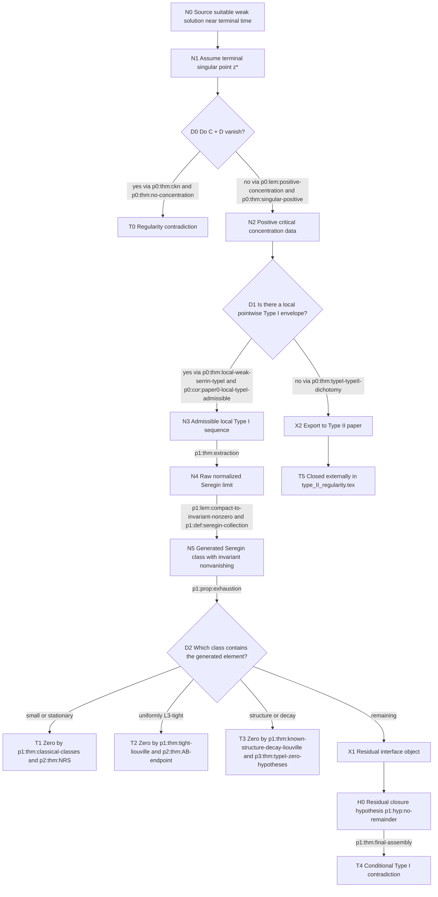
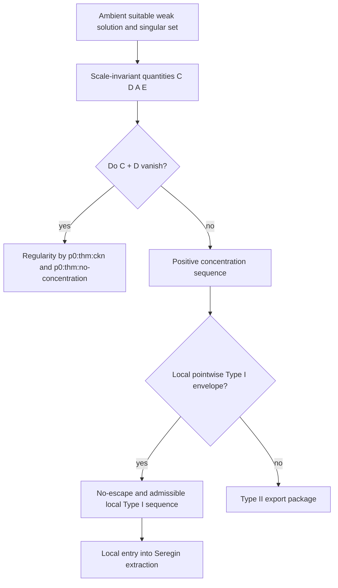
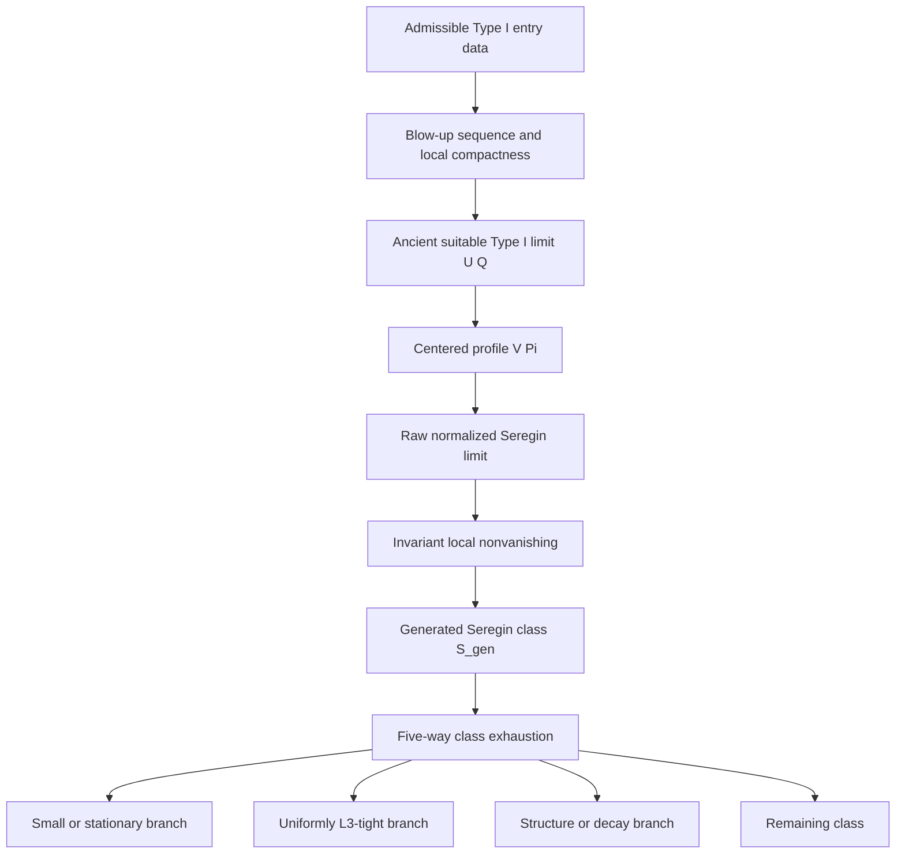
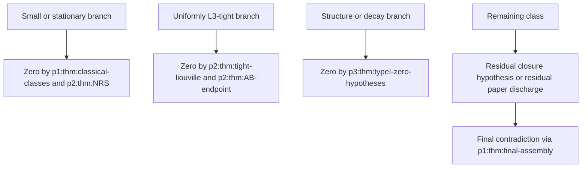

# Proof Setup Architecture Ledger for Lean Formalization

## Purpose

This document is a Lean-facing architectural specification for
`docs/source/ns_paper/proof_setup.tex`.

The goal is not to reprove the analytic arguments here. The goal is to expose
the proof as a finite state-space graph with explicit interface contracts so
that we can later formalize the nodes, edges, invariants, and conditional
imports in Lean.

This file is intentionally stricter than the narrative paper.

- Every main state in the Type I reduction is given a node id.
- Every routing step is given an edge contract.
- Imported literature results are separated into an axiom layer.
- Every definition, lemma, proposition, corollary, theorem, and hypothesis in
  `proof_setup.tex` is accounted for in the appendix ledger, either as a node,
  an edge, a support invariant, or an imported interface.
- Unlabeled theorem-like environments in the TeX source are assigned local
  synthetic ids in this markdown document so the later Lean DAG can still refer
  to them canonically.

The scope of this file is the architecture of `proof_setup.tex` together with
its outgoing interfaces to the residual Type I paper and the Type II paper as
described in `docs/source/ns_paper/overall_proof_architecture.tex`.

## Formalization Policy

### What counts as a node

A node is a mathematically meaningful proof state that should later become a
Lean structure, predicate, sigma-type package, or theorem target.

Examples:

- a suitable weak solution near a terminal time,
- a positive concentration sequence,
- an admissible local Type I concentration sequence,
- a raw extracted normalized Seregin ancient limit,
- a generated Seregin class with invariant local nonvanishing,
- a class-labeled branch such as the uniformly `L^3`-tight branch.

### What counts as an edge

An edge is a verified routing mechanism between nodes.

Examples:

- “vanishing concentration implies regularity”,
- “local pointwise Type I bound plus no-escape implies admissibility”,
- “admissible Type I sequence implies normalized blow-up extraction”,
- “generated class exhaustion routes any element into one of five classes”,
- “tightness plus endpoint `L^3` closure forces zero”.

### Synthetic ids for unlabeled environments

Some Part I environments in `proof_setup.tex` are theorem-like but unlabeled in
the manuscript. This document assigns synthetic ids of the form
`doc:p0:*` so they can still be referenced in the architecture ledger.

Synthetic ids used here:

- `doc:p0:def:suitable-weak-solution`
- `doc:p0:def:singular-set-at-time`
- `doc:p0:prop:parabolic-rescaling-invariance`
- `doc:p0:def:scale-invariant-local-quantities`
- `doc:p0:def:vanishing-local-scale-invariant-quantities`
- `doc:p3:def:galilean-reduction-to-constant`

### Imported versus internal results

Imported peer-reviewed results are kept in a separate axiom/interface layer.
Internal results are the theorem packages proved inside `proof_setup.tex`.

The intended Lean strategy is:

1. Axiomatize the imported results at the level actually used in the graph.
2. Formalize the internal nodes and edges around those axioms.
3. Replace the axioms by proofs later only if desired.

## Axiom Layer

The following imported results are used as external interfaces. They should not
be mixed indistinguishably with the internal nodes.

| Axiom id | Local label or usage site | External source | Interface promised to the graph | Intended Lean wrapper |
| --- | --- | --- | --- | --- |
| `AX-CKN` | `p0:thm:ckn` | Caffarelli-Kohn-Nirenberg | Small mean-subtracted critical quantity `C + D` on one cylinder implies local boundedness and regularity on a smaller cylinder. | A theorem from a `SuitableWeakSolution` plus a smallness predicate to a `RegularOn` conclusion. |
| `AX-VEL-EPS` | `p0:thm:velocity-ckn` | Gustafson-Kang-Tsai | Small velocity-only critical quantity `C` on one cylinder implies local boundedness. | A theorem from `small_C` to `RegularOn`. |
| `AX-AB-WS` | `p0:thm:local-weak-serrin-typeI` | Albritton-Barker, Lemma 2.5 as used locally | A local pointwise Type I envelope produces the endpoint weak-Serrin bridge and no-escape control needed for admissibility. | A wrapper theorem exposing only the hypotheses used in `proof_setup.tex`. |
| `AX-AB-END` | `p2:thm:AB-endpoint` | Albritton-Barker endpoint ancient Liouville theorem | An ancient mild solution with the required endpoint `L^3` control on truncated intervals must vanish. | A wrapper theorem from endpoint-control hypotheses to `V = 0`. |
| `AX-NRS` | `p2:thm:NRS` | Necas-Ruzicka-Sverak | Stationary self-similar `L^3`-controlled profile must vanish. | A theorem on stationary centered ancient profiles. |
| `AX-KNSS-NS` | `p3:thm:knss-noswirl` | Koch-Nadirashvili-Seregin-Sverak | Axisymmetric no-swirl Type I ancient solutions vanish. | A theorem on the no-swirl structure predicate. |
| `AX-KNSS-PW` | `p3:thm:knss-pointwise` | Koch-Nadirashvili-Seregin-Sverak | Pointwise `1/r` control forces zero in the relevant Type I axisymmetric setting. | A theorem on a pointwise structural predicate. |
| `AX-LZZ` | `p3:thm:lzz` | Lei-Zhang-Zhao | Finite-swirl structural hypotheses imply zero in the Type I axisymmetric setting. | A theorem on a swirl-integrability predicate. |
| `AX-LRZ` | `p3:thm:lrz` | Lei-Ren-Zhang | Periodic bounded-swirl hypotheses imply zero in the Type I axisymmetric setting. | A theorem on a periodic-swirl predicate. |
| `AX-GW` | `p3:thm:gallay` | Gallay-Wayne | Weighted-vorticity perturbative decay yields asymptotic rigidity used to force zero. | A theorem on a weighted-vorticity smallness predicate. |

These are the only external closure packages needed by the high-level Type I
flow in `proof_setup.tex`.

## Global Object Legend

The graph carries a small set of recurring mathematical objects.

| Object id | Object | Produced by | What must be formalized |
| --- | --- | --- | --- |
| `O0` | Suitable weak solution `(u,p)` near terminal time `T` | Ambient hypothesis | Suitability, local energy inequality, pressure gauge quotient. |
| `O1` | Terminal singular point `z_* = (x_*, T)` | Singularity assumption | Membership in the singular set at time `T`. |
| `O2` | Scale-invariant quantities `C`, `D`, `A`, `E` | Part I definitions | Numerical functionals on cylinders with scaling laws. |
| `O3` | Positive concentration data | `p0:lem:positive-concentration`, `p0:thm:singular-positive`, `p0:cor:velocity-concentration` | A shrinking sequence of radii with lower bounds for `C + D` or `C`. |
| `O4` | Finite-energy local or global Type I envelope | `p0:def:finite-energy-typeI-paper0`, `p1:def:admissible-type-I` | Pointwise envelope, finite energy, and no-escape data. |
| `O5` | Admissible local Type I concentration sequence | `p0:def:paper0-admissible-local-typeI-sequence`, `p0:cor:paper0-local-typeI-admissible` | A sequence ready for Seregin extraction. |
| `O6` | Rescaled blow-up sequence `(u_n,p_n)` | Part I and Part II rescaling packages | Uniform local bounds, compatibility of gauges, compactness hypotheses. |
| `O7` | Ancient suitable Type I limit `(U,Q)` | `p1:prop:ancient-limit` | A nonzero ancient limit before centering. |
| `O8` | Centered ancient profile `(V,Pi)` | `p1:lem:centered-pullback-identities`, `p1:lem:renormalized-equation` | The centered equation and smooth bounded structure. |
| `O9` | Raw extracted normalized Seregin limit | `p1:def:seregin-limit` | Normalized, bounded, centered, nonzero ancient profile with compact `L^3` mass witness. |
| `O10` | Invariant local nonvanishing witness | `p1:lem:compact-to-invariant-nonzero` | Time-translation invariant retained compact `L^3` mass. |
| `O11` | Generated Seregin class | `p1:def:raw-generated-seregin-space`, `p1:def:seregin-collection`, `p1:def:mild-stratum`, `p1:lem:raw-generated-closure-stability`, `p1:lem:mild-stratum-stability` | A closed descendant hull of normalized centered ancient profiles together with its mild sub-stratum. |
| `O12` | Five-way class decomposition | `p1:def:small-class`, `p1:def:stationary-class`, `p1:def:tight-class`, `p1:def:known-structure-decay-class`, `p1:def:remaining-class` | Type-valued or proposition-valued class tags for generated elements. |
| `O13` | Residual export object | `p1:hyp:no-remainder`, `p1:prop:remainder-equivalence` | The remaining class as the sole unresolved Type I branch. |
| `O14` | Type II export package | `p0:thm:typeI-typeII-dichotomy` together with Part I concentration data | Positive local concentration with no local pointwise Type I envelope, plus the local energy/pressure/window data expected by the Type II paper. |

## Node Template

Each major node below should be formalized against the following template.

```text
Node id:
Manuscript labels:
Imported or internal:
Mathematical carrier:
Input hypotheses:
Output data:
Retained invariants:
Forbidden losses:
Outgoing edges:
Lean objects to define:
Lean theorem obligations:
```

## Edge Template

Each routing edge below should be formalized against the following template.

```text
Edge id:
Source node:
Target node:
Routing theorem package:
Predicate tested:
Data preserved along the edge:
New data produced along the edge:
Terminal contradiction if target is terminal:
Lean statement shape:
```

## Global Proof Graph

The graph below is the compressed high-level flow of `proof_setup.tex` together
with its two outgoing interfaces.



## Main Grouped Nodes

The graph-first body below uses grouped nodes so the main proof remains
readable. The exhaustive appendix later maps every theorem-like item into one
of these grouped nodes or their support edges.

### P0.N0 Ambient local Navier-Stokes state

- Node id: `P0.N0`
- Manuscript items: `doc:p0:def:suitable-weak-solution`, `doc:p0:def:singular-set-at-time`, `p0:lem:temporal-cutoff`
- Mathematical carrier: a suitable weak solution `(u,p)` on `R^3 x (T - delta, T)` together with the terminal singular set `Sigma(T)`.
- Input hypotheses: none beyond the ambient local Navier-Stokes setting.
- Output data:
  - suitability,
  - distributional equation,
  - local energy inequality,
  - terminal-time singular-set notion,
  - admissible use of temporal cutoffs in later local energy arguments.
- Retained invariants:
  - pressure is only defined modulo time functions,
  - the singular-set notion is local in spacetime,
  - all later cylinder quantities are built over this ambient notion.
- Lean objects to define:
  - `SuitableWeakSolution`
  - `TerminalSingularSet`
  - `TemporalCutoffConvention`

### P0.N1 Scale-invariant quantity package

- Node id: `P0.N1`
- Manuscript items: `doc:p0:prop:parabolic-rescaling-invariance`, `doc:p0:def:scale-invariant-local-quantities`, `p0:prop:critical-scaling`
- Mathematical carrier: the cylinder functionals `C`, `D`, later `A`, `E`, and the parabolic rescaling action.
- Input hypotheses: `P0.N0`.
- Output data:
  - definition of `Q_r(z_0)`,
  - rescaled solution `(u^(r), p^(r))`,
  - local finiteness of the critical quantities,
  - exact scaling formulas used by all later compactness and contradiction arguments.
- Retained invariants:
  - suitability is preserved by rescaling,
  - `C` and `D` are scale invariant in the sense used by the paper.
- Lean objects to define:
  - `ParabolicCylinder`
  - `RescaledSolution`
  - `CriticalQuantityC`, `CriticalQuantityD`, `KineticQuantityA`, `DissipationQuantityE`

### P0.N2 Vanishing-versus-positive concentration routing

- Node id: `P0.N2`
- Manuscript items: `p0:thm:ckn`, `p0:thm:velocity-ckn`, `doc:p0:def:vanishing-local-scale-invariant-quantities`, `p0:prop:vanishing-rescaled`, `p0:thm:no-concentration`, `p0:cor:escape`
- Mathematical carrier: the first dichotomy at a candidate singular point.
- Input hypotheses: `P0.N0`, `P0.N1`, and a terminal singular point.
- Output data:
  - if `C + D` vanishes, then regularity follows and singularity is impossible,
  - if `C` vanishes, then regularity follows and singularity is impossible,
  - therefore a genuine terminal singular point forces nonvanishing critical concentration.
- Retained invariants:
  - the contradiction is local and scale invariant,
  - no blow-up analysis begins before the vanishing branch is ruled out.
- Terminal contradiction: local boundedness on a backward cylinder contradicts membership in `Sigma(T)`.

### P0.N3 Positive concentration package

- Node id: `P0.N3`
- Manuscript items: `p0:lem:positive-concentration`, `p0:def:positive-concentration-sequence`, `p0:prop:compactness-persistence`, `p0:prop:velocity-persistence`, `p0:prop:local-alternative`, `p0:thm:singular-positive`, `p0:cor:velocity-concentration`, `p0:prop:concentration-package`
- Mathematical carrier: a shrinking sequence of radii carrying positive lower bounds for `C + D` and separately for `C`.
- Input hypotheses: `P0.N2` and the assumption of singularity.
- Output data:
  - existence of a positive concentration sequence,
  - persistence of positive concentration under strong compactness,
  - a packaged statement that later feeds both the Type I and Type II branches.
- Retained invariants:
  - the lower bound survives to strong local limits,
  - the velocity-only lower bound is enough for nontriviality in later extraction arguments.
- Lean theorem obligations:
  - positive concentration is a sigma-type package `(x_0, eta, r_n, lower_bound)`.

### P0.N4 No-escape and finite-energy Type I package

- Node id: `P0.N4`
- Manuscript items: `p0:def:finite-energy-typeI-paper0`, `p0:lem:uloc-typeI-propagation`, `p0:prop:auto-terminal-A`, `p0:thm:auto-velocity-no-escape`, `p0:cor:auto-paperI-admissibility`
- Mathematical carrier: the local energy and no-escape upgrade under a finite-energy Type I envelope.
- Input hypotheses: a terminal singular point with finite energy and a Type I bound.
- Output data:
  - uniformly local kinetic-energy propagation,
  - terminal kinetic tightness,
  - a velocity no-escape estimate,
  - admissibility of concentration sequences in the global-entry formulation.
- Retained invariants:
  - no-escape is what prevents all velocity mass from falling into the terminal slice,
  - the pressure gauge is handled in the Leray representative without changing suitability.
- Formalization hazard:
  - the pressure gauge choice is invisible to the equations but not to bookkeeping; the Lean interface should quotient by time functions explicitly.

### P0.N5 Local Type I versus local Type II routing

- Node id: `P0.N5`
- Manuscript items: `p0:def:typeI-concentration`, `p0:def:typeII-alternative`, `p0:thm:typeI-typeII-dichotomy`
- Mathematical carrier: the local blow-up-rate dichotomy on a positive concentration sequence.
- Input hypotheses: `P0.N3`.
- Output data:
  - either a Type I concentration sequence exists,
  - or the branch enters the local Type II alternative.
- Retained invariants:
  - the dichotomy is exhaustive relative to the chosen positive concentration sequence,
  - this is the precise export point to the Type II paper.
- Outgoing edges:
  - to `P0.N6` when the local Type I envelope is present,
  - to the Type II export interface when no local Type I envelope exists.

### P0.N6 Local Type I admissibility and Seregin entry

- Node id: `P0.N6`
- Manuscript items: `p0:def:paper0-admissible-local-typeI-sequence`, `p0:prop:paper0-local-typeI-terminal-compactness`, `p0:thm:local-weak-serrin-typeI`, `p0:cor:paper0-local-typeI-admissible`, `p0:lem:paper0-local-typeI-into-terminal-dichotomy`, `p0:lem:local-seregin-extraction`, `p0:prop:local-typeI-entry-final-assembly`, `p0:cor:paper0-local-typeII-after-local-typeI-reduction`
- Mathematical carrier: the local entry point from Part I into the normalized Seregin extraction of Part II.
- Input hypotheses: `P0.N5` on the Type I side.
- Output data:
  - a local admissible Type I concentration sequence,
  - terminal compactness/no-escape in the rescaled variables,
  - an explicit handoff from the local Type I branch to the global extraction theorem package.
- Retained invariants:
  - local positive velocity concentration,
  - Type I pointwise envelope,
  - terminal no-escape needed for extraction,
  - compatibility with the later final-assembly theorem.

### P0.N7 Type II export package

- Node id: `P0.N7`
- Manuscript items: `p0:thm:typeI-typeII-dichotomy`, `p0:prop:concentration-package`, plus the global interface description from `overall_proof_architecture.tex`
- Mathematical carrier: the outgoing setup-to-Type-II contract.
- Input hypotheses: `P0.N5` on the Type II side.
- Output data:
  - positive local critical concentration,
  - failure of every local pointwise Type I envelope,
  - the local concentration / local energy / pressure / scale-window data that the Type II paper expects.
- External target: `paper6:thm:paper0`, `thm:c1-typeII-branch-exhaustion`, `paper6:thm:physical-typeII-covered-entry`, `paper6a:thm:typeII-analytic-data-exhaustive`.

### P1.N0 Unified Type I entry data

- Node id: `P1.N0`
- Manuscript items: `p1:def:terminal-singular`, `p1:def:suitable`, `p1:def:suitable-leray-hopf`, `p1:def:admissible-type-I`, `p1:lem:A-seq-no-escape`, `p1:prop:local-velocity-concentration`, `p1:lem:scaling`, `p1:lem:gauges`
- Mathematical carrier: the internal Part II entry point, which can be reached either from the global finite-energy Type I setup or from the local Part I entry constructed above.
- Input hypotheses: admissible Type I singularity data.
- Output data:
  - fixed notation and gauge conventions,
  - admissibility conditions for extraction,
  - local velocity concentration required for nontriviality.
- Retained invariants:
  - gauge changes by time functions do not alter the equations,
  - admissibility should be represented in Lean as a bundled structure, not as a loose list of hypotheses.

### P1.N1 Blow-up compactness package

- Node id: `P1.N1`
- Manuscript items: `p1:lem:inherited-bound`, `p1:lem:pressure`, `p1:lem:gauge-compatibility`, `p1:lem:pressure-atlas`, `p1:lem:energy-diss`, `p1:lem:time-derivative`, `p1:prop:compactness`, `p1:lem:limit-equation`, `p1:lem:suitability`, `p1:lem:limit-bound`
- Mathematical carrier: the rescaled blow-up sequence and the compactness machinery that produces an ancient limit.
- Input hypotheses: `P1.N0`.
- Output data:
  - inherited Type I bound on the sequence,
  - compatible local pressure representatives,
  - local energy and dissipation bounds,
  - time-derivative control,
  - compactness of the blow-up sequence,
  - suitability and Type I bounds for the limit.
- Retained invariants:
  - pressure-gauge compatibility across scales,
  - local compactness is enough; no global decay is required here.

### P1.N2 Ancient limit and nontriviality package

- Node id: `P1.N2`
- Manuscript items: `p1:prop:ancient-limit`, `p1:lem:scale-selection`, `p1:prop:nonzero`
- Mathematical carrier: a nonzero ancient suitable Type I limit `(U,Q)`.
- Input hypotheses: `P1.N1` and positive concentration from Part I.
- Output data:
  - existence of an ancient suitable Type I limit,
  - a selected scale carrying definite local velocity mass,
  - nonzero limit profile.
- Retained invariants:
  - nontriviality is attached to retained local `L^3` mass, not to abstract nonzeroness alone.

### P1.N3 Centered variables and normalized Seregin structure

- Node id: `P1.N3`
- Manuscript items: `p1:lem:centered-pullback-identities`, `p1:lem:renormalized-equation`, `p1:lem:smoothness`, `p1:cor:classical-type-I-bound`, `p1:lem:renorm-bounds`, `p1:lem:centered-local-energy`
- Mathematical carrier: the centered self-similar profile `(V,Pi)` and its equation.
- Input hypotheses: `P1.N2`.
- Output data:
  - centered-variable pullback identities,
  - the renormalized equation,
  - smoothness of the profile,
  - classical Type I bound in centered variables,
  - centered local-energy control.
- Retained invariants:
  - boundedness survives the centering transform,
  - pressure remains defined only up to time functions, now in logarithmic time.

### P1.N4 Raw extraction package

- Node id: `P1.N4`
- Manuscript items: `p1:def:admissible-type-I-extraction`, `p1:def:seregin-limit`, `p1:cor:raw-extracted-nonzero`
- Mathematical carrier: the raw extracted normalized bounded centered ancient Seregin limit.
- Input hypotheses: `P1.N3` plus admissibility.
- Output data:
  - a named extracted object suitable for later hull closure,
  - nonzero compact local `L^3` mass witness on a bounded spacetime set.
- Retained invariants:
  - normalization,
  - centeredness,
  - bounded ancient structure,
  - nontriviality by compact `L^3` mass.

### P1.N5 Invariant local nonvanishing package

- Node id: `P1.N5`
- Manuscript items: `p1:lem:compact-to-invariant-nonzero`
- Mathematical carrier: time-translation invariant local nonvanishing extracted from one compact `L^3` witness.
- Input hypotheses: `P1.N4`.
- Output data:
  - a translation-invariant retained local mass property,
  - the key invariant used by the generated class and every later contradiction.
- Retained invariants:
  - every zero conclusion later contradicts this invariant.

### P1.N6 Generated Seregin class package

- Node id: `P1.N6`
- Manuscript items: `p1:def:raw-generated-seregin-space`, `p1:def:seregin-collection`, `p1:def:mild-stratum`, `p1:lem:raw-generated-closure-stability`, `p1:lem:mild-stratum-stability`, `p1:cor:normalized-nonzero`
- Mathematical carrier: the raw generated descendant hull `S_raw-gen(u,p,z_*;R_0,eta_*)` together with its mild sub-stratum.
- Input hypotheses: `P1.N5`.
- Output data:
  - a class of normalized bounded centered ancient profiles,
  - a mild sub-stratum carrying the finite-interval projected centered mild formulation,
  - closure stability of the defining properties,
  - inherited nonzeroness for generated descendants.
- Retained invariants:
  - normalized centered ancient structure,
  - invariant local nonvanishing,
  - the mild formulation is imposed only on the mild stratum, not on the whole raw hull,
  - compatibility with residual export.

### P1.N7 Class decomposition package

- Node id: `P1.N7`
- Manuscript items: `p1:def:small-class`, `p1:def:stationary-class`, `p1:def:tight-class`, `p1:def:known-structure-decay-class`, `p1:lem:structure-centering`, `p1:def:remaining-class`, `p1:prop:exhaustion`
- Mathematical carrier: the five-way partition of the generated class.
- Input hypotheses: `P1.N6`.
- Output data:
  - explicit non-residual class predicates,
  - the remaining class as the complement after known closures are removed,
  - an exhaustion theorem routing any generated element to a definite branch.
- Retained invariants:
  - the graph is finite because of this exhaustion theorem,
  - the remaining class is exactly the residual export object.

### P1.N8 Classical non-residual closure package

- Node id: `P1.N8`
- Manuscript items: `p1:lem:centered-stokes-estimates`, `p1:lem:mild-representation`, `p1:lem:small-liouville`, `p1:lem:stationary-profile`, `p1:lem:galilean-trivial-zero`, `p1:thm:classical-classes`, `p1:thm:tight-liouville`, `p1:thm:known-structure-decay-liouville`, `p1:prop:known-class-exclusion`
- Mathematical carrier: the closure of the four non-residual Type I classes.
- Input hypotheses: `P1.N7` plus the corresponding class predicate.
- Output data:
  - small-amplitude branch closes,
  - stationary branch closes,
  - uniformly tight branch closes through Part III,
  - structured/decay branch closes through Part IV,
  - all known classes are excluded.
- Retained invariants:
  - every closure concludes `V = 0` or equivalent rigidity,
  - every zero conclusion contradicts `P1.N5` or `P1.N6`.

### P1.N9 Residual hypothesis and final assembly

- Node id: `P1.N9`
- Manuscript items: `p1:hyp:no-remainder`, `p1:cor:remainder-rigidity`, `p1:prop:remainder-equivalence`, `p1:thm:final-assembly`
- Mathematical carrier: the only remaining Type I branch after all non-residual closures.
- Input hypotheses: `P1.N7`, `P1.N8`, and the residual closure hypothesis.
- Output data:
  - the remaining class is rigid under the residual hypothesis,
  - final conditional exclusion of local pointwise Type I singularities.
- Retained invariants:
  - this is the only conditional input left in `proof_setup.tex`,
  - the residual paper is exactly what is needed to discharge it.

### P2.N0 Uniformly tight ancient-solution framework

- Node id: `P2.N0`
- Manuscript items: `p2:thm:tight-compactness-intro`, `p2:thm:minimal-tight-intro`, `p2:thm:tight-liouville-intro`, `p2:lem:centered-stokes-kernel`, `p2:def:mild`, `p2:def:local-smooth-topology`, `p2:lem:mild-smoothing`, `p2:lem:local-pressure`, `p2:lem:pressure-reconstruction`, `p2:lem:mild-limit`, `p2:prop:bounded-compactness`
- Mathematical carrier: bounded mild ancient solutions equipped with the local smooth topology and compactness tools.
- Input hypotheses: a centered bounded ancient solution from `P1.N6`.
- Output data:
  - mild formulation,
  - smoothing,
  - local pressure reconstruction,
  - closure of the mild formulation under compactness.
- Role in the graph: support layer for the uniformly `L^3`-tight exit.

### P2.N1 Tightness and stationary extraction

- Node id: `P2.N1`
- Manuscript items: `p2:def:L3-tight`, `p2:lem:tight-closure`, `p2:thm:stationary-limits-tight`, `p2:thm:NRS`
- Mathematical carrier: the uniformly `L^3`-tight branch and its stationary-limit consequences.
- Input hypotheses: a generated centered ancient profile in the tight class.
- Output data:
  - tightness is closed under the local smooth topology,
  - stationary limits can be extracted from tight trajectories,
  - stationary self-similar rigidity closes stationary descendants.

### P2.N2 Minimal-element package for tight classes

- Node id: `P2.N2`
- Manuscript items: `p2:def:closed-normalized`, `p2:lem:time-centering`, `p2:lem:nonzero-stability`, `p2:lem:lsc-size`, `p2:thm:minimal-existence`, `p2:def:tight-normalized-collection`, `p2:prop:tight-closed-normalized`
- Mathematical carrier: minimal nonzero elements in closed normalized tight collections.
- Input hypotheses: a hypothetical nonempty tight generated class.
- Output data:
  - normalized collection formalism,
  - lower semicontinuity of size,
  - existence of a minimal element.
- Role in the graph: reduction of an arbitrary tight counterexample to a minimal one.

### P2.N3 Compact hull and invariant-measure package

- Node id: `P2.N3`
- Manuscript items: `p2:def:trajectory-hull`, `p2:thm:compact-hull`, `p2:cor:tightness-on-hulls`, `p2:def:compact-invariant`, `p2:lem:action-continuity`, `p2:prop:minimal-subset`, `p2:lem:zero-trajectory`, `p2:thm:KB`, `p2:cor:nonzero-support`, `p2:thm:statistical-identity`, `p2:thm:barycenter-covariance`
- Mathematical carrier: compact invariant hulls and the measure-theoretic package used to force stationary structure.
- Input hypotheses: `P2.N2`.
- Output data:
  - compact trajectory hulls,
  - invariant subsets,
  - invariant probability measures,
  - barycenter/covariance constraints.
- Role in the graph: bridge from tight dynamic recurrence to the rigid stationary or endpoint-closure regime.

### P2.N4 Physical pullback and endpoint closure

- Node id: `P2.N4`
- Manuscript items: `p2:lem:physical-pullback`, `p2:lem:L3-pullback-invariance`, `p2:lem:tail-tight-sequence-L3`, `p2:lem:physical-mild`, `p2:thm:AB-endpoint`, `p2:thm:tight-liouville`
- Mathematical carrier: passage from centered tightness to physical-space endpoint `L^3` control on truncated ancient intervals.
- Input hypotheses: `P2.N1` through `P2.N3`.
- Output data:
  - physical pullback solves Navier-Stokes on finite intervals,
  - critical norm invariance across the pullback,
  - tail tightness yields the endpoint sequence required by Albritton-Barker,
  - endpoint Liouville then forces zero.
- Terminal contradiction: zero contradicts the retained nonzero/invariant local nonvanishing of the generated class.

### P2.N5 Tight-class interface back to Part II

- Node id: `P2.N5`
- Manuscript items: `p2:thm:no-tight-normalized-collection`, `p2:def:tight-class-input`, `p2:cor:tight-input-for-paper-I`
- Mathematical carrier: the exact interface by which Part III feeds the tight-class exclusion back into `p1:thm:tight-liouville`.
- Input hypotheses: a generated normalized Seregin class and the tight-class predicate.
- Output data:
  - the tight branch is empty,
  - a clean interface statement that Part II can invoke without re-importing the entire dynamical machinery.

### P3.N0 Structured Type I ancient solutions

- Node id: `P3.N0`
- Manuscript items: `p3:thm:axisymmetric-liouville`, `p3:thm:weighted-vorticity-vanishing-intro`, `p3:thm:typeI-consequences`, `p3:def:typeI-ancient`, `p3:def:nonzero-typeI-limit`, `p3:lem:nonzero-typeI-limit`, `p3:lem:self-similar-equation`
- Mathematical carrier: the structured Type I ancient solution interface used to close the structure/decay class.
- Input hypotheses: a generated centered ancient solution with a structure predicate.
- Output data:
  - the correct self-similar/centered equation,
  - nonzero Type I blow-up limits,
  - the initial structured closure statements advertised in the introduction.

### P3.N1 Structure preservation and time-shift compatibility

- Node id: `P3.N1`
- Manuscript items: `p3:lem:structure-preserved`, `p3:lem:time-shift`, `doc:p3:def:galilean-reduction-to-constant`, `p3:lem:spatial-constant-mild`, `p3:lem:patch-constants`, `p3:lem:galilean-typeI-zero`
- Mathematical carrier: the support lemmas ensuring structure survives the manipulations used in the Liouville arguments.
- Input hypotheses: `P3.N0`.
- Output data:
  - structure is preserved under the transformations actually used,
  - time-shifts remain in the admissible class,
  - galilean-trivial or spatially constant profiles vanish.

### P3.N2 Axisymmetric and swirl-controlled closures

- Node id: `P3.N2`
- Manuscript items: `p3:thm:knss-noswirl`, `p3:thm:knss-pointwise`, `p3:thm:lzz`, `p3:thm:lrz`, `p3:prop:noswirl-typeI`, `p3:prop:pointwise-typeI`, `p3:prop:lp-swirl-typeI`, `p3:prop:periodic-swirl-typeI`
- Mathematical carrier: the axisymmetric/no-swirl/controlled-swirl branch of the structure class.
- Input hypotheses: `P3.N1` plus a specific axisymmetric structural predicate.
- Output data:
  - each structure hypothesis is converted into a zero conclusion.
- Terminal contradiction: again, zero contradicts retained nonvanishing.

### P3.N3 Weighted-vorticity closure

- Node id: `P3.N3`
- Manuscript items: `p3:thm:gallay`, `p3:def:weighted-vorticity-condition`, `p3:prop:weighted-lyap`
- Mathematical carrier: the perturbative weighted-vorticity branch.
- Input hypotheses: a weighted-vorticity smallness/decay predicate on a structured generated profile.
- Output data:
  - Lyapunov monotonicity and decay machinery forcing rigidity.

### P3.N4 Combined structured zero conclusion

- Node id: `P3.N4`
- Manuscript items: `p3:thm:typeI-zero-hypotheses`, `p3:thm:stated-hypotheses-zero`
- Mathematical carrier: the summary theorem that the structure/decay class closes.
- Input hypotheses: `P3.N2` or `P3.N3`.
- Output data:
  - the exact interface consumed by `p1:thm:known-structure-decay-liouville`.

## Edge Ledger for the Main Graph

This is the readable routing ledger for the grouped graph above.

| Edge id | Source | Target | Routing package | What is tested or transferred | What must survive |
| --- | --- | --- | --- | --- | --- |
| `E0` | `P0.N0` | `P0.N1` | `doc:p0:prop:parabolic-rescaling-invariance`, `p0:prop:critical-scaling` | Introduce rescaled cylinders and critical quantities. | Suitability and gauge ambiguity. |
| `E1` | `P0.N1` | terminal regularity exit | `p0:thm:ckn`, `p0:thm:no-concentration`, `p0:thm:velocity-ckn` | Test whether `C + D` or `C` can vanish at a singular point. | Local meaning of singularity. |
| `E2` | `P0.N1` | `P0.N3` | `p0:lem:positive-concentration`, `p0:thm:singular-positive`, `p0:cor:velocity-concentration` | Failure of vanishing yields positive concentration data. | Lower bounds along shrinking scales. |
| `E3` | `P0.N3` | `P0.N4` | `p0:def:finite-energy-typeI-paper0`, `p0:thm:auto-velocity-no-escape` | Add finite-energy Type I envelope and no-escape. | Velocity mass cannot disappear into the terminal slice. |
| `E4` | `P0.N3` | `P0.N5` | `p0:thm:typeI-typeII-dichotomy` | Decide between local Type I envelope and local Type II alternative. | Positive critical concentration. |
| `E5` | `P0.N4`, `P0.N5` | `P0.N6` | `p0:thm:local-weak-serrin-typeI`, `p0:cor:paper0-local-typeI-admissible` | Produce an admissible local Type I concentration sequence. | Type I envelope, positive velocity mass, no-escape. |
| `E6` | `P0.N5` | `P0.N7` | `p0:thm:typeI-typeII-dichotomy`, `p0:prop:concentration-package` | Export the Type II branch. | Concentration, pressure, local energy, scale windows. |
| `E7` | `P0.N6` or `P1.N0` | `P1.N1` | `p1:thm:extraction` through its supporting lemmas | Begin blow-up compactness analysis. | Admissibility data. |
| `E8` | `P1.N1` | `P1.N2` | `p1:prop:ancient-limit`, `p1:prop:nonzero` | Extract a nonzero ancient suitable Type I limit. | Concentration lower bound. |
| `E9` | `P1.N2` | `P1.N3` | `p1:lem:centered-pullback-identities`, `p1:lem:renormalized-equation` | Move to centered logarithmic variables. | Nonzero limit and Type I bound. |
| `E10` | `P1.N3` | `P1.N4` | `p1:def:admissible-type-I-extraction`, `p1:def:seregin-limit` | Package the centered limit as a normalized Seregin object. | Normalization, boundedness, compact `L^3` witness. |
| `E11` | `P1.N4` | `P1.N5` | `p1:lem:compact-to-invariant-nonzero` | Upgrade one compact witness to invariant nonvanishing. | Nonzero local `L^3` mass. |
| `E12` | `P1.N5` | `P1.N6` | `p1:def:raw-generated-seregin-space`, `p1:def:seregin-collection`, `p1:def:mild-stratum`, `p1:lem:raw-generated-closure-stability`, `p1:lem:mild-stratum-stability` | Close under generated descendants and isolate the mild sub-stratum. | Centered structure, invariant nonvanishing, and the mild formulation where claimed. |
| `E13` | `P1.N6` | `P1.N7` | `p1:prop:exhaustion` | Route every generated element into one of five classes. | Same generated object and invariants. |
| `E14` | `P1.N7` | non-residual contradiction exits | `p1:thm:classical-classes`, `p1:thm:tight-liouville`, `p1:thm:known-structure-decay-liouville` | Close small, stationary, tight, and structured branches. | Nonvanishing witness must survive to the contradiction. |
| `E15` | `P1.N7` | `P1.N9` | `p1:hyp:no-remainder`, `p1:cor:remainder-rigidity`, `p1:prop:remainder-equivalence` | The remaining class is the sole unresolved branch. | Residual object identity. |
| `E16` | `P1.N9` | final contradiction | `p1:thm:final-assembly` | Discharge the last branch under residual closure. | Entire extracted object package. |
| `E17` | `P2.N0` -> `P2.N5` | tight contradiction | `p2:thm:tight-liouville`, `p2:cor:tight-input-for-paper-I` | Close the uniformly `L^3`-tight branch and feed back to Part II. | Tightness, mildness, invariant nonzeroness. |
| `E18` | `P3.N0` -> `P3.N4` | structured contradiction | `p3:thm:typeI-zero-hypotheses`, `p3:thm:stated-hypotheses-zero` | Close the structure/decay branch and feed back to Part II. | Structure predicate and invariant nonzeroness. |

## Mermaid Subgraphs

### Part I Entry Layer



### Part II Extraction and Class Routing



### Part III and IV Closure Layer



## Cross-Paper Interface Contracts

### Setup to Residual Type I Paper

This is the most important outgoing interface from the Type I side.

| Contract field | Required content |
| --- | --- |
| Source package | `p1:thm:extraction`, `p1:prop:exhaustion`, `p1:def:remaining-class`, `p1:hyp:no-remainder`, `p1:prop:remainder-equivalence` |
| Exported object | A normalized bounded centered ancient Seregin profile or generated class element in the remaining class. |
| Data that must survive | Retained compact local `L^3` mass, invariant local nonvanishing, compatibility of the centered pressure gauge, normalized centered structure, valid terminal ancestry/realizability. |
| Why this matters | The residual paper is only meaningful if it studies exactly the same residual object that setup produced. |
| External targets named in `overall_proof_architecture.tex` | `thm:imported-setup-results`, `hyp:base-seregin-hypotheses`, `thm:paperIV-residual-closure`, `cor:setup-residual-hypothesis-proof` |
| Lean design consequence | The residual export should be a bundled structure, not a bare proposition. |

### Setup to Type II Paper

This is the outgoing interface from the local Type II side.

| Contract field | Required content |
| --- | --- |
| Source package | `p0:thm:typeI-typeII-dichotomy`, `p0:prop:concentration-package`, plus the Part I local concentration and no-escape packages |
| Exported object | A local Type II branch with positive concentration and failure of every local pointwise Type I envelope. |
| Data that must survive | Local concentration data, local energy data, pressure data, and scale-window information. |
| Why this matters | The Type II paper should start from the exact branch excluded by the setup paper, not from a weaker or different object. |
| External targets named in `overall_proof_architecture.tex` | `paper6:thm:paper0`, `thm:c1-typeII-branch-exhaustion`, `paper6:thm:physical-typeII-covered-entry`, `paper6a:thm:typeII-analytic-data-exhaustive` |
| Lean design consequence | The Type II export should also be a bundled structure with fields for concentration, local energy, pressure compatibility, and window data. |

## Lean Object Wishlist

The following declarations should eventually exist if the graph is to become a
usable Lean development.

- `SuitableWeakSolution`
- `TerminalSingularPoint`
- `ParabolicCylinder`
- `CriticalQuantityC`, `CriticalQuantityD`, `KineticQuantityA`, `DissipationQuantityE`
- `PositiveConcentrationSequence`
- `FiniteEnergyTypeIEnvelope`
- `AdmissibleLocalTypeISequence`
- `TypeIIExportData`
- `BlowupSequence`
- `AncientSuitableTypeILimit`
- `CenteredAncientProfile`
- `NormalizedSereginLimit`
- `InvariantLocalNonvanishing`
- `GeneratedSereginClass`
- `SmallClassPredicate`
- `StationaryClassPredicate`
- `TightClassPredicate`
- `StructureDecayPredicate`
- `RemainingClassPredicate`
- `ResidualExportData`

## Refined Lean Module Boundary Plan

The grouped nodes above are still too coarse to be useful as Lean file
boundaries. The next layer of refinement is the module plan below.

The intended scaffold root is:

- `lean/Hypostructure/Backends/NavierStokes/ProofSetup/`

The principle is:

1. Put shared carrier types in a small `Basic` file.
2. Split Part I into local routing files that each add one kind of state or
   one routing theorem package.
3. Split Part II into entry, compactness, centering, generated-state, and
   class-routing files.
4. Keep the tight and structured closure layers as separate backend files so
   later imports from companion papers remain replaceable.
5. Put cross-paper export objects in their own interface files.

### Boundary table

| Planned Lean file | Primary responsibility | Current grouped nodes refined here |
| --- | --- | --- |
| `Basic.lean` | Shared placeholders for solutions, singular points, cylinders, critical quantities, extraction objects, and export bundles. | `P0.N0` through `P1.N9` as shared carrier types. |
| `Axioms.lean` | Imported theorem interfaces and local names for the reusable literature boundary. | Axiom layer. |
| `Ambient.lean` | Suitable weak solutions, terminal singular points, temporal cutoff convention. | `P0.N0`. |
| `ScaleInvariant.lean` | Parabolic cylinders, rescaling action, `C/D/A/E`, scaling laws. | `P0.N1`. |
| `Concentration.lean` | Vanishing branch, positive concentration sequences, persistence lemmas. | `P0.N2`, `P0.N3`. |
| `NoEscape.lean` | Finite-energy Type I envelope and no-escape upgrade package. | `P0.N4`. |
| `Dichotomy.lean` | Local Type I versus Type II dichotomy and local admissibility entry. | `P0.N5`, `P0.N6`. |
| `TypeIIInterface.lean` | Outgoing setup-to-Type-II export bundle. | `P0.N7`. |
| `EntryData.lean` | Unified Part II admissible entry structure, gauge bookkeeping, local concentration entry. | `P1.N0`. |
| `BlowupCompactness.lean` | Rescaled sequence, inherited bounds, pressure atlas, compactness, ancient limit. | `P1.N1`, `P1.N2`. |
| `CenteredProfile.lean` | Centered pullback identities, renormalized equation, raw extraction, invariant local nonvanishing. | `P1.N3`, `P1.N4`, `P1.N5`. |
| `GeneratedState.lean` | Raw generated hull, mild stratum, closure stability. | `P1.N6`. |
| `ClassRouting.lean` | Class predicates, structural-centering support, five-way exhaustion theorem. | `P1.N7`. |
| `ClassicalClosure.lean` | Small and stationary branch closures at the setup-paper level. | Part of `P1.N8`. |
| `TightClosure.lean` | Tight-class interface imported from the dynamical package. | `P2.N0` through `P2.N5`, and the tight portion of `P1.N8`. |
| `StructuredClosure.lean` | Structured/decay interface imported from the structured Liouville package. | `P3.N0` through `P3.N4`, and the structured portion of `P1.N8`. |
| `ResidualInterface.lean` | Remaining-class export bundle and residual closure hypothesis boundary. | `P1.N9` except final theorem body. |
| `FinalAssembly.lean` | Conditional local Type I exclusion statement tying together all previous files. | Final portion of `P1.N9`. |

### Why this refinement is better than the grouped-node cut

- `P1.N1` was too large: inherited bounds, pressure atlas, and compactness
  should be separate implementation surfaces even if they stay in one early
  scaffold file.
- `P1.N3` through `P1.N5` are best read as a pipeline: centered profile,
  normalized raw extraction, then invariant local nonvanishing. A single giant
  extraction file would hide those interfaces.
- `P1.N8` was really three closures mixed together: classical setup-paper
  closures, tight closure imported from the dynamical package, and structured
  closure imported from the Type I Liouville package.
- `P1.N9` contains two distinct targets: the residual export interface and the
  final conditional theorem that consumes it.

### Minimal theorem skeletons expected per module

| Planned Lean file | Theorem skeletons to expose |
| --- | --- |
| `Concentration.lean` | `vanishing_concentration_implies_regular`, `singularity_yields_positive_concentration` |
| `NoEscape.lean` | `global_typeI_implies_velocity_no_escape` |
| `Dichotomy.lean` | `local_typeI_typeII_dichotomy`, `local_pointwise_typeI_is_admissible` |
| `BlowupCompactness.lean` | `compactness_of_blowup_sequence`, `ancient_limit_exists`, `ancient_limit_nonzero` |
| `CenteredProfile.lean` | `centered_profile_exists`, `raw_seregin_limit_exists`, `invariant_nonvanishing_of_raw_limit` |
| `GeneratedState.lean` | `generated_state_stable`, `mild_stratum_stable` |
| `ClassRouting.lean` | `generated_class_exhaustive` |
| `ClassicalClosure.lean` | `small_class_excluded`, `stationary_class_excluded` |
| `TightClosure.lean` | `tight_class_excluded` |
| `StructuredClosure.lean` | `structure_decay_class_excluded` |
| `ResidualInterface.lean` | `remaining_class_equivalent_to_residual_export` |
| `FinalAssembly.lean` | `local_typeI_regular_under_residual_closure` |

### Scaffold rule

The first scaffold only needs placeholder structures, predicates, and theorem
signatures. It does not need analytic content yet. The file graph matters more
than the theorem proofs at this stage.

## Exhaustive Statement Ledger

This appendix is the audit surface. Every theorem-like item in
`proof_setup.tex` should appear below.

The column “Architectural role” uses the following tags.

- `node`: creates or defines a proof state.
- `edge`: routes between existing proof states.
- `support`: proves a retained invariant used inside a node.
- `closure`: produces a terminal contradiction or emptiness statement.
- `axiom`: imported external theorem interface.
- `interface`: exported statement used across papers.

### Part I Ledger: local concentration and the Type I/Type II dichotomy

| TeX label or doc id | Env | Short name | Architectural role | Main output |
| --- | --- | --- | --- | --- |
| `doc:p0:def:suitable-weak-solution` | def | Suitable weak solution | node | Ambient Navier-Stokes object with local energy inequality. |
| `doc:p0:def:singular-set-at-time` | def | Singular set at fixed time | node | Local notion of terminal singularity. |
| `p0:lem:temporal-cutoff` | lemma | Temporal cutoff convention | support | Admissible local-energy truncations. |
| `doc:p0:prop:parabolic-rescaling-invariance` | prop | Invariance under parabolic rescaling | edge | Rescaled solutions remain suitable. |
| `doc:p0:def:scale-invariant-local-quantities` | def | Scale-invariant local quantities | node | Defines `C` and `D`. |
| `p0:prop:critical-scaling` | prop | Local finiteness and scaling | support | Exact scaling identity for `C` and `D`. |
| `p0:thm:ckn` | thm | CKN epsilon-regularity | axiom | Small `C + D` implies regularity. |
| `p0:thm:velocity-ckn` | thm | Velocity epsilon-regularity | axiom | Small `C` implies regularity. |
| `doc:p0:def:vanishing-local-scale-invariant-quantities` | def | Vanishing local quantities | node | Defines the vanishing branch. |
| `p0:prop:vanishing-rescaled` | prop | Equivalent rescaled vanishing | support | Rewrites vanishing in rescaled coordinates. |
| `p0:thm:no-concentration` | thm | Regularity under vanishing local quantities | closure | Vanishing branch is impossible at a singular point. |
| `p0:cor:escape` | cor | Vanishing excludes terminal singularity | closure | Local singularity forces positive lower bound along some scales. |
| `p0:lem:positive-concentration` | lemma | Failure of vanishing gives positive concentration | edge | Produces a positive concentration sequence. |
| `p0:def:positive-concentration-sequence` | def | Positive local concentration sequence | node | Bundles the concentration data. |
| `p0:prop:compactness-persistence` | prop | Persistence of positive concentration | support | Lower bound survives strong compactness. |
| `p0:prop:velocity-persistence` | prop | Persistence of velocity concentration | support | Velocity lower bound survives strong `L^3` compactness. |
| `p0:prop:local-alternative` | prop | Local alternative | edge | Either vanishing holds everywhere or some positive concentration sequence exists. |
| `p0:thm:singular-positive` | thm | Singularity yields positive concentration | edge | A singular point forces positive `C + D` concentration. |
| `p0:cor:velocity-concentration` | cor | Singular points carry positive velocity concentration | edge | A singular point forces positive `C` concentration. |
| `p0:prop:concentration-package` | prop | Concentration consequences package | interface | Combines concentration, no-escape, and admissibility entry points. |
| `p0:def:finite-energy-typeI-paper0` | def | Finite-energy Type I terminal singularity | node | Global-entry Type I state. |
| `p0:lem:uloc-typeI-propagation` | lemma | Uniformly local energy propagation | support | Propagates local energy under Type I envelope. |
| `p0:prop:auto-terminal-A` | prop | Terminal kinetic tightness | support | Controls terminal `A` and `E`. |
| `p0:thm:auto-velocity-no-escape` | thm | Global pointwise Type I implies no-escape | edge | Upgrades Type I envelope to no-escape. |
| `p0:cor:auto-paperI-admissibility` | cor | Global Type I admissibility | interface | Produces admissible concentration sequences for Part II. |
| `p0:def:typeI-concentration` | def | Type I concentration sequence | node | One branch of the dichotomy. |
| `p0:def:typeII-alternative` | def | Local Type II alternative | node | The other branch of the dichotomy. |
| `p0:thm:typeI-typeII-dichotomy` | thm | Local blow-up rate dichotomy | edge | Exhaustive Type I versus Type II split. |
| `p0:def:paper0-admissible-local-typeI-sequence` | def | Admissible local Type I concentration sequence | node | Local-entry bundle for extraction. |
| `p0:prop:paper0-local-typeI-terminal-compactness` | prop | Local Type I terminal compactness | support | Terminal compactness under the local Type I envelope. |
| `p0:thm:local-weak-serrin-typeI` | thm | Local endpoint weak-Serrin Type I estimate | axiom | Local Type I envelope yields no-escape bridge. |
| `p0:cor:paper0-local-typeI-admissible` | cor | Local pointwise Type I sequences are admissible | edge | Converts local Type I envelope into admissibility. |
| `p0:lem:paper0-local-typeI-into-terminal-dichotomy` | lemma | Local Type I enters terminal dichotomy | edge | Routes local Type I data into the extraction regime. |
| `p0:lem:local-seregin-extraction` | lemma | Local Seregin extraction | interface | Explicit local handoff to Part II extraction. |
| `p0:prop:local-typeI-entry-final-assembly` | prop | Local Type I entry into final assembly | interface | Shows local Type I branch is exactly the one consumed by the later final theorem. |
| `p0:cor:paper0-local-typeII-after-local-typeI-reduction` | cor | Conditional exclusion of local Type I alternative | interface | Leaves only the Type II branch once the Type I route is discharged. |

### Part II Ledger: Type I blow-up limits and residual hypothesis

| TeX label | Env | Short name | Architectural role | Main output |
| --- | --- | --- | --- | --- |
| `p1:thm:extraction` | thm | Normalized Type I blow-up limit | interface | Produces the raw normalized Seregin limit package. |
| `p1:thm:remaining-criterion` | thm | Conditional Type I exclusion criterion | interface | Final Type I reduction is equivalent to closing the remaining class. |
| `p1:def:terminal-singular` | def | Terminal singular point | node | Part II localizes the source singularity. |
| `p1:def:suitable` | def | Suitable weak solution | node | Internal Part II version of the ambient state. |
| `p1:def:suitable-leray-hopf` | def | Suitable Leray-Hopf solution | node | Global finite-energy entry object. |
| `p1:def:admissible-type-I` | def | Admissible finite-energy Type I singularity | node | Main global entry bundle. |
| `p1:lem:A-seq-no-escape` | lemma | Uniform kinetic energy implies no escape | support | Supplies admissibility support data. |
| `p1:prop:local-velocity-concentration` | prop | Local velocity concentration | edge | Gives positive `L^3` velocity mass for extraction. |
| `p1:lem:scaling` | lemma | Scaling | support | Rescaling formulas for Part II blow-up sequence. |
| `p1:lem:gauges` | lemma | Pressure gauges | support | Gauge changes do not alter the equations. |
| `p1:lem:inherited-bound` | lemma | Inherited Type I bound | support | Rescaled sequence inherits the Type I envelope. |
| `p1:lem:pressure` | lemma | Pressure gauges and local pressure bounds | support | Local pressure control on the sequence. |
| `p1:lem:gauge-compatibility` | lemma | Compatibility of pressure gauges | support | Allows comparison of local gauges. |
| `p1:lem:pressure-atlas` | lemma | Pressure gauge atlas | support | Organizes local gauges coherently. |
| `p1:lem:energy-diss` | lemma | Local energy and dissipation | support | Uniform local energy bounds for compactness. |
| `p1:lem:time-derivative` | lemma | Time derivative bound | support | Compactness in time. |
| `p1:prop:compactness` | prop | Compactness | edge | Extracts a convergent blow-up subsequence. |
| `p1:lem:limit-equation` | lemma | Limit equation | support | The limit solves the correct equation. |
| `p1:lem:suitability` | lemma | Stability of suitability | support | The limit remains suitable. |
| `p1:lem:limit-bound` | lemma | Inherited ancient Type I bound | support | The limit keeps the Type I bound. |
| `p1:prop:ancient-limit` | prop | Ancient suitable Type I limit | node | Creates the uncentered ancient limit `(U,Q)`. |
| `p1:lem:scale-selection` | lemma | Scale selection from local concentration | edge | Fixes a scale carrying nontrivial mass. |
| `p1:prop:nonzero` | prop | Nonzero ancient limit | node | Rules out triviality of the ancient limit. |
| `p1:lem:centered-pullback-identities` | lemma | Centered pullback identities | edge | Moves to centered logarithmic variables. |
| `p1:lem:renormalized-equation` | lemma | Renormalized equation | support | Gives the centered PDE. |
| `p1:lem:smoothness` | lemma | Smoothness | support | Centered profile is smooth. |
| `p1:cor:classical-type-I-bound` | cor | Classical Type I bound | support | Converts boundedness into classical Type I control. |
| `p1:lem:renorm-bounds` | lemma | Renormalized boundedness and nontriviality | support | Bounded centered profile remains nontrivial. |
| `p1:lem:centered-local-energy` | lemma | Local energy bounds in centered variables | support | Retains local energy in centered coordinates. |
| `p1:def:admissible-type-I-extraction` | def | Admissible Type I extraction | node | Formal extraction input object. |
| `p1:def:seregin-limit` | def | Raw extracted normalized Seregin ancient limit | node | Names the extracted centered profile. |
| `p1:cor:raw-extracted-nonzero` | cor | Raw extracted limits are nonzero | support | Nonzero witness for extracted limits. |
| `p1:lem:compact-to-invariant-nonzero` | lemma | Time-translation invariant nonvanishing | edge | Upgrades one compact witness to invariant nonvanishing. |
| `p1:def:raw-generated-seregin-space` | def | Raw generated Seregin state space | node | Raw generated descendant hull with fixed normalization component. |
| `p1:def:seregin-collection` | def | Generated Seregin class | node | Secondary label on the raw generated state space definition. |
| `p1:def:mild-stratum` | def | Mild stratum of the generated state space | node | The sub-stratum on which the finite-interval projected centered mild formulation is imposed. |
| `p1:lem:raw-generated-closure-stability` | lemma | Raw generated closure preserves normalized ancient structure | support | Generated raw states remain bounded centered ancient profiles with invariant nonvanishing. |
| `p1:lem:mild-stratum-stability` | lemma | Mild stratum stability | support | The mild stratum is stable under time translation and locally smooth limits with common `L^infty` control. |
| `p1:cor:normalized-nonzero` | cor | Generated normalized Seregin limits are nonzero | support | Nonzero generated elements. |
| `p1:def:small-class` | def | Small-amplitude class | node | First non-residual class. |
| `p1:def:stationary-class` | def | Stationary `L^3` class | node | Second non-residual class. |
| `p1:def:tight-class` | def | Uniformly `L^3`-tight class | node | Third non-residual class. |
| `p1:def:known-structure-decay-class` | def | Structure and decay class | node | Fourth non-residual class. |
| `p1:lem:structure-centering` | lemma | Structural quantities under centering | support | Structured hypotheses survive centering. |
| `p1:def:remaining-class` | def | Remaining class | node | Residual complement after known classes. |
| `p1:prop:exhaustion` | prop | Exhaustion by defined classes | edge | Routes every generated element into one of the five classes. |
| `p1:lem:centered-stokes-estimates` | lemma | Centered Stokes kernel estimates | support | Kernel control for mild arguments. |
| `p1:lem:mild-representation` | lemma | Mild representation for generated normalized limits | support | Mild form of centered ancient solutions. |
| `p1:lem:small-liouville` | lemma | Small bounded ancient Liouville theorem | closure | Small class forces zero. |
| `p1:lem:stationary-profile` | lemma | Stationary centered profiles | support | Stationary branch reduction. |
| `p1:lem:galilean-trivial-zero` | lemma | Galilean-trivial profiles vanish | support | Removes trivial stationary obstructions. |
| `p1:thm:classical-classes` | thm | Small and stationary class exclusions | closure | Closes the small and stationary branches. |
| `p1:thm:tight-liouville` | thm | Uniformly tight `L^3` closure | interface | Imports the Part III tight closure into Part II. |
| `p1:thm:known-structure-decay-liouville` | thm | Structure and decay exclusions | interface | Imports the Part IV structured closure into Part II. |
| `p1:prop:known-class-exclusion` | prop | Exclusion of the known Liouville classes | closure | All non-residual known classes are empty. |
| `p1:hyp:no-remainder` | hyp | Residual closure for generated Seregin classes | interface | Sole unresolved Type I input. |
| `p1:cor:remainder-rigidity` | cor | Rigidity in the remaining case | edge | Residual hypothesis implies remaining-class emptiness. |
| `p1:prop:remainder-equivalence` | prop | Equivalence on generated normalized Seregin limits | interface | Final Type I theorem is equivalent to residual closure. |
| `p1:lem:tau-translation` | lemma | Logarithmic-time translation | support | Translation symmetry in centered time. |
| `p1:prop:no-cascade` | prop | Dilation and translation are not full symmetries | support | Prevents misuse of spatial dilation/translation as centered symmetries. |
| `p1:thm:final-assembly` | thm | Local Type I regularity under residual closure | closure | Final conditional Type I contradiction. |

### Part III Ledger: uniformly tight interior Liouville analysis

| TeX label | Env | Short name | Architectural role | Main output |
| --- | --- | --- | --- | --- |
| `p2:thm:tight-compactness-intro` | thm | Compactness and closure of uniformly tight ancient solutions | node | Announces the Part III compactness route. |
| `p2:thm:minimal-tight-intro` | thm | Minimal element in a normalized uniformly tight class | node | Announces the minimal-element route. |
| `p2:thm:tight-liouville-intro` | thm | Uniformly tight Liouville criterion | interface | Announces the final closure statement used by Part II. |
| `p2:lem:centered-stokes-kernel` | lemma | Centered Stokes kernel estimate | support | Kernel estimate for the mild formulation. |
| `p2:def:mild` | def | Bounded mild ancient solution | node | Core carrier type for Part III. |
| `p2:def:local-smooth-topology` | def | Local smooth topology | node | Convergence structure for compactness. |
| `p2:lem:mild-smoothing` | lemma | Smoothing of bounded mild solutions | support | Regularity bootstrap. |
| `p2:lem:local-pressure` | lemma | Local pressure reconstruction | support | Reconstructs local pressure from mild solutions. |
| `p2:lem:pressure-reconstruction` | lemma | Leray pressure and local gauges | support | Gauge compatibility for reconstructed pressures. |
| `p2:lem:mild-limit` | lemma | Closure of the mild formulation | support | Compact limits remain mild. |
| `p2:prop:bounded-compactness` | prop | Compactness of bounded ancient families | edge | Extracts local smooth limits. |
| `p2:def:L3-tight` | def | Uniform `L^3`-tightness | node | Tight-class predicate. |
| `p2:lem:tight-closure` | lemma | Closure of uniform `L^3`-tightness | support | Tightness survives compactness. |
| `p2:thm:stationary-limits-tight` | thm | Stationary limits under uniform `L^3`-tightness | edge | Extracts stationary descendants from tight classes. |
| `p2:thm:NRS` | thm | Stationary self-similar rigidity | axiom | Stationary branch closure. |
| `p2:def:closed-normalized` | def | Closed normalized collection | node | Abstract collection used for minimality. |
| `p2:lem:time-centering` | lemma | Time-centering | support | Adjusts representatives within normalized collections. |
| `p2:lem:nonzero-stability` | lemma | Stability of local nonvanishing | support | Nonzero witness survives limits. |
| `p2:lem:lsc-size` | lemma | Lower semicontinuity of `L^infty` size | support | Needed for minimal-element construction. |
| `p2:thm:minimal-existence` | thm | Existence of a minimal ancient solution | node | Produces a minimal tight counterexample. |
| `p2:def:tight-normalized-collection` | def | Uniformly tight normalized collection | node | Tight version of closed normalized collections. |
| `p2:prop:tight-closed-normalized` | prop | Tight normalized collections are closed normalized | support | Connects the tight and normalized collection formalisms. |
| `p2:def:trajectory-hull` | def | Trajectory hull | node | Orbit-closure carrier for dynamics. |
| `p2:thm:compact-hull` | thm | Compact trajectory hull | node | Produces compact orbit hulls. |
| `p2:cor:tightness-on-hulls` | cor | Uniform tightness on hulls | support | Tightness passes to hulls. |
| `p2:def:compact-invariant` | def | Compact invariant set | node | Invariant-set formalism for the hull dynamics. |
| `p2:lem:action-continuity` | lemma | Continuity of the translation action | support | Dynamical continuity on the hull. |
| `p2:prop:minimal-subset` | prop | Minimal compact invariant subsets | node | Minimal dynamical subsystem. |
| `p2:lem:zero-trajectory` | lemma | The zero trajectory | support | Excludes the trivial invariant subset. |
| `p2:thm:KB` | thm | Krylov-Bogolyubov averages | edge | Produces invariant probability measures. |
| `p2:cor:nonzero-support` | cor | Nonzero support | support | Invariant measure sees nontrivial states. |
| `p2:thm:statistical-identity` | thm | Stationary statistical form | support | Mean identity for invariant measures. |
| `p2:thm:barycenter-covariance` | thm | Barycenter and covariance | support | Covariance obstruction for tight nonzero dynamics. |
| `p2:lem:physical-pullback` | lemma | Physical pullback solves NS | edge | Returns centered ancient solutions to physical coordinates. |
| `p2:lem:L3-pullback-invariance` | lemma | Invariance of the critical norm | support | Endpoint norms are preserved by pullback. |
| `p2:lem:tail-tight-sequence-L3` | lemma | Tail tightness gives an endpoint sequence | edge | Produces the AB-compatible endpoint sequence. |
| `p2:lem:physical-mild` | lemma | Physical pullbacks are mild on finite intervals | support | Prepares the imported endpoint theorem. |
| `p2:thm:AB-endpoint` | thm | Albritton-Barker endpoint theorem | axiom | Endpoint closure for the pullback branch. |
| `p2:thm:tight-liouville` | thm | Tail-tight centered ancient solutions vanish | closure | Final zero conclusion for the tight branch. |
| `p2:thm:no-tight-normalized-collection` | thm | No nonempty normalized uniformly tight collection | closure | Tight branch empty at collection level. |
| `p2:def:tight-class-input` | def | Tight-class Liouville consequence | interface | Exact input shape exported back to Part II. |
| `p2:cor:tight-input-for-paper-I` | cor | Tight-class consequence for Type I reduction | interface | Feeds the tight contradiction back to `p1:thm:tight-liouville`. |

### Part IV Ledger: structured Liouville conditions and Type I ancient solutions

| TeX label | Env | Short name | Architectural role | Main output |
| --- | --- | --- | --- | --- |
| `p3:thm:axisymmetric-liouville` | thm | Intro axisymmetric Liouville package | interface | Announces structured closure layer used by Part II. |
| `p3:thm:weighted-vorticity-vanishing-intro` | thm | Intro weighted-vorticity vanishing package | interface | Announces weighted-vorticity closure layer. |
| `p3:thm:typeI-consequences` | thm | Intro Type I consequence package | interface | Summary of consequences used by Part II. |
| `p3:def:typeI-ancient` | def | Type I ancient solution | node | Carrier type for the structured branch. |
| `p3:def:nonzero-typeI-limit` | def | Nonzero Type I blow-up limit | node | Structured blow-up limit object. |
| `p3:lem:nonzero-typeI-limit` | lemma | Nontriviality of blow-up limits | support | Structured limit is nonzero. |
| `p3:lem:self-similar-equation` | lemma | Self-similar equation | support | Correct centered PDE in Part IV. |
| `p3:lem:structure-preserved` | lemma | Preservation of axisymmetric structure | support | Structure survives the transformations used in the proofs. |
| `p3:lem:time-shift` | lemma | Time shifts away from the singular time | support | Time-shift compatibility. |
| `doc:p3:def:galilean-reduction-to-constant` | def | Galilean reduction to a constant | node | Defines the triviality notion used when a cited Liouville theorem yields a constant velocity field. |
| `p3:lem:spatial-constant-mild` | lemma | Spatially constant mild solutions | support | Identifies trivial constant profiles. |
| `p3:lem:patch-constants` | lemma | Patching constants on backward intervals | support | Extends constant-profile arguments. |
| `p3:lem:galilean-typeI-zero` | lemma | Constant Type I ancient solutions vanish | support | Removes galilean-trivial obstructions. |
| `p3:thm:knss-noswirl` | thm | KNSS no-swirl theorem | axiom | No-swirl closure interface. |
| `p3:thm:knss-pointwise` | thm | KNSS pointwise theorem | axiom | Pointwise closure interface. |
| `p3:thm:lzz` | thm | Lei-Zhang-Zhao theorem | axiom | Finite-swirl closure interface. |
| `p3:thm:lrz` | thm | Lei-Ren-Zhang theorem | axiom | Periodic-swirl closure interface. |
| `p3:prop:noswirl-typeI` | prop | No-swirl Type I vanishing | closure | One structured branch forces zero. |
| `p3:prop:pointwise-typeI` | prop | Pointwise `1/r` Type I vanishing | closure | Another structured branch forces zero. |
| `p3:prop:lp-swirl-typeI` | prop | Finite-`L^p` swirl Type I vanishing | closure | Another structured branch forces zero. |
| `p3:prop:periodic-swirl-typeI` | prop | Periodic bounded-swirl Type I vanishing | closure | Another structured branch forces zero. |
| `p3:thm:gallay` | thm | Gallay-Wayne small-data decay | axiom | Weighted-vorticity decay interface. |
| `p3:def:weighted-vorticity-condition` | def | Perturbative weighted-vorticity condition | node | Structured weighted-vorticity predicate. |
| `p3:prop:weighted-lyap` | prop | Semiflow Lyapunov functional | support | Monotone quantity forcing rigidity. |
| `p3:thm:typeI-zero-hypotheses` | thm | Zero conclusions for Type I blow-up limits | closure | Combined structure/decay closure theorem. |
| `p3:cor:structured-hypotheses-nonzero-blowup` | cor | Structured hypotheses cannot hold for nonzero Type I blow-up limits | closure | Converts the structured zero theorem into a direct contradiction for nonzero blow-up limits. |
| `p3:thm:stated-hypotheses-zero` | thm | Combined zero conclusion | interface | Clean export used by `p1:thm:known-structure-decay-liouville`. |

## Architecturally Relevant Remarks

The user asked for theorem-like items to be accounted for, but several remarks
control interfaces or formalization hazards and should therefore also be logged.

| TeX label | Why it matters |
| --- | --- |
| `p0:rem:state-space-stratification` | Explains how the local-energy estimate should be read as a state-space routing mechanism. |
| `p1:rem:centered-gauge` | Clarifies the centered pressure gauge, which must be made explicit in Lean. |
| `p1:rem:no-global-tightness` | Prevents over-strengthening the extracted object beyond what the proof actually shows. |
| `p1:rem:companion-paper` | Declares the residual paper as the intended discharge of the sole remaining hypothesis. |
| `p1:rem:paper-IV-interface` | States the exact setup-to-residual interface contract. |
| `p2:rem:auxiliary-dynamical-material` | Explains why Part III contains more dynamical material than the final interface alone suggests. |
| `p2:rem:paper-I-III-interface` | States the exact Part III to Part II interface. |
| `p3:rem:axi-citations` | Keeps the imported axisymmetric citations aligned with the formalized structure predicates. |

## Final Lean Checklist

### Step A: formalize the objects

- Define suitable weak solutions and singular points.
- Define parabolic cylinders and the rescaling action.
- Define `C`, `D`, `A`, and `E`.
- Define positive concentration sequences.
- Define local Type I admissibility and the Type II export package.
- Define ancient suitable Type I limits and centered ancient profiles.
- Define normalized Seregin limits, invariant local nonvanishing, and generated Seregin classes.
- Define the five class predicates and the residual export structure.

### Step B: formalize the internal edges

- Vanishing concentration implies regularity contradiction.
- Positive concentration sequences exist at a singular point.
- Type I envelopes plus no-escape imply local admissibility.
- Admissible sequences imply extraction.
- Extraction implies invariant local nonvanishing.
- Generated class exhaustion is finite.
- Known classes close by contradiction.
- Residual closure implies final Type I contradiction.

### Step C: formalize the imports as local interfaces

- `AX-CKN`
- `AX-VEL-EPS`
- `AX-AB-WS`
- `AX-AB-END`
- `AX-NRS`
- `AX-KNSS-NS`
- `AX-KNSS-PW`
- `AX-LZZ`
- `AX-LRZ`
- `AX-GW`

### Step D: formalize the cross-paper exports

- A bundled residual export structure.
- A bundled Type II export structure.
- A theorem stating that the remaining class is the only unresolved Type I branch.
- A theorem stating that the Type II export is exactly the complement of the local Type I branch at the level of the setup paper.

## Minimal correctness conditions for this markdown file

This markdown document should be considered correct only if all of the
following hold.

1. Every theorem-like item in `proof_setup.tex` appears in the appendix ledger.
2. Every edge in the global graph names a real theorem package or an explicitly
   declared axiom layer import.
3. The residual and Type II exports preserve the exact objects described in
   `overall_proof_architecture.tex`.
4. No contradiction node relies on a theorem before its hypotheses have been
   produced by an earlier node.
5. No imported result is silently mixed into an internal node without being
   listed in the axiom layer.
