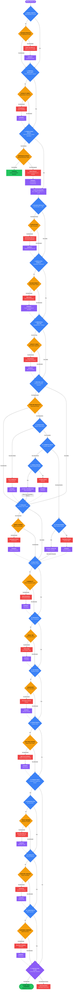

```mermaid
graph TD
    Start(["<b>INITIAL DATA $u_0$</b>"]) --> EnergyCheck{"<b>1. ENERGY IDENTITY</b><br>$\frac{d}{dt}E#40;u#41; \leq 0$?"}

    %% --- LEVEL 1: CONSERVATION ---
    EnergyCheck -- "No" --> BarrierSat{"<b>MAXIMUM PRINCIPLE</b><br>$L^\infty$ Bound Holds?<br>"}
    BarrierSat -- "Yes #40;Blocked#41;" --> ZenoCheck
    BarrierSat -- "No #40;Breached#41;" --> ModeCE["<b>Finite Time Blow-up</b><br>#40;$\|u\|_{H^1} \to \infty$#41;"]
    ModeCE --> SurgCE["<b>SURGERY:</b><br>Cutoff/Mollification"]
    SurgCE -.-> ZenoCheck

    EnergyCheck -- "Yes" --> ZenoCheck{"<b>2. TEMPORAL REGULARITY</b><br>Finite Propagation Speed?"}
    ZenoCheck -- "No" --> BarrierCausal{"<b>CAUSALITY CHECK</b><br>Hyperbolicity Preserved?<br>"}
    BarrierCausal -- "No #40;Breached#41;" --> ModeCC["<b>Ill-Posedness</b><br>#40;Zeno Instability#41;"]
    ModeCC --> SurgCC["<b>SURGERY:</b><br>Discretization"]
    SurgCC -.-> CompactCheck
    BarrierCausal -- "Yes #40;Blocked#41;" --> CompactCheck

    ZenoCheck -- "Yes" --> CompactCheck{"<b>3. COMPACTNESS #40;Rellich#41;</b><br>Orbit Precompact modulo Symmetry?"}

    %% --- LEVEL 2: DUALITY ---
    CompactCheck -- "No #40;Scatters#41;" --> BarrierScat{"<b>DISPERSION ESTIMATE</b><br>Morawetz/Strichartz Holds?<br>"}
    BarrierScat -- "Yes #40;Benign#41;" --> ModeDD["<b>Scattering</b><br><i>#40;Linear Asymptotic Behavior#41;</i>"]
    BarrierScat -- "No #40;Pathological#41;" --> ModeCD_Alt["<b>Defect Measure</b><br><i>#40;Loss of Compactness at $\infty$#41;</i>"]
    ModeCD_Alt --> SurgCD_Alt["<b>SURGERY:</b><br>Concentration-Compactness"]
    SurgCD_Alt -.-> Profile

    CompactCheck -- "Yes" --> Profile["<b>Profile Decomposition</b><br>$u_n \approx \sum g_n V + w_n$"]

    %% --- LEVEL 3: SYMMETRY ---
    Profile --> ScaleCheck{"<b>4. SCALING CRITICALITY</b><br>Subcritical #40;$s > s_c$#41;?"}

    ScaleCheck -- "No #40;Supercritical#41;" --> BarrierTypeII{"<b>BLOW-UP RATE</b><br>Type II Exclusion?<br>"}
    BarrierTypeII -- "No #40;Breached#41;" --> ModeSE["<b>Self-Similar Blow-up</b><br>#40;Focusing Singularity#41;"]
    ModeSE --> SurgSE["<b>SURGERY:</b><br>Regularity Structure Lift"]
    SurgSE -.-> ParamCheck
    BarrierTypeII -- "Yes #40;Blocked#41;" --> ParamCheck

    ScaleCheck -- "Yes #40;Safe#41;" --> ParamCheck{"<b>5. MODULATION STABILITY</b><br>Parameters Variational?"}
    ParamCheck -- "No" --> BarrierVac{"<b>VACUUM STABILITY</b><br>Ground State Unique?<br>"}
    BarrierVac -- "No #40;Breached#41;" --> ModeSC["<b>Bifurcation</b><br>#40;Symmetry Breaking#41;"]
    ModeSC --> SurgSC["<b>SURGERY:</b><br>Convex Integration #40;h-principle#41;"]
    SurgSC -.-> GeomCheck
    BarrierVac -- "Yes #40;Blocked#41;" --> GeomCheck

    ParamCheck -- "Yes" --> GeomCheck{"<b>6. DIMENSIONAL ANALYSIS</b><br>Hausdorff Dim > Critical?"}

    %% --- LEVEL 4: GEOMETRY ---
    GeomCheck -- "No #40;Too Thin#41;" --> BarrierCap{"<b>CAPACITY CHECK</b><br>Removable Singularity?<br>"}
    BarrierCap -- "No #40;Breached#41;" --> ModeCD["<b>Concentration</b><br>#40;Dirac Mass Formation#41;"]
    ModeCD --> SurgCD["<b>SURGERY:</b><br>Blow-up Analysis"]
    SurgCD -.-> StiffnessCheck
    BarrierCap -- "Yes #40;Blocked#41;" --> StiffnessCheck

    GeomCheck -- "Yes #40;Safe#41;" --> StiffnessCheck{"<b>7. SPECTRAL GAP</b><br>Linearized Operator Coercive?"}

    %% --- LEVEL 5: STIFFNESS ---
    StiffnessCheck -- "No #40;Degenerate#41;" --> BarrierGap{"<b>POINCARÉ INEQUALITY</b><br>Exponential Decay?<br>"}
    BarrierGap -- "Yes #40;Blocked#41;" --> TopoCheck
    BarrierGap -- "No #40;Stagnation#41;" --> BifurcateCheck{"<b>7a. BIFURCATION</b><br>Negative Eigenvalues?<br>"}

    %% --- LEVEL 5b: DYNAMIC RESTORATION (Deterministic) ---
    BifurcateCheck -- "No #40;Zero Mode#41;" --> ModeSD["<b>Loss of Ellipticity</b><br>#40;Flat Direction#41;"]
    ModeSD --> SurgSD["<b>SURGERY:</b><br>Gauge Fixing"]
    SurgSD -.-> TopoCheck
    BifurcateCheck -- "Yes #40;Unstable#41;" --> SymCheck{"<b>7b. SYMMETRY GROUP</b><br>Invariant under G?<br>"}

    %% Path A: Symmetry Breaking (Governed by Axiom SC)
    SymCheck -- "Yes #40;Symmetric#41;" --> CheckSC{"<b>7c. MODULATION EQ</b><br>Soliton Manifold Stable?<br>"}
    CheckSC -- "Yes" --> ActionSSB["<b>ACTION: SYM BREAKING</b><br>Mass Generation"]
    ActionSSB -- "Mass Gap Guarantees Stiffness" --> TopoCheck
    CheckSC -- "No" --> ModeSC_Rest["<b>Unstable Soliton</b><br><i>#40;Ejection#41;</i>"]
    ModeSC_Rest --> SurgSC_Rest["<b>SURGERY:</b><br>Extension"]
    SurgSC_Rest -.-> TopoCheck

    %% Path B: Surgery (Governed by Axiom TB)
    SymCheck -- "No #40;Asymmetric#41;" --> CheckTB{"<b>7d. ACTION BARRIER</b><br>Finite Instanton Action?<br>"}
    CheckTB -- "Yes" --> ActionTunnel["<b>ACTION: TUNNELING</b><br>Phase Transition"]
    ActionTunnel -- "New Sector Reached" --> TameCheck
    CheckTB -- "No" --> ModeTE_Rest["<b>Topological Defect</b><br><i>#40;Domain Wall#41;</i>"]
    ModeTE_Rest --> SurgTE_Rest["<b>SURGERY:</b><br>Excision/Capping"]
    SurgTE_Rest -.-> TameCheck

    StiffnessCheck -- "Yes #40;Safe#41;" --> TopoCheck{"<b>8. TOPOLOGY</b><br>Homotopy Class Trivial?"}

    %% --- LEVEL 6: TOPOLOGY ---
    TopoCheck -- "No #40;Protected#41;" --> BarrierAction{"<b>ENERGY BARRIER</b><br>Below Ground State?<br>"}
    BarrierAction -- "No #40;Breached#41;" --> ModeTE["<b>Topological Soliton</b><br>#40;Kink/Vortex#41;"]
    ModeTE --> SurgTE["<b>SURGERY:</b><br>Surgery #40;Perelman#41;"]
    SurgTE -.-> TameCheck
    BarrierAction -- "Yes #40;Blocked#41;" --> TameCheck

    TopoCheck -- "Yes #40;Safe#41;" --> TameCheck{"<b>9. ANALYTICITY</b><br>Is Geometry Tame?"}

    TameCheck -- "No" --> BarrierOmin{"<b>O-MINIMALITY</b><br>Finite Component Count?<br>"}
    BarrierOmin -- "No #40;Breached#41;" --> ModeTC["<b>Wild Embedding</b><br>#40;Fractal Boundary#41;"]
    ModeTC --> SurgTC["<b>SURGERY:</b><br>Smoothing"]
    SurgTC -.-> ErgoCheck
    BarrierOmin -- "Yes #40;Blocked#41;" --> ErgoCheck

    TameCheck -- "Yes" --> ErgoCheck{"<b>10. ERGODICITY</b><br>Metric Transitivity?"}

    ErgoCheck -- "No" --> BarrierMix{"<b>MIXING TIME</b><br>Polynomial Decay?<br>"}
    BarrierMix -- "No #40;Breached#41;" --> ModeTD["<b>Glassy State</b><br>#40;Non-Ergodic Trap#41;"]
    ModeTD --> SurgTD["<b>SURGERY:</b><br>Annealing"]
    SurgTD -.-> ComplexCheck
    BarrierMix -- "Yes #40;Blocked#41;" --> ComplexCheck

    ErgoCheck -- "Yes" --> ComplexCheck{"<b>11. DICTIONARY</b><br>Transform Exists?"}

    %% --- LEVEL 7: COMPLEXITY ---
    ComplexCheck -- "No" --> BarrierEpi{"<b>UNCERTAINTY</b><br>Finite Information?<br>"}
    BarrierEpi -- "No #40;Breached#41;" --> ModeDC["<b>Information Horizon</b><br>#40;Chaos#41;"]
    ModeDC --> SurgDC["<b>SURGERY:</b><br>Viscosity Solution"]
    SurgDC -.-> OscillateCheck
    BarrierEpi -- "Yes #40;Blocked#41;" --> OscillateCheck

    ComplexCheck -- "Yes" --> OscillateCheck{"<b>12. MONOTONICITY</b><br>Gradient Flow?"}

    OscillateCheck -- "Yes" --> BarrierFreq{"<b>HIGH FREQ CONTROL</b><br>Sobolev Norm Finite?<br>"}
    BarrierFreq -- "No #40;Breached#41;" --> ModeDE["<b>High-Freq Oscillation</b><br>#40;Weak Convergence Only#41;"]
    ModeDE --> SurgDE["<b>SURGERY:</b><br>Nash-Moser"]
    SurgDE -.-> BoundaryCheck
    BarrierFreq -- "Yes #40;Blocked#41;" --> BoundaryCheck

    OscillateCheck -- "No" --> BoundaryCheck{"<b>13. DOMAIN CHECK</b><br>Is $\partial\Omega$ Non-Empty?"}

    %% --- LEVEL 8: BOUNDARY ---
    BoundaryCheck -- "Yes" --> OverloadCheck{"<b>14. NEUMANN DATA</b><br>Flux Bounded?"}

    OverloadCheck -- "No" --> BarrierBode{"<b>TRACE THEOREM</b><br>Extension Possible?<br>"}
    BarrierBode -- "No #40;Breached#41;" --> ModeBE["<b>Boundary Blow-up</b><br>#40;Shock Injection#41;"]
    ModeBE --> SurgBE["<b>SURGERY:</b><br>Boundary Layer"]
    SurgBE -.-> StarveCheck
    BarrierBode -- "Yes #40;Blocked#41;" --> StarveCheck

    OverloadCheck -- "Yes" --> StarveCheck{"<b>15. COERCIVITY</b><br>Forcing Sufficient?"}

    StarveCheck -- "No" --> BarrierInput{"<b>POINCARÉ CONSTANT</b><br>Decay Controlled?<br>"}
    BarrierInput -- "No #40;Breached#41;" --> ModeBD["<b>Quenching</b><br>#40;Solution Vanishes#41;"]
    ModeBD --> SurgBD["<b>SURGERY:</b><br>Reservoir BC"]
    SurgBD -.-> AlignCheck
    BarrierInput -- "Yes #40;Blocked#41;" --> AlignCheck

    StarveCheck -- "Yes" --> AlignCheck{"<b>16. COMPATIBILITY</b><br>Well-Posed BC?"}
    AlignCheck -- "No" --> BarrierVariety{"<b>LOPATINSKI CONDITION</b><br>Stable Boundary?<br>"}
    BarrierVariety -- "No #40;Breached#41;" --> ModeBC["<b>Boundary Instability</b><br>#40;Ill-Posed#41;"]
    ModeBC --> SurgBC["<b>SURGERY:</b><br>Penalization"]
    SurgBC -.-> BarrierExclusion

    %% --- LEVEL 9: THE FINAL GATE ---
    %% All successful paths funnel here
    BoundaryCheck -- "No" --> BarrierExclusion
    BarrierVariety -- "Yes #40;Blocked#41;" --> BarrierExclusion
    AlignCheck -- "Yes" --> BarrierExclusion

    BarrierExclusion{"<b>17. OBSTRUCTION CLASS</b><br>Cohomology Vanishes?<br>"}

    BarrierExclusion -- "Yes #40;Blocked#41;" --> VICTORY(["<b>GLOBAL WELL-POSEDNESS</b><br><i>#40;Regularity Proven#41;</i>"])
    BarrierExclusion -- "No #40;Morphism Exists#41;" --> ModeCat["<b>NON-EXISTENCE</b><br>Topological Obstruction"]

    %% ====== STYLES ======
    %% Success states - Green
    style VICTORY fill:#22c55e,stroke:#16a34a,color:#000000,stroke-width:4px
    style ModeDD fill:#22c55e,stroke:#16a34a,color:#000000

    %% Failure modes - Red
    style ModeCE fill:#ef4444,stroke:#dc2626,color:#ffffff
    style ModeCC fill:#ef4444,stroke:#dc2626,color:#ffffff
    style ModeSE fill:#ef4444,stroke:#dc2626,color:#ffffff
    style ModeSC fill:#ef4444,stroke:#dc2626,color:#ffffff
    style ModeCD fill:#ef4444,stroke:#dc2626,color:#ffffff
    style ModeCD_Alt fill:#ef4444,stroke:#dc2626,color:#ffffff
    style ModeSD fill:#ef4444,stroke:#dc2626,color:#ffffff
    style ModeTE fill:#ef4444,stroke:#dc2626,color:#ffffff
    style ModeTC fill:#ef4444,stroke:#dc2626,color:#ffffff
    style ModeTD fill:#ef4444,stroke:#dc2626,color:#ffffff
    style ModeDC fill:#ef4444,stroke:#dc2626,color:#ffffff
    style ModeDE fill:#ef4444,stroke:#dc2626,color:#ffffff
    style ModeBE fill:#ef4444,stroke:#dc2626,color:#ffffff
    style ModeBD fill:#ef4444,stroke:#dc2626,color:#ffffff
    style ModeBC fill:#ef4444,stroke:#dc2626,color:#ffffff
    style ModeCat fill:#ef4444,stroke:#dc2626,color:#ffffff

    %% Barriers - Orange/Amber
    style BarrierSat fill:#f59e0b,stroke:#d97706,color:#000000
    style BarrierCausal fill:#f59e0b,stroke:#d97706,color:#000000
    style BarrierScat fill:#f59e0b,stroke:#d97706,color:#000000
    style BarrierTypeII fill:#f59e0b,stroke:#d97706,color:#000000
    style BarrierVac fill:#f59e0b,stroke:#d97706,color:#000000
    style BarrierCap fill:#f59e0b,stroke:#d97706,color:#000000
    style BarrierGap fill:#f59e0b,stroke:#d97706,color:#000000
    style BarrierAction fill:#f59e0b,stroke:#d97706,color:#000000
    style BarrierOmin fill:#f59e0b,stroke:#d97706,color:#000000
    style BarrierMix fill:#f59e0b,stroke:#d97706,color:#000000
    style BarrierEpi fill:#f59e0b,stroke:#d97706,color:#000000
    style BarrierFreq fill:#f59e0b,stroke:#d97706,color:#000000
    style BarrierBode fill:#f59e0b,stroke:#d97706,color:#000000
    style BarrierInput fill:#f59e0b,stroke:#d97706,color:#000000
    style BarrierVariety fill:#f59e0b,stroke:#d97706,color:#000000

    %% The Final Gate - Purple with thick border
    style BarrierExclusion fill:#8b5cf6,stroke:#7c3aed,color:#ffffff,stroke-width:4px

    %% Axiom Checks - Blue
    style EnergyCheck fill:#3b82f6,stroke:#2563eb,color:#ffffff
    style ZenoCheck fill:#3b82f6,stroke:#2563eb,color:#ffffff
    style CompactCheck fill:#3b82f6,stroke:#2563eb,color:#ffffff
    style ScaleCheck fill:#3b82f6,stroke:#2563eb,color:#ffffff
    style ParamCheck fill:#3b82f6,stroke:#2563eb,color:#ffffff
    style GeomCheck fill:#3b82f6,stroke:#2563eb,color:#ffffff
    style StiffnessCheck fill:#3b82f6,stroke:#2563eb,color:#ffffff
    style TopoCheck fill:#3b82f6,stroke:#2563eb,color:#ffffff
    style TameCheck fill:#3b82f6,stroke:#2563eb,color:#ffffff
    style ErgoCheck fill:#3b82f6,stroke:#2563eb,color:#ffffff
    style ComplexCheck fill:#3b82f6,stroke:#2563eb,color:#ffffff
    style OscillateCheck fill:#3b82f6,stroke:#2563eb,color:#ffffff
    style BoundaryCheck fill:#3b82f6,stroke:#2563eb,color:#ffffff
    style OverloadCheck fill:#3b82f6,stroke:#2563eb,color:#ffffff
    style StarveCheck fill:#3b82f6,stroke:#2563eb,color:#ffffff
    style AlignCheck fill:#3b82f6,stroke:#2563eb,color:#ffffff

    %% Intermediate nodes - Purple
    style Start fill:#8b5cf6,stroke:#7c3aed,color:#ffffff
    style Profile fill:#8b5cf6,stroke:#7c3aed,color:#ffffff

    %% Restoration checks - Blue (standard axiom checks)
    style BifurcateCheck fill:#3b82f6,stroke:#2563eb,color:#ffffff
    style SymCheck fill:#3b82f6,stroke:#2563eb,color:#ffffff
    style CheckSC fill:#3b82f6,stroke:#2563eb,color:#ffffff
    style CheckTB fill:#3b82f6,stroke:#2563eb,color:#ffffff

    %% Restoration mechanisms - Purple (escape mechanisms)
    style ActionSSB fill:#8b5cf6,stroke:#7c3aed,color:#ffffff
    style ActionTunnel fill:#8b5cf6,stroke:#7c3aed,color:#ffffff

    %% Restoration failure modes - Red
    style ModeSC_Rest fill:#ef4444,stroke:#dc2626,color:#ffffff
    style ModeTE_Rest fill:#ef4444,stroke:#dc2626,color:#ffffff

    %% Surgery recovery nodes - Purple
    style SurgCE fill:#8b5cf6,stroke:#7c3aed,color:#ffffff
    style SurgCC fill:#8b5cf6,stroke:#7c3aed,color:#ffffff
    style SurgCD_Alt fill:#8b5cf6,stroke:#7c3aed,color:#ffffff
    style SurgSE fill:#8b5cf6,stroke:#7c3aed,color:#ffffff
    style SurgSC fill:#8b5cf6,stroke:#7c3aed,color:#ffffff
    style SurgCD fill:#8b5cf6,stroke:#7c3aed,color:#ffffff
    style SurgSD fill:#8b5cf6,stroke:#7c3aed,color:#ffffff
    style SurgSC_Rest fill:#8b5cf6,stroke:#7c3aed,color:#ffffff
    style SurgTE_Rest fill:#8b5cf6,stroke:#7c3aed,color:#ffffff
    style SurgTE fill:#8b5cf6,stroke:#7c3aed,color:#ffffff
    style SurgTC fill:#8b5cf6,stroke:#7c3aed,color:#ffffff
    style SurgTD fill:#8b5cf6,stroke:#7c3aed,color:#ffffff
    style SurgDC fill:#8b5cf6,stroke:#7c3aed,color:#ffffff
    style SurgDE fill:#8b5cf6,stroke:#7c3aed,color:#ffffff
    style SurgBE fill:#8b5cf6,stroke:#7c3aed,color:#ffffff
    style SurgBD fill:#8b5cf6,stroke:#7c3aed,color:#ffffff
    style SurgBC fill:#8b5cf6,stroke:#7c3aed,color:#ffffff
```
