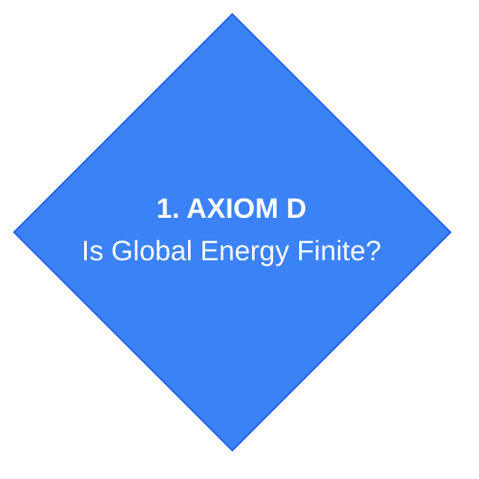
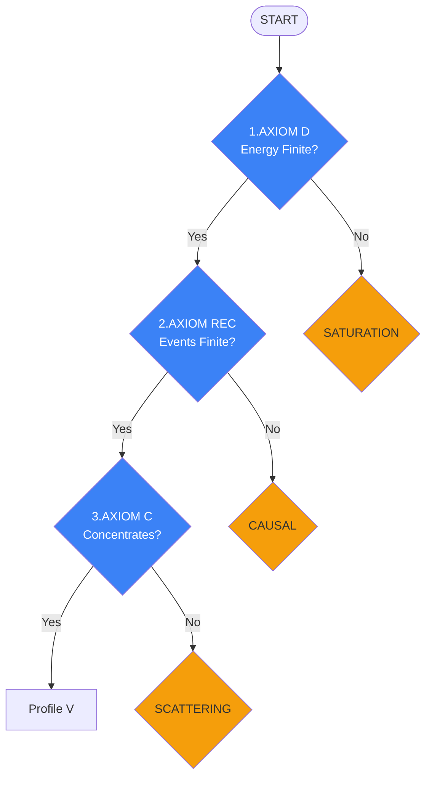
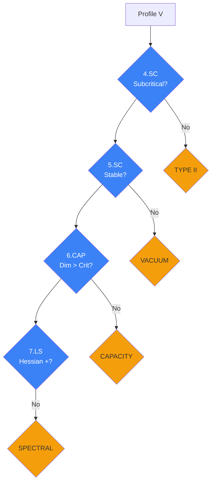
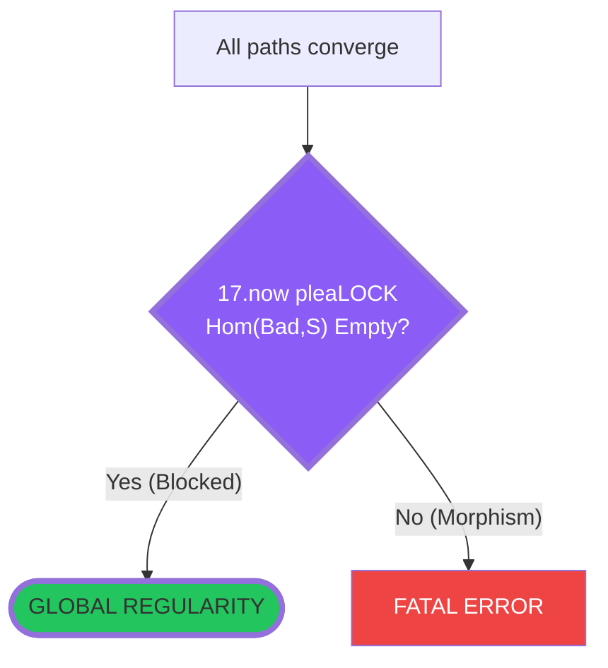

# The Structural Sieve: A Certificate-Driven Framework for Singularity Exclusion

## Abstract

This document provides a rigorous mathematical foundation for the Structural Sieve—a diagnostic algorithm that determines whether a dynamical system admits global regularity or must encounter singularity. The sieve operates as a **certificate-driven workflow**: each node evaluation produces explicit certificates that justify subsequent transitions, transforming the global regularity question into a sequence of local algebraic checks.

The framework introduces:
1. **Operational semantics** making the sieve diagram executable as a proof-carrying program
2. **Permit vocabulary** defining certificate types for all node outcomes
3. **Node specifications** with predicates and certificate schemas for all 17+ diagnostic nodes
4. **Barrier contracts** and **surgery contracts** with non-circular preconditions
5. **Universal singularity modules** handling profile classification and surgery admissibility
6. **Factory metatheorems** enabling type-based instantiation from definitions alone

---

# The Canonical Sieve Algorithm

The following Mermaid diagram is the **authoritative specification** of the sieve control flow. All subsequent definitions and theorems must align with this diagram.

```mermaid
graph TD
    Start(["<b>START DIAGNOSTIC</b>"]) --> EnergyCheck{"<b>1. AXIOM D #40;Dissipation#41;</b><br>Is Global Energy Finite?"}

    %% --- LEVEL 1: CONSERVATION ---
    EnergyCheck -- "No" --> BarrierSat{"<b>SATURATION BARRIER</b><br>Is Drift Controlled?<br>"}
    BarrierSat -- "Yes #40;Blocked#41;" --> ZenoCheck
    BarrierSat -- "No #40;Breached#41;" --> ModeCE["<b>Mode C.E</b>: Energy Blow-Up"]
    ModeCE --> SurgCE["<b>SURGERY:</b><br>Ghost/Cap"]
    SurgCE -.-> ZenoCheck

    EnergyCheck -- "Yes" --> ZenoCheck{"<b>2. AXIOM REC #40;Recovery#41;</b><br>Are Discrete Events Finite?"}
    ZenoCheck -- "No" --> BarrierCausal{"<b>CAUSAL CENSOR</b><br>Is Depth Finite?<br>"}
    BarrierCausal -- "No #40;Breached#41;" --> ModeCC["<b>Mode C.C</b>: Event Accumulation"]
    ModeCC --> SurgCC["<b>SURGERY:</b><br>Discrete Saturation"]
    SurgCC -.-> CompactCheck
    BarrierCausal -- "Yes #40;Blocked#41;" --> CompactCheck

    ZenoCheck -- "Yes" --> CompactCheck{"<b>3. AXIOM C #40;Compactness#41;</b><br>Does Energy Concentrate?"}

    %% --- LEVEL 2: DUALITY ---
    CompactCheck -- "No #40;Scatters#41;" --> BarrierScat{"<b>SCATTERING BARRIER</b><br>Is Interaction Finite?<br>"}
    BarrierScat -- "Yes #40;Benign#41;" --> ModeDD["<b>Mode D.D</b>: Dispersion<br><i>#40;Global Existence#41;</i>"]
    BarrierScat -- "No #40;Pathological#41;" --> ModeCD_Alt["<b>Mode C.D</b>: Geometric Collapse<br><i>#40;Via Escape#41;</i>"]
    ModeCD_Alt --> SurgCD_Alt["<b>SURGERY:</b><br>Concentration-Compactness"]
    SurgCD_Alt -.-> Profile

    CompactCheck -- "Yes" --> Profile["<b>Canonical Profile V Emerges</b>"]

    %% --- LEVEL 3: SYMMETRY ---
    Profile --> ScaleCheck{"<b>4. AXIOM SC #40;Scaling#41;</b><br>Is it Subcritical?"}

    ScaleCheck -- "No #40;Supercritical#41;" --> BarrierTypeII{"<b>TYPE II BARRIER</b><br>Is Renorm Cost Infinite?<br>"}
    BarrierTypeII -- "No #40;Breached#41;" --> ModeSE["<b>Mode S.E</b>: Supercritical Cascade"]
    ModeSE --> SurgSE["<b>SURGERY:</b><br>Regularity Lift"]
    SurgSE -.-> ParamCheck
    BarrierTypeII -- "Yes #40;Blocked#41;" --> ParamCheck

    ScaleCheck -- "Yes #40;Safe#41;" --> ParamCheck{"<b>5. AXIOM SC #40;Stability#41;</b><br>Are Constants Stable?"}
    ParamCheck -- "No" --> BarrierVac{"<b>VACUUM BARRIER</b><br>Is Phase Stable?<br>"}
    BarrierVac -- "No #40;Breached#41;" --> ModeSC["<b>Mode S.C</b>: Parameter Instability"]
    ModeSC --> SurgSC["<b>SURGERY:</b><br>Convex Integration"]
    SurgSC -.-> GeomCheck
    BarrierVac -- "Yes #40;Blocked#41;" --> GeomCheck

    ParamCheck -- "Yes" --> GeomCheck{"<b>6. AXIOM CAP #40;Capacity#41;</b><br>Is Codim ≥ Threshold?"}

    %% --- LEVEL 4: GEOMETRY ---
    GeomCheck -- "No #40;Too Large#41;" --> BarrierCap{"<b>CAPACITY BARRIER</b><br>Is Measure Zero?<br>"}
    BarrierCap -- "No #40;Breached#41;" --> ModeCD["<b>Mode C.D</b>: Geometric Collapse"]
    ModeCD --> SurgCD["<b>SURGERY:</b><br>Aux/Structural"]
    SurgCD -.-> StiffnessCheck
    BarrierCap -- "Yes #40;Blocked#41;" --> StiffnessCheck

    GeomCheck -- "Yes #40;Safe#41;" --> StiffnessCheck{"<b>7. AXIOM LS #40;Stiffness#41;</b><br>Is Stiffness Certified?"}

    %% --- LEVEL 5: STIFFNESS ---
    StiffnessCheck -- "No #40;Flat#41;" --> BarrierGap{"<b>SPECTRAL BARRIER</b><br>Is there a Gap?<br>"}
    BarrierGap -- "Yes #40;Blocked#41;" --> TopoCheck
    BarrierGap -- "No #40;Stagnation#41;" --> BifurcateCheck{"<b>7a. BIFURCATION CHECK #40;Axiom LS#41;</b><br>Is State Unstable?<br>"}

    %% --- LEVEL 5b: DYNAMIC RESTORATION (Deterministic) ---
    BifurcateCheck -- "No #40;Stable#41;" --> ModeSD["<b>Mode S.D</b>: Stiffness Breakdown"]
    ModeSD --> SurgSD["<b>SURGERY:</b><br>Ghost Extension"]
    SurgSD -.-> TopoCheck
    BifurcateCheck -- "Yes #40;Unstable#41;" --> SymCheck{"<b>7b. SYMMETRY CHECK</b><br>Is Vacuum Degenerate?<br><i>#40;Does Group G exist?#41;</i>"}

    %% Path A: Symmetry Breaking (Governed by Axiom SC)
    SymCheck -- "Yes #40;Symmetric#41;" --> CheckSC{"<b>7c. AXIOM SC #40;Param#41;</b><br>Are Constants Stable?<br>"}
    CheckSC -- "Yes" --> ActionSSB["<b>ACTION: SYM. BREAKING</b><br>Generates Mass Gap"]
    ActionSSB -- "Mass Gap Guarantees Stiffness" --> TopoCheck
    CheckSC -- "No" --> ModeSC_Rest["<b>Mode S.C</b>: Parameter Instability<br><i>#40;Vacuum Decay#41;</i>"]
    ModeSC_Rest --> SurgSC_Rest["<b>SURGERY:</b><br>Auxiliary Extension"]
    SurgSC_Rest -.-> TopoCheck

    %% Path B: Surgery (Governed by Axiom TB)
    SymCheck -- "No #40;Asymmetric#41;" --> CheckTB{"<b>7d. AXIOM TB #40;Action#41;</b><br>Is Cost Finite?<br>"}
    CheckTB -- "Yes" --> ActionTunnel["<b>ACTION: TUNNELING</b><br>Instanton Decay"]
    ActionTunnel -- "New Sector Reached" --> TameCheck
    CheckTB -- "No" --> ModeTE_Rest["<b>Mode T.E</b>: Topological Twist<br><i>#40;Metastasis#41;</i>"]
    ModeTE_Rest --> SurgTE_Rest["<b>SURGERY:</b><br>Structural"]
    SurgTE_Rest -.-> TameCheck

    StiffnessCheck -- "Yes #40;Safe#41;" --> TopoCheck{"<b>8. AXIOM TB #40;Topology#41;</b><br>Is Sector Accessible?"}

    %% --- LEVEL 6: TOPOLOGY ---
    TopoCheck -- "No #40;Obstructed#41;" --> BarrierAction{"<b>ACTION BARRIER</b><br>Is Energy < Gap?<br>"}
    BarrierAction -- "No #40;Breached#41;" --> ModeTE["<b>Mode T.E</b>: Topological Twist"]
    ModeTE --> SurgTE["<b>SURGERY:</b><br>Tunnel"]
    SurgTE -.-> TameCheck
    BarrierAction -- "Yes #40;Blocked#41;" --> TameCheck

    TopoCheck -- "Yes #40;Safe#41;" --> TameCheck{"<b>9. AXIOM TB #40;Tameness#41;</b><br>Is Topology Simple?"}

    TameCheck -- "No" --> BarrierOmin{"<b>O-MINIMAL BARRIER</b><br>Is it Definable?<br>"}
    BarrierOmin -- "No #40;Breached#41;" --> ModeTC["<b>Mode T.C</b>: Labyrinthine"]
    ModeTC --> SurgTC["<b>SURGERY:</b><br>O-minimal Regularization"]
    SurgTC -.-> ErgoCheck
    BarrierOmin -- "Yes #40;Blocked#41;" --> ErgoCheck

    TameCheck -- "Yes" --> ErgoCheck{"<b>10. AXIOM TB #40;Mixing#41;</b><br>Does it Mix?"}

    ErgoCheck -- "No" --> BarrierMix{"<b>MIXING BARRIER</b><br>Is Trap Escapable?<br>"}
    BarrierMix -- "No #40;Breached#41;" --> ModeTD["<b>Mode T.D</b>: Glassy Freeze"]
    ModeTD --> SurgTD["<b>SURGERY:</b><br>Mixing Enhancement"]
    SurgTD -.-> ComplexCheck
    BarrierMix -- "Yes #40;Blocked#41;" --> ComplexCheck

    ErgoCheck -- "Yes" --> ComplexCheck{"<b>11. AXIOM REP #40;Dictionary#41;</b><br>Is it Computable?"}

    %% --- LEVEL 7: COMPLEXITY ---
    ComplexCheck -- "No" --> BarrierEpi{"<b>EPISTEMIC BARRIER</b><br>Is Description Finite?<br>"}
    BarrierEpi -- "No #40;Breached#41;" --> ModeDC["<b>Mode D.C</b>: Semantic Horizon"]
    ModeDC --> SurgDC["<b>SURGERY:</b><br>Viscosity Solution"]
    SurgDC -.-> OscillateCheck
    BarrierEpi -- "Yes #40;Blocked#41;" --> OscillateCheck

    ComplexCheck -- "Yes" --> OscillateCheck{"<b>12. AXIOM GC #40;Gradient#41;</b><br>Does it Oscillate?"}

    OscillateCheck -- "Yes" --> BarrierFreq{"<b>FREQUENCY BARRIER</b><br>Is Integral Finite?<br>"}
    BarrierFreq -- "No #40;Breached#41;" --> ModeDE["<b>Mode D.E</b>: Oscillatory"]
    ModeDE --> SurgDE["<b>SURGERY:</b><br>De Giorgi-Nash-Moser"]
    SurgDE -.-> BoundaryCheck
    BarrierFreq -- "Yes #40;Blocked#41;" --> BoundaryCheck

    OscillateCheck -- "No" --> BoundaryCheck{"<b>13. BOUNDARY CHECK</b><br>Is System Open?"}

    %% --- LEVEL 8: BOUNDARY ---
    BoundaryCheck -- "Yes" --> OverloadCheck{"<b>14. BOUNDARY: CONTROL</b><br>Is Input Bounded?"}

    OverloadCheck -- "No" --> BarrierBode{"<b>BODE BARRIER</b><br>Is Sensitivity Bounded?<br>"}
    BarrierBode -- "No #40;Breached#41;" --> ModeBE["<b>Mode B.E</b>: Injection"]
    ModeBE --> SurgBE["<b>SURGERY:</b><br>Saturation"]
    SurgBE -.-> StarveCheck
    BarrierBode -- "Yes #40;Blocked#41;" --> StarveCheck

    OverloadCheck -- "Yes" --> StarveCheck{"<b>15. BOUNDARY: SUPPLY</b><br>Is Input Sufficient?"}

    StarveCheck -- "No" --> BarrierInput{"<b>INPUT BARRIER</b><br>Is Reserve Sufficient?<br>"}
    BarrierInput -- "No #40;Breached#41;" --> ModeBD["<b>Mode B.D</b>: Starvation"]
    ModeBD --> SurgBD["<b>SURGERY:</b><br>Reservoir"]
    SurgBD -.-> AlignCheck
    BarrierInput -- "Yes #40;Blocked#41;" --> AlignCheck

    StarveCheck -- "Yes" --> AlignCheck{"<b>16. BOUNDARY: GAUGE</b><br>Is it Aligned?"}
    AlignCheck -- "No" --> BarrierVariety{"<b>VARIETY BARRIER</b><br>Does Control Match Disturbance?<br>"}
    BarrierVariety -- "No #40;Breached#41;" --> ModeBC["<b>Mode B.C</b>: Misalignment"]
    ModeBC --> SurgBC["<b>SURGERY:</b><br>Adjoint"]
    SurgBC -.-> BarrierExclusion

    %% --- LEVEL 9: THE FINAL GATE ---
    %% All successful paths funnel here
    BoundaryCheck -- "No" --> BarrierExclusion
    BarrierVariety -- "Yes #40;Blocked#41;" --> BarrierExclusion
    AlignCheck -- "Yes" --> BarrierExclusion

    BarrierExclusion{"<b>17. THE CATEGORICAL LOCK</b><br>Is Hom#40;Bad, S#41; Empty?<br>"}

    BarrierExclusion -- "Yes #40;Blocked#41;" --> VICTORY(["<b>GLOBAL REGULARITY</b><br><i>#40;Structural Exclusion Confirmed#41;</i>"])
    BarrierExclusion -- "No #40;Morphism Exists#41;" --> ModeCat["<b>FATAL ERROR</b><br>Structural Inconsistency"]

    %% ====== STYLES ======
    %% Success states - Green
    style VICTORY fill:#22c55e,stroke:#16a34a,color:#000000,stroke-width:4px
    style ModeDD fill:#22c55e,stroke:#16a34a,color:#000000

    %% Failure modes - Red
    style ModeCE fill:#ef4444,stroke:#dc2626,color:#ffffff
    style ModeCC fill:#ef4444,stroke:#dc2626,color:#ffffff
    style ModeSE fill:#ef4444,stroke:#dc2626,color:#ffffff
    style ModeSC fill:#ef4444,stroke:#dc2626,color:#ffffff
    style ModeCD fill:#ef4444,stroke:#dc2626,color:#ffffff
    style ModeCD_Alt fill:#ef4444,stroke:#dc2626,color:#ffffff
    style ModeSD fill:#ef4444,stroke:#dc2626,color:#ffffff
    style ModeTE fill:#ef4444,stroke:#dc2626,color:#ffffff
    style ModeTC fill:#ef4444,stroke:#dc2626,color:#ffffff
    style ModeTD fill:#ef4444,stroke:#dc2626,color:#ffffff
    style ModeDC fill:#ef4444,stroke:#dc2626,color:#ffffff
    style ModeDE fill:#ef4444,stroke:#dc2626,color:#ffffff
    style ModeBE fill:#ef4444,stroke:#dc2626,color:#ffffff
    style ModeBD fill:#ef4444,stroke:#dc2626,color:#ffffff
    style ModeBC fill:#ef4444,stroke:#dc2626,color:#ffffff
    style ModeCat fill:#ef4444,stroke:#dc2626,color:#ffffff

    %% Barriers - Orange/Amber
    style BarrierSat fill:#f59e0b,stroke:#d97706,color:#000000
    style BarrierCausal fill:#f59e0b,stroke:#d97706,color:#000000
    style BarrierScat fill:#f59e0b,stroke:#d97706,color:#000000
    style BarrierTypeII fill:#f59e0b,stroke:#d97706,color:#000000
    style BarrierVac fill:#f59e0b,stroke:#d97706,color:#000000
    style BarrierCap fill:#f59e0b,stroke:#d97706,color:#000000
    style BarrierGap fill:#f59e0b,stroke:#d97706,color:#000000
    style BarrierAction fill:#f59e0b,stroke:#d97706,color:#000000
    style BarrierOmin fill:#f59e0b,stroke:#d97706,color:#000000
    style BarrierMix fill:#f59e0b,stroke:#d97706,color:#000000
    style BarrierEpi fill:#f59e0b,stroke:#d97706,color:#000000
    style BarrierFreq fill:#f59e0b,stroke:#d97706,color:#000000
    style BarrierBode fill:#f59e0b,stroke:#d97706,color:#000000
    style BarrierInput fill:#f59e0b,stroke:#d97706,color:#000000
    style BarrierVariety fill:#f59e0b,stroke:#d97706,color:#000000

    %% The Final Gate - Purple with thick border
    style BarrierExclusion fill:#8b5cf6,stroke:#7c3aed,color:#ffffff,stroke-width:4px

    %% Axiom Checks - Blue
    style EnergyCheck fill:#3b82f6,stroke:#2563eb,color:#ffffff
    style ZenoCheck fill:#3b82f6,stroke:#2563eb,color:#ffffff
    style CompactCheck fill:#3b82f6,stroke:#2563eb,color:#ffffff
    style ScaleCheck fill:#3b82f6,stroke:#2563eb,color:#ffffff
    style ParamCheck fill:#3b82f6,stroke:#2563eb,color:#ffffff
    style GeomCheck fill:#3b82f6,stroke:#2563eb,color:#ffffff
    style StiffnessCheck fill:#3b82f6,stroke:#2563eb,color:#ffffff
    style TopoCheck fill:#3b82f6,stroke:#2563eb,color:#ffffff
    style TameCheck fill:#3b82f6,stroke:#2563eb,color:#ffffff
    style ErgoCheck fill:#3b82f6,stroke:#2563eb,color:#ffffff
    style ComplexCheck fill:#3b82f6,stroke:#2563eb,color:#ffffff
    style OscillateCheck fill:#3b82f6,stroke:#2563eb,color:#ffffff
    style BoundaryCheck fill:#3b82f6,stroke:#2563eb,color:#ffffff
    style OverloadCheck fill:#3b82f6,stroke:#2563eb,color:#ffffff
    style StarveCheck fill:#3b82f6,stroke:#2563eb,color:#ffffff
    style AlignCheck fill:#3b82f6,stroke:#2563eb,color:#ffffff

    %% Intermediate nodes - Purple
    style Start fill:#8b5cf6,stroke:#7c3aed,color:#ffffff
    style Profile fill:#8b5cf6,stroke:#7c3aed,color:#ffffff

    %% Restoration checks - Blue (standard axiom checks)
    style BifurcateCheck fill:#3b82f6,stroke:#2563eb,color:#ffffff
    style SymCheck fill:#3b82f6,stroke:#2563eb,color:#ffffff
    style CheckSC fill:#3b82f6,stroke:#2563eb,color:#ffffff
    style CheckTB fill:#3b82f6,stroke:#2563eb,color:#ffffff

    %% Restoration mechanisms - Purple (escape mechanisms)
    style ActionSSB fill:#8b5cf6,stroke:#7c3aed,color:#ffffff
    style ActionTunnel fill:#8b5cf6,stroke:#7c3aed,color:#ffffff

    %% Restoration failure modes - Red
    style ModeSC_Rest fill:#ef4444,stroke:#dc2626,color:#ffffff
    style ModeTE_Rest fill:#ef4444,stroke:#dc2626,color:#ffffff

    %% Surgery recovery nodes - Purple
    style SurgCE fill:#8b5cf6,stroke:#7c3aed,color:#ffffff
    style SurgCC fill:#8b5cf6,stroke:#7c3aed,color:#ffffff
    style SurgCD_Alt fill:#8b5cf6,stroke:#7c3aed,color:#ffffff
    style SurgSE fill:#8b5cf6,stroke:#7c3aed,color:#ffffff
    style SurgSC fill:#8b5cf6,stroke:#7c3aed,color:#ffffff
    style SurgCD fill:#8b5cf6,stroke:#7c3aed,color:#ffffff
    style SurgSD fill:#8b5cf6,stroke:#7c3aed,color:#ffffff
    style SurgSC_Rest fill:#8b5cf6,stroke:#7c3aed,color:#ffffff
    style SurgTE_Rest fill:#8b5cf6,stroke:#7c3aed,color:#ffffff
    style SurgTE fill:#8b5cf6,stroke:#7c3aed,color:#ffffff
    style SurgTC fill:#8b5cf6,stroke:#7c3aed,color:#ffffff
    style SurgTD fill:#8b5cf6,stroke:#7c3aed,color:#ffffff
    style SurgDC fill:#8b5cf6,stroke:#7c3aed,color:#ffffff
    style SurgDE fill:#8b5cf6,stroke:#7c3aed,color:#ffffff
    style SurgBE fill:#8b5cf6,stroke:#7c3aed,color:#ffffff
    style SurgBD fill:#8b5cf6,stroke:#7c3aed,color:#ffffff
    style SurgBC fill:#8b5cf6,stroke:#7c3aed,color:#ffffff
```

---

# Part I: The Kernel

## 1. The Sieve as a Proof-Carrying Program

\begin{definition}[Sieve epoch]\label{def:sieve-epoch}
An **epoch** is a single execution of the sieve from the START node to either:
\begin{enumerate}
\item A terminal node (VICTORY, Mode D.D, or FATAL ERROR), or
\item A surgery re-entry point (dotted arrow target).
\end{enumerate}
Each epoch visits finitely many nodes (Theorem \ref{thm:epoch-termination}). A complete run consists of finitely many epochs (Theorem \ref{thm:finite-runs}).
\end{definition}

\begin{definition}[Node numbering]\label{def:node-numbering}
The sieve contains the following node classes:
\begin{itemize}
\item **Gates (Blue):** Nodes 1--17 performing axiom checks
\item **Barriers (Orange):** Secondary defense nodes triggered by gate failures
\item **Modes (Red):** Failure mode classifications
\item **Surgeries (Purple):** Repair mechanisms with re-entry targets
\item **Actions (Purple):** Dynamic restoration mechanisms (SSB, Tunneling)
\item **Restoration subnodes (7a--7d):** The stiffness restoration subtree
\end{itemize}
\end{definition}

The gate numbering is:
\begin{center}
\begin{tabular}{|c|l|l|}
\hline
\textbf{Node} & \textbf{Name} & \textbf{Axiom} \\
\hline
1 & EnergyCheck & D (Dissipation) \\
2 & ZenoCheck & Rec (Recovery) \\
3 & CompactCheck & C (Compactness) \\
4 & ScaleCheck & SC (Scaling) \\
5 & ParamCheck & SC (Stability) \\
6 & GeomCheck & Cap (Capacity) \\
7 & StiffnessCheck & LS (Stiffness) \\
7a & BifurcateCheck & LS (Bifurcation) \\
7b & SymCheck & SC/LS (Symmetry) \\
7c & CheckSC & SC (Restoration) \\
7d & CheckTB & TB (Action) \\
8 & TopoCheck & TB (Topology) \\
9 & TameCheck & TB (Tameness) \\
10 & ErgoCheck & TB (Mixing) \\
11 & ComplexCheck & Rep (Dictionary) \\
12 & OscillateCheck & GC (Gradient) \\
13 & BoundaryCheck & Bound (Open) \\
14 & OverloadCheck & Bound (Control) \\
15 & StarveCheck & Bound (Supply) \\
16 & AlignCheck & Bound (Gauge) \\
17 & BarrierExclusion & Lock (Categorical) \\
\hline
\end{tabular}
\end{center}

---

## 2. Operational Semantics

\begin{definition}[State space]\label{def:state-space}
Let $X$ be a Polish space (complete separable metric space) representing the configuration space of the system under analysis. A **state** $x \in X$ is a point in this space representing the current system configuration at a given time or stage of analysis.
\end{definition}

\begin{definition}[Certificate]\label{def:certificate}
A **certificate** $K$ is a formal witness object that records the outcome of a verification step. Certificates are typed: each certificate $K$ belongs to a certificate type $\mathcal{K}$ specifying what property it witnesses.
\end{definition}

\begin{definition}[Context]\label{def:context}
The **context** $\Gamma$ is a finite multiset of certificates accumulated during a sieve run:
$$\Gamma = \{K_1, K_2, \ldots, K_n\}$$
The context grows monotonically during an epoch: certificates are added but never removed (except at surgery re-entry, where context may be partially reset).
\end{definition}

\begin{definition}[Node evaluation function]\label{def:node-evaluation}
Each node $N$ in the sieve defines an **evaluation function**:
$$\mathrm{eval}_N : X \times \Gamma \to \mathcal{O}_N \times \mathcal{K}_N \times X \times \Gamma$$
where:
\begin{itemize}
\item $\mathcal{O}_N$ is the **outcome alphabet** for node $N$
\item $\mathcal{K}_N$ is the **certificate type** produced by node $N$
\item The function maps $(x, \Gamma) \mapsto (o, K_o, x', \Gamma')$ where:
  \begin{itemize}
  \item $o \in \mathcal{O}_N$ is the outcome
  \item $K_o \in \mathcal{K}_N$ is the certificate witnessing outcome $o$
  \item $x' \in X$ is the (possibly modified) state
  \item $\Gamma' = \Gamma \cup \{K_o\}$ is the extended context
  \end{itemize}
\end{itemize}
\end{definition}

\begin{definition}[Edge validity]\label{def:edge-validity}
An edge $N_1 \xrightarrow{o} N_2$ in the sieve diagram is **valid** if and only if:
$$K_o \Rightarrow \mathrm{Pre}(N_2)$$
That is, the certificate produced by node $N_1$ with outcome $o$ logically implies the precondition required for node $N_2$ to be evaluable.
\end{definition}

\begin{definition}[Determinism policy]\label{def:determinism}
For **soft checks** (where the predicate cannot be definitively verified), the sieve adopts the following policy:
\begin{itemize}
\item If verification succeeds: output YES with positive certificate $K^+$
\item If verification fails: output NO with negative certificate $K^-$
\item If verification is inconclusive (UNKNOWN): output NO with uncertainty certificate $K^?$
\end{itemize}
This ensures the sieve is deterministic: UNKNOWN is conservatively treated as NO, routing to the barrier defense layer.
\end{definition}

---

## 3. Permit Vocabulary and Certificate Types

\begin{definition}[Gate permits]\label{def:gate-permits}
For each gate (blue node) $i$, the outcome alphabet is:
$$\mathcal{O}_i = \{\texttt{YES}, \texttt{NO}\}$$
with certificate types:
\begin{itemize}
\item $K_i^+$ (\texttt{YES} certificate): Witnesses that predicate $P_i$ holds on the current state/window
\item $K_i^-$ (\texttt{NO} certificate): Witnesses either that $P_i$ fails, or that $P_i$ cannot be certified from current $\Gamma$
\end{itemize}
\end{definition}

\begin{remark}[Dichotomy classifiers]\label{rem:dichotomy}
Some gates are \textbf{dichotomy classifiers} where NO is a benign branch rather than an error:
\begin{itemize}
\item \textbf{CompactCheck (Node 3)}: NO = scattering $\to$ global existence (Mode D.D)
\item \textbf{OscillateCheck (Node 12)}: NO = no oscillation $\to$ proceed to boundary checks
\end{itemize}
For these gates, $K^-$ represents a classification outcome, not a failure certificate.
\end{remark}

\begin{definition}[Barrier permits]\label{def:barrier-permits}
For each barrier (orange node), the outcome alphabet is one of:

**Standard barriers** (most barriers):
$$\mathcal{O}_{\text{barrier}} = \{\texttt{Blocked}, \texttt{Breached}\}$$

**Special barriers with extended alphabets:**
\begin{itemize}
\item \textbf{BarrierScat} (Scattering): $\mathcal{O} = \{\texttt{Benign}, \texttt{Pathological}\}$
\item \textbf{BarrierGap} (Spectral): $\mathcal{O} = \{\texttt{Blocked}, \texttt{Stagnation}\}$
\item \textbf{BarrierExclusion} (Lock): $\mathcal{O} = \{\texttt{Blocked}, \texttt{MorphismExists}\}$
\end{itemize}

Certificate semantics:
\begin{itemize}
\item $K^{\mathrm{blk}}$ (\texttt{Blocked}): Barrier holds; certificate enables passage to next gate
\item $K^{\mathrm{br}}$ (\texttt{Breached}): Barrier fails; certificate activates failure mode and enables surgery
\end{itemize}
\end{definition}

\begin{definition}[Surgery permits]\label{def:surgery-permits}
For each surgery (purple node), the output is a **re-entry certificate**:
$$K^{\mathrm{re}} = (D_S, x', \pi)$$
where $D_S$ is the surgery data, $x'$ is the post-surgery state, and $\pi$ is a proof that $\mathrm{Pre}(\text{TargetNode})$ holds for $x'$.

The re-entry certificate witnesses that after surgery with data $D_S$, the precondition of the dotted-arrow target node is satisfied:
$$K^{\mathrm{re}} \Rightarrow \mathrm{Pre}(\text{TargetNode})(x')$$
\end{definition}

\begin{definition}[YES-tilde permits]\label{def:yes-tilde}
A **YES$^\sim$ permit** (YES up to equivalence) is a certificate of the form:
$$K_i^{\sim} = (K_{\mathrm{equiv}}, K_{\mathrm{transport}}, K_i^+[\tilde{x}])$$
where:
\begin{itemize}
\item $K_{\mathrm{equiv}}$ certifies that $\tilde{x}$ is equivalent to $x$ under an admissible equivalence move
\item $K_{\mathrm{transport}}$ is a transport lemma certificate
\item $K_i^+[\tilde{x}]$ is a YES certificate for predicate $P_i$ on the equivalent object $\tilde{x}$
\end{itemize}
YES$^\sim$ permits are accepted by metatheorems that tolerate equivalence.
\end{definition}

\begin{definition}[Promotion permits]\label{def:promotion-permits}
**Promotion permits** upgrade blocked certificates to full YES certificates:

\textbf{Immediate promotion} (past-only): A blocked certificate at node $i$ may be promoted if all prior nodes passed:
$$K_i^{\mathrm{blk}} \wedge \bigwedge_{j < i} K_j^+ \Rightarrow K_i^+$$
(Here $K_j^+$ denotes a YES certificate at node $j$.)

\textbf{A-posteriori promotion} (future-enabled): A blocked certificate may be promoted after later nodes pass:
$$K_i^{\mathrm{blk}} \wedge \bigwedge_{j > i} K_j^+ \Rightarrow K_i^+$$

\textbf{Combined promotion}: Blocked certificates may also promote if the barrier's ``Blocked'' outcome combined with other certificates logically implies the original predicate $P_i$ holds.

Promotion rules are applied during context closure (Definition \ref{def:closure}).
\end{definition}

---

## 4. Kernel Theorems

\begin{theorem}[DAG structure]\label{thm:dag}
The sieve diagram is a directed acyclic graph (DAG). All edges, including dotted surgery re-entry edges, point forward in the topological ordering. Consequently:
\begin{enumerate}
\item No backward edges exist
\item Each epoch visits at most $|V|$ nodes where $|V|$ is the number of nodes
\item The sieve terminates
\end{enumerate}
\end{theorem}

\begin{proof}
By inspection of the diagram: all solid edges flow downward (increasing node number or to barriers/modes), and all dotted surgery edges target nodes strictly later in the flow than their source mode. The restoration subtree (7a--7d) only exits forward to TopoCheck or TameCheck.
\end{proof}

\begin{theorem}[Epoch termination]\label{thm:epoch-termination}
Each epoch terminates in finite time, visiting finitely many nodes.
\end{theorem}

\begin{proof}
Immediate from Theorem \ref{thm:dag}: the DAG structure ensures no cycles, hence any path through the sieve has bounded length.
\end{proof}

\begin{theorem}[Finite complete runs]\label{thm:finite-runs}
A complete sieve run consists of finitely many epochs.
\end{theorem}

\begin{proof}
Each surgery has an associated progress measure (Definition \ref{def:progress-measures}):

\textbf{Type A (Bounded count)}: The surgery count is bounded by $N(T, \Phi(x_0))$, a function of the time horizon $T$ and initial energy $\Phi(x_0)$. For parabolic PDE, this bound is typically imported from classical surgery theory (e.g., Perelman's surgery bound for Ricci flow: $N \leq C(\Phi_0) T^{d/2}$). For algorithmic/iterative systems, it may be a budget constraint.

\textbf{Type B (Well-founded)}:  The complexity measure $\mathcal{C}: X \to \mathbb{N}$ (or ordinal $\alpha$) strictly decreases at each surgery:
$$\mathcal{O}_S(x) = x' \Rightarrow \mathcal{C}(x') < \mathcal{C}(x)$$
Since well-founded orders have no infinite descending chains, the surgery sequence terminates.

The total number of distinct surgery types is finite (at most 17, one per failure mode). Hence the total number of surgeries---and thus epochs---is finite.
\end{proof}

\begin{theorem}[Soundness]\label{thm:soundness}
Every transition in a sieve run is certificate-justified. Formally, if the sieve transitions from node $N_1$ to node $N_2$ with outcome $o$, then:
\begin{enumerate}
\item A certificate $K_o$ was produced by $N_1$
\item $K_o$ implies the precondition $\mathrm{Pre}(N_2)$
\item $K_o$ is added to the context $\Gamma$
\end{enumerate}
\end{theorem}

\begin{proof}
By construction: Definition \ref{def:node-evaluation} requires each node evaluation to produce a certificate, and Definition \ref{def:edge-validity} requires edge validity.
\end{proof}

\begin{definition}[Fingerprint]\label{def:fingerprint}
The **fingerprint** of a sieve run is the tuple:
$$\mathcal{F} = (\mathrm{tr}, \vec{v}, \Gamma_{\mathrm{final}})$$
where:
\begin{itemize}
\item $\mathrm{tr}$ is the **trace**: ordered sequence of (node, outcome) pairs visited
\item $\vec{v}$ is the **node vector**: for each gate $i$, the outcome $v_i \in \{\texttt{YES}, \texttt{NO}, \texttt{---}\}$ (--- if not visited)
\item $\Gamma_{\mathrm{final}}$ is the final certificate context
\end{itemize}
\end{definition}

\begin{definition}[Certificate finiteness condition]\label{def:cert-finite}
For type $T$, the certificate language $\mathcal{K}(T)$ satisfies the \textbf{finiteness condition} if either:
\begin{enumerate}
\item \textbf{Bounded description length}: Certificates have bounded description complexity (finite precision, bounded parameters), or
\item \textbf{Depth budget}: Closure is computed to a specified depth/complexity budget $D_{\max}$
\end{enumerate}
Non-termination under infinite certificate language is treated as a horizon certificate (Remark \ref{rem:horizon-general}).
\end{definition}

\begin{definition}[Promotion closure]\label{def:closure}
The **promotion closure** $\mathrm{Cl}(\Gamma)$ is the least fixed point of the context under all promotion rules:
$$\mathrm{Cl}(\Gamma) = \bigcup_{n=0}^{\infty} \Gamma_n$$
where $\Gamma_0 = \Gamma$ and $\Gamma_{n+1}$ applies all applicable immediate and a-posteriori promotions to $\Gamma_n$.
\end{definition}

\begin{theorem}[Closure termination]\label{thm:closure-termination}
Under the certificate finiteness condition (Definition \ref{def:cert-finite}), the promotion closure $\mathrm{Cl}(\Gamma)$ is computable in finite time.
\end{theorem}

\begin{proof}
Under bounded description length: the certificate universe is finite (bounded by the number of distinct certificate types, the number of nodes, and the description length bound). Each promotion rule strictly increases the certificate set. Hence the iteration terminates in at most $|\mathcal{K}(T)|$ steps.

Under depth budget: closure computation halts after $D_{\max}$ iterations with a partial closure $\mathrm{Cl}_{D_{\max}}(\Gamma)$. If the true fixed point is not reached, a horizon certificate is produced indicating ``promotion depth exceeded.''
\end{proof}

\begin{remark}[Horizon certificates]\label{rem:horizon-general}
The framework produces explicit \textbf{horizon certificates} when classification or verification is infeasible:
\begin{itemize}
\item \textbf{Profile Trichotomy Case 3}: Classification obstruction witness
\item \textbf{Surgery Admissibility Case 3}: Inadmissibility reason certificate
\item \textbf{Promotion Closure}: Non-termination horizon (under infinite certificate language)
\item \textbf{Lock (E1--E5 fail)}: Tactic exhaustion certificate
\end{itemize}
Horizon certificates make ``super pathological'' cases first-class outputs rather than silent failures. When produced, the sieve terminates with an explicit obstruction witness that can be inspected, potentially upgraded with additional structure, or accepted as a genuine horizon.
\end{remark}

---

# Part II: Node Specifications

## 5. Gate Node Specifications (Blue Nodes)

Each gate node is specified by:
- **Predicate** $P_i$: The property being tested
- **YES certificate** $K_i^+$: Witnesses $P_i$ holds
- **NO certificate** $K_i^-$: Witnesses $P_i$ fails or is uncertifiable
- **Context update**: What is added to $\Gamma$
- **NO routing**: Where the NO edge leads

---

### Node 1: EnergyCheck (Axiom D)

\begin{definition}[Node 1: EnergyCheck]\label{def:node-energy}
\textbf{Predicate} $P_1$: The height functional $\Phi$ is bounded on the analysis window $[0, T)$:
$$P_1 \equiv \sup_{t \in [0, T)} \Phi(u(t)) < \infty$$

\textbf{YES certificate} $K_1^+ = (E_{\max}, \text{bound proof})$ where $E_{\max} = \sup_t \Phi(u(t))$.

\textbf{NO certificate} $K_1^- = (\text{blow-up witness})$ documenting energy escape.

\textbf{NO routing}: BarrierSat (Saturation Barrier)
\end{definition}

---

### Node 2: ZenoCheck (Axiom Rec)

\begin{definition}[Node 2: ZenoCheck]\label{def:node-zeno}
\textbf{Predicate} $P_2$: Discrete events (topology changes, surgery invocations, mode transitions) are finite on any bounded interval:
$$P_2 \equiv \#\{\text{events in } [0, T)\} < \infty \quad \forall T < T_*$$

\textbf{YES certificate} $K_2^+ = (N_{\max}, \text{event bound proof})$.

\textbf{NO certificate} $K_2^- = (\text{accumulation point witness})$.

\textbf{NO routing}: BarrierCausal (Causal Censor)
\end{definition}

---

### Node 3: CompactCheck (Axiom C)

\begin{definition}[Node 3: CompactCheck]\label{def:node-compact}
\textbf{Predicate} $P_3$: Energy concentrates (does not scatter):
$$P_3 \equiv \exists \text{ concentration profile as } t \to T_*$$

\textbf{Semantics}: This is a \textit{dichotomy check}. YES means concentration occurs (proceed to profile extraction). NO means energy scatters (global existence via dispersion).

\textbf{YES certificate} $K_3^+ = (\text{concentration scale}, \text{concentration point})$.

\textbf{NO certificate} $K_3^- = (\text{dispersion certificate})$ --- this is \textbf{not a failure}; it routes to Mode D.D (global existence).

\textbf{NO routing}: BarrierScat (Scattering Barrier)

\textbf{YES routing}: Profile node (canonical profile emerges)
\end{definition}

---

### Node 4: ScaleCheck (Axiom SC - Scaling)

\begin{definition}[Node 4: ScaleCheck]\label{def:node-scale}
\textbf{Predicate} $P_4$: The scaling structure is subcritical:
$$P_4 \equiv \alpha > \beta$$
where $\alpha, \beta$ are the scaling exponents satisfying:
$$\Phi(\mathcal{S}_\lambda x) = \lambda^\alpha \Phi(x), \quad \mathfrak{D}(\mathcal{S}_\lambda x) = \lambda^\beta \mathfrak{D}(x)$$

\textbf{YES certificate} $K_4^+ = (\alpha, \beta, \alpha > \beta \text{ proof})$.

\textbf{NO certificate} $K_4^- = (\alpha, \beta, \alpha \leq \beta \text{ witness})$.

\textbf{NO routing}: BarrierTypeII (Type II Barrier)
\end{definition}

---

### Node 5: ParamCheck (Axiom SC - Stability)

\begin{definition}[Node 5: ParamCheck]\label{def:node-param}
\textbf{Predicate} $P_5$: Structural constants (modulation parameters, coupling constants) are stable:
$$P_5 \equiv \|\theta(t) - \theta_0\| \leq C \quad \forall t \in [0, T)$$

\textbf{YES certificate} $K_5^+ = (\theta_0, C, \text{stability proof})$.

\textbf{NO certificate} $K_5^- = (\text{parameter drift witness})$.

\textbf{NO routing}: BarrierVac (Vacuum Barrier)
\end{definition}

---

### Node 6: GeomCheck (Axiom Cap)

\begin{definition}[Node 6: GeomCheck]\label{def:node-geom}
\textbf{Predicate} $P_6$: The singular set has sufficiently small capacity (high codimension):
$$P_6 \equiv \mathrm{codim}(\mathcal{Y}_{\text{sing}}) \geq d_{\text{crit}} \quad \text{equivalently} \quad \dim_H(\mathcal{Y}_{\text{sing}}) \leq d - d_{\text{crit}}$$
where $d$ is the ambient dimension and $d_{\text{crit}}$ is the critical codimension threshold (typically $d_{\text{crit}} = 2$ for parabolic problems).

\textbf{Interpretation}: YES means the singular set is geometrically negligible (small dimension, high codimension). NO means the singular set is too ``fat'' and could obstruct regularity.

\textbf{YES certificate} $K_6^+ = (\mathrm{codim}, d_{\text{crit}}, \mathrm{codim} \geq d_{\text{crit}} \text{ proof})$.

\textbf{NO certificate} $K_6^- = (\mathrm{codim}, d_{\text{crit}}, \mathrm{codim} < d_{\text{crit}} \text{ witness})$.

\textbf{NO routing}: BarrierCap (Capacity Barrier)
\end{definition}

---

### Node 7: StiffnessCheck (Axiom LS)

\begin{definition}[Node 7: StiffnessCheck]\label{def:node-stiffness}
\textbf{Predicate} $P_7$: Local stiffness (Łojasiewicz-Simon inequality) holds near critical points. The standard form is:
$$P_7 \equiv \exists \theta \in (0, \tfrac{1}{2}], C_{\text{LS}} > 0, \delta > 0 : \|\nabla \Phi(x)\| \geq C_{\text{LS}} |\Phi(x) - \Phi_*|^{1-\theta}$$
for all $x$ with $d(x, M) < \delta$, where $M$ is the set of critical points and $\Phi_*$ is the critical value.

\textbf{Consequence}: The LS inequality implies finite-length gradient flow convergence to $M$ with rate $O(t^{-\theta/(1-2\theta)})$.

\textbf{YES certificate} $K_7^+ = (\theta, C_{\text{LS}}, \delta, \text{LS inequality proof})$.

\textbf{NO certificate} $K_7^- = (\text{flatness witness}: \theta \to 0 \text{ or } C_{\text{LS}} \to 0 \text{ or degenerate Hessian})$.

\textbf{NO routing}: BarrierGap (Spectral Barrier)
\end{definition}

---

### Nodes 7a--7d: Stiffness Restoration Subtree

\begin{definition}[Node 7a: BifurcateCheck]\label{def:node-bifurcate}
\textbf{Predicate} $P_{7a}$: The current state is dynamically unstable (admits bifurcation).

\textbf{YES certificate} $K_{7a}^+ = (\text{unstable eigenvalue}, \text{bifurcation direction})$.

\textbf{NO certificate} $K_{7a}^- = (\text{stability certificate})$ --- routes to Mode S.D.

\textbf{YES routing}: SymCheck (Node 7b)

\textbf{NO routing}: Mode S.D (Stiffness Breakdown)
\end{definition}

\begin{definition}[Node 7b: SymCheck]\label{def:node-sym}
\textbf{Predicate} $P_{7b}$: The vacuum is degenerate (symmetry group $G$ acts non-trivially).

\textbf{YES certificate} $K_{7b}^+ = (G, \text{group action}, \text{degeneracy proof})$.

\textbf{NO certificate} $K_{7b}^- = (\text{asymmetry certificate})$.

\textbf{YES routing}: CheckSC (Node 7c) --- symmetry breaking path

\textbf{NO routing}: CheckTB (Node 7d) --- tunneling path
\end{definition}

\begin{definition}[Node 7c: CheckSC (Restoration)]\label{def:node-checksc}
\textbf{Predicate} $P_{7c}$: Parameters remain stable under symmetry breaking:
$$P_{7c} \equiv \|\theta_{\text{broken}} - \theta_0\| \leq C_{\text{SSB}}$$
where $\theta_{\text{broken}}$ are the parameters in the broken-symmetry phase.

\textbf{YES certificate} $K_{7c}^+ = (\theta_{\text{broken}}, C_{\text{SSB}}, \text{stability proof})$. Enables ActionSSB.

\textbf{NO certificate} $K_{7c}^- = (\text{parameter runaway witness})$. Routes to Mode S.C (Vacuum Decay).

\textbf{YES routing}: ActionSSB $\to$ TopoCheck

\textbf{NO routing}: Mode S.C $\to$ SurgSC\_Rest $\dashrightarrow$ TopoCheck
\end{definition}

\begin{definition}[Node 7d: CheckTB (Action)]\label{def:node-checktb}
\textbf{Predicate} $P_{7d}$: Tunneling action cost is finite:
$$P_{7d} \equiv \mathcal{A}_{\text{tunnel}} < \infty$$
where $\mathcal{A}_{\text{tunnel}}$ is the instanton action connecting the current metastable state to a lower-energy sector.

\textbf{YES certificate} $K_{7d}^+ = (\mathcal{A}_{\text{tunnel}}, \text{instanton path}, \text{finiteness proof})$. Enables ActionTunnel.

\textbf{NO certificate} $K_{7d}^- = (\text{infinite action witness})$. Routes to Mode T.E (Metastasis).

\textbf{YES routing}: ActionTunnel $\to$ TameCheck

\textbf{NO routing}: Mode T.E $\to$ SurgTE\_Rest $\dashrightarrow$ TameCheck
\end{definition}

---

### Node 8: TopoCheck (Axiom TB - Topology)

\begin{definition}[Node 8: TopoCheck]\label{def:node-topo}
\textbf{Predicate} $P_8$: The topological sector is accessible (no obstruction):
$$P_8 \equiv \tau(x) \in \mathcal{T}_{\text{accessible}}$$
where $\tau: X \to \mathcal{T}$ is the sector label.

\textbf{Semantics of NO}: "Protected" means the sector is \textit{obstructed/inaccessible}, not "safe."

\textbf{YES certificate} $K_8^+ = (\tau(x), \text{accessibility proof})$.

\textbf{NO certificate} $K_8^- = (\tau(x), \text{obstruction certificate})$.

\textbf{NO routing}: BarrierAction (Action Barrier)
\end{definition}

---

### Node 9: TameCheck (Axiom TB - Tameness)

\begin{definition}[Node 9: TameCheck]\label{def:node-tame}
\textbf{Predicate} $P_9$: The topology is tame (definable in an o-minimal structure):
$$P_9 \equiv \text{Singular locus is o-minimally definable}$$

\textbf{YES certificate} $K_9^+ = (\text{o-minimal structure}, \text{definability proof})$.

\textbf{NO certificate} $K_9^- = (\text{wildness witness})$.

\textbf{NO routing}: BarrierOmin (O-Minimal Barrier)
\end{definition}

---

### Node 10: ErgoCheck (Axiom TB - Mixing)

\begin{definition}[Node 10: ErgoCheck]\label{def:node-ergo}
\textbf{Predicate} $P_{10}$: The dynamics mixes (ergodic/explores full state space):
$$P_{10} \equiv \text{System is mixing with finite mixing time}$$

\textbf{YES certificate} $K_{10}^+ = (\tau_{\text{mix}}, \text{mixing proof})$.

\textbf{NO certificate} $K_{10}^- = (\text{trap certificate}, \text{invariant subset})$.

\textbf{NO routing}: BarrierMix (Mixing Barrier)
\end{definition}

---

### Node 11: ComplexCheck (Axiom Rep)

\begin{definition}[Node 11: ComplexCheck]\label{def:node-complex}
\textbf{Predicate} $P_{11}$: The system admits a finite description (computable/representable):
$$P_{11} \equiv \exists D: X \to \mathcal{T} \text{ with } |D(x)| < \infty$$

\textbf{YES certificate} $K_{11}^+ = (D, \text{representation}, \text{finiteness proof})$.

\textbf{NO certificate} $K_{11}^- = (\text{incomputability witness})$.

\textbf{NO routing}: BarrierEpi (Epistemic Barrier)
\end{definition}

---

### Node 12: OscillateCheck (Axiom GC)

\begin{definition}[Node 12: OscillateCheck]\label{def:node-oscillate}
\textbf{Predicate} $P_{12}$: Oscillatory behavior is present.

\textbf{Semantics}: This is \textit{not} a good/bad check. YES means oscillation is present, which triggers the Frequency Barrier. NO means no oscillation, proceeding to boundary checks.

\textbf{YES certificate} $K_{12}^+ = (\text{oscillation frequency}, \text{oscillation witness})$.

\textbf{NO certificate} $K_{12}^- = (\text{monotonicity certificate})$.

\textbf{YES routing}: BarrierFreq (Frequency Barrier)

\textbf{NO routing}: BoundaryCheck (Node 13)
\end{definition}

---

### Nodes 13--16: Boundary Checks

\begin{definition}[Node 13: BoundaryCheck]\label{def:node-boundary}
\textbf{Predicate} $P_{13}$: The system has boundary interactions (is open):
$$P_{13} \equiv \partial X \neq \varnothing \text{ or } \exists \text{ external input/output coupling}$$

\textbf{YES certificate} $K_{13}^+ = (\partial X, u_{\text{in}}, y_{\text{out}}, \text{coupling structure})$: Documents the boundary structure, input space, output space, and their interaction.

\textbf{NO certificate} $K_{13}^- = (\text{closed system certificate: } \partial X = \varnothing, \text{ no external coupling})$

\textbf{YES routing}: OverloadCheck (Node 14) --- enter boundary subgraph

\textbf{NO routing}: BarrierExclusion (Node 17) --- closed system, proceed to lock
\end{definition}

\begin{definition}[Node 14: OverloadCheck]\label{def:node-overload}
\textbf{Predicate} $P_{14}$: Input is bounded (no injection/overload):
$$P_{14} \equiv \|u_{\text{in}}\|_{L^\infty} \leq U_{\max} \quad \text{and} \quad \int_0^T \|u_{\text{in}}(t)\|^2 dt < \infty$$

\textbf{YES certificate} $K_{14}^+ = (U_{\max}, \text{input bound proof})$: Documents the maximum input magnitude and its boundedness proof.

\textbf{NO certificate} $K_{14}^- = (\text{unbounded input witness: sequence } u_n \text{ with } \|u_n\| \to \infty)$

\textbf{YES routing}: StarveCheck (Node 15)

\textbf{NO routing}: BarrierBode (Bode Barrier)
\end{definition}

\begin{definition}[Node 15: StarveCheck]\label{def:node-starve}
\textbf{Predicate} $P_{15}$: Input is sufficient (no starvation):
$$P_{15} \equiv \int_0^T \|u_{\text{in}}(t)\| dt \geq U_{\min}(T) \quad \text{for required supply threshold } U_{\min}$$

\textbf{YES certificate} $K_{15}^+ = (U_{\min}, \int u_{\text{in}}, \text{supply sufficiency proof})$: Documents the required supply threshold and that actual supply meets or exceeds it.

\textbf{NO certificate} $K_{15}^- = (\text{starvation witness: supply deficit } \int u_{\text{in}} < U_{\min})$

\textbf{YES routing}: AlignCheck (Node 16)

\textbf{NO routing}: BarrierInput (Input Barrier)
\end{definition}

\begin{definition}[Node 16: AlignCheck]\label{def:node-align}
\textbf{Predicate} $P_{16}$: System is aligned (proxy objective matches true objective):
$$P_{16} \equiv d(\mathcal{L}_{\text{proxy}}, \mathcal{L}_{\text{true}}) \leq \varepsilon_{\text{align}}$$
where $\mathcal{L}_{\text{proxy}}$ is the optimized/measured objective and $\mathcal{L}_{\text{true}}$ is the intended objective.

\textbf{YES certificate} $K_{16}^+ = (\varepsilon_{\text{align}}, d(\mathcal{L}_{\text{proxy}}, \mathcal{L}_{\text{true}}), \text{alignment bound proof})$: Documents the alignment tolerance and that the proxy-true distance is within tolerance.

\textbf{NO certificate} $K_{16}^- = (\text{misalignment witness: } d(\mathcal{L}_{\text{proxy}}, \mathcal{L}_{\text{true}}) > \varepsilon_{\text{align}})$

\textbf{YES routing}: BarrierExclusion (Node 17)

\textbf{NO routing}: BarrierVariety (Variety Barrier)
\end{definition}

---

### Node 17: The Categorical Lock

\begin{definition}[Node 17: BarrierExclusion (The Lock)]\label{def:node-lock}
\textbf{Predicate} $P_{17}$: The Hom-set from the universal bad pattern to the system is empty:
$$P_{17} \equiv \mathrm{Hom}_{\mathbf{Hypo}}(\mathbb{H}_{\mathrm{bad}}, \mathcal{H}) = \varnothing$$

\textbf{Outcome alphabet}: $\{\texttt{Blocked}, \texttt{MorphismExists}\}$

\textbf{Blocked certificate} $K_{17}^{\mathrm{blk}} = (\text{emptiness proof via E1--E5 tactics})$

\textbf{MorphismExists certificate} $K_{17}^{\mathrm{morph}} = (\phi, \text{explicit morphism witness})$

\textbf{Blocked routing}: VICTORY (Global Regularity Confirmed)

\textbf{MorphismExists routing}: FATAL ERROR (Structural Inconsistency)
\end{definition}

---

## 6. Barrier Node Specifications (Orange Nodes)

Each barrier is specified by:
- **Trigger**: Which gate's NO invokes it
- **Pre-certificates**: Required context (non-circular)
- **Outcome alphabet**: Blocked/Breached (or special)
- **Blocked certificate**: Must imply Pre(next node)
- **Breached certificate**: Must imply mode activation + surgery admissibility
- **Next nodes**: Routing for each outcome

---

### BarrierSat (Saturation Barrier)

\begin{definition}[BarrierSat contract]\label{def:barrier-sat}
\textbf{Trigger}: EnergyCheck NO (energy not bounded)

\textbf{Pre-certificates}: None (first barrier)

\textbf{Question}: Is drift controlled despite energy not being bounded?

\textbf{Blocked certificate} $K_{\text{sat}}^{\mathrm{blk}}$: Drift is controlled; implies Pre(ZenoCheck)

\textbf{Breached certificate} $K_{\text{sat}}^{\mathrm{br}}$: Uncontrolled drift; activates Mode C.E + SurgCE admissible

\textbf{Blocked routing}: ZenoCheck

\textbf{Breached routing}: Mode C.E $\to$ SurgCE $\dashrightarrow$ ZenoCheck
\end{definition}

---

### BarrierCausal (Causal Censor)

\begin{definition}[BarrierCausal contract]\label{def:barrier-causal}
\textbf{Trigger}: ZenoCheck NO (events not finite)

\textbf{Pre-certificates}: $\{K_1^{\pm}\}$ (energy check completed)

\textbf{Question}: Is depth (event tree depth) finite?

\textbf{Blocked certificate}: Depth bounded; implies Pre(CompactCheck)

\textbf{Breached certificate}: Unbounded depth; activates Mode C.C + SurgCC admissible

\textbf{Blocked routing}: CompactCheck

\textbf{Breached routing}: Mode C.C $\to$ SurgCC $\dashrightarrow$ CompactCheck
\end{definition}

---

### BarrierScat (Scattering Barrier) --- Special Alphabet

\begin{definition}[BarrierScat contract]\label{def:barrier-scat}
\textbf{Trigger}: CompactCheck NO (energy scatters, does not concentrate)

\textbf{Pre-certificates}: $\{K_1^{\pm}, K_2^{\pm}\}$

\textbf{Question}: Is the scattering interaction finite (benign)?

\textbf{Outcome alphabet}: $\{\texttt{Benign}, \texttt{Pathological}\}$

\textbf{Benign certificate}: Finite interaction; routes to Mode D.D (GLOBAL EXISTENCE)

\textbf{Pathological certificate}: Infinite interaction; activates Mode C.D (via escape) + SurgCD\_Alt admissible

\textbf{Benign routing}: Mode D.D (Success: dispersion implies global existence)

\textbf{Pathological routing}: Mode C.D $\to$ SurgCD\_Alt $\dashrightarrow$ Profile
\end{definition}

---

### BarrierTypeII (Type II Barrier)

\begin{definition}[BarrierTypeII contract]\label{def:barrier-type2}
\textbf{Trigger}: ScaleCheck NO (supercritical: $\alpha \leq \beta$)

\textbf{Pre-certificates}: $\{K_3^+\}$ (concentration confirmed, profile exists)

\textbf{Question}: Is renormalization cost infinite (Type II exclusion)?

\textbf{Blocked certificate}: Renorm cost infinite; self-similar blow-up excluded; implies Pre(ParamCheck)

\textbf{Breached certificate}: Finite renorm cost; activates Mode S.E + SurgSE admissible

\textbf{Blocked routing}: ParamCheck

\textbf{Breached routing}: Mode S.E $\to$ SurgSE $\dashrightarrow$ ParamCheck

\textbf{Non-circularity note}: This barrier is triggered by ScaleCheck NO (supercritical: $\alpha \leq \beta$). Subcriticality ($\alpha > \beta$) may be used as an optional \textit{sufficient} condition for Blocked (via Type I exclusion), but is not a \textit{prerequisite} for barrier evaluation.
\end{definition}

---

### BarrierVac (Vacuum Barrier)

\begin{definition}[BarrierVac contract]\label{def:barrier-vac}
\textbf{Trigger}: ParamCheck NO (parameters unstable)

\textbf{Pre-certificates}: $\{K_3^+, K_4^{\pm}\}$

\textbf{Question}: Is the phase/vacuum stable?

\textbf{Blocked certificate}: Phase stable; implies Pre(GeomCheck)

\textbf{Breached certificate}: Phase unstable; activates Mode S.C + SurgSC admissible

\textbf{Blocked routing}: GeomCheck

\textbf{Breached routing}: Mode S.C $\to$ SurgSC $\dashrightarrow$ GeomCheck
\end{definition}

---

### BarrierCap (Capacity Barrier)

\begin{definition}[BarrierCap contract]\label{def:barrier-cap}
\textbf{Trigger}: GeomCheck NO (codim too small, singular set too large)

\textbf{Pre-certificates}: $\{K_3^+, K_4^{\pm}, K_5^{\pm}\}$

\textbf{Question}: Is the singular set measure zero (negligible)?

\textbf{Blocked certificate}: Measure zero; singularity negligible; implies Pre(StiffnessCheck)

\textbf{Breached certificate}: Positive measure; activates Mode C.D + SurgCD admissible

\textbf{Blocked routing}: StiffnessCheck

\textbf{Breached routing}: Mode C.D $\to$ SurgCD $\dashrightarrow$ StiffnessCheck
\end{definition}

---

### BarrierGap (Spectral Barrier) --- Special Alphabet

\begin{definition}[BarrierGap contract]\label{def:barrier-gap}
\textbf{Trigger}: StiffnessCheck NO (LS inequality not certified, landscape flat)

\textbf{Pre-certificates}: $\{K_3^+, K_4^{\pm}, K_5^{\pm}, K_6^{\pm}\}$

\textbf{Question}: Is there a spectral gap despite flatness?

\textbf{Outcome alphabet}: $\{\texttt{Blocked}, \texttt{Stagnation}\}$

\textbf{Blocked certificate}: Gap exists; implies Pre(TopoCheck)

\textbf{Stagnation certificate}: No gap; routes to restoration subtree (BifurcateCheck)

\textbf{Blocked routing}: TopoCheck

\textbf{Stagnation routing}: BifurcateCheck (Node 7a) --- enters restoration subtree
\end{definition}

\begin{lemma}[Gap implies Łojasiewicz-Simon]\label{lem:gap-to-ls}
Under the Gradient Condition ($\mathrm{GC}^0$) plus analyticity of $\Phi$ near critical points:
$$\text{Spectral gap } \lambda_1 > 0 \Rightarrow \text{LS}(\theta = \tfrac{1}{2}, C_{\text{LS}} = \sqrt{\lambda_1})$$
This is the \textbf{canonical promotion} from gap certificate to stiffness certificate, bridging the diagram's ``Hessian positive?'' intuition with the formal LS inequality predicate.
\end{lemma}

---

### BarrierAction (Action Barrier)

\begin{definition}[BarrierAction contract]\label{def:barrier-action}
\textbf{Trigger}: TopoCheck NO (sector obstructed/inaccessible)

\textbf{Pre-certificates}: $\{K_7^{\pm}\}$

\textbf{Question}: Is current energy below the action gap?

\textbf{Blocked certificate}: Energy $<$ gap; cannot tunnel; implies Pre(TameCheck)

\textbf{Breached certificate}: Energy $\geq$ gap; activates Mode T.E + SurgTE admissible

\textbf{Blocked routing}: TameCheck

\textbf{Breached routing}: Mode T.E $\to$ SurgTE $\dashrightarrow$ TameCheck
\end{definition}

---

### BarrierOmin (O-Minimal Barrier)

\begin{definition}[BarrierOmin contract]\label{def:barrier-omin}
\textbf{Trigger}: TameCheck NO (topology not tame)

\textbf{Pre-certificates}: $\{K_8^{\pm}\}$

\textbf{Question}: Is the wild topology at least definable?

\textbf{Blocked certificate}: Definable; implies Pre(ErgoCheck)

\textbf{Breached certificate}: Not definable; activates Mode T.C + SurgTC admissible

\textbf{Blocked routing}: ErgoCheck

\textbf{Breached routing}: Mode T.C $\to$ SurgTC $\dashrightarrow$ ErgoCheck
\end{definition}

---

### BarrierMix (Mixing Barrier)

\begin{definition}[BarrierMix contract]\label{def:barrier-mix}
\textbf{Trigger}: ErgoCheck NO (does not mix)

\textbf{Pre-certificates}: $\{K_9^{\pm}\}$

\textbf{Question}: Is the trap escapable (finite trapping time)?

\textbf{Blocked certificate}: Escapable; implies Pre(ComplexCheck)

\textbf{Breached certificate}: Not escapable; activates Mode T.D + SurgTD admissible

\textbf{Blocked routing}: ComplexCheck

\textbf{Breached routing}: Mode T.D $\to$ SurgTD $\dashrightarrow$ ComplexCheck
\end{definition}

---

### BarrierEpi (Epistemic Barrier)

\begin{definition}[BarrierEpi contract]\label{def:barrier-epi}
\textbf{Trigger}: ComplexCheck NO (not computable)

\textbf{Pre-certificates}: $\{K_{10}^{\pm}\}$

\textbf{Question}: Is the description at least finite (bounded complexity)?

\textbf{Blocked certificate}: Finite description; implies Pre(OscillateCheck)

\textbf{Breached certificate}: Infinite description; activates Mode D.C + SurgDC admissible

\textbf{Blocked routing}: OscillateCheck

\textbf{Breached routing}: Mode D.C $\to$ SurgDC $\dashrightarrow$ OscillateCheck
\end{definition}

---

### BarrierFreq (Frequency Barrier)

\begin{definition}[BarrierFreq contract]\label{def:barrier-freq}
\textbf{Trigger}: OscillateCheck YES (oscillation present)

\textbf{Pre-certificates}: $\{K_{11}^{\pm}\}$

\textbf{Question}: Is the oscillation integral finite?

\textbf{Blocked certificate}: Integral finite; implies Pre(BoundaryCheck)

\textbf{Breached certificate}: Integral infinite; activates Mode D.E + SurgDE admissible

\textbf{Blocked routing}: BoundaryCheck

\textbf{Breached routing}: Mode D.E $\to$ SurgDE $\dashrightarrow$ BoundaryCheck
\end{definition}

---

### Boundary Barriers (BarrierBode, BarrierInput, BarrierVariety)

\begin{definition}[BarrierBode contract]\label{def:barrier-bode}
\textbf{Trigger}: OverloadCheck NO (input unbounded)

\textbf{Pre-certificates}: $\{K_{13}^+\}$ (open system confirmed)

\textbf{Question}: Is sensitivity bounded (Bode integral finite)?

\textbf{Blocked certificate} $K_{\text{bode}}^{\mathrm{blk}} = (S(s), B_{\text{Bode}}, \text{integral bound})$ where $S(s)$ is the sensitivity function and:
$$B_{\text{Bode}} = \int_0^\infty \log|S(i\omega)| \frac{d\omega}{\omega^2} < \infty$$
Sensitivity bounded despite unbounded input; implies Pre(StarveCheck).

\textbf{Breached certificate} $K_{\text{bode}}^{\mathrm{br}} = (\text{unbounded sensitivity witness: } B_{\text{Bode}} = \infty)$: activates Mode B.E + SurgBE admissible

\textbf{Blocked routing}: StarveCheck

\textbf{Breached routing}: Mode B.E $\to$ SurgBE $\dashrightarrow$ StarveCheck
\end{definition}

\begin{definition}[BarrierInput contract]\label{def:barrier-input}
\textbf{Trigger}: StarveCheck NO (input insufficient)

\textbf{Pre-certificates}: $\{K_{13}^+, K_{14}^{\pm}\}$

\textbf{Question}: Is reserve sufficient to prevent starvation?

\textbf{Blocked certificate} $K_{\text{input}}^{\mathrm{blk}} = (R_{\text{reserve}}, R_{\min}, R_{\text{reserve}} \geq R_{\min})$: Reserve $R_{\text{reserve}}$ meets or exceeds minimum required reserve $R_{\min}$; implies Pre(AlignCheck).

\textbf{Breached certificate} $K_{\text{input}}^{\mathrm{br}} = (\text{reserve depletion witness: } R_{\text{reserve}} < R_{\min})$: activates Mode B.D + SurgBD admissible

\textbf{Blocked routing}: AlignCheck

\textbf{Breached routing}: Mode B.D $\to$ SurgBD $\dashrightarrow$ AlignCheck
\end{definition}

\begin{definition}[BarrierVariety contract]\label{def:barrier-variety}
\textbf{Trigger}: AlignCheck NO (misaligned)

\textbf{Pre-certificates}: $\{K_{13}^+, K_{14}^{\pm}, K_{15}^{\pm}\}$

\textbf{Question}: Does control variety match disturbance variety (Ashby's Law of Requisite Variety)?

\textbf{Blocked certificate} $K_{\text{var}}^{\mathrm{blk}} = (\dim(\mathcal{C}), \dim(\mathcal{D}), \dim(\mathcal{C}) \geq \dim(\mathcal{D}))$: Control space $\mathcal{C}$ has sufficient dimensionality to counter disturbance space $\mathcal{D}$; implies Pre(BarrierExclusion).

\textbf{Breached certificate} $K_{\text{var}}^{\mathrm{br}} = (\text{variety deficit: } \dim(\mathcal{C}) < \dim(\mathcal{D}))$: activates Mode B.C + SurgBC admissible

\textbf{Blocked routing}: BarrierExclusion

\textbf{Breached routing}: Mode B.C $\to$ SurgBC $\dashrightarrow$ BarrierExclusion
\end{definition}

---

## 7. Surgery Node Specifications (Purple Nodes)

Each surgery is specified by:
- **Inputs**: Breach certificate + surgery data
- **Action**: Abstract operation performed
- **Postcondition**: Re-entry certificate + target node
- **Progress measure**: Ensures termination

\begin{theorem}[Non-circularity rule]\label{thm:non-circularity}
A barrier invoked because predicate $P_i$ failed \textbf{cannot} assume $P_i$ as a prerequisite. Formally:
$$\text{Trigger}(B) = \text{Gate}_i \text{ NO} \Rightarrow P_i \notin \mathrm{Pre}(B)$$
\end{theorem}

---

### Surgery Contracts Table

\begin{center}
\begin{tabular}{|l|l|l|l|}
\hline
\textbf{Surgery} & \textbf{Input Mode} & \textbf{Action} & \textbf{Target} \\
\hline
SurgCE & C.E (Energy Blow-up) & Ghost/Cap extension & ZenoCheck \\
SurgCC & C.C (Event Accumulation) & Discrete saturation & CompactCheck \\
SurgCD\_Alt & C.D (via Escape) & Concentration-compactness & Profile \\
SurgSE & S.E (Supercritical) & Regularity lift & ParamCheck \\
SurgSC & S.C (Parameter Instability) & Convex integration & GeomCheck \\
SurgCD & C.D (Geometric Collapse) & Auxiliary/Structural & StiffnessCheck \\
SurgSD & S.D (Stiffness Breakdown) & Ghost extension & TopoCheck \\
SurgSC\_Rest & S.C (Vacuum Decay) & Auxiliary extension & TopoCheck \\
SurgTE\_Rest & T.E (Metastasis) & Structural & TameCheck \\
SurgTE & T.E (Topological Twist) & Tunnel & TameCheck \\
SurgTC & T.C (Labyrinthine) & O-minimal regularization & ErgoCheck \\
SurgTD & T.D (Glassy Freeze) & Mixing enhancement & ComplexCheck \\
SurgDC & D.C (Semantic Horizon) & Viscosity solution & OscillateCheck \\
SurgDE & D.E (Oscillatory) & De Giorgi-Nash-Moser & BoundaryCheck \\
SurgBE & B.E (Injection) & Saturation & StarveCheck \\
SurgBD & B.D (Starvation) & Reservoir & AlignCheck \\
SurgBC & B.C (Misalignment) & Adjoint & BarrierExclusion \\
\hline
\end{tabular}
\end{center}

---

### Surgery Contract Template

\begin{definition}[Surgery contract schema]\label{def:surgery-contract}
For surgery $S$ with mode $M$ and target $T$:

\textbf{Inputs}:
\begin{itemize}
\item $K_M^{\mathrm{br}}$: Breach certificate activating mode $M$
\item $D_S$: Surgery data (excision region, cap model, etc.)
\end{itemize}

\textbf{Precondition}: $\mathrm{SurgeryAdmissible}(M, D_S)$ --- verified by Surgery Admissibility Trichotomy

\textbf{Action}: Abstract operation $\mathcal{O}_S: (x, D_S) \mapsto x'$

\textbf{Postcondition}: Re-entry certificate $K_S^{\mathrm{re}}$ satisfying:
$$K_S^{\mathrm{re}} \Rightarrow \mathrm{Pre}(T)$$

\textbf{Progress measure}: One of:
\begin{enumerate}
\item \textbf{Bounded surgeries}: $\#\{\text{surgeries of type } S \text{ on } [0, T)\} \leq N(T)$ for some bound $N$
\item \textbf{Well-founded complexity}: Complexity measure $\mathcal{C}$ strictly decreases: $\mathcal{C}(x') < \mathcal{C}(x)$
\end{enumerate}
\end{definition}

---

### Action Nodes (Dynamic Restoration)

\begin{definition}[ActionSSB (Symmetry Breaking)]\label{def:action-ssb}
\textbf{Trigger}: CheckSC YES in restoration subtree

\textbf{Action}: Spontaneous symmetry breaking of group $G$

\textbf{Output}: Mass gap certificate $K_{\text{gap}}$ guaranteeing stiffness

\textbf{Target}: TopoCheck (mass gap implies LS holds)
\end{definition}

\begin{definition}[ActionTunnel (Instanton Decay)]\label{def:action-tunnel}
\textbf{Trigger}: CheckTB YES in restoration subtree

\textbf{Action}: Quantum/thermal tunneling to new sector

\textbf{Output}: Sector transition certificate

\textbf{Target}: TameCheck (new sector reached)
\end{definition}

---

# Part III: Soft Axiom Interfaces

## 8. The Soft Axiom Layer (X.0)

This section defines the **minimal (soft) axiom layer** needed to run the sieve as a certificate-driven workflow. These axioms are **interfaces**, not global analytic claims: each axiom only asserts that certain **objects exist** and that certain **certificates are checkable on local windows**.

Throughout, a **certificate** means a finite witness object that can be verified from the given structural data.

\begin{definition}[Axiom interface]\label{def:axiom-interface}
An **axiom interface** $A^0$ specifies:
\begin{enumerate}
\item \textbf{Purpose}: Which nodes/barriers this interface enables
\item \textbf{Required objects}: Data that must be definable
\item \textbf{Required properties}: Inequalities/bounds that must be verifiable on local windows
\item \textbf{Produces}: What certificates can be generated
\item \textbf{Does not promise}: What is NOT assumed at this level (reserved for upgrades)
\end{enumerate}
\end{definition}

---

### Reg$^0$ (Regularity Interface)

\begin{definition}[Reg$^0$ interface]\label{def:interface-reg}
The \textbf{Regularity Interface} $\mathrm{Reg}^0$ makes the state evolution and all predicates well-defined.

\textbf{Purpose}: Foundation for all other interfaces.

\textbf{Required objects}:
\begin{itemize}
\item State space $X$ (possibly modulo a symmetry group $G$)
\item Local evolution (semiflow) $S_t: X \to X$ defined for small times
\item Blow-up/escape alternative: either extend past $T$, or a declared escape criterion triggers
\end{itemize}

\textbf{Required properties}:
\begin{itemize}
\item All functionals used by the sieve ($\Phi, \mathfrak{D}, \mathcal{R}, \mathrm{Cap}, \tau, D, \ldots$) are measurable
\item Functionals are stable under admissible equivalence moves
\end{itemize}

\textbf{Produces}: Ability to evaluate all node predicates on a local window $[t, t+\delta]$

\textbf{Does not promise}: Global existence, uniqueness, or regularity
\end{definition}

---

### D$^0$ (Dissipation Interface)

\begin{definition}[D$^0$ interface]\label{def:interface-d}
The \textbf{Dissipation Interface} $D^0$ provides:

\textbf{Required objects}:
\begin{itemize}
\item Height functional $\Phi: X \to [0, \infty]$ (lower semicontinuous, proper)
\item Dissipation functional $\mathfrak{D}: X \to [0, \infty]$
\item Good region $\mathcal{G} \subseteq X$ (where energy-dissipation balance holds exactly)
\item Dissipation coefficient $\alpha > 0$
\item Drift bound function $\Delta\Phi_{\text{drift}}: [0, T)^2 \to [0, \infty)$
\item Bad-time measure $\mu_{\text{bad}}([t_1, t_2]) := |\{s \in [t_1, t_2] : u(s) \notin \mathcal{G}\}|$
\end{itemize}

\textbf{Required properties}:
\begin{itemize}
\item On $\mathcal{G}$: $\Phi(u(t_2)) + \alpha \int_{t_1}^{t_2} \mathfrak{D}(u(s)) ds = \Phi(u(t_1))$ (energy-dissipation balance)
\item Outside $\mathcal{G}$: $\Delta\Phi_{\text{drift}}(t_1, t_2) \leq C_{\text{drift}} \cdot \mu_{\text{bad}}([t_1, t_2])$ (controlled drift)
\end{itemize}

\textbf{Core inequality} (Lyapunov-with-drift): For any regular trajectory $u(t) = S_t x$ and $0 \leq t_1 \leq t_2 < T_*(x)$:
$$\Phi(u(t_2)) + \alpha \int_{t_1}^{t_2} \mathfrak{D}(u(s)) \, ds \leq \Phi(u(t_1)) + \mathrm{Drift}_u(t_1, t_2)$$
where $\mathrm{Drift}_u(t_1, t_2)$ is a nonnegative, checkable drift term (possibly $0$ in ideal gradient-flow cases).

\textbf{Enables}: EnergyCheck, BarrierSat

\textbf{Does not promise}: Global boundedness of $\Phi$
\end{definition}

---

### Rec$^0$ (Recovery Interface)

\begin{definition}[Rec$^0$ interface]\label{def:interface-rec}
The \textbf{Recovery Interface} $\mathrm{Rec}^0$ provides:

\textbf{Required objects}:
\begin{itemize}
\item Recovery functional $\mathcal{R}: X \to [0, \infty)$ with $\mathcal{R}(x) > 0$ outside $\mathcal{G}$
\item Recovery inequality constant $C_0$
\end{itemize}

\textbf{Required properties}:
$$\int \mathcal{R}(u(s)) ds \leq C_0 \int \mathfrak{D}(u(s)) ds$$

\textbf{Enables}: ZenoCheck, BarrierCausal

\textbf{Does not promise}: Finite event count globally
\end{definition}

---

### C$^0$ (Compactness Interface)

\begin{definition}[C$^0$ interface]\label{def:interface-c}
The \textbf{Compactness Interface} $C^0$ provides:

\textbf{Required objects}:
\begin{itemize}
\item Symmetry group $G$ acting on $X$ by isometries
\item Concentration scale function $\lambda: [0, T_*) \to (0, \infty)$
\item Profile extraction mechanism
\end{itemize}

\textbf{Required properties}:
\begin{itemize}
\item Bounded-energy sequences modulo $G$ have convergent subsequences
\item $T_* < \infty$ implies existence of limiting profile $V$
\end{itemize}

\textbf{Enables}: CompactCheck, Profile extraction

\textbf{Produces}:
\begin{itemize}
\item Profile certificate $K_{\mathrm{prof}} = (V, \text{convergence data})$, or
\item Nonconcentration certificate $K_{\mathrm{nonconc}}$ (scattering branch)
\end{itemize}

\textbf{Does not promise}: Single universal profile

\textbf{Note}: Multi-profile decompositions are allowed at X.0; single-profile uniqueness is an upgrade.
\end{definition}

---

### SC$^0$ (Scaling Interface)

\begin{definition}[SC$^0$ interface]\label{def:interface-sc}
The \textbf{Scaling Interface} $\mathrm{SC}^0$ provides:

\textbf{Required objects}:
\begin{itemize}
\item Scaling action $\mathcal{S}_\lambda: X \to X$
\item Scaling exponents $\alpha, \beta > 0$
\end{itemize}

\textbf{Required properties}:
\begin{align}
\Phi(\mathcal{S}_\lambda x) &= \lambda^\alpha \Phi(x) \\
\mathfrak{D}(\mathcal{S}_\lambda x) &= \lambda^\beta \mathfrak{D}(x)
\end{align}

\textbf{Enables}: ScaleCheck, ParamCheck, BarrierTypeII, BarrierVac

\textbf{Does not promise}: $\alpha > \beta$ (subcriticality)
\end{definition}

\begin{remark}[Scaling exponent convention]\label{rem:scaling-convention}
The exponents $\alpha, \beta$ are defined by:
\begin{itemize}
\item $\alpha$: \textbf{Height scaling exponent} --- $\Phi(\mathcal{S}_\lambda x) = \lambda^\alpha \Phi(x)$
\item $\beta$: \textbf{Dissipation scaling exponent} --- $\mathfrak{D}(\mathcal{S}_\lambda x) = \lambda^\beta \mathfrak{D}(x)$
\end{itemize}
If \textbf{time scaling} is also needed (e.g., for renormalization cost in BarrierTypeII), introduce:
$$t \mapsto \lambda^{-\gamma} t$$
and specify where $\gamma$ enters barrier/surgery contracts. The parabolic scaling convention typically has $\gamma = 2$ (diffusive time scaling).
\end{remark}

---

### Cap$^0$ (Capacity Interface)

\begin{definition}[Cap$^0$ interface]\label{def:interface-cap}
The \textbf{Capacity Interface} $\mathrm{Cap}^0$ provides:

\textbf{Required objects}:
\begin{itemize}
\item Capacity density $c: X \to [0, \infty)$
\item Ambient dimension $d$
\item Critical codimension threshold $d_{\text{crit}}$ (typically $d_{\text{crit}} = 2$)
\item Occupation time bound constant $C_{\text{cap}}$
\end{itemize}

\textbf{Required properties}:
$$\int c(u(t)) dt \leq C_{\text{cap}} \int \mathfrak{D}(u(t)) dt + C_0 \Phi(x)$$

\textbf{Enables}: GeomCheck, BarrierCap

\textbf{Does not promise}: $\mathrm{codim}(\mathcal{Y}_{\text{sing}}) \geq d_{\text{crit}}$ (this is what GeomCheck verifies)
\end{definition}

---

### LS$^0$ (Stiffness Interface)

\begin{definition}[LS$^0$ interface]\label{def:interface-ls}
The \textbf{Stiffness Interface} $\mathrm{LS}^0$ provides:

\textbf{Required objects}:
\begin{itemize}
\item Safe manifold $M \subseteq X$ (critical points/equilibria/ground states)
\item Distance function $d(\cdot, M): X \to [0, \infty)$
\item Gradient operator $\nabla \Phi$ (or metric slope $|\partial \Phi|$)
\end{itemize}

\textbf{Required properties}: Either:
\begin{enumerate}
\item \textbf{Direct stiffness}: $\exists \theta \in (0,\tfrac{1}{2}], C_{\text{LS}} > 0, \delta > 0$ such that
$$\|\nabla \Phi(x)\| \geq C_{\text{LS}} |\Phi(x) - \Phi_*|^{1-\theta} \quad \text{for } d(x, M) < \delta$$
\item \textbf{Gap-repair pathway}: Access to restoration subtree (7a--7d) when direct stiffness fails
\end{enumerate}

\textbf{Enables}: StiffnessCheck, BarrierGap, restoration subtree

\textbf{Does not promise}: LS inequality holds globally (only near $M$)

\textbf{Crucial}: LS$^0$ allows stiffness to be supplied by the \textbf{BarrierGap + restoration subtree}, i.e., stiffness may be \textit{repaired} rather than globally assumed. This is the key distinction from classical regularity theory.
\end{definition}

---

### TB$^0$ (Topology Interface)

\begin{definition}[TB$^0$ interface]\label{def:interface-tb}
The \textbf{Topology Interface} $\mathrm{TB}^0$ provides:

\textbf{Required objects}:
\begin{itemize}
\item Sector label $\tau: X \to \mathcal{T}$ (discrete topological invariant)
\item Action gap $\Delta > 0$
\item Action functional $\mathcal{A}: X \to [0, \infty)$
\end{itemize}

\textbf{Required properties}:
\begin{itemize}
\item $\tau$ is flow-invariant (except at surgery)
\item $\mathcal{A}(x) \leq C_{\mathcal{A}} \Phi(x)$ (action-height coupling)
\end{itemize}

\textbf{Enables}: TopoCheck, TameCheck, ErgoCheck, BarrierAction, BarrierOmin, BarrierMix

\textbf{Does not promise}: All sectors accessible
\end{definition}

---

### Rep$^0$ (Dictionary Interface)

\begin{definition}[Rep$^0$ interface]\label{def:interface-rep}
The \textbf{Dictionary Interface} $\mathrm{Rep}^0$ provides:

\textbf{Required objects}:
\begin{itemize}
\item Dictionary map $D: X \to \mathcal{T}$ (representation)
\item Complexity measure on representations
\end{itemize}

\textbf{Required properties}:
\begin{itemize}
\item $D$ is measurable
\item Finite representations exist for structured states
\end{itemize}

\textbf{Enables}: ComplexCheck, BarrierEpi, Lock backend

\textbf{Does not promise}: All states have finite representation

\textbf{Rep unavailable}: If no Rep interface exists, ComplexCheck outputs NO with horizon certificate, and Lock uses limited tactics

\textbf{Epistemic role}: Rep$^0$ is the boundary between ``analysis engine'' and ``conjecture prover engine.'' When Rep$^0$ is unavailable or produces a horizon certificate, the Lock uses only geometric tactics (E1--E3).
\end{definition}

---

### GC$^0$ (Gradient Interface)

\begin{definition}[GC$^0$ interface]\label{def:interface-gc}
The \textbf{Gradient Interface} $\mathrm{GC}^0$ provides:

\textbf{Required objects}:
\begin{itemize}
\item Riemannian metric $g$ on $X$ (or Wasserstein metric)
\item Gradient operator $\nabla_g \Phi$
\end{itemize}

\textbf{Required properties}:
\begin{itemize}
\item Gradient aligns with dissipation: $\mathfrak{D}(x) = \|\nabla_g \Phi(x)\|_g^2$
\item Monotonicity or controlled oscillation
\end{itemize}

\textbf{Enables}: OscillateCheck, BarrierFreq

\textbf{Does not promise}: No oscillation

\textbf{Optionality}: GC$^0$ is not required for basic singularity exclusion. It only unlocks ``explicit Lyapunov/action reconstruction'' upgrades and stronger functional reconstruction metatheorems.
\end{definition}

---

### Bound$^0$ (Boundary Interface)

\begin{definition}[Bound$^0$ interface]\label{def:interface-bound}
The \textbf{Boundary Interface} $\mathrm{Bound}^0$ provides:

\textbf{Required objects}:
\begin{itemize}
\item Input space $U$, output space $Y$
\item Input map $u: T \to U$, output map $y: T \to Y$
\item Control authority $\mathcal{C}$, disturbance space $\mathcal{D}$
\end{itemize}

\textbf{Required properties}: (Problem-specific bounds)

\textbf{Enables}: BoundaryCheck, OverloadCheck, StarveCheck, AlignCheck, BarrierBode, BarrierInput, BarrierVariety

\textbf{Does not promise}: System is closed
\end{definition}

---

### What X.0 Does NOT Promise

At the soft layer, the framework does \textbf{not} assume:

\begin{itemize}
\item \textbf{Global regularity}: Solutions may blow up; the sieve determines whether they must
\item \textbf{Finite canonical profile library}: Profiles may be classified, stratified, or horizon
\item \textbf{Surgery admissibility}: Each surgery must be checked via the Admissibility Trichotomy
\item \textbf{Decidable Lock outcomes}: E1--E5 tactics may exhaust without resolution
\item \textbf{Unique gradient structure}: GC$^0$ is optional; many systems lack gradient form
\item \textbf{Closed system}: Bound$^0$ explicitly handles open systems with inputs
\end{itemize}

These are obtained by \textbf{upgrades}:
\begin{itemize}
\item Profile Classification Trichotomy (finite library, tame stratification, or horizon)
\item Surgery Admissibility Trichotomy (admissible, admissible$^\sim$, or inadmissible)
\item Promotion rules (blocked $\to$ YES via certificate accumulation)
\item Lock tactics (E1--E5 for Hom-emptiness proofs)
\end{itemize}

This separation makes the framework \textbf{honest about its assumptions} and enables systematic identification of what additional structure is needed when a horizon certificate is produced.

---

## 8.1. Stronger Axiom Layers (X.A / X.B / X.C)

This section defines **optional strengthening layers** above the soft axioms X.0. Each layer:
\begin{itemize}
\item is \textbf{strictly stronger} than X.0,
\item corresponds to \textbf{clear level-up certificates} in the sieve context $\Gamma$,
\item unlocks \textbf{stronger metatheorems} (uniqueness, rates, explicit reconstruction, decidability),
\item remains reusable across many instantiations.
\end{itemize}

Think of these as ``difficulty settings'' for the hypostructure engine:
\begin{itemize}
\item \textbf{X.0} = minimal interfaces to run the sieve
\item \textbf{X.A} = tame classification and admissible recovery are guaranteed
\item \textbf{X.B} = analytic rigidity and canonical Lyapunov become available
\item \textbf{X.C} = effective/algorithmic proof backend (lock decidability) becomes available
\end{itemize}

---

### X.A — Tame Singularity and Recovery Layer

\textbf{Purpose}: Guarantee that the ``singularity middle-game'' is \textbf{uniformly solvable}:
\begin{itemize}
\item profiles can be classified (finite or tame),
\item surgery admissibility can be certified (possibly up to equivalence),
\item recovery steps can be executed systematically.
\end{itemize}

This is the layer that turns the sieve into a \textbf{general singularity recovery engine}.

#### X.A.1 Profile Classification Trichotomy (built-in)

\textbf{X.A assumes} there exists a verified metatheorem (usable for type $T$) that, given a profile $V$, outputs exactly one of:

\begin{enumerate}
\item \textbf{Finite canonical library}: $K_{\mathrm{lib}}: \{V_1,\dots,V_N\}$ and membership certificate $K_{\mathrm{can}}: V\sim V_i$

\item \textbf{Tame stratification}: $K_{\mathrm{strat}}$: finite stratification $\bigsqcup_{k=1}^K \mathcal P_k\subseteq\mathbb R^{d_k}$ and classifier $K_{\mathrm{class}}$

\item \textbf{Horizon/wildness certificate}: $K_{\mathrm{horizon}}$: formal obstruction that classification is not possible under current Rep/definability regime
\end{enumerate}

\textbf{Layer requirement}: Under X.A, outcomes (1) or (2) always occur for admissible profiles (i.e., horizon is ruled out for the admissible type $T$).

#### X.A.2 Surgery Admissibility Trichotomy (built-in)

\textbf{X.A assumes} a verified metatheorem that, given Surgery Data $(\Sigma, V, \lambda(t), \mathrm{Cap}(\Sigma))$, outputs exactly one of:

\begin{enumerate}
\item \textbf{Admissible}: $K_{\mathrm{adm}}$: canonical + codim bound + cap bound (as in Definition~\ref{def:surgery-admissible})

\item \textbf{Admissible up to equivalence}: $K_{\mathrm{adm}^\sim}$: after an admissible equivalence move (YES$^\sim$), the singularity becomes admissible

\item \textbf{Not admissible}: $K_{\neg\mathrm{adm}}$: explicit reason (cap too large, codim too small, horizon)
\end{enumerate}

\textbf{Layer requirement}: Under X.A, if a singularity is encountered, it is either admissible (1) or admissible up to equivalence (2). The ``not admissible'' case becomes a certified rare/horizon mode for types outside X.A.

#### X.A.3 Structural Surgery is available

X.A includes the premise needed to invoke the \textbf{Structural Surgery Principle} uniformly:
\begin{itemize}
\item surgery operator exists when admissible,
\item flow extends past surgery time,
\item finite surgeries on finite windows (or well-founded complexity decrease).
\end{itemize}

\textbf{Level-up certificate}: \texttt{HasRecoveryEngine(T)}.

---

### X.B — Rigidity and Canonical Energy Layer

\textbf{Purpose}: Upgrade from ``we can recover'' to ``we can prove uniqueness, convergence, and canonical Lyapunov structure.''

X.B is where Perelman-like monotone functionals, canonical Lyapunov uniqueness, and rate results become derivable.

#### X.B.1 Local Stiffness is promoted to a core regime (LS upgraded)

Under X.B, any time the system is in the safe neighborhood $U$, the stiffness check can be made \textbf{core}, not merely ``blocked'':
\begin{itemize}
\item either StiffnessCheck = YES directly,
\item or BarrierGap(Blocked) plus standard promotion rules yields LS-YES (often with $\theta=1/2$ when a gap exists).
\end{itemize}

\textbf{Level-up certificate}: \texttt{LS-Core}.

#### X.B.2 Canonical Lyapunov Functional is available

Under X.B, the conditions needed for canonical Lyapunov recovery hold in the relevant regime:
\begin{itemize}
\item existence of a Lyapunov-like progress function (already in X.0),
\item plus rigidity/local structure sufficient for \textbf{uniqueness up to monotone reparameterization}.
\end{itemize}

\textbf{Level-up certificate}: \texttt{Lyapunov-Canonical}.

#### X.B.3 Quantitative convergence upgrades

Under X.B, you may state and reuse quantitative convergence metatheorems:
\begin{itemize}
\item exponential or polynomial rates (depending on LS exponent),
\item uniqueness of limit objects (no wandering among equilibria),
\item stability of attractor structure.
\end{itemize}

\textbf{Level-up certificate}: \texttt{Rates}.

#### X.B.4 Stratified Lyapunov across surgery times

Under X.B, even with surgeries, you can define a \textbf{piecewise / stratified Lyapunov}:
\begin{itemize}
\item decreasing between surgeries,
\item jumps bounded by a certified jump rule,
\item global progress because surgery count is finite or complexity decreases.
\end{itemize}

\textbf{Level-up certificate}: \texttt{Lyapunov-Stratified}.

---

### X.C — Effective (Algorithmic) Proof Layer

\textbf{Purpose}: Turn the sieve into an \textbf{effective conjecture prover}:
\begin{itemize}
\item certificates are finite,
\item closure terminates,
\item lock tactics are decidable or semi-decidable.
\end{itemize}

This layer is about \textbf{Rep + computability}.

#### X.C.1 Finite certificate language (bounded description)

X.C assumes the certificate schemas used by the run live in a \textbf{finite or bounded-description language} for the chosen type $T$:
\begin{itemize}
\item bounded precision, bounded term size, finite invariant basis, etc.
\end{itemize}

This ensures:
\begin{itemize}
\item promotion closure $\mathrm{Cl}(\Gamma)$ terminates (or is effectively computable),
\item replay is decidable.
\end{itemize}

\textbf{Level-up certificate}: \texttt{Cert-Finite(T)}.

#### X.C.2 Rep is constructive

Rep is not merely ``exists,'' but comes with:
\begin{itemize}
\item a concrete dictionary $D$,
\item verifiers for invariants and morphism constraints,
\item and an explicit representation of the bad pattern object.
\end{itemize}

\textbf{Level-up certificate}: \texttt{Rep-Constructive}.

#### X.C.3 Lock backend tactics are effective

E1--E5 tactics become effective procedures:
\begin{itemize}
\item dimension checks, invariant mismatch checks, positivity/integrality constraints, functional equations,
\item in a decidable fragment (SMT/linear arithmetic/rewrite systems).
\end{itemize}

Outcome:
\begin{itemize}
\item either an explicit morphism witness,
\item or a checkable Hom-emptiness certificate.
\end{itemize}

\textbf{Level-up certificate}: \texttt{Lock-Decidable} or \texttt{Lock-SemiDecidable}.

#### X.C.4 Decidable/Effective classification (optional)

If you also assume effective profile stratification (X.A) and effective transport toolkit:
\begin{itemize}
\item classification of profiles becomes decidable within the type $T$,
\item admissibility and surgery selection can be automated.
\end{itemize}

\textbf{Level-up certificate}: \texttt{Classification-Decidable}.

---

### Relationship between layers (summary)

\begin{itemize}
\item \textbf{X.0}: You can run the sieve; you can classify failures; you can recover when surgery is certified; horizon modes are explicit.
\item \textbf{X.A}: You can \textit{systematically classify profiles} and \textit{systematically recover} from singularities for admissible types.
\item \textbf{X.B}: You can derive \textit{canonical Lyapunov structure}, \textit{uniqueness}, and \textit{rates} (including stratified Lyapunov across surgery).
\item \textbf{X.C}: You can make large parts of the engine \textit{algorithmic/decidable} (proof backend becomes executable).
\end{itemize}

---

### How to use these layers in theorem statements

Every strong metatheorem should be written as:
\begin{itemize}
\item \textbf{Minimal preconditions}: certificates available under X.0 (works broadly, weaker conclusion).
\item \textbf{Upgrade preconditions}: additional layer certificates (X.A/X.B/X.C), yielding stronger conclusions.
\end{itemize}

\textbf{Example schema}:
\begin{itemize}
\item ``Soft Lyapunov exists'' (X.0)
\item ``Canonical Lyapunov unique up to reparam'' (X.B)
\item ``Explicit reconstruction (HJ/Jacobi)'' (X.B + GC certificates)
\item ``Algorithmic lock proof (E1--E5 decidable)'' (X.C)
\end{itemize}

---

## 9. The Type System

\begin{definition}[Problem type]\label{def:problem-type}
A **type** $T$ is a class of dynamical systems sharing:
\begin{enumerate}
\item Standard structure (local well-posedness, energy inequality form)
\item Admissible equivalence moves
\item Applicable toolkit factories
\item Expected horizon outcomes when Rep/definability fails
\end{enumerate}
\end{definition}

---

### Type Catalog

\begin{definition}[Type $T_{\text{parabolic}}$]\label{def:type-parabolic}
\textbf{Parabolic PDE / Geometric Flows}

\textbf{Structure}:
\begin{itemize}
\item Evolution: $\partial_t u = \Delta u + F(u, \nabla u)$ or geometric analog
\item Energy: $\Phi(u) = \int |\nabla u|^2 + V(u)$
\item Dissipation: $\mathfrak{D}(u) = \int |\partial_t u|^2$ or $\int |\nabla^2 u|^2$
\end{itemize}

\textbf{Equivalence moves}: Symmetry quotient, metric deformation, Ricci/mean curvature surgery

\textbf{Standard barriers}: Saturation, Type II (via monotonicity formulas), Capacity (epsilon-regularity)

\textbf{Profile library}: Solitons, shrinkers, translators, ancient solutions
\end{definition}

\begin{definition}[Type $T_{\text{dispersive}}$]\label{def:type-dispersive}
\textbf{Dispersive PDE / Scattering}

\textbf{Structure}:
\begin{itemize}
\item Evolution: $i\partial_t u = \Delta u + |u|^{p-1}u$ or wave equation
\item Energy: $\Phi(u) = \int |\nabla u|^2 + |u|^{p+1}$
\item Dispersion: Strichartz estimates
\end{itemize}

\textbf{Equivalence moves}: Galilean/Lorentz symmetry, concentration-compactness

\textbf{Standard barriers}: Scattering (Benign), Type II (Kenig-Merle), Capacity

\textbf{Profile library}: Ground states, traveling waves, blow-up profiles
\end{definition}

\begin{definition}[Type $T_{\text{metricGF}}$]\label{def:type-metricgf}
\textbf{Metric Gradient Flows}

\textbf{Structure}:
\begin{itemize}
\item Evolution: Curves of maximal slope in metric spaces
\item Energy: Lower semicontinuous functional
\item Dissipation: Metric derivative squared
\end{itemize}

\textbf{Equivalence moves}: Metric equivalence, Wasserstein transport

\textbf{Standard barriers}: EVI (Evolution Variational Inequality), Geodesic convexity
\end{definition}

\begin{definition}[Type $T_{\text{Markov}}$]\label{def:type-markov}
\textbf{Diffusions / Markov Semigroups}

\textbf{Structure}:
\begin{itemize}
\item Evolution: $\partial_t \mu = L^* \mu$ (Fokker-Planck)
\item Energy: Free energy / entropy
\item Dissipation: Fisher information
\end{itemize}

\textbf{Equivalence moves}: Time-reversal, detailed balance conjugacy

\textbf{Standard barriers}: Log-Sobolev, Poincaré, Mixing times
\end{definition}

\begin{definition}[Type $T_{\text{algorithmic}}$]\label{def:type-algorithmic}
\textbf{Computational / Iterative Systems}

\textbf{Structure}:
\begin{itemize}
\item Evolution: $x_{n+1} = F(x_n)$ or continuous-time analog
\item Energy: Loss function / Lyapunov
\item Dissipation: Per-step progress
\end{itemize}

\textbf{Equivalence moves}: Conjugacy, preconditioning

\textbf{Standard barriers}: Convergence rate, Complexity bounds
\end{definition}

---

# Part IV: Barrier and Surgery Contracts

## 10. Certificate-Driven Barrier Atlas

\begin{definition}[Barrier contract format]\label{def:barrier-format}
Each barrier entry in the atlas specifies:

\begin{enumerate}
\item \textbf{Trigger}: Which gate NO invokes this barrier
\item \textbf{Pre}: Required certificates (from $\Gamma$), subject to non-circularity
\item \textbf{Blocked certificate}: $K^{\mathrm{blk}}$ satisfying $K^{\mathrm{blk}} \Rightarrow \mathrm{Pre}(\text{next gate})$
\item \textbf{Breached certificate}: $K^{\mathrm{br}}$ satisfying:
   \begin{itemize}
   \item $K^{\mathrm{br}} \Rightarrow \text{Mode } m \text{ active}$
   \item $K^{\mathrm{br}} \Rightarrow \mathrm{SurgeryAdmissible}(m)$
   \end{itemize}
\item \textbf{Scope}: Which types $T$ this barrier applies to
\end{enumerate}
\end{definition}

\begin{theorem}[Non-circularity]\label{thm:barrier-noncircular}
For any barrier $B$ triggered by gate $i$ with predicate $P_i$:
$$P_i \notin \mathrm{Pre}(B)$$
A barrier invoked because $P_i$ failed cannot assume $P_i$ as a prerequisite.
\end{theorem}

---

## 11. Surgery Contracts

\begin{definition}[Surgery contract format]\label{def:surgery-format}
Each surgery entry specifies:

\begin{enumerate}
\item \textbf{Inputs}:
   \begin{itemize}
   \item Breach certificate $K^{\mathrm{br}}$ from triggering barrier
   \item Surgery data $D_S$ (excision region, cap model, regularization parameter)
   \end{itemize}
\item \textbf{Admissibility check}: Via Surgery Admissibility Trichotomy (Section 13)
\item \textbf{Action}: Abstract operation $\mathcal{O}_S$
\item \textbf{Postcondition}: Re-entry certificate $K^{\mathrm{re}}$ with:
   $$K^{\mathrm{re}} \Rightarrow \mathrm{Pre}(\text{target node})$$
\item \textbf{Progress measure}: Ensures finite surgeries or termination
\end{enumerate}
\end{definition}

\begin{definition}[Progress measures]\label{def:progress-measures}
Valid progress measures for surgery termination:

\textbf{Type A (Bounded count)}:
$$\#\{S\text{-surgeries on } [0, T)\} \leq N(T, \Phi(x_0))$$
for explicit bound $N$ depending on time and initial energy.

\textbf{Type B (Well-founded)}:
A complexity measure $\mathcal{C}: X \to \mathbb{N}$ (or ordinal) with:
$$\mathcal{O}_S(x) = x' \Rightarrow \mathcal{C}(x') < \mathcal{C}(x)$$
\end{definition}

---

# Part V: Universal Singularity Modules

## 12. Profile Classification Trichotomy

\begin{metatheorem}[Profile Classification Trichotomy]\label{mt:profile-trichotomy}
At the Profile node (after CompactCheck YES), the framework produces exactly one of three certificates:

\textbf{Case 1: Finite library membership}
$$K_{\text{lib}} = (V, \text{canonical list } \mathcal{L}, V \in \mathcal{L})$$
The limiting profile $V$ belongs to a finite, pre-classified library $\mathcal{L}$ of canonical profiles. Each library member has known properties enabling subsequent checks.

\textbf{Case 2: Tame stratification}
$$K_{\text{strat}} = (V, \text{definable family } \mathcal{F}, V \in \mathcal{F}, \text{stratification data})$$
Profiles are parameterized in a definable (o-minimal) family $\mathcal{F}$ with finite stratification. Classification is tractable though not finite.

\textbf{Case 3: Horizon certificate}
$$K_{\text{hor}} = (\text{classification obstruction}, \text{wildness witness})$$
Profile classification is not feasible under current Rep/definability constraints. Routes to T.C/D.C-family modes (Labyrinthine/Semantic Horizon).
\end{metatheorem}

\begin{remark}[Library examples by type]
\begin{itemize}
\item $T_{\text{parabolic}}$: Cylinders, spheres, Bryant solitons (Ricci); spheres, cylinders (MCF)
\item $T_{\text{dispersive}}$: Ground states, traveling waves, multi-solitons
\item $T_{\text{algorithmic}}$: Fixed points, limit cycles, strange attractors
\end{itemize}
\end{remark}

---

## 13. Surgery Admissibility Trichotomy

\begin{metatheorem}[Surgery Admissibility Trichotomy]\label{mt:surgery-trichotomy}
Before invoking any surgery $S$ with mode $M$ and data $D_S$, the framework produces exactly one of three certificates:

\textbf{Case 1: Admissible}
$$K_{\text{adm}} = (M, D_S, \text{admissibility proof})$$
The surgery satisfies:
\begin{enumerate}
\item \textbf{Canonicity}: Profile at surgery point is in canonical library
\item \textbf{Codimension}: Singular set has codimension $\geq 2$
\item \textbf{Capacity}: $\mathrm{Cap}(\text{excision}) \leq \varepsilon_{\text{adm}}$
\end{enumerate}

\textbf{Case 2: Admissible up to equivalence (YES$^\sim$)}
$$K_{\text{adm}}^{\sim} = (K_{\text{equiv}}, K_{\text{transport}}, K_{\text{adm}}[\tilde{x}])$$
After an admissible equivalence move, the surgery becomes admissible.

\textbf{Case 3: Not admissible}
$$K_{\text{inadm}} = (\text{failure reason}, \text{witness})$$
Explicit reason certificate:
\begin{itemize}
\item Capacity too large: $\mathrm{Cap}(\text{excision}) > \varepsilon_{\text{adm}}$
\item Codimension too small: $\mathrm{codim} < 2$
\item Horizon: Profile not classifiable (Case 3 of Profile Trichotomy)
\end{itemize}
\end{metatheorem}

---

## 14. Structural Surgery Principle

\begin{metatheorem}[Structural Surgery Principle (Certificate Form)]\label{mt:structural-surgery}
Let $M$ be a failure mode with breach certificate $K^{\mathrm{br}}$, and let $S$ be the associated surgery with admissibility certificate $K_{\text{adm}}$ (or $K_{\text{adm}}^{\sim}$).

\textbf{Inputs}:
\begin{itemize}
\item $K^{\mathrm{br}}$: Breach certificate from barrier
\item $K_{\text{adm}}$ or $K_{\text{adm}}^{\sim}$: From Surgery Admissibility Trichotomy
\item $D_S$: Surgery data
\end{itemize}

\textbf{Guarantees}:
\begin{enumerate}
\item \textbf{Flow continuation}: Evolution continues past surgery with well-defined state $x'$
\item \textbf{Jump control}: $\Phi(x') \leq \Phi(x^-) + \delta_S$ for controlled jump $\delta_S$
\item \textbf{Certificate production}: Re-entry certificate $K^{\mathrm{re}}$ satisfying $K^{\mathrm{re}} \Rightarrow \mathrm{Pre}(\text{target})$
\item \textbf{Progress}: Either bounded surgery count or decreasing complexity
\end{enumerate}

\textbf{Failure case}: If $K_{\text{inadm}}$ is produced, no surgery is performed; the run terminates at the mode as a genuine singularity (or routes to horizon handling).
\end{metatheorem}

---

# Part VI: Equivalence and Transport

\begin{remark}[Naming convention]
This part defines **equivalence moves** (Eq1--Eq5) and **transport lemmas** (T1--T6). These are distinct from the **Lock tactics** (E1--E5) defined in Part VII, Section 20. The ``Eq'' prefix distinguishes equivalence moves from Lock tactics.
\end{remark}

## 15. Equivalence Library

\begin{definition}[Admissible equivalence move]\label{def:equiv-move}
An **admissible equivalence move** for type $T$ is a transformation $(x, \Phi, \mathfrak{D}) \mapsto (\tilde{x}, \tilde{\Phi}, \tilde{\mathfrak{D}})$ with:
\begin{enumerate}
\item \textbf{Comparability bounds}: Constants $C_1, C_2 > 0$ with
   \begin{align}
   C_1 \Phi(x) &\leq \tilde{\Phi}(\tilde{x}) \leq C_2 \Phi(x) \\
   C_1 \mathfrak{D}(x) &\leq \tilde{\mathfrak{D}}(\tilde{x}) \leq C_2 \mathfrak{D}(x)
   \end{align}
\item \textbf{Structural preservation}: Axiom interfaces preserved
\item \textbf{Certificate production}: Equivalence certificate $K_{\text{equiv}}$
\end{enumerate}
\end{definition}

---

### Standard Equivalence Moves

\begin{definition}[Eq1: Symmetry quotient]\label{def:equiv-symmetry}
For symmetry group $G$ acting on $X$:
$$\tilde{x} = [x]_G \in X/G$$
Comparability: $\Phi([x]_G) = \inf_{g \in G} \Phi(g \cdot x)$ (coercivity modulo $G$)
\end{definition}

\begin{definition}[Eq2: Metric deformation (Hypocoercivity)]\label{def:equiv-metric}
Replace metric $d$ with equivalent metric $\tilde{d}$:
$$C_1 d(x, y) \leq \tilde{d}(x, y) \leq C_2 d(x, y)$$
Used when direct LS fails but deformed LS holds.
\end{definition}

\begin{definition}[Eq3: Conjugacy]\label{def:equiv-conjugacy}
For invertible $h: X \to Y$:
$$\tilde{S}_t = h \circ S_t \circ h^{-1}$$
Comparability: $\Phi_Y(h(x)) \sim \Phi_X(x)$
\end{definition}

\begin{definition}[Eq4: Surgery identification]\label{def:equiv-surgery-id}
Outside excision region $E$:
$$x|_{X \setminus E} = x'|_{X \setminus E}$$
Transport across surgery boundary.
\end{definition}

\begin{definition}[Eq5: Analytic-hypostructure bridge]\label{def:equiv-bridge}
Between classical solution $u$ and hypostructure state $x$:
$$x = \mathcal{H}(u), \quad u = \mathcal{A}(x)$$
with inverse bounds.
\end{definition}

---

## 16. YES$^\sim$ Permits

\begin{definition}[YES$^\sim$ certificate]\label{def:yes-tilde-cert}
A **YES$^\sim$ certificate** for predicate $P_i$ is a triple:
$$K_i^{\sim} = (K_{\text{equiv}}, K_{\text{transport}}, K_i^+[\tilde{x}])$$
where:
\begin{itemize}
\item $K_{\text{equiv}}$: Certifies $x \sim_{\mathrm{Eq}} \tilde{x}$ for some equivalence move Eq1--Eq5
\item $K_{\text{transport}}$: Transport lemma certificate (from T1--T6)
\item $K_i^+[\tilde{x}]$: YES certificate for $P_i$ on the equivalent object $\tilde{x}$
\end{itemize}
\end{definition}

\begin{definition}[YES$^\sim$ acceptance]\label{def:yes-tilde-accept}
A metatheorem $\mathcal{M}$ **accepts YES$^\sim$** if:
$$\mathcal{M}(K_1, \ldots, K_i^{\sim}, \ldots, K_n) = \mathcal{M}(K_1, \ldots, K_i^+, \ldots, K_n)$$
That is, YES$^\sim$ certificates may substitute for YES certificates in the metatheorem's preconditions.
\end{definition}

---

## 17. Transport Toolkit

\begin{definition}[T1: Inequality transport]\label{def:transport-t1}
Under comparability $C_1 \Phi \leq \tilde{\Phi} \leq C_2 \Phi$:
$$\tilde{\Phi}(\tilde{x}) \leq E \Rightarrow \Phi(x) \leq E/C_1$$
\end{definition}

\begin{definition}[T2: Integral transport]\label{def:transport-t2}
Under dissipation comparability:
$$\int \tilde{\mathfrak{D}} \leq C_2 \int \mathfrak{D}$$
\end{definition}

\begin{definition}[T3: Quotient transport]\label{def:transport-t3}
For $G$-quotient with coercivity:
$$P_i(x) \Leftarrow P_i([x]_G) \wedge \text{(orbit bound)}$$
\end{definition}

\begin{definition}[T4: Metric equivalence transport]\label{def:transport-t4}
LS inequality transports under equivalent metrics:
$$\text{LS}_{\tilde{d}}(\theta, C) \Rightarrow \text{LS}_d(\theta, C/C_2)$$
\end{definition}

\begin{definition}[T5: Conjugacy transport]\label{def:transport-t5}
Invariants transport under conjugacy:
$$\tau(x) = \tilde{\tau}(h(x))$$
\end{definition}

\begin{definition}[T6: Surgery identification transport]\label{def:transport-t6}
Outside excision, all certificates transfer:
$$K[x|_{X \setminus E}] = K[x'|_{X \setminus E}]$$
\end{definition}

---

## 18. Promotion System

\begin{definition}[Immediate promotion]\label{def:promotion-immediate}
Rules using only past/current certificates:

**Barrier-to-YES**: If blocked certificate plus earlier certificates imply the predicate:
$$K_i^{\mathrm{blk}} \wedge \bigwedge_{j < i} K_j^+ \Rightarrow K_i^+$$

Example: $K_{\text{Cap}}^{\mathrm{blk}}$ (singular set measure zero) plus $K_{\text{SC}}^+$ (subcritical) may together imply $K_{\text{Geom}}^+$.
\end{definition}

\begin{definition}[A-posteriori promotion]\label{def:promotion-aposteriori}
Rules using later certificates:

$$K_i^{\mathrm{blk}} \wedge \bigwedge_{j > i} K_j^+ \Rightarrow K_i^+$$

Example: Full Lock passage ($K_{17}^+$) may retroactively promote earlier blocked certificates to full YES.
\end{definition}

\begin{definition}[Promotion closure]\label{def:promotion-closure}
The **promotion closure** $\mathrm{Cl}(\Gamma)$ is the least fixed point:
$$\Gamma_0 = \Gamma, \quad \Gamma_{n+1} = \Gamma_n \cup \{K : \text{promoted from } \Gamma_n\}$$
$$\mathrm{Cl}(\Gamma) = \bigcup_n \Gamma_n$$
\end{definition}

\begin{definition}[Replay semantics]\label{def:replay}
Given final context $\Gamma_{\text{final}}$, the **replay** is a re-execution of the sieve under $\mathrm{Cl}(\Gamma_{\text{final}})$, potentially yielding a different (stronger) fingerprint.
\end{definition}

---

# Part VII: The Lock (Conjecture Prover Backend)

## 19. Node 17 Contract

\begin{definition}[Lock contract]\label{def:lock-contract}
The **Categorical Lock** (Node 17) is the final barrier with special structure:

\textbf{Trigger}: All prior checks passed or blocked (convergent paths)

\textbf{Pre-certificates}: Full context $\Gamma$ from prior nodes

\textbf{Question}: Is $\mathrm{Hom}_{\mathbf{Hypo}}(\mathbb{H}_{\mathrm{bad}}, \mathcal{H}) = \varnothing$?

Where:
\begin{itemize}
\item $\mathbf{Hypo}$ is the category of hypostructures
\item $\mathbb{H}_{\mathrm{bad}}$ is the universal bad pattern (initial object of R-breaking subcategory)
\item $\mathcal{H}$ is the system under analysis
\end{itemize}

\textbf{Outcomes}:
\begin{itemize}
\item \textbf{Blocked} ($K_{17}^+$): Hom-set empty; implies GLOBAL REGULARITY
\item \textbf{MorphismExists} ($K_{17}^-$): Explicit morphism $\phi: \mathbb{H}_{\mathrm{bad}} \to \mathcal{H}$; implies FATAL ERROR
\end{itemize}
\end{definition}

---

## 20. E1--E5 Tactics

The Lock attempts five proof-producing tactics to establish Hom-emptiness:

\begin{definition}[E1: Dimension obstruction]\label{def:e1}
\textbf{Method}: Linear algebra / dimension counting

\textbf{Mechanism}: If $\dim(\mathbb{H}_{\mathrm{bad}}) \neq \dim(\mathcal{H})$ in a way incompatible with morphisms, Hom is empty.

\textbf{Certificate}: $(d_{\text{bad}}, d_{\mathcal{H}}, \text{dimension mismatch proof})$

\textbf{Automation}: Fully automatable via linear algebra
\end{definition}

\begin{definition}[E2: Invariant mismatch]\label{def:e2}
\textbf{Method}: Invariant extraction + comparison

\textbf{Mechanism}: If morphisms must preserve invariant $I$ but $I(\mathbb{H}_{\mathrm{bad}}) \neq I(\mathcal{H})$, Hom is empty.

\textbf{Certificate}: $(I, I_{\text{bad}}, I_{\mathcal{H}}, I_{\text{bad}} \neq I_{\mathcal{H}} \text{ proof})$

\textbf{Automation}: Automatable for extractable invariants (Euler char, homology, etc.)
\end{definition}

\begin{definition}[E3: Positivity obstruction]\label{def:e3}
\textbf{Method}: Cone / positivity constraints

\textbf{Mechanism}: If morphisms must preserve positivity but $\mathbb{H}_{\mathrm{bad}}$ violates positivity required by $\mathcal{H}$, Hom is empty.

\textbf{Certificate}: $(P, \text{positivity constraint}, \text{violation witness})$

\textbf{Automation}: Via semidefinite programming / cone analysis
\end{definition}

\begin{definition}[E4: Integrality obstruction]\label{def:e4}
\textbf{Method}: Discrete / arithmetic constraints

\textbf{Mechanism}: If morphisms require integral/rational structure but bad pattern has incompatible arithmetic, Hom is empty.

\textbf{Certificate}: $(\text{arithmetic structure}, \text{incompatibility proof})$

\textbf{Automation}: Via number theory / SMT with integer arithmetic
\end{definition}

\begin{definition}[E5: Functional equation obstruction]\label{def:e5}
\textbf{Method}: Rewriting / functional constraints

\textbf{Mechanism}: If morphisms must satisfy functional equations that have no solution, Hom is empty.

\textbf{Certificate}: $(\text{functional eq.}, \text{unsolvability proof})$

\textbf{Automation}: Via term rewriting / constraint solving
\end{definition}

\begin{definition}[Horizon certificate (Lock failure)]\label{def:lock-horizon}
If all five tactics fail to prove Hom-emptiness but also fail to construct an explicit morphism:

$$K_{\text{horizon}}^{17} = (\text{tactic exhaustion}, \text{partial progress})$$

This is treated as MorphismExists (conservative) unless additional structure becomes available.
\end{definition}

---

# Part VIII: Factory Metatheorems

## 21. TM-1: Gate Evaluator Factory

\begin{metatheorem}[Gate Evaluator Factory]\label{mt:gate-factory}
For any system of type $T$ with user-defined objects $(\Phi, \mathfrak{D}, G, \mathcal{R}, \mathrm{Cap}, \tau, D)$, there exist canonical verifiers for all gate nodes:

\textbf{Input}: Type $T$ structural data + user definitions

\textbf{Output}: For each gate $i \in \{1, \ldots, 17\}$:
\begin{itemize}
\item Predicate instantiation $P_i^T$
\item Verifier $V_i^T: X \times \Gamma \to \{\texttt{YES}, \texttt{NO}\} \times \mathcal{K}_i$
\end{itemize}

\textbf{Soundness}: $V_i^T(x, \Gamma) = (\texttt{YES}, K_i^+) \Rightarrow P_i^T(x)$
\end{metatheorem}

---

## 22. TM-2: Barrier Implementation Factory

\begin{metatheorem}[Barrier Implementation Factory]\label{mt:barrier-factory}
For any system of type $T$, there exist default barrier implementations with correct outcomes and non-circular preconditions:

\textbf{Input}: Type $T$ + available literature lemmas

\textbf{Output}: For each barrier $B$:
\begin{itemize}
\item Default implementation $\mathcal{B}^T$
\item Blocked/Breached certificate generators
\item Scope specification
\end{itemize}

\textbf{Properties}:
\begin{enumerate}
\item Non-circularity: Trigger predicate not in Pre
\item Certificate validity: Outputs satisfy contract
\item Completeness: At least one barrier per node NO path
\end{enumerate}
\end{metatheorem}

---

## 23. TM-3: Surgery Schema Factory

\begin{metatheorem}[Surgery Schema Factory]\label{mt:surgery-factory}
For any type $T$ admitting surgery, there exist default surgery operators matching diagram re-entry targets:

\textbf{Input}: Type $T$ + canonical profile library + admissibility interface

\textbf{Output}: For each surgery $S$:
\begin{itemize}
\item Surgery operator $\mathcal{O}_S^T$
\item Admissibility checker
\item Re-entry certificate generator
\item Progress measure
\end{itemize}

\textbf{Fallback}: If type $T$ does not admit surgery, output "surgery unavailable" certificate routing to horizon handling.
\end{metatheorem}

---

## 24. TM-4: Equivalence + Transport Factory

\begin{metatheorem}[Equivalence + Transport Factory]\label{mt:transport-factory}
For any type $T$, there exists a library of admissible equivalence moves and transport lemmas:

\textbf{Input}: Type $T$ structural assumptions

\textbf{Output}:
\begin{itemize}
\item Equivalence moves $\mathrm{Eq}_1^T, \ldots, \mathrm{Eq}_k^T$ with comparability bounds (instantiations of Eq1--Eq5)
\item Transport lemmas $T_1^T, \ldots, T_6^T$ instantiated for $T$
\item YES$^\sim$ production rules
\item Promotion rules (immediate and a-posteriori)
\end{itemize}
\end{metatheorem}

---

## 25. TM-5: Lock Backend Factory

\begin{metatheorem}[Lock Backend Factory]\label{mt:lock-factory}
For any type $T$ with Rep$^0$ available, there exist E1--E5 tactics for the Lock:

\textbf{Input}: Type $T$ + representation substrate

\textbf{Output}:
\begin{itemize}
\item Tactic implementations $E_1^T, \ldots, E_5^T$
\item Automation level indicators
\item Horizon fallback procedure
\end{itemize}

\textbf{Rep unavailable}: If Rep$^0$ is not available, Lock uses only E1--E3 (geometry-based tactics) with limited automation.
\end{metatheorem}

---

# Part IX: Instantiation

## 26. Certificate Generator Library

The **Certificate Generator Library** maps standard literature lemmas to permits:

\begin{center}
\begin{tabular}{|l|l|l|}
\hline
\textbf{Node/Barrier} & \textbf{Literature Tool} & \textbf{Certificate} \\
\hline
EnergyCheck & Energy inequality, Grönwall & $K_1^+$ \\
BarrierSat & Foster-Lyapunov, drift control & $K_{\text{sat}}^{\mathrm{blk}}$ \\
ZenoCheck & Dwell-time lemma, event bounds & $K_2^+$ \\
CompactCheck (YES) & Concentration-compactness & $K_3^+$, $K_{\text{prof}}$ \\
CompactCheck (NO) & Dispersion estimates & $K_3^-$, leads to D.D \\
ScaleCheck & Scaling analysis, critical exponents & $K_4^+$ \\
BarrierTypeII & Monotonicity formulas, Kenig-Merle & $K_{\text{II}}^{\mathrm{blk}}$ \\
ParamCheck & Modulation theory, orbital stability & $K_5^+$ \\
GeomCheck & Hausdorff dimension, capacity & $K_6^+$ \\
BarrierCap & Epsilon-regularity, partial regularity & $K_{\text{cap}}^{\mathrm{blk}}$ \\
StiffnessCheck & Łojasiewicz-Simon, spectral gap & $K_7^+$ \\
BarrierGap & Poincaré inequality, mass gap & $K_{\text{gap}}^{\mathrm{blk}}$ \\
TopoCheck & Sector classification, homotopy & $K_8^+$ \\
TameCheck & O-minimal theory, definability & $K_9^+$ \\
ErgoCheck & Mixing times, ergodic theory & $K_{10}^+$ \\
ComplexCheck & Kolmogorov complexity, MDL & $K_{11}^+$ \\
OscillateCheck & Monotonicity, De Giorgi-Nash-Moser & $K_{12}^-$ \\
Lock & Cohomology, invariant theory & $K_{17}^+$ \\
\hline
\end{tabular}
\end{center}

---

## 27. Minimal Instantiation Checklist

\begin{metatheorem}[Instantiation Metatheorem]\label{mt:instantiation}
For any system of type $T$ with user-supplied functionals, there exists a canonical sieve implementation satisfying all contracts:

\textbf{User provides (definitions only)}:
\begin{enumerate}
\item State space $X$ and symmetry group $G$
\item Height functional $\Phi: X \to [0, \infty]$
\item Dissipation functional $\mathfrak{D}: X \to [0, \infty]$
\item Recovery functional $\mathcal{R}: X \to [0, \infty)$ (if Rec$^0$)
\item Capacity gauge $\mathrm{Cap}$ (if Cap$^0$)
\item Sector label $\tau: X \to \mathcal{T}$ (if TB$^0$)
\item Dictionary map $D: X \to \mathcal{T}$ (if Rep$^0$, optional)
\item Type selection $T \in \{T_{\text{parabolic}}, T_{\text{dispersive}}, T_{\text{metricGF}}, T_{\text{Markov}}, T_{\text{algorithmic}}\}$
\end{enumerate}

\textbf{Framework provides (compiled from factories)}:
\begin{enumerate}
\item Gate evaluators (TM-1)
\item Barrier implementations (TM-2)
\item Surgery schemas (TM-3)
\item Equivalence + Transport (TM-4)
\item Lock backend (TM-5)
\end{enumerate}

\textbf{Output}: Sound sieve run yielding either:
\begin{itemize}
\item Regularity certificate (VICTORY)
\item Mode certificate with admissible repair (surgery path)
\item Horizon certificate (explicit obstruction to classification/repair)
\end{itemize}
\end{metatheorem}

---

## 28. Metatheorem Unlock Table

The following table specifies which metatheorems are unlocked by which certificates:

\begin{center}
\begin{tabular}{|l|l|l|}
\hline
\textbf{Metatheorem} & \textbf{Required Certificates} & \textbf{Producing Nodes} \\
\hline
Structural Resolution & $K_3^+$ (profile) & CompactCheck YES \\
Type II Exclusion & $K_4^+$ (subcritical) + $K_1^+$ (energy) & ScaleCheck YES + EnergyCheck YES \\
Capacity Barrier & $K_6^+$ or $K_{\text{cap}}^{\mathrm{blk}}$ & GeomCheck YES/Blocked \\
Topological Suppression & $K_8^+$ + $K_{17}^+$ (Lock) & TopoCheck YES + Lock Blocked \\
Canonical Lyapunov & $K_7^+$ (stiffness) + $K_{12}^-$ (no oscillation) & StiffnessCheck YES + OscillateCheck NO \\
Functional Reconstruction & $K_7^+$ + $K_{11}^+$ (Rep) + $K_{12}^-$ & LS + Rep + GC \\
Profile Classification & $K_3^+$ & CompactCheck YES \\
Surgery Admissibility & $K_{\text{lib}}$ or $K_{\text{strat}}$ & Profile Trichotomy Case 1/2 \\
Global Regularity & $K_{17}^+$ (Lock Blocked) & BarrierExclusion Blocked \\
\hline
\end{tabular}
\end{center}

---

## 29. Diagram ↔ Specification Cross-Reference

The following table provides a complete cross-reference between diagram node names and their formal definitions:

\begin{center}
\begin{tabular}{|c|l|l|l|}
\hline
\textbf{Node} & \textbf{Diagram Label} & \textbf{Predicate Def.} & \textbf{Barrier/Surgery} \\
\hline
1 & EnergyCheck & \ref{def:node-energy} & BarrierSat (\ref{def:barrier-sat}) \\
2 & ZenoCheck & \ref{def:node-zeno} & BarrierCausal (\ref{def:barrier-causal}) \\
3 & CompactCheck & \ref{def:node-compact} & BarrierScat (\ref{def:barrier-scat}) \\
4 & ScaleCheck & \ref{def:node-scale} & BarrierTypeII (\ref{def:barrier-type2}) \\
5 & ParamCheck & \ref{def:node-param} & BarrierVac (\ref{def:barrier-vac}) \\
6 & GeomCheck & \ref{def:node-geom} & BarrierCap (\ref{def:barrier-cap}) \\
7 & StiffnessCheck & \ref{def:node-stiffness} & BarrierGap (\ref{def:barrier-gap}) \\
7a & BifurcateCheck & \ref{def:node-bifurcate} & Mode S.D \\
7b & SymCheck & \ref{def:node-sym} & --- \\
7c & CheckSC & \ref{def:node-checksc} & ActionSSB (\ref{def:action-ssb}) \\
7d & CheckTB & \ref{def:node-checktb} & ActionTunnel (\ref{def:action-tunnel}) \\
8 & TopoCheck & \ref{def:node-topo} & BarrierAction (\ref{def:barrier-action}) \\
9 & TameCheck & \ref{def:node-tame} & BarrierOmin (\ref{def:barrier-omin}) \\
10 & ErgoCheck & \ref{def:node-ergo} & BarrierMix (\ref{def:barrier-mix}) \\
11 & ComplexCheck & \ref{def:node-complex} & BarrierEpi (\ref{def:barrier-epi}) \\
12 & OscillateCheck & \ref{def:node-oscillate} & BarrierFreq (\ref{def:barrier-freq}) \\
13 & BoundaryCheck & \ref{def:node-boundary} & --- \\
14 & OverloadCheck & \ref{def:node-overload} & BarrierBode (\ref{def:barrier-bode}) \\
15 & StarveCheck & \ref{def:node-starve} & BarrierInput (\ref{def:barrier-input}) \\
16 & AlignCheck & \ref{def:node-align} & BarrierVariety (\ref{def:barrier-variety}) \\
17 & BarrierExclusion & \ref{def:node-lock} & Lock (Part VII) \\
\hline
\end{tabular}
\end{center}

---

# Appendix: Diagram Excerpts by Section

## Conservation Layer (Nodes 1--3)

## Symmetry/Geometry Layer (Nodes 4--7)

## The Lock (Node 17)

---

# References

The mathematical foundations draw from:

- **Hypostructure axiom system**: See main hypostructure.md document
- **Concentration-compactness**: Lions, Struwe, Kenig-Merle
- **Geometric flows and surgery**: Hamilton, Perelman, Huisken
- **O-minimal theory**: van den Dries, Wilkie
- **Category theory**: Mac Lane, Lurie
- **Łojasiewicz-Simon theory**: Simon, Feehan-Maridakis

---

*This document is designed as a reference for the Structural Sieve algorithm. For detailed proofs and complete axiom statements, see the main Hypostructure monograph.*
